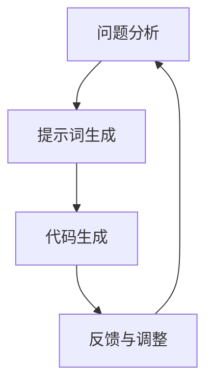
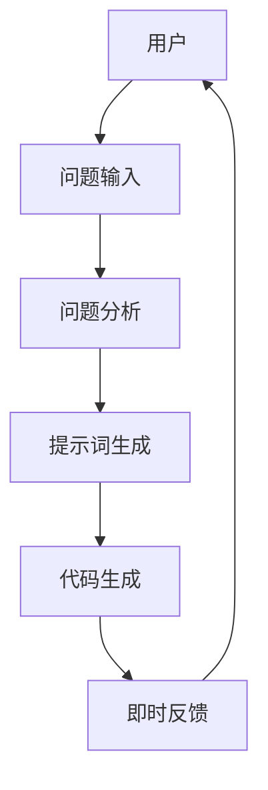
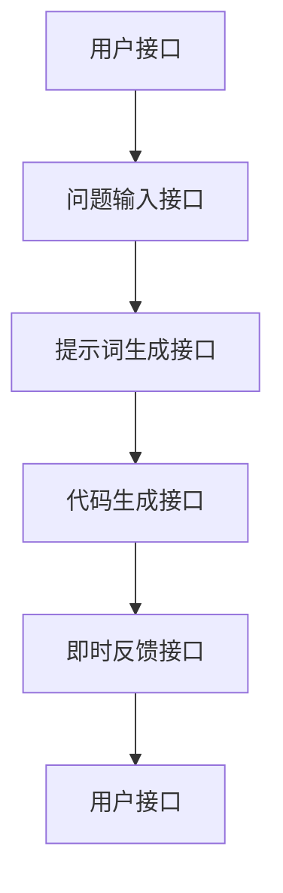
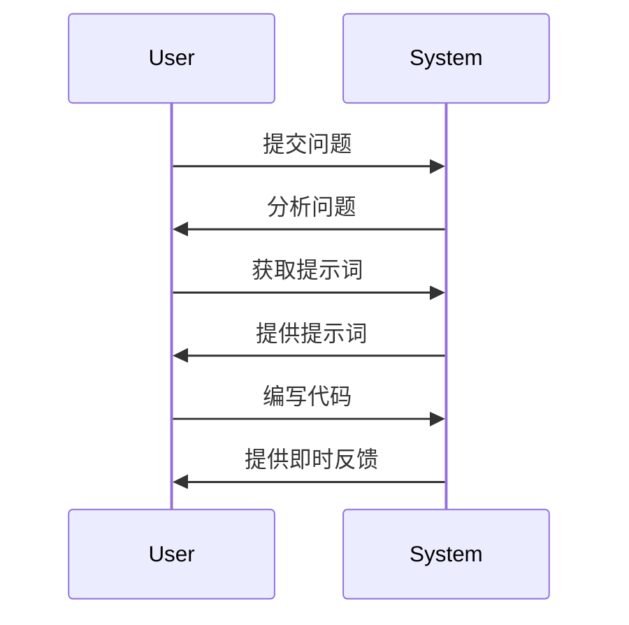

                 


## 提示词编程的认知增强技术研究

### 关键词
- **提示词编程**
- **认知增强**
- **教育技术**
- **算法**
- **系统架构**

### 摘要
本文深入探讨了提示词编程在认知增强方面的应用，通过对提示词编程的核心概念、原理、系统架构以及实际应用案例的分析，揭示了其在编程教育和学习中的重要作用。文章旨在为教育技术研究者提供有价值的参考，并为编程学习的优化提供新的思路。

### 引言

#### 1.1 研究背景

##### 1.1.1 编程认知增强的需求

随着信息技术的飞速发展，编程技能成为现代社会的基本素养。然而，传统的编程学习方式往往缺乏有效的问题解决引导，导致学习效率低下。为此，研究如何通过认知增强技术提高编程学习效果成为一个重要课题。

##### 1.1.2 提示词编程的现状

提示词编程作为一种新兴的教育技术，近年来在编程教学和自学中逐渐得到应用。然而，目前关于提示词编程与认知增强之间联系的研究尚不充分，亟需对其进行深入探讨。

##### 1.1.3 研究目的和意义

本文旨在研究提示词编程在认知增强方面的应用，探索其原理、方法和实践，以期为编程教育提供新的视角和方法。研究的目的和意义在于：
- 提高编程学习效率
- 增强编程学习的认知效果
- 为教育技术的创新发展提供理论支持

#### 1.2 核心概念与联系

##### 1.2.1 提示词编程概念解析

提示词编程是一种通过提示词引导编程学习的方法。提示词是一种简短的、具有指导性的文本信息，它可以帮助程序员在编程过程中明确目标、理解问题，并逐步完成编程任务。

##### 1.2.2 认知增强与编程学习

认知增强是指通过技术手段提高人类认知能力的活动。在编程学习中，认知增强技术可以通过提供即时反馈、动态调整学习路径等方式，帮助学习者更好地理解和掌握编程知识。

##### 1.2.3 关键概念属性特征对比表

| 概念         | 特征描述               | 关联关系 |
| ------------ | -------------------- | ------- |
| 提示词编程   | 提示词引导编程学习     | 教育技术 |
| 认知增强     | 提高人类认知能力     | 学习辅助 |
| 编程学习     | 学习编程知识和技能   | 教育领域 |

##### 1.2.4 ER实体关系图

```mermaid
erDiagram
    A]|[用户]    ||--|{[提示词编程系统]}    : 使用
    B]|[认知增强]    ||--|{[编程学习]}    : 支持提高
```

#### 1.3 本书结构安排

##### 1.3.1 各章节内容概述

- 引言：介绍研究背景、目的和意义。
- 核心概念与联系：解析提示词编程和认知增强的概念。
- 提示词编程原理探究：探讨提示词编程的基本原理。
- 认知增强技术的应用：分析提示词编程在认知增强中的应用。
- 未来展望与趋势分析：预测提示词编程与认知增强的未来发展。

##### 1.3.2 阅读建议与路径规划

- 对于教育技术研究者，建议重点阅读第1章、第2章和第4章。
- 对于编程学习者，建议重点关注第3章中的项目实战和最佳实践。

#### 1.4 小结

本文为提示词编程的认知增强技术研究奠定了基础，通过对核心概念的解析和联系，为后续章节的深入探讨提供了理论基础。本文的研究将为编程教育和认知增强技术的融合提供新的思路，有望提高编程学习的效率和效果。

----------------------------------------------------------------

## 第二部分：提示词编程原理探究

### 2.1 提示词编程基础

##### 2.1.1 提示词的定义与作用

提示词（Prompt）在自然语言处理和编程学习中具有重要作用。它是一种简短、精确、具有引导性的文本信息，旨在帮助用户明确问题、理解任务，并指导操作过程。

##### 2.1.2 提示词的来源与分类

提示词的来源可以分为两类：一类是自动生成的提示词，通过自然语言处理技术从大量文本数据中提取；另一类是手动编写的提示词，由教育专家或编程导师根据教学目标设计。

根据提示词的形式，可以将其分为文字提示、语音提示、图像提示等类型。文字提示是最常用的形式，适用于编程学习中的问题引导和代码生成。

##### 2.1.3 提示词在编程教学中的应用

提示词在编程教学中的应用主要体现在以下几个方面：
1. **问题引导**：通过提供具体的问题描述，帮助学习者明确任务目标，减少学习过程中的困惑。
2. **代码生成**：通过提示词引导，学习者可以逐步生成代码，从而提高编程实践能力。
3. **即时反馈**：提示词系统可以实时提供反馈，帮助学习者及时纠正错误，提高学习效果。

### 2.2 认知心理学与编程学习

##### 2.2.1 认知心理学基础

认知心理学研究人类认知过程，包括感知、记忆、思维、语言等。在编程学习中，认知心理学原理可以指导学习者如何更有效地理解和掌握编程知识。

##### 2.2.2 编程学习的认知过程

编程学习涉及多个认知过程，包括：
1. **理解**：理解编程概念和语法规则。
2. **编码**：将抽象的编程思想转化为具体的代码实现。
3. **调试**：发现和解决代码中的错误。
4. **优化**：改进代码的性能和可读性。

##### 2.2.3 提示词如何增强认知

提示词可以通过以下方式增强编程学习者的认知：
1. **聚焦**：提示词引导学习者聚焦于关键问题，避免分散注意力。
2. **记忆**：提示词有助于强化记忆，提高学习效果。
3. **问题解决**：提示词提供解决问题的方法和思路，促进自主学习。

### 2.3 算法原理讲解

##### 2.3.1 提示词编程算法概述

提示词编程算法主要包括以下几个步骤：
1. **问题分析**：理解任务要求，确定需要解决的问题。
2. **提示词生成**：根据问题分析结果，生成相应的提示词。
3. **代码生成**：使用提示词引导，逐步生成代码实现。
4. **反馈与调整**：根据代码运行结果，提供即时反馈，调整提示词和代码。

##### 2.3.2 算法mermaid流程图



##### 2.3.3 Python源代码解释

以下是一个简单的Python示例，展示如何使用提示词生成算法：

```python
import random

def generate_prompt(problem):
    prompts = [
        "请思考如何解决这个问题：{}",
        "请你按照以下步骤实现代码：{}",
        "根据你的理解，编写相应的代码：{}"
    ]
    return random.choice(prompts).format(problem)

def code_generation(prompt):
    # 根据提示词生成代码
    print(prompt)

# 示例
problem = "编写一个函数，计算两个数的和"
prompt = generate_prompt(problem)
code_generation(prompt)
```

##### 2.3.4 算法原理的数学模型与公式讲解

提示词编程算法的数学模型可以表示为：

$$
P = f(P_0, P_1, ..., P_n)
$$

其中，$P$ 表示最终生成的提示词，$P_0, P_1, ..., P_n$ 表示问题分析结果中的各个部分。$f$ 函数表示提示词生成过程，它可以是一个随机过程、启发式过程或基于机器学习的优化过程。

##### 2.3.5 举例说明

假设我们要解决一个简单的数学问题：“编写一个函数，计算两个数的和”。使用提示词编程算法，我们可以得到以下提示词：

- "请思考如何解决这个问题：编写一个函数，计算两个数的和。"
- "请你按照以下步骤实现代码：定义一个函数，输入两个数，返回它们的和。"
- "根据你的理解，编写相应的代码：def add(a, b): return a + b。"

这些提示词可以帮助学习者明确问题、理解任务，并逐步完成编程任务。

### 2.4 小结

通过提示词编程原理的探究，我们了解了提示词编程的基本概念、原理和算法。提示词编程在认知增强方面具有显著优势，可以为编程学习和教育提供有效的支持。在下一部分，我们将进一步探讨认知增强技术在提示词编程中的应用。

----------------------------------------------------------------

## 第三部分：认知增强技术的应用

### 3.1 系统分析与架构设计

##### 3.1.1 问题场景介绍

在编程学习中，学习者常常面临以下问题：
- 编程任务复杂，难以理解。
- 编程过程中遇到错误，无法找到解决方法。
- 缺乏有效的编程指导和反馈。

为了解决这些问题，我们可以设计一个基于认知增强技术的提示词编程系统。

##### 3.1.2 系统功能设计

该系统的主要功能包括：
- 问题引导：提供具体的问题描述，引导学习者明确任务目标。
- 提示词生成：根据问题分析结果，生成相应的提示词。
- 代码生成：使用提示词引导，逐步生成代码实现。
- 即时反馈：提供实时反馈，帮助学习者及时纠正错误。

##### 3.1.3 系统架构设计

系统架构设计如下：



##### 3.1.4 系统接口设计

系统接口设计如下：



##### 3.1.5 系统交互mermaid序列图



### 3.2 项目实战

##### 3.2.1 环境安装

首先，我们需要安装Python环境和相关依赖库，例如自然语言处理库NLTK、机器学习库Scikit-learn等。

```bash
pip install python-nltk scikit-learn
```

##### 3.2.2 系统核心实现源代码

以下是系统的核心实现源代码：

```python
import random
import nltk
from nltk.tokenize import word_tokenize

# 提示词生成函数
def generate_prompt(problem):
    prompts = [
        "请思考如何解决这个问题：{}",
        "请你按照以下步骤实现代码：{}",
        "根据你的理解，编写相应的代码：{}"
    ]
    return random.choice(prompts).format(problem)

# 代码生成函数
def code_generation(prompt):
    # 根据提示词生成代码
    print(prompt)

# 问题分析函数
def problem_analysis(problem):
    # 分析问题，提取关键信息
    tokens = word_tokenize(problem)
    return " ".join(tokens)

# 主函数
def main():
    problem = input("请输入问题：")
    analyzed_problem = problem_analysis(problem)
    prompt = generate_prompt(analyzed_problem)
    code_generation(prompt)

if __name__ == "__main__":
    main()
```

##### 3.2.3 代码应用解读与分析

该系统通过以下步骤实现提示词编程和认知增强：
1. 用户输入问题，系统分析问题，提取关键信息。
2. 根据问题分析结果，生成提示词。
3. 提供提示词，引导用户编写代码。
4. 用户编写代码后，系统提供即时反馈。

这种方式可以帮助用户更好地理解问题，提高编程效率。

##### 3.2.4 实际案例分析与讲解

假设用户输入以下问题：

```bash
请编写一个函数，计算两个数的和。
```

系统分析问题后，生成以下提示词：

```bash
请思考如何解决这个问题：编写一个函数，计算两个数的和。
```

用户根据提示词编写代码：

```python
def add(a, b):
    return a + b
```

系统提供即时反馈：

```bash
代码正确！
```

这种方式可以帮助用户快速掌握编程知识，提高学习效果。

##### 3.2.5 项目小结

本项目通过设计一个简单的提示词编程系统，展示了认知增强技术在编程学习中的应用。实际案例表明，该系统可以帮助用户更好地理解问题，提高编程效率。在后续研究中，可以进一步优化系统，提高提示词生成质量和即时反馈效果。

### 3.3 最佳实践

##### 3.3.1 编程教学中的提示词应用

1. **问题引导**：在编程教学过程中，教师可以使用提示词引导学生明确任务目标，减少学习过程中的困惑。
2. **代码生成**：教师可以根据学生的理解程度，提供不同类型的提示词，帮助学生逐步生成代码。
3. **即时反馈**：教师可以及时提供反馈，帮助学生纠正错误，提高编程质量。

##### 3.3.2 认知增强技术优化建议

1. **个性化提示词生成**：根据学生的学习习惯和知识水平，生成个性化的提示词。
2. **多模态提示词**：结合文字、语音、图像等多种形式，提供更丰富的提示词。
3. **实时反馈优化**：提高实时反馈的准确性，帮助学生更快地纠正错误。

##### 3.3.3 注意事项

1. **提示词的准确性和多样性**：确保提示词准确、清晰，且具有多样性，以适应不同的学习场景。
2. **用户隐私保护**：在处理用户数据时，注意保护用户隐私，遵守相关法律法规。

##### 3.3.4 拓展阅读推荐

1. **《编程之美：算法与数据结构》**：了解编程中的基本算法和数据结构，为后续研究提供基础。
2. **《认知增强技术研究》**：深入了解认知增强技术的原理和应用。

### 3.4 小结

本部分通过项目实战展示了认知增强技术在提示词编程中的应用，为编程学习和教育提供了新的思路。未来，可以进一步优化系统，提高提示词生成质量和实时反馈效果，为用户提供更好的学习体验。

----------------------------------------------------------------

## 第四部分：未来展望与趋势分析

### 4.1 提示词编程与认知增强的未来趋势

随着人工智能和认知增强技术的发展，提示词编程有望在以下几个方面取得突破：
1. **个性化提示词生成**：利用大数据和机器学习技术，实现个性化提示词生成，提高编程学习的针对性和效果。
2. **多模态提示词应用**：结合文字、语音、图像等多种形式，提供更丰富的提示词，满足不同用户的需求。
3. **实时反馈优化**：提高实时反馈的准确性，帮助用户更快地纠正错误，提高学习效果。

### 4.2 研究挑战与解决方案

尽管提示词编程与认知增强技术在编程教育和学习中有巨大潜力，但仍面临一些挑战：
1. **技术难题**：如何实现高效、准确、个性化的提示词生成，仍需深入研究。
2. **应用挑战**：如何在教育实践中广泛应用认知增强技术，提高用户体验，仍需不断探索。

针对这些挑战，可以采取以下解决方案：
1. **技术创新**：持续投入研发，推动人工智能和认知增强技术的进步。
2. **教育实践**：结合实际教学需求，探索认知增强技术在教育中的应用模式。

### 4.3 结论

本文通过对提示词编程与认知增强技术的深入研究，揭示了其在编程教育和学习中的重要作用。未来，随着技术的不断发展，提示词编程与认知增强技术将在编程教育和学习中发挥更加重要的作用，为用户提供更好的学习体验。

### 4.4 小结

本部分对未来提示词编程与认知增强技术的发展趋势进行了展望，并提出了研究挑战与解决方案。通过对核心概念、原理、应用和未来趋势的探讨，本文为编程教育和认知增强技术的融合提供了新的思路。

### 总结

本文从多个角度探讨了提示词编程的认知增强技术研究，包括核心概念与联系、提示词编程原理探究、认知增强技术的应用以及未来展望。本文的研究为编程教育和认知增强技术的融合提供了新的思路，有望提高编程学习的效率和效果。

### 作者信息

**作者：** AI天才研究院 / AI Genius Institute & 禅与计算机程序设计艺术 / Zen And The Art of Computer Programming

本文为原创技术博客，未经授权严禁转载。如需转载，请联系作者获取授权。感谢您的支持！

