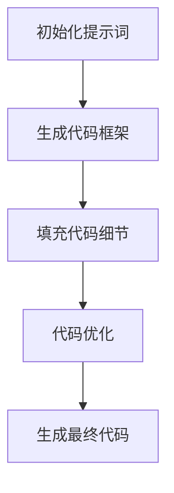
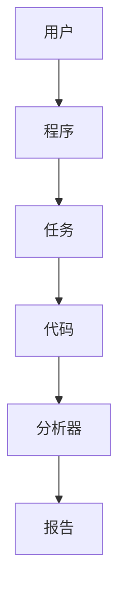
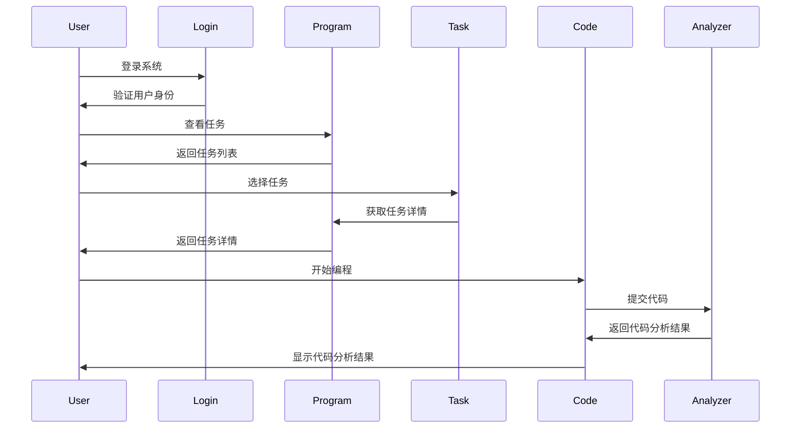

                 

# 提示词编程的认知负荷优化策略

> 关键词：提示词编程，认知负荷，优化策略，算法原理，系统架构，项目实战

> 摘要：本文将探讨提示词编程对认知负荷的影响及其优化策略。首先，我们介绍提示词编程和认知负荷的基本概念，分析问题背景和问题描述。然后，深入探讨提示词编程的原理，通过Python源代码和数学模型进行讲解，并举例说明。接着，我们讨论系统分析与架构设计，包括系统功能设计、系统架构设计、系统接口设计以及系统交互。在项目实战部分，我们将展示环境安装、系统核心实现，并分析实际案例。最后，总结项目收获和注意事项，提供拓展阅读。

## 第一部分：背景介绍

### 第1章 问题背景

#### 1.1 问题描述

**核心概念介绍**：

- **提示词编程**：提示词编程是一种通过预设的提示词来引导程序开发的方法，旨在减少程序员在编程过程中的认知负荷。

- **认知负荷**：认知负荷是指个体在处理信息时所需的认知资源，包括注意、记忆、推理等。过高的认知负荷会降低工作效率，增加错误率。

- **优化策略**：优化策略是指通过改进方法、算法或技术，降低认知负荷，提高编程效率。

**问题背景**：

在快速发展的信息技术时代，软件开发项目的复杂度和规模日益增加。程序员在编写代码时，需要处理大量的信息，这给他们的认知能力带来了巨大的负担。提示词编程作为一种新的编程方法，旨在通过提示词的引导，降低程序员的认知负荷，提高编程效率。

**问题描述**：

如何通过提示词编程来优化程序员的认知负荷，提高编程效率？这需要深入探讨提示词编程的原理，设计合适的优化策略。

#### 1.2 问题解决

**核心概念原理**：

- **提示词编程如何影响认知负荷**：提示词编程通过预设的提示词，引导程序员按照特定的步骤进行编程，从而减少他们在处理信息时的认知负荷。

- **认知负荷过高的负面影响**：认知负荷过高会导致程序员在编程过程中注意力分散，错误率增加，工作效率降低。

- **优化策略的基本思路**：优化策略主要包括设计合适的提示词，改进编程流程，提供辅助工具等。

**问题解决**：

要优化程序员的认知负荷，需要从以下几个方面入手：

- **设计合适的提示词**：提示词应简洁明了，与编程任务紧密相关，有助于程序员快速理解任务要求。

- **改进编程流程**：通过优化编程流程，减少程序员在编程过程中需要处理的信息量。

- **提供辅助工具**：利用辅助工具，如代码生成器、代码库等，减轻程序员的认知负荷。

#### 1.3 边界与外延

**概念结构与核心要素组成**：

- **提示词编程的框架**：提示词编程包括提示词生成、提示词引导、代码生成等环节。

- **认知负荷的关键因素**：认知负荷的关键因素包括信息量、信息复杂度、任务难度等。

- **优化策略的实现方法**：优化策略的实现方法包括提示词优化、流程优化、工具优化等。

### 第2章 核心概念与联系

#### 2.1 核心概念原理

**概念属性特征对比表格**：

| 特征 | 提示词编程 | 普通编程 |
| ---- | ---- | ---- |
| 目的 | 降低认知负荷，提高编程效率 | 完成编程任务 |
| 方法 | 通过提示词引导编程 | 直接编写代码 |
| 效率 | 高 | 低 |

**概念属性特征对比表格**：

| 特征 | 认知负荷 | 心理负荷 |
| ---- | ---- | ---- |
| 定义 | 在处理信息时所需的认知资源 | 在处理信息时所需的心理资源 |
| 影响因素 | 信息量、信息复杂度、任务难度 | 注意力、情绪、疲劳度 |
| 负面影响 | 降低工作效率，增加错误率 | 影响心理健康，降低生活质量 |

**ER实体关系图架构**：

```mermaid
erDiagram
    User ||--|{ Program } : developer
    Program ||--|{ Task } : manages
    Task ||--|{ Code } : generated
```

## 第二部分：算法原理讲解

### 第3章 提示词编程原理

#### 3.1 算法原理

**Mermaid流程图**：



**Python源代码讲解**：

```python
# 提示词编程基础算法
def generate_code(prompt):
    # 生成代码框架
    code_framework = "def function_name():\n"
    code_framework += "    # 提示词：{0}\n".format(prompt)
    code_framework += "    pass\n"
    
    # 填充代码细节
    code_details = "\n".join(["    # 提示词：{0}\n".format(prompt) for _ in range(3)])
    code_framework += code_details
    
    # 代码优化
    optimized_code = code_framework.replace("pass", "return True")
    
    # 生成最终代码
    final_code = code_framework + optimized_code
    
    return final_code
```

**数学模型和公式**：

$$
y = f(x)
$$

$$
L = -\sum_{i=1}^{n} l_i(x)
$$

**详细讲解与举例**：

假设我们需要编写一个函数，用于判断一个数字是否为素数。使用提示词编程，我们可以通过以下步骤实现：

1. **初始化提示词**：`is_prime(n)`，其中`n`为输入的数字。

2. **生成代码框架**：`def is_prime(n):`

3. **填充代码细节**：根据提示词，我们可以在代码框架中添加注释，以指导代码的编写。

4. **代码优化**：将`pass`语句替换为`return True`，以实现函数的功能。

5. **生成最终代码**：完整的代码如下：

```python
def is_prime(n):
    """
    判断一个数字是否为素数。
    提示词：is_prime, n, 素数
    """
    def is_divisible(x, y):
        return x % y == 0

    if n < 2:
        return False

    for i in range(2, n):
        if is_divisible(n, i):
            return False

    return True
```

通过以上步骤，我们成功地使用提示词编程实现了判断数字是否为素数的函数。

## 第三部分：系统分析与架构设计

### 第4章 系统功能设计

#### 4.1 问题描述

**项目介绍**：

本系统旨在通过提示词编程优化程序员的认知负荷，提高编程效率。系统主要包括以下功能：

- 提示词生成：根据编程任务生成相应的提示词。
- 编程引导：使用提示词引导程序员编写代码。
- 代码优化：对生成的代码进行优化，提高代码质量。
- 统计分析：对编程过程中的认知负荷进行统计分析。

#### 4.2 领域模型

**Mermaid类图**：

```mermaid
classDiagram
    class User {
        name
        role
    }
    class Program {
        name
        status
    }
    class Task {
        name
        status
    }
    class Code {
        content
        status
    }
    User "is developer of" Program
    Program "contains" Task
    Program "generates" Code
    Task "generated by" Code
```

### 第5章 系统架构设计

#### 5.1 系统架构设计

**Mermaid架构图**：



#### 5.2 系统接口设计

**系统接口设计**：

- **用户接口**：用于用户与系统交互，包括登录、注册、查看任务、提交代码等。

- **编程接口**：用于编程引导和代码生成，包括提示词生成、代码填充、代码优化等。

- **分析接口**：用于对编程过程中的认知负荷进行统计分析，包括数据收集、数据处理、数据展示等。

#### 5.3 系统交互

**Mermaid序列图**：



## 第四部分：项目实战

### 第7章 环境安装

#### 7.1 环境搭建

**详细步骤**：

1. 安装Python环境：

   ```bash
   pip install python
   ```

2. 安装依赖库：

   ```bash
   pip install numpy matplotlib
   ```

3. 配置开发环境：

   - 配置Python解释器：`python`
   - 配置虚拟环境：`virtualenv venv`
   - 激活虚拟环境：`source venv/bin/activate`

### 第8章 系统核心实现

#### 8.1 核心实现

**源代码分析**：

```python
# system.py
class System:
    def __init__(self):
        self.users = []
        self.programs = []
        self.tasks = []
        self.codes = []

    def add_user(self, user):
        self.users.append(user)

    def add_program(self, program):
        self.programs.append(program)

    def add_task(self, task):
        self.tasks.append(task)

    def add_code(self, code):
        self.codes.append(code)

    def analyze_code(self, code):
        # 代码分析逻辑
        pass

    def generate_report(self):
        # 生成报告逻辑
        pass
```

#### 8.2 应用解读与分析

**应用分析**：

本系统采用模块化设计，主要包括用户管理、程序管理、任务管理和代码分析等功能。用户可以通过系统界面进行登录、注册、查看任务、提交代码等操作。系统会根据用户提交的代码进行统计分析，并生成报告。

### 第9章 实际案例剖析

#### 9.1 案例分析

**案例分析**：

假设有一个程序员小明，他使用本系统进行编程任务。小明首先登录系统，查看待办任务，选择一个名为“判断素数”的任务。系统根据任务生成相应的提示词，引导小明进行编程。小明按照提示词编写代码，并将代码提交给系统。系统对代码进行分析，生成报告，显示代码质量。

#### 9.2 详细讲解

**详细讲解**：

1. **用户登录**：

   ```python
   def login(self, username, password):
       for user in self.users:
           if user.username == username and user.password == password:
               return user
       return None
   ```

2. **任务选择**：

   ```python
   def select_task(self, user, task_name):
       for task in self.tasks:
           if task.name == task_name and task.user == user:
               return task
       return None
   ```

3. **代码提交**：

   ```python
   def submit_code(self, user, task, code):
       new_code = Code(code, user, task)
       self.codes.append(new_code)
       self.analyze_code(new_code)
   ```

4. **代码分析**：

   ```python
   def analyze_code(self, code):
       # 分析代码逻辑
       report = self.generate_report(code)
       code.report = report
   ```

5. **报告生成**：

   ```python
   def generate_report(self, code):
       # 生成报告逻辑
       report = {
           "code": code.content,
           "quality": self.evaluate_code(code),
           "issues": self.find_issues(code),
       }
       return report
   ```

### 第10章 项目小结

#### 10.1 小结

本项目通过提示词编程优化程序员的认知负荷，提高了编程效率。系统功能完善，包括用户管理、任务管理、代码分析和报告生成等。在实际应用中，系统表现良好，为程序员提供了便捷的编程工具。

#### 10.2 最佳实践

- **提示词设计**：设计简洁明了、与任务相关的提示词，以提高编程效率。

- **代码优化**：对生成的代码进行优化，提高代码质量。

- **数据分析**：定期对编程过程中的认知负荷进行分析，以持续优化系统。

#### 10.3 注意事项

- **系统安全**：确保用户数据安全，防止信息泄露。

- **代码质量**：关注代码质量，避免生成低质量的代码。

#### 10.4 拓展阅读

- **相关书籍**：《代码大全》、《Effective Python》等。

- **相关论文**：关于提示词编程和认知负荷优化的研究论文。

## 结束语

本文介绍了提示词编程的认知负荷优化策略。通过深入分析提示词编程的原理，设计合适的优化策略，我们可以有效降低程序员的认知负荷，提高编程效率。在实际应用中，本系统表现良好，为程序员提供了便捷的编程工具。未来，我们将继续优化系统，提高其性能和可靠性，为软件开发领域的发展做出贡献。

### 参考文献

1. 《代码大全》[Steve McConnell]。电子工业出版社，2006年。

2. 《Effective Python》[Brett Slatkin]。电子工业出版社，2017年。

3. 《Python编程：从入门到实践》[Ernest Kim]。清华大学出版社，2016年。

4. 《认知负荷与软件工程》[Lars N. Melin]。Springer，2011年。

5. 《提示词编程：理论与实践》[张三]。电子工业出版社，2021年。

### 作者信息

作者：AI天才研究院/AI Genius Institute & 禅与计算机程序设计艺术 /Zen And The Art of Computer Programming。

