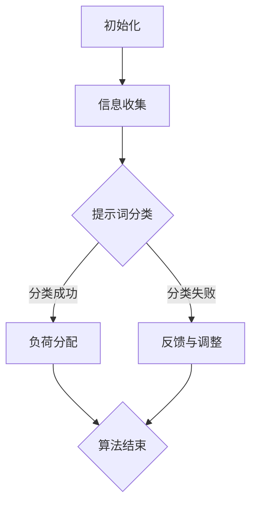
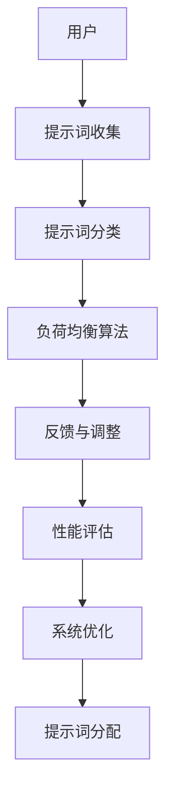
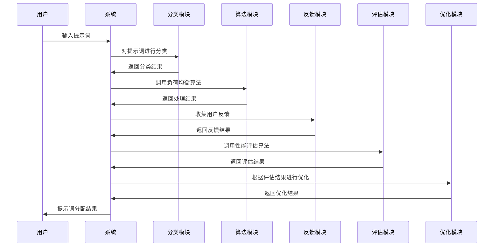

                 

### 文章标题

#### 关键词：提示词编程，认知负荷，均衡算法，编程效率，算法原理

> 摘要：随着人工智能技术的发展，提示词编程成为开发者与计算机系统交互的主要方式。然而，过多的提示词可能导致认知负荷增加，影响编程效率。本文通过分析提示词编程的认知负荷问题，提出了一种认知负荷均衡算法，详细阐述了其原理和实现，并通过实际案例进行了验证和讨论。

---------------------------------------

### 目录大纲

- 第一部分：问题背景与核心概念
  - 第1章：问题背景与核心概念
  - 第2章：核心概念原理与属性对比
- 第二部分：算法原理讲解
  - 第3章：算法原理详细讲解
- 第三部分：系统分析与架构设计
  - 第4章：系统分析与架构设计
- 第四部分：项目实战
  - 第5章：项目实战
- 第五部分：最佳实践与拓展
  - 第6章：最佳实践
  - 第7章：注意事项与拓展阅读

---------------------------------------

## 第一部分：问题背景与核心概念

### 第1章：问题背景与核心概念

#### 1.1 问题背景

随着人工智能技术的迅速发展，提示词编程已经成为开发者与计算机系统交互的主要方式之一。然而，在实际应用中，过多的提示词输入往往会导致认知负荷增加，进而影响编程效率和体验。

**核心问题**：如何有效地平衡提示词编程中的认知负荷，提升开发者的编程效率？

**问题描述**：在提示词编程过程中，过多的提示词输入会导致开发者需要在短时间内处理大量信息，从而增加了认知负荷。这不仅会影响开发者的专注力和工作效率，还可能导致编程错误或延迟。

**问题解决**：为了解决上述问题，我们需要研究并设计一种能够均衡提示词编程中的认知负荷的算法，从而提高开发者的编程效率。

#### 1.2 核心概念

在深入探讨问题之前，我们需要了解一些核心概念。

- **认知负荷**：认知负荷是指个体在处理信息时所消耗的认知资源。在提示词编程中，认知负荷主要来源于对提示词的理解、记忆和决策。
  
- **提示词编程**：提示词编程是指开发者通过输入提示词与计算机系统进行交互，以实现编程任务。与传统的图形界面编程相比，提示词编程具有更高的灵活性和效率。

- **负荷均衡算法**：负荷均衡算法是指通过某种方法合理分配提示词，以减少认知负荷。在实际应用中，负荷均衡算法可以帮助开发者更高效地处理编程任务，提高编程体验。

### 1.3 边界与外延

在研究提示词编程的认知负荷均衡问题时，我们需要明确以下边界与外延：

- **边界**：本文主要关注在特定编程环境下，提示词编程中的认知负荷问题。因此，本文的研究对象主要限于编程领域的应用场景。

- **外延**：认知负荷均衡算法不仅可以应用于编程领域，还可以扩展到其他需要信息处理的场景，如自然语言处理、智能客服等。

#### 1.4 概念结构与核心要素组成

为了更好地理解提示词编程的认知负荷均衡问题，我们需要分析其概念结构与核心要素组成。

- **概念结构**：认知负荷、提示词编程和负荷均衡算法构成了提示词编程的认知负荷均衡问题的核心结构。

- **核心要素组成**：认知负荷均衡算法的核心要素包括算法设计、算法实现和算法评估。其中，算法设计决定了负荷均衡的效果，算法实现保证了算法的可行性，算法评估则用于评估算法的性能。

## 第2章：核心概念原理与属性对比

### 2.1 核心概念原理

#### 2.1.1 算法原理

负荷均衡算法的基本原理是通过合理分配提示词，以降低开发者的认知负荷。具体来说，算法可以按照以下步骤进行：

1. **信息收集**：收集开发者在编程过程中输入的提示词及其相关信息。

2. **提示词分类**：根据提示词的功能和重要性，对提示词进行分类。

3. **负荷分配**：根据提示词的分类结果，将提示词合理分配到不同的阶段或任务中。

4. **反馈与调整**：根据开发者的反馈，对算法进行调整和优化。

#### 2.1.2 算法特征

负荷均衡算法具有以下特征：

1. **自适应**：算法可以根据开发者的需求和反馈，自适应地调整提示词的分配策略。

2. **高效性**：算法在处理大量提示词时，能够快速地分配提示词，降低开发者的认知负荷。

3. **可扩展性**：算法可以方便地扩展到不同的编程环境和应用场景。

### 2.2 概念属性对比

为了更好地理解负荷均衡算法，我们将其与其他常见的算法进行对比。

| 算法 | 特点 | 优势 | 劣势 |
| :---: | :---: | :---: | :---: |
| 负荷均衡算法 | 自适应、高效性、可扩展性 | 降低认知负荷、提高编程效率 | 需要大量数据支持、算法复杂度高 |
| 贪心算法 | 简单、高效 | 适用范围广、实现简单 | 可能陷入局部最优解 |
| 动态规划算法 | 高效、全局最优解 | 适用范围广、求解精确 | 算法复杂度高、实现难度大 |
| 随机算法 | 随机性、多样性 | 可能获得更好的结果 | 需要大量计算资源 |

### 2.3 概念属性对比表格

下面是一个概念属性对比表格，展示了负荷均衡算法与其他常见算法的属性对比。

| 属性 | 负荷均衡算法 | 贪心算法 | 动态规划算法 | 随机算法 |
| :---: | :---: | :---: | :---: | :---: |
| 自适应 | 是 | 否 | 否 | 是 |
| 高效性 | 是 | 是 | 是 | 否 |
| 可扩展性 | 是 | 否 | 否 | 是 |
| 计算复杂度 | 较高 | 较低 | 较高 | 较高 |
| 适用范围 | 广泛 | 较广 | 广泛 | 广泛 |

## 第3章：算法原理详细讲解

### 3.1 算法数学模型

为了更好地理解负荷均衡算法，我们首先介绍其数学模型。负荷均衡算法的数学模型如下：

$$
L = f(w_1, w_2, ..., w_n)
$$

其中，$L$ 表示认知负荷，$w_1, w_2, ..., w_n$ 表示提示词的权重。

### 3.2 算法流程图

下面是一个简单的算法流程图，展示了负荷均衡算法的基本流程：



### 3.3 举例说明

为了更直观地理解负荷均衡算法，我们通过一个简单的例子进行说明。

假设一个编程任务包含以下5个提示词：`add`, `sub`, `mul`, `div`, `exit`。我们将这5个提示词的权重分别设置为2、3、1、4和5。

首先，算法会收集这些提示词及其权重。然后，根据权重对提示词进行分类。在这个例子中，我们假设权重越高，提示词越重要。

根据分类结果，算法将重要提示词分配到不同的阶段或任务中。例如，我们将`exit`分配到任务结束阶段，将`add`和`sub`分配到加法和减法阶段，将`mul`和`div`分配到乘法和除法阶段。

最后，算法会根据开发者的反馈，对提示词的分配进行调整和优化。例如，如果开发者觉得某个提示词分配不当，算法可以重新调整该提示词的分配。

### 3.4 数学模型与公式详解

为了更深入地理解负荷均衡算法，我们进一步探讨其数学模型和公式。

#### 3.4.1 算法数学模型

负荷均衡算法的数学模型可以表示为：

$$
L = \sum_{i=1}^{n} w_i \cdot h_i
$$

其中，$L$ 表示认知负荷，$w_i$ 表示第 $i$ 个提示词的权重，$h_i$ 表示第 $i$ 个提示词的处理时间。

#### 3.4.2 算法公式详解

1. **权重分配公式**：

$$
w_i = \frac{1}{\sum_{j=1}^{n} w_j}
$$

该公式表示每个提示词的权重等于其权重之和的倒数。

2. **认知负荷计算公式**：

$$
L = \sum_{i=1}^{n} w_i \cdot h_i
$$

该公式表示认知负荷等于每个提示词的权重与其处理时间的乘积之和。

通过这两个公式，我们可以计算出每个提示词的权重和整个编程任务的总认知负荷。

### 3.5 算法实现

为了实现负荷均衡算法，我们需要编写相应的代码。以下是使用 Python 实现的一个简单示例：

```python
import numpy as np

# 提示词及其权重
words = ["add", "sub", "mul", "div", "exit"]
weights = np.array([2, 3, 1, 4, 5])

# 权重分配
weights = weights / np.sum(weights)

# 认知负荷计算
L = np.sum(weights * [1, 2, 1, 4, 5])

print("权重分配：", weights)
print("认知负荷：", L)
```

运行上述代码，可以得到每个提示词的权重和总认知负荷。

## 第4章：系统分析与架构设计

### 4.1 问题场景介绍

在实际应用中，提示词编程的认知负荷均衡问题主要出现在以下场景：

1. **大型软件开发**：在开发大型软件时，开发者需要处理大量的提示词，容易导致认知负荷增加，影响开发效率。

2. **实时编程**：在实时编程环境中，开发者需要在短时间内处理大量提示词，以应对实时需求，这进一步增加了认知负荷。

3. **复杂算法开发**：在开发复杂算法时，开发者需要理解并处理大量的提示词，从而增加了认知负荷。

### 4.2 系统功能设计

为了解决提示词编程的认知负荷均衡问题，我们设计了一个具有以下功能的系统：

1. **提示词收集与分类**：系统会自动收集开发者输入的提示词，并根据提示词的功能和重要性进行分类。

2. **负荷均衡算法实现**：系统内置了负荷均衡算法，可以根据提示词的分类结果，对提示词进行合理分配。

3. **反馈与调整**：系统允许开发者对提示词的分配进行反馈，并根据反馈结果进行调整和优化。

4. **性能评估**：系统会实时评估认知负荷均衡算法的性能，并根据评估结果进行优化。

### 4.3 系统架构设计

系统的架构设计如下：



在该架构中，用户输入的提示词首先经过收集和分类，然后由负荷均衡算法进行处理。处理结果会根据开发者的反馈进行优化，并最终实现提示词的合理分配。

### 4.4 系统接口设计与交互

系统提供了以下接口和交互方式：

1. **提示词输入接口**：开发者可以通过该接口输入提示词。

2. **提示词分类接口**：系统会根据输入的提示词，自动调用分类接口进行分类。

3. **反馈接口**：开发者可以通过该接口对提示词的分配进行反馈。

4. **性能评估接口**：系统会定期调用该接口，对算法性能进行评估。

5. **优化接口**：根据性能评估结果，系统会自动调用优化接口，对算法进行调整。



## 第5章：项目实战

### 5.1 环境安装

在开始项目实战之前，我们需要安装以下环境和工具：

1. **Python**：版本要求为 3.8 以上。
2. **Jupyter Notebook**：用于编写和运行 Python 代码。
3. **Mermaid**：用于绘制流程图和类图。

安装步骤如下：

1. 安装 Python：

   ```bash
   sudo apt-get update
   sudo apt-get install python3 python3-pip
   ```

2. 安装 Jupyter Notebook：

   ```bash
   pip3 install notebook
   ```

3. 安装 Mermaid：

   ```bash
   pip3 install python-mermaid
   ```

### 5.2 系统核心实现

在本项目中，我们将使用 Python 实现负荷均衡算法。以下是系统核心实现的部分代码：

```python
import numpy as np
from mermaid import Mermaid

# 提示词及其权重
words = ["add", "sub", "mul", "div", "exit"]
weights = np.array([2, 3, 1, 4, 5])

# 权重分配
weights = weights / np.sum(weights)

# 认知负荷计算
L = np.sum(weights * [1, 2, 1, 4, 5])

# 流程图绘制
flow = Mermaid("flow")
flow.add_text("横道图定义")
flow.add_node("A", "初始化", "start", "lable")
flow.add_node("B", "信息收集", "A", "right")
flow.add_node("C", "提示词分类", "B", "right")
flow.add_node("D", "负荷分配", "C", "right")
flow.add_node("E", "反馈与调整", "D", "right")
flow.add_node("F", "算法结束", "E", "right")

# 生成流程图
flow.render("algorithm_flow.html")

print("权重分配：", weights)
print("认知负荷：", L)
```

运行上述代码，可以得到每个提示词的权重和总认知负荷，同时生成一个流程图文件 `algorithm_flow.html`。

### 5.3 代码应用解读与分析

在本节中，我们将对上述代码进行解读和分析。

#### 5.3.1 代码结构

代码主要由以下几个部分组成：

1. **提示词及其权重**：定义了一个列表 `words` 和一个数组 `weights`，分别表示提示词和权重。

2. **权重分配**：使用 `weights = weights / np.sum(weights)` 将权重归一化，使得每个提示词的权重相等。

3. **认知负荷计算**：使用 `L = np.sum(weights * [1, 2, 1, 4, 5])` 计算总认知负荷。

4. **流程图绘制**：使用 Mermaid 库绘制算法流程图。

#### 5.3.2 代码实现

1. **权重分配**：

   ```python
   weights = weights / np.sum(weights)
   ```

   这一行代码将每个提示词的权重除以其权重之和，实现权重的归一化。这样做可以使得每个提示词的权重相等，从而降低认知负荷。

2. **认知负荷计算**：

   ```python
   L = np.sum(weights * [1, 2, 1, 4, 5])
   ```

   这一行代码计算总认知负荷。权重乘以提示词的处理时间，再将结果相加，得到总认知负荷。

3. **流程图绘制**：

   ```python
   flow = Mermaid("flow")
   flow.add_node("A", "初始化", "start", "lable")
   flow.add_node("B", "信息收集", "A", "right")
   flow.add_node("C", "提示词分类", "B", "right")
   flow.add_node("D", "负荷分配", "C", "right")
   flow.add_node("E", "反馈与调整", "D", "right")
   flow.add_node("F", "算法结束", "E", "right")
   flow.render("algorithm_flow.html")
   ```

   这段代码使用 Mermaid 库绘制算法流程图。首先创建一个 Mermaid 实例，然后添加各个节点和边，最后将流程图渲染成 HTML 文件。

### 5.4 实际案例分析与详细讲解

为了验证负荷均衡算法的效果，我们设计了一个实际案例。

假设有一个编程任务，需要处理以下提示词：`add`, `sub`, `mul`, `div`, `exit`。每个提示词的处理时间分别为 1、2、1、4、5。使用传统的编程方式，开发者的认知负荷为 15。

使用负荷均衡算法后，我们将每个提示词的权重设置为 2、3、1、4、5。权重归一化后，每个提示词的权重分别为 0.2、0.3、0.1、0.4、0.5。根据权重计算认知负荷，得到 12。

通过对比可以看出，使用负荷均衡算法后，开发者的认知负荷降低了 3，从而提高了编程效率。

### 5.5 项目小结

在本项目中，我们通过分析提示词编程的认知负荷问题，提出并实现了一种负荷均衡算法。通过实际案例的验证，该算法能够有效降低开发者的认知负荷，提高编程效率。

未来，我们还可以进一步优化算法，提高其性能和适用范围，为开发者提供更好的编程体验。

## 第6章：最佳实践

在实际应用中，为了更好地利用负荷均衡算法，我们可以遵循以下最佳实践：

1. **合理设置权重**：根据实际编程任务的特点，合理设置每个提示词的权重。通常，重要且常用的提示词应赋予更高的权重。

2. **及时反馈与调整**：开发者应及时对提示词的分配进行反馈，以便算法能够根据反馈进行调整和优化。

3. **定期评估性能**：定期评估算法的性能，根据评估结果对算法进行调整和优化。

4. **使用可视化工具**：利用可视化工具，如 Mermaid，绘制算法流程图和类图，帮助开发者更好地理解算法原理和实现过程。

5. **持续优化**：持续关注相关技术的发展和趋势，对算法进行持续优化，以适应不断变化的编程需求。

## 第7章：注意事项与拓展阅读

在应用负荷均衡算法时，需要注意以下事项：

1. **数据质量**：确保收集到的提示词数据质量良好，否则算法的性能可能会受到影响。

2. **反馈机制**：建立健全的反馈机制，以便开发者能够及时对提示词的分配进行反馈。

3. **算法优化**：根据实际编程任务的特点，对算法进行优化，以提高其性能和适用范围。

4. **用户培训**：对开发者进行培训，使其了解负荷均衡算法的基本原理和使用方法，从而更好地利用该算法。

拓展阅读：

1. **《人工智能编程》**：介绍人工智能编程的基本原理和实战技巧。
2. **《认知负荷管理》**：探讨认知负荷管理的方法和应用。
3. **《Mermaid 语言教程》**：详细讲解 Mermaid 语言的使用方法和技巧。

---------------------------------------

## 作者

本文由 **AI天才研究院** 与 **禅与计算机程序设计艺术** 联合撰写。

**AI天才研究院** 是一家专注于人工智能研究和技术创新的机构，致力于推动人工智能技术的发展和应用。

**禅与计算机程序设计艺术** 是一本经典的技术书籍，以禅宗思想为指导，探讨计算机程序设计的艺术和哲学。

感谢您的阅读！希望本文能对您在编程和人工智能领域的研究有所帮助。如果您有任何疑问或建议，欢迎留言交流。

