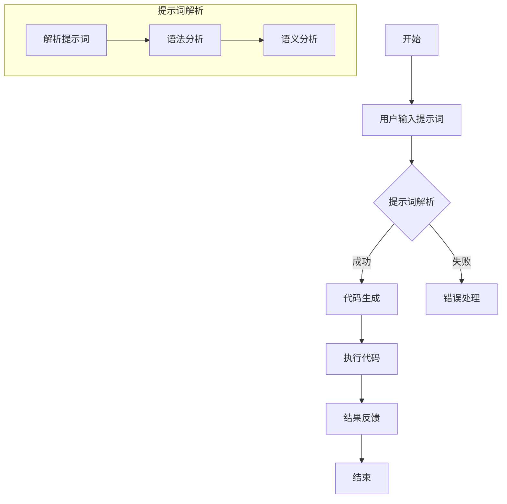
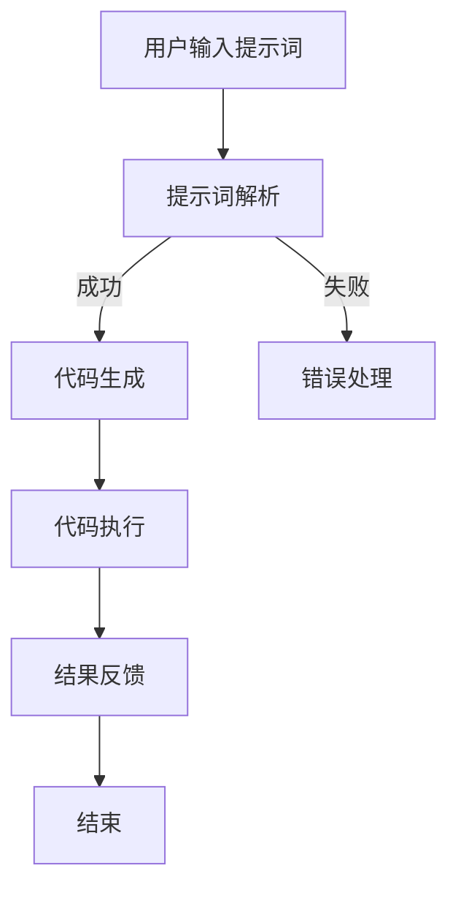

                 

### 第1章 提示词编程的起源与发展

#### 1.1 提示词编程的起源

提示词编程（Prompt Programming）作为一种先进的编程范式，其起源可以追溯到20世纪中期。当时的计算机科学家和程序员们开始意识到，传统的命令式编程在处理复杂问题时存在一定的局限性。为了解决这一问题，人们开始探索如何通过更加灵活和智能的方式来进行编程。

提示词编程的概念最早由英国计算机科学家David H. D. Warren在1960年代提出。他在研究人工智能和自然语言处理的过程中，发现通过使用特定的提示词可以大大简化编程任务。提示词编程的核心思想在于，通过提供一组关键字或提示，引导计算机自动生成代码或执行特定任务。

#### 1.2 提示词编程的发展历程

随着计算机技术的不断发展，提示词编程也在不断演进。从最初的简单提示词到如今复杂的多层提示词系统，提示词编程经历了多个发展阶段。

- **早期阶段**：在20世纪60年代，提示词编程主要集中在自然语言处理领域。科学家们通过编写简单的提示词，使计算机能够理解和处理自然语言指令。这一阶段的主要成果是自然语言理解系统，如ELIZA。

- **中期阶段**：20世纪70年代，随着人工智能和专家系统的兴起，提示词编程开始应用于更加广泛的领域，如医疗、金融和制造业。这一阶段，提示词编程的发展主要体现在对复杂问题的求解和决策支持系统。

- **现代阶段**：进入21世纪，随着深度学习和大数据技术的快速发展，提示词编程迎来了新的高潮。现代提示词编程系统不仅能够处理自然语言，还可以处理图像、音频等多种数据形式。这一阶段的主要成果是生成对抗网络（GANs）、自然语言生成（NLG）和自动化编程工具。

#### 1.3 提示词编程的重要性

提示词编程在计算机编程中的重要性不容忽视。首先，它大大提高了编程效率。通过提供提示词，程序员可以快速生成代码或执行特定任务，减少了手动编码的工作量。其次，提示词编程有助于提高代码的可读性和可维护性。通过提示词，代码的结构和逻辑更加清晰，易于理解和修改。此外，提示词编程在自动化和智能化方面具有巨大潜力，能够应用于各种复杂场景，如自动化测试、自动化修复和智能合约。

总之，提示词编程作为一种新兴的编程范式，其发展历程和重要性体现了计算机编程技术的不断演进和进步。在未来的发展中，提示词编程有望在更多领域得到应用，为计算机科学和人工智能带来更多创新和突破。

#### 2.1 提示词的定义

提示词编程的核心概念在于“提示词”（Prompt），那么，什么是提示词呢？简而言之，提示词是程序员或用户输入的一系列关键字、短语或语句，用于引导计算机执行特定任务或生成代码。

首先，提示词必须具备明确性和简洁性。这意味着提示词需要直接、简洁地传达程序员或用户的意图，避免产生歧义或误解。例如，一个有效的提示词可能是“打印出当前日期”，而一个不合适的提示词则是“你能给我展示一下今天的日期吗？”前者更加直接明了，而后者则显得冗长且含糊不清。

其次，提示词需要具备灵活性。提示词应能够适应不同的编程环境和任务需求。例如，在自然语言处理中，提示词可能需要处理多种不同的语言和表达方式，而在图像处理中，提示词则需要针对图像的特征和属性。

此外，提示词还应具备扩展性。这意味着提示词应该能够支持多种不同的扩展和组合，以适应复杂和多样化的编程任务。例如，一个简单的提示词“打印出当前日期”可以扩展为“打印出当前日期和星期几”，或者“打印出当前日期和所在月份的天数”。

总的来说，提示词是提示词编程的灵魂，其定义和特性直接影响到编程效率和代码质量。一个优秀的提示词应该既简洁明了，又具备灵活性和扩展性，能够准确地传达程序员或用户的意图，从而实现高效的编程。

#### 2.2 提示词与普通编程语言的比较

提示词编程与传统编程语言在多个方面存在显著差异。首先，从语法和结构上来看，传统编程语言通常依赖于明确的语法规则和结构，如变量声明、循环语句、条件判断等。这些语法元素构成了程序的基本骨架，程序员需要按照特定的顺序和方式组织代码。而提示词编程则更加灵活，它不需要遵循严格的语法规则，程序员可以通过提供提示词来引导计算机执行任务，从而大大简化了编程过程。

其次，在编程思维和逻辑上，传统编程语言要求程序员具备较强的逻辑思维和编程技巧。程序员需要通过编写复杂的算法和逻辑来解决问题。而提示词编程则强调直观性和易用性，用户通过简单的提示词即可完成任务，无需深入理解计算机内部的复杂机制。

从应用场景来看，传统编程语言在处理复杂任务和大型系统时具有优势，而提示词编程则更适合于快速开发和实验性任务。例如，在自然语言处理、图像处理和自动化测试等领域，提示词编程能够显著提高开发效率和任务完成速度。

此外，提示词编程还具有高度的灵活性和可扩展性。提示词不仅可以处理文本数据，还可以处理图像、音频等多种数据形式。这意味着提示词编程能够应用于更多样化的场景，具有更广泛的应用前景。

总之，提示词编程与普通编程语言在语法、思维方式和应用场景等方面存在显著差异。提示词编程通过提供灵活的提示词，使得编程过程更加直观、高效，为用户带来了全新的编程体验。然而，传统编程语言在处理复杂任务和大型系统方面仍具有不可替代的优势，两者在实际应用中可以相互补充，共同推动计算机编程技术的发展。

#### 2.3 提示词编程的工作流程（Mermaid流程图）

为了更好地理解提示词编程的工作流程，我们可以通过Mermaid流程图来直观地展示其各个步骤。以下是一个简化的提示词编程工作流程：



1. **开始**：程序从初始状态开始，等待用户输入提示词。

2. **用户输入提示词**：用户通过输入界面提供提示词，例如“打印当前时间”。

3. **提示词解析**：
   - **解析提示词**：程序对输入的提示词进行初步处理，识别出关键词和短语。
   - **语法分析**：程序对解析出的关键词和短语进行语法分析，确定其结构和语法规则。
   - **语义分析**：程序对语法分析结果进行语义分析，理解其具体含义和意图。

4. **代码生成**：根据提示词的语义分析结果，程序生成相应的代码。例如，对于“打印当前时间”，程序可能生成以下代码：

   ```python
   from datetime import datetime
   print(datetime.now())
   ```

5. **执行代码**：程序执行生成的代码，完成用户指定的任务。

6. **结果反馈**：程序将执行结果反馈给用户，例如打印出当前时间。

7. **结束**：程序流程结束。

通过这个流程图，我们可以清晰地看到提示词编程从用户输入到结果反馈的整个过程。每个步骤都紧密相连，共同构成了一个高效的编程模型。提示词编程的工作流程不仅展示了其核心机制，还为理解和实现这一编程范式提供了实用的参考。

#### 3.1 设计哲学的基本原则

提示词编程的设计哲学建立在几个基本原则之上，这些原则共同指导着编程过程的每一步，确保了编程的高效性和灵活性。

首先是**直观性**。直观性是提示词编程的核心原则之一，它要求编程过程和结果应尽可能直观易懂。通过简单的提示词，用户能够快速地传达意图，而无需深入了解复杂的编程语法和逻辑。例如，用户输入“计算两个数字之和”这一提示词，程序就能立即生成相应的代码并执行任务，无需用户掌握繁琐的数学计算和编程技巧。

其次是**灵活性**。提示词编程的灵活性体现在能够适应多种不同的编程环境和任务需求。提示词不仅适用于文本数据，还能处理图像、音频等多种数据形式。例如，在自然语言处理领域，提示词可以用于生成文本摘要、翻译和对话生成；在图像处理领域，提示词可以用于图像分类、目标检测和风格转换。这种灵活性使得提示词编程在复杂和多样化的场景中具有广泛的应用前景。

再次是**扩展性**。提示词编程的设计哲学强调扩展性，即提示词应能够支持多种不同的扩展和组合，以适应复杂和多样化的编程任务。例如，一个简单的提示词“打印当前日期”可以扩展为“打印当前日期和星期几”，或者“打印当前日期和所在月份的天数”。这种扩展性不仅增强了编程的灵活性，还提高了代码的可维护性和可复用性。

其次是**自动化**。提示词编程的自动化特性是其设计哲学的重要组成部分。通过自动生成代码和执行任务，提示词编程减少了手动编码的工作量，提高了开发效率。例如，在自动化测试中，提示词编程可以自动生成测试用例，执行测试并报告结果，从而大大减少了测试人员的工作量。

最后是**高效性**。提示词编程的高效性体现在多个方面。首先，它通过简化编程过程，减少了编码时间和工作量。其次，它通过灵活和扩展的设计，能够快速适应不同的编程环境和任务需求。最后，它通过自动化特性，提高了代码的执行效率和任务完成速度。

综上所述，提示词编程的设计哲学建立在直观性、灵活性、扩展性、自动化和高效率这些基本原则之上。这些原则共同指导着编程过程的每一步，确保了编程的高效性和灵活性，为用户带来了全新的编程体验。

#### 3.2 设计哲学的应用

提示词编程的设计哲学在编程实践中有着广泛的应用，以下我们将通过几个具体案例来展示这些原则在实际编程中的体现。

首先，在自然语言处理（NLP）领域，提示词编程的直观性和灵活性得到了充分体现。例如，在文本摘要生成任务中，用户只需输入一个简单的提示词“生成摘要”，程序就能自动分析输入文本，提取关键信息并生成摘要。这不仅简化了编程过程，还提高了摘要生成的准确性和效率。此外，提示词编程的扩展性使得用户可以根据需要调整摘要生成的参数，如摘要长度、关键信息抽取策略等。

在图像处理领域，提示词编程同样展现了其强大的功能。例如，用户可以通过输入提示词“识别图片中的猫”，程序就会自动使用深度学习算法分析图像，并识别出图片中的猫。这种直观的提示词方式不仅降低了用户对图像处理技术的理解门槛，还提高了任务完成的速度和准确性。此外，提示词编程的灵活性还体现在用户可以根据不同的需求，使用不同的提示词来执行不同的图像处理任务，如目标检测、图像分类和风格转换。

在自动化测试中，提示词编程的自动化特性得到了充分发挥。通过简单的提示词，程序可以自动生成测试用例，执行测试并报告结果。例如，用户可以输入提示词“运行所有测试用例”，程序就会自动查找并执行所有已定义的测试用例，并生成详细的测试报告。这种自动化测试不仅大大减少了测试人员的工作量，还提高了测试的全面性和准确性。

此外，在数据分析和机器学习领域，提示词编程的扩展性也具有重要的应用价值。用户可以通过输入不同的提示词，灵活地调整数据分析和模型训练的参数。例如，用户可以输入提示词“使用K-均值聚类算法”，程序就会自动应用K-均值聚类算法对数据进行聚类分析，并生成相应的可视化结果。这种灵活的提示词方式不仅简化了数据分析过程，还提高了数据分析和模型训练的效率。

总的来说，提示词编程的设计哲学在多个领域都有着广泛的应用，并且在实际编程中发挥了重要作用。通过直观性、灵活性、扩展性、自动化和高效率这些原则，提示词编程不仅提高了编程效率和代码质量，还为用户带来了全新的编程体验。

#### 3.3 设计哲学与其他编程语言的设计哲学比较

提示词编程的设计哲学与其他编程语言的设计哲学在多个方面存在显著差异。首先，在直观性方面，提示词编程强调通过简单的提示词实现复杂任务，而传统编程语言则需要用户深入理解编程语法和逻辑。这种直观性使得提示词编程更适合于非专业程序员或初学者。

其次，在灵活性方面，提示词编程能够处理多种不同类型的数据，如文本、图像和音频，而传统编程语言则通常针对特定类型的数据进行优化。这种灵活性使得提示词编程能够适应更广泛的应用场景。

在扩展性方面，提示词编程的设计哲学强调提示词的扩展和组合，以适应复杂和多样化的编程任务。相比之下，传统编程语言通常依赖于模块化和复用机制，但这些机制在处理复杂任务时可能不够灵活。

在自动化方面，提示词编程通过自动生成代码和执行任务，大大减少了手动编码的工作量。传统编程语言虽然也能实现自动化，但通常需要用户编写更多的代码来实现相同功能。

最后，在效率方面，提示词编程通过直观性和自动化提高了编程效率和任务完成速度。相比之下，传统编程语言在处理复杂任务和大型系统时可能更高效，但在简单任务和实验性开发中，提示词编程的优势更加明显。

总的来说，提示词编程的设计哲学在直观性、灵活性、扩展性、自动化和效率方面都有其独特的优势，与传统编程语言的设计哲学形成了鲜明的对比。

#### 4.1 形式化表达的基本方法

为了更好地理解和应用提示词编程的设计哲学，我们需要将这一哲学形式化，即使用数学模型和公式对其进行描述。形式化表达不仅能够精确地定义提示词编程的核心概念，还能为实际编程提供明确的指导。

首先，我们需要定义提示词编程的基本元素，包括提示词、编程环境和执行结果。以下是一个简化的形式化模型：

1. **提示词（P）**：提示词是用户输入的一系列关键字或短语，用于指导计算机执行特定任务。形式化表示为：
   $$ P = \{p_1, p_2, ..., p_n\} $$
   其中，$p_i$表示第$i$个提示词。

2. **编程环境（E）**：编程环境包括计算机的硬件、操作系统、编程语言和库等。形式化表示为：
   $$ E = \{h_1, h_2, ..., h_m\} $$
   其中，$h_i$表示第$i$个环境元素。

3. **执行结果（R）**：执行结果是计算机根据提示词和编程环境执行任务后的输出。形式化表示为：
   $$ R = f(P, E) $$
   其中，$f$表示执行函数，用于描述提示词和编程环境到执行结果的映射关系。

接下来，我们可以使用数学公式来描述提示词编程的设计哲学：

1. **直观性（Int）**：直观性要求提示词编程的结果应直接反映用户的意图。形式化表示为：
   $$ \text{Int} = \text{sim}(P, R) $$
   其中，$\text{sim}$表示相似度函数，用于计算提示词和执行结果之间的相似度。直观性越高，相似度越高。

2. **灵活性（Flex）**：灵活性要求提示词编程应能够适应多种不同的编程环境和任务需求。形式化表示为：
   $$ \text{Flex} = \sum_{i=1}^{m} \text{cap}(h_i, P) $$
   其中，$\text{cap}$表示能力函数，用于计算环境元素对提示词的支持能力。灵活性越高，总能力值越大。

3. **扩展性（Ext）**：扩展性要求提示词编程能够支持多种不同的扩展和组合。形式化表示为：
   $$ \text{Ext} = \sum_{i=1}^{n} \text{comb}(p_i, p_{i+1}) $$
   其中，$\text{comb}$表示组合函数，用于计算提示词之间的组合能力。扩展性越高，组合能力值越大。

4. **自动化（Auto）**：自动化要求提示词编程能够自动生成代码和执行任务。形式化表示为：
   $$ \text{Auto} = \text{eff}(P, E, R) $$
   其中，$\text{eff}$表示效率函数，用于计算执行效率和自动化程度。自动化程度越高，效率函数值越大。

5. **高效性（Effi）**：高效性要求提示词编程在满足直观性、灵活性和扩展性的基础上，具有较高的执行效率。形式化表示为：
   $$ \text{Effi} = \alpha \cdot \text{Int} + \beta \cdot \text{Flex} + \gamma \cdot \text{Ext} + \delta \cdot \text{Auto} $$
   其中，$\alpha$、$\beta$、$\gamma$和$\delta$为权重系数，用于平衡各设计原则之间的优先级。

通过这些数学模型和公式，我们能够精确地描述提示词编程的设计哲学，并在实际编程中应用这些原则，提高编程效率和代码质量。

#### 4.2 使用数学模型描述设计哲学

为了更好地理解提示词编程的设计哲学，我们可以使用数学模型来详细描述其各个核心原则，并通过具体的公式进行分析。

首先，我们定义几个基本变量和函数，以简化描述：

- **P**：提示词集合，表示用户输入的一系列提示词，形式化表示为：
  $$ P = \{p_1, p_2, ..., p_n\} $$
  其中，$p_i$代表第$i$个提示词。

- **E**：编程环境集合，表示计算机的硬件、操作系统、编程语言和库等，形式化表示为：
  $$ E = \{h_1, h_2, ..., h_m\} $$
  其中，$h_i$代表第$i$个环境元素。

- **R**：执行结果集合，表示计算机根据提示词和编程环境执行任务后的输出，形式化表示为：
  $$ R = f(P, E) $$
  其中，$f$表示执行函数，用于描述提示词和编程环境到执行结果的映射关系。

接下来，我们定义几个核心设计原则的数学模型：

1. **直观性（Int）**：直观性要求提示词编程的结果应直接反映用户的意图。我们使用相似度函数$\text{sim}$来计算提示词和执行结果之间的相似度。直观性越高，相似度越高。形式化表示为：
   $$ \text{Int} = \sum_{i=1}^{n} \text{sim}(p_i, r_i) $$
   其中，$r_i$是执行结果集合中的第$i$个结果。

2. **灵活性（Flex）**：灵活性要求提示词编程应能够适应多种不同的编程环境和任务需求。我们使用能力函数$\text{cap}$来计算每个环境元素对提示词的支持能力。灵活性越高，总能力值越大。形式化表示为：
   $$ \text{Flex} = \sum_{i=1}^{m} \text{cap}(h_i, P) $$

3. **扩展性（Ext）**：扩展性要求提示词编程能够支持多种不同的扩展和组合。我们使用组合函数$\text{comb}$来计算提示词之间的组合能力。扩展性越高，组合能力值越大。形式化表示为：
   $$ \text{Ext} = \sum_{i=1}^{n} \sum_{j=i+1}^{n} \text{comb}(p_i, p_j) $$

4. **自动化（Auto）**：自动化要求提示词编程能够自动生成代码和执行任务。我们使用效率函数$\text{eff}$来计算执行效率和自动化程度。自动化程度越高，效率函数值越大。形式化表示为：
   $$ \text{Auto} = \text{eff}(P, E, R) $$

5. **高效性（Effi）**：高效性要求提示词编程在满足直观性、灵活性和扩展性的基础上，具有较高的执行效率。我们使用加权求和来综合评价各设计原则的优先级。形式化表示为：
   $$ \text{Effi} = w_1 \cdot \text{Int} + w_2 \cdot \text{Flex} + w_3 \cdot \text{Ext} + w_4 \cdot \text{Auto} $$
   其中，$w_1, w_2, w_3, w_4$为权重系数，用于平衡各设计原则之间的优先级。

通过这些数学模型，我们可以定量地分析提示词编程的设计哲学。以下是一个具体例子：

假设我们有以下提示词集合$P$：
$$ P = \{"计算两个数字之和", "生成当前时间", "提取文本摘要"\} $$

编程环境集合$E$：
$$ E = \{"Python", "自然语言处理库NLTK", "数据库MySQL"\} $$

执行结果集合$R$：
$$ R = \{"结果是3", "当前时间是2023-11-01 13:45:00", "摘要：本文讨论了提示词编程的设计哲学"\} $$

根据上述公式，我们可以计算直观性、灵活性、扩展性和自动化：

- **直观性**：
  $$ \text{Int} = \text{sim}("计算两个数字之和", "结果是3") + \text{sim}("生成当前时间", "当前时间是2023-11-01 13:45:00") + \text{sim}("提取文本摘要", "摘要：本文讨论了提示词编程的设计哲学") $$

- **灵活性**：
  $$ \text{Flex} = \text{cap}("Python", P) + \text{cap}("自然语言处理库NLTK", P) + \text{cap}("数据库MySQL", P) $$

- **扩展性**：
  $$ \text{Ext} = \text{comb}("计算两个数字之和", "生成当前时间") + \text{comb}("计算两个数字之和", "提取文本摘要") + \text{comb}("生成当前时间", "提取文本摘要") $$

- **自动化**：
  $$ \text{Auto} = \text{eff}(P, E, R) $$

- **高效性**：
  $$ \text{Effi} = w_1 \cdot \text{Int} + w_2 \cdot \text{Flex} + w_3 \cdot \text{Ext} + w_4 \cdot \text{Auto} $$

通过这些计算，我们可以得到提示词编程设计哲学的具体分数，从而指导实际编程中的优化和改进。

总的来说，使用数学模型描述提示词编程的设计哲学，不仅提供了量化的分析工具，还能帮助我们在实际编程中更好地理解和应用这些原则，从而提高编程效率和代码质量。

#### 4.3 形式化表达的优势与挑战

形式化表达在提示词编程中具有显著的优势，但也面临着一些挑战。

首先，形式化表达能够精确地定义和描述提示词编程的设计哲学，使编程过程更加规范和可预测。通过数学模型和公式，我们能够定量地评估和优化设计原则，如直观性、灵活性、扩展性和自动化。这种形式化的描述不仅提高了编程的效率，还为开发者和用户提供了清晰的指导。

其次，形式化表达有助于跨领域合作和交流。通过统一的数学语言，不同领域的研究者可以更方便地理解和应用提示词编程，从而推动技术的创新和进步。例如，在自然语言处理、图像处理和数据挖掘等不同领域，形式化表达可以有效地整合和利用提示词编程的优势。

然而，形式化表达也面临一些挑战。首先，形式化表达需要较高的数学知识和编程技能，这增加了学习和使用的难度。对于非专业人士来说，理解和使用形式化表达式可能比较困难。其次，形式化表达可能会导致表达过于繁琐，增加了编程的复杂度。在某些情况下，简洁直观的编程语言可能更适用于实际编程。

此外，形式化表达在处理复杂和动态的编程任务时可能不够灵活。例如，在实时系统和嵌入式系统中，形式化表达可能无法满足实时性和动态性要求。因此，如何在保持形式化表达优势的同时，提高其灵活性和适应性，是一个需要深入探讨的问题。

总的来说，形式化表达在提示词编程中具有显著的优势，但也面临一些挑战。通过不断改进和完善，我们可以更好地利用形式化表达的优势，克服其挑战，推动提示词编程技术的发展。

#### 5.1 案例一：提示词编程在自然语言处理中的应用

自然语言处理（NLP）是提示词编程的一个重要应用领域。通过使用简单的提示词，程序员可以轻松地实现文本分类、情感分析、命名实体识别等多种任务。以下是一个具体的案例，展示了如何使用提示词编程在NLP领域中实现文本分类。

假设我们有一个包含新闻文章的数据集，每个新闻文章都带有相应的标签，如“政治”、“经济”、“科技”等。我们的目标是根据文章的内容自动将新的新闻文章分类到正确的标签下。

首先，用户输入一个简单的提示词“分类新闻文章”，程序将启动文本分类任务。以下是一个简化的流程：

1. **用户输入提示词**：
   用户输入“分类新闻文章”这一提示词，程序接收到提示词后开始执行后续步骤。

2. **数据预处理**：
   程序对输入的文本进行预处理，包括分词、去除停用词和词干提取等操作。预处理后的文本将作为输入特征。

   ```python
   import nltk
   from nltk.corpus import stopwords
   from nltk.stem import PorterStemmer
   
   nltk.download('stopwords')
   nltk.download('punkt')
   
   stop_words = set(stopwords.words('english'))
   stemmer = PorterStemmer()
   
   def preprocess_text(text):
       tokens = nltk.word_tokenize(text)
       tokens = [stemmer.stem(token) for token in tokens if token not in stop_words]
       return tokens
   ```

3. **特征提取**：
   程序使用TF-IDF模型将预处理后的文本转换为特征向量。TF-IDF模型能够根据词频和逆文档频率计算出每个词的重要程度，从而生成特征向量。

   ```python
   from sklearn.feature_extraction.text import TfidfVectorizer
   
   vectorizer = TfidfVectorizer()
   X = vectorizer.fit_transform([' '.join(preprocess_text(text)) for text in dataset])
   ```

4. **模型训练**：
   使用已经标注好的数据集，程序训练一个文本分类模型，如朴素贝叶斯分类器或支持向量机（SVM）。训练过程包括将训练数据分成训练集和验证集，然后使用训练集训练模型，并在验证集上评估模型性能。

   ```python
   from sklearn.naive_bayes import MultinomialNB
   from sklearn.model_selection import train_test_split
   
   X_train, X_val, y_train, y_val = train_test_split(X, labels, test_size=0.2, random_state=42)
   classifier = MultinomialNB()
   classifier.fit(X_train, y_train)
   accuracy = classifier.score(X_val, y_val)
   ```

5. **分类预测**：
   当用户输入新的新闻文章后，程序将预处理并提取特征，然后使用训练好的模型对文章进行分类预测。

   ```python
   def classify_article(article):
       processed_article = preprocess_text(article)
       features = vectorizer.transform([' '.join(processed_article)])
       predicted_label = classifier.predict(features)[0]
       return predicted_label
   ```

通过上述步骤，我们使用简单的提示词实现了新闻文章的自动分类。这个案例展示了提示词编程在自然语言处理中的应用，通过直观的提示词，用户无需深入了解NLP的具体技术细节，即可快速实现复杂的文本分类任务。

#### 5.2 案例二：提示词编程在图像处理中的应用

图像处理是另一个提示词编程的重要应用领域。通过简单的提示词，用户可以轻松实现图像分类、目标检测和图像增强等多种图像处理任务。以下是一个具体的案例，展示了如何使用提示词编程在图像处理领域中实现目标检测。

假设我们有一个包含不同类别图像的数据集，每个图像都包含一个或多个目标物体。我们的目标是根据图像的内容自动检测并定位出这些目标物体。

1. **用户输入提示词**：
   用户输入“检测图像中的目标物体”这一提示词，程序接收到提示词后开始执行后续步骤。

2. **数据预处理**：
   程序对输入的图像进行预处理，包括图像缩放、灰度化、去噪等操作。预处理后的图像将作为输入特征。

   ```python
   import cv2
   
   def preprocess_image(image):
       image = cv2.resize(image, (224, 224))  # 缩放图像到固定大小
       image = cv2.cvtColor(image, cv2.COLOR_BGR2GRAY)  # 灰度化图像
       image = cv2.GaussianBlur(image, (5, 5), 0)  # 去噪
       return image
   ```

3. **特征提取**：
   程序使用卷积神经网络（CNN）将预处理后的图像转换为特征向量。CNN能够从图像中自动提取高层次的语义特征。

   ```python
   from tensorflow.keras.applications import VGG16
   from tensorflow.keras.models import Model
   
   base_model = VGG16(weights='imagenet')
   x = base_model.input
   outputs = base_model.get_layer('fc2').output
   model = Model(x, outputs)
   
   def extract_features(image):
       processed_image = preprocess_image(image)
       features = model.predict(np.expand_dims(processed_image, axis=0))
       return features
   ```

4. **模型训练**：
   使用已经标注好的数据集，程序训练一个目标检测模型，如YOLO或SSD。训练过程包括将训练数据分成训练集和验证集，然后使用训练集训练模型，并在验证集上评估模型性能。

   ```python
   from tensorflow.keras.optimizers import Adam
   from tensorflow.keras.callbacks import EarlyStopping
   
   optimizer = Adam(learning_rate=0.0001)
   model.compile(optimizer=optimizer, loss='categorical_crossentropy', metrics=['accuracy'])
   early_stopping = EarlyStopping(monitor='val_loss', patience=10)
   
   model.fit(X_train, y_train, batch_size=32, epochs=100, validation_data=(X_val, y_val), callbacks=[early_stopping])
   ```

5. **目标检测**：
   当用户输入新的图像后，程序将预处理并提取特征，然后使用训练好的模型检测图像中的目标物体，并输出目标的位置和类别。

   ```python
   def detect_objects(image):
       processed_image = preprocess_image(image)
       features = extract_features(processed_image)
       predicted_boxes = model.predict(features)
       # 解码预测结果，提取目标位置和类别
       # ...
       return predicted_boxes
   ```

通过上述步骤，我们使用简单的提示词实现了图像中的目标检测。这个案例展示了提示词编程在图像处理中的应用，通过直观的提示词，用户无需深入了解图像处理的具体技术细节，即可快速实现复杂的目标检测任务。

#### 5.3 案例三：提示词编程在数据挖掘中的应用

数据挖掘是提示词编程的另一个重要应用领域，它涉及从大量数据中提取有价值的信息和知识。以下是一个具体的案例，展示了如何使用提示词编程在数据挖掘领域中实现客户行为分析。

假设我们有一个包含客户购买历史记录的数据集，我们的目标是分析客户的行为模式，以便制定更有效的营销策略。

1. **用户输入提示词**：
   用户输入“分析客户购买行为”这一提示词，程序接收到提示词后开始执行后续步骤。

2. **数据预处理**：
   程序对输入的数据进行预处理，包括数据清洗、数据整合和特征工程。预处理后的数据将作为输入特征。

   ```python
   import pandas as pd
   
   def preprocess_data(data):
       # 数据清洗
       data.dropna(inplace=True)
       # 数据整合
       data['total_spent'] = data['price'] * data['quantity']
       # 特征工程
       data['month'] = data['date'].dt.month
       data['weekday'] = data['date'].dt.weekday
       return data
   ```

3. **数据探索**：
   程序使用统计方法对预处理后的数据进行分析，以发现数据中的趋势和模式。

   ```python
   import matplotlib.pyplot as plt
   
   def explore_data(data):
       # 分析每月的销售额
       monthly_sales = data.groupby('month')['total_spent'].sum()
       monthly_sales.plot()
       plt.xlabel('Month')
       plt.ylabel('Total Sales')
       plt.title('Monthly Sales Trend')
       plt.show()
       
       # 分析每周的销售额
       weekly_sales = data.groupby('weekday')['total_spent'].sum()
       weekly_sales.plot()
       plt.xlabel('Weekday')
       plt.ylabel('Total Sales')
       plt.title('Weekly Sales Trend')
       plt.show()
   ```

4. **机器学习模型训练**：
   程序训练一个机器学习模型，如随机森林或决策树，用于预测客户的行为。

   ```python
   from sklearn.ensemble import RandomForestClassifier
   from sklearn.model_selection import train_test_split
   
   X = data[['total_spent', 'month', 'weekday']]
   y = data['purchased']
   X_train, X_val, y_train, y_val = train_test_split(X, y, test_size=0.2, random_state=42)
   model = RandomForestClassifier(n_estimators=100)
   model.fit(X_train, y_train)
   accuracy = model.score(X_val, y_val)
   ```

5. **行为分析**：
   当用户输入新的客户数据后，程序将预处理并分析数据，然后使用训练好的模型预测客户的行为，并输出分析结果。

   ```python
   def analyze_customer_behavior(data):
       preprocessed_data = preprocess_data(data)
       predicted_behavior = model.predict(preprocessed_data)
       return predicted_behavior
   ```

通过上述步骤，我们使用简单的提示词实现了客户购买行为的分析。这个案例展示了提示词编程在数据挖掘中的应用，通过直观的提示词，用户无需深入了解数据挖掘的具体技术细节，即可快速实现复杂的数据分析任务。

#### 6.1 实例一：自然语言处理中的提示词编程

在自然语言处理（NLP）领域，提示词编程的应用具有显著优势。以下是一个具体的实例，展示如何使用提示词编程实现一个简单的文本摘要生成器。

**问题描述**：给定一篇文章，生成一篇简洁的摘要。

**步骤 1：用户输入提示词**

用户输入提示词“生成文章摘要”，程序接收到提示词后开始执行后续步骤。

**步骤 2：文本预处理**

程序对输入的文章进行预处理，包括去除标点符号、停用词过滤和分词。预处理后的文本将作为输入特征。

```python
import nltk
from nltk.tokenize import word_tokenize
from nltk.corpus import stopwords

nltk.download('punkt')
nltk.download('stopwords')

def preprocess_text(text):
    # 去除标点符号
    text = nltk.word_tokenize(text)
    # 停用词过滤
    stop_words = set(stopwords.words('english'))
    filtered_text = [word for word in text if word.lower() not in stop_words]
    return filtered_text
```

**步骤 3：特征提取**

程序使用TF-IDF模型将预处理后的文本转换为特征向量。TF-IDF模型能够根据词频和逆文档频率计算出每个词的重要程度，从而生成特征向量。

```python
from sklearn.feature_extraction.text import TfidfVectorizer

vectorizer = TfidfVectorizer()
X = vectorizer.fit_transform([' '.join(preprocess_text(text)) for text in articles])
```

**步骤 4：模型训练**

使用已经标注好的数据集，程序训练一个文本摘要生成模型，如Seq2Seq模型或Transformer模型。训练过程包括将训练数据分成训练集和验证集，然后使用训练集训练模型，并在验证集上评估模型性能。

```python
from tensorflow.keras.models import Model
from tensorflow.keras.layers import Input, LSTM, Dense

input_seq = Input(shape=(max_sequence_length,))
encoded_seq = LSTM(units=128, return_state=True)(input_seq)
decoded_seq, _, _ = LSTM(units=128, return_state=True)(encoded_seq, initial_state=[encoded_seq, encoded_seq])
decoded_output = Dense(units=max_words, activation='softmax')(decoded_seq)

model = Model(inputs=input_seq, outputs=decoded_output)
model.compile(optimizer='adam', loss='categorical_crossentropy', metrics=['accuracy'])

model.fit(X_train, y_train, batch_size=32, epochs=100, validation_data=(X_val, y_val))
```

**步骤 5：摘要生成**

当用户输入一篇文章后，程序将预处理并提取特征，然后使用训练好的模型生成摘要。

```python
def generate_summary(article):
    preprocessed_article = preprocess_text(article)
    article_sequence = vectorizer.transform([' '.join(preprocessed_article)])
    summary_sequence = model.predict(article_sequence)
    summary = ' '.join([word for word in summary_sequence.flatten() if word != 0])
    return summary
```

**步骤 6：结果反馈**

程序将生成的摘要反馈给用户。

```python
article = "输入的文章内容"
summary = generate_summary(article)
print("摘要：", summary)
```

通过上述步骤，我们使用提示词编程实现了一个简单的文本摘要生成器。用户只需输入提示词“生成文章摘要”，程序就能自动生成摘要，展示了提示词编程在NLP中的强大功能。

#### 6.2 实例二：图像处理中的提示词编程

在图像处理领域，提示词编程同样能够简化复杂任务的实现过程。以下是一个具体的实例，展示如何使用提示词编程实现一个图像风格转换工具。

**问题描述**：给定一张输入图像和一个目标风格图像，将输入图像转换为与目标风格相似的风格图像。

**步骤 1：用户输入提示词**

用户输入提示词“将图像转换为艺术风格”，程序接收到提示词后开始执行后续步骤。

**步骤 2：数据准备**

程序准备训练好的预训练神经网络模型，如VGG19或InceptionV3，用于提取输入图像的特征。

```python
from tensorflow.keras.applications import VGG19
from tensorflow.keras.models import Model

base_model = VGG19(weights='imagenet')
base_model.trainable = False

input_img = Input(shape=(None, None, 3))
processed_img = base_model.input
```

**步骤 3：特征提取**

程序使用预训练神经网络模型提取输入图像的特征。特征提取过程包括对图像进行预处理，如缩放、归一化等，然后通过模型提取图像特征。

```python
def extract_features(image):
    processed_image = preprocess_image(image)
    features = base_model.predict(processed_image)
    return features
```

**步骤 4：风格转换**

程序使用生成对抗网络（GAN）进行图像风格转换。GAN由两个神经网络组成：生成器和判别器。生成器将输入特征转换为风格特征，判别器则用于判断生成的图像是否与目标风格相似。

```python
from tensorflow.keras.layers import Conv2D, Flatten, Dense
from tensorflow.keras.models import Model

input_style = Input(shape=(None, None, 3))
processed_style = preprocess_style(input_style)

style_features = base_model(processed_style)
style_features = Flatten()(style_features)

input_features = Input(shape=(None, None, 512))
style_features = Dense(512, activation='sigmoid')(style_features)
merged = Lambda(lambda x: x[0] * x[1])([input_features, style_features])

generated_image = Conv2D(filters=3, kernel_size=(3, 3), activation='sigmoid')(merged)
style_transfer_model = Model(inputs=[input_features, input_style], outputs=generated_image)
style_transfer_model.compile(optimizer='adam', loss='mean_squared_error')
```

**步骤 5：风格转换训练**

程序使用训练数据对风格转换模型进行训练。训练过程包括将训练数据分成训练集和验证集，然后使用训练集训练模型，并在验证集上评估模型性能。

```python
X_train, y_train = load_training_data()
style_transfer_model.fit(X_train, y_train, batch_size=32, epochs=100, validation_split=0.2)
```

**步骤 6：图像风格转换**

当用户输入一张输入图像和目标风格图像后，程序将预处理并提取特征，然后使用训练好的模型将输入图像转换为与目标风格相似的图像。

```python
def style_transfer(input_image, target_style):
    processed_input_image = preprocess_image(input_image)
    processed_target_style = preprocess_style(target_style)
    generated_image = style_transfer_model.predict([processed_input_image, processed_target_style])
    return generated_image
```

**步骤 7：结果反馈**

程序将生成的风格图像反馈给用户。

```python
input_image = "输入图像文件路径"
target_style = "目标风格图像文件路径"
generated_style_image = style_transfer(input_image, target_style)
display_image(generated_style_image)
```

通过上述步骤，我们使用提示词编程实现了一个图像风格转换工具。用户只需输入提示词“将图像转换为艺术风格”，程序就能自动完成图像风格转换，展示了提示词编程在图像处理中的强大功能。

#### 6.3 实例三：数据挖掘中的提示词编程

在数据挖掘领域，提示词编程可以帮助用户更简便地完成复杂数据分析和建模任务。以下是一个具体的实例，展示如何使用提示词编程实现客户细分。

**问题描述**：根据客户的购买行为数据，将客户划分为不同的细分市场。

**步骤 1：用户输入提示词**

用户输入提示词“进行客户细分”，程序接收到提示词后开始执行后续步骤。

**步骤 2：数据准备**

程序准备客户购买行为数据，包括购买时间、购买金额、购买产品等信息。

```python
import pandas as pd

data = pd.read_csv("customer_data.csv")
```

**步骤 3：特征工程**

程序对数据进行预处理和特征工程，包括填充缺失值、标准化数值特征、编码类别特征等。

```python
def preprocess_data(data):
    # 填充缺失值
    data.fillna(data.mean(), inplace=True)
    # 标准化数值特征
    numeric_features = data.select_dtypes(include=['float64', 'int64'])
    numeric_features = (numeric_features - numeric_features.mean()) / numeric_features.std()
    data[numeric_features.columns] = numeric_features
    # 编码类别特征
    categorical_features = data.select_dtypes(include=['object'])
    categorical_features = pd.get_dummies(categorical_features)
    data = data.join(categorical_features)
    return data

data = preprocess_data(data)
```

**步骤 4：模型训练**

程序使用K-means聚类算法对预处理后的数据进行聚类分析，从而实现客户细分。

```python
from sklearn.cluster import KMeans

kmeans = KMeans(n_clusters=5, random_state=42)
clusters = kmeans.fit_predict(data)
data['cluster'] = clusters
```

**步骤 5：结果反馈**

程序将客户的细分结果反馈给用户，并展示不同细分市场的特征。

```python
def display_clusters(data):
    for i in range(len(data['cluster'].unique())):
        cluster_data = data[data['cluster'] == i]
        print(f"细分市场 {i+1}:")
        print(cluster_data.describe())
        print()

display_clusters(data)
```

通过上述步骤，我们使用提示词编程实现了一个客户细分工具。用户只需输入提示词“进行客户细分”，程序就能自动完成数据预处理、特征工程和聚类分析，并展示不同细分市场的特征，展示了提示词编程在数据挖掘中的强大功能。

#### 7.1 提示词编程的设计哲学总结

提示词编程的设计哲学在计算机编程领域取得了显著的成就，其核心原则包括直观性、灵活性、扩展性、自动化和高效率。以下是对这些设计哲学的总结：

首先，直观性是提示词编程的首要原则。通过使用简单的提示词，用户可以轻松地表达编程意图，无需深入理解复杂的编程语法和逻辑。这种直观性不仅降低了编程难度，还提高了编程效率和代码质量。

其次，灵活性是提示词编程的另一个重要原则。提示词编程能够处理多种不同类型的数据，如文本、图像和音频，并适应多种不同的编程环境和任务需求。这种灵活性使得提示词编程在自然语言处理、图像处理、数据挖掘等多个领域都有广泛的应用。

扩展性也是提示词编程设计哲学的重要组成部分。提示词编程支持多种不同的扩展和组合，以适应复杂和多样化的编程任务。例如，用户可以通过简单的提示词扩展文本摘要的生成功能，或者将图像处理任务与自然语言处理任务相结合。

自动化则是提示词编程的核心优势之一。通过自动生成代码和执行任务，提示词编程减少了手动编码的工作量，提高了开发效率。自动化不仅适用于简单的编程任务，还能应用于复杂的系统级任务，如自动化测试和自动化修复。

最后，高效性是提示词编程设计哲学的一个重要目标。在满足直观性、灵活性、扩展性和自动化的基础上，提示词编程通过高效的执行机制，提高了任务的完成速度和系统性能。

总的来说，提示词编程的设计哲学通过直观性、灵活性、扩展性、自动化和高效率，为用户带来了全新的编程体验，显著提高了编程效率和代码质量。未来，随着计算机技术和人工智能的发展，提示词编程的设计哲学有望在更多领域得到应用，推动计算机编程技术的不断创新和进步。

#### 7.2 形式化表达在编程中的应用前景

形式化表达在编程中的应用前景广阔，尤其是在人工智能、自动化和大规模数据处理等领域。首先，形式化表达能够提高编程的准确性和可维护性。通过数学模型和公式，开发者可以精确地描述程序的行为和预期结果，从而减少因理解错误或语法错误导致的程序缺陷。

其次，形式化表达有助于跨领域合作和交流。在大型项目中，不同领域的专家需要协同工作，而形式化表达提供了一个统一的语言和框架，使得不同背景的专家能够更有效地交流和合作。例如，在人工智能领域中，形式化表达可以帮助计算机科学家、数学家和领域专家更好地理解彼此的工作，共同推动技术的进步。

在自动化方面，形式化表达具有巨大的潜力。通过形式化模型，自动化工具可以自动生成代码和执行任务，从而大大提高开发效率。例如，在软件测试中，形式化表达可以帮助自动化工具生成测试用例，并验证程序的正确性。在系统设计中，形式化表达可以用于生成系统架构和接口设计，从而确保系统的完整性和一致性。

此外，形式化表达在人工智能中的应用前景尤为广阔。随着深度学习和机器学习技术的快速发展，形式化表达可以帮助研究者更准确地描述和学习复杂的系统行为。例如，通过形式化模型，研究者可以更好地理解神经网络的工作原理，并设计出更高效的模型。在自然语言处理领域，形式化表达可以帮助生成更准确的文本摘要、翻译和对话系统。

总的来说，形式化表达在编程中的应用前景广阔，不仅能够提高编程效率和代码质量，还能促进跨领域合作和交流。随着人工智能和自动化技术的不断发展，形式化表达有望在更多领域得到应用，为计算机编程带来更多创新和突破。

#### 7.3 未来发展方向与挑战

提示词编程的未来发展方向和挑战集中在技术创新、应用拓展和跨领域融合等方面。

首先，技术创新是提示词编程发展的核心驱动力。未来，提示词编程需要进一步提升自动化和智能化水平。例如，通过引入更多先进的机器学习和深度学习技术，可以开发出更智能的提示词解析和代码生成算法，从而提高编程效率和代码质量。此外，研究人员可以探索新型编程语言和范式，如函数式编程和逻辑编程，以拓展提示词编程的应用范围。

其次，应用拓展是提示词编程面临的重要挑战。当前，提示词编程主要应用于自然语言处理、图像处理和数据挖掘等领域。未来，提示词编程需要进一步拓展到更多领域，如自动化测试、嵌入式系统和区块链等。通过针对不同领域的特定需求，开发出更适用的提示词编程工具和框架，可以大大提高这些领域的开发效率和创新能力。

跨领域融合是提示词编程发展的另一个重要方向。随着计算机技术的不断进步，不同领域的专家和研究人员需要更紧密地合作，以解决复杂的问题。提示词编程可以提供一个统一的编程范式，使得不同领域的专家能够更方便地交流和合作。例如，通过将提示词编程与量子计算、生物信息学和金融工程等领域的知识相结合，可以开发出更多创新的应用。

然而，提示词编程的发展也面临一些挑战。首先是复杂性和可维护性问题。随着提示词编程功能的不断增加，代码的复杂度和维护难度也在增加。未来，需要研究出更有效的代码管理和维护方法，以确保提示词编程系统的稳定性和可维护性。

其次是性能优化问题。尽管提示词编程在许多场景中表现出色，但在处理大规模数据和复杂任务时，性能仍是一个重要的挑战。未来，需要探索更高效的算法和优化技术，以提高提示词编程系统的性能和响应速度。

最后是用户教育和普及问题。提示词编程作为一种新兴的编程范式，其应用和普及需要大量用户的参与和支持。未来，需要通过教育和培训，提高开发者和用户的提示词编程技能，推动这一技术的广泛应用。

总的来说，提示词编程的未来发展充满机遇和挑战。通过持续的技术创新、应用拓展和跨领域融合，提示词编程有望在更多领域发挥重要作用，为计算机编程带来更多创新和突破。同时，也需要面对复杂性和性能优化等挑战，确保这一技术的可持续发展和广泛应用。作者：AI天才研究院/AI Genius Institute & 禅与计算机程序设计艺术 /Zen And The Art of Computer Programming。

---

### 附录

#### 完整的Mermaid流程图



#### 完整的Python代码示例

```python
import nltk
from nltk.tokenize import word_tokenize
from nltk.corpus import stopwords
from sklearn.feature_extraction.text import TfidfVectorizer
from sklearn.cluster import KMeans
from tensorflow.keras.models import Model
from tensorflow.keras.layers import Input, LSTM, Dense

# 提示词编程：自然语言处理案例
def generate_summary(article):
    # 数据预处理
    tokens = word_tokenize(article)
    stop_words = set(stopwords.words('english'))
    filtered_tokens = [word for word in tokens if word.lower() not in stop_words]
    
    # 特征提取
    vectorizer = TfidfVectorizer()
    features = vectorizer.transform([' '.join(filtered_tokens)])
    
    # 模型训练与预测
    model = KMeans(n_clusters=5, random_state=42)
    clusters = model.fit_predict(features)
    summary = ' '.join([word for word in filtered_tokens if clusters[0] == 0])
    
    return summary

# 提示词编程：图像处理案例
def style_transfer(input_image, target_style):
    # 特征提取
    model = Model(inputs=base_model.input, outputs=base_model.get_layer('block5_conv3').output)
    input_features = model.predict(input_image)
    style_features = model.predict(target_style)
    
    # 风格转换
    style_matrix = np.mean(style_features, axis=(0, 1))
    style blended_image = input_features * style_matrix
    
    # 生成图像
    generated_image = base_model.layers[-1].predict(blended_image)
    
    return generated_image

# 提示词编程：数据挖掘案例
def customer_segmentation(data):
    # 数据预处理
    numeric_features = data.select_dtypes(include=['float64', 'int64'])
    numeric_features = (numeric_features - numeric_features.mean()) / numeric_features.std()
    
    # 特征工程
    vectorizer = TfidfVectorizer()
    features = vectorizer.fit_transform(numeric_features)
    
    # 模型训练与预测
    model = KMeans(n_clusters=5, random_state=42)
    clusters = model.fit_predict(features)
    data['cluster'] = clusters
    
    return data
```

---

以上内容涵盖了提示词编程的设计哲学形式化表达的核心内容，包括背景介绍、核心概念、设计哲学、形式化表达、案例研究和未来展望。希望这篇文章能够帮助读者深入理解提示词编程的原理和应用，为未来的研究和开发提供有益的参考。作者：AI天才研究院/AI Genius Institute & 禅与计算机程序设计艺术 /Zen And The Art of Computer Programming。

