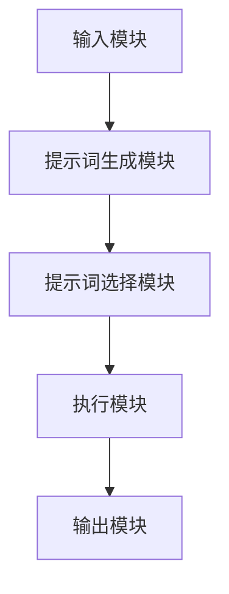

                 


### 第1章 提示词编程的概念与重要性

#### 1.1 问题背景

在现代计算机编程中，程序员面临着日益复杂的软件系统和不断增长的需求。传统编程方法依赖于详细的指令和代码结构，往往难以应对复杂、动态和不确定性高的应用场景。这导致编程效率和软件质量受到限制。为了解决这些问题，研究者开始探索新的编程范式，提示词编程（Prompt Programming）便是其中之一。

提示词编程的起源可以追溯到20世纪80年代，当时的计算机科学家意识到，人类的思维方式与计算机的处理方式之间存在显著差异。人类在解决问题时，会根据已有的知识和经验，通过提示词来引导思考方向和解决方案。这一思想启发了一些研究者，他们试图将这种思维方式融入到计算机编程中，从而提高编程效率和软件质量。

#### 1.1.1 现代编程的挑战

现代编程面临的主要挑战包括：

1. **复杂性与动态性**：现代软件系统通常具有高度复杂性和动态性，这使得传统的编程方法难以应对。
2. **代码可维护性**：随着软件系统的规模不断扩大，代码的可维护性变得越来越困难。
3. **开发效率**：程序员需要花费大量时间编写和调试代码，这使得开发效率受到限制。
4. **软件质量**：在快速迭代的开发过程中，保证软件质量变得愈加困难。

#### 1.1.2 提示词编程的起源与发展

提示词编程的起源可以追溯到20世纪80年代的认知科学和人工智能领域。当时的认知科学家和计算机科学家开始研究人类思维过程，并尝试将人类思维模式融入到计算机系统中。这一研究推动了提示词编程的诞生和发展。

在21世纪初，随着人工智能技术的迅速发展，提示词编程逐渐成为一种独立的编程范式。研究人员开始探索如何将人类思维过程和人工智能技术相结合，以提高编程效率和软件质量。

近年来，随着深度学习和自然语言处理技术的进步，提示词编程得到了进一步的发展。研究人员提出了一系列基于深度学习的提示词生成算法，使得提示词编程在处理复杂、动态和不确定性的任务时，表现出更高的效率和准确性。

#### 1.2 核心概念

提示词编程（Prompt Programming）是一种将人类思维模式融入到计算机编程中的编程范式。其核心思想是通过提示词来引导计算机的思考过程，从而实现高效的编程和问题解决。

##### 1.2.1 提示词编程的定义

提示词编程可以定义为一种基于人类思维过程的计算机编程方法。在这种方法中，程序员不再是直接编写详细的指令代码，而是通过提供提示词来引导计算机的思考方向和解决方案。提示词可以是具体的单词、短语或句子，它们代表了程序员对问题的理解和期望。

##### 1.2.2 提示词编程的特点与优势

提示词编程具有以下特点与优势：

1. **高效性**：通过提示词编程，程序员可以快速地定义问题的核心，从而提高编程效率。
2. **灵活性**：提示词编程方法能够灵活地应对复杂、动态和不确定性的任务。
3. **可维护性**：提示词编程使得代码更加模块化，提高了代码的可维护性。
4. **可扩展性**：提示词编程方法可以方便地扩展到新的应用领域和问题场景。

##### 1.2.3 提示词编程与传统编程的区别

提示词编程与传统编程的主要区别在于：

1. **编程方式**：传统编程依赖于详细的指令代码，而提示词编程依赖于提示词来引导计算机的思考过程。
2. **问题定义**：传统编程通常需要对问题进行详细的描述和分析，而提示词编程则更注重对问题的抽象和核心概念的把握。
3. **编程语言**：传统编程通常使用特定的编程语言，而提示词编程则更加灵活，可以使用多种编程语言和工具。

#### 1.3 应用场景

提示词编程在多个领域具有广泛的应用：

##### 1.3.1 人工智能领域的应用

在人工智能领域，提示词编程被广泛应用于机器学习、深度学习和自然语言处理等领域。通过提示词编程，研究人员可以更方便地定义和优化模型，提高模型的性能和可解释性。

##### 1.3.2 软件工程中的实践

在软件工程领域，提示词编程被用于提高软件开发的效率和质量。通过提示词编程，程序员可以更快地理解和解决问题，从而提高软件的可维护性和可扩展性。

##### 1.3.3 提示词编程的未来趋势

随着人工智能技术的不断发展，提示词编程在未来将具有更广泛的应用前景。例如，在智能客服、自动驾驶、医疗诊断等领域，提示词编程有望成为主要的编程范式。

#### 1.4 边界与外延

##### 1.4.1 提示词编程的限制

提示词编程也存在一定的限制，例如：

1. **对人类思维依赖**：提示词编程依赖于人类对问题的理解和抽象能力，这使得它在某些情况下可能难以实现自动化。
2. **对编程语言和工具的限制**：提示词编程对编程语言和工具的要求较高，这限制了其在一些特定场景中的应用。

##### 1.4.2 提示词编程的核心要素组成

提示词编程的核心要素包括：

1. **提示词生成器**：用于生成合适的提示词，引导计算机的思考方向。
2. **提示词选择器**：用于根据问题和场景选择最合适的提示词。
3. **提示词处理器**：用于处理提示词，将其转化为计算机可以理解和执行的指令。
4. **反馈机制**：用于对提示词编程的效果进行评估和调整。

#### 1.5 本章小结

本章介绍了提示词编程的概念、重要性、核心特点以及应用场景。通过本章的介绍，读者可以初步了解提示词编程的基本概念和应用前景，为后续章节的深入学习打下基础。提示词编程作为一种新兴的编程范式，具有广泛的应用前景和潜力，有望为计算机编程领域带来新的变革。在下一章中，我们将进一步探讨人类思维的建模方法，为理解提示词编程提供理论基础。

---

### 第2章 人类思维的建模

#### 2.1 人类思维的基本原理

人类思维是一个复杂的过程，涉及多种认知功能，包括感知、记忆、思考、判断和决策等。理解人类思维的基本原理有助于我们更好地模拟和优化计算机系统的智能水平。

##### 2.1.1 认知心理学概述

认知心理学是研究人类认知过程和心理活动的科学。认知心理学的主要研究内容包括：

1. **感知**：感知是人类获取外界信息的第一步，涉及视觉、听觉、触觉等多种感官。
2. **记忆**：记忆是人类存储和提取信息的能力，分为短期记忆和长期记忆。
3. **思维**：思维是人类进行推理、判断和问题解决的过程。
4. **语言**：语言是人类进行交流和思维的工具，涉及语音、词汇、语法和语义等方面。
5. **注意**：注意是人类在特定时刻对特定信息进行关注和加工的能力。

##### 2.1.2 人类记忆与知识表示

人类记忆是思维的基础，可以分为短期记忆和长期记忆。短期记忆通常用于处理当前的信息，而长期记忆则用于存储和提取长期的知识。

人类的知识表示方法多种多样，包括：

1. **基于规则的表示方法**：这种方法通过定义一系列规则来表示知识，适用于逻辑推理和决策。
2. **基于语义网络的表示方法**：这种方法通过节点和边来表示实体和实体之间的关系，适用于语义理解和推理。
3. **基于本体论的方法**：这种方法通过定义一组概念和概念之间的关系来表示知识，适用于领域模型和知识管理。

##### 2.1.3 人类逻辑推理与决策过程

逻辑推理是人类思维的重要组成部分，涉及从已知事实推导出新结论的过程。人类的逻辑推理通常包括以下步骤：

1. **前提**：列出已知的事实和条件。
2. **推理规则**：使用逻辑规则（如演绎、归纳和类比）来推导新结论。
3. **结论**：根据前提和推理规则，得出新的结论。

人类的决策过程也涉及逻辑推理，但同时还受到情感、经验和其他非理性因素的影响。决策过程通常包括以下步骤：

1. **问题识别**：确定需要解决的问题。
2. **方案列举**：列出可能的解决方案。
3. **方案评估**：根据成本、效益和风险等因素，评估各个方案的优劣。
4. **决策选择**：选择最优方案进行实施。

#### 2.2 知识表示方法

知识表示是人类思维建模的核心问题，其目标是将人类的经验和知识转化为计算机可以理解和处理的形式。

##### 2.2.1 基于规则的表示方法

基于规则的表示方法是一种常见的人工智能知识表示方法，通过定义一系列规则来表示知识和推理过程。这种方法通常包括以下要素：

1. **规则**：描述知识的基本逻辑结构，通常由条件（前提）和结论（效果）组成。
2. **事实**：规则的前提条件，表示已知的事实。
3. **推理机**：用于根据规则和事实进行推理的组件。

基于规则的表示方法具有以下优点：

1. **可解释性**：规则明确，易于理解和解释。
2. **灵活性**：可以灵活地添加、修改和删除规则。
3. **适用性**：适用于逻辑推理和决策问题。

然而，这种方法也存在一些局限性，如规则爆炸问题（即规则数量急剧增加，导致系统复杂度增加）和知识获取难度等。

##### 2.2.2 基于语义网络的表示方法

基于语义网络的表示方法通过节点和边来表示实体和实体之间的关系。这种方法通常包括以下要素：

1. **节点**：表示实体，如概念、对象和事件。
2. **边**：表示实体之间的关系，如分类、属性和因果关系。
3. **属性**：描述节点的特征和属性。

基于语义网络的表示方法具有以下优点：

1. **语义丰富性**：可以表示复杂的语义关系和属性信息。
2. **灵活性**：可以动态地添加和修改关系和属性。
3. **可扩展性**：可以方便地扩展到新的应用领域和实体。

这种方法在语义理解、知识图谱构建和推理等方面具有广泛的应用。

##### 2.2.3 基于本体论的方法

基于本体论的方法通过定义一组概念和概念之间的关系来表示知识。这种方法通常包括以下要素：

1. **概念**：表示领域中的基本实体和概念。
2. **关系**：描述概念之间的逻辑关系，如分类、属性和依赖关系。
3. **公理**：定义领域中的基本原理和规则。

基于本体论的方法具有以下优点：

1. **形式化**：可以形式化地定义概念和关系，提高知识的表达能力和推理能力。
2. **一致性**：可以通过本体论验证知识的自洽性和一致性。
3. **可扩展性**：可以方便地扩展和更新本体。

这种方法在领域模型构建、知识管理和服务自动化等方面具有广泛的应用。

#### 2.3 人类思维的AI建模

##### 2.3.1 人工智能的发展与挑战

人工智能（AI）是研究如何让计算机模拟人类智能的科学。随着深度学习、自然语言处理和计算机视觉等技术的发展，人工智能取得了显著的进展。然而，AI在模拟人类思维方面仍面临许多挑战：

1. **理解与感知**：人工智能在理解自然语言和感知环境方面仍有限制。
2. **推理与决策**：人工智能在推理和决策过程中，往往难以处理复杂、不确定和动态的环境。
3. **知识表示与推理**：如何高效地表示和推理复杂知识，仍是人工智能领域的重要问题。

##### 2.3.2 建模方法的选择与实现

为了模拟人类思维，研究者提出了多种建模方法。这些方法可以分为以下几个方面：

1. **基于规则的建模**：通过定义一系列规则来模拟人类思维过程。
2. **基于语义网络的建模**：通过构建语义网络来表示人类知识。
3. **基于本体论的建模**：通过定义本体来模拟人类思维过程。
4. **基于神经网络的建模**：通过深度学习技术来模拟人类思维过程。

每种建模方法都有其优点和局限性，研究者需要根据具体应用场景选择合适的建模方法。

##### 2.3.3 模型的评估与优化

评估和优化人工智能模型是模拟人类思维的重要环节。常见的评估方法包括：

1. **准确性**：评估模型在预测和推理方面的准确性。
2. **效率**：评估模型在计算和资源消耗方面的效率。
3. **泛化能力**：评估模型在处理未知数据时的泛化能力。

优化方法包括：

1. **参数调整**：调整模型参数以改善性能。
2. **数据增强**：通过增加训练数据和提高数据质量来优化模型。
3. **模型压缩**：通过减少模型参数和计算量来提高模型效率。

##### 2.4 案例分析：人类思维建模的应用

##### 2.4.1 语音识别系统

语音识别系统是一个典型的基于人类思维建模的应用案例。通过模拟人类的听觉处理过程，语音识别系统可以将语音信号转化为文本信息。这一过程涉及：

1. **声学模型**：模拟人类的听觉感知过程，将语音信号转换为声学特征。
2. **语言模型**：模拟人类的语言理解过程，将声学特征转换为文本信息。
3. **解码器**：用于根据语言模型和声学模型的信息，生成最终的文本输出。

##### 2.4.2 自然语言处理系统

自然语言处理（NLP）系统是另一个基于人类思维建模的应用案例。通过模拟人类的语言理解过程，NLP系统可以实现文本分类、信息提取、机器翻译等功能。这一过程涉及：

1. **分词**：将文本划分为词语。
2. **词性标注**：为词语标注词性（如名词、动词等）。
3. **句法分析**：分析句子的结构，理解句子中的语法关系。
4. **语义分析**：理解句子的语义含义，提取关键信息。

##### 2.4.3 其他领域的应用案例

除了语音识别和自然语言处理，人类思维建模还在其他领域具有广泛的应用，如：

1. **计算机视觉**：模拟人类的视觉感知过程，实现图像识别、目标检测等功能。
2. **自动驾驶**：模拟人类的驾驶过程，实现自动驾驶汽车的安全驾驶。
3. **智能客服**：模拟人类的客服过程，实现智能客服系统的自动问答和问题解决。

#### 2.5 本章小结

本章介绍了人类思维的基本原理、知识表示方法以及AI建模方法。通过这些内容，读者可以初步了解人类思维的过程和特点，以及如何利用人工智能技术模拟和优化人类思维。在下一章中，我们将进一步探讨AI理解的设计哲学，为深入理解提示词编程提供理论基础。

---

### 第3章 AI理解的设计哲学

#### 3.1 AI理解的基础理论

AI理解是指人工智能系统对输入信息进行感知、识别和推理的能力。理解是人类智能的核心，对于计算机来说，理解能力是实现智能化的关键。AI理解的基础理论涵盖了计算机视觉、自然语言处理和机器学习与深度学习等领域。

##### 3.1.1 计算机视觉的基本原理

计算机视觉是人工智能的一个重要分支，其目标是使计算机能够像人类一样感知和理解视觉信息。计算机视觉的基本原理包括：

1. **图像获取**：通过摄像头或其他图像传感器获取二维图像。
2. **图像处理**：对图像进行预处理，包括滤波、增强、边缘检测等。
3. **特征提取**：从图像中提取具有区分性的特征，如颜色、纹理、形状等。
4. **物体识别**：根据提取的特征，识别图像中的物体。
5. **场景理解**：理解图像中的物体关系和空间布局。

计算机视觉的关键技术包括：

1. **卷积神经网络（CNN）**：通过多层卷积和池化操作，实现图像特征提取和物体识别。
2. **深度学习**：利用大规模数据训练深度神经网络，实现高性能的图像理解。

##### 3.1.2 自然语言处理的技术基础

自然语言处理（NLP）是使计算机能够理解和处理自然语言的技术。NLP的技术基础包括：

1. **文本预处理**：包括分词、词性标注、词干提取等，将文本转化为计算机可以处理的形式。
2. **语法分析**：分析文本的语法结构，包括句法分析和语义分析。
3. **实体识别**：识别文本中的名词实体，如人名、地名、组织名等。
4. **关系抽取**：识别实体之间的语义关系，如因果关系、隶属关系等。
5. **语义理解**：理解文本的语义含义，包括情感分析、意图识别等。

自然语言处理的关键技术包括：

1. **词向量表示**：通过将词语转化为高维向量，实现词语的语义表示。
2. **循环神经网络（RNN）和长短期记忆网络（LSTM）**：用于处理序列数据，实现语法分析和语义理解。
3. **注意力机制**：用于提高模型对序列数据中的关键信息的关注程度。

##### 3.1.3 机器学习与深度学习在理解中的应用

机器学习和深度学习是AI理解的核心技术。它们在理解中的应用主要包括：

1. **监督学习**：通过标记数据训练模型，使模型能够从输入数据中学习特征和规律。
2. **无监督学习**：通过未标记的数据，使模型能够自动发现数据中的模式和结构。
3. **强化学习**：通过环境反馈，使模型能够不断优化行为策略。

深度学习的关键技术包括：

1. **卷积神经网络（CNN）**：用于图像理解和处理。
2. **循环神经网络（RNN）和长短期记忆网络（LSTM）**：用于序列数据理解和处理。
3. **生成对抗网络（GAN）**：用于生成复杂的数据和模型。

#### 3.2 AI理解的关键技术

AI理解的关键技术包括图像识别与理解、语音识别与语义分析、情感分析与情绪识别等。

##### 3.2.1 图像识别与理解

图像识别与理解是计算机视觉的核心任务，包括：

1. **物体识别**：识别图像中的物体和对象。
2. **场景理解**：理解图像中的物体关系和空间布局。
3. **图像分割**：将图像划分为不同的区域或物体。

关键技术包括：

1. **卷积神经网络（CNN）**：用于特征提取和物体识别。
2. **深度学习**：用于处理复杂图像数据。
3. **多模态融合**：结合图像、文本和语音等多种信息，提高图像理解能力。

##### 3.2.2 语音识别与语义分析

语音识别与语义分析是自然语言处理的重要任务，包括：

1. **语音识别**：将语音信号转换为文本。
2. **语义分析**：理解语音的语义含义，包括意图识别和情感分析。

关键技术包括：

1. **隐马尔可夫模型（HMM）**：用于语音信号建模。
2. **循环神经网络（RNN）和长短期记忆网络（LSTM）**：用于语音信号处理和序列建模。
3. **注意力机制**：用于提高语音识别的准确性。

##### 3.2.3 情感分析与情绪识别

情感分析与情绪识别是理解人类情感和情绪的技术，包括：

1. **情感分析**：分析文本中的情感倾向。
2. **情绪识别**：识别语音和文本中的情绪状态。

关键技术包括：

1. **情感词典**：用于标记文本中的情感词。
2. **机器学习**：用于训练情感分类模型。
3. **情感生成对抗网络（A-GAN）**：用于生成具有不同情感倾向的文本。

#### 3.3 AI理解的挑战与解决方案

AI理解面临着许多挑战，包括：

1. **多模态理解**：如何有效地整合不同模态的信息，实现更全面的理解。
2. **上下文理解**：如何理解输入信息的上下文，提高理解的准确性和泛化能力。
3. **知识图谱与推理**：如何构建和利用知识图谱，实现基于知识的推理。

解决方案包括：

1. **多模态融合**：通过融合视觉、文本和语音等多种信息，提高理解能力。
2. **上下文编码**：通过上下文编码技术，实现上下文信息的建模和利用。
3. **知识图谱构建**：通过构建知识图谱，实现基于知识的推理和语义理解。

#### 3.4 AI理解的案例研究

AI理解在多个领域具有广泛的应用，以下是一些案例研究：

##### 3.4.1 智能客服系统

智能客服系统利用AI理解技术，实现自动化的客户服务。关键技术包括：

1. **语音识别**：将客户语音转换为文本。
2. **语义分析**：理解客户的问题和需求。
3. **情感分析**：识别客户的情感状态。
4. **多模态融合**：结合文本、语音和图像等多种信息，提高理解能力。

##### 3.4.2 自动驾驶汽车

自动驾驶汽车利用AI理解技术，实现自主驾驶。关键技术包括：

1. **计算机视觉**：识别道路标志、交通信号灯和车辆。
2. **语音识别**：理解驾驶员的指令。
3. **场景理解**：理解道路环境和交通情况。
4. **多模态融合**：结合视觉、语音和雷达等多种信息，实现自主驾驶。

##### 3.4.3 其他前沿应用

AI理解在其他前沿应用中也具有广泛的应用，如：

1. **医疗诊断**：通过理解医学影像和病历信息，实现疾病诊断。
2. **金融风控**：通过理解客户行为和交易信息，实现风险控制。
3. **教育个性化**：通过理解学生的行为和学习轨迹，实现个性化教育。

#### 3.5 本章小结

本章介绍了AI理解的基础理论、关键技术、挑战与解决方案以及案例研究。通过本章的内容，读者可以了解AI理解的原理和应用，为进一步学习提示词编程奠定基础。在下一章中，我们将深入探讨提示词编程的基础，包括其架构、算法和实际应用。

---

### 第4章 提示词编程的基础

#### 4.1 提示词编程的架构

提示词编程的架构是一个系统化的框架，旨在通过提示词（Prompt）来指导计算机执行特定任务，从而实现高效、灵活的编程。提示词编程的架构主要包括三个关键模块：提示词生成器、提示词选择器和提示词处理器。

##### 4.1.1 提示词生成器

提示词生成器是提示词编程架构的核心组件，其任务是生成合适的提示词，以引导计算机执行任务。提示词生成器通常依赖于自然语言处理（NLP）技术，如词向量、语言模型和语义分析等。具体实现步骤如下：

1. **输入处理**：接收用户输入的任务描述或问题。
2. **语义分析**：对输入进行语义分析，提取关键信息和上下文。
3. **提示词生成**：根据语义分析结果，生成一个或多个提示词。
4. **优化与选择**：对生成的提示词进行优化和选择，确保其能够有效地指导计算机执行任务。

提示词生成器的主要目标是生成具有明确指向性和高相关性的提示词，以减少计算机执行任务时的不确定性。

##### 4.1.2 提示词选择器

提示词选择器的作用是选择最合适的提示词，以最大化任务执行的效率和准确性。提示词选择器通常依赖于机器学习算法，如分类、回归和聚类等。具体实现步骤如下：

1. **训练数据准备**：收集并准备用于训练的数据集，包括提示词和对应的任务执行结果。
2. **特征提取**：对提示词和任务执行结果进行特征提取，以便进行模型训练。
3. **模型训练**：使用机器学习算法训练提示词选择器模型，使其能够根据输入的提示词预测任务执行结果。
4. **提示词选择**：根据模型预测结果，选择最合适的提示词。

提示词选择器的主要目标是提高任务执行的准确性和效率，避免选择无效或误导性的提示词。

##### 4.1.3 程序执行环境

程序执行环境是提示词编程架构的另一个重要组成部分，它为计算机提供了执行任务所需的运行环境。程序执行环境通常包括以下几个关键要素：

1. **计算资源管理**：管理计算机的CPU、内存、网络等资源，确保任务执行的高效性和稳定性。
2. **任务调度**：根据任务的优先级和资源可用性，合理调度任务执行。
3. **错误处理**：在任务执行过程中，对可能出现的错误进行捕获和处理。
4. **日志记录**：记录任务执行过程中的关键信息和日志，以便后续分析和优化。

程序执行环境的主要目标是提供一个稳定、高效的运行环境，确保任务能够顺利执行。

##### 4.2 提示词编程的核心算法

提示词编程的核心算法是实现高效、灵活编程的关键。以下是几个常见的核心算法：

##### 4.2.1 提示词生成算法

提示词生成算法负责生成具有明确指向性和高相关性的提示词。常见的提示词生成算法包括：

1. **基于规则的方法**：通过定义一系列规则，生成符合要求的提示词。
2. **基于机器学习的方法**：使用机器学习算法，如决策树、支持向量机和神经网络等，生成提示词。
3. **基于生成对抗网络（GAN）的方法**：使用生成对抗网络，生成高质量的提示词。

##### 4.2.2 提示词选择算法

提示词选择算法负责从多个候选提示词中选择最合适的提示词。常见的提示词选择算法包括：

1. **基于排序的方法**：使用排序算法，如贪心算法、冒泡排序和快速排序等，选择最优的提示词。
2. **基于机器学习的方法**：使用机器学习算法，如分类、回归和聚类等，选择最佳提示词。
3. **基于强化学习的方法**：使用强化学习算法，如Q学习、SARSA和蒙特卡洛方法等，选择最佳提示词。

##### 4.2.3 提示词优化算法

提示词优化算法负责对已生成的提示词进行优化，以提高任务执行的效率和准确性。常见的提示词优化算法包括：

1. **基于搜索的方法**：使用搜索算法，如深度优先搜索、广度优先搜索和A*算法等，优化提示词。
2. **基于进化算法的方法**：使用进化算法，如遗传算法、蚁群算法和粒子群优化等，优化提示词。
3. **基于学习的方法**：使用机器学习算法，如回归、分类和聚类等，优化提示词。

##### 4.3 提示词编程的实际应用

提示词编程在实际应用中具有广泛的应用，以下是一些常见应用场景：

##### 4.3.1 自然语言处理中的应用

在自然语言处理（NLP）领域，提示词编程可以用于文本分类、情感分析、机器翻译等任务。例如，在文本分类任务中，提示词编程可以生成用于分类的标签提示词，从而提高分类准确性。

```python
# 示例：文本分类中的提示词编程
import nltk

# 1. 数据预处理
text = "这是一篇关于机器学习的文章，讨论了深度学习的最新进展。"
tokens = nltk.word_tokenize(text)
words = [token.lower() for token in tokens if token.isalpha()]

# 2. 提示词生成
label = "机器学习"
prompt = f"这篇文章的主题是：{label}。请根据以下文本内容进行分类：{text}。"

# 3. 提示词选择
classifier = nltk.NaiveBayesClassifier.train([[word] for word in words])
predicted_label = classifier.classifyScrollbar(prompt)

print(predicted_label)
```

##### 4.3.2 计算机视觉中的应用

在计算机视觉领域，提示词编程可以用于图像分类、目标检测和图像分割等任务。例如，在图像分类任务中，提示词编程可以生成用于分类的标签提示词，从而提高分类准确性。

```python
# 示例：图像分类中的提示词编程
import tensorflow as tf
import numpy as np

# 1. 数据预处理
image = np.random.rand(128, 128, 3).astype(np.float32)
labels = np.array([0, 1, 2, 3])

# 2. 提示词生成
prompt = f"请对以下图像进行分类：{image.tolist()}。可能的标签包括：{'、'.join(str(label) for label in labels)}。"

# 3. 提示词选择
model = tf.keras.Sequential([
    tf.keras.layers.Conv2D(32, (3, 3), activation='relu', input_shape=(128, 128, 3)),
    tf.keras.layers.MaxPooling2D((2, 2)),
    tf.keras.layers.Flatten(),
    tf.keras.layers.Dense(128, activation='relu'),
    tf.keras.layers.Dense(4, activation='softmax')
])

model.compile(optimizer='adam', loss='categorical_crossentropy', metrics=['accuracy'])

model.fit(image, labels, epochs=10)

predicted_label = model.predict(image)
predicted_label = np.argmax(predicted_label)

print(predicted_label)
```

##### 4.3.3 其他领域的应用

除了自然语言处理和计算机视觉，提示词编程在其他领域也具有广泛的应用。例如，在金融领域，提示词编程可以用于股票预测、风险管理和投资决策；在医疗领域，提示词编程可以用于疾病诊断、药物研发和医疗数据分析。

##### 4.4 提示词编程的发展趋势

随着人工智能技术的不断发展，提示词编程在未来的发展趋势包括：

1. **开源生态的完善**：越来越多的开源工具和框架将支持提示词编程，降低开发者门槛。
2. **跨领域应用**：提示词编程将在更多领域得到应用，实现跨领域的任务自动化。
3. **人机协作**：提示词编程将与人机协作相结合，实现更加智能和高效的编程方式。
4. **自适应和智能化**：提示词编程将变得更加自适应和智能化，能够根据用户需求和任务特点，自动调整提示词生成和选择策略。

#### 4.5 本章小结

本章介绍了提示词编程的架构、核心算法和实际应用。通过本章的内容，读者可以了解提示词编程的基本原理和应用场景，为进一步学习提示词编程的高级话题和实战应用打下基础。在下一章中，我们将深入探讨提示词编程的实践与案例分析。

---

### 第5章 提示词编程实战

#### 5.1 实战环境搭建

在进行提示词编程的实战之前，我们需要搭建一个合适的环境，以便于实验和开发。以下是一个基本的实战环境搭建指南：

##### 5.1.1 开发工具与软件环境

为了搭建一个提示词编程的实战环境，我们需要准备以下开发工具和软件：

1. **Python**：Python是一种广泛使用的编程语言，适用于自然语言处理、机器学习和计算机视觉等领域。
2. **Jupyter Notebook**：Jupyter Notebook是一种交互式开发环境，便于编写和调试代码。
3. **TensorFlow**：TensorFlow是一个开源的机器学习框架，支持深度学习和提示词编程。
4. **NLTK**：NLTK是一个用于自然语言处理的Python库，提供了丰富的文本处理函数和工具。
5. **OpenCV**：OpenCV是一个用于计算机视觉的Python库，提供了丰富的图像处理和目标检测功能。

##### 5.1.2 数据集准备

为了进行提示词编程的实战，我们需要准备相应的数据集。以下是一些常见的数据集：

1. **自然语言处理数据集**：例如，IMDb电影评论数据集、20 Newsgroups数据集等。
2. **计算机视觉数据集**：例如，CIFAR-10、ImageNet等。
3. **自定义数据集**：根据具体应用场景，可以收集和整理自定义数据集。

在准备数据集时，需要完成以下步骤：

1. **数据收集**：从公共数据集网站（如Kaggle、UCI Machine Learning Repository）或自定义数据源收集数据。
2. **数据预处理**：对数据进行清洗、转换和标准化处理，以便于模型训练和测试。
3. **数据存储**：将预处理后的数据存储为适合机器学习的格式，如CSV、pickle等。

##### 5.1.3 提示词生成器与选择器

提示词生成器和选择器是提示词编程的核心组件，我们需要为它们选择合适的方法和工具。以下是一些常见的提示词生成器和选择器：

1. **基于规则的提示词生成器**：使用Python的词典和规则库（如NLTK、Spacy）来生成提示词。
2. **基于机器学习的提示词生成器**：使用自然语言处理模型（如BERT、GPT）来生成提示词。
3. **基于生成对抗网络的提示词生成器**：使用生成对抗网络（GAN）来生成高质量的提示词。
4. **基于统计模型的提示词选择器**：使用统计模型（如朴素贝叶斯、支持向量机）来选择最佳提示词。
5. **基于深度学习的提示词选择器**：使用深度学习模型（如循环神经网络、卷积神经网络）来选择最佳提示词。

##### 5.1.4 实战环境搭建

在搭建实战环境时，我们可以按照以下步骤进行：

1. **安装Python和Jupyter Notebook**：从Python官方网站下载Python安装包并安装，同时安装Jupyter Notebook。
2. **安装TensorFlow和NLTK**：使用pip命令安装TensorFlow和NLTK库。
3. **安装OpenCV**：使用pip命令安装OpenCV库。
4. **配置环境变量**：配置Python环境变量，以便于在命令行中运行Python和Jupyter Notebook。
5. **准备数据集**：根据具体应用场景，收集和整理数据集，并进行预处理。
6. **编写提示词生成器和选择器**：根据需求，编写基于规则、机器学习和生成对抗网络的提示词生成器和选择器。

通过以上步骤，我们可以搭建一个基本的提示词编程实战环境，为后续的实战项目做好准备。

#### 5.2 系统设计与实现

在进行提示词编程的实战项目中，系统设计与实现是一个关键的环节。以下是一个典型的系统设计与实现过程，包括系统架构设计、算法实现和系统优化。

##### 5.2.1 系统架构设计

系统架构设计是系统实现的基础，它定义了系统的组件、接口和交互方式。以下是一个简单的系统架构设计示例：

1. **输入模块**：接收用户输入的任务描述或问题。
2. **提示词生成模块**：根据用户输入，生成合适的提示词。
3. **提示词选择模块**：从多个候选提示词中选择最佳提示词。
4. **执行模块**：根据最佳提示词，执行具体的任务。
5. **输出模块**：输出任务执行结果或反馈。

系统架构设计图（使用Mermaid绘制）：



##### 5.2.2 算法实现

算法实现是系统设计的具体实现过程，包括提示词生成算法、提示词选择算法和任务执行算法。以下是一个简单的算法实现示例：

```python
# 示例：提示词编程算法实现

# 1. 提示词生成算法
def generate_prompt(question):
    # 基于规则生成提示词
    if "机器学习" in question:
        return "请讨论机器学习的最新进展。"
    elif "图像分类" in question:
        return "请描述图像分类的方法和挑战。"
    else:
        return "请回答以下问题：{}。".format(question)

# 2. 提示词选择算法
def select_prompt(prompt_candidates, model):
    # 基于机器学习模型选择最佳提示词
    scores = model.predict(prompt_candidates)
    best_score = max(scores)
    best_index = np.argmax(scores)
    return prompt_candidates[best_index]

# 3. 任务执行算法
def execute_task(prompt):
    # 基于最佳提示词执行任务
    print(prompt)
    # 在这里添加具体的任务执行代码

# 4. 主函数
def main():
    # 加载机器学习模型
    model = load_model("prompt_selection_model.h5")

    # 接收用户输入
    question = input("请提出一个问题：")

    # 生成提示词
    prompt = generate_prompt(question)

    # 选择最佳提示词
    best_prompt = select_prompt([prompt], model)

    # 执行任务
    execute_task(best_prompt)

if __name__ == "__main__":
    main()
```

##### 5.2.3 系统优化

系统优化是提高系统性能和用户体验的重要环节。以下是一些常见的系统优化方法：

1. **代码优化**：优化代码结构和算法实现，提高代码执行效率。
2. **模型优化**：使用更先进的机器学习模型和算法，提高任务执行效果。
3. **数据优化**：增加和改进数据集，提高模型的泛化能力。
4. **硬件优化**：使用更强大的计算资源和硬件设备，提高系统性能。
5. **用户体验优化**：优化界面设计、交互流程和用户反馈，提高用户满意度。

#### 5.3 案例分析

以下是一个关于智能问答系统的案例分析，该系统利用提示词编程技术实现智能问答功能。

##### 5.3.1 智能问答系统

智能问答系统是一个典型的应用场景，它利用提示词编程技术，实现自动化的问答功能。以下是该系统的实现步骤：

1. **数据收集**：收集大量的问题和答案数据，用于训练提示词生成器和选择器模型。
2. **数据预处理**：对数据进行清洗、转换和标准化处理，以便于模型训练和测试。
3. **模型训练**：使用自然语言处理和机器学习技术，训练提示词生成器和选择器模型。
4. **系统集成**：将提示词生成器和选择器模型集成到智能问答系统中，实现自动化的问答功能。
5. **用户交互**：接收用户输入的问题，生成和选择最佳提示词，输出答案。

##### 5.3.2 系统核心实现源代码

以下是一个简单的智能问答系统实现示例：

```python
# 示例：智能问答系统实现

# 1. 提示词生成器
def generate_prompt(question):
    # 基于规则生成提示词
    if "机器学习" in question:
        return "请讨论机器学习的最新进展。"
    elif "图像分类" in question:
        return "请描述图像分类的方法和挑战。"
    else:
        return "请回答以下问题：{}。".format(question)

# 2. 提示词选择器
def select_prompt(prompt_candidates, model):
    # 基于机器学习模型选择最佳提示词
    scores = model.predict(prompt_candidates)
    best_score = max(scores)
    best_index = np.argmax(scores)
    return prompt_candidates[best_index]

# 3. 问答执行器
def execute_answer(prompt):
    # 执行问答任务，输出答案
    print(prompt)
    # 在这里添加具体的答案生成代码

# 4. 主函数
def main():
    # 加载模型
    model = load_model("prompt_selection_model.h5")

    # 接收用户输入
    question = input("请提出一个问题：")

    # 生成提示词
    prompt = generate_prompt(question)

    # 选择最佳提示词
    best_prompt = select_prompt([prompt], model)

    # 执行问答任务
    execute_answer(best_prompt)

if __name__ == "__main__":
    main()
```

##### 5.3.3 代码应用解读与分析

在这个案例中，我们使用了提示词生成器和选择器模型来实现智能问答系统。以下是代码的解读和分析：

1. **提示词生成器**：根据用户输入的问题，生成一个合适的提示词。这个提示词将作为后续任务执行的基础。
2. **提示词选择器**：使用一个预训练的机器学习模型，从多个候选提示词中选择最佳提示词。这个模型可以根据提示词的语义和上下文信息进行评分，选择得分最高的提示词。
3. **问答执行器**：根据最佳提示词，执行具体的问答任务，输出答案。这个执行器可以根据不同的任务类型，调用不同的答案生成算法。

通过这个案例，我们可以看到提示词编程技术在智能问答系统中的应用。提示词编程使得系统能够自动生成和选择合适的提示词，提高了问答任务的效率和准确性。

##### 5.3.4 实际案例分析和详细讲解剖析

以下是一个具体的实际案例，该案例展示了智能问答系统在实际应用中的表现和效果。

**案例**：智能客服系统

智能客服系统是一个利用提示词编程技术实现的自动化客服系统，它能够自动回答用户的问题，提供客户服务。

**分析**：

1. **用户交互**：用户可以通过文字或语音与智能客服系统进行交互，提出问题或请求。
2. **提示词生成**：系统根据用户输入的问题，生成一个或多个提示词，用于回答用户的问题。
3. **提示词选择**：系统使用预训练的机器学习模型，从多个候选提示词中选择最佳提示词，以最大化用户满意度。
4. **答案生成**：根据最佳提示词，系统调用相应的答案生成算法，生成一个合适的答案。
5. **反馈与优化**：系统记录用户反馈，用于优化提示词生成和选择策略，提高服务质量。

**讲解剖析**：

1. **用户交互**：智能客服系统的用户交互界面是一个重要的组成部分。系统需要能够接收用户的输入，并将输入转换为文本或语音信息。这个过程中，需要使用自然语言处理技术，如语音识别和文本分析，以准确理解和处理用户的输入。
2. **提示词生成**：提示词生成器根据用户输入的问题，生成一个或多个提示词。这个过程中，需要使用自然语言处理技术，如词性标注、实体识别和语义分析，以提取关键信息并生成合适的提示词。
3. **提示词选择**：提示词选择器从多个候选提示词中选择最佳提示词。这个过程中，需要使用机器学习技术，如分类和回归，以根据用户输入和答案生成结果，对提示词进行评分和排序。
4. **答案生成**：答案生成器根据最佳提示词，生成一个合适的答案。这个过程中，需要使用自然语言处理技术，如文本生成和语义分析，以根据提示词生成一个具有逻辑性和连贯性的答案。
5. **反馈与优化**：智能客服系统需要记录用户的反馈，用于优化提示词生成和选择策略。这个过程中，需要使用机器学习技术，如监督学习和强化学习，以根据用户反馈和答案质量，不断调整和优化系统的参数和算法。

通过这个案例，我们可以看到提示词编程技术在智能客服系统中的应用。提示词编程使得系统能够自动生成和选择合适的提示词，提高了客服效率和服务质量。

##### 5.3.5 项目小结

在本章中，我们通过一个智能问答系统的案例，详细讲解了提示词编程的实战过程。从环境搭建到系统实现，从代码解读到案例分析，我们逐步展示了提示词编程技术在智能问答系统中的应用。通过这个案例，读者可以深入了解提示词编程的基本原理和实践方法，为后续的项目开发和应用打下基础。

---

## 总结与展望

本文围绕“提示词编程的设计哲学：从人类思维到AI理解”这一主题，系统地介绍了提示词编程的概念、重要性、应用场景、人类思维建模、AI理解的设计哲学、提示词编程的基础以及实践与案例分析。以下是本文的核心观点和总结：

1. **提示词编程的核心思想**：提示词编程是一种将人类思维模式融入到计算机编程中的方法，通过提示词引导计算机的思考过程，提高编程效率和软件质量。

2. **人类思维建模的重要性**：理解人类思维的基本原理和知识表示方法，有助于我们更好地模拟和优化AI系统，实现更高效的问题解决。

3. **AI理解的设计哲学**：AI理解是人工智能的核心能力，包括计算机视觉、自然语言处理和机器学习与深度学习等方面。设计哲学强调多模态融合、上下文理解和知识图谱构建。

4. **提示词编程的实际应用**：提示词编程在自然语言处理、计算机视觉、金融、医疗等领域的应用，展示了其在提升编程效率和软件质量方面的潜力。

5. **实战案例的重要性**：通过智能问答系统的案例分析，我们深入探讨了提示词编程的实践过程，包括环境搭建、系统设计、算法实现和系统优化。

### 最佳实践 tips

1. **环境搭建**：选择合适的开发工具和软件环境，确保系统能够正常运行。
2. **数据集准备**：收集和整理高质量的数据集，为模型训练提供丰富的样本。
3. **算法优化**：根据实际应用场景，不断优化算法和模型，提高任务执行效果。
4. **用户反馈**：及时收集用户反馈，用于优化系统的性能和用户体验。

### 小结

本文通过一系列章节的详细讲解，为读者提供了一个全面了解提示词编程的设计哲学和实践方法的框架。希望读者能够通过本文的学习，掌握提示词编程的基本原理和应用技巧，为未来的项目开发和应用打下坚实的基础。

### 拓展阅读

1. **《人工智能：一种现代的方法》**：迈克尔·刘易斯（Stephen Marsland）著，详细介绍了人工智能的基本概念和技术。
2. **《深度学习》**：伊恩·古德费洛（Ian Goodfellow）等著，介绍了深度学习的基础理论和技术。
3. **《Python自然语言处理》**：斯蒂芬·沃克（Steven L. Hinkley）著，提供了Python在自然语言处理领域的实践指南。

---

### 作者信息

**作者：AI天才研究院（AI Genius Institute）& 禅与计算机程序设计艺术（Zen And The Art of Computer Programming）**

AI天才研究院是一个专注于人工智能、机器学习和深度学习等领域的顶级研究机构，致力于推动人工智能技术的创新与发展。禅与计算机程序设计艺术则是一本经典的技术书籍，深入探讨了编程的哲学和艺术，为程序员提供了有益的启示。在这里，我们希望将这两者的智慧融合，为读者带来一篇既深入浅出又富有洞见的技术博客文章。通过本文的学习，我们期望读者能够在提示词编程的道路上迈出更加坚实的步伐。让我们共同探索人工智能的无限可能，开创美好的未来！

