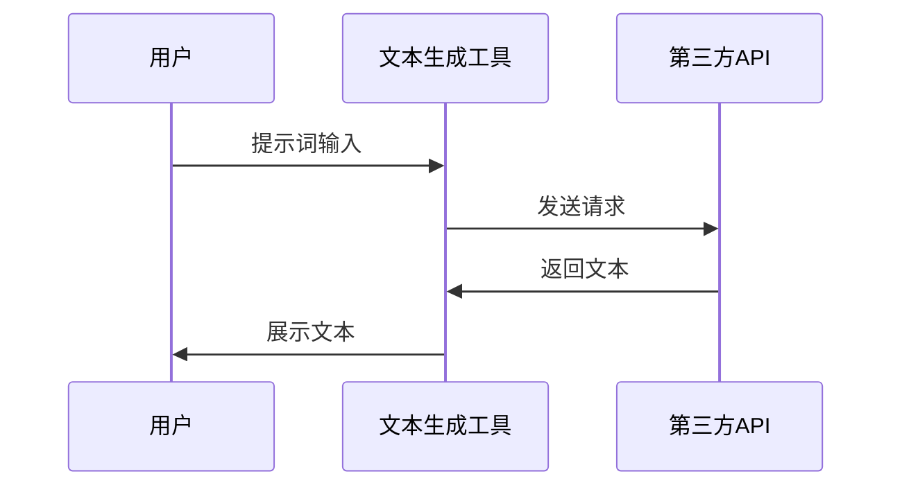
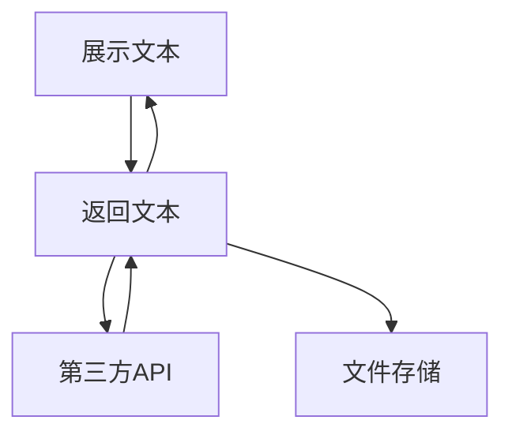
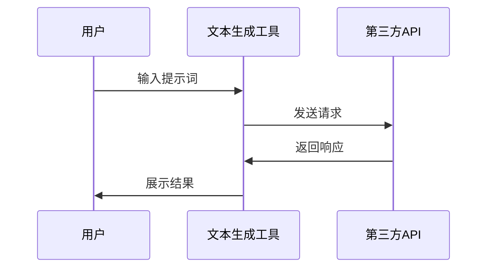

                 

### 文章标题

《提示词编程的设计模式与最佳实践》

### 关键词

提示词编程、设计模式、最佳实践、代码优化、编程技巧

### 摘要

本文旨在深入探讨提示词编程的设计模式与最佳实践。首先，我们将介绍提示词编程的基础知识，包括其定义、核心概念和技术框架。接着，我们将概述设计模式的基本概念、类型和选择原则。随后，本文将详细分析创建型、结构型和行为型设计模式在提示词编程中的应用。此外，我们还将分享最佳实践和技巧，以帮助开发者提升编码效率和质量。最后，通过实际项目案例，我们将展示如何将所学知识应用于实践，并提供总结和展望。

## 引言

### 1.1 问题背景

在现代软件开发领域，代码质量和开发效率成为衡量一个项目成功与否的关键指标。随着软件系统的复杂度不断增加，开发者面临着如何高效地设计、实现和维护代码的挑战。传统的编程方法虽然能够解决问题，但往往难以应对日益复杂的应用场景。因此，设计模式和最佳实践成为软件开发中的重要工具，它们提供了一系列的指导和原则，帮助开发者编写更加高效、可维护的代码。

### 1.2 问题描述

提示词编程是一种利用提示词（Prompt）来引导和优化代码编写的技术。它通过预定义的提示词模板，帮助开发者快速生成代码框架，从而提高开发效率。然而，在实际应用中，提示词编程面临着如何选择合适的设计模式、如何优化代码结构和如何避免常见陷阱等问题。

### 1.3 问题解决

为了解决上述问题，本文将介绍提示词编程的设计模式和最佳实践。通过系统的分析和讲解，我们将帮助开发者理解和掌握这些工具，从而在项目开发中发挥其最大潜力。

### 1.4 边界与外延

提示词编程的设计模式和最佳实践适用于各种规模的软件开发项目，无论是个人项目还是企业级应用。此外，这些设计模式和最佳实践不仅适用于提示词编程，也可以在其他编程领域中发挥作用。

### 1.5 概念结构与核心要素组成

本文将从以下几个方面展开讨论：

1. 提示词编程基础
2. 设计模式概述
3. 提示词编程中的常见设计模式
4. 最佳实践与技巧
5. 项目案例实战
6. 总结与展望

通过这些章节的详细讲解，我们将全面探讨提示词编程的设计模式和最佳实践，帮助开发者提升编程技能和项目开发效率。

### 提示词编程基础

#### 2.1 提示词编程概述

提示词编程（Prompt-based Programming）是一种利用提示词（Prompt）来引导和优化代码编写的技术。提示词通常是一段简短的文本，包含了一些关键信息，如函数名、参数类型和预期输出等。开发者可以通过编写或选择适当的提示词模板，快速生成代码框架，从而提高开发效率。提示词编程的核心思想是利用自动化工具来简化代码编写过程，使得开发者能够专注于业务逻辑的实现。

#### 2.2 提示词编程的核心概念

- **提示词（Prompt）**：提示词是提示词编程中的核心概念，它通常包含关键信息，如函数名、参数类型和预期输出等。提示词可以是手工编写的，也可以是自动生成的。

- **模板（Template）**：模板是一组预定义的代码框架，用于生成具体的代码实现。模板可以根据不同的提示词生成不同的代码。

- **生成器（Generator）**：生成器是一种自动化工具，用于根据提示词和模板生成代码。生成器可以是专门的软件工具，也可以是编程语言内置的功能。

- **上下文（Context）**：上下文是指与代码实现相关的环境信息，如变量作用域、函数调用链和程序状态等。上下文对于提示词编程至关重要，因为它决定了代码生成的具体内容和结构。

#### 2.3 提示词编程的技术框架

提示词编程的技术框架主要包括以下组件：

- **前端**：前端负责接收用户的输入，如提示词，并将其传递给后端处理。前端通常是一个命令行界面（CLI）或图形用户界面（GUI）。

- **后端**：后端负责处理前端传递的提示词，根据模板和上下文生成代码。后端可以是专门的生成器程序，也可以是编程语言内置的功能。

- **模板库**：模板库是一组预定义的代码模板，用于生成各种类型的代码。模板库可以根据不同的编程语言和开发需求进行定制。

- **代码库**：代码库是存储生成的代码的仓库，可以是版本控制系统，如Git，也可以是文件系统。

- **工具链**：工具链是一系列辅助工具，如代码格式化工具、静态代码分析工具和单元测试工具等，用于提高代码质量和开发效率。

#### 2.4 提示词编程的优势与局限

提示词编程具有以下优势：

1. **提高开发效率**：通过快速生成代码框架，提示词编程可以显著提高开发效率，减少代码编写的时间。
2. **代码标准化**：提示词编程有助于实现代码标准化，通过统一的模板和规范，提高代码的可读性和可维护性。
3. **减少错误**：生成器可以根据提示词和模板自动生成代码，减少手动编写的错误。
4. **支持多种编程语言**：提示词编程可以适用于多种编程语言，如Python、Java、C++等。

然而，提示词编程也存在一些局限：

1. **模板依赖性**：提示词编程的效率高度依赖于模板的质量和数量，如果模板库不完善，可能会影响生成代码的质量。
2. **学习成本**：对于新手开发者，理解和使用提示词编程可能需要一定的学习成本。
3. **代码可读性**：生成的代码可能不如手动编写的代码具有良好的人性化可读性。

#### 2.5 提示词编程的应用场景

提示词编程适用于以下场景：

1. **快速原型开发**：提示词编程可以帮助开发者快速生成原型代码，用于验证设计思路和功能实现。
2. **代码重构**：提示词编程可以用于重构现有的代码库，通过生成新的代码框架，优化代码结构和性能。
3. **自动化测试**：提示词编程可以生成测试代码，用于自动化测试，提高测试效率和覆盖率。
4. **文档生成**：提示词编程可以生成代码文档，提高代码的可理解性和可维护性。

总之，提示词编程作为一种高效的编程技术，具有广泛的应用前景。通过合理使用设计模式和最佳实践，开发者可以充分发挥其优势，提高开发效率和代码质量。

### 设计模式概述

#### 3.1 设计模式的基本概念

设计模式（Design Pattern）是一种在软件设计中反复出现的问题解决方案的抽象描述。它描述了在特定情境下，如何解决常见的设计问题，以实现可维护、可扩展和高效的设计。设计模式不仅是一种编码技巧，更是一种设计哲学，它强调在软件架构中遵循一些最佳实践。

#### 3.2 设计模式的重要类型

设计模式根据其作用和目的，可以分为三大类：创建型、结构型和行为型。

- **创建型模式**：这类模式关注对象的创建过程，主要解决对象创建和依赖管理的问题。常见的创建型模式包括：
  - 单例模式（Singleton）：确保一个类仅有一个实例，并提供一个全局访问点。
  - 工厂方法模式（Factory Method）：定义一个接口用于创建对象，但让子类决定实例化哪个类。
  - 抽象工厂模式（Abstract Factory）：创建一系列相关或相互依赖对象的接口，以及实现这些接口的具体类。

- **结构型模式**：这类模式主要关注类和对象之间的组合，用于解决类和对象的组合关系问题。常见的结构型模式包括：
  - 适配器模式（Adapter）：将一个类的接口转换成客户期望的另一个接口。
  - 桥接模式（Bridge）：将抽象部分与实现部分分离，使它们可以独立地变化。
  - 组合模式（Composite）：将对象组合成树形结构以表示“部分-整体”的层次结构。

- **行为型模式**：这类模式主要关注类和对象之间的交互和职责分配，用于解决对象之间的通信和协作问题。常见的行为型模式包括：
  - 责任链模式（Chain of Responsibility）：使多个对象都有机会处理请求，从而避免请求的发送者和接收者之间的耦合关系。
  - 策略模式（Strategy）：定义一系列算法，将每一个算法封装起来，并使它们可以相互替换。
  - 观察者模式（Observer）：定义对象间的一种一对多的依赖关系，当一个对象的状态发生改变时，所有依赖于它的对象都得到通知并自动更新。

#### 3.3 设计模式的选择原则

选择合适的设计模式需要遵循以下原则：

1. **问题导向**：设计模式是为了解决具体的设计问题，因此在选择设计模式时，首先要明确问题的本质和背景。

2. **适用性**：选择的设计模式应该能够适用于当前的项目需求和未来可能的变化，避免过度设计。

3. **可维护性**：设计模式应确保代码的可维护性和可扩展性，使其能够适应未来需求的变化。

4. **性能考虑**：在保证功能实现的同时，应考虑设计模式对系统性能的影响，避免引入不必要的开销。

5. **社区认可**：选择广泛认可和使用的设计模式，可以减少团队成员的学习成本和沟通成本。

总之，设计模式作为一种重要的设计工具，可以帮助开发者构建高质量、可维护和高效的软件系统。通过合理选择和应用设计模式，开发者可以更好地应对复杂的软件设计问题。

### 提示词编程中的常见设计模式

提示词编程作为一种高效的编程技术，广泛应用于现代软件开发中。设计模式在提示词编程中发挥着至关重要的作用，它们不仅提高了代码的可读性和可维护性，还增强了系统的灵活性和扩展性。在本节中，我们将详细介绍创建型、结构型和行为型设计模式在提示词编程中的应用。

#### 4.1 创建型设计模式

创建型设计模式主要关注对象的创建过程，它们提供了一种系统化的方法来处理对象的创建，以确保代码的模块化和可扩展性。在提示词编程中，创建型设计模式可以显著提高代码的生成效率和结构清晰度。以下是三种常见的创建型设计模式：

1. **单例模式（Singleton）**

单例模式确保一个类仅有一个实例，并提供一个全局访问点。在提示词编程中，单例模式可以用于创建那些应该只有一个实例的组件，例如数据库连接池或日志记录器。以下是一个使用Python实现的单例模式的示例：

```python
class DatabaseConnection:
    _instance = None

    def __new__(cls, *args, **kwargs):
        if cls._instance is None:
            cls._instance = super(DatabaseConnection, cls).__new__(cls, *args, **kwargs)
        return cls._instance

    def connect(self):
        # 实现数据库连接的逻辑
        pass

# 使用单例模式
db = DatabaseConnection()
```

在这个例子中，`__new__` 方法被重写，以确保在第一次创建 `DatabaseConnection` 对象时，后续的创建请求都将返回同一个实例。

2. **工厂方法模式（Factory Method）**

工厂方法模式定义一个接口用于创建对象，但让子类决定实例化哪个类。在提示词编程中，工厂方法模式可以帮助生成不同类型的对象，而无需关心具体的创建逻辑。以下是一个使用Python实现的工厂方法模式的示例：

```python
class Shape:
    def draw(self):
        pass

class Circle(Shape):
    def draw(self):
        print("Drawing a circle.")

class Rectangle(Shape):
    def draw(self):
        print("Drawing a rectangle.")

def shape_factory(shape_type):
    if shape_type == "circle":
        return Circle()
    elif shape_type == "rectangle":
        return Rectangle()
    else:
        raise ValueError("Invalid shape type")

# 使用工厂方法模式
shape = shape_factory("circle")
shape.draw()  # 输出：Drawing a circle.
```

在这个例子中，`shape_factory` 函数根据传递的参数生成相应的 `Shape` 子类实例。

3. **抽象工厂模式（Abstract Factory）**

抽象工厂模式创建一系列相关或相互依赖对象的接口，以及实现这些接口的具体类。在提示词编程中，抽象工厂模式可以帮助生成一组相关对象，而无需关心具体的实现细节。以下是一个使用Python实现的抽象工厂模式的示例：

```python
class Color:
    def fill(self):
        pass

class Red(Color):
    def fill(self):
        print("Filling with red color.")

class Green(Color):
    def fill(self):
        print("Filling with green color.")

class Shape:
    def draw(self):
        pass

class Circle(Shape):
    def draw(self):
        print("Drawing a circle with red color.")

class Square(Shape):
    def draw(self):
        print("Drawing a square with green color.")

class ColorFactory:
    def create_color(self):
        return Red()

class ShapeFactory:
    def create_shape(self):
        return Circle()

# 使用抽象工厂模式
color = ColorFactory().create_color()
color.fill()  # 输出：Filling with red color.
shape = ShapeFactory().create_shape()
shape.draw()  # 输出：Drawing a circle with red color.
```

在这个例子中，`ColorFactory` 和 `ShapeFactory` 分别创建 `Color` 和 `Shape` 的实例，而具体的 `Color` 和 `Shape` 子类由相应的工厂方法返回。

#### 4.2 结构型设计模式

结构型设计模式主要关注类和对象之间的组合关系，它们提供了一种系统化的方法来处理类和对象的结构，以提高代码的可扩展性和灵活性。在提示词编程中，结构型设计模式可以显著提高代码的生成效率和结构清晰度。以下是三种常见的结构型设计模式：

1. **适配器模式（Adapter）**

适配器模式将一个类的接口转换成客户期望的另一个接口。在提示词编程中，适配器模式可以帮助将现有组件与新的接口集成，从而提高系统的兼容性和灵活性。以下是一个使用Python实现的适配器模式的示例：

```python
class Socket:
    def charge(self):
        print("Charging with European socket.")

class UsbSocket(Socket):
    def charge(self):
        super().charge()
        print("Also charging with USB-C socket.")

class EuropeanSocketAdapter(Socket):
    def __init__(self, socket: Socket):
        self._socket = socket

    def charge(self):
        self._socket.charge()

# 使用适配器模式
socket = UsbSocket(EuropeanSocket())
socket.charge()  # 输出：Charging with European socket. Also charging with USB-C socket.
```

在这个例子中，`EuropeanSocketAdapter` 类将 `Socket` 类的接口适配成 `USB-C` 接口，从而实现了不同类型充电器的兼容。

2. **桥接模式（Bridge）**

桥接模式将抽象部分与实现部分分离，使它们可以独立地变化。在提示词编程中，桥接模式可以帮助构建具有高度灵活性的代码结构，便于未来的扩展和维护。以下是一个使用Python实现的桥接模式的示例：

```python
class Abstraction:
    def operation(self):
        pass

class RefinedAbstraction(Abstraction):
    def operation(self):
        print("Operation with RefinedAbstraction.")

class Implementor:
    def operation_implementor(self):
        pass

class ConcreteImplementorA(Implementor):
    def operation_implementor(self):
        print("Operation with ConcreteImplementorA.")

class ConcreteImplementorB(Implementor):
    def operation_implementor(self):
        print("Operation with ConcreteImplementorB.")

class Bridge(Abstraction):
    def __init__(self, implementor: Implementor):
        self._implementor = implementor

    def operation(self):
        self._implementor.operation_implementor()

# 使用桥接模式
bridge = Bridge(ConcreteImplementorA())
bridge.operation()  # 输出：Operation with ConcreteImplementorA.

bridge = Bridge(ConcreteImplementorB())
bridge.operation()  # 输出：Operation with ConcreteImplementorB.
```

在这个例子中，`Bridge` 类将 `Abstraction` 和 `Implementor` 分离，从而实现了不同实现细节的独立变化。

3. **组合模式（Composite）**

组合模式将对象组合成树形结构以表示“部分-整体”的层次结构。在提示词编程中，组合模式可以帮助构建复杂的对象结构，如文件系统或组织结构。以下是一个使用Python实现的组合模式的示例：

```python
class Component:
    def operation(self):
        pass

class Leaf(Component):
    def operation(self):
        print("Leaf operation.")

class Composite(Component):
    def __init__(self):
        self._children = []

    def add(self, component):
        self._children.append(component)

    def operation(self):
        for child in self._children:
            child.operation()

# 使用组合模式
root = Composite()
root.add(Leaf())
root.add(Leaf())

root.operation()  # 输出：Leaf operation. Leaf operation.
```

在这个例子中，`Composite` 类将多个 `Leaf` 对象组合成一棵树，从而实现了复杂的对象结构。

#### 4.3 行为型设计模式

行为型设计模式主要关注类和对象之间的交互和职责分配，它们提供了一种系统化的方法来处理对象之间的通信和协作问题。在提示词编程中，行为型设计模式可以显著提高代码的生成效率和交互清晰度。以下是三种常见的行为型设计模式：

1. **责任链模式（Chain of Responsibility）**

责任链模式使多个对象都有机会处理请求，从而避免请求的发送者和接收者之间的耦合关系。在提示词编程中，责任链模式可以帮助实现请求的灵活处理和模块化。以下是一个使用Python实现的责任链模式的示例：

```python
class Handler:
    def __init__(self, successor=None):
        self._successor = successor

    def handle(self, request):
        if self._successor:
            self._successor.handle(request)
        else:
            print("No handler for this request.")

class ConcreteHandlerA(Handler):
    def handle(self, request):
        if 1 <= request <= 100:
            print("ConcreteHandlerA handles request: {}".format(request))
        elif self._successor:
            self._successor.handle(request)

class ConcreteHandlerB(Handler):
    def handle(self, request):
        if 101 <= request <= 200:
            print("ConcreteHandlerB handles request: {}".format(request))
        elif self._successor:
            self._successor.handle(request)

# 使用责任链模式
chain = ConcreteHandlerA(ConcreteHandlerB())
chain.handle(50)  # 输出：ConcreteHandlerA handles request: 50
chain.handle(150)  # 输出：ConcreteHandlerB handles request: 150
```

在这个例子中，多个 `Handler` 对象组成一个责任链，每个对象都有机会处理请求，从而实现了请求的灵活处理。

2. **策略模式（Strategy）**

策略模式定义一系列算法，将每一个算法封装起来，并使它们可以相互替换。在提示词编程中，策略模式可以帮助实现算法的模块化和可扩展性。以下是一个使用Python实现的策略模式的示例：

```python
class Strategy:
    def execute(self):
        pass

class ConcreteStrategyA(Strategy):
    def execute(self):
        print("Executing strategy A.")

class ConcreteStrategyB(Strategy):
    def execute(self):
        print("Executing strategy B.")

class Context:
    def __init__(self, strategy: Strategy):
        self._strategy = strategy

    def set_strategy(self, strategy: Strategy):
        self._strategy = strategy

    def execute_strategy(self):
        self._strategy.execute()

# 使用策略模式
context = Context(ConcreteStrategyA())
context.execute_strategy()  # 输出：Executing strategy A.

context.set_strategy(ConcreteStrategyB())
context.execute_strategy()  # 输出：Executing strategy B.
```

在这个例子中，`Context` 类使用不同的 `Strategy` 对象来实现不同的算法，从而实现了算法的模块化和可扩展性。

3. **观察者模式（Observer）**

观察者模式定义对象间的一种一对多的依赖关系，当一个对象的状态发生改变时，所有依赖于它的对象都得到通知并自动更新。在提示词编程中，观察者模式可以帮助实现系统的模块化和响应式设计。以下是一个使用Python实现的观察者模式的示例：

```python
class Observer:
    def update(self, subject):
        pass

class Subject:
    def __init__(self):
        self._observers = []

    def attach(self, observer):
        self._observers.append(observer)

    def detach(self, observer):
        self._observers.remove(observer)

    def notify(self):
        for observer in self._observers:
            observer.update(self)

class ConcreteObserver(Observer):
    def update(self, subject):
        print("Observer notified about the change in the subject.")

# 使用观察者模式
subject = Subject()
observer = ConcreteObserver()

subject.attach(observer)
subject.notify()  # 输出：Observer notified about the change in the subject.
```

在这个例子中，`Subject` 类维护了一个观察者列表，并在状态变化时通知所有观察者，从而实现了对象间的依赖关系。

总之，创建型、结构型和行为型设计模式在提示词编程中发挥着重要作用。通过合理应用这些设计模式，开发者可以构建更加高效、可维护和灵活的代码，从而提高项目的开发质量和效率。

### 最佳实践与技巧

在提示词编程中，最佳实践和技巧是提高代码质量和开发效率的关键。以下是一些核心的编码最佳实践、调试与优化技巧以及常见陷阱的避免方法。

#### 5.1 编码最佳实践

1. **代码格式规范化**

保持代码格式一致性是提高代码可读性和可维护性的基础。使用代码格式化工具，如PEP 8（Python编码规范）或Clang Format，确保代码的缩进、空格和换行统一。

2. **代码注释与文档**

编写清晰的注释和文档可以帮助其他开发者理解代码的功能和逻辑。注释应简洁明了，避免过度注释或无意义的注释。同时，编写README文件和API文档，以便于用户了解和使用代码。

3. **模块化与高内聚、低耦合**

将代码划分为模块，确保每个模块具有单一职责，高内聚、低耦合。这样可以提高代码的可维护性和扩展性。

4. **避免重复代码**

通过函数复用或模块化，避免重复代码。重复代码不仅降低了代码的可维护性，还可能引入更多的错误。

5. **代码审查**

定期进行代码审查，确保代码质量。代码审查可以及时发现潜在的问题，如语法错误、逻辑错误和性能瓶颈。

#### 5.2 调试与优化技巧

1. **使用调试工具**

使用调试工具，如Python的pdb或Visual Studio Code的调试插件，可以帮助快速定位和解决代码中的错误。

2. **逐步调试**

通过逐步执行代码，观察变量值的变化，逐步缩小错误范围，从而更快地找到问题所在。

3. **性能分析**

使用性能分析工具，如Python的cProfile，对代码进行性能分析，找出性能瓶颈。针对关键性能问题，进行优化。

4. **代码优化**

针对代码中的性能问题，采用高效的算法和数据结构，减少不必要的计算和内存占用。例如，使用列表推导式代替循环，使用字典代替列表进行查找等。

5. **内存管理**

合理使用内存管理，避免内存泄漏。在Python中，使用`with`语句确保资源（如文件句柄）正确关闭。

#### 5.3 避免常见陷阱

1. **注意边界条件**

在编写代码时，充分考虑各种边界条件，如空值、异常值和边界值。避免由于边界条件处理不当导致的问题。

2. **避免硬编码**

避免在代码中硬编码配置或参数，而是使用配置文件或参数化方式，以提高代码的灵活性和可维护性。

3. **避免过度使用全局变量**

全局变量可能导致代码复杂性和不确定性。尽量使用局部变量和函数参数，减少全局变量的使用。

4. **注意线程安全**

在多线程环境中，注意线程安全，避免竞态条件和死锁问题。使用线程锁（如`threading.Lock`）或线程安全的数据结构。

5. **代码测试**

编写单元测试和集成测试，确保代码的正确性和稳定性。定期运行测试，发现和修复问题。

总之，遵循最佳实践和技巧，可以帮助开发者编写更加高效、可维护和高质量的代码，从而提高项目开发的成功率和效率。

### 项目案例实战

为了更好地展示提示词编程的设计模式和最佳实践在实际项目中的应用，我们将通过一个具体的案例来进行详细剖析。该案例将涉及环境安装、系统核心实现、代码应用解读以及实际案例分析。

#### 6.1 项目介绍

我们的项目是一个基于提示词编程的文本生成工具，旨在通过简单的提示词生成高质量的文本内容。这个工具可以应用于多种场景，如自动化文档生成、营销文案创作和内容摘要等。以下是项目的基本架构和功能模块。

**系统架构图：**



**功能模块：**
- 用户界面：接收用户输入的提示词，展示生成文本。
- 文本生成引擎：根据提示词生成文本。
- API接口：与第三方API进行交互，获取文本内容。
- 文件存储：存储生成的文本。

#### 6.2 系统功能设计

**领域模型类图：**

```mermaid
classDiagram
    User <<Interface>>
    Tool <<Class>>
    API <<Interface>>
    FileStorage <<Class>>

    User <|.. Tool
    Tool <|.. API
    Tool <|.. FileStorage
```

**功能说明：**
- 用户输入提示词后，通过用户界面传递给文本生成引擎。
- 文本生成引擎解析提示词，调用API接口获取文本内容。
- 生成的文本通过用户界面展示给用户，并存储到文件存储模块。

#### 6.3 系统架构设计

**系统架构图：**



**架构说明：**
- 用户界面负责接收用户输入的提示词，并通过REST API与文本生成引擎进行交互。
- 文本生成引擎是系统的核心，负责处理提示词、调用API获取文本内容，并生成最终结果。
- API接口与第三方API进行通信，获取文本内容，如OpenAI的GPT-3接口。
- 文件存储模块负责将生成的文本存储到本地文件系统中，以便后续使用和备份。

#### 6.4 系统接口设计与交互

**系统接口设计：**



**交互流程：**
1. 用户在用户界面上输入提示词。
2. 文本生成工具接收到提示词后，将其封装成请求体并发送到第三方API。
3. API处理请求，根据提示词生成文本，并将结果返回给文本生成工具。
4. 文本生成工具将生成的文本展示在用户界面上。

#### 6.5 实现源代码与解读

**源代码实现：**

```python
# 文本生成引擎
class TextGenerator:
    def __init__(self, api_key):
        self.api_key = api_key
        self.api = OpenAIAPI(api_key)

    def generate_text(self, prompt):
        response = self.api.createCompletion(prompt)
        return response.choices[0].text.strip()

# API接口
class OpenAIAPI:
    def __init__(self, api_key):
        self.api_key = api_key

    def createCompletion(self, prompt):
        url = f"https://api.openai.com/v1/completions"
        headers = {
            "Authorization": f"Bearer {self.api_key}",
            "Content-Type": "application/json",
        }
        data = {
            "model": "text-davinci-002",
            "prompt": prompt,
            "max_tokens": 100,
            "temperature": 0.7,
        }
        response = requests.post(url, headers=headers, json=data)
        return response.json()

# 用户界面
class UserInterface:
    def __init__(self, generator):
        self.generator = generator

    def run(self):
        prompt = input("请输入提示词：")
        text = self.generator.generate_text(prompt)
        print("生成的文本：")
        print(text)

# 主程序
if __name__ == "__main__":
    api_key = "your_openai_api_key"
    generator = TextGenerator(api_key)
    ui = UserInterface(generator)
    ui.run()
```

**代码解读：**
- **TextGenerator** 类：负责生成文本的核心逻辑，接收提示词后调用第三方API获取文本。
- **OpenAIAPI** 类：负责与第三方API进行交互，实现请求和响应的处理。
- **UserInterface** 类：负责用户输入和文本展示，实现用户与系统的交互。
- 主程序：初始化文本生成引擎和用户界面，启动程序。

#### 6.6 案例分析与讲解

**案例背景：**
- 我们的目标是创建一个能够根据用户输入的提示词生成高质量文本内容的工具。
- 提示词可以是任意文本，如一句话、一个短语或一段描述。

**案例分析：**
1. **功能实现：**
   - 用户在用户界面上输入提示词，文本生成工具接收到提示词后，调用第三方API生成文本内容。
   - 生成的文本内容通过用户界面展示给用户，用户可以根据生成的文本进行编辑或使用。

2. **性能优化：**
   - 使用异步IO，提高系统响应速度，避免阻塞。
   - 限制生成的文本长度，避免API返回超长文本。

3. **错误处理：**
   - 对API请求进行错误处理，如网络异常、API请求超时等。
   - 对用户输入进行校验，避免非法输入导致程序异常。

**详细讲解：**
- **文本生成原理：**
  - 使用OpenAI的GPT-3模型，根据用户输入的提示词生成相关文本。
  - GPT-3模型具有强大的自然语言处理能力，能够理解复杂的提示词并生成连贯、有意义的文本。

- **系统架构设计：**
  - 分离用户界面、文本生成引擎和API接口，提高系统的可维护性和可扩展性。
  - 使用RESTful API进行系统交互，便于集成第三方服务和扩展功能。

- **代码解读：**
  - 文本生成工具类实现了生成文本的核心逻辑，通过调用第三方API获取文本内容。
  - API接口类负责与第三方API进行通信，处理请求和响应。
  - 用户界面类实现了用户输入和文本展示的功能，通过控制台与用户交互。

通过这个项目案例，我们展示了如何将提示词编程的设计模式与最佳实践应用于实际项目开发中。通过合理设计系统架构、优化代码结构和处理异常情况，我们能够构建高效、可维护和灵活的文本生成工具。

### 总结与展望

在本文中，我们详细探讨了提示词编程的设计模式与最佳实践。首先，我们介绍了提示词编程的基础知识，包括其定义、核心概念和技术框架。接着，我们概述了设计模式的基本概念、类型和选择原则，并详细分析了创建型、结构型和行为型设计模式在提示词编程中的应用。此外，我们还分享了最佳实践和技巧，以及通过实际项目案例展示了如何将这些设计模式应用于实践中。

**总结：**

1. 提示词编程是一种利用提示词模板快速生成代码框架的技术，能够显著提高开发效率。
2. 设计模式是解决软件设计中常见问题的有效工具，可以帮助开发者编写高质量、可维护的代码。
3. 最佳实践和技巧是确保代码质量和开发效率的关键，包括代码格式规范化、模块化、注释与文档、代码审查等。

**展望：**

1. 随着人工智能技术的发展，提示词编程有望在更多领域发挥作用，如自动化测试、代码生成和智能文档生成等。
2. 设计模式的研究和应用将继续深入，开发者可以结合新的需求和场景，不断探索和创新。
3. 随着社区和工具的不断进步，提示词编程和设计模式的学习和使用将变得更加简单和普及。

通过本文的探讨，我们希望能够帮助开发者更好地理解提示词编程的设计模式和最佳实践，提升编程技能和项目开发效率。

### 注意事项与拓展阅读

**注意事项：**

1. 在使用设计模式时，应确保其适用性，避免过度设计。
2. 谨慎选择合适的提示词和模板，确保生成的代码质量和可维护性。
3. 定期进行代码审查和性能优化，提高代码质量和运行效率。

**拓展阅读：**

1. 《设计模式：可复用面向对象软件的基础》 - Erich Gamma、Richard Helm、John Vlissides和Kent Beck
2. 《代码大全》 - Steve McConnell
3. 《Effective Python》 - Brett Slatkin
4. 《OpenAI API文档》 - OpenAI官方文档

作者：AI天才研究院/AI Genius Institute & 禅与计算机程序设计艺术 /Zen And The Art of Computer Programming

（本文内容仅为参考，实际应用时请结合具体场景和需求进行调整。）

