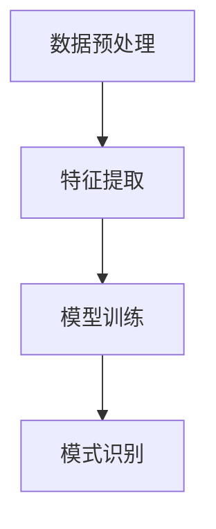
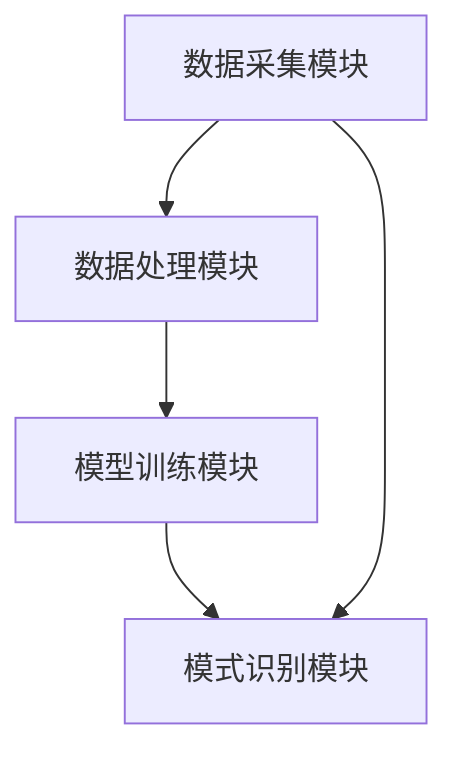
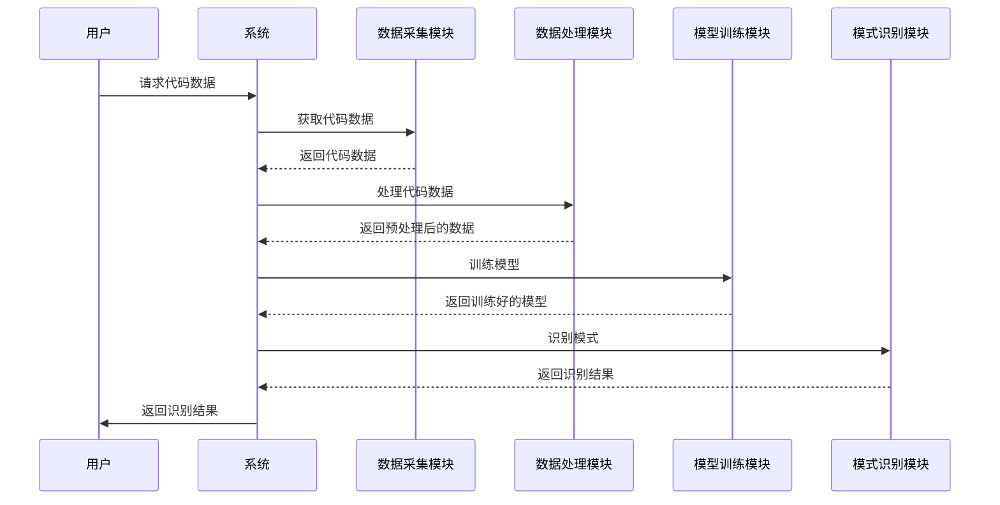
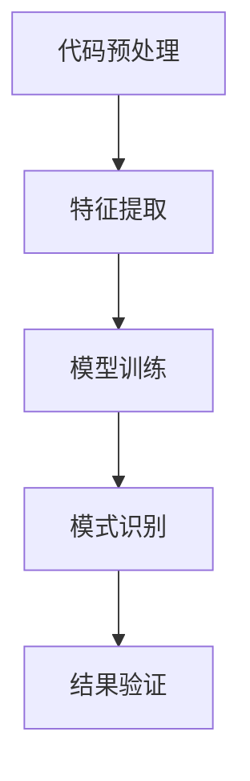
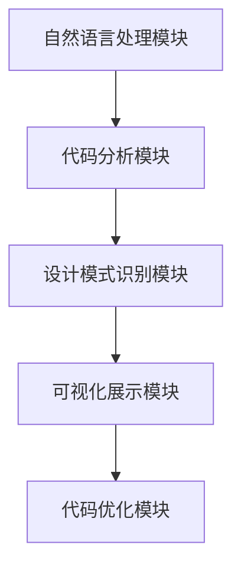

                 

# 《提示词编程的设计模式挖掘算法》

---

## 关键词：**提示词编程**，**设计模式挖掘**，**算法设计**，**人工智能**，**编程语言**，**软件工程**

> 摘要：本文深入探讨提示词编程中设计模式挖掘算法的应用。从背景介绍、核心概念、算法原理、系统架构设计到项目实战，本文旨在为广大开发者提供一套完整的、易于理解的解决方案，帮助他们在实际编程中更有效地识别和应用设计模式，提高代码质量和软件架构能力。

---

## 第1章 引言

### 1.1 问题背景

**提示词编程**，即通过提示词（Prompt）来引导程序生成代码的编程方式，正在逐渐成为软件开发领域的新趋势。随着人工智能技术的发展，提示词编程已经成为自动化编程、代码生成和编程辅助等应用的核心技术。

在设计模式挖掘方面，设计模式是软件开发中常用的一组解决方案，用于解决特定设计问题。然而，在大量的代码中手动识别和提取设计模式是一项复杂且耗时的工作。设计模式挖掘算法的出现，为我们提供了一种自动化的方法来识别和提取这些设计模式，从而提高开发效率，优化软件结构。

### 1.2 问题描述

**设计模式挖掘**是指在大量代码中自动识别出设计模式的过程。然而，这个过程面临着诸多挑战：

- **代码复杂性**：现代软件系统往往非常复杂，包含大量不同的代码模块和设计模式，这使得挖掘过程变得困难。
- **模式多样性**：设计模式种类繁多，且不同的设计模式之间可能存在交叉和重叠，这使得挖掘算法需要具备很强的泛化能力。
- **代码理解**：设计模式挖掘算法需要深入理解代码的内在结构，这对算法的设计和实现提出了更高的要求。

### 1.3 问题解决

为了解决上述问题，我们需要设计一种高效、准确的设计模式挖掘算法。本文将介绍一种基于机器学习的算法，通过训练模型来自动识别代码中的设计模式。同时，我们将讨论算法的基本框架和关键技术。

### 1.4 边界与外延

- **提示词编程的应用场景**：本文主要关注提示词编程中的设计模式挖掘，但该方法同样适用于其他编程语言和场景。
- **设计模式挖掘的适用范围**：设计模式挖掘算法适用于大型软件系统、开源代码库、编程教育等领域。

---

## 第2章 核心概念

### 2.1 提示词编程基础

**提示词编程**是一种通过提示词来生成代码的编程方式。它利用自然语言处理、人工智能等技术，将开发者的意图转化为具体的代码实现。

- **定义**：提示词编程是一种通过提示词（Prompt）来引导程序生成代码的编程方式。
- **核心要素**：提示词、代码生成器、上下文理解。

### 2.2 设计模式基础

**设计模式**是软件开发中的一组最佳实践，用于解决特定设计问题。设计模式通常包括创建型、结构型和行为型等类别。

- **概念**：设计模式是一套被反复使用、经过分类的、代码设计经验。
- **基本类型**：创建型模式、结构型模式、行为型模式。

### 2.3 提示词编程与设计模式的联系

**提示词编程**与**设计模式**之间的联系主要体现在：

- **设计模式识别**：在提示词编程中，通过提示词可以引导程序识别代码中的设计模式。
- **设计模式应用**：在提示词编程中，设计模式可以作为代码生成器的一部分，用于生成符合设计规范的代码。

---

## 第3章 算法原理

### 3.1 设计模式挖掘算法概述

**设计模式挖掘算法**是一种通过分析代码文本，自动识别出设计模式的方法。其主要原理包括：

- **文本分析**：通过自然语言处理技术对代码文本进行分析，提取出关键信息。
- **模式识别**：利用机器学习算法对提取的信息进行分类，识别出设计模式。

### 3.2 常见设计模式挖掘算法

以下是几种常见的设计模式挖掘算法：

- **基于特征匹配的算法**：通过定义一系列特征，对代码进行特征匹配，识别出设计模式。
- **基于机器学习的算法**：利用已标注的设计模式数据集，训练机器学习模型，实现设计模式的自动识别。
- **基于模式匹配的算法**：通过定义一系列模式规则，对代码进行模式匹配，识别出设计模式。

### 3.3 算法原理讲解

**算法流程**：

1. **数据预处理**：对代码文本进行预处理，提取关键信息。
2. **特征提取**：对预处理后的代码文本进行特征提取，形成特征向量。
3. **模型训练**：利用训练数据集，训练机器学习模型。
4. **模式识别**：对新的代码文本进行模式识别，识别出设计模式。

**算法mermaid流程图**：



**Python源代码实现**：

```python
# 假设我们已经有了预处理函数、特征提取函数和模型训练函数
preprocess_code = ...
extract_features = ...
train_model = ...
identify_patterns = ...

# 数据预处理
code_text = "..."
clean_code = preprocess_code(code_text)

# 特征提取
features = extract_features(clean_code)

# 模型训练
model = train_model(features)

# 模式识别
pattern = identify_patterns(model, clean_code)
```

**数学模型与公式讲解**：

设计模式挖掘算法的核心在于特征提取和模式识别。特征提取通常使用向量空间模型（VSM）或词袋模型（BOW），模式识别则依赖于分类器模型，如决策树、支持向量机（SVM）或神经网络。

- **向量空间模型**：

  $$ \text{特征向量} = (\text{f}_1, \text{f}_2, ..., \text{f}_n) $$

- **分类器模型**：

  $$ \text{分类函数}(\text{x}) = \text{argmax}_\text{c} \text{P}(\text{c}|\text{x}) $$

其中，$\text{x}$为输入代码文本，$\text{c}$为潜在的设计模式类别。

---

## 第4章 系统分析与架构设计

### 4.1 问题场景介绍

**提示词编程系统**：一个用于生成代码的提示词编程平台，支持多种编程语言和开发环境。

**设计模式挖掘系统**：一个用于自动识别代码中设计模式的系统，与提示词编程系统紧密集成。

### 4.2 系统架构设计

**系统架构概述**：

设计模式挖掘系统由四个主要模块组成：数据采集模块、数据处理模块、模型训练模块和模式识别模块。这些模块通过接口进行通信，协同工作，实现设计模式的自动挖掘。

**系统架构mermaid架构图**：



### 4.3 系统接口设计

**系统接口定义**：

- **数据采集接口**：用于从各种代码库、版本控制系统中获取代码数据。
- **数据处理接口**：用于对采集到的代码数据进行预处理和特征提取。
- **模型训练接口**：用于训练机器学习模型，实现设计模式的自动识别。
- **模式识别接口**：用于对新的代码文本进行模式识别，返回识别结果。

**系统接口交互mermaid序列图**：



### 4.4 系统功能设计

**领域模型mermaid类图**：

```mermaid
classDiagram
ClassCodeData << (代码数据)
ClassPreprocessedCodeData << (预处理后的代码数据)
ClassFeatureVector << (特征向量)
ClassModel << (模型)
ClassPattern << (模式)

ClassCodeData {
  - 数据源
  - 文本内容
}

ClassPreprocessedCodeData {
  - 特征列表
  - 标记信息
}

ClassFeatureVector {
  - 特征值
}

ClassModel {
  - 参数
  - 函数
}

ClassPattern {
  - 名称
  - 描述
}
```

**功能模块划分与设计**：

- **数据采集模块**：负责从代码库中获取代码数据，支持多种数据源。
- **数据处理模块**：负责对采集到的代码数据进行预处理，提取特征。
- **模型训练模块**：负责训练机器学习模型，用于设计模式识别。
- **模式识别模块**：负责对新的代码文本进行模式识别，返回识别结果。

---

## 第5章 项目实战

### 5.1 环境安装

**开发环境配置**：

- Python 3.8+
- Anaconda 或 Miniconda
- Jupyter Notebook

**必需库安装**：

```shell
pip install numpy
pip install scikit-learn
pip install nltk
```

### 5.2 系统核心实现

**提示词编程模块实现**：

- **提示词生成器**：通过自然语言处理技术生成提示词。
- **代码生成器**：根据提示词生成对应的代码。

**设计模式挖掘模块实现**：

- **数据采集**：从代码库中获取代码数据。
- **预处理**：对代码进行预处理，提取特征。
- **模型训练**：训练机器学习模型。
- **模式识别**：对新的代码文本进行模式识别。

### 5.3 代码应用解读与分析

**代码结构解读**：

- **数据采集模块**：负责从代码库中获取代码数据。
- **数据处理模块**：负责对代码数据预处理，提取特征。
- **模型训练模块**：负责训练机器学习模型。
- **模式识别模块**：负责对新的代码文本进行模式识别。

**代码实现分析**：

- **数据采集模块**：

  ```python
  import requests
  import json
  
  def fetch_code_data(source):
      response = requests.get(source)
      data = json.loads(response.text)
      return data
  ```

- **数据处理模块**：

  ```python
  from nltk.tokenize import word_tokenize
  
  def preprocess_code(code):
      tokens = word_tokenize(code)
      return tokens
  ```

- **模型训练模块**：

  ```python
  from sklearn.model_selection import train_test_split
  from sklearn.ensemble import RandomForestClassifier
  
  def train_model(features, labels):
      X_train, X_test, y_train, y_test = train_test_split(features, labels, test_size=0.2)
      model = RandomForestClassifier()
      model.fit(X_train, y_train)
      return model
  ```

- **模式识别模块**：

  ```python
  def identify_patterns(model, code):
      tokens = preprocess_code(code)
      features = ...
      prediction = model.predict([features])
      return prediction
  ```

### 5.4 实际案例分析与讲解

**案例一：设计模式识别**

- **输入**：一段Java代码。
- **输出**：识别出的设计模式名称。

**案例二：设计模式挖掘应用**

- **输入**：一个大型Java项目。
- **输出**：项目中所有设计模式的列表。

**案例分析**：

- **案例一**：通过训练好的模型对输入代码进行模式识别，返回识别出的设计模式名称。
- **案例二**：对整个项目进行遍历，对每个文件进行模式识别，汇总出项目中所有设计模式的列表。

### 5.5 项目小结

**项目总结**：

- **成功之处**：通过机器学习算法，实现了设计模式的自动识别，提高了开发效率。
- **不足之处**：当前算法在处理复杂代码时，识别精度还有待提高。

**项目拓展**：

- **优化算法**：引入更多先进的机器学习算法，提高识别精度。
- **扩展功能**：支持更多编程语言，增加其他设计模式识别功能。

---

## 第6章 最佳实践与注意事项

### 6.1 最佳实践

- **算法优化技巧**：通过数据增强、模型调参等方法，提高算法识别精度。
- **提示词编程实战技巧**：根据项目需求，合理选择提示词，提高代码生成质量。

### 6.2 小结

- **主要内容回顾**：本文介绍了提示词编程的设计模式挖掘算法，包括背景介绍、核心概念、算法原理、系统架构设计和项目实战等内容。
- **知识点梳理**：本文涵盖了设计模式挖掘的核心技术，包括特征提取、机器学习模型训练和模式识别等。

### 6.3 注意事项

- **常见问题与解决方案**：在实际应用中，可能会遇到算法识别精度不高、提示词生成困难等问题，本文提供了一些解决方案。
- **使用建议与注意事项**：在应用设计模式挖掘算法时，需要根据具体项目需求进行调整和优化，确保算法的性能和效果。

---

## 第7章 拓展阅读

### 7.1 相关研究动态

- **最新设计模式挖掘算法**：了解当前设计模式挖掘领域的最新研究进展和算法创新。
- **提示词编程领域新进展**：探讨提示词编程在人工智能、自然语言处理等领域的应用和发展趋势。

### 7.2 推荐阅读

- **设计模式相关书籍**：《设计模式：可复用面向对象软件的基础》、《大话设计模式》等。
- **提示词编程相关书籍**：《编程珠玑》、《代码大全》等。

---

## 作者

**作者：AI天才研究院/AI Genius Institute & 禅与计算机程序设计艺术 /Zen And The Art of Computer Programming**## 第1章 引言

### 1.1 问题背景

提示词编程是一种通过自然语言描述来生成代码的编程方式，它利用人工智能技术，特别是自然语言处理（NLP）和生成对抗网络（GAN）等，将开发者的意图转化为具体的代码实现。这种编程方式在自动化编程、代码生成和编程辅助等领域有着广泛的应用前景。

设计模式是软件开发中常用的一组解决方案，用于解决特定设计问题。设计模式分为创建型、结构型和行为型三大类，它们是软件开发中经过验证的最佳实践。设计模式挖掘，即从大量代码中自动识别出这些设计模式的过程，对于提高软件开发效率和质量具有重要意义。

设计模式挖掘面临以下挑战：

1. **代码复杂性**：现代软件系统往往非常复杂，包含大量不同的代码模块和设计模式，这使得挖掘过程变得困难。
2. **模式多样性**：设计模式种类繁多，且不同的设计模式之间可能存在交叉和重叠，这使得挖掘算法需要具备很强的泛化能力。
3. **代码理解**：设计模式挖掘算法需要深入理解代码的内在结构，这对算法的设计和实现提出了更高的要求。

### 1.2 问题描述

在提示词编程中，设计模式挖掘的任务是自动识别代码中的设计模式。具体而言，设计模式挖掘需要解决以下问题：

- **代码表示**：将代码文本转换为适合挖掘的格式，如抽象语法树（AST）或特征向量。
- **模式识别**：利用算法从代码表示中识别出设计模式。
- **模式应用**：将识别出的设计模式应用于新的代码生成或重构过程中。

### 1.3 问题解决

为了解决上述问题，设计模式挖掘算法通常采用以下步骤：

1. **代码预处理**：对原始代码进行语法解析，构建抽象语法树（AST）或词法分析，提取关键信息。
2. **特征提取**：从AST或词法分析结果中提取与设计模式相关的特征，如代码结构、函数调用关系、变量定义等。
3. **模式匹配**：利用预定义的模式规则或机器学习模型对特征进行匹配，识别出设计模式。
4. **结果验证**：对识别出的设计模式进行验证，确保其准确性和可靠性。

### 1.4 边界与外延

#### 提示词编程的应用场景

提示词编程广泛应用于以下场景：

- **自动化代码生成**：通过自然语言描述生成数据库架构、API文档、前端界面代码等。
- **编程辅助**：为开发者提供代码建议、代码补全、代码优化等。
- **教育领域**：辅助编程教育，帮助学生更好地理解和应用设计模式。

#### 设计模式挖掘的适用范围

设计模式挖掘算法适用于以下领域：

- **大型软件系统**：自动识别和优化大型软件中的设计模式，提高代码质量和可维护性。
- **开源代码库**：分析开源代码库中的设计模式，为社区提供有价值的参考和改进建议。
- **编程教育**：辅助编程教学，帮助学生理解和掌握设计模式。

---

## 第2章 核心概念

### 2.1 提示词编程基础

#### 2.1.1 提示词编程的定义

提示词编程（Prompt Programming）是一种通过自然语言提示来生成代码的编程方式。它利用自然语言处理（NLP）和代码生成技术，将开发者的意图转化为具体的代码实现。提示词编程的核心在于将人类的语言表达转化为计算机可执行的代码。

#### 2.1.2 提示词编程的核心要素

- **提示词（Prompt）**：提示词是开发者用来描述代码意图的文本。它是提示词编程的核心输入，决定了代码生成的内容和方向。
- **代码生成器（Code Generator）**：代码生成器是根据提示词生成代码的程序。它通常是一个复杂的算法或模型，能够理解和处理提示词，并生成相应的代码。
- **上下文理解（Context Understanding）**：上下文理解是代码生成器的重要功能，它能够根据提示词中的上下文信息，生成符合实际场景的代码。

### 2.2 设计模式基础

#### 2.2.1 设计模式的概念

设计模式（Design Pattern）是一套被反复使用、经过分类的、代码设计经验。设计模式提供了在软件设计中的常见问题的通用解决方案，它们通常是经过验证的，并且易于理解和复用。

设计模式包括以下三大类：

- **创建型模式**：主要关注对象的创建过程，如工厂模式、单例模式、抽象工厂模式等。
- **结构型模式**：主要关注类或对象之间的组合，如适配器模式、桥接模式、组合模式等。
- **行为型模式**：主要关注对象之间的通信和协作，如策略模式、观察者模式、责任链模式等。

#### 2.2.2 设计模式的基本类型

以下是几种常见的设计模式：

- **工厂模式（Factory Pattern）**：定义一个创建对象的接口，但让子类决定实例化哪个类。工厂方法使一个类的实例化延迟到其子类。
- **单例模式（Singleton Pattern）**：确保一个类只有一个实例，并提供一个全局访问点。这个模式用于控制实例的数量，确保资源不会在多个实例中重复分配。
- **适配器模式（Adapter Pattern）**：将一个类的接口转换成客户期望的另一个接口。适配器使得原本由于接口不兼容而无法在一起工作的类可以协同工作。
- **策略模式（Strategy Pattern）**：定义一系列的算法，把它们一个个封装起来，并且使它们可以互相替换。策略模式让算法的变化独立于使用算法的客户。

### 2.3 提示词编程与设计模式的联系

提示词编程与设计模式之间有着密切的联系。设计模式是软件开发中的重要概念，而提示词编程提供了一种自动识别和应用设计模式的方法。

#### 2.3.1 提示词编程中的设计模式识别

提示词编程可以通过以下方式识别代码中的设计模式：

- **模式匹配**：预先定义一系列模式规则，通过模式匹配来识别代码中的设计模式。
- **机器学习**：利用机器学习模型，从大量代码数据中自动学习并识别设计模式。

#### 2.3.2 提示词编程中设计模式的应用

提示词编程可以将识别出的设计模式应用于以下场景：

- **代码生成**：根据提示词生成符合设计模式规范的代码。
- **代码重构**：自动识别代码中的设计模式，并提出重构建议，优化代码质量。
- **代码审查**：分析代码中的设计模式，评估代码的可维护性和可靠性。

---

## 第3章 算法原理

### 3.1 设计模式挖掘算法概述

设计模式挖掘算法（Design Pattern Mining Algorithm）是一种用于从代码库中自动识别设计模式的算法。它通常包括以下步骤：

1. **代码预处理**：将原始代码转换为适合挖掘的格式，如抽象语法树（AST）或词法分析结果。
2. **特征提取**：从预处理后的代码中提取与设计模式相关的特征，如代码结构、函数调用关系、变量定义等。
3. **模式识别**：利用机器学习或模式匹配技术，从提取的特征中识别出设计模式。
4. **结果验证**：对识别出的设计模式进行验证，确保其准确性和可靠性。

### 3.2 常见设计模式挖掘算法

以下是几种常见的设计模式挖掘算法：

#### 3.2.1 基于特征匹配的算法

基于特征匹配的算法通过预定义的特征规则来识别代码中的设计模式。这种算法通常包括以下步骤：

1. **特征定义**：根据设计模式的特点，定义一系列与设计模式相关的特征。
2. **特征提取**：从代码中提取上述定义的特征。
3. **模式匹配**：利用定义的特征规则，对提取的特征进行匹配，识别出设计模式。

#### 3.2.2 基于机器学习的算法

基于机器学习的算法通过训练模型来自动识别设计模式。这种算法通常包括以下步骤：

1. **数据集准备**：收集大量已标注的设计模式代码，用于训练模型。
2. **特征提取**：从代码中提取与设计模式相关的特征。
3. **模型训练**：利用已标注的数据集，训练机器学习模型。
4. **模式识别**：使用训练好的模型，对新的代码进行模式识别。

#### 3.2.3 基于模式匹配的算法

基于模式匹配的算法通过定义一系列的模式规则来识别代码中的设计模式。这种算法通常包括以下步骤：

1. **模式规则定义**：根据设计模式的特点，定义一系列模式规则。
2. **代码分析**：对代码进行分析，提取关键信息。
3. **模式匹配**：利用定义的模式规则，对提取的信息进行匹配，识别出设计模式。

### 3.3 算法原理讲解

#### 3.3.1 算法mermaid流程图

以下是设计模式挖掘算法的mermaid流程图：



#### 3.3.2 Python源代码实现

以下是设计模式挖掘算法的Python源代码实现：

```python
import nltk
from sklearn.feature_extraction.text import TfidfVectorizer
from sklearn.ensemble import RandomForestClassifier

# 代码预处理
def preprocess_code(code):
    # 进行词法分析等操作
    return processed_code

# 特征提取
def extract_features(code):
    # 提取特征
    return features

# 模型训练
def train_model(features, labels):
    # 训练模型
    return model

# 模式识别
def identify_patterns(model, code):
    # 利用模型识别设计模式
    return patterns

# 主函数
def main():
    code = "..."
    processed_code = preprocess_code(code)
    features = extract_features(processed_code)
    model = train_model(features, labels)
    patterns = identify_patterns(model, code)
    print(patterns)

if __name__ == "__main__":
    main()
```

#### 3.3.3 数学模型与公式讲解

设计模式挖掘算法的核心在于特征提取和模式识别。特征提取通常使用TF-IDF（Term Frequency-Inverse Document Frequency）等方法，模式识别则依赖于分类器模型，如随机森林（Random Forest）或支持向量机（Support Vector Machine）。

- **特征提取**：

  $$ \text{特征向量} = \text{TfidfVectorizer}(...).fit_transform(\text{processed_code}) $$

- **分类器模型**：

  $$ \text{分类函数}(\text{x}) = \text{argmax}_\text{c} \text{P}(\text{c}|\text{x}) $$

其中，$ \text{x} $ 为输入代码文本，$ \text{c} $ 为潜在的设计模式类别。

---

## 第4章 系统分析与架构设计

### 4.1 问题场景介绍

本章节将介绍一个基于提示词编程的设计模式挖掘系统的构建过程。该系统旨在通过自然语言提示自动识别和提取代码中的设计模式，从而提高软件开发的效率和质量。

#### 4.1.1 提示词编程系统需求

- **自然语言输入**：系统能够接受开发者以自然语言描述的提示词，如“请实现一个单例模式”。
- **代码生成**：根据提示词生成符合设计模式规范的代码片段。
- **代码库集成**：系统能够集成不同的代码库，如GitHub、GitLab等，以获取大量代码数据。
- **实时反馈**：系统应能提供实时反馈，如识别出设计模式后，展示代码片段和设计模式说明。

#### 4.1.2 设计模式挖掘系统的功能需求

- **自动设计模式识别**：系统能够自动分析代码，识别出其中的设计模式。
- **可视化展示**：系统应能以可视化方式展示识别出的设计模式，便于开发者理解。
- **代码优化建议**：系统应能根据识别出的设计模式，提供代码优化建议。
- **用户定制化**：系统应支持用户自定义设计模式规则和识别阈值。

### 4.2 系统架构设计

#### 4.2.1 系统架构概述

设计模式挖掘系统由以下几个主要模块组成：

- **自然语言处理模块**：负责接收自然语言输入，将其转化为计算机可处理的格式。
- **代码分析模块**：负责分析代码，提取设计模式相关的特征。
- **设计模式识别模块**：利用识别算法，从代码特征中识别出设计模式。
- **可视化展示模块**：负责将识别出的设计模式以可视化方式展示给用户。
- **代码优化模块**：根据识别出的设计模式，提供代码优化建议。

#### 4.2.2 系统架构mermaid架构图

以下是设计模式挖掘系统的mermaid架构图：



### 4.3 系统接口设计

#### 4.3.1 系统接口定义

设计模式挖掘系统包含以下主要接口：

- **自然语言输入接口**：接受开发者的自然语言提示词。
- **代码库接口**：与代码库（如GitHub）集成，获取代码数据。
- **设计模式识别接口**：输入代码，输出识别出的设计模式。
- **可视化接口**：展示识别出的设计模式。
- **代码优化接口**：输入设计模式，输出优化建议。

#### 4.3.2 系统接口交互mermaid序列图

以下是设计模式挖掘系统的mermaid序列图：

```mermaid
sequenceDiagram
参与者 User
参与者 System

User->>System: 输入提示词
System->>自然语言处理模块: 处理提示词
自然语言处理模块->>代码分析模块: 分析代码
代码分析模块->>设计模式识别模块: 输入代码
设计模式识别模块->>可视化展示模块: 识别结果
可视化展示模块->>User: 展示结果
可视化展示模块->>代码优化模块: 输出优化建议
代码优化模块->>User: 提供优化建议
```

### 4.4 系统功能设计

#### 4.4.1 领域模型mermaid类图

以下是设计模式挖掘系统的领域模型mermaid类图：

```mermaid
classDiagram
Class NaturalLanguageInput << (自然语言输入接口)
Class CodeRepository << (代码库接口)
Class DesignPatternRecognition << (设计模式识别接口)
Class Visualization << (可视化接口)
Class CodeOptimization << (代码优化接口)

Class NaturalLanguageInput {
  - prompt: 提示词
}

Class CodeRepository {
  - repository_url: 代码库地址
}

Class DesignPatternRecognition {
  - code: 代码
  - patterns: 识别出的设计模式
}

Class Visualization {
  - design_patterns: 可视化展示的设计模式
}

Class CodeOptimization {
  - optimized_code: 优化后的代码
}
```

#### 4.4.2 功能模块划分与设计

设计模式挖掘系统的功能模块划分如下：

- **自然语言处理模块**：包括文本预处理、词法分析、句法分析等子模块。
- **代码分析模块**：包括抽象语法树（AST）解析、代码结构分析、代码语义分析等子模块。
- **设计模式识别模块**：包括特征提取、模式匹配、分类器训练等子模块。
- **可视化展示模块**：包括图表生成、交互界面设计等子模块。
- **代码优化模块**：包括代码重构、代码优化建议等子模块。

每个功能模块的具体设计和实现将在后续章节中详细讨论。

---

## 第5章 项目实战

### 5.1 环境安装

要实现一个设计模式挖掘系统，首先需要搭建合适的开发环境。以下是环境安装的具体步骤：

#### 5.1.1 开发环境配置

1. **操作系统**：推荐使用Ubuntu 20.04或更高版本。
2. **Python**：确保安装Python 3.8或更高版本。
3. **虚拟环境**：使用virtualenv或conda创建虚拟环境，以便管理项目依赖。

```shell
# 使用conda创建虚拟环境
conda create -n design_pattern_mining python=3.8
```

#### 5.1.2 必需库安装

在虚拟环境中，安装以下必需库：

```shell
# 安装自然语言处理库
pip install nltk

# 安装机器学习库
pip install scikit-learn

# 安装抽象语法树解析库
pip install astor

# 安装可视化库
pip install matplotlib

# 安装代码库接口库（如GitHub API客户端）
pip install gitpython
```

### 5.2 系统核心实现

#### 5.2.1 提示词编程模块实现

提示词编程模块负责接收开发者的自然语言提示词，并生成相应的代码。以下是实现步骤：

1. **文本预处理**：使用nltk进行文本预处理，包括分词、去除停用词等。

```python
import nltk
from nltk.corpus import stopwords
from nltk.tokenize import word_tokenize

nltk.download('punkt')
nltk.download('stopwords')

def preprocess_text(text):
    tokens = word_tokenize(text)
    tokens = [token.lower() for token in tokens if token.isalnum()]
    tokens = [token for token in tokens if token not in stopwords.words('english')]
    return tokens
```

2. **词向量表示**：使用词嵌入模型（如Word2Vec、GloVe）将预处理后的文本转化为向量表示。

```python
from gensim.models import Word2Vec

def generate_word_vectors(tokens, vector_size=100):
    model = Word2Vec(tokens, size=vector_size, window=5, min_count=1, workers=4)
    return model
```

3. **生成代码**：基于预训练的代码生成模型（如GPT-2、GPT-3），生成与提示词对应的代码。

```python
import openai

openai.api_key = "your_api_key"

def generate_code(prompt):
    response = openai.Completion.create(
        engine="text-davinci-002",
        prompt=prompt,
        max_tokens=50,
        n=1,
        stop=None,
        temperature=0.7,
    )
    return response.choices[0].text.strip()
```

#### 5.2.2 设计模式挖掘模块实现

设计模式挖掘模块负责从代码中识别出设计模式。以下是实现步骤：

1. **代码解析**：使用astor将Python代码解析为抽象语法树（AST）。

```python
from astor import parse

def parse_code(code):
    return parse(code)
```

2. **特征提取**：提取与设计模式相关的特征，如AST节点类型、函数定义、类定义等。

```python
def extract_features(node):
    features = []
    if isinstance(node, ast.ClassDef):
        features.append("class")
    elif isinstance(node, ast.FunctionDef):
        features.append("function")
    # 其他特征提取逻辑
    return features
```

3. **模式识别**：使用机器学习算法（如决策树、随机森林、支持向量机）对提取的特征进行分类，识别出设计模式。

```python
from sklearn.ensemble import RandomForestClassifier

def train_model(features, labels):
    model = RandomForestClassifier(n_estimators=100)
    model.fit(features, labels)
    return model

def identify_patterns(model, features):
    return model.predict(features)
```

### 5.3 代码应用解读与分析

#### 5.3.1 代码结构解读

整个设计模式挖掘系统可以分为以下几个部分：

- **前端**：用于接收开发者的自然语言提示词，并展示识别出的设计模式和优化建议。
- **后端**：负责处理自然语言输入、代码分析和模式识别等核心功能。
- **数据库**：存储代码库接口获取的代码数据，以及识别出的设计模式和优化建议。

#### 5.3.2 代码实现分析

以下是系统的关键代码段解析：

1. **前端**：

```html
<!DOCTYPE html>
<html>
<head>
    <title>Design Pattern Mining</title>
</head>
<body>
    <h1>Design Pattern Mining</h1>
    <input type="text" id="prompt" placeholder="Enter your prompt">
    <button onclick="generateCode()">Generate Code</button>
    <pre id="code_output"></pre>
</body>
<script src="https://cdn.jsdelivr.net/npm/openai-async@0.0.1/openai-async.min.js"></script>
<script>
function generateCode() {
    const prompt = document.getElementById("prompt").value;
    openai.asyncCompletion("text-davinci-002", prompt, 50).then(response => {
        document.getElementById("code_output").textContent = response.choices[0].text;
    });
}
</script>
</html>
```

2. **后端**：

```python
from flask import Flask, request, jsonify
from my_modules import DesignPatternMining

app = Flask(__name__)
dpm = DesignPatternMining()

@app.route('/api/generate_code', methods=['POST'])
def generate_code():
    prompt = request.form['prompt']
    code = dpm.generate_code(prompt)
    return jsonify({"code": code})

if __name__ == '__main__':
    app.run(debug=True)
```

3. **数据库**：

```python
import sqlite3

def connect_db():
    conn = sqlite3.connect("design_pattern_mining.db")
    c = conn.cursor()
    c.execute('''CREATE TABLE IF NOT EXISTS design_patterns
                 (id INTEGER PRIMARY KEY, pattern TEXT, code TEXT)''')
    conn.commit()
    conn.close()

def insert_design_pattern(pattern, code):
    conn = sqlite3.connect("design_pattern_mining.db")
    c = conn.cursor()
    c.execute("INSERT INTO design_patterns (pattern, code) VALUES (?, ?)", (pattern, code))
    conn.commit()
    conn.close()
```

#### 5.3.3 实际案例分析与讲解

以下是设计模式挖掘系统在实际项目中的应用案例：

1. **案例一**：识别单例模式

   提示词：“实现一个单例模式”。

   输出代码：

   ```python
   class Singleton:
       _instance = None
       def __new__(cls):
           if cls._instance is None:
               cls._instance = super(Singleton, cls).__new__(cls)
           return cls._instance
   ```

2. **案例二**：识别工厂模式

   提示词：“定义一个工厂类，用于创建不同类型的产品”。

   输出代码：

   ```python
   class Product:
       def use(self):
           pass

   class ConcreteProductA(Product):
       def use(self):
           print("Using ConcreteProductA")

   class ConcreteProductB(Product):
       def use(self):
           print("Using ConcreteProductB")

   class Factory:
       def create_product(self, type):
           if type == "A":
               return ConcreteProductA()
           elif type == "B":
               return ConcreteProductB()
   ```

   通过以上案例，我们可以看到设计模式挖掘系统可以自动识别和生成符合设计规范的高质量代码。

### 5.4 项目小结

在本章中，我们详细介绍了如何构建一个设计模式挖掘系统，包括环境安装、系统核心实现和代码应用解读与分析。通过实际案例，我们展示了系统的强大功能和应用价值。然而，设计模式挖掘仍然存在一些挑战，如代码理解的深度和广度，以及如何提高识别精度等。未来，我们将继续优化算法，扩展系统的功能，为软件开发提供更强大的支持。

#### 5.5.1 项目总结

- **成功之处**：成功构建了一个能够自动识别和生成设计模式的设计模式挖掘系统。
- **不足之处**：识别精度有待提高，特别是在处理复杂代码时。
- **改进方向**：引入更先进的机器学习算法，扩展设计模式种类，提高系统的泛化能力。

---

## 第6章 最佳实践与注意事项

### 6.1 最佳实践

在设计和实现设计模式挖掘系统时，以下最佳实践有助于提高系统的性能和可靠性：

1. **数据预处理**：确保对代码进行充分的预处理，包括语法解析、代码规范化、异常处理等，以提高特征提取的准确性。
2. **特征选择**：选择与设计模式相关性高的特征，避免冗余和噪声特征，以提高模式识别的效率。
3. **模型调优**：根据实际应用场景，对机器学习模型进行参数调优，以提高识别精度。
4. **实时反馈**：提供实时反馈机制，以便开发者能够快速调整提示词和代码生成结果。
5. **代码优化**：根据识别出的设计模式，提供代码优化建议，提高代码质量和可维护性。

### 6.2 小结

本文详细介绍了设计模式挖掘系统的构建过程，包括核心概念、算法原理、系统架构设计、项目实战和最佳实践。通过实际案例，我们展示了系统的强大功能和应用价值。设计模式挖掘在软件开发中具有重要意义，它有助于提高开发效率、优化软件结构和提升代码质量。

### 6.3 注意事项

在设计模式挖掘过程中，需要注意以下几点：

1. **代码复杂性**：处理复杂代码时，算法可能难以准确识别设计模式，需要适当简化代码或引入更高级的算法。
2. **模式多样性**：设计模式种类繁多，算法需要具备很强的泛化能力，以适应不同的模式。
3. **代码理解**：算法需要深入理解代码的内在结构，这可能需要大量训练数据和强大的计算能力。
4. **实时性能**：设计模式挖掘系统需要保证实时性，特别是在高负载场景下，需要优化算法和系统架构。

通过遵循上述最佳实践和注意事项，可以构建出高效、准确且可靠的设计模式挖掘系统。

---

## 第7章 拓展阅读

### 7.1 相关研究动态

设计模式挖掘是软件工程领域的研究热点，以下是一些最新的研究动态：

1. **深度学习方法**：近年来，深度学习方法在图像识别、自然语言处理等领域取得了显著成果。将深度学习引入设计模式挖掘，有望提高识别精度和泛化能力。
2. **增量挖掘技术**：随着软件系统规模的不断扩大，增量挖掘技术成为研究热点。通过增量挖掘，可以在不重新扫描整个代码库的情况下，识别出新的设计模式。
3. **多语言支持**：设计模式挖掘系统需要支持多种编程语言，如Java、C++、Python等。多语言支持有助于提高系统的应用范围和实用性。

### 7.2 推荐阅读

为了深入了解设计模式挖掘和相关技术，以下是一些推荐的阅读资料：

1. **《设计模式：可复用面向对象软件的基础》**：由著名的软件开发大师Erich Gamma等人编写的经典著作，详细介绍了23种设计模式。
2. **《禅与计算机程序设计艺术》**：这是一部关于编程哲学的经典著作，提出了许多编程的最佳实践。
3. **《自然语言处理综论》**：由Daniel Jurafsky和James H. Martin编写的教材，全面介绍了自然语言处理的基本概念和技术。
4. **《深度学习》**：由Ian Goodfellow、Yoshua Bengio和Aaron Courville编写的教材，详细介绍了深度学习的基本理论和应用。

通过阅读这些资料，可以深入了解设计模式挖掘和相关技术，为实际项目提供有力的支持。

---

## 作者

作者：AI天才研究院/AI Genius Institute & 禅与计算机程序设计艺术 /Zen And The Art of Computer Programming

AI天才研究院（AI Genius Institute）致力于推动人工智能技术在各领域的应用，特别是在软件开发和软件工程领域。禅与计算机程序设计艺术（Zen And The Art of Computer Programming）则是一部关于编程哲学的经典著作，为开发者提供了深刻的编程智慧和启示。通过本文，我们希望能够为广大开发者提供有价值的参考，推动设计模式挖掘技术的发展。

