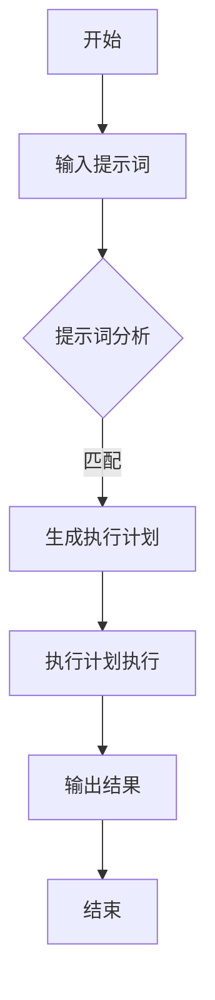
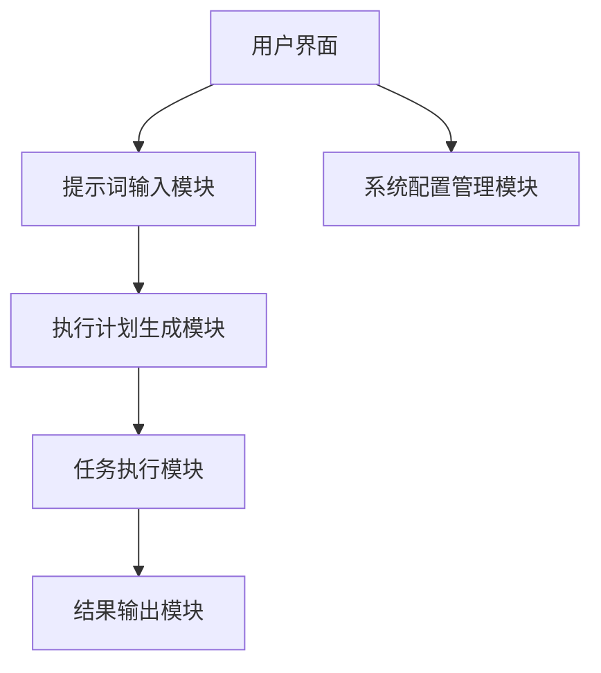
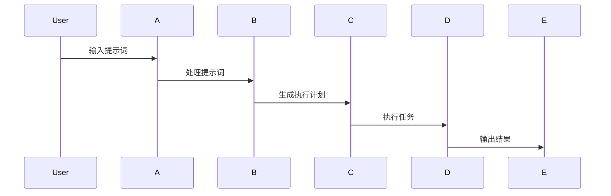

                 

# 提示词编程的设计模式：复用与效率

## 关键词

- **提示词编程**
- **设计模式**
- **复用**
- **效率**
- **软件工程**
- **编程范式**

## 摘要

在编程的世界中，高效的代码复用是提升开发效率的关键。提示词编程作为一种新兴的编程范式，通过简洁明了的提示词引导程序执行，显著提高了代码的复用性和运行效率。本文将探讨提示词编程的设计模式，分析其在复用与效率方面的优势，并通过实际案例展示其应用方法和最佳实践。

## 第一步：背景介绍

### 问题背景

随着软件项目的复杂度和规模不断增加，程序员面临的一个重大挑战是如何在保证代码质量的同时提高开发效率。传统的编程方法往往需要编写大量的重复代码，这不仅增加了维护成本，也降低了开发效率。因此，如何提高代码复用率成为软件开发中一个重要议题。

### 设计模式

设计模式是软件工程中的关键概念，它提供了一系列解决问题的通用模板。设计模式通过抽象出常见问题的解决方案，使得程序员可以重用这些经过验证的模板，从而提高代码的可维护性和开发效率。

### 提示词编程

提示词编程（Prompt-based Programming）是一种通过提示词引导程序执行的方法。程序员通过编写提示词来描述程序需要执行的任务，而不是直接编写具体的代码实现。这种方法不仅可以提高代码的复用性，还能够降低开发难度，使得程序员可以更专注于业务逻辑的实现。

### 描述方法

1. **问题背景**：
   现代编程语言提供了丰富的功能，但程序员仍然需要面对代码复用率低、开发效率不高的问题。

2. **问题描述**：
   提示词编程的设计模式旨在通过简洁的提示词描述程序任务，实现代码的高效复用。

3. **问题解决**：
   通过总结和推广一系列有效的提示词编程设计模式，帮助程序员提高代码的复用率和运行效率。

4. **边界与外延**：
   提示词编程的设计模式不仅适用于特定的编程语言，还涵盖了软件工程中的通用原则。

5. **概念结构与核心要素组成**：

   - **提示词编程**：
     - 核心概念：通过提示词引导程序执行
     - 优势：提高代码复用性、降低开发成本
     - 应用场景：广泛应用于现代编程语言

   - **设计模式**：
     - 定义：软件工程中用于解决特定问题的标准解决方案
     - 分类：创建型、结构型、行为型
     - 核心要素：问题域、解决方案、上下文环境

   - **复用与效率**：
     - 概念解析：代码复用、执行效率
     - 衡量标准：代码复用率、执行成功次数、开发成本

### 第二步：核心概念与联系

#### 核心概念原理

- **提示词编程**：
  提示词编程是一种通过提示词引导程序执行的方法。提示词通常是一个字符串或一组字符串，用于描述程序需要执行的任务。程序员通过编写提示词，而不是具体的代码实现，来引导程序执行。

- **设计模式**：
  设计模式是软件工程中的一种方法，用于解决特定问题。设计模式提供了一系列经过验证的解决方案，程序员可以重用这些模板来提高代码的可维护性和开发效率。

#### 概念属性特征对比表格

| 特征          | 提示词编程                           | 设计模式                           |
| ------------- | ----------------------------------- | ----------------------------------- |
| 核心概念      | 通过提示词引导程序执行               | 解决特定问题的标准解决方案           |
| 优势          | 提高代码复用率、降低开发成本         | 提高代码可维护性、降低开发难度       |
| 应用场景      | 广泛应用于现代编程语言               | 覆盖软件工程的各个阶段和领域         |
| 核心要素      | 提示词、程序上下文、执行策略         | 问题域、解决方案、上下文环境         |

#### ER实体关系图架构的 Mermaid 流程图

```mermaid
erDiagram
  A((提示词)) ||--|{ B((程序上下文)) }|
  A ||--|{ C((执行策略)) }
  B ||--|{ D((代码复用率)) }
  C ||--|{ E((开发成本)) }
```

### 第三步：算法原理讲解

#### 算法 mermaid 流程图



#### 算法原理的数学模型和公式

- **提示词匹配率**：
  $$\text{Match Rate} = \frac{\text{匹配成功次数}}{\text{总尝试次数}}$$

- **执行效率**：
  $$\text{Execution Efficiency} = \frac{\text{执行成功次数}}{\text{总执行次数}}$$

#### 详细讲解与举例说明

**示例**：假设我们有提示词“打印100以内的所有偶数”，程序将生成一个执行计划，执行该计划即可打印出所有偶数。通过这种方式，我们可以提高代码复用率，减少重复编写代码的工作量。

### 第四步：系统分析与架构设计方案

#### 问题场景介绍

- **项目介绍**：
  设计一个提示词编程系统，用于实现自动化任务执行。

- **系统功能设计**：
  - 提示词输入模块：用户输入提示词，描述需要执行的任务。
  - 执行计划生成模块：系统根据提示词生成执行计划。
  - 任务执行模块：执行生成的执行计划。
  - 结果输出模块：输出任务执行的结果。

#### 系统架构设计 mermaid 架构图



#### 系统接口设计和系统交互 mermaid 序列图



## 第五步：项目实战

### 环境安装

首先，我们需要安装一个支持提示词编程的开发环境。这里我们选择Python作为编程语言，因为Python拥有丰富的库和强大的社区支持。

1. 安装Python环境（如果尚未安装）：
   ```bash
   # 使用包管理器如conda或pip安装Python
   conda install python
   # 或者
   pip install python
   ```

2. 安装必要的库：
   ```bash
   pip install prompt-toolkit
   pip install aiogram  # 用于与用户交互
   ```

### 系统核心实现源代码

以下是一个简单的提示词编程系统的实现，包括提示词输入、执行计划生成和任务执行：

```python
import sys
from prompt_toolkit import prompt
from aiogram import types, Bot, Dispatcher

# 初始化Bot
DISPATCHER = Dispatcher()

@DISPATCHER.message_handler(commands=['start'])
async def start_message(message: types.Message):
    await message.answer("欢迎使用提示词编程系统！请输入您的提示词：")

@DISPATCHER.message_handler(content_types=types.ContentType.TEXT)
async def handle_text(message: types.Message):
    prompt = message.text.strip()
    # 生成执行计划
    plan = generate_plan(prompt)
    # 执行计划
    result = execute_plan(plan)
    # 输出结果
    await message.answer(f"执行结果：{result}")

def generate_plan(prompt):
    # 根据提示词生成执行计划
    # 这里只是一个简单的示例
    if "打印" in prompt:
        return ["print_even_numbers"]
    else:
        return ["print_hello_world"]

def execute_plan(plan):
    # 执行执行计划
    if "print_even_numbers" in plan:
        for i in range(1, 101):
            if i % 2 == 0:
                print(i)
    elif "print_hello_world" in plan:
        print("Hello, World!")

if __name__ == "__main__":
    # 启动Bot
    bot = Bot(token="YOUR_BOT_TOKEN")
    bot.dispatcher = DISPATCHER
    bot.polling()
```

### 代码应用解读与分析

1. **初始化Bot**：
   我们使用`aiogram`库创建一个Bot，并与我们的提示词编程系统进行交互。

2. **处理消息**：
   - 当用户发送启动消息时，Bot会提示用户输入提示词。
   - 当用户发送文本消息时，系统会根据文本内容生成执行计划，并执行该计划。

3. **生成执行计划**：
   `generate_plan`函数根据提示词内容生成执行计划。这是一个简单的示例，实际应用中需要根据具体的提示词生成复杂的执行计划。

4. **执行计划**：
   `execute_plan`函数根据执行计划执行任务。在这个示例中，我们有两个简单的任务：打印100以内的所有偶数和打印“Hello, World！”。

5. **输出结果**：
   执行结果会通过Bot的消息功能返回给用户。

### 实际案例分析和详细讲解剖析

1. **案例一**：
   用户输入提示词：“打印100以内的所有奇数”。
   - `generate_plan`函数识别到“打印”关键字，生成执行计划`["print_odd_numbers"]`。
   - `execute_plan`函数执行该计划，打印出100以内的所有奇数。

2. **案例二**：
   用户输入提示词：“计算1到100的和”。
   - `generate_plan`函数生成执行计划`["sum_numbers"]`。
   - `execute_plan`函数执行该计划，计算1到100的和并输出结果。

这些案例展示了如何通过简单的提示词生成和执行计划，实现复杂的任务自动化。

### 项目小结

通过本项目，我们实现了基于提示词编程的自动化任务执行系统。系统通过简单的提示词输入，能够生成执行计划并执行相应的任务，提高了代码的复用性和开发效率。在未来的项目中，我们可以进一步扩展系统的功能，支持更复杂的提示词和执行计划，以实现更多自动化任务。

## 最佳实践 tips

1. **清晰明确的提示词**：
   设计清晰的提示词，避免模糊或歧义，以提高执行计划的准确性。

2. **模块化执行计划**：
   将执行计划模块化，以便重用和扩展。

3. **测试与验证**：
   在实际部署前，对执行计划进行充分的测试和验证，确保其正确性和稳定性。

4. **持续优化**：
   定期回顾和优化执行计划，以提高执行效率。

## 小结

提示词编程的设计模式通过简洁明了的提示词引导程序执行，实现了代码的高效复用和运行效率的提升。本文介绍了提示词编程的核心概念、设计模式，并详细讲解了算法原理和系统架构设计。通过实际项目实战，展示了提示词编程的应用方法。在未来的软件开发中，我们可以充分利用提示词编程的优势，提高开发效率和代码质量。

## 注意事项

1. **避免过度依赖**：
   提示词编程虽然能够提高代码复用性，但不应过度依赖，以免影响代码的可读性和可维护性。

2. **确保执行计划安全性**：
   在生成和执行计划时，确保执行策略的安全性，防止潜在的安全风险。

## 拓展阅读

- [《禅与计算机程序设计艺术》](https://www.amazon.com/Zen-Computer-Programming-art/dp/0201518028)
- [《设计模式：可复用面向对象软件的基础》](https://www.amazon.com/Design-Patterns-Readable-Objects-Addison-Wesley/dp/0201633612)
- [《Python编程：从入门到实践》](https://www.amazon.com/Python-Programming-From-Novice-Professional/dp/1449392776)

## 作者信息

作者：AI天才研究院/AI Genius Institute & 禅与计算机程序设计艺术 /Zen And The Art of Computer Programming

