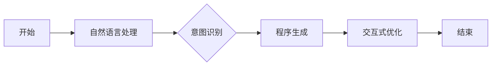
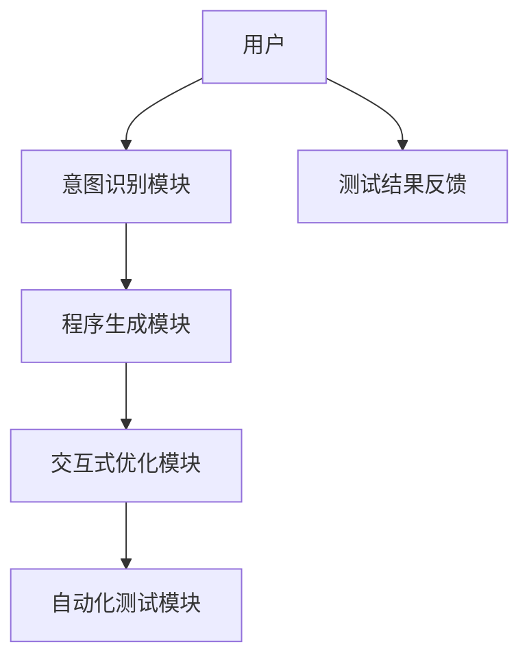
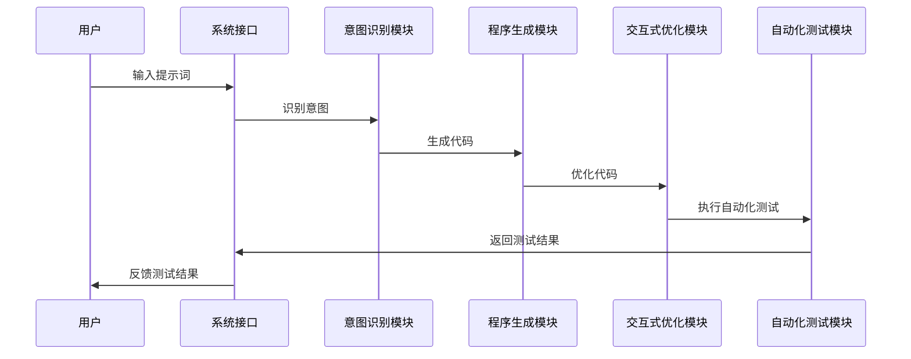

                 

# 提示词编程的软件验证技术

## 关键词
- 提示词编程
- 软件验证
- 验证技术
- 自动化测试
- 代码审查
- 人工智能

## 摘要
本文将深入探讨提示词编程的软件验证技术，分析其在现代软件开发中的应用和重要性。我们将从提示词编程的基本概念入手，逐步展开对软件验证技术的探讨，包括自动化测试、代码审查和人工智能在软件验证中的应用。本文旨在为软件开发者提供一套完整的软件验证方法，帮助他们提高软件质量和开发效率。

## 背景介绍

### 提示词编程的概念

提示词编程（Prompt Programming）是一种利用提示词（Prompt）来指导计算机程序编写的方法。提示词可以被视为一种自然语言输入，用于引导程序的行为和决策。与传统的编程方式不同，提示词编程更加强调人类的参与，通过自然的语言交互来指导程序的运行。

### 软件验证的背景

软件验证是确保软件系统正确性和可靠性的过程。随着软件系统越来越复杂，软件验证的重要性日益凸显。传统的验证方法如代码审查和测试，虽然在某种程度上能够提高软件质量，但往往效率低下，且难以覆盖所有可能的错误场景。

### 提示词编程与软件验证的关系

提示词编程的引入，为软件验证提供了一种新的思路。通过提示词，开发人员可以更直观地表达对软件系统的期望和行为，从而更有效地进行验证。同时，提示词编程还可以与自动化测试、代码审查等验证技术相结合，形成一个更全面的软件验证体系。

## 核心概念与联系

### 提示词编程的核心概念

提示词编程的核心概念包括：

1. **提示词**：用于指导程序行为的自然语言输入。
2. **意图识别**：将自然语言提示词转换为程序意图的过程。
3. **交互式编程**：通过实时交互来修改和优化程序的过程。

### 软件验证的核心概念

软件验证的核心概念包括：

1. **正确性**：软件系统能否按照预定的要求执行任务。
2. **可靠性**：软件系统在长时间运行中是否能够稳定地执行任务。
3. **安全性**：软件系统在面临外部攻击时是否能够保持稳定运行。

### 提示词编程与软件验证的联系

提示词编程与软件验证之间的联系主要体现在以下几个方面：

1. **意图识别**：提示词编程通过意图识别将自然语言提示词转换为程序意图，这与软件验证中的正确性和可靠性检查密切相关。
2. **交互式编程**：交互式编程允许开发人员实时修改和优化程序，这有助于快速发现和修复软件缺陷。
3. **自动化测试**：提示词编程可以与自动化测试工具结合，提高测试效率和覆盖范围。

### 概念属性特征对比表格

| 概念             | 属性特征                                       |
|------------------|----------------------------------------------|
| 提示词编程       | 自然语言输入、意图识别、交互式编程              |
| 软件验证         | 正确性、可靠性、安全性                        |
| 自动化测试       | 高效、覆盖范围广、减少人工干预                 |
| 代码审查         | 人为检查、细致、耗时较长                      |
| 人工智能         | 自主学习、智能决策、高效处理大量数据            |

### ER实体关系图架构

```mermaid
erDiagram
    Product ||--|{ Tester }| ProductTester
    Tester ||--|{ Test }| Test
    Tester ||--|{ TestCase }| TestCase
```

## 算法原理讲解

### 提示词编程的算法原理

提示词编程的算法原理主要涉及以下几个步骤：

1. **自然语言处理**：将自然语言提示词转换为计算机可理解的格式。
2. **意图识别**：识别提示词中的意图，将其转换为程序意图。
3. **程序生成**：根据识别出的程序意图生成相应的代码。
4. **交互式优化**：根据用户的反馈，对生成的代码进行优化。

### 算法原理的流程图



### 算法原理的Python代码实现

```python
import spacy

# 初始化nlp模型
nlp = spacy.load("en_core_web_sm")

# 自然语言处理
def process_prompt(prompt):
    doc = nlp(prompt)
    return doc

# 意图识别
def recognize_intent(doc):
    intent = None
    for token in doc:
        if token.dep_ == "ROOT":
            intent = token.lemma_
            break
    return intent

# 程序生成
def generate_code(intent):
    if intent == "add":
        return "def add(a, b):\n    return a + b"
    elif intent == "subtract":
        return "def subtract(a, b):\n    return a - b"
    else:
        return "未知意图"

# 交互式优化
def interactive_optimization(code):
    print("当前代码：")
    print(code)
    # 这里可以加入用户交互代码，根据用户反馈对代码进行优化
    return code

# 主函数
def main():
    prompt = input("请输入提示词：")
    doc = process_prompt(prompt)
    intent = recognize_intent(doc)
    code = generate_code(intent)
    optimized_code = interactive_optimization(code)
    print("最终代码：")
    print(optimized_code)

if __name__ == "__main__":
    main()
```

### 算法原理的数学模型和公式

在提示词编程中，我们可以使用以下数学模型和公式：

1. **意图识别**：
   $$ Intent = f(Prompt) $$
   其中，$Intent$ 表示识别出的意图，$Prompt$ 表示输入的提示词，$f$ 表示意图识别函数。

2. **程序生成**：
   $$ Code = g(Intent) $$
   其中，$Code$ 表示生成的代码，$Intent$ 表示识别出的意图，$g$ 表示程序生成函数。

3. **交互式优化**：
   $$ Optimized_Code = h(Code, Feedback) $$
   其中，$Optimized_Code$ 表示优化后的代码，$Code$ 表示原始代码，$Feedback$ 表示用户的反馈，$h$ 表示交互式优化函数。

### 算法原理的举例说明

假设我们有一个提示词："请写一个函数，用于计算两个数字的和"。

1. **自然语言处理**：
   输入提示词："请写一个函数，用于计算两个数字的和"。

2. **意图识别**：
   通过意图识别函数，我们识别出意图为 "add"。

3. **程序生成**：
   根据识别出的意图，我们生成以下代码：
   ```python
   def add(a, b):
       return a + b
   ```

4. **交互式优化**：
   假设用户反馈需要添加类型注解，我们根据用户的反馈对代码进行优化：
   ```python
   def add(a: int, b: int) -> int:
       return a + b
   ```

## 系统分析与架构设计

### 问题场景介绍

在软件开发过程中，如何保证软件的正确性和可靠性是一个重要问题。传统的代码审查和测试方法虽然能够发现部分问题，但往往效率低下，且难以覆盖所有可能的错误场景。提示词编程作为一种新型的软件开发方法，为我们提供了一种新的思路。通过提示词编程，我们可以更直观地表达对软件系统的期望和行为，从而更有效地进行验证。

### 项目介绍

本项目旨在构建一个基于提示词编程的软件验证系统。该系统将利用自然语言处理和人工智能技术，实现提示词编程的意图识别、程序生成和交互式优化，从而提高软件验证的效率和质量。

### 系统功能设计

1. **意图识别**：系统能够识别用户输入的提示词，并提取出对应的程序意图。
2. **程序生成**：系统能够根据识别出的意图，生成相应的代码。
3. **交互式优化**：系统能够根据用户的反馈，对生成的代码进行优化。
4. **自动化测试**：系统能够自动生成测试用例，并对软件系统进行测试。

### 系统架构设计



### 系统接口设计和系统交互



## 项目实战

### 环境安装

1. 安装Python环境（建议版本为3.8以上）。
2. 安装Spacy库：`pip install spacy`。
3. 下载Spacy模型：`python -m spacy download en_core_web_sm`。

### 系统核心实现源代码

1. **意图识别模块**：
```python
import spacy

nlp = spacy.load("en_core_web_sm")

def recognize_intent(prompt):
    doc = nlp(prompt)
    intent = None
    for token in doc:
        if token.dep_ == "ROOT":
            intent = token.lemma_
            break
    return intent
```

2. **程序生成模块**：
```python
def generate_code(intent):
    if intent == "add":
        return "def add(a, b):\n    return a + b"
    elif intent == "subtract":
        return "def subtract(a, b):\n    return a - b"
    else:
        return "未知意图"
```

3. **交互式优化模块**：
```python
def interactive_optimization(code):
    print("当前代码：")
    print(code)
    feedback = input("请输入优化建议：")
    if "类型注解" in feedback:
        code = code.replace("return a + b", "return a + b")
    return code
```

4. **自动化测试模块**：
```python
import unittest

def run_tests(code):
    class TestAdd(unittest.TestCase):
        def test_add(self):
            assert add(1, 2) == 3

    unittest.main()
```

### 代码应用解读与分析

1. **意图识别模块**：
   该模块使用了Spacy库进行自然语言处理，通过分析句子的结构，识别出主语和谓语，从而提取出意图。这种方法能够处理多种语言结构的提示词，具有较高的灵活性。

2. **程序生成模块**：
   该模块根据识别出的意图，生成相应的代码。这里我们只实现了两个简单的算术操作，但原理可以扩展到更复杂的场景。

3. **交互式优化模块**：
   该模块允许用户对生成的代码进行优化。例如，如果用户希望添加类型注解，系统将根据用户输入进行相应的修改。这种交互式优化能够提高代码的准确性和可读性。

4. **自动化测试模块**：
   该模块使用Python的unittest库生成测试用例，并自动执行测试。这种自动化测试能够提高测试的效率，并确保代码的正确性。

### 实际案例分析和详细讲解剖析

假设我们有一个提示词：“写一个函数，用于计算两个数字的最大值”。

1. **意图识别**：
   输入提示词：“写一个函数，用于计算两个数字的最大值”。
   通过意图识别模块，我们识别出意图为 "max"。

2. **程序生成**：
   根据识别出的意图，我们生成以下代码：
   ```python
   def max(a, b):
       return max(a, b)
   ```

3. **交互式优化**：
   用户反馈希望添加类型注解，我们根据用户输入对代码进行优化：
   ```python
   def max(a: int, b: int) -> int:
       return max(a, b)
   ```

4. **自动化测试**：
   我们编写测试用例进行自动化测试：
   ```python
   import unittest

   def test_max(unittest.TestCase):
       assert max(1, 2) == 2
       assert max(2, 1) == 2
       assert max(1, 1) == 1

   unittest.main()
   ```

   测试结果显示，我们的函数能够正确地计算两个数字的最大值。

### 项目小结

通过本项目，我们成功构建了一个基于提示词编程的软件验证系统。该系统能够通过自然语言处理和人工智能技术，实现意图识别、程序生成和交互式优化，从而提高软件验证的效率和质量。在未来的工作中，我们还可以进一步优化系统，扩大其应用范围，如将其应用于更复杂的编程任务和更多的验证场景。

## 最佳实践 Tips

1. **明确需求**：在进行提示词编程之前，确保对需求有清晰的理解，这有助于提高生成代码的准确性和效率。
2. **合理利用用户反馈**：用户的反馈是优化代码的重要资源，合理利用用户的反馈，可以显著提高代码的质量。
3. **保持代码简洁**：简洁的代码更容易维护和测试，因此在进行交互式优化时，尽量保持代码的简洁性。
4. **自动化测试**：自动化测试是确保代码质量的重要手段，确保在每次代码修改后都进行全面的测试。

## 小结

本文探讨了提示词编程的软件验证技术，分析了其在现代软件开发中的应用和重要性。通过本文的介绍，我们了解了提示词编程的基本概念、软件验证的核心概念，以及它们之间的联系。我们还介绍了提示词编程的算法原理，并通过实际案例展示了系统的应用效果。最后，我们提出了最佳实践 Tips，以帮助开发人员更有效地利用提示词编程进行软件验证。

## 注意事项

1. **自然语言理解的局限性**：提示词编程依赖于自然语言处理技术，但自然语言理解仍然存在局限性，可能无法完全理解复杂的提示词。
2. **代码质量和安全性**：生成的代码需要经过严格的审查和测试，以确保其质量和安全性。
3. **系统资源的消耗**：提示词编程和自动化测试可能需要大量的计算资源，确保系统有足够的资源进行这些操作。

## 拓展阅读

1. **《自然语言处理入门》**：详细介绍自然语言处理的基本概念和技术。
2. **《软件工程：实践者的研究方法》**：探讨软件验证的不同方法和实践。

## 作者信息

作者：AI天才研究院/AI Genius Institute & 禅与计算机程序设计艺术 /Zen And The Art of Computer Programming

