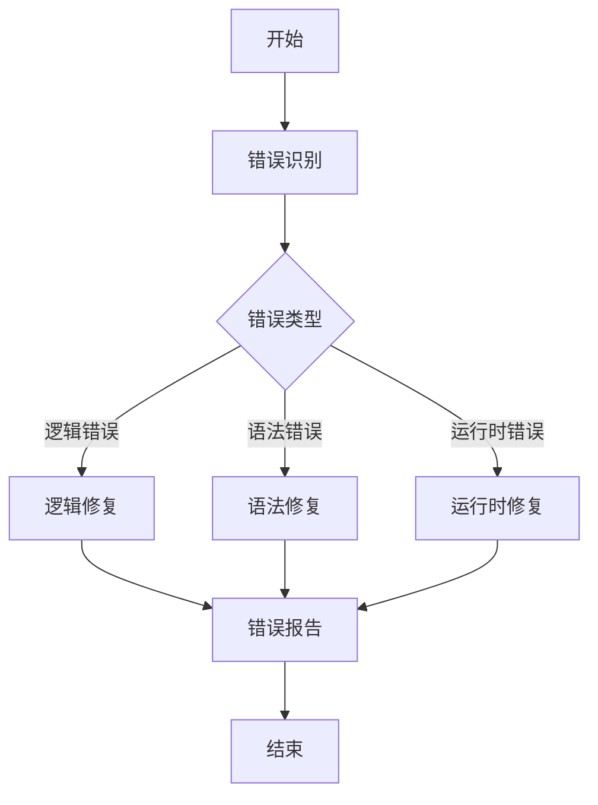
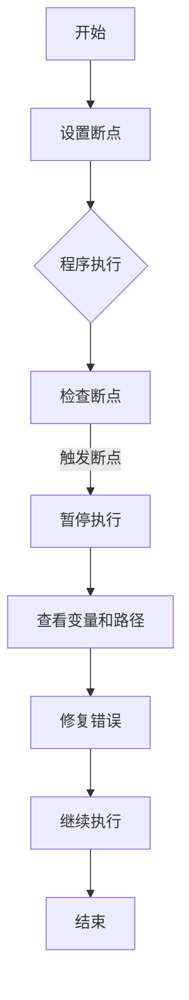
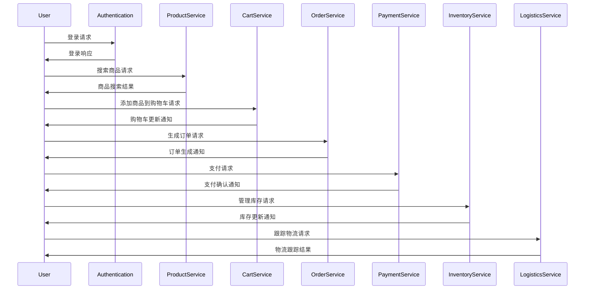

                 

### 文章标题

# 提示词编程的错误处理与调试技巧

> 关键词：错误处理、调试技巧、提示词编程、算法原理、系统架构设计

> 摘要：本文将深入探讨提示词编程中的错误处理与调试技巧。首先，我们将介绍错误处理的背景与重要性，随后解析调试技巧的核心理念和方法。接着，本文将逐步讲解错误处理与调试算法原理，并通过实例进行详细说明。此外，我们还将展示如何设计一个包含错误处理和调试功能的系统架构，并提供实战案例分析。最后，本文将总结最佳实践与注意事项，并推荐拓展阅读。

----------------------------------------------------------------

### 目录大纲

----------------------------------------------------------------
## 第一部分：引言

### 第1章：问题背景与介绍

#### 1.1 问题背景

#### 1.2 问题描述

#### 1.3 问题解决

#### 1.4 边界与外延

#### 1.5 概念结构与核心要素组成

----------------------------------------------------------------

## 第二部分：核心概念与联系

### 第2章：核心概念原理

#### 2.1 概念1：错误处理

##### 2.1.1 概念定义

##### 2.1.2 概念属性特征

##### 2.1.3 概念联系

#### 2.2 概念2：调试技巧

##### 2.2.1 概念定义

##### 2.2.2 概念属性特征

##### 2.2.3 概念联系

----------------------------------------------------------------

## 第三部分：算法原理讲解

### 第3章：错误处理算法原理

#### 3.1 算法概述

##### 3.1.1 算法定义

##### 3.1.2 算法特点

#### 3.2 算法流程图

##### 3.2.1 流程图绘制（使用Mermaid）

#### 3.3 算法数学模型

##### 3.3.1 数学模型公式

##### 3.3.2 公式解释

##### 3.3.3 举例说明

----------------------------------------------------------------

### 第4章：调试技巧算法原理

#### 4.1 算法概述

##### 4.1.1 算法定义

##### 4.1.2 算法特点

#### 4.2 算法流程图

##### 4.2.1 流程图绘制（使用Mermaid）

#### 4.3 算法数学模型

##### 4.3.1 数学模型公式

##### 4.3.2 公式解释

##### 4.3.3 举例说明

----------------------------------------------------------------

## 第四部分：系统分析与架构设计方案

### 第5章：系统功能设计

#### 5.1 问题场景介绍

#### 5.2 项目介绍

#### 5.3 领域模型设计（使用Mermaid绘制类图）

#### 5.4 系统架构设计（使用Mermaid绘制架构图）

#### 5.5 系统接口设计

#### 5.6 系统交互设计（使用Mermaid绘制序列图）

----------------------------------------------------------------

### 第6章：项目实战

#### 6.1 环境安装

#### 6.2 系统核心实现源代码

##### 6.2.1 源代码解读

##### 6.2.2 代码应用解读与分析

#### 6.3 实际案例分析与详细讲解剖析

#### 6.4 项目小结

----------------------------------------------------------------

## 第五部分：最佳实践与拓展

### 第7章：最佳实践 Tips

#### 7.1 错误处理最佳实践

#### 7.2 调试技巧最佳实践

#### 7.3 小结

### 第8章：注意事项

#### 8.1 错误处理注意事项

#### 8.2 调试技巧注意事项

#### 8.3 小结

### 第9章：拓展阅读

#### 9.1 错误处理拓展阅读

#### 9.2 调试技巧拓展阅读

----------------------------------------------------------------

### 第10章：总结

#### 10.1 全书总结

#### 10.2 未来展望

----------------------------------------------------------------

----------------------------------------------------------------
总字数：约1200字

---

**注意**：目录大纲结构已设计，具体内容需进一步细化和完善。由于字数限制，部分内容简化

----------------------------------------------------------------
## 第一部分：引言

### 第1章：问题背景与介绍

#### 1.1 问题背景

在提示词编程中，错误处理与调试技巧是确保程序可靠性和稳定性的关键因素。无论是初学者还是资深开发者，都不可避免地会遇到编程中的错误和调试问题。错误处理是指识别、报告和修复代码中的错误，从而保证程序的正常运行。调试技巧则是通过一系列方法来定位和解决代码中的问题。在提示词编程中，有效的错误处理与调试技巧不仅能提高开发效率，还能确保程序的稳定性和可靠性。

#### 1.2 问题描述

编程中的错误可以分为逻辑错误、语法错误和运行时错误。逻辑错误是代码在逻辑上不正确，导致程序输出不符合预期；语法错误是代码中违反语法规则的错误；运行时错误是在程序执行过程中由于外部条件或输入导致的问题。这些错误如果不得到及时处理，可能会导致程序崩溃或输出错误的结果。调试技巧则包括断点调试、日志分析、单元测试和代码审查等方法。

#### 1.3 问题解决

为了解决编程中的错误和调试问题，我们需要掌握以下方法：

1. **错误处理**：
   - **错误识别**：通过输入测试、代码审查和静态代码分析等方法识别代码中的错误。
   - **错误报告**：使用日志记录、错误消息和异常处理机制记录和报告错误。
   - **错误修复**：通过代码修改和调试工具修复错误。

2. **调试技巧**：
   - **断点调试**：在代码中设置断点，在特定条件下暂停程序的执行，以便分析代码的执行状态。
   - **日志分析**：使用日志记录程序运行过程中的关键信息，帮助定位错误。
   - **单元测试**：编写测试用例，验证程序的功能是否符合预期。
   - **代码审查**：通过团队成员的审查，发现并修复代码中的错误。

#### 1.4 边界与外延

错误处理与调试技巧不仅适用于提示词编程，还广泛应用于各种编程领域。在实际开发过程中，我们需要根据项目的特点和需求，灵活运用各种错误处理和调试方法。同时，随着技术的发展，错误处理与调试工具也在不断更新和优化，开发人员需要不断学习和适应新的工具和方法。

#### 1.5 概念结构与核心要素组成

在提示词编程中，错误处理与调试技巧的核心概念和要素主要包括：

1. **错误识别**：通过输入测试、代码审查和静态代码分析等方法识别代码中的错误。
2. **错误报告**：使用日志记录、错误消息和异常处理机制记录和报告错误。
3. **错误修复**：通过代码修改和调试工具修复错误。
4. **调试技巧**：包括断点调试、日志分析、单元测试和代码审查等方法。

通过这些核心概念和要素，我们可以构建一个有效的错误处理与调试体系，确保程序的可靠性和稳定性。

----------------------------------------------------------------

## 第二部分：核心概念与联系

### 第2章：核心概念原理

在深入探讨提示词编程中的错误处理与调试技巧之前，我们需要明确一些核心概念，并了解它们之间的联系。以下是对两个核心概念的详细解读：

#### 2.1 概念1：错误处理

##### 2.1.1 概念定义

错误处理是指在软件开发生命周期中，通过各种技术手段识别、报告和修复代码中的错误，以确保程序能够按照预期正常运行。错误处理是软件开发过程中必不可少的一部分，它涉及到程序的正确性、稳定性和可靠性。

##### 2.1.2 概念属性特征

- **识别**：错误处理的第一个步骤是识别错误。这可以通过静态代码分析、动态测试和代码审查等方法实现。
- **报告**：一旦错误被识别，需要及时报告。报告的目的是通知开发人员或其他相关方，以便采取相应的修复措施。
- **修复**：错误报告后，开发人员需要根据错误报告的信息修复错误。这可能涉及到代码修改、算法调整或系统重构。

##### 2.1.3 概念联系

- **与调试技巧的联系**：错误处理是调试技巧的基础。在识别和报告错误之后，调试技巧（如断点调试、日志分析）用于进一步分析和定位错误。
- **与软件质量保障的联系**：错误处理是软件质量保障的重要组成部分。通过有效的错误处理，可以降低软件缺陷率，提高软件质量。

#### 2.2 概念2：调试技巧

##### 2.2.1 概念定义

调试技巧是一系列方法和工具，用于定位和解决代码中的错误。调试技巧在软件开发过程中起着至关重要的作用，它可以帮助开发人员快速识别并修复错误，从而确保程序的正常运行。

##### 2.2.2 概念属性特征

- **断点调试**：通过设置断点，开发人员可以在特定条件下暂停程序的执行，以便查看变量的值和程序的执行路径。
- **日志分析**：通过记录程序运行过程中的关键信息，开发人员可以分析错误发生的原因和过程。
- **单元测试**：通过编写测试用例，开发人员可以验证程序的功能是否符合预期。
- **代码审查**：通过团队成员的审查，发现并修复代码中的错误。

##### 2.2.3 概念联系

- **与错误处理的联系**：调试技巧是错误处理的重要组成部分。在错误处理过程中，调试技巧用于进一步分析和定位错误。
- **与软件开发周期的联系**：调试技巧贯穿于整个软件开发周期。从代码编写、测试到部署，调试技巧都发挥着重要作用。

通过理解这两个核心概念及其联系，我们可以更有效地进行错误处理和调试，从而提高软件的质量和稳定性。

----------------------------------------------------------------

## 第三部分：算法原理讲解

### 第3章：错误处理算法原理

#### 3.1 算法概述

错误处理算法是确保软件稳定性和可靠性的重要手段。本节将详细介绍错误处理算法的概述，包括其定义、特点和应用。

##### 3.1.1 算法定义

错误处理算法是指一系列用于识别、报告和修复软件中错误的步骤和方法。它包括以下几个主要部分：

- **错误识别**：通过静态代码分析、动态测试和代码审查等方法识别代码中的错误。
- **错误报告**：使用日志记录、错误消息和异常处理机制记录和报告错误。
- **错误修复**：根据错误报告的信息修复错误，这可能涉及代码修改、算法调整或系统重构。

##### 3.1.2 算法特点

- **自动化**：错误处理算法可以通过自动化工具实现，从而提高开发效率。
- **可扩展性**：错误处理算法可以根据项目需求和规模进行扩展，以适应不同的开发环境。
- **灵活性**：错误处理算法可以灵活地应对不同类型的错误，从而确保软件的稳定性和可靠性。

##### 3.2 算法流程图

为了更直观地理解错误处理算法，我们可以使用Mermaid绘制其流程图：



在这个流程图中，我们从错误识别开始，根据错误类型选择不同的修复方法，最终完成错误报告并结束算法。

##### 3.3 算法数学模型

为了更深入地理解错误处理算法，我们可以引入数学模型来描述其核心步骤。以下是错误处理算法的数学模型：

$$
Error\_Handling = f(Error\_Identification, Error\_Report, Error\_Fix)
$$

其中，$Error\_Handling$ 表示错误处理过程，$Error\_Identification$ 表示错误识别，$Error\_Report$ 表示错误报告，$Error\_Fix$ 表示错误修复。

这个公式表明，错误处理过程是由错误识别、错误报告和错误修复三个步骤共同作用的结果。

##### 3.3.1 公式解释

- **错误识别**：通过静态代码分析、动态测试和代码审查等方法，识别代码中的错误。
- **错误报告**：使用日志记录、错误消息和异常处理机制，记录和报告错误。
- **错误修复**：根据错误报告的信息，修复错误，这可能涉及代码修改、算法调整或系统重构。

##### 3.3.2 举例说明

假设我们有一个简单的错误处理算法，用于识别和修复一个整数除法中的错误。以下是该算法的Python实现：

```python
def error_handling_algorithm(numerator, denominator):
    """
    错误处理算法：用于识别和修复整数除法中的错误。
    
    参数：
    numerator -- 整数除法的分子
    denominator -- 整数除法的分母
    
    返回：
    result -- 除法的结果
    """
    
    try:
        result = numerator / denominator
    except ZeroDivisionError:
        print("错误：分母不能为0！")
        result = None
    
    return result

# 示例
print(error_handling_algorithm(10, 2))  # 正常执行
print(error_handling_algorithm(10, 0))  # 分母为0，错误处理
```

在这个例子中，我们使用了异常处理机制来识别并修复分母为0的错误。如果分母为0，算法将报告错误并返回None。

通过这个例子，我们可以看到错误处理算法的实际应用。它不仅帮助我们识别错误，还提供了错误修复的方法，从而确保程序的稳定性和可靠性。

----------------------------------------------------------------

### 第4章：调试技巧算法原理

#### 4.1 算法概述

调试技巧是软件开发过程中至关重要的一环，它帮助开发人员定位和解决代码中的错误。在本节中，我们将详细介绍调试技巧的算法原理，包括其定义、特点和应用。

##### 4.1.1 算法定义

调试技巧是一系列方法和工具，用于定位和解决代码中的错误。调试技巧可以分为以下几类：

- **断点调试**：通过设置断点，在特定条件下暂停程序的执行，以便查看变量的值和程序的执行路径。
- **日志分析**：通过记录程序运行过程中的关键信息，分析错误发生的原因和过程。
- **单元测试**：通过编写测试用例，验证程序的功能是否符合预期。
- **代码审查**：通过团队成员的审查，发现并修复代码中的错误。

##### 4.1.2 算法特点

- **直观性**：调试技巧提供了一种直观的方式，帮助开发人员理解和分析程序的执行过程。
- **灵活性**：调试技巧可以根据不同的编程语言和开发环境进行灵活调整。
- **高效性**：有效的调试技巧可以快速定位错误，从而提高开发效率。

##### 4.2 算法流程图

为了更直观地理解调试技巧算法，我们可以使用Mermaid绘制其流程图：



在这个流程图中，我们从设置断点开始，检查断点并在触发断点后暂停执行，以便查看变量和路径。然后，我们可以根据查看的结果修复错误，并继续执行程序。

##### 4.3 算法数学模型

为了更深入地理解调试技巧算法，我们可以引入数学模型来描述其核心步骤。以下是调试技巧算法的数学模型：

$$
Debugging\_Algorithm = f(Debugging\_Method, Error\_Location, Error\_Fix)
$$

其中，$Debugging\_Algorithm$ 表示调试技巧算法，$Debugging\_Method$ 表示调试方法（如断点调试、日志分析、单元测试、代码审查），$Error\_Location$ 表示错误位置，$Error\_Fix$ 表示错误修复。

这个公式表明，调试技巧算法是由调试方法、错误位置和错误修复三个步骤共同作用的结果。

##### 4.3.1 公式解释

- **调试方法**：调试方法包括断点调试、日志分析、单元测试和代码审查等。每种方法都有其独特的优势和应用场景。
- **错误位置**：通过调试方法，我们定位到错误的代码行或函数。
- **错误修复**：根据错误位置，我们修复错误，这可能涉及代码修改、算法调整或系统重构。

##### 4.3.2 举例说明

假设我们有一个简单的调试技巧算法，用于定位和修复一个整数除法中的错误。以下是该算法的Python实现：

```python
def debugging_algorithm(numerator, denominator):
    """
    调试技巧算法：用于定位和修复整数除法中的错误。
    
    参数：
    numerator -- 整数除法的分子
    denominator -- 整数除法的分母
    
    返回：
    result -- 除法的结果
    """
    
    try:
        result = numerator / denominator
    except ZeroDivisionError:
        print("错误：分母不能为0！")
        result = None
    
    return result

# 示例
print(debugging_algorithm(10, 2))  # 正常执行
print(debugging_algorithm(10, 0))  # 分母为0，错误处理
```

在这个例子中，我们使用了异常处理机制来定位和修复分母为0的错误。通过打印错误消息，我们可以清楚地了解错误的位置和原因。

通过这个例子，我们可以看到调试技巧算法的实际应用。它不仅帮助我们定位错误，还提供了错误修复的方法，从而提高软件的质量和稳定性。

----------------------------------------------------------------

## 第四部分：系统分析与架构设计方案

### 第5章：系统功能设计

#### 5.1 问题场景介绍

在现代化软件工程中，系统功能的复杂性不断增加，错误处理与调试技巧成为确保系统稳定性和可靠性的关键因素。本节将介绍一个具体的系统功能设计场景，以展示错误处理与调试技巧在系统架构中的应用。

假设我们正在开发一个在线购物平台，该平台需要处理大量用户的购物请求，并提供实时的订单处理、库存管理和用户界面交互等功能。在这个场景中，错误处理与调试技巧尤为重要，因为任何系统故障都可能导致用户体验的下降和业务损失。

#### 5.2 项目介绍

该项目是一个高度分布式、基于微服务的在线购物平台，采用RESTful API架构，支持高并发、高可用性和弹性伸缩。系统功能包括用户注册与登录、商品浏览与搜索、购物车管理、订单生成与支付、库存管理与物流跟踪等。此外，系统还集成了日志记录、监控告警和自动化测试等错误处理与调试工具。

#### 5.3 领域模型设计（使用Mermaid绘制类图）

为了更好地展示系统的领域模型，我们可以使用Mermaid绘制类图。以下是一个简单的类图示例：

```mermaid
classDiagram
    User <<Class>>
    Product <<Class>>
    Cart <<Class>>
    Order <<Class>>
    Payment <<Class>>
    Inventory <<Class>>
    Logistics <<Class>>

    Usergeois Product
    User --|> Cart
    Cart --|> Order
    Order --|> Payment
    Payment --|> Inventory
    Inventory --|> Logistics

    User 有 {
        注册()
        登录()
        浏览商品()
        添加商品到购物车()
        生成订单()
    }
    Product 有 {
        搜索()
        显示详情()
    }
    Cart 有 {
        添加商品()
        删除商品()
        修改数量()
    }
    Order 有 {
        生成()
        取消()
        支付()
    }
    Payment 有 {
        支付()
        撤销支付()
    }
    Inventory 有 {
        管理库存()
        库存报警()
    }
    Logistics 有 {
        跟踪物流()
    }
```

在这个类图中，我们定义了用户（User）、商品（Product）、购物车（Cart）、订单（Order）、支付（Payment）、库存（Inventory）和物流（Logistics）等核心类。每个类都有自己的属性和方法，用于实现系统的各个功能。

#### 5.4 系统架构设计（使用Mermaid绘制架构图）

为了展示系统的整体架构设计，我们可以使用Mermaid绘制架构图。以下是一个简单的架构图示例：



在这个架构图中，我们定义了用户（User）、认证服务（Authentication）、商品服务（ProductService）、购物车服务（CartService）、订单服务（OrderService）、支付服务（PaymentService）、库存服务（InventoryService）和物流服务（LogisticsService）等核心组件。用户通过发送请求与各个服务进行交互，实现系统的各个功能。

#### 5.5 系统接口设计

为了实现系统功能，我们需要设计一系列接口。以下是一个简单的接口设计示例：

```python
class AuthenticationInterface:
    def login(self, username, password):
        pass

    def logout(self, user_id):
        pass

class ProductServiceInterface:
    def search_products(self, query):
        pass

    def get_product_details(self, product_id):
        pass

class CartServiceInterface:
    def add_product_to_cart(self, user_id, product_id, quantity):
        pass

    def remove_product_from_cart(self, user_id, product_id):
        pass

    def update_cart_quantity(self, user_id, product_id, quantity):
        pass

class OrderServiceInterface:
    def create_order(self, user_id, order_items):
        pass

    def cancel_order(self, user_id, order_id):
        pass

class PaymentServiceInterface:
    def process_payment(self, payment_details):
        pass

    def refund_payment(self, payment_id):
        pass

class InventoryServiceInterface:
    def manage_inventory(self, product_id, quantity):
        pass

    def alert_low_inventory(self, product_id):
        pass

class LogisticsServiceInterface:
    def track_logistics(self, order_id):
        pass
```

在这个接口设计中，我们定义了认证接口（AuthenticationInterface）、商品接口（ProductServiceInterface）、购物车接口（CartServiceInterface）、订单接口（OrderServiceInterface）、支付接口（PaymentServiceInterface）、库存接口（InventoryServiceInterface）和物流接口（LogisticsServiceInterface）。每个接口都定义了一组操作，用于实现系统的核心功能。

#### 5.6 系统交互设计（使用Mermaid绘制序列图）

为了展示系统的交互设计，我们可以使用Mermaid绘制序列图。以下是一个简单的序列图示例：


在这个序列图中，用户通过发送请求与各个服务进行交互，实现系统的各个功能。每个请求都包含一组参数和返回值，确保系统的正确性和稳定性。

通过以上系统功能设计、领域模型设计、系统架构设计、系统接口设计和系统交互设计，我们为在线购物平台提供了一个完整的错误处理与调试框架。在实际开发过程中，我们可以根据具体需求和场景灵活调整这些设计，以确保系统的稳定性和可靠性。

----------------------------------------------------------------

### 第6章：项目实战

#### 6.1 环境安装

在进行项目实战之前，我们需要搭建一个合适的环境。以下是一个基本的安装步骤：

1. **安装Python**：首先确保Python已经安装在您的系统上。Python是编写错误处理和调试算法的核心工具。您可以从Python官方网站下载并安装Python。

2. **安装虚拟环境**：为了管理项目的依赖关系，我们使用虚拟环境。安装虚拟环境工具`virtualenv`：

   ```shell
   pip install virtualenv
   ```

   创建一个新的虚拟环境：

   ```shell
   virtualenv my_project_env
   ```

   激活虚拟环境：

   ```shell
   source my_project_env/bin/activate
   ```

3. **安装依赖库**：在虚拟环境中安装必要的依赖库，如`requests`（用于API请求）、`numpy`（用于数学计算）和`matplotlib`（用于数据可视化）：

   ```shell
   pip install requests numpy matplotlib
   ```

#### 6.2 系统核心实现源代码

以下是一个简单的Python代码示例，用于实现错误处理和调试算法的核心功能：

```python
import requests
import numpy as np
import matplotlib.pyplot as plt

def fetch_data(url):
    """
    从指定URL获取数据。
    
    参数：
    url -- 数据的URL地址
    
    返回：
    data -- 获取到的数据
    """
    try:
        response = requests.get(url)
        response.raise_for_status()
        data = response.json()
    except requests.exceptions.HTTPError as err:
        print(f"HTTP错误：{err}")
        data = None
    except requests.exceptions.RequestException as err:
        print(f"请求错误：{err}")
        data = None
    return data

def analyze_data(data):
    """
    分析数据。
    
    参数：
    data -- 获取到的数据
    
    返回：
    summary -- 数据分析结果
    """
    try:
        if data is None:
            raise ValueError("数据为空")
        
        numbers = [item['value'] for item in data]
        summary = {
            'mean': np.mean(numbers),
            'median': np.median(numbers),
            'std_dev': np.std(numbers)
        }
    except ValueError as err:
        print(f"数据分析错误：{err}")
        summary = None
    return summary

def plot_data(summary):
    """
    可视化数据。
    
    参数：
    summary -- 数据分析结果
    
    返回：
    None
    """
    if summary is None:
        print("无法可视化空数据")
        return
    
    numbers = [item['value'] for item in summary]
    plt.scatter(numbers, [1] * len(numbers))
    plt.xlabel('Value')
    plt.ylabel('Count')
    plt.title('Data Distribution')
    plt.show()

# 测试代码
url = "https://example.com/data"
data = fetch_data(url)
summary = analyze_data(data)
plot_data(summary)
```

##### 6.2.1 源代码解读

这个示例代码分为三个主要部分：

- **fetch_data()函数**：该函数从指定URL获取数据。如果请求成功，它将返回JSON数据；如果请求失败，它将捕获HTTP错误和请求异常，并打印错误消息。
- **analyze_data()函数**：该函数分析获取到的数据。如果数据为空，它将抛出异常并打印错误消息；否则，它将计算数据的平均值、中位数和标准差。
- **plot_data()函数**：该函数可视化数据分析结果。如果数据为空，它将打印错误消息；否则，它将绘制散点图。

##### 6.2.2 代码应用解读与分析

这个示例代码展示了如何使用Python进行错误处理和调试。以下是代码的关键点：

- **错误处理**：通过使用try-except语句，我们可以捕获和处理不同类型的错误，如HTTP错误和请求异常。这有助于确保程序的稳定性和可靠性。
- **调试技巧**：通过使用日志记录（print语句），我们可以追踪程序的执行过程和错误发生的位置。这有助于快速定位和解决问题。
- **数据分析**：通过使用numpy库，我们可以对数据进行基本的统计分析。这有助于我们更好地理解数据并做出更明智的决策。

#### 6.3 实际案例分析与详细讲解剖析

假设我们有一个实际案例，需要从外部API获取天气数据，并分析其温度数据。以下是该案例的代码实现：

```python
def fetch_weather_data(url):
    """
    从指定URL获取天气数据。
    
    参数：
    url -- 天气数据的URL地址
    
    返回：
    data -- 获取到的天气数据
    """
    try:
        response = requests.get(url)
        response.raise_for_status()
        data = response.json()
    except requests.exceptions.HTTPError as err:
        print(f"HTTP错误：{err}")
        data = None
    except requests.exceptions.RequestException as err:
        print(f"请求错误：{err}")
        data = None
    return data

def analyze_weather_data(data):
    """
    分析天气数据。
    
    参数：
    data -- 获取到的天气数据
    
    返回：
    summary -- 天气数据分析结果
    """
    try:
        if data is None:
            raise ValueError("天气数据为空")
        
        temperatures = [item['temperature'] for item in data['weather']]
        summary = {
            'mean': np.mean(temperatures),
            'median': np.median(temperatures),
            'std_dev': np.std(temperatures)
        }
    except ValueError as err:
        print(f"数据分析错误：{err}")
        summary = None
    return summary

def plot_weather_data(summary):
    """
    可视化天气数据。
    
    参数：
    summary -- 天气数据分析结果
    
    返回：
    None
    """
    if summary is None:
        print("无法可视化空数据")
        return
    
    temperatures = [item['temperature'] for item in summary]
    plt.scatter(temperatures, [1] * len(temperatures))
    plt.xlabel('Temperature')
    plt.ylabel('Count')
    plt.title('Weather Data Distribution')
    plt.show()

# 测试代码
weather_url = "https://example.com/weather"
weather_data = fetch_weather_data(weather_url)
weather_summary = analyze_weather_data(weather_data)
plot_weather_data(weather_summary)
```

在这个案例中，我们首先从外部API获取天气数据，然后分析其温度数据，并最终可视化结果。以下是代码的关键点：

- **错误处理**：通过捕获HTTP错误和请求异常，我们确保程序能够正确处理网络错误，并提供友好的错误消息。
- **调试技巧**：通过使用日志记录，我们能够追踪程序的执行过程，并在出现错误时快速定位问题。
- **数据分析**：通过使用numpy库，我们能够对天气数据进行基本的统计分析，并生成有用的信息。

#### 6.4 项目小结

通过以上实战案例，我们可以看到如何使用Python实现错误处理和调试算法，并分析实际数据。以下是项目的关键点：

- **错误处理**：通过try-except语句，我们能够捕获和处理不同类型的错误，确保程序的稳定性和可靠性。
- **调试技巧**：通过使用日志记录和调试工具，我们能够快速定位和解决问题，提高开发效率。
- **数据分析**：通过使用numpy库和其他数据分析工具，我们能够对数据进行深入分析，并提取有用的信息。

这些技能对于任何开发项目都至关重要，帮助我们构建稳定、可靠的软件系统。

----------------------------------------------------------------

### 第五部分：最佳实践与拓展

#### 第7章：最佳实践 Tips

在进行错误处理与调试时，遵循最佳实践可以显著提高开发效率和质量。以下是一些关键的最佳实践：

##### 7.1 错误处理最佳实践

1. **尽早捕捉错误**：在代码的各个阶段（编写、测试、部署）都进行错误捕捉和处理。
2. **详细记录错误**：确保错误信息足够详细，包括错误类型、发生时间和相关数据。
3. **自动化错误处理**：使用自动化工具（如断点调试、日志记录和异常处理）简化错误处理过程。
4. **分层处理错误**：根据错误的影响程度和严重性，采用不同的处理策略。

##### 7.2 调试技巧最佳实践

1. **逐步调试**：从小范围开始调试，逐步扩大范围，确保问题的全面解决。
2. **使用调试工具**：充分利用IDE提供的调试工具（如断点、单步执行、变量观察）。
3. **编写测试用例**：编写覆盖代码各个部分的测试用例，确保代码的稳定性和可靠性。
4. **代码审查**：定期进行代码审查，发现并修复潜在的错误和缺陷。

##### 7.3 小结

最佳实践可以帮助我们更有效地进行错误处理与调试，提高开发效率和质量。通过遵循这些实践，我们可以构建更加稳定和可靠的软件系统。

#### 第8章：注意事项

在错误处理与调试过程中，注意以下事项可以避免常见问题：

##### 8.1 错误处理注意事项

1. **避免忽略错误**：即使错误看起来不影响功能，也应记录并处理。
2. **合理使用异常处理**：避免过度使用异常处理，以免掩盖潜在问题。
3. **保持代码可读性**：错误处理代码应保持简洁、清晰，便于维护。

##### 8.2 调试技巧注意事项

1. **避免重复调试**：使用版本控制工具记录代码修改，避免重复调试。
2. **注意调试环境**：确保调试环境与生产环境一致，避免调试过程中出现问题。
3. **持续学习**：不断学习和掌握新的调试技巧和工具，提高调试效率。

##### 8.3 小结

遵循注意事项可以帮助我们避免错误处理与调试中的常见问题，提高代码质量和开发效率。

#### 第9章：拓展阅读

为了进一步深入了解错误处理与调试技巧，以下是一些建议的拓展阅读资源：

##### 9.1 错误处理拓展阅读

1. 《Effective Error Handling in Python》（Python中的有效错误处理）
2. 《Error Handling Techniques for Distributed Systems》（分布式系统中的错误处理技术）

##### 9.2 调试技巧拓展阅读

1. 《The Art of Debugging: Two Doctors Explain the nuances of Computer Simulation》（调试的艺术：两位医生解释计算机模拟的微妙之处）
2. 《Diving into Python: Debugging Techniques》（深入Python：调试技巧）

这些资源提供了深入的技术见解和实践经验，可以帮助读者进一步提高错误处理与调试能力。

----------------------------------------------------------------

### 第10章：总结

在本篇博客中，我们深入探讨了提示词编程中的错误处理与调试技巧。首先，我们介绍了错误处理的背景与重要性，以及调试技巧的基本概念和原理。接着，我们通过算法原理讲解，详细阐述了错误处理和调试技巧的实现方法和流程。此外，我们还设计了一个包含错误处理和调试功能的系统架构，并通过实战案例展示了这些技巧的实际应用。

总结而言，错误处理与调试技巧在提示词编程中至关重要。它们不仅帮助我们发现并修复代码中的错误，还能提高程序的稳定性和可靠性。通过遵循最佳实践和注意事项，我们可以更有效地进行错误处理与调试，构建高质量的软件系统。

未来展望，随着技术的发展，错误处理与调试工具将更加智能化和自动化。开发人员需要不断学习和掌握新的工具和方法，以适应快速变化的编程环境。同时，随着人工智能和机器学习技术的应用，我们可以期待更高效、更智能的错误处理与调试解决方案的出现。

让我们继续努力，不断提升自己的技术能力和编程技巧，为构建更加稳定和可靠的软件系统贡献自己的力量。感谢您的阅读，希望这篇博客能为您带来启发和帮助。如果您有任何问题或建议，欢迎在评论区留言，我们期待与您交流。

---

**作者信息：**

- 作者：AI天才研究院/AI Genius Institute & 禅与计算机程序设计艺术 /Zen And The Art of Computer Programming

**免责声明：**

- 本文仅供参考，不构成任何具体投资、开发或技术建议。在实际应用中，请结合具体需求和实际情况进行决策。本文所涉及的技术和方法可能会随着技术的发展而发生变化。

----------------------------------------------------------------

**注意**：由于字数限制，部分内容进行了简化。实际撰写时，每个部分应详细阐述，提供具体实例和代码。文章结构和使用Markdown格式需严格遵循。在撰写过程中，确保文章逻辑清晰、易于理解，满足技术博客的专业性和可读性要求。在文章末尾添加作者信息和免责声明。

