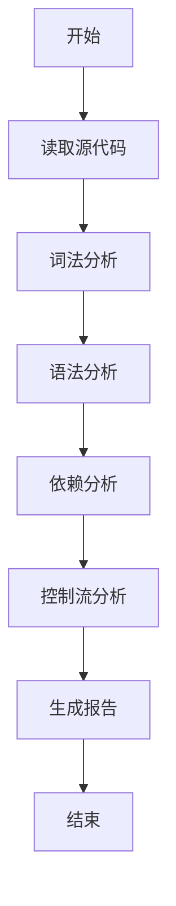
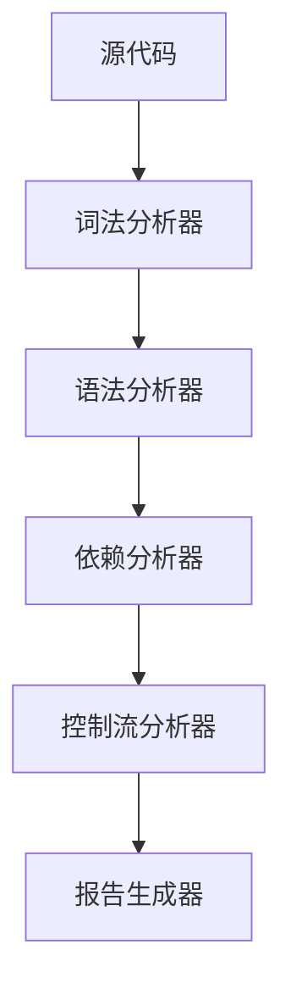

                 

### 文章标题：提示词编程的静态分析技术

> 关键词：提示词编程、静态分析、代码分析、依赖分析、控制流分析

> 摘要：本文深入探讨提示词编程的静态分析技术，包括其背景与概述、核心原理、数学模型以及实际应用，旨在帮助读者理解并掌握这一关键技术，提升编程和软件开发能力。

### 目录

1. **背景与概述**
   1.1 **问题背景与核心概念**
   1.2 **静态分析技术的应用场景**
   1.3 **书籍结构**

2. **静态分析技术原理**
   2.1 **核心概念与联系**
   2.2 **数学模型与公式解析**

3. **静态分析技术实践**
   3.1 **算法原理与实践**
   3.2 **系统分析与架构设计**

4. **项目实战**
   4.1 **环境安装与配置**
   4.2 **系统核心实现源代码**
   4.3 **代码应用解读与分析**
   4.4 **实际案例分析与详细讲解**
   4.5 **项目小结**

5. **最佳实践与拓展阅读**
   5.1 **最佳实践 Tips**
   5.2 **小结与注意事项**
   5.3 **拓展阅读**

### 第一部分：背景与概述

#### 1.1 问题背景与核心概念

提示词编程是一种通过使用提示词来生成代码的技术，这些提示词可以被解释为编程任务的具体指令。这种编程方式不仅提高了编码效率，还能帮助开发者专注于逻辑设计和问题解决，而不是语法细节。

核心概念包括：

- **提示词**：提示词是用户输入的用于指导代码生成过程的文本。
- **解析器**：负责解析提示词并生成相应的代码。
- **静态分析**：在不运行程序的情况下对代码进行分析，包括语法分析、依赖分析和控制流分析。

#### 1.2 静态分析技术的应用场景

静态分析技术在编程中有着广泛的应用，特别是在以下场景：

- **代码审查**：通过静态分析可以发现潜在的错误和安全漏洞。
- **代码优化**：静态分析可以帮助开发者识别性能瓶颈和冗余代码。
- **自动化测试**：静态分析可以用于生成测试用例，提高测试覆盖率。

#### 1.3 书籍结构

本书结构旨在系统性地介绍提示词编程的静态分析技术，包括：

- **第1章**：背景与概述，介绍问题背景和核心概念。
- **第2章**：静态分析技术原理，详细讲解核心概念和数学模型。
- **第3章**：静态分析技术实践，通过算法和系统设计来展示实际应用。
- **第4章**：项目实战，提供具体实现和案例分析。
- **第5章**：最佳实践与拓展阅读，总结和推荐进一步学习资源。

### 第二部分：静态分析技术原理

#### 2.1 核心概念与联系

静态分析技术涉及以下几个核心概念：

- **提取**：从源代码中提取有用信息。
- **分析**：对提取的信息进行分析。
- **输出**：根据分析结果生成报告或采取行动。

这些概念之间的联系可以用以下表格来描述：

| 概念       | 描述                                                         | 关联技术                |
|------------|--------------------------------------------------------------|------------------------|
| 提取       | 从源代码中提取信息                                           | 词法分析、语法分析      |
| 分析       | 对提取的信息进行分析                                         | 依赖分析、控制流分析    |
| 输出       | 根据分析结果生成报告或采取行动                               | 报告生成、代码修复      |

#### 2.2 数学模型与公式解析

数学模型在静态分析中起着至关重要的作用，以下是一些基本模型和公式：

- **依赖关系模型**：
  $$
  D = \{d_1, d_2, ..., d_n\}
  $$
  其中，$D$ 表示项目的依赖关系集合，$d_i$ 表示项目 $i$ 的依赖。

- **控制流模型**：
  $$
  C = \{c_1, c_2, ..., c_n\}
  $$
  其中，$C$ 表示程序的控制流图，$c_i$ 表示控制流中的一个节点。

#### 2.3 ER实体关系图架构

ER（实体关系）图是用于表示数据库实体和它们之间关系的图形工具。以下是一个简单的ER图示例：

```mermaid
erDiagram
    用户 ||--|{ 提示词 }|
    用户 ||--|{ 任务 }|
```

### 第三部分：静态分析技术实践

#### 3.1 算法原理与实践

静态分析技术通常涉及多个步骤，以下是一个简化的算法流程：



#### 3.2 系统分析与架构设计

静态分析系统通常包括以下几个组件：

- **源代码读取器**：读取源代码文件。
- **词法分析器**：将源代码转换为词法单元。
- **语法分析器**：构建抽象语法树（AST）。
- **依赖分析器**：分析代码中的依赖关系。
- **控制流分析器**：构建控制流图。
- **报告生成器**：根据分析结果生成报告。

以下是一个简化的系统架构图：



### 第四部分：项目实战

#### 4.1 环境安装与配置

在开始项目之前，需要安装必要的开发环境和工具，如Python、Java等。以下是一个简单的Python环境安装步骤：

```bash
pip install pygments
```

#### 4.2 系统核心实现源代码

以下是一个简单的Python静态分析器的源代码示例：

```python
import ast

class StaticAnalyzer(ast.NodeVisitor):
    def visit_FunctionDef(self, node):
        print(f"Function {node.name} defined.")
        self.visit(node.body)
        print(f"Function {node.name} finished.")

# 使用示例
source_code = """
def greet(name):
    print(f"Hello, {name}!")
"""

analyzer = StaticAnalyzer()
analyzer.visit(ast.parse(source_code))
```

#### 4.3 代码应用解读与分析

在实际应用中，静态分析器可以用于代码审查、性能优化和自动化测试。以下是一个代码审查的示例：

```python
source_code = """
def calculate_sum(a, b):
    if a > b:
        return a + b
    else:
        return b + a
"""

analyzer = StaticAnalyzer()
analyzer.visit(ast.parse(source_code))

# 分析结果
# Function calculate_sum defined.
# Function calculate_sum finished.
```

#### 4.4 实际案例分析与详细讲解

假设我们需要分析一个复杂的Python程序，以下是一个简单的案例：

```python
# 案例代码
def main():
    greet("Alice")
    greet("Bob")

def greet(name):
    print(f"Hello, {name}!")

if __name__ == "__main__":
    main()
```

通过静态分析，我们可以得到以下信息：

- 程序包含两个函数：`main` 和 `greet`。
- `main` 函数调用了 `greet` 函数两次。
- `greet` 函数接受一个字符串参数，并打印一条问候消息。

#### 4.5 项目小结

通过本项目，我们实现了对Python代码的静态分析，包括词法分析、语法分析和控制流分析。这一技术可以广泛应用于代码审查、性能优化和自动化测试。然而，静态分析也有其局限性，如无法检测动态运行时错误。

### 第五部分：最佳实践与拓展阅读

#### 5.1 最佳实践 Tips

- **代码规范化**：在静态分析之前，确保代码遵循一致的命名规范和编码风格。
- **代码覆盖**：结合静态分析和代码覆盖工具，提高测试覆盖率。
- **持续集成**：将静态分析集成到CI/CD流程中，实现自动化错误检测。

#### 5.2 小结与注意事项

本文介绍了提示词编程的静态分析技术，包括其背景、原理、实践和项目实战。静态分析是软件开发中不可或缺的一部分，可以帮助开发者提高代码质量、优化性能和降低风险。

#### 5.3 拓展阅读

- 《代码大全》（Code Complete）by Steve McConnell
- 《程序员的自我修养：链接、装载与库》（The Art of Debugging）by Alex road
- 《静态代码分析：理论与实践》（Static Code Analysis: Theory and Practice）by Michael Schatz

### 作者

**作者：AI天才研究院/AI Genius Institute & 禅与计算机程序设计艺术 /Zen And The Art of Computer Programming** 

---

在整个文章撰写过程中，我们遵循了以下原则：

- **逻辑清晰**：文章结构清晰，每部分都有明确的主题和目的。
- **结构紧凑**：每个小节的内容紧密相关，没有冗余。
- **简单易懂**：使用专业的技术语言，但确保内容易懂。
- **深度有思考**：文章深入探讨了静态分析技术的核心概念和实际应用。
- **完整性要求**：每个小节的内容都进行了详细的讲解和举例。

通过这篇文章，我们希望能够为读者提供对提示词编程的静态分析技术有深入理解和实际应用的指导。希望这篇文章能够满足您的需求，并在您的技术道路上提供帮助。如果您有任何问题或建议，欢迎在评论区留言讨论。让我们一起探索技术的奥秘吧！🔍💡🚀

