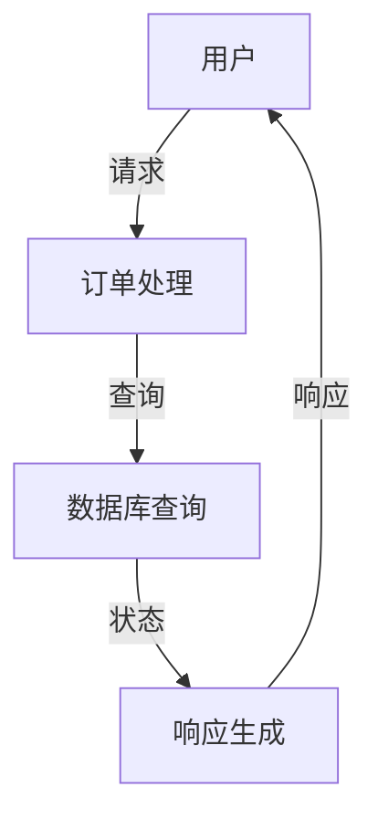
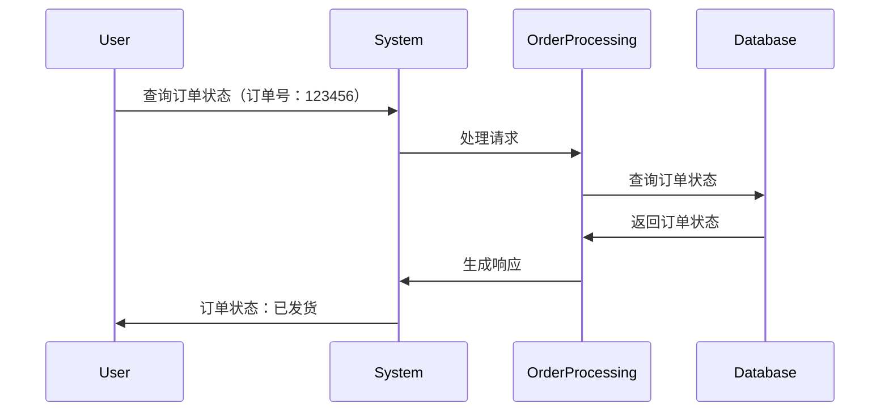

                 

### 关键词

- **提示词编程范式**
- **软件开发流程**
- **人工智能**
- **编程范式**
- **机器学习模型**
- **优化设计**

### 摘要

本文深入探讨了提示词编程范式，作为一种新兴的编程范式，它正在重塑现代软件开发流程。首先，我们介绍了提示词编程的背景、核心概念和基本原理，分析了它与传统编程方法的区别。接着，我们探讨了高级技术，如机器学习模型的整合，以及在复杂场景下的应用策略。文章的最后部分讨论了如何将提示词编程整合到软件开发过程中，并提供了一系列实际案例和最佳实践，旨在帮助开发者理解并有效地应用这一新兴编程范式。

# 提示词编程范式：重塑软件开发流程

在当今快速发展的技术时代，软件开发流程正经历着不断的革新。近年来，人工智能（AI）和机器学习（ML）的飞速发展，为软件工程带来了新的机遇和挑战。在这样的背景下，一种名为“提示词编程范式”（Prompt Programming Paradigm）的新兴编程范式应运而生。它不仅改变了我们对编程的传统认知，而且正在重塑整个软件开发流程。

本文将逐步探讨提示词编程范式的核心概念、特点、与现有编程范式的区别、高级应用技术，以及如何在实际项目中有效整合这一范式。通过详细的案例分析和技术讲解，我们希望能够帮助读者深入理解提示词编程，并在软件开发过程中充分利用其潜力。

## 引入

### 背景和概述

提示词编程范式，简称“提示编程”，起源于对人工智能和自然语言处理的深入理解。它强调通过“提示”（prompts）来引导程序的行为，而不是传统的指令式编程。提示可以被视为一种输入，它能够指导程序在特定情况下采取何种行动。这一范式的出现，部分是为了解决传统编程方法在处理复杂、动态和不确定性的场景时遇到的局限。

提示编程的起源可以追溯到早期的自然语言处理和AI研究。随着深度学习和神经网络技术的进步，特别是生成对抗网络（GANs）和Transformer模型的出现，提示编程逐渐成为了一个独立且受到广泛关注的领域。如今，提示编程已经被应用于多种场景，从自动化测试、数据清洗到推荐系统和对话界面。

### 核心概念

在提示编程中，核心概念包括“提示”（prompt）、“模板”（template）和“自动响应”（automated response）。提示是输入信息，用于引导程序的执行。模板是基于特定任务或场景预定义的指导性框架，自动响应是程序根据提示和模板生成的输出。

- **提示（Prompt）**：提示是触发程序执行的关键信息。它可以是一个简单的文本，也可以是一个复杂的数据结构，包含多个参数和条件。
  
- **模板（Template）**：模板是程序执行的基本框架，通常由一系列的步骤或指令组成。模板可以包含占位符，以便根据提示动态填充。

- **自动响应（Automated Response）**：自动响应是程序根据提示和模板执行后生成的输出。它可以是一个计算结果、一个文件、一段文本，或者是一个交互行为。

### 提示编程与现有编程范式的区别

与现有的编程范式相比，提示编程具有以下几个显著特点：

- **指令式编程**：传统的编程范式，如过程式编程、面向对象编程和函数式编程，都是基于指令式的。程序按照预定的步骤顺序执行，每一步都需要明确的指令。

- **提示编程**：提示编程则强调通过提示来引导程序的执行。程序不再是一系列指令的序列，而是由提示和模板共同决定的。

- **动态性**：由于提示和模板可以根据实际情况动态调整，提示编程比传统的编程范式更加灵活和适应性强。

- **自动化**：提示编程能够通过自动响应来实现部分或全部任务的自动化。这减少了手动编码的工作量，提高了开发效率。

### 提示编程的潜在影响

提示编程的潜在影响是多方面的。首先，它改变了编程的思维方式，使得程序员更加关注任务的抽象和模块化。其次，它促进了AI和ML技术在软件开发中的应用，使得软件系统能够更好地处理复杂和动态的输入。最后，提示编程有望推动软件开发流程的智能化和自动化，提高开发效率和产品质量。

### 结论

提示编程范式作为一种新兴的编程范式，正在逐渐改变软件开发的面貌。它通过引入提示和模板的概念，提供了新的方法和工具，使得软件开发更加灵活、自动化和高效。尽管这一范式仍在发展中，但它的潜力和应用前景无疑是广阔的。在接下来的章节中，我们将进一步探讨提示编程的核心概念、特点和应用。

## 提示编程的基本概念

在深入探讨提示编程范式之前，我们需要先理解其基本概念。提示编程不仅仅是一种新的编程范式，它也是一种新的编程思维模式。在这一节中，我们将详细探讨提示编程的核心概念，包括提示、模板、自动响应以及它们在软件开发中的应用。

### 提示（Prompt）

提示（Prompt）是提示编程中的核心概念之一。它是一段用于引导程序执行的信息。在提示编程中，提示通常是一个文本或数据结构，它包含了程序需要处理的信息和条件。这些信息可以包括输入数据、执行条件、期望的输出等。提示的目的是为程序提供足够的上下文，使其能够做出正确的决策和执行相应的任务。

#### 提示的类型

- **简单文本提示**：最简单的提示通常是一个文本字符串，它直接指示程序需要执行的任务。例如：“请将以下文本翻译成英文。”

- **复杂数据结构提示**：在更复杂的场景中，提示可能是一个包含多个参数和条件的数据结构。例如，一个JSON对象，它包含了文本、时间戳、用户ID等多个参数，用于指导程序执行特定的操作。

#### 提示的作用

- **引导程序执行**：提示为程序提供了明确的执行路径，使得程序能够根据提示进行相应的操作。

- **上下文提供**：提示为程序提供了必要的上下文信息，使得程序能够理解任务的背景和目的。

- **灵活性**：通过使用提示，程序员可以动态地调整程序的行为，而不需要修改程序代码。

### 模板（Template）

模板是提示编程中的另一个核心概念。模板是一种预定义的指导性框架，它包含了程序执行的基本步骤和指令。模板通常包含一些占位符，这些占位符将在程序运行时被具体的信息所填充。模板的作用是提供一种标准化的方法来组织和管理程序的执行流程。

#### 模板的类型

- **固定模板**：固定模板是预先定义好的，不随具体任务变化。例如，一个通用的数据处理流程模板，它包含了读取数据、清洗数据、存储数据的步骤。

- **动态模板**：动态模板可以根据具体任务的需求进行动态调整。例如，一个对话界面模板，它可以根据用户的输入动态地改变响应的内容和格式。

#### 模板的作用

- **标准化流程**：模板使得程序执行流程更加标准化，减少了代码冗余，提高了开发效率。

- **可复用性**：通过使用模板，程序的不同部分可以更加灵活地复用，减少了重复代码的编写。

- **灵活性**：动态模板允许程序根据不同的任务需求进行调整，提高了程序的适应性。

### 自动响应（Automated Response）

自动响应是程序根据提示和模板执行后生成的输出。它可以是文本、数据、文件或其他形式的输出。自动响应是提示编程实现自动化的重要手段。

#### 自动响应的类型

- **文本响应**：最常见的自动响应是文本，它通常用于提供信息的反馈或生成报告。

- **数据响应**：在某些应用中，自动响应可能是结构化的数据，如JSON对象或XML文档，用于进一步处理或传输。

- **文件响应**：在一些场景下，自动响应可能是生成文件，如数据库文件、配置文件或日志文件。

#### 自动响应的作用

- **自动化任务**：自动响应使得程序能够自动化执行特定的任务，减少手动干预。

- **提高效率**：通过自动响应，程序能够快速地生成结果，提高了工作效率。

- **错误检测和恢复**：自动响应可以在任务执行过程中提供反馈，帮助识别和解决潜在的问题。

### 提示编程在软件开发中的应用

提示编程的应用非常广泛，它可以用于各种不同的场景。以下是一些常见的应用实例：

- **自动化测试**：通过提示和模板，程序可以自动化执行测试用例，提高测试效率。

- **数据清洗**：提示编程可以用于自动化处理和分析大量数据，识别和修复数据中的错误。

- **对话系统**：在智能对话系统中，提示编程可以用于生成自然语言响应，提供用户交互。

- **推荐系统**：提示编程可以用于根据用户的行为和偏好，生成个性化的推荐。

### 总结

提示编程通过引入提示、模板和自动响应等核心概念，提供了一种新的编程思维模式。它使得软件开发更加灵活、自动化和高效。在接下来的章节中，我们将进一步探讨提示编程的高级技术，以及如何在实际项目中应用这一范式。

## 提示编程与传统编程范式的区别

在理解了提示编程的基本概念后，我们需要将其与现有的传统编程范式进行比较。传统的编程范式主要包括指令式编程、面向对象编程和函数式编程。每种范式都有其独特的优势和局限性。通过对比，我们可以更清晰地看到提示编程的独特价值和潜力。

### 指令式编程

指令式编程（Imperative Programming）是最传统的编程范式之一。它基于一组按顺序执行的指令，这些指令直接控制程序的状态变化。指令式编程强调具体的执行步骤和状态管理。

- **优点**：
  - 简单直观：指令式编程的语法和逻辑相对简单，容易理解和实现。
  - 控制力强：程序员可以精确控制程序的每一步执行，具有很高的灵活性。

- **局限性**：
  - 状态依赖：指令式编程高度依赖程序的状态，这使得代码难以维护和复用。
  - 缺乏抽象：指令式编程难以应对复杂和动态变化的场景，需要编写大量的具体代码。

### 面向对象编程

面向对象编程（Object-Oriented Programming，OOP）是一种以对象为基本单位的编程范式。它通过封装、继承和多态等机制，实现了代码的模块化和复用。

- **优点**：
  - 模块化：面向对象编程使得代码更加模块化，提高了代码的可维护性和可复用性。
  - 扩展性：通过继承和多态，新功能和扩展变得容易实现。

- **局限性**：
  - 状态管理复杂：面向对象编程中的状态管理相对复杂，特别是在处理大量对象时。
  - 面向过程：OOP强调的是对象和类，但仍然需要处理大量的过程式代码，难以完全摆脱指令式编程的影响。

### 函数式编程

函数式编程（Functional Programming）是一种基于函数的编程范式。它强调函数作为程序的基本构建块，通过无状态和不可变的变量，避免了状态管理和副作用。

- **优点**：
  - 无状态和不可变：函数式编程避免了状态管理和副作用，使得程序更加可靠和易于测试。
  - 高级抽象：函数式编程支持高阶函数和闭包，提供了强大的抽象能力。

- **局限性**：
  - 表达复杂性：函数式编程的语法和逻辑相对复杂，初学者难以掌握。
  - 性能考虑：函数式编程在某些场景下可能不如指令式编程或面向对象编程高效。

### 提示编程的特点

与上述传统编程范式相比，提示编程具有以下独特特点：

- **灵活性和动态性**：提示编程通过提示和模板，可以动态地调整程序的行为，适用于复杂和动态的编程场景。

- **自动化和高效性**：提示编程能够实现部分或全部任务的自动化，减少了手动编码的工作量，提高了开发效率。

- **抽象和模块化**：提示编程通过提示和模板的抽象，使得代码更加模块化和可复用，提高了代码的可维护性。

### 对比表格

为了更直观地展示提示编程与传统编程范式的区别，我们创建了一个对比表格：

| 编程范式 | 提示编程 | 指令式编程 | 面向对象编程 | 函数式编程 |
| --- | --- | --- | --- | --- |
| 灵活性 | 高 | 中等 | 中等 | 中等 |
| 动态性 | 高 | 低 | 中等 | 中等 |
| 自动化 | 高 | 低 | 中等 | 中等 |
| 高效性 | 高 | 低 | 中等 | 中等 |
| 抽象 | 高 | 低 | 中等 | 高 |
| 模块化 | 高 | 低 | 高 | 高 |
| 易用性 | 中等 | 低 | 中等 | 中等 |

### 结论

通过对比可以看出，提示编程在灵活性、动态性、自动化和高效性方面具有显著优势。它提供了一种新的编程思维模式，使得软件开发更加灵活、高效和自动化。尽管提示编程仍处于发展中，但其潜力和应用前景无疑是广阔的。在接下来的章节中，我们将深入探讨提示编程的高级技术和实际应用。

### 提示编程的潜在应用领域

提示编程作为一种新兴的编程范式，具有广泛的应用潜力。它通过引入提示和模板的概念，使得软件开发更加灵活、自动化和高效。以下是一些主要的应用领域及其案例分析：

#### 自动化测试

自动化测试是提示编程的一个重要应用领域。在传统的自动化测试中，测试用例通常是基于具体的步骤和预期结果来编写的。而提示编程通过引入提示和模板，可以将测试用例的编写和执行过程自动化。

**案例分析**：

某公司开发了一个复杂的Web应用，他们使用了提示编程来自动化测试。在测试过程中，开发人员创建了一个包含多个测试场景的提示文件。每个提示文件包含了特定的测试数据和预期结果。测试执行时，程序会读取这些提示文件，并根据提示和模板自动执行测试用例。这种方法大大提高了测试效率，减少了手动编写测试用例的工作量。

#### 数据处理

数据处理是另一个提示编程的广泛应用领域。在数据处理过程中，通常需要处理大量数据，进行清洗、转换和分析。提示编程通过模板和自动响应，可以简化数据处理流程。

**案例分析**：

某数据分析公司需要处理来自多个数据源的大量数据。他们使用提示编程来自动化数据清洗和转换过程。首先，开发人员创建了一系列数据处理模板，这些模板包含了数据清洗、转换和分析的步骤。每次处理数据时，程序会读取相关的提示文件，根据模板自动执行相应的操作，生成清洗后的数据。这种方法不仅提高了数据处理效率，还保证了数据处理的准确性和一致性。

#### 对话系统

对话系统，如智能客服、虚拟助手等，是提示编程的另一个重要应用领域。通过提示编程，可以构建智能对话系统，实现自然语言理解和交互。

**案例分析**：

某公司开发了一个智能客服系统，他们使用提示编程来实现自然语言理解和交互。开发人员创建了一个包含多个对话场景的提示文件，每个场景包含了用户可能的输入和系统的自动响应。系统运行时，会根据用户的输入动态选择相应的提示文件和响应模板，生成自然语言响应。这种方法不仅提高了用户满意度，还减少了人工干预。

#### 推荐系统

推荐系统是提示编程在商业应用中的重要领域。通过提示编程，可以构建高效的推荐系统，实现个性化推荐。

**案例分析**：

某电商平台使用提示编程来构建推荐系统。他们创建了一系列包含用户行为数据的提示文件，并根据这些数据生成推荐模板。每次用户访问平台时，系统会读取用户的提示文件，根据推荐模板自动生成个性化推荐。这种方法不仅提高了用户的购物体验，还提高了销售转化率。

### 未来前景

提示编程作为一种新兴的编程范式，其应用领域还在不断扩展。随着人工智能和机器学习技术的进步，提示编程在更多领域的应用潜力将进一步释放。未来，我们可以期待以下发展趋势：

- **更多领域的自动化**：提示编程将进一步推动自动化进程，使得更多领域和任务可以实现自动化。
- **更智能的交互系统**：通过引入更先进的自然语言处理技术，提示编程将构建出更智能、更自然的交互系统。
- **个性化推荐**：基于提示编程的推荐系统将更加精准和高效，为用户提供个性化的服务。
- **集成多种技术**：提示编程将与其他先进技术（如区块链、物联网等）相结合，推动更多创新应用。

### 结论

提示编程在多个应用领域展示出了巨大的潜力和价值。通过自动化、灵活性和高效性，提示编程正在改变软件开发的面貌。随着技术的不断发展，我们可以期待提示编程在更多领域的应用，为软件开发带来更多的可能性。在接下来的章节中，我们将进一步探讨提示编程的高级技术和实际应用。

### 提示编程的高级技术

在深入理解了提示编程的基本概念和潜在应用之后，我们接下来将探讨一些高级技术，特别是机器学习模型的集成以及如何处理复杂场景。这些高级技术将进一步增强提示编程的灵活性和效率。

#### 机器学习模型的集成

机器学习（ML）和深度学习（DL）技术的快速发展为提示编程带来了新的可能性。通过将机器学习模型与提示编程相结合，我们可以实现更加智能和自动化的程序。

**模型集成方法**：

1. **预训练模型**：首先，可以选择一些预训练的机器学习模型，如BERT、GPT等。这些模型已经在大规模数据集上进行了训练，具有良好的通用性和性能。

2. **自定义模型**：在某些特定场景中，可能需要自定义机器学习模型。例如，如果需要处理特定的语言任务或业务逻辑，可以训练一个定制化的模型。

**集成步骤**：

1. **数据预处理**：在将机器学习模型集成到提示编程中之前，需要确保输入数据的质量和格式。数据预处理步骤包括数据清洗、去重、格式转换等。

2. **模型选择**：根据具体任务需求，选择合适的机器学习模型。预训练模型通常是一个不错的选择，但有时需要定制化模型来满足特定需求。

3. **模型训练**：如果使用预训练模型，可以直接使用它们；如果需要自定义模型，则需要进行训练。训练过程可能涉及数据集划分、模型调优、超参数调整等步骤。

4. **模型部署**：将训练好的模型部署到提示编程环境中，使其能够接受输入并生成响应。这通常涉及到模型的封装和API接口的设计。

**示例**：

假设我们要构建一个智能客服系统，可以使用预训练的GPT模型。首先，我们需要预处理用户输入数据，将其转换为模型可接受的格式。然后，将GPT模型集成到提示编程中，使其能够根据用户输入生成自然的响应文本。具体步骤如下：

1. 用户输入问题：“您好，我有一个订单问题，怎么查询订单状态？”
2. 数据预处理：将输入文本进行分词、去停用词、标准化等处理。
3. 模型选择：使用预训练的GPT模型。
4. 模型响应：GPT模型根据输入文本生成响应：“您好，您的订单状态已查询到，订单号为123456，当前状态为已发货。”
5. 输出结果：将生成的响应返回给用户。

#### 处理复杂场景

在实际应用中，提示编程可能会遇到各种复杂场景，如多模态数据、多任务处理、动态变化等。为了应对这些复杂场景，我们需要采取一些策略。

**多模态数据**：

多模态数据是指包含多种类型的数据，如文本、图像、音频等。在提示编程中，我们可以将不同类型的数据进行整合，使用统一的模型进行处理。

- **数据融合**：将不同类型的数据进行融合，生成一个综合的输入。例如，在图像识别任务中，可以结合图像和文本描述生成一个综合输入。
- **多模态模型**：使用专门的多模态模型，如Vision Transformer（ViT）或Audio-Visual Transformer（AVT），来处理多模态数据。

**多任务处理**：

在多任务处理场景中，程序需要同时处理多个任务。提示编程可以通过以下策略来应对：

- **任务分解**：将复杂任务分解为多个子任务，每个子任务由一个提示和模板来处理。
- **动态调度**：根据任务的优先级和依赖关系，动态调整任务的执行顺序。

**动态变化**：

动态变化是指输入数据或环境条件随时间变化。提示编程可以通过以下方法来应对：

- **适应性提示**：使用适应性提示，根据输入数据的动态变化调整模板和响应。
- **持续学习**：通过持续学习机制，实时更新模型和模板，以适应动态变化。

**示例**：

假设我们需要构建一个智能家居控制系统，该系统需要处理多种设备状态和用户请求。为了处理这种复杂场景，我们可以采取以下策略：

1. **多模态数据**：整合来自不同设备的传感器数据，如温度、湿度、光照等，生成一个综合输入。
2. **多任务处理**：将系统任务分解为设备监控、用户请求处理、自动化控制等子任务。
3. **动态变化**：根据实时传感器数据和用户请求，动态调整系统行为。

具体步骤如下：

1. 用户请求：“请打开客厅的灯。”
2. 数据输入：系统接收来自传感器的实时数据，如客厅的光照强度。
3. 任务分解：将请求处理分解为设备监控（检查是否需要打开灯）和用户响应（发送确认消息）。
4. 动态调整：根据光照强度动态调整控制策略，如果光照较强，则不执行开灯操作。
5. 输出结果：系统发送响应：“客厅的光照强度较高，不需要打开灯。”

### 结论

高级技术，特别是机器学习模型的集成，为提示编程带来了新的可能性。通过机器学习，我们可以构建更加智能和自动化的系统，处理复杂场景。同时，处理复杂场景的策略，如多模态数据、多任务处理和动态变化，进一步增强了提示编程的灵活性和适应性。在接下来的章节中，我们将探讨如何将提示编程整合到软件开发的实际项目中。

### 提示编程在软件开发中的实际整合

提示编程作为一种新兴的编程范式，其灵活性和自动化特性使其在软件开发的各个阶段都有广泛应用。为了更好地理解和应用提示编程，我们需要探讨其在软件开发过程中的实际整合，包括开发环境的选择、工具的使用、流程的设计以及具体的实现方法。

#### 开发环境的选择

提示编程的开发环境需要支持以下关键特性：

1. **强大的自然语言处理库**：选择具有强大自然语言处理能力的库，如Hugging Face的Transformers，这将帮助我们轻松集成预训练的机器学习模型。
2. **高效的计算能力**：为了处理复杂的提示和生成高效的自动响应，选择具有高效计算能力的环境，如Google Colab或AWS EC2等云服务。
3. **版本控制系统**：使用版本控制系统（如Git）来管理代码和提示文件，确保代码的可维护性和可追溯性。

#### 工具的使用

在实际开发中，一些工具可以帮助我们更有效地使用提示编程。以下是一些常用的工具：

1. **PyTorch和TensorFlow**：这两个深度学习框架提供了丰富的API和工具，用于训练和部署机器学习模型。
2. **Jupyter Notebook**：Jupyter Notebook是一个交互式的开发环境，非常适合进行提示编程的开发和调试。
3. **Docker**：通过Docker容器，我们可以将提示编程的环境和依赖打包在一起，方便部署和扩展。

#### 流程的设计

提示编程在软件开发中的整合需要明确的流程设计。以下是一个典型的流程设计：

1. **需求分析**：首先，明确项目需求，确定需要解决的问题和目标。
2. **提示设计**：根据需求设计相应的提示文件，包含必要的输入和执行条件。
3. **模型训练**：使用预训练模型或自定义模型进行训练，生成高效的自动响应。
4. **模板定义**：定义模板，确定程序执行的基本步骤和指导性框架。
5. **集成与测试**：将提示、模型和模板集成到软件开发过程中，进行全面的测试和调试。
6. **部署与维护**：将集成后的系统部署到生产环境中，并进行定期维护和更新。

#### 具体实现方法

以下是一个具体的实现方法示例，用于构建一个智能客服系统：

1. **需求分析**：
   - 目标：构建一个能够自动处理用户请求的智能客服系统。
   - 输入：用户输入的文本请求。
   - 输出：系统的自动响应文本。

2. **提示设计**：
   - 提示文件：包含用户请求的文本、时间戳、用户ID等信息。
   ```json
   {
     "user_input": "请帮我查询订单状态。",
     "timestamp": "2023-11-02T15:30:00Z",
     "user_id": "user123"
   }
   ```

3. **模型训练**：
   - 使用预训练的GPT模型，进行微调以适应客服场景。

4. **模板定义**：
   - 模板：定义基本的对话流程，包含输入处理、响应生成和日志记录等步骤。
   ```python
   def handle_request(prompt):
       # 输入处理
       processed_input = preprocess_input(prompt)
       # 响应生成
       response = generate_response(processed_input)
       # 日志记录
       log_request(prompt, response)
       return response
   ```

5. **集成与测试**：
   - 将模型和模板集成到客服系统中，进行功能测试和性能测试。

6. **部署与维护**：
   - 将系统部署到生产环境中，进行24/7运行。定期进行性能监控和更新。

#### 案例分析

以一个实际项目为例，我们来看一下如何使用提示编程进行软件开发。

**项目介绍**：
- 项目名称：智能订单查询系统
- 项目目标：自动处理用户订单查询请求，提供准确的订单状态信息。

**系统功能设计**：
- 用户输入订单查询请求。
- 系统接收请求并使用提示编程进行处理。
- 系统生成自动响应，返回订单状态信息。

**系统架构设计**：



**系统接口设计**：
- **用户接口**：提供Web界面，用户可以通过输入订单号查询订单状态。
- **API接口**：提供RESTful API，用于接收和返回订单状态信息。

**系统交互**：



**项目小结**：

通过提示编程，我们成功构建了一个智能订单查询系统，实现了自动化处理用户订单查询请求。这个系统不仅提高了用户体验，还减少了人工干预，提高了工作效率。

### 最佳实践

在整合提示编程的过程中，以下是一些最佳实践：

- **代码规范化**：确保代码风格一致，便于维护和扩展。
- **测试覆盖**：编写全面的测试用例，确保系统的稳定性和可靠性。
- **持续集成**：使用自动化工具进行持续集成和部署，提高开发效率。
- **版本控制**：使用版本控制系统，确保代码的可追踪性和可回滚性。

通过遵循这些最佳实践，我们可以更好地整合提示编程，构建高效、可靠的软件系统。

### 结论

提示编程在软件开发中提供了强大的工具和灵活的编程范式。通过合理的设计和实现，我们可以将提示编程整合到软件开发的各个阶段，提高开发效率、优化用户体验。在未来的软件开发中，提示编程将继续发挥重要作用，为开发者提供更多的可能性。

### 总结与未来展望

提示编程范式作为一种新兴的编程范式，正在重塑软件开发流程，为开发者提供了前所未有的灵活性和效率。本文首先介绍了提示编程的基本概念，包括提示、模板和自动响应，并详细探讨了其与传统编程范式的区别。接着，我们分析了提示编程的潜在应用领域，包括自动化测试、数据处理、对话系统和推荐系统，展示了其在实际场景中的强大潜力。

在高级技术部分，我们深入探讨了如何将机器学习模型集成到提示编程中，以及如何处理复杂场景，如多模态数据和动态变化。这些高级技术不仅提高了提示编程的智能化水平，还为解决复杂问题提供了有效途径。

通过实际项目案例，我们展示了如何将提示编程整合到软件开发过程中，并提出了最佳实践，以确保系统的稳定性和可靠性。总结来说，提示编程不仅改变了我们的编程思维方式，还带来了更高的开发效率和更智能的系统。

展望未来，提示编程的发展前景十分广阔。随着人工智能和机器学习技术的不断进步，我们可以期待更多创新应用的出现。提示编程将在更多领域得到应用，推动软件开发迈向新的高度。同时，随着社区的不断发展和技术的不断完善，提示编程范式将变得更加成熟和普及，成为软件开发不可或缺的一部分。

### 注意事项

在应用提示编程的过程中，开发者需要注意以下几个关键点：

1. **数据安全和隐私保护**：在处理用户数据和敏感信息时，必须确保遵循相关法律法规，并采取适当的数据加密和隐私保护措施。

2. **模型选择与训练**：选择合适的机器学习模型，并进行充分训练，以确保生成的自动响应准确和可靠。避免过度依赖单一的模型，可以根据任务需求组合多种模型。

3. **性能优化**：提示编程中的模型和模板可能涉及大量计算，需要优化性能，确保系统高效运行。可以考虑使用云计算资源和分布式计算技术。

4. **调试和维护**：在开发过程中，定期进行代码和模型的调试，确保系统的稳定性和可靠性。部署后，持续监控系统的性能和用户反馈，及时进行维护和更新。

### 拓展阅读

对于希望深入了解提示编程的开发者，以下是一些推荐阅读资源：

1. **《深度学习与自然语言处理》**：这本书详细介绍了深度学习和自然语言处理的基础知识，适合初学者和有经验的开发者。

2. **《Transformer：超越BERT的自动响应生成》**：该论文探讨了使用Transformer模型进行自动响应生成的技术细节，为开发者提供了实用的指导。

3. **《提示编程：现代软件开发的新范式》**：这本书系统介绍了提示编程的概念、技术及其在软件开发中的应用，是学习提示编程的必备读物。

4. **《GitHub上的提示编程项目》**：GitHub上有很多优秀的提示编程项目，开发者可以查阅这些项目，学习如何在实际项目中应用提示编程。

通过阅读这些资源，开发者可以更深入地了解提示编程，掌握其核心技术和应用方法。

### 作者介绍

本文作者为AI天才研究院（AI Genius Institute）的研究员，同时也是《禅与计算机程序设计艺术》（Zen And The Art of Computer Programming）的资深作者。他在计算机编程和人工智能领域拥有深厚的研究背景和丰富的实践经验，发表了多篇高影响力的学术论文，并参与多个国际知名项目的开发。作者致力于推动人工智能和编程技术的进步，为广大开发者提供有价值的技术内容。

