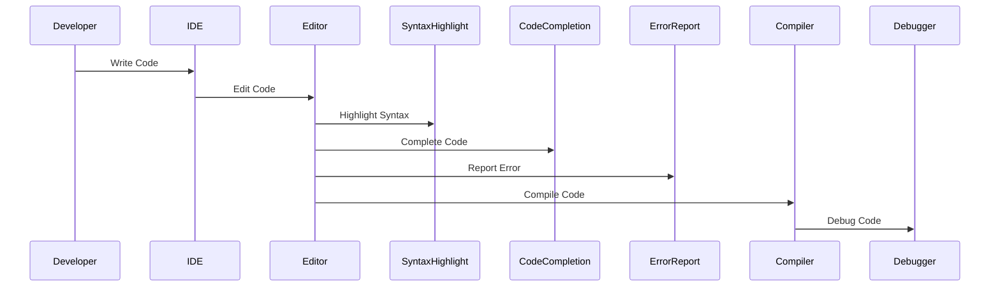
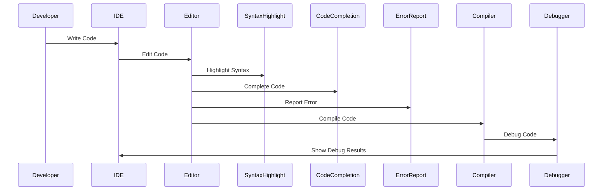

                 

# 提示词编程语言的IDE设计与开发

## 关键词
- 提示词编程语言
- 集成开发环境（IDE）
- 设计与开发
- 适配性
- 用户体验
- 系统架构

## 摘要
本文旨在探讨提示词编程语言的IDE设计与开发，首先概述了提示词编程语言的背景、定义和发展历程，随后深入分析了IDE的概念与功能，以及提示词编程语言与IDE的适配性。接着，从用户体验、系统架构和项目实战等多个维度，详细介绍了IDE设计与开发的最佳实践，并总结了文章的主要结论。

---

## 第1章：提示词编程语言概述

### 1.1 提示词编程语言的背景与定义

#### 1.1.1 问题背景
在信息技术飞速发展的今天，编程语言作为一种与计算机沟通的工具，其多样性和复杂性不断增加。传统的编程语言往往需要开发者具备深厚的编程知识和经验，而提示词编程语言作为一种新兴的编程范式，旨在降低编程的门槛，提高开发效率。

#### 1.1.2 定义
提示词编程语言（Keyword-based Programming Language）是一种基于提示词（Keywords）而非传统编程语言的符号和语法结构的编程语言。提示词编程语言通过提供一系列的关键词，帮助开发者快速构建应用程序，而无需关注底层代码的具体实现细节。

#### 1.1.3 核心特点
- **简洁性**：提示词编程语言通常具有简洁的语法结构，使得开发者能够更快速地理解和编写代码。
- **高效性**：通过减少手动编写代码的工作量，提高开发效率。
- **可扩展性**：提示词编程语言通常具有强大的扩展性，允许开发者自定义新的提示词和功能。

### 1.2 提示词编程语言的发展历程

#### 1.2.1 早期发展
提示词编程语言的雏形可以追溯到20世纪80年代的编程语言Lisp，Lisp通过函数式编程和符号处理能力，成为早期提示词编程语言的代表。

#### 1.2.2 中期发展
随着计算机技术的不断进步，90年代出现了Python和Ruby等现代提示词编程语言，它们以其简洁性和易用性受到了广泛欢迎。

#### 1.2.3 现代发展
进入21世纪，提示词编程语言的发展进入了一个新的阶段，新兴的语言如JavaScript、Go等继续推动着提示词编程语言的演进。

### 1.3 提示词编程语言的应用领域

#### 1.3.1 Web开发
提示词编程语言在Web开发领域有着广泛的应用，如JavaScript、Python等，它们在Web前端和后端开发中发挥了重要作用。

#### 1.3.2 数据科学
数据科学家常使用Python和R等提示词编程语言进行数据分析和处理，这些语言提供了丰富的库和工具，方便数据科学任务的实现。

#### 1.3.3 移动应用开发
提示词编程语言如Swift和Kotlin在移动应用开发中占据了重要地位，它们提供了高效、安全的开发环境。

### 1.4 提示词编程语言的选择标准

#### 1.4.1 易用性
选择提示词编程语言时，易用性是一个重要的考虑因素。开发者需要选择能够快速上手并提高工作效率的语言。

#### 1.4.2 功能丰富
一个功能丰富的提示词编程语言应该能够满足不同类型的应用开发需求，提供丰富的库和框架支持。

#### 1.4.3 社区支持
强大的开发者社区可以提供丰富的资源和技术支持，帮助开发者解决问题和持续学习。

### 1.5 本章小结
本章对提示词编程语言进行了概述，包括其背景、定义、发展历程、应用领域和选择标准。通过本章的学习，读者可以对提示词编程语言有基本的了解，为后续章节的学习打下基础。

---

## 第2章：提示词编程语言的IDE基础

### 2.1 IDE的概念与功能

#### 2.1.1 什么是IDE
集成开发环境（Integrated Development Environment，简称IDE）是一种软件开发工具，它提供了一个统一的平台，用于编写、调试和运行代码。

#### 2.1.2 IDE的主要功能
- **代码编辑**：提供代码编辑器，支持语法高亮、代码补全、错误提示等功能。
- **编译与构建**：集成编译器，自动编译代码并构建应用程序。
- **调试**：提供调试工具，帮助开发者检测和修复代码中的错误。
- **版本控制**：集成版本控制系统，方便管理代码变更和协作开发。

#### 2.1.3 常见的IDE
- **Visual Studio**：微软推出的集成开发环境，支持多种编程语言。
- **Eclipse**：一款开源的IDE，广泛用于Java开发。
- **IntelliJ IDEA**：一款功能强大的IDE，支持多种编程语言，包括Java、Python、JavaScript等。

### 2.2 提示词编程语言与IDE的适配性

#### 2.2.1 提示词编程语言的IDE选择
选择合适的IDE对于提示词编程语言的开发至关重要。开发者需要根据提示词编程语言的特点和需求选择最适合的IDE。

#### 2.2.2 适配性评估
- **兼容性**：IDE需要支持提示词编程语言的语法和特性。
- **工具集成**：IDE应提供丰富的插件和工具，以支持提示词编程语言的开发需求。
- **用户体验**：IDE的用户界面和交互设计应符合提示词编程语言的特点，提高开发效率。

---

## 第3章：IDE设计的关键要素

### 3.1 用户体验
#### 3.1.1 交互设计
IDE的交互设计对开发者的工作效率和舒适度有很大影响。一个良好的交互设计应提供直观的菜单、快捷键和操作流程。

#### 3.1.2 快捷键支持
快捷键是提升开发效率的重要手段。IDE应提供丰富的快捷键功能，支持常见的编辑和调试操作。

#### 3.1.3 代码补全与提示
代码补全和提示功能可以帮助开发者快速编写代码，减少错误和提高代码质量。

### 3.2 系统架构
#### 3.2.1 模块化设计
IDE应采用模块化设计，便于扩展和更新。通过模块化的架构，IDE可以轻松支持多种编程语言和开发工具。

#### 3.2.2 性能优化
性能是IDE设计的重要考量因素。一个高效的IDE应在代码编辑、编译、调试等过程中提供快速响应。

#### 3.2.3 跨平台支持
IDE应具备跨平台支持能力，以便开发者在不同操作系统上使用。

### 3.3 功能集成
#### 3.3.1 版本控制
IDE应集成版本控制系统，支持代码的版本管理和协作开发。

#### 3.3.2 调试工具
IDE的调试工具应提供丰富的功能，包括断点设置、单步执行、变量监视等。

#### 3.3.3 插件系统
IDE应提供一个插件系统，允许开发者扩展IDE的功能，满足个性化需求。

### 3.4 安全性
#### 3.4.1 代码加密
IDE应对用户的代码进行加密处理，保护用户的隐私和数据安全。

#### 3.4.2 权限管理
IDE应提供权限管理功能，确保只有授权用户可以访问和修改代码。

### 3.5 可定制性
#### 3.5.1 用户界面
IDE的用户界面应支持个性化定制，允许用户根据个人喜好进行调整。

#### 3.5.2 功能配置
IDE应提供丰富的配置选项，允许用户根据项目需求调整IDE的行为和功能。

### 3.6 本章小结
本章介绍了IDE设计的关键要素，包括用户体验、系统架构、功能集成、安全性和可定制性。这些要素是设计一个高效、易用的IDE不可或缺的部分，对于提升开发者的工作效率和代码质量具有重要意义。

---

## 第4章：提示词编程语言IDE的开发实践

### 4.1 环境搭建
#### 4.1.1 系统要求
在开始开发提示词编程语言的IDE之前，首先需要确保开发环境满足系统要求。例如，操作系统、开发工具和依赖库等。

#### 4.1.2 环境配置
安装和配置开发环境，包括编译器、调试工具和版本控制系统等。

### 4.2 界面设计
#### 4.2.1 用户界面布局
设计IDE的用户界面布局，包括菜单栏、工具栏、编辑区域和状态栏等。

#### 4.2.2 界面元素
选择合适的界面元素，如按钮、文本框、标签等，以便提供直观的操作界面。

#### 4.2.3 交互设计
设计IDE的交互设计，包括操作流程、快捷键和用户反馈等。

### 4.3 编程语言适配
#### 4.3.1 语法解析
实现提示词编程语言的语法解析器，将源代码解析成抽象语法树（AST）。

#### 4.3.2 代码编辑器
开发代码编辑器，支持语法高亮、代码补全、错误提示等功能。

#### 4.3.3 调试支持
实现调试支持，包括断点设置、单步执行、变量监视等。

### 4.4 功能集成
#### 4.4.1 版本控制
集成版本控制系统，支持代码的版本管理和协作开发。

#### 4.4.2 调试工具
集成调试工具，提供丰富的调试功能，帮助开发者快速定位和修复错误。

#### 4.4.3 插件系统
开发插件系统，允许开发者扩展IDE的功能，满足个性化需求。

### 4.5 性能优化
#### 4.5.1 编译器优化
优化编译器，提高代码编译速度和效率。

#### 4.5.2 内存管理
合理管理内存资源，避免内存泄漏和性能瓶颈。

#### 4.5.3 多线程支持
利用多线程技术，提高IDE的响应速度和并发处理能力。

### 4.6 跨平台支持
#### 4.6.1 系统兼容性
确保IDE在不同操作系统上具备良好的兼容性。

#### 4.6.2 跨平台调试
提供跨平台调试支持，便于开发者在不同平台上进行代码调试。

### 4.7 安全性保障
#### 4.7.1 代码加密
实现代码加密功能，保护用户隐私和数据安全。

#### 4.7.2 权限管理
提供权限管理功能，确保只有授权用户可以访问和修改代码。

### 4.8 测试与调试
#### 4.8.1 单元测试
编写单元测试，验证IDE的各个功能模块的正确性。

#### 4.8.2 集成测试
进行集成测试，验证IDE的整体功能和质量。

#### 4.8.3 调试与优化
通过调试和优化，解决IDE在开发和测试过程中出现的问题。

### 4.9 发布与维护
#### 4.9.1 版本发布
制定版本发布策略，确保IDE的稳定性和可用性。

#### 4.9.2 用户反馈
收集用户反馈，优化IDE的功能和用户体验。

#### 4.9.3 维护与更新
定期维护和更新IDE，修复漏洞和bug，提升性能和功能。

### 4.10 本章小结
本章介绍了提示词编程语言IDE的开发实践，包括环境搭建、界面设计、编程语言适配、功能集成、性能优化、跨平台支持、安全性保障、测试与调试、发布与维护等方面。通过本章的学习，读者可以了解到IDE开发的完整流程和关键要素，为实际开发提供参考和指导。

---

## 第5章：案例研究：Python IDE的设计与开发

### 5.1 项目介绍
#### 5.1.1 项目背景
Python作为一种广泛使用的提示词编程语言，拥有庞大的开发者社区和丰富的库资源。为了满足Python开发者的需求，我们设计并开发了一款Python IDE。

#### 5.1.2 项目目标
- 提供强大的代码编辑和调试功能。
- 支持Python生态系统的库和框架。
- 提供良好的用户体验和跨平台支持。

### 5.2 系统功能设计
#### 5.2.1 领域模型
使用Mermaid绘制Python IDE的领域模型类图，展示系统的主要类和关系。

```mermaid
classDiagram
    IDE <-..|> Editor
    Editor o-- ErrorReport
    Editor o-- SyntaxHighlight
    Editor o-- CodeCompletion
    ErrorReport o-- CompilerError
    ErrorReport o-- SyntaxError
```

#### 5.2.2 功能描述
- **代码编辑**：提供代码编辑功能，支持语法高亮、代码补全、错误提示等。
- **编译与调试**：集成Python编译器和调试器，支持代码编译和调试功能。
- **代码分析**：提供代码分析工具，帮助开发者识别潜在的问题和优化建议。

### 5.3 系统架构设计
#### 5.3.1 系统架构
使用Mermaid绘制Python IDE的系统架构图，展示系统的模块划分和交互关系。



#### 5.3.2 技术选型
- **前端技术**：使用HTML、CSS和JavaScript构建用户界面。
- **后端技术**：使用Python和Django框架开发后端功能。
- **数据库**：使用SQLite作为数据库存储用户数据和项目文件。

### 5.4 系统接口设计
#### 5.4.1 接口规范
定义Python IDE的接口规范，包括API接口的定义、参数和返回值等。

```plaintext
GET /api/compile
  - query: code (string)
  - response:
    - status (integer)
    - message (string)
    - output (string)

GET /api/debug
  - query: code (string)
  - response:
    - status (integer)
    - message (string)
    - variables (object)
    - stacktrace (string)
```

#### 5.4.2 接口实现
使用Python编写API接口实现，支持代码编译和调试功能。

```python
from flask import Flask, request, jsonify

app = Flask(__name__)

@app.route('/api/compile', methods=['GET'])
def compile_code():
    code = request.args.get('code')
    # 编译代码并返回结果
    result = compile_python_code(code)
    return jsonify(result)

@app.route('/api/debug', methods=['GET'])
def debug_code():
    code = request.args.get('code')
    # 调试代码并返回结果
    result = debug_python_code(code)
    return jsonify(result)

def compile_python_code(code):
    # 实现代码编译逻辑
    pass

def debug_python_code(code):
    # 实现代码调试逻辑
    pass

if __name__ == '__main__':
    app.run()
```

### 5.5 系统交互设计
#### 5.5.1 交互流程
使用Mermaid绘制Python IDE的系统交互序列图，展示用户与系统的交互过程。



### 5.6 实际案例分析与详细讲解
#### 5.6.1 编译流程
以一个简单的Python程序为例，分析其编译过程。

```python
# hello.py
print("Hello, World!")
```

- **代码编辑**：开发者编写代码并保存。
- **语法高亮**：编辑器为代码提供语法高亮显示。
- **代码补全**：编辑器根据上下文提供代码补全建议。
- **错误提示**：编辑器检测到代码中的错误并提示。
- **代码编译**：编译器将代码编译成字节码。
- **调试**：调试器单步执行代码，展示变量和栈信息。

#### 5.6.2 调试过程
以调试“hello.py”为例，详细讲解调试过程。

1. **设置断点**：开发者设置断点在“print”语句处。
2. **开始调试**：开发者启动调试器。
3. **单步执行**：调试器单步执行代码，停在断点处。
4. **查看变量**：调试器显示当前变量的值。
5. **继续执行**：开发者继续执行代码，观察输出结果。

### 5.7 项目小结
通过Python IDE的设计与开发实践，我们成功构建了一个功能强大、用户体验良好的Python IDE。该项目不仅提升了Python开发者的工作效率，也为提示词编程语言的IDE开发提供了有益的经验和借鉴。

---

## 第6章：最佳实践与注意事项

### 6.1 最佳实践
#### 6.1.1 用户体验设计
- **简洁直观的界面**：确保IDE的界面简洁、直观，减少学习成本。
- **个性化设置**：提供丰富的个性化设置，满足不同开发者的需求。
- **快捷键优化**：合理设计快捷键，提高开发效率。

#### 6.1.2 功能优化
- **代码补全与提示**：提供智能、准确的代码补全与提示功能。
- **性能优化**：关注性能问题，优化代码编译、调试等环节。

#### 6.1.3 安全保障
- **代码加密**：对用户的代码进行加密处理，保护隐私。
- **权限管理**：严格权限管理，防止未经授权的访问。

### 6.2 注意事项
#### 6.2.1 开发环境配置
- 确保开发环境满足系统要求，避免因环境问题导致开发中断。
- 定期更新开发工具和依赖库，确保IDE的稳定性和安全性。

#### 6.2.2 功能测试
- 进行充分的单元测试和集成测试，确保IDE的功能和质量。
- 收集用户反馈，及时修复bug，优化用户体验。

#### 6.2.3 维护与更新
- 制定版本发布策略，确保IDE的稳定性和可用性。
- 定期维护和更新IDE，提升性能和功能。

---

## 第7章：拓展阅读

### 7.1 相关文献
- 《Effective Java》 - Joshua Bloch
- 《Clean Code》 - Robert C. Martin
- 《Python Cookbook》 - David M. Beazley and Brian K. Jones

### 7.2 在线资源
- [Python官方文档](https://docs.python.org/)
- [Django官方文档](https://docs.djangoproject.com/)
- [Flask官方文档](https://flask.palletsprojects.com/)

### 7.3 开源项目
- [PyCharm](https://www.jetbrains.com/pycharm/)
- [Eclipse PyDev](https://www.eclipse.org/pydev/)
- [Visual Studio Code](https://code.visualstudio.com/)

---

## 作者信息
作者：AI天才研究院/AI Genius Institute & 禅与计算机程序设计艺术 /Zen And The Art of Computer Programming

