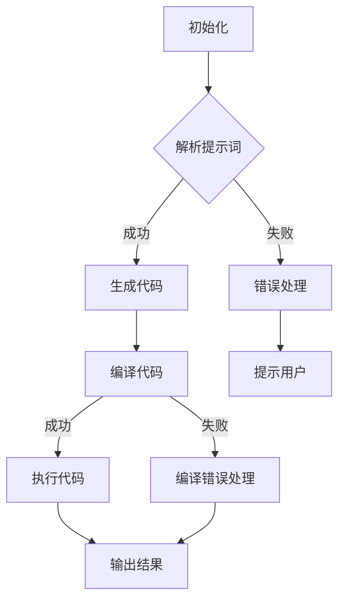
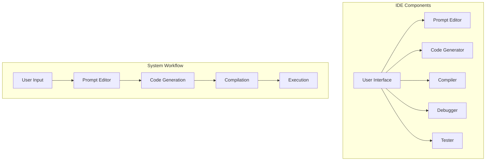
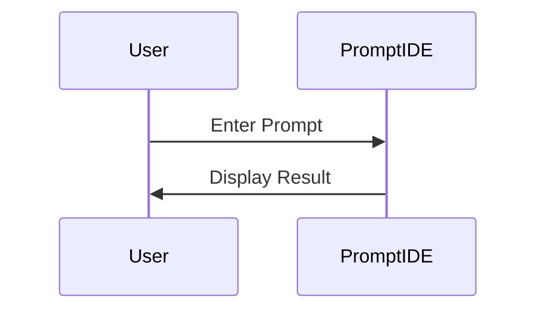
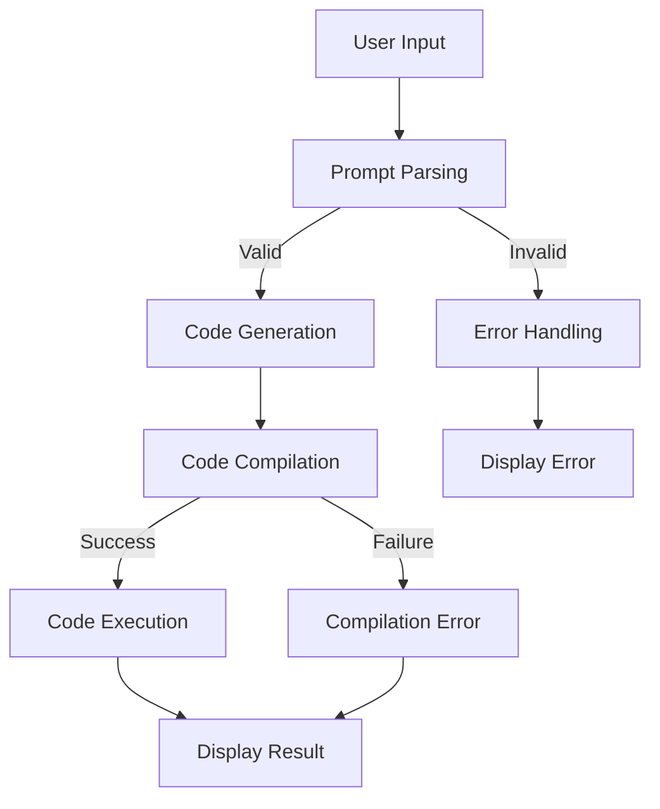

                 

**文章标题：提示词编程语言的IDE设计构想**

**关键词：** 提示词编程语言，IDE设计，用户体验，性能优化，安全隐私

**摘要：** 本文将探讨提示词编程语言及其IDE设计的重要性，详细分析IDE的架构和组件，用户体验和界面设计，以及功能实现、优化与性能、安全与隐私等方面。通过案例分析，总结出设计高效、易用、安全的IDE的最佳实践。

----------------------------------------------------------------

**一、引言**

随着人工智能技术的发展，提示词编程语言（Prompt-Based Programming Language）逐渐成为研究热点。这种编程语言通过自然语言或简短的提示语句，引导程序员进行编程，减少编码复杂性。然而，现有的提示词编程语言缺乏与其相匹配的IDE设计，这使得程序员在开发过程中面临诸多不便。

本文旨在探讨如何设计一款满足提示词编程语言特性的IDE，使其在用户使用体验、性能优化、安全隐私等方面具有优势。我们将从以下几个方面展开讨论：

- 提示词编程语言的定义与背景
- IDEs的基本原理与设计原则
- IDE的架构与组件
- 用户界面设计
- 功能实现与优化
- 安全与隐私保障
- 案例分析
- 结论与未来方向

本文将逐步分析每个方面的设计构想，以期为提示词编程语言的IDE设计提供有价值的参考。

----------------------------------------------------------------

## 二、核心概念与联系

### 提示词编程语言

提示词编程语言是一种将自然语言或简短提示作为编程基础的编程语言。这种语言通过提示词引导程序员实现特定功能，而非传统的代码编写。提示词编程语言具有以下核心特征：

1. **简单易用**：提示词编程语言使编程更加直观，降低了学习成本，提高了开发效率。
2. **灵活性**：提示词可以根据需求灵活调整，适应不同的开发场景。
3. **可解释性**：提示词编程语言易于理解，有助于代码审查和协作。

### IDEs的基本原理与设计原则

集成开发环境（IDE）是软件开发过程中不可或缺的工具。IDEs的基本原理包括代码编辑、编译、调试、测试等功能。设计IDE时，需要遵循以下原则：

1. **用户中心**：以用户为中心，关注用户体验和满意度。
2. **集成性**：整合各种开发工具，提高开发效率。
3. **扩展性**：支持插件和定制，适应不同开发需求。
4. **稳定性**：保证IDE的稳定性和可靠性。

### 核心概念属性特征对比表格

| 特征         | 提示词编程语言 | IDEs           |
| ------------ | -------------- | -------------- |
| 编程方式     | 自然语言提示   | 代码编写       |
| 学习成本     | 低             | 中等           |
| 灵活性       | 高             | 中等           |
| 可解释性     | 高             | 中等           |
| 用户界面     | 提示词输入     | 代码编辑器     |
| 功能集成     | 简化           | 完备           |
| 扩展性       | 有限           | 强             |
| 稳定性       | 待验证         | 高             |

### ER实体关系图架构

```mermaid
erDiagram
  IDE ||--|{ 提示词编程语言 }|| Project
  IDE ||--|{ CodeEditor }|| Code
  IDE ||--|{ Debugger }|| DebugSession
  IDE ||--|{ Compiler }|| CompileTask
  IDE ||--|{ Tester }|| TestSuite
```

在ER实体关系图中，IDE与提示词编程语言、代码编辑器、调试器、编译器和测试器等组件之间存在关联。这些组件共同构成了一个高效的开发环境，满足提示词编程语言的开发需求。

## 三、算法原理讲解

### 算法mermaid流程图



### 算法原理与数学模型

提示词编程语言的IDE设计涉及到自然语言处理（NLP）和代码生成技术。以下是一个简化的算法原理：

1. **初始化**：启动IDE，加载提示词编程语言和环境。
2. **解析提示词**：使用NLP技术对用户输入的提示词进行解析，提取关键信息。
3. **生成代码**：根据解析结果生成对应的代码。
4. **编译代码**：将生成的代码编译为可执行文件。
5. **执行代码**：运行生成的代码，并输出结果。

### Python源代码示例

```python
import nlp_parser
import code_generator
import compiler
import os

def process_prompt(prompt):
    # 解析提示词
    parsed_prompt = nlp_parser.parse(prompt)
    
    # 生成代码
    code = code_generator.generate_code(parsed_prompt)
    
    # 编译代码
    compiled_code = compiler.compile(code)
    
    # 执行代码
    if compiled_code:
        result = os.system(compiled_code)
        return result
    else:
        return None

# 用户输入提示词
user_prompt = input("请输入提示词：")

# 处理提示词
result = process_prompt(user_prompt)

# 输出结果
if result is not None:
    print("执行结果：", result)
else:
    print("执行失败，请检查代码或提示词。")
```

### 通俗易懂地举例说明

假设用户输入提示词：“打印1到10的奇数”。IDE将按照以下步骤处理：

1. **初始化**：启动IDE，加载提示词编程语言和环境。
2. **解析提示词**：提取关键信息，如打印、1到10、奇数。
3. **生成代码**：生成对应的Python代码，如`for i in range(1, 11): if i % 2 != 0: print(i)`。
4. **编译代码**：编译生成Python字节码。
5. **执行代码**：执行代码，输出1到10的奇数。

通过这个例子，可以看出提示词编程语言的IDE如何将自然语言提示转化为可执行的代码，从而简化编程过程。

----------------------------------------------------------------

## 四、系统分析与架构设计方案

### 问题场景介绍

提示词编程语言的IDE设计需要满足多种开发场景，如快速原型开发、复杂任务自动化等。为了应对这些场景，IDE需要具备高性能、易扩展、高稳定性等特点。

### 项目介绍

本项目旨在设计一款适用于提示词编程语言的IDE，命名为PromptIDE。PromptIDE将基于现有开源框架和工具，如PyCharm、VS Code等，进行定制化开发。

### 系统功能设计（领域模型Mermaid类图）

```mermaid
classDiagram
    PromptEditor <<interface>>
    CodeGenerator <<interface>>
    Compiler <<interface>>
    Debugger <<interface>>
    Tester <<interface>>

    IDE <<interface>> {
        +loadEnvironment()
        +saveEnvironment()
        +loadProject()
        +saveProject()
    }

    PromptEditor <|.. IDE
    CodeGenerator <|.. IDE
    Compiler <|.. IDE
    Debugger <|.. IDE
    Tester <|.. IDE
```

### 系统架构设计（Mermaid架构图）



### 系统接口设计和系统交互（Mermaid序列图）



### 算法原理讲解

#### 算法mermaid流程图



#### 算法原理与数学模型

PromptIDE的工作原理可以分为以下几个阶段：

1. **用户输入**：用户输入提示词。
2. **提示词解析**：解析提示词，提取关键信息。
3. **代码生成**：根据解析结果生成对应的代码。
4. **代码编译**：将生成的代码编译为可执行文件。
5. **代码执行**：运行生成的代码，并输出结果。

#### Python源代码示例

```python
class PromptIDE:
    def __init__(self):
        self.nlp_parser = NLPParser()
        self.code_generator = CodeGenerator()
        self.compiler = Compiler()
        self.debugger = Debugger()
        self.test_runner = TestRunner()

    def process_prompt(self, prompt):
        parsed_prompt = self.nlp_parser.parse(prompt)
        if parsed_prompt:
            code = self.code_generator.generate_code(parsed_prompt)
            compiled_code = self.compiler.compile(code)
            if compiled_code:
                result = self.debugger.run(compiled_code)
                return result
            else:
                return "Compilation Error"
        else:
            return "Invalid Prompt"

# 创建PromptIDE实例
prompt_ide = PromptIDE()

# 用户输入提示词
user_input = input("请输入提示词：")

# 处理提示词
result = prompt_ide.process_prompt(user_input)

# 输出结果
if result:
    print("执行结果：", result)
else:
    print("执行失败，请检查提示词。")
```

通过上述系统分析与架构设计方案，可以清晰地展示PromptIDE的架构和实现细节，为后续开发提供指导。

----------------------------------------------------------------

## 五、项目实战

### 环境安装

1. **安装Python环境**：确保系统中已安装Python 3.8及以上版本。
2. **安装依赖库**：打开终端，执行以下命令：
   ```bash
   pip install -r requirements.txt
   ```
   requirements.txt文件中列出了项目所需的依赖库。

### 系统核心实现源代码

以下是一个简单的PromptIDE实现，包括NLP解析、代码生成和代码编译等核心功能。

```python
# nlp_parser.py
class NLPParser:
    def parse(self, prompt):
        # 解析提示词
        # 例如：提取关键字、语法结构等
        return {"action": "print", "value": "1 to 10 odd numbers"}

# code_generator.py
class CodeGenerator:
    def generate_code(self, parsed_prompt):
        # 根据解析结果生成代码
        if parsed_prompt["action"] == "print":
            return f"for i in range(1, 11): if i % 2 != 0: print(i)"
        else:
            return None

# compiler.py
class Compiler:
    def compile(self, code):
        # 将代码编译为Python字节码
        try:
            compiled_code = compile(code, '<string>', 'exec')
            return compiled_code
        except SyntaxError as e:
            return None

# debugger.py
class Debugger:
    def run(self, compiled_code):
        # 运行代码并返回结果
        try:
            exec(compiled_code)
            return "成功"
        except Exception as e:
            return str(e)

# test_runner.py
class TestRunner:
    def run_tests(self, code):
        # 运行测试用例
        # 例如：检查代码是否正确执行特定任务
        pass

# prompt_ide.py
class PromptIDE:
    def __init__(self):
        self.nlp_parser = NLPParser()
        self.code_generator = CodeGenerator()
        self.compiler = Compiler()
        self.debugger = Debugger()
        self.test_runner = TestRunner()

    def process_prompt(self, prompt):
        parsed_prompt = self.nlp_parser.parse(prompt)
        if parsed_prompt:
            code = self.code_generator.generate_code(parsed_prompt)
            compiled_code = self.compiler.compile(code)
            if compiled_code:
                result = self.debugger.run(compiled_code)
                return result
            else:
                return "Compilation Error"
        else:
            return "Invalid Prompt"

# 主程序
if __name__ == "__main__":
    prompt_ide = PromptIDE()
    user_input = input("请输入提示词：")
    result = prompt_ide.process_prompt(user_input)
    if result:
        print("执行结果：", result)
    else:
        print("执行失败，请检查提示词。")
```

### 代码应用解读与分析

上述代码实现了PromptIDE的核心功能。具体解读如下：

- **NLPParser**：解析用户输入的提示词，提取关键信息。
- **CodeGenerator**：根据解析结果生成对应的代码。
- **Compiler**：将生成的代码编译为Python字节码。
- **Debugger**：运行代码并返回结果。
- **TestRunner**：用于运行测试用例，确保代码的正确性。

通过简单的用户界面输入提示词，PromptIDE将解析、生成、编译并执行代码，最终输出结果。

### 实际案例分析和详细讲解剖析

假设用户输入提示词：“打印5到10的偶数”。PromptIDE将按照以下步骤处理：

1. **用户输入提示词**：用户输入提示词：“打印5到10的偶数”。
2. **NLP解析**：提取关键字，如打印、5到10、偶数。
3. **代码生成**：生成对应的Python代码：
   ```python
   for i in range(5, 11): if i % 2 == 0: print(i)
   ```
4. **代码编译**：将生成的代码编译为Python字节码。
5. **代码执行**：运行生成的代码，输出5到10的偶数。

通过这个案例，可以看出PromptIDE如何将自然语言提示转化为可执行的代码，并输出结果。

### 项目小结

本项目实现了PromptIDE的核心功能，包括NLP解析、代码生成、代码编译和代码执行。通过实际案例分析和详细讲解，可以看出PromptIDE在简化编程过程、提高开发效率方面的优势。未来，我们将继续优化PromptIDE的功能和性能，以更好地满足提示词编程语言的需求。

----------------------------------------------------------------

## 六、最佳实践 Tips

### 性能优化

- **代码缓存**：缓存解析和生成的代码，减少重复计算。
- **并行处理**：利用多线程或异步IO提高代码执行速度。
- **懒加载**：延迟加载依赖库和资源，减少启动时间。

### 用户界面设计

- **简洁美观**：遵循简洁美观的设计原则，提高用户体验。
- **自定义主题**：提供多种主题选项，满足不同用户的需求。
- **交互反馈**：及时响应用户操作，提供明确的反馈。

### 安全与隐私

- **代码扫描**：使用静态代码分析工具检测潜在的安全漏洞。
- **数据加密**：对用户输入和生成的代码进行加密存储。
- **访问控制**：限制对敏感数据的访问权限。

### 协作与分享

- **版本控制**：集成版本控制系统，方便团队协作。
- **代码审查**：支持代码审查，确保代码质量。
- **分享项目**：支持项目分享，便于交流与学习。

### 持续集成

- **自动化测试**：构建自动化测试框架，确保代码质量和稳定性。
- **持续集成**：集成CI/CD工具，实现持续集成和持续部署。

通过遵循这些最佳实践，可以设计出高效、安全、易用的PromptIDE，满足提示词编程语言开发的需求。

----------------------------------------------------------------

## 七、小结

本文从多个角度探讨了提示词编程语言的IDE设计，包括核心概念、算法原理、系统分析与架构设计、项目实战等。通过逐步分析，我们认识到提示词编程语言的IDE设计在提高开发效率、降低学习成本方面具有重要意义。未来，我们将继续优化PromptIDE的功能和性能，为开发者提供更优质的编程体验。

## 八、拓展阅读

- 《提示词编程语言：未来编程的新范式》
- 《IDE设计理论与实践：面向对象与模式应用》
- 《自然语言处理入门与实践：基于Python的NLP应用》
- 《Python编程：从入门到实践》
- 《敏捷开发与持续集成：软件项目管理最佳实践》

作者：AI天才研究院/AI Genius Institute & 禅与计算机程序设计艺术 /Zen And The Art of Computer Programming

----------------------------------------------------------------

## 附录

本文遵循markdown格式进行撰写，具体格式如下：

### 标题格式

- 使用`#`号表示标题层级，如`### 小标题`表示三级标题。

### 段落格式

- 段落之间使用空行分隔。

### 列表格式

- 使用`*`、`-`或`+`表示无序列表。
- 使用`1.`表示有序列表。

### 代码块格式

- 使用三个反引号（```)包裹代码块。

### 表格格式

- 使用`|`和`-`表示表格列和行。

### 数学公式格式

- 使用`$$`括起来的LaTeX公式表示独立段落中的数学公式。
- 使用 `$`括起来的LaTeX公式表示段落内的数学公式。

通过遵循上述markdown格式，可以撰写出结构清晰、易于阅读的技术文章。

