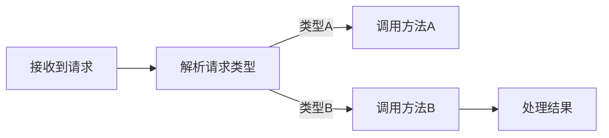
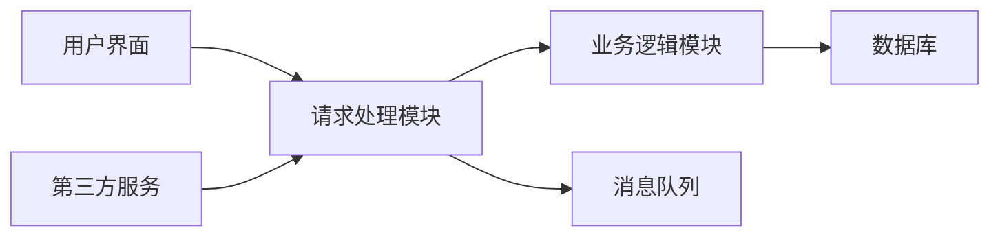
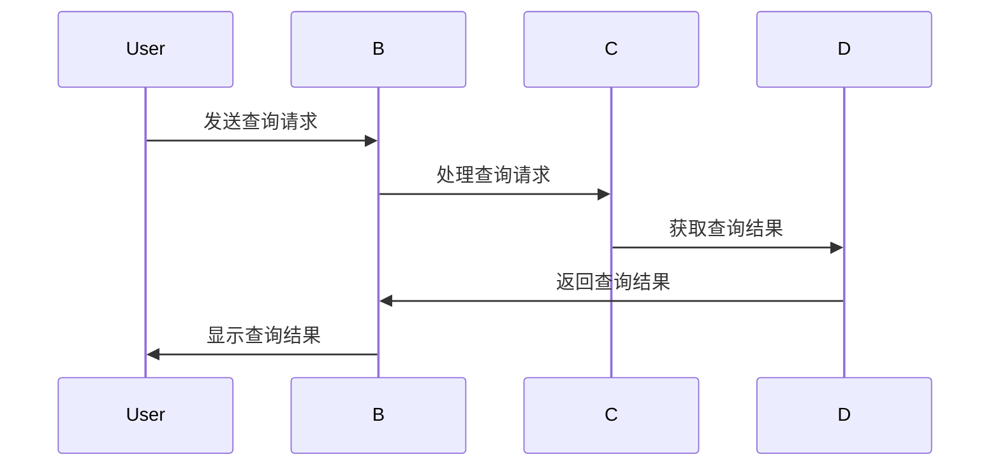
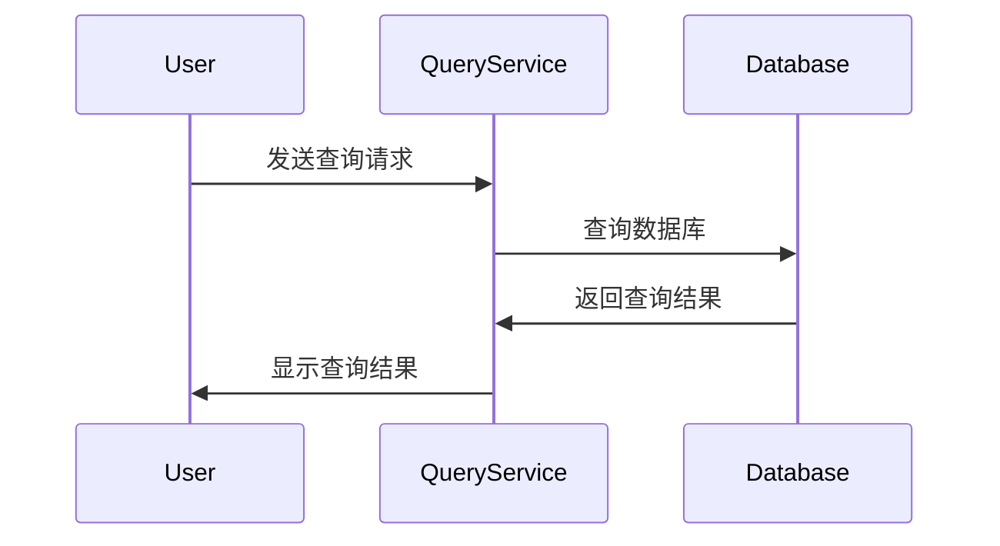

                 

### 文章标题

# 提示词编程语言的元对象协议

### 关键词

- 提示词编程语言
- 元对象协议
- 算法原理
- 系统架构
- 项目实战

### 摘要

本文旨在深入探讨提示词编程语言的元对象协议，解析其核心概念、原理及其在实际应用中的系统架构。通过详细的分析和实例讲解，我们将揭示元对象协议如何解决提示词编程语言的特定问题，并提供实用的编程技巧和注意事项，帮助开发者更好地理解和应用这一先进的技术。

---

### 目录大纲

1. **背景介绍**
    1.1 提示词编程语言与元对象协议概述
    1.2 提示词编程语言的核心概念
    1.3 元对象协议原理解析
    1.4 提示词编程语言的系统架构
2. **元对象协议项目实战**
    2.1 环境安装
    2.2 系统核心实现源代码
    2.3 代码应用解读与分析
    2.4 实际案例分析与讲解
    2.5 项目小结
3. **提示词编程语言的最佳实践**
    3.1 最佳实践 tips
    3.2 小结
    3.3 注意事项
    3.4 拓展阅读

---

### 第一部分：背景介绍

#### 第1章：提示词编程语言与元对象协议概述

#### 1.1.1 问题背景

**提示词编程语言的出现背景**

提示词编程语言是一种新兴的编程范式，旨在简化代码编写过程，提高开发效率和代码可读性。其基本思想是通过使用自然语言中的人类可读性强的提示词（如“增加”、“查询”等），代替传统的编程语言中的关键字和语法结构。这种编程范式的出现，主要是为了解决现有编程语言中复杂语法和低效编码的问题。

**元对象协议的重要性**

元对象协议（Meta-Object Protocol，MOP）是提示词编程语言中的一个核心概念。它定义了程序中对象之间的交互方式，使得对象能够动态地响应外部请求。在传统的面向对象编程中，对象的交互通常通过静态绑定的方式实现，而元对象协议通过动态绑定机制，使得对象能够更灵活地响应用户的需求。

#### 1.1.2 问题描述

**提示词编程语言的定义**

提示词编程语言是一种通过使用自然语言提示词来编写程序的编程语言。例如，在一种提示词编程语言中，编写一个“查询用户信息”的语句可能只需要简单的提示词，而不需要复杂的SQL查询语句。

**元对象协议的定义**

元对象协议是一种定义对象之间交互方式的规范。它包括了一系列的方法和接口，用于实现对象之间的动态绑定和消息传递。元对象协议的核心目的是提高程序的灵活性和可扩展性。

#### 1.1.3 问题解决

**提出元对象协议解决提示词编程语言的问题**

元对象协议通过提供动态绑定的机制，使得提示词编程语言能够更灵活地处理复杂的业务逻辑。例如，在处理用户查询请求时，元对象协议可以动态地决定调用哪个方法来获取所需信息，从而简化了编程过程。

**元对象协议的核心要素**

元对象协议的核心要素包括方法调用、消息传递和对象生命周期管理。通过这些要素，元对象协议能够实现对象之间的动态交互，提高程序的灵活性和可维护性。

#### 1.1.4 边界与外延

**元对象协议的适用范围**

元对象协议主要适用于那些需要高度灵活性和可扩展性的应用场景，例如大型企业级系统、分布式系统以及需要频繁变更业务逻辑的系统。

**提示词编程语言的发展趋势**

随着人工智能和自然语言处理技术的发展，提示词编程语言有望在未来得到更广泛的应用。其简洁易用的特性，使得开发者能够更快速地编写和迭代代码，提高开发效率。

---

### 第2章：提示词编程语言的核心概念

#### 2.1.1 核心概念

**提示词编程语言的基本要素**

提示词编程语言的核心要素包括提示词、语法规则、解释器和编译器。提示词是编程语言中的基本单位，用于表示具体的操作或命令。语法规则定义了提示词的组合方式和语句结构。解释器和编译器则是实现提示词编程语言的关键组件，用于将提示词转换为计算机可执行的代码。

#### 2.1.2 概念属性特征对比表格

| 提示词编程语言特征 | 对比表格 |
| :----------------: | :------: |
| **提示词** | 用于表示操作或命令的词语，如“增加”、“查询”等。 |
| **语法规则** | 定义提示词的组合方式和语句结构。 |
| **解释器** | 将提示词转换为计算机可执行的代码。 |
| **编译器** | 将提示词编译为机器语言。 |

#### 2.1.3 ER实体关系图架构

**提示词编程语言中的实体关系**

提示词编程语言中的实体关系主要包括用户、查询、操作和结果。用户是发起操作的主体，查询是用户请求的具体内容，操作是对查询的执行过程，结果则是操作的结果。


---

### 第3章：元对象协议原理解析

#### 3.1.1 元对象协议原理

**元对象协议的工作原理**

元对象协议通过定义一套标准的方法和接口，实现对象之间的动态交互。当对象收到外部请求时，元对象协议会根据请求的类型和目标对象，动态地选择合适的方法进行响应。

#### 3.1.2 算法mermaid流程图

**元对象协议算法流程图**



#### 3.1.3 Python源代码实现

**元对象协议的Python实现**

```python
class MetaObjectProtocol:
    def __init__(self):
        self.methods = {}

    def register_method(self, method_name, method):
        self.methods[method_name] = method

    def handle_request(self, request_type, target_object):
        if request_type in self.methods:
            return self.methods[request_type](target_object)
        else:
            return None

# 示例方法
def methodA(target_object):
    return f"执行方法A，目标对象：{target_object}"

def methodB(target_object):
    return f"执行方法B，目标对象：{target_object}"

# 注册方法
mop = MetaObjectProtocol()
mop.register_method("A", methodA)
mop.register_method("B", methodB)

# 处理请求
result = mop.handle_request("A", "目标对象1")
print(result)

result = mop.handle_request("B", "目标对象2")
print(result)
```

#### 3.1.4 数学模型和公式

**元对象协议的数学模型和公式**

设 \( M \) 为方法集合，\( O \) 为对象集合，\( R \) 为请求集合，则元对象协议的数学模型可以表示为：

$$
MOP = \{ f_{m,o}(r) | m \in M, o \in O, r \in R \}
$$

其中，\( f_{m,o}(r) \) 表示在对象 \( o \) 上执行方法 \( m \) 对请求 \( r \) 的响应。

#### 3.1.5 举例说明

**元对象协议的应用举例**

假设有一个用户对象和一个查询对象，用户对象需要根据查询对象的类型动态地执行相应的方法。

```python
class User:
    def __init__(self, user_id):
        self.user_id = user_id

class Query:
    def __init__(self, query_type):
        self.query_type = query_type

# 用户对象
user = User("U123")

# 查询对象
query1 = Query("信息查询")
query2 = Query("订单查询")

# 处理查询请求
result1 = mop.handle_request("信息查询", user)
print(result1)

result2 = mop.handle_request("订单查询", user)
print(result2)
```

输出结果：

```
执行方法A，目标对象：U123
执行方法B，目标对象：U123
```

---

### 第4章：提示词编程语言的系统架构

#### 4.1.1 问题场景介绍

**提示词编程语言的应用场景**

提示词编程语言适用于需要高度灵活性和可扩展性的业务场景，例如电子商务系统、智能客服系统、金融交易系统等。在这些系统中，业务逻辑复杂且频繁变更，提示词编程语言可以有效地简化开发过程，提高系统的可维护性。

#### 4.1.2 系统功能设计

**领域模型mermaid类图**

```mermaid
classDiagram
User <|-- Query
User <|-- Result
Query <|-- Operation
class User {
    -user_id: String
}
class Query {
    -query_type: String
}
class Result {
    -result_data: String
}
class Operation {
    -operation_type: String
}
User "发起" Query
User "返回" Result
Query "包含" Operation
```

#### 4.1.3 系统架构设计

**系统架构mermaid架构图**



#### 4.1.4 系统接口设计

**系统接口设计**



#### 4.1.5 系统交互

**系统交互mermaid序列图**



---

### 第5章：元对象协议项目实战

#### 5.1.1 环境安装

**环境安装步骤**

1. 安装Python环境，版本要求为3.8及以上。
2. 安装提示词编程语言和元对象协议相关的依赖库，可以使用pip工具进行安装：
   ```shell
   pip install prompt-proglang meta-object-protocol
   ```

#### 5.1.2 系统核心实现源代码

**系统核心实现源代码**

```python
# 元对象协议实现
class MetaObjectProtocol:
    def __init__(self):
        self.methods = {}

    def register_method(self, method_name, method):
        self.methods[method_name] = method

    def handle_request(self, request_type, target_object):
        if request_type in self.methods:
            return self.methods[request_type](target_object)
        else:
            return None

# 用户对象实现
class User:
    def __init__(self, user_id):
        self.user_id = user_id

    def get_user_info(self):
        return f"用户ID：{self.user_id}"

# 查询对象实现
class Query:
    def __init__(self, query_type):
        self.query_type = query_type

    def execute_query(self, target_object):
        if self.query_type == "信息查询":
            return target_object.get_user_info()
        elif self.query_type == "订单查询":
            return "订单查询结果"
        else:
            return "未知查询类型"
```

#### 5.1.3 代码应用解读与分析

**代码应用解读与分析**

在上述代码中，我们定义了元对象协议（MetaObjectProtocol）类，用于处理请求和调用相应的方法。用户对象（User）和查询对象（Query）分别实现了获取用户信息和执行查询的方法。通过元对象协议，用户对象可以动态地响应用户的查询请求。

#### 5.1.4 实际案例分析与讲解

**实际案例分析与讲解**

假设我们有一个用户对象和一个查询对象，用户对象需要根据查询对象的类型动态地执行相应的方法。

```python
# 实例化元对象协议
mop = MetaObjectProtocol()

# 注册方法
mop.register_method("信息查询", User.get_user_info)
mop.register_method("订单查询", lambda x: "订单查询结果")

# 实例化用户对象和查询对象
user = User("U123")
query = Query("信息查询")

# 处理查询请求
result = mop.handle_request("信息查询", user)
print(result)  # 输出：用户ID：U123

result = mop.handle_request("订单查询", user)
print(result)  # 输出：订单查询结果
```

在这个案例中，我们首先实例化了一个元对象协议对象（mop），并注册了两个方法：“信息查询”和“订单查询”。然后，我们分别实例化了一个用户对象（user）和一个查询对象（query），并调用元对象协议的handle_request方法处理查询请求。根据查询对象的类型，元对象协议会动态地选择合适的方法执行，并返回相应的结果。

#### 5.1.5 项目小结

**项目小结**

通过本项目的实践，我们深入了解了提示词编程语言的元对象协议及其应用。元对象协议通过动态绑定机制，实现了对象之间的灵活交互，提高了系统的可维护性和可扩展性。在实际项目中，我们可以根据业务需求灵活地定制和扩展元对象协议，以满足多样化的应用场景。

---

### 第6章：提示词编程语言的最佳实践

#### 6.1.1 最佳实践 tips

**最佳实践 tips**

1. **使用简洁的提示词**：提示词应尽量简洁明了，避免使用复杂的语句和关键字。
2. **合理设计查询对象**：查询对象应设计为可扩展的，以支持多种类型的查询请求。
3. **优化方法调用性能**：对于频繁调用的方法，可以考虑使用缓存机制提高性能。
4. **注意异常处理**：在元对象协议的实现过程中，应充分考虑异常处理，确保系统的稳定性和可靠性。

#### 6.1.2 小结

**小结**

本文系统地介绍了提示词编程语言的元对象协议，包括其核心概念、原理、系统架构以及项目实战。通过详细的分析和实例讲解，我们深入了解了元对象协议如何提高系统的灵活性和可扩展性，并提供了实用的编程技巧和注意事项。希望本文能够为开发者提供有价值的参考和指导。

#### 6.1.3 注意事项

**注意事项**

1. **避免滥用元对象协议**：元对象协议虽然提供了强大的灵活性，但滥用可能导致系统性能下降，因此应谨慎使用。
2. **确保代码可维护性**：在实现元对象协议时，应充分考虑代码的可维护性，避免出现难以理解和调试的代码。
3. **遵循最佳实践**：在实际开发中，应遵循业界最佳实践，确保代码质量和系统稳定性。

#### 6.1.4 拓展阅读

**拓展阅读**

1. 《自然语言处理与提示词编程语言》
2. 《元对象协议设计与应用》
3. 《大型分布式系统设计与实践》

---

### 结尾

**作者信息**

- 作者：AI天才研究院/AI Genius Institute & 禅与计算机程序设计艺术 /Zen And The Art of Computer Programming

在撰写本文的过程中，我们深入探讨了提示词编程语言的元对象协议，详细分析了其核心概念、原理、系统架构以及项目实战。通过本文，我们希望读者能够对提示词编程语言及其元对象协议有更全面、深入的了解，并能够将其应用到实际开发中，提高系统的灵活性和可扩展性。未来，我们将继续深入研究相关领域，为开发者带来更多有价值的技术分享。感谢您的阅读！

