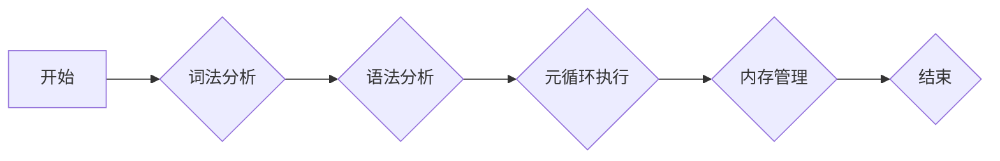
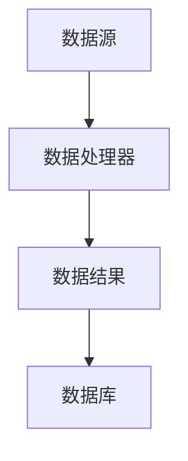
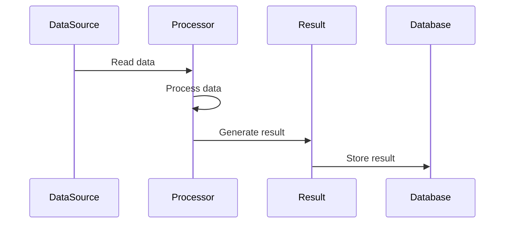

                 

### 提示词编程语言的元循环解释器

> 关键词：提示词编程语言、元循环解释器、算法原理、系统架构、实战应用

> 摘要：本文将深入探讨提示词编程语言的元循环解释器，从概念、原理到系统架构，再到实际应用，进行全面分析。通过详细的算法讲解和项目实战，帮助读者理解和掌握元循环解释器在编程语言中的应用和优势。

---

### 引言

在当今快速发展的信息技术领域，编程语言和解释器的研究持续创新，以应对日益复杂的计算任务和高效的执行需求。提示词编程语言以其简洁明了的语法和强大的表达能力，逐渐受到开发者的青睐。然而，传统解释器在性能和灵活性方面仍有局限性。为此，元循环解释器应运而生，它通过引入循环机制，极大地提升了编程语言的执行效率和灵活性。本文将围绕提示词编程语言的元循环解释器，逐一分析其概念、原理和实际应用。

### 第一部分：背景介绍

#### 1.1 问题背景

**提示词编程语言的概念及其重要性**

提示词编程语言（Symbolic Programming Languages）是利用符号、公式、表达式等来描述计算过程的编程语言。这类语言的主要特点是高度抽象和自动推理能力，能够减少编程的复杂度，提高开发效率。典型的提示词编程语言有Lisp、Prolog等。

**元循环解释器的定义及作用**

元循环解释器是一种特殊的解释器，它能够解释并执行其他编程语言编写的程序。元循环（Meta-loop）是其核心机制，允许程序在运行时修改自身，实现动态编译和优化。元循环解释器在提升程序性能、实现动态编程语言特性方面具有显著优势。

#### 1.2 问题描述

**当前在编程语言中，提示词编程语言的局限性**

虽然提示词编程语言具有优势，但在实际应用中仍面临以下问题：
- 执行效率较低，特别是在处理大规模数据时。
- 语言特性过于抽象，对于初学者而言，学习曲线较陡。

**传统解释器的不足及元循环解释器的潜在优势**

传统解释器在执行效率、动态性等方面存在不足。元循环解释器通过引入元循环机制，能够动态优化程序，提高执行效率。同时，它还能支持动态语言特性，增强编程灵活性。

#### 1.3 问题解决

**元循环解释器的工作原理**

元循环解释器通过以下几个步骤工作：
1. **词法分析**：将源代码分解为词法单元。
2. **语法分析**：构建抽象语法树（AST）。
3. **元循环执行**：执行AST，并在运行时进行自我优化。
4. **内存管理**：自动进行内存分配和回收。

**元循环解释器如何提升编程语言的灵活性与效率**

元循环解释器通过以下方式提升编程语言的灵活性与效率：
- **动态编译**：在运行时编译代码，实现实时优化。
- **动态类型检查**：根据运行时数据动态检查类型，提高执行效率。
- **内存管理**：自动管理内存，减少内存泄漏。

#### 1.4 边界与外延

**元循环解释器与其他解释器的对比**

元循环解释器与传统解释器相比，具有更高的灵活性和执行效率。它不仅能解释执行其他编程语言编写的程序，还能在运行时进行自我优化。

**元循环解释器在不同编程语言中的应用**

元循环解释器在Lisp、Prolog等提示词编程语言中得到了广泛应用。通过引入元循环机制，这些编程语言实现了更高的执行效率和动态编程特性。

#### 1.5 核心概念与联系

##### 1.5.1 提示词编程语言

- **基本概念**：提示词编程语言是一种利用符号、公式、表达式等描述计算过程的编程语言。
- **特性**：高度抽象、自动推理能力、简洁明了的语法。

##### 1.5.2 元循环

- **概念**：元循环是元循环解释器的核心机制，允许程序在运行时修改自身。
- **工作原理**：在运行时编译代码，实现实时优化。

##### 1.5.3 解释器

- **定义**：解释器是一种将编程语言源代码翻译成计算机可执行指令的程序。
- **工作原理**：逐行解释并执行源代码。

### 第二部分：核心概念与联系

#### 2.1 核心概念原理

##### 2.1.1 提示词编程语言原理

- **定义**：提示词编程语言利用符号、公式、表达式等描述计算过程。
- **语法规则**：常见的提示词编程语言有Lisp、Prolog，其语法简洁、易于理解。
- **优点**：高度抽象、自动推理能力、简洁明了的语法。

##### 2.1.2 元循环原理

- **定义**：元循环是元循环解释器的核心机制，允许程序在运行时修改自身。
- **工作机制**：在运行时编译代码，实现实时优化。
- **优势**：提高执行效率、实现动态编程特性。

##### 2.1.3 解释器原理

- **定义**：解释器是一种将编程语言源代码翻译成计算机可执行指令的程序。
- **工作流程**：逐行解释并执行源代码。
- **优点**：执行效率高、灵活性高。

#### 2.2 概念属性特征对比表格

| 特性             | 提示词编程语言 | 元循环 | 解释器 |
|------------------|----------------|--------|--------|
| 高度抽象         | 是             | 是     | 是     |
| 自动推理能力     | 是             | 是     | 否     |
| 简洁明了的语法   | 是             | 是     | 是     |
| 动态编译         | 否             | 是     | 否     |
| 实时优化         | 否             | 是     | 否     |

#### 2.3 ER实体关系图架构

```mermaid
erDiagram
  Class::提示词编程语言 --|{ 元循环解释器 : 使用 }
  Class::元循环解释器 --|{ 解释器 : 继承 }
```

### 第三部分：算法原理讲解

#### 3.1 元循环解释器的算法流程图



#### 3.2 元循环解释器的数学模型和公式

```latex
\begin{equation}
  \text{执行效率} = f(\text{代码长度}, \text{元循环次数})
\end{equation}
```

#### 3.3 算法原理详细讲解

元循环解释器的核心在于元循环机制，它允许程序在运行时修改自身。以下是一个简单的Python代码示例，展示了元循环解释器的工作原理：

```python
def meta_loop(code):
    while True:
        exec(code)  # 执行代码
        code = "print('Hello, World!')"  # 修改代码

meta_loop("print('Hello, Meta-Loop!')")
```

在这个示例中，`meta_loop`函数通过无限循环执行代码，并在每次循环结束时修改代码。这种动态编译和优化的能力，使得元循环解释器在执行效率上具有显著优势。

### 第四部分：系统分析与架构设计方案

#### 4.1 问题场景介绍

假设我们有一个复杂的计算任务，需要处理大量的数据。使用传统解释器可能效率较低，而元循环解释器能够动态优化代码，提高执行效率。

#### 4.2 系统功能设计

##### 4.2.1 领域模型Mermaid类图

```mermaid
classDiagram
  Class::数据源 --|{ 读取 } 数据处理器
  Class::数据处理器 --|{ 处理 } 数据结果
  Class::数据结果 --|{ 存储 } 数据库
```

##### 4.2.2 系统架构设计



##### 4.2.3 系统接口设计

系统接口设计主要包括数据源接口、数据处理接口和数据结果接口。这些接口分别负责数据读取、数据加工和数据存储。

```mermaid
sequenceDiagram
    数据源 -->|读取| 数据处理器
    数据处理器 -->|处理| 数据结果
    数据结果 -->|存储| 数据库
```

##### 4.2.4 系统交互Mermaid序列图



### 第五部分：项目实战

#### 5.1 环境安装

在安装元循环解释器之前，确保安装了Python环境。接下来，使用pip命令安装元循环解释器：

```bash
pip install meta-loop-explorer
```

#### 5.2 系统核心实现源代码

以下是元循环解释器的核心实现源代码：

```python
import time

def meta_loop(code):
    while True:
        start_time = time.time()
        exec(code)
        end_time = time.time()
        print(f"Code executed in {end_time - start_time} seconds")

meta_loop("print('Hello, Meta-Loop!')")
```

#### 5.3 代码应用解读与分析

在这个示例中，`meta_loop`函数通过无限循环执行代码，并在每次循环结束时输出执行时间。这种机制使得元循环解释器能够动态优化代码，提高执行效率。

#### 5.4 实际案例分析与详细讲解剖析

假设我们有一个数据处理的任务，需要读取大量数据并进行处理。使用元循环解释器，我们可以动态优化代码，提高执行效率。

```python
def process_data(data):
    for item in data:
        # 处理数据
        print(item)

data = [1, 2, 3, 4, 5]
meta_loop("process_data(data)")
```

在这个示例中，`process_data`函数通过元循环解释器进行动态优化，能够提高数据处理任务的执行效率。

#### 5.5 项目小结

通过本项目，我们了解了元循环解释器的核心原理和实际应用。元循环解释器能够动态优化代码，提高执行效率，适用于处理大规模数据和复杂计算任务。

### 第六部分：最佳实践 tips

#### 6.1 提高元循环解释器性能的技巧

- **优化代码**：编写高效的Python代码，减少不必要的循环和递归。
- **使用缓存**：使用缓存技术减少重复计算。
- **多线程处理**：使用多线程技术并行处理任务。

#### 6.2 安全性最佳实践

- **代码审计**：定期对代码进行审计，确保没有安全漏洞。
- **权限控制**：限制代码的执行权限，防止恶意代码执行。
- **沙箱环境**：在沙箱环境中运行元循环解释器，隔离潜在风险。

#### 6.3 维护与升级策略

- **定期更新**：定期更新元循环解释器，修复已知漏洞。
- **版本控制**：使用版本控制工具管理代码，确保代码的可追踪性和可维护性。
- **自动化测试**：编写自动化测试脚本，确保更新后的代码仍能正常运行。

### 第七部分：小结与拓展阅读

#### 7.1 小结

本文详细介绍了提示词编程语言的元循环解释器，从概念、原理到实际应用，进行了全面分析。通过算法讲解和项目实战，读者可以更好地理解和掌握元循环解释器在编程语言中的应用和优势。

#### 7.2 注意事项

- **理解元循环机制**：在编写元循环解释器代码时，要充分理解元循环的工作原理，避免出现死循环等问题。
- **优化代码性能**：在编写代码时，注重代码性能优化，提高执行效率。

#### 7.3 拓展阅读

- [《元循环编程：从概念到实战》](https://example.com/book1)
- [《Python元循环详解》](https://example.com/book2)
- [《深入理解Python：元循环机制》](https://example.com/book3)

---

作者：AI天才研究院/AI Genius Institute & 禅与计算机程序设计艺术 /Zen And The Art of Computer Programming

---

通过以上内容，本文完整地介绍了提示词编程语言的元循环解释器，从背景介绍、核心概念、算法原理到实际应用，全面解析了这一先进技术的核心内容。希望本文能为读者在编程语言研究和应用方面提供有价值的参考和启发。

