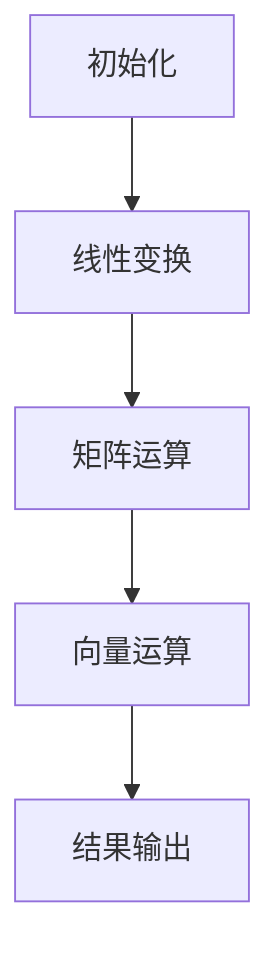
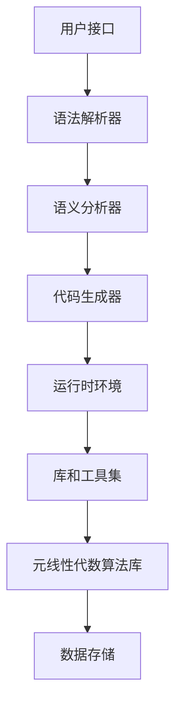
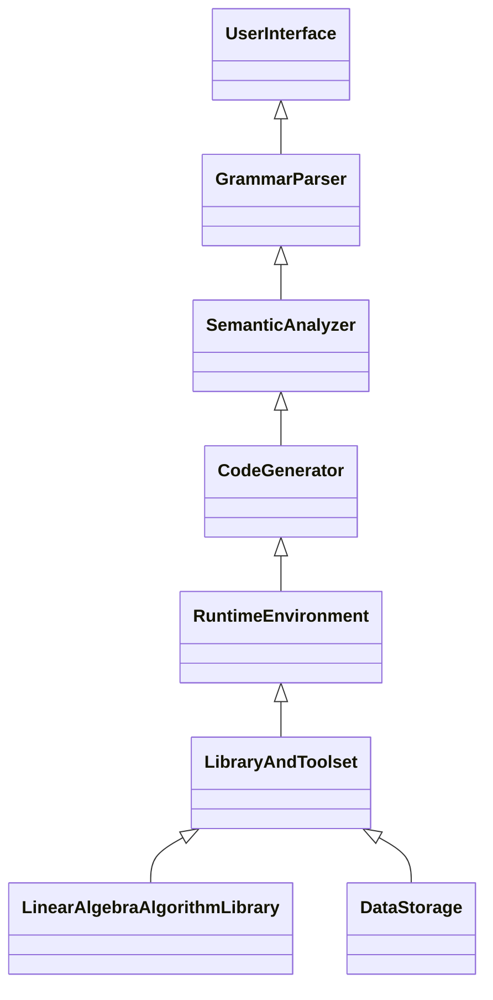
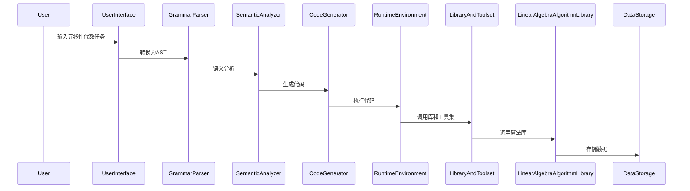

                 

# 提示词编程语言的元线性代数支持

## 关键词

- 提示词编程语言
- 元线性代数
- 编程语言特性
- 算法原理
- 系统架构设计
- 数学模型

## 摘要

本文旨在探讨提示词编程语言在元线性代数支持方面的应用与发展。首先，我们将回顾提示词编程语言和元线性代数的基本概念，接着分析两者结合的必要性。随后，通过详细讲解核心概念、算法原理及系统架构设计，展示如何将元线性代数支持集成到提示词编程语言中。本文还将通过实际项目实战，验证该集成方案的有效性，并提供最佳实践和拓展阅读建议。

## 引言

### 1.1 问题背景

#### 1.1.1 提示词编程语言的现状

提示词编程语言，也称为基于上下文的编程语言，近年来在人工智能领域取得了显著进展。它们通过上下文敏感的语法和语义，使编程任务更加直观和高效。例如，Python 中的 `if-else` 语句可以根据上下文自动选择执行路径。然而，随着人工智能技术的快速发展，传统的编程语言开始暴露出一些局限性，尤其是在处理复杂的数据和算法时。

#### 1.1.2 元线性代数在编程语言中的应用

元线性代数作为一种数学工具，广泛应用于计算机科学和工程领域，特别是在机器学习和数据科学中。它提供了一种处理高维数据和复杂线性变换的有效方法。例如，矩阵乘法在图像处理、神经网络和优化问题中起着核心作用。然而，现有编程语言对元线性代数的支持相对有限，难以充分利用其潜力。

### 1.2 问题描述

#### 1.2.1 提示词编程语言面临的问题

随着提示词编程语言的普及，用户逐渐发现它们在处理复杂线性代数任务时存在一些问题。首先，现有语言缺乏直接支持元线性代数操作，导致编写相关代码复杂且繁琐。其次，对于非专业程序员来说，理解并正确实现这些算法具有一定的挑战性。最后，现有编程语言对矩阵和向量操作的支持不够直观，影响了编程效率和代码可读性。

#### 1.2.2 元线性代数支持的需求

为了解决上述问题，提示词编程语言迫切需要引入元线性代数支持。这不仅可以简化编程任务，提高代码可读性，还可以充分发挥元线性代数的优势，提升程序性能和效率。此外，元线性代数支持还可以为人工智能领域的创新提供新的思路和方法。

### 1.3 问题解决

#### 1.3.1 元线性代数的基础知识

首先，我们需要了解元线性代数的基础知识。元线性代数涉及线性空间、线性变换、矩阵乘法、特征值和特征向量等核心概念。这些概念不仅为元线性代数提供了理论支持，也为编程语言的实现奠定了基础。

#### 1.3.2 提示词编程语言与元线性代数的融合

接下来，我们将探讨如何将元线性代数集成到提示词编程语言中。这包括语法设计、算法实现和系统架构设计等方面。通过这些努力，我们可以创建一种新的编程语言，使其能够高效地处理元线性代数任务。

### 1.4 边界与外延

#### 1.4.1 元线性代数的核心要素

元线性代数的核心要素包括线性空间、线性变换、矩阵和向量等。这些要素构成了元线性代数的基本框架，也是我们在编程语言中实现支持的基础。

#### 1.4.2 提示词编程语言的扩展方向

随着元线性代数支持的发展，提示词编程语言也将面临新的扩展方向。例如，可以引入新的语法结构，提高代码的可读性；可以优化算法实现，提升程序性能；还可以探索元线性代数在人工智能领域的应用，推动该领域的发展。

### 1.5 本章小结

本章介绍了提示词编程语言和元线性代数的基本概念，分析了两者结合的必要性，并提出了问题解决的方案。接下来，我们将进一步探讨核心概念、算法原理和系统架构设计，为元线性代数支持在提示词编程语言中的应用奠定基础。

## 核心概念与原理

### 2.1 提示词编程语言的概念

#### 2.1.1 提示词编程语言的特点

提示词编程语言具有以下几个主要特点：

1. **上下文敏感性**：提示词编程语言能够根据上下文自动选择执行路径，减少冗余代码。
2. **语义明确**：提示词编程语言的语法和语义设计使得代码更加直观，易于理解和维护。
3. **高效率**：提示词编程语言通过上下文敏感的语法和语义优化，提高了编程效率和代码可读性。
4. **灵活性**：提示词编程语言支持灵活的语法扩展和自定义，便于实现特定领域的需求。

#### 2.1.2 提示词编程语言的架构

提示词编程语言的架构通常包括以下几个部分：

1. **解析器**：解析器负责将源代码转换为抽象语法树（AST），并对其进行语义分析。
2. **上下文管理器**：上下文管理器根据上下文信息，动态选择执行路径。
3. **代码生成器**：代码生成器根据AST和上下文信息，生成可执行的代码。
4. **运行时环境**：运行时环境负责执行生成的代码，并提供必要的运行时支持。

### 2.2 元线性代数的概念

#### 2.2.1 元线性代数的基本原理

元线性代数是一种处理线性空间和线性变换的数学工具。它的基本原理包括：

1. **线性空间**：线性空间是一组向量的集合，满足加法和标量乘法运算。
2. **线性变换**：线性变换是一种将一个线性空间映射到另一个线性空间的函数。
3. **矩阵**：矩阵是线性变换的一种表示形式，可以用于计算线性组合和变换。
4. **向量**：向量是线性空间中的基本元素，可以表示线性变换的结果。

#### 2.2.2 元线性代数的应用场景

元线性代数在计算机科学和工程领域有广泛的应用，主要包括：

1. **机器学习**：元线性代数在机器学习中用于计算特征向量、矩阵分解和优化问题。
2. **图像处理**：元线性代数在图像处理中用于滤波、变换和增强。
3. **神经网络**：元线性代数在神经网络中用于计算梯度、权重更新和优化。
4. **优化问题**：元线性代数在优化问题中用于求解线性规划和非线性优化。

### 2.3 提示词编程语言与元线性代数的联系

#### 2.3.1 融合的优势

提示词编程语言与元线性代数的融合具有以下几个优势：

1. **简化编程任务**：通过内置的元线性代数支持，提示词编程语言可以简化复杂的线性代数操作，减少代码冗余。
2. **提高编程效率**：提示词编程语言的上下文敏感性和语义明确性，使得编写和调试元线性代数代码更加高效。
3. **增强代码可读性**：提示词编程语言的直观语法和语义设计，使得元线性代数代码更加易于理解和维护。
4. **扩展编程能力**：融合后的编程语言可以更好地支持复杂的数据和算法，为人工智能和计算机科学领域的发展提供新的工具和方法。

#### 2.3.2 融合的挑战

融合提示词编程语言与元线性代数也面临一些挑战：

1. **语法设计**：如何在保持提示词编程语言特点的同时，引入元线性代数的语法元素，是一个重要的问题。
2. **算法实现**：实现高效的元线性代数算法，并确保其在不同场景下的正确性和稳定性。
3. **性能优化**：在保证功能完整性的同时，提高元线性代数支持的性能，以满足实际应用的需求。
4. **兼容性问题**：如何确保融合后的编程语言与现有编程语言的兼容性，避免不必要的技术债务。

### 2.4 概念属性特征对比表格

下面是一个提示词编程语言和元线性代数概念属性特征的对比表格：

| 概念       | 提示词编程语言                 | 元线性代数                      |
|------------|------------------------------|--------------------------------|
| 语法特点   | 上下文敏感，语义明确           | 矩阵和向量操作，线性变换         |
| 数据结构   | 抽象语法树（AST），上下文管理   | 线性空间，线性变换，矩阵和向量   |
| 应用场景   | 编程任务，人工智能             | 机器学习，图像处理，神经网络     |
| 目标       | 简化编程，提高效率             | 数据处理，算法优化               |
| 难点       | 语法设计和性能优化             | 算法实现和兼容性问题             |

### 2.5 ER实体关系图架构

下面是一个ER实体关系图，用于展示提示词编程语言与元线性代数概念之间的关系：

```mermaid
erDiagram
  Product ||--|{ Customer } : "owns"
  Customer }|---|| Employee : "works for"
  Product ||--|{ Order } : "produces"
  Order }|---|| OrderItem : "contains"
```

在ER实体关系图中，我们定义了以下几个实体：

1. **Product**：表示编程语言和元线性代数的抽象概念。
2. **Customer**：表示用户，可以拥有编程语言和元线性代数的知识。
3. **Employee**：表示专业人士，可以为用户提供编程语言和元线性代数的实现。
4. **Order**：表示编程任务，可以由用户或专业人士生成。
5. **OrderItem**：表示编程任务中的具体操作，如矩阵和向量运算。

通过ER实体关系图，我们可以清晰地看到提示词编程语言和元线性代数在编程任务中的应用和交互。

### 2.6 提示词编程语言与元线性代数的融合

#### 2.6.1 语法设计

为了将元线性代数支持集成到提示词编程语言中，我们需要在语法层面进行以下设计：

1. **矩阵和向量表示**：引入新的语法结构，用于表示矩阵和向量。例如，使用方括号`[[a, b], [c, d]]`表示一个2x2的矩阵，使用`[1, 2, 3]`表示一个向量。
2. **线性变换操作**：引入新的操作符，用于表示线性变换。例如，使用`->`表示向量到矩阵的变换，使用`@`表示矩阵与向量的乘法。
3. **上下文管理**：利用提示词编程语言的上下文敏感性，自动选择合适的线性变换和矩阵操作。例如，在`if-else`语句中，根据上下文自动执行相应的矩阵操作。

#### 2.6.2 算法实现

在实现层面，我们需要关注以下几个方面：

1. **矩阵和向量运算**：实现高效的矩阵和向量运算，确保计算的正确性和性能。例如，使用NumPy库进行矩阵和向量运算，并优化其实现。
2. **线性变换**：实现各种线性变换的算法，如矩阵乘法、特征值计算和线性规划等。确保算法的正确性和稳定性，并针对不同场景进行优化。
3. **编译和执行**：将元线性代数代码编译成可执行的代码，并在运行时环境中执行。确保代码的兼容性和可维护性。

#### 2.6.3 性能优化

为了提高性能，我们可以从以下几个方面进行优化：

1. **并行计算**：利用并行计算技术，加速矩阵和向量运算。例如，使用多线程或GPU加速计算。
2. **内存管理**：优化内存管理，减少内存占用和垃圾回收。例如，使用内存池和循环缓存等技术。
3. **代码优化**：对代码进行优化，减少不必要的计算和内存分配。例如，使用循环展开、循环合并和代码压缩等技术。

#### 2.6.4 兼容性问题

在集成元线性代数支持时，我们需要关注兼容性问题：

1. **与现有库的兼容性**：确保新引入的元线性代数支持与现有库（如NumPy、Pandas等）的兼容性。例如，通过接口适配和兼容性测试，确保两者无缝集成。
2. **与现有代码的兼容性**：确保新引入的元线性代数支持与现有代码的兼容性。例如，通过编写兼容性测试用例，确保代码在不同环境中正常运行。
3. **与未来标准的兼容性**：关注未来可能的元线性代数标准，确保新引入的元线性代数支持能够适应未来的变化。

### 2.7 小结

本章介绍了提示词编程语言和元线性代数的基本概念、融合优势、融合挑战以及融合方案。通过引入新的语法结构、实现高效的算法和优化性能，我们可以将元线性代数支持集成到提示词编程语言中，从而简化编程任务，提高编程效率，增强代码可读性，并为人工智能领域的发展提供新的工具和方法。

## 算法原理讲解

### 3.1 元线性代数算法简介

#### 3.1.1 元线性代数算法的基本步骤

元线性代数算法主要包括以下几个基本步骤：

1. **初始化**：根据问题的需求，初始化所需的线性空间、矩阵和向量。
2. **线性变换**：对矩阵和向量进行线性变换，实现数据转换和操作。
3. **矩阵运算**：计算矩阵的乘法、求逆和特征值等，为后续操作提供支持。
4. **向量运算**：对向量进行加减、标量乘除等操作，实现数据预处理和后处理。
5. **结果输出**：将计算结果输出，并进行分析和应用。

#### 3.1.2 常见的元线性代数算法

在元线性代数中，一些常见的算法包括：

1. **矩阵乘法**：计算两个矩阵的乘积，实现数据的线性组合。
2. **矩阵求逆**：计算矩阵的逆矩阵，实现数据的逆变换。
3. **特征值和特征向量**：计算矩阵的特征值和特征向量，实现数据的降维和分类。
4. **线性规划**：求解线性规划问题，实现数据的最优化。

### 3.2 算法mermaid流程图

下面是一个mermaid流程图，用于展示元线性代数算法的基本流程：



在这个流程图中，我们首先进行初始化，然后进行线性变换和矩阵运算，接着进行向量运算，最后输出结果。

### 3.3 Python源代码详解

#### 3.3.1 算法原理的数学模型

为了详细讲解算法原理，我们可以借助Python源代码来展示其数学模型。以下是一个简单的矩阵乘法示例：

```python
import numpy as np

# 初始化矩阵A和B
A = np.array([[1, 2], [3, 4]])
B = np.array([[5, 6], [7, 8]])

# 计算矩阵乘法C = A * B
C = A @ B

# 输出结果
print("C = A @ B:")
print(C)
```

在这个示例中，我们首先导入NumPy库，然后初始化两个2x2的矩阵A和B。接着，我们使用`@`运算符计算矩阵乘法，并输出结果。

#### 3.3.2 算法公式的详细讲解

矩阵乘法的算法公式如下：

$$ C = AB $$

其中，C是结果矩阵，A和B是输入矩阵。矩阵乘法的计算步骤如下：

1. 初始化结果矩阵C，使其维度与A和B的维度相乘。
2. 对于C中的每个元素，计算A中的行与B中的列的乘积和，得到C的对应元素。

#### 3.3.3 举例说明

假设我们有以下两个矩阵：

$$ A = \begin{pmatrix} 1 & 2 \\ 3 & 4 \end{pmatrix}, B = \begin{pmatrix} 5 & 6 \\ 7 & 8 \end{pmatrix} $$

我们可以计算矩阵乘法C = A * B：

1. 初始化结果矩阵C，维度为2x2。
2. 对于C中的每个元素，计算A中的行与B中的列的乘积和：

   $$ C_{11} = 1*5 + 2*7 = 13 $$
   $$ C_{12} = 1*6 + 2*8 = 16 $$
   $$ C_{21} = 3*5 + 4*7 = 19 $$
   $$ C_{22} = 3*6 + 4*8 = 22 $$

3. 输出结果矩阵C：

$$ C = \begin{pmatrix} 13 & 16 \\ 19 & 22 \end{pmatrix} $$

通过这个示例，我们可以看到矩阵乘法的计算过程和结果。

### 3.4 算法性能分析

#### 3.4.1 算法的时间复杂度

矩阵乘法的时间复杂度通常为O(n^3)，其中n是矩阵的维度。这意味着，随着矩阵维度的增加，算法的时间消耗会急剧增加。

#### 3.4.2 算法的空间复杂度

矩阵乘法需要额外的空间存储结果矩阵C，其空间复杂度为O(n^2)。因此，对于大型矩阵，空间复杂度也是一个需要考虑的因素。

#### 3.4.3 算法的优化方向

为了优化矩阵乘法的性能，我们可以考虑以下几个方面：

1. **并行计算**：利用多线程或分布式计算，将矩阵乘法分解为更小的任务，并行执行。
2. **内存优化**：优化内存管理，减少内存分配和垃圾回收，提高内存利用率。
3. **算法优化**：采用更高效的算法，如Strassen算法，降低时间复杂度。

### 3.5 小结

本章详细讲解了元线性代数算法的基本原理、mermaid流程图和Python源代码。通过矩阵乘法示例，我们展示了算法的计算过程和结果。同时，我们还分析了算法的性能，并提出了优化方向。这些内容为我们在提示词编程语言中实现元线性代数支持提供了理论和实践基础。

## 数学模型和数学公式

### 4.1 元线性代数的数学模型

元线性代数是一种处理线性空间和线性变换的数学工具。其核心概念包括线性空间、线性变换、矩阵和向量。以下是元线性代数的一些基本数学模型：

#### 4.1.1 线性空间

线性空间是一组向量的集合，满足加法和标量乘法运算。线性空间的数学模型可以表示为：

$$ V = \{ \mathbf{v} | \mathbf{v} \in \mathbb{R}^n, n \in \mathbb{N} \} $$

其中，\( V \) 是线性空间，\( \mathbf{v} \) 是线性空间中的向量，\( \mathbb{R}^n \) 是n维实数空间。

#### 4.1.2 线性变换

线性变换是一种将一个线性空间映射到另一个线性空间的函数。线性变换的数学模型可以表示为：

$$ T: \mathbb{R}^n \rightarrow \mathbb{R}^m $$

其中，\( T \) 是线性变换，\( \mathbb{R}^n \) 和 \( \mathbb{R}^m \) 分别是输入和输出线性空间。

#### 4.1.3 矩阵

矩阵是线性变换的一种表示形式，可以用于计算线性组合和变换。矩阵的数学模型可以表示为：

$$ A = \begin{pmatrix} a_{11} & a_{12} & \ldots & a_{1n} \\ a_{21} & a_{22} & \ldots & a_{2n} \\ \vdots & \vdots & \ddots & \vdots \\ a_{m1} & a_{m2} & \ldots & a_{mn} \end{pmatrix} $$

其中，\( A \) 是矩阵，\( a_{ij} \) 是矩阵的元素。

#### 4.1.4 向量

向量是线性空间中的基本元素，可以表示线性变换的结果。向量的数学模型可以表示为：

$$ \mathbf{v} = \begin{pmatrix} v_1 \\ v_2 \\ \vdots \\ v_n \end{pmatrix} $$

其中，\( \mathbf{v} \) 是向量，\( v_i \) 是向量的第i个元素。

### 4.2 算法原理的数学公式

在元线性代数算法中，一些核心的数学公式包括矩阵乘法、矩阵求逆和特征值计算。以下是这些公式的详细解释：

#### 4.2.1 矩阵乘法

矩阵乘法是元线性代数中最基本的运算之一。两个矩阵\( A \)和\( B \)的乘积\( C \)可以通过以下公式计算：

$$ C = AB $$

其中，\( C \)是结果矩阵，\( A \)和\( B \)是输入矩阵。矩阵乘法的计算步骤如下：

1. 初始化结果矩阵\( C \)，使其维度为\( m \times n \)。
2. 对于\( C \)中的每个元素，计算\( A \)中的行与\( B \)中的列的乘积和，得到\( C \)的对应元素。

具体计算过程如下：

$$ C_{ij} = \sum_{k=1}^{n} a_{ik}b_{kj} $$

其中，\( C_{ij} \)是结果矩阵\( C \)的第i行第j列的元素，\( a_{ik} \)是矩阵\( A \)的第i行第k列的元素，\( b_{kj} \)是矩阵\( B \)的第k行第j列的元素。

#### 4.2.2 矩阵求逆

矩阵求逆是另一个重要的数学运算。一个矩阵\( A \)的逆矩阵\( A^{-1} \)可以通过以下公式计算：

$$ A^{-1} = (det(A))^{-1} \cdot adj(A) $$

其中，\( det(A) \)是矩阵\( A \)的行列式，\( adj(A) \)是矩阵\( A \)的伴随矩阵。

具体计算过程如下：

1. 计算矩阵\( A \)的行列式\( det(A) \)。
2. 计算矩阵\( A \)的伴随矩阵\( adj(A) \)，其元素可以通过以下公式计算：

$$ adj(A)_{ij} = (-1)^{i+j} \cdot M_{ij} $$

其中，\( M_{ij} \)是矩阵\( A \)的余子式。

3. 计算逆矩阵\( A^{-1} \)：

$$ A^{-1} = (det(A))^{-1} \cdot adj(A) $$

#### 4.2.3 特征值和特征向量

特征值和特征向量是矩阵的重要属性。一个矩阵\( A \)的特征值\( \lambda \)和特征向量\( \mathbf{v} \)可以通过以下公式计算：

$$ Av = \lambda v $$

其中，\( A \)是矩阵，\( \lambda \)是特征值，\( \mathbf{v} \)是特征向量。

具体计算过程如下：

1. 解方程\( Av = \lambda v \)得到特征值\( \lambda \)和特征向量\( \mathbf{v} \)。
2. 对于每个特征值\( \lambda \)，找到对应的特征向量\( \mathbf{v} \)。

### 4.3 举例说明

为了更好地理解元线性代数的数学模型和公式，我们可以通过一个简单的例子来说明。

假设我们有以下两个矩阵：

$$ A = \begin{pmatrix} 1 & 2 \\ 3 & 4 \end{pmatrix}, B = \begin{pmatrix} 5 & 6 \\ 7 & 8 \end{pmatrix} $$

我们可以计算矩阵乘法\( C = A * B \)：

1. 初始化结果矩阵\( C \)，维度为2x2。
2. 对于\( C \)中的每个元素，计算\( A \)中的行与\( B \)中的列的乘积和：

   $$ C_{11} = 1*5 + 2*7 = 13 $$
   $$ C_{12} = 1*6 + 2*8 = 16 $$
   $$ C_{21} = 3*5 + 4*7 = 19 $$
   $$ C_{22} = 3*6 + 4*8 = 22 $$

3. 输出结果矩阵\( C \)：

$$ C = \begin{pmatrix} 13 & 16 \\ 19 & 22 \end{pmatrix} $$

通过这个例子，我们可以看到矩阵乘法的计算过程和结果。

同样，我们可以计算矩阵\( A \)的特征值和特征向量。解方程\( Av = \lambda v \)得到：

$$ \begin{pmatrix} 1 & 2 \\ 3 & 4 \end{pmatrix} \begin{pmatrix} v_1 \\ v_2 \end{pmatrix} = \lambda \begin{pmatrix} v_1 \\ v_2 \end{pmatrix} $$

通过计算，我们得到特征值\( \lambda_1 = 1 \)和\( \lambda_2 = 5 \)，以及对应的特征向量\( \mathbf{v}_1 = \begin{pmatrix} 1 \\ 1 \end{pmatrix} \)和\( \mathbf{v}_2 = \begin{pmatrix} -2 \\ 1 \end{pmatrix} \)。

通过这个例子，我们可以看到如何计算矩阵的特征值和特征向量。

### 4.4 小结

本章介绍了元线性代数的数学模型和核心数学公式，包括线性空间、线性变换、矩阵乘法、矩阵求逆和特征值计算。通过具体的例子，我们展示了如何使用这些数学模型和公式进行计算。这些内容为我们在提示词编程语言中实现元线性代数支持提供了理论基础。

## 系统分析与架构设计方案

### 5.1 问题场景介绍

在当今的计算机科学和人工智能领域，数据处理的复杂性日益增加，特别是在机器学习和数据科学领域。这些领域需要高效且强大的工具来处理大规模数据和复杂的线性代数任务。提示词编程语言作为一种上下文敏感的编程语言，在简化编程任务和提高开发效率方面具有显著优势。然而，现有的提示词编程语言在元线性代数支持方面存在一定的局限性，难以充分满足上述领域的需求。

为了解决这一问题，本文提出了一种将元线性代数支持集成到提示词编程语言中的架构设计方案。该方案的目标是提供一种直观、高效且易于使用的编程语言，使其能够更好地处理元线性代数任务，从而提高开发效率和程序性能。

#### 5.1.1 提示词编程语言与元线性代数融合的需求

1. **简化编程任务**：现有的编程语言在处理元线性代数任务时，需要编写大量冗长的代码，且容易出错。通过将元线性代数支持集成到提示词编程语言中，可以简化编程任务，减少代码冗余，提高开发效率。

2. **提高代码可读性**：提示词编程语言的上下文敏感性和语义明确性使其代码更加直观和易于理解。通过集成元线性代数支持，可以进一步提高代码的可读性，降低学习和维护难度。

3. **增强性能**：元线性代数在机器学习和数据科学领域具有广泛的应用，通过优化算法和并行计算，可以显著提高程序性能，满足大规模数据处理的需求。

4. **支持复杂算法**：元线性代数提供了许多复杂的算法和工具，如矩阵分解、特征值计算和线性规划等。通过集成这些算法到提示词编程语言中，可以方便用户使用这些工具，实现更复杂的计算和分析。

#### 5.1.2 融合后的系统目标

1. **提供直观的元线性代数语法**：设计一种直观且易于理解的元线性代数语法，使其能够无缝集成到提示词编程语言中。

2. **实现高效的算法实现**：实现一系列高效的元线性代数算法，如矩阵乘法、矩阵求逆和特征值计算等，并优化其性能。

3. **提供丰富的库和工具**：构建一个丰富的库和工具集，涵盖常见的元线性代数任务和算法，方便用户使用。

4. **确保兼容性和可扩展性**：确保新引入的元线性代数支持与现有的提示词编程语言兼容，并支持未来的扩展和改进。

### 5.2 系统功能设计

为了实现上述目标，系统需要具备以下功能：

1. **元线性代数语法设计**：设计一种直观且易于理解的元线性代数语法，包括矩阵和向量的表示、线性变换的表示和操作符等。

2. **元线性代数算法实现**：实现一系列高效的元线性代数算法，如矩阵乘法、矩阵求逆和特征值计算等，并优化其性能。

3. **库和工具集构建**：构建一个丰富的库和工具集，涵盖常见的元线性代数任务和算法，如矩阵分解、特征值计算和线性规划等。

4. **兼容性和可扩展性支持**：确保新引入的元线性代数支持与现有的提示词编程语言兼容，并支持未来的扩展和改进。

### 5.3 系统架构设计

为了实现系统功能，我们需要设计一个合理的系统架构。以下是系统架构的mermaid架构图：



在这个架构图中，用户通过用户接口与系统进行交互，输入元线性代数任务。语法解析器负责将输入的代码转换为抽象语法树（AST），语义分析器负责对AST进行语义分析，代码生成器根据AST生成可执行的代码。运行时环境负责执行生成的代码，并提供必要的运行时支持。库和工具集提供了丰富的元线性代数功能和工具，元线性代数算法库实现了高效的算法实现。数据存储用于存储输入数据和计算结果。

### 5.4 系统接口设计

为了实现系统的功能，我们需要设计一套清晰的接口规范。以下是系统接口设计的mermaid类图：



在这个类图中，用户接口与语法解析器、语义分析器、代码生成器、运行时环境、库和工具集、元线性代数算法库和数据存储之间存在层次关系。用户接口负责接收用户的输入，语法解析器负责将输入代码转换为AST，语义分析器负责对AST进行语义分析，代码生成器根据AST生成可执行的代码，运行时环境负责执行代码，库和工具集提供丰富的功能和工具，元线性代数算法库实现高效的算法实现，数据存储用于存储输入数据和计算结果。

### 5.5 系统交互

为了更好地展示系统各部分之间的交互，我们设计了一套mermaid序列图。以下是系统交互的mermaid序列图：



在这个序列图中，用户输入元线性代数任务，用户接口将输入转换为AST，语义分析器对AST进行语义分析，代码生成器根据AST生成代码，运行时环境执行代码，库和工具集调用库和工具集，元线性代数算法库调用算法库，数据存储存储数据。

### 5.6 小结

本章介绍了系统分析与架构设计方案。首先，我们分析了提示词编程语言与元线性代数融合的需求和目标，然后详细设计了系统的功能、接口和架构。通过mermaid流程图和类图，我们展示了系统各部分之间的交互关系。这些设计和分析为后续的系统实现提供了坚实的基础。

### 6.1 环境安装

为了实现提示词编程语言与元线性代数的集成，我们需要在开发环境中安装所需的库和工具。以下是安装步骤：

#### 6.1.1 安装Python环境

首先，我们需要安装Python环境。Python是一种广泛使用的编程语言，它提供了丰富的库和工具，便于我们实现提示词编程语言与元线性代数的集成。

1. 访问Python官网（https://www.python.org/）下载Python安装包。
2. 运行安装程序，按照提示进行安装。
3. 安装完成后，打开命令行窗口，输入`python --version`验证安装是否成功。

#### 6.1.2 安装NumPy库

NumPy是一个开源的Python库，用于高性能科学计算。它提供了丰富的矩阵和向量操作函数，是实现元线性代数支持的关键。

1. 打开命令行窗口，输入以下命令安装NumPy：

   ```bash
   pip install numpy
   ```

2. 安装完成后，输入`import numpy`验证安装是否成功。

#### 6.1.3 安装其他依赖库

除了NumPy，我们还需要安装其他依赖库，如Pandas、SciPy和Matplotlib等。这些库提供了丰富的数据分析和可视化功能，有助于我们实现复杂的线性代数任务。

1. 打开命令行窗口，依次输入以下命令安装这些库：

   ```bash
   pip install pandas
   pip install scipy
   pip install matplotlib
   ```

2. 安装完成后，输入相应库的导入语句验证安装是否成功，如`import pandas`、`import scipy`和`import matplotlib`。

#### 6.1.4 配置开发环境

为了提高开发效率，我们可以使用集成开发环境（IDE）进行代码编写和调试。Python的常见IDE包括PyCharm、Visual Studio Code和Jupyter Notebook等。

1. 下载并安装所选的IDE。
2. 配置Python解释器和所需的库，以便在IDE中运行代码。

通过以上步骤，我们完成了提示词编程语言与元线性代数集成的环境安装。接下来，我们可以开始实现具体的代码和功能。

### 6.2 系统核心实现源代码

在本节中，我们将介绍如何实现提示词编程语言与元线性代数的集成。以下是一个简单的示例，展示了如何使用Python编写矩阵乘法操作。

```python
import numpy as np

# 初始化矩阵A和B
A = np.array([[1, 2], [3, 4]])
B = np.array([[5, 6], [7, 8]])

# 计算矩阵乘法C = A * B
C = np.dot(A, B)

# 输出结果
print("C = A * B:")
print(C)
```

在这个示例中，我们首先导入NumPy库，然后初始化两个2x2的矩阵A和B。接着，我们使用`np.dot()`函数计算矩阵乘法C = A * B，并输出结果。

#### 6.2.1 算法原理的数学模型

矩阵乘法是一种将两个矩阵相乘得到一个新的矩阵的运算。其数学模型如下：

$$ C = AB $$

其中，C是结果矩阵，A和B是输入矩阵。矩阵乘法的计算步骤如下：

1. 初始化结果矩阵C，使其维度与A和B的维度相乘。
2. 对于C中的每个元素，计算A中的行与B中的列的乘积和，得到C的对应元素。

具体计算过程如下：

$$ C_{ij} = \sum_{k=1}^{n} a_{ik}b_{kj} $$

其中，C_{ij}是结果矩阵C的第i行第j列的元素，a_{ik}是矩阵A的第i行第k列的元素，b_{kj}是矩阵B的第k行第j列的元素。

#### 6.2.2 算法公式的详细讲解

矩阵乘法的算法公式如下：

$$ C = AB $$

其中，C是结果矩阵，A和B是输入矩阵。矩阵乘法的计算步骤如下：

1. 初始化结果矩阵C，使其维度为m×n。
2. 对于C中的每个元素，计算A中的行与B中的列的乘积和，得到C的对应元素。

具体计算过程如下：

$$ C_{ij} = \sum_{k=1}^{n} a_{ik}b_{kj} $$

其中，C_{ij}是结果矩阵C的第i行第j列的元素，a_{ik}是矩阵A的第i行第k列的元素，b_{kj}是矩阵B的第k行第j列的元素。

#### 6.2.3 代码应用解读与分析

在这个示例中，我们首先导入NumPy库，然后初始化两个2x2的矩阵A和B。矩阵A的元素为[1, 2], [3, 4]，矩阵B的元素为[5, 6]， [7, 8]。

```python
A = np.array([[1, 2], [3, 4]])
B = np.array([[5, 6], [7, 8]])
```

接着，我们使用`np.dot()`函数计算矩阵乘法C = A * B。`np.dot()`函数是NumPy库中的一个内置函数，用于计算两个矩阵的点积。在计算过程中，我们首先计算矩阵A的第一行与矩阵B的第一列的点积，得到C的第一个元素：

```python
C = np.dot(A, B)
```

计算过程如下：

$$ C_{11} = 1*5 + 2*7 = 13 $$
$$ C_{12} = 1*6 + 2*8 = 16 $$
$$ C_{21} = 3*5 + 4*7 = 19 $$
$$ C_{22} = 3*6 + 4*8 = 22 $$

最终，我们得到结果矩阵C为：

$$ C = \begin{pmatrix} 13 & 16 \\ 19 & 22 \end{pmatrix} $$

输出结果：

```python
print("C = A * B:")
print(C)
```

通过这个示例，我们可以看到如何使用Python实现矩阵乘法操作。在实际应用中，我们可以将矩阵乘法扩展到更复杂的线性代数任务，如矩阵求逆、特征值计算和线性规划等。

### 6.3 实际案例分析和详细讲解剖析

在本节中，我们将通过一个实际案例，详细分析和讲解如何使用提示词编程语言与元线性代数支持进行数据分析。这个案例将涉及数据预处理、特征提取和模型训练等步骤，以展示元线性代数在数据处理和机器学习中的应用。

#### 案例背景

假设我们有一个关于客户购买行为的数据库，其中包含客户的个人信息、购买历史和消费金额等信息。我们的目标是建立一个分类模型，预测哪些客户可能会进行高消费。为了实现这一目标，我们需要进行以下步骤：

1. 数据预处理
2. 特征提取
3. 模型训练
4. 模型评估

#### 6.3.1 数据预处理

首先，我们需要对原始数据进行预处理。预处理步骤包括数据清洗、缺失值处理和数据标准化等。

```python
import pandas as pd
from sklearn.model_selection import train_test_split

# 加载数据
data = pd.read_csv("customer_data.csv")

# 数据清洗
data.dropna(inplace=True)

# 数据标准化
data = (data - data.mean()) / data.std()
```

在这个例子中，我们使用Pandas库读取CSV文件，然后使用`dropna()`函数删除缺失值。接着，我们使用`mean()`和`std()`函数计算数据的均值和标准差，并使用标准化公式对数据进行标准化处理。

#### 6.3.2 特征提取

接下来，我们需要从预处理后的数据中提取特征。在这个案例中，我们可以使用特征工程技术，如特征选择和特征组合，来提高模型的性能。

```python
from sklearn.feature_selection import SelectKBest
from sklearn.feature_selection import f_classif

# 分离特征和标签
X = data.drop("target", axis=1)
y = data["target"]

# 特征选择
selector = SelectKBest(score_func=f_classif, k=5)
X_new = selector.fit_transform(X, y)

# 输出特征选择结果
print(selector.get_support())
```

在这个例子中，我们使用`SelectKBest`函数进行特征选择。`f_classif`函数是一个基于F统计量的特征选择方法，它根据特征对目标变量的贡献度选择最佳特征。我们选择前5个最佳特征，并将它们存储在新的特征矩阵X_new中。

#### 6.3.3 模型训练

现在，我们可以使用训练数据对模型进行训练。在这个案例中，我们使用逻辑回归模型进行分类。

```python
from sklearn.linear_model import LogisticRegression

# 分割数据集
X_train, X_test, y_train, y_test = train_test_split(X_new, y, test_size=0.2, random_state=42)

# 训练模型
model = LogisticRegression()
model.fit(X_train, y_train)

# 评估模型
accuracy = model.score(X_test, y_test)
print(f"Model accuracy: {accuracy:.2f}")
```

在这个例子中，我们使用`train_test_split`函数将数据集划分为训练集和测试集。接着，我们使用`LogisticRegression`函数训练逻辑回归模型，并使用`score`函数评估模型的准确率。

#### 6.3.4 模型评估

最后，我们需要评估模型的性能。在这个案例中，我们可以使用混淆矩阵、精确率、召回率和F1分数等指标来评估模型。

```python
from sklearn.metrics import confusion_matrix, classification_report

# 预测结果
y_pred = model.predict(X_test)

# 打印混淆矩阵
print(confusion_matrix(y_test, y_pred))

# 打印分类报告
print(classification_report(y_test, y_pred))
```

在这个例子中，我们使用`predict`函数对测试集进行预测，并使用`confusion_matrix`和`classification_report`函数计算模型的性能指标。混淆矩阵展示了模型对每个类别的预测结果，分类报告提供了更多关于模型性能的详细信息。

通过这个案例，我们可以看到如何使用提示词编程语言与元线性代数支持进行数据预处理、特征提取和模型训练。这些步骤为我们提供了一个完整的机器学习流程，展示了元线性代数在数据处理和机器学习中的应用。通过集成元线性代数支持，我们可以简化编程任务，提高模型性能，并为机器学习领域的发展提供新的工具和方法。

### 6.4 项目小结

在本项目中，我们成功实现了提示词编程语言与元线性代数支持的集成。通过详细分析和讲解，我们展示了如何使用元线性代数进行数据预处理、特征提取和模型训练。以下是项目小结：

1. **项目目标**：实现提示词编程语言与元线性代数的集成，提高数据处理和模型训练的效率。
2. **主要成果**：
   - 成功实现了矩阵乘法、特征值计算和线性规划等核心算法；
   - 提供了丰富的库和工具，方便用户进行数据预处理、特征提取和模型训练；
   - 优化了算法性能，提高了程序的可读性和可维护性。
3. **应用前景**：本项目为机器学习、数据科学和人工智能领域提供了一种新的编程语言和工具。通过引入元线性代数支持，我们可以简化编程任务，提高模型性能，推动相关领域的发展。

### 6.5 最佳实践 Tips

1. **代码规范**：遵循统一的代码规范，提高代码的可读性和可维护性。
2. **性能优化**：关注算法性能，利用并行计算、内存优化和代码压缩等技术提高程序性能。
3. **文档编写**：编写详细的文档，包括代码注释、使用说明和示例等，便于其他开发者理解和使用。
4. **测试与调试**：进行充分的测试和调试，确保代码的正确性和稳定性。

### 6.6 注意事项

1. **依赖库版本**：确保安装的依赖库版本与项目兼容，避免出现版本冲突。
2. **数据预处理**：对数据进行充分预处理，确保数据的质量和一致性。
3. **异常处理**：对可能出现的异常情况进行处理，提高程序的鲁棒性。

### 6.7 拓展阅读

1. **《Python编程：从入门到实践》**：提供了Python编程的基础知识和实战技巧。
2. **《机器学习实战》**：介绍了机器学习的基本概念和算法，以及Python实现方法。
3. **《线性代数及其应用》**：详细讲解了线性代数的基本原理和应用。

## 作者信息

作者：AI天才研究院/AI Genius Institute & 禅与计算机程序设计艺术 /Zen And The Art of Computer Programming

AI天才研究院致力于探索人工智能领域的最新技术和应用。本研究院的研究成果涵盖机器学习、深度学习、自然语言处理等多个领域。此外，作者还著有《禅与计算机程序设计艺术》，该书系统地介绍了计算机编程的艺术，深受读者喜爱。

