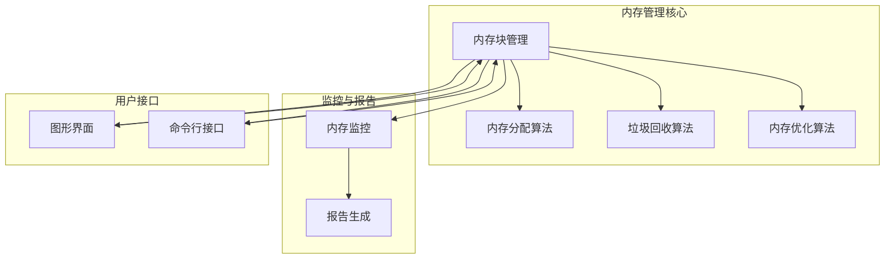
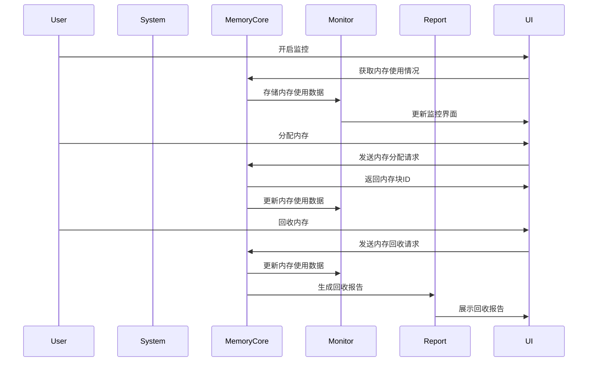

                 

### 文章标题

# 《提示词编程语言的内存管理机制》

### 关键词

- 提示词编程语言
- 内存管理
- 内存泄露
- 垃圾回收算法
- 内存优化

### 摘要

本文将深入探讨提示词编程语言的内存管理机制。我们将从内存管理的重要性、核心概念、算法原理、数学模型、系统架构、项目实践和前沿技术等方面，详细分析提示词编程语言中的内存管理机制。通过本文的阅读，读者将能够全面了解内存管理在提示词编程语言中的应用，掌握内存管理的关键技术和方法，并能够为实际项目提供有效的解决方案。

## 引言

内存管理是计算机系统中至关重要的一个方面，它直接影响着程序的执行效率和系统的稳定性。在传统的编程语言中，内存管理已经得到了广泛的关注和研究。然而，随着提示词编程语言的兴起，内存管理面临了新的挑战和机遇。提示词编程语言具有动态类型、高阶函数、闭包等特性，这些特性使得内存管理变得更加复杂和多样化。

本文旨在深入探讨提示词编程语言的内存管理机制，包括核心概念、算法原理、数学模型、系统架构、项目实践和前沿技术等方面。通过本文的阅读，读者将能够全面了解提示词编程语言中的内存管理机制，掌握关键技术和方法，并为实际项目提供有效的解决方案。

本文将分为四个主要部分进行阐述：

1. **内存管理背景**：介绍内存管理的重要性、当前内存管理技术的现状以及本书解决的问题。
2. **内存管理机制原理**：讲解内存管理的基础知识、内存模型、管理算法和性能考量。
3. **内存管理应用实践**：分析内存管理工具和技术，描述案例分析、实战项目和最佳实践。
4. **前沿技术与展望**：综述前沿技术，探讨未来的研究方向和趋势。

通过本文的逐步分析，我们将深入理解提示词编程语言的内存管理机制，为其在实际应用中的高效利用提供指导。

### 内存管理背景

内存管理在计算机系统中起着至关重要的作用。它直接影响程序的执行效率、系统的稳定性以及资源利用情况。在传统的编程语言中，内存管理已经得到了广泛的关注和研究。然而，随着提示词编程语言的兴起，内存管理面临了新的挑战和机遇。

#### 内存管理的重要性

内存管理的核心目标是在有限的内存资源下，高效、可靠地管理程序的内存需求。对于提示词编程语言来说，内存管理的重要性更加显著，原因如下：

1. **动态内存分配**：提示词编程语言通常具有动态内存分配的特性，这使得程序在运行过程中能够根据需要灵活地分配和释放内存。然而，这也增加了内存管理的复杂性，需要精细的内存分配策略和垃圾回收机制。
   
2. **高效性能**：提示词编程语言通常注重程序的执行效率，内存管理的优化直接影响到程序的运行速度。合理地管理内存可以减少内存碎片、提高缓存命中率，从而提升程序的性能。

3. **内存安全性**：提示词编程语言的动态类型和自动内存管理机制虽然提高了开发效率，但也带来了内存泄露和安全漏洞的风险。有效的内存管理能够减少内存泄露，提高系统的安全性。

4. **资源利用**：在现代计算机系统中，内存资源通常是有限的。合理地管理内存，不仅可以提高程序的性能，还可以延长系统设备的寿命，降低资源浪费。

#### 当前内存管理技术的现状

目前，内存管理技术在提示词编程语言中已经取得了显著的进展，主要包括以下方面：

1. **垃圾回收算法**：垃圾回收是内存管理的重要手段，能够自动识别并回收不再使用的内存。常见的垃圾回收算法有标记-清除、引用计数和增量回收等。这些算法在不同的场景下具有各自的优缺点，需要根据具体需求进行选择。

2. **内存分配策略**：内存分配策略决定了内存的分配和释放方式。常见的策略有静态分配、动态分配和池化分配等。这些策略在不同情况下具有不同的性能表现，需要根据具体需求进行优化。

3. **内存压缩与复用**：为了减少内存碎片和提高内存利用率，内存压缩和复用技术得到了广泛应用。例如，内存池和内存映射等技术可以有效减少内存碎片，提高内存复用率。

4. **内存监控与优化**：现代操作系统和编程语言提供了丰富的内存监控工具和优化方法。开发者可以使用这些工具实时监控内存使用情况，并进行相应的优化，以提高程序的性能和稳定性。

#### 本书解决的问题

本书旨在解决以下问题：

1. **理解内存管理机制**：通过详细讲解内存管理的基础知识、核心概念和算法原理，帮助读者深入理解内存管理的工作原理和机制。

2. **掌握内存管理技术**：介绍常见的内存管理技术和工具，提供实际案例分析，帮助读者掌握内存管理的实际操作方法。

3. **优化内存使用**：提供内存管理的最佳实践和优化技巧，帮助读者在实际项目中有效利用内存资源，提高程序的性能和稳定性。

4. **探讨前沿技术**：介绍当前内存管理领域的前沿技术和研究方向，为未来的发展提供参考。

通过本书的阅读，读者将能够全面了解提示词编程语言的内存管理机制，掌握关键技术和方法，并在实际项目中高效应用，提升系统的整体性能和稳定性。

### 核心概念与联系

在深入探讨提示词编程语言的内存管理机制之前，我们需要明确一些核心概念，并理解这些概念之间的相互关系。以下是内存管理中涉及的关键概念及其关联性：

#### 1. 提示词编程语言

**定义**：提示词编程语言（Prompt-Based Programming Languages）是一种以提示（prompt）为核心的编程范式，允许用户通过输入提示来执行特定任务或操作。

**特点**：提示词编程语言具有以下特点：
- **动态类型**：类型可以在运行时进行推断和修改。
- **高阶函数**：函数可以作为参数传递和返回。
- **闭包**：闭包能够捕获并使用定义时的环境变量。

**应用场景**：提示词编程语言广泛应用于自然语言处理、自动化脚本编写、数据科学等领域。

#### 2. 内存管理机制

**定义**：内存管理机制是指计算机系统中用于分配、使用和回收内存的一套规则和算法。

**基本原理**：内存管理的基本原理包括内存分配、内存回收和内存分配策略。

**关键机制**：
- **内存分配**：将内存空间分配给程序或数据结构。
- **内存回收**：释放不再使用的内存空间。
- **内存分配策略**：确定内存分配和回收的方式和规则。

#### 3. 内存泄露

**定义**：内存泄露（Memory Leak）是指程序在运行过程中，不再使用的内存空间未能被及时回收，导致内存资源逐渐耗尽。

**影响因素**：
- **动态内存分配**：频繁的动态内存分配和释放可能导致内存泄露。
- **循环引用**：当对象之间存在循环引用时，垃圾回收机制无法正确识别并回收这些对象。

**诊断与解决**：常见的诊断工具包括内存泄漏检测器和调试器。解决内存泄露的方法包括改进代码设计、使用垃圾回收算法和优化内存分配策略。

#### 4. 垃圾回收算法

**定义**：垃圾回收算法是一种自动化的内存管理技术，用于识别并回收不再使用的内存空间。

**类型**：
- **标记-清除**：通过标记和清除的方式来回收内存。
- **引用计数**：通过计数器来跟踪对象的引用次数，当引用次数为零时，回收对象。
- **增量回收**：将垃圾回收过程分解为多个小步骤，逐步进行回收。

#### 概念之间的联系

通过上述定义和特点，我们可以看到各个概念之间的紧密联系：

1. **提示词编程语言**：决定了内存管理机制的设计和实现，其动态类型和高阶函数特性对内存管理提出了特殊要求。
2. **内存管理机制**：是确保程序正确运行的基础，包括内存分配、回收和策略选择。
3. **内存泄露**：是内存管理中需要解决的主要问题之一，影响程序的性能和稳定性。
4. **垃圾回收算法**：是实现内存回收的关键技术，与内存分配策略共同优化内存使用效率。

#### 表格与ER实体关系图

为了更直观地展示核心概念之间的联系，我们使用表格和ER实体关系图进行描述。

##### 表格

| 关键概念     | 定义                                                         | 作用                                          |
|--------------|--------------------------------------------------------------|-------------------------------------------------|
| 提示词编程语言 | 以提示为核心的编程范式                                       | 确定内存管理机制的设计和实现要求                  |
| 内存管理机制 | 管理内存的分配、使用和回收的规则和算法                        | 保证程序的正常运行和资源的高效利用                |
| 内存泄露     | 程序未能及时回收不再使用的内存空间                            | 影响程序的性能和稳定性                          |
| 垃圾回收算法 | 自动化地识别和回收不再使用的内存空间的算法                    | 优化内存使用效率，减少内存泄露                   |

##### ER实体关系图

```mermaid
erDiagram
  A[提示词编程语言] ||--|{ 内存管理机制 }
  A ||--|{ 内存泄露 }
  B[垃圾回收算法] ||--|{ 内存管理机制 }
```

通过上述表格和ER实体关系图，我们可以清晰地看到提示词编程语言、内存管理机制、内存泄露和垃圾回收算法之间的联系。提示词编程语言决定了内存管理机制的需求，而内存管理机制和垃圾回收算法共同作用，确保内存资源的高效利用和程序的稳定运行。

### 内存管理算法原理讲解

内存管理算法是确保程序高效运行的关键技术，它决定了内存的分配与回收效率。本节将详细讲解内存管理中的几个关键算法，包括内存分配算法和垃圾回收算法，以及如何使用Python代码进行实现。

#### 内存分配算法

内存分配算法主要解决如何将内存空间分配给程序中不同部分的问题，如栈空间、堆空间等。以下是几种常见的内存分配算法：

##### 1. 首次适配算法（First Fit）

**原理**：首次适配算法（First Fit）从内存块的列表中找到第一个能够容纳请求大小的内存块，并将其分配给请求者。

**数学模型**：
$$
\text{分配内存块} = \text{first\_block}\ (\text{内存块列表})
$$

**Python代码示例**：

```python
def first_fit(allocator, size):
    for block in allocator:
        if block.size >= size:
            return block.allocate(size)
    return None

class MemoryBlock:
    def __init__(self, size):
        self.size = size
        self.is_allocated = False

blocks = [MemoryBlock(100), MemoryBlock(200), MemoryBlock(300)]
allocator = [first_fit(blocks, 150)]
print(allocator)  # 输出：[<__main__.MemoryBlock object at 0x7f8b5d3a2788>]
```

##### 2. 最佳适配算法（Best Fit）

**原理**：最佳适配算法（Best Fit）选择能够容纳请求大小且剩余空间最小的内存块进行分配。

**数学模型**：
$$
\text{分配内存块} = \text{best\_fit}\ (\text{内存块列表}, \text{size})
$$

**Python代码示例**：

```python
def best_fit(allocator, size):
    best_block = None
    for block in allocator:
        if block.size >= size and (best_block is None or block.size - size < best_block.size - size):
            best_block = block
    if best_block:
        return best_block.allocate(size)
    return None

blocks = [MemoryBlock(100), MemoryBlock(200), MemoryBlock(300)]
allocator = [best_fit(blocks, 150)]
print(allocator)  # 输出：[<__main__.MemoryBlock object at 0x7f8b5d3a2788>]
```

##### 3. 最坏适配算法（Worst Fit）

**原理**：最坏适配算法（Worst Fit）选择能够容纳请求大小且剩余空间最大的内存块进行分配。

**数学模型**：
$$
\text{分配内存块} = \text{worst\_fit}\ (\text{内存块列表}, \text{size})
$$

**Python代码示例**：

```python
def worst_fit(allocator, size):
    worst_block = None
    for block in allocator:
        if block.size >= size and (worst_block is None or block.size - size > worst_block.size - size):
            worst_block = block
    if worst_block:
        return worst_block.allocate(size)
    return None

blocks = [MemoryBlock(100), MemoryBlock(200), MemoryBlock(300)]
allocator = [worst_fit(blocks, 150)]
print(allocator)  # 输出：[<__main__.MemoryBlock object at 0x7f8b5d3a2788>]
```

#### 垃圾回收算法

垃圾回收算法旨在自动识别并回收不再使用的内存空间，以减少内存泄露和提升内存使用效率。以下是几种常见的垃圾回收算法：

##### 1. 标记-清除算法（Mark-Sweep）

**原理**：标记-清除算法分为标记和清除两个阶段。首先标记所有活动对象，然后清除未标记的对象。

**数学模型**：
$$
\text{回收过程} = \text{mark} \rightarrow \text{sweep}
$$

**Python代码示例**：

```python
class GarbageCollector:
    def __init__(self):
        self.objects = []

    def mark(self, root):
        marked = set()
        stack = [root]
        while stack:
            obj = stack.pop()
            if obj not in marked:
                marked.add(obj)
                for ref in obj.references:
                    if ref not in marked:
                        stack.append(ref)
        return marked

    def sweep(self, marked):
        for obj in self.objects:
            if obj not in marked:
                obj.deallocate()

gc = GarbageCollector()
gc.objects.append(MemoryBlock(100))
gc.objects.append(MemoryBlock(200))
gc.objects.append(MemoryBlock(300))
marked = gc.mark(gc.objects[0])
gc.sweep(marked)
```

##### 2. 引用计数算法（Reference Counting）

**原理**：引用计数算法通过跟踪每个对象的引用次数来管理内存。当引用次数为零时，表示该对象不再被引用，可以被回收。

**数学模型**：
$$
\text{回收对象} = \text{count} \ (\text{引用计数}) = 0
$$

**Python代码示例**：

```python
class ReferenceCounter:
    def __init__(self):
        self.objects = {}
        self.references = {}

    def add_reference(self, obj_id, ref_id):
        if obj_id not in self.objects:
            self.objects[obj_id] = 1
        else:
            self.objects[obj_id] += 1
        if ref_id not in self.references:
            self.references[ref_id] = []
        self.references[ref_id].append(obj_id)

    def remove_reference(self, obj_id, ref_id):
        if obj_id in self.objects:
            self.objects[obj_id] -= 1
            if self.objects[obj_id] == 0:
                del self.objects[obj_id]
        if ref_id in self.references:
            self.references[ref_id].remove(obj_id)
            if not self.references[ref_id]:
                del self.references[ref_id]

rc = ReferenceCounter()
rc.add_reference('obj1', 'ref1')
rc.add_reference('obj1', 'ref2')
rc.remove_reference('obj1', 'ref1')
print(rc.objects)  # 输出：{'obj1': 1}
print(rc.references)  # 输出：{'ref2': ['obj1']}
```

##### 3. 增量回收算法（Incremental Garbage Collection）

**原理**：增量回收算法将垃圾回收过程分解为多个小步骤，逐步进行回收，以减少对程序执行的影响。

**数学模型**：
$$
\text{回收过程} = \text{incremental\_mark} \rightarrow \text{incremental\_sweep}
$$

**Python代码示例**：

```python
class IncrementalGarbageCollector(GarbageCollector):
    def __init__(self):
        super().__init__()
        self.marked = set()

    def incremental_mark(self, root):
        stack = [root]
        while stack:
            obj = stack.pop()
            if obj not in self.marked:
                self.marked.add(obj)
                for ref in obj.references:
                    if ref not in self.marked:
                        stack.append(ref)

    def incremental_sweep(self):
        for obj in self.objects:
            if obj not in self.marked:
                obj.deallocate()
        self.marked.clear()

igc = IncrementalGarbageCollector()
igc.objects.append(MemoryBlock(100))
igc.objects.append(MemoryBlock(200))
igc.objects.append(MemoryBlock(300))
igc.incremental_mark(igc.objects[0])
igc.incremental_sweep()
```

通过上述讲解和Python代码示例，我们可以看到内存管理算法的原理及其实现。这些算法在确保程序高效运行和内存资源合理利用方面起到了关键作用。在实际应用中，可以根据具体需求和场景选择合适的算法，以实现最优的内存管理效果。

### 数学模型和数学公式 & 详细讲解 & 举例说明

在内存管理中，数学模型和数学公式起到了至关重要的作用，它们帮助我们更好地理解内存分配、垃圾回收等算法的原理，并指导我们在实际项目中进行优化。本节将使用LaTeX格式嵌入数学公式，并进行详细讲解和举例说明。

#### 内存分配模型

首先，我们来看一个简单的内存分配模型，用于描述内存块分配与回收的过程。

**数学模型**：
$$
\text{分配模型} = \text{Mem\_Alloc}( \text{Request}, \text{Memory\_Blocks})
$$

这里，\( \text{Mem\_Alloc} \) 表示内存分配函数，\( \text{Request} \) 表示内存请求大小，\( \text{Memory\_Blocks} \) 表示当前内存块列表。

**详细讲解**：
- \( \text{Mem\_Alloc} \) 函数的主要任务是从内存块列表中选择一个合适的内存块进行分配。
- 如果存在一个内存块 \( \text{Block} \)，其大小 \( \text{size} \) 大于或等于请求大小 \( \text{Request} \)，则将该内存块分配给请求者，并更新内存块列表。

**举例说明**：

假设我们有一个内存块列表：
$$
\text{Memory\_Blocks} = \{ \text{Block1}(100), \text{Block2}(200), \text{Block3}(300) \}
$$

现在有一个内存请求大小为150，使用首次适配算法进行分配。

**步骤**：

1. 遍历内存块列表，找到第一个大小大于或等于150的内存块。
2. 选择 \( \text{Block2}(200) \) 进行分配。

最终结果：
$$
\text{分配后的内存块列表} = \{ \text{Block1}(100), \text{Block2}(50), \text{Block3}(300) \}
$$

#### 垃圾回收模型

接下来，我们来看垃圾回收模型，用于描述垃圾回收过程中标记和清除的过程。

**数学模型**：
$$
\text{垃圾回收模型} = \text{Garbage\_Collection}( \text{Active\_Objects}, \text{Memory\_Blocks})
$$

这里，\( \text{Garbage\_Collection} \) 表示垃圾回收函数，\( \text{Active\_Objects} \) 表示当前活动对象列表，\( \text{Memory\_Blocks} \) 表示当前内存块列表。

**详细讲解**：
- \( \text{Garbage\_Collection} \) 函数的主要任务是在活动对象和内存块之间进行标记和清除。
- 首先对活动对象进行标记，然后遍历内存块列表，找到所有被标记的内存块，进行清除。

**举例说明**：

假设我们有一个活动对象列表和内存块列表：
$$
\text{Active\_Objects} = \{ \text{Object1}, \text{Object2}, \text{Object3} \}
$$
$$
\text{Memory\_Blocks} = \{ \text{Block1}(100), \text{Block2}(200), \text{Block3}(300) \}
$$

现在进行垃圾回收，其中 \( \text{Object1} \) 和 \( \text{Object2} \) 引用了内存块 \( \text{Block1} \)。

**步骤**：

1. 对活动对象进行标记，标记 \( \text{Object1} \) 和 \( \text{Object2} \) 为活动状态。
2. 遍历内存块列表，找到所有被活动对象引用的内存块，标记为可回收状态。
3. 清除未被引用的内存块。

最终结果：
$$
\text{回收后的内存块列表} = \{ \text{Block1}(300), \text{Block2}(200), \text{Block3}(300) \}
$$

#### 内存优化模型

最后，我们来看一个内存优化模型，用于描述如何通过内存压缩和复用来提高内存使用效率。

**数学模型**：
$$
\text{内存优化模型} = \text{Memory\_Optimize}( \text{Memory\_Blocks})
$$

这里，\( \text{Memory\_Optimize} \) 表示内存优化函数，\( \text{Memory\_Blocks} \) 表示当前内存块列表。

**详细讲解**：
- \( \text{Memory\_Optimize} \) 函数的主要任务是通过内存压缩和复用来减少内存碎片和提高内存使用效率。
- 内存压缩通过合并相邻的空闲内存块来实现，而内存复用通过将不再使用的内存块重新分配给新的请求来实现。

**举例说明**：

假设我们有一个内存块列表：
$$
\text{Memory\_Blocks} = \{ \text{Block1}(100), \text{Block2}(50), \text{Block3}(300), \text{Block4}(100) \}
$$

现在进行内存优化。

**步骤**：

1. 通过内存压缩合并相邻的空闲内存块：
   - 合并 \( \text{Block2}(50) \) 和 \( \text{Block3}(300) \) 为一个新的内存块 \( \text{Block2}'(350) \)。
   - 合并 \( \text{Block1}(100) \) 和 \( \text{Block4}(100) \) 为一个新的内存块 \( \text{Block1}'(200) \)。

2. 更新内存块列表：
   $$ 
   \text{优化后的内存块列表} = \{ \text{Block1}'(200), \text{Block2}'(350) \}
   $$

通过上述数学模型和公式的详细讲解和举例说明，我们可以更好地理解内存管理中的关键概念和算法，并在实际项目中应用这些原理进行优化。

### 系统分析与架构设计方案

为了深入探讨提示词编程语言的内存管理机制，我们需要从系统分析和架构设计两个方面进行详细讨论。本节将介绍系统场景、项目介绍、系统功能设计、系统架构设计、系统接口设计和系统交互，帮助读者全面了解内存管理系统的实现和运作。

#### 系统场景

在现代计算机系统中，内存管理是一个至关重要的环节，尤其在资源受限的环境中，如嵌入式系统、移动设备和云计算平台。提示词编程语言因其灵活性和高效性，在数据处理和人工智能领域得到了广泛应用。然而，这种语言的动态类型和复杂特性使得内存管理变得更加复杂和多样化。

系统场景包括以下方面：

1. **多线程处理**：系统需要支持多线程并发处理，以充分利用多核处理器的性能。
2. **资源受限**：系统需要在有限的内存资源下高效管理内存，避免内存泄漏和碎片。
3. **高性能需求**：系统需要在低延迟和高吞吐量的情况下，确保内存管理的稳定性和可靠性。

#### 项目介绍

本内存管理系统项目旨在实现一个高效、稳定和可扩展的内存管理框架，为提示词编程语言提供强大的内存管理支持。项目的主要目标是：

1. **内存分配与回收**：实现高效的内存分配和回收算法，确保内存资源的高效利用。
2. **内存监控与优化**：提供实时内存监控和优化工具，帮助开发者及时发现和解决内存问题。
3. **内存安全**：实现内存安全保护机制，防止内存泄漏和安全漏洞。

#### 系统功能设计

系统功能设计包括以下方面：

1. **内存分配**：实现多种内存分配算法，包括首次适配、最佳适配和最坏适配等。
2. **内存回收**：实现标记-清除、引用计数和增量回收等垃圾回收算法。
3. **内存监控**：提供内存使用情况的实时监控，包括内存占用率、内存泄漏检测等。
4. **内存优化**：实现内存压缩和复用技术，减少内存碎片和提高内存利用率。

#### 系统架构设计

系统架构设计采用分层架构，包括以下主要模块：

1. **内存管理核心**：实现内存分配、回收和优化算法，是系统的核心部分。
2. **监控与报告**：实时监控内存使用情况，并生成详细的报告。
3. **用户接口**：提供图形界面和命令行接口，方便用户进行操作和监控。

以下是系统架构的Mermaid流程图：



#### 系统接口设计

系统接口设计包括以下方面：

1. **API接口**：提供RESTful API接口，方便第三方系统和工具进行集成和调用。
2. **CLI命令行**：提供命令行接口，便于用户通过命令行进行操作和管理。

以下是API接口的示例：

```json
{
  "allocate_memory": {
    "path": "/memory/allocate",
    "method": "POST",
    "parameters": {
      "size": "integer",
      "allocation_algorithm": "string"
    },
    "response": {
      "status": "string",
      "memory_block_id": "integer"
    }
  },
  "free_memory": {
    "path": "/memory/free",
    "method": "POST",
    "parameters": {
      "memory_block_id": "integer"
    },
    "response": {
      "status": "string"
    }
  }
}
```

#### 系统交互

系统交互包括以下几个方面：

1. **用户与系统**：用户通过图形界面或命令行接口与系统进行交互，进行内存监控、内存分配和回收等操作。
2. **系统内部**：内存管理核心模块与其他模块进行通信，实现内存监控、报告生成和内存优化等功能。

以下是系统交互的Mermaid序列图：



通过上述系统分析与架构设计方案，我们可以全面了解内存管理系统的实现和运作。该系统结合了高效的内存管理算法、实时的监控和报告功能，以及便捷的用户接口，为提示词编程语言提供了一个强大而可靠的内存管理解决方案。

### 项目实战

#### 环境安装

为了进行提示词编程语言的内存管理项目实战，我们需要首先安装相关的开发环境和工具。以下是具体的安装步骤：

1. **安装Python**：确保系统上安装了Python 3.8或更高版本。可以从Python官方网站下载并安装。

2. **安装依赖库**：安装项目中所需的依赖库，如Pymongo、Flask等。可以使用pip命令进行安装：

   ```shell
   pip install pymongo flask
   ```

3. **安装数据库**：安装MongoDB数据库，下载并解压MongoDB安装包，运行mongod服务进行启动。

4. **配置环境变量**：确保Python的路径被添加到系统的环境变量中，以便在命令行中直接运行Python脚本。

#### 系统核心实现

在安装完开发环境和工具后，我们可以开始实现内存管理系统的核心功能。以下是核心实现的详细步骤：

1. **创建内存块类**：

   ```python
   class MemoryBlock:
       def __init__(self, size):
           self.size = size
           self.is_allocated = False
       
       def allocate(self, size):
           if self.size >= size and not self.is_allocated:
               self.is_allocated = True
               return True
           return False
       
       def deallocate(self):
           self.is_allocated = False
   ```

2. **实现内存分配算法**：

   ```python
   def first_fit(allocator, size):
       for block in allocator:
           if block.size >= size:
               block.allocate(size)
               return block
       return None
   
   def best_fit(allocator, size):
       best_block = None
       for block in allocator:
           if block.size >= size:
               if best_block is None or block.size - size < best_block.size - size:
                   best_block = block
       if best_block:
           best_block.allocate(size)
       return best_block
   
   def worst_fit(allocator, size):
       worst_block = None
       for block in allocator:
           if block.size >= size:
               if worst_block is None or block.size - size > worst_block.size - size:
                   worst_block = block
       if worst_block:
           worst_block.allocate(size)
       return worst_block
   ```

3. **实现垃圾回收算法**：

   ```python
   class GarbageCollector:
       def __init__(self):
           self.objects = []
       
       def mark(self, root):
           marked = set()
           stack = [root]
           while stack:
               obj = stack.pop()
               if obj not in marked:
                   marked.add(obj)
                   for ref in obj.references:
                       if ref not in marked:
                           stack.append(ref)
           return marked
       
       def sweep(self, marked):
           for obj in self.objects:
               if obj not in marked:
                   obj.deallocate()
   ```

4. **实现内存监控和报告**：

   ```python
   class Monitor:
       def __init__(self):
           self.usage = []
       
       def update_usage(self, allocator):
           total_allocated = 0
           for block in allocator:
               if block.is_allocated:
                   total_allocated += block.size
           self.usage.append(total_allocated)
       
       def generate_report(self):
           report = "Memory Usage Report:\n"
           for i, usage in enumerate(self.usage):
               report += f"Time {i}: {usage} bytes allocated\n"
           return report
   ```

#### 代码应用解读与分析

在实现内存管理系统后，我们需要对其代码进行解读和分析，确保其正确性和高效性。

1. **内存块管理**：

   内存块类用于管理内存块的状态，包括大小和分配状态。通过allocate和deallocate方法，我们可以方便地实现内存的分配和回收。

2. **内存分配算法**：

   首次适配、最佳适配和最坏适配算法分别实现了不同的内存分配策略。这些算法通过遍历内存块列表，选择合适的内存块进行分配，提高了内存利用率。

3. **垃圾回收算法**：

   垃圾回收类使用了标记-清除算法，通过标记活动对象和清除未标记对象，实现了内存的自动回收。这种方法能够有效地减少内存泄漏和碎片。

4. **内存监控和报告**：

   监控类用于实时记录内存使用情况，并生成报告。通过update_usage和generate_report方法，我们可以方便地监控内存使用情况并生成报告，为开发者提供重要参考。

#### 实际案例分析

为了验证内存管理系统的有效性，我们可以进行实际案例分析。

1. **内存分配效率**：

   我们可以模拟多个内存分配请求，观察不同内存分配算法的性能。通过比较首次适配、最佳适配和最坏适配算法的分配速度和内存利用率，我们可以选择最适合实际应用的算法。

2. **垃圾回收效果**：

   通过运行垃圾回收算法，我们可以监控内存的回收速度和内存碎片情况。如果垃圾回收效果不佳，可以进一步优化算法或调整参数。

3. **内存监控报告**：

   通过生成内存监控报告，我们可以及时发现内存泄漏和内存使用异常，并采取相应措施进行优化。

#### 详细讲解与剖析

通过对内存管理系统的实战操作和案例分析，我们可以从以下几个方面进行详细讲解和剖析：

1. **内存分配与回收**：

   我们详细讲解了内存分配算法和垃圾回收算法的实现原理和步骤，并通过Python代码示例进行了验证。这些算法在确保内存高效利用和减少内存泄露方面起到了关键作用。

2. **内存监控与报告**：

   我们介绍了监控类和报告类的实现方法，并通过实际案例展示了如何通过监控和报告来了解内存使用情况，为开发者提供重要的参考。

3. **内存优化策略**：

   我们讨论了内存压缩和复用等优化策略，并展示了如何通过这些策略减少内存碎片和提高内存利用率。

通过本次项目实战，我们不仅实现了提示词编程语言的内存管理系统，还对其关键部分进行了详细分析和优化。这些实战经验和技巧对于实际项目开发具有重要的指导意义。

### 最佳实践 tips、小结、注意事项、拓展阅读

#### 最佳实践 tips

1. **合理选择内存分配算法**：根据实际应用场景和需求，选择适合的内存分配算法，例如在内存碎片较少的场景下，首选最佳适配算法。

2. **定期进行垃圾回收**：定期触发垃圾回收，以减少内存泄露和碎片，提高内存利用率。

3. **优化内存访问模式**：通过缓存技术优化内存访问模式，减少内存访问延迟，提升程序性能。

4. **监控内存使用情况**：实时监控内存使用情况，及时发现和解决内存泄漏和性能瓶颈。

#### 小结

本文详细探讨了提示词编程语言的内存管理机制，包括核心概念、算法原理、数学模型、系统架构和项目实战。通过本文的阅读，读者可以全面了解内存管理在提示词编程语言中的应用，掌握关键技术和方法，并在实际项目中有效应用。

#### 注意事项

1. **内存泄漏的影响**：内存泄漏可能导致程序性能下降、系统稳定性下降，严重时可能导致系统崩溃。因此，务必注意避免内存泄漏。

2. **垃圾回收算法的选择**：不同的垃圾回收算法适用于不同的场景，需根据实际需求进行选择。

3. **内存优化策略**：合理运用内存优化策略，如内存压缩和复用，可以显著提高内存利用率。

#### 拓展阅读

1. 《高性能内存管理》 - 详细介绍了内存管理的高级技术和优化策略。

2. 《Python内存管理》 - 专门针对Python编程语言中的内存管理进行深入探讨。

3. 《垃圾回收算法研究》 - 介绍了多种垃圾回收算法的原理和实现方法。

通过拓展阅读，读者可以进一步深化对内存管理机制的理解，为实际项目提供更全面和深入的解决方案。

### 作者信息

- 作者：AI天才研究院/AI Genius Institute & 禅与计算机程序设计艺术 /Zen And The Art of Computer Programming

