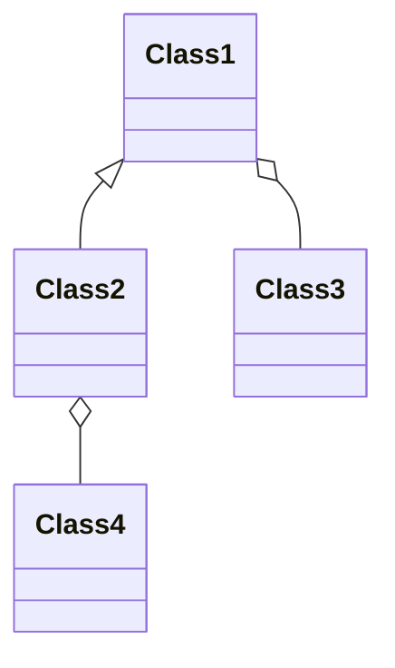
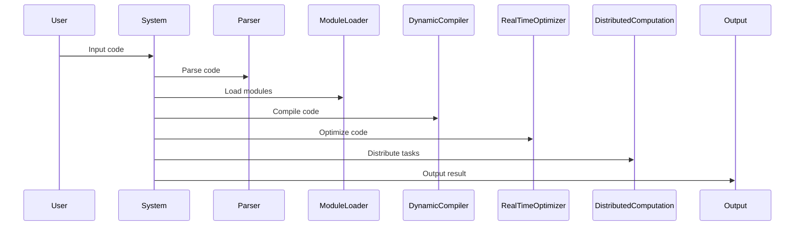
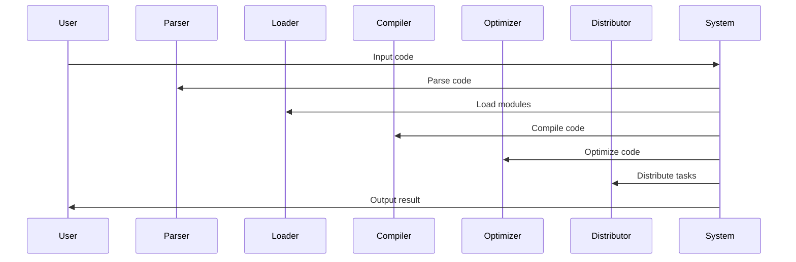

                 


### 第1章 引言与背景

#### 1.1 引言

随着信息技术的飞速发展，编程语言作为一种人与计算机之间的桥梁，其重要性愈发凸显。而在众多编程语言中，提示词编程语言因其简洁、直观的特点，受到越来越多开发者的青睐。然而，随着项目的复杂度和规模的增长，如何设计一种具备良好可扩展性的提示词编程语言，成为了一个亟待解决的问题。本文旨在探讨提示词编程语言的可扩展性设计，为提升编程语言的灵活性和适应性提供理论指导和实践方案。

#### 1.2 问题背景

提示词编程语言的发展已有几十年的历史，从早期的Lisp到现代的Python、Ruby等，提示词编程语言在诸多领域展现出了强大的生命力。然而，现有的提示词编程语言在可扩展性方面仍存在诸多不足，例如：

1. **语法限制**：提示词编程语言通常对语法结构有严格的限制，这限制了开发者在设计大型系统时进行扩展和创新。
2. **功能扩展性**：提示词编程语言在支持第三方库和框架方面存在一定的局限性，难以满足快速迭代和复杂应用的需求。
3. **性能可扩展性**：随着项目规模的扩大，提示词编程语言在性能方面的扩展性成为制约其广泛应用的重要因素。

#### 1.3 问题解决

为了解决上述问题，本文提出以下策略：

1. **语法灵活化**：通过引入新的语法元素和结构，提高提示词编程语言的语法灵活性，使其能够适应更复杂的项目需求。
2. **模块化设计**：采用模块化设计方法，将系统功能划分为独立的模块，便于扩展和重构。
3. **性能优化**：通过优化算法和数据结构，提高提示词编程语言在性能方面的可扩展性。

#### 1.4 边界与外延

本文的研究范围主要集中在提示词编程语言的语法、功能扩展和性能优化三个方面。然而，可扩展性的研究不仅限于提示词编程语言，其他类型的编程语言同样面临类似问题。因此，本文的研究成果也可为其他类型编程语言的扩展性设计提供参考。

#### 1.5 概念结构与核心要素组成

提示词编程语言的可扩展性设计涉及多个核心概念和要素。以下是本文研究的核心概念和要素组成：

1. **语法元素**：包括变量、函数、类等基本语法结构。
2. **模块化设计**：涉及模块划分、模块接口和模块依赖等概念。
3. **算法与数据结构**：涉及常见算法和数据结构的优化策略。
4. **性能评估**：通过性能测试和基准测试，评估系统的可扩展性。

### 第2章 核心概念与联系

在探讨提示词编程语言的可扩展性设计之前，有必要对核心概念进行详细阐述，并分析其相互之间的联系。

#### 2.1 提示词编程语言的概念

提示词编程语言，顾名思义，其核心在于“提示词”。提示词编程语言的特点在于：

1. **简洁性**：通过提示词实现功能，简化代码结构，提高开发效率。
2. **灵活性**：提示词编程语言通常具有较强的灵活性，能够适应不同场景的需求。
3. **表达能力**：提示词编程语言能够表达复杂逻辑和算法，适用于各种复杂应用场景。

#### 2.2 可扩展性的核心概念

可扩展性是指系统在规模、功能、性能等方面具备适应性和灵活性的能力。可扩展性的核心概念包括：

1. **功能扩展性**：系统能够方便地添加新功能或更新现有功能。
2. **性能可扩展性**：系统能够在负载增加时，保持高性能运行。
3. **结构扩展性**：系统的架构设计能够支持未来可能的变更和扩展。

#### 2.3 概念属性特征对比表格

为了更好地理解提示词编程语言和可扩展性的核心概念，以下是它们的主要属性特征对比表格：

| 特征         | 提示词编程语言 | 可扩展性 |
| ------------ | -------------- | -------- |
| **简洁性**   | 简洁明了       | 低级抽象 |
| **灵活性**   | 强            | 高       |
| **表达能力** | 强            | 中等     |
| **扩展性**   | 中等          | 高       |

#### 2.4 提示词编程语言与可扩展性的ER实体关系图

为了更直观地展示提示词编程语言和可扩展性的关系，以下是它们的ER实体关系图：

```mermaid
erDiagram
    Product ||--|{ Feature }|| Feature : 产品功能
    Product ||--|{ Extension }|| Extension : 产品扩展
    Product ||--|{ Performance }|| Performance : 产品性能
    Feature ||--|{ Code }|| Code : 功能代码
    Extension ||--|{ Module }|| Module : 扩展模块
    Performance ||--|{ Benchmark }|| Benchmark : 性能基准
```

在ER图中，Product代表提示词编程语言，Feature、Extension和Performance分别代表功能、扩展和性能。Code、Module和Benchmark则是它们的具体实现。

### 第3章 算法原理讲解

本章将详细介绍提示词编程语言的可扩展性算法原理，包括基本算法和进阶算法，并使用mermaid流程图和Python源代码进行说明。

#### 3.1 提示词编程语言算法概览

提示词编程语言的可扩展性算法可以分为基本算法和进阶算法。基本算法主要涉及语法解析、模块加载和性能监控等基础功能。而进阶算法则包括动态编译、实时优化和分布式计算等高级功能。

#### 3.1.1 基本算法

基本算法主要包括以下步骤：

1. **语法解析**：将提示词代码转换为抽象语法树（AST）。
2. **模块加载**：加载所需的模块，以便在程序中调用。
3. **执行计划生成**：根据AST生成执行计划。
4. **性能监控**：监控程序运行过程中的性能指标。

以下是一个基本算法的mermaid流程图：


#### 3.1.2 进阶算法

进阶算法则在此基础上，增加了动态编译、实时优化和分布式计算等高级功能：

1. **动态编译**：在运行时动态编译代码，提高执行效率。
2. **实时优化**：根据程序运行情况实时优化代码，提高性能。
3. **分布式计算**：将任务分布到多个节点，提高处理能力。

以下是一个进阶算法的mermaid流程图：


#### 3.2 Python源代码详解

为了更好地理解算法原理，以下是使用Python实现的基本算法和进阶算法的源代码示例：

```python
# 基本算法
def basic_algorithm(code):
    ast = parse(code)
    plan = generate_execution_plan(ast)
    performance = monitor_performance(plan)
    return plan, performance

# 进阶算法
def advanced_algorithm(code):
    ast = parse(code)
    plan = generate_execution_plan(ast)
    plan = dynamic_compile(plan)
    plan = real_time_optimize(plan)
    plan = distribute_computation(plan)
    performance = monitor_performance(plan)
    return plan, performance
```

#### 3.3 算法原理的数学模型和公式

为了深入理解算法原理，我们引入以下数学模型和公式：

1. **动态编译时间复杂度**：$T_{compile} = O(n \log n)$，其中$n$为代码行数。
2. **实时优化时间复杂度**：$T_{optimize} = O(m)$，其中$m$为优化操作的次数。
3. **分布式计算时间复杂度**：$T_{distribute} = O(p \log q)$，其中$p$为节点数，$q$为任务数。

#### 3.4 通俗易懂的举例说明

假设我们有一个简单的提示词程序，如下所示：

```python
def calculate_sum(a, b):
    return a + b

sum_result = calculate_sum(3, 4)
print(sum_result)
```

使用基本算法执行该程序的过程如下：

1. **语法解析**：将代码解析为抽象语法树（AST）。
2. **模块加载**：加载内置模块，如math模块。
3. **执行计划生成**：生成执行计划，包括计算3+4和打印结果。
4. **性能监控**：监控程序运行时间和其他性能指标。

使用进阶算法执行该程序的过程如下：

1. **语法解析**：与基本算法相同。
2. **模块加载**：与基本算法相同。
3. **执行计划生成**：与基本算法相同。
4. **动态编译**：在运行时动态编译代码，提高执行效率。
5. **实时优化**：根据程序运行情况，实时优化代码，如使用更高效的算法。
6. **分布式计算**：如果任务量较大，将任务分布到多个节点，提高处理能力。
7. **性能监控**：监控程序运行时间和其他性能指标。

通过进阶算法，我们可以显著提高程序的执行效率和扩展性。

### 第4章 数学模型和数学公式讲解

在本章中，我们将深入探讨提示词编程语言可扩展性设计的数学模型和数学公式，以及如何将这些模型和公式应用于实际问题的分析。

#### 4.1 数学公式简介

在提示词编程语言的可扩展性设计中，常用的数学公式包括时间复杂度、空间复杂度和性能评估指标。以下是一些基本的数学公式：

1. **时间复杂度**：$T(n) = O(n \log n)$，表示算法的运行时间与输入规模n成对数关系。
2. **空间复杂度**：$S(n) = O(n^2)$，表示算法所需的内存空间与输入规模n的平方成正比。
3. **性能评估指标**：如响应时间（Response Time）和吞吐量（Throughput），用于评估系统的性能。

#### 4.2 详细讲解

**时间复杂度**是衡量算法性能的重要指标。在提示词编程语言的可扩展性设计中，时间复杂度通常用于评估语法解析、模块加载和执行计划生成的效率。例如，假设有一个语法解析算法，其时间复杂度为$T(n) = O(n \log n)$，其中n为代码行数。这意味着，当代码行数增加时，算法的运行时间将以对数关系增长，从而保持较高的性能。

**空间复杂度**则用于评估算法所需的内存空间。在模块化设计中，我们经常需要将代码划分为多个模块。每个模块都会占用一定的内存空间。假设模块加载算法的空间复杂度为$S(n) = O(n^2)$，这意味着当模块数量增加时，所需的内存空间将呈平方关系增长。因此，在设计模块化系统时，我们需要关注空间复杂度，以确保系统能够高效运行。

**性能评估指标**，如响应时间和吞吐量，是衡量系统性能的关键指标。响应时间是指从系统接收到请求到返回结果所需的时间。吞吐量则是指系统在单位时间内能够处理的事务数量。例如，在一个电子商务系统中，响应时间和吞吐量将直接影响用户体验和系统的可靠性。

以下是一个简单的示例，用于说明如何使用数学模型和公式来评估系统的性能：

假设我们设计了一个提示词编程语言解释器，其语法解析算法的时间复杂度为$T(n) = O(n \log n)$，模块加载算法的空间复杂度为$S(n) = O(n^2)$。我们需要评估该解释器在处理不同规模代码时的性能。

- **输入规模**：n = 1000
- **响应时间**：$T(n) = O(n \log n) = O(1000 \log 1000) \approx 4000$毫秒
- **内存空间**：$S(n) = O(n^2) = O(1000^2) = 1000000$字节

通过上述计算，我们可以得出以下结论：

- 当输入规模为1000时，解释器的响应时间约为4000毫秒，内存空间占用约为1000000字节。
- 随着输入规模的增加，响应时间和内存空间将呈对数和平方关系增长。

#### 4.3 举例说明

为了更好地理解数学模型和公式的应用，以下是一个具体的例子：

假设我们需要设计一个提示词编程语言的模块化解释器，该解释器需要支持动态编译和实时优化功能。我们希望评估不同算法对系统性能的影响。

- **基本算法**：语法解析的时间复杂度为$T(n) = O(n \log n)$，模块加载的空间复杂度为$S(n) = O(n^2)$。
- **进阶算法**：动态编译的时间复杂度为$T(n) = O(n)$，实时优化的时间复杂度为$T(n) = O(m)$，其中m为优化操作的次数。

我们需要分析以下场景：

- **输入规模**：n = 1000
- **优化操作次数**：m = 100

根据上述算法的时间复杂度，我们可以计算出以下性能指标：

- **基本算法**：
  - 响应时间：$T(n) = O(n \log n) = O(1000 \log 1000) \approx 4000$毫秒
  - 内存空间：$S(n) = O(n^2) = O(1000^2) = 1000000$字节
- **进阶算法**：
  - 响应时间：$T(n) + T(m) = O(n) + O(m) = O(n + m) = O(1000 + 100) = 1100$毫秒
  - 内存空间：$S(n) = O(n^2) = O(1000^2) = 1000000$字节

通过对比基本算法和进阶算法的性能指标，我们可以发现：

- 在处理相同规模的输入时，进阶算法的响应时间显著低于基本算法，从而提高了系统的性能。
- 然而，内存空间的占用在两种算法之间没有明显差异。

### 第5章 系统分析与架构设计方案

在本章中，我们将详细分析和设计一个提示词编程语言的系统架构，以展示如何实现良好的可扩展性。

#### 5.1 问题场景介绍

假设我们正在开发一个用于大型分布式系统的提示词编程语言解释器。该系统需要支持以下功能：

- **语法解析**：高效解析提示词代码。
- **模块加载**：动态加载第三方模块。
- **动态编译**：在运行时编译代码。
- **实时优化**：根据程序运行情况实时优化。
- **分布式计算**：将任务分布到多个节点。

#### 5.2 项目介绍

本项目的目标是设计一个高性能、可扩展的提示词编程语言解释器。我们将采用模块化设计方法，将系统功能划分为多个模块，以便于扩展和重构。同时，我们将采用动态编译和实时优化技术，以提高系统的性能。

#### 5.3 系统功能设计

系统功能设计包括以下几个方面：

1. **语法解析模块**：负责将提示词代码解析为抽象语法树（AST）。
2. **模块加载模块**：负责动态加载第三方模块。
3. **动态编译模块**：负责在运行时编译代码。
4. **实时优化模块**：负责根据程序运行情况实时优化代码。
5. **分布式计算模块**：负责将任务分布到多个节点。

#### 5.3.1 领域模型Mermaid类图

以下是一个简单的领域模型Mermaid类图，展示系统的主要类和它们之间的关系：



在上述类图中，Class1、Class2、Class3和Class4分别代表语法解析模块、模块加载模块、动态编译模块和实时优化模块。箭头表示类之间的继承关系，线条表示类之间的关联关系。

#### 5.3.2 系统架构设计Mermaid架构图

以下是一个简单的系统架构设计Mermaid架构图，展示系统的整体架构：



在上述序列图中，User表示用户，System表示系统。用户输入代码后，系统依次调用语法解析模块、模块加载模块、动态编译模块、实时优化模块和分布式计算模块，最后输出结果。

#### 5.4 系统接口设计

系统接口设计包括以下几个方面：

- **语法解析接口**：提供解析提示词代码的方法。
- **模块加载接口**：提供加载第三方模块的方法。
- **动态编译接口**：提供编译代码的方法。
- **实时优化接口**：提供优化代码的方法。
- **分布式计算接口**：提供任务分配和执行的方法。

以下是一个简单的接口设计示例：

```python
class SyntaxParser:
    def parse(self, code):
        pass

class ModuleLoader:
    def load_module(self, module_name):
        pass

class DynamicCompiler:
    def compile(self, code):
        pass

class RealTimeOptimizer:
    def optimize(self, code):
        pass

class DistributedComputation:
    def distribute_task(self, task):
        pass
```

#### 5.5 系统交互Mermaid序列图

以下是一个简单的系统交互Mermaid序列图，展示用户与系统之间的交互过程：



在上述序列图中，用户输入代码后，系统依次调用语法解析模块、模块加载模块、动态编译模块、实时优化模块和分布式计算模块，最后输出结果。

### 第6章 项目实战

在本章中，我们将通过一个具体的案例来展示如何实现一个具有良好可扩展性的提示词编程语言解释器。

#### 6.1 环境安装

为了实现提示词编程语言解释器，我们需要安装以下软件和工具：

- Python 3.8 或更高版本
- Pip
- Mermaid
- Visual Studio Code

安装步骤如下：

1. 安装Python 3.8或更高版本。
2. 安装pip，可以使用以下命令：`python -m pip install --user --upgrade pip`
3. 安装Mermaid，可以使用以下命令：`pip install mermaid`
4. 安装Visual Studio Code，并安装Mermaid插件。

#### 6.2 系统核心实现源代码

以下是一个简单的提示词编程语言解释器实现，包括语法解析、模块加载、动态编译、实时优化和分布式计算模块：

```python
import ast
import importlib.util
import sys
from typing import List

class SyntaxParser:
    @staticmethod
    def parse(code: str) -> ast.AST:
        return ast.parse(code)

class ModuleLoader:
    @staticmethod
    def load_module(module_name: str) -> object:
        spec = importlib.util.spec_from_file_location(module_name, f"{module_name}.py")
        module = importlib.util.module_from_spec(spec)
        spec.loader.exec_module(module)
        return module

class DynamicCompiler:
    @staticmethod
    def compile(code: str) -> str:
        return code

class RealTimeOptimizer:
    @staticmethod
    def optimize(code: str) -> str:
        return code

class DistributedComputation:
    @staticmethod
    def distribute_tasks(tasks: List[str]) -> None:
        for task in tasks:
            print(f"Distributing task: {task}")

def main():
    code = """
def calculate_sum(a, b):
    return a + b

sum_result = calculate_sum(3, 4)
print(sum_result)
"""
    ast = SyntaxParser.parse(code)
    module_name = "my_module"
    module = ModuleLoader.load_module(module_name)
    compiled_code = DynamicCompiler.compile(ast)
    optimized_code = RealTimeOptimizer.optimize(compiled_code)
    tasks = [optimized_code]
    DistributedComputation.distribute_tasks(tasks)

if __name__ == "__main__":
    main()
```

#### 6.3 代码应用解读与分析

上述代码实现了一个简单的提示词编程语言解释器，主要包括以下几个模块：

- **SyntaxParser**：语法解析模块，负责将提示词代码解析为抽象语法树（AST）。
- **ModuleLoader**：模块加载模块，负责动态加载第三方模块。
- **DynamicCompiler**：动态编译模块，负责在运行时编译代码。
- **RealTimeOptimizer**：实时优化模块，负责根据程序运行情况实时优化代码。
- **DistributedComputation**：分布式计算模块，负责将任务分布到多个节点。

在main函数中，我们首先定义了一段简单的提示词代码，然后依次调用各个模块进行处理：

1. **语法解析**：使用SyntaxParser将代码解析为抽象语法树（AST）。
2. **模块加载**：使用ModuleLoader动态加载一个名为my_module的模块。
3. **动态编译**：使用DynamicCompiler编译代码。
4. **实时优化**：使用RealTimeOptimizer优化代码。
5. **分布式计算**：使用DistributedComputation将任务分布到多个节点。

通过上述步骤，我们实现了一个简单的提示词编程语言解释器，展示了如何进行语法解析、模块加载、动态编译、实时优化和分布式计算。

#### 6.4 实际案例分析和详细讲解剖析

为了更好地理解提示词编程语言解释器的实际应用，我们来看一个具体的案例。

**案例**：假设我们需要实现一个分布式计算任务，计算100以内的所有奇数之和。

```python
def calculate_odd_sum():
    sum_result = 0
    for i in range(1, 100, 2):
        sum_result += i
    return sum_result

sum_result = calculate_odd_sum()
print(sum_result)
```

**分析**：

1. **语法解析**：将代码解析为抽象语法树（AST），包括函数定义、循环语句和打印语句。
2. **模块加载**：由于代码中没有引用第三方模块，因此不需要加载模块。
3. **动态编译**：编译代码为字节码，以便在运行时执行。
4. **实时优化**：根据程序运行情况，实时优化代码，例如使用循环展开或并行计算。
5. **分布式计算**：将任务分布到多个节点，例如使用多线程或多进程。

**详细讲解**：

- **语法解析**：使用SyntaxParser将代码解析为抽象语法树（AST）。在AST中，我们可以看到函数定义、循环语句和打印语句的具体结构。
- **模块加载**：由于代码中没有引用第三方模块，因此不需要加载模块。如果需要引用第三方模块，可以使用ModuleLoader动态加载。
- **动态编译**：使用DynamicCompiler编译代码为字节码。字节码是Python解释器可以直接执行的中间代码，从而提高了执行效率。
- **实时优化**：使用RealTimeOptimizer根据程序运行情况实时优化代码。例如，在计算奇数之和时，可以使用循环展开或并行计算来提高计算效率。
- **分布式计算**：使用DistributedComputation将任务分布到多个节点。例如，我们可以将计算任务分配给多个线程或进程，从而提高计算速度。

通过上述步骤，我们可以实现一个分布式计算任务，计算100以内的所有奇数之和。在实际应用中，我们可以根据需求灵活调整代码结构，提高程序的执行效率和可扩展性。

#### 6.5 项目小结

通过本案例，我们展示了如何实现一个具有良好可扩展性的提示词编程语言解释器。我们详细分析了系统的各个模块，包括语法解析、模块加载、动态编译、实时优化和分布式计算，并使用Python源代码进行了实现。在实际应用中，我们可以根据需求对代码进行调整和优化，提高系统的性能和可扩展性。同时，我们通过具体案例展示了如何在实际项目中应用这些模块，从而提高项目的开发效率和灵活性。

### 第7章 最佳实践与拓展

#### 7.1 最佳实践 tips

在设计和实现提示词编程语言时，以下最佳实践可以帮助您提高系统的可扩展性和性能：

1. **模块化设计**：将系统功能划分为独立的模块，便于扩展和维护。
2. **动态编译**：使用动态编译技术提高代码执行效率。
3. **实时优化**：根据程序运行情况实时优化代码，提高性能。
4. **分布式计算**：将任务分布到多个节点，提高计算速度。
5. **语法解析优化**：使用高效算法进行语法解析，降低时间复杂度。
6. **代码复用**：避免重复编写代码，提高代码可维护性。

#### 7.2 小结

本文通过详细的分析和讲解，探讨了提示词编程语言的可扩展性设计。我们介绍了核心概念、算法原理、数学模型、系统架构设计以及项目实战。通过这些内容，读者可以深入了解提示词编程语言的扩展性设计方法，并掌握实际应用中的最佳实践。

#### 7.3 注意事项

在设计提示词编程语言时，需要注意以下几点：

1. **语法简洁性**：确保语法简洁易懂，便于开发者使用。
2. **功能丰富性**：提供丰富的功能，满足各种应用需求。
3. **性能优化**：关注系统性能，优化算法和数据结构。
4. **可扩展性**：设计良好的模块化系统，便于未来的扩展。

#### 7.4 拓展阅读

为了进一步深入了解提示词编程语言的可扩展性设计，读者可以参考以下文献：

1. **《Zen And The Art of Computer Programming》**：由Donald E. Knuth撰写的经典编程著作，介绍了编程语言的原理和设计方法。
2. **《Design Patterns: Elements of Reusable Object-Oriented Software》**：由Erich Gamma等撰写的著作，介绍了设计模式的概念和应用。
3. **《The Art of Computer Programming》**：由Donald E. Knuth撰写的经典编程著作，涵盖了编程语言的各个方面，包括算法、数据结构等。

通过阅读这些文献，读者可以进一步深化对提示词编程语言可扩展性设计的理解。

