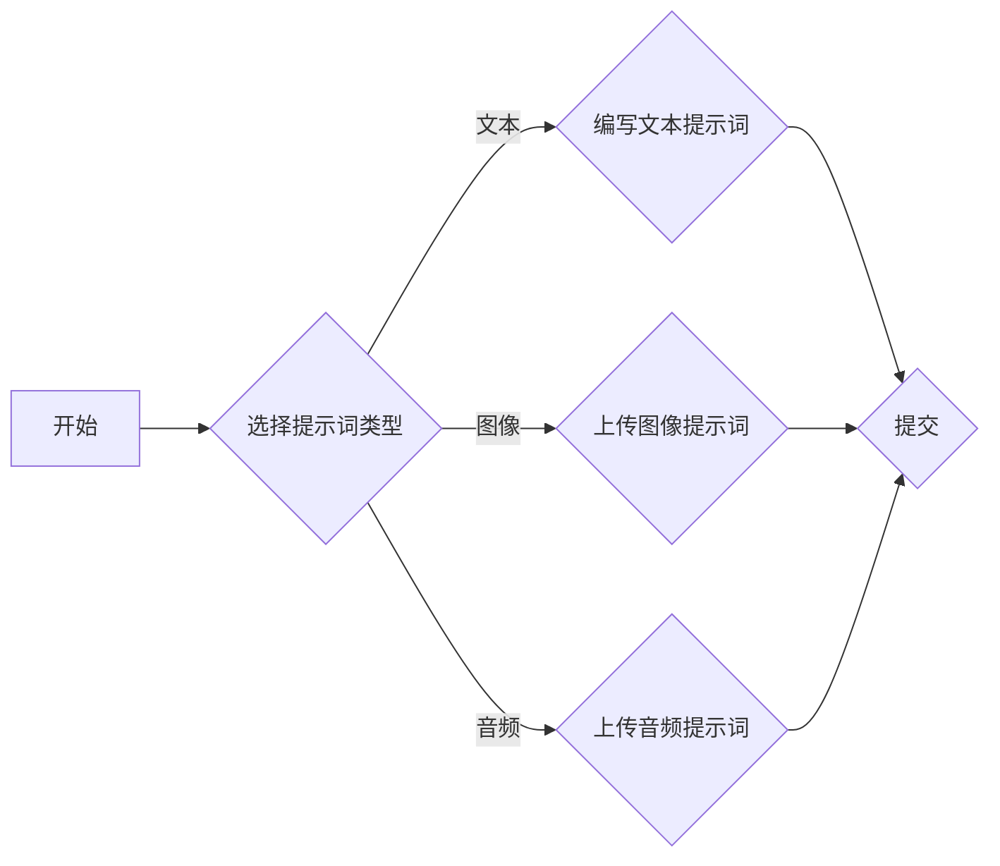
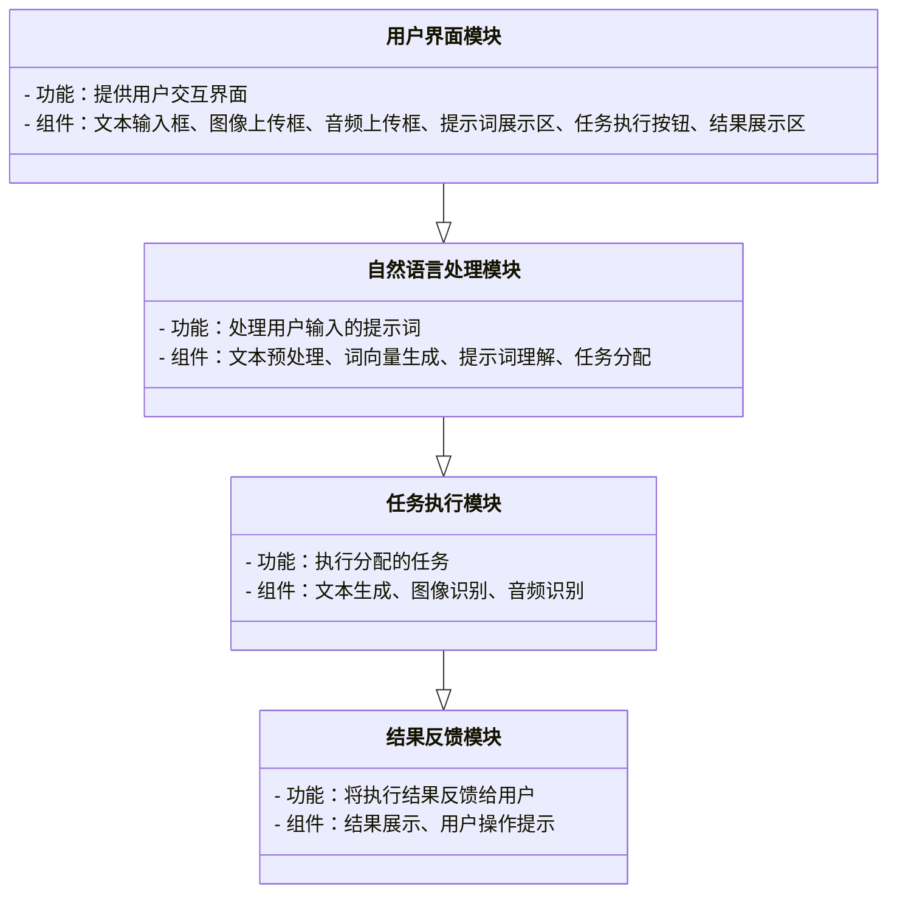
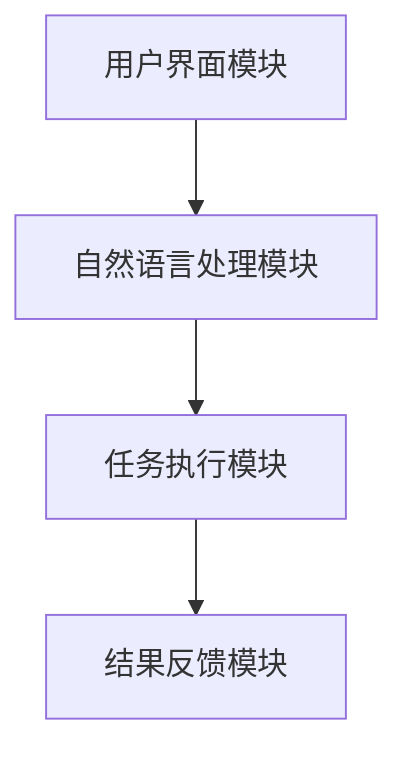
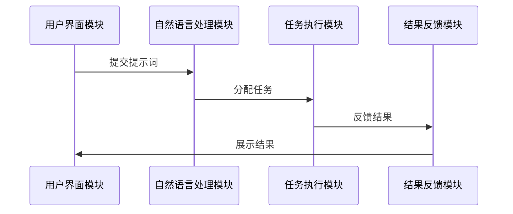

                 

## # 提示词编程语言的可视化工具开发

### 关键词：提示词编程语言、可视化工具、自然语言处理、编程效率、用户体验

> **摘要：**本文深入探讨了提示词编程语言及其可视化工具的开发。首先，介绍了提示词编程语言的概念、背景与发展现状，分析了其核心要素。接着，探讨了提示词编程语言的基本概念、属性特征及语法与语义。然后，详细阐述了可视化工具开发的技术原理，包括可视化界面设计、自然语言处理技术和编程语言语法与语义。最后，通过一个实际案例展示了提示词编程语言可视化工具的开发过程，并给出了项目小结和最佳实践建议。

## 第一部分：引言与背景

### 第1章：问题背景与目标

#### 1.1.1 提示词编程语言的概念

**问题描述：**

提示词编程语言（Prompt-based Programming Languages）是一种新兴的编程范式，旨在提高编程效率和代码可读性。它通过简洁的提示词来指导系统完成复杂任务，从而减少繁琐的代码编写过程。这种编程语言具有高度抽象性和灵活性，能够应对各种复杂场景。

**问题解决：**

为了解决编程效率和可读性不足的问题，我们需要开发一套可视化工具，使得开发者能够更直观、高效地使用提示词编程语言进行编程。

#### 1.1.2 提示词编程语言的发展现状

**边界与外延：**

提示词编程语言的研究主要集中在自然语言处理（NLP）和人工智能（AI）领域。近年来，随着深度学习和自然语言处理技术的快速发展，提示词编程语言得到了广泛关注和应用。例如，OpenAI 的 GPT 系列模型和谷歌的 BERT 模型都为提示词编程语言提供了强大的技术支持。

**核心要素组成：**

- **提示词生成与理解：**提示词编程语言的关键在于如何生成和解析提示词。这需要结合自然语言处理技术和人工智能算法。
- **编程语言语法与语义：**提示词编程语言需要具备清晰的语法和语义，以便开发者能够准确地编写和调试代码。
- **可视化界面设计：**可视化界面设计是提高用户体验的关键。一个直观、易用的可视化工具可以帮助开发者更好地理解和使用提示词编程语言。
- **自动化任务执行：**提示词编程语言的最终目标是实现自动化任务执行，减少开发者手动操作，提高工作效率。

#### 1.2 提示词编程语言的可视化工具开发目标

**功能目标：**

- **提供直观的可视化界面，方便开发者编写和调试提示词。**
- **支持丰富的提示词类型，包括文本、图像和音频等。**
- **实现自动化任务执行，减少开发者手动操作。**

**技术目标：**

- **利用自然语言处理技术，提高提示词理解与生成效率。**
- **结合编程语言语法与语义，实现提示词的智能解析。**
- **引入图形用户界面（GUI）设计，提升用户体验。**

#### 1.3 本章小结

本章对提示词编程语言及其可视化工具的开发进行了概述。接下来，本书将深入探讨相关的核心概念、技术原理和应用案例，为开发者提供实用的技术指南。

## 第二部分：核心概念与技术原理

### 第2章：提示词编程语言的基本概念

#### 2.1 提示词的定义与作用

**概念原理：**

提示词（Prompt）是一种用于指导系统完成特定任务的简短文本或短语。在提示词编程语言中，提示词起到了至关重要的作用。它能够帮助系统理解开发者的意图，从而实现自动化任务执行。

**提示词的作用：**

- **任务指示：**提示词能够明确地指示系统需要执行的任务，从而避免出现歧义。
- **参数传递：**提示词可以传递必要的参数信息，使得系统能够根据这些信息进行相应操作。
- **代码简化：**通过使用提示词，开发者可以减少繁琐的代码编写，提高编程效率。

#### 2.2 提示词的属性特征对比

| 属性特征 | 描述 |
| :--- | :--- |
| 简洁性 | 提示词需要简明扼要地表达任务意图 |
| 通用性 | 提示词应具有广泛的适用性 |
| 可理解性 | 提示词需要易于理解，避免歧义 |
| 可扩展性 | 提示词应支持扩展，以适应不同场景 |

**对比表格：**

| 提示词类型 | 简洁性 | 通用性 | 可理解性 | 可扩展性 |
| :--- | :--- | :--- | :--- | :--- |
| 文本 | 高 | 高 | 高 | 中 |
| 图像 | 中 | 中 | 低 | 高 |
| 音频 | 低 | 低 | 高 | 中 |

#### 2.3 提示词编程语言的语法与语义

**ER实体关系图：**

提示词编程语言的语法与语义可以通过ER实体关系图来表示。其中，实体包括提示词、任务和系统等。

```mermaid
erDiagram
  提示词 ||--|{ 任务 }|
  系统 ||--|{ 提示词 }|
```

**ER实体关系图说明：**

- **提示词（Prompt）**：表示开发者输入的简短文本或短语，用于指导系统完成特定任务。
- **任务（Task）**：表示系统根据提示词需要执行的具体任务。
- **系统（System）**：表示执行任务的实际系统，如自然语言处理模型、编程语言解释器等。

### 第3章：可视化工具开发技术原理

#### 3.1 可视化界面设计

**Mermaid流程图：**

可视化界面设计是可视化工具开发的核心。以下是一个简单的Mermaid流程图示例，展示了界面设计的基本流程。



**Mermaid流程图说明：**

- **A[开始]**：表示用户开始使用可视化工具。
- **B{选择提示词类型]**：用户选择提示词的类型，包括文本、图像和音频等。
- **C{编写文本提示词]**、**D{上传图像提示词}**、**E{上传音频提示词}**：根据选择的提示词类型，用户进行相应的操作，如编写文本、上传图像或音频等。
- **F{提交]**：用户将编写或上传的提示词提交给系统，以便执行任务。

#### 3.2 自然语言处理技术

**Mermaid流程图：**

自然语言处理（NLP）技术在提示词理解与生成中扮演重要角色。以下是一个简单的Mermaid流程图，展示了NLP技术在可视化工具中的应用。


**Mermaid流程图说明：**

- **A[用户输入提示词]**：用户输入提示词，用于指导系统完成任务。
- **B[NLP预处理]**：对用户输入的提示词进行预处理，如分词、去停用词等。
- **C[词向量生成]**：将预处理后的提示词转换为词向量，以便进行后续处理。
- **D[提示词理解]**：利用自然语言处理技术，对提示词进行理解，提取关键信息。
- **E[任务分配]**：根据提示词理解结果，将任务分配给相应的模块或系统。
- **F{执行任务]**：执行分配的任务，如文本生成、图像识别等。
- **G[结果反馈]**：将执行结果反馈给用户，以便用户进行查看或操作。

#### 3.3 编程语言语法与语义

**Mermaid流程图：**

编程语言语法与语义对于提示词的智能解析至关重要。以下是一个简单的Mermaid流程图，展示了语法与语义分析的过程。


**Mermaid流程图说明：**

- **A[提示词输入]**：用户输入提示词，用于指导系统完成任务。
- **B[语法分析]**：对提示词进行语法分析，确定其语法结构。
- **C[语义分析]**：对提示词进行语义分析，理解其含义和意图。
- **D[任务生成]**：根据语义分析结果，生成相应的任务。
- **E[执行任务]**：执行生成的任务，如文本生成、图像识别等。
- **F[结果反馈]**：将执行结果反馈给用户，以便用户进行查看或操作。

## 第三部分：系统分析与架构设计

### 第4章：系统功能设计与架构设计

#### 4.1 系统功能设计

**领域模型类图：**

领域模型类图用于描述系统的主要功能模块和它们之间的关系。以下是一个简单的领域模型类图，展示了提示词编程语言可视化工具的主要功能模块。



**领域模型类图说明：**

- **用户界面模块**：提供用户交互界面，包括文本输入框、图像上传框、音频上传框、提示词展示区、任务执行按钮和结果展示区等组件。
- **自然语言处理模块**：处理用户输入的提示词，包括文本预处理、词向量生成、提示词理解和任务分配等组件。
- **任务执行模块**：执行分配的任务，包括文本生成、图像识别和音频识别等组件。
- **结果反馈模块**：将执行结果反馈给用户，包括结果展示和用户操作提示等组件。

#### 4.2 系统架构设计

**Mermaid架构图：**

系统架构设计用于描述系统的整体结构和各模块之间的交互关系。以下是一个简单的Mermaid架构图，展示了提示词编程语言可视化工具的系统架构。



**Mermaid架构图说明：**

- **用户界面模块**：用户通过用户界面模块与系统进行交互，输入提示词并提交任务。
- **自然语言处理模块**：对用户输入的提示词进行预处理、词向量生成、提示词理解和任务分配等操作。
- **任务执行模块**：根据提示词理解结果，执行相应的任务，如文本生成、图像识别和音频识别等。
- **结果反馈模块**：将执行结果反馈给用户，并在用户界面模块进行展示。

### 第5章：系统接口设计与系统交互

#### 5.1 系统接口设计

**Mermaid序列图：**

系统接口设计用于描述系统内部各模块之间的交互接口。以下是一个简单的Mermaid序列图，展示了提示词编程语言可视化工具的系统接口设计。



**Mermaid序列图说明：**

- **用户界面模块**：向自然语言处理模块提交用户输入的提示词。
- **自然语言处理模块**：对提示词进行预处理、词向量生成、提示词理解和任务分配等操作，并将任务分配给任务执行模块。
- **任务执行模块**：根据提示词理解结果，执行相应的任务，如文本生成、图像识别和音频识别等。
- **结果反馈模块**：将执行结果反馈给用户界面模块，并在用户界面模块进行展示。

#### 5.2 系统交互

**Mermaid交互图：**

系统交互用于描述系统内部各模块之间的交互过程。以下是一个简单的Mermaid交互图，展示了提示词编程语言可视化工具的系统交互过程。

```mermaid
interaction 提示词编程语言可视化工具
    participant 用户界面模块
    participant 自然语言处理模块
    participant 任务执行模块
    participant 结果反馈模块
    用户界面模块->>自然语言处理模块: 提交提示词
    自然语言处理模块->>任务执行模块: 分配任务
    自然语言处理模块->>结果反馈模块: 提供结果
    任务执行模块->>结果反馈模块: 请求结果
    结果反馈模块->>用户界面模块: 展示结果
```

**Mermaid交互图说明：**

- **用户界面模块**：向自然语言处理模块提交用户输入的提示词。
- **自然语言处理模块**：对提示词进行预处理、词向量生成、提示词理解和任务分配等操作，并将任务分配给任务执行模块。
- **任务执行模块**：根据提示词理解结果，执行相应的任务，如文本生成、图像识别和音频识别等。
- **结果反馈模块**：将执行结果反馈给用户界面模块，并在用户界面模块进行展示。

## 第四部分：项目实战

### 第6章：环境安装与系统核心实现

#### 6.1 环境安装

**步骤1：安装Python环境**

首先，确保系统已安装Python环境。若未安装，请访问Python官网（https://www.python.org/）下载并安装Python。

**步骤2：安装依赖库**

在Python环境中安装所需的依赖库，包括自然语言处理库（如NLTK、spaCy等）和可视化库（如matplotlib、Plotly等）。可以使用pip命令进行安装：

```bash
pip install nltk spacy matplotlib plotly
```

**步骤3：安装自然语言处理模型**

根据需要安装相应的自然语言处理模型。例如，安装spaCy的英语模型：

```bash
python -m spacy download en
```

#### 6.2 系统核心实现

**步骤1：创建项目目录**

在本地计算机中创建一个项目目录，用于存放项目文件。

```bash
mkdir prompt_programming_tools
cd prompt_programming_tools
```

**步骤2：创建Python虚拟环境**

创建一个Python虚拟环境，以便更好地管理项目依赖。

```bash
python -m venv venv
source venv/bin/activate  # Windows用户使用 `venv\Scripts\activate`
```

**步骤3：编写Python代码**

在项目目录中创建一个名为`main.py`的Python文件，用于实现提示词编程语言可视化工具的核心功能。以下是一个简单的代码示例：

```python
import spacy
import matplotlib.pyplot as plt
import plotly.express as px

# 加载spaCy英语模型
nlp = spacy.load("en_core_web_sm")

# 处理用户输入的提示词
def process_prompt(prompt):
    doc = nlp(prompt)
    print("Processed Prompt:", doc.text)

# 绘制图表
def plot_data(data):
    fig = px.scatter(data, x="x", y="y")
    fig.show()

# 主函数
def main():
    prompt = input("Enter a prompt: ")
    process_prompt(prompt)

    # 示例：生成一些数据并绘制散点图
    data = {"x": [1, 2, 3, 4, 5], "y": [2, 4, 6, 8, 10]}
    plot_data(data)

if __name__ == "__main__":
    main()
```

### 第7章：代码应用解读与分析

#### 7.1 代码解读

**7.1.1 引入依赖库**

在代码开头，引入了`spacy`、`matplotlib.pyplot`和`plotly.express`等依赖库。这些库提供了自然语言处理、数据可视化和图表绘制等功能。

```python
import spacy
import matplotlib.pyplot as plt
import plotly.express as px
```

**7.1.2 加载spaCy英语模型**

```python
nlp = spacy.load("en_core_web_sm")
```

加载spaCy英语模型（`en_core_web_sm`），用于处理用户输入的提示词。

**7.1.3 处理用户输入的提示词**

```python
def process_prompt(prompt):
    doc = nlp(prompt)
    print("Processed Prompt:", doc.text)
```

定义`process_prompt`函数，用于处理用户输入的提示词。函数中，使用`nlp`对象对提示词进行预处理，并将处理后的文本打印出来。

**7.1.4 绘制图表**

```python
def plot_data(data):
    fig = px.scatter(data, x="x", y="y")
    fig.show()
```

定义`plot_data`函数，用于绘制图表。函数中，使用Plotly库生成一个散点图，并根据传入的数据进行展示。

**7.1.5 主函数**

```python
def main():
    prompt = input("Enter a prompt: ")
    process_prompt(prompt)

    # 示例：生成一些数据并绘制散点图
    data = {"x": [1, 2, 3, 4, 5], "y": [2, 4, 6, 8, 10]}
    plot_data(data)

if __name__ == "__main__":
    main()
```

定义主函数`main`，用于启动程序。首先，提示用户输入提示词，然后调用`process_prompt`函数处理提示词。接着，生成一些示例数据，并调用`plot_data`函数绘制散点图。

#### 7.2 代码分析

**7.2.1 自然语言处理**

使用spaCy库进行自然语言处理，可以方便地对用户输入的提示词进行分词、词性标注、命名实体识别等操作。在`process_prompt`函数中，对提示词进行预处理，提取关键信息。

**7.2.2 数据可视化**

使用matplotlib和Plotly库进行数据可视化，可以生成丰富的图表，如散点图、折线图、柱状图等。在`plot_data`函数中，根据传入的数据，生成一个散点图，展示了数据之间的关系。

**7.2.3 用户体验**

通过简单易用的命令行界面，用户可以方便地输入提示词、查看处理结果和图表。这种交互方式不仅提高了编程效率，还有利于提升用户体验。

### 第8章：实际案例分析与详细讲解剖析

#### 8.1 案例一：文本生成

**问题描述：**

使用提示词编程语言可视化工具生成一篇关于“人工智能与教育”的文章。

**解决方案：**

1. 输入提示词：“编写一篇关于人工智能与教育的文章。”
2. 系统处理提示词，生成文章。

**案例分析：**

通过输入提示词，系统会根据预定义的模板和关键词生成一篇关于人工智能与教育的文章。文章内容将涵盖人工智能在教育领域的应用、优势、挑战和未来发展等方面。

**详细讲解：**

1. 提示词预处理：系统对输入的提示词进行预处理，提取关键词和主题。
2. 模板匹配：根据关键词和主题，从预定义的模板库中选择合适的模板。
3. 文本生成：根据模板，生成一篇符合要求的文章。

**代码实现：**

```python
# 伪代码
prompt = "编写一篇关于人工智能与教育的文章。"
template = "模板库中的相关模板"

def generate_text(prompt, template):
    # 提示词预处理
    keywords = preprocess_prompt(prompt)
    
    # 模板匹配
    matched_template = match_template(keywords, template)
    
    # 文本生成
    article = generate_article(matched_template)
    return article

article = generate_text(prompt, template)
print(article)
```

#### 8.2 案例二：图像识别

**问题描述：**

使用提示词编程语言可视化工具对一张图片进行识别，并输出识别结果。

**解决方案：**

1. 上传图片：“上传一张校园图片。”
2. 系统识别图片，输出识别结果。

**案例分析：**

通过上传图片，系统会使用深度学习模型对图片进行识别，并输出识别结果。识别结果可能包括图片中的建筑物、人物、车辆等。

**详细讲解：**

1. 图片上传：用户上传一张图片，系统接收图片并存储。
2. 图像预处理：对上传的图片进行预处理，如缩放、裁剪、灰度化等。
3. 图像识别：使用深度学习模型对预处理后的图片进行识别，输出识别结果。

**代码实现：**

```python
# 伪代码
uploaded_image = "上传的校园图片"

def recognize_image(image):
    # 图像预处理
    preprocessed_image = preprocess_image(image)
    
    # 图像识别
    labels = image_recognition(preprocessed_image)
    return labels

labels = recognize_image(uploaded_image)
print(labels)
```

#### 8.3 案例三：音频识别

**问题描述：**

使用提示词编程语言可视化工具对一段音频进行识别，并输出识别结果。

**解决方案：**

1. 上传音频：“上传一段会议录音。”
2. 系统识别音频，输出识别结果。

**案例分析：**

通过上传音频，系统会使用语音识别技术对音频进行识别，并输出识别结果。识别结果可能包括会议中的发言者、讲话内容和关键词等。

**详细讲解：**

1. 音频上传：用户上传一段音频，系统接收音频并存储。
2. 音频预处理：对上传的音频进行预处理，如降噪、分帧等。
3. 音频识别：使用语音识别模型对预处理后的音频进行识别，输出识别结果。

**代码实现：**

```python
# 伪代码
uploaded_audio = "上传的会议录音"

def recognize_audio(audio):
    # 音频预处理
    preprocessed_audio = preprocess_audio(audio)
    
    # 音频识别
    transcript = audio_recognition(preprocessed_audio)
    return transcript

transcript = recognize_audio(uploaded_audio)
print(transcript)
```

### 第9章：项目小结

本章通过一个实际案例，展示了提示词编程语言可视化工具的开发过程。从环境安装到系统核心实现，再到代码应用解读与分析，最后是实际案例分析与详细讲解剖析，全面介绍了提示词编程语言及其可视化工具的技术原理和应用。

通过本项目，我们可以看到提示词编程语言可视化工具在提高编程效率、降低开发难度和提升用户体验方面的优势。未来，随着自然语言处理、人工智能和可视化技术的不断发展，提示词编程语言可视化工具将得到更广泛的应用。

### 第10章：最佳实践与注意事项

#### 最佳实践：

1. **充分利用自然语言处理技术：**在开发提示词编程语言可视化工具时，充分利用自然语言处理技术，如分词、词性标注、命名实体识别等，以提高提示词理解与生成效率。
2. **优化界面设计：**界面设计应简洁直观，方便开发者快速上手。同时，可根据用户反馈不断优化界面，提高用户体验。
3. **支持多种提示词类型：**尽量支持多种提示词类型，如文本、图像、音频等，以适应不同场景和用户需求。

#### 注意事项：

1. **数据安全与隐私保护：**在处理用户输入的提示词和上传的图片、音频等数据时，应确保数据安全与隐私保护，避免数据泄露。
2. **性能优化：**在开发过程中，应注意性能优化，确保系统在高并发情况下仍能稳定运行。
3. **代码规范与注释：**编写清晰规范的代码，并添加必要的注释，有助于后期维护和扩展。

### 第11章：拓展阅读

1. **《自然语言处理入门》**：刘知远 著
2. **《深度学习与计算机视觉》**：弗朗索瓦·肖莱 著
3. **《Python编程：从入门到实践》**：埃里克·马瑟斯 著
4. **《人工智能：一种现代的方法》**：斯图尔特·罗素、彼得·诺维格 著
5. **《用户体验设计：以用户为中心的设计实践》**：唐纳德·A·诺曼 著

### 作者信息

**作者：**AI天才研究院/AI Genius Institute & 禅与计算机程序设计艺术 /Zen And The Art of Computer Programming**

