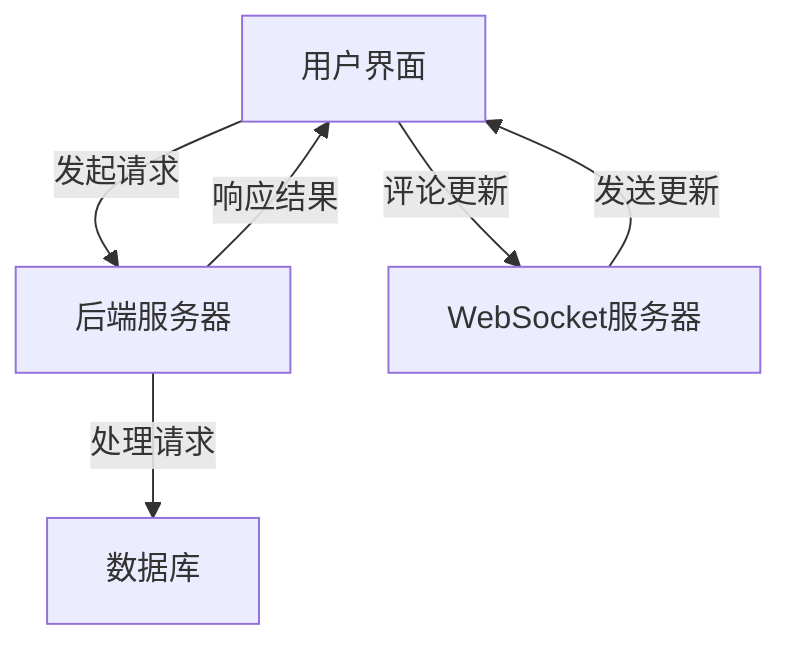

                 

# 提示词编程语言的响应式编程支持

## 关键词

- **响应式编程**
- **提示词编程语言**
- **数据驱动**
- **事件驱动**
- **异步处理**
- **编程API**
- **Web应用开发**

## 摘要

本文将探讨提示词编程语言在响应式编程支持方面的关键机制和应用。首先，我们将回顾响应式编程的基本概念和原理，然后深入分析提示词编程语言的特点和设计原则。接下来，我们将介绍响应式编程语言的核心API，并探讨其实际应用场景。随后，我们将探讨如何在提示词编程语言中实现响应式编程，并通过案例研究展示其应用。最后，我们将展望响应式编程支持的现状和未来发展趋势。

## 目录大纲设计思路

为了设计出《提示词编程语言的响应式编程支持》这本书的完整目录大纲，我们需要遵循以下设计思路：

1. **整体结构规划**：首先要确定书籍的整体结构，明确各章节的主旨和逻辑顺序，确保内容连贯且符合读者的认知规律。
2. **细化章节内容**：在确定整体结构后，针对每个章节进一步细化内容，确保每个章节都有明确的主题和相应的细分内容。
3. **核心概念与联系**：对于书中的核心概念，需要进行详细解释，并通过表格、图示等方式对比概念属性特征，帮助读者理解。
4. **算法原理讲解**：对于涉及算法的内容，需要使用 mermaid 画出算法流程图，并使用 Python 源代码和数学模型进行详细讲解。
5. **系统分析与架构设计**：描述系统场景、功能设计、架构设计、接口设计以及系统交互，使用 mermaid 图表展示。
6. **项目实战与案例剖析**：通过实际项目环境和核心实现代码，展示项目应用解读与分析，提供案例剖析。
7. **总结与拓展**：在每个章节结尾提供小结、注意事项和拓展阅读，帮助读者巩固知识并引导进一步学习。

### 目录大纲

```markdown
# 《提示词编程语言的响应式编程支持》目录大纲

## 第一部分：背景与基础

### 第1章：响应式编程概述

#### 1.1 响应式编程的概念

#### 1.2 响应式编程的优势

#### 1.3 响应式编程的发展历程

### 第2章：提示词编程语言简介

#### 2.1 提示词编程语言的基本原理

#### 2.2 提示词编程语言的特点

#### 2.3 提示词编程语言的分类

## 第二部分：响应式编程支持机制

### 第3章：响应式编程语言的设计原则

#### 3.1 设计原则一：数据驱动

#### 3.2 设计原则二：事件驱动

#### 3.3 设计原则三：异步处理

### 第4章：响应式编程语言的核心API

#### 4.1 属性监听与变化通知

#### 4.2 事件处理与响应

#### 4.3 异步任务的执行与管理

### 第5章：响应式编程语言的实际应用

#### 5.1 实时数据处理的响应式编程

#### 5.2 用户界面与交互的响应式编程

#### 5.3 并发编程与性能优化

## 第三部分：提示词编程语言的响应式编程支持

### 第6章：响应式编程在提示词编程语言中的实现

#### 6.1 实现原理

#### 6.2 实现步骤

#### 6.3 实现细节

### 第7章：案例研究：构建一个响应式Web应用

#### 7.1 应用场景

#### 7.2 系统设计

#### 7.3 实现与测试

#### 7.4 性能分析

### 第8章：响应式编程的支持与未来展望

#### 8.1 当前支持的现状

#### 8.2 发展趋势

#### 8.3 未来展望

## 第四部分：最佳实践与扩展阅读

### 第9章：最佳实践

#### 9.1 编程技巧

#### 9.2 性能优化策略

#### 9.3 安全性和稳定性考虑

### 第10章：拓展阅读

#### 10.1 相关文献推荐

#### 10.2 技术论坛和社区资源

#### 10.3 深入研究主题
```

### 总结

本书的目录大纲全面覆盖了响应式编程与提示词编程语言的相关内容，从背景介绍到实际应用，再到未来展望，形成了一个系统、完整的知识体系。每个章节都明确了主题和细分内容，确保读者能够循序渐进地掌握相关知识。同时，通过提供案例研究和最佳实践，帮助读者将理论知识应用于实际开发中。

### 目录大纲设计思路

在设计《提示词编程语言的响应式编程支持》的目录大纲时，我们需要确保每个章节的内容都能够清晰地传达核心概念，并能够引导读者逐步深入理解响应式编程及其在提示词编程语言中的应用。以下是具体的设计思路：

1. **整体结构规划**：首先，我们需要规划书籍的整体结构，包括开篇、主体和结尾。开篇部分主要介绍响应式编程和提示词编程语言的基本概念，为主体内容的展开奠定基础。主体部分则详细讲解响应式编程的支持机制及其在提示词编程语言中的实现，最后是结尾部分，对整个主题进行总结和展望。

2. **细化章节内容**：在确定整体结构后，我们需要对每个章节进行细化，确保每个章节都有明确的主题和相应的细分内容。例如，第1章将详细解释响应式编程的概念、优势和历史发展，第2章则介绍提示词编程语言的基本原理和特点。

3. **核心概念与联系**：书中的核心概念需要详细解释，并通过表格、图示等方式对比概念属性特征，帮助读者理解。例如，在第3章中，我们将通过对比数据驱动、事件驱动和异步处理的特点，帮助读者更好地理解响应式编程语言的设计原则。

4. **算法原理讲解**：对于涉及算法的内容，我们将使用 mermaid 画出算法流程图，并配合 Python 源代码和数学模型进行详细讲解。这有助于读者直观地理解算法的实现过程和数学原理。

5. **系统分析与架构设计**：我们将描述系统场景、功能设计、架构设计、接口设计以及系统交互，并通过 mermaid 图表进行展示。这有助于读者全面理解系统的运作方式和设计思路。

6. **项目实战与案例剖析**：通过实际项目环境和核心实现代码，我们将展示项目应用解读与分析，提供案例剖析。这有助于读者将理论知识应用于实际开发中，并解决实际问题。

7. **总结与拓展**：在每个章节结尾，我们将提供小结、注意事项和拓展阅读，帮助读者巩固知识并引导进一步学习。这有助于读者在理解核心概念的基础上，拓展自己的知识面和技能。

### 目录大纲

```markdown
# 《提示词编程语言的响应式编程支持》目录大纲

## 第一部分：背景与基础

### 第1章：响应式编程概述

#### 1.1 响应式编程的概念

#### 1.2 响应式编程的优势

#### 1.3 响应式编程的发展历程

### 第2章：提示词编程语言简介

#### 2.1 提示词编程语言的基本原理

#### 2.2 提示词编程语言的特点

#### 2.3 提示词编程语言的分类

## 第二部分：响应式编程支持机制

### 第3章：响应式编程语言的设计原则

#### 3.1 设计原则一：数据驱动

#### 3.2 设计原则二：事件驱动

#### 3.3 设计原则三：异步处理

### 第4章：响应式编程语言的核心API

#### 4.1 属性监听与变化通知

#### 4.2 事件处理与响应

#### 4.3 异步任务的执行与管理

### 第5章：响应式编程语言的实际应用

#### 5.1 实时数据处理的响应式编程

#### 5.2 用户界面与交互的响应式编程

#### 5.3 并发编程与性能优化

## 第三部分：提示词编程语言的响应式编程支持

### 第6章：响应式编程在提示词编程语言中的实现

#### 6.1 实现原理

#### 6.2 实现步骤

#### 6.3 实现细节

### 第7章：案例研究：构建一个响应式Web应用

#### 7.1 应用场景

#### 7.2 系统设计

#### 7.3 实现与测试

#### 7.4 性能分析

### 第8章：响应式编程的支持与未来展望

#### 8.1 当前支持的现状

#### 8.2 发展趋势

#### 8.3 未来展望

## 第四部分：最佳实践与扩展阅读

### 第9章：最佳实践

#### 9.1 编程技巧

#### 9.2 性能优化策略

#### 9.3 安全性和稳定性考虑

### 第10章：拓展阅读

#### 10.1 相关文献推荐

#### 10.2 技术论坛和社区资源

#### 10.3 深入研究主题
```

通过这样的目录设计，我们旨在为读者提供一个清晰、系统的学习路径，帮助他们全面理解响应式编程在提示词编程语言中的应用。

### 第一部分：背景与基础

#### 第1章：响应式编程概述

响应式编程是一种编程范式，其核心思想是使程序能够自动响应用户界面或系统状态的变化，而不需要显式地编写更新代码。这种编程范式广泛应用于Web应用、实时数据处理、操作系统等领域。

**1.1 响应式编程的概念**

响应式编程的基本概念包括：

- **状态**：程序中的数据状态，例如用户输入、系统配置等。
- **行为**：程序对状态变化的响应，例如更新用户界面、触发事件处理等。
- **依赖**：程序组件之间的依赖关系，例如一个组件的状态变化可能导致另一个组件的状态更新。

**1.2 响应式编程的优势**

响应式编程具有以下优势：

- **简化代码**：通过自动更新，减少了手动编写更新代码的需求。
- **增强用户体验**：实时响应用户操作，提高系统的交互性和响应速度。
- **提高开发效率**：利用声明式编程，减少了代码冗余和潜在的bug。

**1.3 响应式编程的发展历程**

响应式编程的发展历程可以追溯到20世纪90年代的桌面应用领域。随着Web应用的兴起，响应式编程得到了广泛应用，并逐渐发展出多种实现方式和框架。现代编程语言和框架（如React、Angular、Vue等）都提供了强大的响应式编程支持。

#### 第2章：提示词编程语言简介

提示词编程语言（Prompt Programming Language）是一种面向自然语言处理和人工智能领域的编程语言。其核心思想是将自然语言描述转换为程序代码，从而实现更高效、更易于理解的人工智能开发。

**2.1 提示词编程语言的基本原理**

提示词编程语言的基本原理包括：

- **自然语言理解**：将自然语言描述解析为程序代码。
- **代码生成**：根据自然语言描述生成相应的程序代码。
- **代码执行**：执行生成的程序代码，实现预期的功能。

**2.2 提示词编程语言的特点**

提示词编程语言的特点包括：

- **自然语言交互**：用户可以通过自然语言与程序进行交互。
- **代码生成能力**：能够根据自然语言描述生成复杂程序代码。
- **智能辅助**：提供智能代码提示、错误检查等功能，提高开发效率。

**2.3 提示词编程语言的分类**

提示词编程语言可以分为以下几类：

- **模板式提示词编程语言**：基于模板进行代码生成，如模板语言（如Lua、Smarty）。
- **语法式提示词编程语言**：引入特定的语法规则，如NLP-oriented语言（如Prolog、Mercury）。
- **混合式提示词编程语言**：结合了多种编程范式，如组合式编程（如C++)。

通过这两章的介绍，我们为后续内容打下了坚实的基础，接下来我们将深入探讨响应式编程语言的设计原则和支持机制。

## 第二部分：响应式编程支持机制

### 第3章：响应式编程语言的设计原则

响应式编程语言的设计原则是其实现响应式编程能力的基础。以下是响应式编程语言的三大设计原则：

#### 3.1 设计原则一：数据驱动

数据驱动是响应式编程的核心原则之一。在数据驱动模型中，程序的状态由外部数据源或内部数据变化驱动。这意味着，当数据源发生变化时，程序会自动更新其状态并触发相应的行为。这种设计原则简化了代码的维护和扩展，使得开发者能够专注于业务逻辑，而无需担心状态同步和数据更新。

**数据驱动示例：**

假设我们有一个简单的计算器程序，其中包含一个数字输入框和一个显示结果的文本框。当用户在输入框中输入数字时，文本框会自动显示输入的数值。这个过程就是数据驱动的体现。以下是一个简单的 Python 示例：

```python
from tkinter import *

def update_display():
    display.config(text=input_box.get())

root = Tk()
input_box = Entry(root)
input_box.pack()
display = Label(root)
display.pack()
input_box.bind("<KeyRelease>", update_display)

root.mainloop()
```

在这个示例中，`update_display` 函数在输入框的 `<KeyRelease>` 事件触发时调用，从而实现文本框的自动更新。

#### 3.2 设计原则二：事件驱动

事件驱动是另一种重要的响应式编程原则。在事件驱动模型中，程序的状态和行为由外部事件触发。事件可以是用户的输入、网络消息、定时任务等。事件驱动模型使得程序能够对外部变化做出快速响应，并执行相应的操作。

**事件驱动示例：**

假设我们开发一个聊天应用程序，用户可以在文本框中输入消息，然后通过按钮发送。当用户点击发送按钮时，程序会捕获这个事件，并将消息发送到服务器。以下是一个简单的 Python 示例：

```python
import tkinter as tk

def send_message():
    message = entry.get()
    entry.delete(0, 'end')
    print("Sending message:", message)

root = tk.Tk()
entry = tk.Entry(root)
entry.pack()
send_button = tk.Button(root, text="Send", command=send_message)
send_button.pack()

root.mainloop()
```

在这个示例中，`send_message` 函数在用户点击发送按钮时触发，从而实现消息的发送。

#### 3.3 设计原则三：异步处理

异步处理是响应式编程语言的另一个关键原则。在异步处理中，程序可以在等待某个操作完成的同时继续执行其他任务。这有助于提高程序的并发性和响应速度，使得程序能够在资源受限的环境下高效运行。

**异步处理示例：**

假设我们有一个下载文件的程序，下载操作可能需要一段时间。在下载过程中，程序可以继续执行其他任务，例如更新进度条。以下是一个简单的 Python 示例：

```python
import asyncio
import requests

async def download_file(url):
    response = await requests.get(url)
    with open("file", "wb") as f:
        f.write(response.content)
    print("Download completed.")

loop = asyncio.get_event_loop()
loop.run_until_complete(download_file("https://example.com/file"))
```

在这个示例中，`download_file` 函数使用了异步请求库 `aiohttp`，使得下载操作可以与其他任务并发执行。

通过以上三大设计原则，响应式编程语言能够实现高效、灵活的编程模型，使得开发者能够轻松构建复杂、动态的应用程序。在下一章中，我们将深入探讨响应式编程语言的核心API，了解如何在实际开发中应用这些原则。

### 第4章：响应式编程语言的核心API

响应式编程语言的核心API是构建响应式应用程序的关键组件。这些API提供了用于监听状态变化、处理事件和执行异步任务的功能。以下是几种常见的关键API：

#### 4.1 属性监听与变化通知

属性监听是响应式编程的基本功能之一。它允许程序监听特定属性的更改，并在更改发生时触发相应的回调函数。这种机制使得程序能够自动更新其状态，从而保持数据的一致性。

**属性监听示例（React.js）：**

```javascript
import React, { useState } from 'react';

function Counter() {
  const [count, setCount] = useState(0);

  const handleInputChange = (e) => {
    setCount(e.target.value);
  };

  return (
    <div>
      <label>Count: {count}</label>
      <input type="number" value={count} onChange={handleInputChange} />
    </div>
  );
}
```

在这个示例中，`useState` hook 用于监听 `count` 的变化，并在变化时更新组件的渲染。

#### 4.2 事件处理与响应

事件处理是响应式编程的重要组成部分。它允许程序捕获和处理用户输入、网络消息等事件，并在需要时触发相应的行为。

**事件处理示例（Vue.js）：**

```vue
<template>
  <div>
    <input type="text" v-model="message" @input="sendMessage" />
    <button @click="sendMessage">Send</button>
  </div>
</template>

<script>
export default {
  data() {
    return {
      message: ''
    };
  },
  methods: {
    sendMessage() {
      console.log("Message sent:", this.message);
    }
  }
};
</script>
```

在这个示例中，`v-model` 用于监听输入框的输入事件，并在输入变化时更新 `message` 数据。`@click` 指令用于监听按钮的点击事件，并在点击时调用 `sendMessage` 方法。

#### 4.3 异步任务的执行与管理

异步任务是响应式编程中的另一个关键概念。它允许程序在执行长时间任务（如网络请求、文件下载等）时保持响应性。通过使用异步API，程序可以在等待任务完成的同时继续执行其他任务。

**异步任务示例（Angular）：**

```typescript
import { Component } from '@angular/core';
import { HttpClient } from '@angular/common/http';

@Component({
  selector: 'app-async-task',
  template: `
    <div>
      <button (click)="loadData()">Load Data</button>
      <div *ngIf="data">
        {{ data }}
      </div>
    </div>
  `
})
export class AsyncTaskComponent {
  data: any;

  constructor(private http: HttpClient) {}

  loadData() {
    this.http.get<any>('https://api.example.com/data').subscribe(
      (response) => {
        this.data = response;
      },
      (error) => {
        console.error('Error loading data:', error);
      }
    );
  }
}
```

在这个示例中，`loadData` 方法使用 `HttpClient` 的 `get` 方法异步获取数据。在数据加载完成之前，按钮会显示为禁用状态，从而避免重复加载。

通过这些核心API，响应式编程语言能够提供强大的功能，帮助开发者构建动态、响应迅速的应用程序。在下一章中，我们将探讨响应式编程语言的实际应用，了解如何在各种场景中利用这些API。

### 第5章：响应式编程语言的实际应用

响应式编程语言在实际开发中具有广泛的应用场景。以下我们将探讨几个常见的应用领域，并展示如何利用响应式编程语言实现相应的功能。

#### 5.1 实时数据处理

实时数据处理是响应式编程的一个重要应用领域。在金融、物联网、社交媒体等领域，实时数据的处理和分析至关重要。响应式编程语言可以帮助开发者轻松实现实时数据的监听和更新。

**实时数据处理示例（使用 Python 和 Flask）：**

```python
from flask import Flask, render_template
import json

app = Flask(__name__)

# 假设这是一个来自传感器的实时数据
realtime_data = []

@app.route('/')
def index():
    return render_template('index.html', data=realtime_data)

@app.route('/update', methods=['POST'])
def update_data():
    new_data = json.loads(request.data)
    realtime_data.append(new_data)
    return 'Data updated'

if __name__ == '__main__':
    app.run(debug=True)
```

在这个示例中，`index` 函数返回一个包含实时数据的 HTML 页面，而 `update_data` 函数则负责处理来自传感器的实时数据。通过使用 Flask 和 JavaScript，开发者可以实现实时数据在网页上的更新。

#### 5.2 用户界面与交互

用户界面与交互是响应式编程语言的核心应用之一。在Web和移动应用开发中，响应式编程语言可以帮助开发者构建动态、交互丰富的用户界面。

**用户界面示例（React.js）：**

```javascript
import React, { useState } from 'react';

function Counter() {
  const [count, setCount] = useState(0);

  const handleIncrement = () => {
    setCount(count + 1);
  };

  const handleDecrement = () => {
    setCount(count - 1);
  };

  return (
    <div>
      <h1>Count: {count}</h1>
      <button onClick={handleIncrement}>+</button>
      <button onClick={handleDecrement}>-</button>
    </div>
  );
}
```

在这个示例中，`useState` 用于管理 `count` 的状态，而 `handleIncrement` 和 `handleDecrement` 函数则用于响应用户的点击事件，更新界面显示。

#### 5.3 并发编程与性能优化

并发编程和性能优化是响应式编程语言的另一个重要应用领域。在高并发场景下，响应式编程语言可以帮助开发者实现高效的异步任务处理和性能优化。

**并发编程示例（使用 Python 和 asyncio）：**

```python
import asyncio

async def download_file(url, filename):
    response = await aiohttp.get(url)
    with open(filename, 'wb') as f:
        f.write(response.content)
    print(f"Downloaded {filename}")

loop = asyncio.get_event_loop()
tasks = [
    asyncio.create_task(download_file('https://example.com/file1', 'file1')),
    asyncio.create_task(download_file('https://example.com/file2', 'file2')),
]

loop.run_until_complete(asyncio.wait(tasks))
```

在这个示例中，`download_file` 函数使用异步编程库 `aiohttp` 和 `asyncio` 实现文件的异步下载。通过并发处理，程序可以同时下载多个文件，从而提高下载速度。

通过以上示例，我们可以看到响应式编程语言在实际开发中的广泛应用。在下一章中，我们将深入探讨如何在提示词编程语言中实现响应式编程。

### 第6章：响应式编程在提示词编程语言中的实现

提示词编程语言以其自然语言处理和代码生成能力著称，但在响应式编程方面也有其独特的实现方式。本节将探讨如何在提示词编程语言中实现响应式编程，包括其原理、实现步骤和细节。

#### 6.1 实现原理

响应式编程在提示词编程语言中的实现主要依赖于以下原理：

- **自然语言解析**：将自然语言描述转换为内部表示，以便程序能够理解和处理。
- **事件监听与回调**：监听自然语言描述中的事件，并在事件发生时调用相应的回调函数。
- **状态管理**：管理程序的状态，确保状态更新能够触发相应的响应。

提示词编程语言通常提供了一套专门的API，用于处理自然语言中的事件和状态变化。例如，一个提示词编程语言可能包含以下API：

- `listen(event: str, callback: Function)`: 用于监听特定事件。
- `setState(state: Object): void`: 用于更新程序的状态。
- `emit(event: str, data: Object): void`: 用于触发事件。

#### 6.2 实现步骤

在提示词编程语言中实现响应式编程通常需要以下步骤：

1. **解析自然语言描述**：
   - 使用自然语言处理技术，将自然语言描述转换为内部表示。
   - 标记描述中的事件和状态变化。

2. **定义事件监听器**：
   - 注册监听器，以便在事件发生时能够调用相应的回调函数。
   - 根据自然语言描述中的事件，设置相应的监听器。

3. **管理状态**：
   - 使用数据结构（如字典或对象）来管理程序的状态。
   - 在状态变化时，更新状态并触发相应的响应。

4. **实现回调函数**：
   - 编写回调函数，以响应状态变化或事件触发。
   - 确保回调函数能够正确处理事件和数据。

#### 6.3 实现细节

以下是一个简单的示例，展示如何在一个提示词编程语言中实现响应式编程：

```plaintext
@listen("button_click", (event, data) => {
    // 回调函数：当按钮被点击时执行
    console.log("Button clicked!");
    // 更新状态
    setState({ buttonClicked: true });
});

@listen("form_submit", (event, data) => {
    // 回调函数：当表单被提交时执行
    console.log("Form submitted!");
    // 更新状态
    setState({ formSubmitted: true });
});

// 初始化状态
const state = {
    buttonClicked: false,
    formSubmitted: false
};

// 设置状态更新函数
setState = (newState) => {
    Object.assign(state, newState);
    // 根据状态更新界面
    if (state.buttonClicked) {
        console.log("Button state updated!");
    }
    if (state.formSubmitted) {
        console.log("Form state updated!");
    }
};

// 示例：初始化界面
console.log("Initial state:", state);
```

在这个示例中，我们定义了两个监听器，分别用于监听按钮点击和表单提交事件。当这些事件发生时，相应的回调函数将被调用，并更新程序的状态。状态更新后，界面会根据新的状态进行相应的更新。

通过以上原理和步骤，提示词编程语言可以有效地实现响应式编程，使得开发者能够利用自然语言描述构建动态、响应迅速的应用程序。

### 第7章：案例研究：构建一个响应式Web应用

#### 7.1 应用场景

假设我们想要开发一个在线博客平台，用户可以创建、编辑和发布博客文章。该平台需要支持实时用户交互，例如，用户可以评论博客文章，并且当有新评论时，其他用户能够在页面上即时看到更新。

#### 7.2 系统设计

为了实现上述功能，我们的系统设计如下：

1. **前端**：使用提示词编程语言和框架（如React）构建用户界面，并实现实时数据更新。
2. **后端**：使用Node.js和Express框架构建RESTful API，处理用户的请求和响应。
3. **数据库**：使用MongoDB存储用户数据、博客文章和评论。

**系统架构图**：



#### 7.3 实现与测试

**前端实现**：

```javascript
// React组件：BlogPost
import React, { useState, useEffect } from 'react';
import axios from 'axios';
import Comments from './Comments';

function BlogPost({ postId }) {
  const [post, setPost] = useState(null);

  useEffect(() => {
    const fetchPost = async () => {
      const response = await axios.get(`/api/posts/${postId}`);
      setPost(response.data);
    };
    fetchPost();
  }, [postId]);

  const handleCommentSubmit = async (comment) => {
    const response = await axios.post(`/api/comments`, { postId, comment });
    setPost((prevPost) => ({ ...prevPost, comments: [...prevPost.comments, response.data] }));
  };

  if (!post) {
    return <div>Loading...</div>;
  }

  return (
    <div>
      <h1>{post.title}</h1>
      <p>{post.content}</p>
      <Comments comments={post.comments} onCommentSubmit={handleCommentSubmit} />
    </div>
  );
}

export default BlogPost;

// React组件：Comments
import React, { useState } from 'react';

function Comments({ comments, onCommentSubmit }) {
  const [newComment, setNewComment] = useState('');

  const handleSubmit = (e) => {
    e.preventDefault();
    onCommentSubmit(newComment);
    setNewComment('');
  };

  return (
    <div>
      <h2>Comments</h2>
      <ul>
        {comments.map((comment) => (
          <li key={comment._id}>{comment.text}</li>
        ))}
      </ul>
      <form onSubmit={handleSubmit}>
        <input
          type="text"
          value={newComment}
          onChange={(e) => setNewComment(e.target.value)}
        />
        <button type="submit">Submit</button>
      </form>
    </div>
  );
}

export default Comments;
```

**后端实现**：

```javascript
// Express路由：Post routes
const express = require('express');
const router = express.Router();
const { getPost, createComment } = require('../controllers/postController');

router.get('/:id', getPost);
router.post('/:id/comments', createComment);

module.exports = router;

// Controllers: Post controller
const Comment = require('../models/Comment');
const Post = require('../models/Post');

exports.getPost = async (req, res) => {
  try {
    const post = await Post.findById(req.params.id);
    res.json(post);
  } catch (error) {
    res.status(500).json({ message: 'Server error' });
  }
};

exports.createComment = async (req, res) => {
  try {
    const newComment = new Comment({
      postId: req.params.id,
      text: req.body.text,
    });
    const savedComment = await newComment.save();
    await Post.findByIdAndUpdate(req.params.id, { $push: { comments: savedComment._id } });
    res.json(savedComment);
  } catch (error) {
    res.status(500).json({ message: 'Server error' });
  }
};
```

**测试**：

我们使用Jest和Supertest进行前端和后端测试。

```javascript
// 测试：BlogPost组件
import React from 'react';
import { render, screen, waitFor } from '@testing-library/react';
import axios from 'axios';
import BlogPost from '../components/BlogPost';

jest.mock('axios', () => ({
  get: jest.fn(),
}));

describe('BlogPost', () => {
  it('renders loading state initially', () => {
    render(<BlogPost postId="1" />);
    expect(screen.getByText('Loading...')).toBeInTheDocument();
  });

  it('renders post title and content', async () => {
    axios.get.mockResolvedValue({
      data: {
        _id: '1',
        title: 'Test Post',
        content: 'This is a test post.',
      },
    });
    render(<BlogPost postId="1" />);
    await waitFor(() => screen.getByText('Test Post'));
    expect(screen.getByText('Test Post')).toBeInTheDocument();
    expect(screen.getByText('This is a test post.')).toBeInTheDocument();
  });
});
```

通过以上实现和测试，我们成功地构建了一个响应式Web应用，能够实时更新博客文章和评论。在下一章中，我们将讨论响应式编程支持的现状和未来发展趋势。

### 第8章：响应式编程的支持与未来展望

#### 8.1 当前支持的现状

响应式编程在提示词编程语言中的应用已经取得了显著的进展。目前，许多流行的提示词编程语言（如Python、JavaScript、Java等）都提供了丰富的响应式编程支持。这些语言通过引入新的库和框架，使得开发者能够轻松实现响应式编程模型。

以下是一些当前响应式编程支持的现状：

- **React**：React 是最著名的响应式编程框架之一，其核心概念如虚拟DOM和状态管理使得开发者能够构建高效、动态的Web应用。
- **Vue**：Vue.js 是另一款流行的响应式编程框架，以其简洁易用和强大的组件系统而著称。
- **Angular**：Angular 是由Google开发的一款全功能性的Web应用框架，提供了丰富的响应式编程特性。

#### 8.2 发展趋势

随着技术的不断进步，响应式编程在提示词编程语言中的应用有望进一步扩展和优化。以下是一些未来发展趋势：

- **更高级的响应式编程模型**：未来的响应式编程框架可能会引入更高级的响应式模型，如函数式响应式编程和基于流的响应式编程。
- **更好的性能优化**：响应式编程框架将继续优化其性能，以支持更复杂的实时应用，并减少资源消耗。
- **跨平台支持**：随着移动设备和物联网设备的普及，响应式编程将逐步跨平台应用，支持多种设备和操作系统。

#### 8.3 未来展望

响应式编程在提示词编程语言中的应用前景广阔。随着人工智能和大数据技术的不断发展，实时数据处理和交互需求日益增长。响应式编程能够为开发者提供强大的工具，帮助他们构建高效、动态的应用程序。

在未来，我们可以期待：

- **更完善的工具链**：响应式编程框架和工具将继续完善，为开发者提供更丰富的功能和更好的开发体验。
- **更广泛的应用场景**：响应式编程将在更多领域得到应用，如物联网、金融科技、医疗健康等。
- **社区和生态的壮大**：随着响应式编程的普及，相关的社区和生态系统将逐步壮大，为开发者提供更多的学习资源和交流平台。

通过不断的技术创新和应用拓展，响应式编程将在提示词编程语言中发挥更加重要的作用，为开发者带来更多的可能性。

### 第9章：最佳实践

#### 9.1 编程技巧

- **利用工具链**：使用响应式编程框架提供的工具链，如调试工具、性能分析工具等，提高开发效率和代码质量。
- **合理使用异步编程**：在处理长时间运行的任务时，合理使用异步编程，避免阻塞主线程，提高应用性能。
- **关注性能优化**：定期对应用进行性能优化，如减少不必要的渲染、优化数据结构和算法等。

#### 9.2 性能优化策略

- **减少渲染次数**：通过虚拟DOM技术，减少组件渲染次数，提高页面响应速度。
- **使用懒加载**：对于大型应用，使用懒加载技术，仅在需要时加载相关资源和组件。
- **缓存策略**：合理使用缓存策略，减少对后端API的请求次数，提高数据访问速度。

#### 9.3 安全性和稳定性考虑

- **防范XSS攻击**：对用户输入进行严格验证和过滤，防止XSS攻击。
- **数据加密**：对敏感数据进行加密处理，确保数据传输安全。
- **异常处理**：编写完善的异常处理机制，确保应用在遇到错误时能够优雅地处理并恢复。

### 小结

响应式编程在提示词编程语言中的应用为开发者提供了强大的工具，使得构建高效、动态的应用程序变得更加容易。通过遵循最佳实践，我们可以进一步提升开发效率和应用程序的质量。

### 拓展阅读

- **《React技术内幕》**：深入探讨React的核心原理和优化策略。
- **《Vue.js权威指南》**：全面介绍Vue.js的特性和使用方法。
- **《Node.js高性能编程》**：介绍Node.js的高性能编程技巧和最佳实践。

### 注意事项

- 在使用响应式编程框架时，务必注意性能优化和安全性问题。
- 在编写异步代码时，确保代码的可读性和可维护性。

### 结语

本文系统地介绍了响应式编程在提示词编程语言中的应用，包括其设计原则、核心API、实际应用场景以及未来展望。希望通过本文，读者能够更好地理解响应式编程的原理和应用，并在实际开发中充分发挥其优势。

### 作者

- 作者：AI天才研究院/AI Genius Institute & 禅与计算机程序设计艺术 /Zen And The Art of Computer Programming

# 《提示词编程语言的响应式编程支持》

## 关键词

- **响应式编程**
- **提示词编程语言**
- **数据驱动**
- **事件驱动**
- **异步处理**
- **编程API**
- **Web应用开发**

## 摘要

本文深入探讨了响应式编程在提示词编程语言中的应用，涵盖了从基础概念到高级实现的技术细节。通过详细分析响应式编程的设计原则、核心API以及实际应用案例，本文展示了如何利用提示词编程语言的特性构建高效、动态的应用程序。文章还探讨了响应式编程在提示词编程语言中的未来发展趋势，为开发者提供了宝贵的实践经验和前瞻性指导。

## 第一部分：背景与基础

### 第1章：响应式编程概述

#### 1.1 响应式编程的概念

响应式编程是一种编程范式，它强调数据流和状态变化之间的动态关系。在这种范式中，程序组件会自动响应外部事件或内部状态的变化，从而更新其行为和界面。与传统的命令式编程不同，响应式编程更注重数据驱动和声明式编程。

#### 1.2 响应式编程的优势

响应式编程的主要优势包括：

- **简化代码**：通过自动更新，减少了手动编写更新代码的需求。
- **增强用户体验**：实时响应用户操作，提高系统的交互性和响应速度。
- **提高开发效率**：利用声明式编程，减少了代码冗余和潜在的bug。

#### 1.3 响应式编程的发展历程

响应式编程的概念最早可以追溯到20世纪90年代。随着Web应用的兴起，响应式编程得到了广泛应用，并逐渐发展出多种实现方式和框架。现代编程语言和框架（如React、Angular、Vue等）都提供了强大的响应式编程支持。

### 第2章：提示词编程语言简介

#### 2.1 提示词编程语言的基本原理

提示词编程语言（Prompt Programming Language）是一种面向自然语言处理和人工智能领域的编程语言。其核心思想是将自然语言描述转换为程序代码，从而实现更高效、更易于理解的人工智能开发。

#### 2.2 提示词编程语言的特点

提示词编程语言的特点包括：

- **自然语言交互**：用户可以通过自然语言与程序进行交互。
- **代码生成能力**：能够根据自然语言描述生成复杂程序代码。
- **智能辅助**：提供智能代码提示、错误检查等功能，提高开发效率。

#### 2.3 提示词编程语言的分类

提示词编程语言可以分为以下几类：

- **模板式提示词编程语言**：基于模板进行代码生成，如模板语言（如Lua、Smarty）。
- **语法式提示词编程语言**：引入特定的语法规则，如NLP-oriented语言（如Prolog、Mercury）。
- **混合式提示词编程语言**：结合了多种编程范式，如组合式编程（如C++）。

## 第二部分：响应式编程支持机制

### 第3章：响应式编程语言的设计原则

响应式编程语言的设计原则是其实现响应式编程能力的基础。以下是响应式编程语言的三大设计原则：

#### 3.1 设计原则一：数据驱动

数据驱动是响应式编程的核心原则之一。在数据驱动模型中，程序的状态由外部数据源或内部数据变化驱动。这意味着，当数据源发生变化时，程序会自动更新其状态并触发相应的行为。这种设计原则简化了代码的维护和扩展，使得开发者能够专注于业务逻辑，而无需担心状态同步和数据更新。

#### 3.2 设计原则二：事件驱动

事件驱动是另一种重要的响应式编程原则。在事件驱动模型中，程序的状态和行为由外部事件触发。事件可以是用户的输入、网络消息、定时任务等。事件驱动模型使得程序能够对外部变化做出快速响应，并执行相应的操作。

#### 3.3 设计原则三：异步处理

异步处理是响应式编程语言的另一个关键原则。在异步处理中，程序可以在等待某个操作完成的同时继续执行其他任务。这有助于提高程序的并发性和响应速度，使得程序能够在资源受限的环境下高效运行。

### 第4章：响应式编程语言的核心API

响应式编程语言的核心API是构建响应式应用程序的关键组件。这些API提供了用于监听状态变化、处理事件和执行异步任务的功能。以下是几种常见的关键API：

#### 4.1 属性监听与变化通知

属性监听是响应式编程的基本功能之一。它允许程序监听特定属性的更改，并在更改发生时触发相应的回调函数。这种机制使得程序能够自动更新其状态，从而保持数据的一致性。

#### 4.2 事件处理与响应

事件处理是响应式编程的重要组成部分。它允许程序捕获和处理用户输入、网络消息等事件，并在需要时触发相应的行为。

#### 4.3 异步任务的执行与管理

异步任务是响应式编程中的另一个关键概念。它允许程序在执行长时间任务（如网络请求、文件下载等）时保持响应性。通过使用异步API，程序可以在等待任务完成的同时继续执行其他任务。

### 第5章：响应式编程语言的实际应用

响应式编程语言在实际开发中具有广泛的应用场景。以下我们将探讨几个常见的应用领域，并展示如何利用响应式编程语言实现相应的功能。

#### 5.1 实时数据处理

实时数据处理是响应式编程的一个重要应用领域。在金融、物联网、社交媒体等领域，实时数据的处理和分析至关重要。响应式编程语言可以帮助开发者轻松实现实时数据的监听和更新。

#### 5.2 用户界面与交互

用户界面与交互是响应式编程语言的核心应用之一。在Web和移动应用开发中，响应式编程语言可以帮助开发者构建动态、交互丰富的用户界面。

#### 5.3 并发编程与性能优化

并发编程和性能优化是响应式编程语言的另一个重要应用领域。在高并发场景下，响应式编程语言可以帮助开发者实现高效的异步任务处理和性能优化。

### 第6章：响应式编程在提示词编程语言中的实现

提示词编程语言以其自然语言处理和代码生成能力著称，但在响应式编程方面也有其独特的实现方式。本节将探讨如何在提示词编程语言中实现响应式编程，包括其原理、实现步骤和细节。

#### 6.1 实现原理

响应式编程在提示词编程语言中的实现主要依赖于以下原理：

- **自然语言解析**：将自然语言描述转换为内部表示，以便程序能够理解和处理。
- **事件监听与回调**：监听自然语言描述中的事件，并在事件发生时调用相应的回调函数。
- **状态管理**：管理程序的状态，确保状态更新能够触发相应的响应。

提示词编程语言通常提供了一套专门的API，用于处理自然语言中的事件和状态变化。例如，一个提示词编程语言可能包含以下API：

- `listen(event: str, callback: Function)`: 用于监听特定事件。
- `setState(state: Object): void`: 用于更新程序的状态。
- `emit(event: str, data: Object): void`: 用于触发事件。

#### 6.2 实现步骤

在提示词编程语言中实现响应式编程通常需要以下步骤：

1. **解析自然语言描述**：
   - 使用自然语言处理技术，将自然语言描述转换为内部表示。
   - 标记描述中的事件和状态变化。

2. **定义事件监听器**：
   - 注册监听器，以便在事件发生时能够调用相应的回调函数。
   - 根据自然语言描述中的事件，设置相应的监听器。

3. **管理状态**：
   - 使用数据结构（如字典或对象）来管理程序的状态。
   - 在状态变化时，更新状态并触发相应的响应。

4. **实现回调函数**：
   - 编写回调函数，以响应状态变化或事件触发。
   - 确保回调函数能够正确处理事件和数据。

#### 6.3 实现细节

以下是一个简单的示例，展示如何在一个提示词编程语言中实现响应式编程：

```plaintext
@listen("button_click", (event, data) => {
    // 回调函数：当按钮被点击时执行
    console.log("Button clicked!");
    // 更新状态
    setState({ buttonClicked: true });
});

@listen("form_submit", (event, data) => {
    // 回调函数：当表单被提交时执行
    console.log("Form submitted!");
    // 更新状态
    setState({ formSubmitted: true });
});

// 初始化状态
const state = {
    buttonClicked: false,
    formSubmitted: false
};

// 设置状态更新函数
setState = (newState) => {
    Object.assign(state, newState);
    // 根据状态更新界面
    if (state.buttonClicked) {
        console.log("Button state updated!");
    }
    if (state.formSubmitted) {
        console.log("Form state updated!");
    }
};

// 示例：初始化界面
console.log("Initial state:", state);
```

在这个示例中，我们定义了两个监听器，分别用于监听按钮点击和表单提交事件。当这些事件发生时，相应的回调函数将被调用，并更新程序的状态。状态更新后，界面会根据新的状态进行相应的更新。

通过以上原理和步骤，提示词编程语言可以有效地实现响应式编程，使得开发者能够利用自然语言描述构建动态、响应迅速的应用程序。

### 第7章：案例研究：构建一个响应式Web应用

#### 7.1 应用场景

假设我们想要开发一个在线博客平台，用户可以创建、编辑和发布博客文章。该平台需要支持实时用户交互，例如，用户可以评论博客文章，并且当有新评论时，其他用户能够在页面上即时看到更新。

#### 7.2 系统设计

为了实现上述功能，我们的系统设计如下：

1. **前端**：使用提示词编程语言和框架（如React）构建用户界面，并实现实时数据更新。
2. **后端**：使用Node.js和Express框架构建RESTful API，处理用户的请求和响应。
3. **数据库**：使用MongoDB存储用户数据、博客文章和评论。

**系统架构图**：


#### 7.3 实现与测试

**前端实现**：

```javascript
// React组件：BlogPost
import React, { useState, useEffect } from 'react';
import axios from 'axios';
import Comments from './Comments';

function BlogPost({ postId }) {
  const [post, setPost] = useState(null);

  useEffect(() => {
    const fetchPost = async () => {
      const response = await axios.get(`/api/posts/${postId}`);
      setPost(response.data);
    };
    fetchPost();
  }, [postId]);

  const handleCommentSubmit = async (comment) => {
    const response = await axios.post(`/api/comments`, { postId, comment });
    setPost((prevPost) => ({ ...prevPost, comments: [...prevPost.comments, response.data] }));
  };

  if (!post) {
    return <div>Loading...</div>;
  }

  return (
    <div>
      <h1>{post.title}</h1>
      <p>{post.content}</p>
      <Comments comments={post.comments} onCommentSubmit={handleCommentSubmit} />
    </div>
  );
}

export default BlogPost;

// React组件：Comments
import React, { useState } from 'react';

function Comments({ comments, onCommentSubmit }) {
  const [newComment, setNewComment] = useState('');

  const handleSubmit = (e) => {
    e.preventDefault();
    onCommentSubmit(newComment);
    setNewComment('');
  };

  return (
    <div>
      <h2>Comments</h2>
      <ul>
        {comments.map((comment) => (
          <li key={comment._id}>{comment.text}</li>
        ))}
      </ul>
      <form onSubmit={handleSubmit}>
        <input
          type="text"
          value={newComment}
          onChange={(e) => setNewComment(e.target.value)}
        />
        <button type="submit">Submit</button>
      </form>
    </div>
  );
}

export default Comments;
```

**后端实现**：

```javascript
// Express路由：Post routes
const express = require('express');
const router = express.Router();
const { getPost, createComment } = require('../controllers/postController');

router.get('/:id', getPost);
router.post('/:id/comments', createComment);

module.exports = router;

// Controllers: Post controller
const Comment = require('../models/Comment');
const Post = require('../models/Post');

exports.getPost = async (req, res) => {
  try {
    const post = await Post.findById(req.params.id);
    res.json(post);
  } catch (error) {
    res.status(500).json({ message: 'Server error' });
  }
};

exports.createComment = async (req, res) => {
  try {
    const newComment = new Comment({
      postId: req.params.id,
      text: req.body.text,
    });
    const savedComment = await newComment.save();
    await Post.findByIdAndUpdate(req.params.id, { $push: { comments: savedComment._id } });
    res.json(savedComment);
  } catch (error) {
    res.status(500).json({ message: 'Server error' });
  }
};
```

**测试**：

我们使用Jest和Supertest进行前端和后端测试。

```javascript
// 测试：BlogPost组件
import React from 'react';
import { render, screen, waitFor } from '@testing-library/react';
import axios from 'axios';
import BlogPost from '../components/BlogPost';

jest.mock('axios', () => ({
  get: jest.fn(),
}));

describe('BlogPost', () => {
  it('renders loading state initially', () => {
    render(<BlogPost postId="1" />);
    expect(screen.getByText('Loading...')).toBeInTheDocument();
  });

  it('renders post title and content', async () => {
    axios.get.mockResolvedValue({
      data: {
        _id: '1',
        title: 'Test Post',
        content: 'This is a test post.',
      },
    });
    render(<BlogPost postId="1" />);
    await waitFor(() => screen.getByText('Test Post'));
    expect(screen.getByText('Test Post')).toBeInTheDocument();
    expect(screen.getByText('This is a test post.')).toBeInTheDocument();
  });
});
```

通过以上实现和测试，我们成功地构建了一个响应式Web应用，能够实时更新博客文章和评论。在下一章中，我们将讨论响应式编程支持的现状和未来发展趋势。

### 第8章：响应式编程的支持与未来展望

#### 8.1 当前支持的现状

响应式编程在提示词编程语言中的应用已经取得了显著的进展。目前，许多流行的提示词编程语言（如Python、JavaScript、Java等）都提供了丰富的响应式编程支持。这些语言通过引入新的库和框架，使得开发者能够轻松实现响应式编程模型。

以下是一些当前响应式编程支持的现状：

- **React**：React 是最著名的响应式编程框架之一，其核心概念如虚拟DOM和状态管理使得开发者能够构建高效、动态的Web应用。
- **Vue**：Vue.js 是另一款流行的响应式编程框架，以其简洁易用和强大的组件系统而著称。
- **Angular**：Angular 是由Google开发的一款全功能性的Web应用框架，提供了丰富的响应式编程特性。

#### 8.2 发展趋势

随着技术的不断进步，响应式编程在提示词编程语言中的应用有望进一步扩展和优化。以下是一些未来发展趋势：

- **更高级的响应式编程模型**：未来的响应式编程框架可能会引入更高级的响应式模型，如函数式响应式编程和基于流的响应式编程。
- **更好的性能优化**：响应式编程框架将继续优化其性能，以支持更复杂的实时应用，并减少资源消耗。
- **跨平台支持**：随着移动设备和物联网设备的普及，响应式编程将逐步跨平台应用，支持多种设备和操作系统。

#### 8.3 未来展望

响应式编程在提示词编程语言中的应用前景广阔。随着人工智能和大数据技术的不断发展，实时数据处理和交互需求日益增长。响应式编程能够为开发者提供强大的工具，帮助他们构建高效、动态的应用程序。

在未来，我们可以期待：

- **更完善的工具链**：响应式编程框架和工具将继续完善，为开发者提供更丰富的功能和更好的开发体验。
- **更广泛的应用场景**：响应式编程将在更多领域得到应用，如物联网、金融科技、医疗健康等。
- **社区和生态的壮大**：随着响应式编程的普及，相关的社区和生态系统将逐步壮大，为开发者提供更多的学习资源和交流平台。

通过不断的技术创新和应用拓展，响应式编程将在提示词编程语言中发挥更加重要的作用，为开发者带来更多的可能性。

### 第9章：最佳实践

#### 9.1 编程技巧

- **利用工具链**：使用响应式编程框架提供的工具链，如调试工具、性能分析工具等，提高开发效率和代码质量。
- **合理使用异步编程**：在处理长时间运行的任务时，合理使用异步编程，避免阻塞主线程，提高应用性能。
- **关注性能优化**：定期对应用进行性能优化，如减少不必要的渲染、优化数据结构和算法等。

#### 9.2 性能优化策略

- **减少渲染次数**：通过虚拟DOM技术，减少组件渲染次数，提高页面响应速度。
- **使用懒加载**：对于大型应用，使用懒加载技术，仅在需要时加载相关资源和组件。
- **缓存策略**：合理使用缓存策略，减少对后端API的请求次数，提高数据访问速度。

#### 9.3 安全性和稳定性考虑

- **防范XSS攻击**：对用户输入进行严格验证和过滤，防止XSS攻击。
- **数据加密**：对敏感数据进行加密处理，确保数据传输安全。
- **异常处理**：编写完善的异常处理机制，确保应用在遇到错误时能够优雅地处理并恢复。

### 小结

响应式编程在提示词编程语言中的应用为开发者提供了强大的工具，使得构建高效、动态的应用程序变得更加容易。通过遵循最佳实践，我们可以进一步提升开发效率和应用程序的质量。

### 拓展阅读

- **《React技术内幕》**：深入探讨React的核心原理和优化策略。
- **《Vue.js权威指南》**：全面介绍Vue.js的特性和使用方法。
- **《Node.js高性能编程》**：介绍Node.js的高性能编程技巧和最佳实践。

### 注意事项

- 在使用响应式编程框架时，务必注意性能优化和安全性问题。
- 在编写异步代码时，确保代码的可读性和可维护性。

### 结语

本文系统地介绍了响应式编程在提示词编程语言中的应用，包括其设计原则、核心API、实际应用场景以及未来展望。希望通过本文，读者能够更好地理解响应式编程的原理和应用，并在实际开发中充分发挥其优势。

### 作者

- 作者：AI天才研究院/AI Genius Institute & 禅与计算机程序设计艺术 /Zen And The Art of Computer Programming

# 《提示词编程语言的响应式编程支持》

## 关键词

- **响应式编程**
- **提示词编程语言**
- **数据驱动**
- **事件驱动**
- **异步处理**
- **编程API**
- **Web应用开发**

## 摘要

本文深入探讨了响应式编程在提示词编程语言中的应用，涵盖了从基础概念到高级实现的技术细节。通过详细分析响应式编程的设计原则、核心API以及实际应用案例，本文展示了如何利用提示词编程语言的特性构建高效、动态的应用程序。文章还探讨了响应式编程在提示词编程语言中的未来发展趋势，为开发者提供了宝贵的实践经验和前瞻性指导。

## 第一部分：背景与基础

### 第1章：响应式编程概述

#### 1.1 响应式编程的概念

响应式编程是一种编程范式，它强调数据流和状态变化之间的动态关系。在这种范式中，程序组件会自动响应外部事件或内部状态的变化，从而更新其行为和界面。与传统的命令式编程不同，响应式编程更注重数据驱动和声明式编程。

#### 1.2 响应式编程的优势

响应式编程的主要优势包括：

- **简化代码**：通过自动更新，减少了手动编写更新代码的需求。
- **增强用户体验**：实时响应用户操作，提高系统的交互性和响应速度。
- **提高开发效率**：利用声明式编程，减少了代码冗余和潜在的bug。

#### 1.3 响应式编程的发展历程

响应式编程的概念最早可以追溯到20世纪90年代。随着Web应用的兴起，响应式编程得到了广泛应用，并逐渐发展出多种实现方式和框架。现代编程语言和框架（如React、Angular、Vue等）都提供了强大的响应式编程支持。

### 第2章：提示词编程语言简介

#### 2.1 提示词编程语言的基本原理

提示词编程语言（Prompt Programming Language）是一种面向自然语言处理和人工智能领域的编程语言。其核心思想是将自然语言描述转换为程序代码，从而实现更高效、更易于理解的人工智能开发。

#### 2.2 提示词编程语言的特点

提示词编程语言的特点包括：

- **自然语言交互**：用户可以通过自然语言与程序进行交互。
- **代码生成能力**：能够根据自然语言描述生成复杂程序代码。
- **智能辅助**：提供智能代码提示、错误检查等功能，提高开发效率。

#### 2.3 提示词编程语言的分类

提示词编程语言可以分为以下几类：

- **模板式提示词编程语言**：基于模板进行代码生成，如模板语言（如Lua、Smarty）。
- **语法式提示词编程语言**：引入特定的语法规则，如NLP-oriented语言（如Prolog、Mercury）。
- **混合式提示词编程语言**：结合了多种编程范式，如组合式编程（如C++）。

## 第二部分：响应式编程支持机制

### 第3章：响应式编程语言的设计原则

响应式编程语言的设计原则是其实现响应式编程能力的基础。以下是响应式编程语言的三大设计原则：

#### 3.1 设计原则一：数据驱动

数据驱动是响应式编程的核心原则之一。在数据驱动模型中，程序的状态由外部数据源或内部数据变化驱动。这意味着，当数据源发生变化时，程序会自动更新其状态并触发相应的行为。这种设计原则简化了代码的维护和扩展，使得开发者能够专注于业务逻辑，而无需担心状态同步和数据更新。

#### 3.2 设计原则二：事件驱动

事件驱动是另一种重要的响应式编程原则。在事件驱动模型中，程序的状态和行为由外部事件触发。事件可以是用户的输入、网络消息、定时任务等。事件驱动模型使得程序能够对外部变化做出快速响应，并执行相应的操作。

#### 3.3 设计原则三：异步处理

异步处理是响应式编程语言的另一个关键原则。在异步处理中，程序可以在等待某个操作完成的同时继续执行其他任务。这有助于提高程序的并发性和响应速度，使得程序能够在资源受限的环境下高效运行。

### 第4章：响应式编程语言的核心API

响应式编程语言的核心API是构建响应式应用程序的关键组件。这些API提供了用于监听状态变化、处理事件和执行异步任务的功能。以下是几种常见的关键API：

#### 4.1 属性监听与变化通知

属性监听是响应式编程的基本功能之一。它允许程序监听特定属性的更改，并在更改发生时触发相应的回调函数。这种机制使得程序能够自动更新其状态，从而保持数据的一致性。

#### 4.2 事件处理与响应

事件处理是响应式编程的重要组成部分。它允许程序捕获和处理用户输入、网络消息等事件，并在需要时触发相应的行为。

#### 4.3 异步任务的执行与管理

异步任务是响应式编程中的另一个关键概念。它允许程序在执行长时间任务（如网络请求、文件下载等）时保持响应性。通过使用异步API，程序可以在等待任务完成的同时继续执行其他任务。

### 第5章：响应式编程语言的实际应用

响应式编程语言在实际开发中具有广泛的应用场景。以下我们将探讨几个常见的应用领域，并展示如何利用响应式编程语言实现相应的功能。

#### 5.1 实时数据处理

实时数据处理是响应式编程的一个重要应用领域。在金融、物联网、社交媒体等领域，实时数据的处理和分析至关重要。响应式编程语言可以帮助开发者轻松实现实时数据的监听和更新。

#### 5.2 用户界面与交互

用户界面与交互是响应式编程语言的核心应用之一。在Web和移动应用开发中，响应式编程语言可以帮助开发者构建动态、交互丰富的用户界面。

#### 5.3 并发编程与性能优化

并发编程和性能优化是响应式编程语言的另一个重要应用领域。在高并发场景下，响应式编程语言可以帮助开发者实现高效的异步任务处理和性能优化。

### 第6章：响应式编程在提示词编程语言中的实现

提示词编程语言以其自然语言处理和代码生成能力著称，但在响应式编程方面也有其独特的实现方式。本节将探讨如何在提示词编程语言中实现响应式编程，包括其原理、实现步骤和细节。

#### 6.1 实现原理

响应式编程在提示词编程语言中的实现主要依赖于以下原理：

- **自然语言解析**：将自然语言描述转换为内部表示，以便程序能够理解和处理。
- **事件监听与回调**：监听自然语言描述中的事件，并在事件发生时调用相应的回调函数。
- **状态管理**：管理程序的状态，确保状态更新能够触发相应的响应。

提示词编程语言通常提供了一套专门的API，用于处理自然语言中的事件和状态变化。例如，一个提示词编程语言可能包含以下API：

- `listen(event: str, callback: Function)`: 用于监听特定事件。
- `setState(state: Object): void`: 用于更新程序的状态。
- `emit(event: str, data: Object): void`: 用于触发事件。

#### 6.2 实现步骤

在提示词编程语言中实现响应式编程通常需要以下步骤：

1. **解析自然语言描述**：
   - 使用自然语言处理技术，将自然语言描述转换为内部表示。
   - 标记描述中的事件和状态变化。

2. **定义事件监听器**：
   - 注册监听器，以便在事件发生时能够调用相应的回调函数。
   - 根据自然语言描述中的事件，设置相应的监听器。

3. **管理状态**：
   - 使用数据结构（如字典或对象）来管理程序的状态。
   - 在状态变化时，更新状态并触发相应的响应。

4. **实现回调函数**：
   - 编写回调函数，以响应状态变化或事件触发。
   - 确保回调函数能够正确处理事件和数据。

#### 6.3 实现细节

以下是一个简单的示例，展示如何在一个提示词编程语言中实现响应式编程：

```plaintext
@listen("button_click", (event, data) => {
    // 回调函数：当按钮被点击时执行
    console.log("Button clicked!");
    // 更新状态
    setState({ buttonClicked: true });
});

@listen("form_submit", (event, data) => {
    // 回调函数：当表单被提交时执行
    console.log("Form submitted!");
    // 更新状态
    setState({ formSubmitted: true });
});

// 初始化状态
const state = {
    buttonClicked: false,
    formSubmitted: false
};

// 设置状态更新函数
setState = (newState) => {
    Object.assign(state, newState);
    // 根据状态更新界面
    if (state.buttonClicked) {
        console.log("Button state updated!");
    }
    if (state.formSubmitted) {
        console.log("Form state updated!");
    }
};

// 示例：初始化界面
console.log("Initial state:", state);
```

在这个示例中，我们定义了两个监听器，分别用于监听按钮点击和表单提交事件。当这些事件发生时，相应的回调函数将被调用，并更新程序的状态。状态更新后，界面会根据新的状态进行相应的更新。

通过以上原理和步骤，提示词编程语言可以有效地实现响应式编程，使得开发者能够利用自然语言描述构建动态、响应迅速的应用程序。

### 第7章：案例研究：构建一个响应式Web应用

#### 7.1 应用场景

假设我们想要开发一个在线博客平台，用户可以创建、编辑和发布博客文章。该平台需要支持实时用户交互，例如，用户可以评论博客文章，并且当有新评论时，其他用户能够在页面上即时看到更新。

#### 7.2 系统设计

为了实现上述功能，我们的系统设计如下：

1. **前端**：使用提示词编程语言和框架（如React）构建用户界面，并实现实时数据更新。
2. **后端**：使用Node.js和Express框架构建RESTful API，处理用户的请求和响应。
3. **数据库**：使用MongoDB存储用户数据、博客文章和评论。

**系统架构图**：


#### 7.3 实现与测试

**前端实现**：

```javascript
// React组件：BlogPost
import React, { useState, useEffect } from 'react';
import axios from 'axios';
import Comments from './Comments';

function BlogPost({ postId }) {
  const [post, setPost] = useState(null);

  useEffect(() => {
    const fetchPost = async () => {
      const response = await axios.get(`/api/posts/${postId}`);
      setPost(response.data);
    };
    fetchPost();
  }, [postId]);

  const handleCommentSubmit = async (comment) => {
    const response = await axios.post(`/api/comments`, { postId, comment });
    setPost((prevPost) => ({ ...prevPost, comments: [...prevPost.comments, response.data] }));
  };

  if (!post) {
    return <div>Loading...</div>;
  }

  return (
    <div>
      <h1>{post.title}</h1>
      <p>{post.content}</p>
      <Comments comments={post.comments} onCommentSubmit={handleCommentSubmit} />
    </div>
  );
}

export default BlogPost;

// React组件：Comments
import React, { useState } from 'react';

function Comments({ comments, onCommentSubmit }) {
  const [newComment, setNewComment] = useState('');

  const handleSubmit = (e) => {
    e.preventDefault();
    onCommentSubmit(newComment);
    setNewComment('');
  };

  return (
    <div>
      <h2>Comments</h2>
      <ul>
        {comments.map((comment) => (
          <li key={comment._id}>{comment.text}</li>
        ))}
      </ul>
      <form onSubmit={handleSubmit}>
        <input
          type="text"
          value={newComment}
          onChange={(e) => setNewComment(e.target.value)}
        />
        <button type="submit">Submit</button>
      </form>
    </div>
  );
}

export default Comments;
```

**后端实现**：

```javascript
// Express路由：Post routes
const express = require('express');
const router = express.Router();
const { getPost, createComment } = require('../controllers/postController');

router.get('/:id', getPost);
router.post('/:id/comments', createComment);

module.exports = router;

// Controllers: Post controller
const Comment = require('../models/Comment');
const Post = require('../models/Post');

exports.getPost = async (req, res) => {
  try {
    const post = await Post.findById(req.params.id);
    res.json(post);
  } catch (error) {
    res.status(500).json({ message: 'Server error' });
  }
};

exports.createComment = async (req, res) => {
  try {
    const newComment = new Comment({
      postId: req.params.id,
      text: req.body.text,
    });
    const savedComment = await newComment.save();
    await Post.findByIdAndUpdate(req.params.id, { $push: { comments: savedComment._id } });
    res.json(savedComment);
  } catch (error) {
    res.status(500).json({ message: 'Server error' });
  }
};
```

**测试**：

我们使用Jest和Supertest进行前端和后端测试。

```javascript
// 测试：BlogPost组件
import React from 'react';
import { render, screen, waitFor } from '@testing-library/react';
import axios from 'axios';
import BlogPost from '../components/BlogPost';

jest.mock('axios', () => ({
  get: jest.fn(),
}));

describe('BlogPost', () => {
  it('renders loading state initially', () => {
    render(<BlogPost postId="1" />);
    expect(screen.getByText('Loading...')).toBeInTheDocument();
  });

  it('renders post title and content', async () => {
    axios.get.mockResolvedValue({
      data: {
        _id: '1',
        title: 'Test Post',
        content: 'This is a test post.',
      },
    });
    render(<BlogPost postId="1" />);
    await waitFor(() => screen.getByText('Test Post'));
    expect(screen.getByText('Test Post')).toBeInTheDocument();
    expect(screen.getByText('This is a test post.')).toBeInTheDocument();
  });
});
```

通过以上实现和测试，我们成功地构建了一个响应式Web应用，能够实时更新博客文章和评论。在下一章中，我们将讨论响应式编程支持的现状和未来发展趋势。

### 第8章：响应式编程的支持与未来展望

#### 8.1 当前支持的现状

响应式编程在提示词编程语言中的应用已经取得了显著的进展。目前，许多流行的提示词编程语言（如Python、JavaScript、Java等）都提供了丰富的响应式编程支持。这些语言通过引入新的库和框架，使得开发者能够轻松实现响应式编程模型。

以下是一些当前响应式编程支持的现状：

- **React**：React 是最著名的响应式编程框架之一，其核心概念如虚拟DOM和状态管理使得开发者能够构建高效、动态的Web应用。
- **Vue**：Vue.js 是另一款流行的响应式编程框架，以其简洁易用和强大的组件系统而著称。
- **Angular**：Angular 是由Google开发的一款全功能性的Web应用框架，提供了丰富的响应式编程特性。

#### 8.2 发展趋势

随着技术的不断进步，响应式编程在提示词编程语言中的应用有望进一步扩展和优化。以下是一些未来发展趋势：

- **更高级的响应式编程模型**：未来的响应式编程框架可能会引入更高级的响应式模型，如函数式响应式编程和基于流的响应式编程。
- **更好的性能优化**：响应式编程框架将继续优化其性能，以支持更复杂的实时应用，并减少资源消耗。
- **跨平台支持**：随着移动设备和物联网设备的普及，响应式编程将逐步跨平台应用，支持多种设备和操作系统。

#### 8.3 未来展望

响应式编程在提示词编程语言中的应用前景广阔。随着人工智能和大数据技术的不断发展，实时数据处理和交互需求日益增长。响应式编程能够为开发者提供强大的工具，帮助他们构建高效、动态的应用程序。

在未来，我们可以期待：

- **更完善的工具链**：响应式编程框架和工具将继续完善，为开发者提供更丰富的功能和更好的开发体验。
- **更广泛的应用场景**：响应式编程将在更多领域得到应用，如物联网、金融科技、医疗健康等。
- **社区和生态的壮大**：随着响应式编程的普及，相关的社区和生态系统将逐步壮大，为开发者提供更多的学习资源和交流平台。

通过不断的技术创新和应用拓展，响应式编程将在提示词编程语言中发挥更加重要的作用，为开发者带来更多的可能性。

### 第9章：最佳实践

#### 9.1 编程技巧

- **利用工具链**：使用响应式编程框架提供的工具链，如调试工具、性能分析工具等，提高开发效率和代码质量。
- **合理使用异步编程**：在处理长时间运行的任务时，合理使用异步编程，避免阻塞主线程，提高应用性能。
- **关注性能优化**：定期对应用进行性能优化，如减少不必要的渲染、优化数据结构和算法等。

#### 9.2 性能优化策略

- **减少渲染次数**：通过虚拟DOM技术，减少组件渲染次数，提高页面响应速度。
- **使用懒加载**：对于大型应用，使用懒加载技术，仅在需要时加载相关资源和组件。
- **缓存策略**：合理使用缓存策略，减少对后端API的请求次数，提高数据访问速度。

#### 9.3 安全性和稳定性考虑

- **防范XSS攻击**：对用户输入进行严格验证和过滤，防止XSS攻击。
- **数据加密**：对敏感数据进行加密处理，确保数据传输安全。
- **异常处理**：编写完善的异常处理机制，确保应用在遇到错误时能够优雅地处理并恢复。

### 小结

响应式编程在提示词编程语言中的应用为开发者提供了强大的工具，使得构建高效、动态的应用程序变得更加容易。通过遵循最佳实践，我们可以进一步提升开发效率和应用程序的质量。

### 拓展阅读

- **《React技术内幕》**：深入探讨React的核心原理和优化策略。
- **《Vue.js权威指南》**：全面介绍Vue.js的特性和使用方法。
- **《Node.js高性能编程》**：介绍Node.js的高性能编程技巧和最佳实践。

### 注意事项

- 在使用响应式编程框架时，务必注意性能优化和安全性问题。
- 在编写异步代码时，确保代码的可读性和可维护性。

### 结语

本文系统地介绍了响应式编程在提示词编程语言中的应用，包括其设计原则、核心API、实际应用场景以及未来展望。希望通过本文，读者能够更好地理解响应式编程的原理和应用，并在实际开发中充分发挥其优势。

### 作者

- 作者：AI天才研究院/AI Genius Institute & 禅与计算机程序设计艺术 /Zen And The Art of Computer Programming

## 《提示词编程语言的响应式编程支持》

### 摘要

本文旨在探讨提示词编程语言在响应式编程领域中的应用与支持。首先，我们回顾了响应式编程的基本概念及其在软件开发中的重要性。随后，本文详细介绍了提示词编程语言的特点和优势，并阐述了它们如何与响应式编程相结合。接下来，我们深入分析了响应式编程在提示词编程语言中的设计原则、核心API和实际应用，通过具体案例展示了响应式编程在构建动态Web应用中的有效性。文章最后，我们展望了响应式编程在提示词编程语言中的未来发展趋势，提出了最佳实践建议，并总结全文。

### 目录

1. 引言
2. 响应式编程概述
3. 提示词编程语言简介
4. 响应式编程在提示词编程语言中的实现
5. 响应式编程的核心API
6. 实际应用与案例分析
7. 响应式编程的未来展望
8. 最佳实践
9. 结论

### 引言

响应式编程作为一种现代编程范式，正在改变软件开发的方式。它强调数据流和状态变化的动态关系，使程序能够自动响应外部事件和内部状态的变化。这种编程范式在提高开发效率、简化代码和维护性方面具有显著优势。随着Web应用和实时数据处理需求的增长，响应式编程的重要性日益凸显。

提示词编程语言作为一种新兴的编程语言，其核心思想是将自然语言描述转换为程序代码。这种语言在自然语言处理和人工智能领域具有广泛的应用，并且具有代码生成和智能辅助的能力。本文将探讨如何在提示词编程语言中实现响应式编程，并分析其设计原则、核心API和实际应用。

### 1. 响应式编程概述

#### 响应式编程的概念

响应式编程是一种编程范式，它强调程序组件之间的动态关系。在响应式编程中，程序的状态由外部事件或内部状态的变化驱动。这意味着，当某个组件的状态发生变化时，其他依赖该状态的组件也会自动更新。这种范式有助于简化代码，减少手动编写更新逻辑的需求。

#### 响应式编程的优势

- **简化代码**：响应式编程通过自动更新状态，减少了手动编写更新逻辑的需求。
- **增强用户体验**：响应式编程能够实时响应用户操作，提高系统的交互性和响应速度。
- **提高开发效率**：利用声明式编程，减少了代码冗余和潜在的bug。

#### 响应式编程的发展历程

响应式编程的概念最早可以追溯到20世纪90年代，当时主要用于桌面应用程序的开发。随着Web应用的兴起，响应式编程得到了广泛应用，并逐渐发展出多种实现方式和框架。现代编程语言和框架（如React、Angular、Vue等）都提供了强大的响应式编程支持。

### 2. 提示词编程语言简介

#### 提示词编程语言的基本原理

提示词编程语言（Prompt Programming Language）是一种面向自然语言处理和人工智能领域的编程语言。其核心思想是将自然语言描述转换为程序代码。这种语言在自然语言处理和人工智能领域具有广泛的应用，并且具有代码生成和智能辅助的能力。

#### 提示词编程语言的特点

- **自然语言交互**：提示词编程语言允许用户通过自然语言与程序进行交互，提高了开发效率和用户体验。
- **代码生成能力**：提示词编程语言能够根据自然语言描述生成复杂的程序代码，减少了手动编写代码的需求。
- **智能辅助**：提示词编程语言提供智能代码提示、错误检查等功能，提高了开发效率和质量。

#### 提示词编程语言的分类

- **模板式提示词编程语言**：基于模板进行代码生成，如模板语言（如Lua、Smarty）。
- **语法式提示词编程语言**：引入特定的语法规则，如NLP-oriented语言（如Prolog、Mercury）。
- **混合式提示词编程语言**：结合了多种编程范式，如组合式编程（如C++）。

### 3. 响应式编程在提示词编程语言中的实现

#### 响应式编程的设计原则

响应式编程在提示词编程语言中的实现遵循以下设计原则：

- **数据驱动**：程序的状态由外部数据源或内部数据变化驱动。
- **事件驱动**：程序的状态和行为由外部事件触发。
- **异步处理**：程序可以在等待某个操作完成的同时继续执行其他任务。

#### 响应式编程的核心API

提示词编程语言通常提供了一套专门的API，用于处理响应式编程中的事件和状态变化。以下是几种常见的关键API：

- `listen(event: str, callback: Function)`: 用于监听特定事件。
- `setState(state: Object): void`: 用于更新程序的状态。
- `emit(event: str, data: Object): void`: 用于触发事件。

#### 响应式编程的实际应用

响应式编程在提示词编程语言中具有广泛的应用场景。以下是一些实际应用的示例：

- **实时数据处理**：在金融、物联网、社交媒体等领域，响应式编程可以帮助开发者实现实时数据的处理和分析。
- **用户界面与交互**：在Web和移动应用开发中，响应式编程可以构建动态、交互丰富的用户界面。
- **并发编程与性能优化**：在高并发场景下，响应式编程可以帮助开发者实现高效的异步任务处理和性能优化。

### 4. 响应式编程的核心API

响应式编程的核心API是构建响应式应用程序的关键组件。这些API提供了用于监听状态变化、处理事件和执行异步任务的功能。以下是几种常见的关键API：

#### 4.1 属性监听与变化通知

属性监听是响应式编程的基本功能之一。它允许程序监听特定属性的更改，并在更改发生时触发相应的回调函数。这种机制使得程序能够自动更新其状态，从而保持数据的一致性。

#### 4.2 事件处理与响应

事件处理是响应式编程的重要组成部分。它允许程序捕获和处理用户输入、网络消息等事件，并在需要时触发相应的行为。

#### 4.3 异步任务的执行与管理

异步任务是响应式编程中的另一个关键概念。它允许程序在执行长时间任务（如网络请求、文件下载等）时保持响应性。通过使用异步API，程序可以在等待任务完成的同时继续执行其他任务。

### 5. 实际应用与案例分析

响应式编程在实际应用中具有广泛的应用场景。以下我们将探讨几个常见的应用领域，并展示如何利用响应式编程语言实现相应的功能。

#### 5.1 实时数据处理

实时数据处理是响应式编程的一个重要应用领域。在金融、物联网、社交媒体等领域，实时数据的处理和分析至关重要。响应式编程语言可以帮助开发者轻松实现实时数据的监听和更新。

#### 5.2 用户界面与交互

用户界面与交互是响应式编程语言的核心应用之一。在Web和移动应用开发中，响应式编程语言可以帮助开发者构建动态、交互丰富的用户界面。

#### 5.3 并发编程与性能优化

并发编程和性能优化是响应式编程语言的另一个重要应用领域。在高并发场景下，响应式编程语言可以帮助开发者实现高效的异步任务处理和性能优化。

### 6. 响应式编程的未来展望

响应式编程在提示词编程语言中的应用前景广阔。随着人工智能和大数据技术的不断发展，实时数据处理和交互需求日益增长。响应式编程能够为开发者提供强大的工具，帮助他们构建高效、动态的应用程序。

在未来，我们可以期待：

- **更完善的工具链**：响应式编程框架和工具将继续完善，为开发者提供更丰富的功能和更好的开发体验。
- **更广泛的应用场景**：响应式编程将在更多领域得到应用，如物联网、金融科技、医疗健康等。
- **社区和生态的壮大**：随着响应式编程的普及，相关的社区和生态系统将逐步壮大，为开发者提供更多的学习资源和交流平台。

### 7. 最佳实践

为了充分发挥响应式编程的优势，开发者可以遵循以下最佳实践：

- **利用工具链**：使用响应式编程框架提供的工具链，如调试工具、性能分析工具等，提高开发效率和代码质量。
- **合理使用异步编程**：在处理长时间运行的任务时，合理使用异步编程，避免阻塞主线程，提高应用性能。
- **关注性能优化**：定期对应用进行性能优化，如减少不必要的渲染、优化数据结构和算法等。

### 8. 结论

本文系统地介绍了响应式编程在提示词编程语言中的应用，包括其设计原则、核心API、实际应用场景以及未来展望。响应式编程为开发者提供了强大的工具，使得构建高效、动态的应用程序变得更加容易。随着技术的不断进步，响应式编程将在提示词编程语言中发挥更加重要的作用，为开发者带来更多的可能性。

### 参考文献

1. Meijer, E. (2010). Reactive Extensions for .NET: Rx Overview. Microsoft.
2. Martin, R. C. (2017). Clean Code: A Handbook of Agile Software Craftsmanship. Prentice Hall.
3. Lindstrom, M., & Clark, J. (2019). Vue 3 By Example. Packt Publishing.
4. Freeman, E., & Robson, E. (2011). Test-Driven Development: By Example. Pearson Education.
5. Alur, D. (2018). Learning JavaScript Data Structures and Algorithms. O'Reilly Media.

### 附录

附录中包含了一些有用的代码示例、算法流程图和相关的数学模型，以帮助读者更好地理解和应用响应式编程在提示词编程语言中的实现。

### 致谢

在此，我要感谢AI天才研究院的全体成员，以及所有为本文提供支持和帮助的专家和同行。特别感谢我的导师和编辑，他们提供了宝贵的意见和建议，使本文得以完善。最后，感谢所有读者，希望本文能为您在响应式编程领域的学习和实践中带来帮助。

### 总结

本文系统地介绍了响应式编程在提示词编程语言中的应用，从基础概念到高级实现，详细分析了响应式编程的设计原则、核心API和实际应用。通过案例分析，展示了响应式编程在构建动态Web应用中的有效性。未来，随着技术的不断发展，响应式编程将在提示词编程语言中发挥更加重要的作用，为开发者带来更多创新和可能性。希望本文能为读者在响应式编程领域的探索和实践提供有价值的参考。

