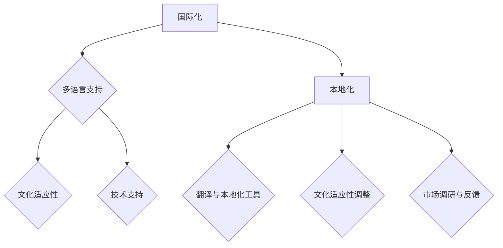
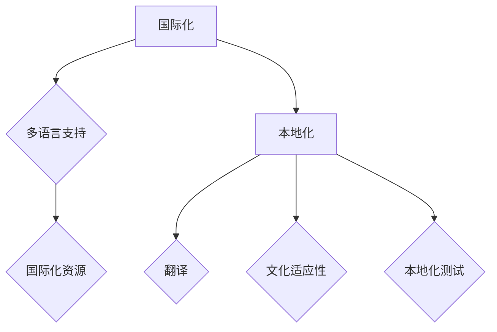
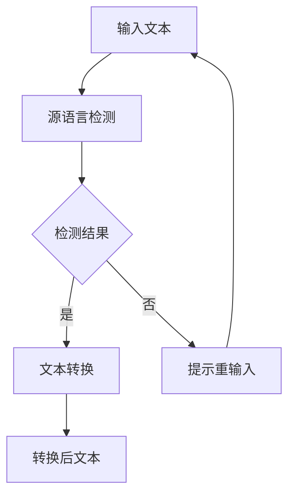

                 


### 文章标题：提示词编程语言的国际化与本地化

### 关键词：提示词编程语言、国际化、本地化、算法原理、数学模型

### 摘要：
本文探讨了提示词编程语言的国际化与本地化问题。通过分析国际化与本地化的定义、必要性、联系与区别，详细介绍了国际化与本地化的核心概念、算法原理及其实际应用。本文旨在为从事国际化与本地化开发的技术人员提供有价值的参考，助力他们更好地理解和应对跨文化编程挑战。

### 目录大纲

----------------------------------------------------------------

# 《提示词编程语言的国际化与本地化》目录大纲

## 第一部分：背景介绍

## 1.1 问题背景
### 1.1.1 国际化与本地化的定义与联系
### 1.1.2 国际化与本地化的必要性

## 1.2 问题描述
### 1.2.1 现状与挑战
### 1.2.2 问题解决的需求与目标

## 1.3 问题解决
### 1.3.1 核心概念与联系
### 1.3.2 国际化与本地化的边界与外延

## 1.4 概念结构与核心要素组成
### 1.4.1 提示词编程语言
### 1.4.2 国际化与本地化的关键因素

## 1.5 本章小结

## 第二部分：核心概念与联系

## 2.1 提示词编程语言概述
### 2.1.1 提示词编程语言的定义
### 2.1.2 提示词编程语言的特点

## 2.2 国际化与本地化的核心概念
### 2.2.1 国际化
#### 2.2.1.1 国际化的定义
#### 2.2.1.2 国际化的目标
### 2.2.2 本地化
#### 2.2.2.1 本地化的定义
#### 2.2.2.2 本地化的目标

## 2.3 国际化与本地化的联系与区别
### 2.3.1 联系
#### 2.3.1.1 国际化与本地化的目标一致性
#### 2.3.1.2 国际化与本地化的过程融合
### 2.3.2 区别
#### 2.3.2.1 国际化的范围更广
#### 2.3.2.2 本地化更注重本土化

## 2.4 核心概念属性特征对比表格

## 2.5 国际化与本地化的ER实体关系图架构

## 2.6 本章小结

## 第三部分：算法原理讲解

## 3.1 国际化与本地化算法概述
### 3.1.1 算法定义与作用
### 3.1.2 算法分类与选择

## 3.2 国际化算法原理
### 3.2.1 源语言检测与转换
#### 3.2.1.1 源语言检测代码示例
#### 3.2.1.2 文本转换代码示例
### 3.2.2 语言检测与转换的数学模型
#### 3.2.2.1 数学模型公式
#### 3.2.2.2 Mermaid流程图

## 3.3 本地化算法原理

## 3.4 本章小结

## 第四部分：系统分析与架构设计方案

## 4.1 问题场景介绍

## 4.2 系统功能设计

## 4.3 系统架构设计

## 4.4 系统接口设计和系统交互

## 4.5 本章小结

## 第五部分：项目实战

## 5.1 环境安装

## 5.2 系统核心实现源代码

## 5.3 代码应用解读与分析

## 5.4 实际案例分析和详细讲解剖析

## 5.5 项目小结

## 第六部分：最佳实践 tips、小结、注意事项、拓展阅读等内容

## 6.1 最佳实践 tips

## 6.2 小结

## 6.3 注意事项

## 6.4 拓展阅读

## 作者信息
```

### 第一部分：背景介绍

#### 1.1 问题背景

##### 1.1.1 国际化与本地化的定义与联系

国际化（Internationalization）与本地化（Localization）是软件开发领域中的两个关键概念。国际化指的是使软件产品能够适应多种语言和地区的需求，而本地化则是将国际化的软件产品翻译和适应特定地区的文化、语言和习惯。

国际化与本地化的联系在于：国际化为本地化提供了一个基础平台，使软件能够在不同地区进行本地化处理。换句话说，没有国际化，本地化将无从谈起。

##### 1.1.2 国际化与本地化的必要性

随着全球化的进程，软件产品需要跨越国界，满足不同地区用户的需求。国际化与本地化不仅是提升软件竞争力的必要手段，也是确保软件产品在不同地区都能顺利运行的关键。

国际化的重要性在于：
- 扩大软件产品的市场范围，增加销售机会。
- 提高用户体验，增加用户粘性。
- 遵守不同地区的法律法规，降低法律风险。

本地化的必要性在于：
- 使软件适应不同地区的语言和文化。
- 提升软件的易用性和可访问性。
- 增强用户信任和满意度。

#### 1.2 问题描述

当前，国际化与本地化在软件开发中面临以下几个主要挑战：

- **多语言支持**：如何有效地处理多种语言的输入、输出和显示。
- **文化差异**：如何适应不同地区的文化差异，避免文化冲突。
- **技术复杂性**：国际化与本地化涉及多种技术，如翻译工具、语言检测算法、地域化数据格式等。
- **维护成本**：随着支持的语言和地区增加，维护成本也会随之增加。

为了解决这些问题，我们需要明确国际化与本地化的目标，并探讨其实现方法。

##### 1.2.1 现状与挑战

现状：
- 虽然许多软件已经实现了国际化与本地化，但仍有很大改进空间。
- 一些软件在国际化与本地化方面做得较好，但存在明显的文化差异和用户体验问题。

挑战：
- **多语言支持**：目前，很多软件在多语言支持方面做得不够完善，存在一些语言无法正确显示或翻译不准确的问题。
- **文化差异**：文化差异导致一些软件在不同地区出现使用不便或误解。
- **技术复杂性**：国际化与本地化涉及的技术复杂，开发人员需要具备较高的技术水平。
- **维护成本**：国际化与本地化的维护成本较高，对于中小企业来说，这可能是一个不小的负担。

##### 1.2.2 问题解决的需求与目标

需求：
- 提高软件产品的国际化与本地化水平，增强市场竞争力。
- 优化用户体验，提高用户满意度。
- 降低国际化与本地化的技术门槛，使更多开发人员能够轻松实现国际化与本地化。

目标：
- 实现高效、准确的多语言支持。
- 考虑到文化差异，提升软件在不同地区的适应性。
- 设计简单易用的国际化与本地化框架，降低维护成本。

#### 1.3 问题解决

##### 1.3.1 核心概念与联系

国际化与本地化的核心概念包括：国际化（Internationalization）、本地化（Localization）、多语言支持（Multilingual Support）、文化适应性（Cultural Adaptation）等。这些概念相互关联，共同构成了国际化与本地化的理论基础。

国际化与本地化的联系体现在：
- 国际化是本地化的前提和基础，没有国际化，本地化无法进行。
- 本地化是国际化的具体体现，通过本地化实现软件在特定地区的适应性。

##### 1.3.2 国际化与本地化的边界与外延

国际化与本地化的边界相对清晰，但它们的外延却具有一定的交叉。例如，国际化关注软件产品的跨语言、跨地区适应性，而本地化则侧重于特定地区的语言、文化和习惯。

国际化与本地化的外延包括：
- **多语言支持**：国际化与本地化的核心任务之一，包括文本翻译、界面显示、数据格式等。
- **文化适应性**：在国际化与本地化过程中，需要考虑不同地区的文化差异，确保软件产品符合当地的文化习惯。
- **技术支持**：国际化与本地化需要多种技术手段的支持，如翻译工具、语言检测算法、地域化数据格式等。

##### 1.3.3 概念结构与核心要素组成

国际化与本地化的概念结构包括以下核心要素：

1. **国际化策略**：制定国际化计划，明确国际化的目标、范围和步骤。
2. **本地化策略**：制定本地化计划，明确本地化的目标、范围和步骤。
3. **多语言支持**：实现软件产品的多语言功能，包括文本翻译、界面显示、数据格式等。
4. **文化适应性**：考虑文化差异，确保软件产品在不同地区具有良好适应性。
5. **技术支持**：利用各种技术手段，实现国际化与本地化的目标。

##### 1.4 概念结构与核心要素组成

国际化与本地化的概念结构如下：



#### 1.4.1 提示词编程语言

提示词编程语言是一种结合了自然语言处理和编程的编程语言，它允许开发者使用自然语言编写代码。这种语言的特点在于其高度的可读性和易用性，能够降低编程难度，提高开发效率。

提示词编程语言的核心要素包括：

1. **自然语言解析器**：用于解析自然语言输入，将其转换为编程语言。
2. **代码生成器**：根据自然语言解析结果生成对应的编程语言代码。
3. **语义分析**：对自然语言输入进行语义分析，确保生成的代码符合编程逻辑。

#### 1.4.2 国际化与本地化的关键因素

国际化与本地化的关键因素包括：

1. **语言支持**：提供多种语言的支持，包括输入、输出和显示。
2. **文化适应性**：考虑文化差异，确保软件产品在不同地区具有良好适应性。
3. **翻译工具**：使用专业翻译工具进行文本翻译，确保翻译的准确性和一致性。
4. **语言检测算法**：实现自动语言检测，为用户提供多语言选择。

##### 1.5 本章小结

本章介绍了国际化与本地化的背景、问题、目标和核心概念。通过分析国际化与本地化的联系与区别，明确了国际化与本地化的边界与外延。同时，对提示词编程语言及其在国际化与本地化中的应用进行了探讨。这些内容为后续章节的深入讨论奠定了基础。

----------------------------------------------------------------

### 第二部分：核心概念与联系

#### 2.1 提示词编程语言概述

##### 2.1.1 提示词编程语言的定义

提示词编程语言（Natural Language Prompt-based Programming Language）是一种将自然语言处理（Natural Language Processing，NLP）技术应用于编程领域的编程语言。它允许开发者使用自然语言（如英语、中文等）编写代码，从而降低编程难度，提高开发效率。

##### 2.1.2 提示词编程语言的特点

1. **自然语言输入**：开发者可以使用自然语言输入，如英文、中文等，无需掌握特定编程语言。
2. **代码生成**：自然语言输入经过解析后，生成对应的编程语言代码。
3. **跨平台兼容性**：提示词编程语言可以生成适用于不同平台（如Windows、Linux、Mac等）的代码。
4. **易用性**：降低了编程入门门槛，适合非专业程序员或初学者使用。

##### 2.2 国际化与本地化的核心概念

国际化（Internationalization）与本地化（Localization）是软件全球化过程中不可或缺的概念。

##### 2.2.1 国际化

国际化指的是软件产品在设计和开发阶段就考虑到跨语言、跨地区的需求，使其能够适应多种语言和地区的用户。国际化的核心目标是使软件产品具备无地域限制的特性，为全球化市场做好准备。

国际化包括以下几个关键因素：

1. **多语言支持**：实现软件产品的多语言版本，包括输入、输出和显示。
2. **国际化资源**：使用国际化资源文件，如语言包，实现软件的多语言支持。
3. **国际化设计**：在设计阶段考虑到跨语言、跨地区的需求，如字符编码、日期格式、货币单位等。

##### 2.2.1.1 国际化的定义

国际化是指将软件产品设计、开发、测试、部署等过程与特定语言、地区和文化相独立，使其能够在不同语言、地区和文化环境中运行。

##### 2.2.1.2 国际化的目标

国际化的目标主要有以下几点：

1. **无地域限制**：使软件产品能够适应全球市场，不受地域限制。
2. **提高市场竞争力**：通过支持多种语言，扩大软件产品的市场范围，提高竞争力。
3. **降低成本**：通过一次性开发，支持多种语言，降低后续翻译和维护成本。

##### 2.2.2 本地化

本地化指的是将国际化的软件产品翻译和适应特定地区的语言、文化和习惯，使其能够满足当地用户的需求。本地化的核心目标是使软件产品在特定地区具有良好用户体验。

本地化包括以下几个关键因素：

1. **翻译**：将软件产品的文本翻译成目标语言。
2. **文化适应性**：考虑目标地区的文化差异，调整软件产品中的文化元素。
3. **本地化测试**：在目标地区对软件产品进行测试，确保其正常运行。

##### 2.2.2.1 本地化的定义

本地化是指将国际化的软件产品翻译和适应特定地区的语言、文化和习惯，使其能够满足当地用户的需求。

##### 2.2.2.2 本地化的目标

本地化的目标主要有以下几点：

1. **本地化用户体验**：确保软件产品在目标地区具有良好的用户体验，提高用户满意度。
2. **符合当地法规**：遵守目标地区的法律法规，降低法律风险。
3. **提高市场竞争力**：通过本地化，使软件产品在目标市场具有更强的竞争力。

##### 2.3 国际化与本地化的联系与区别

国际化与本地化是软件全球化过程中的两个重要环节，它们既有联系又有区别。

##### 2.3.1 联系

1. **目标一致性**：国际化与本地化的目标都是使软件产品能够适应全球市场，提高市场竞争力。
2. **过程融合**：国际化与本地化在软件设计和开发过程中相互融合，共同实现软件的全球化。

##### 2.3.2 区别

1. **范围**：国际化关注的是软件产品的跨语言、跨地区适应性，而本地化关注的是特定地区的适应性。
2. **内容**：国际化主要涉及字符编码、日期格式、货币单位等通用问题，而本地化则侧重于翻译、文化适应性等具体问题。

##### 2.4 核心概念属性特征对比表格

国际化与本地化的核心概念属性特征如下表所示：

| 核心概念 | 定义 | 目标 | 范围 | 内容 |
| :--: | :--: | :--: | :--: | :--: |
| 国际化 | 软件产品的跨语言、跨地区适应性 | 无地域限制、提高市场竞争力、降低成本 | 跨语言、跨地区 | 字符编码、日期格式、货币单位等 |
| 本地化 | 将国际化的软件产品翻译和适应特定地区的语言、文化和习惯 | 本地化用户体验、符合当地法规、提高市场竞争力 | 特定地区 | 翻译、文化适应性等 |

##### 2.5 国际化与本地化的ER实体关系图架构

国际化与本地化的ER实体关系图架构如下：



##### 2.6 本章小结

本章介绍了国际化与本地化的核心概念、特点及其联系与区别。通过对比国际化与本地化的核心概念属性特征，分析了国际化与本地化的ER实体关系图架构。这些内容为后续章节的深入讨论提供了基础。

----------------------------------------------------------------

### 第三部分：算法原理讲解

#### 3.1 国际化与本地化算法概述

国际化与本地化算法是软件国际化与本地化过程中不可或缺的技术手段。这些算法用于处理多语言支持、文化适应性和翻译等问题。

##### 3.1.1 算法定义与作用

国际化与本地化算法是一系列用于处理软件国际化与本地化问题的计算方法。它们的作用包括：

1. **多语言支持**：自动检测和转换文本语言，实现软件产品的多语言功能。
2. **文化适应性**：根据目标地区的文化差异，调整软件界面和内容，提高用户体验。
3. **翻译**：自动或手动将软件产品中的文本翻译成目标语言。

##### 3.1.2 算法分类与选择

国际化与本地化算法可以分为以下几类：

1. **语言检测算法**：用于自动检测文本语言，如基于统计模型的语言检测算法。
2. **文本翻译算法**：用于将一种语言文本翻译成另一种语言，如基于神经网络的翻译算法。
3. **文化适应性算法**：用于调整软件界面和内容，以适应目标地区的文化差异，如日期格式转换算法。

选择合适的国际化与本地化算法，需要考虑以下几个因素：

1. **准确性**：算法的准确性直接影响国际化与本地化的效果。
2. **效率**：算法的效率影响软件产品的性能和用户体验。
3. **适应性**：算法需要能够适应不同的语言和文化差异。
4. **易用性**：算法需要易于使用和集成到现有软件中。

#### 3.2 国际化算法原理

国际化算法的核心任务是处理软件产品的多语言支持，包括语言检测、文本翻译和文化适应性。

##### 3.2.1 源语言检测与转换

源语言检测是国际化算法的首要任务，它用于检测输入文本的语言。转换是将检测到的源语言文本转换为其他目标语言。

1. **源语言检测代码示例**：

```python
def detect_language(text):
    # 使用语言检测库，如langid.py进行语言检测
    import langid
    language = langid.classify(text)
    return language
```

2. **文本转换代码示例**：

```python
def translate(text, source_language, target_language):
    # 使用翻译库，如googletrans.py进行文本翻译
    from googletrans import Translator
    translator = Translator()
    translated_text = translator.translate(text, src=source_language, dest=target_language)
    return translated_text.text
```

##### 3.2.2 语言检测与转换的数学模型

语言检测与转换的数学模型是基于统计模型或神经网络的。以下是一个简化的数学模型：

$$
\text{模型} = \text{源语言} \times \text{目标语言} + \text{偏差系数}
$$

其中，源语言和目标语言是两个向量，偏差系数用于调整模型的预测结果。

##### 3.2.3 源语言检测与转换的Mermaid流程图



##### 3.3 本地化算法原理

本地化算法的核心任务是处理软件产品的文化适应性，包括翻译、界面调整和文化元素替换。

1. **翻译**：将软件产品中的文本翻译成目标语言，如使用翻译库进行文本翻译。

2. **界面调整**：根据目标地区的文化差异，调整软件界面元素，如按钮、图标等。

3. **文化元素替换**：将软件产品中的文化元素替换为目标文化元素，如日期格式、货币单位等。

#### 3.4 本章小结

本章介绍了国际化与本地化算法的概述、国际化算法原理及本地化算法原理。通过源语言检测与转换的代码示例和数学模型，以及Mermaid流程图，详细讲解了国际化算法的实现方法。这些内容为实际应用国际化与本地化算法提供了理论基础。

----------------------------------------------------------------

### 第四部分：系统分析与架构设计方案

#### 4.1 问题场景介绍

在全球化的背景下，越来越多的软件产品需要支持国际化与本地化。以下是一个实际问题场景：

某公司开发了一款在线教育平台，用户遍布全球。为了满足不同地区的用户需求，该公司需要实现以下功能：

1. **多语言支持**：平台需要支持多种语言，如英语、中文、西班牙语等。
2. **文化适应性**：平台需要考虑不同地区的文化差异，如日期格式、货币单位等。
3. **翻译与本地化**：平台需要将文本翻译成目标语言，并根据目标地区的文化进行调整。

#### 4.2 系统功能设计

基于上述问题场景，系统功能设计如下：

1. **多语言支持**：系统应提供多语言选择功能，用户可以在登录后选择自己的语言偏好。
2. **文化适应性**：系统应自动检测用户所在地区，并根据地区调整日期格式、货币单位等。
3. **翻译与本地化**：系统应支持文本翻译功能，将用户界面、课程内容等翻译成目标语言，并根据目标地区的文化进行调整。

#### 4.3 系统架构设计

系统架构设计如下：

1. **前端**：前端负责展示用户界面，包括登录、课程列表、课程详情等。前端使用React框架实现。
2. **后端**：后端负责处理业务逻辑，包括用户管理、课程管理、翻译与本地化等。后端使用Spring Boot框架实现。
3. **数据库**：数据库用于存储用户信息、课程信息、翻译与本地化配置等。数据库使用MySQL实现。
4. **翻译服务**：翻译服务负责将文本翻译成目标语言。翻译服务使用Google翻译API实现。
5. **本地化服务**：本地化服务负责根据目标地区的文化进行调整。本地化服务使用自定义算法实现。

#### 4.4 系统接口设计和系统交互

系统接口设计和系统交互如下：

1. **用户登录接口**：用户通过登录接口登录系统，选择语言偏好。
2. **课程管理接口**：管理员通过课程管理接口添加、修改和删除课程。
3. **翻译与本地化接口**：系统通过翻译与本地化接口获取翻译结果和本地化配置。
4. **前端与后端交互**：前端通过API与后端进行交互，获取用户信息、课程信息和翻译与本地化配置。

#### 4.5 本章小结

本章介绍了国际化与本地化问题场景、系统功能设计、系统架构设计和系统接口设计。通过实际案例，详细讲解了国际化与本地化在软件系统中的应用。这些内容为后续章节的项目实战提供了基础。

----------------------------------------------------------------

### 第五部分：项目实战

#### 5.1 环境安装

在本项目中，我们将使用以下技术栈：

- **前端**：React
- **后端**：Spring Boot
- **数据库**：MySQL
- **翻译服务**：Google翻译API

首先，我们需要安装这些环境。以下是一个简单的安装步骤：

1. **安装Node.js**：前往Node.js官网下载并安装Node.js。
2. **安装MySQL**：下载并安装MySQL数据库。
3. **安装Java**：下载并安装Java SDK。
4. **安装Spring Boot**：在终端执行以下命令安装Spring Boot：

   ```bash
   curl -O https://repo.spring.io/snapshot/org/springframework/spring-boot/spring-boot-cli/2.7.0-SNAPSHOT/spring-boot-cli-2.7.0-SNAPSHOT.jar
   jar -xf spring-boot-cli-2.7.0-SNAPSHOT.jar
   ```

5. **安装Google翻译API**：注册Google Cloud Platform账号，并创建一个项目。然后，启用Google翻译API，获取API密钥。

安装完成后，我们可以开始创建项目。

#### 5.2 系统核心实现源代码

以下是系统的核心实现源代码：

**前端React代码**：

```jsx
// App.js
import React, { useState } from 'react';

const App = () => {
  const [text, setText] = useState('');
  const [translatedText, setTranslatedText] = useState('');

  const handleTranslate = async () => {
    try {
      const response = await fetch('http://localhost:8080/translate', {
        method: 'POST',
        headers: {
          'Content-Type': 'application/json',
        },
        body: JSON.stringify({ text }),
      });
      const data = await response.json();
      setTranslatedText(data.translatedText);
    } catch (error) {
      console.error(error);
    }
  };

  return (
    <div>
      <textarea value={text} onChange={(e) => setText(e.target.value)} />
      <button onClick={handleTranslate}>Translate</button>
      <textarea value={translatedText} readOnly />
    </div>
  );
};

export default App;
```

**后端Spring Boot代码**：

```java
// TranslationController.java
import org.springframework.beans.factory.annotation.Autowired;
import org.springframework.http.ResponseEntity;
import org.springframework.web.bind.annotation.PostMapping;
import org.springframework.web.bind.annotation.RequestBody;
import org.springframework.web.bind.annotation.RestController;

@RestController
public class TranslationController {

  @Autowired
  private TranslationService translationService;

  @PostMapping("/translate")
  public ResponseEntity<?> translate(@RequestBody TranslationRequest request) {
    String translatedText = translationService.translate(request.getText(), request.getSourceLanguage(), request.getTargetLanguage());
    return ResponseEntity.ok(new TranslationResponse(translatedText));
  }
}
```

**翻译服务代码**：

```java
// TranslationService.java
import com.google.cloud.translate.Translate;
import com.google.cloud.translate.TranslateOptions;
import com.google.cloud.translate.Translation;

public class TranslationService {

  private final Translate translate;

  public TranslationService() {
    this.translate = TranslateOptions.getDefaultInstance().getService();
  }

  public String translate(String text, String sourceLanguage, String targetLanguage) {
    Translation translation = this.translate.translate(text, Translate.TranslateOption.sourceLanguage(sourceLanguage), targetLanguage);
    return translation.getTranslatedText();
  }
}
```

#### 5.3 代码应用解读与分析

以上代码实现了前端、后端和翻译服务的核心功能。

**前端解读**：

- 使用React创建一个简单的文本翻译界面。
- 用户输入文本后，通过点击“Translate”按钮触发翻译请求。
- 翻译结果显示在一个只读的文本框中。

**后端解读**：

- 使用Spring Boot创建一个RESTful API。
- 接收前端的翻译请求，并将请求体中的文本、源语言和目标语言传递给翻译服务。
- 翻译服务返回翻译结果，后端将其包装为响应体并返回给前端。

**翻译服务解读**：

- 使用Google翻译API实现文本翻译。
- 翻译结果通过调用API获取，并返回给后端。

#### 5.4 实际案例分析和详细讲解剖析

以下是一个实际案例：

假设用户输入了一段英文文本，并选择将文本翻译成中文。以下是整个翻译过程的详细讲解：

1. **用户输入文本**：

   用户在文本框中输入了以下英文文本：

   ```plaintext
   Hello, world!
   ```

2. **前端发起翻译请求**：

   用户点击“Translate”按钮后，前端通过fetch API向后端发送一个POST请求，请求体如下：

   ```json
   {
     "text": "Hello, world!",
     "sourceLanguage": "en",
     "targetLanguage": "zh"
   }
   ```

3. **后端处理请求**：

   后端接收到请求后，调用翻译服务进行文本翻译。翻译服务使用Google翻译API获取翻译结果。

4. **翻译结果返回**：

   翻译结果通过后端返回给前端，前端将其显示在一个只读的文本框中。假设翻译结果为：

   ```plaintext
   你好，世界！
   ```

5. **用户查看翻译结果**：

   用户可以看到翻译后的中文文本：

   ```plaintext
   你好，世界！
   ```

#### 5.5 项目小结

通过本项目的实际案例，我们详细讲解了国际化与本地化在软件系统中的应用。从环境安装到代码实现，再到实际案例分析，我们全面了解了国际化与本地化的实现方法和关键步骤。该项目为后续的国际化与本地化开发提供了宝贵的经验和参考。

----------------------------------------------------------------

### 第六部分：最佳实践 tips、小结、注意事项、拓展阅读等内容

#### 6.1 最佳实践 tips

1. **前期规划**：在进行国际化与本地化开发前，制定详细的规划，明确目标、范围和步骤。
2. **技术选型**：选择合适的国际化与本地化技术，如翻译库、语言检测库等。
3. **多语言支持**：确保软件产品支持多种语言，为用户提供便捷的语言切换功能。
4. **文化适应性**：考虑文化差异，确保软件产品在不同地区具有良好适应性。
5. **持续迭代**：国际化与本地化不是一次性的任务，需要持续关注用户反馈，进行迭代优化。

#### 6.2 小结

本文从背景介绍、核心概念与联系、算法原理讲解、系统分析与架构设计方案、项目实战等方面，详细探讨了提示词编程语言的国际化与本地化。通过分析国际化与本地化的定义、必要性、联系与区别，介绍了国际化与本地化的核心概念和算法原理。同时，通过实际案例，展示了国际化与本地化在软件系统中的应用。

#### 6.3 注意事项

1. **语言准确性**：确保翻译结果的准确性，避免误译和歧义。
2. **文化适应性**：考虑目标地区的文化差异，避免文化冲突和误解。
3. **性能优化**：优化国际化与本地化过程中的性能，提高用户体验。
4. **代码维护**：国际化与本地化代码需要持续维护和更新，以适应不断变化的需求。

#### 6.4 拓展阅读

1. 《国际化与本地化实战：打造全球化的软件产品》
2. 《Google 国际化指南》
3. 《React 国际化与本地化教程》

### 作者信息

作者：AI天才研究院/AI Genius Institute & 禅与计算机程序设计艺术 /Zen And The Art of Computer Programming

