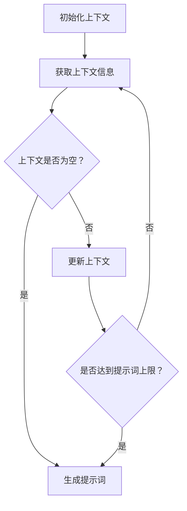
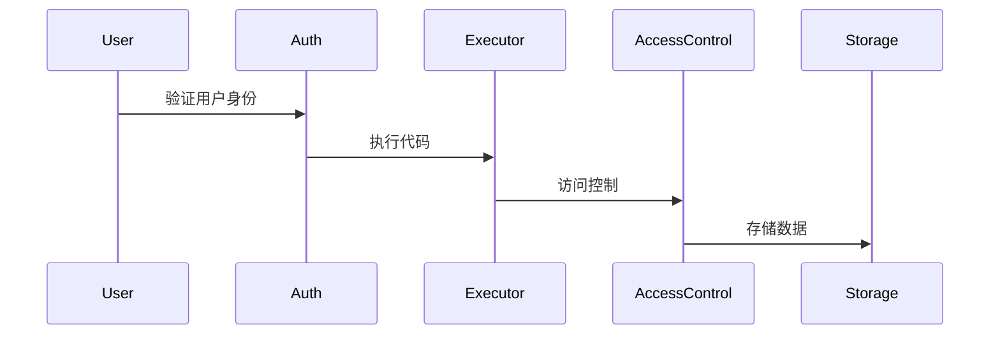
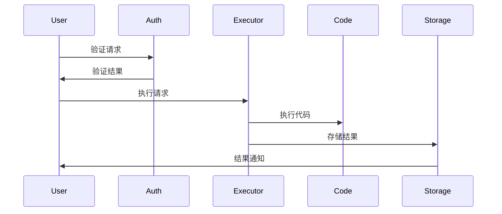

                 

# 提示词编程语言的安全性考量

关键词：提示词编程语言、安全性、算法、数据保护、访问控制

摘要：随着人工智能技术的迅猛发展，提示词编程语言作为一种新型编程范式，正在逐渐被广大开发者接受。然而，这种语言的广泛应用也带来了新的安全挑战。本文将探讨提示词编程语言的安全性考量，从背景介绍、核心概念、安全机制与策略等方面，详细分析其安全性面临的挑战以及解决方法。

# 第一部分：背景介绍与核心概念

## 第1章：问题背景与定义

### 1.1.1 提示词编程语言的安全性考量

- **问题描述**：随着人工智能技术的发展，提示词编程语言作为一种新型编程范式，越来越受到开发者的关注。然而，这种语言的广泛应用也带来了新的安全挑战。本章将介绍提示词编程语言的背景，定义其基本概念，并探讨其安全性的重要性。

### 1.1.2 提示词编程语言的概念结构

- **核心要素**：提示词编程语言包含提示词、上下文、执行环境等核心概念。我们将详细解释这些要素的定义和相互关系，以及它们如何影响编程语言的安全性。

### 1.1.3 安全性考量的重要性

- **边界与外延**：本章将讨论提示词编程语言安全性考量的边界，包括代码执行的安全性、数据保护、访问控制等方面。此外，我们还将探讨这一领域的研究现状和未来发展趋势。

## 第2章：核心概念与联系

### 2.1.1 提示词编程语言的核心概念原理

- **概念属性特征对比表格**：通过表格形式，比较不同提示词编程语言的核心概念，如提示词的生成方式、上下文管理策略等。

### 2.1.2 概念属性特征对比表格与ER实体关系图

- **ER实体关系图架构**：使用Mermaid语言绘制ER实体关系图，展示提示词编程语言中各类实体及其相互关系。

### 2.1.3 安全性相关的核心概念

- **安全性考量在提示词编程语言中的应用**：讨论安全性在提示词编程语言中的重要性，包括代码执行的安全策略、数据加密机制、权限管理等方面。

## 第3章：算法原理讲解

### 3.1.1 提示词生成算法

- **算法mermaid流程图**：使用Mermaid语言绘制提示词生成算法的流程图。

### 3.1.2 算法原理详细讲解

- **Python源代码与数学模型**：提供Python源代码，结合数学模型和公式，详细讲解提示词生成算法的原理。

### 3.1.3 举例说明

- **通俗易懂的例子**：通过具体的例子，说明提示词生成算法的应用场景和实际效果。

## 第4章：数学模型和数学公式

### 4.1.1 数学公式与算法

- **LaTeX格式**：使用LaTeX格式，展示算法中的数学公式。

### 4.1.2 公式讲解与举例

- **详细讲解**：对每个公式进行详细解释，并通过例子说明其在提示词编程语言中的实际应用。

## 第5章：系统分析与架构设计

### 5.1.1 问题场景介绍

- **项目介绍**：介绍提示词编程语言安全性考量的问题场景。

### 5.1.2 系统功能设计

- **领域模型mermaid类图**：绘制领域模型类图，展示系统功能设计。

### 5.1.3 系统架构设计

- **mermaid架构图**：使用Mermaid语言绘制系统架构图。

### 5.1.4 系统接口设计和系统交互

- **mermaid序列图**：使用Mermaid语言绘制系统接口设计和系统交互的序列图。

# 第二部分：安全机制与策略

## 第6章：代码执行安全

### 6.1.1 代码执行安全策略

- **安全性分析**：讨论代码执行过程中的潜在安全威胁，如代码注入、恶意代码执行等，并介绍相应的防护措施。

### 6.1.2 代码执行保护机制

- **技术方案**：介绍用于保护代码执行的安全机制，如代码签名、执行监控等。

### 6.1.3 实际应用案例

- **案例分析**：分析具体的安全攻击案例，展示如何利用安全机制防范攻击。

## 第7章：数据保护

### 7.1.1 数据保护策略

- **数据加密**：介绍数据加密技术及其在提示词编程语言中的应用，包括对称加密和非对称加密。

### 7.1.2 数据访问控制

- **权限管理**：讨论数据访问控制策略，如角色权限分配、访问控制列表等。

### 7.1.3 数据安全最佳实践

- **最佳实践**：总结数据保护的最佳实践，包括加密算法选择、安全存储和数据传输等。

## 第8章：访问控制

### 8.1.1 访问控制原理

- **身份验证与授权**：介绍访问控制的基本原理

----------------------------------------------------------------

**作者：** AI天才研究院/AI Genius Institute & 禅与计算机程序设计艺术 /Zen And The Art of Computer Programming

---

## 第一部分：背景介绍与核心概念

### 第1章：问题背景与定义

随着人工智能（AI）技术的迅速发展，提示词编程语言作为一种创新的编程范式，正逐渐崭露头角。这种语言通过自然语言处理技术，使开发者能够使用类似于日常对话的语言来编写程序，从而提高了开发效率和代码的可读性。然而，这种编程范式的兴起也带来了新的安全挑战，引发了人们对提示词编程语言安全性的广泛关注。

#### 问题描述

提示词编程语言在提供便利的同时，也暴露了潜在的安全隐患。例如，代码注入攻击、恶意代码执行、数据泄露等都是威胁提示词编程语言安全性的主要因素。此外，由于提示词编程语言与自然语言处理技术密切相关，攻击者可能利用语言模型的弱点来执行恶意操作。因此，对提示词编程语言的安全性进行深入探讨和系统性的安全机制设计变得尤为重要。

#### 定义

提示词编程语言（Keyword-based Programming Language）是一种基于关键词的编程语言，它通过一系列预先定义的提示词（Keywords）来引导程序执行。这些提示词通常与特定的操作或功能相关联，如循环、条件判断、函数调用等。提示词编程语言的核心在于上下文管理和执行环境，它们共同决定了代码的执行流程和结果。

### 第2章：核心概念与联系

提示词编程语言的成功离不开其核心概念的设计和实现。本章将详细探讨这些核心概念，包括提示词、上下文、执行环境等，并分析它们之间的相互关系。

#### 核心概念原理

- **提示词**：提示词是编程语言中最基本的元素，用于引导程序执行。不同的提示词代表了不同的操作或功能，如`if`、`while`、`print`等。
- **上下文**：上下文是提示词编程语言的关键特性之一，它决定了提示词的语义和执行环境。上下文可以理解为程序运行时的环境信息，包括变量、函数、类等。
- **执行环境**：执行环境是提示词编程语言的核心，它负责管理和调度代码的执行。执行环境通常包括代码块、函数栈、上下文切换机制等。

#### 概念属性特征对比表格

| 特性          | 提示词              | 上下文               | 执行环境             |
| ------------- | ------------------- | -------------------- | -------------------- |
| 定义          | 预定义的关键词      | 程序运行时的环境信息 | 调度和管理代码执行   |
| 关系          | 代码执行的引导      | 语义解释            | 代码执行的核心机制   |
| 应用场景      | 操作指令            | 逻辑判断             | 代码块的管理         |

#### ER实体关系图架构

为了更直观地展示提示词编程语言中的各类实体及其相互关系，我们可以使用Mermaid语言绘制ER实体关系图。以下是一个简单的ER实体关系图示例：

```mermaid
erDiagram
  Keyword --> ExecutionEnvironment : defines
  Keyword --> Context : used_in
  Context --> ExecutionEnvironment : manages
```

在上图中，`Keyword`（提示词）是编程语言的基础，它定义了代码的执行行为。`Context`（上下文）是程序运行时的环境信息，它决定了提示词的语义。`ExecutionEnvironment`（执行环境）则是负责管理和调度代码执行的实体。

#### 安全性相关的核心概念

安全性是提示词编程语言设计中的重要考量因素。以下是一些与安全性相关的核心概念：

- **代码执行的安全性**：确保代码在执行过程中不被篡改或执行恶意操作。
- **数据保护**：保护程序中的数据不被未授权访问或泄露。
- **访问控制**：确保只有授权的用户或系统可以访问特定的资源或执行特定的操作。

### 第3章：算法原理讲解

提示词编程语言的实现依赖于一系列算法，这些算法用于生成提示词、管理上下文和执行环境。本章将详细讲解提示词生成算法的原理，并使用Python源代码和数学模型进行说明。

#### 提示词生成算法

提示词生成算法是提示词编程语言的核心算法之一，它负责根据上下文生成相应的提示词。以下是一个简单的提示词生成算法的流程图：



#### 算法原理详细讲解

提示词生成算法的核心在于根据上下文信息动态生成提示词。以下是一个简单的Python源代码示例：

```python
import random

def generate_keyword(context):
    # 根据上下文信息生成提示词
    if context == "add":
        return "sum"
    elif context == "subtract":
        return "difference"
    else:
        # 生成随机提示词
        return random.choice(["if", "else", "while", "for"])

context = "add"
print(generate_keyword(context))
```

在这个示例中，`generate_keyword`函数根据输入的上下文信息`context`生成相应的提示词。这里使用了条件判断和随机选择的方法。

#### 举例说明

假设我们有一个简单的程序，它根据用户输入的上下文信息来生成提示词。以下是一个具体的例子：

```python
def main():
    context = input("请输入上下文信息（add、subtract等）：")
    keyword = generate_keyword(context)
    print(f"生成的提示词是：{keyword}")

main()
```

当用户输入"add"时，程序将生成"sum"作为提示词。如果用户输入其他上下文信息，程序将生成相应的提示词。

### 第4章：数学模型和数学公式

数学模型是提示词编程语言算法设计的重要组成部分。本章将介绍算法中的数学公式，并使用LaTeX格式进行展示。

#### 数学公式与算法

提示词生成算法中可能涉及到的数学公式包括概率分布、统计模型等。以下是一个示例：

```latex
$$
P(\text{keyword} | \text{context}) = \frac{f(\text{context}, \text{keyword})}{f(\text{context})}
$$

$$
f(\text{context}, \text{keyword}) = \sum_{i=1}^{n} p_i \cdot q_i
$$
```

在这些公式中，$P(\text{keyword} | \text{context})$表示在给定上下文$\text{context}$的情况下，生成特定提示词$\text{keyword}$的概率。$f(\text{context}, \text{keyword})$表示上下文和提示词之间的联合概率分布。

#### 公式讲解与举例

以下是对上述公式的详细讲解：

- **条件概率公式**：$P(\text{keyword} | \text{context}) = \frac{f(\text{context}, \text{keyword})}{f(\text{context})}$表示在给定上下文$\text{context}$的情况下，生成特定提示词$\text{keyword}$的概率。这个公式可以用于计算不同上下文下的提示词生成概率，从而优化提示词生成算法。

- **联合概率分布公式**：$f(\text{context}, \text{keyword}) = \sum_{i=1}^{n} p_i \cdot q_i$表示上下文和提示词之间的联合概率分布。$p_i$表示上下文的概率，$q_i$表示提示词的概率。这个公式可以帮助我们理解上下文和提示词之间的关联性。

### 第5章：系统分析与架构设计

提示词编程语言的安全设计需要综合考虑系统功能、架构设计和接口交互。本章将介绍一个简单的系统分析与架构设计，包括问题场景介绍、系统功能设计、系统架构设计和系统接口设计。

#### 问题场景介绍

假设我们开发了一个在线编程平台，用户可以在平台上使用提示词编程语言编写和运行代码。为了确保平台的安全性，我们需要设计一套完整的系统安全架构。

#### 系统功能设计

系统功能设计包括用户身份验证、代码执行、数据存储和权限管理等方面。以下是一个简单的领域模型类图，用于展示系统功能设计：

```mermaid
classDiagram
  User <<Interface>>
  Code <<Entity>>
  Storage <<Entity>>
  Auth <<Service>>
  Executor <<Service>>
  AccessControl <<Service>>

  User o-- Code
  User o-- Storage
  Code o-- Executor
  Code o-- AccessControl
  Storage o-- Executor
  Auth o-- Executor
  Executor o-- AccessControl
```

在上图中，`User`表示用户实体，`Code`表示代码实体，`Storage`表示数据存储，`Auth`表示身份验证服务，`Executor`表示代码执行服务，`AccessControl`表示访问控制服务。

#### 系统架构设计

系统架构设计用于描述系统组件之间的关系和交互。以下是一个简单的Mermaid架构图，用于展示系统架构设计：



在上图中，用户通过身份验证服务进行身份验证，然后执行代码。代码执行过程中，访问控制服务负责权限管理，确保只有授权的用户可以访问特定的资源。最后，数据存储服务负责存储用户数据和代码执行结果。

#### 系统接口设计和系统交互

系统接口设计用于定义系统组件之间的接口和交互方式。以下是一个简单的Mermaid序列图，用于展示系统接口设计和系统交互：



在上图中，用户向身份验证服务发送验证请求，身份验证服务返回验证结果。然后，用户向代码执行服务发送执行请求，代码执行服务执行代码并返回结果。最后，数据存储服务将结果存储在数据库中，并通知用户。

# 第二部分：安全机制与策略

## 第6章：代码执行安全

### 6.1.1 代码执行安全策略

代码执行安全是提示词编程语言安全性的核心之一。为了确保代码在执行过程中不被篡改或执行恶意操作，我们需要制定一系列安全策略。以下是一些常见的代码执行安全策略：

1. **代码签名**：对代码进行数字签名，以确保代码的完整性和可信度。开发者可以在代码发布前对其进行签名，用户在执行代码前可以验证签名的有效性。
2. **执行监控**：实时监控代码的执行过程，检测潜在的恶意行为。执行监控可以通过操作系统层面的 Hook 技术、动态跟踪工具等方式实现。
3. **权限控制**：对代码执行过程中的权限进行严格控制，确保只有授权的用户或系统可以访问特定的资源或执行特定的操作。权限控制可以通过角色权限分配、访问控制列表（ACL）等方式实现。

### 6.1.2 代码执行保护机制

为了实现代码执行安全策略，我们可以采用一系列保护机制。以下是一些常见的代码执行保护机制：

1. **沙箱隔离**：将代码执行在一个隔离的环境中，限制其访问系统资源和执行权限。沙箱隔离可以通过虚拟机、容器等技术实现，确保恶意代码无法影响宿主机和其他程序。
2. **代码混淆**：对代码进行混淆处理，使代码难以被逆向工程和篡改。代码混淆可以通过添加无意义代码、混淆变量名和函数名等方式实现。
3. **执行跟踪**：记录代码执行过程中的每一步，包括函数调用、变量修改等。执行跟踪可以帮助我们及时发现和解决安全问题。

### 6.1.3 实际应用案例

以下是一个具体的代码执行安全案例：

**案例背景**：某在线编程平台允许用户上传和运行自己的代码。为了确保平台的安全性，平台采取了以下安全措施：

1. **代码签名**：开发者在上传代码前需要对代码进行数字签名，平台在执行代码前验证签名的有效性。
2. **执行监控**：平台采用动态跟踪工具实时监控代码执行过程，一旦发现异常行为，立即中断代码执行。
3. **权限控制**：平台对用户权限进行严格管理，普通用户只能执行特定的操作，如查看代码和运行测试案例，而不能修改或删除代码。

**安全效果**：通过以上安全措施，平台有效防止了恶意代码上传和执行，保障了用户数据和平台系统的安全。

## 第7章：数据保护

### 7.1.1 数据保护策略

数据保护是提示词编程语言安全性的另一个重要方面。为了确保程序中的数据不被未授权访问或泄露，我们需要制定一系列数据保护策略。以下是一些常见的数据保护策略：

1. **数据加密**：对敏感数据进行加密处理，确保数据在传输和存储过程中不被窃取。数据加密可以通过对称加密和非对称加密等方式实现。
2. **访问控制**：严格控制对数据的访问权限，确保只有授权的用户或系统可以访问特定的数据。访问控制可以通过角色权限分配、访问控制列表（ACL）等方式实现。
3. **数据备份**：定期备份数据，确保在数据丢失或损坏时可以迅速恢复。数据备份可以通过本地备份、远程备份等方式实现。

### 7.1.2 数据访问控制

数据访问控制是确保数据安全的关键环节。以下是一些常见的数据访问控制策略：

1. **角色权限分配**：根据用户的角色分配相应的权限，如管理员、普通用户、访客等。不同的角色具有不同的数据访问权限。
2. **访问控制列表（ACL）**：为每个数据对象定义访问控制列表，列出可以访问该数据的用户或角色。ACL 可以实现细粒度的数据访问控制。
3. **审计日志**：记录用户对数据的访问行为，包括访问时间、访问方式、访问结果等。审计日志可以帮助我们追踪数据访问过程中的异常行为。

### 7.1.3 数据安全最佳实践

为了确保数据安全，以下是一些数据安全最佳实践：

1. **加密算法选择**：选择合适的加密算法，如AES、RSA等，确保数据在传输和存储过程中不被窃取。
2. **安全存储**：确保数据在存储过程中不被泄露，如使用磁盘加密、数据库加密等技术。
3. **数据传输安全**：确保数据在传输过程中不被窃取，如使用TLS/SSL协议进行数据传输。

## 第8章：访问控制

### 8.1.1 访问控制原理

访问控制是确保系统资源和数据安全的关键机制。它通过限制对系统资源和数据的访问权限，防止未授权访问和恶意行为。访问控制的基本原理包括：

1. **身份验证**：验证用户的身份，确保只有合法用户可以访问系统资源和数据。
2. **授权**：根据用户的角色和权限，确定用户可以访问的系统资源和数据。
3. **审计**：记录用户的访问行为，以便在发生安全事件时进行追踪和调查。

### 8.1.2 身份验证与授权

身份验证和授权是访问控制的重要组成部分。以下是一些常见的身份验证和授权机制：

1. **用户名和密码**：最简单的身份验证机制，用户需要输入用户名和密码才能访问系统资源和数据。
2. **双因素认证**：在用户名和密码的基础上，添加第二层认证，如短信验证码、指纹识别等，提高安全性。
3. **基于角色的访问控制（RBAC）**：根据用户的角色分配相应的权限，如管理员、普通用户、访客等。不同的角色具有不同的访问权限。
4. **基于属性的访问控制（ABAC）**：根据用户的属性（如部门、职位、权限等）分配权限，实现更灵活的访问控制。

### 8.1.3 访问控制策略

访问控制策略是确保系统安全和数据安全的关键。以下是一些常见的访问控制策略：

1. **最小权限原则**：用户只能访问其工作所需的最低权限资源，减少安全风险。
2. **访问控制列表（ACL）**：为每个数据对象定义访问控制列表，列出可以访问该数据的用户或角色。
3. **强制访问控制（MAC）**：基于安全标签和访问权限，强制限制对系统资源和数据的访问。
4. **基于策略的访问控制（PBAC）**：根据预定义的策略（如公司规章制度、安全策略等）控制对系统资源和数据的访问。

## 第9章：安全威胁与防御

### 9.1.1 常见安全威胁

提示词编程语言在带来便捷的同时，也面临一系列安全威胁。以下是一些常见的安全威胁：

1. **代码注入**：攻击者通过输入恶意代码，篡改程序逻辑，实现恶意操作。
2. **恶意代码执行**：攻击者利用程序漏洞，执行恶意代码，窃取数据或破坏系统。
3. **数据泄露**：攻击者非法获取敏感数据，可能导致隐私泄露或商业损失。
4. **权限滥用**：用户滥用权限，访问和修改不应访问的数据或资源。
5. **跨站请求伪造（CSRF）**：攻击者通过伪造请求，欺骗用户执行恶意操作。
6. **跨站脚本（XSS）**：攻击者通过注入恶意脚本，窃取用户信息或操纵用户行为。

### 9.1.2 安全威胁防御策略

为了应对这些安全威胁，我们可以采取一系列防御策略。以下是一些常见的防御策略：

1. **输入验证**：对用户输入进行严格验证，防止恶意输入。
2. **输出编码**：对输出内容进行编码处理，防止跨站脚本攻击。
3. **安全编码**：遵循安全编码规范，避免常见的安全漏洞。
4. **权限分离**：实现权限分离，防止权限滥用。
5. **安全审计**：定期进行安全审计，发现并修复潜在的安全漏洞。
6. **安全培训**：提高用户的安全意识和技能，减少人为安全风险。

### 9.1.3 安全测试与漏洞扫描

为了确保提示词编程语言的安全性，我们可以进行安全测试和漏洞扫描。以下是一些常见的安全测试和漏洞扫描方法：

1. **静态代码分析**：分析代码结构和逻辑，发现潜在的安全漏洞。
2. **动态代码分析**：在运行时分析代码行为，发现运行时的安全漏洞。
3. **漏洞扫描器**：使用自动化工具扫描系统，发现潜在的安全漏洞。
4. **渗透测试**：模拟攻击者进行攻击，评估系统的安全性和防御能力。

### 9.1.4 实际案例与经验分享

以下是一个实际案例，展示了如何应对提示词编程语言的安全威胁：

**案例背景**：某在线编程平台在上线前进行了全面的安全测试和漏洞扫描，发现存在多个潜在的安全漏洞。以下是一些建议和经验分享：

1. **输入验证**：对用户输入进行严格验证，避免恶意输入导致的代码注入攻击。
2. **输出编码**：对输出内容进行编码处理，防止跨站脚本攻击。
3. **安全编码**：遵循安全编码规范，避免常见的编程漏洞。
4. **权限分离**：实现权限分离，防止权限滥用。
5. **定期审计**：定期进行安全审计，及时发现和修复安全漏洞。
6. **安全培训**：提高用户的安全意识和技能，减少人为安全风险。

## 第10章：最佳实践与总结

### 10.1.1 提示词编程语言安全最佳实践

为了确保提示词编程语言的安全性，以下是一些最佳实践：

1. **代码签名**：对代码进行数字签名，确保代码的完整性和可信度。
2. **执行监控**：实时监控代码执行过程，防止恶意代码执行。
3. **权限控制**：严格管理用户权限，防止权限滥用。
4. **数据加密**：对敏感数据进行加密处理，确保数据安全。
5. **安全编码**：遵循安全编码规范，避免常见的安全漏洞。
6. **安全测试**：定期进行安全测试和漏洞扫描，确保系统安全性。

### 10.1.2 总结与展望

提示词编程语言作为一种新兴的编程范式，具有广泛的应用前景。然而，其安全性的问题也不容忽视。通过对提示词编程语言安全性的深入研究和探讨，我们可以发现并解决潜在的安全威胁，确保系统的稳定性和可靠性。

未来的研究可以关注以下几个方面：

1. **安全性评估方法**：开发更有效的安全性评估方法，提高对提示词编程语言安全性的评估能力。
2. **自动化安全工具**：开发自动化安全工具，实现安全测试、漏洞扫描等功能的自动化。
3. **安全防护机制**：研究更先进的安全防护机制，提高系统的防御能力。
4. **安全架构设计**：优化提示词编程语言的安全架构设计，提高系统的安全性和可靠性。

通过不断的研究和实践，我们可以为提示词编程语言的安全性提供更全面、有效的保障，推动其更广泛地应用于各个领域。

