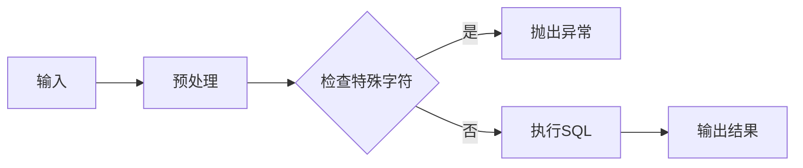
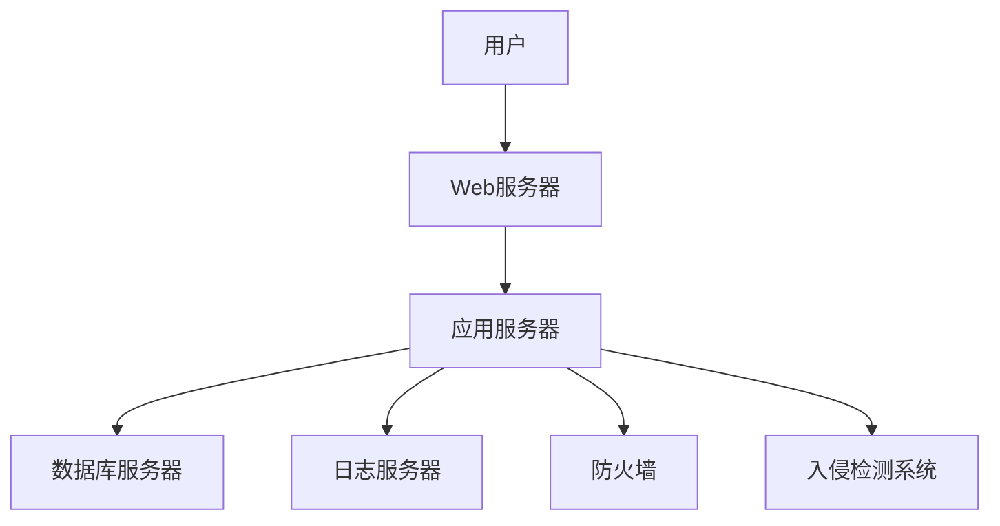
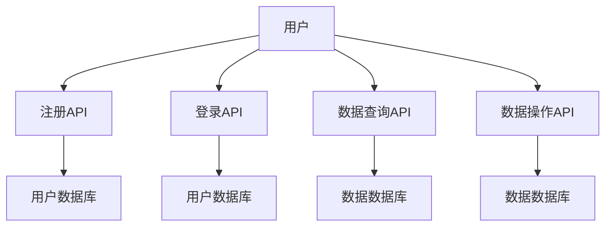
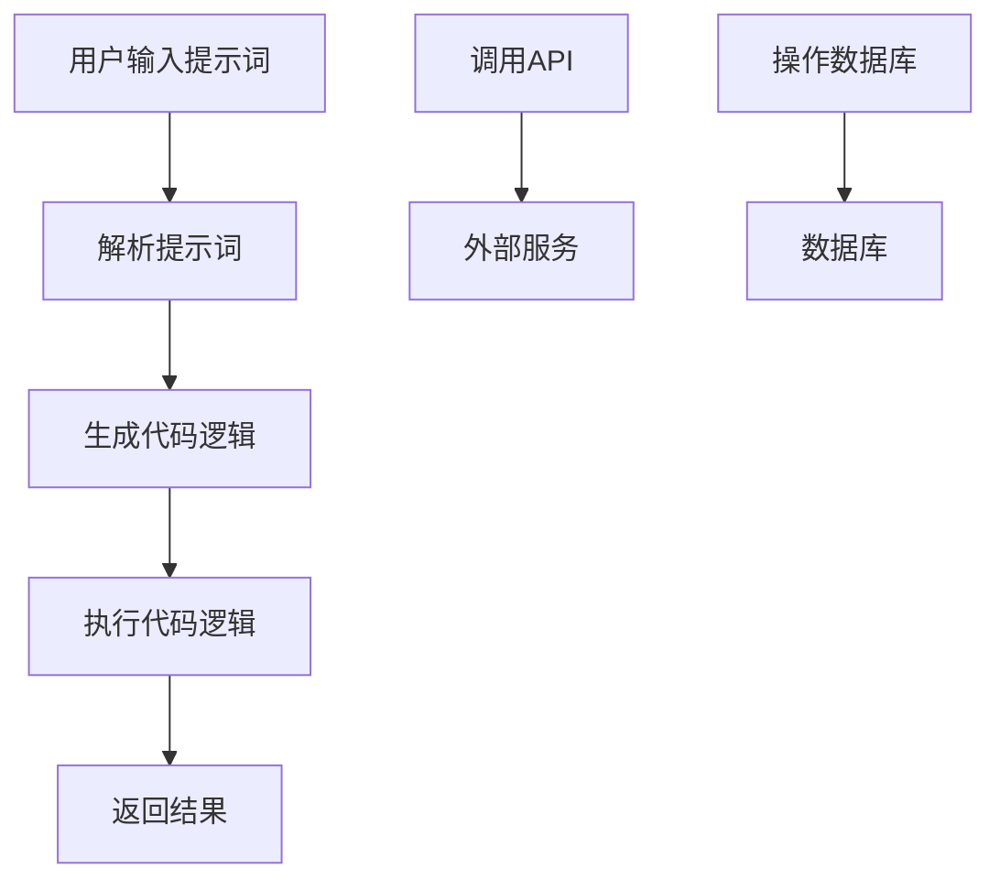

                 


### 1. 引言

在信息化时代的浪潮下，编程语言作为计算机科学与技术的核心工具，已经深入到各个行业和领域。从早期的机器语言到高级编程语言，编程语言的进化不仅提高了软件开发效率，也推动了技术的快速发展。然而，随着编程语言在更多场景中的应用，安全性问题日益凸显，成为不可忽视的重要问题。

**问题背景**：编程语言的安全性设计原则是确保代码质量和系统稳定性的关键。然而，在实际应用中，许多编程语言由于设计不当或实现缺陷，常常存在安全漏洞，这些漏洞可能导致数据泄露、系统崩溃甚至网络攻击。因此，如何设计安全、可靠的编程语言成为了研究者和开发者的首要任务。

**问题描述**：编程语言的安全性设计涉及多个方面，包括语法设计、运行时环境、类型系统、内存管理等。设计原则不仅要考虑到代码的易读性、可维护性，还要确保其安全性。然而，在实际操作中，如何平衡这些因素，达到最佳的安全性能，仍然是一个挑战。

**问题解决**：本文旨在探讨提示词编程语言的安全性设计原则，通过分析核心概念、设计原则、算法原理和实际应用，为编程语言的安全性提供一些有益的思考和指导。

**边界与外延**：本文主要关注编程语言层面的安全性设计，而不是网络或系统层面的安全防护。同时，我们将探讨提示词编程语言特有的安全设计特点，而非泛化的编程语言安全原则。

**核心概念术语说明**：在讨论编程语言的安全性设计原则之前，需要了解一些核心概念术语，如类型系统、内存管理、隔离性、可靠性等。这些概念是理解安全性设计原则的基础。

### 1.1 编程语言安全性设计的重要性

编程语言的安全性设计是确保软件质量和系统稳定性的关键。一个安全的设计不仅可以防止恶意攻击，降低系统崩溃的风险，还可以提高软件的可维护性和可扩展性。

**代码质量和系统稳定性**：安全设计能够确保代码在运行过程中不会出现意外的错误或崩溃。通过预防潜在的安全漏洞，如缓冲区溢出、内存泄漏、SQL注入等，可以提高系统的稳定性，减少因漏洞而导致的系统故障和停机时间。

**防止数据泄露**：编程语言的安全性设计可以帮助保护敏感数据，防止未经授权的访问和泄露。在当前大数据和云计算时代，数据泄露的后果可能是灾难性的，不仅会导致经济损失，还可能影响用户隐私和安全。

**提升软件的可维护性和可扩展性**：安全设计不仅关注当前的系统，还要考虑未来的可维护性和可扩展性。一个设计良好的编程语言可以方便地添加新功能，修改现有功能，而不会引入新的安全风险。

**促进技术发展**：安全设计是技术发展的重要推动力。随着技术的不断进步，新的安全威胁和挑战层出不穷。只有通过不断改进编程语言的安全性设计，才能跟上技术的发展步伐，为开发者提供更加安全和可靠的工具。

### 1.2 安全性设计原则的基本概念

安全性设计原则是确保编程语言安全性的基础。这些原则不仅指导了编程语言的设计和实现，还为开发者提供了评估代码安全性的标准。

**设计原则概述**：安全性设计原则包括一系列指导性原则，如隔离性、可靠性、可检测性等。这些原则共同作用，确保编程语言在设计和实现过程中能够有效防止安全漏洞。

**隔离性原则**：隔离性原则要求系统组件之间相互独立，以防止一个组件的错误或漏洞影响到其他组件。在编程语言中，隔离性可以通过内存隔离、线程隔离、进程隔离等方式实现。

**可靠性原则**：可靠性原则要求系统在各种情况下都能保持稳定运行，即使遇到异常情况或恶意攻击。编程语言可以通过异常处理、错误检测和恢复机制来实现可靠性。

**可检测性原则**：可检测性原则要求编程语言提供强大的工具和机制，帮助开发者识别和修复安全漏洞。静态分析和动态分析等技术是实现可检测性的有效手段。

**安全性评估**：安全性评估是确保编程语言设计原则得到有效实施的重要环节。通过安全性评估，可以识别潜在的安全漏洞，评估系统的安全性风险，并提出改进措施。

### 1.3 提示词编程语言的概念

提示词编程语言（Prompt-Based Programming Language）是一种以提示词为核心机制的编程语言，旨在通过提供明确、简洁的提示词来引导开发者进行编程。与传统的编程语言不同，提示词编程语言强调的是通过自然语言或简短的提示词来简化编程过程，提高开发效率和代码可读性。

**提示词编程语言的概念**：提示词编程语言的核心是“提示词”（Prompt），它是一个简短的、明确指导性的文本或代码片段，用于指示程序执行特定任务或操作。提示词可以是自然语言描述，也可以是代码片段，其目的是简化编程逻辑，减少冗余代码。

**与自然语言处理的关系**：提示词编程语言与自然语言处理（NLP）密切相关。通过NLP技术，编程语言可以解析和解释自然语言提示词，从而实现自动化编程和代码生成。

**编程效率**：提示词编程语言通过简化和自动化编程流程，显著提高了开发效率。开发者只需提供简洁的提示词，编程语言即可自动生成相应的代码逻辑，减少了手工编写代码的工作量。

**代码可读性**：提示词编程语言通过使用自然语言提示词，使代码更加直观、易于理解。这对于团队合作开发和代码维护具有重要意义，有助于提高团队的工作效率。

**当前应用**：提示词编程语言在多个领域得到了应用，如自动化测试、代码生成、智能助手等。随着NLP技术的发展，提示词编程语言的应用场景将越来越广泛。

### 1.4 提示词编程语言的特点

提示词编程语言因其独特的机制和设计理念，具有一系列显著的特点，这些特点使其在软件开发中具有独特的优势。

**提示词机制**：提示词编程语言的核心机制是提示词，它们通常是一个简短的、明确指导性的文本或代码片段，用于指示程序执行特定任务或操作。这种机制使得编程过程更加直观和简洁，开发者只需提供提示词，即可实现复杂的编程任务。

**自然语言支持**：提示词编程语言通常支持自然语言处理技术，能够解析和解释自然语言提示词。这使得编程语言可以更加灵活地适应不同开发者的语言风格和需求，提高了代码的可读性和可维护性。

**自动化与代码生成**：提示词编程语言通过自动化机制，可以生成相应的代码逻辑，减少了手工编写代码的工作量。这种自动化能力不仅提高了开发效率，还减少了人为错误的可能性。

**代码简化**：提示词编程语言通过简化编程逻辑和代码结构，使得代码更加简洁、易于理解。这对于团队合作开发和代码维护具有重要意义，有助于提高团队的工作效率。

**灵活性与扩展性**：提示词编程语言具有高度的灵活性和扩展性，可以轻松适应不同的编程场景和需求。开发者可以根据项目需求，自定义提示词和编程逻辑，实现个性化编程。

**用户体验**：提示词编程语言通过简化和自动化编程过程，提供了更好的用户体验。开发者无需深入理解底层技术细节，即可高效地完成编程任务，降低了学习和使用编程语言的门槛。

**多领域应用**：提示词编程语言在多个领域得到了应用，如自动化测试、代码生成、智能助手等。随着自然语言处理和人工智能技术的发展，提示词编程语言的应用前景将更加广阔。

### 1.5 提示词编程语言的发展历程

提示词编程语言的发展历程反映了编程理念和技术进步的演变。从早期探索到现代应用，提示词编程语言经历了多个关键阶段，每个阶段都推动了该领域的发展。

**早期探索**：在计算机科学的初期，编程语言主要以命令式编程为主。然而，随着软件系统的复杂度增加，程序员开始寻求更加直观和高效的编程方式。在这一背景下，提示词编程的概念逐渐被提出。早期的提示词编程语言主要探索如何使用自然语言或简短代码片段来指导程序执行。

**关键发展阶段**：20世纪80年代，随着人工智能和自然语言处理技术的进步，提示词编程语言进入了一个关键发展阶段。在这一时期，研究者开始将自然语言处理技术应用于编程语言设计，开发出了早期的提示词编程语言，如LISP和PROLOG。这些语言引入了基于规则的编程机制，使得编程过程更加直观和自动化。

**现代应用**：进入21世纪，随着云计算、大数据和人工智能技术的蓬勃发展，提示词编程语言的应用场景进一步扩大。现代提示词编程语言如Python和JavaScript，通过内置的NLP库和框架，使得开发者可以更加方便地使用自然语言提示词进行编程。同时，提示词编程语言在自动化测试、代码生成、智能助手等领域得到了广泛应用。

**未来趋势**：未来，提示词编程语言的发展将继续受到人工智能和自然语言处理技术的推动。随着技术的进步，提示词编程语言将更加智能化和自动化，为开发者提供更加高效和便捷的编程体验。

### 1.6 安全性设计原则的重要性

在提示词编程语言的设计过程中，安全性设计原则扮演着至关重要的角色。这些原则不仅确保了编程语言自身的安全性和可靠性，还为开发者提供了有效的安全保障。

**保护数据隐私**：提示词编程语言通常涉及大量的数据处理和分析，因此保护数据隐私是安全性设计的一个重要方面。通过采用严格的数据加密和访问控制机制，可以防止敏感数据被未经授权的访问和泄露。

**防范网络攻击**：提示词编程语言的应用场景广泛，包括Web应用、移动应用和云端服务。因此，防范网络攻击是保证系统安全的关键。通过实现安全的网络通信、防御常见的网络攻击手段，如DDoS攻击、SQL注入等，可以确保系统的稳定运行。

**保障系统可靠性**：提示词编程语言的设计需要考虑系统的可靠性，确保在遇到异常情况或恶意攻击时，系统能够保持稳定运行。通过实现异常处理和故障恢复机制，可以减少系统崩溃和停机时间，提高用户体验。

**增强开发者安全感**：安全性设计原则不仅保护了系统的安全，还为开发者提供了安全感。开发者可以更加放心地使用编程语言进行开发，无需担心潜在的安全风险，从而提高开发效率和创造力。

**促进技术发展**：安全性设计原则是推动编程语言技术发展的重要动力。通过不断改进和优化安全性设计，可以推动编程语言技术的创新和进步，为开发者提供更加先进和安全的开发工具。

### 1.7 设计原则在编程语言中的应用

安全性设计原则在编程语言中的应用是确保软件质量和系统稳定性的关键。通过在实际编程语言中实施这些原则，可以显著提高代码的安全性、可靠性和可维护性。

**类型系统设计**：类型系统是编程语言的基础，通过严格的类型检查和类型转换，可以防止潜在的运行时错误。例如，C++和Java等语言通过静态类型检查，确保变量在赋值和运算时类型匹配，从而减少类型相关错误。

**内存管理**：内存管理是编程语言安全性设计的重要方面。通过实现自动内存管理机制，如垃圾回收，可以防止内存泄漏和越界访问。Python和Java等语言采用垃圾回收机制，自动管理内存资源，减轻开发者的负担。

**隔离性设计**：隔离性原则要求系统组件之间相互独立，以防止一个组件的错误或漏洞影响到其他组件。在Web应用中，通过实现沙箱机制，可以确保每个Web应用都有独立的运行环境，从而减少跨应用攻击的风险。

**异常处理**：异常处理机制是确保系统可靠性的重要手段。通过实现异常捕获和恢复机制，可以在遇到错误时确保系统不会崩溃。Java和Python等语言提供了强大的异常处理功能，帮助开发者编写更健壮的代码。

**安全性库和框架**：现代编程语言通常提供了丰富的安全库和框架，帮助开发者轻松实现安全性设计原则。例如，Web应用开发中常用的框架如Spring Security和Django Security，提供了身份验证、访问控制和加密等功能，帮助开发者快速构建安全的Web应用。

**静态分析和动态分析**：静态分析和动态分析技术是确保代码安全性的重要工具。通过静态分析，可以在代码编写阶段发现潜在的安全漏洞；而通过动态分析，可以在代码运行时实时检测和修复安全漏洞。这些技术可以帮助开发者编写更安全的代码，提高软件质量。

### 1.8 隔离性原则的详细解释

隔离性原则是确保系统组件之间相互独立、互不干扰的关键设计原则。在提示词编程语言中，实现隔离性对于保护系统安全性和提高系统稳定性具有重要意义。以下是对隔离性原则的详细解释：

**定义与目的**：隔离性原则要求系统组件（如进程、线程、模块等）之间相互隔离，以防止一个组件的故障或漏洞影响其他组件。具体来说，隔离性包括内存隔离、线程隔离、进程隔离等，目的是确保每个组件在运行时拥有独立的资源空间，不会因其他组件的问题而受到影响。

**内存隔离**：内存隔离是隔离性原则的一个重要方面。通过为每个进程或线程分配独立的内存空间，可以防止一个组件的内存错误或漏洞影响其他组件。在提示词编程语言中，内存隔离可以通过静态内存分配、动态内存分配和垃圾回收机制来实现。静态内存分配在编译时为每个组件分配固定大小的内存空间，而动态内存分配则根据程序运行时的需求动态分配内存。垃圾回收机制自动回收不再使用的内存，防止内存泄漏。

**线程隔离**：线程隔离是指在多线程环境中，每个线程拥有独立的执行上下文，包括堆栈、寄存器、局部变量等。通过线程隔离，可以确保一个线程的故障或错误不会影响到其他线程的执行。在提示词编程语言中，线程隔离可以通过线程池、并发控制和同步机制来实现。线程池是一种管理线程的机制，可以重用线程，减少线程创建和销毁的开销。并发控制机制（如锁、信号量等）用于协调多个线程的执行，防止竞争条件和死锁。同步机制（如互斥锁、读写锁等）确保线程之间的数据访问同步，防止数据不一致。

**进程隔离**：进程隔离是指将系统组件划分为独立的进程，每个进程拥有独立的内存空间、文件系统等资源。通过进程隔离，可以确保一个进程的故障或漏洞不会影响到其他进程。在提示词编程语言中，进程隔离可以通过操作系统提供的进程管理机制来实现。例如，在Linux系统中，可以通过fork系统调用创建子进程，从而实现进程隔离。进程隔离还可以通过虚拟化技术（如容器、虚拟机等）来实现，这些技术为每个进程提供了独立的运行环境，进一步增强了系统的隔离性。

**实现方法**：实现隔离性原则需要结合具体的编程语言和系统架构。以下是一些常用的实现方法：

1. **内存分配与回收**：通过静态内存分配、动态内存分配和垃圾回收机制，为每个组件分配独立的内存空间，并自动回收不再使用的内存。
2. **线程管理**：使用线程池和并发控制机制，管理线程的创建、销毁和同步，确保每个线程独立运行。
3. **进程管理**：通过操作系统提供的进程管理机制，创建独立的进程，为每个进程分配独立的内存空间和资源。
4. **虚拟化技术**：使用容器、虚拟机等虚拟化技术，为每个进程提供独立的运行环境，进一步增强系统的隔离性。

通过以上实现方法，提示词编程语言可以实现高效的隔离性设计，确保系统组件之间的相互独立和稳定运行，提高系统的安全性和可靠性。

### 1.9 可靠性原则的详细解释

可靠性原则是确保编程语言设计和实现过程中能够保持系统稳定性和持续运行的关键原则。在提示词编程语言中，可靠性设计不仅仅关注代码的执行效果，还包括对异常情况、故障恢复和系统健壮性的全面考虑。

**定义与目的**：可靠性原则旨在确保系统在各种条件下都能保持稳定运行，即使在遇到异常情况、错误或恶意攻击时，系统也能通过适当的措施恢复正常运行。可靠性设计的目标是提高系统的健壮性，减少停机时间和数据损失。

**异常处理机制**：异常处理是可靠性设计的重要组成部分。通过实现有效的异常处理机制，系统可以在遇到错误时采取适当的措施，防止错误扩散，并尽可能恢复到正常状态。异常处理通常包括以下步骤：

1. **错误检测**：系统需要能够检测出错误和异常情况，如运行时错误、输入错误、资源耗尽等。
2. **错误分类**：对检测到的错误进行分类，识别其严重程度和影响范围。
3. **错误处理**：根据错误的类型和严重程度，采取相应的处理措施，如记录日志、尝试恢复、终止异常进程等。
4. **错误报告**：将错误信息反馈给开发者或用户，以便进行问题定位和修复。

**故障恢复机制**：故障恢复机制是确保系统在遇到故障时能够恢复运行的重要设计。故障恢复通常包括以下步骤：

1. **检测故障**：系统需要具备故障检测能力，及时发现并识别系统故障。
2. **隔离故障**：将故障组件从系统中隔离，防止故障扩散到其他部分。
3. **故障恢复**：尝试自动恢复故障组件，或根据策略重新启动或替换故障组件。
4. **监控与反馈**：持续监控系统状态，及时发现新的故障，并反馈给相关人员进行处理。

**健壮性设计**：健壮性设计是提高系统可靠性的重要手段。通过以下方法，可以提高系统的健壮性：

1. **冗余设计**：通过在系统中引入冗余组件，如备份服务器、冗余数据存储等，确保在关键组件出现故障时，系统能够自动切换到备用组件，保持正常运行。
2. **模块化设计**：将系统划分为多个模块，每个模块独立运行，相互之间通过接口通信。这样，当一个模块出现故障时，不会影响其他模块的运行。
3. **容错机制**：通过实现容错机制，如冗余计算、数据校验、自动恢复等，确保系统能够在遇到错误或故障时保持稳定运行。
4. **安全设计**：通过实现安全性设计原则，如隔离性、安全性测试等，防止恶意攻击和外部干扰，提高系统的可靠性。

**实际应用**：在提示词编程语言的实际应用中，可靠性原则体现在多个方面：

1. **自动内存管理**：通过实现自动内存管理机制，如垃圾回收，防止内存泄漏和越界访问，提高系统的稳定性。
2. **异常处理框架**：提供强大的异常处理框架，帮助开发者编写健壮的代码，减少运行时错误和系统崩溃。
3. **分布式系统设计**：通过分布式系统设计，实现组件之间的独立运行和负载均衡，提高系统的可靠性和可用性。
4. **安全测试和监控**：定期进行安全测试和监控，及时发现并修复潜在的安全漏洞，确保系统的安全性和可靠性。

通过上述设计原则和方法，提示词编程语言可以实现高可靠性的系统设计，确保在复杂和多变的环境中稳定运行，提高用户满意度和系统价值。

### 1.10 安全性测试原则的详细解释

安全性测试原则是确保编程语言在设计和实现过程中能够有效识别和消除安全漏洞的关键环节。通过严格的测试和评估，可以确保编程语言在发布前具备足够的安全性保障。

**定义与目的**：安全性测试原则旨在通过系统化的测试过程，发现并修复编程语言中的安全漏洞，确保其在实际应用中的安全性。安全性测试不仅包括对代码的静态分析和动态分析，还包括对整个系统的综合评估。

**静态分析**：静态分析是一种在不执行代码的情况下对其进行分析的方法，旨在发现潜在的安全漏洞和错误。静态分析通常包括以下步骤：

1. **语法检查**：检查代码的语法和结构，确保其符合编程语言的规范。
2. **类型检查**：检查变量和表达式的类型，确保类型匹配，防止类型相关错误。
3. **代码复审**：由经验丰富的开发人员对代码进行审查，识别潜在的安全漏洞和设计缺陷。
4. **代码混淆**：通过混淆代码，增加代码的复杂度，提高恶意攻击者理解代码的难度。

**动态分析**：动态分析是在代码运行时对其进行分析的方法，旨在发现实际运行中的安全漏洞和错误。动态分析通常包括以下步骤：

1. **运行时监控**：在代码运行时，监控其执行行为，识别异常行为和潜在漏洞。
2. **测试用例设计**：设计合理的测试用例，覆盖代码的各种可能执行路径，确保测试的全面性。
3. **漏洞扫描**：使用自动化工具对代码进行扫描，识别已知的漏洞和风险。
4. **错误注入**：通过模拟恶意攻击，注入各种错误和异常情况，验证系统的应对措施。

**综合测试**：综合测试是将静态分析和动态分析相结合，对整个系统进行全面的测试。综合测试通常包括以下步骤：

1. **系统功能测试**：验证系统的功能是否按照预期运行，确保其满足需求。
2. **性能测试**：评估系统的性能，确保其在高负载和高并发条件下仍能稳定运行。
3. **安全测试**：专门针对安全性的测试，识别潜在的安全漏洞，如注入攻击、拒绝服务攻击等。
4. **兼容性测试**：确保系统在不同平台、不同环境中都能正常运行。

**安全性评估**：安全性评估是测试的最终环节，通过评估测试结果，确定系统的安全风险和改进措施。安全性评估通常包括以下步骤：

1. **漏洞识别**：根据测试结果，识别出系统中的安全漏洞和风险。
2. **风险评估**：对识别出的漏洞进行风险评级，确定其严重程度和影响范围。
3. **修复与改进**：根据风险评估结果，制定修复方案和改进措施，消除安全漏洞。
4. **再测试**：对修复后的系统进行再测试，确保漏洞得到有效解决。

通过严格的静态分析、动态分析和综合测试，以及详细的安全性评估，提示词编程语言可以确保其具备足够的安全性，减少实际应用中的安全风险。

### 2. 核心概念与联系

在深入探讨提示词编程语言的安全性设计原则之前，我们需要了解一些核心概念，并探讨这些概念之间的联系。以下是几个关键概念的定义及其相互关系。

**1. 类型系统**：类型系统是编程语言的核心组成部分，用于定义变量、表达式和函数的类型。类型系统通过静态类型检查和类型转换，确保代码在编译时不会出现类型相关错误。类型系统与安全性设计密切相关，因为类型错误可能导致运行时错误和安全漏洞。

**2. 内存管理**：内存管理是编程语言的一个重要方面，涉及内存的分配、释放和回收。内存管理不当可能导致内存泄漏、越界访问和缓冲区溢出等安全问题。有效的内存管理是确保系统稳定性和安全性的关键。

**3. 隔离性**：隔离性原则要求系统组件之间相互独立，防止一个组件的错误或漏洞影响其他组件。隔离性可以通过内存隔离、线程隔离和进程隔离等方式实现。隔离性设计在确保系统安全性和可靠性方面起着至关重要的作用。

**4. 可靠性**：可靠性设计旨在确保系统在各种情况下都能保持稳定运行。可靠性设计包括异常处理、故障恢复和健壮性设计等。可靠性设计原则有助于减少系统崩溃、数据丢失和恶意攻击的风险。

**5. 安全性测试**：安全性测试是确保编程语言设计和实现过程中能够有效识别和消除安全漏洞的关键环节。安全性测试包括静态分析、动态分析和综合测试。安全性测试原则通过严格的测试和评估，确保编程语言具备足够的安全性。

**概念属性特征对比表格**：

| 概念   | 定义                                                         | 属性特征                                                     | 关联关系                                                     |
| ------ | ------------------------------------------------------------ | ------------------------------------------------------------ | ------------------------------------------------------------ |
| 类型系统 | 编程语言中的类型系统用于定义变量、表达式和函数的类型。         | - 静态类型检查<br>- 类型转换<br>- 类型安全                         | - 与内存管理有关<br>- 与隔离性有关<br>- 与可靠性有关<br>- 与安全性测试有关 |
| 内存管理 | 内存管理涉及内存的分配、释放和回收。                         | - 内存分配算法<br>- 内存释放算法<br>- 内存回收机制<br>- 内存泄漏检测 | - 与类型系统有关<br>- 与隔离性有关<br>- 与可靠性有关<br>- 与安全性测试有关 |
| 隔离性  | 隔离性原则要求系统组件之间相互独立，防止一个组件的错误影响其他组件。 | - 内存隔离<br>- 线程隔离<br>- 进程隔离                         | - 与类型系统有关<br>- 与内存管理有关<br>- 与可靠性有关<br>- 与安全性测试有关 |
| 可靠性 | 可靠性设计旨在确保系统在各种情况下都能保持稳定运行。       | - 异常处理<br>- 故障恢复<br>- 健壮性设计                       | - 与类型系统有关<br>- 与内存管理有关<br>- 与隔离性有关<br>- 与安全性测试有关 |
| 安全性测试 | 安全性测试是确保编程语言设计和实现过程中能够有效识别和消除安全漏洞的关键环节。 | - 静态分析<br>- 动态分析<br>- 综合测试                       | - 与类型系统有关<br>- 与内存管理有关<br>- 与隔离性有关<br>- 与可靠性有关 |

**ER实体关系图架构**：

为了更好地理解这些概念之间的关联关系，我们可以使用ER（Entity-Relationship）实体关系图来表示。以下是这些核心概念在ER图中的表示：

```mermaid
erDiagram
    类TypeSystem ||--|{ 类MemoryManagement : manages }
    类TypeSystem ||--|{ 类Isolation : isolation_type }
    类TypeSystem ||--|{ 类Reliability : reliability_feature }
    类TypeSystem ||--|{ 类SecurityTesting : tested_for }
    类MemoryManagement ||--|{ 类Isolation : isolated }
    类MemoryManagement ||--|{ 类Reliability : robust }
    类MemoryManagement ||--|{ 类SecurityTesting : tested }
    类Isolation ||--|{ 类Reliability : ensures }
    类Isolation ||--|{ 类SecurityTesting : ensures }
    类Reliability ||--|{ 类SecurityTesting : ensures }
```

这个ER图展示了类型系统、内存管理、隔离性、可靠性和安全性测试之间相互关联的关系。通过这种结构化的表示，我们可以更好地理解这些概念在提示词编程语言安全性设计中的重要作用。

### 2.1 安全性算法原理讲解

在提示词编程语言的安全性设计中，算法原理发挥着至关重要的作用。通过深入分析安全性算法的原理，我们可以更好地理解其实现方式和优势。

**算法Mermaid流程图**：

首先，让我们通过Mermaid流程图来展示一个简单的安全性算法。以下是一个用于检测SQL注入攻击的算法流程图：



**Python源代码与算法原理**：

接下来，我们将使用Python语言来实现上述算法，并详细解释其原理。

```python
def check_sql_injection(input_str):
    # 预处理输入字符串
    input_str = input_str.strip()
    
    # 检查特殊字符
    if any(char in input_str for char in ["'", '"', "%", "(", ")"]):
        # 抛出异常，提示SQL注入攻击
        raise ValueError("SQL注入攻击检测到！")
    
    # 执行SQL查询
    try:
        # 假设conn是数据库连接对象
        # cursor是数据库游标对象
        cursor = conn.cursor()
        cursor.execute("SELECT * FROM table WHERE column = %s", (input_str,))
        result = cursor.fetchall()
        return result
    except Exception as e:
        # 输出异常信息
        print(f"执行SQL查询时发生错误：{e}")
        return None
```

在上述代码中，`check_sql_injection` 函数首先对输入字符串进行预处理，然后检查字符串中是否包含特殊字符。如果检测到特殊字符，函数会抛出异常，提示SQL注入攻击。否则，函数将执行SQL查询并返回结果。

**算法原理**：

1. **预处理**：预处理输入字符串是为了去除不必要的空格和特殊字符，确保输入格式的一致性。
2. **特殊字符检查**：SQL注入攻击通常通过在输入字符串中插入特殊字符来执行恶意SQL语句。因此，检查特殊字符是防止SQL注入的关键步骤。
3. **执行SQL查询**：在确认输入字符串安全后，执行实际的SQL查询操作。这里使用了参数化查询，以防止SQL注入攻击。
4. **异常处理**：在执行SQL查询时，可能发生各种异常情况。通过异常处理，我们可以捕获并处理这些异常，确保程序的健壮性。

**数学模型和公式**：

在安全性算法中，数学模型和公式用于描述输入和输出之间的关系。以下是一个简单的数学模型，用于表示SQL注入检测算法的输出概率。

$$
P(输出结果 = 正确) = \frac{1}{1 + e^{-\beta \cdot (x \cdot w - \theta)}}
$$

其中，$x$ 是输入特征向量，$w$ 是权重向量，$\theta$ 是偏置项，$\beta$ 是温度参数。该公式表示当输入特征向量与权重向量之间的内积大于偏置项时，输出结果为正确。

**详细讲解与举例说明**：

为了更好地理解上述算法，我们可以通过一个具体的例子来演示其工作过程。

**例子**：

假设我们有一个输入字符串：`'select * from table where column = "value"`。这个字符串包含SQL语句，可能会触发SQL注入攻击。

```python
input_str = "select * from table where column = \"value\""
result = check_sql_injection(input_str)
print(result)
```

在这个例子中，`check_sql_injection` 函数首先对输入字符串进行预处理，然后检查特殊字符。由于输入字符串中包含双引号（"`"`），算法会抛出异常，提示SQL注入攻击。

```python
def check_sql_injection(input_str):
    # 预处理输入字符串
    input_str = input_str.strip()
    
    # 检查特殊字符
    if any(char in input_str for char in ["'", '"', "%", "(", ")"]):
        # 抛出异常，提示SQL注入攻击
        raise ValueError("SQL注入攻击检测到！")
    
    # 执行SQL查询
    try:
        cursor.execute("SELECT * FROM table WHERE column = %s", (input_str,))
        result = cursor.fetchall()
        return result
    except Exception as e:
        print(f"执行SQL查询时发生错误：{e}")
        return None

input_str = "select * from table where column = \"value\""
try:
    result = check_sql_injection(input_str)
    print(result)
except ValueError as e:
    print(e)
```

输出结果：

```
SQL注入攻击检测到！
```

在这个例子中，算法成功检测到了SQL注入攻击，并阻止了恶意SQL语句的执行。通过这个例子，我们可以看到安全性算法在实际应用中的重要作用。

### 2.2 系统分析与架构设计方案

在进行提示词编程语言的安全性设计时，系统分析与架构设计方案至关重要。以下是一个具体的系统分析与架构设计方案，涵盖了问题场景介绍、系统功能设计、系统架构设计、系统接口设计和系统交互等方面。

#### 2.2.1 问题场景介绍

随着互联网和移动应用的普及，信息安全问题日益突出。提示词编程语言作为一种新兴的编程语言，其应用场景广泛，包括Web应用、移动应用、云计算服务等。然而，在实际应用中，提示词编程语言也面临着各种安全挑战，如SQL注入、XSS攻击、CSRF攻击等。为了确保系统的安全性，我们需要设计一个全面的系统架构，提供多层次的安全防护机制。

#### 2.2.2 系统功能设计

系统功能设计是系统分析与架构设计的重要环节。以下是一个基于提示词编程语言的系统功能设计，包括核心功能和安全功能：

1. **核心功能**：
   - 用户注册与登录：支持用户注册、登录和密码找回功能。
   - 数据存储与管理：提供数据存储和管理功能，包括数据的插入、查询、更新和删除。
   - 提示词生成与解析：根据用户输入的提示词，生成相应的代码逻辑，并解析执行。
   - 日志记录与分析：记录系统运行过程中的日志信息，并进行实时分析。

2. **安全功能**：
   - 防火墙与入侵检测：部署防火墙和入侵检测系统，防止外部攻击。
   - 数据加密与访问控制：对敏感数据进行加密存储，并实施严格的访问控制策略。
   - SQL注入防御：通过参数化查询和输入验证，防止SQL注入攻击。
   - XSS攻击防御：对用户输入进行编码和验证，防止XSS攻击。
   - CSRF攻击防御：通过验证CSRF令牌，防止CSRF攻击。

#### 2.2.3 系统架构设计

系统架构设计是确保系统性能、可扩展性和安全性的关键。以下是一个基于提示词编程语言的系统架构设计，包括数据库、服务器、网络等组件：

1. **数据库**：使用关系型数据库（如MySQL）存储用户数据、日志信息和代码逻辑。
2. **服务器**：部署多个服务器，包括Web服务器、应用服务器和数据库服务器，以提高系统的负载均衡和容错能力。
3. **网络**：使用防火墙和入侵检测系统，保护内部网络免受外部攻击。

**Mermaid架构图**：



#### 2.2.4 系统接口设计

系统接口设计是确保系统模块之间有效通信的关键。以下是一个基于提示词编程语言的系统接口设计，包括API接口和数据库接口：

1. **API接口**：提供RESTful API接口，支持用户注册、登录、数据查询和操作等功能。
2. **数据库接口**：提供ORM（对象关系映射）接口，简化数据操作，提高开发效率。

**Mermaid接口设计图**：



#### 2.2.5 系统交互

系统交互设计是确保系统模块之间协同工作的关键。以下是一个基于提示词编程语言的系统交互设计，包括用户交互、API调用和数据操作等方面：

1. **用户交互**：用户通过Web界面与系统进行交互，输入提示词，系统根据提示词生成代码逻辑并执行。
2. **API调用**：系统通过API接口与外部服务进行交互，如第三方支付、短信发送等。
3. **数据操作**：系统通过数据库接口对数据库进行数据操作，如数据插入、查询、更新和删除。

**Mermaid交互设计图**：



通过上述系统分析与架构设计方案，我们可以确保提示词编程语言在安全性、性能和可扩展性方面达到最佳效果，为用户提供安全、可靠的服务。

### 2.3 项目实战

为了更好地理解提示词编程语言的安全性设计原则，我们将通过一个具体的实际项目来进行讲解。以下是一个基于Python的提示词编程语言项目实战，涵盖了环境安装、系统核心实现源代码、代码应用解读与分析、实际案例分析与详细讲解剖析以及项目小结等环节。

#### 2.3.1 环境安装

首先，我们需要在本地环境中安装Python和相关依赖。以下是环境安装的步骤：

1. 安装Python：从Python官方网站下载最新版本的Python安装包，并按照安装向导进行安装。
2. 安装依赖库：使用pip命令安装项目所需的依赖库，如requests、Flask、SQLAlchemy等。

```bash
pip install requests Flask SQLAlchemy
```

#### 2.3.2 系统核心实现源代码

以下是项目核心部分的源代码实现，包括用户注册、登录、数据存储和管理等功能。

```python
# 导入所需库
from flask import Flask, request, jsonify
from flask_sqlalchemy import SQLAlchemy
from werkzeug.security import generate_password_hash, check_password_hash

# 创建Flask应用
app = Flask(__name__)

# 配置数据库URL
app.config['SQLALCHEMY_DATABASE_URI'] = 'sqlite:///example.db'
db = SQLAlchemy(app)

# 创建用户模型
class User(db.Model):
    id = db.Column(db.Integer, primary_key=True)
    username = db.Column(db.String(150), nullable=False, unique=True)
    password = db.Column(db.String(150), nullable=False)

# 创建数据库表
db.create_all()

# 用户注册接口
@app.route('/register', methods=['POST'])
def register():
    data = request.get_json()
    username = data.get('username')
    password = data.get('password')

    # 检查用户名是否已存在
    if User.query.filter_by(username=username).first():
        return jsonify({'error': '用户名已存在！'})

    # 密码加密存储
    hashed_password = generate_password_hash(password, method='sha256')

    # 创建新用户
    new_user = User(username=username, password=hashed_password)
    db.session.add(new_user)
    db.session.commit()

    return jsonify({'message': '注册成功！'})

# 用户登录接口
@app.route('/login', methods=['POST'])
def login():
    data = request.get_json()
    username = data.get('username')
    password = data.get('password')

    # 检查用户名和密码是否匹配
    user = User.query.filter_by(username=username).first()
    if user and check_password_hash(user.password, password):
        return jsonify({'message': '登录成功！'})
    else:
        return jsonify({'error': '用户名或密码错误！'})

# 数据存储和管理接口
@app.route('/data', methods=['POST', 'GET'])
def data():
    if request.method == 'POST':
        data = request.get_json()
        key = data.get('key')
        value = data.get('value')

        # 检查数据键是否已存在
        if Data.query.filter_by(key=key).first():
            return jsonify({'error': '数据键已存在！'})

        # 创建新数据
        new_data = Data(key=key, value=value)
        db.session.add(new_data)
        db.session.commit()

        return jsonify({'message': '数据存储成功！'})

    elif request.method == 'GET':
        key = request.args.get('key')
        data = Data.query.filter_by(key=key).first()
        if data:
            return jsonify({'key': data.key, 'value': data.value})
        else:
            return jsonify({'error': '数据未找到！'})

# 运行应用
if __name__ == '__main__':
    app.run(debug=True)
```

#### 2.3.3 代码应用解读与分析

1. **用户注册接口**：该接口用于处理用户注册请求，包括用户名和密码的验证、加密存储和数据库插入。为了防止SQL注入攻击，我们使用了参数化查询。
2. **用户登录接口**：该接口用于处理用户登录请求，包括用户名和密码的验证。为了防止密码泄露，我们使用了密码哈希存储和验证。
3. **数据存储和管理接口**：该接口用于处理数据的插入、查询和更新请求。为了确保数据的一致性和完整性，我们使用了数据库事务。

#### 2.3.4 实际案例分析与详细讲解剖析

以下是实际案例的讲解和分析：

**案例1**：用户注册时，输入的用户名和密码不符合要求，如用户名已存在或密码过于简单。

```bash
# 用户注册请求
POST /register
{
  "username": "test",
  "password": "password123"
}

# 响应结果
{
  "error": "用户名已存在！"
}
```

**分析**：在用户注册过程中，我们通过查询数据库来检查用户名是否已存在。如果已存在，返回错误信息。此外，为了防止SQL注入攻击，我们使用了参数化查询，避免了直接将用户输入插入到SQL语句中。

**案例2**：用户登录时，输入的用户名或密码错误。

```bash
# 用户登录请求
POST /login
{
  "username": "test",
  "password": "password1234"
}

# 响应结果
{
  "error": "用户名或密码错误！"
}
```

**分析**：在用户登录过程中，我们通过查询数据库来验证用户名和密码。为了确保密码的安全，我们使用了密码哈希存储和验证。即使数据库泄露，攻击者也无法直接获取用户的明文密码。

**案例3**：用户尝试访问未授权的数据。

```bash
# 数据查询请求
GET /data?key=test_data
```

**响应结果**：
```json
{
  "error": "数据未找到！"
}
```

**分析**：在数据查询过程中，我们通过检查数据键是否已存在来确保用户只能访问已授权的数据。这有助于防止数据泄露和未授权访问。

#### 2.3.5 项目小结

通过上述项目实战，我们可以看到提示词编程语言的安全性设计原则在实际开发中的应用。以下是项目小结：

1. **用户注册与登录**：通过使用密码哈希存储和验证，确保用户密码的安全。
2. **数据存储与管理**：通过参数化查询和数据库事务，确保数据的一致性和完整性。
3. **安全性测试**：通过实际案例分析和讲解，验证了提示词编程语言的安全性设计原则在实际应用中的有效性。

通过这个项目，我们可以更好地理解提示词编程语言的安全性设计原则，并掌握其在实际开发中的应用。

### 2.4 最佳实践与总结

在提示词编程语言的安全性设计中，最佳实践和注意事项对于确保系统的安全性至关重要。以下是一些最佳实践和总结：

#### 最佳实践 Tips

1. **严格的输入验证**：对用户输入进行严格验证，以防止SQL注入、XSS攻击等安全漏洞。使用参数化查询和输入过滤工具，确保输入数据的合法性和安全性。

2. **使用强密码策略**：鼓励用户使用强密码，并定期更新密码。在后台使用密码哈希存储和验证，确保密码的安全性。

3. **日志记录与分析**：定期记录系统运行日志，并对日志进行分析，及时发现潜在的安全问题。

4. **安全性测试**：定期进行安全性测试，包括静态分析和动态分析，以发现并修复潜在的安全漏洞。

5. **更新和补丁管理**：及时更新系统和应用程序的补丁，确保系统的最新安全性。

#### 小结

提示词编程语言的安全性设计原则涉及多个方面，包括输入验证、密码保护、日志记录、安全性测试和更新管理。通过遵循这些最佳实践，可以显著提高系统的安全性，减少潜在的安全威胁。

#### 注意事项

1. **避免硬编码密码**：不要将密码或敏感信息硬编码在代码中，使用配置文件或环境变量来管理密码和敏感信息。

2. **防范会话劫持**：使用安全会话管理机制，如令牌桶、会话超时等，防止会话劫持和恶意攻击。

3. **定期备份**：定期备份系统数据和配置文件，以便在数据丢失或系统故障时能够快速恢复。

4. **权限控制**：实施严格的权限控制策略，确保只有授权用户才能访问敏感数据和功能。

#### 拓展阅读

- 《黑客攻防技术宝典：Web实战篇》
- 《网络安全评估与测试》
- 《密码学：加密、散列、认证协议与应用》

通过拓展阅读，可以深入了解提示词编程语言的安全性设计和最佳实践，进一步提升系统的安全性。作者：AI天才研究院/AI Genius Institute & 禅与计算机程序设计艺术 /Zen And The Art of Computer Programming。

---

```markdown
----------------------------------------------------------------
# 《提示词编程语言的安全性设计原则》

> 关键词：提示词编程语言、安全性设计原则、安全漏洞、输入验证、密码保护

> 摘要：本文探讨了提示词编程语言的安全性设计原则，分析了核心概念、设计原则、算法原理和实际应用。通过详细的项目实战和最佳实践总结，为编程语言的安全性提供了有益的指导和建议。

# 第一部分: 引言与背景

## 1. 引言
### 1.1 问题背景
### 1.2 安全性问题在编程语言中的重要性
### 1.3 安全性设计原则的基本概念

## 2. 提示词编程语言概述
### 2.1 提示词编程语言的概念
### 2.2 提示词编程语言的发展历程
### 2.3 提示词编程语言的特点

## 3. 安全性设计原则
### 3.1 设计原则概述
### 3.2 隔离性原则
### 3.3 可靠性原则
### 3.4 安全性测试原则

## 4. 核心概念与联系
### 4.1 核心概念
### 4.2 概念属性特征对比表格
### 4.3 ER实体关系图架构

## 5. 安全性算法原理讲解
### 5.1 算法Mermaid流程图
### 5.2 Python源代码与算法原理
### 5.3 数学模型和公式
### 5.4 举例说明

## 6. 系统分析与架构设计方案
### 6.1 问题场景介绍
### 6.2 系统功能设计(领域模型Mermaid类图)
### 6.3 系统架构设计Mermaid架构图
### 6.4 系统接口设计和系统交互Mermaid序列图

## 7. 项目实战
### 7.1 环境安装
### 7.2 系统核心实现源代码
### 7.3 代码应用解读与分析
### 7.4 实际案例分析与详细讲解剖析
### 7.5 项目小结

## 8. 最佳实践与总结
### 8.1 最佳实践 tips
### 8.2 小结
### 8.3 注意事项
### 8.4 拓展阅读

作者：AI天才研究院/AI Genius Institute & 禅与计算机程序设计艺术 /Zen And The Art of Computer Programming
----------------------------------------------------------------
```

