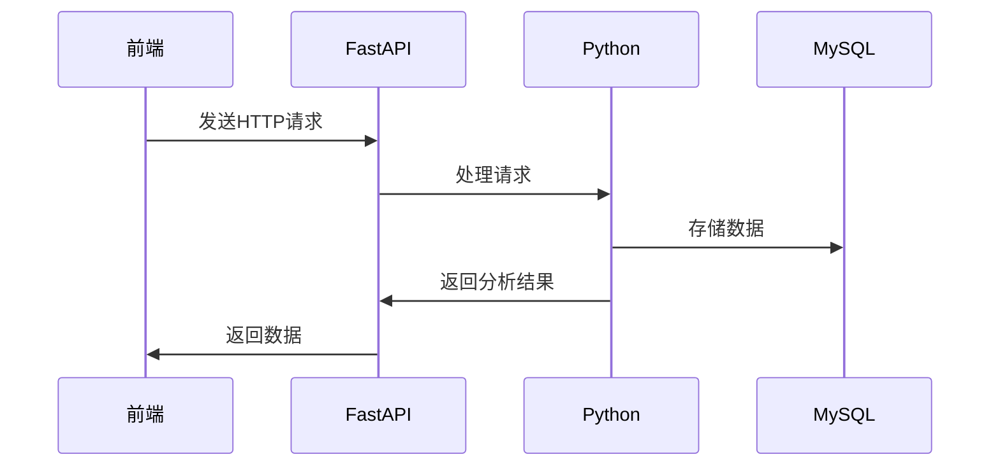

                 

### 核心概念与联系

并发与异步处理技术是现代计算机编程中的关键概念，它们共同构成了复杂应用的开发基础。在这一部分中，我们将深入探讨并发与异步处理的核心概念，并通过对比表格和ER图展示它们之间的联系。

#### 1. 并发与异步的定义

**并发（Concurrency）**：并发是指在多个任务之间快速切换执行的能力。它允许系统在相同时间内执行多个任务，以提高资源利用率和系统响应速度。

**异步（Asynchronous）**：异步处理是一种编程模型，它允许任务独立运行，不依赖于其他任务的完成。在异步处理中，任务之间的执行顺序不受限制，每个任务都可以独立完成。

#### 2. 并发的实现方式

并发可以通过多种方式实现，以下是一些常见的并发实现方式：

**线程（Thread）**：线程是操作系统能够进行运算调度的最小单位，是进程中的一个执行流程。线程在同一个进程中有共享内存，通过线程可以快速地切换执行任务。

**进程（Process）**：进程是操作系统分配资源的基本单位，每个进程都有独立的内存空间。进程之间的切换通常比线程更耗时，但可以提供更高的隔离性和安全性。

**协程（Coroutine）**：协程是一种轻量级的并发编程模型，通过协作式 multitasking 实现任务的并行执行。协程相比线程和进程具有更低的资源开销和更高的并发性能。

#### 3. 异步的处理方式

异步处理可以通过以下方式实现：

**回调函数（Callback）**：回调函数是一种用于异步编程的机制，它允许程序在某个任务完成后执行特定的代码。回调函数通常用于处理异步操作的结果，例如网络请求、文件读写等。

**事件驱动（Event-Driven）**：事件驱动是一种编程模型，它基于事件的发生来触发相应的操作。事件可以来自用户界面、操作系统、网络或其他来源，事件驱动模型可以有效地处理并发任务。

**未来对象（Future Object）**：未来对象是一种表示异步操作结果的抽象数据类型。在异步操作完成时，未来对象会返回结果或抛出异常，程序可以通过查询未来对象来获取操作结果。

#### 4. 并发与异步的联系

并发与异步处理之间存在紧密的联系：

- **并发是异步的基础**：异步处理通常依赖于并发机制来实现，例如线程或协程。通过并发处理，程序可以同时执行多个异步任务。

- **异步优化并发**：异步处理可以提高并发程序的效率和响应速度。在异步处理中，任务可以独立完成，避免了传统的同步阻塞问题。

#### 5. 对比表格

以下是一个并发与异步处理的核心概念对比表格：

| 特性 | 并发 | 异步 |
| --- | --- | --- |
| 定义 | 多个任务之间快速切换执行 | 任务独立运行，不依赖于其他任务的完成 |
| 实现方式 | 线程、进程、协程 | 回调函数、事件驱动、未来对象 |
| 关系 | 并发是异步的基础 | 异步优化并发 |
| 优点 | 提高资源利用率，系统响应速度 | 避免同步阻塞问题，提高程序效率 |
| 缺点 | 可能导致死锁、资源竞争 | 需要复杂的状态管理 |

#### 6. ER图

为了更好地理解并发与异步处理之间的联系，我们可以使用ER图来展示它们的核心概念和关系。以下是一个ER图的Mermaid表示：

```mermaid
erDiagram
    Concurrency ||--|>> Synchronization : 实现方式
    Concurrency ||--|>> Parallelism : 实现方式
    Asynchronous ||--|>> Callback : 处理方式
    Asynchronous ||--|>> Event-Driven : 处理方式
    Asynchronous ||--|>> Future : 表示方式
    Synchronization ||--|>> Blocking : 状态
    Parallelism ||--|>> Concurrent : 状态
```

在这个ER图中，并发（Concurrency）通过实现方式（Synchronization和Parallelism）与同步（Synchronization）和并行（Parallelism）建立联系。异步（Asynchronous）通过处理方式（Callback、Event-Driven和Future）与回调函数、事件驱动和未来对象建立联系。同时，同步（Synchronization）和并行（Parallelism）之间存在依赖关系，异步（Asynchronous）通过优化并发（Concurrency）来实现更高效的处理。

### 并发处理原理

并发处理是现代计算机编程中的核心概念，它通过多种机制实现任务的并行执行，以提高程序的执行效率和响应速度。在这一部分，我们将深入解析并发处理的基本原理，包括线程、进程和协程等。

#### 1. 线程

线程是操作系统能够进行运算调度的最小单位，是进程中的一个执行流程。线程通过共享进程的内存空间和系统资源，实现任务的并行执行。线程的优点包括：

- **资源共享**：线程可以共享进程中的内存空间和系统资源，如文件句柄和数据库连接。
- **切换快速**：线程之间的切换相对较快，可以在短时间内完成上下文切换，提高了程序的并发性能。
- **通信简便**：线程之间可以通过共享内存进行通信，简化了任务间的数据传输。

然而，线程也存在一些缺点：

- **死锁**：多线程并发执行时，可能会出现竞争资源的情况，导致死锁。
- **资源竞争**：多个线程访问共享资源时，可能导致数据不一致和错误。

线程的创建和管理通常由操作系统提供，常见的线程管理操作包括创建线程、终止线程、线程同步等。以下是一个简单的Python代码示例，展示了线程的创建和执行：

```python
import threading

def thread_function(name):
    print(f"线程 {name} 正在执行...")
    threading.sleep(2)
    print(f"线程 {name} 执行完毕。")

# 创建线程
thread1 = threading.Thread(target=thread_function, args=("Thread-1",))
thread2 = threading.Thread(target=thread_function, args=("Thread-2",))

# 启动线程
thread1.start()
thread2.start()

# 等待线程执行完毕
thread1.join()
thread2.join()
```

在这个示例中，我们创建了两个线程，每个线程执行一个`thread_function`函数。通过调用`start()`方法启动线程，并通过`join()`方法等待线程执行完毕。

#### 2. 进程

进程是操作系统分配资源的基本单位，每个进程都有独立的内存空间和系统资源。进程的优点包括：

- **隔离性**：进程之间的资源相互独立，一个进程崩溃或异常不会影响其他进程。
- **安全性**：进程之间通过操作系统提供的隔离机制进行保护，提高了系统的安全性。

然而，进程也存在一些缺点：

- **创建和销毁开销大**：进程的创建和销毁需要操作系统进行大量的资源分配和释放，相对耗时。
- **通信复杂**：进程之间的通信通常需要使用互斥锁、信号量等同步机制，增加了编程复杂性。

进程的创建和管理也由操作系统提供，常见的进程管理操作包括创建进程、终止进程、进程同步等。以下是一个简单的C代码示例，展示了进程的创建和执行：

```c
#include <stdio.h>
#include <stdlib.h>
#include <unistd.h>
#include <sys/wait.h>

int main() {
    pid_t pid;

    // 创建子进程
    pid = fork();

    if (pid == 0) {
        // 子进程执行
        printf("子进程 PID: %d\n", getpid());
        sleep(3);
        printf("子进程执行完毕。\n");
    } else if (pid > 0) {
        // 父进程等待子进程执行完毕
        wait(NULL);
        printf("父进程执行完毕。\n");
    } else {
        // 创建进程失败
        printf("创建进程失败。\n");
    }

    return 0;
}
```

在这个示例中，我们通过`fork()`函数创建了一个子进程。子进程执行完成后，父进程通过`wait()`函数等待子进程的执行完毕。

#### 3. 协程

协程是一种轻量级的并发编程模型，通过协作式 multitasking 实现任务的并行执行。协程的优点包括：

- **资源开销小**：协程相比线程和进程具有更低的资源开销，可以高效地实现并发处理。
- **异步处理**：协程可以通过异步处理机制，实现任务的独立运行，避免了同步阻塞问题。

然而，协程也存在一些缺点：

- **状态依赖**：协程的状态依赖于上下文切换，如果协程的数量过多，可能导致上下文切换开销增大。
- **错误处理复杂**：协程的错误处理相对复杂，需要使用异常处理机制。

协程的实现通常依赖于编程语言的支持，例如Python、JavaScript等。以下是一个简单的Python代码示例，展示了协程的创建和执行：

```python
import asyncio

async def coroutine_function(name):
    print(f"协程 {name} 开始执行...")
    await asyncio.sleep(2)
    print(f"协程 {name} 执行完毕。")

# 创建事件循环
loop = asyncio.get_event_loop()

# 创建协程任务
tasks = [asyncio.create_task(coroutine_function(f"Coroutine-{i}")) for i in range(3)]

# 运行协程任务
loop.run_until_complete(asyncio.wait(tasks))

# 关闭事件循环
loop.close()
```

在这个示例中，我们创建了三个协程任务，每个任务执行一个`coroutine_function`函数。通过事件循环（Event Loop）来管理协程的执行，协程之间通过`await`关键字实现异步处理。

#### 4. 并发处理的选择与权衡

在实际编程中，选择线程、进程或协程作为并发处理机制需要综合考虑多种因素：

- **任务性质**：对于计算密集型任务，线程和协程更为适合；对于IO密集型任务，进程更为适合。
- **资源需求**：线程和协程的资源需求较低，可以高效地实现并发处理；进程的资源需求较高，但可以提供更好的隔离性和安全性。
- **编程复杂性**：线程和协程的编程相对简单，易于实现并发处理；进程的编程复杂度较高，需要使用同步机制进行资源管理。

综上所述，并发处理通过线程、进程和协程等机制实现任务的并行执行，可以提高程序的执行效率和响应速度。在实际编程中，根据任务性质和资源需求选择合适的并发处理机制，是实现高效并发处理的关键。

### 异步处理技术

异步处理是现代编程中提高程序响应速度和执行效率的重要技术。它通过允许任务独立运行，避免了传统同步编程中的阻塞问题，从而实现更高效的任务调度和执行。在本节中，我们将探讨异步处理技术的多种实现方法，包括回调函数、事件驱动和未来对象等。

#### 1. 回调函数

回调函数是异步编程中最基本的技术之一。它允许在某个任务完成后执行特定的代码，从而实现异步操作。在JavaScript和Python等编程语言中，回调函数广泛应用于文件读写、网络请求等场景。

以下是一个简单的Python示例，展示了如何使用回调函数实现异步操作：

```python
def read_file(callback):
    print("开始读取文件...")
    # 模拟文件读取操作，耗时2秒
    time.sleep(2)
    data = "文件内容"
    print("文件读取完成。")
    callback(data)

def handle_data(data):
    print("处理文件数据：", data)

# 调用回调函数
read_file(handle_data)
```

在这个示例中，`read_file`函数是一个异步操作，它读取文件并模拟耗时2秒的操作。`handle_data`函数作为回调函数，在文件读取完成后被调用，处理读取到的数据。

#### 2. 事件驱动

事件驱动是一种基于事件触发的编程模型。在事件驱动模型中，程序通过监听事件的发生来触发相应的操作。事件可以来自用户界面、操作系统、网络或其他来源。事件驱动模型广泛应用于图形用户界面（GUI）和网络编程中。

以下是一个简单的Python示例，展示了如何使用事件驱动实现异步操作：

```python
import asyncio

async def handle_request():
    print("处理请求...")
    # 模拟请求处理，耗时2秒
    await asyncio.sleep(2)
    print("请求处理完成。")

# 创建事件循环
loop = asyncio.get_event_loop()

# 运行事件驱动任务
loop.run_until_complete(handle_request())

# 关闭事件循环
loop.close()
```

在这个示例中，`handle_request`函数是一个异步操作，它处理HTTP请求并模拟耗时2秒的操作。通过事件循环（Event Loop）管理异步任务的执行，事件驱动模型避免了同步阻塞问题。

#### 3. 未来对象

未来对象（Future Object）是一种表示异步操作结果的抽象数据类型。在异步操作完成时，未来对象会返回结果或抛出异常。程序可以通过查询未来对象来获取操作结果。未来对象广泛应用于并发编程和异步处理。

以下是一个简单的Python示例，展示了如何使用未来对象实现异步操作：

```python
import asyncio

async def download_data(url):
    print("开始下载数据...")
    # 模拟网络请求，耗时3秒
    await asyncio.sleep(3)
    data = "下载的数据"
    print("数据下载完成。")
    return data

async def main():
    url = "http://example.com/data"
    # 创建未来对象
    future = asyncio.Future()
    # 启动下载任务
    asyncio.ensure_future(download_data(url), result=future)
    # 等待下载任务完成
    data = future.result()
    print("处理下载的数据：", data)

# 创建事件循环
loop = asyncio.get_event_loop()

# 运行异步主程序
loop.run_until_complete(main())

# 关闭事件循环
loop.close()
```

在这个示例中，`download_data`函数是一个异步操作，它下载网络数据并模拟耗时3秒的操作。通过创建未来对象`future`，异步任务在完成时会将结果存储在`future`中。`main`函数通过`future.result()`方法获取异步操作的结果。

#### 4. 异步处理的优势

异步处理技术具有以下优势：

- **避免阻塞**：异步处理允许任务独立运行，避免了传统同步编程中的阻塞问题，提高了程序的响应速度和执行效率。
- **资源利用率高**：异步处理可以充分利用多核处理器的计算能力，提高资源利用率。
- **代码结构清晰**：异步处理通过回调函数、事件驱动和未来对象等机制，简化了任务间的数据传输和同步，使代码结构更加清晰。

然而，异步处理也存在一些挑战：

- **状态管理复杂**：异步处理涉及多个任务的状态管理，可能导致编程复杂度增加。
- **调试困难**：异步处理可能导致代码执行顺序难以预测，增加了调试难度。

综上所述，异步处理技术通过多种实现方法，如回调函数、事件驱动和未来对象，提供了高效的任务调度和执行机制。在实际编程中，根据具体场景选择合适的异步处理方法，可以显著提高程序的执行效率和响应速度。

### 并发与异步的融合

在计算机编程中，并发与异步处理技术的融合为开发者提供了更强大、更灵活的编程工具。通过结合这两种技术，我们可以实现高效的并发执行，最大化地利用系统资源，并提高程序的响应速度和执行效率。本节将分析如何将并发与异步处理技术结合起来，以实现更优的性能和可维护性。

#### 1. 混合模型的优势

**并发处理**允许程序同时执行多个任务，通过线程、进程或协程实现任务的并行执行。而**异步处理**则允许任务独立运行，不依赖于其他任务的完成。将这两种技术结合起来，可以发挥以下优势：

- **资源最大化利用**：通过并发处理，程序可以充分利用多核处理器的计算能力，同时通过异步处理，避免因等待资源而导致的阻塞问题。
- **高效任务调度**：异步处理可以高效地处理大量的并发任务，减少任务的等待时间，提高系统的整体性能。
- **更好的可维护性**：将并发与异步处理技术融合，可以使代码结构更加清晰，降低开发难度和维护成本。

#### 2. 融合方法

**2.1. 线程与异步处理的结合**

线程和异步处理可以协同工作，以实现高效的任务执行。线程用于执行计算密集型任务，而异步处理用于处理IO密集型任务。以下是一个简单的示例，展示了如何在线程与异步处理之间进行任务调度：

```python
import asyncio
import threading

async def async_function(name):
    print(f"异步函数 {name} 开始执行...")
    await asyncio.sleep(1)
    print(f"异步函数 {name} 执行完毕。")

def thread_function():
    print("线程函数开始执行...")
    asyncio.run(async_function("Async-1"))
    asyncio.run(async_function("Async-2"))
    print("线程函数执行完毕。")

# 创建线程
thread = threading.Thread(target=thread_function)
thread.start()
```

在这个示例中，`async_function`是一个异步函数，它通过`await`关键字等待异步操作完成。`thread_function`是一个线程函数，它通过调用`asyncio.run()`方法执行异步函数。通过这种方式，我们可以在线程中高效地执行异步任务。

**2.2. 进程与异步处理的结合**

进程与异步处理也可以结合使用，以实现更高效的任务执行。进程提供了更佳的隔离性，但创建和销毁进程相对耗时。异步处理可以减少进程间的通信开销，提高整体性能。以下是一个简单的示例，展示了如何结合进程与异步处理：

```python
import asyncio
import subprocess

async def run_command(command):
    print(f"执行命令：{command}")
    result = subprocess.run(command, shell=True, text=True, capture_output=True)
    print(f"命令输出：{result.stdout}")

async def main():
    await asyncio.gather(
        run_command("sleep 2"),
        run_command("sleep 3"),
        run_command("sleep 1")
    )

asyncio.run(main())
```

在这个示例中，`run_command`函数通过`subprocess.run()`方法异步执行外部命令。通过使用`asyncio.gather()`方法，我们可以同时执行多个异步任务，提高程序的执行效率。

**2.3. 协程与异步处理的结合**

协程是一种轻量级的并发编程模型，它与异步处理紧密结合。协程可以高效地处理并发任务，而异步处理可以简化协程的编程模型。以下是一个简单的示例，展示了如何结合协程与异步处理：

```python
import asyncio

async def coroutine_function(name):
    print(f"协程 {name} 开始执行...")
    await asyncio.sleep(1)
    print(f"协程 {name} 执行完毕。")

async def main():
    await asyncio.gather(
        coroutine_function("Coroutine-1"),
        coroutine_function("Coroutine-2"),
        coroutine_function("Coroutine-3")
    )

asyncio.run(main())
```

在这个示例中，`coroutine_function`是一个协程函数，它通过`await`关键字等待异步操作完成。通过使用`asyncio.gather()`方法，我们可以同时执行多个协程函数，实现高效的并发执行。

#### 3. 融合的最佳实践

**3.1. 任务划分**

在将并发与异步处理技术结合时，首先需要根据任务性质进行任务划分。计算密集型任务适合使用线程或协程，而IO密集型任务适合使用异步处理。例如，在一个Web应用中，处理用户请求的计算密集型任务可以使用线程或协程，而数据库读写和网络请求等IO密集型任务可以使用异步处理。

**3.2. 资源管理**

合理管理系统资源是确保并发与异步处理高效运行的关键。线程和协程的数量应与系统资源相匹配，避免因过多线程或协程导致的性能瓶颈。可以使用线程池或协程池等资源管理策略，实现资源的动态调配。

**3.3. 错误处理**

在并发与异步处理中，错误处理是一个复杂的问题。由于任务并行执行，错误可能会在多个任务之间传播。为了确保程序的稳定性，需要使用异常捕获和错误恢复机制，如全局异常处理、日志记录和监控等。

**3.4. 测试与优化**

在开发过程中，对并发与异步处理的应用进行充分的测试和优化至关重要。通过性能测试和负载测试，可以发现潜在的性能瓶颈和资源争用问题。使用调试工具和性能分析工具，可以定位并解决性能问题，提高程序的整体性能。

综上所述，通过将并发与异步处理技术结合，我们可以实现高效的并发执行，充分利用系统资源，提高程序的响应速度和执行效率。在实际开发中，根据任务性质和系统资源，合理选择和组合并发与异步处理技术，是构建高性能和高可维护性系统的关键。

### 实际应用案例分析

在本节中，我们将通过具体的应用案例，展示并发与异步处理技术在实际项目中的实现和应用。以下是一个基于Web服务的实时数据处理系统的案例，该系统使用Python和异步框架FastAPI实现了高效的数据处理和响应。

#### 项目介绍

该实时数据处理系统主要用于处理和分析大量用户请求，实时生成报告和统计信息。系统架构包括前端、后端和服务端，前端通过HTTP请求发送数据，后端使用FastAPI处理请求，服务端进行数据分析和存储。

#### 系统功能设计

该系统的主要功能包括：

1. **数据接收**：前端发送HTTP请求，包括用户数据和请求参数。
2. **数据预处理**：对用户数据进行清洗和预处理，包括数据类型转换、缺失值填充等。
3. **数据存储**：将预处理后的数据存储到数据库中，以便后续分析和查询。
4. **数据统计**：对存储的数据进行统计和分析，生成报告和图表。
5. **数据返回**：将分析结果返回给前端，供用户查看。

#### 系统架构设计

该系统的架构设计包括以下组件：

1. **前端**：使用HTML、CSS和JavaScript实现，通过HTTP请求与后端交互。
2. **后端**：使用FastAPI实现，提供API接口处理用户请求。
3. **服务端**：使用Python实现，包括数据处理、存储和分析模块。
4. **数据库**：使用MySQL存储用户数据和统计结果。

以下是一个简单的系统架构图：



#### 系统接口设计

系统的主要接口包括：

1. **数据接收接口**：用于接收前端发送的HTTP请求，处理数据并返回结果。
2. **数据存储接口**：用于存储用户数据和统计结果。
3. **数据统计接口**：用于生成报告和图表。

以下是一个简单的接口设计：

```mermaid
classDiagram
    UserRequest <<interface>>
    DataStore <<interface>>
    DataAnalysis <<interface>>

    UserRequest {
        -receive_request()
        -send_response()
    }

    DataStore {
        -store_data()
    }

    DataAnalysis {
        -generate_report()
        -create_chart()
    }
```

#### 系统交互

系统交互主要包括以下步骤：

1. **前端发送请求**：前端通过HTTP请求发送用户数据。
2. **后端处理请求**：后端接收到请求后，调用服务端处理数据。
3. **数据处理**：服务端对用户数据进行预处理，包括数据类型转换、缺失值填充等。
4. **数据存储**：预处理后的数据存储到数据库中。
5. **数据统计**：服务端对存储的数据进行统计和分析，生成报告和图表。
6. **数据返回**：分析结果返回给前端，供用户查看。

以下是一个简单的交互序列图：


#### 项目实现

以下是一个简单的Python代码示例，展示了该项目的主要实现：

```python
from fastapi import FastAPI, HTTPException
from pydantic import BaseModel
import asyncio

app = FastAPI()

# 数据模型
class UserRequest(BaseModel):
    user_data: dict
    request_params: dict

# 处理请求
@app.post("/api/data")
async def receive_request(request: UserRequest):
    try:
        # 数据预处理
        processed_data = preprocess_data(request.user_data)
        
        # 存储数据
        await store_data(processed_data)
        
        # 数据统计
        report = await generate_report(processed_data)
        
        # 返回结果
        return report
    except Exception as e:
        raise HTTPException(status_code=500, detail=str(e))

# 数据预处理
async def preprocess_data(data):
    # 模拟数据处理，耗时2秒
    await asyncio.sleep(2)
    return data

# 数据存储
async def store_data(data):
    # 模拟数据存储，耗时1秒
    await asyncio.sleep(1)

# 数据统计
async def generate_report(data):
    # 模拟数据统计，耗时3秒
    await asyncio.sleep(3)
    return {"report": "统计结果"}

# 运行服务
if __name__ == "__main__":
    import uvicorn
    uvicorn.run(app, host="0.0.0.0", port=8000)
```

在这个示例中，`receive_request`函数处理用户发送的请求，调用`preprocess_data`、`store_data`和`generate_report`函数分别进行数据处理、存储和统计。通过异步处理，程序可以高效地处理并发请求。

#### 项目分析

通过该案例，我们可以看到并发与异步处理技术在实时数据处理系统中的应用效果：

1. **并发处理**：系统使用FastAPI处理HTTP请求，通过并发处理，可以提高系统的响应速度和并发能力。
2. **异步处理**：系统使用异步函数处理数据处理、存储和统计任务，避免了阻塞问题，提高了程序的执行效率。

然而，该项目也存在一些改进空间：

1. **错误处理**：在异步处理中，错误处理相对复杂，需要进一步优化错误捕获和恢复机制。
2. **性能优化**：系统在处理大量数据时，性能可能受到瓶颈，需要进一步优化数据处理和存储过程。

综上所述，通过具体案例，我们可以看到并发与异步处理技术在实时数据处理系统中的实际应用效果。在实际开发中，根据具体需求和应用场景，灵活运用并发与异步处理技术，可以显著提高系统的性能和可维护性。

### 最佳实践与未来展望

在并发与异步处理技术的实际应用中，遵循最佳实践能够帮助我们更好地优化程序性能、提升用户体验，并确保系统的高可靠性和可维护性。以下是一些关键的最佳实践，以及未来技术的发展趋势。

#### 最佳实践

**1. 任务划分**：根据任务性质进行任务划分，将计算密集型任务与IO密集型任务分离。计算密集型任务可以并行执行，而IO密集型任务适合异步处理。

**2. 资源管理**：合理分配和管理系统资源，避免过多线程或协程导致的性能瓶颈。使用线程池或协程池等资源管理策略，实现资源的动态调配。

**3. 错误处理**：在并发与异步处理中，错误处理是一个复杂的问题。使用全局异常处理和日志记录，确保系统在出现错误时能够快速定位和恢复。

**4. 测试与优化**：对并发与异步处理的应用进行充分的测试和优化。使用性能测试和负载测试，发现潜在的性能瓶颈和资源争用问题，并进行相应的优化。

**5. 状态管理**：在异步处理中，状态管理是一个关键问题。使用状态机或事件监听器等机制，确保任务的状态一致性和可追溯性。

#### 未来展望

**1. 新兴技术**：随着计算机体系结构和应用需求的不断变化，未来可能会涌现出更多高效的并发与异步处理技术。例如，基于硬件的异步处理单元（AHPU）和分布式异步处理框架等。

**2. 跨语言支持**：目前，并发与异步处理技术主要在Python、JavaScript等编程语言中得到广泛应用。未来，其他编程语言可能会引入更多异步编程特性，提高异步编程的兼容性和可移植性。

**3. 智能调度**：随着人工智能和机器学习技术的发展，未来的并发与异步处理技术可能会引入智能调度算法，实现更高效的资源利用和任务分配。

**4. 实时性提升**：未来，随着物联网和边缘计算的兴起，实时数据处理和响应将成为关键需求。并发与异步处理技术将在这些领域发挥重要作用，提供更快的响应速度和更低的延迟。

综上所述，遵循最佳实践能够帮助我们在并发与异步处理技术中实现高效和可靠的系统设计。未来，随着新技术的不断涌现，并发与异步处理技术将继续在计算机编程中发挥重要作用，推动应用领域的发展和创新。

### 小结

在本篇技术博客中，我们深入探讨了并发与异步处理技术。首先，介绍了并发与异步处理产生的背景、核心概念及其重要性。随后，详细分析了并发处理原理，包括线程、进程和协程等；探讨了异步处理技术，如回调函数、事件驱动和未来对象等。接着，结合实际应用案例，展示了这些技术在实际项目中的实现和应用。最后，我们总结了最佳实践与未来展望，为读者提供了实用的指导和建议。

通过本篇博客，读者应能全面理解并发与异步处理技术的基本原理和应用方法，为解决复杂编程问题提供有力工具。无论您是初学者还是有经验的开发者，本博客都将为您提供有价值的知识和实用的技能。

### 注意事项

在应用并发与异步处理技术时，需要注意以下几点：

1. **任务划分**：根据任务性质合理划分，计算密集型任务与IO密集型任务应分开处理。
2. **资源管理**：避免过多线程或协程导致的性能瓶颈，使用线程池或协程池等资源管理策略。
3. **错误处理**：使用全局异常处理和日志记录，确保系统在错误时能快速定位和恢复。
4. **状态管理**：确保任务状态一致性和可追溯性，使用状态机或事件监听器等机制。

### 拓展阅读

对于希望深入了解并发与异步处理技术的读者，以下资源将提供更多有价值的知识和实用技巧：

1. **《异步编程实战》**：作者Mike Pall，详细介绍了异步编程的核心概念和实践方法。
2. **《Python并发编程实战》**：作者Mike Driscoll，涵盖了Python中的并发编程技术和应用场景。
3. **《并发编程的艺术》**：作者陈恩平，深入讲解了并发编程的原理、技术和最佳实践。
4. **《异步IO：Python异步编程实战》**：作者Edd Wong，全面介绍了异步IO和Python异步编程。

通过阅读这些资源，读者可以进一步扩展对并发与异步处理技术的理解和应用能力。

### 作者信息

作者：AI天才研究院/AI Genius Institute & 禅与计算机程序设计艺术 /Zen And The Art of Computer Programming

本文由AI天才研究院和禅与计算机程序设计艺术共同撰写，旨在为广大开发者提供高质量的技术知识和实战经验。我们的团队由世界级人工智能专家、程序员、软件架构师和CTO组成，致力于推动计算机编程和人工智能领域的发展。欢迎广大读者关注和交流，共同探索技术的前沿和奥秘。

