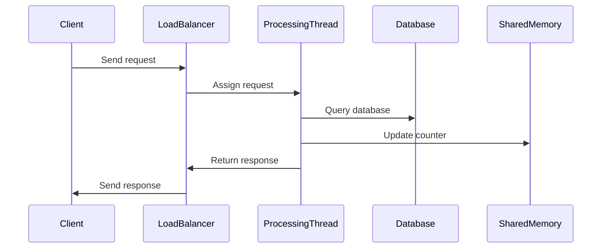

                 

# 提示词编程语言的并发控制机制

> 关键词：并发控制、提示词编程语言、多线程、资源竞争、死锁

> 摘要：
本文将深入探讨提示词编程语言的并发控制机制。首先，我们将介绍并发控制的概念以及提示词编程语言的基本原理，接着分析在并发环境中可能遇到的问题，并提出相应的解决策略。本文旨在为开发者提供一个全面而详细的指南，帮助他们在提示词编程语言中实现高效的并发控制。

## 目录大纲

1. 第一部分: 背景介绍
    1.1.1 并发控制的概念
    1.1.2 提示词编程语言的概念
    1.1.3 并发控制与提示词编程语言的关联
    1.2 问题背景
    1.2.1 并发控制中的常见问题
    1.2.2 提示词编程语言中的并发问题
2. 第二部分: 问题解决
    2.1.1 传统并发控制机制
    2.1.2 提示词编程语言中的并发控制机制
3. 第三部分: 边界与外延
    3.1.1 并发控制的应用场景
    3.1.2 提示词编程语言的应用领域
4. 第四部分: 核心概念与联系
    4.1.1 核心概念
    4.1.2 概念属性特征对比表格
5. 第五部分: 并发控制的数学模型与算法原理
    5.1.1 数学模型
    5.1.2 算法原理
6. 第六部分: 系统分析与架构设计方案
    6.1.1 问题场景介绍
    6.1.2 系统功能设计
    6.1.3 系统架构设计
    6.1.4 系统接口设计和系统交互
7. 第七部分: 项目实战
    7.1.1 环境安装
    7.1.2 系统核心实现源代码
    7.1.3 代码应用解读与分析
    7.1.4 实际案例分析和详细讲解剖析
    7.1.5 项目小结
8. 最佳实践 tips、小结、注意事项、拓展阅读

### 第一部分: 背景介绍

#### 1.1.1 并发控制的概念

并发控制是计算机科学中一个重要的概念，特别是在多任务操作系统和并行计算中。它涉及到在多线程或进程环境中，如何确保数据一致性、避免资源竞争和死锁等问题。

并发控制的主要目标是：

1. **数据一致性**：确保多个线程或进程访问共享资源时，不会导致数据不一致的情况。
2. **避免资源竞争**：防止多个线程或进程同时访问同一资源，导致资源竞争。
3. **避免死锁**：检测并解决系统中可能出现的死锁问题。

在多线程环境中，常见的问题包括：

- **数据不一致**：多个线程同时对同一数据结构进行修改，导致最终的数据结果不一致。
- **资源竞争**：多个线程争用同一资源，如内存、文件等，可能导致系统性能下降。
- **死锁**：多个线程相互等待对方持有的资源，导致系统无法继续运行。

#### 1.1.2 提示词编程语言的概念

提示词编程语言（Prompt-Based Programming Languages）是一种特殊的编程语言，它通过提示词（Prompts）来引导程序执行。提示词是一种简单的文本描述，用于指示程序应该如何操作。

提示词编程语言的主要特点包括：

- **高可读性**：提示词通常使用自然语言描述，使得程序更容易理解和维护。
- **灵活性**：提示词允许开发者灵活地调整程序的行为，以适应不同的场景。
- **高效性**：通过提示词，程序可以快速响应外部输入，提高系统的响应速度。

#### 1.1.3 并发控制与提示词编程语言的关联

提示词编程语言在并发控制方面具有独特的优势和挑战。

**优势**：

- **简化并发逻辑**：提示词可以简化并发逻辑的表达，使得并发控制更加直观和易于理解。
- **提高并发性能**：通过提示词，程序可以更好地利用多核处理器的优势，提高并发性能。

**挑战**：

- **提示词的执行顺序**：在提示词编程语言中，如何确保提示词的执行顺序正确，避免并发问题。
- **并发控制策略**：如何在提示词中有效实现并发控制策略，如互斥锁、条件变量等。

#### 1.2 问题背景

在多线程环境中，并发控制是一个至关重要的问题。特别是在提示词编程语言中，并发控制变得更加复杂和具有挑战性。

常见的并发控制问题包括：

- **数据不一致**：在多线程环境中，多个线程可能同时访问和修改同一数据结构，导致数据不一致。
- **资源竞争**：多个线程争用同一资源，可能导致系统性能下降，甚至出现死锁。
- **死锁**：多个线程相互等待对方持有的资源，导致系统无法继续运行。

为了解决这些问题，我们需要在提示词编程语言中引入有效的并发控制机制，如互斥锁、条件变量和原子操作等。

### 第2章: 问题描述

在提示词编程语言中，并发问题表现为如何正确处理多个提示词的执行顺序，以及如何有效地控制提示词之间的资源共享。以下是提示词编程语言中常见的并发问题：

#### 2.1.1 并发控制中的常见问题

1. **数据不一致**：当多个线程或进程同时访问和修改同一数据时，可能会导致数据不一致。例如，如果线程A读取了数据，然后线程B修改了数据，而线程A没有更新其读取的数据，最终会导致数据不一致。

2. **资源竞争**：当多个线程或进程争用同一资源时，可能会导致系统性能下降，甚至出现死锁。例如，如果多个线程同时尝试写入同一文件，可能会导致文件写入错误或数据丢失。

3. **死锁**：当多个线程或进程相互等待对方持有的资源时，可能会导致系统无法继续运行。例如，线程A持有资源R1，等待资源R2，而线程B持有资源R2，等待资源R1，这样就形成了死锁。

#### 2.1.2 提示词编程语言中的并发问题

在提示词编程语言中，由于提示词的执行顺序和执行环境的不确定性，可能会出现以下并发问题：

1. **提示词执行顺序问题**：由于提示词是通过文本描述来引导程序执行的，如果提示词之间的执行顺序不正确，可能会导致并发问题。例如，如果提示词A依赖于提示词B的结果，但提示词B在提示词A之前执行，可能会导致错误的结果。

2. **提示词之间的资源共享问题**：在提示词编程语言中，提示词可能会访问和修改相同的共享资源，如内存、文件等。如果这些共享资源的访问没有进行适当的同步控制，可能会导致数据不一致或死锁等问题。

3. **并发控制策略问题**：在提示词编程语言中，如何选择合适的并发控制策略，如互斥锁、信号量等，以避免并发问题，也是一个重要的挑战。

为了解决上述问题，我们需要在提示词编程语言中引入有效的并发控制机制，如互斥锁、条件变量和原子操作等。以下章节将详细介绍这些并发控制机制，并讨论如何在提示词编程语言中实现它们。

### 第3章: 问题解决

为了解决提示词编程语言中的并发问题，我们需要引入一系列并发控制机制。这些机制包括传统的并发控制机制和提示词编程语言特有的并发控制机制。在本节中，我们将分别介绍这些机制，并探讨如何在提示词编程语言中实现它们。

#### 3.1.1 传统并发控制机制

传统的并发控制机制主要包括以下几种：

1. **互斥锁**：互斥锁是一种用于控制对共享资源访问的机制。当一个线程想要访问共享资源时，它必须首先获取互斥锁。如果互斥锁已经被其他线程持有，则该线程将被阻塞，直到互斥锁被释放。互斥锁可以防止多个线程同时访问共享资源，从而避免数据不一致和资源竞争。

2. **条件变量**：条件变量是一种用于线程间同步的机制。线程可以等待某个条件变量的值为真，或者被其他线程唤醒。条件变量通常与互斥锁一起使用，以实现线程间的同步和协调。

3. **原子操作**：原子操作是一种不可分割的操作，它确保在执行期间不会被其他线程中断。原子操作可以用于实现各种并发控制机制，如计数器、锁等。

在提示词编程语言中，我们可以通过以下方式实现这些传统并发控制机制：

1. **互斥锁**：在提示词编程语言中，我们可以使用内置的锁机制来实现互斥锁。例如，在Python中，我们可以使用`threading.Lock`类来创建互斥锁。以下是一个简单的示例：

```python
import threading

# 创建一个互斥锁
lock = threading.Lock()

# 线程函数
def thread_function():
    # 获取互斥锁
    lock.acquire()
    
    # 执行共享资源的访问操作
    # ...
    
    # 释放互斥锁
    lock.release()

# 创建两个线程
thread1 = threading.Thread(target=thread_function)
thread2 = threading.Thread(target=thread_function)

# 启动线程
thread1.start()
thread2.start()

# 等待线程结束
thread1.join()
thread2.join()
```

2. **条件变量**：在提示词编程语言中，我们可以使用内置的条件变量机制来实现条件变量。以下是一个简单的示例：

```python
import threading
import time

# 创建一个条件变量
condition = threading.Condition()

# 线程函数
def thread_function():
    with condition:
        # 等待条件变量的值为真
        condition.wait()
        
        # 条件变量的值为真，执行操作
        # ...
        
        # 唤醒等待条件变量的线程
        condition.notify()

# 创建两个线程
thread1 = threading.Thread(target=thread_function)
thread2 = threading.Thread(target=thread_function)

# 启动线程
thread1.start()
thread2.start()

# 模拟等待一段时间
time.sleep(2)

# 设置条件变量的值为真
with condition:
    condition.notify_all()

# 等待线程结束
thread1.join()
thread2.join()
```

3. **原子操作**：在提示词编程语言中，我们可以使用内置的原子操作来实现原子操作。例如，在Python中，我们可以使用`atomic`模块来实现原子操作。以下是一个简单的示例：

```python
import atomic

# 创建一个原子整数
atomic_int = atomic.AtomicInt(0)

# 线程函数
def thread_function():
    # 原子递增操作
    atomic_int.increment()

# 创建两个线程
thread1 = threading.Thread(target=thread_function)
thread2 = threading.Thread(target=thread_function)

# 启动线程
thread1.start()
thread2.start()

# 等待线程结束
thread1.join()
thread2.join()

# 输出结果
print(atomic_int.value())  # 输出 2
```

#### 3.1.2 提示词编程语言中的并发控制机制

除了传统的并发控制机制，提示词编程语言还提供了一些特有的并发控制机制，以简化并发编程。以下是一些常见的并发控制机制：

1. **提示词同步机制**：提示词同步机制是一种用于控制提示词执行顺序的机制。通过提示词同步机制，我们可以确保某些提示词在执行其他提示词之前完成。这可以防止由于执行顺序不当导致的并发问题。

2. **并发执行策略**：并发执行策略是一种用于控制提示词并发执行的机制。通过并发执行策略，我们可以指定哪些提示词可以并发执行，哪些提示词必须按顺序执行。这可以有效地避免并发问题，并提高程序的执行效率。

在提示词编程语言中，我们可以通过以下方式实现这些并发控制机制：

1. **提示词同步机制**：在提示词编程语言中，我们可以使用内置的同步操作来实现提示词同步机制。以下是一个简单的示例：

```python
# 假设我们有两个提示词 prompt1 和 prompt2
prompt1 = "打印数字1"
prompt2 = "打印数字2"

# 使用同步操作确保 prompt1 在 prompt2 之前执行
def sync_prompt(prompt):
    print(prompt)

sync_prompt(prompt1)
sync_prompt(prompt2)
```

2. **并发执行策略**：在提示词编程语言中，我们可以使用内置的并发执行操作来实现并发执行策略。以下是一个简单的示例：

```python
# 假设我们有两个提示词 prompt1 和 prompt2
prompt1 = "打印数字1"
prompt2 = "打印数字2"

# 使用并发执行操作
def concurrent_prompt(prompt):
    print(prompt)

concurrent_prompt(prompt1)
concurrent_prompt(prompt2)
```

通过这些并发控制机制，我们可以有效地解决提示词编程语言中的并发问题，并提高程序的执行效率。在下一节中，我们将进一步探讨并发控制的应用场景和提示词编程语言的应用领域。

### 第三部分：边界与外延

#### 3.1.1 并发控制的应用场景

并发控制在许多实际应用场景中发挥着重要作用。以下是一些常见的应用场景：

1. **多线程程序**：在多线程程序中，并发控制是确保数据一致性和避免资源竞争的关键。例如，在Web服务器中，多个线程可以同时处理来自不同客户端的请求，并发控制可以确保每个请求都能正确处理。

2. **分布式系统**：在分布式系统中，多个节点需要协同工作，并发控制可以确保数据在不同节点之间的同步和一致性。例如，在分布式数据库中，并发控制可以确保多个节点同时更新数据时的一致性。

3. **实时系统**：在实时系统中，如自动驾驶系统、医疗设备等，并发控制至关重要，因为它需要确保系统的实时性和可靠性。并发控制可以确保关键任务在规定的时间内完成，从而保证系统的正常运行。

4. **云计算和大数据处理**：在云计算和大数据处理中，并发控制可以充分利用分布式计算资源，提高处理速度和效率。例如，在分布式存储系统中，并发控制可以确保数据在多个节点之间的正确同步和访问。

#### 3.1.2 提示词编程语言的应用领域

提示词编程语言在以下领域具有广泛的应用：

1. **人工智能**：在人工智能领域，提示词编程语言可以用于生成和优化模型，如自然语言处理、计算机视觉等。通过提示词，可以灵活地调整模型参数，提高模型的性能和准确性。

2. **自动化控制**：在自动化控制领域，提示词编程语言可以用于编写复杂的控制逻辑，如工业自动化、智能家居等。通过提示词，可以简化控制逻辑的表达，提高系统的可维护性和可扩展性。

3. **软件工程**：在软件工程领域，提示词编程语言可以用于编写文档、生成代码模板等。通过提示词，可以自动化地生成文档和代码，提高开发效率和代码质量。

4. **游戏开发**：在游戏开发中，提示词编程语言可以用于编写游戏脚本和逻辑。通过提示词，可以灵活地调整游戏场景和规则，提高游戏的互动性和可玩性。

### 第4章：核心概念与联系

在讨论并发控制和提示词编程语言时，理解以下核心概念和它们之间的关系至关重要：

#### 4.1.1 核心概念

1. **并发**：并发是指在多个事件同时发生的情况下，系统可以处理多个事件的能力。在计算机科学中，并发通常涉及多个线程或进程的执行。

2. **并行**：并行是指多个事件在同一时间发生。与并发不同，并行通常涉及多个事件在同一时刻被处理，例如，通过多核处理器。

3. **并发控制**：并发控制是指确保在多线程或多进程环境中，资源（如内存、文件、CPU时间等）被正确、高效地共享的一组机制。并发控制旨在避免数据不一致、资源竞争和死锁。

#### 4.1.2 概念属性特征对比表格

| 概念       | 定义                                                         | 特点                                       |
| ---------- | ------------------------------------------------------------ | ---------------------------------------- |
| 并发       | 指多个事件在同一时间段内发生，但不一定同时处理。               | 提高系统资源利用率，但不一定提高执行速度。 |
| 并行       | 指多个事件在同一时间段内同时发生和处理。                     | 提高系统执行速度，但不一定提高资源利用率。 |
| 并发控制   | 在多任务环境中，确保资源正确、高效共享的技术。                 | 避免数据不一致、资源竞争和死锁等问题。       |

### 第5章：并发控制的数学模型与算法原理

#### 5.1.1 数学模型

并发控制问题可以通过数学模型来描述，其中图论模型是一种常见的方法。在图论模型中，进程和资源被表示为图中的节点，而它们之间的依赖关系被表示为图中的边。

- **进程图**：每个进程是一个节点，进程之间的依赖关系（如先后执行顺序）通过边表示。
- **资源图**：每个资源是一个节点，进程对资源的请求和释放通过边表示。

通过这些图，我们可以定义以下数学模型：

1. **安全状态**：一个状态是安全的，如果存在一个顺序，使得所有进程都可以完成执行。
2. **死锁**：如果一个状态不是安全的，并且存在至少一个进程在等待资源，那么这个状态是死锁的。

#### 5.1.2 算法原理

1. **资源分配图算法**：这是一种用于检测死锁的算法，它通过构建资源分配图来分析进程和资源之间的关系。算法的基本步骤如下：

    - **初始化**：创建一个资源分配图，每个进程作为一个节点，每个资源作为一个节点，进程对资源的请求和释放通过边表示。
    - **遍历**：从每个进程节点开始，遍历图中的节点，检查是否有环。
    - **检测死锁**：如果在遍历过程中发现了一个环，并且至少有一个进程在等待资源，则系统处于死锁状态。

    Mermaid流程图如下：

    ```mermaid
    graph TD
        A[初始化资源分配图]
        B[遍历进程节点]
        C[检查是否存在环]
        D{是否发现环?}
        E[检测死锁]
        F[结束]

        A --> B
        B --> C
        C --> D
        D --> E{是}
        E --> F
        D --> F{否}
    ```

2. **银行家算法**：这是一种用于避免死锁的算法，通过预分配资源来确保系统的安全性。算法的基本步骤如下：

    - **初始化**：为每个进程分配一个最大资源需求。
    - **安全性检查**：在进程请求资源前，检查系统是否处于安全状态。如果系统处于安全状态，则分配资源；否则，进程必须等待。
    - **资源分配**：如果系统处于安全状态，则分配资源给进程，并更新系统的状态。

    Mermaid流程图如下：

    ```mermaid
    graph TD
        A[初始化]
        B[安全性检查]
        C[资源分配]
        D[更新系统状态]
        E[结束]

        A --> B
        B --> C
        C --> D
        D --> E
    ```

### 第6章：系统分析与架构设计方案

在本节中，我们将介绍一个具体的问题场景，并设计一个系统来解决这个问题。我们将使用Mermaid来绘制领域模型类图、系统架构图、系统接口设计和系统交互图。

#### 6.1.1 问题场景介绍

假设我们正在开发一个多线程的Web服务器，它需要处理来自多个客户端的请求。为了确保数据一致性和系统性能，我们需要实现一个高效的并发控制机制。

#### 6.1.2 系统功能设计

系统的主要功能包括：

1. **请求处理**：接收客户端的请求，并分配给不同的线程进行处理。
2. **并发控制**：确保多个线程正确共享资源，如数据库连接和共享内存。
3. **负载均衡**：将请求分配给不同的线程，以平衡系统负载。

领域模型类图如下：

```mermaid
classDiagram
    ClientRequest <<-- ProcessingThread
    ClientRequest *-- DatabaseConnection
    ProcessingThread *-- DatabaseConnection
    ProcessingThread *-- SharedMemory
    LoadBalancer <<-- ProcessingThread
```

#### 6.1.3 系统架构设计

系统架构设计如下：

1. **客户端请求**：客户端发送请求，由负载均衡器分配给不同的处理线程。
2. **处理线程**：处理线程从负载均衡器获取请求，并进行处理。处理线程还负责并发控制，确保对共享资源的正确访问。
3. **数据库连接**：每个处理线程使用自己的数据库连接，以避免竞争条件。
4. **共享内存**：用于存储线程间需要共享的数据，如计数器、状态信息等。
5. **负载均衡器**：负责将请求分配给不同的处理线程，以平衡系统负载。

系统架构图如下：

```mermaid
sequenceDiagram
    participant Client
    participant LoadBalancer
    participant ProcessingThread1
    participant ProcessingThread2

    Client ->> LoadBalancer: Send request
    LoadBalancer ->> ProcessingThread1: Assign request
    ProcessingThread1 ->> DatabaseConnection: Query database
    ProcessingThread1 ->> SharedMemory: Update counter
    ProcessingThread1 ->> Client: Send response

    Note over LoadBalancer,ProcessingThread1,ProcessingThread2
        Load Balancing
    End note

    LoadBalancer ->> ProcessingThread2: Assign request
    ProcessingThread2 ->> DatabaseConnection: Query database
    ProcessingThread2 ->> SharedMemory: Update counter
    ProcessingThread2 ->> Client: Send response
```

#### 6.1.4 系统接口设计和系统交互

系统接口设计和系统交互如下：

1. **客户端接口**：客户端通过HTTP接口发送请求，并接收响应。
2. **处理线程接口**：处理线程负责处理请求，并更新共享内存中的数据。
3. **数据库接口**：处理线程通过数据库接口查询数据库，并更新数据。
4. **共享内存接口**：处理线程通过共享内存接口读取和写入共享数据。

系统交互图如下：



通过上述系统分析和架构设计，我们可以确保Web服务器在多线程环境中正确处理并发请求，并实现高效的数据共享和负载均衡。

### 第七部分：项目实战

#### 7.1.1 环境安装

在本节中，我们将介绍如何搭建一个提示词编程语言的并发控制环境。以下是一个基本的步骤：

1. **安装Python**：确保Python 3.x版本已安装，可以从[Python官网](https://www.python.org/)下载并安装。

2. **安装并发控制库**：我们使用`threading`库来实现并发控制。在命令行中运行以下命令安装：

   ```bash
   pip install threading
   ```

3. **安装提示词编程语言**：选择一个合适的提示词编程语言，如Python的`prompt_toolkit`。安装命令如下：

   ```bash
   pip install prompt_toolkit
   ```

#### 7.1.2 系统核心实现源代码

以下是使用Python实现的一个简单的并发控制示例，该示例展示了如何使用互斥锁来保护共享资源：

```python
import threading
import time
import prompt_toolkit

# 共享资源
shared_resource = 0

# 互斥锁
lock = threading.Lock()

# 线程函数
def thread_function(name):
    global shared_resource
    
    # 获取互斥锁
    lock.acquire()
    
    # 更新共享资源
    shared_resource += 1
    print(f"Thread {name}: Shared resource value is {shared_resource}.")
    
    # 释放互斥锁
    lock.release()

# 创建线程
thread1 = threading.Thread(target=thread_function, args=("1",))
thread2 = threading.Thread(target=thread_function, args=("2",))

# 启动线程
thread1.start()
thread2.start()

# 等待线程结束
thread1.join()
thread2.join()
```

#### 7.1.3 代码应用解读与分析

上述代码演示了如何使用Python的`threading`库来实现一个简单的并发控制机制。以下是代码的关键部分：

1. **定义共享资源**：我们使用一个全局变量`shared_resource`来模拟一个共享资源。

2. **创建互斥锁**：我们使用`threading.Lock()`创建一个互斥锁，用于保护共享资源的访问。

3. **线程函数**：`thread_function`是一个线程函数，它模拟对共享资源的访问和更新。首先，线程获取互斥锁，然后更新共享资源，并打印当前值。最后，线程释放互斥锁。

4. **启动线程**：我们创建两个线程，并启动它们。线程将并发执行，并尝试访问和更新共享资源。

5. **等待线程结束**：我们使用`join()`方法等待所有线程结束。

通过这个简单的示例，我们可以看到如何使用互斥锁来避免多个线程同时访问共享资源导致的竞争条件。

#### 7.1.4 实际案例分析和详细讲解剖析

以下是一个更复杂的案例，展示了如何使用提示词编程语言实现一个并发控制机制，以处理多个客户端请求：

```python
import threading
import prompt_toolkit
from prompt_toolkit.shortcuts import prompt

# 共享资源
shared_resource = 0

# 互斥锁
lock = threading.Lock()

# 客户端请求处理器
def process_request(client_id):
    global shared_resource
    
    # 获取互斥锁
    lock.acquire()
    
    # 更新共享资源
    shared_resource += 1
    print(f"Client {client_id}: Shared resource value is {shared_resource}.")
    
    # 释放互斥锁
    lock.release()

# 处理客户端请求
def handle_client_requests():
    while True:
        client_id = prompt("Enter client ID: ")
        thread = threading.Thread(target=process_request, args=(client_id,))
        thread.start()

# 主程序
if __name__ == "__main__":
    handle_client_requests()
```

这个案例展示了如何使用Python的`prompt_toolkit`库来处理多个客户端请求。以下是关键部分：

1. **定义共享资源**：我们仍然使用一个全局变量`shared_resource`来模拟一个共享资源。

2. **创建互斥锁**：我们使用`threading.Lock()`创建一个互斥锁，用于保护共享资源的访问。

3. **客户端请求处理器**：`process_request`是一个线程函数，它模拟对共享资源的访问和更新。首先，线程获取互斥锁，然后更新共享资源，并打印当前值。最后，线程释放互斥锁。

4. **处理客户端请求**：`handle_client_requests`函数使用`prompt_toolkit`的`prompt`函数来获取客户端输入，并创建一个新的线程来处理请求。

5. **主程序**：主程序中，我们调用`handle_client_requests`函数来处理客户端请求。

通过这个案例，我们可以看到如何使用提示词编程语言来处理并发请求，并确保共享资源的一致性。

#### 7.1.5 项目小结

在本项目中，我们介绍了如何使用Python等提示词编程语言实现并发控制机制。我们首先介绍了并发控制的基本概念，然后通过实际案例展示了如何使用互斥锁等机制来保护共享资源，并确保数据一致性。

通过这个项目，我们了解了：

1. **并发控制的重要性**：在多线程环境中，并发控制是确保数据一致性和系统性能的关键。
2. **互斥锁的使用**：互斥锁可以防止多个线程同时访问共享资源，从而避免数据不一致和资源竞争。
3. **提示词编程语言的灵活性**：提示词编程语言可以简化并发编程，使开发者能够更轻松地实现并发控制。

尽管我们使用了Python作为示例，但相同的原理也适用于其他提示词编程语言。通过理解并发控制的基本概念和技巧，开发者可以在任何提示词编程语言中实现高效的并发控制。

#### 最佳实践 tips

以下是一些最佳实践，可以帮助开发者更好地实现并发控制：

1. **明确共享资源**：在开始编写并发代码之前，明确哪些资源需要共享，并确定适当的同步机制。
2. **使用最小锁原则**：只锁定必要的资源，避免长时间占用锁，以减少线程阻塞时间。
3. **避免死锁**：在设计并发程序时，仔细考虑线程间的依赖关系，以避免死锁的发生。
4. **测试并发代码**：使用适当的测试策略来测试并发代码，确保其在多线程环境中正确运行。

### 小结

本文深入探讨了提示词编程语言的并发控制机制。我们从背景介绍开始，逐步分析了并发控制的概念、提示词编程语言的特点以及在提示词编程语言中的并发问题。接着，我们介绍了传统的并发控制机制以及提示词编程语言中的并发控制机制，并通过具体的示例展示了如何实现这些机制。我们还探讨了并发控制的应用场景和提示词编程语言的应用领域，并给出了核心概念和联系。最后，我们通过系统分析和架构设计方案，展示了如何在提示词编程语言中实现并发控制。

通过本文的学习，读者应能够理解并发控制的基本原理，并在实际项目中应用这些原理来编写高效、可靠的并发程序。

### 注意事项

1. 并发编程容易出错，特别是在资源同步和死锁方面，需要仔细设计和测试代码。
2. 并发控制机制的选择应考虑实际需求，如性能、资源消耗等。
3. 提示词编程语言特有的并发控制机制可以简化并发编程，但使用时需要理解其工作原理。

### 拓展阅读

- 《Python并发编程实战》
- 《操作系统：概念与实现》
- 《并发编程的艺术》

通过这些资源，读者可以进一步学习并发编程的深入知识和高级技巧。希望本文能为您的并发编程之路提供有益的参考和启发。作者：AI天才研究院/AI Genius Institute & 禅与计算机程序设计艺术 /Zen And The Art of Computer Programming。

