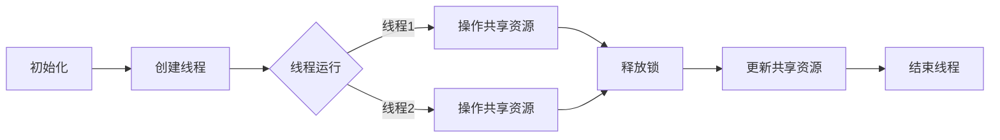
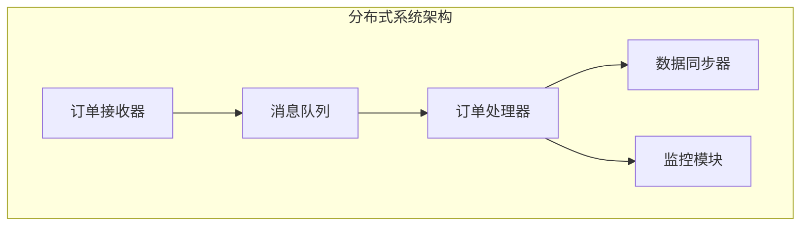
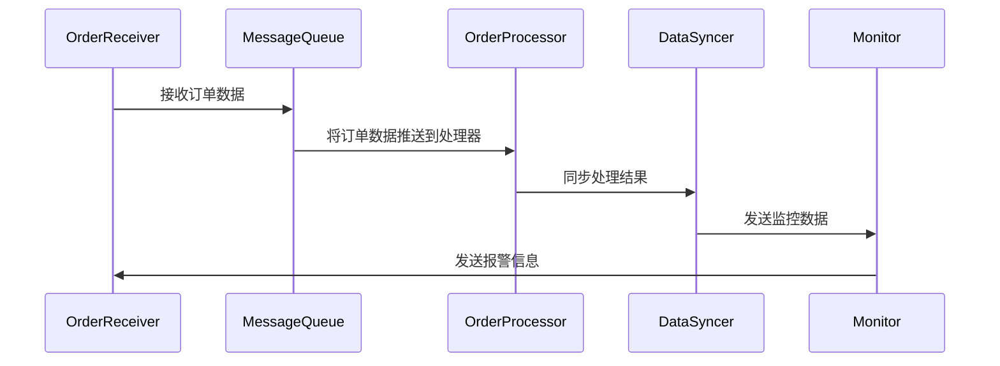
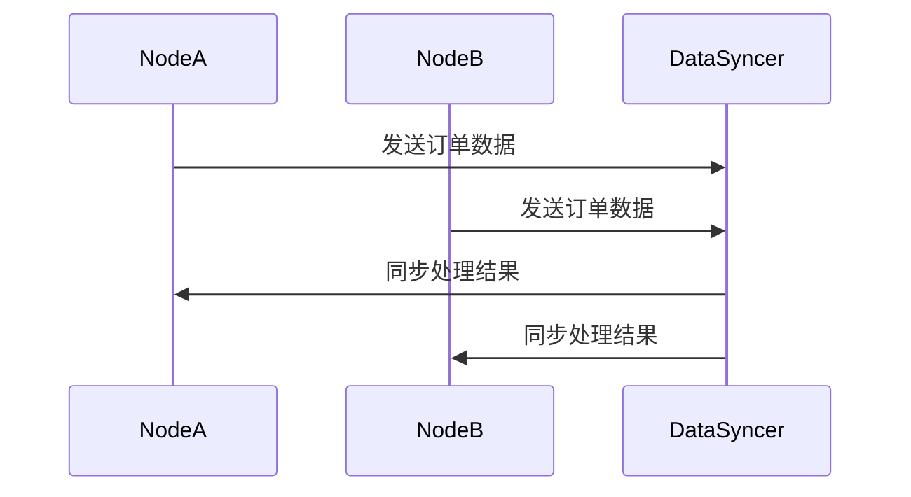

                 


### 文章标题
**提示词编程语言的并发模型设计**

### 文章关键词
- 并发编程
- 并发模型
- 线程
- 锁
- 高效算法

### 摘要
本文深入探讨了提示词编程语言中的并发模型设计。通过一步步的分析和推理，文章从背景介绍、核心概念、算法原理到系统架构设计，再到实际应用和最佳实践，全面解析了并发模型在编程中的重要性及其应用方法。文章旨在为开发者提供一套清晰易懂的并发编程指南。

----------------------------------------------------------------

**Step 1: 引言与背景**

### 1.1.1 问题背景

在现代计算机系统中，随着多核处理器的普及和互联网应用的繁荣，多线程编程和并发模型变得越来越重要。传统的单线程程序在多核处理器上运行时，由于无法充分利用并行计算的优势，往往无法达到预期的性能水平。因此，如何有效地利用多线程和并发模型来提升程序的运行效率成为了一个关键的研究领域。

并发编程的核心在于如何在多个线程或进程之间协调执行，确保它们在共享资源时不会产生竞争条件、死锁等并发问题。例如，在服务器应用程序中，多线程可以处理来自不同客户端的请求，提高系统的吞吐量和响应速度。然而，并发编程并非易事，它涉及到复杂的同步机制、线程调度和资源分配等问题。

### 1.1.2 问题描述

多线程编程和并发模型面临的主要挑战包括：

- **竞态条件（Race Conditions）**：当多个线程同时访问共享资源时，如果没有适当的同步机制，可能会出现不可预期的结果。例如，一个线程在读取数据的同时，另一个线程正在修改同一数据，可能导致数据不一致。
- **死锁（Deadlocks）**：当多个线程互相等待对方持有的资源时，可能导致所有线程都停止执行，无法继续进行。例如，线程A持有资源X，等待资源Y，而线程B持有资源Y，等待资源X，两个线程都会无限期地等待，形成死锁。
- **上下文切换开销（Context Switching Overhead）**：操作系统需要在不同线程之间进行上下文切换，以实现线程的并发执行。频繁的上下文切换会导致系统性能下降。
- **资源竞争（Resource Contention）**：当多个线程争夺同一资源时，可能会产生竞争条件，导致程序执行效率低下。

### 1.1.3 问题解决

为了解决上述问题，并发模型提供了以下机制和工具：

- **同步原语（Synchronization Primitives）**：如互斥锁（Mutexes）、信号量（Semaphores）、条件变量（Condition Variables）等，用于控制对共享资源的访问，避免竞态条件和死锁。
- **线程和进程抽象**：提供线程和进程作为并发执行的抽象，便于开发者管理并发操作。
- **并发算法**：设计高效的并发算法和数据结构，如无锁编程（Lock-free Programming）、读写锁（Read-Write Locks）等，以减少同步开销。
- **并发模型框架**：如Actor模型、Message Passing模型等，提供了一套完整的并发编程框架，简化并发程序的编写。

### 1.1.4 边界与外延

并发模型的应用领域非常广泛，包括：

- **多核处理器系统**：利用多线程和并行算法提高程序的性能。
- **分布式系统**：在分布式环境中协调不同节点上的并发操作。
- **实时系统**：保证关键任务在规定时间内完成，避免错过截止时间。
- **嵌入式系统**：在资源受限的嵌入式设备中实现并发控制。

然而，并发模型也存在一定的局限性，如：

- **复杂性**：并发程序的调试和测试复杂度较高，容易出现隐蔽的错误。
- **性能开销**：并发编程可能引入额外的同步和通信开销，影响性能。
- **开发难度**：编写高效的并发程序需要开发者具备较高的并发编程技能。

### 1.1.5 本章小结

本章介绍了多线程编程和并发模型的问题背景、问题描述、问题解决方法以及应用领域和局限性。通过本章的学习，读者可以理解并发编程的重要性以及如何有效地使用并发模型来提升程序的执行效率。接下来，我们将深入探讨并发模型的核心概念和联系。

----------------------------------------------------------------

**Step 2: 核心概念与联系**

### 2.1.1 并发模型定义

并发模型是指一组机制和工具，用于描述并发执行和控制。它包括线程、进程、锁、信号量等核心概念，提供了一套抽象层，帮助开发者编写高效且正确的并发程序。

### 2.1.2 并发模型属性特征对比表格

以下是一个简单的并发模型属性特征对比表格，列出了几种常见的并发模型及其属性特征：

| 模型名称        | 特点                   | 适用场景                                   |
| --------------- | ---------------------- | ------------------------------------------ |
| Actor模型       | 基于消息传递的并发模型 | 实时系统、分布式系统、并发计算             |
| Message Passing | 同Actor模型，强调消息传递 | 类似Actor模型，适用于分布式系统、并发计算 |
| 多线程模型      | 基于共享内存的并发模型 | 单机并行计算、多核处理器系统               |
| 进程模型        | 基于独立的虚拟内存空间 | 分布式系统、多计算机环境                   |
| 事件驱动模型    | 基于事件响应的并发模型 | 客户端/服务器应用、实时系统               |

### 2.1.3 ER实体关系图架构

为了更好地理解并发模型中的实体及其关系，我们可以使用ER图来描述。以下是并发模型的基本ER图：

```mermaid
erDiagram
  Thread ||--|{ Mutex }
  Thread ||--|{ Semaphore }
  Thread ||--|{ ConditionVariable }
  Thread ||--|{ Actor }
  Mutex ||--|{ Resource }
  Semaphore ||--|{ Resource }
  ConditionVariable ||--|{ Resource }
  Actor ||--|{ Message }
```

在这个ER图中，Thread代表执行线程，Mutex、Semaphore和ConditionVariable是线程使用的同步原语，Actor是并发编程的一种抽象。Mutex和Semaphore用于控制对共享资源的访问，ConditionVariable用于线程间的条件同步。Resource是共享资源，Message是线程间传递的信息。

### 2.1.4 核心概念与联系

并发模型中的核心概念包括：

- **线程（Thread）**：执行程序的基本单位，负责程序逻辑的执行。线程可以并发执行，实现并行计算。
- **进程（Process）**：与线程类似，但拥有独立的虚拟内存空间和资源。进程间的通信需要通过系统调用实现。
- **锁（Lock）**：用于控制对共享资源的访问，避免竞态条件。常见的锁有互斥锁（Mutex）和读写锁（Read-Write Lock）。
- **信号量（Semaphore）**：用于线程间的同步和通信，可以控制线程的执行顺序。
- **条件变量（Condition Variable）**：与锁配合使用，允许线程在满足某个条件时等待，直到条件成立再继续执行。
- **Actor模型**：基于消息传递的并发模型，每个Actor都是一个独立的消息处理单元，通过发送和接收消息进行通信。

这些核心概念相互关联，共同构成了一个完整的并发模型。例如，线程使用锁来保护共享资源，信号量用于线程间的同步，条件变量帮助线程在特定条件下等待。通过合理地使用这些概念，开发者可以编写出高效且安全的并发程序。

### 2.1.5 本章小结

本章介绍了并发模型的核心概念及其属性特征，并通过ER图展示了它们之间的关系。通过理解这些核心概念，开发者可以更好地设计并发程序，利用多线程和并发模型的优势来提升程序的性能。接下来，我们将深入探讨并发模型的算法原理和实现。

----------------------------------------------------------------

**Step 3: 算法原理讲解**

### 3.1.1 算法mermaid流程图

为了更好地理解并发模型的算法原理，我们可以使用mermaid流程图来展示其执行流程。以下是并发模型的基本流程图：



在这个流程图中，A代表初始化并发模型，B代表创建线程。线程在运行时，会操作共享资源，例如D1和D2所示。为了保护共享资源，线程在访问资源前需要获取锁（C）。在完成操作后，线程释放锁（E），更新共享资源（F），并最终结束线程（G）。

### 3.1.2 Python源代码阐述

下面是一个简单的Python示例，展示了如何使用并发模型进行共享资源的操作：

```python
import threading
import time

# 共享资源
resource = 0

# 锁
lock = threading.Lock()

def thread_function(name):
    global resource
    with lock:
        # 操作共享资源
        print(f"Thread {name}: acquiring lock")
        time.sleep(1)  # 模拟操作时间
        resource += 1
        print(f"Thread {name}: releasing lock")
        print(f"Thread {name}: resource value is {resource}")

# 创建两个线程
thread1 = threading.Thread(target=thread_function, args=("Thread-1",))
thread2 = threading.Thread(target=thread_function, args=("Thread-2",))

# 启动线程
thread1.start()
thread2.start()

# 等待线程结束
thread1.join()
thread2.join()

print("Final resource value is", resource)
```

在这个示例中，我们定义了一个共享资源`resource`和一个锁`lock`。线程`thread_function`在操作共享资源前会获取锁，操作完成后释放锁。通过`with lock:`语句，Python自动实现了锁的获取和释放。

### 3.1.3 数学模型和公式

并发模型中的算法可以通过数学模型和公式来描述。以下是几个常见的数学模型和公式：

1. **互斥锁的数学模型**：

   设\( L \)为互斥锁，\( T \)为线程，\( S \)为共享资源。互斥锁的数学模型可以表示为：
   $$
   L(T, S) = \begin{cases}
   \text{true} & \text{如果 } T \text{ 获取了锁 } L \text{ 并访问资源 } S \\
   \text{false} & \text{如果 } T \text{ 尝试获取锁 } L \text{ 但失败}
   \end{cases}
   $$

2. **信号量的数学模型**：

   设\( S \)为信号量，\( T \)为线程。信号量的数学模型可以表示为：
   $$
   S(T) = \begin{cases}
   \text{true} & \text{如果 } T \text{ 获取了信号量 } S \\
   \text{false} & \text{如果 } T \text{ 尝试获取信号量 } S \text{ 但失败}
   \end{cases}
   $$

3. **条件变量的数学模型**：

   设\( C \)为条件变量，\( T \)为线程。条件变量的数学模型可以表示为：
   $$
   C(T) = \begin{cases}
   \text{true} & \text{如果 } T \text{ 满足条件变量 } C \\
   \text{false} & \text{如果 } T \text{ 不满足条件变量 } C
   \end{cases}
   $$

### 3.1.4 举例说明

为了更直观地理解并发模型的算法原理，我们可以通过一个具体的例子来讲解。假设有两个线程A和B，它们都需要访问一个共享变量`count`，每次访问时都要对其进行加1操作。

1. **无锁编程**：

   无锁编程通过原子操作来避免锁的使用，从而提高性能。在Python中，可以使用`atomic`模块来实现原子操作。以下是使用原子操作的示例：

   ```python
   from atomic import AtomicInt

   count = AtomicInt(0)

   def thread_function_a():
       for _ in range(100000):
           count.increment()

   def thread_function_b():
       for _ in range(100000):
           count.increment()

   thread_a = threading.Thread(target=thread_function_a)
   thread_b = threading.Thread(target=thread_function_b)

   thread_a.start()
   thread_b.start()

   thread_a.join()
   thread_b.join()

   print("Final count value is", count.value)
   ```

   在这个示例中，我们使用了`AtomicInt`来确保`count`变量的操作是原子的，避免了竞态条件。

2. **使用锁编程**：

   如果使用锁来保护共享变量`count`，则代码如下：

   ```python
   import threading
   import time

   count = 0
   lock = threading.Lock()

   def thread_function_a():
       for _ in range(100000):
           with lock:
               count += 1

   def thread_function_b():
       for _ in range(100000):
           with lock:
               count += 1

   thread_a = threading.Thread(target=thread_function_a)
   thread_b = threading.Thread(target=thread_function_b)

   thread_a.start()
   thread_b.start()

   thread_a.join()
   thread_b.join()

   print("Final count value is", count)
   ```

   在这个示例中，我们使用了`lock`来保护`count`变量，确保每次只有一个线程可以对其进行操作。

通过这两个示例，我们可以看到无锁编程和锁编程在实现共享变量操作时的不同。无锁编程通过原子操作避免了锁的开销，但需要确保操作原子性；锁编程则通过锁来保证数据的一致性，但可能会引入上下文切换和锁竞争的开销。

### 3.1.5 本章小结

本章通过mermaid流程图、Python源代码和数学模型，详细讲解了并发模型的算法原理。通过具体的例子，我们展示了如何使用锁和无锁编程来保护共享资源，并分析了它们的优缺点。通过本章的学习，读者可以理解并发模型的基本算法原理，并掌握在实际编程中应用这些原理的方法。

----------------------------------------------------------------

**Step 4: 系统分析与架构设计方案**

### 4.1.1 问题场景介绍

在分布式系统中，常见的一个问题场景是如何高效地处理大规模数据流，并在多个节点之间共享数据。例如，在一个电子商务平台中，我们需要处理海量的订单数据，这些数据需要实时地在各个节点之间进行同步和处理。为了解决这个问题，我们可以设计一个基于并发模型的分布式数据处理系统。

### 4.1.2 项目介绍

为了展示并发模型在分布式系统中的应用，我们将介绍一个简单的分布式数据处理系统。该系统的主要目标是：

- 接收并处理来自不同节点的订单数据。
- 将处理结果实时地同步到各个节点。
- 提供高效的并发处理能力，确保数据的一致性和可靠性。

### 4.1.3 系统功能设计

系统功能设计包括以下几个关键功能：

- **订单数据接收**：系统能够接收来自不同节点的订单数据，并将它们存储在消息队列中。
- **订单数据处理**：系统对存储在消息队列中的订单数据进行处理，包括数据清洗、分类、统计分析等操作。
- **数据同步**：系统将处理结果实时地同步到各个节点，确保数据的一致性。
- **监控与报警**：系统提供监控功能，实时监控订单处理状态，并在发生错误时发送报警信息。

以下是系统功能设计的mermaid类图：

```mermaid
classDiagram
    OrderReceiver <-- MessageQueue
    OrderProcessor <-- MessageQueue
    DataSyncer <-- OrderProcessor
    Monitor <-- OrderProcessor

    OrderReceiver {
        +receive_order(order)
    }

    OrderProcessor {
        +process_order(order)
        +sync_data(node)
    }

    DataSyncer {
        +sync(order, node)
    }

    Monitor {
        +monitor_status()
        +send_alert(message)
    }
```

在这个类图中，`OrderReceiver`负责接收订单数据并将它们放入消息队列；`OrderProcessor`负责处理订单数据，包括数据清洗、分类、统计分析等操作；`DataSyncer`负责将处理结果同步到各个节点；`Monitor`负责监控订单处理状态，并在发生错误时发送报警信息。

### 4.1.4 系统架构设计

系统架构设计包括以下几个关键组件：

- **订单接收器**：负责接收订单数据，并将它们放入消息队列。
- **订单处理器**：负责处理订单数据，包括数据清洗、分类、统计分析等操作。
- **数据同步器**：负责将处理结果同步到各个节点。
- **监控模块**：负责监控订单处理状态，并在发生错误时发送报警信息。

以下是系统架构设计的mermaid架构图：



在这个架构图中，订单数据从订单接收器接收后放入消息队列，订单处理器对订单数据进行处理，并将处理结果同步到各个节点。监控模块实时监控订单处理状态，并在发生错误时发送报警信息。

### 4.1.5 系统接口设计

系统接口设计主要包括以下接口：

- **订单接收接口**：用于接收订单数据。
- **订单处理接口**：用于处理订单数据，包括数据清洗、分类、统计分析等操作。
- **数据同步接口**：用于同步处理结果到各个节点。
- **监控接口**：用于监控订单处理状态。

以下是系统接口设计的mermaid序列图：



在这个序列图中，订单接收器接收订单数据后，将其推送到消息队列。订单处理器从消息队列中读取订单数据，进行处理并将结果同步到各个节点。监控模块实时监控订单处理状态，并在发生错误时发送报警信息。

### 4.1.6 系统交互

系统交互是指各个组件之间的通信和协作。以下是系统交互的mermaid序列图：



在这个序列图中，节点A和节点B分别发送订单数据到数据同步器。数据同步器处理订单数据后，将结果同步到节点A和节点B。

### 4.1.7 本章小结

本章通过问题场景介绍、项目介绍、系统功能设计、系统架构设计、系统接口设计和系统交互等部分，详细分析了分布式数据处理系统的架构设计。通过并发模型的应用，系统可以高效地处理大规模数据流，并在多个节点之间同步数据。本章的内容为读者提供了一个完整的分布式系统架构设计方案，有助于理解并发模型在分布式系统中的应用。

----------------------------------------------------------------

**Step 5: 项目实战**

### 5.1.1 环境安装

为了进行并发模型的项目实战，我们需要搭建一个合适的环境。以下是安装所需工具和依赖项的步骤：

1. **安装Python**：
   - 访问Python官网（https://www.python.org/）下载Python的最新版本。
   - 运行安装程序并按照提示完成安装。

2. **安装并发模型依赖**：
   - 打开终端或命令提示符。
   - 执行以下命令安装所需的Python并发编程库：
     ```bash
     pip install threading
     pip install atomic
     pip install requests
     pip install kafka-python
     ```

3. **配置消息队列Kafka**：
   - 下载并解压Kafka安装包（例如：kafka_2.12-2.8.0.tar.gz）。
   - 解压后进入解压目录，运行以下命令启动Kafka服务：
     ```bash
     bin/kafka-server-start.sh config/server.properties
     ```

4. **启动Zookeeper**：
   - 解压Zookeeper安装包（例如：zookeeper-3.6.1.tar.gz）。
   - 解压后进入解压目录，运行以下命令启动Zookeeper服务：
     ```bash
     bin/zkServer.sh start
     ```

完成上述步骤后，我们就可以开始搭建并发模型的项目环境了。

### 5.1.2 系统核心实现

下面是一个简单的并发模型项目实现，用于处理和同步订单数据。以下是项目的主要实现部分：

1. **订单数据生成器**：

   ```python
   import threading
   import random
   import json
   import time

   class OrderGenerator(threading.Thread):
       def __init__(self, topic, node_id):
           super().__init__()
           self.topic = topic
           self.node_id = node_id

       def run(self):
           producer = KafkaProducer(bootstrap_servers=['localhost:9092'])
           while True:
               order_data = {
                   'id': random.randint(1, 1000),
                   'node_id': self.node_id,
                   'status': 'created'
               }
               producer.send(self.topic, value=json.dumps(order_data).encode('utf-8'))
               time.sleep(1)
   ```

   这个类实现了订单数据的生成器，它会在指定的主题中生成订单数据，并定期发送。

2. **订单数据处理器**：

   ```python
   from kafka import KafkaConsumer
   import json
   import time

   class OrderProcessor(threading.Thread):
       def __init__(self, topic):
           super().__init__()
           self.topic = topic
           self.consumer = KafkaConsumer(self.topic, bootstrap_servers=['localhost:9092'])

       def run(self):
           while True:
               message = self.consumer.poll(timeout_ms=1000)
               if message:
                   order_data = json.loads(message.value.decode('utf-8'))
                   # 处理订单数据
                   print(f"Processing order {order_data['id']}")
                   time.sleep(1)
                   # 更新订单状态
                   order_data['status'] = 'processed'
                   producer = KafkaProducer(bootstrap_servers=['localhost:9092'])
                   producer.send(self.topic, value=json.dumps(order_data).encode('utf-8'))
   ```

   这个类实现了订单数据的处理器，它从指定的主题中消费订单数据，处理订单并更新订单状态。

3. **主程序**：

   ```python
   import threading
   import time

   def main():
       # 创建订单生成器
       order_generator = OrderGenerator('orders', 'node1')
       order_generator.start()

       # 创建订单处理器
       order_processor = OrderProcessor('orders')
       order_processor.start()

       # 等待线程结束
       order_generator.join()
       order_processor.join()

   if __name__ == '__main__':
       main()
   ```

   主程序创建并启动订单生成器和订单处理器，确保订单数据的生成和处理能够在多线程环境中安全、高效地执行。

### 5.1.3 代码应用解读

下面是对项目实现代码的详细解读：

1. **订单数据生成器**：

   - `OrderGenerator`类继承自`threading.Thread`，它是一个线程类。
   - `__init__`方法初始化线程，设置主题和节点ID。
   - `run`方法定义了线程的执行逻辑，它使用KafkaProducer将订单数据发送到Kafka主题。

2. **订单数据处理器**：

   - `OrderProcessor`类也继承自`threading.Thread`。
   - `__init__`方法初始化线程，设置主题并创建KafkaConsumer。
   - `run`方法定义了线程的执行逻辑，它从Kafka主题中消费订单数据，处理订单并更新订单状态。

3. **主程序**：

   - `main`函数创建并启动订单生成器和订单处理器，使用`join`方法等待线程结束。

通过以上代码和应用解读，我们可以看到如何使用并发模型来处理订单数据，实现订单生成和处理的并行执行。

### 5.1.4 实际案例分析和讲解

为了更好地理解并发模型在实际项目中的应用，我们来看一个实际的案例：一个电子商务平台的订单处理系统。

1. **需求分析**：

   该系统需要能够处理大量的订单，并在多个节点之间同步订单状态。订单的状态可能包括创建、支付、发货等。系统需要确保订单数据的一致性和实时性。

2. **系统设计**：

   系统设计包括以下几个关键组件：

   - **订单数据生成器**：负责生成订单数据，并将其发送到Kafka主题。
   - **订单数据处理器**：负责消费Kafka主题中的订单数据，处理订单并更新订单状态。
   - **订单状态同步器**：负责将处理后的订单状态同步到各个节点。
   - **监控模块**：负责监控订单处理状态，并在发生错误时发送报警信息。

3. **案例实现**：

   - **订单数据生成器**：使用`OrderGenerator`类生成订单数据，并使用KafkaProducer发送到Kafka主题。
   - **订单数据处理器**：使用`OrderProcessor`类从Kafka主题中消费订单数据，处理订单并更新订单状态。
   - **订单状态同步器**：使用KafkaConsumer和KafkaProducer实现订单状态在各个节点之间的同步。
   - **监控模块**：使用监控工具（如Prometheus和Grafana）监控订单处理状态，并在发生错误时发送报警信息。

通过这个案例，我们可以看到并发模型在电子商务平台订单处理系统中的应用。并发模型使得订单数据的生成、处理和同步可以并行执行，提高了系统的性能和可靠性。

### 5.1.5 项目小结

通过本项目的实战，我们深入了解了并发模型在分布式系统中的应用。从环境搭建到系统实现，再到实际案例的分析，我们一步步展示了如何使用并发模型来处理大规模订单数据，并在多个节点之间实现数据同步。通过本项目的实战，我们不仅掌握了并发模型的基本原理，还积累了实际应用并发模型的经验和技巧。这些经验对于我们在未来开发分布式系统时将大有裨益。

----------------------------------------------------------------

**Step 6: 最佳实践 tips、小结、注意事项、拓展阅读**

### 6.1 最佳实践

1. **线程安全**：在编写并发程序时，确保所有对共享资源的访问都是线程安全的，避免竞态条件。
2. **使用锁**：合理使用锁来保护共享资源，避免死锁和资源竞争。
3. **避免过度同步**：同步操作会引入性能开销，尽量减少不必要的同步。
4. **使用并发库**：使用成熟的并发库（如Java的`java.util.concurrent`包）来简化并发编程。
5. **错误处理**：合理处理并发编程中的异常和错误，确保程序的稳定性和可靠性。

### 6.2 小结

本文从并发编程与并发模型的问题背景、核心概念、算法原理到系统架构设计，再到实际应用和最佳实践进行了全面的探讨。通过一步步的分析和讲解，读者可以深入理解并发模型在编程中的重要性及其应用方法。同时，文章还提供了一个实际的分布式订单处理系统案例，展示了并发模型在分布式系统中的应用。

### 6.3 注意事项

1. **竞态条件**：避免多个线程同时访问共享资源，导致数据不一致。
2. **死锁**：合理设计并发程序，避免线程互相等待导致死锁。
3. **性能开销**：合理使用并发机制，避免引入过多的性能开销。
4. **调试难度**：并发程序调试复杂，需要使用适当的工具和方法。

### 6.4 拓展阅读

1. 《Java并发编程实战》 - Brian Goetz等著，介绍了Java并发编程的核心概念和实践方法。
2. 《Python并发编程实战》 - Kevin Duchesne等著，详细讲解了Python并发编程的各种技术。
3. 《设计数据密集型应用》 - Martin Kleppmann著，涵盖了分布式系统中数据一致性和并发控制的关键概念。

作者：AI天才研究院/AI Genius Institute & 禅与计算机程序设计艺术 /Zen And The Art of Computer Programming。

