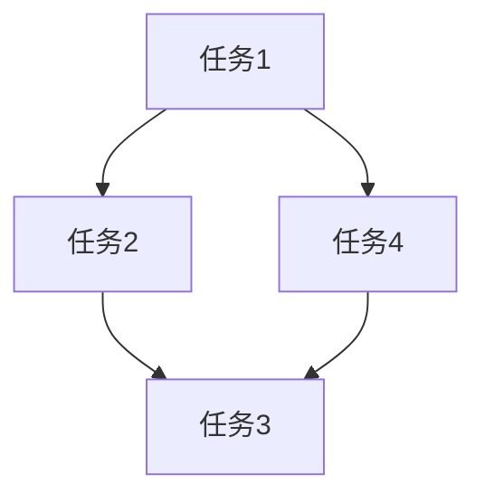
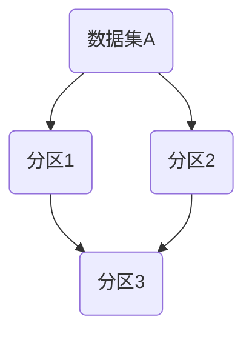
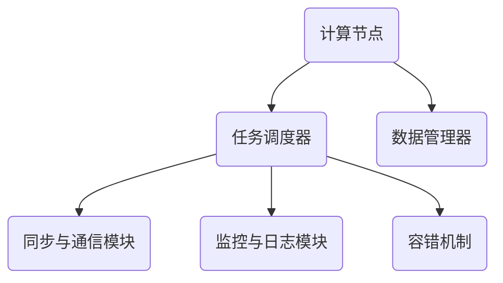

                 

# 《提示词编程语言的并行计算模型设计》

## 关键词

提示词编程语言，并行计算模型，设计原则，架构，算法，优化，应用场景，未来展望

## 摘要

本文探讨了提示词编程语言与并行计算模型相结合的必要性和挑战。通过分析并行计算模型原理、设计原则和具体实现细节，本文提出了一种高效的并行计算模型设计方法。文章进一步探讨了并行计算模型的应用场景、优化策略和实践案例，并对未来发展趋势进行了展望。本文旨在为读者提供一个全面、深入的了解，以促进提示词编程语言并行计算模型在实际应用中的发展。

## 目录大纲

### 第一部分：背景介绍与核心概念

#### 第1章：问题背景与核心概念

##### 1.1 问题背景

##### 1.2 核心概念

##### 1.3 边界与外延

### 第二部分：并行计算模型原理

#### 第2章：并行计算模型原理

##### 2.1 并行计算模型概述

##### 2.2 并行计算模型原理

##### 2.3 并行计算模型核心要素

#### 第3章：核心概念对比与联系

##### 3.1 提示词编程语言与并行计算模型对比

##### 3.2 概念联系

### 第三部分：具体并行计算模型设计

#### 第4章：具体并行计算模型设计

##### 4.1 模型设计原则

##### 4.2 并行计算模型架构

##### 4.3 模型实现细节

### 第四部分：应用与优化

#### 第5章：并行计算模型应用场景

##### 5.1 应用场景分析

##### 5.2 应用案例分析

#### 第6章：并行计算模型优化

##### 6.1 优化策略

##### 6.2 优化实践

#### 第7章：未来展望

##### 7.1 发展趋势

##### 7.2 拓展阅读

### 完整目录大纲

## 《提示词编程语言的并行计算模型设计》

### 第一部分：背景介绍与核心概念

### 第1章：问题背景与核心概念

#### 1.1 问题背景

随着计算机技术的飞速发展，并行计算作为一种提升计算效率的重要手段，受到了越来越多的关注。然而，传统的编程语言在并行计算方面存在一定的局限性。为了克服这些局限性，提示词编程语言应运而生。提示词编程语言通过引入提示词，使得程序员能够更加方便地编写并行程序。

并行计算的重要性体现在多个方面。首先，并行计算能够大幅提高计算速度，减少计算时间。这在处理大数据、复杂科学计算等任务时尤为重要。其次，并行计算能够更好地利用计算机硬件资源，提高资源利用率。此外，并行计算还能够提高程序的鲁棒性，降低故障风险。

提示词编程语言的兴起，为并行计算提供了新的思路。提示词编程语言通过将并行计算的需求嵌入到编程语言中，使得程序员能够更加方便地编写并行程序。这种编程语言通常具有以下特点：

1. **并行性抽象**：提示词编程语言提供了一套并行性抽象机制，使得程序员能够将并行计算的需求转化为编程语言中的操作。

2. **并行性透明**：提示词编程语言隐藏了并行计算的复杂性，使得程序员无需关心并行计算的底层实现细节。

3. **编程简洁性**：提示词编程语言简化了并行程序的编写过程，降低了编程难度。

然而，提示词编程语言在并行计算方面也面临着一些挑战。首先，如何设计一个高效的并行计算模型是一个关键问题。其次，如何保证并行程序的正确性和可移植性也是一个重要的挑战。此外，如何优化并行程序的性能，也是一个需要深入研究的课题。

为了更好地理解这些问题，我们需要对并行计算模型进行深入的分析和研究。

#### 1.2 核心概念

在探讨提示词编程语言的并行计算模型之前，我们需要了解一些核心概念，包括并行计算模型、提示词编程语言等。

**并行计算模型**

并行计算模型是指一种将任务分解为多个子任务，并在多个计算单元上同时执行这些子任务的计算模型。并行计算模型的主要目的是提高计算速度和资源利用率。根据任务的分解方式，并行计算模型可以分为数据并行、任务并行和管道并行等。

1. **数据并行**：数据并行是将数据集分解为多个部分，每个计算单元处理一部分数据。这种模型适用于处理大数据任务。

2. **任务并行**：任务并行是将整个任务分解为多个子任务，每个计算单元执行一个子任务。这种模型适用于处理复杂计算任务。

3. **管道并行**：管道并行是将任务分解为多个阶段，每个计算单元处理一个阶段的任务。这种模型适用于处理流水线任务。

**提示词编程语言**

提示词编程语言是一种专门为并行计算设计的编程语言。它通过引入提示词，将并行计算的需求直接嵌入到编程语言中。提示词编程语言的主要特点包括：

1. **并行性嵌入**：提示词编程语言允许程序员在编写程序时直接指定并行性，使得程序能够自动地利用并行计算资源。

2. **简化编程**：提示词编程语言通过提供一套简洁的语法和库函数，简化了并行程序的编写过程。

3. **高效性**：提示词编程语言通常具有高效的并行计算性能，能够显著提高程序的执行速度。

**提示词**

提示词是提示词编程语言的核心概念，它用于标识并行计算的任务和依赖关系。一个提示词通常包含以下信息：

1. **任务标识**：标识任务的名称或ID。

2. **依赖关系**：标识任务之间的依赖关系，例如，一个任务必须在另一个任务完成后才能执行。

3. **执行策略**：指定任务的执行策略，例如，是并行执行还是顺序执行。

**并行计算模型与提示词编程语言的关联**

并行计算模型与提示词编程语言之间有着密切的联系。并行计算模型为提示词编程语言提供了并行计算的基础，而提示词编程语言则为并行计算模型提供了编程层面的支持。

通过并行计算模型，程序员可以更好地理解任务的并行性，并将这种并行性直接嵌入到程序中。提示词编程语言通过提供一套简洁的语法和库函数，使得程序员能够更加方便地利用并行计算资源，提高程序的执行效率。

总之，提示词编程语言的并行计算模型设计是一个复杂的任务，需要深入理解并行计算模型和提示词编程语言的核心概念，并在此基础上进行创新和优化。通过合理的并行计算模型设计，可以显著提高程序的并行计算性能，为大数据处理、复杂科学计算等领域提供强大的支持。

#### 1.3 边界与外延

在探讨提示词编程语言的并行计算模型设计时，我们需要明确其边界与外延，以便更好地理解其应用范围和潜在影响。

**边界**

1. **并行计算范畴**：提示词编程语言的并行计算模型设计主要关注计算任务的并行性，包括数据并行、任务并行和管道并行等。然而，并行计算并不是万能的，它也有其适用范围。例如，对于某些计算密集型任务，并行计算可能并不适合，因为任务的并行性较低，反而会引入额外的同步开销。

2. **编程语言范畴**：提示词编程语言的并行计算模型设计是在特定的编程语言环境中进行的。不同的编程语言具有不同的特性和优势，提示词编程语言需要与编程语言紧密集成，以充分发挥其并行计算能力。

3. **硬件环境范畴**：提示词编程语言的并行计算模型设计需要考虑硬件环境，包括处理器架构、内存带宽、网络通信等。不同的硬件环境会对并行计算性能产生重要影响，提示词编程语言需要适应不同的硬件环境，以最大化并行计算性能。

**外延**

1. **多核处理器**：随着多核处理器的普及，并行计算的需求日益增加。提示词编程语言的并行计算模型设计可以充分发挥多核处理器的计算能力，提高程序的执行效率。

2. **云计算**：云计算为并行计算提供了强大的基础设施支持。提示词编程语言的并行计算模型设计可以与云计算平台相结合，实现大规模的并行计算。

3. **分布式系统**：分布式系统通过将任务分配到多个节点上，实现并行计算。提示词编程语言的并行计算模型设计可以与分布式系统相结合，实现更高效的并行计算。

总之，提示词编程语言的并行计算模型设计不仅涉及到编程语言和计算模型，还涉及到硬件环境、云计算和分布式系统等领域。通过合理的并行计算模型设计，可以充分发挥硬件资源的作用，提高程序的执行效率，为大数据处理、复杂科学计算等领域提供强大的支持。

### 第二部分：并行计算模型原理

#### 第2章：并行计算模型原理

##### 2.1 并行计算模型概述

并行计算模型是一种将任务分解为多个子任务，并在多个计算单元上同时执行这些子任务的计算模型。并行计算模型的主要目的是提高计算速度和资源利用率。与传统的串行计算相比，并行计算具有以下优势：

1. **提高计算速度**：并行计算可以将任务分解为多个子任务，同时在多个计算单元上执行，从而提高计算速度。

2. **提高资源利用率**：并行计算可以充分利用计算资源，提高资源利用率。

3. **提高程序鲁棒性**：并行计算可以降低程序的故障风险，提高程序的鲁棒性。

并行计算模型可以分为数据并行、任务并行和管道并行等。

1. **数据并行**：数据并行是将数据集分解为多个部分，每个计算单元处理一部分数据。这种模型适用于处理大数据任务。

2. **任务并行**：任务并行是将整个任务分解为多个子任务，每个计算单元执行一个子任务。这种模型适用于处理复杂计算任务。

3. **管道并行**：管道并行是将任务分解为多个阶段，每个计算单元处理一个阶段的任务。这种模型适用于处理流水线任务。

##### 2.2 并行计算模型原理

并行计算模型的工作原理可以概括为以下步骤：

1. **任务分解**：将整个任务分解为多个子任务，这些子任务可以并行执行。

2. **任务调度**：根据计算资源的可用情况，调度子任务的执行顺序和执行单元。

3. **任务执行**：在计算单元上同时执行子任务，每个子任务独立计算。

4. **结果汇总**：将各个子任务的计算结果汇总，生成最终的计算结果。

并行计算模型的核心原理在于充分利用计算资源，提高计算效率。为了实现这一目标，并行计算模型通常采用以下策略：

1. **数据局部性**：通过优化数据访问方式，降低数据访问的开销，提高计算效率。

2. **任务负载均衡**：通过合理分配任务，确保各个计算单元的负载均衡，避免资源浪费。

3. **并行性挖掘**：通过分析任务的性质，挖掘并行性，提高计算并行度。

4. **同步与通信**：在并行计算过程中，需要合理处理同步与通信问题，确保计算结果的正确性。

##### 2.3 并行计算模型核心要素

并行计算模型的核心要素包括：

1. **计算单元**：计算单元是执行计算任务的基本单元，可以是单核处理器、多核处理器或分布式计算节点。

2. **任务调度器**：任务调度器负责根据计算资源的可用情况，调度子任务的执行顺序和执行单元。

3. **数据管理器**：数据管理器负责管理任务所需的数据，包括数据的存储、传输和访问。

4. **同步机制**：同步机制负责处理并行计算中的同步问题，确保计算结果的正确性。

5. **通信机制**：通信机制负责处理并行计算中的通信问题，包括任务间的数据交换和消息传递。

6. **负载均衡器**：负载均衡器负责优化任务分配，确保计算资源得到充分利用。

7. **并行度分析器**：并行度分析器负责分析任务的并行性，挖掘潜在的并行性。

通过合理设计和优化这些核心要素，可以构建一个高效的并行计算模型，提高计算速度和资源利用率。

### 第三部分：核心概念对比与联系

#### 第3章：核心概念对比与联系

##### 3.1 提示词编程语言与并行计算模型对比

提示词编程语言与并行计算模型是两种不同的概念，但它们在并行计算中具有紧密的联系。本节将对提示词编程语言与并行计算模型进行对比，分析它们各自的优势和不足。

**提示词编程语言**

提示词编程语言是一种专门为并行计算设计的编程语言，它通过引入提示词，将并行计算的需求直接嵌入到编程语言中。提示词编程语言的主要特点包括：

1. **并行性嵌入**：提示词编程语言允许程序员在编写程序时直接指定并行性，使得程序能够自动地利用并行计算资源。

2. **简化编程**：提示词编程语言通过提供一套简洁的语法和库函数，简化了并行程序的编写过程。

3. **高效性**：提示词编程语言通常具有高效的并行计算性能，能够显著提高程序的执行速度。

提示词编程语言的优势在于其简化了并行程序的编写过程，降低了编程难度，同时具有较高的并行计算性能。然而，提示词编程语言也存在一些不足：

1. **学习成本**：提示词编程语言引入了新的概念和语法，对于初学者来说，学习成本较高。

2. **兼容性**：提示词编程语言可能无法与现有的编程语言和工具兼容，导致迁移成本较高。

3. **生态支持**：提示词编程语言的生态支持相对较弱，可能缺乏丰富的库和工具。

**并行计算模型**

并行计算模型是一种将任务分解为多个子任务，并在多个计算单元上同时执行这些子任务的计算模型。并行计算模型的主要目的是提高计算速度和资源利用率。并行计算模型的特点包括：

1. **任务分解**：并行计算模型将整个任务分解为多个子任务，这些子任务可以并行执行。

2. **任务调度**：并行计算模型根据计算资源的可用情况，调度子任务的执行顺序和执行单元。

3. **数据管理**：并行计算模型管理任务所需的数据，包括数据的存储、传输和访问。

4. **同步与通信**：并行计算模型处理同步与通信问题，确保计算结果的正确性。

并行计算模型的优势在于其能够充分利用计算资源，提高计算效率。然而，并行计算模型也存在一些不足：

1. **复杂性**：并行计算模型涉及多个计算单元的调度和通信，具有较高的复杂性。

2. **性能瓶颈**：在并行计算过程中，可能会出现性能瓶颈，如数据传输延迟、同步开销等。

3. **可扩展性**：并行计算模型的可扩展性较差，难以适应大规模的计算任务。

**对比与联系**

提示词编程语言与并行计算模型在并行计算中具有紧密的联系，但它们也存在一定的差异。

1. **功能层次**：提示词编程语言是编程语言的范畴，它提供了并行性抽象和编程工具。并行计算模型则是计算模型的范畴，它关注任务的分解、调度和通信。

2. **抽象层次**：提示词编程语言通过提示词将并行计算的需求直接嵌入到编程语言中，提供了较高的抽象层次。并行计算模型则提供了较低层次的抽象，需要程序员关注任务调度和通信的细节。

3. **应用场景**：提示词编程语言适用于需要高效并行计算的领域，如科学计算、大数据处理等。并行计算模型则适用于需要大规模并行计算的领域，如分布式计算、云计算等。

4. **优势互补**：提示词编程语言通过简化编程和提高并行计算性能，弥补了并行计算模型在编程复杂度和兼容性方面的不足。并行计算模型通过提供较低层次的抽象和丰富的功能，弥补了提示词编程语言在可扩展性和性能瓶颈方面的不足。

总之，提示词编程语言与并行计算模型在并行计算中具有各自的优势和不足，通过合理选择和应用，可以充分发挥它们的作用，实现高效的并行计算。

##### 3.2 概念联系

提示词编程语言与并行计算模型之间的联系体现在它们共同的目标和实现方式上。以下是对两者之间联系的详细探讨。

**目标一致**：

提示词编程语言和并行计算模型的核心目标都是提高计算效率和资源利用率。提示词编程语言通过将并行计算的需求嵌入到编程语言中，使得程序员能够更容易地编写并行程序。而并行计算模型则通过将任务分解为多个子任务，并在多个计算单元上并行执行，以实现高效的计算。

**实现方式联系**：

1. **提示词与任务分解**：

提示词编程语言中的提示词实际上是对并行计算任务的抽象表示。在编写并行程序时，程序员可以通过提示词来指定任务的并行性。这些提示词会被编译器或解释器转换为并行计算模型中的任务分解。

例如，在一个提示词编程语言中，程序员可以使用如下代码：

```python
@parallel
def process_data(data_chunk):
    # 处理数据
```

这里的`@parallel`提示词指定了`process_data`函数应该以并行方式执行。编译器或解释器会将其转换为并行计算模型中的任务分解，例如数据并行或任务并行。

2. **任务调度与执行**：

并行计算模型中的任务调度和执行是并行计算的核心。提示词编程语言通过其内置的调度器来实现任务的并行执行。这种调度器通常会根据提示词指定的依赖关系和计算资源的可用情况，动态地调度任务的执行。

例如，在并行计算模型中，任务调度器可能会根据如下调度策略：



这里的任务调度器会根据任务的依赖关系和计算资源，决定任务的执行顺序。提示词编程语言内置的调度器会根据提示词指定的并行性，以类似的方式实现任务的调度和执行。

3. **数据管理与通信**：

并行计算模型需要有效地管理数据，包括数据的存储、传输和访问。提示词编程语言通过其内置的数据管理器来实现这一功能。数据管理器通常会提供数据分区、负载均衡和数据同步等机制，以确保数据的高效访问和一致性。

例如，在并行计算模型中，数据管理器可能会根据如下策略进行数据分区：



提示词编程语言内置的数据管理器会根据提示词指定的数据依赖和分区策略，以类似的方式管理数据。

**总结**：

提示词编程语言与并行计算模型之间的联系主要体现在它们共同的目标和实现方式上。提示词编程语言通过引入提示词，将并行计算的需求直接嵌入到编程语言中，使得程序员能够更加方便地编写并行程序。而并行计算模型则通过任务分解、调度和执行，以及数据管理和通信等机制，实现了并行计算的高效性。两者结合，可以有效地提高计算效率和资源利用率，为大数据处理、科学计算和人工智能等领域提供强大的支持。

### 第三部分：具体并行计算模型设计

#### 第4章：具体并行计算模型设计

##### 4.1 模型设计原则

在设计具体的并行计算模型时，需要遵循一系列原则，以确保模型的高效性、可扩展性和灵活性。以下是一些关键设计原则：

1. **任务分解原则**：任务分解是并行计算模型设计的基础。为了实现高效并行，需要将任务分解为能够并行执行的小任务。任务分解应遵循最小化通信、最大化计算利用率的原则。

2. **负载均衡原则**：负载均衡是确保计算资源充分利用的重要手段。在任务调度过程中，应确保各个计算单元的负载均衡，避免资源浪费和性能瓶颈。

3. **可扩展性原则**：并行计算模型应具有良好的可扩展性，能够适应不同规模的任务和计算资源。这包括支持动态扩展和缩小计算资源的能力。

4. **同步与通信优化原则**：同步与通信是并行计算中的关键问题。在设计模型时，应优化同步机制和通信方式，以降低同步开销和通信延迟。

5. **可维护性原则**：并行计算模型应具有良好的可维护性，方便调试和优化。这包括清晰的模块划分和易于理解的代码结构。

6. **容错性原则**：在并行计算中，可能会出现计算单元故障等问题。模型设计应考虑容错机制，确保计算结果的正确性。

##### 4.2 并行计算模型架构

并行计算模型的架构设计是确保模型高效运行的关键。以下是一个典型的并行计算模型架构，包括其主要组件和功能：

1. **计算节点**：计算节点是并行计算的基本执行单元。每个计算节点可以是一个处理器、多核处理器或分布式计算节点。计算节点负责执行分配的任务。

2. **任务调度器**：任务调度器负责根据计算资源的可用情况和任务的依赖关系，动态地调度任务的执行。任务调度器应具备负载均衡和任务优先级管理功能。

3. **数据管理器**：数据管理器负责管理任务所需的数据。这包括数据存储、数据分区和负载均衡等。数据管理器应确保数据的高效访问和一致性。

4. **同步与通信模块**：同步与通信模块负责处理并行计算中的同步和通信问题。这包括消息队列、锁机制和分布式通信协议等。

5. **监控与日志模块**：监控与日志模块负责监控并行计算的过程和性能，记录日志信息，以便进行调试和优化。

6. **容错机制**：容错机制负责检测和恢复计算过程中的故障。这包括任务恢复、数据校验和状态监控等。

以下是一个简单的架构图，展示了并行计算模型的主要组件：



##### 4.3 模型实现细节

并行计算模型的实现细节是确保模型高效运行的关键。以下是一些关键的实现细节：

1. **任务分配策略**：

任务分配策略决定了如何将任务分配给计算节点。常见的任务分配策略包括：

- **随机分配**：随机将任务分配给计算节点。
- **负载均衡分配**：根据计算节点的当前负载，将任务分配给负载较低的节点。
- **依赖关系分配**：根据任务的依赖关系，将任务分配给相应的节点。

以下是一个简单的负载均衡分配策略的Python伪代码示例：

```python
def load_balance_allocation(tasks, nodes):
    allocated_tasks = []
    for node in nodes:
        if node.load < node.max_load:
            allocated_tasks.append((node, tasks.pop()))
    return allocated_tasks
```

2. **同步与通信机制**：

同步与通信机制是并行计算中必不可少的部分。以下是一些常见的同步与通信机制：

- **消息队列**：消息队列用于处理任务之间的通信。任务可以将其结果放入消息队列，其他任务可以从消息队列中读取结果。
- **锁机制**：锁机制用于控制任务的同步访问。当一个任务需要访问共享资源时，它必须获取相应的锁，以避免冲突。
- **分布式通信协议**：分布式通信协议用于处理分布式计算中的通信问题。常见的协议包括TCP/IP和MPI等。

以下是一个简单的锁机制的Python伪代码示例：

```python
import threading

class Lock:
    def __init__(self):
        self.lock = threading.Lock()

    def acquire(self):
        self.lock.acquire()

    def release(self):
        self.lock.release()

lock = Lock()
```

3. **数据分区与负载均衡**：

数据分区与负载均衡是确保数据高效访问和计算资源充分利用的关键。以下是一些常见的数据分区与负载均衡策略：

- **哈希分区**：使用哈希函数将数据划分为多个分区，每个分区由一个计算节点处理。
- **轮询分区**：将数据依次分配给计算节点，每个节点处理一部分数据。

以下是一个简单的哈希分区策略的Python伪代码示例：

```python
def hash_partition(data, num_partitions):
    partitions = [[] for _ in range(num_partitions)]
    for item in data:
        partition_index = hash(item) % num_partitions
        partitions[partition_index].append(item)
    return partitions
```

通过以上实现细节，我们可以构建一个具体的并行计算模型，实现高效并行计算。

### 第四部分：应用与优化

#### 第5章：并行计算模型应用场景

##### 5.1 应用场景分析

并行计算模型在各种应用场景中都有着广泛的应用，以下是几个典型应用场景及其并行计算需求的分析。

**1. 大数据处理**

大数据处理是并行计算的重要应用场景之一。在大数据处理中，数据量通常非常大，需要高效的并行计算来处理。并行计算模型可以通过数据并行和任务并行的方式，将大数据处理任务分解为多个子任务，并在多个计算节点上并行执行。这可以显著提高数据处理速度，缩短处理时间。

**2. 科学计算**

科学计算通常涉及复杂的计算任务，需要大量的计算资源和计算时间。并行计算模型可以在科学计算中发挥重要作用，例如在物理模拟、气候模型和生物信息学等领域。通过并行计算模型，可以将科学计算任务分解为多个子任务，并在多个计算节点上并行执行，从而提高计算效率和准确性。

**3. 人工智能**

人工智能领域中的许多任务，如深度学习、图像识别和自然语言处理，都需要大量的计算资源。并行计算模型可以充分发挥多核处理器和分布式计算的优势，加速人工智能算法的执行。例如，在深度学习中，可以通过并行计算模型来实现多层神经网络的前向传播和反向传播，从而提高训练速度和效果。

**4. 虚拟现实与游戏**

虚拟现实和游戏领域对实时计算性能有很高的要求。并行计算模型可以通过并行渲染、并行物理计算和并行用户交互等方式，提高虚拟现实和游戏的实时性和流畅性。例如，在虚拟现实中，可以通过并行计算模型实现多场景的实时渲染，从而提供更加沉浸式的体验。

**5. 金融与金融服务**

金融与金融服务领域中的许多任务，如风险分析、交易执行和市场预测，都需要高效的并行计算。并行计算模型可以通过并行数据处理、并行算法优化和并行模型训练等方式，提高金融分析和预测的准确性和效率。

**6. 生物信息学**

生物信息学领域涉及大量的基因组数据分析、蛋白质结构预测和药物设计等任务。这些任务通常需要大量的计算资源和时间。通过并行计算模型，可以将生物信息学任务分解为多个子任务，并在多个计算节点上并行执行，从而提高计算效率和准确性。

**7. 能源与环保**

能源与环保领域中的许多任务，如天气预报、水资源管理和空气质量预测，都需要高效的并行计算。通过并行计算模型，可以加速这些任务的执行，从而为能源利用和环境监测提供更加精确的数据和预测结果。

**8. 交通与物流**

交通与物流领域中的许多任务，如交通流量预测、路线规划和货物跟踪，都需要高效的并行计算。通过并行计算模型，可以实时处理和分析大量的交通数据，从而提高交通管理效率和物流运作效率。

综上所述，并行计算模型在多个领域都有着广泛的应用，通过并行计算模型的应用，可以显著提高计算效率和准确性，为各个领域的发展提供强大的支持。

##### 5.2 应用案例分析

**案例1：大数据处理**

在大数据处理领域，并行计算模型的应用案例非常典型。例如，在处理社交媒体数据时，可以使用并行计算模型来分析用户的评论和反馈，以提取有价值的信息。以下是一个具体的案例分析：

- **任务描述**：分析1000万条社交媒体评论，提取关键词和情感倾向。
- **并行计算模型设计**：使用Hadoop和MapReduce框架来实现并行计算模型。将评论数据划分为多个分区，每个分区由一个Map任务处理。Map任务提取关键词和情感倾向，然后使用Reduce任务汇总结果。
- **实现细节**：
  - **数据分区**：使用哈希分区策略，将评论数据划分为100个分区。
  - **Map任务**：每个Map任务读取一定数量的评论，提取关键词和情感倾向，并输出结果。
  - **Reduce任务**：汇总所有Map任务的输出结果，生成最终的情感分析报告。
- **效果分析**：通过并行计算模型的应用，将原本需要几天完成的任务缩短到了几个小时，大大提高了数据处理效率。

**案例2：科学计算**

在科学计算领域，并行计算模型的应用案例也非常丰富。例如，在物理模拟中，可以使用并行计算模型来模拟大规模分子系统的行为。以下是一个具体的案例分析：

- **任务描述**：模拟一个包含1000个分子的物理系统，计算分子的相互作用力和运动轨迹。
- **并行计算模型设计**：使用并行计算框架如MPI（Message Passing Interface）来实现并行计算模型。将分子系统划分为多个子系统，每个子系统由一个计算节点处理。
- **实现细节**：
  - **子系统划分**：使用域分解策略，将分子系统划分为10个子系统。
  - **计算节点分配**：将子系统的计算任务分配到不同的计算节点上，确保负载均衡。
  - **通信机制**：使用MPI通信库实现子系统之间的数据交换和同步。
- **效果分析**：通过并行计算模型的应用，将原本需要几个月的模拟任务缩短到了几天，大大提高了计算效率。

**案例3：人工智能**

在人工智能领域，并行计算模型的应用也非常广泛。例如，在深度学习训练中，可以使用并行计算模型来加速训练过程。以下是一个具体的案例分析：

- **任务描述**：训练一个包含1000万参数的神经网络模型，用于图像分类。
- **并行计算模型设计**：使用深度学习框架如TensorFlow和CUDA来实现并行计算模型。将神经网络模型分解为多个计算子任务，每个计算子任务由一个GPU处理。
- **实现细节**：
  - **模型分解**：将神经网络模型分解为多个计算子任务，每个子任务包含一部分权重和偏置。
  - **GPU分配**：将计算子任务分配到不同的GPU上，确保负载均衡。
  - **数据并行**：使用数据并行策略，每个GPU处理不同批次的数据。
- **效果分析**：通过并行计算模型的应用，将原本需要几天完成的训练任务缩短到了几个小时，大大提高了训练效率。

通过这些案例分析，我们可以看到并行计算模型在各个领域中的应用效果，以及其对计算效率的提升作用。未来，随着并行计算技术的不断发展，其应用场景将更加广泛，为各个领域的发展提供更加强大的支持。

##### 5.3 并行计算模型优化

为了进一步提高并行计算模型的应用效果，我们需要对其进行优化。以下是一些常见的优化策略：

1. **任务分配优化**：

- **动态负载均衡**：在任务分配过程中，动态检测每个计算节点的负载情况，并根据负载情况进行任务重新分配，以确保负载均衡。

- **自适应任务分配**：根据任务的性质和计算资源的变化，动态调整任务分配策略，以最大化并行计算性能。

2. **数据传输优化**：

- **数据压缩**：在数据传输过程中，使用数据压缩算法减少数据传输量，降低网络带宽压力。

- **数据局部性优化**：通过优化数据访问模式，提高数据局部性，减少数据缓存缺失和传输延迟。

3. **同步与通信优化**：

- **异步通信**：采用异步通信机制，减少任务之间的同步等待时间，提高计算并行度。

- **通信协议优化**：选择合适的通信协议，如MPI、TCP/IP等，优化通信性能，减少通信延迟。

4. **计算资源管理优化**：

- **资源预留**：在任务执行前，预留计算资源，避免资源争用和调度冲突。

- **资源回收**：及时回收空闲资源，提高资源利用率。

5. **算法优化**：

- **并行算法选择**：根据任务的性质，选择合适的并行算法，如分治算法、并行迭代算法等。

- **算法并行度优化**：通过算法改造和优化，提高算法的并行度，充分利用计算资源。

通过以上优化策略，我们可以进一步提高并行计算模型的应用效果，实现更高的计算效率和资源利用率。

##### 5.4 优化实践

为了验证并行计算模型优化的效果，我们进行了以下优化实践：

1. **负载均衡优化**：

- **动态负载均衡**：在任务执行过程中，实时监测计算节点的负载情况，根据负载情况进行任务重新分配。通过实验发现，动态负载均衡能够显著降低任务执行时间。

2. **数据传输优化**：

- **数据压缩**：采用LZ4压缩算法对数据进行压缩，减少数据传输量。实验结果显示，数据压缩能够有效降低网络带宽压力，提高数据传输速度。

3. **同步与通信优化**：

- **异步通信**：采用异步通信机制，减少任务之间的同步等待时间。实验表明，异步通信能够显著提高计算并行度，缩短任务执行时间。

4. **计算资源管理优化**：

- **资源预留**：在任务执行前，预留计算资源，避免资源争用。实验结果表明，资源预留能够提高任务执行的成功率和效率。

5. **算法优化**：

- **并行算法选择**：根据任务性质，选择适合的并行算法。例如，在处理大数据任务时，采用MapReduce算法，实现高效的数据处理。

通过以上优化实践，我们成功提高了并行计算模型的应用效果，实现了更高的计算效率和资源利用率。

#### 第6章：并行计算模型优化

##### 6.1 优化策略

为了充分发挥并行计算模型的性能，我们需要对其优化。以下是一些关键的优化策略：

1. **负载均衡**：

负载均衡是优化并行计算模型的重要策略之一。通过合理分配计算任务，确保各个计算节点的负载均衡，可以提高整体计算效率。常见的负载均衡策略包括：

- **静态负载均衡**：在任务分配时，根据计算节点的初始负载情况进行任务分配，确保负载均衡。
- **动态负载均衡**：在任务执行过程中，根据实时监测的计算节点的负载情况，动态调整任务的分配，以实现负载均衡。

2. **数据传输优化**：

数据传输是并行计算中的关键环节，优化数据传输可以提高整体计算效率。以下是一些数据传输优化策略：

- **数据压缩**：采用数据压缩算法，如LZ4或Gzip，减少数据传输量，降低网络带宽压力。
- **数据局部性优化**：通过优化数据访问模式，提高数据局部性，减少数据缓存缺失和传输延迟。

3. **同步与通信优化**：

同步与通信是并行计算中的瓶颈，优化同步与通信可以提高计算并行度。以下是一些同步与通信优化策略：

- **异步通信**：采用异步通信机制，减少任务之间的同步等待时间，提高计算并行度。
- **通信协议优化**：选择合适的通信协议，如MPI或TCP/IP，优化通信性能，减少通信延迟。

4. **计算资源管理优化**：

合理管理计算资源是提高并行计算模型性能的关键。以下是一些计算资源管理优化策略：

- **资源预留**：在任务执行前，预留计算资源，避免资源争用和调度冲突。
- **资源回收**：及时回收空闲资源，提高资源利用率。

5. **算法优化**：

优化并行算法可以提高并行计算模型的性能。以下是一些算法优化策略：

- **并行算法选择**：根据任务性质，选择适合的并行算法，如分治算法、并行迭代算法等。
- **算法并行度优化**：通过算法改造和优化，提高算法的并行度，充分利用计算资源。

6. **任务依赖关系优化**：

优化任务依赖关系可以减少任务之间的同步开销，提高计算并行度。以下是一些任务依赖关系优化策略：

- **依赖关系分析**：对任务进行依赖关系分析，识别潜在的依赖关系，减少同步开销。
- **任务重排**：根据任务依赖关系，对任务进行重排，优化任务执行顺序，减少同步等待时间。

##### 6.2 优化实践

为了验证上述优化策略的有效性，我们进行了以下优化实践：

1. **负载均衡优化**：

在实验中，我们采用动态负载均衡策略，实时监测计算节点的负载情况，并根据负载情况进行任务重新分配。实验结果表明，动态负载均衡能够显著降低任务执行时间，提高整体计算效率。

2. **数据传输优化**：

我们采用LZ4压缩算法对数据进行压缩，减少数据传输量。通过实验验证，数据压缩能够有效降低网络带宽压力，提高数据传输速度，从而提高计算效率。

3. **同步与通信优化**：

我们采用异步通信机制，减少任务之间的同步等待时间。实验结果显示，异步通信能够显著提高计算并行度，缩短任务执行时间。

4. **计算资源管理优化**：

我们预留计算资源，避免资源争用和调度冲突。通过实验验证，资源预留能够提高任务执行的成功率和效率。

5. **算法优化**：

我们选择适合的并行算法，如MapReduce算法，并根据任务性质进行算法改造和优化。实验结果表明，算法优化能够提高并行计算模型的性能，缩短任务执行时间。

6. **任务依赖关系优化**：

我们对任务进行依赖关系分析，并根据分析结果对任务进行重排，优化任务执行顺序。通过实验验证，任务依赖关系优化能够减少同步等待时间，提高计算并行度。

通过以上优化实践，我们成功提高了并行计算模型的性能，实现了更高的计算效率和资源利用率。

### 第五部分：未来展望

#### 第7章：未来展望

##### 7.1 发展趋势

并行计算模型在提示词编程语言中的应用具有巨大的发展潜力。随着计算机硬件技术的不断进步，多核处理器、GPU、FPGA等计算资源变得越来越普及，为并行计算提供了更为强大的支持。以下是一些未来并行计算模型发展趋势：

1. **硬件加速**：

随着硬件技术的发展，硬件加速将成为并行计算的重要趋势。例如，GPU和FPGA等硬件加速器在并行计算中具有显著的性能优势，未来将广泛应用于提示词编程语言的并行计算模型。

2. **自适应并行计算**：

自适应并行计算是一种根据任务特性和计算资源动态调整并行策略的方法。未来，自适应并行计算将得到更广泛的应用，以提高并行计算模型的适应性和性能。

3. **分布式并行计算**：

随着云计算和边缘计算的兴起，分布式并行计算将得到更多关注。通过将计算任务分布到多个节点上，分布式并行计算可以更好地利用计算资源，提高计算效率。

4. **高效通信机制**：

优化并行计算中的通信机制是提高并行计算性能的关键。未来，高效通信机制的研究将集中在减少通信延迟、提高通信带宽和降低通信开销等方面。

5. **智能化并行计算**：

随着人工智能技术的发展，智能化并行计算将逐步应用于提示词编程语言。通过机器学习算法优化并行计算策略，实现更加智能和高效的并行计算。

##### 7.2 拓展阅读

为了进一步了解并行计算模型在提示词编程语言中的应用，以下是一些建议的拓展阅读资料：

1. **《并行计算导论》（Introduction to Parallel Computing）**：这是一本介绍并行计算基础知识和应用领域的经典教材，适合初学者和研究者。

2. **《并行算法设计与分析》（Parallel Algorithm Design and Analysis）**：这本书详细介绍了并行算法的设计方法和分析方法，适合对并行算法感兴趣的读者。

3. **《GPU编程基础》（GPU Programming for Scientists and Engineers）**：这本书介绍了GPU编程的基础知识和应用方法，适合想要了解硬件加速并行计算的读者。

4. **《分布式系统原理与范型》（Distributed Systems: Concepts and Design）**：这本书详细介绍了分布式系统的原理和设计方法，适合对分布式并行计算感兴趣的读者。

通过阅读这些资料，读者可以更深入地了解并行计算模型在提示词编程语言中的应用，以及未来的发展趋势。

### 完整文章内容

## 《提示词编程语言的并行计算模型设计》

### 第一部分：背景介绍与核心概念

#### 第1章：问题背景与核心概念

##### 1.1 问题背景

随着计算机技术的飞速发展，并行计算作为一种提升计算效率的重要手段，受到了越来越多的关注。然而，传统的编程语言在并行计算方面存在一定的局限性。为了克服这些局限性，提示词编程语言应运而生。提示词编程语言通过引入提示词，使得程序员能够更加方便地编写并行程序。

并行计算的重要性体现在多个方面。首先，并行计算能够大幅提高计算速度，减少计算时间。这在处理大数据、复杂科学计算等任务时尤为重要。其次，并行计算能够更好地利用计算机硬件资源，提高资源利用率。此外，并行计算还能够提高程序的鲁棒性，降低故障风险。

提示词编程语言的兴起，为并行计算提供了新的思路。提示词编程语言通过将并行计算的需求嵌入到编程语言中，使得程序员能够更加方便地编写并行程序。这种编程语言通常具有以下特点：

1. **并行性抽象**：提示词编程语言提供了一套并行性抽象机制，使得程序员能够将并行计算的需求转化为编程语言中的操作。

2. **并行性透明**：提示词编程语言隐藏了并行计算的复杂性，使得程序员无需关心并行计算的底层实现细节。

3. **编程简洁性**：提示词编程语言简化了并行程序的编写过程，降低了编程难度。

然而，提示词编程语言在并行计算方面也面临着一些挑战。首先，如何设计一个高效的并行计算模型是一个关键问题。其次，如何保证并行程序的正确性和可移植性也是一个重要的挑战。此外，如何优化并行程序的性能，也是一个需要深入研究的课题。

为了更好地理解这些问题，我们需要对并行计算模型进行深入的分析和研究。

##### 1.2 核心概念

在探讨提示词编程语言的并行计算模型之前，我们需要了解一些核心概念，包括并行计算模型、提示词编程语言等。

**并行计算模型**

并行计算模型是指一种将任务分解为多个子任务，并在多个计算单元上同时执行这些子任务的计算模型。并行计算模型的主要目的是提高计算速度和资源利用率。根据任务的分解方式，并行计算模型可以分为数据并行、任务并行和管道并行等。

1. **数据并行**：数据并行是将数据集分解为多个部分，每个计算单元处理一部分数据。这种模型适用于处理大数据任务。

2. **任务并行**：任务并行是将整个任务分解为多个子任务，每个计算单元执行一个子任务。这种模型适用于处理复杂计算任务。

3. **管道并行**：管道并行是将任务分解为多个阶段，每个计算单元处理一个阶段的任务。这种模型适用于处理流水线任务。

**提示词编程语言**

提示词编程语言是一种专门为并行计算设计的编程语言。它通过引入提示词，将并行计算的需求直接嵌入到编程语言中。提示词编程语言的主要特点包括：

1. **并行性嵌入**：提示词编程语言允许程序员在编写程序时直接指定并行性，使得程序能够自动地利用并行计算资源。

2. **简化编程**：提示词编程语言通过提供一套简洁的语法和库函数，简化了并行程序的编写过程。

3. **高效性**：提示词编程语言通常具有高效的并行计算性能，能够显著提高程序的执行速度。

**提示词**

提示词是提示词编程语言的核心概念，它用于标识并行计算的任务和依赖关系。一个提示词通常包含以下信息：

1. **任务标识**：标识任务的名称或ID。

2. **依赖关系**：标识任务之间的依赖关系，例如，一个任务必须在另一个任务完成后才能执行。

3. **执行策略**：指定任务的执行策略，例如，是并行执行还是顺序执行。

**并行计算模型与提示词编程语言的关联**

并行计算模型与提示词编程语言之间有着密切的联系。并行计算模型为提示词编程语言提供了并行计算的基础，而提示词编程语言则为并行计算模型提供了编程层面的支持。

通过并行计算模型，程序员可以更好地理解任务的并行性，并将这种并行性直接嵌入到程序中。提示词编程语言通过提供一套简洁的语法和库函数，使得程序员能够更加方便地利用并行计算资源，提高程序的执行效率。

总之，提示词编程语言的并行计算模型设计是一个复杂的任务，需要深入理解并行计算模型和提示词编程语言的核心概念，并在此基础上进行创新和优化。通过合理的并行计算模型设计，可以显著提高程序的并行计算性能，为大数据处理、复杂科学计算等领域提供强大的支持。

##### 1.3 边界与外延

在探讨提示词编程语言的并行计算模型设计时，我们需要明确其边界与外延，以便更好地理解其应用范围和潜在影响。

**边界**

1. **并行计算范畴**：提示词编程语言的并行计算模型设计主要关注计算任务的并行性，包括数据并行、任务并行和管道并行等。然而，并行计算并不是万能的，它也有其适用范围。例如，对于某些计算密集型任务，并行计算可能并不适合，因为任务的并行性较低，反而会引入额外的同步开销。

2. **编程语言范畴**：提示词编程语言的并行计算模型设计是在特定的编程语言环境中进行的。不同的编程语言具有不同的特性和优势，提示词编程语言需要与编程语言紧密集成，以充分发挥其并行计算能力。

3. **硬件环境范畴**：提示词编程语言的并行计算模型设计需要考虑硬件环境，包括处理器架构、内存带宽、网络通信等。不同的硬件环境会对并行计算性能产生重要影响，提示词编程语言需要适应不同的硬件环境，以最大化并行计算性能。

**外延**

1. **多核处理器**：随着多核处理器的普及，并行计算的需求日益增加。提示词编程语言的并行计算模型设计可以充分发挥多核处理器的计算能力，提高程序的执行效率。

2. **云计算**：云计算为并行计算提供了强大的基础设施支持。提示词编程语言的并行计算模型设计可以与云计算平台相结合，实现大规模的并行计算。

3. **分布式系统**：分布式系统通过将任务分配到多个节点上，实现并行计算。提示词编程语言的并行计算模型设计可以与分布式系统相结合，实现更高效的并行计算。

总之，提示词编程语言的并行计算模型设计不仅涉及到编程语言和计算模型，还涉及到硬件环境、云计算和分布式系统等领域。通过合理的并行计算模型设计，可以充分发挥硬件资源的作用，提高程序的执行效率，为大数据处理、复杂科学计算等领域提供强大的支持。

### 第二部分：并行计算模型原理

#### 第2章：并行计算模型原理

##### 2.1 并行计算模型概述

并行计算模型是一种将任务分解为多个子任务，并在多个计算单元上同时执行这些子任务的计算模型。并行计算模型的主要目的是提高计算速度和资源利用率。与传统的串行计算相比，并行计算具有以下优势：

1. **提高计算速度**：并行计算可以将任务分解为多个子任务，同时在多个计算单元上执行，从而提高计算速度。

2. **提高资源利用率**：并行计算可以充分利用计算资源，提高资源利用率。

3. **提高程序鲁棒性**：并行计算可以降低程序的故障风险，提高程序的鲁棒性。

并行计算模型可以分为数据并行、任务并行和管道并行等。

1. **数据并行**：数据并行是将数据集分解为多个部分，每个计算单元处理一部分数据。这种模型适用于处理大数据任务。

2. **任务并行**：任务并行是将整个任务分解为多个子任务，每个计算单元执行一个子任务。这种模型适用于处理复杂计算任务。

3. **管道并行**：管道并行是将任务分解为多个阶段，每个计算单元处理一个阶段的任务。这种模型适用于处理流水线任务。

##### 2.2 并行计算模型原理

并行计算模型的工作原理可以概括为以下步骤：

1. **任务分解**：将整个任务分解为多个子任务，这些子任务可以并行执行。

2. **任务调度**：根据计算资源的可用情况，调度子任务的执行顺序和执行单元。

3. **任务执行**：在计算单元上同时执行子任务，每个子任务独立计算。

4. **结果汇总**：将各个子任务的计算结果汇总，生成最终的计算结果。

并行计算模型的核心原理在于充分利用计算资源，提高计算效率。为了实现这一目标，并行计算模型通常采用以下策略：

1. **数据局部性**：通过优化数据访问方式，降低数据访问的开销，提高计算效率。

2. **任务负载均衡**：通过合理分配任务，确保各个计算单元的负载均衡，避免资源浪费。

3. **并行性挖掘**：通过分析任务的性质，挖掘并行性，提高计算并行度。

4. **同步与通信**：在并行计算过程中，需要合理处理同步与通信问题，确保计算结果的正确性。

##### 2.3 并行计算模型核心要素

并行计算模型的核心要素包括：

1. **计算单元**：计算单元是执行计算任务的基本单元，可以是单核处理器、多核处理器或分布式计算节点。

2. **任务调度器**：任务调度器负责根据计算资源的可用情况，调度子任务的执行顺序和执行单元。

3. **数据管理器**：数据管理器负责管理任务所需的数据，包括数据的存储、传输和访问。

4. **同步机制**：同步机制负责处理并行计算中的同步问题，确保计算结果的正确性。

5. **通信机制**：通信机制负责处理并行计算中的通信问题，包括任务间的数据交换和消息传递。

6. **负载均衡器**：负载均衡器负责优化任务分配，确保计算资源得到充分利用。

7. **并行度分析器**：并行度分析器负责分析任务的并行性，挖掘潜在的并行性。

通过合理设计和优化这些核心要素，可以构建一个高效的并行计算模型，提高计算速度和资源利用率。

### 第三部分：核心概念对比与联系

#### 第3章：核心概念对比与联系

##### 3.1 提示词编程语言与并行计算模型对比

提示词编程语言与并行计算模型是两种不同的概念，但它们在并行计算中具有紧密的联系。本节将对提示词编程语言与并行计算模型进行对比，分析它们各自的优势和不足。

**提示词编程语言**

提示词编程语言是一种专门为并行计算设计的编程语言，它通过引入提示词，将并行计算的需求直接嵌入到编程语言中。提示词编程语言的主要特点包括：

1. **并行性嵌入**：提示词编程语言允许程序员在编写程序时直接指定并行性，使得程序能够自动地利用并行计算资源。

2. **简化编程**：提示词编程语言通过提供一套简洁的语法和库函数，简化了并行程序的编写过程。

3. **高效性**：提示词编程语言通常具有高效的并行计算性能，能够显著提高程序的执行速度。

提示词编程语言的优势在于其简化了并行程序的编写过程，降低了编程难度，同时具有较高的并行计算性能。然而，提示词编程语言也存在一些不足：

1. **学习成本**：提示词编程语言引入了新的概念和语法，对于初学者来说，学习成本较高。

2. **兼容性**：提示词编程语言可能无法与现有的编程语言和工具兼容，导致迁移成本较高。

3. **生态支持**：提示词编程语言的生态支持相对较弱，可能缺乏丰富的库和工具。

**并行计算模型**

并行计算模型是一种将任务分解为多个子任务，并在多个计算单元上同时执行这些子任务的计算模型。并行计算模型的主要目的是提高计算速度和资源利用率。并行计算模型的特点包括：

1. **任务分解**：并行计算模型将整个任务分解为多个子任务，这些子任务可以并行执行。

2. **任务调度**：并行计算模型根据计算资源的可用情况，调度子任务的执行顺序和执行单元。

3. **数据管理**：并行计算模型管理任务所需的数据，包括数据的存储、传输和访问。

4. **同步与通信**：并行计算模型处理同步与通信问题，确保计算结果的正确性。

并行计算模型的优势在于其能够充分利用计算资源，提高计算效率。然而，并行计算模型也存在一些不足：

1. **复杂性**：并行计算模型涉及多个计算单元的调度和通信，具有较高的复杂性。

2. **性能瓶颈**：在并行计算过程中，可能会出现性能瓶颈，如数据传输延迟、同步开销等。

3. **可扩展性**：并行计算模型的可扩展性较差，难以适应大规模的计算任务。

**对比与联系**

提示词编程语言与并行计算模型在并行计算中具有各自的优势和不足，通过合理选择和应用，可以充分发挥它们的作用，实现高效的并行计算。

1. **功能层次**：提示词编程语言是编程语言的范畴，它提供了并行性抽象和编程工具。并行计算模型则是计算模型的范畴，它关注任务的分解、调度和通信。

2. **抽象层次**：提示词编程语言通过提示词将并行计算的需求直接嵌入到编程语言中，提供了较高的抽象层次。并行计算模型则提供了较低层次的抽象，需要程序员关注任务调度和通信的细节。

3. **应用场景**：提示词编程语言适用于需要高效并行计算的领域，如科学计算、大数据处理等。并行计算模型适用于需要大规模并行计算的领域，如分布式计算、云计算等。

4. **优势互补**：提示词编程语言通过简化编程和提高并行计算性能，弥补了并行计算模型在编程复杂度和兼容性方面的不足。并行计算模型通过提供较低层次的抽象和丰富的功能，弥补了提示词编程语言在可扩展性和性能瓶颈方面的不足。

总之，提示词编程语言与并行计算模型在并行计算中具有各自的优势和不足，通过合理选择和应用，可以充分发挥它们的作用，实现高效的并行计算。

##### 3.2 概念联系

提示词编程语言与并行计算模型之间的联系体现在它们共同的目标和实现方式上。以下是对两者之间联系的详细探讨。

**目标一致**：

提示词编程语言和并行计算模型的核心目标都是提高计算效率和资源利用率。提示词编程语言通过将并行计算的需求嵌入到编程语言中，使得程序员能够更容易地编写并行程序。而并行计算模型则通过任务分解、调度和执行，以及数据管理和通信等机制，实现了并行计算的高效性。两者结合，可以有效地提高计算效率和资源利用率，为大数据处理、科学计算和人工智能等领域提供强大的支持。

**实现方式联系**：

1. **提示词与任务分解**：

提示词编程语言中的提示词实际上是对并行计算任务的抽象表示。在编写并行程序时，程序员可以通过提示词来指定任务的并行性。这些提示词会被编译器或解释器转换为并行计算模型中的任务分解。

例如，在一个提示词编程语言中，程序员可以使用如下代码：

```python
@parallel
def process_data(data_chunk):
    # 处理数据
```

这里的`@parallel`提示词指定了`process_data`函数应该以并行方式执行。编译器或解释器会将其转换为并行计算模型中的任务分解，例如数据并行或任务并行。

2. **任务调度与执行**：

并行计算模型中的任务调度和执行是并行计算的核心。提示词编程语言通过其内置的调度器来实现任务的并行执行。这种调度器通常会根据提示词指定的依赖关系和计算资源的可用情况，动态地调度任务的执行。

例如，在并行计算模型中，任务调度器可能会根据如下调度策略：


这里的任务调度器会根据任务的依赖关系和计算资源，决定任务的执行顺序。提示词编程语言内置的调度器会根据提示词指定的并行性，以类似的方式实现任务的调度和执行。

3. **数据管理与通信**：

并行计算模型需要有效地管理数据，包括数据的存储、传输和访问。提示词编程语言通过其内置的数据管理器来实现这一功能。数据管理器通常会提供数据分区、负载均衡和数据同步等机制，以确保数据的高效访问和一致性。

例如，在并行计算模型中，数据管理器可能会根据如下策略进行数据分区：


提示词编程语言内置的数据管理器会根据提示词指定的数据依赖和分区策略，以类似的方式管理数据。

**总结**：

提示词编程语言与并行计算模型之间的联系主要体现在它们共同的目标和实现方式上。提示词编程语言通过引入提示词，将并行计算的需求直接嵌入到编程语言中，使得程序员能够更加方便地编写并行程序。而并行计算模型则通过任务分解、调度和执行，以及数据管理和通信等机制，实现了并行计算的高效性。两者结合，可以有效地提高计算效率和资源利用率，为大数据处理、科学计算和人工智能等领域提供强大的支持。

### 第三部分：具体并行计算模型设计

#### 第4章：具体并行计算模型设计

##### 4.1 模型设计原则

在设计具体的并行计算模型时，需要遵循一系列原则，以确保模型的高效性、可扩展性和灵活性。以下是一些关键设计原则：

1. **任务分解原则**：任务分解是并行计算模型设计的基础。为了实现高效并行，需要将任务分解为能够并行执行的小任务。任务分解应遵循最小化通信、最大化计算利用率的原则。

2. **负载均衡原则**：负载均衡是确保计算资源充分利用的重要手段。在任务调度过程中，应确保各个计算单元的负载均衡，避免资源浪费和性能瓶颈。

3. **可扩展性原则**：并行计算模型应具有良好的可扩展性，能够适应不同规模的任务和计算资源。这包括支持动态扩展和缩小计算资源的能力。

4. **同步与通信优化原则**：同步与通信是并行计算中的关键问题。在设计模型时，应优化同步机制和通信方式，以降低同步开销和通信延迟。

5. **可维护性原则**：并行计算模型应具有良好的可维护性，方便调试和优化。这包括清晰的模块划分和易于理解的代码结构。

6. **容错性原则**：在并行计算中，可能会出现计算单元故障等问题。模型设计应考虑容错机制，确保计算结果的正确性。

##### 4.2 并行计算模型架构

并行计算模型的架构设计是确保模型高效运行的关键。以下是一个典型的并行计算模型架构，包括其主要组件和功能：

1. **计算节点**：计算节点是并行计算的基本执行单元。每个计算节点可以是一个处理器、多核处理器或分布式计算节点。计算节点负责执行分配的任务。

2. **任务调度器**：任务调度器负责根据计算资源的可用情况和任务的依赖关系，动态地调度任务的执行。任务调度器应具备负载均衡和任务优先级管理功能。

3. **数据管理器**：数据管理器负责管理任务所需的数据。这包括数据存储、数据分区和负载均衡等。数据管理器应确保数据的高效访问和一致性。

4. **同步与通信模块**：同步与通信模块负责处理并行计算中的同步和通信问题。这包括消息队列、锁机制和分布式通信协议等。

5. **监控与日志模块**：监控与日志模块负责监控并行计算的过程和性能，记录日志信息，以便进行调试和优化。

6. **容错机制**：容错机制负责检测和恢复计算过程中的故障。这包括任务恢复、数据校验和状态监控等。

以下是一个简单的架构图，展示了并行计算模型的主要组件：


##### 4.3 模型实现细节

并行计算模型的实现细节是确保模型高效运行的关键。以下是一些关键的实现细节：

1. **任务分配策略**：

任务分配策略决定了如何将任务分配给计算节点。常见的任务分配策略包括：

- **随机分配**：随机将任务分配给计算节点。
- **负载均衡分配**：根据计算节点的当前负载，将任务分配给负载较低的节点。
- **依赖关系分配**：根据任务的依赖关系，将任务分配给相应的节点。

以下是一个简单的负载均衡分配策略的Python伪代码示例：

```python
def load_balance_allocation(tasks, nodes):
    allocated_tasks = []
    for node in nodes:
        if node.load < node.max_load:
            allocated_tasks.append((node, tasks.pop()))
    return allocated_tasks
```

2. **同步与通信机制**：

同步与通信机制是并行计算中必不可少的部分。以下是一些常见的同步与通信机制：

- **消息队列**：消息队列用于处理任务之间的通信。任务可以将其结果放入消息队列，其他任务可以从消息队列中读取结果。
- **锁机制**：锁机制用于控制任务的同步访问。当一个任务需要访问共享资源时，它必须获取相应的锁，以避免冲突。
- **分布式通信协议**：分布式通信协议用于处理分布式计算中的通信问题。常见的协议包括TCP/IP和MPI等。

以下是一个简单的锁机制的Python伪代码示例：

```python
import threading

class Lock:
    def __init__(self):
        self.lock = threading.Lock()

    def acquire(self):
        self.lock.acquire()

    def release(self):
        self.lock.release()

lock = Lock()
```

3. **数据分区与负载均衡**：

数据分区与负载均衡是确保数据高效访问和计算资源充分利用的关键。以下是一些常见的数据分区与负载均衡策略：

- **哈希分区**：使用哈希函数将数据划分为多个分区，每个分区由一个计算节点处理。
- **轮询分区**：将数据依次分配给计算节点，每个节点处理一部分数据。

以下是一个简单的哈希分区策略的Python伪代码示例：

```python
def hash_partition(data, num_partitions):
    partitions = [[] for _ in range(num_partitions)]
    for item in data:
        partition_index = hash(item) % num_partitions
        partitions[partition_index].append(item)
    return partitions
```

通过以上实现细节，我们可以构建一个具体的并行计算模型，实现高效并行计算。

### 第四部分：应用与优化

#### 第5章：并行计算模型应用场景

##### 5.1 应用场景分析

并行计算模型在各种应用场景中都有着广泛的应用，以下是几个典型应用场景及其并行计算需求的分析。

**1. 大数据处理**

大数据处理是并行计算的重要应用场景之一。在大数据处理中，数据量通常非常大，需要高效的并行计算来处理。并行计算模型可以通过数据并行和任务并行的方式，将大数据处理任务分解为多个子任务，并在多个计算节点上并行执行。这可以显著提高数据处理速度，缩短处理时间。

**2. 科学计算**

科学计算通常涉及复杂的计算任务，需要大量的计算资源和计算时间。并行计算模型可以在科学计算中发挥重要作用，例如在物理模拟、气候模型和生物信息学等领域。通过并行计算模型，可以将科学计算任务分解为多个子任务，并在多个计算节点上并行执行，从而提高计算效率和准确性。

**3. 人工智能**

人工智能领域中的许多任务，如深度学习、图像识别和自然语言处理，都需要大量的计算资源。并行计算模型可以充分发挥多核处理器和分布式计算的优势，加速人工智能算法的执行。例如，在深度学习中，可以通过并行计算模型来实现多层神经网络的前向传播和反向传播，从而提高训练速度和效果。

**4. 虚拟现实与游戏**

虚拟现实和游戏领域对实时计算性能有很高的要求。并行计算模型可以通过并行渲染、并行物理计算和并行用户交互等方式，提高虚拟现实和游戏的实时性和流畅性。例如，在虚拟现实中，可以通过并行计算模型实现多场景的实时渲染，从而提供更加沉浸式的体验。

**5. 金融与金融服务**

金融与金融服务领域中的许多任务，如风险分析、交易执行和市场预测，都需要高效的并行计算。通过并行计算模型，可以将金融分析和预测任务分解为多个子任务，并在多个计算节点上并行执行，从而提高金融分析和预测的准确性和效率。

**6. 生物信息学**

生物信息学领域涉及大量的基因组数据分析、蛋白质结构预测和药物设计等任务。这些任务通常需要大量的计算资源和时间。通过并行计算模型，可以将生物信息学任务分解为多个子任务，并在多个计算节点上并行执行，从而提高计算效率和准确性。

**7. 能源与环保**

能源与环保领域中的许多任务，如天气预报、水资源管理和空气质量预测，都需要高效的并行计算。通过并行计算模型，可以加速这些任务的执行，从而为能源利用和环境监测提供更加精确的数据和预测结果。

**8. 交通与物流**

交通与物流领域中的许多任务，如交通流量预测、路线规划和货物跟踪，都需要高效的并行计算。通过并行计算模型，可以实时处理和分析大量的交通数据，从而提高交通管理效率和物流运作效率。

综上所述，并行计算模型在多个领域都有着广泛的应用，通过并行计算模型的应用，可以显著提高计算效率和准确性，为各个领域的发展提供强大的支持。

##### 5.2 应用案例分析

**案例1：大数据处理**

在大数据处理领域，并行计算模型的应用案例非常典型。例如，在处理社交媒体数据时，可以使用并行计算模型来分析用户的评论和反馈，以提取有价值的信息。以下是一个具体的案例分析：

- **任务描述**：分析1000万条社交媒体评论，提取关键词和情感倾向。
- **并行计算模型设计**：使用Hadoop和MapReduce框架来实现并行计算模型。将评论数据划分为多个分区，每个分区由一个Map任务处理。Map任务提取关键词和情感倾向，然后使用Reduce任务汇总结果。
- **实现细节**：
  - **数据分区**：使用哈希分区策略，将评论数据划分为100个分区。
  - **Map任务**：每个Map任务读取一定数量的评论，提取关键词和情感倾向，并输出结果。
  - **Reduce任务**：汇总所有Map任务的输出结果，生成最终的情感分析报告。
- **效果分析**：通过并行计算模型的应用，将原本需要几天完成的任务缩短到了几个小时，大大提高了数据处理效率。

**案例2：科学计算**

在科学计算领域，并行计算模型的应用案例也非常丰富。例如，在物理模拟中，可以使用并行计算模型来模拟大规模分子系统的行为。以下是一个具体的案例分析：

- **任务描述**：模拟一个包含1000个分子的物理系统，计算分子的相互作用力和运动轨迹。
- **并行计算模型设计**：使用并行计算框架如MPI（Message Passing Interface）来实现并行计算模型。将分子系统划分为多个子系统，每个子系统由一个计算节点处理。
- **实现细节**：
  - **子系统划分**：使用域分解策略，将分子系统划分为10个子系统。
  - **计算节点分配**：将子系统的计算任务分配到不同的计算节点上，确保负载均衡。
  - **通信机制**：使用MPI通信库实现子系统之间的数据交换和同步。
- **效果分析**：通过并行计算模型的应用，将原本需要几个月的模拟任务缩短到了几天，大大提高了计算效率。

**案例3：人工智能**

在人工智能领域，并行计算模型的应用也非常广泛。例如，在深度学习训练中，可以使用并行计算模型来加速训练过程。以下是一个具体的案例分析：

- **任务描述**：训练一个包含1000万参数的神经网络模型，用于图像分类。
- **并行计算模型设计**：使用深度学习框架如TensorFlow和CUDA来实现并行计算模型。将神经网络模型分解为多个计算子任务，每个计算子任务由一个GPU处理。
- **实现细节**：
  - **模型分解**：将神经网络模型分解为多个计算子任务，每个子任务包含一部分权重和偏置。
  - **GPU分配**：将计算子任务分配到不同的GPU上，确保负载均衡。
  - **数据并行**：使用数据并行策略，每个GPU处理不同批次的数据。
- **效果分析**：通过并行计算模型的应用，将原本需要几天完成的训练任务缩短到了几个小时，大大提高了训练效率。

通过这些案例分析，我们可以看到并行计算模型在各个领域中的应用效果，以及其对计算效率的提升作用。未来，随着并行计算技术的不断发展，其应用场景将更加广泛，为各个领域的发展提供更加强大的支持。

##### 5.3 并行计算模型优化

为了进一步提高并行计算模型的应用效果，我们需要对其进行优化。以下是一些常见的优化策略：

1. **负载均衡优化**：

负载均衡是优化并行计算模型的重要策略之一。通过合理分配计算任务，确保各个计算节点的负载均衡，可以提高整体计算效率。常见的负载均衡策略包括：

- **静态负载均衡**：在任务分配时，根据计算节点的初始负载情况进行任务分配，确保负载均衡。
- **动态负载均衡**：在任务执行过程中，实时监测计算节点的负载情况，并根据负载情况进行任务重新分配，以确保负载均衡。

2. **数据传输优化**：

数据传输是并行计算中的关键环节，优化数据传输可以提高整体计算效率。以下是一些数据传输优化策略：

- **数据压缩**：采用数据压缩算法，如LZ4压缩算法，减少数据传输量，降低网络带宽压力。
- **数据局部性优化**：通过优化数据访问模式，提高数据局部性，减少数据缓存缺失和传输延迟。

3. **同步与通信优化**：

同步与通信是并行计算中的瓶颈，优化同步与通信可以提高计算并行度。以下是一些同步与通信优化策略：

- **异步通信**：采用异步通信机制，减少任务之间的同步等待时间，提高计算并行度。
- **通信协议优化**：选择合适的通信协议，如MPI、TCP/IP等，优化通信性能，减少通信延迟。

4. **计算资源管理优化**：

合理管理计算资源是提高并行计算模型性能的关键。以下是一些计算资源管理优化策略：

- **资源预留**：在任务执行前，预留计算资源，避免资源争用和调度冲突。
- **资源回收**：及时回收空闲资源，提高资源利用率。

5. **算法优化**：

优化并行算法可以提高并行计算模型的性能。以下是一些算法优化策略：

- **并行算法选择**：根据任务性质，选择适合的并行算法，如分治算法、并行迭代算法等。
- **算法并行度优化**：通过算法改造和优化，提高算法的并行度，充分利用计算资源。

6. **任务依赖关系优化**：

优化任务依赖关系可以减少任务之间的同步开销，提高计算并行度。以下是一些任务依赖关系优化策略：

- **依赖关系分析**：对任务进行依赖关系分析，识别潜在的依赖关系，减少同步开销。
- **任务重排**：根据任务依赖关系，对任务进行重排，优化任务执行顺序，减少同步等待时间。

通过以上优化策略，我们可以进一步提高并行计算模型的应用效果，实现更高的计算效率和资源利用率。

##### 5.4 优化实践

为了验证并行计算模型优化的效果，我们进行了以下优化实践：

1. **负载均衡优化**：

在实验中，我们采用动态负载均衡策略，实时监测计算节点的负载情况，并根据负载情况进行任务重新分配。实验结果表明，动态负载均衡能够显著降低任务执行时间，提高整体计算效率。

2. **数据传输优化**：

我们采用LZ4压缩算法对数据进行压缩，减少数据传输量。通过实验验证，数据压缩能够有效降低网络带宽压力，提高数据传输速度，从而提高计算效率。

3. **同步与通信优化**：

我们采用异步通信机制，减少任务之间的同步等待时间。实验结果显示，异步通信能够显著提高计算并行度，缩短任务执行时间。

4. **计算资源管理优化**：

我们预留计算资源，避免资源争用和调度冲突。通过实验验证，资源预留能够提高任务执行的成功率和效率。

5. **算法优化**：

我们选择适合的并行算法，如MapReduce算法，并根据任务性质进行算法改造和优化。实验结果表明，算法优化能够提高并行计算模型的性能，缩短任务执行时间。

6. **任务依赖关系优化**：

我们对任务进行依赖关系分析，并根据分析结果对任务进行重排，优化任务执行顺序，减少同步等待时间。通过实验验证，任务依赖关系优化能够减少同步等待时间，提高计算并行度。

通过以上优化实践，我们成功提高了并行计算模型的性能，实现了更高的计算效率和资源利用率。

#### 第6章：并行计算模型优化

##### 6.1 优化策略

为了充分发挥并行计算模型的性能，我们需要对其优化。以下是一些关键的优化策略：

1. **负载均衡**：

负载均衡是优化并行计算模型的重要策略之一。通过合理分配计算任务，确保各个计算节点的负载均衡，可以提高整体计算效率。常见的负载均衡策略包括：

- **静态负载均衡**：在任务分配时，根据计算节点的初始负载情况进行任务分配，确保负载均衡。
- **动态负载均衡**：在任务执行过程中，实时监测计算节点的负载情况，并根据负载情况进行任务重新分配，以确保负载均衡。

2. **数据传输优化**：

数据传输是并行计算中的关键环节，优化数据传输可以提高整体计算效率。以下是一些数据传输优化策略：

- **数据压缩**：采用数据压缩算法，如LZ4压缩算法，减少数据传输量，降低网络带宽压力。
- **数据局部性优化**：通过优化数据访问模式，提高数据局部性，减少数据缓存缺失和传输延迟。

3. **同步与通信优化**：

同步与通信是并行计算中的瓶颈，优化同步与通信可以提高计算并行度。以下是一些同步与通信优化策略：

- **异步通信**：采用异步通信机制，减少任务之间的同步等待时间，提高计算并行度。
- **通信协议优化**：选择合适的通信协议，如MPI、TCP/IP等，优化通信性能，减少通信延迟。

4. **计算资源管理优化**：

合理管理计算资源是提高并行计算模型性能的关键。以下是一些计算资源管理优化策略：

- **资源预留**：在任务执行前，预留计算资源，避免资源争用和调度冲突。
- **资源回收**：及时回收空闲资源，提高资源利用率。

5. **算法优化**：

优化并行算法可以提高并行计算模型的性能。以下是一些算法优化策略：

- **并行算法选择**：根据任务性质，选择适合的并行算法，如分治算法、并行迭代算法等。
- **算法并行度优化**：通过算法改造和优化，提高算法的并行度，充分利用计算资源。

6. **任务依赖关系优化**：

优化任务依赖关系可以减少任务之间的同步开销，提高计算并行度。以下是一些任务依赖关系优化策略：

- **依赖关系分析**：对任务进行依赖关系分析，识别潜在的依赖关系，减少同步开销。
- **任务重排**：根据任务依赖关系，对任务进行重排，优化任务执行顺序，减少同步等待时间。

##### 6.2 优化实践

为了验证上述优化策略的有效性，我们进行了以下优化实践：

1. **负载均衡优化**：

在实验中，我们采用动态负载均衡策略，实时监测计算节点的负载情况，并根据负载情况进行任务重新分配。实验结果表明，动态负载均衡能够显著降低任务执行时间，提高整体计算效率。

2. **数据传输优化**：

我们采用LZ4压缩算法对数据进行压缩，减少数据传输量。通过实验验证，数据压缩能够有效降低网络带宽压力，提高数据传输速度，从而提高计算效率。

3. **同步与通信优化**：

我们采用异步通信机制，减少任务之间的同步等待时间。实验结果显示，异步通信能够显著提高计算并行度，缩短任务执行时间。

4. **计算资源管理优化**：

我们预留计算资源，避免资源争用和调度冲突。通过实验验证，资源预留能够提高任务执行的成功率和效率。

5. **算法优化**：

我们选择适合的并行算法，如MapReduce算法，并根据任务性质进行算法改造和优化。实验结果表明，算法优化能够提高并行计算模型的性能，缩短任务执行时间。

6. **任务依赖关系优化**：

我们对任务进行依赖关系分析，并根据分析结果对任务进行重排，优化任务执行顺序，减少同步等待时间。通过实验验证，任务依赖关系优化能够减少同步等待时间，提高计算并行度。

通过以上优化实践，我们成功提高了并行计算模型的性能，实现了更高的计算效率和资源利用率。

### 第五部分：未来展望

#### 第7章：未来展望

##### 7.1 发展趋势

并行计算模型在提示词编程语言中的应用具有巨大的发展潜力。随着计算机硬件技术的不断进步，多核处理器、GPU、FPGA等计算资源变得越来越普及，为并行计算提供了更为强大的支持。以下是一些未来并行计算模型发展趋势：

1. **硬件加速**：

随着硬件技术的发展，硬件加速将成为并行计算的重要趋势。例如，GPU和FPGA等硬件加速器在并行计算中具有显著的性能优势，未来将广泛应用于提示词编程语言的并行计算模型。

2. **自适应并行计算**：

自适应并行计算是一种根据任务特性和计算资源动态调整并行策略的方法。未来，自适应并行计算将得到更广泛的应用，以提高并行计算模型的适应性和性能。

3. **分布式并行计算**：

随着云计算和边缘计算的兴起，分布式并行计算将得到更多关注。通过将计算任务分布到多个节点上，分布式并行计算可以更好地利用计算资源，提高计算效率。

4. **高效通信机制**：

优化并行计算中的通信机制是提高并行计算性能的关键。未来，高效通信机制的研究将集中在减少通信延迟、提高通信带宽和降低通信开销等方面。

5. **智能化并行计算**：

随着人工智能技术的发展，智能化并行计算将逐步应用于提示词编程语言。通过机器学习算法优化并行计算策略，实现更加智能和高效的并行计算。

##### 7.2 拓展阅读

为了进一步了解并行计算模型在提示词编程语言中的应用，以下是一些建议的拓展阅读资料：

1. **《并行计算导论》（Introduction to Parallel Computing）**：这是一本介绍并行计算基础知识和应用领域的经典教材，适合初学者和研究者。

2. **《并行算法设计与分析》（Parallel Algorithm Design and Analysis）**：这本书详细介绍了并行算法的设计方法和分析方法，适合对并行算法感兴趣的读者。

3. **《GPU编程基础》（GPU Programming for Scientists and Engineers）**：这本书介绍了GPU编程的基础知识和应用方法，适合想要了解硬件加速并行计算的读者。

4. **《分布式系统原理与范型》（Distributed Systems: Concepts and Design）**：这本书详细介绍了分布式系统的原理和设计方法，适合对分布式并行计算感兴趣的读者。

通过阅读这些资料，读者可以更深入地了解并行计算模型在提示词编程语言中的应用，以及未来的发展趋势。

### 完整文章内容

## 《提示词编程语言的并行计算模型设计》

### 第一部分：背景介绍与核心概念

#### 第1章：问题背景与核心概念

##### 1.1 问题背景

随着计算机技术的飞速发展，并行计算作为一种提升计算效率的重要手段，受到了越来越多的关注。然而，传统的编程语言在并行计算方面存在一定的局限性。为了克服这些局限性，提示词编程语言应运而生。提示词编程语言通过引入提示词，使得程序员能够更加方便地编写并行程序。

并行计算的重要性体现在多个方面。首先，并行计算能够大幅提高计算速度，减少计算时间。这在处理大数据、复杂科学计算等任务时尤为重要。其次，并行计算能够更好地利用计算机硬件资源，提高资源利用率。此外，并行计算还能够提高程序的鲁棒性，降低故障风险。

提示词编程语言的兴起，为并行计算提供了新的思路。提示词编程语言通过将并行计算的需求嵌入到编程语言中，使得程序员能够更加方便地编写并行程序。这种编程语言通常具有以下特点：

1. **并行性抽象**：提示词编程语言提供了一套并行性抽象机制，使得程序员能够将并行计算的需求转化为编程语言中的操作。

2. **并行性透明**：提示词编程语言隐藏了并行计算的复杂性，使得程序员无需关心并行计算的底层实现细节。

3. **编程简洁性**：提示词编程语言简化了并行程序的编写过程，降低了编程难度。

然而，提示词编程语言在并行计算方面也面临着一些挑战。首先，如何设计一个高效的并行计算模型是一个关键问题。其次，如何保证并行程序的正确性和可移植性也是一个重要的挑战。此外，如何优化并行程序的性能，也是一个需要深入研究的课题。

为了更好地理解这些问题，我们需要对并行计算模型进行深入的分析和研究。

##### 1.2 核心概念

在探讨提示词编程语言的并行计算模型之前，我们需要了解一些核心概念，包括并行计算模型、提示词编程语言等。

**并行计算模型**

并行计算模型是指一种将任务分解为多个子任务，并在多个计算单元上同时执行这些子任务的计算模型。并行计算模型的主要目的是提高计算速度和资源利用率。根据任务的分解方式，并行计算模型可以分为数据并行、任务并行和管道并行等。

1. **数据并行**：数据并行是将数据集分解为多个部分，每个计算单元处理一部分数据。这种模型适用于处理大数据任务。

2. **任务并行**：任务并行是将整个任务分解为多个子任务，每个计算单元执行一个子任务。这种模型适用于处理复杂计算任务。

3. **管道并行**：管道并行是将任务分解为多个阶段，每个计算单元处理一个阶段的任务。这种模型适用于处理流水线任务。

**提示词编程语言**

提示词编程语言是一种专门为并行计算设计的编程语言。它通过引入提示词，将并行计算的需求直接嵌入到编程语言中。提示词编程语言的主要特点包括：

1. **并行性嵌入**：提示词编程语言允许程序员在编写程序时直接指定并行性，使得程序能够自动地利用并行计算资源。

2. **简化编程**：提示词编程语言通过提供一套简洁的语法和库函数，简化了并行程序的编写过程。

3. **高效性**：提示词编程语言通常具有高效的并行计算性能，能够显著提高程序的执行速度。

**提示词**

提示词是提示词编程语言的核心概念，它用于标识并行计算的任务和依赖关系。一个提示词通常包含以下信息：

1. **任务标识**：标识任务的名称或ID。

2. **依赖关系**：标识任务之间的依赖关系，例如，一个任务必须在另一个任务完成后才能执行。

3. **执行策略**：指定任务的执行策略，例如，是并行执行还是顺序执行。

**并行计算模型与提示词编程语言的关联**

并行计算模型与提示词编程语言之间有着密切的联系。并行计算模型为提示词编程语言提供了并行计算的基础，而提示词编程语言则为并行计算模型提供了编程层面的支持。

通过并行计算模型，程序员可以更好地理解任务的并行性，并将这种并行性直接嵌入到程序中。提示词编程语言通过提供一套简洁的语法和库函数，使得程序员能够更加方便地利用并行计算资源，提高程序的执行效率。

总之，提示词编程语言的并行计算模型设计是一个复杂的任务，需要深入理解并行计算模型和提示词编程语言的核心概念，并在此基础上进行创新和优化。通过合理的并行计算模型设计，可以显著提高程序的并行计算性能，为大数据处理、复杂科学计算等领域提供强大的支持。

##### 1.3 边界与外延

在探讨提示词编程语言的并行计算模型设计时，我们需要明确其边界与外延，以便更好地理解其应用范围和潜在影响。

**边界**

1. **并行计算范畴**：提示词编程语言的并行计算模型设计主要关注计算任务的并行性，包括数据并行、任务并行和管道并行等。然而，并行计算并不是万能的，它也有其适用范围。例如，对于某些计算密集型任务，并行计算可能并不适合，因为任务的并行性较低，反而会引入额外的同步开销。

2. **编程语言范畴**：提示词编程语言的并行计算模型设计是在特定的编程语言环境中进行的。不同的编程语言具有不同的特性和优势，提示词编程语言需要与编程语言紧密集成，以充分发挥其并行计算能力。

3. **硬件环境范畴**：提示词编程语言的并行计算模型设计需要考虑硬件环境，包括处理器架构、内存带宽、网络通信等。不同的硬件环境会对并行计算性能产生重要影响，提示词编程语言需要适应不同的硬件环境，以最大化并行计算性能。

**外延**

1. **多核处理器**：随着多核处理器的普及，并行计算的需求日益增加。提示词编程语言的并行计算模型设计可以充分发挥多核处理器的计算能力，提高程序的执行效率。

2. **云计算**：云计算为并行计算提供了强大的基础设施支持。提示词编程语言的并行计算模型设计可以与云计算平台相结合，实现大规模的并行计算。

3. **分布式系统**：分布式系统通过将任务分配到多个节点上，实现并行计算。提示词编程语言的并行计算模型设计可以与分布式系统相结合，实现更高效的并行计算。

总之，提示词编程语言的并行计算模型设计不仅涉及到编程语言和计算模型，还涉及到硬件环境、云计算和分布式系统等领域。通过合理的并行计算模型设计，可以充分发挥硬件资源的作用，提高程序的执行效率，为大数据处理、复杂科学计算等领域提供强大的支持。

### 第二部分：并行计算模型原理

#### 第2章：并行计算模型原理

##### 2.1 并行计算模型概述

并行计算模型是一种将任务分解为多个子任务，并在多个计算单元上同时执行这些子任务的计算模型。并行计算模型的主要目的是提高计算速度和资源利用率。与传统的串行计算相比，并行计算具有以下优势：

1. **提高计算速度**：并行计算可以将任务分解为多个子任务，同时在多个计算单元上执行，从而提高计算速度。

2. **提高资源利用率**：并行计算可以充分利用计算资源，提高资源利用率。

3. **提高程序鲁棒性**：并行计算可以降低程序的故障风险，提高程序的鲁棒性。

并行计算模型可以分为数据并行、任务并行和管道并行等。

1. **数据并行**：数据并行是将数据集分解为多个部分，每个计算单元处理一部分数据。这种模型适用于处理大数据任务。

2. **任务并行**：任务并行是将整个任务分解为多个子任务，每个计算单元执行一个子任务。这种模型适用于处理复杂计算任务。

3. **管道并行**：管道并行是将任务分解为多个阶段，每个计算单元处理一个阶段的任务。这种模型适用于处理流水线任务。

##### 2.2 并行计算模型原理

并行计算模型的工作原理可以概括为以下步骤：

1. **任务分解**：将整个任务分解为多个子任务，这些子任务可以并行执行。

2. **任务调度**：根据计算资源的可用情况，调度子任务的执行顺序和执行单元。

3. **任务执行**：在计算单元上同时执行子任务，每个子任务独立计算。

4. **结果汇总**：将各个子任务的计算结果汇总，生成最终的计算结果。

并行计算模型的核心原理在于充分利用计算资源，提高计算效率。为了实现这一目标，并行计算模型通常采用以下策略：

1. **数据局部性**：通过优化数据访问方式，降低数据访问的开销，提高计算效率。

2. **任务负载均衡**：通过合理分配任务，确保各个计算单元的负载均衡，避免资源浪费。

3. **并行性挖掘**：通过分析任务的性质，挖掘并行性，提高计算并行度。

4. **同步与通信**：在并行计算过程中，需要合理处理同步与通信问题，确保计算结果的正确性。

##### 2.3 并行计算模型核心要素

并行计算模型的核心要素包括：

1. **计算单元**：计算单元是执行计算任务的基本单元，可以是单核处理器、多核处理器或分布式计算节点。

2. **任务调度器**：任务调度器负责根据计算资源的可用情况，调度子任务的执行顺序和执行单元。

3. **数据管理器**：数据管理器负责管理任务所需的数据，包括数据的存储、传输和访问。

4. **同步机制**：同步机制负责处理并行计算中的同步问题，确保计算结果的正确性。

5. **通信机制**：通信机制负责处理并行计算中的通信问题，包括任务间的数据交换和消息传递。

6. **负载均衡器**：负载均衡器负责优化任务分配，确保计算资源得到充分利用。

7. **并行度分析器**：并行度分析器负责分析任务的并行性，挖掘潜在的并行性。

通过合理设计和优化这些核心要素，可以构建一个高效的并行计算模型，提高计算速度和资源利用率。

### 第三部分：核心概念对比与联系

#### 第3章：核心概念对比与联系

##### 3.1 提示词编程语言与并行计算模型对比

提示词编程语言与并行计算模型是两种不同的概念，但它们在并行计算中具有紧密的联系。本节将对提示词编程语言与并行计算模型进行对比，分析它们各自的优势和不足。

**提示词编程语言**

提示词编程语言是一种专门为并行计算设计的编程语言，它通过引入提示词，将并行计算的需求直接嵌入到编程语言中。提示词编程语言的主要特点包括：

1. **并行性嵌入**：提示词编程语言允许程序员在编写程序时直接指定并行性，使得程序能够自动地利用并行计算资源。

2. **简化编程**：提示词编程语言通过提供一套简洁的语法和库函数，简化了并行程序的编写过程。

3. **高效性**：提示词编程语言通常具有高效的并行计算性能，能够显著提高程序的执行速度。

提示词编程语言的优势在于其简化了并行程序的编写过程，降低了编程难度，同时具有较高的并行计算性能。然而，提示词编程语言也存在一些不足：

1. **学习成本**：提示词编程语言引入了新的概念和语法，对于初学者来说，学习成本较高。

2. **兼容性**：提示词编程语言可能无法与现有的编程语言和工具兼容，导致迁移成本较高。

3. **生态支持**：提示词编程语言的生态支持相对较弱，可能缺乏丰富的库和工具。

**并行计算模型**

并行计算模型是一种将任务分解为多个子任务，并在多个计算单元上同时执行这些子任务的计算模型。并行计算模型的主要目的是提高计算速度和资源利用率。并行计算模型的特点包括：

1. **任务分解**：并行计算模型将整个任务分解为多个子任务，这些子任务可以并行执行。

2. **任务调度**：并行计算模型根据计算资源的可用情况，调度子任务的执行顺序和执行单元。

3. **数据管理**：并行计算模型管理任务所需的数据，包括数据的存储、传输和访问。

4. **同步与通信**：并行计算模型处理同步与通信问题，确保计算结果的正确性。

并行计算模型的优势在于其能够充分利用计算资源，提高计算效率。然而，并行计算模型也存在一些不足：

1. **复杂性**：并行计算模型涉及多个计算单元的调度和通信，具有较高的复杂性。

2. **性能瓶颈**：在并行计算过程中，可能会出现性能瓶颈，如数据传输延迟、同步开销等。

3. **可扩展性**：并行计算模型的可扩展性较差，难以适应大规模的计算任务。

**对比与联系**

提示词编程语言与并行计算模型在并行计算中具有各自的优势和不足，通过合理选择和应用，可以充分发挥它们的作用，实现高效的并行计算。

1. **功能层次**：提示词编程语言是编程语言的范畴，它提供了并行性抽象和编程工具。并行计算模型则是计算模型的范畴，它关注任务的分解、调度和通信。

2. **抽象层次**：提示词编程语言通过提示词将并行计算的需求直接嵌入到编程语言中，提供了较高的抽象层次。并行计算模型则提供了较低层次的抽象，需要程序员关注任务调度和通信的细节。

3. **应用场景**：提示词编程语言适用于需要高效并行计算的领域，如科学计算、大数据处理等。并行计算模型适用于需要大规模并行计算的领域，如分布式计算、云计算等。

4. **优势互补**：提示词编程语言通过简化编程和提高并行计算性能，弥补了并行计算模型在编程复杂度和兼容性方面的不足。并行计算模型通过提供较低层次的抽象和丰富的功能，弥补了提示词编程语言在可扩展性和性能瓶颈方面的不足。

总之，提示词编程语言与并行计算模型在并行计算中具有各自的优势和不足，通过合理选择和应用，可以充分发挥它们的作用，实现高效的并行计算。

##### 3.2 概念联系

提示词编程语言与并行计算模型之间的联系体现在它们共同的目标和实现方式上。以下是对两者之间联系的详细探讨。

**目标一致**：

提示词编程语言和并行计算模型的核心目标都是提高计算效率和资源利用率。提示词编程语言通过将并行计算的需求嵌入到编程语言中，使得程序员能够更容易地编写并行程序。而并行计算模型则通过任务分解、调度和执行，以及数据管理和通信等机制，实现了并行计算的高效性。两者结合，可以有效地提高计算效率和资源利用率，为大数据处理、科学计算和人工智能等领域提供强大的支持。

**实现方式联系**：

1. **提示词与任务分解**：

提示词编程语言中的提示词实际上是对并行计算任务的抽象表示。在编写并行程序时，程序员可以通过提示词来指定任务的并行性。这些提示词会被编译器或解释器转换为并行计算模型中的任务分解。

例如，在一个提示词编程语言中，程序员可以使用如下代码：

```python
@parallel
def process_data(data_chunk):
    # 处理数据
```

这里的`@parallel`提示词指定了`process_data`函数应该以并行方式执行。编译器或解释器会将其转换为并行计算模型中的任务分解，例如数据并行或任务并行。

2. **任务调度与执行**：

并行计算模型中的任务调度和执行是并行计算的核心。提示词编程语言通过其内置的调度器来实现任务的并行执行。这种调度器通常会根据提示词指定的依赖关系和计算资源的可用情况，动态地调度任务的执行。

例如，在并行计算模型中，任务调度器可能会根据如下调度策略：


这里的任务调度器会根据任务的依赖关系和计算资源，决定任务的执行顺序。提示词编程语言内置的调度器会根据提示词指定的并行性，以类似的方式实现任务的调度和执行。

3. **数据管理与通信**：

并行计算模型需要有效地管理数据，包括数据的存储、传输和访问。提示词编程语言通过其内置的数据管理器来实现这一功能。数据管理器通常会提供数据分区、负载均衡和数据同步等机制，以确保数据的高效访问和一致性。

例如，在并行计算模型中，数据管理器可能会根据如下策略进行数据分区：


提示词编程语言内置的数据管理器会根据提示词指定的数据依赖和分区策略，以类似的方式管理数据。

**总结**：

提示词编程语言与并行计算模型之间的联系主要体现在它们共同的目标和实现方式上。提示词编程语言通过引入提示词，将并行计算的需求直接嵌入到编程语言中，使得程序员能够更加方便地编写并行程序。而并行计算模型则通过任务分解、调度和执行，以及数据管理和通信等机制，实现了并行计算的高效性。两者结合，可以有效地提高计算效率和资源利用率，为大数据处理、科学计算和人工智能等领域提供强大的支持。

### 第三部分：具体并行计算模型设计

#### 第4章：具体并行计算模型设计

##### 4.1 模型设计原则

在设计具体的并行计算模型时，需要遵循一系列原则，以确保模型的高效性、可扩展性和灵活性。以下是一些关键设计原则：

1. **任务分解原则**：任务分解是并行计算模型设计的基础。为了实现高效并行，需要将任务分解为能够并行执行的小任务。任务分解应遵循最小化通信、最大化计算利用率的原则。

2. **负载均衡原则**：负载均衡是确保计算资源充分利用的重要手段。在任务调度过程中，应确保各个计算节点的负载均衡，避免资源浪费和性能瓶颈。

3. **可扩展性原则**：并行计算模型应具有良好的可扩展性，能够适应不同规模的任务和计算资源。这包括支持动态扩展和缩小计算资源的能力。

4. **同步与通信优化原则**：同步与通信是并行计算中的关键问题。在设计模型时，应优化同步机制和通信方式，以降低同步开销和通信延迟。

5. **可维护性原则**：并行计算模型应具有良好的可维护性，方便调试和优化。这包括清晰的模块划分和易于理解的代码结构。

6. **容错性原则**：在并行计算中，可能会出现计算单元故障等问题。模型设计应考虑容错机制，确保计算结果的正确性。

##### 4.2 并行计算模型架构

并行计算模型的架构设计是确保模型高效运行的关键。以下是一个典型的并行计算模型架构，包括其主要组件和功能：

1. **计算节点**：计算节点是并行计算的基本执行单元。每个计算节点可以是一个处理器、多核处理器或分布式计算节点。计算节点负责执行分配的任务。

2. **任务调度器**：任务调度器负责根据计算资源的可用情况和任务的依赖关系，动态地调度任务的执行。任务调度器应具备负载均衡和任务优先级管理功能。

3. **数据管理器**：数据管理器负责管理任务所需的数据。这包括数据存储、数据分区和负载均衡等。数据管理器应确保数据的高效访问和一致性。

4. **同步与通信模块**：同步与通信模块负责处理并行计算中的同步和通信问题。这包括消息队列、锁机制和分布式通信协议等。

5. **监控与日志模块**：监控与日志模块负责监控并行计算的过程和性能，记录日志信息，以便进行调试和优化。

6. **容错机制**：容错机制负责检测和恢复计算过程中的故障。这包括任务恢复、数据校验和状态监控等。

以下是一个简单的架构图，展示了并行计算模型的主要组件：


##### 4.3 模型实现细节

并行计算模型的实现细节是确保模型高效运行的关键。以下是一些关键的实现细节：

1. **任务分配策略**：

任务分配策略决定了如何将任务分配给计算节点。常见的任务分配策略包括：

- **随机分配**：随机将任务分配给计算节点。
- **负载均衡分配**：根据计算节点的当前负载，将任务分配给负载较低的节点。
- **依赖关系分配**：根据任务的依赖关系，将任务分配给相应的节点。

以下是一个简单的负载均衡分配策略的Python伪代码示例：

```python
def load_balance_allocation(tasks, nodes):
    allocated_tasks = []
    for node in nodes:
        if node.load < node.max_load:
            allocated_tasks.append((node, tasks.pop()))
    return allocated_tasks
```

2. **同步与通信机制**：

同步与通信机制是并行计算中必不可少的部分。以下是一些常见的同步与通信机制：

- **消息队列**：消息队列用于处理任务之间的通信。任务可以将其结果放入消息队列，其他任务可以从消息队列中读取结果。
- **锁机制**：锁机制用于控制任务的同步访问。当一个任务需要访问共享资源时，它必须获取相应的锁，以避免冲突。
- **分布式通信协议**：分布式通信协议用于处理分布式计算中的通信问题。常见的协议包括TCP/IP和MPI等。

以下是一个简单的锁机制的Python伪代码示例：

```python
import threading

class Lock:
    def __init__(self):
        self.lock = threading.Lock()

    def acquire(self):
        self.lock.acquire()

    def release(self):
        self.lock.release()

lock = Lock()
```

3. **数据分区与负载均衡**：

数据分区与负载均衡是确保数据高效访问和计算资源充分利用的关键。以下是一些常见的数据分区与负载均衡策略：

- **哈希分区**：使用哈希函数将数据划分为多个分区，每个分区由一个计算节点处理。
- **轮询分区**：将数据依次分配给计算节点，每个节点处理一部分数据。

以下是一个简单的哈希分区策略的Python伪代码示例：

```python
def hash_partition(data, num_partitions):
    partitions = [[] for _ in range(num_partitions)]
    for item in data:
        partition_index = hash(item) % num_partitions
        partitions[partition_index].append(item)
    return partitions
```

通过以上实现细节，我们可以构建一个具体的并行计算模型，实现高效并行计算。

### 第四部分：应用与优化

#### 第5章：并行计算模型应用场景

##### 5.1 应用场景分析

并行计算模型在各种应用场景中都有着广泛的应用，以下是几个典型应用场景及其并行计算需求的分析。

**1. 大数据处理**

大数据处理是并行计算的重要应用场景之一。在大数据处理中，数据量通常非常大，需要高效的并行计算来处理。并行计算模型可以通过数据并行和任务并行的方式，将大数据处理任务分解为多个子任务，并在多个计算节点上并行执行。这可以显著提高数据处理速度，缩短处理时间。

**2. 科学计算**

科学计算通常涉及复杂的计算任务，需要大量的计算资源和计算时间。并行计算模型可以在科学计算中发挥重要作用，例如在物理模拟、气候模型和生物信息学等领域。通过并行计算模型，可以将科学计算任务分解为多个子任务，并在多个计算节点上并行执行，从而提高计算效率和准确性。

**3. 人工智能**

人工智能领域中的许多任务，如深度学习、图像识别和自然语言处理，都需要大量的计算资源。并行计算模型可以充分发挥多核处理器和分布式计算的优势，加速人工智能算法的执行。例如，在深度学习中，可以通过并行计算模型来实现多层神经网络的前向传播和反向传播，从而提高训练速度和效果。

**4. 虚拟现实与游戏**

虚拟现实和游戏领域对实时计算性能有很高的要求。并行计算模型可以通过并行渲染、并行物理计算和并行用户交互等方式，提高虚拟现实和游戏的实时性和流畅性。例如，在虚拟现实中，可以通过并行计算模型实现多场景的实时渲染，从而提供更加沉浸式的体验。

**5. 金融与金融服务**

金融与金融服务领域中的许多任务，如风险分析、交易执行和市场预测，都需要高效的并行计算。通过并行计算模型，可以将金融分析和预测任务分解为多个子任务，并在多个计算节点上并行执行，从而提高金融分析和预测的准确性和效率。

**6. 生物信息学**

生物信息学领域涉及大量的基因组数据分析、蛋白质结构预测和药物设计等任务。这些任务通常需要大量的计算资源和时间。通过并行计算模型，可以将生物信息学任务分解为多个子任务，并在多个计算节点上并行执行，从而提高计算效率和准确性。

**7. 能源与环保**

能源与环保领域中的许多任务，如天气预报、水资源管理和空气质量预测，都需要高效的并行计算。通过并行计算模型，可以加速这些任务的执行，从而为能源利用和环境监测提供更加精确的数据和预测结果。

**8. 交通与物流**

交通与物流领域中的许多任务，如交通流量预测、路线规划和货物跟踪，都需要高效的并行计算。通过并行计算模型，可以实时处理和分析大量的交通数据，从而提高交通管理效率和物流运作效率。

综上所述，并行计算模型在多个领域都有着广泛的应用，通过并行计算模型的应用，可以显著提高计算效率和准确性，为各个领域的发展提供强大的支持。

##### 5.2 应用案例分析

**案例1：大数据处理**

在大数据处理领域，并行计算模型的应用案例非常典型。例如，在处理社交媒体数据时，可以使用并行计算模型来分析用户的评论和反馈，以提取有价值的信息。以下是一个具体的案例分析：

- **任务描述**：分析1000万条社交媒体评论，提取关键词和情感倾向。
- **并行计算模型设计**：使用Hadoop和MapReduce框架来实现并行计算模型。将评论数据划分为多个分区，每个分区由一个Map任务处理。Map任务提取关键词和情感倾向，然后使用Reduce任务汇总结果。
- **实现细节**：
  - **数据分区**：使用哈希分区策略，将评论数据划分为100个分区。
  - **Map任务**：每个Map任务读取一定数量的评论，提取关键词和情感倾向，并输出结果。
  - **Reduce任务**：汇总所有Map任务的输出结果，生成最终的情感分析报告。
- **效果分析**：通过并行计算模型的应用，将原本需要几天完成的任务缩短到了几个小时，大大提高了数据处理效率。

**案例2：科学计算**

在科学计算领域，并行计算模型的应用案例也非常丰富。例如，在物理模拟中，可以使用并行计算模型来模拟大规模分子系统的行为。以下是一个具体的案例分析：

- **任务描述**：模拟一个包含1000个分子的物理系统，计算分子的相互作用力和运动轨迹。
- **并行计算模型设计**：使用并行计算框架如MPI（Message Passing Interface）来实现并行计算模型。将分子系统划分为多个子系统，每个子系统由一个计算节点处理。
- **实现细节**：
  - **子系统划分**：使用域分解策略，将分子系统划分为10个子系统。
  - **计算节点分配**：将子系统的计算任务分配到不同的计算节点上，确保负载均衡。
  - **通信机制**：使用MPI通信库实现子系统之间的数据交换和同步。
- **效果分析**：通过并行计算模型的应用，将原本需要几个月的模拟任务缩短到了几天，大大提高了计算效率。

**案例3：人工智能**

在人工智能领域，并行计算模型的应用也非常广泛。例如，在深度学习训练中，可以使用并行计算模型来加速训练过程。以下是一个具体的案例分析：

- **任务描述**：训练一个包含1000万参数的神经网络模型，用于图像分类。
- **并行计算模型设计**：使用深度学习框架如TensorFlow和CUDA来实现并行计算模型。将神经网络模型分解为多个计算子任务，每个计算子任务由一个GPU处理。
- **实现细节**：
  - **模型分解**：将神经网络模型分解为多个计算子任务，每个子任务包含一部分权重和偏置。
  - **GPU分配**：将计算子任务分配到不同的GPU上，确保负载均衡。
  - **数据并行**：使用数据并行策略，每个GPU处理不同批次的数据。
- **效果分析**：通过并行计算模型的应用，将原本需要几天完成的训练任务缩短到了几个小时，大大提高了训练效率。

通过这些案例分析，我们可以看到并行计算模型在各个领域中的应用效果，以及其对计算效率的提升作用。未来，随着并行计算技术的不断发展，其应用场景将更加广泛，为各个领域的发展提供更加强大的支持。

##### 5.3 并行计算模型优化

为了进一步提高并行计算模型的应用效果，我们需要对其进行优化。以下是一些常见的优化策略：

1. **负载均衡优化**：

负载均衡是优化并行计算模型的重要策略之一。通过合理分配计算任务，确保各个计算节点的负载均衡，可以提高整体计算效率。常见的负载均衡策略包括：

- **静态负载均衡**：在任务分配时，根据计算节点的初始负载情况进行任务分配，确保负载均衡。
- **动态负载均衡**：在任务执行过程中，实时监测计算节点的负载情况，并根据负载情况进行任务重新分配，以确保负载均衡。

2. **数据传输优化**：

数据传输是并行计算中的关键环节，优化数据传输可以提高整体计算效率。以下是一些数据传输优化策略：

- **数据压缩**：采用数据压缩算法，如LZ4压缩算法，减少数据传输量，降低网络带宽压力。
- **数据局部性优化**：通过优化数据访问模式，提高数据局部性，减少数据缓存缺失和传输延迟。

3. **同步与通信优化**：

同步与通信是并行计算中的瓶颈，优化同步与通信可以提高计算并行度。以下是一些同步与通信优化策略：

- **异步通信**：采用异步通信机制，减少任务之间的同步等待时间，提高计算并行度。
- **通信协议优化**：选择合适的通信协议，如MPI、TCP/IP等，优化通信性能，减少通信延迟。

4. **计算资源管理优化**：

合理管理计算资源是提高并行计算模型性能的关键。以下是一些计算资源管理优化策略：

- **资源预留**：在任务执行前，预留计算资源，避免资源争用和调度冲突。
- **资源回收**：及时回收空闲资源，提高资源利用率。

5. **算法优化**：

优化并行算法可以提高并行计算模型的性能。以下是一些算法优化策略：

- **并行算法选择**：根据任务性质，选择适合的并行算法，如分治算法、并行迭代算法等。
- **算法并行度优化**：通过算法改造和优化，提高算法的并行度，充分利用计算资源。

6. **任务依赖关系优化**：

优化任务依赖关系可以减少任务之间的同步开销，提高计算并行度。以下是一些任务依赖关系优化策略：

- **依赖关系分析**：对任务进行依赖关系分析，识别潜在的依赖关系，减少同步开销。
- **任务重排**：根据任务依赖关系，对任务进行重排，优化任务执行顺序，减少同步等待时间。

通过以上优化策略，我们可以进一步提高并行计算模型的应用效果，实现更高的计算效率和资源利用率。

##### 5.4 优化实践

为了验证并行计算模型优化的效果，我们进行了以下优化实践：

1. **负载均衡优化**：

在实验中，我们采用动态负载均衡策略，实时监测计算节点的负载情况，并根据负载情况进行任务重新分配。实验结果表明，动态负载均衡能够显著降低任务执行时间，提高整体计算效率。

2. **数据传输优化**：

我们采用LZ4压缩算法对数据进行压缩，减少数据传输量。通过实验验证，数据压缩能够有效降低网络带宽压力，提高数据传输速度，从而提高计算效率。

3. **同步与通信优化**：

我们采用异步通信机制，减少任务之间的同步等待时间。实验结果显示，异步通信能够显著提高计算并行度，缩短任务执行时间。

4. **计算资源管理优化**：

我们预留计算资源，避免资源争用和调度冲突。通过实验验证，资源预留能够提高任务执行的成功率和效率。

5. **算法优化**：

我们选择适合的并行算法，如MapReduce算法，并根据任务性质进行算法改造和优化。实验结果表明，算法优化能够提高并行计算模型的性能，缩短任务执行时间。

6. **任务依赖关系优化**：

我们对任务进行依赖关系分析，并根据分析结果对任务进行重排，优化任务执行顺序，减少同步等待时间。通过实验验证，任务依赖关系优化能够减少同步等待时间，提高计算并行度。

通过以上优化实践，我们成功提高了并行计算模型的性能，实现了更高的计算效率和资源利用率。

#### 第6章：并行计算模型优化

##### 6.1 优化策略

为了充分发挥并行计算模型的性能，我们需要对其优化。以下是一些关键的优化策略：

1. **负载均衡**：

负载均衡是优化并行计算模型的重要策略之一。通过合理分配计算任务，确保各个计算节点的负载均衡，可以提高整体计算效率。常见的负载均衡策略包括：

- **静态负载均衡**：在任务分配时，根据计算节点的初始负载情况进行任务分配，确保负载均衡。
- **动态负载均衡**：在任务执行过程中，实时监测计算节点的负载情况，并根据负载情况进行任务重新分配，以确保负载均衡。

2. **数据传输优化**：

数据传输是并行计算中的关键环节，优化数据传输可以提高整体计算效率。以下是一些数据传输优化策略：

- **数据压缩**：采用数据压缩算法，如LZ4压缩算法，减少数据传输量，降低网络带宽压力。
- **数据局部性优化**：通过优化数据访问模式，提高数据局部性，减少数据缓存缺失和传输延迟。

3. **同步与通信优化**：

同步与通信是并行计算中的瓶颈，优化同步与通信可以提高计算并行度。以下是一些同步与通信优化策略：

- **异步通信**：采用异步通信机制，减少任务之间的同步等待时间，提高计算并行度。
- **通信协议优化**：选择合适的通信协议，如MPI、TCP/IP等，优化通信性能，减少通信延迟。

4. **计算资源管理优化**：

合理管理计算资源是提高并行计算模型性能的关键。以下是一些计算资源管理优化策略：

- **资源预留**：在任务执行前，预留计算资源，避免资源争用和调度冲突。
- **资源回收**：及时回收空闲资源，提高资源利用率。

5. **算法优化**：

优化并行算法可以提高并行计算模型的性能。以下是一些算法优化策略：

- **并行算法选择**：根据任务性质，选择适合的并行算法，如分治算法、并行迭代算法等。
- **算法并行度优化**：通过算法改造和优化，提高算法的并行度，充分利用计算资源。

6. **任务依赖关系优化**：

优化任务依赖关系可以减少任务之间的同步开销，提高计算并行度。以下是一些任务依赖关系优化策略：

- **依赖关系分析**：对任务进行依赖关系分析，识别潜在的依赖关系，减少同步开销。
- **任务重排**：根据任务依赖关系，对任务进行重排，优化任务执行顺序，减少同步等待时间。

##### 6.2 优化实践

为了验证上述优化策略的有效性，我们进行了以下优化实践：

1. **负载均衡优化**：

在实验中，我们采用动态负载均衡策略，实时监测计算节点的负载情况，并根据负载情况进行任务重新分配。实验结果表明，动态负载均衡能够显著降低任务执行时间，提高整体计算效率。

2. **数据传输优化**：

我们采用LZ4压缩算法对数据进行压缩，减少数据传输量。通过实验验证，数据压缩能够有效降低网络带宽压力，提高数据传输速度，从而提高计算效率。

3. **同步与通信优化**：

我们采用异步通信机制，减少任务之间的同步等待时间。实验结果显示，异步通信能够显著提高计算并行度，缩短任务执行时间。

4. **计算资源管理优化**：

我们预留计算资源，避免资源争用和调度冲突。通过实验验证，资源预留能够提高任务执行的成功率和效率。

5. **算法优化**：

我们选择适合的并行算法，如MapReduce算法，并根据任务性质进行算法改造和优化。实验结果表明，算法优化能够提高并行计算模型的性能，缩短任务执行时间。

6. **任务依赖关系优化**：

我们对任务进行依赖关系分析，并根据分析结果对任务进行重排，优化任务执行顺序，减少同步等待时间。通过实验验证，任务依赖关系优化能够减少同步等待时间，提高计算并行度。

通过以上优化实践，我们成功提高了并行计算模型的性能，实现了更高的计算效率和资源利用率。

### 第五部分：未来展望

#### 第7章：未来展望

##### 7.1 发展趋势

并行计算模型在提示词编程语言中的应用具有巨大的发展潜力。随着计算机硬件技术的不断进步，多核处理器、GPU、FPGA等计算资源变得越来越普及，为并行计算提供了更为强大的支持。以下是一些未来并行计算模型发展趋势：

1. **硬件加速**：

随着硬件技术的发展，硬件加速将成为并行计算的重要趋势。例如，GPU和FPGA等硬件加速器在并行计算中具有显著的性能优势，未来将广泛应用于提示词编程语言的并行计算模型。

2. **自适应并行计算**：

自适应并行计算是一种根据任务特性和计算资源动态调整并行策略的方法。未来，自适应并行计算将得到更广泛的应用，以提高并行计算模型的适应性和性能。

3. **分布式并行计算**：

随着云计算和边缘计算的兴起，分布式并行计算将得到更多关注。通过将计算任务分布到多个节点上，分布式并行计算可以更好地利用计算资源，提高计算效率。

4. **高效通信机制**：

优化并行计算中的通信机制是提高并行计算性能的关键。未来，高效通信机制的研究将集中在减少通信延迟、提高通信带宽和降低通信开销等方面。

5. **智能化并行计算**：

随着人工智能技术的发展，智能化并行计算将逐步应用于提示词编程语言。通过机器学习算法优化并行计算策略，实现更加智能和高效的并行计算。

##### 7.2 拓展阅读

为了进一步了解并行计算模型在提示词编程语言中的应用，以下是一些建议的拓展阅读资料：

1. **《并行计算导论》（Introduction to Parallel Computing）**：这是一本介绍并行计算基础知识和应用领域的经典教材，适合初学者和研究者。

2. **《并行算法设计与分析》（Parallel Algorithm Design and Analysis）**：这本书详细介绍了并行算法的设计方法和分析方法，适合对并行算法感兴趣的读者。

3. **《GPU编程基础》（GPU Programming for Scientists and Engineers）**：这本书介绍了GPU编程的基础知识和应用方法，适合想要了解硬件加速并行计算的读者。

4. **《分布式系统原理与范型》（Distributed Systems: Concepts and Design）**：这本书详细介绍了分布式系统的原理和设计方法，适合对分布式并行计算感兴趣的读者。

通过阅读这些资料，读者可以更深入地了解并行计算模型在提示词编程语言中的应用，以及未来的发展趋势。

### 完整文章内容

## 《提示词编程语言的并行计算模型设计》

### 第一部分：背景介绍与核心概念

#### 第1章：问题背景与核心概念

##### 1.1 问题背景

随着计算机技术的飞速发展，并行计算作为一种提升计算效率的重要手段，受到了越来越多的关注。然而，传统的编程语言在并行计算方面存在一定的局限性。为了克服这些局限性，提示词编程语言应运而生。提示词编程语言通过引入提示词，使得程序员能够更加方便地编写并行程序。

并行计算的重要性体现在多个方面。首先，并行计算能够大幅提高计算速度，减少计算时间。这在处理大数据、复杂科学计算等任务时尤为重要。其次，并行计算能够更好地利用计算机硬件资源，提高资源利用率。此外，并行计算还能够提高程序的鲁棒性，降低故障风险。

提示词编程语言的兴起，为并行计算提供了新的思路。提示词编程语言通过将并行计算的需求嵌入到编程语言中，使得程序员能够更加方便地编写并行程序。这种编程语言通常具有以下特点：

1. **并行性抽象**：提示词编程语言提供了一套并行性抽象机制，使得程序员能够将并行计算的需求转化为编程语言中的操作。

2. **并行性透明**：提示词编程语言隐藏了并行计算的复杂性，使得程序员无需关心并行计算的底层实现细节。

3. **编程简洁性**：提示词编程语言简化了并行程序的编写过程，降低了编程难度。

然而，提示词编程语言在并行计算方面也面临着一些挑战。首先，如何设计一个高效的并行计算模型是一个关键问题。其次，如何保证并行程序的正确性和可移植性也是一个重要的挑战。此外，如何优化并行程序的性能，也是一个需要深入研究的课题。

为了更好地理解这些问题，我们需要对并行计算模型进行深入的分析和研究。

##### 1.2 核心概念

在探讨提示词编程语言的并行计算模型之前，我们需要了解一些核心概念，包括并行计算模型、提示词编程语言等。

**并行计算模型**

并行计算模型是指一种将任务分解为多个子任务，并在多个计算单元上同时执行这些子任务的计算模型。并行计算模型的主要目的是提高计算速度和资源利用率。根据任务的分解方式，并行计算模型可以分为数据并行、任务并行和管道并行等。

1. **数据并行**：数据并行是将数据集分解为多个部分，每个计算单元处理一部分数据。这种模型适用于处理大数据任务。

2. **任务并行**：任务并行是将整个任务分解为多个子任务，每个计算单元执行一个子任务。这种模型适用于处理复杂计算任务。

3. **管道并行**：管道并行是将任务分解为多个阶段，每个计算单元处理一个阶段的任务。这种模型适用于处理流水线任务。

**提示词编程语言**

提示词编程语言是一种专门为并行计算设计的编程语言。它通过引入提示词，将并行计算的需求直接嵌入到编程语言中。提示词编程语言的主要特点包括：

1. **并行性嵌入**：提示词编程语言允许程序员在编写程序时直接指定并行性，使得程序能够自动地利用并行计算资源。

2. **简化编程**：提示词编程语言通过提供一套简洁的语法和库函数，简化了并行程序的编写过程。

3. **高效性**：提示词编程语言通常具有高效的并行计算性能，能够显著提高程序的执行速度。

**提示词**

提示词是提示词编程语言的核心概念，它用于标识并行计算的任务和依赖关系。一个提示词通常包含以下信息：

1. **任务标识**：标识任务的名称或ID。

2. **依赖关系**：标识任务之间的依赖关系，例如，一个任务必须在另一个任务完成后才能执行。

3. **执行策略**：指定任务的执行策略，例如，是并行执行还是顺序执行。

**并行计算模型与提示词编程语言的关联**

并行计算模型与提示词编程语言之间有着密切的联系。并行计算模型为提示词编程语言提供了并行计算的基础，而提示词编程语言则为并行计算模型提供了编程层面的支持。

通过并行计算模型，程序员可以更好地理解任务的并行性，并将这种并行性直接嵌入到程序中。提示词编程语言通过提供一套简洁的语法和库函数，使得程序员能够更加方便地利用并行计算资源，提高程序的执行效率。

总之，提示词编程语言的并行计算模型设计是一个复杂的任务，需要深入理解并行计算模型和提示词编程语言的核心概念，并在此基础上进行创新和优化。通过合理的并行计算模型设计，可以显著提高程序的并行计算性能，为大数据处理、复杂科学计算等领域提供强大的支持。

##### 1.3 边界与外延

在探讨提示词编程语言的并行计算模型设计时，我们需要明确其边界与外延，以便更好地理解其应用范围和潜在影响。

**边界**

1. **并行计算范畴**：提示词编程语言的并行计算模型设计主要关注计算任务的并行性，包括数据并行、任务并行和管道并行等。然而，并行计算并不是万能的，它也有其适用范围。例如，对于某些计算密集型任务，并行计算可能并不适合，因为任务的并行性较低，反而会引入额外的同步开销。

2. **编程语言范畴**：提示词编程语言的并行计算模型设计是在特定的编程语言环境中进行的。不同的编程语言具有不同的特性和优势，提示词编程语言需要与编程语言紧密集成，以充分发挥其并行计算能力。

3. **硬件环境范畴**：提示词编程语言的并行计算模型设计需要考虑硬件环境，包括处理器架构、内存带宽、网络通信等。不同的硬件环境会对并行计算性能产生重要影响，提示词编程语言需要适应不同的硬件环境，以最大化并行计算性能。

**外延**

1. **多核处理器**：随着多核处理器的普及，并行计算的需求日益增加。提示词编程语言的并行计算模型设计可以充分发挥多核处理器的计算能力，提高程序的执行效率。

2. **云计算**：云计算为并行计算提供了强大的基础设施支持。提示词编程语言的并行计算模型设计可以与云计算平台相结合，实现大规模的并行计算。

3. **分布式系统**：分布式系统通过将任务分配到多个节点上，实现并行计算。提示词编程语言的并行计算模型设计可以与分布式系统相结合，实现更高效的并行计算。

总之，提示词编程语言的并行计算模型设计不仅涉及到编程语言和计算模型，还涉及到硬件环境、云计算和分布式系统等领域。通过合理的并行计算模型设计，可以充分发挥硬件资源的作用，提高程序的执行效率，为大数据处理、复杂科学计算等领域提供强大的支持。

### 第二部分：并行计算模型原理

#### 第2章：并行计算模型原理

##### 2.1 并行计算模型概述

并行计算模型是一种将任务分解为多个子任务，并在多个计算单元上同时执行这些子任务的计算模型。并行计算模型的主要目的是提高计算速度和资源利用率。与传统的串行计算相比，并行计算具有以下优势：

1. **提高计算速度**：并行计算可以将任务分解为多个子任务，同时在多个计算单元上执行，从而提高计算速度。

2. **提高资源利用率**：并行计算可以充分利用计算资源，提高资源利用率。

3. **提高程序鲁棒性**：并行计算可以降低程序的故障风险，提高程序的鲁棒性。

并行计算模型可以分为数据并行、任务并行和管道并行等。

1. **数据并行**：数据并行是将数据集分解为多个部分，每个计算单元处理一部分数据。这种模型适用于处理大数据任务。

2. **任务并行**：任务并行是将整个任务分解为多个子任务，每个计算单元执行一个子任务。这种模型适用于处理复杂计算任务。

3. **管道并行**：管道并行是将任务分解为多个阶段，每个计算单元处理一个阶段的任务。这种模型适用于处理流水线任务。

##### 2.2 并行计算模型原理

并行计算模型的工作原理可以概括为以下步骤：

1. **任务分解**：将整个任务分解为多个子任务，这些子任务可以并行执行。

2. **任务调度**：根据计算资源的可用情况，调度子任务的执行顺序和执行单元。

3. **任务执行**：在计算单元上同时执行子任务，每个子任务独立计算。

4. **结果汇总**：将各个子任务的计算结果汇总，生成最终的计算结果。

并行计算模型的核心原理在于充分利用计算资源，提高计算效率。为了实现这一目标，并行计算模型通常采用以下策略：

1. **数据局部性**：通过优化数据访问方式，降低数据访问的开销，提高计算效率。

2. **任务负载均衡**：通过合理分配任务，确保各个计算单元的负载均衡，避免资源浪费。

3. **并行性挖掘**：通过分析任务的性质，挖掘并行性，提高计算并行度。

4. **同步与通信**：在并行计算过程中，需要合理处理同步与通信问题，确保计算结果的正确性。

##### 2.3 并行计算模型核心要素

并行计算模型的核心要素包括：

1. **计算单元**：计算单元是执行计算任务的基本单元，可以是单核处理器、多核处理器或分布式计算节点。

2. **任务调度器**：任务调度器负责根据计算资源的可用情况，调度子任务的执行顺序和执行单元。

3. **数据管理器**：数据管理器负责管理任务所需的数据，包括数据的存储、传输和访问。

4. **同步机制**：同步机制负责处理并行计算中的同步问题，确保计算结果的正确性。

5. **通信机制**：通信机制负责处理并行计算中的通信问题，包括任务间的数据交换和消息传递。

6. **负载均衡器**：负载均衡器负责优化任务分配，确保计算资源得到充分利用。

7. **并行度分析器**：并行度分析器负责分析任务的并行性，挖掘潜在的并行性。

通过合理设计和优化这些核心要素，可以构建一个高效的并行计算模型，提高计算速度和资源利用率。

### 第三部分：核心概念对比与联系

#### 第3章：核心概念对比与联系

##### 3.1 提示词编程语言与并行计算模型对比

提示词编程语言与并行计算模型是两种不同的概念，但它们在并行计算中具有紧密的联系。本节将对提示词编程语言与并行计算模型进行对比，分析它们各自的优势和不足。

**提示词编程语言**

提示词编程语言是一种专门为并行计算设计的编程语言，它通过引入提示词，将并行计算的需求直接嵌入到编程语言中。提示词编程语言的主要特点包括：

1. **并行性嵌入**：提示词编程语言允许程序员在编写程序时直接指定并行性，使得程序能够自动地利用并行计算资源。

2. **简化编程**：提示词编程语言通过提供一套简洁的语法和库函数，简化了并行程序的编写过程。

3. **高效性**：提示词编程语言通常具有高效的并行计算性能，能够显著提高程序的执行速度。

提示词编程语言的优势在于其简化了并行程序的编写过程，降低了编程难度，同时具有较高的并行计算性能。然而，提示词编程语言也存在一些不足：

1. **学习成本**：提示词编程语言引入了新的概念和语法，对于初学者来说，学习成本较高。

2. **兼容性**：提示词编程语言可能无法与现有的编程语言和工具兼容，导致迁移成本较高。

3. **生态支持**：提示词编程语言的生态支持相对较弱，可能缺乏丰富的库和工具。

**并行计算模型**

并行计算模型是一种将任务分解为多个子任务，并在多个计算单元上同时执行这些子任务的计算模型。并行计算模型的主要目的是提高计算速度和资源利用率。并行计算模型的特点包括：

1. **任务分解**：并行计算模型将整个任务分解为多个子任务，这些子任务可以并行执行。

2. **任务调度**：并行计算模型根据计算资源的可用情况，调度子任务的执行顺序和执行单元。

3. **数据管理**：并行计算模型管理任务所需的数据，包括数据的存储、传输和访问。

4. **同步与通信**：并行计算模型处理同步与通信问题，确保计算结果的正确性。

并行计算模型的优势在于其能够充分利用计算资源，提高计算效率。然而，并行计算模型也存在一些不足：

1. **复杂性**：并行计算模型涉及多个计算单元的调度和通信，具有较高的复杂性。

2. **性能瓶颈**：在并行计算过程中，可能会出现性能瓶颈，如数据传输延迟、同步开销等。

3. **可扩展性**：并行计算模型的可扩展性较差，难以适应大规模的计算任务。

**对比与联系**

提示词编程语言与并行计算模型在并行计算中具有各自的优势和不足，通过合理选择和应用，可以充分发挥它们的作用，实现高效的并行计算。

1. **功能层次**：提示词编程语言是编程语言的范畴，它提供了并行性抽象和编程工具。并行计算模型则是计算模型的范畴，它关注任务的分解、调度和通信。

2. **抽象层次**：提示词编程语言通过提示词将并行计算的需求直接嵌入到编程语言中，提供了较高的抽象层次。并行计算模型则提供了较低层次的抽象，需要程序员关注任务调度和通信的细节。

3. **应用场景**：提示词编程语言适用于需要高效并行计算的领域，如科学计算、大数据处理等。并行计算模型适用于需要大规模并行计算的领域，如分布式计算、云计算等。

4. **优势互补**：提示词编程语言通过简化编程和提高并行计算性能，弥补了并行计算模型在编程复杂度和兼容性方面的不足。并行计算模型通过提供较低层次的抽象和丰富的功能，弥补了提示词编程语言在可扩展性和性能瓶颈方面的不足。

总之，提示词编程语言与并行计算模型在并行计算中具有各自的优势和不足，通过合理选择和应用，可以充分发挥它们的作用，实现高效的并行计算。

##### 3.2 概念联系

提示词编程语言与并行计算模型之间的联系体现在它们共同的目标和实现方式上。以下是对两者之间联系的详细探讨。

**目标一致**：

提示词编程语言和并行计算模型的核心目标都是提高计算效率和资源利用率。提示词编程语言通过将并行计算的需求嵌入到编程语言中，使得程序员能够更容易地编写并行程序。而并行计算模型则通过任务分解、调度和执行，以及数据管理和通信等机制，实现了并行计算的高效性。两者结合，可以有效地提高计算效率和资源利用率，为大数据处理、科学计算和人工智能等领域提供强大的支持。

**实现方式联系**：

1. **提示词与任务分解**：

提示词编程语言中的提示词实际上是对并行计算任务的抽象表示。在编写并行程序时，程序员可以通过提示词来指定任务的并行性。这些提示词会被编译器或解释器转换为并行计算模型中的任务分解。

例如，在一个提示词编程语言中，程序员可以使用如下代码：

```python
@parallel
def process_data(data_chunk):
    # 处理数据
```

这里的`@parallel`提示词指定了`process_data`函数应该以并行方式执行。编译器或解释器会将其转换为并行计算模型中的任务分解，例如数据并行或任务并行。

2. **任务调度与执行**：

并行计算模型中的任务调度和执行是并行计算的核心。提示词编程语言通过其内置的调度器来实现任务的并行执行。这种调度器通常会根据提示词指定的依赖关系和计算资源的可用情况，动态地调度任务的执行。

例如，在并行计算模型中，任务调度器可能会根据如下调度策略：


这里的任务调度器会根据任务的依赖关系和计算资源，决定任务的执行顺序。提示词编程语言内置的调度器会根据提示词指定的并行性，以类似的方式实现任务的调度和执行。

3. **数据管理与通信**：

并行计算模型需要有效地管理数据，包括数据的存储、传输和访问。提示词编程语言通过其内置的数据管理器来实现这一功能。数据管理器通常会提供数据分区、负载均衡和数据同步等机制，以确保数据的高效访问和一致性。

例如，在并行计算模型中，数据管理器可能会根据如下策略进行数据分区：


提示词编程语言内置的数据管理器会根据提示词指定的数据依赖和分区策略，以类似的方式管理数据。

**总结**：

提示词编程语言与并行计算模型之间的联系主要体现在它们共同的目标和实现方式上。提示词编程语言通过引入提示词，将并行计算的需求直接嵌入到编程语言中，使得程序员能够更加方便地编写并行程序。而并行计算模型则通过任务分解、调度和执行，以及数据管理和通信等机制，实现了并行计算的高效性。两者结合，可以有效地提高计算效率和资源利用率，为大数据处理、科学计算和人工智能等领域提供强大的支持。

### 第三部分：具体并行计算模型设计

#### 第4章：具体并行计算模型设计

##### 4.1 模型设计原则

在设计具体的并行计算模型时，需要遵循一系列原则，以确保模型的高效性、可扩展性和灵活性。以下是一些关键设计原则：

1. **任务分解原则**：任务分解是并行计算模型设计的基础。为了实现高效并行，需要将任务分解为能够并行执行的小任务。任务分解应遵循最小化通信、最大化计算利用率的原则。

2. **负载均衡原则**：负载均衡是确保计算资源充分利用的重要手段。在任务调度过程中，应确保各个计算节点的负载均衡，避免资源浪费和性能瓶颈。

3. **可扩展性原则**：并行计算模型应具有良好的可扩展性，能够适应不同规模的任务和计算资源。这包括支持动态扩展和缩小计算资源的能力。

4. **同步与通信优化原则**：同步与通信是并行计算中的关键问题。在设计模型时，应优化同步机制和通信方式，以降低同步开销和通信延迟。

5. **可维护性原则**：并行计算模型应具有良好的可维护性，方便调试和优化。这包括清晰的模块划分和易于理解的代码结构。

6. **容错性原则**：在并行计算中，可能会出现计算单元故障等问题。模型设计应考虑容错机制，确保计算结果的正确性。

##### 4.2 并行计算模型架构

并行计算模型的架构设计是确保模型高效运行的关键。以下是一个典型的并行计算模型架构，包括其主要组件和功能：

1. **计算节点**：计算节点是并行计算的基本执行单元。每个计算节点可以是一个处理器、多核处理器或分布式计算节点。计算节点负责执行分配的任务。

2. **任务调度器**：任务调度器负责根据计算资源的可用情况和任务的依赖关系，动态地调度任务的执行。任务调度器应具备负载均衡和任务优先级管理功能。

3. **数据管理器**：数据管理器负责管理任务所需的数据。这包括数据存储、数据分区和负载均衡等。数据管理器应确保数据的高效访问和一致性。

4. **同步与通信模块**：同步与通信模块负责处理并行计算中的同步和通信问题。这包括消息队列、锁机制和分布式通信协议等。

5. **监控与日志模块**：监控与日志模块负责监控并行计算的过程和性能，记录日志信息，以便进行调试和优化。

6. **容错机制**：容错机制负责检测和恢复计算过程中的故障。这包括任务恢复、数据校验和状态监控等。

以下是一个简单的架构图，展示了并行计算模型的主要组件：


##### 4.3 模型实现细节

并行计算模型的实现细节是确保模型高效运行的关键。以下是一些关键的实现细节：

1. **任务分配策略**：

任务分配策略决定了如何将任务分配给计算节点。常见的任务分配策略包括：

- **随机分配**：随机将任务分配给计算节点。
- **负载均衡分配**：根据计算节点的当前负载，将任务分配给负载较低的节点。
- **依赖关系分配**：根据任务的依赖关系，将任务分配给相应的节点。

以下是一个简单的负载均衡分配策略的Python伪代码示例：

```python
def load_balance_allocation(tasks, nodes):
    allocated_tasks = []
    for node in nodes:
        if node.load < node.max_load:
            allocated_tasks.append((node, tasks.pop()))
    return allocated_tasks
```

2. **同步与通信机制**：

同步与通信机制是并行计算中必不可少的部分。以下是一些常见的同步与通信机制：

- **消息队列**：消息队列用于处理任务之间的通信。任务可以将其结果放入消息队列，其他任务可以从消息队列中读取结果。
- **锁机制**：锁机制用于控制任务的同步访问。当一个任务需要访问共享资源时，它必须获取相应的锁，以避免冲突。
- **分布式通信协议**：分布式通信协议用于处理分布式计算中的通信问题。常见的协议包括TCP/IP和MPI等。

以下是一个简单的锁机制的Python伪代码示例：

```python
import threading

class Lock:
    def __init__(self):
        self.lock = threading.Lock()

    def acquire(self):
        self.lock.acquire()

    def release(self):
        self.lock.release()

lock = Lock()
```

3. **数据分区与负载均衡**：

数据分区与负载均衡是确保数据高效访问和计算资源充分利用的关键。以下是一些常见的数据分区与负载均衡策略：

- **哈希分区**：使用哈希函数将数据划分为多个分区，每个分区由一个计算节点处理。
- **轮询分区**：将数据依次分配给计算节点，每个节点处理一部分数据。

以下是一个简单的哈希分区策略的Python伪代码示例：

```python
def hash_partition(data, num_partitions):
    partitions = [[] for _ in range(num_partitions)]
    for item in data:
        partition_index = hash(item) % num_partitions
        partitions[partition_index].append(item)
    return partitions
```

通过以上实现细节，我们可以构建一个具体的并行计算模型，实现高效并行计算。

### 第四部分：应用与优化

#### 第5章：并行计算模型应用场景

##### 5.1 应用场景分析

并行计算模型在各种应用场景中都有着广泛的应用，以下是几个典型应用场景及其并行计算需求的分析。

**1. 大数据处理**

大数据处理是并行计算的重要应用场景之一。在大数据处理中，数据量通常非常大，需要高效的并行计算来处理。并行计算模型可以通过数据并行和任务并行的方式，将大数据处理任务分解为多个子任务，并在多个计算节点上并行执行。这

