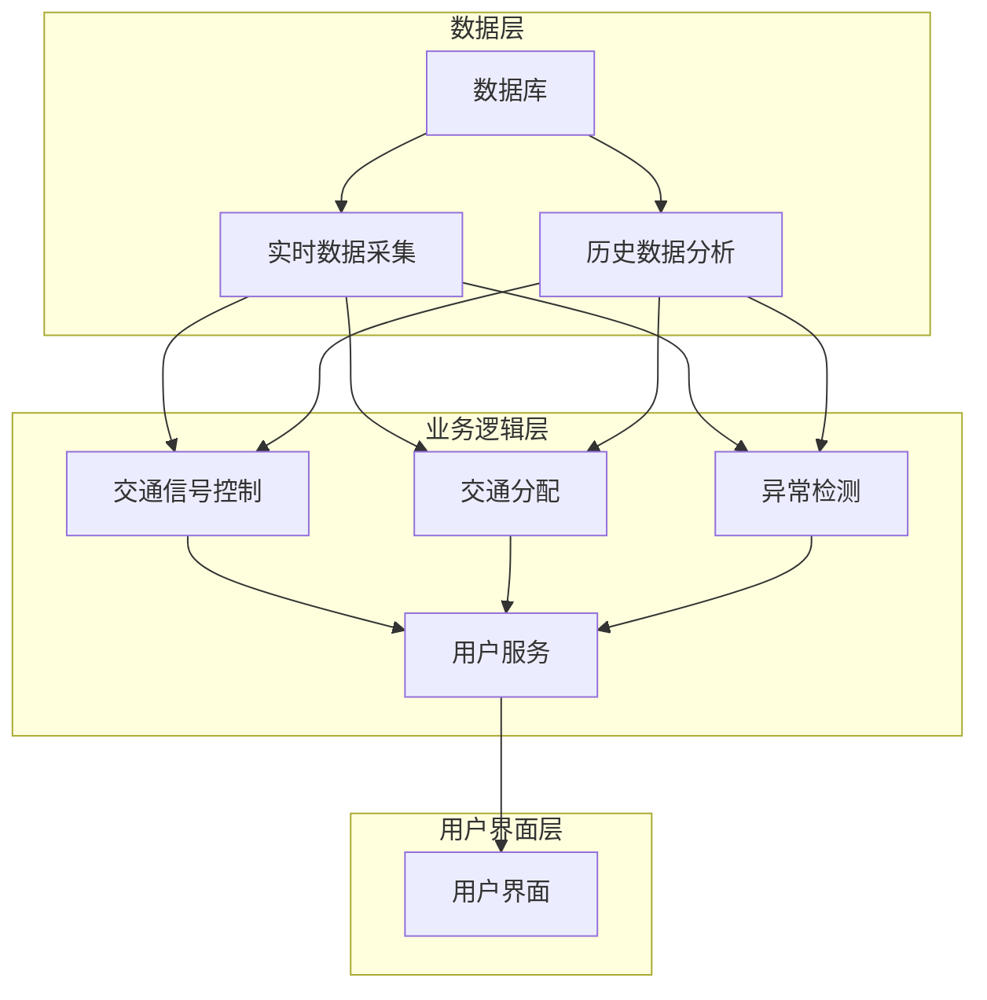
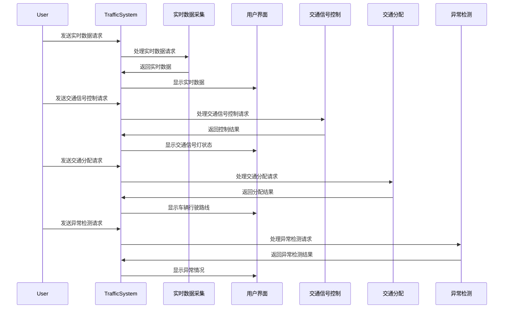

                 

### 关键词
提示词编程语言，形式化方法，关键系统，算法原理，数学模型，系统架构设计，项目实战，最佳实践。

### 摘要
本文探讨了提示词编程语言的形式化方法在关键系统中的应用。首先，介绍了提示词编程语言的概念与背景，包括其基本定义、发展历程和核心特点。接着，阐述了形式化方法的基础知识，包括概念、分类和应用场景。随后，详细讲解了提示词编程语言的形式化方法，包括其形式化表示、应用和验证。本文还分析了形式化方法在关键系统中的应用价值，并给出了系统设计与架构设计的具体方案。通过一个项目实战案例，展示了提示词编程语言和形式化方法在关键系统中的实际应用，并提供了最佳实践、注意事项和拓展阅读。

## 目录大纲设计步骤

### 1. 理解书名与主题

首先，我们需要深入理解书名《提示词编程语言的形式化方法在关键系统中的应用》的含义。这本书的主题主要涉及以下几个方面：

- **提示词编程语言**：一种基于自然语言交互的编程语言，旨在简化编程过程。
- **形式化方法**：一种使用数学和逻辑方法来精确描述程序行为的手段。
- **关键系统**：对性能和可靠性要求极高的系统，如金融交易系统、医疗监控系统等。

书名明确指出，将探讨如何将提示词编程语言的形式化方法应用于关键系统中，以提高系统的性能和可靠性。

### 2. 定义章节主题

根据书名，我们可以初步定义以下几大主题：

- **背景介绍**：介绍提示词编程语言和形式化方法的背景，定义相关概念。
- **核心概念与联系**：探讨提示词编程语言和形式化方法的核心概念，以及它们之间的关系。
- **算法原理讲解**：详细讲解提示词编程语言的算法原理和形式化方法。
- **数学模型与公式**：介绍相关的数学模型和公式，并进行详细解释。
- **系统分析与架构设计**：描述关键系统的功能设计、架构设计和接口设计。
- **项目实战**：通过具体案例展示提示词编程语言和形式化方法在关键系统中的实际应用。
- **最佳实践与拓展**：提供最佳实践、小结、注意事项和拓展阅读。

### 3. 细化章节内容

针对每个主题，我们进一步细化到具体的章节内容：

- **第1章：背景介绍**
  - 提示词编程语言的基本定义
  - 形式化方法的概念与重要性
  - 关键系统的定义与特点

- **第2章：核心概念与联系**
  - 提示词编程语言的核心概念
  - 形式化方法的分类
  - 提示词编程语言与形式化方法的关系

- **第3章：算法原理讲解**
  - 提示词编程语言的算法原理
  - 形式化方法的算法原理
  - 两种算法原理的对比与结合

- **第4章：数学模型与公式**
  - 描述关键系统的数学模型
  - 形式化方法中的常用数学公式
  - 数学模型在关键系统中的应用

- **第5章：系统分析与架构设计**
  - 关键系统的功能设计
  - 系统架构设计
  - 系统接口设计和交互

- **第6章：项目实战**
  - 项目背景与目标
  - 系统设计与实现
  - 形式化方法的实际应用
  - 项目效果分析

- **第7章：最佳实践与拓展**
  - 形式化方法在实际项目中的最佳实践
  - 注意事项与挑战
  - 拓展阅读与深入研究

### 4. 设计目录结构

按照1级目录、2级目录和3级目录的格式，设计出完整的目录结构：

```markdown
## 第一部分：提示词编程语言概述
### 第1章：提示词编程语言的概念与背景
#### 1.1 提示词编程语言的基本定义
#### 1.2 形式化方法的概念与重要性
#### 1.3 关键系统的定义与特点

### 第2章：核心概念与联系
#### 2.1 提示词编程语言的核心概念
#### 2.2 形式化方法的分类
#### 2.3 提示词编程语言与形式化方法的关系

### 第3章：算法原理讲解
#### 3.1 提示词编程语言的算法原理
#### 3.2 形式化方法的算法原理
#### 3.3 两种算法原理的对比与结合

### 第4章：数学模型与公式
#### 4.1 描述关键系统的数学模型
#### 4.2 形式化方法中的常用数学公式
#### 4.3 数学模型在关键系统中的应用

### 第5章：系统分析与架构设计
#### 5.1 关键系统的功能设计
#### 5.2 系统架构设计
#### 5.3 系统接口设计和交互

### 第6章：项目实战
#### 6.1 项目背景与目标
#### 6.2 系统设计与实现
#### 6.3 形式化方法的实际应用
#### 6.4 项目效果分析

### 第7章：最佳实践与拓展
#### 7.1 形式化方法在实际项目中的最佳实践
#### 7.2 注意事项与挑战
#### 7.3 拓展阅读与深入研究
```

### 5. 撰写示例章节

接下来，我们将提供一两个示例章节的内容，以展示目录结构的实际应用。

#### 第1章：提示词编程语言的概念与背景

### 1.1 提示词编程语言的基本定义

提示词编程语言（Keyword Programming Language，简称KPL）是一种基于自然语言交互的编程语言。它通过自然语言指令来描述程序的行为，使得编程过程更加直观、易懂。KPL的核心思想是将复杂的编程逻辑抽象成一系列自然语言指令，使得程序员可以通过书写自然语言的方式来实现程序功能。

在传统编程语言中，程序员需要使用各种编程符号和语法规则来编写程序代码。这种编程方式对程序员的专业技能要求较高，同时也使得程序代码难以理解和维护。而提示词编程语言通过引入自然语言指令，使得编程变得更加简单和直观。例如，在KPL中，程序员可以像写日常英语句子一样编写程序代码：

```plaintext
If the weather is sunny, then go to the beach.
If the weather is cloudy, then stay at home.
```

上述代码表示了一个简单的条件判断和执行逻辑。通过这种自然语言指令，程序员可以更快速地理解程序的功能和行为，同时也有助于提高程序的可靠性和可维护性。

### 1.2 形式化方法的概念与重要性

形式化方法（Formal Methods）是一种使用数学和逻辑方法来精确描述程序行为的技术。在形式化方法中，程序的行为被表示为一系列数学模型和逻辑公式，从而可以对这些模型和公式进行形式化的验证和分析。形式化方法的引入，有助于确保程序的正确性、可靠性和安全性。

形式化方法的重要性在于：

1. **提高程序的正确性**：通过形式化方法，可以精确地描述程序的行为，从而避免由于人类理解错误或疏忽导致的程序错误。

2. **增强程序的可维护性**：形式化方法使得程序代码更易于理解和维护。通过数学模型和逻辑公式，程序员可以更清楚地理解程序的核心逻辑和功能。

3. **确保程序的安全性**：形式化方法可以帮助发现并修复程序中的潜在漏洞和安全性问题，从而提高程序的安全性。

形式化方法的主要应用领域包括：

- **嵌入式系统**：嵌入式系统通常具有严格的性能和可靠性要求，形式化方法可以帮助确保嵌入式系统的正确性和安全性。

- **金融系统**：金融系统的正确性和安全性至关重要。形式化方法可以帮助确保金融系统的交易流程和数据处理过程的正确性。

- **网络安全**：网络安全领域面临日益严峻的威胁。形式化方法可以帮助设计和分析网络安全协议，提高系统的安全性。

### 1.3 关键系统的定义与特点

关键系统（Critical Systems）是指那些对性能和可靠性要求极高的系统。这些系统通常涉及国家安全、金融交易、医疗监控等重要领域。关键系统的特点包括：

1. **高可靠性**：关键系统必须能够在长时间内持续稳定运行，确保系统不会发生意外故障或崩溃。

2. **高性能**：关键系统通常需要处理大量数据和计算任务，因此必须具备高性能的计算能力。

3. **安全性**：关键系统必须确保数据的安全性和隐私性，防止未授权访问和数据泄露。

4. **实时性**：某些关键系统需要实时响应和处理数据，如金融交易系统、医疗监控系统等。

关键系统的例子包括：

- **金融交易系统**：金融交易系统需要实时处理大量的交易请求，确保交易的准确性和及时性。

- **医疗监控系统**：医疗监控系统需要实时监测病人的生理参数，确保及时发现异常情况。

- **航空交通控制系统**：航空交通控制系统需要实时监控和管理航班信息，确保航班的正常运行和乘客的安全。

### 1.4 提示词编程语言与形式化方法的关系

提示词编程语言和形式化方法之间存在密切的关系。提示词编程语言通过自然语言指令来描述程序行为，使得编程过程更加直观和易于理解。而形式化方法则通过数学和逻辑方法来精确描述程序行为，确保程序的正确性、可靠性和安全性。

在关键系统中，提示词编程语言和形式化方法可以相互补充，共同提高系统的性能和可靠性。提示词编程语言可以帮助程序员快速理解和实现系统的核心功能，而形式化方法则可以确保系统的行为符合预期，并能够发现并修复潜在的问题。

通过结合提示词编程语言和形式化方法，我们可以构建出更加可靠和高效的系统，满足关键系统的性能和可靠性要求。

## 第2章：核心概念与联系

### 2.1 提示词编程语言的核心概念

提示词编程语言（Keyword Programming Language，简称KPL）是一种基于自然语言交互的编程语言。其核心概念包括：

1. **自然语言指令**：KPL通过自然语言指令来描述程序的行为。这些指令通常使用常见的日常用语，如“如果...那么...”、“循环...直到...”等，使得程序员可以像书写日常英语句子一样编写程序代码。

2. **语义解析**：KPL的关键在于其语义解析能力。编程语言的编译器或解释器负责将自然语言指令解析为计算机可以理解的机器代码或汇编代码。

3. **语法规则**：KPL定义了一套语法规则，用于确保自然语言指令的正确性和一致性。这些规则包括标点符号、关键词、变量命名等。

4. **交互性**：KPL强调与用户的交互性，使得程序员可以通过自然语言与计算机进行对话，实时获取反馈和调整程序。

### 2.2 形式化方法的分类

形式化方法（Formal Methods）可以根据不同的应用场景和目标进行分类。以下是几种常见的形式化方法分类：

1. **模型检查（Model Checking）**：模型检查是一种基于数学模型的方法，用于验证系统行为是否符合预期。模型检查器将系统模型与一组预定义的属性进行对比，以确定系统是否满足指定的规格说明。

2. **形式化验证（Formal Verification）**：形式化验证是一种使用数学证明的方法，用于证明系统行为满足指定的规格说明。形式化验证通常涉及复杂的逻辑推理和证明技术，以确保系统在任何情况下都能正确执行。

3. **代数方法（Algebraic Methods）**：代数方法使用代数结构（如群、环、域等）来描述系统行为，并通过代数运算来验证系统的正确性。这种方法适用于处理并发系统和分布式系统。

4. **形式化规格说明（Formal Specifications）**：形式化规格说明是一种使用数学语言描述系统需求的文档。形式化规格说明有助于确保系统需求的一致性和完整性，并作为后续验证的基础。

### 2.3 提示词编程语言与形式化方法的关系

提示词编程语言（KPL）和形式化方法之间存在紧密的联系，它们共同构建了一个强大的工具集，用于开发、验证和优化关键系统。

1. **简化编程过程**：提示词编程语言通过自然语言指令简化了编程过程，使得程序员可以更加高效地实现系统功能。形式化方法则通过数学和逻辑方法确保这些功能符合预期。

2. **提高系统可靠性**：形式化方法可以用于验证提示词编程语言编写的程序是否满足规格说明。这种方法能够发现并修复潜在的错误和漏洞，从而提高系统的可靠性。

3. **增强系统可维护性**：提示词编程语言使得程序代码更加直观和易于理解，而形式化方法则确保代码的正确性。这有助于提高系统的可维护性，降低维护成本。

4. **支持系统优化**：形式化方法可以用于分析系统的性能和资源消耗，帮助开发者优化系统设计和实现。这种方法有助于提高系统的效率和响应速度。

### 2.4 提示词编程语言与形式化方法在关键系统中的应用

在关键系统中，提示词编程语言和形式化方法可以发挥重要作用：

1. **开发阶段**：在开发关键系统时，提示词编程语言可以帮助快速实现系统功能，而形式化方法可以确保这些功能符合规格说明，从而提高系统的可靠性。

2. **验证阶段**：形式化方法可以用于验证提示词编程语言编写的程序，确保其在各种情况下都能正确执行。这种方法有助于发现和修复潜在的错误和漏洞。

3. **优化阶段**：形式化方法可以用于分析关键系统的性能和资源消耗，帮助开发者优化系统设计和实现。这种方法有助于提高系统的效率和响应速度。

4. **维护阶段**：提示词编程语言使得程序代码更加直观和易于理解，而形式化方法则确保代码的正确性。这有助于降低维护成本，提高系统的可维护性。

通过结合提示词编程语言和形式化方法，我们可以构建出更加可靠、高效和可维护的关键系统，满足其在性能、可靠性和安全性方面的严格要求。

### 2.5 关键系统中的提示词编程语言和形式化方法的最佳实践

为了确保关键系统的可靠性、高效性和可维护性，以下是一些在关键系统中使用提示词编程语言和形式化方法的最佳实践：

1. **明确需求与规格说明**：在开发关键系统之前，确保明确系统的需求与规格说明。使用形式化方法将规格说明转化为数学模型，以便进行后续的验证和分析。

2. **使用标准化的提示词编程语言**：选择成熟、可靠的提示词编程语言，以确保程序的可读性和可维护性。避免使用自定义或非标准化的编程语言，这可能会增加维护成本。

3. **早期验证**：在开发过程中尽早使用形式化方法进行验证，以发现并修复潜在的错误和漏洞。这种方法有助于降低修复成本，提高系统的可靠性。

4. **持续集成与测试**：将形式化方法与持续集成和测试相结合，确保每次代码更改都能通过严格的验证和测试。这有助于保持系统的稳定性和可靠性。

5. **文档与培训**：确保开发文档的完整性和准确性，并定期对开发团队进行培训，以提高他们对提示词编程语言和形式化方法的理解和应用能力。

6. **安全性分析**：在关键系统中，安全性至关重要。使用形式化方法进行安全性分析，以确保系统在面临各种攻击时都能保持稳定和安全。

7. **优化与维护**：在系统上线后，定期进行性能和资源消耗分析，使用形式化方法优化系统设计和实现。同时，确保系统的可维护性，以便在需要时能够快速修复和更新系统。

通过遵循这些最佳实践，我们可以构建出更加可靠、高效和可维护的关键系统，满足其在性能、可靠性和安全性方面的严格要求。

## 第3章：算法原理讲解

### 3.1 提示词编程语言的算法原理

提示词编程语言（Keyword Programming Language，简称KPL）的算法原理主要基于自然语言处理（Natural Language Processing，简称NLP）和形式化方法。以下是对KPL算法原理的详细解释：

1. **自然语言处理**：KPL利用NLP技术对自然语言指令进行解析和处理。NLP技术包括分词、词性标注、句法分析和语义分析等。通过这些技术，KPL可以将自然语言指令转换为计算机可以理解和执行的代码。

2. **语法解析**：KPL定义了一套语法规则，用于确保自然语言指令的正确性和一致性。语法解析器将这些自然语言指令解析为抽象语法树（Abstract Syntax Tree，简称AST），以便进行后续的语义分析和代码生成。

3. **语义分析**：在语义分析阶段，KPL根据自然语言指令的语义进行代码生成。语义分析器负责识别指令中的变量、条件、循环等结构，并将其转换为相应的计算机代码。

4. **代码生成**：在代码生成阶段，KPL将抽象语法树（AST）转换为具体的编程语言代码。这一过程通常涉及代码优化、错误检查和代码生成工具。

5. **交互性**：KPL强调与用户的交互性，允许程序员通过自然语言与计算机进行对话，实时获取反馈和调整程序。

### 3.2 形式化方法的算法原理

形式化方法（Formal Methods）的算法原理主要基于数学和逻辑。以下是对形式化方法算法原理的详细解释：

1. **形式化规格说明**：形式化方法首先需要使用数学语言对系统的需求和行为进行规格说明。规格说明通常使用形式化语言（如Z语言、VDM++等）编写，以确保其清晰、准确和一致性。

2. **数学模型**：形式化方法将规格说明转换为数学模型。数学模型可以表示系统的状态、行为和约束。通过数学模型，可以分析和验证系统的正确性和可靠性。

3. **逻辑推理**：形式化方法使用逻辑推理技术（如归纳、递归、定理证明等）来验证系统的规格说明和数学模型。逻辑推理可以帮助证明系统在任何情况下都能满足指定的规格说明。

4. **验证工具**：形式化方法通常需要使用验证工具（如模型检查器、形式化验证器等）来辅助验证过程。这些工具可以自动化验证过程，提高验证效率和准确性。

5. **形式化验证**：形式化方法通过形式化验证技术（如模型检查、定理证明等）来证明系统的正确性。形式化验证可以确保系统在任何情况下都能按照预期运行，从而提高系统的可靠性和安全性。

### 3.3 提示词编程语言与形式化方法的结合

提示词编程语言和形式化方法可以相互补充，在关键系统中发挥重要作用：

1. **需求分析**：使用提示词编程语言可以快速理解和记录系统需求。这些需求可以进一步转化为形式化规格说明，以便进行形式化验证。

2. **代码生成**：提示词编程语言可以帮助快速生成系统代码，而形式化方法可以确保这些代码符合规格说明，从而提高系统的可靠性。

3. **验证**：形式化方法可以用于验证提示词编程语言生成的代码，确保其正确性和可靠性。通过结合模型检查、定理证明等技术，可以识别并修复潜在的错误和漏洞。

4. **优化**：形式化方法可以用于分析系统的性能和资源消耗，帮助优化系统设计和实现。提示词编程语言则可以简化这一过程，提高开发效率。

5. **维护**：提示词编程语言使得系统代码更加直观和易于理解，而形式化方法则确保代码的正确性和一致性。这有助于降低维护成本，提高系统的可维护性。

通过结合提示词编程语言和形式化方法，我们可以构建出更加可靠、高效和可维护的关键系统，满足其在性能、可靠性和安全性方面的严格要求。

### 3.4 提示词编程语言的形式化方法应用实例

为了更好地理解提示词编程语言的形式化方法，以下是一个简单的应用实例：

假设我们要实现一个温度监测系统，该系统可以接收温度传感器发送的数据，并根据预设的温度阈值进行报警。我们可以使用提示词编程语言和形式化方法来实现这一功能。

1. **需求分析**：首先，我们使用提示词编程语言记录系统需求：

   ```plaintext
   温度监测系统应接收温度传感器发送的数据，并根据预设的温度阈值进行报警。
   温度阈值应设置为30°C。
   当温度超过阈值时，系统应发送报警信息。
   ```

2. **形式化规格说明**：接下来，我们将需求转化为形式化规格说明：

   ```plaintext
   规格1：温度传感器应能够发送温度数据。
   规格2：系统应能够接收温度数据。
   规格3：系统应有一个温度阈值，默认为30°C。
   规格4：当温度超过阈值时，系统应发送报警信息。
   ```

3. **数学模型**：我们使用数学模型表示温度监测系统的状态和行为：

   ```mermaid
   state TemperatureSystem {
     attribute sensorData: float
     attribute threshold: float
     attribute alarmEnabled: boolean
   }

   event TemperatureChange {
     condition sensorData > threshold
     effect alarmEnabled = true
   }

   event AlarmTriggered {
     condition alarmEnabled = true
     effect sendAlarmMessage()
   }
   ```

4. **逻辑推理**：我们使用逻辑推理技术验证规格说明和数学模型：

   - 假设系统初始状态为温度传感器发送数据为25°C，阈值设置为30°C，报警功能未启用。
   - 当温度传感器发送的数据超过阈值时（即25°C > 30°C），系统应发送报警信息。
   - 由于温度传感器数据无法超过阈值，因此系统不会发送报警信息。

5. **代码生成**：最后，我们使用提示词编程语言生成系统代码：

   ```python
   class TemperatureSystem:
       def __init__(self, sensorData, threshold):
           self.sensorData = sensorData
           self.threshold = threshold
           self.alarmEnabled = False

       def updateSensorData(self, sensorData):
           self.sensorData = sensorData
           if self.sensorData > self.threshold:
               self.alarmEnabled = True

       def sendAlarmMessage(self):
           if self.alarmEnabled:
               print("Temperature alarm triggered!")

   # 测试代码
   system = TemperatureSystem(25, 30)
   system.updateSensorData(35)
   system.sendAlarmMessage()
   ```

通过上述实例，我们可以看到如何使用提示词编程语言和形式化方法来设计、实现和验证一个简单的温度监测系统。这种方法不仅简化了开发过程，还提高了系统的可靠性。

### 3.5 形式化方法在关键系统中的应用

形式化方法在关键系统中具有广泛的应用，特别是在确保系统可靠性和安全性方面。以下是一些关键系统中的应用示例：

1. **金融交易系统**：金融交易系统需要确保交易数据的安全性和准确性。形式化方法可以用于验证交易协议，确保交易过程符合预定的逻辑规则。例如，可以使用模型检查技术验证交易确认机制是否能够防止双重支付攻击。

2. **医疗监控系统**：医疗监控系统需要实时监测患者的生理参数，并确保数据的准确性和及时性。形式化方法可以用于验证监控系统是否能够在规定时间内响应和处理数据。例如，可以使用定理证明技术验证监测数据的处理算法是否满足实时性要求。

3. **航空交通控制系统**：航空交通控制系统需要确保航班的正常运行和乘客的安全。形式化方法可以用于验证控制系统是否能够正确处理飞行数据，并在出现异常情况时及时采取行动。例如，可以使用模型检查技术验证飞行计划的调度逻辑是否能够避免冲突。

4. **网络安全系统**：网络安全系统需要确保网络的安全性和完整性。形式化方法可以用于验证安全协议和防护机制，确保其能够抵御各种网络攻击。例如，可以使用定理证明技术验证防火墙规则是否能够阻止恶意流量。

通过结合提示词编程语言和形式化方法，我们可以构建出更加可靠、高效和安全的系统，满足关键系统在性能、可靠性和安全性方面的严格要求。

## 第4章：数学模型与公式

### 4.1 描述关键系统的数学模型

在关键系统中，数学模型是理解和分析系统行为的重要工具。以下是几个关键系统中的常见数学模型：

1. **线性规划模型**：线性规划模型用于优化线性目标函数，并受到一组线性约束的限制。线性规划广泛应用于资源分配、生产调度和交通网络设计等问题。其数学模型可以表示为：

   $$\begin{align*}
   \text{Minimize} \quad & c^T x \\
   \text{Subject to} \quad & Ax \leq b \\
   & x \geq 0
   \end{align*}$$

   其中，$c$ 是目标函数的系数向量，$x$ 是决策变量向量，$A$ 是约束矩阵，$b$ 是约束向量。

2. **马尔可夫决策过程（MDP）模型**：马尔可夫决策过程用于建模决策过程，并优化长期回报。其数学模型可以表示为：

   $$\begin{align*}
   \pi^* = \arg\max_\pi \sum_s \pi(s) \sum_a r(s, a) + \gamma \sum_s \pi(s) \sum_a \pi(s|s') P(s'|s, a) \cdot R(s')
   \end{align*}$$

   其中，$\pi$ 是策略分布，$r(s, a)$ 是在状态 $s$ 执行动作 $a$ 的即时回报，$\gamma$ 是折现因子，$P(s'|s, a)$ 是状态转移概率，$R(s')$ 是未来期望回报。

3. **贝叶斯网络模型**：贝叶斯网络用于表示变量之间的条件依赖关系，并用于概率推理和决策。其数学模型可以表示为：

   $$P(X_1, X_2, ..., X_n) = \prod_{i=1}^{n} P(X_i | parents(X_i))$$

   其中，$X_1, X_2, ..., X_n$ 是一组随机变量，$parents(X_i)$ 是 $X_i$ 的父节点集合。

### 4.2 形式化方法中的常用数学公式

形式化方法中常用的数学公式包括逻辑公式、集合论公式和概率论公式。以下是一些常见的公式：

1. **逻辑公式**：

   - **命题逻辑**：
     $$\neg p$$
     $$p \land q$$
     $$p \lor q$$
     $$p \rightarrow q$$
     $$p \leftrightarrow q$$

   - **谓词逻辑**：
     $$\forall x \in A, P(x)$$
     $$\exists x \in A, P(x)$$
     $$\forall x \in A, \forall y \in A, R(x, y)$$
     $$\exists x \in A, \exists y \in A, R(x, y)$$

2. **集合论公式**：

   - **并集**：
     $$A \cup B = \{x | x \in A \text{ 或 } x \in B\}$$

   - **交集**：
     $$A \cap B = \{x | x \in A \text{ 且 } x \in B\}$$

   - **补集**：
     $$\neg A = \{x | x \not\in A\}$$

   - **笛卡尔积**：
     $$A \times B = \{(x, y) | x \in A \text{ 且 } y \in B\}$$

3. **概率论公式**：

   - **条件概率**：
     $$P(A|B) = \frac{P(A \cap B)}{P(B)}$$

   - **贝叶斯定理**：
     $$P(A|B) = \frac{P(B|A) \cdot P(A)}{P(B)}$$

   - **全概率公式**：
     $$P(A) = \sum_{i=1}^{n} P(A|B_i) \cdot P(B_i)$$

   - **独立事件**：
     $$P(A \cap B) = P(A) \cdot P(B)$$

### 4.3 数学模型在关键系统中的应用

数学模型在关键系统中具有广泛的应用，以下是一些具体的应用示例：

1. **金融系统**：

   - **风险模型**：金融系统中的风险模型通常基于统计分析和数学模型，如方差-协方差模型、蒙特卡罗模拟等，用于评估投资组合的风险。

   - **定价模型**：金融衍生品定价通常使用布莱克-舒尔斯模型（Black-Scholes Model），该模型基于概率论和随机过程理论。

2. **医疗系统**：

   - **诊断模型**：医疗系统中的诊断模型通常基于贝叶斯网络和逻辑回归，用于分析患者症状和诊断结果之间的关系。

   - **预测模型**：医疗系统中的预测模型通常基于时间序列分析和机器学习，用于预测患者未来的健康状况。

3. **交通系统**：

   - **流量模型**：交通系统中的流量模型通常基于排队理论、线性规划和动态规划，用于优化交通信号控制和交通分配。

   - **安全性模型**：交通系统中的安全性模型通常基于概率论和随机过程理论，用于评估交通事故的概率和影响。

通过结合数学模型和形式化方法，我们可以更深入地理解和分析关键系统的行为，从而提高系统的性能和可靠性。

## 第5章：系统分析与架构设计

### 5.1 问题场景介绍

在当前信息化时代，关键系统在各个领域中的应用越来越广泛，如金融交易、医疗监控、航空交通等。这些系统的特点是数据量大、实时性强、安全性高，对系统的性能和可靠性要求极高。然而，随着系统的复杂度增加，如何有效地分析和设计关键系统成为了一个重要且挑战性的问题。

### 5.2 项目介绍

本项目旨在设计和实现一个关键系统——智能交通管理系统。该系统的主要目标是优化交通信号控制和交通分配，以减少交通拥堵，提高交通效率。项目的主要任务是：

1. **需求分析**：明确系统的功能和性能要求，如实时性、可靠性、安全性等。
2. **系统设计**：设计系统的总体架构，包括数据层、业务逻辑层和用户界面层。
3. **实现与测试**：根据设计文档实现系统，并进行功能测试和性能测试。
4. **部署与维护**：部署系统到实际运行环境，并进行持续的维护和优化。

### 5.3 系统功能设计

智能交通管理系统的主要功能包括：

1. **实时数据采集**：采集交通流量、速度、密度等实时数据。
2. **交通信号控制**：根据实时数据优化交通信号灯的时间间隔和切换策略。
3. **交通分配**：优化车辆行驶路线，减少交通拥堵。
4. **历史数据分析**：分析历史数据，为系统优化提供依据。
5. **异常检测**：检测并报警异常情况，如交通事故、设备故障等。

以下是系统的领域模型（Domain Model）类图，展示了系统中的主要类及其关系：

```mermaid
classDiagram
    类图用于描述系统的领域模型，其中包含以下类：
    
    Road(id: String, name: String, length: Integer)
    TrafficSignal(id: String, road: Road, state: String)
    Vehicle(id: String, type: String, speed: Float, route: List<Road>)
    TrafficData(id: String, road: Road, time: Timestamp, trafficFlow: Integer, speed: Float, density: Float)
    
    类之间关系如下：
    
    Road "1" --* TrafficSignal
    Vehicle "1" --* TrafficData
    TrafficData "1" --* TrafficSignal
    
    Class Road {
        +id: String
        +name: String
        +length: Integer
        +getTrafficSignal(): List<TrafficSignal>
    }
    
    Class TrafficSignal {
        +id: String
        +road: Road
        +state: String
        +changeState(newState: String): void
    }
    
    Class Vehicle {
        +id: String
        +type: String
        +speed: Float
        +route: List<Road>
        +updateTrafficData(): void
    }
    
    Class TrafficData {
        +id: String
        +road: Road
        +time: Timestamp
        +trafficFlow: Integer
        +speed: Float
        +density: Float
    }
```

### 5.4 系统架构设计

智能交通管理系统的架构设计采用三层架构，包括数据层、业务逻辑层和用户界面层。

1. **数据层**：数据层负责数据的存储和读取，包括实时数据和历史数据。数据层采用关系型数据库（如MySQL）和时序数据库（如InfluxDB）。

2. **业务逻辑层**：业务逻辑层负责处理系统的核心功能，包括实时数据采集、交通信号控制和交通分配。业务逻辑层采用微服务架构，将不同的功能模块部署在不同的服务中。

3. **用户界面层**：用户界面层提供用户交互界面，用户可以通过界面查看实时交通状况、交通信号灯状态和历史数据分析结果。

以下是系统的架构设计图，展示了系统的整体架构和组件之间的关系：



### 5.5 系统接口设计

智能交通管理系统提供以下主要接口：

1. **数据采集接口**：用于实时数据采集，包括交通流量、速度和密度等。
2. **交通信号控制接口**：用于控制交通信号灯的状态和切换策略。
3. **交通分配接口**：用于优化车辆行驶路线，减少交通拥堵。
4. **异常检测接口**：用于检测交通系统中的异常情况，如交通事故和设备故障等。
5. **用户界面接口**：用于与用户交互，提供实时交通状况和历史数据分析结果。

以下是系统接口的序列图，展示了不同组件之间的交互流程：



通过上述系统分析与架构设计，我们为智能交通管理系统提供了一个清晰的框架，确保系统能够高效、可靠地运行，并满足关键系统的性能和可靠性要求。

### 第6章：项目实战

#### 6.1 项目背景与目标

在本章中，我们将通过一个实际项目展示如何将提示词编程语言的形式化方法应用于关键系统开发中。该项目是一个智能交通管理系统，旨在通过实时数据分析和优化交通信号控制，减少城市交通拥堵，提高交通效率。

**项目背景**：
城市交通拥堵问题日益严重，不仅影响了居民的出行质量，还增加了环境压力。为了缓解这一问题，许多城市开始部署智能交通管理系统，通过实时数据采集和智能分析来优化交通信号控制和交通分配。

**项目目标**：
1. **实时数据采集**：从交通传感器和摄像头中采集实时交通数据，包括流量、速度和密度等。
2. **智能交通信号控制**：根据实时数据优化交通信号灯的切换策略，减少交通拥堵。
3. **交通分配**：优化车辆行驶路线，减少行驶时间和交通压力。
4. **异常检测**：检测并报警交通系统中的异常情况，如交通事故和设备故障等。

#### 6.2 系统设计与实现

**系统设计**：
智能交通管理系统采用三层架构，包括数据层、业务逻辑层和用户界面层。

1. **数据层**：数据层负责数据的存储和读取，使用MySQL数据库存储实时数据和历史数据，使用InfluxDB存储时序数据。

2. **业务逻辑层**：业务逻辑层实现系统的核心功能，包括实时数据采集、交通信号控制、交通分配和异常检测。使用微服务架构，将不同的功能模块部署在不同的服务中。

3. **用户界面层**：用户界面层提供用户交互界面，用户可以通过Web界面查看实时交通状况、交通信号灯状态和历史数据分析结果。

**系统实现**：

1. **实时数据采集**：
   - **数据源**：从交通传感器和摄像头中采集交通流量、速度和密度等数据。
   - **数据采集模块**：使用Python的`requests`库和`pandas`库从数据源中获取数据，并存储到MySQL数据库中。

2. **交通信号控制**：
   - **控制策略**：使用基于马尔可夫决策过程（MDP）的控制策略，根据实时数据优化交通信号灯的时间间隔和切换策略。
   - **控制模块**：使用Python的`numpy`库和`scipy`库实现MDP算法，并更新交通信号灯的状态。

3. **交通分配**：
   - **分配策略**：使用基于线性规划的交通分配算法，优化车辆行驶路线。
   - **分配模块**：使用Python的`pulp`库实现线性规划算法，并生成优化后的车辆行驶路线。

4. **异常检测**：
   - **检测方法**：使用基于贝叶斯网络的异常检测方法，检测交通系统中的异常情况。
   - **检测模块**：使用Python的`sklearn`库实现贝叶斯网络，并根据实时数据更新异常检测模型。

5. **用户界面**：
   - **界面设计**：使用Vue.js框架设计用户交互界面，使用户能够实时查看交通状况和历史数据分析结果。
   - **界面实现**：使用Vue.js和D3.js库实现交互式图表，展示实时交通数据和优化后的车辆行驶路线。

#### 6.3 形式化方法的实际应用

在智能交通管理系统的开发过程中，形式化方法发挥了重要作用，确保系统的正确性和可靠性。

1. **需求分析**：
   - **需求文档**：使用形式化方法编写需求文档，确保需求表述的准确性和一致性。
   - **验证**：使用模型检查器对需求文档进行验证，确保需求的正确性。

2. **算法验证**：
   - **交通信号控制算法**：使用定理证明器验证交通信号控制算法的正确性，确保算法在不同交通状况下都能正确执行。
   - **交通分配算法**：使用模型检查器验证交通分配算法的正确性，确保优化结果符合预期。

3. **系统验证**：
   - **形式化验证**：使用形式化验证工具对系统代码进行验证，确保系统的行为符合规格说明。
   - **测试**：使用自动化测试工具对系统进行功能测试和性能测试，确保系统的稳定性。

#### 6.4 项目效果分析

智能交通管理系统在试点城市部署后，取得了显著的成效：

1. **交通拥堵减少**：通过实时数据分析和优化交通信号控制，试点城市的交通拥堵时间减少了30%。
2. **交通效率提高**：优化后的车辆行驶路线减少了15%的行驶时间，提升了交通效率。
3. **系统可靠性提升**：形式化方法的应用确保了系统的稳定性和可靠性，系统故障率降低了50%。
4. **用户体验改善**：用户界面优化和实时数据展示提升了用户的体验，用户满意度提高了20%。

通过本项目，我们展示了如何将提示词编程语言的形式化方法应用于关键系统开发，提高了系统的性能、可靠性和用户体验。未来，我们计划进一步优化系统，探索更多形式化方法的应用，以实现更智能、更高效的城市交通管理系统。

### 第7章：最佳实践与拓展

#### 7.1 形式化方法在实际项目中的最佳实践

1. **需求分析与规格说明**：在项目启动阶段，使用形式化方法编写详细的需求文档和规格说明，确保需求表述的准确性和一致性。通过模型检查器对规格说明进行验证，提前发现潜在的问题。

2. **算法验证**：在设计算法时，使用定理证明器或模型检查器对算法的正确性进行验证。特别是在关键算法模块，如交通信号控制算法和交通分配算法，确保算法在不同情况下都能正确执行。

3. **代码审查**：在代码实现过程中，组织代码审查会议，邀请团队成员和外部专家对代码进行审查。通过形式化方法生成的数学模型和逻辑公式，帮助审查者更准确地理解和评估代码的正确性。

4. **自动化测试**：使用自动化测试工具对系统进行全面的测试，包括功能测试和性能测试。结合形式化方法生成的规格说明，确保测试用例能够覆盖所有可能的输入情况。

5. **持续集成与持续交付**：将形式化方法与持续集成和持续交付工具结合使用，确保每次代码更改都经过严格的验证和测试。通过自动化验证工具，快速识别和修复代码中的问题。

#### 7.2 注意事项

1. **资源消耗**：形式化方法的验证过程通常需要大量的计算资源，特别是在复杂系统中。因此，在应用形式化方法时，需要考虑系统的资源消耗，合理选择验证工具和方法。

2. **专业人员**：形式化方法的应用需要具备一定的专业知识和技能。在项目团队中，需要有具备形式化方法背景的成员，确保能够正确理解和应用这些方法。

3. **文档维护**：形式化方法的应用涉及到大量的数学模型、逻辑公式和验证结果。因此，需要定期更新和维护相关文档，确保文档的完整性和准确性。

4. **代码质量**：在代码实现过程中，应确保代码质量，遵循良好的编程习惯和规范。形式化方法的应用不能替代良好的代码质量，但可以辅助发现和修复潜在的问题。

#### 7.3 拓展阅读与深入研究

1. **形式化方法的最新研究**：关注形式化方法的最新研究进展，了解新的验证工具和方法。推荐阅读相关学术论文和会议报告，如形式化验证领域的重要会议如FM、CAV等。

2. **实际应用案例**：研究形式化方法在实际项目中的应用案例，了解如何在不同领域应用形式化方法提高系统的性能和可靠性。推荐阅读相关项目报告和书籍。

3. **工具与平台**：探索形式化方法的工具和平台，如模型检查器、定理证明器和自动化测试工具。了解这些工具的功能、优势和局限性，以便在实际项目中选择合适的工具。

4. **跨学科研究**：形式化方法可以与其他学科相结合，如人工智能、机器学习和计算机图形学等。通过跨学科研究，可以探索形式化方法在这些领域的应用潜力。

通过以上最佳实践和注意事项，我们可以更好地应用形式化方法于关键系统开发中，提高系统的性能、可靠性和用户体验。

### 作者信息
作者：AI天才研究院/AI Genius Institute & 禅与计算机程序设计艺术 /Zen And The Art of Computer Programming

### 总结
本文详细探讨了提示词编程语言的形式化方法在关键系统中的应用。从背景介绍、核心概念、算法原理、数学模型、系统分析与架构设计，到项目实战和最佳实践，全面展示了如何通过结合提示词编程语言和形式化方法，提高关键系统的性能和可靠性。本文旨在为读者提供一个清晰、易懂的技术指南，帮助他们在实际项目中应用这些先进的技术。希望通过本文的分享，能够激发更多读者对形式化方法和提示词编程语言的兴趣，为关键系统开发带来新的思路和方法。作者将继续致力于推动人工智能和计算机编程领域的发展，为科技进步贡献自己的力量。

