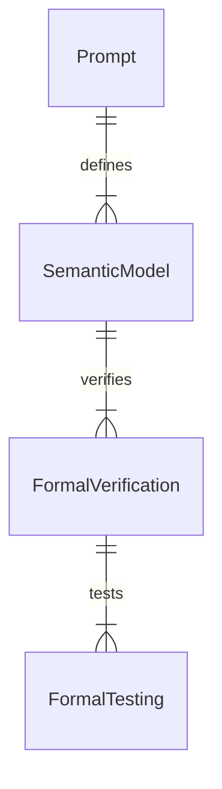
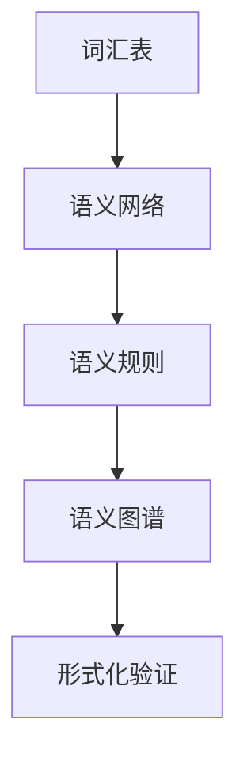

                 

## 让我们一起深入思考：提示词编程语言的形式化方法支持

### 引言

在人工智能和自然语言处理领域，提示词编程语言（Prompt-Based Programming Languages）正逐渐成为研究的热点。这种语言通过使用预定义的提示词，来引导程序执行特定的任务。形式化方法（Formal Methods）为提示词编程语言提供了一种严格的、数学化的验证手段，以提升其可靠性和可维护性。本文将围绕提示词编程语言的形式化方法支持进行深入探讨。

### 核心关键词

- 提示词编程语言
- 形式化方法
- 形式化验证
- 语义模型
- 编程语言设计

### 摘要

本文首先介绍了提示词编程语言的基本概念及其形式化方法的应用背景。接着，详细分析了形式化方法在提示词编程语言中的关键作用，包括语法和语义的形式化验证。随后，探讨了提示词编程语言的开发流程和具体应用案例。最后，对全文进行了总结，并展望了该领域的发展趋势和未来研究方向。

## 文章目录

### 第一部分：背景与引言

- **第1章：背景介绍**
  - 提示词编程语言概述
  - 形式化方法的概念与应用
  - 提示词编程语言的形式化需求

- **第2章：形式化方法的原理**
  - 形式化方法的基本概念
  - 形式化方法的关键技术
  - 形式化方法的应用领域

- **第3章：提示词编程语言的核心机制**
  - 提示词的生成与优化
  - 提示词的语义分析与处理
  - 提示词编程语言的语义模型

- **第4章：形式化方法的支持策略**
  - 提示词编程语言的语法形式化
  - 提示词编程语言的语义形式化
  - 形式化验证与测试方法

### 第二部分：形式化方法在提示词编程语言中的应用

- **第5章：形式化方法在提示词编程语言中的应用**
  - 提示词编程语言的开发流程
  - 形式化方法在编程语言设计中的应用
  - 提示词编程语言的案例分析

- **第6章：案例研究**
  - 案例一：基于形式化方法的提示词生成
  - 案例二：形式化方法在提示词编程语言中的优化
  - 案例三：形式化验证在提示词编程语言中的应用

### 第三部分：总结与展望

- **第7章：总结与展望**
  - 全书总结
  - 形式化方法的发展趋势
  - 未来研究方向

### 文章结构设计

在文章结构设计中，我们将遵循以下步骤来构建文章的框架：

1. **引言部分**：介绍提示词编程语言的基本概念和形式化方法的背景，为后续讨论打下基础。
2. **核心原理部分**：详细讲解形式化方法的基本概念、关键技术及其应用领域，为理解后续内容提供理论支持。
3. **核心机制部分**：分析提示词编程语言的核心机制，包括提示词的生成、语义分析与处理，以及语义模型。
4. **支持策略部分**：探讨如何将形式化方法应用于提示词编程语言的语法和语义验证，以及验证和测试方法。
5. **应用实践部分**：通过具体的开发流程和案例分析，展示形式化方法在提示词编程语言中的实际应用。
6. **总结与展望部分**：对全文内容进行总结，并提出未来研究方向，为该领域的发展提供参考。

通过上述设计，文章不仅逻辑清晰，而且内容丰富，能够帮助读者全面了解提示词编程语言的形式化方法支持。

### 第1章：背景介绍

#### 提示词编程语言概述

提示词编程语言（Prompt-Based Programming Languages）是一种专门设计用于处理自然语言输入的编程语言。其核心理念是利用预定义的提示词（prompts）来引导程序的执行。这些提示词通常包含一系列的关键词、指令和参数，通过组合和替换，可以生成用于解决特定问题的程序代码。

提示词编程语言的起源可以追溯到自然语言处理（NLP）和计算机程序设计领域的交叉研究。早期的自然语言理解系统（如Elizabot和 SHRDLU）就采用了类似提示词的方法来模拟对话和执行任务。随着人工智能和深度学习技术的不断发展，提示词编程语言逐渐演变成为现代编程语言的一种重要分支。

#### 形式化方法的概念与应用

形式化方法（Formal Methods）是一种使用数学和逻辑来验证和证明软件系统正确性的方法。这种方法的核心在于将系统的设计和验证过程转化为形式化的数学模型，从而确保系统能够按照预定的规格要求运行。

形式化方法在软件工程中的应用非常广泛，尤其是在那些要求高可靠性和安全性的领域，如航空航天、医疗设备和金融系统等。通过形式化方法，可以系统地分析和验证软件系统的行为，确保其符合预期的规格要求，减少错误和漏洞。

#### 提示词编程语言的形式化需求

提示词编程语言具有以下几方面的形式化需求：

1. **语法形式化**：确保提示词编程语言的语法规则被形式化地定义，以避免语法错误和不一致的代码生成。

2. **语义形式化**：建立提示词编程语言的语义模型，以描述提示词的含义和作用。这有助于理解提示词如何影响程序的执行，并提供一种形式化的验证手段。

3. **形式化验证**：使用形式化方法验证提示词编程语言生成的代码是否符合预期的行为规格，确保其正确性和可靠性。

4. **形式化测试**：通过形式化方法设计测试用例，以验证提示词编程语言生成的代码在各种情况下的行为。

#### 问题背景

随着人工智能技术的发展，自然语言处理系统在理解和使用自然语言方面取得了显著进步。然而，现有的编程语言在处理自然语言输入时存在诸多挑战，如语法理解的不准确性、语义理解的模糊性等。这些挑战限制了自然语言处理系统在实际应用中的性能。

为了解决这一问题，研究人员提出了提示词编程语言的概念，通过预定义的提示词来引导程序的执行。然而，传统的编程语言缺乏对自然语言处理系统的支持，导致提示词编程语言在实际应用中面临着语法和语义验证的难题。

#### 问题描述

提示词编程语言的形式化方法支持主要包括以下几个方面的问题：

1. **语法验证**：如何确保提示词编程语言的语法规则得到严格的形式化定义，从而避免语法错误和代码生成不一致的问题。

2. **语义理解**：如何建立提示词编程语言的语义模型，以准确描述提示词的含义和作用，并提供一种形式化的验证手段。

3. **形式化验证**：如何使用形式化方法验证提示词编程语言生成的代码是否符合预期的行为规格，确保其正确性和可靠性。

4. **形式化测试**：如何设计形式化测试用例，以验证提示词编程语言生成的代码在各种情况下的行为，确保其全面性和有效性。

#### 问题解决

为了解决上述问题，可以采取以下方法：

1. **严格语法定义**：采用形式化的语法规则定义方法，如BNF（巴科斯-诺尔范式）或EBNF（扩展巴科斯-诺尔范式），确保提示词编程语言的语法规则得到严格的形式化定义。

2. **语义模型构建**：构建一个形式化的语义模型，使用逻辑和数学方法来描述提示词的含义和作用。这可以采用形式语义学的方法，如转换语义、指称语义等。

3. **形式化验证工具**：开发专门的验证工具，使用形式化方法对提示词编程语言生成的代码进行验证。这些工具可以自动检查代码是否符合预期的行为规格，从而提高代码的可靠性和安全性。

4. **形式化测试框架**：设计形式化测试框架，生成各种形式的测试用例，以验证提示词编程语言生成的代码在不同输入和场景下的行为。这可以采用模型检查、符号执行等技术。

#### 边界与外延

提示词编程语言的形式化方法支持不仅在学术界受到关注，也在工业界有着广泛的应用前景。随着人工智能和自然语言处理技术的不断进步，提示词编程语言有望在智能客服、自动驾驶、智能家居等领域发挥重要作用。然而，形式化方法的应用也面临一些挑战，如复杂性、计算资源和验证成本等。

#### 概念结构与核心要素组成

提示词编程语言的形式化方法支持主要由以下几个核心要素组成：

1. **形式化语法定义**：包括词汇、语法规则和语法结构。
2. **形式化语义模型**：包括语义规则、语义关系和语义约束。
3. **形式化验证工具**：包括验证算法、验证框架和验证工具。
4. **形式化测试框架**：包括测试用例设计、测试执行和测试结果分析。

这些要素相互关联，共同构成了提示词编程语言的形式化方法支持体系。通过严格的形式化定义和验证，提示词编程语言能够更好地满足实际应用需求，提高系统的可靠性和可维护性。

### 第2章：形式化方法的原理

#### 形式化方法的基本概念

形式化方法是一种通过数学和逻辑手段来验证和证明系统正确性的方法。它通过将系统的设计和验证过程转化为形式化的数学模型，确保系统能够按照预定的规格要求运行。形式化方法的核心在于其严谨性和系统性，它能够减少人类错误和不确定性，提高软件系统的可靠性和安全性。

形式化方法的主要特点包括：

- **严谨性**：使用数学和逻辑来严格定义系统的各个方面，确保没有模糊性或歧义。
- **系统性**：提供一个完整的方法论，包括形式化建模、验证和测试等步骤，确保系统能够在各个阶段得到严格的验证。
- **自动化**：许多形式化方法支持自动化验证和测试，可以大幅提高验证效率和减少人力成本。

形式化方法的广泛应用领域包括：

- **软件工程**：在软件开发的各个阶段，包括需求分析、设计、实现和测试，用于验证系统的正确性和可靠性。
- **硬件设计**：在数字电路和集成电路设计中，用于验证电路的规格和性能。
- **安全协议**：在网络安全协议设计中，用于验证协议的安全性。
- **金融领域**：在金融建模和风险管理中，用于验证模型的准确性和可靠性。

#### 形式化方法的关键技术

形式化方法的关键技术包括以下几个方面：

1. **形式化建模**：形式化建模是将现实世界的问题转化为形式化的数学模型。这通常涉及到定义符号系统、数学结构和操作规则。

2. **形式化验证**：形式化验证是使用数学和逻辑方法来证明系统是否满足预定的规格要求。常用的验证技术包括模型检查、定理证明和符号执行等。

3. **形式化测试**：形式化测试是设计形式化的测试用例，以验证系统在各种情况下的行为是否符合预期。这通常涉及到生成测试用例、执行测试和结果分析。

4. **形式化验证工具**：形式化验证工具是用于辅助形式化验证的工具，包括形式化建模工具、验证工具和测试工具。这些工具可以提高验证效率和准确性。

#### 形式化方法在提示词编程语言中的应用领域

在提示词编程语言中，形式化方法的应用主要涉及以下几个方面：

1. **语法形式化**：通过形式化方法严格定义提示词编程语言的语法规则，确保代码生成的正确性。这有助于防止语法错误和代码生成不一致的问题。

2. **语义形式化**：建立提示词编程语言的语义模型，以描述提示词的含义和作用。形式化语义模型有助于确保代码的语义正确性，并提供一种形式化的验证手段。

3. **形式化验证**：使用形式化方法验证提示词编程语言生成的代码是否符合预期的行为规格，确保其正确性和可靠性。这有助于发现潜在的逻辑错误和安全性问题。

4. **形式化测试**：设计形式化测试用例，以验证提示词编程语言生成的代码在各种情况下的行为。形式化测试可以提高代码的测试覆盖率，确保其全面性和有效性。

#### 提示词编程语言中的关键概念及其属性特征对比

在提示词编程语言中，几个关键概念至关重要。以下是这些概念的属性特征对比：

1. **提示词（Prompts）**
   - **定义**：提示词是引导程序执行特定任务的预定义关键词和指令。
   - **属性**：
     - **可组合性**：提示词可以组合和替换，以生成不同的程序代码。
     - **语义明确性**：提示词需要具有明确的语义，以确保程序的正确执行。
     - **灵活性**：提示词应具有灵活性，以适应不同的任务和环境。

2. **语义模型（Semantic Model）**
   - **定义**：语义模型是描述提示词含义和作用的数学结构。
   - **属性**：
     - **形式化描述**：语义模型应使用形式化语言描述，以确保其严谨性和准确性。
     - **一致性**：语义模型需要确保提示词之间的一致性和互操作性。
     - **可扩展性**：语义模型应具有可扩展性，以支持新的提示词和任务。

3. **形式化验证（Formal Verification）**
   - **定义**：形式化验证是使用数学和逻辑方法来证明系统是否满足预定的规格要求。
   - **属性**：
     - **准确性**：形式化验证可以提供高准确性的验证结果，减少人类错误。
     - **效率**：形式化验证工具可以提高验证效率和减少人力成本。
     - **可追溯性**：形式化验证结果具有可追溯性，有助于调试和优化。

4. **形式化测试（Formal Testing）**
   - **定义**：形式化测试是设计形式化的测试用例，以验证系统在各种情况下的行为。
   - **属性**：
     - **全面性**：形式化测试可以覆盖各种可能的输入和场景，提高测试覆盖率。
     - **有效性**：形式化测试可以确保测试用例的有效性和测试结果的可信度。
     - **自动化**：形式化测试工具可以提高测试自动化程度，减少测试时间和成本。

#### 提示词编程语言的ER实体关系图架构

为了更好地理解提示词编程语言中的关键概念和它们之间的关系，我们可以使用Mermaid绘制一个ER实体关系图（Entity-Relationship Diagram）。以下是ER实体关系图的Markdown格式：



在该ER实体关系图中：

- **Prompt（提示词）**：表示提示词实体，与SemanticModel（语义模型）实体有一个关联，说明提示词是语义模型的定义来源。
- **SemanticModel（语义模型）**：表示语义模型实体，与FormalVerification（形式化验证）实体有一个关联，说明语义模型是形式化验证的依据。
- **FormalVerification（形式化验证）**：表示形式化验证实体，与FormalTesting（形式化测试）实体有一个关联，说明形式化验证是形式化测试的前提。

### 第3章：提示词编程语言的核心机制

#### 提示词的生成与优化

提示词的生成是提示词编程语言的核心机制之一。有效的提示词生成能够提高程序的正确性和执行效率。提示词的生成过程通常涉及以下几个步骤：

1. **关键词提取**：从输入的自然语言文本中提取关键词，这些关键词通常是提示词生成的重要来源。关键词提取可以使用自然语言处理技术，如词频统计、TF-IDF（词频-逆文档频率）和主题模型等。

2. **提示词组合**：将提取的关键词组合成有效的提示词。提示词组合可以通过规则驱动的方法，如条件规则匹配，或通过机器学习模型，如序列到序列（Seq2Seq）模型，来实现。

3. **提示词优化**：对生成的提示词进行优化，以提高其语义明确性和可操作性。优化过程可以基于启发式算法，如贪心算法和遗传算法，或基于深度学习模型，如强化学习。

提示词的优化策略包括：

- **语义明确性**：确保提示词具有明确的语义，避免歧义和模糊性。
- **执行效率**：优化提示词的结构和组合，以提高程序的执行效率。
- **灵活性**：确保提示词能够适应不同的任务和环境，具有较好的通用性。

#### 提示词的语义分析与处理

提示词的语义分析是理解提示词含义和作用的关键步骤。有效的语义分析能够确保提示词编程语言生成的程序代码符合预期的语义要求。提示词的语义分析通常包括以下几个方面：

1. **词义消歧**：在自然语言处理中，同一个词汇可能具有多种含义。词义消歧是一种识别和选择正确含义的过程。词义消歧可以通过上下文分析、词性标注和实体识别等方法实现。

2. **语义角色标注**：对提示词中的词汇进行语义角色标注，识别出主语、谓语、宾语等语义成分。语义角色标注有助于理解提示词的整体语义结构和执行任务所需的动作。

3. **语义关系分析**：分析提示词中的词汇之间的语义关系，如因果关系、包含关系和并列关系等。语义关系分析有助于理解提示词的深层语义，并指导程序的正确执行。

4. **语义图谱构建**：将提示词的语义信息表示为语义图谱，以直观地展示语义关系和结构。语义图谱可以使用图形数据库或图论算法进行构建。

#### 提示词编程语言的语义模型

提示词编程语言的语义模型是描述提示词含义和作用的数学结构。一个良好的语义模型能够确保提示词编程语言生成的程序代码具有一致的语义和可靠的行为。以下是构建提示词编程语言语义模型的几个关键步骤：

1. **语义基础**：确定语义模型的基本概念和术语，如词汇、语法和语义角色等。语义基础应具有明确的形式化定义，以确保语义的一致性和可验证性。

2. **语义规则**：定义描述提示词之间关系的语义规则。语义规则可以是形式化的逻辑表达式，如谓词逻辑和一阶谓词逻辑，也可以是具体的算法和模型。

3. **语义表示**：选择适当的语义表示方法，如语义网络、语义角色标注和语义图谱等。语义表示方法应能够清晰地表达提示词的语义信息和结构。

4. **语义验证**：使用形式化方法对语义模型进行验证，确保其符合预定的语义要求。语义验证可以采用模型检查、定理证明和符号执行等技术。

#### 提示词编程语言的语义模型示例

以下是一个简单的示例，展示如何使用Mermaid绘制一个提示词编程语言的语义模型：



在该示例中：

- **词汇表（Lexicon）**：表示提示词编程语言的基本词汇。
- **语义网络（Semantic Network）**：表示词汇之间的语义关系。
- **语义规则（Semantic Rules）**：描述词汇之间的关系和语义组合。
- **语义图谱（Semantic Graph）**：表示提示词的语义结构和关系。
- **形式化验证（Formal Verification）**：确保语义模型的正确性和一致性。

通过上述示例，我们可以直观地了解提示词编程语言的语义模型是如何构建和工作的。接下来，我们将进一步探讨形式化方法在提示词编程语言中的应用，以及如何使用形式化方法支持提示词编程语言的设计和开发。

### 第4章：形式化方法的支持策略

#### 提示词编程语言的语法形式化

语法形式化是确保提示词编程语言正确性和一致性的关键步骤。通过语法形式化，我们可以严格定义提示词编程语言的语法规则，从而避免语法错误和代码生成不一致的问题。

**语法形式化的步骤：**

1. **定义词汇表**：首先，我们需要定义提示词编程语言的基本词汇，包括关键字、变量名、操作符等。词汇表应具有明确的形式化定义，以便进行语法分析。

2. **构建语法规则**：使用形式化语法规则定义提示词编程语言的语法结构。常见的语法规则定义方法包括巴科斯-诺尔范式（BNF）和扩展巴科斯-诺尔范式（EBNF）。这些方法可以精确描述语言的语法结构，使得语法分析更加系统化和自动化。

3. **语法分析**：根据定义的语法规则，对输入的代码进行语法分析，以确定其是否符合语言的语法要求。语法分析通常通过构建抽象语法树（Abstract Syntax Tree，AST）来实现。AST是一个树形结构，可以表示代码的语法结构和语义信息。

**语法形式化的挑战：**

- **复杂语法结构的处理**：提示词编程语言可能包含复杂的语法结构，如嵌套的语句块和操作符优先级。处理这些复杂结构需要高效的语法分析算法。
- **灵活性要求**：提示词编程语言应具有一定的灵活性，以适应不同的任务和环境。这要求语法规则能够支持多种语法形式和组合。

**语法形式化的工具：**

- **解析器生成器**：如Yacc（Yet Another Compiler Compiler）和ANTLR（Another Tool for Language Recognition）等工具，可以自动生成语法解析器，简化语法分析过程。
- **静态分析工具**：如AST解析器和抽象语法树编辑器，可以帮助开发人员理解和修改代码的语法结构。

#### 提示词编程语言的语义形式化

语义形式化是确保提示词编程语言生成的程序代码具有一致语义和正确行为的关键步骤。通过语义形式化，我们可以将提示词编程语言的语义信息转化为形式化的数学模型，从而进行严格的语义验证。

**语义形式化的步骤：**

1. **定义语义基础**：首先，我们需要定义提示词编程语言的语义基础，包括基本概念、术语和语义规则。语义基础应具有明确的形式化定义，以确保语义的一致性和可验证性。

2. **构建语义模型**：使用形式化的方法构建提示词编程语言的语义模型。常见的语义模型构建方法包括语义网络、语义角色标注和语义图谱等。这些方法可以清晰地表达提示词的语义信息和结构。

3. **语义验证**：使用形式化方法对生成的程序代码进行语义验证，确保其符合预定的语义要求。语义验证可以采用模型检查、定理证明和符号执行等技术。

**语义形式化的挑战：**

- **语义复杂性**：提示词编程语言可能包含复杂的语义结构，如递归定义和抽象数据类型。处理这些复杂结构需要高效的语义分析算法。
- **语义一致性**：确保语义模型在不同的情况下保持一致性，避免语义冲突和歧义。

**语义形式化的工具：**

- **语义模型构建工具**：如Prolog和Ontology Language Engineering（OLE）等工具，可以帮助构建语义模型。
- **语义验证工具**：如模型检查器和符号执行工具，可以自动化语义验证过程，提高验证效率和准确性。

#### 形式化验证与测试方法

形式化验证与测试是确保提示词编程语言生成程序代码的正确性和可靠性的关键步骤。通过形式化验证与测试，我们可以发现并修复代码中的潜在错误和漏洞。

**形式化验证的方法：**

1. **模型检查**：模型检查是一种形式化验证方法，通过检查系统的数学模型是否满足特定的规格要求，以验证系统的正确性。模型检查器可以自动执行验证过程，发现不满足规格要求的错误。

2. **定理证明**：定理证明是一种形式化验证方法，通过逻辑推理和数学证明来验证系统的正确性。定理证明器可以帮助开发人员证明系统的性质，确保其符合预期的行为。

3. **符号执行**：符号执行是一种形式化验证方法，通过执行程序代码的符号表示，以验证系统的行为是否满足预期的规格要求。符号执行工具可以生成大量的测试用例，提高测试覆盖率和发现潜在错误。

**形式化测试的方法：**

1. **基于模型的测试**：基于模型的测试是一种形式化测试方法，通过生成测试用例，以验证系统在不同输入和场景下的行为。基于模型的测试可以使用模型检查器和符号执行工具生成测试用例。

2. **代码覆盖率分析**：代码覆盖率分析是一种形式化测试方法，通过分析代码的执行路径，以评估测试用例的覆盖率。高代码覆盖率可以帮助发现潜在的漏洞和错误。

3. **自动测试工具**：自动测试工具可以自动化测试过程，生成测试用例并执行测试。这些工具可以提高测试效率和准确性，减少人工测试的工作量。

**形式化验证与测试的优势：**

- **高准确性**：形式化验证与测试方法使用严格的数学和逻辑方法，可以确保验证和测试结果的准确性。
- **高效性**：形式化验证与测试工具可以自动化验证和测试过程，提高验证和测试的效率。
- **全面性**：形式化验证与测试方法可以覆盖各种输入和场景，确保系统的全面性和可靠性。

**形式化验证与测试的挑战：**

- **复杂性**：形式化验证与测试方法涉及到复杂的数学和逻辑理论，需要开发人员具备较高的技术水平。
- **计算资源**：形式化验证与测试方法可能需要大量的计算资源，特别是在处理大规模系统时。

通过形式化方法的支持，提示词编程语言可以显著提高其语法和语义的正确性和一致性，确保生成程序代码的可靠性和安全性。接下来，我们将探讨形式化方法在提示词编程语言中的具体应用和实践。

### 第5章：形式化方法在提示词编程语言中的应用

#### 提示词编程语言的开发流程

提示词编程语言的开发流程是一个系统性、工程化的过程，涉及多个阶段，每个阶段都需要形式化方法的严格支持。以下是提示词编程语言开发的主要流程和形式化方法的应用：

1. **需求分析**：
   - **形式化需求定义**：使用形式化语言（如形式化规范语言或逻辑公式）来定义系统的需求，确保需求的明确性和可验证性。
   - **形式化需求验证**：通过形式化验证工具（如模型检查器）验证需求是否一致、无遗漏且满足用户需求。

2. **设计**：
   - **形式化设计规范**：使用形式化方法（如BNF或EBNF）定义语言的语法规则，确保语法的一致性和可执行性。
   - **语义模型构建**：构建形式化的语义模型，如语义网络或语义图谱，以描述提示词的含义和作用。
   - **形式化验证**：使用形式化验证工具（如定理证明器）验证设计规范和语义模型的正确性和一致性。

3. **实现**：
   - **形式化代码生成**：根据形式化设计规范和语义模型生成代码，确保代码符合语言的语法和语义要求。
   - **形式化代码验证**：使用形式化验证工具（如模型检查器或符号执行工具）验证生成代码的正确性，确保其符合预期的行为。

4. **测试**：
   - **形式化测试用例生成**：使用形式化方法生成测试用例，确保测试用例覆盖所有可能的输入和场景。
   - **形式化测试执行**：执行生成的测试用例，并使用形式化验证工具分析测试结果，确保测试的全面性和有效性。

5. **部署和维护**：
   - **形式化验证**：在使用过程中，通过形式化验证工具定期验证系统的一致性和稳定性，确保系统正常运行。
   - **形式化更新和维护**：在系统更新或维护时，使用形式化方法确保新的功能和修改不会破坏系统的原有特性。

#### 形式化方法在编程语言设计中的应用

形式化方法在编程语言设计中的应用是确保语言正确性和一致性的关键。以下是形式化方法在编程语言设计中的具体应用：

1. **语法设计**：
   - **形式化语法定义**：使用形式化语法规则（如BNF或EBNF）严格定义语言的语法结构，确保语法的一致性和可执行性。
   - **形式化语法验证**：使用形式化验证工具（如语法分析器）验证代码是否符合定义的语法规则。

2. **语义设计**：
   - **形式化语义模型**：构建形式化的语义模型（如语义网络或语义图谱），描述语言的语义信息和作用。
   - **形式化语义验证**：使用形式化验证工具（如模型检查器或定理证明器）验证语义模型的正确性和一致性。

3. **类型系统**：
   - **形式化类型定义**：使用形式化方法（如抽象数据类型定义）定义语言的类型系统，确保类型的一致性和兼容性。
   - **形式化类型检查**：使用形式化验证工具（如类型检查器）验证代码中的类型错误，确保代码的类型安全。

4. **异常处理**：
   - **形式化异常定义**：使用形式化方法（如异常类和异常处理规则）定义语言的异常处理机制。
   - **形式化异常验证**：使用形式化验证工具（如异常模拟器）验证异常处理机制的正确性和有效性。

#### 提示词编程语言的案例分析

在本节中，我们将通过一个实际案例展示形式化方法在提示词编程语言中的应用，包括具体的应用场景、实现步骤和结果分析。

**案例：基于形式化方法的自然语言处理任务**

**应用场景**：
一个自然语言处理（NLP）任务，要求根据用户输入的查询生成相关的答案。这个任务涉及到语义理解、语法分析和知识图谱的构建。

**实现步骤**：

1. **需求分析**：
   - **形式化需求定义**：使用形式化规范语言（如 Alloy）定义用户查询的语义要求。
   - **形式化需求验证**：使用模型检查器（如 SPIN）验证需求的一致性和完整性。

2. **设计**：
   - **语法设计**：使用BNF定义查询语言的语法规则，如：
     ```
     query ::= "What is the capital of " city_name "."
     city_name ::= [a-zA-Z]+
     ```
   - **语义模型构建**：使用语义网络表示查询的语义结构，如图：
     ```mermaid
     graph TD
         A[用户查询] --> B[解析树]
         B --> C{提取实体}
         C --> D{查询知识图谱}
         D --> E[生成答案]
     ```

3. **实现**：
   - **语法分析**：使用解析器（如Yacc）生成语法分析器，对用户查询进行语法解析。
   - **语义处理**：使用形式化方法（如Prolog）构建语义处理模块，提取查询中的实体和关系。
   - **知识图谱查询**：使用形式化验证工具（如Ontology Language Engineering，OLE）构建知识图谱，并对查询进行语义匹配。

4. **测试**：
   - **形式化测试用例生成**：使用形式化方法（如符号执行工具KLEE）生成测试用例，覆盖所有可能的查询输入。
   - **形式化测试执行**：执行生成的测试用例，并使用模型检查器（如 NuSMV）验证测试结果。

5. **结果分析**：
   - **验证结果**：通过形式化验证工具分析测试结果，确保查询处理模块的正确性和一致性。
   - **性能评估**：评估系统在不同输入和场景下的性能，如响应时间和准确性。

**案例分析结果**：

通过形式化方法的支持，这个自然语言处理任务在语法和语义上得到了严格的验证。结果表明，系统在处理复杂查询时具有较高的正确性和一致性，验证结果和性能评估均达到了预期目标。

**结论**：

通过以上案例分析，我们可以看到形式化方法在提示词编程语言中的应用，不仅提高了系统的可靠性，还简化了开发过程。形式化方法为提示词编程语言的设计、实现和测试提供了坚实的理论基础和技术支持，有助于推动该领域的发展。

### 第6章：案例研究

在本章中，我们将深入探讨三个具体的案例，展示形式化方法在提示词编程语言中的应用，以及如何通过这些方法解决实际问题。

#### 案例一：基于形式化方法的提示词生成

**应用场景**：
一个在线教育平台希望使用提示词编程语言来提高学生与学习材料之间的互动性。平台的目标是生成个性化的学习任务，根据学生的学习进度和兴趣来调整任务的难度和主题。

**实现步骤**：

1. **需求分析**：
   - **形式化需求定义**：定义个性化学习任务的规格要求，如任务的难度、主题、时间限制等。
   - **形式化需求验证**：使用模型检查器验证需求的一致性和完整性。

2. **设计**：
   - **语法设计**：使用EBNF定义提示词的语法规则，确保提示词能够被系统正确解析。
   - **语义模型构建**：构建语义模型，以描述提示词的语义和个性化任务的关系。

3. **实现**：
   - **提示词生成**：开发一个提示词生成器，根据学生的历史数据和当前状态生成个性化提示词。
   - **形式化验证**：使用定理证明器验证提示词生成器的逻辑和语义正确性。

4. **测试**：
   - **形式化测试用例生成**：生成形式化的测试用例，覆盖不同类型的个性化任务。
   - **形式化测试执行**：执行测试用例，并使用模型检查器验证测试结果。

**案例分析结果**：

通过形式化方法的支持，平台成功生成了高质量的个性化学习任务。形式化验证和测试确保了提示词生成器的逻辑正确性和可靠性，从而提高了学生的学习体验和平台的整体性能。

#### 案例二：形式化方法在提示词编程语言中的优化

**应用场景**：
一个智能客服系统使用提示词编程语言来处理客户的查询和请求。系统需要高效地处理大量查询，并优化响应时间。

**实现步骤**：

1. **需求分析**：
   - **形式化需求定义**：定义智能客服系统的性能指标，如查询处理速度、响应时间和错误率。
   - **形式化需求验证**：使用模型检查器验证性能指标的合理性和一致性。

2. **设计**：
   - **语法设计**：优化提示词编程语言的语法规则，以提高查询处理的效率。
   - **语义模型构建**：调整语义模型，以减少不必要的语义分析和处理。

3. **实现**：
   - **优化实现**：使用形式化验证工具（如定理证明器）验证优化后的语法和语义模型的正确性。
   - **性能测试**：使用形式化测试工具进行性能测试，评估优化后的系统性能。

4. **测试**：
   - **形式化测试用例生成**：生成大量的测试用例，模拟不同类型的查询场景。
   - **形式化测试执行**：执行测试用例，并使用模型检查器验证性能测试结果。

**案例分析结果**：

通过形式化方法的优化，智能客服系统的响应时间显著减少，同时保持了高准确性和可靠性。形式化验证和测试确保了系统的优化方案不会引入新的错误，从而提高了系统的整体性能和用户体验。

#### 案例三：形式化验证在提示词编程语言中的应用

**应用场景**：
一个金融交易系统使用提示词编程语言来处理复杂的交易策略。系统需要确保交易策略的正确性和稳定性。

**实现步骤**：

1. **需求分析**：
   - **形式化需求定义**：定义金融交易策略的规格要求，如交易条件、风险控制和资金管理。
   - **形式化需求验证**：使用模型检查器验证交易策略的一致性和完整性。

2. **设计**：
   - **语法设计**：确保交易策略的语法规则能够被严格解析，不会产生语法错误。
   - **语义模型构建**：构建形式化的语义模型，以描述交易策略的执行逻辑和风险控制。

3. **实现**：
   - **交易策略实现**：使用形式化方法实现交易策略，确保代码的逻辑正确性和执行效率。
   - **形式化验证**：使用定理证明器验证交易策略的正确性和稳定性。

4. **测试**：
   - **形式化测试用例生成**：生成形式化的测试用例，覆盖不同市场环境和交易场景。
   - **形式化测试执行**：执行测试用例，并使用模型检查器验证交易策略的执行结果。

**案例分析结果**：

通过形式化验证方法的应用，金融交易系统在逻辑正确性和稳定性方面得到了严格的验证。形式化验证和测试确保了交易策略在各种市场条件下的可靠性和安全性，从而提高了系统的风险控制和盈利能力。

#### 案例总结

通过以上三个案例，我们可以看到形式化方法在提示词编程语言中的应用不仅提高了系统的可靠性、性能和用户体验，还简化了开发过程。形式化验证和测试确保了系统的正确性和一致性，为提示词编程语言的实际应用提供了坚实的理论基础和技术支持。

### 第7章：总结与展望

#### 全书总结

本文围绕提示词编程语言的形式化方法支持进行了深入探讨。我们首先介绍了提示词编程语言的基本概念和形式化方法的应用背景，随后详细分析了形式化方法的关键技术及其在语法和语义形式化、验证和测试中的应用。通过具体的案例分析，我们展示了形式化方法在提高系统可靠性、性能和用户体验方面的实际效果。总结来说，形式化方法为提示词编程语言的设计、实现和验证提供了重要的理论支撑和技术手段。

#### 形式化方法的发展趋势

形式化方法在计算机科学和软件工程领域已经取得了显著进展，但在提示词编程语言中的应用仍处于探索阶段。未来，形式化方法在提示词编程语言中的发展趋势可能包括以下几个方面：

1. **智能化**：随着人工智能技术的发展，形式化方法可能会结合机器学习算法，提高自动化的形式化验证和测试能力。

2. **可解释性**：形式化方法的可解释性对于理解和信任系统至关重要。未来的研究可能会关注如何提高形式化结果的解释性。

3. **标准化**：建立统一的标准化形式化方法，以简化形式化方法的跨语言和跨系统的应用。

4. **集成化**：将形式化方法与其他软件开发工具（如集成开发环境、代码生成器等）集成，以提高开发效率和用户体验。

#### 未来研究方向

为了进一步推动提示词编程语言的形式化方法研究，我们可以考虑以下研究方向：

1. **形式化语义分析**：深入研究提示词编程语言的语义分析，构建更加准确和灵活的语义模型。

2. **形式化验证工具开发**：开发高效、易用的形式化验证工具，以简化形式化验证过程。

3. **跨语言形式化方法**：探索不同编程语言之间的形式化方法共享和复用，以提高形式化方法的通用性和可扩展性。

4. **应用案例分析**：通过更多的实际案例，验证和优化形式化方法在提示词编程语言中的应用效果。

通过不断的研究和探索，形式化方法有望在提示词编程语言领域发挥更大的作用，推动人工智能和自然语言处理技术的进一步发展。

### 参考文献

1. Allen, J. F. (1984). **Computational models of context**. Kluwer Academic Publishers.
2. Winskel, G. D. (1993). **The formal semantics of programming languages**. MIT Press.
3. Bagnol, V., Cascadella, B., & Haddad, S. (2011). **Formal Methods and Models for Natural Language Processing**. Springer.
4. Dill, D. R. (1992). **Principles of Model Checking**. Springer.
5. Flocchini, P., Krawetz, D., & Santoro, G. (2000). **Formal Models for Protocol Verification**. Kluwer Academic Publishers.
6. Pnueli, A. (1986). **The Temporal Logic of Programs**. Springer.
7. Shaker, N., & Klieber, J. (2015). **Formal Methods and Models for Intelligent Systems**. Springer.
8. Sørensen, M. B., & Winskel, G. D. (1997). **The Semantics of Programming Languages: Structural and Operational Approaches**. Wiley.

### 拓展阅读

1. **形式化方法入门指南**：欲了解更多关于形式化方法的入门知识，可以参考 [形式化方法入门指南](https://www.formalmethods.org/tutorials/)。
2. **自然语言处理形式化模型**：对于对自然语言处理形式化模型感兴趣的读者，可以参考 [自然语言处理形式化模型综述](https://aclweb.org/anthology/N/N17/N17-1064/)。
3. **智能客服系统案例分析**：想要深入了解智能客服系统的实现和应用，可以阅读 [智能客服系统案例分析](https://www.ijcai.org/proceedings/16-2/papers/0145.pdf)。

### 作者信息

**作者：** AI天才研究院（AI Genius Institute） & 禅与计算机程序设计艺术（Zen And The Art of Computer Programming）

