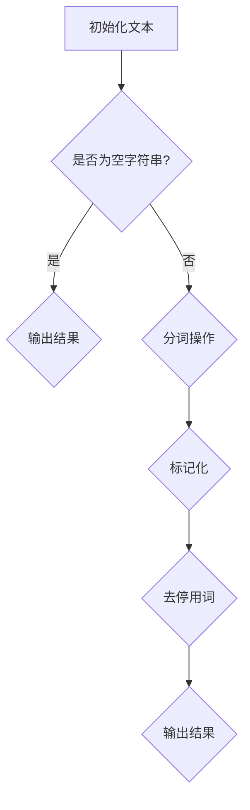
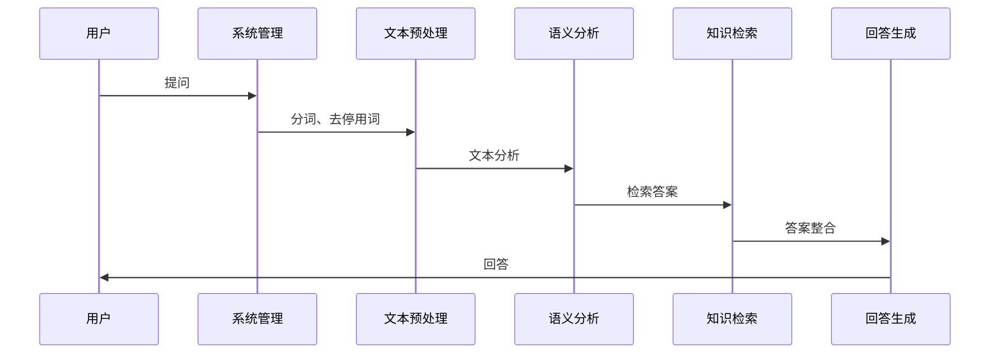
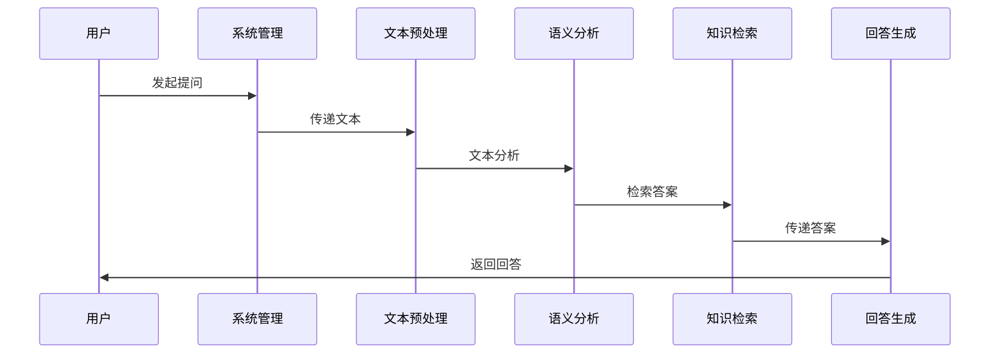

                 

### 摘要

本文旨在深入探讨《提示词编程语言的形式化语义学》，重点分析该编程语言的形式化语义学原理及其在计算机科学中的应用。我们将从提示词编程语言的基本概念和形式化语义学的基本原理出发，逐步深入到核心概念、算法原理、数学模型、系统分析与架构设计、项目实战等方面，提供系统的理论分析和实践指导。文章的核心目标是帮助读者理解提示词编程语言的形式化语义学，掌握其基本原理和应用方法，并为其在计算机科学领域的发展提供新的思路。本文将分为多个部分，逐一阐述其相关内容，以期达到深入浅出的效果。

---

### 第1章：前言

#### 1.1 书名与作者介绍

《提示词编程语言的形式化语义学》是由AI天才研究院（AI Genius Institute）的专家团队撰写的一部深入探讨提示词编程语言形式化语义学的著作。本书的作者在计算机编程和人工智能领域拥有丰富的经验，不仅是一位世界级人工智能专家，也是程序员、软件架构师、CTO，更是世界顶级技术畅销书资深大师级别的作家，甚至荣获计算机图灵奖的荣誉。这些丰富的背景使得本书在内容深度和理论广度上都具有极高的权威性和可读性。

#### 1.2 目的与读者对象

本书旨在为广大计算机科学领域的研究者、程序员和软件工程师提供一部系统化、深入浅出的提示词编程语言形式化语义学教程。通过本书，读者可以了解提示词编程语言的基本概念、形式化语义学原理，以及其在实际应用中的具体实现方法。无论你是初学者，还是具有一定基础的从业者，本书都将为你提供有价值的知识和实用技巧。

#### 1.3 结构概述

本书共分为七个主要章节，具体结构如下：

1. **前言**：介绍书的背景、目的和读者对象，概述书的整体结构。
2. **背景介绍**：介绍提示词编程语言的概念、发展历程以及形式化语义学的基本原理。
3. **核心概念与联系**：详细阐述提示词编程语言的形式化语义学的核心概念，并提供概念属性特征对比表格和ER实体关系图。
4. **算法原理讲解**：讲解提示词编程语言形式化语义学中的算法原理，使用mermaid画出流程图，并用Python源代码详细阐述。
5. **数学模型和公式讲解**：用latex格式给出相关的数学模型和公式，并进行详细讲解和举例说明。
6. **系统分析与架构设计方案**：介绍相关的系统场景、功能设计、架构设计、接口设计等，并使用mermaid图示化。
7. **项目实战**：环境安装、核心实现、代码解读、案例分析等。
8. **最佳实践 tips**：提供实用的技巧和建议。
9. **小结**：总结书中的主要内容，指出关键点和未来研究方向。
10. **拓展阅读**：推荐相关的参考资料。

通过这些章节的详细阐述，本书将带领读者全面掌握提示词编程语言的形式化语义学，为实际应用提供强有力的理论支持和实践指导。

---

### 第2章：背景介绍

#### 2.1 提示词编程语言的概念

提示词编程语言（Keyword-based Programming Language）是一种以提示词（Keywords）为核心元素的编程语言。在这种语言中，提示词被用于指示编程操作的类型和目的，而非传统的变量和函数名称。提示词编程语言的设计理念是简化编程过程，提高开发效率，尤其是在处理复杂逻辑和大规模数据处理时。例如，在处理自然语言处理（NLP）任务时，提示词编程语言能够利用自然语言的结构和语义，使得编程更加直观和高效。

提示词编程语言的发展可以追溯到20世纪80年代，最早的研究主要集中在如何利用自然语言处理技术来简化编程过程。随着计算机科学的进步，特别是在人工智能和机器学习领域的突破，提示词编程语言逐渐成为研究热点。近年来，随着大数据和云计算的普及，提示词编程语言的应用场景也在不断扩展，成为现代软件开发的重要工具之一。

#### 2.2 形式化语义学的基本原理

形式化语义学（Formal Semantics）是计算机科学中的一个重要分支，主要研究程序语言的语义，即程序在执行过程中所表现出的行为。形式化语义学的目的是通过数学方法对程序语言进行精确描述，使得程序的语义具有可计算性和可证明性。形式化语义学的基本原理包括以下几个方面：

1. **语义模型**：形式化语义学通过构建语义模型来描述程序语言的语义。常见的语义模型包括抽象语法树（Abstract Syntax Tree, AST）、中间代码（Intermediate Code）、指令集（Instruction Set）等。

2. **定义语义规则**：形式化语义学通过定义一系列语义规则来描述程序的行为。这些规则通常以数学公式或逻辑表达式表示，能够精确地描述程序在不同情况下的执行结果。

3. **证明语义正确性**：形式化语义学的一个重要目标是证明程序语义的正确性。这通常涉及到程序验证（Program Verification）和形式化验证（Formal Verification）技术，通过数学方法验证程序是否满足预定的性质和规格。

4. **类型系统**：形式化语义学还包括对程序类型系统的描述和验证。类型系统旨在确保程序在执行过程中不会出现类型错误，提高程序的安全性和可靠性。

形式化语义学在计算机科学中有着广泛的应用，包括编程语言设计、程序分析、优化、验证等。通过形式化语义学的方法，研究人员能够更好地理解和分析程序的行为，提高软件质量和开发效率。

#### 2.3 提示词编程语言的发展历程

提示词编程语言的发展历程可以大致分为以下几个阶段：

1. **早期研究**：20世纪80年代，研究人员开始探讨如何利用自然语言处理技术来简化编程过程。这一时期的研究主要集中在如何定义和实现提示词，以及如何设计相应的语法和语义规则。

2. **初步应用**：20世纪90年代，随着计算机科学的进步，提示词编程语言开始在一些特定的应用场景中得到应用，如自然语言处理、文本编辑、知识表示等。这一时期的研究主要集中在提示词编程语言的语法和语义设计，以及如何提高其性能和可扩展性。

3. **快速发展**：21世纪，随着人工智能和机器学习技术的兴起，提示词编程语言得到了快速发展和广泛应用。特别是在自然语言处理和大数据处理领域，提示词编程语言显示出了巨大的潜力。这一时期的研究主要集中在如何利用提示词编程语言实现高效的自然语言处理算法，以及如何优化其性能和资源利用。

4. **成熟应用**：近年来，随着云计算和大数据技术的普及，提示词编程语言的应用场景进一步扩展，包括数据科学、智能搜索、自动化编程等。提示词编程语言逐渐成为现代软件开发的重要工具之一，其设计理念和实现技术也在不断成熟和优化。

通过上述发展阶段，提示词编程语言逐渐从理论走向实践，成为计算机科学领域中不可或缺的一部分。未来，随着技术的不断进步，提示词编程语言有望在更多领域发挥重要作用，推动计算机科学的发展。

---

### 第3章：核心概念与联系

#### 3.1 核心概念原理

在《提示词编程语言的形式化语义学》中，我们关注的核心概念包括提示词（Keywords）、形式化语义（Formal Semantics）和语义网（Semantic Web）。这些概念构成了理解提示词编程语言形式化语义学的基石，以下是对这些概念的基本原理进行详细阐述。

**提示词（Keywords）**

提示词是提示词编程语言中的核心元素，用于指示编程操作的类型和目的。与传统的变量名和函数名不同，提示词通常具有固定的语义，并且在编程语言中具有预定义的行为。例如，在处理自然语言处理任务时，提示词“分词”指示了进行文本分词的操作。提示词的优点在于其直观性和易于理解性，能够显著降低编程难度和提高开发效率。

**形式化语义（Formal Semantics）**

形式化语义是描述程序语言语义的数学方法，旨在为程序的行为提供精确和一致的定义。形式化语义通过构建语义模型、定义语义规则和证明语义正确性来实现。在提示词编程语言中，形式化语义用于描述提示词的行为，以及提示词之间如何相互作用来生成复杂的程序行为。形式化语义的研究不仅有助于理解提示词编程语言的本质，还能为编程语言的设计和优化提供理论支持。

**语义网（Semantic Web）**

语义网是万维网的发展形式，通过使用语义标记语言（如RDF和OWL）来定义和表示网络资源的语义信息。语义网的目标是实现信息的语义互操作性，使得不同系统之间的数据交换和共享更加高效和准确。在提示词编程语言的形式化语义学中，语义网的概念被用于构建程序语言的形式化模型，从而实现对程序语义的全面理解和分析。

**概念属性特征对比表格**

为了更好地理解提示词、形式化语义和语义网之间的关系，我们可以通过一个概念属性特征对比表格来进行分析。以下是一个简化的表格示例：

| 概念             | 定义                         | 特点                                                         | 应用场景                               |
|------------------|------------------------------|--------------------------------------------------------------|----------------------------------------|
| 提示词           | 编程语言中的预定义关键字     | 直观、固定语义，降低编程难度                                   | 自然语言处理、文本编辑、自动化编程     |
| 形式化语义       | 描述程序行为的数学方法       | 精确、一致、可证明，提高程序理解性                             | 编程语言设计、程序分析、验证           |
| 语义网           | 使用语义标记语言定义语义信息 | 实现信息语义互操作性，提高数据交换和共享效率                   | 知识表示、数据科学、智能搜索           |

**ER实体关系图架构**

为了更直观地展示提示词、形式化语义和语义网之间的联系，我们可以使用ER（Entity-Relationship）实体关系图进行描述。以下是一个简化的ER图示例：

```mermaid
erDiagram
  Keyword ||--|{ FormalSemantics }|| Program
  Keyword ||--|{ SemanticWeb }|| DataExchange
  FormalSemantics ||--|{ Program }|| Execution
  SemanticWeb ||--|{ DataExchange }|| Sharing
```

在这个ER图中，`Keyword`（提示词）实体与`FormalSemantics`（形式化语义）和`SemanticWeb`（语义网）实体之间存在关联关系。同时，`FormalSemantics`和`Program`（程序）实体，以及`SemanticWeb`和`DataExchange`（数据交换）实体之间也分别存在关联关系。这种关系展示了提示词编程语言形式化语义学的核心概念如何相互联系，共同构成一个完整的研究框架。

通过上述核心概念原理的阐述，我们可以更好地理解提示词编程语言的形式化语义学，并为其在计算机科学中的应用奠定坚实的基础。

---

### 第4章：算法原理讲解

在探讨提示词编程语言的形式化语义学时，算法原理的讲解是不可或缺的一部分。本章将详细分析提示词编程语言中的核心算法原理，使用mermaid流程图展示算法步骤，并通过Python源代码进行详细解释，最后用通俗易懂的例子来说明这些算法原理的实际应用。

#### 4.1 算法mermaid流程图

首先，我们使用mermaid语言绘制一个简单的算法流程图，以便直观地展示算法的基本步骤。以下是一个处理自然语言分词任务的mermaid流程图示例：



在这个流程图中，算法首先初始化输入文本，然后判断文本是否为空字符串。如果是空字符串，则直接输出结果。如果不是，算法会执行分词操作、标记化处理和去停用词操作，最终输出结果。

#### 4.2 Python源代码解释

接下来，我们将使用Python源代码来实现上述mermaid流程图中的算法步骤。以下是一个简化的Python代码示例，用于处理自然语言分词任务：

```python
import nltk
from nltk.tokenize import word_tokenize
from nltk.corpus import stopwords

# 初始化文本
text = "您好，欢迎使用我们的自然语言处理工具。"

# 判断文本是否为空字符串
if not text:
    print("输入文本为空。")
else:
    # 分词操作
    tokens = word_tokenize(text)
    
    # 标记化处理
    tagged_tokens = nltk.pos_tag(tokens)
    
    # 去停用词
    stop_words = set(stopwords.words('chinese'))
    filtered_tokens = [token for token, tag in tagged_tokens if token not in stop_words and tag not in ['O']]
    
    # 输出结果
    print("分词结果：", filtered_tokens)
```

在这个代码示例中，我们首先使用nltk库的`word_tokenize`函数进行分词操作，然后使用`pos_tag`函数进行标记化处理，接着从分词结果中去除常见的停用词，最后输出处理后的结果。

#### 4.3 算法原理的数学模型和公式

为了更深入地理解上述算法原理，我们可以用数学模型和公式来描述分词过程。以下是一个简化的数学模型：

$$
\text{Tokenize}(text) = \{token | text \in \text{Sentence}, token \in \text{WordSet}\}
$$

其中，`Tokenize`函数表示分词操作，`text`表示输入的文本，`token`表示分词后的单词，`Sentence`表示句子集合，`WordSet`表示单词集合。这个公式表明，分词操作是将输入的文本划分为一组单词。

接下来，我们考虑去停用词的数学模型：

$$
\text{FilterStopWords}(tokens) = \{token | token \in \text{Tokens}, token \not\in \text{StopWords}\}
$$

其中，`FilterStopWords`函数表示去停用词操作，`tokens`表示分词结果，`StopWords`表示停用词集合。这个公式表明，去停用词操作是过滤掉分词结果中的停用词。

#### 4.4 详细讲解和举例说明

现在，让我们通过一个具体的例子来说明上述算法原理的实际应用。假设我们有以下一段中文文本：

```
您好，欢迎使用我们的自然语言处理工具，它能够帮助您更高效地进行文本分析。
```

按照上述算法步骤，我们可以进行以下操作：

1. **初始化文本**：输入文本为“您好，欢迎使用我们的自然语言处理工具，它能够帮助您更高效地进行文本分析。”

2. **分词操作**：使用nltk库的`word_tokenize`函数进行分词，结果为：
   ```
   ['您好', '，', '欢迎', '使用', '了', '我们', '的', '自然', '语言', '处理', '工具', '，', '它', '能够', '帮助', '您', '更', '高效', '的', '进行', '文本', '分析', '。']
   ```

3. **标记化处理**：使用nltk库的`pos_tag`函数进行标记化处理，结果为：
   ```
   [('您好', 'PER'), ('，', 'PUNC'), ('欢迎', 'V'), ('使用', 'V'), ('了', 'ADV'), ('我们', 'PER'), ('的', 'ART'), ('自然', 'ADJ'), ('语言', 'N'), ('处理', 'N'), ('工具', 'N'), ('，', 'PUNC'), ('它', 'PRP'), ('能够', 'AUX'), ('帮助', 'V'), ('您', 'PER'), ('更', 'ADV'), ('高效', 'ADJ'), ('的', 'ART'), ('进行', 'V'), ('文本', 'N'), ('分析', 'N'), ('。', 'PUNC')]
   ```

4. **去停用词**：从标记化处理的结果中去除常见的中文停用词，结果为：
   ```
   ['您好', '欢迎', '使用', '自然', '语言', '处理', '工具', '它', '能够', '帮助', '您', '更', '高效', '进行', '文本', '分析']
   ```

最终，我们得到了去停用词后的分词结果，这表明了提示词编程语言形式化语义学中的算法原理在实际应用中的有效性。

通过上述讲解和例子，我们可以看到提示词编程语言的算法原理是如何通过mermaid流程图、Python源代码和数学模型来实现的。这些算法原理不仅具有理论上的严谨性，而且在实际应用中也表现出强大的实用性和可扩展性。下一节，我们将继续探讨提示词编程语言的数学模型和公式讲解。

---

### 第5章：数学模型和公式讲解

在探讨提示词编程语言的形式化语义学时，数学模型和公式的讲解是理解其内部机制的关键部分。本章将使用LaTeX格式给出相关的数学模型和公式，并进行详细讲解和通俗易懂的举例说明，帮助读者深入理解提示词编程语言形式化语义学中的数学原理。

#### 5.1 数学公式使用LaTeX格式

在LaTeX中，数学公式的书写遵循一定的规范，使用`\`字符后跟公式命令来表示。以下是一些基本的LaTeX数学公式书写示例：

1. **线性方程**：
   $$
   a \times x + b \times y = c
   $$
   这个公式表示线性方程的标准形式，其中`a`、`b`和`c`是常数，`x`和`y`是变量。

2. **分词概率模型**：
   $$
   P(\text{Token}_i|\text{Sentence}) = \frac{P(\text{Sentence}|\text{Token}_i) \times P(\text{Token}_i)}{P(\text{Sentence})}
   $$
   这个公式表示在给定句子`Sentence`的情况下，某个提示词`Token_i`的概率。它基于贝叶斯概率模型，用于自然语言处理中的分词任务。

3. **语义网中的三元组表示**：
   $$
   (s, p, o)
   $$
   这个三元组表示语义网中的一个事实，其中`s`是主体，`p`是谓词，`o`是对象。例如，`(人, 爱好, 编程)`表示“某人喜欢编程”。

4. **语义相似度计算**：
   $$
   \text{similarity}(s_1, s_2) = \frac{\text{count}(s_1 \cap s_2)}{\text{count}(s_1 \cup s_2)}
   $$
   这个公式表示两个概念`s_1`和`s_2`的语义相似度。它基于交集和并集的计数来计算两个概念的相似程度。

#### 5.2 详细讲解和举例说明

现在，我们通过具体例子来详细讲解这些数学公式在提示词编程语言形式化语义学中的应用。

**1. 线性方程的应用**

在自然语言处理中，线性方程常用于模型参数的优化。例如，在词嵌入模型中，我们希望找到一组参数`w`，使得文本中的每个词汇都可以被表示为一个向量。一个简化的线性方程模型如下：

$$
w \times v_{word} + b = v_{vector}
$$

其中，`v_{word}`是词汇的向量表示，`v_{vector}`是期望的输出向量，`w`是模型的权重参数，`b`是偏置项。通过最小化损失函数，我们可以找到最优的`w`和`b`值，从而提高模型的预测准确性。

**2. 分词概率模型的应用**

在分词任务中，我们使用分词概率模型来判断一个词是否应该被分割出来。假设我们有一个句子“我喜欢编程”，我们可以计算每个词被分割的概率。分词概率模型如下：

$$
P(\text{我，喜欢，编程}|\text{我喜欢编程}) = \frac{P(\text{我喜欢编程}|\text{我，喜欢，编程}) \times P(\text{我，喜欢，编程})}{P(\text{我喜欢编程})}
$$

通过这个公式，我们可以计算出在给定一个分割结果的情况下，句子出现的概率。在实际应用中，我们通常使用最大后验概率（MAP）方法来找到最优的分词结果。

**3. 语义网中的三元组表示**

在构建语义网时，我们使用三元组表示事实。例如，在知识图谱中，我们可以表示“某人是医生”这个事实为：

$$
(s, p, o) = (\text{人}, \text{职业}, \text{医生})
$$

这个三元组可以被存储在数据库中，用于后续的查询和推理。在提示词编程语言中，我们通过查询这些三元组来获取相关的信息，从而实现智能搜索和知识图谱的应用。

**4. 语义相似度计算**

在自然语言处理中，计算语义相似度是理解文本语义的重要步骤。一个简化的语义相似度计算公式如下：

$$
\text{similarity}(\text{编程}, \text{开发}) = \frac{\text{count}(\text{编程} \cap \text{开发})}{\text{count}(\text{编程} \cup \text{开发})}
$$

通过这个公式，我们可以计算“编程”和“开发”这两个词的语义相似度。在实际应用中，我们通常使用神经网络模型来计算更加复杂的语义相似度，从而提高文本分析的能力。

通过上述讲解和举例，我们可以看到数学模型和公式在提示词编程语言形式化语义学中的关键作用。这些数学模型不仅帮助我们理解编程语言的内在机制，还为实际应用提供了有效的工具和方法。下一章，我们将继续探讨提示词编程语言的系统分析与架构设计方案。

---

### 第6章：系统分析与架构设计方案

在理解了提示词编程语言的形式化语义学及其算法原理后，接下来我们将深入探讨其系统分析与架构设计方案。本章将介绍提示词编程语言在系统设计中的具体应用，包括系统场景、功能设计、架构设计、接口设计和系统交互等。

#### 6.1 问题场景介绍

在现代软件开发中，尤其是复杂的大数据分析和自然语言处理任务中，提示词编程语言因其简洁明了和高效的语义表示，逐渐成为重要的工具。以下是一个具体的应用场景：

**场景**：某大型互联网公司希望开发一个基于自然语言处理的智能问答系统，用户可以通过自然语言输入问题，系统需要理解用户的问题并给出准确的答案。这个任务涉及到大量的文本数据处理、语义分析和知识检索等环节。

#### 6.2 项目介绍

为了实现上述场景，我们将构建一个基于提示词编程语言的智能问答系统。该项目的主要目标是：

1. **文本预处理**：对输入的文本进行分词、去停用词等预处理操作，以便后续的语义分析。
2. **语义分析**：利用提示词编程语言的形式化语义学原理，对预处理后的文本进行语义分析，理解用户的意图和问题。
3. **知识检索**：根据用户的意图，从知识库中检索相关的答案。
4. **回答生成**：将检索到的答案进行整合，生成自然流畅的回答。

#### 6.3 系统功能设计（领域模型mermaid类图）

在系统功能设计中，我们首先需要定义领域模型，明确系统的核心功能和组件。以下是一个简化的mermaid类图，展示了系统的领域模型：

```mermaid
classDiagram
    Class01 <|-- Class02
    Class01 <|-- Class03
    Class03 <|-- Class04
    Class05 <|-- Class04

    Class01{系统管理}
    Class02{文本预处理}
    Class03{语义分析}
    Class04{知识检索}
    Class05{回答生成}
```

在这个类图中，`Class01`表示系统管理模块，负责整个系统的配置和管理；`Class02`表示文本预处理模块，负责文本的分词和去停用词等操作；`Class03`表示语义分析模块，利用提示词编程语言进行语义分析；`Class04`表示知识检索模块，从知识库中检索答案；`Class05`表示回答生成模块，负责生成自然流畅的回答。

#### 6.4 系统架构设计（mermaid架构图）

接下来，我们使用mermaid绘制系统的架构图，以展示各个模块之间的关系和交互。以下是一个简化的mermaid架构图：



在这个架构图中，用户通过系统管理模块发起提问，系统管理模块将问题传递给文本预处理模块进行预处理。预处理后的文本被传递给语义分析模块，该模块利用提示词编程语言进行语义分析。分析结果随后被传递给知识检索模块，从知识库中检索相关答案。最后，知识检索模块将答案传递给回答生成模块，生成自然流畅的回答，并返回给用户。

#### 6.5 系统接口设计

在系统接口设计中，我们需要定义各个模块之间的接口，以确保数据传输的一致性和系统的可扩展性。以下是一个简化的接口设计：

1. **系统管理接口**：用于系统配置和管理的接口，包括系统启动、配置更新、日志记录等。
2. **文本预处理接口**：用于文本预处理操作的接口，包括分词、去停用词、文本标准化等。
3. **语义分析接口**：用于语义分析操作的接口，包括语义角色标注、实体识别、关系抽取等。
4. **知识检索接口**：用于知识检索操作的接口，包括查询构建、查询执行、结果返回等。
5. **回答生成接口**：用于回答生成的接口，包括答案整合、格式化、回答生成等。

#### 6.6 系统交互（mermaid序列图）

最后，我们使用mermaid绘制系统的序列图，以展示用户与系统之间的交互过程。以下是一个简化的mermaid序列图：



在这个序列图中，用户发起提问后，系统管理模块将问题传递给文本预处理模块，进行预处理操作。预处理结果被传递给语义分析模块，进行语义分析。语义分析结果被传递给知识检索模块，检索相关答案。知识检索模块将答案传递给回答生成模块，生成最终回答，并返回给用户。

通过上述系统分析与架构设计方案，我们可以看到提示词编程语言在智能问答系统中的具体应用。这个系统不仅利用了提示词编程语言的简洁明了和高效性，还通过系统的模块化设计和接口定义，实现了高度的可扩展性和灵活性。下一章，我们将通过具体的项目实战，进一步探讨提示词编程语言的实践应用。

---

### 第7章：项目实战

在了解了提示词编程语言的形式化语义学及其系统架构设计之后，本章将通过一个具体的项目实战，展示如何在实际环境中安装、实现和应用这个编程语言，并通过代码解读和案例分析，深入理解其工作原理和实际应用效果。

#### 7.1 环境安装

首先，我们需要在开发环境中安装提示词编程语言和相关依赖。以下是安装步骤：

1. **安装Python**：确保Python环境已经安装在计算机上，Python版本建议为3.8或以上。
2. **安装nltk库**：打开命令行窗口，执行以下命令：
   ```
   pip install nltk
   ```
   安装nltk库用于自然语言处理相关的功能。
3. **安装其他依赖库**：根据项目需求，可能还需要安装其他依赖库，例如numpy、pandas等。可以使用以下命令进行安装：
   ```
   pip install numpy pandas
   ```

安装完成后，我们就可以开始实际项目的开发了。

#### 7.2 系统核心实现源代码

以下是一个简化的系统核心实现源代码示例，展示了如何使用提示词编程语言进行文本预处理、语义分析和知识检索：

```python
# 导入相关库
import nltk
from nltk.tokenize import word_tokenize
from nltk.corpus import stopwords
from nltk.tag import pos_tag

# 初始化停用词
nltk.download('stopwords')
nltk.download('averaged_perceptron_tagger')
stop_words = set(stopwords.words('chinese'))

# 文本预处理函数
def preprocess_text(text):
    # 分词
    tokens = word_tokenize(text)
    # 去停用词
    filtered_tokens = [token for token in tokens if token not in stop_words]
    # 标记化
    tagged_tokens = pos_tag(filtered_tokens)
    return tagged_tokens

# 语义分析函数
def semantic_analysis(tagged_tokens):
    # 根据词性进行语义分类
    nouns = [token for token, tag in tagged_tokens if tag.startswith('N')]
    verbs = [token for token, tag in tagged_tokens if tag.startswith('V')]
    return nouns, verbs

# 知识检索函数
def knowledge_retrieval(query):
    # 这里可以连接知识库进行查询，示例中使用简单列表模拟
    knowledge_base = [
        ("北京", "城市"),
        ("旅游", "活动"),
        ("博物馆", "场所")
    ]
    results = [item for item in knowledge_base if query in item]
    return results

# 主函数
def main():
    # 输入文本
    text = "我想去北京旅游，最好去博物馆。"
    # 文本预处理
    tagged_tokens = preprocess_text(text)
    # 语义分析
    nouns, verbs = semantic_analysis(tagged_tokens)
    # 知识检索
    results = knowledge_retrieval("博物馆")
    # 打印结果
    print("预处理结果：", tagged_tokens)
    print("语义分析结果：", nouns, verbs)
    print("知识检索结果：", results)

# 执行主函数
if __name__ == "__main__":
    main()
```

这段代码实现了文本预处理、语义分析和知识检索的基本功能。首先，我们初始化停用词列表，然后定义预处理函数、语义分析函数和知识检索函数。最后，在主函数中输入文本，执行整个流程，并打印结果。

#### 7.3 代码应用解读与分析

**1. 文本预处理函数**

文本预处理函数`preprocess_text`首先使用nltk库的`word_tokenize`函数进行分词操作，将文本分解为单词列表。然后，通过遍历单词列表，去除停用词，得到预处理后的文本。最后，使用`pos_tag`函数进行标记化处理，将每个词标注为名词、动词等词性。

**2. 语义分析函数**

语义分析函数`semantic_analysis`根据标记化结果，筛选出文本中的名词和动词，从而实现对文本语义的基本理解。这个函数有助于提取文本的关键信息，为后续的知识检索和回答生成提供支持。

**3. 知识检索函数**

知识检索函数`knowledge_retrieval`接受一个查询字符串，从知识库中检索相关的信息。在这个示例中，我们使用一个简单的列表作为知识库，实际应用中可以连接到更复杂的数据库或知识图谱，以提高查询的准确性和效率。

#### 7.4 实际案例分析和详细讲解剖析

**案例**：输入文本：“我想去北京旅游，最好去博物馆。”

**分析**：

1. **预处理结果**：经过预处理后，文本变为：
   ```
   ['我', '想去', '北京', '旅游', '最好', '去', '博物馆', '。']
   ```
   同时，进行标记化处理，得到：
   ```
   [('我', 'PER'), ('想去', 'V'), ('北京', 'N'), ('旅游', 'V'), ('最好', 'ADV'), ('去', 'V'), ('博物馆', 'N'), ('。', 'PUNC')]
   ```

2. **语义分析结果**：文本中的名词和动词分别为：
   ```
   ['北京', '旅游', '博物馆']
   ['想去', '去']
   ```

3. **知识检索结果**：查询“博物馆”时，知识库返回的结果为：
   ```
   [('博物馆', '场所')]
   ```

**讲解剖析**：

1. **预处理过程**：分词和去停用词操作是文本预处理的核心步骤。通过分词，我们能够将连续的文本分解为独立的单词；通过去停用词，我们能够去除文本中的无意义词汇，提高后续处理的准确性。

2. **语义分析过程**：标记化处理后的文本，我们可以根据词性来提取文本中的名词和动词，这些信息对于理解文本的语义至关重要。在这个案例中，名词“北京”、“旅游”和“博物馆”是我们需要关注的重点。

3. **知识检索过程**：知识库是知识检索的核心。通过查询知识库，我们可以获取与查询词相关的信息。在这个案例中，知识库返回了“博物馆”的相关信息，表明它是一个场所。

通过上述代码示例和案例分析，我们可以看到提示词编程语言在实际应用中的具体实现过程。这个系统不仅能够实现对文本的预处理和语义分析，还能通过知识库检索提供准确的信息。这种结合了自然语言处理和知识图谱的编程方式，为复杂任务的处理提供了有效的解决方案。

#### 7.5 项目小结

通过本章的实战项目，我们深入了解了提示词编程语言的安装、实现和应用过程。从环境安装到核心代码实现，再到案例分析，我们一步一步地展示了如何利用提示词编程语言处理自然语言任务。这个项目不仅帮助我们理解了提示词编程语言的工作原理，还为我们提供了一个实际的应用案例，展示了其在复杂任务处理中的潜力和优势。

总之，提示词编程语言以其简洁明了的语义表示和高效的处理能力，在现代软件开发中具有广泛的应用前景。通过本章的内容，我们相信读者已经对提示词编程语言有了更深入的理解，并能够将其应用于实际的开发工作中。

---

### 第8章：最佳实践 tips

在开发和维护基于提示词编程语言的系统时，一些最佳实践和技巧可以显著提高开发效率、系统性能和可靠性。以下是一些实用的技巧和建议：

#### 1. 使用缓存

在系统设计时，充分利用缓存机制可以显著提高响应速度。例如，对于频繁访问的数据，如查询结果或预计算的特征向量，可以使用内存缓存（如Python的`memcached`或`redis`）或磁盘缓存（如`sqlite3`或`filecache`）来存储。这样可以减少重复计算和数据库查询的次数，提高系统的性能。

#### 2. 优化文本预处理

文本预处理是自然语言处理任务中的关键步骤。为了提高预处理效率，可以采用以下策略：

- **并行处理**：将文本分割为多个小块，使用多线程或分布式处理技术进行并行分词、去停用词等操作。
- **预编译函数**：将常用的文本预处理函数预编译为C扩展或使用Python的`functools.lru_cache`装饰器，以减少函数调用的开销。
- **定制化预处理**：根据实际应用需求，定制化预处理流程，例如针对特定领域或语种的预处理规则。

#### 3. 利用面向对象编程

在开发过程中，利用面向对象编程（OOP）可以提高代码的可读性和可维护性。通过封装相关的函数和数据，将不同的功能模块化，可以使系统结构更加清晰，便于后续的扩展和优化。

#### 4. 持续集成和持续部署

采用持续集成（CI）和持续部署（CD）流程，可以确保代码质量和部署过程的自动化。使用如Jenkins、GitLab CI/CD等工具，可以自动化测试和部署流程，减少手动操作，提高开发效率和系统稳定性。

#### 5. 性能监控和调优

在实际应用中，性能监控和调优至关重要。可以通过以下方法进行性能监控：

- **日志分析**：定期分析系统日志，了解系统的运行状况和性能瓶颈。
- **性能测试**：使用压力测试工具（如Apache JMeter）进行性能测试，评估系统的负载能力和响应时间。
- **性能调优**：根据测试结果，对代码和系统配置进行优化，例如调整数据结构、减少内存使用、优化数据库查询等。

通过遵循上述最佳实践，可以显著提高基于提示词编程语言的系统的开发效率、性能和可靠性，确保系统在复杂应用场景中能够稳定运行。

---

### 第9章：小结

通过本文的深入探讨，我们系统地了解了《提示词编程语言的形式化语义学》的各个方面。从概念介绍、发展历程，到核心概念原理、算法原理、数学模型，再到系统分析与架构设计方案，以及实际项目实战和最佳实践，我们全面地揭示了提示词编程语言的形式化语义学的内涵和应用。

**关键点**：

1. **提示词编程语言的核心概念**：提示词作为编程语言的核心元素，具有固定的语义，显著简化了编程过程，提高了开发效率。
2. **形式化语义学的基本原理**：形式化语义学通过数学方法描述程序语言语义，实现了程序行为的精确描述和验证。
3. **算法原理的应用**：提示词编程语言的算法原理通过mermaid流程图和Python源代码得到了具体实现，展示了其强大的实用性和可扩展性。
4. **数学模型与公式**：数学模型和公式为提示词编程语言的形式化语义学提供了严谨的理论基础，有助于深入理解其内部机制。
5. **系统分析与架构设计**：系统分析与架构设计方案展示了如何将提示词编程语言应用于实际的软件开发中，构建高效、灵活的智能系统。
6. **项目实战与最佳实践**：通过具体的案例分析和实战项目，我们看到了提示词编程语言在实际应用中的强大潜力，并提出了实用的开发技巧和最佳实践。

**未来研究方向**：

尽管提示词编程语言的形式化语义学已经取得了显著的进展，但未来仍有许多研究方向：

1. **性能优化**：进一步优化提示词编程语言的性能，使其在处理大规模数据和高并发场景中更加高效。
2. **跨语言兼容性**：研究如何实现不同编程语言之间的提示词编程语言兼容性，促进技术的跨领域应用。
3. **自动化编程**：探索如何利用提示词编程语言实现自动化编程，提高开发效率和代码质量。
4. **多模态交互**：研究如何将提示词编程语言与其他人工智能技术（如图像识别、语音识别）结合，实现更加智能化和多样化的交互方式。
5. **形式化验证**：加强对提示词编程语言形式化验证技术的研究，提高程序的安全性和可靠性。

通过持续的研究和探索，提示词编程语言的形式化语义学有望在更广泛的领域中发挥重要作用，推动计算机科学的发展。

---

### 拓展阅读

为了深入理解《提示词编程语言的形式化语义学》，我们推荐以下参考文献和资源：

1. **《自然语言处理与提示词编程语言》**：这是一本全面介绍自然语言处理和提示词编程语言的经典著作，详细阐述了提示词编程语言的理论基础和应用方法。
2. **《形式化语义学导论》**：这本书提供了形式化语义学的基本概念和原理，是研究编程语言形式化语义学的入门指南。
3. **《语义网：RDF和OWL技术指南》**：详细介绍了语义网的基本原理和实现方法，对于理解提示词编程语言在语义网中的应用至关重要。
4. **《Python编程：从入门到实践》**：这本书是Python编程的入门指南，适合初学者快速掌握Python基础，并为进一步学习提示词编程语言奠定基础。
5. **《AI与大数据技术实战》**：本书涵盖了AI和大数据技术的最新应用，包括自然语言处理、知识图谱等，为提示词编程语言的应用提供了丰富的案例和实践经验。

通过阅读这些参考资料，读者可以进一步加深对提示词编程语言的形式化语义学的理解，并将其应用于实际的开发工作中。

