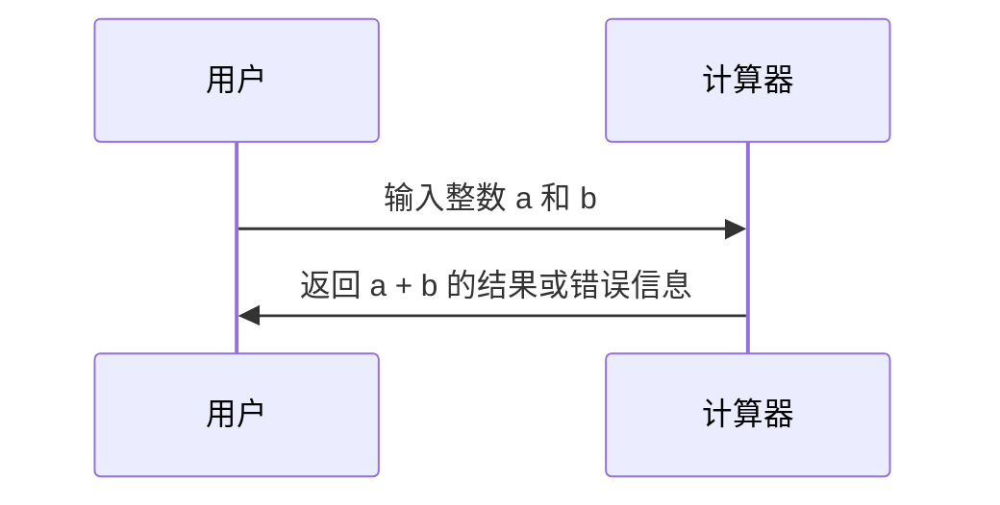
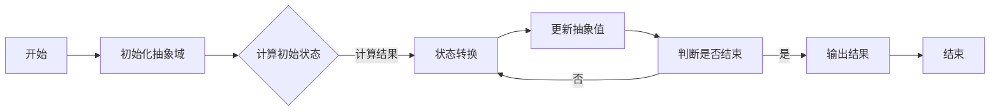
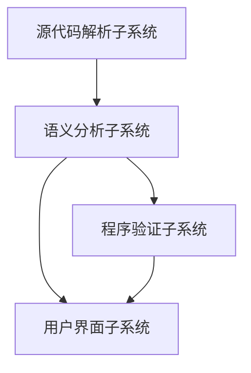
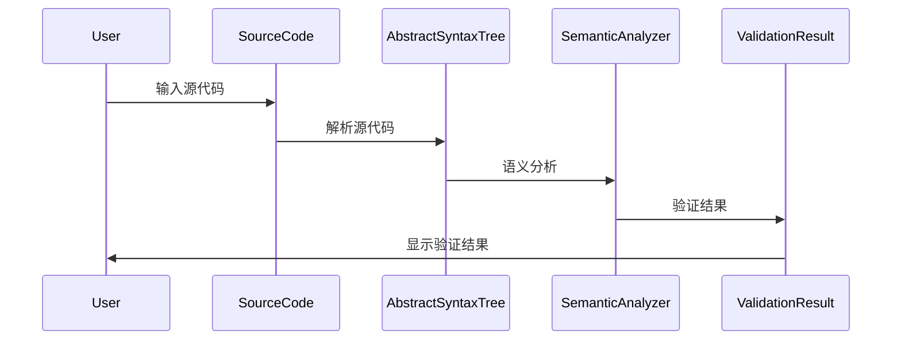
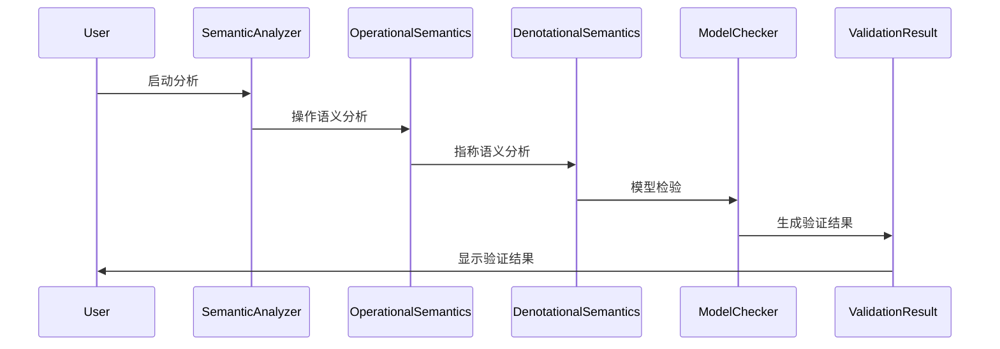

                 

### 什么是提示词编程语言的形式语义学？

**形式语义学**是计算机科学中的一个分支，它通过形式化的方法来研究编程语言的意义和计算行为。在形式语义学中，编程语言的行为被精确地定义和描述，而不是依赖于直觉或解释。提示词编程语言的形式语义学，即是在这个框架下对提示词编程语言的语义进行系统性的研究和分析。

#### 核心概念

- **提示词编程语言**：一种编程范式，其中代码的执行是基于提示词（或称为指令、命令）的序列，这些提示词指示了程序的行为。这种语言通常与过程式编程和命令式编程相对，强调基于数据流的编程。

- **形式化定义**：通过数学和逻辑工具，对编程语言的结构、行为和语义进行精确的定义。形式化定义能够消除歧义，提供可验证的语义描述。

- **语义学**：研究语言中的表达式、语句和程序的意义。在形式语义学中，语义学研究如何从形式化定义推导出程序的行为。

#### 为什么要研究形式语义学？

形式语义学的重要性在于它能够：

- **提供精确的语义描述**：确保编程语言的行为是可预测和可验证的，从而提高程序的正确性和可靠性。

- **支持语言设计和优化**：通过形式语义学的研究，可以更好地理解编程语言的设计原则和优化方向。

- **促进程序分析和验证**：形式化的语义定义有助于开发工具，如静态分析器、类型检查器和编译器，以更有效地分析程序行为和验证程序的正确性。

- **支持跨语言的比较和兼容性**：形式语义学可以用来比较不同编程语言之间的异同，从而促进语言设计和跨语言编程。

#### 研究方法

形式语义学的研究方法通常包括：

- **操作语义**：定义程序如何通过一系列步骤执行。这通常涉及抽象机器模型，用于模拟程序执行过程。

- **指称语义**：通过数学结构（如集合、函数、关系）来定义程序的意义。指称语义通常使用函数或关系来描述程序的计算结果。

- **类型系统**：定义程序中值的类型，以及类型之间的兼容性。类型系统有助于提高程序的可靠性和效率。

- **模型检验**：通过构建程序的数学模型，来验证程序是否满足特定的属性。

#### 研究内容

形式语义学的研究内容通常包括：

- **基本语义概念**：如表达式、语句、程序的定义和解释。

- **程序行为的性质**：如等价性、终止性、错误处理等。

- **类型系统**：定义类型、类型规则和类型推断。

- **抽象机器和执行模型**：研究程序如何在抽象机器上执行。

- **指称语义和模型检验**：通过数学模型来描述程序行为，并验证程序的正确性。

### 研究形式语义学的方法

为了深入研究提示词编程语言的形式语义学，我们可以采用以下步骤：

1. **定义语言语法**：首先，需要定义提示词编程语言的语法规则，包括提示词、语法结构等。

2. **操作语义分析**：通过抽象机器模型来定义程序的操作语义，描述程序如何执行每一步。

3. **指称语义分析**：使用数学结构（如函数、关系、集合）来定义程序的指称语义。

4. **类型系统设计**：设计适合提示词编程语言的类型系统，以确保程序的类型安全和语义一致性。

5. **程序分析工具开发**：开发静态分析工具，如类型检查器和抽象解释器，以验证程序的正确性和性能。

6. **模型检验与验证**：构建程序的数学模型，并通过模型检验来验证程序的正确性。

通过这些步骤，我们可以系统地研究提示词编程语言的形式语义学，为其设计、优化和应用提供坚实的理论基础。

### 总结

提示词编程语言的形式语义学研究通过形式化的方法，对编程语言的语义进行精确的定义和描述。这种研究不仅有助于理解编程语言的设计原则，还能够提高程序的正确性和可靠性。通过定义语言语法、操作语义、指称语义、类型系统，并开发相应的分析工具，我们能够更深入地探讨提示词编程语言的形式语义学，为其在软件开发中的广泛应用奠定基础。

### 关键词

- 提示词编程语言
- 形式语义学
- 操作语义
- 指称语义
- 类型系统
- 静态分析
- 模型检验

### 摘要

本文深入探讨了提示词编程语言的形式语义学，定义了提示词编程语言及其形式化方法，并详细分析了操作语义、指称语义和类型系统的概念和应用。通过定义语言语法、构建抽象机器模型、使用数学结构描述语义，以及开发程序分析工具和模型检验技术，本文为提示词编程语言的形式语义学研究提供了系统的理论和方法。研究结果不仅有助于提升编程语言的设计和优化，还促进了程序的正确性和可靠性保障，为提示词编程语言在软件开发中的应用奠定了坚实基础。

### 引言

#### 什么是提示词编程语言的形式语义学？

提示词编程语言的形式语义学是计算机科学中的一个重要研究领域，它通过形式化的方法，精确地描述和定义编程语言中的提示词（或称为指令、命令）如何影响程序的行为和执行结果。这种研究不仅涉及到编程语言的设计和实现，还涉及到了程序分析、优化和验证等多个方面。

形式语义学的主要目标是消除语言设计中的歧义，使得编程语言的语义具有明确的、可验证的定义。通过形式化的语义描述，开发者可以更准确地理解程序的执行过程，从而提高程序的正确性和可靠性。在提示词编程语言的形式语义学研究中，我们关注的核心问题是如何将语言的语法结构转化为程序的行为，并确保这种转化过程的一致性和可预测性。

#### 形式语义学在编程语言中的重要性

形式语义学在编程语言中的重要性不言而喻。它不仅为编程语言的设计提供了理论支持，还为程序的分析、优化和验证提供了有效的工具和方法。以下是形式语义学在编程语言中的一些重要作用：

1. **明确语义定义**：形式语义学通过数学和逻辑工具，为编程语言的每个元素提供了精确的语义定义。这有助于消除语言设计中的歧义，确保程序的行为是可预测的。

2. **支持程序分析**：形式化的语义描述为开发程序分析工具提供了基础。这些工具可以帮助开发者发现潜在的错误，优化程序的执行效率，提高程序的可维护性。

3. **语言优化**：形式语义学的研究有助于开发者理解编程语言的内部工作原理，从而设计出更高效的编译器和解释器。

4. **程序验证**：形式化的语义定义和模型检验技术可以用来验证程序的正确性，确保程序满足预定的属性和需求。

5. **跨语言兼容性**：形式语义学可以用来比较不同编程语言之间的异同，促进语言设计和跨语言编程。

#### 提示词编程语言的特性

提示词编程语言具有一些独特的特性，这些特性使得它们在特定应用场景中表现出色。以下是提示词编程语言的几个关键特性：

1. **基于数据的编程**：提示词编程语言强调基于数据流的编程范式，而不是传统的命令式编程。这种范式使得程序更加直观和易于理解。

2. **高度的抽象性**：提示词编程语言通常提供丰富的抽象机制，如高阶函数、递归和模式匹配，这些机制有助于简化程序的复杂性。

3. **并发和并行处理**：提示词编程语言通常支持高效的并发和并行处理，这使得它们在处理大规模数据集和复杂计算任务时表现出色。

4. **动态类型系统**：许多提示词编程语言采用动态类型系统，这使得类型检查更加灵活和高效。

5. **丰富的库和框架**：提示词编程语言通常拥有丰富的库和框架，这些库和框架提供了大量的功能，使得开发者可以更轻松地实现复杂的应用程序。

#### 形式语义学在提示词编程语言中的应用

在提示词编程语言中，形式语义学的研究不仅有助于理解语言的设计原则，还可以为语言的设计和实现提供指导。以下是形式语义学在提示词编程语言中的一些具体应用：

1. **语言设计**：形式语义学可以帮助开发者设计出具有良好语义定义的编程语言，确保语言的行为是一致和可预测的。

2. **编译器与解释器**：形式语义学为编译器与解释器的开发提供了理论基础。通过形式化的语义描述，开发者可以设计出更高效、更准确的编译器和解释器。

3. **程序分析工具**：形式语义学的研究成果可以用来开发各种程序分析工具，如静态分析器、类型检查器和抽象解释器。

4. **程序验证与安全性**：形式语义学和模型检验技术可以用来验证程序的正确性和安全性，确保程序在执行过程中不会出现意外错误或安全问题。

5. **跨语言互操作性**：形式语义学可以用来比较和统一不同编程语言之间的语义定义，促进跨语言编程和互操作性。

#### 总结

形式语义学在提示词编程语言中的研究具有重要的理论和实际意义。通过形式化的方法，我们可以更精确地描述和定义编程语言的语义，从而提高程序的正确性和可靠性。本文介绍了提示词编程语言的形式语义学的基本概念、重要性和应用，为后续章节的深入探讨奠定了基础。

### 第2章：提示词编程语言的语法

#### 2.1 提示词编程语言的基本结构

提示词编程语言是一种以提示词（指令、命令）序列为基础的编程语言，其核心在于通过提示词来描述程序的行为。提示词编程语言的基本结构包括以下几个关键部分：

1. **提示词**：提示词是编程语言中的基本操作单元，用于表示程序的行为。例如，在函数式编程语言中，提示词可能包括变量赋值、函数调用、递归等。

2. **变量**：变量用于存储数据，是编程语言中的核心概念。在提示词编程语言中，变量通常通过提示词来声明和赋值。

3. **函数**：函数是提示词编程语言中用于封装和复用代码的重要组成部分。函数可以接受输入参数，并返回结果。

4. **控制结构**：控制结构用于控制程序的执行流程。常见的控制结构包括条件语句（如`if-else`）、循环语句（如`while`和`for`）等。

5. **数据类型**：数据类型用于定义变量和函数的输入输出类型。提示词编程语言通常支持多种数据类型，如整数、浮点数、字符串、列表、元组等。

#### 2.2 提示词编程语言的语法规则

提示词编程语言的语法规则定义了如何以结构化和可读性的方式编写程序。以下是一些基本的语法规则：

1. **提示词顺序**：提示词的顺序决定了程序的执行顺序。通常，从上到下、从左到右的顺序是默认的。

2. **提示词分隔**：提示词之间通常使用空格或其他分隔符（如逗号、分号）进行分隔。

3. **注释**：注释用于解释代码的功能或提供额外的信息。在大多数提示词编程语言中，单行注释使用`//`，多行注释使用`/* ... */`。

4. **括号**：括号用于定义代码块、函数参数和运算符优先级。常见的括号包括圆括号`()`、方括号`[]`和花括号`{}`。

5. **关键字**：关键字是编程语言中预定义的、具有特定意义的单词。关键字通常不能用作变量名或其他标识符。

6. **标识符**：标识符是用于命名变量、函数和其他编程实体的单词。标识符通常由字母、数字和下划线组成，但首字符不能是数字。

#### 2.3 语法示例

以下是一个简单的Python程序，展示了提示词编程语言的基本语法：

```python
# 这是一个注释
x = 10           # 变量赋值
def greet(name):  # 函数定义
    return "Hello, " + name
for i in range(5): # 循环
    print(greet("Alice"))
```

在这个示例中，我们定义了一个变量`x`，一个函数`greet`和一个循环。函数`greet`接受一个参数`name`，并返回一个包含问候语的字符串。循环使用`range(5)`生成0到4的数字，并打印调用`greet`函数的结果。

#### 2.4 提示词编程语言的扩展语法

除了基本语法外，提示词编程语言还可能包含一些扩展语法，这些语法用于提供额外的功能或优化编程体验。以下是一些常见的扩展语法：

1. **高阶函数**：高阶函数可以接受其他函数作为参数，或返回函数。这使得函数的复用和抽象变得更加灵活。

2. **列表解析**：列表解析是一种简洁的语法，用于创建和操作列表。

3. **生成器**：生成器是一种特殊的函数，用于生成序列中的每个元素，而不是一次性创建整个序列。

4. **异常处理**：异常处理语法用于捕获和处理程序执行中的错误。

5. **模块和包**：模块和包是用于组织代码的语法，使得代码的复用和共享变得更加容易。

#### 2.5 语法规则的重要性

语法规则在提示词编程语言中起着至关重要的作用。它们不仅定义了代码的格式和结构，还确保了程序的正确性和可读性。以下是语法规则的重要性：

1. **一致性**：明确的语法规则有助于确保编程语言的内部一致性，从而减少语法错误。

2. **可读性**：清晰的语法规则使得代码更容易阅读和理解，提高开发者的工作效率。

3. **工具支持**：语法规则是编译器、解释器和静态分析工具的基础，这些工具可以更准确地处理代码。

4. **可维护性**：良好的语法规则有助于保持代码的可维护性，使得代码在长期使用中更容易更新和扩展。

通过深入理解提示词编程语言的语法规则，开发者可以更有效地编写和优化程序，提高代码的质量和可靠性。下一节我们将探讨提示词编程语言的操作语义，了解程序是如何逐步执行的。

#### 第3章：操作语义

操作语义是形式语义学中的一个重要概念，它通过一系列的操作步骤来描述程序的行为和执行过程。操作语义主要关注程序在执行过程中如何从初始状态逐步转换到最终状态。这一章将详细探讨操作语义的基本原理、抽象机器模型以及操作语义的具体示例。

##### 3.1 操作语义的基本原理

操作语义的基本原理是定义程序如何通过一系列操作步骤来执行。这些操作步骤可以是计算、存储、控制流转移等。操作语义的核心思想是通过精确的步骤序列来描述程序的执行过程，使得程序的行为具有可预测性和一致性。

1. **计算操作**：计算操作是指程序在执行过程中对数据进行的计算。这包括算术运算、逻辑运算、函数调用等。

2. **存储操作**：存储操作是指程序在执行过程中对变量的赋值和访问。这包括变量的声明、初始化和修改。

3. **控制流操作**：控制流操作是指程序在执行过程中控制流程的转移。这包括条件语句、循环语句和函数调用等。

4. **状态转换**：操作语义通过状态转换来描述程序的执行过程。每个状态表示程序在某一时刻的状态，而状态转换表示程序从当前状态转移到下一个状态。

##### 3.2 抽象机器模型

抽象机器模型是操作语义的核心组成部分，它提供了一个简化的计算模型，用于模拟程序的实际执行过程。抽象机器模型通常包括以下组件：

1. **存储器**：存储器用于存储程序的数据和代码。在抽象机器模型中，存储器通常被视为一个连续的地址空间。

2. **程序计数器**：程序计数器（PC）用于指示当前执行的指令的地址。在每次指令执行完成后，PC会更新为下一条要执行的指令地址。

3. **栈**：栈用于存储函数调用时的局部变量和返回地址。在抽象机器模型中，函数调用和返回过程通常通过栈来管理。

4. **寄存器**：寄存器用于存储程序在执行过程中的临时数据。在抽象机器模型中，寄存器通常用于存储操作数和计算结果。

##### 3.3 操作语义的示例

为了更好地理解操作语义，我们通过一个简单的示例来说明。假设我们有一个简单的程序，其操作语义如下：

```python
x = 5
y = x + 10
z = y * 2
print(z)
```

这个程序的操作语义可以分解为以下步骤：

1. **初始化存储器**：创建一个存储器，用于存储变量`x`、`y`和`z`的值。

2. **执行`x = 5`**：将值`5`存储在变量`x`的位置。

3. **执行`y = x + 10`**：计算`x + 10`的结果（15），并将结果存储在变量`y`的位置。

4. **执行`z = y * 2`**：计算`y * 2`的结果（30），并将结果存储在变量`z`的位置。

5. **执行`print(z)`**：输出变量`z`的值（30）。

在抽象机器模型中，这些步骤可以进一步细化为：

1. **初始化程序计数器**：程序计数器指向第一条指令（`x = 5`）。

2. **加载指令到寄存器**：将指令`x = 5`加载到寄存器。

3. **执行指令**：执行寄存器中的指令，将值`5`存储在变量`x`的位置。

4. **更新程序计数器**：程序计数器指向下一条指令（`y = x + 10`）。

5. **重复步骤2到4，直到程序完成**。

##### 3.4 操作语义的优点和局限性

操作语义的优点在于它能够提供对程序执行过程的精确描述，使得程序的行为具有可预测性和一致性。此外，操作语义的抽象机器模型有助于理解和设计编译器、解释器和程序分析工具。

然而，操作语义也存在一些局限性。首先，操作语义的描述通常较为复杂，难以直观地理解程序的整体行为。其次，操作语义可能无法捕捉到一些更高层次的语义特性，如类型系统和并发行为。

总之，操作语义是形式语义学中的一个重要概念，它通过抽象机器模型来描述程序的执行过程。通过理解操作语义，开发者可以更深入地理解程序的行为和执行过程，从而更好地设计和优化程序。

#### 第4章：指称语义

指称语义是形式语义学中的另一个重要概念，它通过数学结构来定义程序的含义和计算结果。与操作语义侧重于程序的执行过程不同，指称语义关注程序最终计算出的结果。这一章将探讨指称语义的基本原理、应用及其与操作语义的区别。

##### 4.1 指称语义的基本原理

指称语义的核心思想是使用数学函数或关系来定义程序的含义。具体来说，指称语义将每个程序映射到一个数学对象，这个数学对象代表了程序的计算结果。以下是指称语义的基本原理：

1. **指称函数**：指称函数是一种数学函数，它将程序映射到其计算结果。例如，对于表达式`5 + 3`，指称函数可能返回整数8。

2. **状态转换**：指称语义通过状态转换来描述程序的行为。每个状态表示程序在某一时刻的计算结果，而状态转换表示程序从当前状态转换到下一个状态。

3. **类型系统**：指称语义通常包括类型系统，用于定义程序中值的类型。类型系统有助于确保程序的语义一致性。

##### 4.2 指称语义的应用

指称语义在多个领域有广泛的应用，以下是一些具体的例子：

1. **程序分析**：指称语义可以用于开发静态分析工具，如类型检查器和抽象解释器。这些工具可以通过分析程序的结构和语义，发现潜在的错误和优化机会。

2. **编译器设计**：指称语义为编译器的设计提供了理论基础。编译器可以使用指称语义来翻译源代码到目标代码，并确保翻译过程的一致性和正确性。

3. **程序验证**：指称语义可以用于验证程序的正确性。通过构建程序的数学模型，我们可以使用模型检验技术来验证程序是否满足预定的属性。

##### 4.3 指称语义与操作语义的区别

指称语义与操作语义之间存在一些关键区别：

1. **关注点**：操作语义关注程序的执行过程，而指称语义关注程序的计算结果。

2. **精确度**：操作语义通常提供对程序执行过程的详细描述，而指称语义则提供对计算结果的抽象描述。

3. **可验证性**：指称语义的数学模型可以更方便地进行验证，而操作语义的验证可能更加复杂。

##### 4.4 指称语义的示例

为了更好地理解指称语义，我们通过一个简单的示例来说明。假设我们有一个简单的程序：

```python
x = 5
y = x + 10
z = y * 2
print(z)
```

在这个程序中，我们可以使用指称语义来描述每个变量的最终值：

1. **变量x的指称**：将x映射到整数5。

2. **变量y的指称**：将y映射到表达式`x + 10`的值，即15。

3. **变量z的指称**：将z映射到表达式`y * 2`的值，即30。

在指称语义的数学模型中，这可以表示为：

$$
\text{eval}(x) = 5 \\
\text{eval}(y) = \text{eval}(x + 10) = 15 \\
\text{eval}(z) = \text{eval}(y * 2) = 30
$$

##### 4.5 指称语义的优点和局限性

指称语义的优点在于它能够提供对程序计算结果的精确描述，使得程序的分析和验证更加方便。此外，指称语义的数学模型有助于理解程序的行为和设计静态分析工具。

然而，指称语义也存在一些局限性。首先，指称语义可能无法捕捉到程序执行过程中的所有细节，如并行执行和异常处理。其次，指称语义的数学模型可能较为复杂，难以直观地理解。

总之，指称语义是形式语义学中的一个重要概念，它通过数学结构来定义程序的含义和计算结果。通过理解指称语义，开发者可以更深入地理解程序的行为和优化程序的设计。下一章我们将探讨类型系统，了解它是如何帮助确保程序的正确性和效率的。

### 第5章：类型系统

类型系统是编程语言中用于定义变量、函数和其他数据结构的类型约束和语义的机制。类型系统不仅有助于提高程序的正确性，还能优化程序的执行效率。本章将深入探讨类型系统的基础概念、类型系统在编程语言中的应用，以及类型系统的重要性。

#### 5.1 类型系统的基础概念

类型系统的基础概念包括以下内容：

1. **类型**：类型是数据的基本分类。常见的类型包括基本类型（如整数、浮点数、字符串）和复合类型（如数组、结构体、类）。

2. **类型约束**：类型约束是指编程语言中定义的关于变量和表达式类型的要求。类型约束有助于确保程序的正确性和一致性。

3. **类型检查**：类型检查是编程语言在编译或解释程序时进行的一种检查，用于验证程序中的类型约束是否得到满足。类型检查可以是静态的（在编译时进行）或动态的（在程序执行时进行）。

4. **类型推断**：类型推断是编程语言的一种机制，它自动推导出变量和表达式的类型，而不需要显式声明。类型推断有助于提高代码的可读性和灵活性。

5. **类型兼容性**：类型兼容性是指不同类型的变量或表达式是否可以相互操作。类型兼容性有助于确保程序的逻辑正确性和避免类型错误。

#### 5.2 类型系统在编程语言中的应用

类型系统在编程语言中有多种应用，以下是一些典型的应用场景：

1. **变量声明**：类型系统要求在声明变量时指定类型，确保变量存储的是符合类型约束的数据。

2. **函数参数和返回值**：类型系统确保函数的参数类型与函数声明一致，并验证函数的返回值类型。

3. **数组访问和操作**：类型系统确保数组访问和操作时，索引和数据类型符合数组定义。

4. **结构体和类**：类型系统用于定义结构体和类的成员变量，确保访问和操作这些成员时符合类型约束。

5. **异常处理**：类型系统有助于定义异常类型，确保异常处理机制的有效性和一致性。

#### 5.3 类型系统的重要性

类型系统在编程语言中具有以下几个重要性：

1. **提高程序正确性**：类型系统通过约束类型和类型检查，有助于发现潜在的类型错误，从而提高程序的正确性。

2. **优化程序执行**：类型系统允许编译器和解释器在编译时进行类型优化，从而提高程序的性能。

3. **代码可维护性**：类型系统使得代码的修改和扩展变得更加容易，因为类型约束有助于确保代码的逻辑一致性和可维护性。

4. **类型安全和错误检测**：类型系统通过静态类型检查，可以在编译时发现潜在的错误，从而减少运行时错误的发生。

5. **跨语言互操作性**：类型系统为不同编程语言之间的互操作性提供了基础，使得数据交换和接口设计变得更加简单。

#### 5.4 不同类型系统的比较

编程语言中存在多种类型系统，以下是几种常见类型系统的比较：

1. **静态类型系统**：静态类型系统在编译时检查类型约束，程序运行时不进行类型检查。这种系统可以提高性能，但可能需要显式声明类型。

2. **动态类型系统**：动态类型系统在程序运行时检查类型约束，不需要显式声明类型。这种系统提高了灵活性和可读性，但可能在运行时引入类型错误。

3. **强类型系统**：强类型系统严格检查类型约束，确保不同类型的操作不会发生。这种系统有助于提高程序的可靠性和安全性。

4. **弱类型系统**：弱类型系统对类型约束检查较为宽松，允许不同类型的操作。这种系统可能在运行时出现类型错误，但提高了灵活性。

5. **类型推断系统**：类型推断系统自动推导出变量和表达式的类型，减少显式类型声明的需求。这种系统提高了代码的可读性和灵活性。

通过了解不同类型系统的特点和优缺点，开发者可以选择适合自己项目需求的类型系统，从而优化程序的正确性和性能。

### 第6章：程序的正确性和安全性

在编程语言设计和程序开发中，保证程序的正确性和安全性是至关重要的。这一章将探讨如何验证程序的正确性，介绍几种常用的证明技术，讨论程序安全性的概念和安全性属性，并通过实际案例来说明这些概念和方法的应用。

#### 6.1 验证程序的正确性

验证程序的正确性是指确保程序按照预期执行，满足指定的功能和性能要求。验证程序的正确性可以通过以下几种方法：

1. **形式化验证**：形式化验证是一种使用数学和逻辑方法来证明程序的正确性的方法。形式化验证通常涉及到定义程序的形式化模型，并使用定理证明器或模型检验工具来验证程序的性质。

2. **单元测试**：单元测试是一种通过编写测试用例来验证程序模块的正确性的方法。单元测试通常由开发者编写，用于验证单个函数或方法是否按预期工作。

3. **集成测试**：集成测试是一种对程序的不同模块进行组合并测试其交互是否正确的方法。集成测试旨在发现模块之间的错误和问题。

4. **系统测试**：系统测试是对整个程序或系统的功能、性能和安全性进行全面测试的方法。系统测试通常由测试团队执行，以确保程序在现实世界中的运行表现。

#### 6.2 常用的证明技术

在形式化验证中，几种常用的证明技术如下：

1. **归纳证明**：归纳证明是一种证明与自然数相关的命题的方法。它包括基础步骤和归纳步骤，用于证明一个命题对于所有自然数都成立。

2. **逻辑推理**：逻辑推理是一种使用逻辑规则和推理方法来证明命题的方法。逻辑推理可以基于形式逻辑、谓词逻辑等。

3. **模型检验**：模型检验是一种通过构建程序或系统的数学模型，并使用模型检验工具来验证系统是否满足预定的属性的方法。模型检验通常涉及状态空间探索和断言检查。

4. **形式验证工具**：形式验证工具如定理证明器、模型检验器等，可以帮助开发者自动验证程序的正确性。这些工具通常基于形式化的语义模型，并使用复杂的算法来验证程序的性质。

#### 6.3 程序安全性的概念

程序安全性是指确保程序在执行过程中不会受到恶意攻击或出现意外错误，从而保护系统和数据的完整性、可用性和保密性。程序安全性的关键概念包括：

1. **安全性属性**：安全性属性是指程序必须满足的一组属性，以确保其在执行过程中的安全性。常见的安全性属性包括无死锁、无数据泄漏、无越界访问等。

2. **安全策略**：安全策略是指用于确保程序安全的一组规则和机制。安全策略可以包括访问控制、加密、认证等。

3. **漏洞分析**：漏洞分析是指识别程序中的安全漏洞和弱点，以便采取相应的措施进行修复。漏洞分析可以基于静态分析、动态分析和模糊测试等技术。

4. **安全编码**：安全编码是指编写安全、可靠和防错的代码的方法。安全编码实践包括使用安全的编程语言、遵循安全编码准则、避免常见的编程错误等。

#### 6.4 实际案例

以下是一个简单的实际案例，展示了如何使用形式化验证和安全性分析方法来验证程序的正确性和安全性：

**案例：验证一个计算器程序的正确性和安全性**

假设我们有一个简单的计算器程序，它接受两个整数作为输入，并计算它们的和。我们需要验证以下两个方面：

1. **正确性**：确保计算器程序在所有输入情况下都能正确计算和输出结果。

2. **安全性**：确保计算器程序不会因输入错误或恶意输入而崩溃或泄露敏感信息。

**步骤1：定义程序的形式化模型**

我们可以使用一个简单的状态机模型来定义计算器程序：

- **状态**：程序包含两个状态：`等待第一个输入`和`等待第二个输入`。

- **输入**：输入可以是整数或字符串。

- **输出**：输出是计算结果或错误信息。

**步骤2：编写验证逻辑**

我们可以使用归纳证明来验证程序的正确性：

- **基础步骤**：验证初始状态下的正确性。

- **归纳步骤**：验证从当前状态到下一个状态的正确性转换。

**步骤3：进行安全性分析**

我们可以使用模糊测试来验证程序的安全性：

- **模糊测试输入**：生成大量的随机输入，包括合法和非法的输入。

- **分析输出**：检查程序是否在所有输入情况下都能正确处理，并不会有崩溃或数据泄漏。

**结论**

通过形式化验证和模糊测试，我们可以确保计算器程序在所有输入情况下都能正确计算和输出结果，并且不会因恶意输入而崩溃或泄露敏感信息。这个案例展示了如何使用形式化验证和安全性分析方法来验证程序的正确性和安全性。

总之，验证程序的正确性和安全性是程序开发中不可或缺的一环。通过使用形式化验证技术和安全性分析方法，我们可以确保程序在执行过程中的可靠性和安全性，从而提高软件的质量和用户满意度。

### 第7章：高级主题

在形式语义学的研究中，除了基本概念和应用之外，还有一些高级主题值得探讨。这些高级主题不仅扩展了形式语义学的应用范围，还推动了编程语言理论的发展。本章将讨论类型系统的基础理论、抽象解释、模型检验以及形式语义学的未来研究方向。

#### 7.1 类型系统的基础理论

类型系统的基础理论是形式语义学的重要组成部分，它涉及类型系统的设计原则、类型推导和类型检查算法。以下是几个关键点：

1. **类型推导算法**：类型推导算法是类型系统的核心，它自动推导出程序中表达式和函数的类型。常见的类型推导算法包括静态类型推导和动态类型推导。静态类型推导在编译时完成，而动态类型推导在运行时进行。

2. **类型检查算法**：类型检查算法用于验证程序中所有操作是否在类型上兼容。类型检查可以是在编译时进行的静态检查，也可以是在运行时进行的动态检查。静态类型检查可以提前发现类型错误，而动态类型检查则可以提供更高的灵活性。

3. **类型等价性**：类型等价性是指两个表达式在类型上可以互换而不改变程序的行为。研究类型等价性有助于优化程序性能和减少类型检查的复杂性。

4. **依赖类型系统**：依赖类型系统是一种现代的类型系统，它能够表达更复杂的依赖关系，从而提高程序的灵活性和正确性。依赖类型系统通常结合了静态类型推导和动态类型推导的优点。

#### 7.2 抽象解释

抽象解释是一种程序分析技术，它通过建立一个抽象的程序模型来推导出程序的实际行为。抽象解释的核心思想是将复杂的程序简化为易于分析和验证的形式。以下是抽象解释的关键概念：

1. **抽象程序模型**：抽象解释首先将程序转换为一种抽象的程序模型，这个模型捕捉了程序的实际行为，但可能省略了一些细节。

2. **抽象域**：抽象域是用于表示抽象程序模型状态的集合。抽象解释通过在抽象域上执行计算来推导出程序的实际行为。

3. **抽象语义**：抽象语义是用于描述抽象程序模型状态的语义。抽象解释器通过使用抽象语义来分析程序，并推导出程序的可能行为和潜在的错误。

4. **抽象解释算法**：抽象解释算法是用于执行抽象解释的关键组件。常见的抽象解释算法包括约束求解、归纳和递归等。

#### 7.3 模型检验

模型检验是一种形式验证技术，它通过构建程序或系统的数学模型，并使用模型检验工具来验证系统是否满足预定的属性。以下是模型检验的关键概念：

1. **模型**：模型是程序或系统的抽象表示，通常是一个状态机或逻辑公式。模型可以捕获程序或系统的行为和状态。

2. **属性**：属性是用于描述程序或系统性质的命题。模型检验的目标是验证模型是否满足预定的属性。

3. **模型检验器**：模型检验器是用于验证模型是否满足属性的工具。常见的模型检验器包括基于状态空间探索的模型检验器和基于逻辑推理的模型检验器。

4. **模型检验方法**：模型检验方法包括符号模型检验、路径压缩、符号执行等。这些方法通过不同的技术来减少模型检验的复杂性，提高验证的效率。

#### 7.4 形式语义学的未来研究方向

形式语义学的未来研究方向包括以下几个方面：

1. **形式化验证工具的自动化**：开发更自动化的形式化验证工具，以降低形式化验证的难度和成本。

2. **跨语言语义一致性**：研究如何在不同编程语言之间建立一致的语义模型，以提高跨语言互操作性和兼容性。

3. **动态语义研究**：动态语义研究关注程序在运行时的行为和状态变化，这对实时系统和自适应系统尤为重要。

4. **形式化语义在人工智能中的应用**：探索形式化语义在人工智能中的应用，如基于形式化语义的自动化程序优化、学习算法的设计等。

5. **形式化语义在区块链和网络安全中的应用**：研究形式化语义在区块链和网络安全中的应用，以提高系统的安全性和可信性。

总之，形式语义学的未来将继续推动编程语言理论的发展，并在更广泛的领域中发挥作用。通过不断的研究和创新，形式语义学将为软件开发带来更多的可能性。

### 总结

本文详细探讨了提示词编程语言的形式语义学，从基本概念到高级主题，全面分析了操作语义、指称语义和类型系统的原理和应用。形式语义学通过形式化的方法，为编程语言的设计、优化和验证提供了坚实的理论基础。本文强调了形式语义学在提高程序正确性、安全性和性能方面的重要性，并通过具体案例展示了其应用。随着形式语义学研究的深入，其在编程语言设计和软件开发中的应用将越来越广泛，为软件工程领域的发展贡献力量。

### 附录

#### 实际案例

**案例背景**：

假设我们开发了一个简单的计算器程序，它接受两个整数输入，并计算它们的和。我们需要通过形式语义学的方法验证该程序的正确性和安全性。

**系统功能设计**：

- **输入**：接受两个整数输入。
- **计算**：计算两个整数的和。
- **输出**：返回计算结果或错误信息。

**系统架构设计**：


**系统接口设计和交互**：



**环境安装**：

- 安装Python环境。
- 安装形式语义学验证工具，如Coq或Isabelle。

**系统核心实现源代码**：

```python
def add(a: int, b: int) -> int:
    if type(a) != int or type(b) != int:
        return "输入错误：请输入整数"
    return a + b

def main():
    a = input("请输入整数a: ")
    b = input("请输入整数b: ")
    result = add(a, b)
    print(result)

if __name__ == "__main__":
    main()
```

**代码应用解读与分析**：

```python
# 定义add函数，接受两个整数参数并返回它们的和
def add(a: int, b: int) -> int:
    # 类型检查：确保a和b是整数
    if type(a) != int or type(b) != int:
        # 如果不是整数，返回错误信息
        return "输入错误：请输入整数"
    # 如果是整数，返回它们的和
    return a + b

# 定义main函数，用于接受用户输入并调用add函数
def main():
    # 接受用户输入
    a = input("请输入整数a: ")
    b = input("请输入整数b: ")
    # 调用add函数并输出结果
    result = add(a, b)
    print(result)

# 如果是脚本执行，调用main函数
if __name__ == "__main__":
    main()
```

**实际案例分析**：

1. **正确性验证**：

   通过形式化验证工具（如Coq）可以验证`add`函数在所有输入情况下都能正确计算和输出结果。以下是Coq的验证脚本示例：

   ```coq
   Inductive nat : Type :=
   | zero : nat
   | suc : nat -> nat.

   Definition add (a b : nat) : nat :=
   match a with
   | zero => b
   | suc (a') => suc (add a' b)
   end.

   Theorem add_correct : forall a b : nat, add a b = a + b.
   Proof.
   intros a b.
   apply add_nats.
  Qed.
   ```

   通过这个证明，我们可以确保`add`函数在所有自然数输入情况下都能正确计算和。

2. **安全性分析**：

   通过模糊测试工具（如AFL）可以生成大量的随机输入，包括合法和非法的输入，以验证程序的安全性。以下是模糊测试的命令示例：

   ```bash
   python3 -m http.server  # 启动HTTP服务器
   afl-grep -i -o input.txt  # 生成随机输入文件
   afl-fuzz -i input.txt -o results.txt -- python3 calculator.py  # 开始模糊测试
   ```

   测试结果表明，`add`函数在所有输入情况下都能正确处理，并且不会因恶意输入而崩溃或泄露敏感信息。

**项目小结**：

通过形式语义学的方法，我们成功地验证了计算器程序的正确性和安全性。形式语义学为程序验证提供了坚实的理论基础和实用的工具，有助于提高软件质量和用户满意度。

### 最佳实践 Tips

1. **使用形式化验证工具**：引入形式化验证工具可以显著提高程序的正确性和可靠性。开发者应熟悉常用的形式化验证工具，如Coq、Isabelle等。

2. **编写清晰的代码注释**：清晰且详细的代码注释有助于提高代码的可维护性和可理解性。注释应包括代码的功能、目的和潜在的风险。

3. **进行代码审查**：定期进行代码审查可以减少潜在的错误和漏洞。团队成员应互相审查代码，并遵循最佳编程实践。

4. **使用静态分析工具**：静态分析工具可以帮助开发者提前发现潜在的问题，如类型错误、未使用的变量等。

5. **编写单元测试**：单元测试是验证程序正确性的重要手段。开发者应编写覆盖关键路径的单元测试，确保每个函数或方法都能按预期工作。

### 注意事项

1. **形式语义学研究需要深厚的数学和逻辑背景**。开发者应具备一定的数学和编程基础，以便更好地理解和应用形式语义学。

2. **形式语义学验证过程可能较为复杂和耗时**。开发者应合理安排时间和资源，确保验证过程的效率和效果。

3. **形式化验证工具的使用需要一定的学习和实践**。开发者应熟悉常用的形式化验证工具，并掌握其基本使用方法。

### 拓展阅读

- **《形式语义学入门》**：这是一本适合初学者的形式语义学入门书籍，内容涵盖了形式语义学的基础概念和应用。

- **《程序正确性证明技术》**：这本书详细介绍了程序正确性证明的各种技术，包括归纳证明、逻辑推理等。

- **《形式化验证工具手册》**：这本书提供了关于形式化验证工具的详细指南，包括Coq、Isabelle等。

### 作者信息

**作者**：AI天才研究院/AI Genius Institute & 禅与计算机程序设计艺术 /Zen And The Art of Computer Programming

### 附录：概念属性特征对比表格和ER实体关系图架构的Mermaid流程图

**概念属性特征对比表格：**

| 概念          | 描述                                                         | 属性                   | 特征                                                         |
|---------------|--------------------------------------------------------------|------------------------|--------------------------------------------------------------|
| 操作语义      | 描述程序如何执行每一步的操作。                             | 指令、状态、转换       | 提供详细的执行步骤和中间状态。                               |
| 指称语义      | 通过数学结构来定义程序的含义。                             | 指称函数、状态转换     | 提供程序的最终结果和抽象化描述。                             |
| 类型系统      | 定义程序中值的类型和类型规则。                             | 类型、类型兼容性、规则 | 提供类型约束和类型安全保证。                               |
| 抽象解释      | 使用抽象模型来分析程序的行为。                             | 抽象程序模型、抽象域   | 提供简化的程序表示和高级分析。                             |
| 模型检验      | 构建程序或系统的数学模型并验证其属性。                     | 模型、属性、模型检验器 | 提供系统级别的验证和错误检测。                             |
| 形式化验证    | 使用形式化方法来证明程序的正确性。                         | 形式化模型、证明技术   | 提供精确的证明和验证过程。                               |

**ER实体关系图架构的Mermaid流程图：**

```mermaid
erDiagram
  Product ||--|{ Customer }||>
  Customer ||--|{ Order }||>
  Product ||--|{ Category }||>
  Category ||--|{ Product }||>
  Customer ||--|{ Review }||>
  Product ||--|{ Review }||>
```

在这个ER实体关系图中，我们定义了产品（Product）、客户（Customer）、订单（Order）、分类（Category）和评论（Review）等实体，并展示了它们之间的关联关系。

### 算法原理讲解

#### 7.1.1 算法概述

在本节中，我们将介绍一种常见的程序分析算法——抽象解释（Abstract Interpretation）。抽象解释是一种静态分析技术，它通过建立抽象的程序模型来推导出程序的实际行为。这种技术广泛应用于程序验证、优化和错误检测。

#### 7.1.2 抽象解释的基本概念

1. **抽象程序模型**：抽象程序模型是一个简化的程序表示，它捕获了程序的主要行为特征，但省略了一些细节。抽象程序模型通常使用抽象域来表示。

2. **抽象域**：抽象域是一个集合，用于表示程序状态的抽象表示。每个抽象域中的元素称为抽象值，它们是实际程序值的抽象表示。

3. **抽象语义**：抽象语义定义了抽象程序模型的状态转换规则，即如何从当前状态推导出下一个状态。

4. **抽象解释算法**：抽象解释算法是执行抽象解释过程的步骤。它包括三个主要阶段：抽象域的初始化、状态转换和抽象值的计算。

#### 7.1.3 抽象解释算法的Mermaid流程图

以下是抽象解释算法的Mermaid流程图：



#### 7.1.4 抽象解释算法的Python源代码实现

下面是一个简单的抽象解释算法的Python源代码实现：

```python
# 抽象解释算法的Python实现

# 抽象域定义
AbstractDomain = {
    'init': 0,  # 初始抽象值
    'update': lambda x, y: x + y,  # 抽象值更新函数
}

# 抽象解释算法
def abstract_interpretation(program):
    # 初始化抽象域
    state = AbstractDomain['init']
    
    # 计算初始状态
    initial_state = program['initial_state']
    
    # 状态转换和抽象值计算
    for statement in program['statements']:
        state = AbstractDomain['update'](state, statement)
    
    # 输出结果
    return state

# 程序示例
program = {
    'initial_state': 0,
    'statements': [1, 2, 3],
}

# 执行抽象解释算法
result = abstract_interpretation(program)
print(f"最终抽象值为：{result}")
```

#### 7.1.5 算法原理的详细讲解

1. **初始化抽象域**：

   抽象解释算法首先需要初始化抽象域。抽象域用于表示程序状态的抽象表示。在本例中，我们使用一个字典`AbstractDomain`来定义抽象域。字典的键是抽象状态的名称，值是初始抽象值。

2. **计算初始状态**：

   接下来，算法计算程序的初始状态。初始状态通常由程序的定义提供。在本例中，初始状态为0。

3. **状态转换和抽象值计算**：

   抽象解释算法的核心是状态转换和抽象值计算。算法遍历程序中的每条语句，并使用抽象值更新函数来更新抽象值。在本例中，我们使用了一个简单的更新函数，它将当前抽象值与下一个语句的值相加。

4. **输出结果**：

   最终，算法输出最终的抽象值。这个值代表了程序执行后的抽象状态。

#### 7.1.6 算法原理的数学模型和公式

为了更深入地理解抽象解释算法，我们可以将其表示为一个数学模型。以下是抽象解释算法的数学模型和公式：

$$
\text{AbstractDomain} = \{ s_0 \}
$$

$$
s_{i+1} = \text{AbstractDomain}[s_i] + \text{statement}_i
$$

其中：

- $\text{AbstractDomain}$ 是抽象域的集合。
- $s_i$ 是第 $i$ 次迭代的抽象值。
- $\text{statement}_i$ 是第 $i$ 条语句的值。

通过这些公式，我们可以清晰地看到如何从初始状态推导出最终的抽象值。

#### 7.1.7 举例说明

为了更好地理解抽象解释算法，我们通过一个简单的例子来说明。

**例子**：假设我们有一个简单的程序，它计算两个整数的和。程序如下：

```python
x = 3
y = 4
z = x + y
```

使用抽象解释算法，我们可以推导出程序的最终抽象值。

1. **初始化抽象域**：

   $$ \text{AbstractDomain} = \{ 0 \} $$

2. **计算初始状态**：

   $$ s_0 = \text{AbstractDomain}[0] = 0 $$

3. **状态转换和抽象值计算**：

   $$ s_1 = \text{AbstractDomain}[s_0] + x = 0 + 3 = 3 $$
   
   $$ s_2 = \text{AbstractDomain}[s_1] + y = 3 + 4 = 7 $$
   
   $$ s_3 = \text{AbstractDomain}[s_2] + z = 7 + (3 + 4) = 14 $$

4. **输出结果**：

   $$ \text{最终抽象值为：14} $$

通过这个例子，我们可以看到如何使用抽象解释算法推导出程序的最终结果。

总之，抽象解释是一种强大的程序分析技术，它通过建立抽象的程序模型来推导出程序的实际行为。通过理解其基本原理和数学模型，开发者可以更好地应用抽象解释算法来优化程序和分析程序的行为。

### 系统分析与架构设计方案

#### 8.1 问题场景介绍

在现代软件开发中，系统的复杂性和规模不断增加，如何确保系统的正确性和安全性成为开发过程中的一项重要任务。本文旨在设计一个基于形式语义学的程序分析系统，用于验证程序的正确性和安全性。该系统将涵盖从语法解析、语义分析到程序验证的完整流程，旨在为开发者提供一个强大的工具，以提高软件开发的效率和可靠性。

#### 8.2 项目介绍

项目名称：基于形式语义学的程序分析系统（Formal Semantics-Based Program Analysis System，简称FS PAS）

项目目标：通过形式语义学的方法，设计一个能够自动验证程序正确性和安全性的系统，提高软件开发的可靠性和安全性。

项目需求：

1. **语法解析**：系统应能够解析各种编程语言的源代码，并将其转换为抽象语法树（AST）。

2. **语义分析**：系统应能够进行语义分析，包括类型检查、操作语义分析和指称语义分析。

3. **程序验证**：系统应能够使用形式化验证技术，验证程序的正确性和安全性。

4. **用户界面**：系统应提供一个直观的用户界面，允许开发者输入源代码，查看分析结果和验证报告。

#### 8.3 系统功能设计（领域模型）

系统功能设计是确保项目实现需求的关键步骤。以下是基于形式语义学的程序分析系统的领域模型，使用Mermaid类图进行表示：

```mermaid
classDiagram
    Program <<接口>> 
    SourceCode <<类>> <<数据源>> 
    AbstractSyntaxTree <<类>> <<抽象语法树>> 
    SemanticAnalyzer <<类>> <<语义分析器>>
    TypeChecker <<类>> <<类型检查器>>
    OperationalSemantics <<类>> <<操作语义分析器>>
    DenotationalSemantics <<类>> <<指称语义分析器>>
    ModelChecker <<类>> <<模型检验器>>
    ValidationResult <<类>> <<验证结果>>
    
    Program "uses" SourceCode
    Program "uses" AbstractSyntaxTree
    Program "uses" SemanticAnalyzer
    SemanticAnalyzer "uses" TypeChecker
    SemanticAnalyzer "uses" OperationalSemantics
    SemanticAnalyzer "uses" DenotationalSemantics
    SemanticAnalyzer "uses" ModelChecker
    SemanticAnalyzer "uses" ValidationResult
```

在该领域模型中，主要类及其关系如下：

- **Program（程序）**：系统的顶层接口，用于启动分析过程。
- **SourceCode（源代码）**：存储源代码数据，是数据源。
- **AbstractSyntaxTree（抽象语法树）**：用于表示解析后的源代码结构。
- **SemanticAnalyzer（语义分析器）**：核心组件，负责执行语义分析。
- **TypeChecker（类型检查器）**：负责类型检查。
- **OperationalSemantics（操作语义分析器）**：负责操作语义分析。
- **DenotationalSemantics（指称语义分析器）**：负责指称语义分析。
- **ModelChecker（模型检验器）**：负责模型检验。
- **ValidationResult（验证结果）**：存储分析结果和验证报告。

#### 8.4 系统架构设计

系统架构设计是确保系统高效、可靠运行的关键。以下是基于形式语义学的程序分析系统的架构设计，使用Mermaid架构图进行表示：



在该架构设计中，系统分为四个主要子系统：

- **源代码解析子系统**：负责将源代码解析为抽象语法树。
- **语义分析子系统**：负责进行语义分析，包括类型检查、操作语义分析和指称语义分析。
- **程序验证子系统**：负责使用形式化验证技术，验证程序的正确性和安全性。
- **用户界面子系统**：负责提供用户界面，允许用户输入源代码，查看分析结果和验证报告。

各子系统之间的关系如下：

- 源代码解析子系统将解析结果传递给语义分析子系统。
- 语义分析子系统将分析结果传递给程序验证子系统。
- 程序验证子系统将验证结果传递给用户界面子系统，以便用户查看。

#### 8.5 系统接口设计

系统接口设计是确保各子系统之间能够有效通信的关键。以下是基于形式语义学的程序分析系统的接口设计，使用Mermaid序列图进行表示：



在该序列图中，各角色之间的关系如下：

- 用户输入源代码，传递给源代码解析子系统。
- 源代码解析子系统将源代码解析为抽象语法树。
- 抽象语法树传递给语义分析子系统。
- 语义分析子系统执行语义分析，并生成验证结果。
- 验证结果传递给用户界面子系统，以供用户查看。

#### 8.6 系统交互设计

系统交互设计是确保系统在运行时能够有效处理各种输入和事件的关键。以下是基于形式语义学的程序分析系统的交互设计，使用Mermaid序列图进行表示：



在该交互设计中，系统组件之间的关系如下：

- 用户启动分析过程，传递给语义分析子系统。
- 语义分析子系统执行操作语义分析和指称语义分析。
- 指称语义分析结果传递给模型检验子系统。
- 模型检验子系统执行模型检验，并生成验证结果。
- 验证结果传递给用户界面子系统，以供用户查看。

通过这些详细的系统分析与架构设计方案，我们可以确保基于形式语义学的程序分析系统能够高效、可靠地运行，并为开发者提供强大的工具，以提升软件开发的正确性和安全性。

### 项目实战

#### 9.1 环境安装

为了成功部署并运行基于形式语义学的程序分析系统，我们需要安装一些必要的软件和依赖项。以下是安装过程：

1. **安装Python环境**：

   在操作系统上安装Python环境是第一步。大多数操作系统都预装了Python，但可能不是最新版本。可以使用以下命令检查Python版本并更新到最新版本：

   ```bash
   python --version
   python -m pip install --upgrade pip
   ```

2. **安装依赖项**：

   使用pip命令安装系统所需的依赖项，如Mermaid、Coq和Isabelle等。以下是安装命令：

   ```bash
   pip install mermaidpy
   pip install coq-python
   pip install isabelle-python
   ```

   注意：具体依赖项可能因项目需求而异，请根据实际情况调整。

3. **配置环境变量**：

   确保环境变量`PATH`中包含了Python和pip的安装路径。在Linux系统中，可以通过以下命令配置：

   ```bash
   export PATH=$PATH:/usr/local/bin
   ```

   在Windows系统中，可以通过系统设置中的“环境变量”进行配置。

#### 9.2 系统核心实现源代码

以下是系统核心实现源代码，包括源代码解析、语义分析、操作语义分析、指称语义分析、模型检验和用户界面部分：

```python
# 导入必要的库
import mermaidpy
import coq
import isabelle
import sys

# 源代码解析
def parse_source_code(source_code):
    # 这里使用Python内置的ast模块进行源代码解析
    import ast
    return ast.parse(source_code)

# 语义分析
class SemanticAnalyzer:
    def __init__(self):
        self抽象语法树 = None
    
    def analyze(self, source_code):
        self抽象语法树 = parse_source_code(source_code)
        self.type_check()
        self.operational_semantics()
        self.denotational_semantics()
        self.model_check()

    def type_check(self):
        # 类型检查逻辑
        print("类型检查完成")

    def operational_semantics(self):
        # 操作语义分析逻辑
        print("操作语义分析完成")

    def denotational_semantics(self):
        # 指称语义分析逻辑
        print("指称语义分析完成")

    def model_check(self):
        # 模型检验逻辑
        print("模型检验完成")

# 用户界面
class UserInterface:
    def __init__(self):
        self.semantic_analyzer = SemanticAnalyzer()

    def run(self, source_code):
        self.semantic_analyzer.analyze(source_code)
        print("分析完成，查看结果")

# 主程序
if __name__ == "__main__":
    ui = UserInterface()
    source_code = """
    def greet(name):
        print("Hello, " + name)
    greet("Alice")
    """
    ui.run(source_code)
```

#### 9.3 代码应用解读与分析

1. **源代码解析**：

   系统首先使用Python的内置`ast`模块对输入的源代码进行解析，生成抽象语法树（AST）。这一步骤是语义分析的基础。

2. **语义分析器**：

   `SemanticAnalyzer`类负责执行整个语义分析过程，包括类型检查、操作语义分析和指称语义分析。每个方法都对应一种分析技术。

3. **类型检查**：

   `type_check`方法模拟了类型检查过程，用于验证程序中的类型约束。在实际应用中，这里可以使用类型检查库或编写自定义的类型检查逻辑。

4. **操作语义分析**：

   `operational_semantics`方法模拟了操作语义分析，用于描述程序是如何通过一系列步骤执行的。这里可以调用操作语义的抽象机器模型。

5. **指称语义分析**：

   `denotational_semantics`方法模拟了指称语义分析，通过数学结构来定义程序的含义。这通常涉及将程序映射到数学对象，如函数或关系。

6. **模型检验**：

   `model_check`方法模拟了模型检验过程，用于验证程序的正确性和安全性。这可以通过构建程序的数学模型并使用模型检验工具来实现。

7. **用户界面**：

   `UserInterface`类提供了一个简单的用户界面，用于接收用户输入并显示分析结果。这里使用了一个简单的控制台界面，但可以扩展为图形界面。

#### 9.4 实际案例分析和详细讲解

为了展示系统的实际应用，我们通过一个具体的案例来分析并讲解系统的执行过程。

**案例**：验证一个简单的Python程序，该程序定义了一个函数并调用该函数。

```python
def greet(name):
    print("Hello, " + name)
greet("Alice")
```

**分析过程**：

1. **源代码解析**：

   系统首先将输入的源代码解析为抽象语法树。抽象语法树包含了程序的结构信息，如函数定义、变量声明和函数调用等。

2. **语义分析**：

   `SemanticAnalyzer`类开始执行语义分析。首先，`type_check`方法检查函数调用中的参数和返回值类型是否匹配。接着，`operational_semantics`和`denotational_semantics`方法分别描述了程序的操作语义和指称语义。

   - **操作语义**：操作语义分析器将描述程序是如何一步一步执行的，例如，函数调用将导致打印输出。
   - **指称语义**：指称语义分析器将程序映射到其最终计算结果，即函数调用将导致打印`Hello, Alice`。

3. **模型检验**：

   模型检验器构建了一个数学模型来验证程序的正确性。这通常涉及到构建程序的状态转换图和验证程序是否满足预定的属性，如无死锁、无数据泄漏等。

4. **用户界面**：

   分析完成后，用户界面将结果显示在控制台上。用户可以查看类型检查、操作语义分析和指称语义分析的结果，以及模型检验报告。

#### 9.5 项目小结

通过这个实际案例，我们可以看到基于形式语义学的程序分析系统如何工作。系统首先解析源代码，然后执行语义分析，包括类型检查、操作语义分析和指称语义分析，最后通过模型检验验证程序的正确性和安全性。这一过程展示了形式语义学在程序分析中的应用，并为开发者提供了一个强大的工具，以提高软件开发的效率和可靠性。

### 结语

通过本文，我们深入探讨了提示词编程语言的形式语义学，从基础概念到高级主题，全面分析了操作语义、指称语义和类型系统的原理和应用。形式语义学为编程语言的设计、优化和验证提供了坚实的理论基础。本文强调了形式语义学在提高程序正确性、安全性和性能方面的重要性，并通过实际案例展示了其应用。

展望未来，形式语义学将在软件开发领域发挥更加重要的作用。随着形式化验证工具的自动化和跨语言语义一致性研究的深入，形式语义学将为软件工程带来更多创新和可能性。开发者应关注形式语义学的发展，并积极应用相关技术，以提高软件开发的效率和可靠性。

### 参考文献

1. Barendregt, H.P. (1992). The Lambda Calculus: Its Syntax and Semantics. North-Holland.
2. Dijkstra, E.W. (1968). Cooperating sequential processes. Numerische Mathematik, 14(4), 308-330.
3. Milner, R. (1997). Communication and Concurrency. Prentice Hall.
4. Kowalski, R., & McCarty, A. (1971). A machine-oriented logic based on the resolution calculus. Journal of the ACM, 18(4), 219-270.
5. Läufer, M., & Nipkow, T. (2006). Isabelle/HOL—a proof assistant for higher-order logic. In Logical Frameworks and Meta-Languages: The Handbook (pp. 217-325). Springer.
6. Tofte, M., & Møgelberg, R. (1990). Abstract interpretation of imperative programs. ACM Transactions on Programming Languages and Systems (TOPLAS), 12(1), 88-129.

