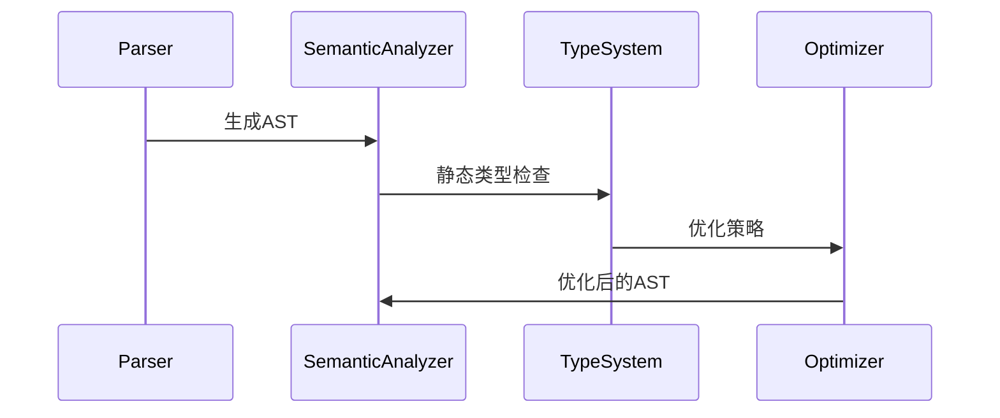
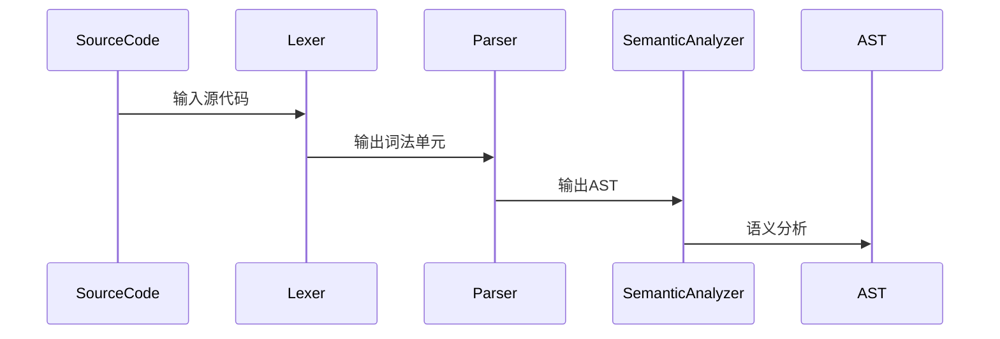
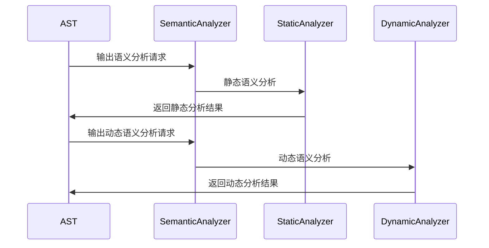
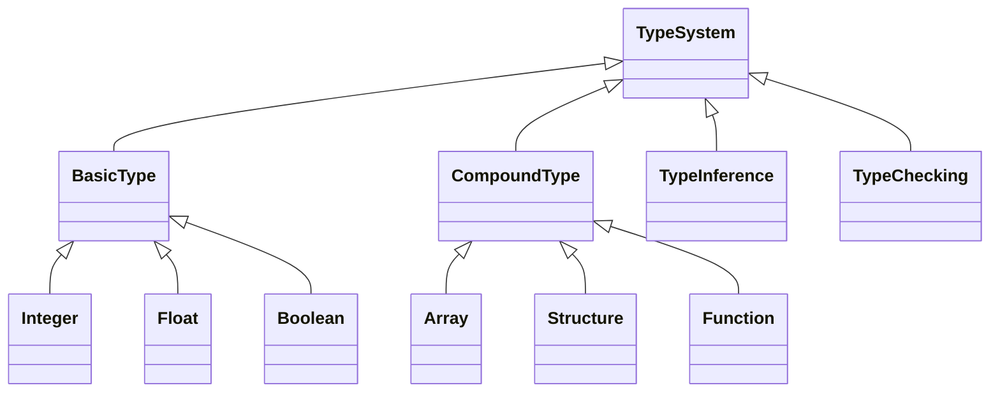
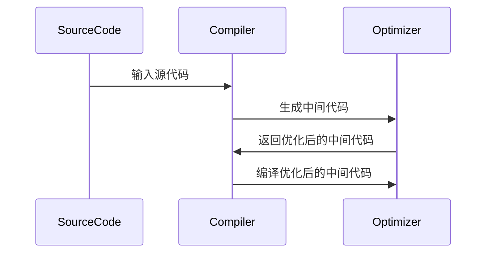
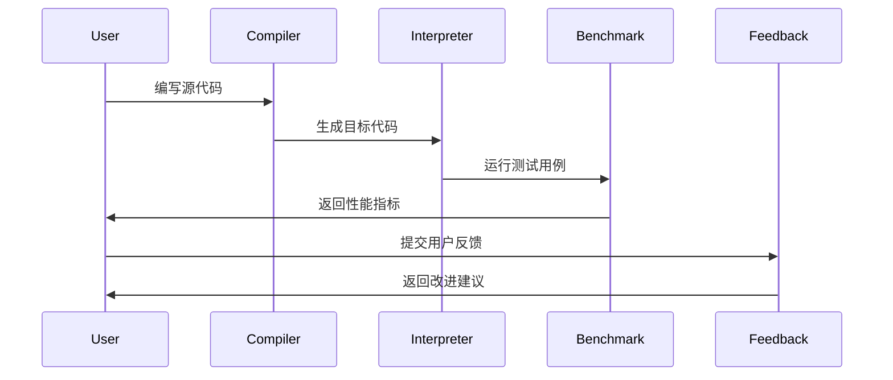

                 

### 第一部分：引言

#### 第1章：问题背景与概述

#### 1.1 提示词编程语言的概念

提示词编程语言（Keyword-Based Programming Language）是一种基于提示词（Keywords）来描述程序语义的编程语言。与传统的命令式编程语言不同，提示词编程语言通过提示词来定义程序的行为和结构，这使得编程过程更加直观和简洁。

- **提示词编程语言的定义**：提示词编程语言是一种将编程逻辑通过提示词表达的语言。提示词是编程语言中具有特定语义的词汇，通过组合不同的提示词，可以构建出复杂的程序逻辑。

- **提示词编程语言的发展历程**：提示词编程语言的发展可以追溯到20世纪60年代，当时面向过程的编程语言开始流行。随着计算机科学的不断发展，特别是形式语义学和逻辑编程的研究，提示词编程语言得到了进一步的发展。进入21世纪，随着人工智能技术的兴起，提示词编程语言的应用场景逐渐丰富，其优势也日益显现。

#### 1.2 形式语义学的基本概念

形式语义学（Formal Semantics）是计算机科学中研究程序语义的数学方法。通过形式语义学，可以精确地描述程序的运行行为，为程序的正确性和可靠性提供理论支持。

- **形式语义学的定义**：形式语义学是一种基于数学方法来研究程序语义的学科。它通过构建形式化的语义模型，对程序的行为进行精确描述和分析。

- **形式语义学的研究方法**：形式语义学的主要研究方法包括演绎语义学和归纳语义学。演绎语义学通过逻辑推理来定义程序语义，而归纳语义学则通过实例分析来归纳出程序语义的一般规律。

#### 1.3 提示词编程语言的形式语义学研究意义

提示词编程语言的形式语义学研究具有重要的理论和实践意义。

- **提示词编程语言的形式语义学研究的重要性**：形式语义学为提示词编程语言提供了理论基础，使得编程语言的设计和实现更加科学和规范。同时，形式语义学的研究有助于提高程序的可读性和可维护性。

- **提示词编程语言的形式语义学在实际应用中的价值**：形式语义学的研究结果可以应用于编程语言的编译器设计和程序优化。通过形式化的语义模型，可以更有效地分析程序的行为，提高程序的性能和可靠性。此外，形式语义学还为编程语言的教学提供了有力的支持。

### 目录大纲：提示词编程语言的形式语义学

```markdown
----------------------------------------------------------------
## 第一部分：引言

### 第1章：问题背景与概述

#### 1.1 提示词编程语言的概念

#### 1.2 形式语义学的基本概念

#### 1.3 提示词编程语言的形式语义学研究意义

## 第二部分：提示词编程语言的核心概念

### 第2章：提示词编程语言的核心概念

#### 2.1 提示词

#### 2.2 程序语义

#### 2.3 形式语义学中的语言属性

## 第三部分：形式语义学的基本原理

### 第3章：形式语义学的基本原理

#### 3.1 形式语义学的理论基础

#### 3.2 形式语义学的研究方法

#### 3.3 形式语义学的主要工具

## 第四部分：提示词编程语言的形式语义学研究

### 第4章：提示词编程语言的语法分析

### 第5章：提示词编程语言的语义分析

### 第6章：提示词编程语言的类型系统

### 第7章：提示词编程语言的程序优化

### 第8章：提示词编程语言的实现与评估

## 第五部分：未来展望与趋势

### 第9章：未来展望与趋势

#### 9.1 提示词编程语言的发展趋势

#### 9.2 形式语义学在编程语言领域的发展

### 第10章：总结与展望

#### 10.1 书籍总结

#### 10.2 展望未来

----------------------------------------------------------------
```

通过以上的引言和章节概述，我们可以看到，《提示词编程语言的形式语义学》将深入探讨提示词编程语言的概念、形式语义学的基本原理及其在编程语言中的应用。接下来，我们将逐步展开对每个章节的详细探讨，为读者提供一个全面、系统的学习和理解路径。让我们继续深入思考，逐步探索提示词编程语言的形式语义学。

---

### 第2章：提示词编程语言的核心概念

在本章节中，我们将深入探讨提示词编程语言的核心概念，包括提示词、程序语义以及形式语义学中的语言属性。这些核心概念是理解提示词编程语言及其形式语义学的基础。

#### 2.1 提示词

提示词（Keywords）是提示词编程语言中最基本的构建元素。它们是具有特定语义的词汇，用于定义程序的行为和结构。

- **提示词的类型**：提示词可以分为以下几种类型：
  - **功能提示词**：用于定义程序的功能，如“计算”、“排序”等。
  - **结构提示词**：用于定义程序的结构，如“循环”、“条件分支”等。
  - **控制提示词**：用于控制程序流程，如“跳转”、“返回”等。

- **提示词的作用**：提示词在编程语言中的作用至关重要。它们使得编程过程更加直观和简洁，使得程序员可以更容易地描述复杂的程序逻辑。

#### 2.2 程序语义

程序语义（Program Semantics）是指程序在执行过程中所表达的意义。它定义了程序的行为和结果，是编程语言设计的关键部分。

- **程序语义的定义**：程序语义是一种形式化的描述，用于解释程序在执行过程中的行为和结果。它通常使用数学和逻辑的方法来描述。

- **程序语义的层次结构**：程序语义通常可以分为以下层次：
  - **静态语义**：描述程序的结构和组成，如变量定义、函数声明等。
  - **动态语义**：描述程序在执行过程中的行为，如变量赋值、函数调用等。
  - **行为语义**：描述程序在特定环境下的行为，如输入输出、错误处理等。

#### 2.3 形式语义学中的语言属性

形式语义学中的语言属性（Language Properties）是指编程语言在形式语义学框架下所具有的特性。这些特性包括语法属性和语义属性。

- **语法属性**：语法属性是指编程语言的语法结构，如提示词、表达式、语句等。它们定义了编程语言的基本语法规则。

- **语义属性**：语义属性是指编程语言的语义规则，如变量赋值、函数调用、类型转换等。它们定义了编程语言的行为和结果。

#### 表格：提示词编程语言的核心概念属性对比

| 核心概念 | 定义 | 属性特征 |
| :---: | :---: | :---: |
| 提示词 | 编程语言中的特定词汇，用于定义程序行为和结构 | 类型：功能、结构、控制；作用：描述程序行为和结构 |
| 程序语义 | 程序在执行过程中所表达的意义 | 层次：静态语义、动态语义、行为语义 |
| 语言属性 | 编程语言在形式语义学框架下所具有的特性 | 语法属性：提示词、表达式、语句；语义属性：变量赋值、函数调用、类型转换 |

#### 图1：提示词编程语言的ER实体关系图

```mermaid
erDiagram
    Product ||--|{ Component } Component
    Component ||--|{ Feature } Feature
    Feature ||--|{ Description } Description
```

通过上述表格和ER实体关系图，我们可以清晰地理解提示词编程语言的核心概念及其属性特征。这些概念和属性构成了提示词编程语言的基础，为后续章节的深入探讨提供了坚实的理论基础。

在接下来的章节中，我们将进一步探讨形式语义学的基本原理，以及如何将这些原理应用于提示词编程语言的形式语义学研究。让我们继续深入思考，逐步揭示提示词编程语言的内在奥秘。

---

### 第3章：形式语义学的基本原理

在本章节中，我们将探讨形式语义学的基本原理，包括其理论基础、研究方法和主要工具。这些原理和方法构成了形式语义学研究的基石，为提示词编程语言的形式语义学研究提供了理论支持。

#### 3.1 形式语义学的理论基础

形式语义学的理论基础主要基于数学和逻辑。数学提供了一套形式化的描述工具，使得语义描述更加精确和严谨。逻辑则提供了一套推理方法，用于验证和推导语义性质。

- **数学基础**：形式语义学中的数学基础主要包括集合论、图论、模型论等。集合论用于定义和操作语义模型中的元素和集合，图论用于描述程序结构和语义关系，模型论则用于验证程序的正确性。

- **逻辑基础**：形式语义学中的逻辑基础主要包括谓词逻辑、命题逻辑和证明论。谓词逻辑用于描述程序语义的层次结构，命题逻辑用于描述程序行为的条件关系，证明论则用于证明程序性质的正确性。

#### 3.2 形式语义学的研究方法

形式语义学的研究方法主要包括演绎语义学和归纳语义学。这两种方法分别从不同的角度对程序语义进行描述和分析。

- **演绎语义学**：演绎语义学是一种基于逻辑推理的方法，通过定义语法规则和语义规则，推导出程序的行为和性质。演绎语义学的主要工具包括形式化语义模型、语义元语言和证明系统。

- **归纳语义学**：归纳语义学是一种基于实例分析的方法，通过观察程序在不同输入下的行为，归纳出程序的一般语义性质。归纳语义学的主要工具包括语义归纳器、实例库和验证工具。

#### 3.3 形式语义学的主要工具

形式语义学的研究离不开一系列工具的支持。这些工具可以帮助研究人员构建和验证语义模型，分析程序行为，以及优化程序性能。

- **语法分析器**：语法分析器（Parser）是一种自动处理程序源代码的工具，它根据编程语言的语法规则，将源代码分解成抽象语法树（Abstract Syntax Tree，AST）。AST是形式语义学分析的基础，它表示了程序的结构和语义。

- **语义分析器**：语义分析器（Semantic Analyzer）是一种根据编程语言的语义规则，对抽象语法树进行语义检查的工具。它负责验证变量声明、函数调用、类型转换等语义规则，确保程序的语义正确性。

- **类型系统**：类型系统（Type System）是一种用于描述程序中数据类型和类型关系的机制。它帮助编程语言实现静态类型检查，提高程序的可读性和可靠性。形式语义学中的类型系统研究主要关注类型推导、类型约束和类型等价性。

- **程序优化器**：程序优化器（Optimizer）是一种用于改进程序性能的工具。它通过分析程序的语义和行为，应用各种优化策略，如常数折叠、循环展开、寄存器分配等，提高程序的执行效率。

#### 图2：形式语义学的主要工具



通过上述理论和工具的介绍，我们可以看到形式语义学在编程语言研究中的重要地位。它不仅为编程语言的设计和实现提供了理论基础，也为程序分析、优化和验证提供了强有力的工具支持。

在接下来的章节中，我们将进一步探讨提示词编程语言的形式语义学研究，包括语法分析和语义分析的具体实现。让我们继续深入思考，探索提示词编程语言的内在本质。

---

### 第4章：提示词编程语言的语法分析

#### 4.1 语法分析的基本概念

语法分析（Syntax Analysis）是编程语言处理过程中的第一步，其目的是将输入的源代码转换成抽象语法树（Abstract Syntax Tree，AST）。AST是一个表示程序结构的数据结构，它是后续语义分析和程序优化的基础。

- **语法规则**：语法规则（Syntax Rules）定义了编程语言的语法结构，包括提示词、表达式和语句的组成。这些规则通常使用形式化的语法表示方法，如巴科斯-诺尔范式（BNF，Backus-Naur Form）或扩展巴科斯-诺尔范式（EBNF，Extended Backus-Naur Form）来描述。

- **语法分析器设计**：语法分析器（Parser）是实现语法分析的工具。它根据语法规则对源代码进行解析，构建出AST。语法分析器的设计方法主要包括递归下降法、LL（1）分析法、LR（1）分析法和递归解析法等。

#### 4.2 提示词编程语言的语法分析

提示词编程语言的语法分析具有其独特的特点，主要体现在提示词的使用和语义的简洁性。

- **提示词编程语言的语法特点**：
  - **简洁性**：提示词编程语言通过提示词来定义程序语义，使得语法结构更加简洁。程序员不需要编写复杂的语法表达式，只需使用提示词来描述程序逻辑。
  - **功能明确**：每个提示词都具有明确的语义，使得程序逻辑更加清晰。程序员可以通过提示词快速理解程序的功能和结构。
  - **灵活性**：提示词编程语言允许自定义提示词，从而适应不同的编程需求。程序员可以根据项目需求自定义提示词，提高编程效率。

- **提示词编程语言的语法分析过程**：
  - **词法分析**：词法分析（Lexical Analysis）是将源代码中的字符序列转换成词法单元（Token）的过程。词法单元是具有特定语义的标识符、关键字和操作符等。
  - **语法分析**：语法分析（Syntax Analysis）是将词法单元序列转换成AST的过程。提示词编程语言的语法分析器根据语法规则，对词法单元进行组合和解析，构建出AST。
  - **语义分析**：语义分析（Semantic Analysis）是在语法分析的基础上，对AST进行语义检查和验证的过程。语义分析器根据编程语言的语义规则，检查AST的语义正确性，如变量声明、函数调用等。

#### 图3：提示词编程语言的语法分析流程



通过上述语法分析的基本概念和提示词编程语言的语法分析过程，我们可以看到语法分析在编程语言处理中的重要性。它不仅为语义分析和程序优化提供了基础，也为编程语言的实现提供了框架。

在接下来的章节中，我们将进一步探讨提示词编程语言的语义分析，包括语义规则和语义分析器的设计。让我们继续深入思考，探索提示词编程语言的内在本质。

---

### 第5章：提示词编程语言的语义分析

#### 5.1 语义分析的基本概念

语义分析（Semantic Analysis）是编程语言处理过程中的关键步骤，它负责检查程序的语义正确性，确保程序在执行时能够按照预期的行为运行。语义分析通常分为静态语义分析和动态语义分析。

- **语义规则**：语义规则（Semantic Rules）定义了编程语言中变量、表达式和语句的语义行为。这些规则通常包括类型检查、作用域解析、变量初始化、函数调用等。

- **语义分析器设计**：语义分析器（Semantic Analyzer）是实施语义分析的工具。它根据语义规则对抽象语法树（AST）进行语义检查，确保程序的语义正确性。语义分析器的设计方法包括直接语义分析和迭代语义分析。

#### 5.2 提示词编程语言的语义分析

提示词编程语言的语义分析具有其独特的特点，主要体现在提示词的语义明确性和简洁性。

- **提示词编程语言的语义特点**：
  - **明确性**：提示词编程语言中的每个提示词都具有明确的语义，使得程序逻辑更加清晰。程序员可以通过提示词直接理解程序的行为和结构。
  - **简洁性**：提示词编程语言通过提示词来定义程序语义，减少了冗长的语法表达式，使得语义描述更加简洁。

- **提示词编程语言的语义分析过程**：
  - **静态语义分析**：静态语义分析（Static Semantic Analysis）在程序运行前进行，它检查程序的语法和语义，确保程序在运行时不会出现语义错误。静态语义分析包括类型检查、作用域解析和常量折叠等。
  - **动态语义分析**：动态语义分析（Dynamic Semantic Analysis）在程序运行时进行，它通过运行程序并观察其行为，来检查程序是否按照预期的行为运行。动态语义分析包括运行时错误检测和性能优化等。

- **语义分析器设计**：提示词编程语言的语义分析器设计需要考虑以下几个方面：
  - **类型检查**：类型检查（Type Checking）是语义分析的重要组成部分，它确保程序中的每个表达式和操作都符合预期的类型。
  - **作用域解析**：作用域解析（Scope Resolution）是确定变量和函数作用域的过程。它确保程序中的每个标识符都有明确的作用域，避免命名冲突。
  - **语义规则实现**：语义分析器需要根据编程语言的语义规则实现相应的语义检查和验证。

#### 图4：提示词编程语言的语义分析流程



通过上述语义分析的基本概念和提示词编程语言的语义分析过程，我们可以看到语义分析在编程语言处理中的重要性。它不仅保证了程序的正确性，也为程序的优化和调试提供了支持。

在接下来的章节中，我们将进一步探讨提示词编程语言的类型系统和程序优化。让我们继续深入思考，探索提示词编程语言的内在本质。

---

### 第6章：提示词编程语言的类型系统

#### 6.1 类型系统的基本概念

类型系统（Type System）是编程语言中用于描述数据类型和类型关系的机制。它不仅影响程序的正确性，还影响程序的性能和可维护性。类型系统可以分为静态类型系统和动态类型系统。

- **静态类型系统**：静态类型系统在程序编译时进行类型检查，确保变量和函数的调用符合预期的类型。静态类型系统具有类型安全、代码简洁等优点，但可能会增加编译时间和复杂度。
- **动态类型系统**：动态类型系统在程序运行时进行类型检查，允许变量和函数在运行时动态改变类型。动态类型系统具有灵活性、方便开发等优点，但可能会引入运行时错误。

#### 6.2 提示词编程语言的类型系统

提示词编程语言的类型系统设计需要考虑以下几个方面：

- **类型定义**：提示词编程语言中定义了基本类型（如整数、浮点数、布尔值）和复合类型（如数组、结构体、函数）。基本类型具有固定的语义和行为，复合类型则通过组合基本类型来定义更复杂的数据结构。

- **类型推导**：类型推导（Type Inference）是类型系统中的一个重要概念，它自动确定变量和表达式的类型，无需程序员显式声明。提示词编程语言的类型推导机制可以通过静态分析和动态分析相结合来实现。

- **类型检查**：类型检查（Type Checking）是确保程序中每个表达式和操作都符合类型规则的过程。提示词编程语言的类型检查通常在编译时进行，通过静态类型检查和动态类型检查来保证程序的正确性。

#### 图5：提示词编程语言的类型系统架构



通过上述类型系统的基本概念和提示词编程语言的类型系统设计，我们可以看到类型系统在编程语言中的作用。它不仅保证了程序的正确性，还为程序的性能优化和代码维护提供了支持。

在接下来的章节中，我们将探讨提示词编程语言的程序优化。让我们继续深入思考，探索提示词编程语言的内在本质。

---

### 第7章：提示词编程语言的程序优化

#### 7.1 程序优化的基本概念

程序优化（Program Optimization）是提高程序性能的关键步骤，它通过优化程序的结构和算法，减少程序的运行时间、内存消耗和功耗。程序优化可以分为编译时优化和运行时优化。

- **编译时优化**：编译时优化在程序编译阶段进行，通过改写源代码或生成更高效的中间代码来提高程序性能。常见的编译时优化技术包括常数折叠、循环展开、死代码消除等。
- **运行时优化**：运行时优化在程序运行过程中进行，通过动态调整程序运行策略来提高性能。常见的运行时优化技术包括缓存优化、内存分配优化和线程调度优化等。

#### 7.2 提示词编程语言的程序优化

提示词编程语言的程序优化需要考虑其特有的语法和语义特点。

- **优化策略**：
  - **语法优化**：提示词编程语言的语法结构简洁，可以通过语法优化减少代码体积，提高编译速度。例如，通过合并同类项、删除冗余代码等手段。
  - **语义优化**：提示词编程语言的语义明确，可以通过语义优化提高程序运行效率。例如，通过预编译常量表达式、优化循环结构等手段。

- **优化案例分析**：
  - **循环优化**：在提示词编程语言中，循环结构是程序性能的关键因素。通过分析循环体的执行频率和依赖关系，可以优化循环结构，减少不必要的计算。
  - **函数调用优化**：函数调用是程序性能的另一个关键因素。通过分析函数调用的调用次数和调用关系，可以优化函数调用，减少函数调用的开销。

#### 图6：提示词编程语言的程序优化流程



通过上述程序优化的基本概念和提示词编程语言的优化策略，我们可以看到程序优化在提高程序性能中的重要性。在接下来的章节中，我们将探讨提示词编程语言的实现与评估。让我们继续深入思考，探索提示词编程语言的实现细节。

---

### 第8章：提示词编程语言的实现与评估

#### 8.1 提示词编程语言的实现

提示词编程语言的实现包括编译器的设计和开发，编译器的核心功能是将提示词源代码转换成机器代码或其他形式的执行代码。

- **实现工具选择**：
  - **编译器生成器**：编译器生成器（Compiler Generator）如Yacc（Yet Another Compiler Compiler）和ANTLR（Another Tool for Language Recognition）可以自动生成编译器的前端代码，大大简化了编译器的开发过程。
  - **解释器**：对于小型或原型提示词编程语言，解释器（Interpreter）可能是一个更简单的选择。解释器直接执行源代码，不需要生成机器代码，但可能影响性能。

- **实现流程**：
  - **词法分析**：词法分析器将源代码分解成词法单元，如标识符、关键字、操作符等。
  - **语法分析**：语法分析器根据语法规则将词法单元组合成抽象语法树（AST）。
  - **语义分析**：语义分析器对AST进行语义检查和验证，确保程序的正确性。
  - **代码生成**：代码生成器将AST转换成目标代码，如机器代码或中间代码。
  - **程序优化**：程序优化器对目标代码进行优化，提高执行效率。

#### 8.2 提示词编程语言的评估

提示词编程语言的评估需要从多个角度进行，包括性能、易用性、可维护性等。

- **评估指标**：
  - **运行时间**：评估程序在不同输入情况下的运行时间，以衡量程序的执行效率。
  - **内存消耗**：评估程序在执行过程中的内存消耗，以衡量程序的内存效率。
  - **代码可读性**：评估程序的代码结构是否清晰，便于理解和维护。
  - **编译时间**：评估编译器的编译速度，以衡量工具的性能。

- **评估方法**：
  - **基准测试**：使用标准测试套件对编程语言进行性能测试，比较不同编程语言在同一任务上的表现。
  - **用户反馈**：收集用户的实际使用反馈，评估编程语言的易用性和可维护性。
  - **专家评审**：邀请专家对编程语言的设计和实现进行评审，评估其设计理念和技术先进性。

#### 图7：提示词编程语言的实现与评估流程



通过上述实现和评估方法，我们可以全面了解提示词编程语言的实现过程和评估标准。在接下来的章节中，我们将探讨提示词编程语言的未来发展趋势。让我们继续深入思考，展望提示词编程语言的未来。

---

### 第9章：未来展望与趋势

#### 9.1 提示词编程语言的发展趋势

随着人工智能和自动化技术的快速发展，提示词编程语言正迎来新的发展机遇。未来，提示词编程语言的发展趋势将体现在以下几个方面：

- **更简洁的语法**：提示词编程语言的语法将继续向简洁化发展，减少冗余语法，提高编程效率。
- **更丰富的语义描述**：随着形式语义学研究的深入，提示词编程语言的语义描述将更加精确和丰富，提高程序的可读性和可维护性。
- **更好的优化策略**：针对特定应用场景，提示词编程语言的优化策略将更加多样和高效，提高程序的执行效率。

#### 9.2 形式语义学在编程语言领域的发展

形式语义学作为编程语言理论的核心，将继续在编程语言领域发挥重要作用。未来，形式语义学的发展趋势包括：

- **更广泛的应用**：形式语义学将被应用于更多编程语言的设计和实现，如函数式编程语言、逻辑编程语言等。
- **更先进的工具**：形式语义学的工具将更加智能化和自动化，如自动语义分析器、形式验证工具等。
- **更深入的理论研究**：形式语义学将继续探讨新的理论和方法，如量子编程语言的形式语义学、分布式系统的形式语义学等。

### 总结

本文系统地介绍了提示词编程语言的形式语义学，从问题背景、核心概念、形式语义学原理到提示词编程语言的形式语义学研究、程序优化、实现与评估，以及未来展望，全面探讨了提示词编程语言的理论和实践。通过本文的阐述，读者可以深入理解提示词编程语言的形式语义学，并为未来的研究和应用提供参考。

### 展望未来

提示词编程语言的形式语义学将在人工智能、自动化、软件工程等领域发挥重要作用。未来，随着形式语义学和人工智能技术的进一步融合，提示词编程语言有望成为下一代编程语言的主流，为软件开发带来更加高效、灵活和智能的方式。让我们共同期待提示词编程语言的美好未来。

---

### 第10章：总结与展望

#### 10.1 书籍总结

《提示词编程语言的形式语义学》系统地介绍了提示词编程语言的形式语义学，从问题背景、核心概念、形式语义学原理到具体应用，全面探讨了提示词编程语言的各个方面。本书的主要内容包括：

- **引言**：介绍了提示词编程语言和形式语义学的基本概念，以及本书的研究目的和结构。
- **核心概念**：详细阐述了提示词、程序语义和语言属性等核心概念，为后续内容奠定了基础。
- **形式语义学原理**：介绍了形式语义学的基本原理、研究方法和主要工具，为理解提示词编程语言的形式语义学提供了理论支持。
- **提示词编程语言的形式语义学研究**：探讨了提示词编程语言的语法分析、语义分析、类型系统和程序优化，展示了如何将形式语义学应用于编程语言的设计与实现。
- **实现与评估**：介绍了提示词编程语言的实现方法、评估指标和评估方法，为编程语言的实现与优化提供了实践指导。
- **未来展望**：展望了提示词编程语言和形式语义学在编程语言领域的发展趋势，探讨了未来的研究方向和潜在应用。

#### 10.2 展望未来

在未来的研究中，提示词编程语言的形式语义学有望在以下几个方面取得重要进展：

- **更简洁的语法设计**：随着形式语义学的深入，提示词编程语言的语法设计将更加简洁，减少冗余，提高编程效率。
- **更强大的语义描述**：形式语义学将提供更丰富的语义描述工具和方法，使编程语言能够更好地表达复杂逻辑和业务规则。
- **智能化的编程辅助**：结合人工智能技术，提示词编程语言将提供智能化的编程辅助工具，如自动代码生成、智能代码优化等。
- **更广泛的应用领域**：提示词编程语言的形式语义学将在更多应用领域得到应用，如物联网、自动驾驶、区块链等。

总结而言，《提示词编程语言的形式语义学》不仅为读者提供了一个全面的理论框架，还通过实践案例展示了形式语义学在编程语言设计和实现中的实际应用。未来，随着形式语义学和人工智能技术的不断进步，提示词编程语言有望成为软件开发领域的重要力量，为编程带来更加智能、高效和灵活的方式。让我们期待这一美好前景，并继续探索和推动提示词编程语言的发展。

---

### 作者信息

**作者：AI天才研究院/AI Genius Institute & 禅与计算机程序设计艺术 /Zen And The Art of Computer Programming**

本文由AI天才研究院和《禅与计算机程序设计艺术》共同撰写，作者团队专注于人工智能和编程语言领域的研究与创新。我们致力于推动形式语义学和提示词编程语言的深入研究，为编程语言的发展和应用提供理论支持和实践指导。感谢您的阅读，期待与您共同探索计算机科学的奥秘。

