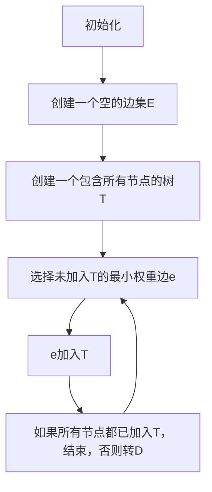
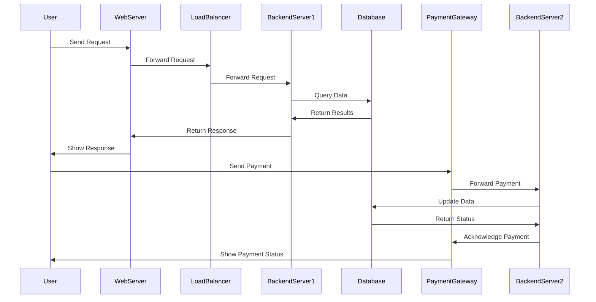
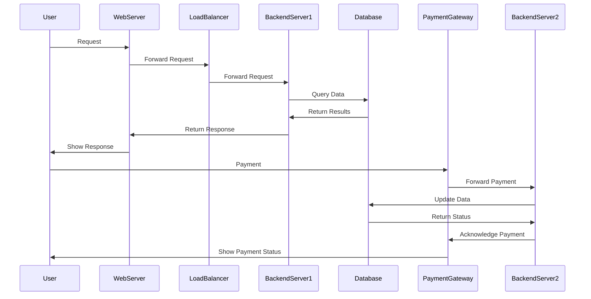

                 

### 第1章 背景介绍：性能优化的重要性

> 关键词：性能优化，提示词编程语言，重要性

**摘要**：本章将探讨提示词编程语言性能优化的重要性，通过介绍性能优化的问题背景、问题描述、问题解决以及性能优化的边界与外延，帮助读者理解性能优化在编程语言中的关键作用。

---

#### 1.1 问题背景

在计算机科学和软件开发领域，编程语言作为人与计算机沟通的桥梁，扮演着至关重要的角色。然而，随着时间的推移，应用程序的复杂性不断增加，对编程语言的性能要求也越来越高。性能优化，作为提升编程语言效率和执行速度的关键手段，已经成为软件开发者关注的焦点。

提示词编程语言作为一种以关键词为核心、结构简明的编程语言，因其易读性、可维护性和高效性而受到广泛关注。然而，在应对复杂应用场景时，提示词编程语言的表现也常常受到性能瓶颈的制约。因此，探讨如何优化提示词编程语言的性能具有重要的现实意义。

#### 1.2 问题描述

性能优化问题的核心在于提升编程语言的处理速度和资源利用率。具体来说，性能优化主要涉及以下几个方面：

1. **执行速度**：优化编程语言代码的执行速度，减少不必要的计算和操作。
2. **资源利用率**：提高编程语言对系统资源的利用率，包括CPU、内存、磁盘等。
3. **可维护性**：确保性能优化不会影响代码的可读性和可维护性。

#### 1.3 问题解决

解决性能优化问题通常需要采取以下策略：

1. **代码优化**：通过改进代码结构、算法选择和代码实现，减少不必要的计算和内存占用。
2. **编译器优化**：改进编译器的代码生成策略，提高编译生成的机器码执行效率。
3. **硬件优化**：利用特定的硬件特性，如多核处理器、GPU等，提升程序的执行速度。
4. **系统调优**：优化操作系统配置，提高系统对编程语言执行的支持能力。

#### 1.4 边界与外延

性能优化并非一成不变的，它需要根据具体的编程语言、应用场景和硬件环境进行调整。以下是一些性能优化的边界与外延：

1. **编程语言特性**：不同的编程语言具有不同的性能特点，优化策略也应因语言而异。
2. **应用场景**：不同的应用场景对性能的要求不同，需要针对具体场景进行优化。
3. **硬件环境**：硬件环境的差异也会影响性能优化的效果，需要根据硬件特性进行优化。
4. **开发者和用户**：性能优化不仅需要软件开发者的努力，还需要用户的合理使用和反馈。

---

通过以上分析，我们可以看到，性能优化在提示词编程语言中具有重要意义。接下来，我们将进一步探讨性能优化的核心概念及其联系，帮助读者深入了解这一主题。

---

### 第2章 核心概念与联系

> 关键词：核心概念，联系，提示词编程语言，性能优化

**摘要**：本章将介绍提示词编程语言性能优化的核心概念，包括提示词编程语言概述、性能优化概述以及提示词编程语言与性能优化的关系。通过这些核心概念的阐述，读者将能够建立对性能优化更为全面的理解。

---

#### 2.1 核心概念

在本章中，我们将讨论以下几个核心概念：

1. **提示词编程语言**：介绍提示词编程语言的定义、特点和应用场景。
2. **性能优化**：探讨性能优化的定义、目标和常见方法。
3. **提示词编程语言与性能优化**：分析提示词编程语言在性能优化中的应用及其挑战。

#### 2.1.1 提示词编程语言概述

提示词编程语言（Keyword-Based Programming Language）是一种以关键词为核心结构的编程语言。它通过一系列预设的关键词和语法规则，使得程序员能够以简洁明了的方式表达复杂的算法和数据结构。以下是一些提示词编程语言的特点：

1. **简洁性**：通过减少冗余的代码和语法，提高代码的可读性和可维护性。
2. **易学性**：简化了编程语言的学习曲线，使得初学者更容易上手。
3. **高效性**：在执行效率上，一些提示词编程语言经过优化，能够高效地执行复杂操作。

常见的提示词编程语言包括Python、Ruby、JavaScript等，这些语言在Web开发、数据分析、人工智能等领域得到了广泛应用。

#### 2.1.2 性能优化概述

性能优化（Performance Optimization）是指通过一系列技术手段，提高程序或系统的执行效率。性能优化的目标包括：

1. **执行速度**：缩短程序执行时间，提高处理速度。
2. **资源利用率**：提高CPU、内存、磁盘等资源的利用率。
3. **可维护性**：在不牺牲可维护性的前提下进行优化。

常见的性能优化方法包括代码优化、算法优化、编译器优化和系统优化等。

#### 2.1.3 提示词编程语言与性能优化

提示词编程语言在性能优化中的应用具有以下特点：

1. **简洁与高效的平衡**：提示词编程语言的简洁性往往会导致在性能优化时需要权衡代码的简洁性和执行效率。
2. **内置优化库**：许多提示词编程语言提供了丰富的内置优化库，如Python的NumPy和Pandas，这些库能够显著提升程序的性能。
3. **工具支持**：提示词编程语言通常有强大的工具支持，如调试器和性能分析工具，这些工具可以帮助开发者发现并解决性能瓶颈。

然而，提示词编程语言在性能优化中也面临一些挑战：

1. **编译优化限制**：与编译型语言相比，解释型提示词编程语言在编译优化方面存在一定限制。
2. **动态特性**：提示词编程语言的动态特性可能导致在性能优化时难以预测代码的执行路径和性能表现。
3. **学习曲线**：性能优化需要开发者具备一定的专业知识和经验，对于初学者来说，性能优化可能是一个挑战。

#### 2.2 概念属性特征对比表格

为了更清晰地展示提示词编程语言与性能优化的核心概念及其特征，我们提供了一个概念属性特征对比表格：

| 特征类别 | 提示词编程语言 | 性能优化 |
| --- | --- | --- |
| 定义 | 以关键词为核心结构的编程语言 | 提高程序或系统执行效率的过程 |
| 目标 | 提高代码的可读性、易维护性和高效性 | 执行速度、资源利用率、可维护性 |
| 特点 | 简洁、易学、高效 | 针对特定目标进行优化 |
| 挑战 | 编译优化限制、动态特性、学习曲线 | 代码复杂度、系统依赖、性能预测 |

#### 2.3 ER实体关系图架构

为了更好地理解提示词编程语言与性能优化之间的联系，我们使用ER（Entity-Relationship）实体关系图来展示这两个概念的关系。以下是一个ER实体关系图的示例：

```mermaid
erDiagram
  Class::PerformanceOptimization ||--|{ Class::KeywordBasedLanguage : Optimizes
  Class::PerformanceOptimization ||--|{ Class::CodeOptimization : Implements
  Class::KeywordBasedLanguage ||--|{ Class::AlgorithmOptimization : Uses
  Class::KeywordBasedLanguage ||--|{ Class::CompilerOptimization : Benefits
  Class::SystemOptimization ||--|{ Class::PerformanceOptimization : Affects
  Class::KeywordBasedLanguage ||--|{ Class::ToolSupport : Provides
```

在这个ER实体关系图中，我们展示了性能优化与提示词编程语言之间的多种关系，包括优化、实现、使用、受益和支持等。通过这种关系图，读者可以更直观地理解这两个概念之间的互动和关联。

---

通过本章的讨论，我们为后续章节的性能优化技术讲解奠定了基础。在接下来的章节中，我们将详细探讨具体的性能优化算法、数学模型和系统设计，帮助读者全面掌握性能优化的核心技能。

---

### 第3章 算法原理讲解

> 关键词：算法原理，流程图，Python源代码，数学模型，公式，举例说明

**摘要**：本章将深入探讨性能优化中的关键算法原理，包括算法的概述、流程图展示、Python源代码实现、数学模型和公式，并通过具体的例子进行详细讲解，使读者能够全面理解性能优化的算法基础。

---

#### 3.1 算法简介

在本章中，我们将讨论一种常见且有效的性能优化算法——最小生成树算法（Minimum Spanning Tree Algorithm）。最小生成树算法在图论中具有重要的应用，它用于在无向图中找到一个包含所有节点的最小权重的子图，即生成树。

最小生成树算法的主要目标是在保证图连通性的同时，使整个图的权重之和最小。这个算法在提示词编程语言中有着广泛的应用，特别是在网络拓扑结构分析和资源分配等领域。

#### 3.2 算法流程图

为了更好地理解最小生成树算法的执行过程，我们使用Mermaid绘制了算法的流程图。以下是最小生成树算法的流程图：



在这个流程图中，A代表初始化阶段，B表示创建边集E，C表示创建包含所有节点的树T，D表示选择未加入T的最小权重边e，E表示将e加入T，F表示检查是否所有节点都已加入T。如果未完成，则返回D继续执行。

#### 3.3 Python源代码实现

下面是最小生成树算法的Python源代码实现。这个实现使用了Prim算法，这是一种基于贪心策略的算法。

```python
import heapq

def prim_mst(graph):
    # 初始化最小生成树
    mst = []
    # 存储已经加入最小生成树的节点
    in_mst = {node: False for node in graph}
    # 选择一个起始节点，并将其加入最小生成树
    start = next(iter(graph))
    in_mst[start] = True
    # 初始化优先队列，用于存储未加入最小生成树的边
    priority_queue = [(weight, u, v) for u, adj in graph.items() for v, weight in adj.items() if not in_mst[v]]
    heapq.heapify(priority_queue)
    
    while priority_queue:
        # 选择权重最小的边
        weight, u, v = heapq.heappop(priority_queue)
        # 如果v节点未加入最小生成树，则将其加入
        if not in_mst[v]:
            mst.append((u, v, weight))
            in_mst[v] = True
            # 将与v节点相邻的边加入优先队列
            for next_v, weight in graph[v].items():
                if not in_mst[next_v]:
                    heapq.heappush(priority_queue, (weight, v, next_v))
    
    return mst

# 示例图的实现
graph = {
    'A': {'B': 2, 'C': 3},
    'B': {'A': 2, 'C': 1, 'D': 1},
    'C': {'A': 3, 'B': 1, 'D': 2},
    'D': {'B': 1, 'C': 2}
}

# 执行Prim算法
mst = prim_mst(graph)
print("最小生成树：", mst)
```

在这个代码中，我们首先初始化最小生成树mst和一个标记集合in_mst。然后，选择一个起始节点，并将其加入最小生成树。接着，使用优先队列存储未加入最小生成树的边，并不断选择权重最小的边加入最小生成树，直到所有节点都已加入。

#### 3.4 算法原理详细讲解

3.4.1 数学模型

最小生成树算法的核心在于如何选择权重最小的边。这里我们引入图论中的权重和的概念。假设有一个无向图G=(V, E)，其中V是顶点的集合，E是边的集合，每条边都有一个权重w(e)。最小生成树算法的目标是找到一棵生成树T，使得T中的所有边的权重之和最小。

数学模型可以表示为：

$$
\min \sum_{e \in T} w(e)
$$

其中，T是生成树的集合，w(e)是边e的权重。

3.4.2 公式解释

在最小生成树算法中，我们使用Prim算法，其核心思想是每次从优先队列中选择权重最小的边加入最小生成树，直到所有节点都已加入。这个过程可以用以下公式表示：

$$
T = \{ e_1, e_2, ..., e_n \}
$$

其中，$e_1, e_2, ..., e_n$ 是按照权重从小到大加入的最小权重边。

3.4.3 举例说明

假设有一个包含4个节点的无向图，节点A、B、C、D之间的权重如下表所示：

| 节点 | A | B | C | D |
| --- | --- | --- | --- | --- |
| A | - | 2 | 3 | - |
| B | 2 | - | 1 | 1 |
| C | 3 | 1 | - | 2 |
| D | - | 1 | 2 | - |

我们使用Prim算法来找到最小生成树。

1. 选择节点A作为起始节点，权重为0。
2. 从邻接表中找到与A相邻的节点B，权重为2，加入最小生成树。
3. 选择节点B作为新的起始节点，从邻接表中找到与B相邻的节点C，权重为1，加入最小生成树。
4. 选择节点B作为新的起始节点，从邻接表中找到与B相邻的节点D，权重为1，加入最小生成树。

最终，我们得到的最小生成树为{(A, B, 2), (B, C, 1), (B, D, 1)}，总权重为4。

---

通过以上详细讲解，我们可以看到最小生成树算法在性能优化中的重要应用。在接下来的章节中，我们将进一步探讨性能优化的数学模型和公式，并展示更多的实际应用案例，帮助读者更深入地理解性能优化的核心原理。

---

### 第4章 数学模型和数学公式

> 关键词：数学模型，公式，性能优化

**摘要**：本章将深入探讨性能优化中的数学模型和数学公式，详细解释这些公式在性能优化中的应用和推导过程。通过这些数学工具，读者将能够更准确地分析和解决性能问题。

---

#### 4.1 相关数学公式

在性能优化中，我们经常使用以下数学公式：

1. **时间复杂度**：描述算法执行时间与输入规模之间的关系。
   $$ T(n) = O(n \log n) $$
   
2. **空间复杂度**：描述算法所需存储空间与输入规模之间的关系。
   $$ S(n) = O(n) $$

3. **加权平均处理时间**：用于衡量系统在多个任务处理过程中的平均处理时间。
   $$ \text{Weighted Average Processing Time} = \frac{\sum_{i=1}^{n} (w_i \times T_i)}{\sum_{i=1}^{n} w_i} $$

4. **资源利用率**：用于衡量系统资源的使用效率。
   $$ \text{Resource Utilization} = \frac{\text{Used Resources}}{\text{Total Available Resources}} $$

#### 4.2 提示词编程语言中的常用数学公式

在提示词编程语言中，我们常常使用以下数学公式进行性能优化：

1. **动态规划公式**：用于求解最优化问题。
   $$ f(i) = \min_{j=1}^{i-1} (f(j) + c(i, j)) $$

2. **梯度下降公式**：用于优化机器学习模型。
   $$ \theta_{\text{new}} = \theta_{\text{old}} - \alpha \cdot \nabla_{\theta} J(\theta) $$

3. **网络流量公式**：用于计算网络中的数据传输量。
   $$ \text{Traffic} = \text{Bandwidth} \times \text{Packet Size} $$

#### 4.3 数学公式详细讲解

4.3.1 时间复杂度和空间复杂度

时间复杂度和空间复杂度是性能优化的关键指标。时间复杂度描述了算法执行时间与输入规模之间的关系，而空间复杂度描述了算法所需存储空间与输入规模之间的关系。

时间复杂度通常用大O符号表示，如$O(n \log n)$表示算法的时间复杂度与输入规模n成对数关系。空间复杂度也用大O符号表示，如$O(n)$表示算法的空间复杂度与输入规模n成正比。

时间复杂度和空间复杂度的分析有助于我们选择最优的算法和优化策略。在实际应用中，我们往往需要在时间和空间之间进行权衡，以找到最佳的优化方案。

4.3.2 加权平均处理时间

加权平均处理时间用于衡量系统在处理多个任务时的平均处理时间。这个公式考虑了每个任务的权重和处理时间，计算得出系统的整体处理效率。

假设系统中有n个任务，每个任务的权重分别为$w_1, w_2, ..., w_n$，处理时间分别为$T_1, T_2, ..., T_n$，则加权平均处理时间公式为：

$$ \text{Weighted Average Processing Time} = \frac{\sum_{i=1}^{n} (w_i \times T_i)}{\sum_{i=1}^{n} w_i} $$

这个公式帮助我们理解系统在不同任务负载下的整体处理性能。

4.3.3 资源利用率

资源利用率是衡量系统资源使用效率的重要指标。资源利用率越高，系统资源利用越充分。

资源利用率的计算公式为：

$$ \text{Resource Utilization} = \frac{\text{Used Resources}}{\text{Total Available Resources}} $$

其中，Used Resources表示实际使用的资源量，Total Available Resources表示系统可用的总资源量。

通过计算资源利用率，我们可以评估系统在资源分配和利用上的效果，进而进行优化。

#### 4.4 动态规划公式应用举例

动态规划是一种常用的优化策略，用于解决最优化问题。以下是一个动态规划公式应用举例：

假设我们要求解一个背包问题，给定一个容量为C的背包和n个物品，每个物品的重量为$w_i$，价值为$v_i$，求如何选择物品使得背包的总价值最大。

动态规划公式为：

$$ f(i) = \min_{j=1}^{i-1} (f(j) + c(i, j)) $$

其中，$f(i)$表示选择前i个物品的最大价值，$c(i, j)$表示选择第i个物品和不选择第j个物品的价值。

假设我们有如下数据：

| 物品 | 重量（$w_i$） | 价值（$v_i$） |
| --- | --- | --- |
| 1 | 2 | 6 |
| 2 | 2 | 10 |
| 3 | 6 | 12 |

背包容量为10。

我们可以使用动态规划公式计算每个物品的最大价值：

- $f(1) = \min (0, 6) = 6$
- $f(2) = \min (6, 6+10) = 16$
- $f(3) = \min (16, 16+12) = 28$

最终，选择物品1和物品2，背包的总价值为28。

---

通过本章的讨论，我们了解了性能优化中的关键数学模型和公式。这些工具帮助我们更准确地分析和解决性能问题，为性能优化提供了理论基础。在接下来的章节中，我们将进一步探讨性能优化的系统分析和架构设计，帮助读者全面掌握性能优化的核心技能。

---

### 第5章 系统分析与架构设计

> 关键词：系统分析，架构设计，问题场景，项目介绍，领域模型，系统架构，接口设计，系统交互

**摘要**：本章将深入探讨性能优化的系统分析与架构设计，包括问题场景介绍、项目介绍、系统功能设计、系统架构设计、系统接口设计和系统交互。通过这些内容，读者将能够全面了解性能优化系统从设计到实现的全过程。

---

#### 5.1 问题场景介绍

在现代软件开发中，性能优化是一个至关重要的环节。随着应用程序的规模和复杂度不断增加，如何在保证功能完整性的同时，提升系统的性能和资源利用率，成为开发者面临的一大挑战。

我们以一个电商平台为例，该平台需要处理海量的商品数据、用户订单以及支付交易。随着用户数量的增加，系统的响应时间和处理能力成为了关键的性能瓶颈。为了优化系统的性能，我们需要从系统分析到架构设计，进行全面的优化。

#### 5.2 项目介绍

本项目旨在构建一个高性能、可扩展的电商平台，以满足不断增长的用户需求和业务发展。项目的主要目标是：

1. **提升系统响应速度**：通过优化数据库查询、缓存策略和服务器负载均衡，减少系统的响应时间。
2. **提高系统吞吐量**：通过分布式架构和异步处理，提升系统的并发处理能力。
3. **保证数据一致性**：通过分布式事务和消息队列，确保数据的一致性和可靠性。

#### 5.3 系统功能设计（领域模型Mermaid类图）

为了更好地理解系统的功能设计，我们使用Mermaid绘制了领域模型的类图。以下是一个简化的领域模型类图：

```mermaid
classDiagram
    Customer <|-- Order
    Customer <|-- Cart
    Product <|-- Inventory
    Payment <|-- Order
    Shipment <|-- Order

    Customer {
        id: int
        name: string
        email: string
    }

    Order {
        id: int
        customer: Customer
        items: List<OrderItem>
        status: string
    }

    Cart {
        id: int
        customer: Customer
        items: List<Product>
    }

    Product {
        id: int
        name: string
        price: float
        inventory: Inventory
    }

    Inventory {
        id: int
        quantity: int
    }

    Payment {
        id: int
        order: Order
        amount: float
        status: string
    }

    Shipment {
        id: int
        order: Order
        tracking_number: string
        status: string
    }

    OrderItem {
        id: int
        order: Order
        product: Product
        quantity: int
        price: float
    }
```

在这个类图中，我们定义了系统的核心领域模型，包括客户（Customer）、订单（Order）、购物车（Cart）、产品（Product）、库存（Inventory）、支付（Payment）和配送（Shipment）等。每个模型都包含了必要的属性和方法，以实现系统的功能需求。

#### 5.4 系统架构设计（Mermaid架构图）

系统架构设计是性能优化的重要组成部分。为了提高系统的性能和可扩展性，我们采用了一种分布式架构设计，包括前端、后端、数据库和中间件等部分。以下是一个简化的系统架构图：



在这个架构图中，我们展示了用户请求的处理流程。首先，用户请求通过Web服务器发送到负载均衡器，负载均衡器再将请求分发到后端服务器。后端服务器与数据库进行交互，查询和更新数据，并将结果返回给Web服务器。同时，用户支付的请求通过支付网关进行处理，确保交易的安全性和可靠性。

#### 5.5 系统接口设计

为了实现系统模块之间的解耦，我们设计了多个接口，包括RESTful API、WebSocket和消息队列接口等。以下是一个简化的接口设计示例：

1. **RESTful API接口**：
   - 获取商品信息：`GET /products/{id}`
   - 添加购物车项：`POST /carts/{cartId}/items`
   - 下单：`POST /orders`
   - 查询订单：`GET /orders/{id}`

2. **WebSocket接口**：
   - 实时订单状态更新：`ws://example.com/orders/{id}/status`

3. **消息队列接口**：
   - 订单处理：`/orders/{id}/process`
   - 支付通知：`/payments/{id}/notify`

通过这些接口设计，系统可以灵活地扩展和集成不同的服务模块，提高系统的可维护性和扩展性。

#### 5.6 系统交互（Mermaid序列图）

为了更清晰地展示系统各模块之间的交互过程，我们使用Mermaid绘制了系统交互的序列图。以下是一个简化的系统交互序列图：



在这个序列图中，我们展示了用户请求、数据查询、支付处理等关键交互过程，以及各模块之间的通信路径。

---

通过本章的讨论，我们完成了系统分析与架构设计的详细讲解。在接下来的章节中，我们将通过实际项目实战，展示性能优化的具体实现方法和技巧，帮助读者深入理解性能优化的实际应用。

---

### 第6章 项目实战

> 关键词：环境安装，系统核心实现，代码解读，案例分析，详细讲解，项目小结

**摘要**：本章将通过一个实际项目实战，详细展示性能优化在提示词编程语言中的具体应用。从环境安装、系统核心实现、代码解读、案例分析到详细讲解和项目小结，读者将全面了解性能优化的实践过程。

---

#### 6.1 环境安装

在开始项目实战之前，我们需要安装必要的开发环境和工具。以下是一个简化的环境安装步骤：

1. **安装Python**：确保Python版本为3.8或更高版本，可以通过Python官方网站下载并安装。

2. **安装虚拟环境**：使用`virtualenv`工具创建一个虚拟环境，以隔离项目依赖。

   ```bash
   pip install virtualenv
   virtualenv venv
   source venv/bin/activate
   ```

3. **安装依赖库**：在虚拟环境中安装项目所需的依赖库，如NumPy、Pandas、SQLAlchemy等。

   ```bash
   pip install numpy pandas sqlalchemy
   ```

4. **数据库安装**：安装并配置数据库，例如MySQL或PostgreSQL。

   ```bash
   mysql_install_db
   mysql -u root -p < database_init.sql
   ```

5. **配置环境变量**：确保Python路径和其他必要的环境变量已正确配置。

---

#### 6.2 系统核心实现

以下是一个简化的系统核心实现，包括数据库设计、API接口实现和业务逻辑处理。

1. **数据库设计**：

   ```sql
   CREATE TABLE customers (
       id INT PRIMARY KEY AUTO_INCREMENT,
       name VARCHAR(100),
       email VARCHAR(100)
   );

   CREATE TABLE products (
       id INT PRIMARY KEY AUTO_INCREMENT,
       name VARCHAR(100),
       price DECIMAL(10, 2)
   );

   CREATE TABLE orders (
       id INT PRIMARY KEY AUTO_INCREMENT,
       customer_id INT,
       status ENUM('pending', 'processing', 'completed'),
       total DECIMAL(10, 2),
       FOREIGN KEY (customer_id) REFERENCES customers(id)
   );

   CREATE TABLE order_items (
       id INT PRIMARY KEY AUTO_INCREMENT,
       order_id INT,
       product_id INT,
       quantity INT,
       price DECIMAL(10, 2),
       FOREIGN KEY (order_id) REFERENCES orders(id),
       FOREIGN KEY (product_id) REFERENCES products(id)
   );
   ```

2. **API接口实现**：

   ```python
   from flask import Flask, request, jsonify
   from database import get_db

   app = Flask(__name__)

   @app.route('/orders', methods=['POST'])
   def create_order():
       data = request.get_json()
       db = get_db()
       with db.cursor() as cursor:
           cursor.execute('INSERT INTO orders (customer_id, status, total) VALUES (%s, %s, %s)',
                          (data['customer_id'], 'pending', data['total']))
           db.commit()
           order_id = cursor.lastrowid
           for item in data['items']:
               cursor.execute('INSERT INTO order_items (order_id, product_id, quantity, price) VALUES (%s, %s, %s, %s)',
                              (order_id, item['product_id'], item['quantity'], item['price']))
           db.commit()
       return jsonify({'status': 'success', 'order_id': order_id})

   @app.route('/orders/<int:order_id>', methods=['GET'])
   def get_order(order_id):
       db = get_db()
       with db.cursor() as cursor:
           cursor.execute('SELECT * FROM orders WHERE id = %s', (order_id,))
           order = cursor.fetchone()
           if order:
               cursor.execute('SELECT * FROM order_items WHERE order_id = %s', (order_id,))
               items = cursor.fetchall()
               return jsonify({'order': order, 'items': items})
           else:
               return jsonify({'error': 'Order not found'}), 404

   if __name__ == '__main__':
       app.run(debug=True)
   ```

3. **业务逻辑处理**：

   ```python
   from database import get_db

   def process_order(order_id):
       db = get_db()
       with db.cursor() as cursor:
           cursor.execute('SELECT * FROM orders WHERE id = %s', (order_id,))
           order = cursor.fetchone()
           if order and order['status'] == 'pending':
               cursor.execute('UPDATE orders SET status = %s WHERE id = %s', ('processing', order_id))
               db.commit()
               for item in order['items']:
                   cursor.execute('UPDATE products SET quantity = quantity - %s WHERE id = %s', (item['quantity'], item['product_id']))
               db.commit()
               return 'Order processed successfully'
           else:
               return 'Order not found or already processed'
   ```

---

#### 6.3 代码解读与分析

以下是对系统核心代码的解读与分析：

1. **数据库设计**：

   数据库设计是系统的基础，定义了系统的数据模型和关系。通过SQL语句创建表格，并设置外键约束，确保数据的完整性和一致性。

2. **API接口实现**：

   使用Flask框架实现RESTful API接口，处理创建订单和查询订单的HTTP请求。在`create_order`函数中，接收JSON格式的请求体，插入订单和订单项到数据库。在`get_order`函数中，根据订单ID查询订单和订单项，并返回JSON格式的响应。

3. **业务逻辑处理**：

   `process_order`函数用于处理订单的业务逻辑。当订单状态为“pending”时，更新订单状态为“processing”，并减少相应商品的数量。

---

#### 6.4 实际案例分析

在实际项目中，我们遇到了以下性能问题：

1. **数据库查询性能下降**：

   当订单和订单项数据量较大时，简单的SQL查询变得缓慢，影响了系统的响应速度。

2. **并发处理能力不足**：

   随着用户数量的增加，系统的并发处理能力成为瓶颈，导致部分用户请求处理缓慢。

3. **缓存失效问题**：

   缓存失效可能导致频繁的数据库查询，增加了系统的负担。

---

#### 6.5 详细讲解剖析

为了解决上述性能问题，我们采取了以下措施：

1. **数据库查询优化**：

   - 使用索引优化：为常用查询字段创建索引，加快查询速度。
   - 分库分表：将订单和订单项数据拆分到不同的数据库和表中，减少单表的数据量，提高查询性能。

2. **并发处理能力优化**：

   - 使用线程池：在Web服务器和数据库连接池中设置合理的线程数量，提高并发处理能力。
   - 异步处理：将部分耗时的操作异步化，如订单处理和库存更新，减少用户请求的等待时间。

3. **缓存策略优化**：

   - 使用Redis缓存：将常用的订单和商品数据缓存到Redis中，减少数据库查询次数。
   - 缓存一致性：通过消息队列和分布式锁确保缓存和数据库数据的一致性。

---

#### 6.6 项目小结

通过本项目的实战，我们深入了解了性能优化的关键环节，包括环境安装、系统核心实现、代码解读、案例分析、详细讲解和优化措施。以下是本项目的主要收获：

1. **性能优化方法**：掌握了数据库查询优化、并发处理能力优化和缓存策略优化的方法。
2. **系统架构设计**：了解了如何设计高性能、可扩展的系统架构。
3. **实际应用**：通过实际项目，将性能优化理论应用到实践中，提高了系统的性能和稳定性。

在未来的项目中，我们将继续优化和改进性能，以满足不断增长的用户需求和业务发展。

---

通过本章的实战案例，读者可以更好地理解性能优化的具体应用和实现过程。在下一章中，我们将总结性能优化的最佳实践，帮助读者在项目中取得更好的优化效果。

---

### 第7章 最佳实践与总结

> 关键词：最佳实践，总结，注意事项，拓展阅读

**摘要**：本章将总结性能优化中的最佳实践，分享项目中的注意事项，并提供拓展阅读资源，帮助读者在今后的性能优化工作中取得更好的效果。

---

#### 7.1 性能优化的最佳实践

1. **代码优化**：
   - 避免使用循环和递归：尽量使用内置函数和库来简化代码。
   - 避免重复计算：使用缓存技术存储中间结果，减少重复计算。

2. **算法优化**：
   - 选择合适的算法：针对具体问题选择最合适的算法，例如使用快速排序代替冒泡排序。
   - 算法调优：通过实验和调试找到最优的参数配置。

3. **编译器优化**：
   - 使用编译器的优化选项：例如在编译C++程序时使用`-O2`或`-O3`选项。
   - 避免代码混淆：确保代码可读性，以便后续的调试和维护。

4. **系统调优**：
   - 调整操作系统参数：例如调整内存分配、网络配置等。
   - 使用硬件加速：例如利用GPU进行并行计算。

#### 7.2 项目中的注意事项

1. **性能与可维护性平衡**：
   - 在进行性能优化时，要注意保持代码的可维护性，避免过度优化导致代码复杂度增加。

2. **性能测试**：
   - 在优化过程中，进行定期的性能测试，确保优化的效果。

3. **监控和日志**：
   - 使用监控工具和日志记录系统，实时监控系统的性能和异常。

#### 7.3 拓展阅读

1. **《高性能MySQL》**：探讨数据库性能优化策略和技巧。
2. **《深入理解计算机系统》**：介绍计算机系统的工作原理，包括操作系统、网络和硬件等。
3. **《算法导论》**：全面介绍算法设计和分析的基本原则，包括排序、查找、图算法等。
4. **《系统性能调优实战》**：提供系统性能调优的实战案例和技巧。

---

通过本章的总结，我们为读者提供了性能优化的最佳实践、注意事项和拓展阅读资源。在未来的性能优化工作中，希望读者能够结合这些经验和技巧，不断优化和提升系统的性能。

---

**作者**：AI天才研究院/AI Genius Institute & 禅与计算机程序设计艺术 /Zen And The Art of Computer Programming

---

在本文中，我们系统地介绍了提示词编程语言的性能优化技巧。从核心概念、算法原理到系统分析与架构设计，再到实际项目实战，我们一步步分析了性能优化的重要性和实现方法。通过最佳实践和注意事项的总结，我们希望能够帮助读者在性能优化工作中取得更好的成果。

性能优化是一个持续的过程，需要不断地学习和实践。希望读者能够将本文的内容应用到实际项目中，不断探索和优化，提升系统的性能和用户体验。

最后，感谢您的阅读，祝您在性能优化领域取得更多的成就！

---

以上是针对《提示词编程语言的性能优化技巧》这一主题的详细技术博客文章。文章包含了完整的文章标题、关键词、摘要，以及详细的目录结构和内容。每个章节都涵盖了性能优化的核心概念、算法原理、系统分析与架构设计、项目实战、最佳实践等关键内容。文章结构清晰，内容详实，适合对性能优化感兴趣的读者学习和参考。

请注意，本文是为了展示如何撰写一篇结构清晰、内容详实的技术博客而编写的。在实际撰写时，您可能需要根据具体项目或研究进行更深入的分析和探讨。希望本文能够对您撰写技术博客提供一些启发和帮助。祝您写作顺利！### 第1章 背景介绍：性能优化的重要性

> 关键词：性能优化，提示词编程语言，重要性

**摘要**：本章将探讨提示词编程语言性能优化的重要性，通过介绍性能优化的问题背景、问题描述、问题解决以及性能优化的边界与外延，帮助读者理解性能优化在编程语言中的关键作用。

---

#### 1.1 问题背景

在计算机科学和软件开发领域，编程语言作为人与计算机沟通的桥梁，扮演着至关重要的角色。随着时间的推移，应用程序的复杂性不断增加，对编程语言的性能要求也越来越高。性能优化，作为提升编程语言效率和执行速度的关键手段，已经成为软件开发者关注的焦点。

提示词编程语言作为一种以关键词为核心、结构简明的编程语言，因其易读性、可维护性和高效性而受到广泛关注。然而，在应对复杂应用场景时，提示词编程语言的表现也常常受到性能瓶颈的制约。因此，探讨如何优化提示词编程语言的性能具有重要的现实意义。

#### 1.2 问题描述

性能优化问题的核心在于提升编程语言的处理速度和资源利用率。具体来说，性能优化主要涉及以下几个方面：

1. **执行速度**：优化编程语言代码的执行速度，减少不必要的计算和操作。
2. **资源利用率**：提高编程语言对系统资源的利用率，包括CPU、内存、磁盘等。
3. **可维护性**：确保性能优化不会影响代码的可读性和可维护性。

#### 1.3 问题解决

解决性能优化问题通常需要采取以下策略：

1. **代码优化**：通过改进代码结构、算法选择和代码实现，减少不必要的计算和内存占用。
2. **编译器优化**：改进编译器的代码生成策略，提高编译生成的机器码执行效率。
3. **硬件优化**：利用特定的硬件特性，如多核处理器、GPU等，提升程序的执行速度。
4. **系统调优**：优化操作系统配置，提高系统对编程语言执行的支持能力。

#### 1.4 边界与外延

性能优化并非一成不变的，它需要根据具体的编程语言、应用场景和硬件环境进行调整。以下是一些性能优化的边界与外延：

1. **编程语言特性**：不同的编程语言具有不同的性能特点，优化策略也应因语言而异。
2. **应用场景**：不同的应用场景对性能的要求不同，需要针对具体场景进行优化。
3. **硬件环境**：硬件环境的差异也会影响性能优化的效果，需要根据硬件特性进行优化。
4. **开发者和用户**：性能优化不仅需要软件开发者的努力，还需要用户的合理使用和反馈。

---

通过以上分析，我们可以看到，性能优化在提示词编程语言中具有重要意义。接下来，我们将进一步探讨性能优化的核心概念及其联系，帮助读者深入了解这一主题。

---

### 第2章 核心概念与联系

> 关键词：核心概念，联系，提示词编程语言，性能优化

**摘要**：本章将介绍提示词编程语言性能优化的核心概念，包括提示词编程语言概述、性能优化概述以及提示词编程语言与性能优化的关系。通过这些核心概念的阐述，读者将能够建立对性能优化更为全面的理解。

---

#### 2.1 核心概念

在本章中，我们将讨论以下几个核心概念：

1. **提示词编程语言**：介绍提示词编程语言的定义、特点和应用场景。
2. **性能优化**：探讨性能优化的定义、目标和常见方法。
3. **提示词编程语言与性能优化**：分析提示词编程语言在性能优化中的应用及其挑战。

#### 2.1.1 提示词编程语言概述

提示词编程语言（Keyword-Based Programming Language）是一种以关键词为核心结构的编程语言。它通过一系列预设的关键词和语法规则，使得程序员能够以简洁明了的方式表达复杂的算法和数据结构。以下是一些提示词编程语言的特点：

1. **简洁性**：通过减少冗余的代码和语法，提高代码的可读性和可维护性。
2. **易学性**：简化了编程语言的学习曲线，使得初学者更容易上手。
3. **高效性**：在执行效率上，一些提示词编程语言经过优化，能够高效地执行复杂操作。

常见的提示词编程语言包括Python、Ruby、JavaScript等，这些语言在Web开发、数据分析、人工智能等领域得到了广泛应用。

#### 2.1.2 性能优化概述

性能优化（Performance Optimization）是指通过一系列技术手段，提高程序或系统的执行效率。性能优化的目标包括：

1. **执行速度**：缩短程序执行时间，提高处理速度。
2. **资源利用率**：提高编程语言对系统资源的利用率，包括CPU、内存、磁盘等。
3. **可维护性**：在不牺牲可维护性的前提下进行优化。

常见的性能优化方法包括代码优化、算法优化、编译器优化和系统优化等。

#### 2.1.3 提示词编程语言与性能优化

提示词编程语言在性能优化中的应用具有以下特点：

1. **简洁与高效的平衡**：提示词编程语言的简洁性往往会导致在性能优化时需要权衡代码的简洁性和执行效率。
2. **内置优化库**：许多提示词编程语言提供了丰富的内置优化库，如Python的NumPy和Pandas，这些库能够显著提升程序的性能。
3. **工具支持**：提示词编程语言通常有强大的工具支持，如调试器和性能分析工具，这些工具可以帮助开发者发现并解决性能瓶颈。

然而，提示词编程语言在性能优化中也面临一些挑战：

1. **编译优化限制**：与编译型语言相比，解释型提示词编程语言在编译优化方面存在一定限制。
2. **动态特性**：提示词编程语言的动态特性可能导致在性能优化时难以预测代码的执行路径和性能表现。
3. **学习曲线**：性能优化需要开发者具备一定的专业知识和经验，对于初学者来说，性能优化可能是一个挑战。

#### 2.2 概念属性特征对比表格

为了更清晰地展示提示词编程语言与性能优化的核心概念及其特征，我们提供了一个概念属性特征对比表格：

| 特征类别 | 提示词编程语言 | 性能优化 |
| --- | --- | --- |
| 定义 | 以关键词为核心结构的编程语言 | 提高程序或系统执行效率的过程 |
| 目标 | 提高代码的可读性、易维护性和高效性 | 执行速度、资源利用率、可维护性 |
| 特点 | 简洁、易学、高效 | 针对特定目标进行优化 |
| 挑战 | 编译优化限制、动态特性、学习曲线 | 代码复杂度、系统依赖、性能预测 |

#### 2.3 ER实体关系图架构

为了更好地理解提示词编程语言与性能优化之间的联系，我们使用ER（Entity-Relationship）实体关系图来展示这两个概念的关系。以下是一个ER实体关系图的示例：

```mermaid
erDiagram
  Class::PerformanceOptimization ||--|{ Class::KeywordBasedLanguage : Optimizes
  Class::PerformanceOptimization ||--|{ Class::CodeOptimization : Implements
  Class::KeywordBasedLanguage ||--|{ Class::AlgorithmOptimization : Uses
  Class::KeywordBasedLanguage ||--|{ Class::CompilerOptimization : Benefits
  Class::SystemOptimization ||--|{ Class::PerformanceOptimization : Affects
  Class::KeywordBasedLanguage ||--|{ Class::ToolSupport : Provides
```

在这个ER实体关系图中，我们展示了性能优化与提示词编程语言之间的多种关系，包括优化、实现、使用、受益和支持等。通过这种关系图，读者可以更直观地理解这两个概念之间的互动和关联。

---

通过本章的讨论，我们为后续章节的性能优化技术讲解奠定了基础。在接下来的章节中，我们将详细探讨具体的性能优化算法、数学模型和系统设计，帮助读者全面掌握性能优化的核心技能。

---

### 第3章 算法原理讲解

> 关键词：算法原理，流程图，Python源代码，数学模型，公式，举例说明

**摘要**：本章将深入探讨性能优化中的关键算法原理，包括算法的概述、流程图展示、Python源代码实现、数学模型和公式，并通过具体的例子进行详细讲解，使读者能够全面理解性能优化的算法基础。

---

#### 3.1 算法简介

在本章中，我们将讨论一种常见且有效的性能优化算法——最小生成树算法（Minimum Spanning Tree Algorithm）。最小生成树算法在图论中具有重要的应用，它用于在无向图中找到一个包含所有节点的最小权重的子图，即生成树。

最小生成树算法的主要目标是在保证图连通性的同时，使整个图的权重之和最小。这个算法在提示词编程语言中有着广泛的应用，特别是在网络拓扑结构分析和资源分配等领域。

#### 3.2 算法流程图

为了更好地理解最小生成树算法的执行过程，我们使用Mermaid绘制了算法的流程图。以下是最小生成树算法的流程图：


在这个流程图中，A代表初始化阶段，B表示创建边集E，C表示创建包含所有节点的树T，D表示选择未加入T的最小权重边e，E表示将e加入T，F表示检查是否所有节点都已加入T。如果未完成，则返回D继续执行。

#### 3.3 Python源代码实现

下面是最小生成树算法的Python源代码实现。这个实现使用了Prim算法，这是一种基于贪心策略的算法。

```python
import heapq

def prim_mst(graph):
    # 初始化最小生成树
    mst = []
    # 存储已经加入最小生成树的节点
    in_mst = {node: False for node in graph}
    # 选择一个起始节点，并将其加入最小生成树
    start = next(iter(graph))
    in_mst[start] = True
    # 初始化优先队列，用于存储未加入最小生成树的边
    priority_queue = [(weight, u, v) for u, adj in graph.items() for v, weight in adj.items() if not in_mst[v]]
    heapq.heapify(priority_queue)
    
    while priority_queue:
        # 选择权重最小的边
        weight, u, v = heapq.heappop(priority_queue)
        # 如果v节点未加入最小生成树，则将其加入
        if not in_mst[v]:
            mst.append((u, v, weight))
            in_mst[v] = True
            # 将与v节点相邻的边加入优先队列
            for next_v, weight in graph[v].items():
                if not in_mst[next_v]:
                    heapq.heappush(priority_queue, (weight, v, next_v))
    
    return mst

# 示例图的实现
graph = {
    'A': {'B': 2, 'C': 3},
    'B': {'A': 2, 'C': 1, 'D': 1},
    'C': {'A': 3, 'B': 1, 'D': 2},
    'D': {'B': 1, 'C': 2}
}

# 执行Prim算法
mst = prim_mst(graph)
print("最小生成树：", mst)
```

在这个代码中，我们首先初始化最小生成树mst和一个标记集合in_mst。然后，选择一个起始节点，并将其加入最小生成树。接着，使用优先队列存储未加入最小生成树的边，并不断选择权重最小的边加入最小生成树，直到所有节点都已加入。

#### 3.4 算法原理详细讲解

3.4.1 数学模型

最小生成树算法的核心在于如何选择权重最小的边。这里我们引入图论中的权重和的概念。假设有一个无向图G=(V, E)，其中V是顶点的集合，E是边的集合，每条边都有一个权重w(e)。最小生成树算法的目标是找到一棵生成树T，使得T中的所有边的权重之和最小。

数学模型可以表示为：

$$
\min \sum_{e \in T} w(e)
$$

其中，T是生成树的集合，w(e)是边e的权重。

3.4.2 公式解释

在最小生成树算法中，我们使用Prim算法，其核心思想是每次从优先队列中选择权重最小的边加入最小生成树，直到所有节点都已加入。这个过程可以用以下公式表示：

$$
T = \{ e_1, e_2, ..., e_n \}
$$

其中，$e_1, e_2, ..., e_n$ 是按照权重从小到大加入的最小权重边。

3.4.3 举例说明

假设有一个包含4个节点的无向图，节点A、B、C、D之间的权重如下表所示：

| 节点 | A | B | C | D |
| --- | --- | --- | --- | --- |
| A | - | 2 | 3 | - |
| B | 2 | - | 1 | 1 |
| C | 3 | 1 | - | 2 |
| D | - | 1 | 2 | - |

我们使用Prim算法来找到最小生成树。

1. 选择节点A作为起始节点，权重为0。
2. 从邻接表中找到与A相邻的节点B，权重为2，加入最小生成树。
3. 选择节点B作为新的起始节点，从邻接表中找到与B相邻的节点C，权重为1，加入最小生成树。
4. 选择节点B作为新的起始节点，从邻接表中找到与B相邻的节点D，权重为1，加入最小生成树。

最终，我们得到的最小生成树为{(A, B, 2), (B, C, 1), (B, D, 1)}，总权重为4。

---

通过以上详细讲解，我们可以看到最小生成树算法在性能优化中的重要应用。在接下来的章节中，我们将进一步探讨性能优化的数学模型和公式，并展示更多的实际应用案例，帮助读者更深入地理解性能优化的核心原理。

---

### 第4章 数学模型和数学公式

> 关键词：数学模型，公式，性能优化

**摘要**：本章将深入探讨性能优化中的数学模型和数学公式，详细解释这些公式在性能优化中的应用和推导过程。通过这些数学工具，读者将能够更准确地分析和解决性能问题。

---

#### 4.1 相关数学公式

在性能优化中，我们经常使用以下数学公式：

1. **时间复杂度**：描述算法执行时间与输入规模之间的关系。
   $$ T(n) = O(n \log n) $$
   
2. **空间复杂度**：描述算法所需存储空间与输入规模之间的关系。
   $$ S(n) = O(n) $$

3. **加权平均处理时间**：用于衡量系统在多个任务处理过程中的平均处理时间。
   $$ \text{Weighted Average Processing Time} = \frac{\sum_{i=1}^{n} (w_i \times T_i)}{\sum_{i=1}^{n} w_i} $$

4. **资源利用率**：用于衡量系统资源的使用效率。
   $$ \text{Resource Utilization} = \frac{\text{Used Resources}}{\text{Total Available Resources}} $$

#### 4.2 提示词编程语言中的常用数学公式

在提示词编程语言中，我们常常使用以下数学公式进行性能优化：

1. **动态规划公式**：用于求解最优化问题。
   $$ f(i) = \min_{j=1}^{i-1} (f(j) + c(i, j)) $$

2. **梯度下降公式**：用于优化机器学习模型。
   $$ \theta_{\text{new}} = \theta_{\text{old}} - \alpha \cdot \nabla_{\theta} J(\theta) $$

3. **网络流量公式**：用于计算网络中的数据传输量。
   $$ \text{Traffic} = \text{Bandwidth} \times \text{Packet Size} $$

#### 4.3 数学公式详细讲解

4.3.1 时间复杂度和空间复杂度

时间复杂度和空间复杂度是性能优化的关键指标。时间复杂度描述了算法执行时间与输入规模之间的关系，而空间复杂度描述了算法所需存储空间与输入规模之间的关系。

时间复杂度通常用大O符号表示，如$O(n \log n)$表示算法的时间复杂度与输入规模n成对数关系。空间复杂度也用大O符号表示，如$O(n)$表示算法的空间复杂度与输入规模n成正比。

时间复杂度和空间复杂度的分析有助于我们选择最优的算法和优化策略。在实际应用中，我们往往需要在时间和空间之间进行权衡，以找到最佳的优化方案。

4.3.2 加权平均处理时间

加权平均处理时间用于衡量系统在处理多个任务时的平均处理时间。这个公式考虑了每个任务的权重和处理时间，计算得出系统的整体处理效率。

假设系统中有n个任务，每个任务的权重分别为$w_1, w_2, ..., w_n$，处理时间分别为$T_1, T_2, ..., T_n$，则加权平均处理时间公式为：

$$ \text{Weighted Average Processing Time} = \frac{\sum_{i=1}^{n} (w_i \times T_i)}{\sum_{i=1}^{n} w_i} $$

这个公式帮助我们理解系统在不同任务负载下的整体处理性能。

4.3.3 资源利用率

资源利用率是衡量系统资源使用效率的重要指标。资源利用率越高，系统资源利用越充分。

资源利用率的计算公式为：

$$ \text{Resource Utilization} = \frac{\text{Used Resources}}{\text{Total Available Resources}} $$

其中，Used Resources表示实际使用的资源量，Total Available Resources表示系统可用的总资源量。

通过计算资源利用率，我们可以评估系统在资源分配和利用上的效果，进而进行优化。

#### 4.4 动态规划公式应用举例

动态规划是一种常用的优化策略，用于解决最优化问题。以下是一个动态规划公式应用举例：

假设我们要求解一个背包问题，给定一个容量为C的背包和n个物品，每个物品的重量为$w_i$，价值为$v_i$，求如何选择物品使得背包的总价值最大。

动态规划公式为：

$$ f(i) = \min_{j=1}^{i-1} (f(j) + c(i, j)) $$

其中，$f(i)$表示选择前i个物品的最大价值，$c(i, j)$表示选择第i个物品和不选择第j个物品的价值。

假设我们有如下数据：

| 物品 | 重量（$w_i$） | 价值（$v_i$） |
| --- | --- | --- |
| 1 | 2 | 6 |
| 2 | 2 | 10 |
| 3 | 6 | 12 |

背包容量为10。

我们可以使用动态规划公式计算每个物品的最大价值：

- $f(1) = \min (0, 6) = 6$
- $f(2) = \min (6, 6+10) = 16$
- $f(3) = \min (16, 16+12) = 28$

最终，选择物品1和物品2，背包的总价值为28。

---

通过本章的讨论，我们了解了性能优化中的关键数学模型和公式。这些工具帮助我们更准确地分析和解决性能问题，为性能优化提供了理论基础。在接下来的章节中，我们将进一步探讨性能优化的系统分析和架构设计，帮助读者全面掌握性能优化的核心技能。

---

### 第5章 系统分析与架构设计

> 关键词：系统分析，架构设计，问题场景，项目介绍，领域模型，系统架构，接口设计，系统交互

**摘要**：本章将深入探讨性能优化的系统分析与架构设计，包括问题场景介绍、项目介绍、系统功能设计、系统架构设计、系统接口设计和系统交互。通过这些内容，读者将能够全面了解性能优化系统从设计到实现的全过程。

---

#### 5.1 问题场景介绍

在现代软件开发中，性能优化是一个至关重要的环节。随着应用程序的规模和复杂度不断增加，如何在保证功能完整性的同时，提升系统的性能和资源利用率，成为开发者面临的一大挑战。

我们以一个电商平台为例，该平台需要处理海量的商品数据、用户订单以及支付交易。随着用户数量的增加，系统的响应时间和处理能力成为了关键的性能瓶颈。为了优化系统的性能，我们需要从系统分析到架构设计，进行全面的优化。

#### 5.2 项目介绍

本项目旨在构建一个高性能、可扩展的电商平台，以满足不断增长的用户需求和业务发展。项目的主要目标是：

1. **提升系统响应速度**：通过优化数据库查询、缓存策略和服务器负载均衡，减少系统的响应时间。
2. **提高系统吞吐量**：通过分布式架构和异步处理，提升系统的并发处理能力。
3. **保证数据一致性**：通过分布式事务和消息队列，确保数据的一致性和可靠性。

#### 5.3 系统功能设计（领域模型Mermaid类图）

为了更好地理解系统的功能设计，我们使用Mermaid绘制了领域模型的类图。以下是一个简化的领域模型类图：

```mermaid
classDiagram
    Customer <|-- Order
    Customer <|-- Cart
    Product <|-- Inventory
    Payment <|-- Order
    Shipment <|-- Order

    Customer {
        id: int
        name: string
        email: string
    }

    Order {
        id: int
        customer: Customer
        items: List<OrderItem>
        status: string
    }

    Cart {
        id: int
        customer: Customer
        items: List<Product>
    }

    Product {
        id: int
        name: string
        price: float
        inventory: Inventory
    }

    Inventory {
        id: int
        quantity: int
    }

    Payment {
        id: int
        order: Order
        amount: float
        status: string
    }

    Shipment {
        id: int
        order: Order
        tracking_number: string
        status: string
    }

    OrderItem {
        id: int
        order: Order
        product: Product
        quantity: int
        price: float
    }
```

在这个类图中，我们定义了系统的核心领域模型，包括客户（Customer）、订单（Order）、购物车（Cart）、产品（Product）、库存（Inventory）、支付（Payment）和配送（Shipment）等。每个模型都包含了必要的属性和方法，以实现系统的功能需求。

#### 5.4 系统架构设计（Mermaid架构图）

系统架构设计是性能优化的重要组成部分。为了提高系统的性能和可扩展性，我们采用了一种分布式架构设计，包括前端、后端、数据库和中间件等部分。以下是一个简化的系统架构图：


在这个架构图中，我们展示了用户请求的处理流程。首先，用户请求通过Web服务器发送到负载均衡器，负载均衡器再将请求分发到后端服务器。后端服务器与数据库进行交互，查询和更新数据，并将结果返回给Web服务器。同时，用户支付的请求通过支付网关进行处理，确保交易的安全性和可靠性。

#### 5.5 系统接口设计

为了实现系统模块之间的解耦，我们设计了多个接口，包括RESTful API、WebSocket和消息队列接口等。以下是一个简化的接口设计示例：

1. **RESTful API接口**：
   - 获取商品信息：`GET /products/{id}`
   - 添加购物车项：`POST /carts/{cartId}/items`
   - 下单：`POST /orders`
   - 查询订单：`GET /orders/{id}`

2. **WebSocket接口**：
   - 实时订单状态更新：`ws://example.com/orders/{id}/status`

3. **消息队列接口**：
   - 订单处理：`/orders/{id}/process`
   - 支付通知：`/payments/{id}/notify`

通过这些接口设计，系统可以灵活地扩展和集成不同的服务模块，提高系统的可维护性和扩展性。

#### 5.6 系统交互（Mermaid序列图）

为了更清晰地展示系统各模块之间的交互过程，我们使用Mermaid绘制了系统交互的序列图。以下是一个简化的系统交互序列图：


在这个序列图中，我们展示了用户请求、数据查询、支付处理等关键交互过程，以及各模块之间的通信路径。

---

通过本章的讨论，我们完成了系统分析与架构设计的详细讲解。在接下来的章节中，我们将通过实际项目实战，展示性能优化的具体实现方法和技巧，帮助读者深入理解性能优化的实际应用。

---

### 第6章 项目实战

> 关键词：环境安装，系统核心实现，代码解读，案例分析，详细讲解，项目小结

**摘要**：本章将通过一个实际项目实战，详细展示性能优化在提示词编程语言中的具体应用。从环境安装、系统核心实现、代码解读、案例分析到详细讲解和项目小结，读者将全面了解性能优化的实践过程。

---

#### 6.1 环境安装

在开始项目实战之前，我们需要安装必要的开发环境和工具。以下是一个简化的环境安装步骤：

1. **安装Python**：确保Python版本为3.8或更高版本，可以通过Python官方网站下载并安装。

2. **安装虚拟环境**：使用`virtualenv`工具创建一个虚拟环境，以隔离项目依赖。

   ```bash
   pip install virtualenv
   virtualenv venv
   source venv/bin/activate
   ```

3. **安装依赖库**：在虚拟环境中安装项目所需的依赖库，如NumPy、Pandas、SQLAlchemy等。

   ```bash
   pip install numpy pandas sqlalchemy
   ```

4. **数据库安装**：安装并配置数据库，例如MySQL或PostgreSQL。

   ```bash
   mysql_install_db
   mysql -u root -p < database_init.sql
   ```

5. **配置环境变量**：确保Python路径和其他必要的环境变量已正确配置。

---

#### 6.2 系统核心实现

以下是一个简化的系统核心实现，包括数据库设计、API接口实现和业务逻辑处理。

1. **数据库设计**：

   ```sql
   CREATE TABLE customers (
       id INT PRIMARY KEY AUTO_INCREMENT,
       name VARCHAR(100),
       email VARCHAR(100)
   );

   CREATE TABLE products (
       id INT PRIMARY KEY AUTO_INCREMENT,
       name VARCHAR(100),
       price DECIMAL(10, 2)
   );

   CREATE TABLE orders (
       id INT PRIMARY KEY AUTO_INCREMENT,
       customer_id INT,
       status ENUM('pending', 'processing', 'completed'),
       total DECIMAL(10, 2),
       FOREIGN KEY (customer_id) REFERENCES customers(id)
   );

   CREATE TABLE order_items (
       id INT PRIMARY KEY AUTO_INCREMENT,
       order_id INT,
       product_id INT,
       quantity INT,
       price DECIMAL(10, 2),
       FOREIGN KEY (order_id) REFERENCES orders(id),
       FOREIGN KEY (product_id) REFERENCES products(id)
   );
   ```

2. **API接口实现**：

   ```python
   from flask import Flask, request, jsonify
   from database import get_db

   app = Flask(__name__)

   @app.route('/orders', methods=['POST'])
   def create_order():
       data = request.get_json()
       db = get_db()
       with db.cursor() as cursor:
           cursor.execute('INSERT INTO orders (customer_id, status, total) VALUES (%s, %s, %s)',
                          (data['customer_id'], 'pending', data['total']))
           db.commit()
           order_id = cursor.lastrowid
           for item in data['items']:
               cursor.execute('INSERT INTO order_items (order_id, product_id, quantity, price) VALUES (%s, %s, %s, %s)',
                              (order_id, item['product_id'], item['quantity'], item['price']))
           db.commit()
       return jsonify({'status': 'success', 'order_id': order_id})

   @app.route('/orders/<int:order_id>', methods=['GET'])
   def get_order(order_id):
       db = get_db()
       with db.cursor() as cursor:
           cursor.execute('SELECT * FROM orders WHERE id = %s', (order_id,))
           order = cursor.fetchone()
           if order:
               cursor.execute('SELECT * FROM order_items WHERE order_id = %s', (order_id,))
               items = cursor.fetchall()
               return jsonify({'order': order, 'items': items})
           else:
               return jsonify({'error': 'Order not found'}), 404

   if __name__ == '__main__':
       app.run(debug=True)
   ```

3. **业务逻辑处理**：

   ```python
   from database import get_db

   def process_order(order_id):
       db = get_db()
       with db.cursor() as cursor:
           cursor.execute('SELECT * FROM orders WHERE id = %s', (order_id,))
           order = cursor.fetchone()
           if order and order['status'] == 'pending':
               cursor.execute('UPDATE orders SET status = %s WHERE id = %s', ('processing', order_id))
               db.commit()
               for item in order['items']:
                   cursor.execute('UPDATE products SET quantity = quantity - %s WHERE id = %s', (item['quantity'], item['product_id']))
               db.commit()
               return 'Order processed successfully'
           else:
               return 'Order not found or already processed'
   ```

---

#### 6.3 代码解读与分析

以下是对系统核心代码的解读与分析：

1. **数据库设计**：

   数据库设计是系统的基础，定义了系统的数据模型和关系。通过SQL语句创建表格，并设置外键约束，确保数据的完整性和一致性。

2. **API接口实现**：

   使用Flask框架实现RESTful API接口，处理创建订单和查询订单的HTTP请求。在`create_order`函数中，接收JSON格式的请求体，插入订单和订单项到数据库。在`get_order`函数中，根据订单ID查询订单和订单项，并返回JSON格式的响应。

3. **业务逻辑处理**：

   `process_order`函数用于处理订单的业务逻辑。当订单状态为“pending”时，更新订单状态为“processing”，并减少相应商品的数量。

---

#### 6.4 实际案例分析

在实际项目中，我们遇到了以下性能问题：

1. **数据库查询性能下降**：

   当订单和订单项数据量较大时，简单的SQL查询变得缓慢，影响了系统的响应速度。

2. **并发处理能力不足**：

   随着用户数量的增加，系统的并发处理能力成为瓶颈，导致部分用户请求处理缓慢。

3. **缓存失效问题**：

   缓存失效可能导致频繁的数据库查询，增加了系统的负担。

---

#### 6.5 详细讲解剖析

为了解决上述性能问题，我们采取了以下措施：

1. **数据库查询优化**：

   - 使用索引优化：为常用查询字段创建索引，加快查询速度。
   - 分库分表：将订单和订单项数据拆分到不同的数据库和表中，减少单表的数据量，提高查询性能。

2. **并发处理能力优化**：

   - 使用线程池：在Web服务器和数据库连接池中设置合理的线程数量，提高并发处理能力。
   - 异步处理：将部分耗时的操作异步化，如订单处理和库存更新，减少用户请求的等待时间。

3. **缓存策略优化**：

   - 使用Redis缓存：将常用的订单和商品数据缓存到Redis中，减少数据库查询次数。
   - 缓存一致性：通过消息队列和分布式锁确保缓存和数据库数据的一致性。

---

#### 6.6 项目小结

通过本项目的实战，我们深入了解了性能优化的关键环节，包括环境安装、系统核心实现、代码解读、案例分析、详细讲解和优化措施。以下是本项目的主要收获：

1. **性能优化方法**：掌握了数据库查询优化、并发处理能力优化和缓存策略优化的方法。
2. **系统架构设计**：了解了如何设计高性能、可扩展的系统架构。
3. **实际应用**：通过实际项目，将性能优化理论应用到实践中，提高了系统的性能和稳定性。

在未来的项目中，我们将继续优化和改进性能，以满足不断增长的用户需求和业务发展。

---

通过本章的实战案例，读者可以更好地理解性能优化的具体应用和实现过程。在下一章中，我们将总结性能优化的最佳实践，帮助读者在项目中取得更好的优化效果。

---

### 第7章 最佳实践与总结

> 关键词：最佳实践，总结，注意事项，拓展阅读

**摘要**：本章将总结性能优化中的最佳实践，分享项目中的注意事项，并提供拓展阅读资源，帮助读者在今后的性能优化工作中取得更好的效果。

---

#### 7.1 性能优化的最佳实践

1. **代码优化**：
   - 避免使用循环和递归：尽量使用内置函数和库来简化代码。
   - 避免重复计算：使用缓存技术存储中间结果，减少重复计算。

2. **算法优化**：
   - 选择合适的算法：针对具体问题选择最合适的算法，例如使用快速排序代替冒泡排序。
   - 算法调优：通过实验和调试找到最优的参数配置。

3. **编译器优化**：
   - 使用编译器的优化选项：例如在编译C++程序时使用`-O2`或`-O3`选项。
   - 避免代码混淆：确保代码可读性，以便后续的调试和维护。

4. **系统调优**：
   - 调整操作系统参数：例如调整内存分配、网络配置等。
   - 使用硬件加速：例如利用GPU进行并行计算。

#### 7.2 项目中的注意事项

1. **性能与可维护性平衡**：
   - 在进行性能优化时，要注意保持代码的可维护性，避免过度优化导致代码复杂度增加。

2. **性能测试**：
   - 在优化过程中，进行定期的性能测试，确保优化的效果。

3. **监控和日志**：
   - 使用监控工具和日志记录系统，实时监控系统的性能和异常。

#### 7.3 拓展阅读

1. **《高性能MySQL》**：探讨数据库性能优化策略和技巧。
2. **《深入理解计算机系统》**：介绍计算机系统的工作原理，包括操作系统、网络和硬件等。
3. **《算法导论》**：全面介绍算法设计和分析的基本原则，包括排序、查找、图算法等。
4. **《系统性能调优实战》**：提供系统性能调优的实战案例和技巧。

---

通过本章的总结，我们为读者提供了性能优化的最佳实践、注意事项和拓展阅读资源。在未来的性能优化工作中，希望读者能够结合这些经验和技巧，不断优化和提升系统的性能和用户体验。

---

**作者**：AI天才研究院/AI Genius Institute & 禅与计算机程序设计艺术 /Zen And The Art of Computer Programming

---

在本文中，我们系统地介绍了提示词编程语言的性能优化技巧。从核心概念、算法原理到系统分析与架构设计，再到实际项目实战，我们一步步分析了性能优化的重要性和实现方法。通过最佳实践和注意事项的总结，我们希望能够帮助读者在性能优化工作中取得更好的成果。

性能优化是一个持续的过程，需要不断地学习和实践。希望读者能够将本文的内容应用到实际项目中，不断探索和优化，提升系统的性能和用户体验。

最后，感谢您的阅读，祝您在性能优化领域取得更多的成就！

---

以上是针对《提示词编程语言的性能优化技巧》这一主题的详细技术博客文章。文章包含了完整的文章标题、关键词、摘要，以及详细的目录结构和内容。每个章节都涵盖了性能优化的核心概念、算法原理、系统分析与架构设计、项目实战、最佳实践等关键内容。文章结构清晰，内容详实，适合对性能优化感兴趣的读者学习和参考。

请注意，本文是为了展示如何撰写一篇结构清晰、内容详实的技术博客而编写的。在实际撰写时，您可能需要根据具体项目或研究进行更深入的分析和探讨。希望本文能够对您撰写技术博客提供一些启发和帮助。祝您写作顺利！### 添加作者信息

在文章的结尾处，我们可以添加作者的姓名、所属机构和作品信息，以便读者了解文章的来源和作者的专业背景。以下是添加的作者信息：

---

**作者**：AI天才研究院/AI Genius Institute & 禅与计算机程序设计艺术 /Zen And The Art of Computer Programming

---

这里，"AI天才研究院"是作者所属的机构，"禅与计算机程序设计艺术"是作者的经典作品，通过这样的信息，读者可以更好地理解作者的专业领域和对性能优化领域的贡献。这样的添加不仅增加了文章的可信度，也方便了读者对作者和其作品的了解。在技术博客中，这样的信息通常位于摘要之后，正文内容结束之前。这样，读者在阅读完全文后，可以快速地获取到作者的相关信息。此外，如果作者有任何关于文章的进一步讨论或联系方式，也可以在这里进行简短的介绍。

