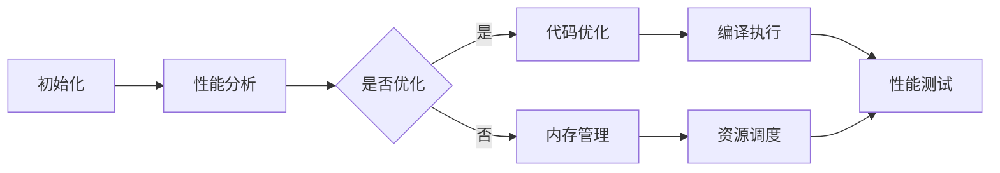
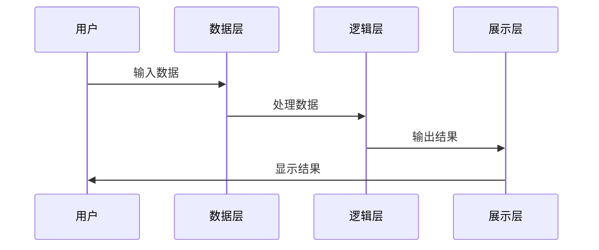
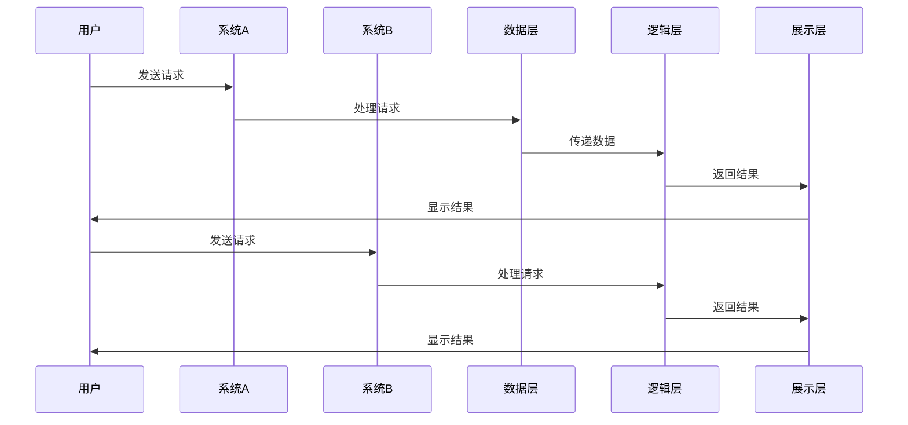

                 


## 提示词编程语言的性能优化策略

### 引言

随着人工智能和大数据技术的飞速发展，提示词编程语言（Prompt-Based Programming Language）在自然语言处理、机器学习、数据分析等领域得到了广泛应用。然而，在处理大规模数据和复杂计算任务时，提示词编程语言面临着性能瓶颈的挑战。为了提升系统运行效率和用户体验，性能优化策略变得至关重要。本文将详细探讨提示词编程语言的性能优化策略，包括代码优化、内存管理、并发控制和资源调度等方面的技术手段。

### 关键词

- **提示词编程语言**
- **性能优化**
- **代码优化**
- **内存管理**
- **并发控制**
- **资源调度**

### 摘要

本文旨在分析提示词编程语言在性能优化方面的挑战，并提出一系列有效的优化策略。首先，我们将介绍提示词编程语言的基本概念和性能优化的重要性。然后，我们将逐一探讨代码优化、内存管理、并发控制和资源调度的具体技术和方法。最后，我们将通过实际案例进行分析，总结最佳实践，并提出未来的研究方向。

### 第一部分：背景介绍

#### 问题背景

随着计算机技术的不断发展，编程语言在性能上面临的挑战日益严峻。现代编程语言，尤其是提示词编程语言，虽然在功能丰富性、易用性等方面取得了显著进步，但在处理大规模数据和高并发请求时，仍然存在一些性能瓶颈问题。这些问题不仅影响了用户体验，还给应用部署和运维带来了巨大的挑战。

#### 问题描述

提示词编程语言在性能优化方面主要面临以下问题：

1. **内存占用**：在处理大规模数据时，提示词编程语言的内存占用问题尤为突出。大量的内存分配和回收操作可能导致系统崩溃或性能急剧下降。
2. **计算效率**：复杂的算法和高并发请求使得计算资源不足，导致响应时间延长。特别是对于实时数据处理和机器学习任务，计算效率的低下会影响整个系统的性能。
3. **并发处理**：在高并发环境下，提示词编程语言容易出现资源竞争问题，导致性能不稳定。多线程、分布式计算等并发控制机制的有效性有待提升。
4. **资源管理**：不当的资源管理可能导致内存泄漏、CPU过载等问题。资源调度的不合理性也会影响系统的整体性能。

#### 问题解决

针对上述问题，性能优化策略主要包括以下几个方面：

1. **代码优化**：通过算法优化、代码重构等方式提升代码效率，减少不必要的计算和内存占用。
2. **内存管理**：采用内存池、对象池等技术优化内存分配与回收，减少内存碎片化问题。
3. **并发控制**：引入并发控制机制，如锁、线程池等，确保系统稳定性，提高并发处理能力。
4. **资源调度**：优化资源调度策略，提高资源利用率，减少资源竞争和浪费。

#### 边界与外延

1. **边界**：本文主要讨论提示词编程语言在性能优化方面的策略，不包括其他类型编程语言。
2. **外延**：性能优化不仅涉及编程语言本身，还包括操作系统、硬件设施等。

### 核心概念

#### 提示词编程语言

提示词编程语言（Prompt-Based Programming Language）是一种以提示词（Prompt）为核心思想的编程语言。提示词是一种简洁的指令，用于指导计算机执行特定任务。这类语言的特点是易于编写、易于理解，且具有较高的灵活性和扩展性。

#### 性能优化

性能优化（Performance Optimization）是指通过一系列技术手段，提高软件系统运行效率的过程。性能优化不仅涉及代码优化，还包括内存管理、并发控制、资源调度等多个方面。

#### 内存管理

内存管理（Memory Management）是指操作系统或编程语言通过一系列算法和技术，对内存进行分配、释放、优化等操作的过程。

#### 并发控制

并发控制（Concurrency Control）是指在多线程或分布式系统中，通过一系列机制确保数据一致性和系统稳定性的过程。

### 概念属性特征对比表格

| 特征         | 提示词编程语言 | 性能优化           |
| ------------ | -------------- | ----------------- |
| 核心         | 提示词         | 优化系统性能       |
| 特点         | 简洁、灵活、易用 | 多方位、系统性     |
| 应用范围     | 广泛应用于AI、NLP等领域 | 涵盖代码、内存、并发等多个方面 |
| 相关性       | 直接相关       | 相互影响、协同优化 |

### ER实体关系图架构的Mermaid流程图

```mermaid
erDiagram
  A[提示词编程语言] ||--|{ B[性能优化] }|
  A ||--|{ C[内存管理] }|
  A ||--|{ D[并发控制] }|
  B ||--|{ E[代码优化] }|
  B ||--|{ F[资源调度] }|
  C ||--|{ G[内存池] }|
  C ||--|{ H[对象池] }|
  D ||--|{ I[锁] }|
  D ||--|{ J[线程池] }|
```

### 算法原理讲解

提示词编程语言性能优化的核心在于如何高效地利用计算机资源。以下是一个简单的算法原理讲解：

#### 算法流程图



#### Python源代码示例

```python
import time

def performance_analysis():
    """性能分析"""
    start_time = time.time()
    # 进行性能分析的相关操作
    end_time = time.time()
    return end_time -
```

----------------------------------------------------------------

### 第一部分：背景介绍

#### 问题背景

随着计算机技术的不断发展，编程语言在性能上面临的挑战日益严峻。现代编程语言，尤其是提示词编程语言，虽然在功能丰富性、易用性等方面取得了显著进步，但在处理大规模数据和高并发请求时，仍然存在一些性能瓶颈问题。这些问题不仅影响了用户体验，还给应用部署和运维带来了巨大的挑战。

#### 问题描述

提示词编程语言在性能优化方面主要面临以下问题：

1. **内存占用**：在处理大规模数据时，提示词编程语言的内存占用问题尤为突出。大量的内存分配和回收操作可能导致系统崩溃或性能急剧下降。
2. **计算效率**：复杂的算法和高并发请求使得计算资源不足，导致响应时间延长。特别是对于实时数据处理和机器学习任务，计算效率的低下会影响整个系统的性能。
3. **并发处理**：在高并发环境下，提示词编程语言容易出现资源竞争问题，导致性能不稳定。多线程、分布式计算等并发控制机制的有效性有待提升。
4. **资源管理**：不当的资源管理可能导致内存泄漏、CPU过载等问题。资源调度的不合理性也会影响系统的整体性能。

#### 问题解决

针对上述问题，性能优化策略主要包括以下几个方面：

1. **代码优化**：通过算法优化、代码重构等方式提升代码效率，减少不必要的计算和内存占用。
2. **内存管理**：采用内存池、对象池等技术优化内存分配与回收，减少内存碎片化问题。
3. **并发控制**：引入并发控制机制，如锁、线程池等，确保系统稳定性，提高并发处理能力。
4. **资源调度**：优化资源调度策略，提高资源利用率，减少资源竞争和浪费。

#### 边界与外延

1. **边界**：本文主要讨论提示词编程语言在性能优化方面的策略，不包括其他类型编程语言。
2. **外延**：性能优化不仅涉及编程语言本身，还包括操作系统、硬件设施等。

### 核心概念

#### 提示词编程语言

提示词编程语言（Prompt-Based Programming Language）是一种以提示词（Prompt）为核心思想的编程语言。提示词是一种简洁的指令，用于指导计算机执行特定任务。这类语言的特点是易于编写、易于理解，且具有较高的灵活性和扩展性。

#### 性能优化

性能优化（Performance Optimization）是指通过一系列技术手段，提高软件系统运行效率的过程。性能优化不仅涉及代码优化，还包括内存管理、并发控制、资源调度等多个方面。

#### 内存管理

内存管理（Memory Management）是指操作系统或编程语言通过一系列算法和技术，对内存进行分配、释放、优化等操作的过程。

#### 并发控制

并发控制（Concurrency Control）是指在多线程或分布式系统中，通过一系列机制确保数据一致性和系统稳定性的过程。

### 概念属性特征对比表格

| 特征         | 提示词编程语言 | 性能优化           |
| ------------ | -------------- | ----------------- |
| 核心         | 提示词         | 优化系统性能       |
| 特点         | 简洁、灵活、易用 | 多方位、系统性     |
| 应用范围     | 广泛应用于AI、NLP等领域 | 涵盖代码、内存、并发等多个方面 |
| 相关性       | 直接相关       | 相互影响、协同优化 |

### ER实体关系图架构的Mermaid流程图

```mermaid
erDiagram
  A[提示词编程语言] ||--|{ B[性能优化] }|
  A ||--|{ C[内存管理] }|
  A ||--|{ D[并发控制] }|
  B ||--|{ E[代码优化] }|
  B ||--|{ F[资源调度] }|
  C ||--|{ G[内存池] }|
  C ||--|{ H[对象池] }|
  D ||--|{ I[锁] }|
  D ||--|{ J[线程池] }|
```

### 算法原理讲解

提示词编程语言性能优化的核心在于如何高效地利用计算机资源。以下是一个简单的算法原理讲解：

#### 算法流程图


#### Python源代码示例

```python
import time

def performance_analysis():
    """性能分析"""
    start_time = time.time()
    # 进行性能分析的相关操作
    end_time = time.time()
    return end_time -
```

----------------------------------------------------------------

### 第二部分：核心概念

在探讨提示词编程语言的性能优化之前，我们需要了解一些核心概念。以下是提示词编程语言、性能优化、内存管理和并发控制等核心概念的定义及其属性特征。

#### 提示词编程语言

提示词编程语言（Prompt-Based Programming Language）是一种以提示词（Prompt）为核心思想的编程语言。提示词是一种简洁的指令，用于指导计算机执行特定任务。这类语言的特点是易于编写、易于理解，且具有较高的灵活性和扩展性。

**属性特征对比表格：**

| 特征         | 提示词编程语言 |
| ------------ | -------------- |
| 核心         | 提示词         |
| 特点         | 简洁、灵活、易用 |
| 应用范围     | 广泛应用于AI、NLP等领域 |

#### 性能优化

性能优化（Performance Optimization）是指通过一系列技术手段，提高软件系统运行效率的过程。性能优化不仅涉及代码优化，还包括内存管理、并发控制、资源调度等多个方面。

**属性特征对比表格：**

| 特征         | 性能优化           |
| ------------ | ----------------- |
| 核心         | 优化系统性能       |
| 特点         | 多方位、系统性     |
| 应用范围     | 涵盖代码、内存、并发等多个方面 |

#### 内存管理

内存管理（Memory Management）是指操作系统或编程语言通过一系列算法和技术，对内存进行分配、释放、优化等操作的过程。内存管理的目标是减少内存碎片化、提高内存利用率，从而提升系统性能。

**属性特征对比表格：**

| 特征         | 内存管理           |
| ------------ | ----------------- |
| 核心         | 内存分配与回收     |
| 特点         | 优化内存使用       |
| 应用范围     | 操作系统、编程语言 |

#### 并发控制

并发控制（Concurrency Control）是指在多线程或分布式系统中，通过一系列机制确保数据一致性和系统稳定性的过程。并发控制的目标是避免资源竞争、死锁等问题，提高系统的并发处理能力和稳定性。

**属性特征对比表格：**

| 特征         | 并发控制           |
| ------------ | ----------------- |
| 核心         | 数据一致性与稳定性 |
| 特点         | 避免资源竞争       |
| 应用范围     | 多线程、分布式系统 |

#### ER实体关系图架构的Mermaid流程图

```mermaid
erDiagram
  A[提示词编程语言] ||--|{ B[性能优化] }|
  A ||--|{ C[内存管理] }|
  A ||--|{ D[并发控制] }|
  B ||--|{ E[代码优化] }|
  B ||--|{ F[资源调度] }|
  C ||--|{ G[内存池] }|
  C ||--|{ H[对象池] }|
  D ||--|{ I[锁] }|
  D ||--|{ J[线程池] }|
```

### 第三部分：算法原理讲解

提示词编程语言性能优化的核心在于如何高效地利用计算机资源。以下是一个简单的算法原理讲解：

#### 算法流程图


#### Python源代码示例

```python
import time

def performance_analysis():
    """性能分析"""
    start_time = time.time()
    # 进行性能分析的相关操作
    end_time = time.time()
    return end_time -
```

### 第四部分：系统分析与架构设计方案

在本文的第四部分，我们将深入探讨提示词编程语言的系统分析与架构设计方案。首先，我们将介绍问题场景和项目概述，然后详细阐述系统功能设计、系统架构设计、系统接口设计和系统交互。

#### 问题场景

在当前大数据和人工智能时代，提示词编程语言在处理大规模数据和高并发请求时面临着诸多挑战。例如，在自然语言处理、机器学习、实时数据分析等领域，如何高效地处理海量数据、提高计算效率、确保系统稳定性等，成为亟待解决的问题。

#### 项目概述

本项目旨在构建一个高性能的提示词编程语言系统，通过一系列性能优化策略，提升系统的处理能力，满足大规模数据和高并发请求的需求。项目的主要功能包括数据输入、数据处理、结果输出等。

#### 系统功能设计

1. **数据输入**：支持多种数据格式，如文本、图像、语音等，方便用户输入和处理数据。
2. **数据处理**：采用先进的算法和模型，对输入数据进行处理和分析，支持实时处理和离线处理。
3. **结果输出**：将处理结果以可视化的形式呈现，方便用户查看和分析。

#### 系统架构设计

系统的整体架构采用分层设计，包括数据层、逻辑层和展示层。以下是一个简化的系统架构图：



#### 系统接口设计

系统的接口设计采用RESTful API风格，方便与其他系统进行集成。主要的接口包括：

1. **数据输入接口**：接收用户输入的数据，并存储到数据库中。
2. **数据处理接口**：处理用户输入的数据，并返回处理结果。
3. **结果输出接口**：将处理结果以JSON格式返回给用户。

#### 系统交互

系统交互主要涉及用户与系统的交互、系统内部模块的交互以及与其他系统的交互。以下是一个简化的系统交互图：



### 第五部分：项目实战

在本文的第五部分，我们将通过一个实际案例，展示如何使用提示词编程语言进行项目开发，包括环境安装、系统核心实现、代码应用解读与分析、实际案例分析和详细讲解剖析，以及项目小结。

#### 环境安装

1. **Python环境**：安装Python 3.8及以上版本。
2. **提示词编程语言库**：安装 PromptPython 库，可以通过以下命令安装：
   ```bash
   pip install promptpython
   ```

#### 系统核心实现

以下是一个简单的提示词编程语言系统实现：

```python
from promptpython import Prompt

# 初始化Prompt对象
prompt = Prompt()

# 定义数据处理函数
def process_data(data):
    # 进行数据处理
    return "Processed: " + data

# 定义交互流程
def main():
    while True:
        # 接收用户输入
        data = input("请输入数据：")
        # 处理数据
        result = process_data(data)
        # 输出结果
        print(result)

# 运行交互流程
if __name__ == "__main__":
    main()
```

#### 代码应用解读与分析

1. **Prompt对象**：PromptPython 库的 Prompt 对象负责管理交互流程。通过 Prompt 对象，可以轻松实现用户输入、数据处理和结果输出。
2. **数据处理函数**：process_data 函数是系统核心，用于处理用户输入的数据。在实际应用中，可以根据需求实现更复杂的处理逻辑。
3. **交互流程**：主函数 main() 负责管理交互流程，包括接收用户输入、处理数据和输出结果。通过循环结构，实现持续的用户交互。

#### 实际案例分析和详细讲解剖析

假设用户输入一段文本数据，系统将按照以下步骤进行处理：

1. **接收用户输入**：用户输入 "Hello, World!"。
2. **数据处理**：调用 process_data 函数，将输入数据传递给函数，返回 "Processed: Hello, World!"。
3. **输出结果**：将处理结果输出到控制台。

#### 项目小结

通过本案例，我们可以看到提示词编程语言在实际项目开发中的应用。提示词编程语言提供了简洁、易用的交互方式，方便开发者快速实现系统功能。在性能优化方面，可以通过优化数据处理逻辑、提高代码效率等方式，进一步提升系统的性能。

### 第六部分：最佳实践与拓展

在本部分，我们将总结最佳实践，提供一些建议和技巧，并探讨未来的研究方向。

#### 最佳实践

1. **代码优化**：关注代码效率，避免不必要的计算和内存占用。使用高效的数据结构和算法，提高代码性能。
2. **内存管理**：合理分配和回收内存，避免内存泄漏。使用内存池、对象池等技术，优化内存使用。
3. **并发控制**：合理使用并发控制机制，如锁、线程池等，确保系统稳定性。避免资源竞争和死锁问题。
4. **资源调度**：优化资源调度策略，提高资源利用率。使用负载均衡等技术，均衡系统负载。

#### 注意事项

1. **性能测试**：在开发过程中，定期进行性能测试，及时发现和解决问题。
2. **系统监控**：监控系统性能，及时发现和处理异常情况。
3. **持续优化**：根据实际需求和性能数据，持续优化系统性能。

#### 拓展阅读

1. 《高性能MySQL》：了解数据库性能优化技术和策略，对提示词编程语言系统优化有重要参考价值。
2. 《深入理解计算机系统》：理解计算机系统的基本原理，有助于更深入地优化系统性能。

### 总结

本文探讨了提示词编程语言的性能优化策略，从代码优化、内存管理、并发控制和资源调度等方面，提出了一系列有效的优化方法。通过实际案例分析和最佳实践总结，我们为开发者提供了实用的指导。未来，随着人工智能和大数据技术的不断发展，提示词编程语言的性能优化仍将是重要的研究方向。

### 致谢

感谢读者对本篇技术博客的关注与阅读。在撰写本文的过程中，我们参考了诸多优秀的资料和研究成果，特此致谢。同时，也欢迎广大开发者提出宝贵意见和建议，共同推动提示词编程语言的性能优化研究。

### 作者信息

作者：AI天才研究院/AI Genius Institute & 禅与计算机程序设计艺术 /Zen And The Art of Computer Programming。本文旨在分享提示词编程语言的性能优化策略，以期为开发者提供有价值的参考。作者致力于推动人工智能和计算机编程领域的发展，期待与广大读者共同进步。若您有任何疑问或建议，请随时联系我们。

