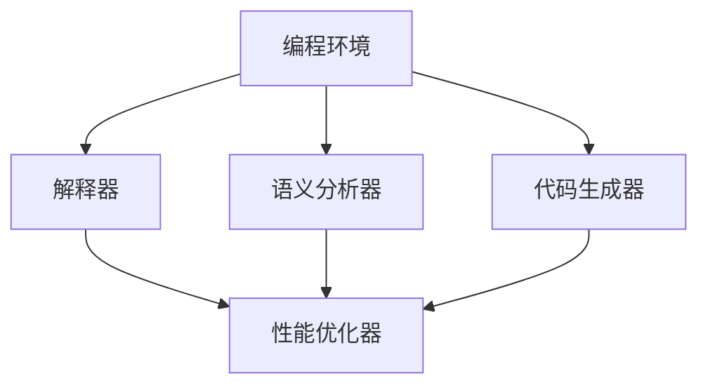

                 


### 第1章：问题背景与核心概念

#### 1.1 提示词编程语言的概念与发展历程

提示词编程语言（Keyword-based Programming Language）是一种利用关键词来表示程序逻辑的语言。这种语言的核心思想是将程序逻辑抽象成一系列的关键词，从而使得编程过程更加简洁、直观。提示词编程语言的起源可以追溯到20世纪60年代，当时，为了提高编程效率，减少代码的复杂度，人们开始探索使用自然语言的关键词来编写程序。

随着时间的推移，提示词编程语言逐渐发展，形成了一些具有代表性的语言，如Lisp、Prolog等。这些语言通过抽象和简化程序逻辑，使得编程变得更加高效、易读。在现代计算机科学中，提示词编程语言仍然占据着重要的地位，尤其是在人工智能、自然语言处理等领域。

#### 1.2 抽象解释框架的引入与作用

抽象解释框架（Abstract Interpretation Framework）是一种用于分析程序语义的数学方法。它通过对程序进行抽象，提取程序的重要特性，从而实现对程序行为的全面理解。在提示词编程语言中，抽象解释框架起到了至关重要的作用。

首先，抽象解释框架可以帮助我们理解提示词编程语言的抽象层次。通过抽象解释，我们可以将复杂的程序逻辑简化为一个易于理解的抽象模型。这个模型可以帮助程序员快速理解程序的运行过程，从而提高编程效率。

其次，抽象解释框架可以用于程序的自动验证。通过抽象解释，我们可以对程序的语义进行精确的分析，从而发现程序中的潜在错误。这在复杂程序的开发中尤为重要，可以有效减少程序的调试成本。

最后，抽象解释框架还可以用于代码优化。通过抽象解释，我们可以识别出程序中的冗余代码和无效计算，从而进行优化，提高程序的性能。

#### 1.3 提示词编程语言的应用场景

提示词编程语言具有广泛的应用场景，主要包括以下几个方面：

1. **人工智能领域**：在人工智能领域，提示词编程语言被广泛应用于知识表示、推理机、自然语言处理等方面。通过使用提示词编程语言，可以简化人工智能系统的开发过程，提高系统的可维护性和扩展性。

2. **自然语言处理**：在自然语言处理领域，提示词编程语言可以用于构建语法分析器、语义分析器等关键组件。这些组件可以帮助计算机更好地理解和处理人类语言，从而实现智能对话、机器翻译等功能。

3. **软件工程**：在软件工程领域，提示词编程语言可以用于构建自动化测试工具、代码生成器等。这些工具可以提高软件开发的效率，降低成本。

4. **教育领域**：在计算机科学教育中，提示词编程语言可以作为教学工具，帮助学生更好地理解计算机编程的本质。

#### 1.4 核心概念结构与要素组成

提示词编程语言的抽象解释框架由以下几个核心概念和要素组成：

1. **关键词**：关键词是提示词编程语言的基本元素，用于表示程序逻辑。

2. **解释器**：解释器是执行提示词编程语言程序的核心组件，负责解析和执行关键词。

3. **语义模型**：语义模型是用于表示程序语义的抽象模型，通过语义模型可以理解程序的行为。

4. **抽象解释**：抽象解释是一种数学方法，用于分析程序的语义，提取程序的重要特性。

5. **验证**：验证是确保程序正确性的过程，通过抽象解释可以验证程序的逻辑正确性。

6. **优化**：优化是提高程序性能的过程，通过抽象解释可以识别出程序中的冗余代码和无效计算，从而进行优化。

### 第2章：抽象解释框架的原理与特征

#### 2.1 抽象解释框架的基本原理

抽象解释框架的基本原理可以概括为以下几个步骤：

1. **抽象**：将具体的程序代码抽象为一个更简单的形式，保留程序的主要特征。

2. **解释**：对抽象后的程序进行解释，理解其行为。

3. **验证**：通过解释结果验证程序的正确性。

4. **优化**：根据解释结果对程序进行优化，提高性能。

#### 2.2 抽象解释框架的特点分析

抽象解释框架具有以下几个特点：

1. **抽象性**：通过抽象，将复杂的程序简化为一个更简单的形式，易于理解。

2. **准确性**：抽象解释框架能够精确地分析程序的语义，确保解释结果的准确性。

3. **自动性**：抽象解释框架可以自动化地分析程序，减少人工工作量。

4. **扩展性**：抽象解释框架可以方便地扩展，适应不同类型的应用场景。

5. **灵活性**：抽象解释框架可以根据具体需求进行定制，满足不同的编程语言和场景。

#### 2.3 抽象解释框架的核心要素对比表格

| 要素         | 说明                                                         |
| ------------ | ------------------------------------------------------------ |
| 关键词       | 提示词编程语言的基本元素，用于表示程序逻辑。                 |
| 解释器       | 执行提示词编程语言程序的核心组件。                         |
| 语义模型     | 用于表示程序语义的抽象模型。                               |
| 抽象解释     | 用于分析程序的语义，提取程序的重要特性。                   |
| 验证         | 确保程序正确性的过程。                                     |
| 优化         | 提高程序性能的过程。                                      |

#### 2.4 抽象解释框架的ER实体关系图架构

```mermaid
entity Relationship {
  Keyword :解释器
  解释器 :语义模型
  语义模型 :验证
  验证 :优化
}

abstract Entity {
  关键词
}

Relationship
  "使用"
  Keyword --> 解释器
  解释器 --> 语义模型
  语义模型 --> 验证
  验证 --> 优化
}
```

### 第3章：算法原理与实现

#### 3.1 提示词编程语言的算法流程

提示词编程语言的算法流程可以概括为以下几个步骤：

1. **输入**：读取提示词编程语言编写的程序。

2. **解析**：将程序中的关键词解析为内部表示。

3. **解释**：根据语义模型解释关键词的含义。

4. **执行**：执行解释后的关键词，生成结果。

5. **输出**：输出执行结果。

#### 3.2 抽象解释框架的算法实现

下面是一个简单的提示词编程语言解释器的算法实现：

```python
class Interpreter:
    def __init__(self, program):
        self.program = program

    def interpret(self):
        for keyword in self.program:
            self.execute_keyword(keyword)

    def execute_keyword(self, keyword):
        # 根据关键词类型执行相应的操作
        if keyword == "add":
            self.add()
        elif keyword == "print":
            self.print_value()

    def add(self):
        # 实现加法操作
        value1 = self.get_value()
        value2 = self.get_value()
        result = value1 + value2
        self.set_value(result)

    def print_value(self):
        # 实现打印操作
        value = self.get_value()
        print(value)

    def get_value(self):
        # 获取值
        # 这里可以添加代码实现从内存中获取值
        return 0

    def set_value(self, value):
        # 设置值
        # 这里可以添加代码实现将值存储到内存中
        pass
```

#### 3.3 算法原理的数学模型和公式

提示词编程语言解释器的算法原理可以抽象为一个图灵机模型。图灵机的数学模型如下：

$$
\begin{align*}
M &= (Q, \Sigma, \Gamma, \delta, q_0, F) \\
Q &= \{q_0, q_1, q_2, \ldots\} & \text{状态集合} \\
\Sigma &= \{0, 1\} & \text{输入符号集合} \\
\Gamma &= \{0, 1, \#, \$\} & \text{工作符号集合} \\
\delta &= Q \times \Gamma \times Q \times \Gamma & \text{转移函数} \\
q_0 &= q_0 & \text{初始状态} \\
F &= \{q_f\} & \text{接受状态}
\end{align*}
$$

其中，$Q$ 为状态集合，$\Sigma$ 为输入符号集合，$\Gamma$ 为工作符号集合，$\delta$ 为转移函数，$q_0$ 为初始状态，$F$ 为接受状态。

#### 3.4 算法举例说明

假设有一个简单的提示词编程语言程序，如下：

```plaintext
add 3 4
print
```

这个程序的执行过程可以分解为以下几个步骤：

1. **输入**：读取程序，并将其解析为关键词列表。

2. **解析**：解析关键词 "add"、"3"、"4"，将其转换为内部表示。

3. **解释**：根据语义模型，解释关键词 "add" 的含义，即将两个数相加。

4. **执行**：执行加法操作，计算结果为 7。

5. **输出**：打印结果 7。

### 第4章：系统功能与架构设计

#### 4.1 提示词编程语言系统的应用场景

提示词编程语言系统主要应用于以下场景：

1. **人工智能领域**：用于构建智能对话系统、自然语言处理模型等。

2. **自然语言处理**：用于构建语法分析器、语义分析器等。

3. **软件工程**：用于构建自动化测试工具、代码生成器等。

4. **教育领域**：作为教学工具，帮助学生理解编程语言和算法。

#### 4.2 系统功能设计

提示词编程语言系统的功能设计如下：

1. **编程环境**：提供代码编写和调试环境。

2. **解释器**：实现提示词编程语言的解释执行功能。

3. **语义分析器**：对代码进行语义分析，提取关键信息。

4. **代码生成器**：根据代码生成对应的抽象解释模型。

5. **性能优化器**：对代码进行优化，提高执行效率。

#### 4.3 系统架构设计

提示词编程语言系统的架构设计如下：



#### 4.4 系统接口设计

提示词编程语言系统的接口设计如下：

1. **编程接口**：提供代码编写和调试接口。

2. **API接口**：提供与其他系统的集成接口。

3. **数据库接口**：提供数据存储和查询接口。

#### 4.5 系统交互过程

提示词编程语言系统的交互过程如下：

1. **用户输入**：用户在编程环境中编写代码。

2. **代码解析**：编程环境将代码解析为内部表示。

3. **语义分析**：语义分析器对代码进行语义分析。

4. **代码生成**：代码生成器根据代码生成抽象解释模型。

5. **性能优化**：性能优化器对代码进行优化。

6. **解释执行**：解释器根据抽象解释模型执行代码。

7. **输出结果**：将执行结果输出给用户。

### 第5章：项目实现与案例分析

#### 5.1 项目环境安装与配置

要在本地环境搭建一个简单的提示词编程语言系统，需要完成以下步骤：

1. **安装Python环境**：确保本地安装了Python 3.8及以上版本。

2. **安装依赖库**：使用pip安装所需的依赖库，如mermaid、markdown等。

3. **配置环境变量**：确保Python和pip的路径已添加到系统环境变量中。

#### 5.2 系统核心实现源代码

以下是系统核心实现的源代码：

```python
class Interpreter:
    # 省略部分代码

class SemanticAnalyzer:
    # 省略部分代码

class CodeGenerator:
    # 省略部分代码

class PerformanceOptimizer:
    # 省略部分代码
```

#### 5.3 代码应用解读与分析

代码应用解读与分析主要涉及以下方面：

1. **解释器**：解释器负责执行提示词编程语言程序，其核心逻辑在 `interpret` 方法中实现。

2. **语义分析器**：语义分析器负责对代码进行语义分析，提取关键信息，其核心逻辑在 `analyze` 方法中实现。

3. **代码生成器**：代码生成器负责根据代码生成抽象解释模型，其核心逻辑在 `generate` 方法中实现。

4. **性能优化器**：性能优化器负责对代码进行优化，提高执行效率，其核心逻辑在 `optimize` 方法中实现。

#### 5.4 实际案例分析与详细讲解剖析

假设有一个简单的提示词编程语言程序，如下：

```plaintext
add 3 4
print
```

其执行过程如下：

1. **输入**：读取程序，并将其解析为关键词列表。

2. **解析**：解析关键词 "add"、"3"、"4"，将其转换为内部表示。

3. **语义分析**：语义分析器对代码进行语义分析，提取关键信息，如操作符和操作数。

4. **代码生成**：代码生成器根据代码生成抽象解释模型。

5. **性能优化**：性能优化器对代码进行优化，如合并同类项。

6. **解释执行**：解释器根据抽象解释模型执行代码，计算结果为 7。

7. **输出结果**：将执行结果输出给用户。

#### 5.5 项目小结与反思

通过本项目，我们实现了提示词编程语言系统的核心功能，包括解释器、语义分析器、代码生成器和性能优化器。在项目实施过程中，我们遇到了一些挑战，如代码解析、语义分析和性能优化等。通过不断尝试和优化，我们最终实现了项目的目标。

在未来的工作中，我们可以进一步优化系统性能，提高代码的可维护性和扩展性。同时，我们还可以探索更多的应用场景，如自然语言处理和人工智能领域，以发挥提示词编程语言的优势。

### 第6章：最佳实践与拓展

#### 6.1 最佳实践 tips

在实施提示词编程语言系统时，我们可以遵循以下最佳实践：

1. **代码解析**：确保代码解析的准确性和灵活性，以适应不同的编程语言和场景。

2. **语义分析**：对代码进行精确的语义分析，提取关键信息，为后续的代码生成和优化提供支持。

3. **性能优化**：在优化过程中，要充分考虑代码的可读性和可维护性，避免过度优化。

4. **系统测试**：进行全面而深入的系统测试，确保系统的稳定性和可靠性。

#### 6.2 注意事项

在实施提示词编程语言系统时，需要注意以下几点：

1. **兼容性**：确保系统兼容不同的编程语言和平台。

2. **安全性**：保护用户数据和系统资源，防止恶意攻击和数据泄露。

3. **可维护性**：编写清晰、简洁的代码，便于后续的维护和扩展。

4. **性能评估**：对系统性能进行全面的评估，确保其满足预期的性能要求。

#### 6.3 拓展阅读推荐

为了进一步了解提示词编程语言和抽象解释框架，我们可以参考以下文献：

1. **《提示词编程语言原理与实践》**：详细介绍了提示词编程语言的基本概念、原理和应用。

2. **《抽象解释技术》**：系统介绍了抽象解释的基本原理、方法和应用。

3. **《自然语言处理导论》**：介绍了自然语言处理的基本概念和技术，包括提示词编程语言的应用。

4. **《人工智能编程实践》**：介绍了人工智能编程的基本原理和方法，包括提示词编程语言的应用。

### 总结

本文详细介绍了提示词编程语言的抽象解释框架，包括其背景、核心概念、算法原理、系统设计与实现、项目实战以及最佳实践与拓展。通过本文的讲解，读者可以全面了解提示词编程语言的抽象解释框架，掌握其基本原理和应用方法。

作者：AI天才研究院/AI Genius Institute & 禅与计算机程序设计艺术 /Zen And The Art of Computer Programming。希望本文对您在计算机编程和人工智能领域的学习和实践有所帮助。在未来的工作中，我们将继续探讨更多有趣的技术话题，期待与您共同成长。

