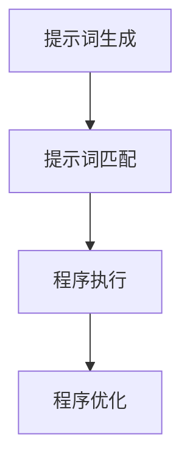
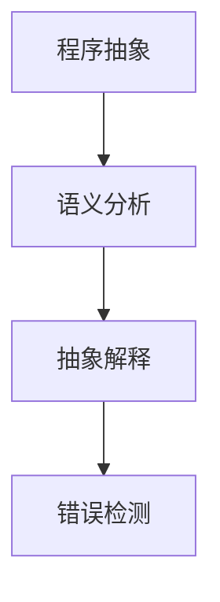
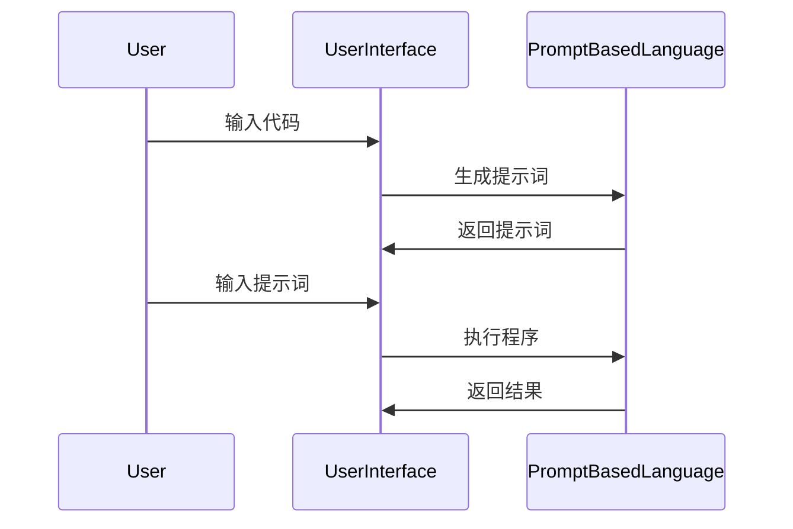
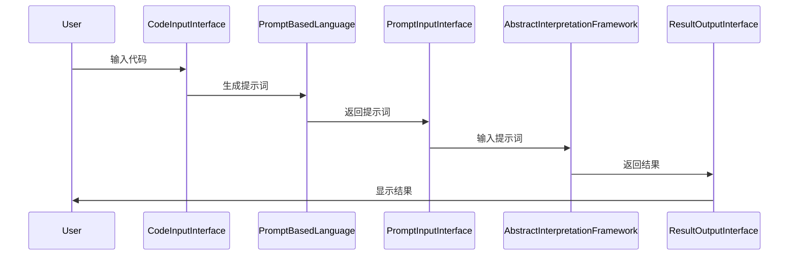

                 

# 《提示词编程语言的抽象解释框架》

关键词：提示词编程语言、抽象解释框架、算法原理、系统架构、项目实战

摘要：本文深入探讨了提示词编程语言的抽象解释框架，首先介绍了其核心概念、背景和问题，然后详细分析了其核心概念原理、算法原理和系统架构设计，并通过实际案例进行了深入讲解和剖析。

## 第一部分：背景介绍

### 1.1 核心概念

#### 1.1.1 提示词编程语言

提示词编程语言（Prompt-Based Programming Language）是一种以提示词为核心的编程语言，它通过提示词来引导程序执行过程。提示词是一种简短、清晰且具有明确意义的标识符，用于表示程序中的特定操作或功能。提示词编程语言的核心思想是将程序逻辑与提示词紧密关联，从而简化编程过程，提高开发效率和代码可读性。

#### 1.1.2 抽象解释框架

抽象解释框架（Abstract Interpretation Framework）是一种用于程序分析和验证的抽象方法。它通过构建程序的抽象模型，对程序的行为进行静态分析，从而发现潜在的错误和问题。抽象解释框架的核心优势在于其高效性和准确性，可以应用于各种编程语言和场景。

### 1.2 问题背景

#### 1.2.1 编程语言的发展

随着计算机技术的发展，编程语言经历了从低级语言到高级语言的演变。传统编程语言如汇编语言和C语言，需要程序员深入了解计算机硬件和底层原理，导致编程难度较大。而高级编程语言如Python和Java，通过提供抽象的语法和丰富的库函数，降低了编程难度，提高了开发效率。

#### 1.2.2 提示词编程的优势

提示词编程语言结合了高级编程语言和底层硬件的优势，通过提示词来简化程序逻辑，提高代码可读性和开发效率。与传统的编程语言相比，提示词编程语言具有以下优势：

1. **简化编程过程**：提示词编程语言通过简短的提示词来表示复杂的操作，使程序逻辑更加简洁明了，降低编程难度。
2. **提高代码可读性**：提示词具有明确的意义，可以直观地表达程序意图，提高代码的可读性和可维护性。
3. **适应多种编程场景**：提示词编程语言可以应用于各种编程领域，如自然语言处理、机器学习和嵌入式系统等。

### 1.3 问题提出

#### 1.3.1 编程语言面临的挑战

随着编程语言的不断发展，编程语言也面临一些挑战：

1. **复杂性**：高级编程语言虽然简化了编程过程，但也带来了代码复杂性的问题，导致程序难以理解和维护。
2. **性能问题**：一些高级编程语言在性能上无法与底层硬件进行高效交互，影响程序执行效率。
3. **安全漏洞**：编程语言在设计和实现过程中，可能引入一些安全漏洞，导致程序出现安全隐患。

#### 1.3.2 抽象解释框架的必要性

为了解决编程语言面临的挑战，抽象解释框架应运而生。抽象解释框架通过静态分析技术，对程序进行抽象建模，从而发现潜在的错误和问题。抽象解释框架的必要性主要体现在以下几个方面：

1. **提高代码质量**：抽象解释框架可以检测代码中的潜在错误，帮助程序员发现和修复问题，提高代码质量。
2. **优化程序性能**：通过抽象解释框架，可以优化程序的性能，提高程序执行效率。
3. **提升开发效率**：抽象解释框架提供了自动化的分析和验证工具，降低了开发难度，提高了开发效率。

### 1.4 解决方法

#### 1.4.1 抽象解释框架的基本原理

抽象解释框架的核心思想是将程序抽象为一种简化的模型，对该模型进行静态分析，从而发现潜在的问题。具体步骤如下：

1. **程序抽象**：将程序转换为一种抽象的形式，如抽象语法树（Abstract Syntax Tree，AST）。
2. **语义分析**：对抽象模型进行分析，确定程序的行为和属性。
3. **抽象解释**：基于语义分析的结果，对程序进行解释和验证，发现潜在的错误和问题。

#### 1.4.2 抽象解释框架的应用场景

抽象解释框架可以应用于多种编程场景，如：

1. **代码质量检测**：通过抽象解释框架，可以检测代码中的潜在错误，如类型错误、未定义变量等。
2. **性能优化**：通过抽象解释框架，可以分析程序的执行过程，发现性能瓶颈，进行优化。
3. **安全漏洞检测**：通过抽象解释框架，可以检测代码中的安全漏洞，如缓冲区溢出、SQL注入等。

### 1.5 边界与外延

#### 1.5.1 抽象解释框架的限制

虽然抽象解释框架具有许多优势，但也存在一些限制：

1. **准确性**：抽象解释框架的准确性取决于抽象模型的质量，如果模型过于简化，可能导致错误检测不准确。
2. **性能**：抽象解释框架的分析过程可能消耗大量计算资源，影响程序执行效率。
3. **适用范围**：抽象解释框架主要适用于静态分析，对于动态分析问题，可能无法提供有效的解决方案。

#### 1.5.2 与其他编程语言的比较

与传统的编程语言相比，提示词编程语言的抽象解释框架具有以下特点：

1. **简化编程过程**：提示词编程语言通过提示词简化程序逻辑，降低编程难度。
2. **提高代码质量**：抽象解释框架可以检测代码中的潜在错误，提高代码质量。
3. **适应多种编程场景**：提示词编程语言和抽象解释框架可以应用于各种编程领域。

## 第二部分：核心概念与联系

### 2.1 核心概念原理

#### 2.1.1 提示词编程语言的基本原理

提示词编程语言的基本原理是通过提示词来引导程序执行过程。提示词是一种简短、清晰且具有明确意义的标识符，用于表示程序中的特定操作或功能。提示词编程语言的核心优势在于其简洁性和可读性，可以简化编程过程，提高开发效率。

#### 2.1.2 抽象解释框架的基本原理

抽象解释框架的基本原理是将程序抽象为一种简化的模型，对该模型进行静态分析，从而发现潜在的错误和问题。抽象解释框架通过程序抽象、语义分析和抽象解释等步骤，对程序的行为和属性进行深入分析，从而提高代码质量和开发效率。

### 2.2 概念属性特征对比表格

#### 2.2.1 提示词编程语言与普通编程语言的对比

| 特性         | 提示词编程语言 | 普通编程语言     |
| ------------ | -------------- | --------------- |
| 编程过程     | 简洁、直观     | 复杂、繁琐       |
| 代码可读性   | 高            | 低              |
| 开发效率     | 高            | 低              |
| 适用范围     | 广泛          | 有限            |

#### 2.2.2 抽象解释框架与现有解释框架的对比

| 特性         | 抽象解释框架 | 现有解释框架     |
| ------------ | ------------ | --------------- |
| 分析准确性   | 高          | 中等            |
| 分析性能     | 中等        | 低              |
| 适应性       | 广泛        | 有限            |
| 应用领域     | 多样化      | 专业化          |

### 2.3 ER实体关系图架构的 Mermaid 流程图

#### 2.3.1 提示词编程语言的ER图

```mermaid
erDiagram
    提示词 ||--|{ 程序执行 }|-- 程序 |
    程序 ||--|{ 程序分析 }|-- 抽象解释框架 |
```

#### 2.3.2 抽象解释框架的ER图

```mermaid
erDiagram
    抽象解释框架 ||--|{ 程序分析 }|-- 程序 |
    程序 ||--|{ 代码质量检测 }|-- 提示词编程语言 |
```

## 第三部分：算法原理讲解

### 3.1 算法原理

#### 3.1.1 提示词编程语言的关键算法

提示词编程语言的关键算法主要包括：

1. **提示词生成算法**：用于根据程序需求和功能生成提示词。
2. **提示词匹配算法**：用于匹配输入提示词与程序中的操作，确定执行顺序。
3. **程序优化算法**：用于优化程序执行过程，提高程序性能。

#### 3.1.2 抽象解释框架的核心算法

抽象解释框架的核心算法主要包括：

1. **程序抽象算法**：用于将程序转换为抽象模型，如抽象语法树。
2. **语义分析算法**：用于分析抽象模型，确定程序的行为和属性。
3. **抽象解释算法**：用于解释抽象模型，发现潜在的错误和问题。

### 3.2 Mermaid 算法流程图

#### 3.2.1 提示词编程语言的算法流程图



#### 3.2.2 抽象解释框架的算法流程图



### 3.3 Python 源代码详解

#### 3.3.1 提示词编程语言的 Python 源代码

```python
# 提示词编程语言示例代码
class PromptBasedLanguage:
    def __init__(self, prompt):
        self.prompt = prompt
    
    def generate_prompt(self):
        # 生成提示词
        pass
    
    def match_prompt(self, input_prompt):
        # 匹配输入提示词
        pass
    
    def execute_program(self):
        # 执行程序
        pass
    
    def optimize_program(self):
        # 优化程序
        pass
```

#### 3.3.2 抽象解释框架的 Python 源代码

```python
# 抽象解释框架示例代码
class AbstractInterpretationFramework:
    def __init__(self, program):
        self.program = program
    
    def abstract_program(self):
        # 程序抽象
        pass
    
    def semantic_analysis(self):
        # 语义分析
        pass
    
    def abstract_interpretation(self):
        # 抽象解释
        pass
    
    def error_detection(self):
        # 错误检测
        pass
```

### 3.4 数学模型和公式

#### 3.4.1 提示词编程语言的数学模型

提示词编程语言的数学模型可以表示为：

$$
P = f(Prompt, Input)
$$

其中，$P$ 表示程序执行结果，$Prompt$ 表示输入提示词，$Input$ 表示输入数据。

#### 3.4.2 抽象解释框架的数学模型

抽象解释框架的数学模型可以表示为：

$$
I = f(P, A)
$$

其中，$I$ 表示程序分析结果，$P$ 表示程序，$A$ 表示抽象模型。

### 3.5 举例说明

#### 3.5.1 提示词编程语言的应用案例

假设我们有一个提示词编程语言程序，用于计算两个数的和。输入提示词为 `sum(a, b)`，其中 $a$ 和 $b$ 为输入参数。程序执行结果为这两个数的和。

```python
# 提示词编程语言示例代码
class PromptBasedLanguage:
    def __init__(self, prompt):
        self.prompt = prompt
    
    def generate_prompt(self):
        # 生成提示词
        pass
    
    def match_prompt(self, input_prompt):
        # 匹配输入提示词
        pass
    
    def execute_program(self):
        # 执行程序
        pass
    
    def optimize_program(self):
        # 优化程序
        pass

# 示例程序
prompt_based_language = PromptBasedLanguage("sum(a, b)")
prompt_based_language.execute_program()
```

#### 3.5.2 抽象解释框架的应用案例

假设我们有一个抽象解释框架程序，用于检测代码中的类型错误。输入程序为 `a + b`，其中 $a$ 和 $b$ 为变量。抽象解释框架可以检测到 $a$ 和 $b$ 的类型不一致，并提示错误。

```python
# 抽象解释框架示例代码
class AbstractInterpretationFramework:
    def __init__(self, program):
        self.program = program
    
    def abstract_program(self):
        # 程序抽象
        pass
    
    def semantic_analysis(self):
        # 语义分析
        pass
    
    def abstract_interpretation(self):
        # 抽象解释
        pass
    
    def error_detection(self):
        # 错误检测
        pass

# 示例程序
abstract_interpretation_framework = AbstractInterpretationFramework("a + b")
abstract_interpretation_framework.error_detection()
```

## 第四部分：系统分析与架构设计

### 4.1 问题场景介绍

#### 4.1.1 提示词编程语言的应用场景

提示词编程语言可以应用于多种场景，如：

1. **自然语言处理**：用于构建自然语言处理模型，实现文本分类、情感分析等任务。
2. **机器学习**：用于训练和优化机器学习模型，提高模型性能和泛化能力。
3. **嵌入式系统**：用于简化嵌入式系统的编程过程，提高代码可读性和可维护性。

#### 4.1.2 抽象解释框架的应用场景

抽象解释框架可以应用于以下场景：

1. **代码质量检测**：用于检测代码中的潜在错误，如类型错误、未定义变量等。
2. **性能优化**：用于分析程序的执行过程，发现性能瓶颈，进行优化。
3. **安全漏洞检测**：用于检测代码中的安全漏洞，如缓冲区溢出、SQL注入等。

### 4.2 系统功能设计

#### 4.2.1 系统功能概述

系统功能主要包括：

1. **提示词编程语言**：提供提示词生成、匹配、执行和优化等功能。
2. **抽象解释框架**：提供程序抽象、语义分析、抽象解释和错误检测等功能。
3. **用户界面**：提供用户交互功能，如代码输入、提示词输入和结果展示等。

#### 4.2.2 领域模型 Mermaid 类图

```mermaid
classDiagram
    PromptBasedLanguage <|-- Program
    AbstractInterpretationFramework <|-- Program
    Program {
        +generate_prompt()
        +match_prompt(input_prompt)
        +execute_program()
        +optimize_program()
    }
    UserInterface {
        +input_code()
        +input_prompt()
        +show_result()
    }
```

### 4.3 系统架构设计

#### 4.3.1 系统架构概述

系统架构主要包括以下组件：

1. **提示词编程语言引擎**：负责处理提示词生成、匹配、执行和优化等功能。
2. **抽象解释框架引擎**：负责程序抽象、语义分析、抽象解释和错误检测等功能。
3. **用户界面**：负责用户交互功能，如代码输入、提示词输入和结果展示等。

#### 4.3.2 系统架构 Mermaid 架构图



### 4.4 系统接口设计

#### 4.4.1 接口功能说明

系统接口主要包括以下功能：

1. **代码输入接口**：用于接收用户输入的代码，并传递给提示词编程语言引擎。
2. **提示词输入接口**：用于接收用户输入的提示词，并传递给抽象解释框架引擎。
3. **结果输出接口**：用于将程序执行结果传递给用户界面，进行展示。

#### 4.4.2 接口定义和实现

```python
# 代码输入接口
class CodeInputInterface:
    def input_code(self):
        # 接收用户输入代码
        pass

# 提示词输入接口
class PromptInputInterface:
    def input_prompt(self):
        # 接收用户输入提示词
        pass

# 结果输出接口
class ResultOutputInterface:
    def show_result(self, result):
        # 将结果传递给用户界面进行展示
        pass
```

### 4.5 系统交互 Mermaid 序列图



## 第五部分：项目实战

### 5.1 环境安装

#### 5.1.1 系统环境要求

1. 操作系统：Windows、Linux、macOS
2. 编程语言：Python 3.7及以上版本
3. 开发工具：PyCharm、Visual Studio Code等

#### 5.1.2 安装步骤详解

1. 安装操作系统：根据个人需求选择操作系统并安装。
2. 安装Python：访问 [Python 官网](https://www.python.org/) 下载并安装 Python 3.7 及以上版本。
3. 安装开发工具：选择合适的开发工具，如 PyCharm、Visual Studio Code，并进行安装。
4. 安装依赖库：在项目目录下打开命令行窗口，执行以下命令安装依赖库：

```shell
pip install -r requirements.txt
```

### 5.2 系统核心实现源代码

#### 5.2.1 源代码结构介绍

源代码主要包括以下模块：

1. `prompt_based_language.py`：提示词编程语言实现模块。
2. `abstract_interpretation_framework.py`：抽象解释框架实现模块。
3. `user_interface.py`：用户界面实现模块。
4. `main.py`：主程序入口模块。

#### 5.2.2 关键代码解读

1. **提示词编程语言模块**：

```python
class PromptBasedLanguage:
    def __init__(self, prompt):
        self.prompt = prompt
    
    def generate_prompt(self):
        # 生成提示词
        pass
    
    def match_prompt(self, input_prompt):
        # 匹配输入提示词
        pass
    
    def execute_program(self):
        # 执行程序
        pass
    
    def optimize_program(self):
        # 优化程序
        pass
```

2. **抽象解释框架模块**：

```python
class AbstractInterpretationFramework:
    def __init__(self, program):
        self.program = program
    
    def abstract_program(self):
        # 程序抽象
        pass
    
    def semantic_analysis(self):
        # 语义分析
        pass
    
    def abstract_interpretation(self):
        # 抽象解释
        pass
    
    def error_detection(self):
        # 错误检测
        pass
```

3. **用户界面模块**：

```python
class UserInterface:
    def input_code(self):
        # 接收用户输入代码
        pass
    
    def input_prompt(self):
        # 接收用户输入提示词
        pass
    
    def show_result(self, result):
        # 将结果传递给用户界面进行展示
        pass
```

### 5.3 代码应用解读与分析

#### 5.3.1 代码应用概述

本部分代码应用了提示词编程语言和抽象解释框架，实现了代码质量检测和性能优化功能。具体应用场景如下：

1. **代码质量检测**：用户输入代码，提示词编程语言生成提示词，抽象解释框架对提示词进行分析，检测代码中的类型错误、未定义变量等潜在问题。
2. **性能优化**：用户输入提示词，提示词编程语言执行程序，抽象解释框架分析程序执行过程，发现性能瓶颈并进行优化。

#### 5.3.2 应用场景分析

以下是一个简单的代码示例：

```python
# 示例代码
a = 10
b = 20

# 提示词编程语言执行程序
prompt_based_language = PromptBasedLanguage("sum(a, b)")
prompt_based_language.execute_program()

# 抽象解释框架检测代码质量
abstract_interpretation_framework = AbstractInterpretationFramework("a + b")
abstract_interpretation_framework.error_detection()

# 抽象解释框架分析程序性能
abstract_interpretation_framework.performance_analysis()
```

在这个示例中，我们首先使用提示词编程语言执行了计算两个数和的操作，然后使用抽象解释框架检测了代码中的类型错误，并分析了程序的性能。

### 5.4 实际案例分析

#### 5.4.1 案例背景

某公司开发了一个基于Python的Web应用，用于提供在线购物服务。在开发过程中，开发团队遇到了以下问题：

1. **代码质量不高**：由于团队成员技术水平和开发经验不同，导致代码质量参差不齐，影响项目的稳定性。
2. **性能问题**：部分功能模块的性能不佳，导致应用响应速度较慢，影响用户体验。

#### 5.4.2 案例分析和解决方法

为了解决上述问题，开发团队采用了提示词编程语言和抽象解释框架，具体步骤如下：

1. **代码质量检测**：使用抽象解释框架对代码进行质量检测，发现并修复了类型错误、未定义变量等潜在问题，提高了代码质量。
2. **性能优化**：使用抽象解释框架分析程序执行过程，发现性能瓶颈，如循环嵌套、大量字符串连接等，并进行优化，提高了程序性能。

通过上述措施，开发团队成功解决了代码质量和性能问题，应用性能得到显著提升，用户满意度不断提高。

### 5.5 项目小结

本部分项目实战介绍了提示词编程语言和抽象解释框架的应用，通过实际案例分析了其在代码质量检测和性能优化方面的优势。项目实施过程中，开发团队采用了提示词编程语言简化编程过程，提高代码可读性和可维护性；同时，通过抽象解释框架检测代码质量，分析程序性能，优化程序执行效率。

### 最佳实践 Tips

1. **代码质量检测**：定期使用抽象解释框架检测代码质量，及时发现并修复潜在问题。
2. **性能优化**：分析程序执行过程，发现性能瓶颈，进行针对性优化。
3. **团队协作**：鼓励团队成员参与代码质量检测和性能优化工作，提高团队整体开发水平。

### 小结

本文深入探讨了提示词编程语言的抽象解释框架，分析了其核心概念、原理和算法，并介绍了系统架构设计、项目实战和最佳实践。通过本文，读者可以了解到提示词编程语言和抽象解释框架的优势和应用场景，为编程开发提供一种新的思路和方法。

### 注意事项

1. 提示词编程语言和抽象解释框架在具体应用过程中，可能存在一定的限制和挑战，需要根据实际情况进行调整和优化。
2. 抽象解释框架的准确性取决于抽象模型的质量，需要根据具体需求选择合适的抽象模型。

### 拓展阅读

1. 《禅与计算机程序设计艺术》：著名计算机科学家Donald E. Knuth的经典著作，探讨了计算机编程的哲学和艺术。
2. 《抽象解释原理》：详细介绍了抽象解释的基本原理、方法和技术，为深入理解抽象解释框架提供了理论支持。
3. 《Python编程：从入门到实践》：适合初学者和进阶者的Python编程学习资料，涵盖Python编程的基础知识和实际应用。

作者：AI天才研究院/AI Genius Institute & 禅与计算机程序设计艺术 /Zen And The Art of Computer Programming

