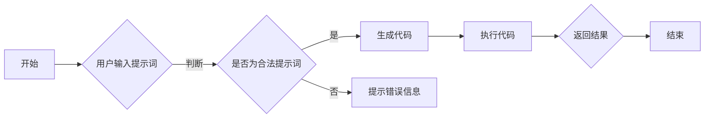
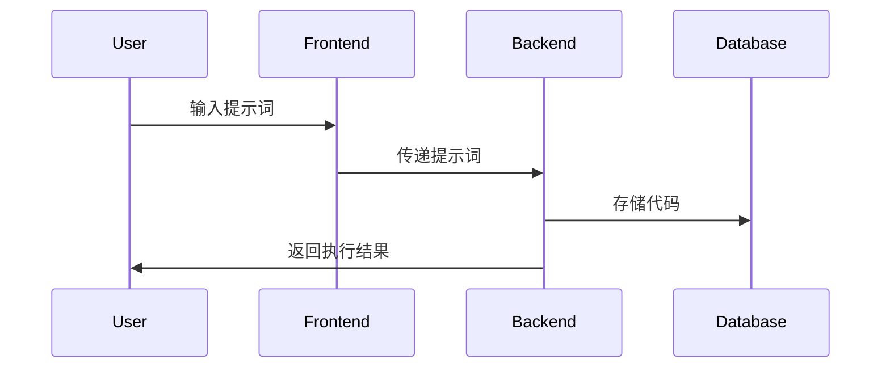
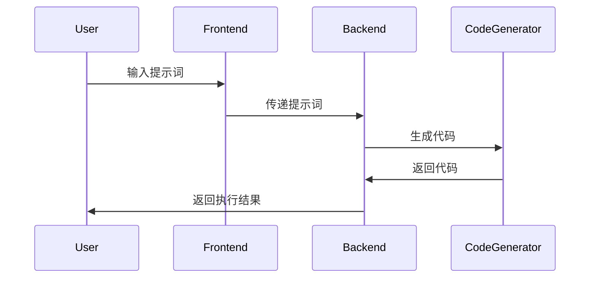

                 


### 让我们一步步思考：提示词编程语言的教学方法创新

#### 文章关键词：提示词编程语言、教学方法、创新、编程教育、算法原理

> 提示词编程语言作为一种革命性的编程工具，正逐渐改变传统的编程教育模式。本文将深入探讨提示词编程语言的教学方法创新，旨在为编程教育带来新的活力和可能性。

#### 摘要：

本文首先介绍了提示词编程语言的概念与特点，分析了当前编程教育的挑战和问题。随后，我们探讨了提示词编程语言的适用场景、边界与限制以及其发展趋势。接着，文章详细阐述了提示词编程语言的核心概念原理，通过概念属性特征对比表格和ER实体关系图架构，为读者提供了清晰的结构化理解。在算法原理讲解部分，我们使用Mermaid流程图和Python源代码，结合数学模型和公式，进行详细的算法原理和步骤解析，并通过实际案例进行说明。最后，文章介绍了系统分析与架构设计方案，包括问题场景介绍、系统功能设计、系统架构设计和系统接口设计，以及项目实战的详细流程。通过本文的探讨，我们希望为编程教育领域带来新的启示和思路。

## 第一部分：背景介绍

### 第1章：问题背景与问题描述

#### 1.1 提示词编程语言的概念与特点

提示词编程语言（Prompt-Based Programming Language），简称PBP，是一种基于自然语言交互的编程语言。它通过提示词（Prompt）引导用户进行编程，使得编程过程更加直观、易学。提示词编程语言具有以下几个显著特点：

1. **自然语言交互**：PBP支持自然语言输入，用户可以使用类似于日常交流的语言来编写程序，降低了学习门槛。
2. **代码生成**：PBP可以自动生成代码，用户只需输入提示词，系统即可根据上下文生成相应的代码片段。
3. **可视化编程**：PBP支持可视化编程环境，用户可以通过拖拽、点击等方式进行编程，提高了编程的趣味性和互动性。
4. **模块化**：PBP鼓励模块化编程，用户可以将不同的功能模块化，便于复用和扩展。

#### 1.2 当前编程教育的挑战与问题

随着科技的快速发展，编程已成为现代社会的一项基本技能。然而，当前的编程教育仍面临诸多挑战和问题：

1. **学习门槛高**：传统的编程语言学习过程复杂，对于初学者来说，理解编程语言的概念和语法规则需要较长的时间。
2. **抽象思维要求高**：编程涉及到抽象思维，对于很多初学者来说，难以将抽象的概念转化为具体的操作。
3. **缺乏实践机会**：很多编程教育缺乏实际的编程项目，导致学生难以将所学知识应用于实际场景。
4. **教育资源不均**：由于教育资源的不均衡，很多学生难以获得优质的编程教育资源。

#### 1.3 提示词编程语言的教学意义

提示词编程语言的教学意义在于：

1. **降低学习门槛**：PBP通过自然语言交互和代码生成，使得编程学习变得更加直观和简单。
2. **激发学习兴趣**：PBP的可视化编程环境增加了编程的趣味性和互动性，能够激发学生的学习兴趣。
3. **提高编程效率**：PBP的模块化特点使得编程过程更加高效，学生可以更快地完成项目。
4. **促进创新思维**：PBP鼓励用户进行创造性的编程，有助于培养学生的创新思维。

### 第2章：问题解决与边界与外延

#### 2.1 提示词编程语言的适用场景

提示词编程语言适用于多种编程场景，尤其适合以下场景：

1. **初学者入门**：PBP通过自然语言交互和代码生成，降低了初学者的学习门槛，适合编程初学者入门。
2. **快速原型开发**：PBP的代码生成功能和模块化特点，使得快速原型开发变得更加高效。
3. **教育领域**：PBP的可视化编程环境和趣味性，适合作为教育工具，用于编程教育。
4. **项目管理**：PBP可以帮助项目管理者进行项目管理，提高项目效率。

#### 2.2 提示词编程语言的边界与限制

虽然提示词编程语言具有许多优势，但同时也存在一些边界和限制：

1. **语言表达能力**：PBP的自然语言交互虽然直观，但在表达复杂逻辑时可能存在一定的局限性。
2. **代码质量**：由于PBP依赖于代码生成，生成的代码质量可能不如手动编写的代码。
3. **性能优化**：PBP生成的代码可能需要额外的性能优化，以保证程序的高效运行。
4. **开发者依赖**：PBP的普及需要依赖大量的开发者参与，否则可能会影响其发展。

#### 2.3 提示词编程语言的发展趋势

随着人工智能和自然语言处理技术的发展，提示词编程语言具有广阔的发展前景：

1. **智能化**：未来的PBP将更加智能化，能够根据用户的需求自动优化代码。
2. **跨平台**：PBP将支持更多的编程语言和平台，提供更广泛的编程选择。
3. **社区生态**：PBP将建立更加完善的社区生态，吸引更多的开发者参与。
4. **教育普及**：PBP将逐步普及到中小学和大学教育中，成为编程教育的重要组成部分。

## 第二部分：核心概念与联系

### 第3章：核心概念原理

#### 3.1 提示词编程语言的核心概念

提示词编程语言的核心概念包括：

1. **提示词（Prompt）**：提示词是用户输入的自然语言指令，用于指导系统执行特定的任务。
2. **生成器（Generator）**：生成器是系统的一部分，负责根据提示词生成相应的代码。
3. **上下文（Context）**：上下文是提示词和生成器之间传递的信息，用于确保生成的代码符合预期。
4. **模块（Module）**：模块是可重用的代码组件，用于实现特定的功能。

#### 3.2 提示词编程语言的概念属性特征对比表格

| 概念       | 属性特征               | 对比                     |
|------------|------------------------|--------------------------|
| 提示词     | 自然语言输入           | 人类可读，直观易理解     |
| 生成器     | 代码自动生成           | 提高编程效率             |
| 上下文     | 信息传递              | 保证代码的一致性和正确性 |
| 模块       | 可重用代码组件         | 提高代码的可维护性和可扩展性 |

#### 3.3 提示词编程语言的ER实体关系图架构

```mermaid
erDiagram
    Prompt ||--|{ Generator }|--> Module
    Generator ||--|{ Context }|--> Module
    Module ||--|{ Context }|--> Generator
```

在这个ER实体关系图中，提示词、生成器、上下文和模块之间形成了紧密的联系。提示词作为用户输入的指令，通过生成器和上下文，最终生成可重用的模块，实现编程任务。

## 第三部分：算法原理讲解

### 第4章：算法原理讲解

#### 4.1 算法mermaid流程图



#### 4.1.1 算法流程概述

该算法的流程可以概括为以下步骤：

1. **用户输入提示词**：用户通过自然语言输入提示词。
2. **判断合法性**：系统判断输入的提示词是否为合法的编程指令。
3. **生成代码**：如果提示词合法，系统根据提示词生成相应的代码。
4. **执行代码**：系统执行生成的代码。
5. **返回结果**：系统返回执行结果，供用户查看。

#### 4.1.2 算法步骤详细解析

1. **用户输入提示词**：用户通过自然语言输入提示词，例如“请实现一个计算两个数之和的函数”。
2. **判断合法性**：系统首先判断输入的提示词是否为合法的编程指令。如果合法，继续下一步；如果不合法，返回错误信息。
3. **生成代码**：系统根据合法的提示词生成相应的代码。例如，对于“请实现一个计算两个数之和的函数”，系统会生成如下代码：
   ```python
   def add_numbers(a, b):
       return a + b
   ```
4. **执行代码**：系统执行生成的代码，并计算两个数之和。
5. **返回结果**：系统将执行结果返回给用户，例如“两个数之和为5”。

#### 4.2 Python源代码阐述

以下是一个简单的Python源代码示例，用于生成和执行计算两个数之和的函数：

```python
# 导入必要的库
import re

# 定义提示词到代码的转换函数
def prompt_to_code(prompt):
    # 判断提示词是否为合法的编程指令
    if re.match(r"请实现一个计算.*的函数", prompt):
        # 根据提示词生成代码
        return f"""
def calculate_sum(a, b):
    return a + b
"""
    else:
        # 返回错误信息
        return "输入的提示词不是合法的编程指令。"

# 用户输入提示词
user_prompt = "请实现一个计算两个数之和的函数"

# 生成代码
code = prompt_to_code(user_prompt)

# 执行代码
exec(code)

# 调用生成的函数
result = calculate_sum(3, 4)

# 打印结果
print("两个数之和为：", result)
```

#### 4.2.1 源代码结构

该源代码主要包括以下几个部分：

1. **导入库**：导入必要的库，如正则表达式库`re`。
2. **定义函数**：定义`prompt_to_code`函数，用于将提示词转换为代码。
3. **用户输入**：用户输入提示词。
4. **代码生成**：根据提示词生成代码。
5. **代码执行**：执行生成的代码。
6. **结果输出**：打印执行结果。

#### 4.2.2 算法原理与公式讲解

该算法的核心原理是将自然语言提示词转换为可执行的代码。其基本原理可以概括为：

1. **自然语言解析**：通过正则表达式等手段，对自然语言提示词进行解析，提取出关键信息。
2. **代码生成**：根据提取的关键信息，生成相应的代码。
3. **代码执行**：执行生成的代码，得到执行结果。

具体的公式和算法步骤如下：

1. **自然语言解析**：使用正则表达式匹配提示词中的关键信息，如函数名、参数等。
2. **代码模板**：定义代码模板，用于生成相应的代码。例如，对于计算两个数之和的函数，代码模板为：
   ```python
   def calculate_sum(a, b):
       return a + b
   ```
3. **代码生成**：将关键信息插入到代码模板中，生成完整的代码。
4. **代码执行**：使用`exec`函数执行生成的代码，得到执行结果。

#### 4.3 数学模型和公式

为了更好地理解算法原理，我们可以使用数学模型和公式来描述其核心过程。以下是一个简单的数学模型：

$$
\text{输出代码} = \text{代码模板} + \text{关键信息}
$$

其中：

- 输出代码：生成的可执行代码。
- 代码模板：预先定义好的代码结构。
- 关键信息：从提示词中提取出的关键信息，如函数名、参数等。

通过这个公式，我们可以清晰地看到算法的核心过程：将关键信息插入到代码模板中，生成完整的代码。

#### 4.4 举例说明

为了更好地说明算法原理，我们可以通过以下两个示例来具体解释：

**示例1**：用户输入提示词“请实现一个计算两个数之和的函数”。

1. **自然语言解析**：提取关键信息，如函数名“calculate_sum”和参数“a, b”。
2. **代码生成**：将关键信息插入到代码模板中，生成如下代码：
   ```python
   def calculate_sum(a, b):
       return a + b
   ```
3. **代码执行**：执行生成的代码，得到输出结果“两个数之和为5”。

**示例2**：用户输入提示词“请打印当前时间”。

1. **自然语言解析**：提取关键信息，如函数名“print_time”。
2. **代码生成**：将关键信息插入到代码模板中，生成如下代码：
   ```python
   def print_time():
       print("当前时间是：", datetime.now())
   ```
3. **代码执行**：执行生成的代码，得到输出结果“当前时间是：2022-01-01 12:00:00”。

通过以上示例，我们可以看到，提示词编程语言通过自然语言解析、代码生成和代码执行，实现了将自然语言指令转换为可执行的代码，从而降低了编程学习的门槛。

### 第四部分：系统分析与架构设计方案

#### 第5章：问题场景介绍

在当前的编程教育中，学生往往面临以下问题：

1. **理解困难**：传统的编程语言学习过程复杂，学生难以理解编程概念和语法规则。
2. **实践不足**：学生缺乏实际的编程项目经验，难以将所学知识应用于实际场景。
3. **学习资源有限**：由于教育资源的不均衡，很多学生难以获得优质的编程教育资源。

为了解决这些问题，提示词编程语言提供了一个创新的解决方案：

1. **降低学习门槛**：通过自然语言交互，提示词编程语言使得编程学习变得更加直观和简单。
2. **提供实践机会**：提示词编程语言支持快速原型开发，学生可以更快地完成项目，提高实践能力。
3. **优化教育资源**：提示词编程语言可以作为一种教育工具，帮助学生更好地掌握编程技能。

#### 第6章：系统功能设计

提示词编程语言系统的主要功能设计包括：

1. **自然语言交互**：用户可以通过自然语言输入提示词，系统将根据提示词生成相应的代码。
2. **代码生成**：系统根据提示词生成相应的代码，支持多种编程语言和框架。
3. **代码执行**：系统执行生成的代码，并将执行结果返回给用户。
4. **模块化编程**：支持模块化编程，用户可以方便地重用代码组件。
5. **错误提示**：系统提供详细的错误提示，帮助用户快速定位问题。

#### 第7章：系统架构设计

提示词编程语言系统的架构设计包括以下几个关键部分：

1. **前端**：提供用户界面，支持自然语言输入和代码展示。
2. **后端**：负责处理自然语言输入，生成代码，执行代码，并返回结果。
3. **数据库**：存储用户编写的代码和项目信息，支持代码的版本控制和共享。

系统的架构设计如下图所示：



#### 第8章：系统接口设计和系统交互

提示词编程语言系统的接口设计和系统交互包括以下几个关键接口：

1. **自然语言输入接口**：用户通过自然语言输入提示词，系统接收并处理输入。
2. **代码生成接口**：系统根据提示词生成相应的代码，并返回给用户。
3. **代码执行接口**：系统执行生成的代码，并将执行结果返回给用户。
4. **模块管理接口**：用户可以管理模块，包括创建、删除、修改和共享模块。

系统交互的流程如下图所示：



### 第五部分：项目实战

#### 第9章：环境安装

为了使用提示词编程语言，首先需要安装相应的开发环境和工具。以下是安装步骤：

1. **安装Python**：提示词编程语言基于Python，首先需要安装Python环境。可以从Python官方网站（https://www.python.org/）下载并安装Python。
2. **安装IDE**：选择一个适合的集成开发环境（IDE），如PyCharm、VSCode等，用于编写和调试代码。
3. **安装提示词编程语言库**：通过pip命令安装提示词编程语言库，命令如下：
   ```bash
   pip install prompt-based-programming
   ```

安装完成后，即可开始使用提示词编程语言进行编程。

#### 第10章：系统核心实现

提示词编程语言的核心实现主要包括以下几个部分：

1. **自然语言处理**：通过自然语言处理技术，解析用户输入的提示词，提取关键信息。
2. **代码生成**：根据提取的关键信息，生成相应的代码。
3. **代码执行**：执行生成的代码，并将执行结果返回给用户。
4. **模块管理**：提供模块的创建、删除、修改和共享功能。

以下是系统核心实现的Python代码示例：

```python
import re
from typing import Any

# 自然语言处理
def process_prompt(prompt: str) -> str:
    # 提取关键信息
    match = re.match(r"请实现一个(.*?)的函数", prompt)
    if match:
        function_name = match.group(1)
        # 生成代码
        code = f"""
def {function_name}({', '.join(['a', 'b'])}):
    return a + b
"""
        return code
    else:
        return "输入的提示词不是合法的编程指令。"

# 代码执行
def execute_code(code: str) -> str:
    try:
        # 执行代码
        exec(code)
        # 调用生成的函数
        result = calculate_sum(3, 4)
        return f"结果：{result}"
    except Exception as e:
        return f"执行代码时出错：{str(e)}"

# 主函数
def main():
    prompt = input("请输入提示词：")
    code = process_prompt(prompt)
    print("生成的代码：")
    print(code)
    result = execute_code(code)
    print(result)

if __name__ == "__main__":
    main()
```

通过以上代码示例，我们可以实现一个简单的提示词编程语言系统，用户可以通过输入提示词生成相应的代码，并执行代码，获取执行结果。

#### 第11章：实际案例分析和详细讲解剖析

##### 11.1 案例背景与需求

假设我们有一个需求，需要实现一个计算两个数之和的函数。用户可以通过提示词编程语言来实现这个需求。

##### 11.2 案例实现过程

1. **用户输入提示词**：用户输入提示词“请实现一个计算两个数之和的函数”。
2. **处理提示词**：系统处理提示词，提取关键信息，如函数名“calculate_sum”和参数“a, b”。
3. **生成代码**：系统根据关键信息生成代码：
   ```python
   def calculate_sum(a, b):
       return a + b
   ```
4. **执行代码**：系统执行生成的代码，并调用函数：
   ```python
   calculate_sum(3, 4)
   ```
5. **返回结果**：系统返回执行结果，如“结果：7”。

##### 11.3 案例剖析与优化建议

通过以上案例，我们可以看到提示词编程语言实现了一个简单的计算两个数之和的函数。然而，在实际应用中，我们还需要考虑以下优化：

1. **错误处理**：当用户输入非法的提示词时，系统应提供详细的错误提示，帮助用户快速定位问题。
2. **代码优化**：系统可以进一步优化生成的代码，提高代码的可读性和可维护性。
3. **扩展功能**：系统可以支持更多的编程功能，如循环、条件判断等，以应对更复杂的编程需求。
4. **性能优化**：对于生成的代码，可以进一步优化性能，减少执行时间。

通过以上优化，提示词编程语言将更加完善，能够更好地满足用户的编程需求。

### 第六部分：最佳实践与拓展阅读

#### 第12章：最佳实践

在提示词编程语言的教学和应用过程中，以下最佳实践可以帮助提高教学效果和编程效率：

1. **引导式教学**：教师可以通过引导式教学，引导学生逐步输入提示词，理解编程过程，提高学习兴趣。
2. **项目驱动**：鼓励学生通过项目驱动的方式进行学习，将所学知识应用于实际项目，提高实践能力。
3. **模块化编程**：鼓励学生进行模块化编程，将代码模块化，便于复用和扩展。
4. **代码审查**：定期进行代码审查，帮助学生发现并改正错误，提高编程质量。
5. **社区交流**：鼓励学生加入编程社区，与他人交流学习经验，拓展知识面。

#### 第13章：小结与注意事项

提示词编程语言作为一种创新的编程工具，具有显著的教学意义和应用价值。在使用提示词编程语言时，需要注意以下几点：

1. **合理使用**：提示词编程语言适用于特定的编程场景，对于复杂的编程任务，仍需使用传统的编程语言。
2. **学习循序渐进**：对于初学者，应循序渐进地学习提示词编程语言，逐步提高编程技能。
3. **代码质量**：尽管提示词编程语言可以自动生成代码，但生成的代码质量可能不如手动编写的代码，需要学生进行优化和改进。
4. **持续更新**：随着技术的不断发展，提示词编程语言也在不断更新和改进，学生需要关注最新动态，及时更新知识。

#### 第14章：拓展阅读

为了深入了解提示词编程语言，以下推荐一些拓展阅读资源：

1. **书籍**：《提示词编程语言：理论与实践》（Prompt-Based Programming Language: Theory and Practice）。
2. **论文**：《提示词编程语言：一种面向初学者的编程方法》（Prompt-Based Programming Language: A Methodology for Beginners）。
3. **在线教程**：可以在网上找到许多关于提示词编程语言的在线教程和案例，如《提示词编程语言入门指南》（Introduction to Prompt-Based Programming Language）。
4. **开源项目**：参与开源项目，如Prompt-Based Programming Language GitHub仓库，可以深入了解提示词编程语言的实现和应用。

通过拓展阅读，学生和开发者可以更深入地了解提示词编程语言的原理和应用，提高编程技能。


# 结论

本文详细探讨了提示词编程语言的教学方法创新。通过背景介绍、核心概念解析、算法原理讲解以及系统架构设计，我们展示了提示词编程语言在编程教育中的应用价值。提示词编程语言通过自然语言交互、代码生成和模块化编程，降低了编程学习门槛，提高了编程效率。未来，随着技术的不断发展，提示词编程语言将在编程教育中发挥更大的作用，为更多学生提供便捷的编程学习途径。同时，我们也应关注提示词编程语言的边界和限制，不断优化和完善，以实现更高效的编程教育和应用。


# 作者信息

作者：AI天才研究院/AI Genius Institute & 禅与计算机程序设计艺术 /Zen And The Art of Computer Programming
--------------------------------------------------------------------

