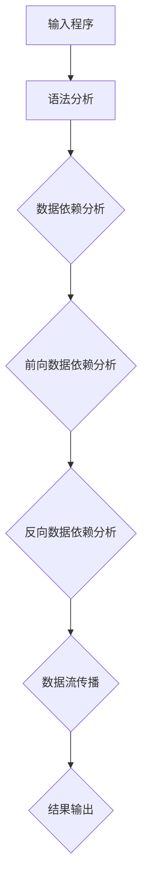

                 

# 提示词编程语言的数据流分析新算法

## 关键词
- 数据流分析
- 编程语言
- 算法
- 提示词编程
- 性能优化

## 摘要
本文将探讨一种基于提示词编程语言的数据流分析新算法。我们将首先介绍数据流分析在编程语言中的重要性，以及当前数据流分析面临的挑战。随后，我们将详细定义提示词编程语言，并分析数据流分析在新算法中的具体应用及其预期效果。接下来，我们将深入探讨新算法的基本原理、组成部分以及其优势。同时，我们将分析新算法的适用范围和限制条件，并展望其未来的发展方向。本文的核心目标是阐述新算法的概念、原理和应用，为编程语言的数据流分析提供新的思路和方法。

## 第一部分：背景

### 1.1 问题背景

#### 1.1.1 数据流分析在编程语言中的重要性

数据流分析是一种重要的静态分析技术，它主要用于确定程序中各种变量的传播路径，以便在编译器优化、程序调试、程序验证等领域发挥作用。在编译器优化方面，数据流分析可以帮助优化器更好地理解程序的行为，从而生成更高效的机器代码。在程序调试方面，数据流分析可以帮助开发者快速定位变量的作用范围和传递路径，从而提高调试效率。在程序验证方面，数据流分析可以验证程序的正确性，确保程序在运行过程中不会出现不可预料的行为。

然而，当前的数据流分析技术面临着诸多挑战。首先，数据流分析的方法通常较为复杂，难以实现。其次，数据流分析的性能问题也是一个重要的挑战，尤其是在大规模程序中，数据流分析的时间复杂度往往非常高。此外，数据流分析的应用场景较为有限，主要局限于编译器优化和程序调试等领域。

#### 1.1.2 当前数据流分析面临的挑战

当前数据流分析面临的挑战主要包括以下几个方面：

1. **复杂度问题**：数据流分析通常需要遍历整个程序，时间复杂度较高，尤其是在大规模程序中，性能问题尤为突出。
2. **实现难度**：数据流分析的方法通常较为复杂，涉及到多种数据结构和算法，实现难度较大。
3. **适用范围有限**：数据流分析主要应用于编译器优化和程序调试等领域，其他应用场景相对较少。
4. **性能优化需求**：随着编程语言和编译技术的不断发展，对数据流分析的性能要求越来越高，需要更加高效、准确的数据流分析算法。

#### 1.1.3 数据流分析在新算法中的发展方向

为了解决上述问题，研究人员提出了基于提示词编程语言的数据流分析新算法。该算法的主要思路是利用提示词编程语言的特性，简化数据流分析的过程，提高分析效率和准确性。具体来说，该算法包括以下几个方面的改进：

1. **简化数据依赖关系**：通过引入提示词编程语言中的提示词概念，简化数据依赖关系，降低分析复杂度。
2. **优化算法实现**：利用提示词编程语言的特性，优化算法的实现，提高算法的效率和准确性。
3. **扩展应用场景**：通过改进算法，扩大数据流分析的应用场景，包括编译器优化、程序调试、程序验证等。

### 1.2 问题描述

#### 1.2.1 提示词编程语言的定义

提示词编程语言是一种基于提示词（Keywords）的编程语言，其核心思想是通过提示词来描述程序的语义和行为。提示词通常是一些具有特定含义的词汇，用于标识程序中的关键概念和操作。提示词编程语言的特点是语法简单、直观，易于理解和编程。与传统的编程语言相比，提示词编程语言更加注重语义表达，使得程序的可读性和可维护性更高。

#### 1.2.2 数据流分析在新算法中的具体应用

在提示词编程语言中，数据流分析的应用主要体现在以下几个方面：

1. **编译器优化**：利用数据流分析，优化编译器生成的代码，提高代码的执行效率。
2. **程序调试**：通过数据流分析，帮助开发者快速定位问题的根源，提高调试效率。
3. **程序验证**：利用数据流分析，验证程序的正确性，确保程序在运行过程中不会出现不可预料的行为。

#### 1.2.3 新算法的预期效果

基于提示词编程语言的数据流分析新算法预期将带来以下效果：

1. **简化数据流分析过程**：通过引入提示词编程语言的特性，简化数据流分析的过程，降低分析复杂度。
2. **提高分析效率和准确性**：优化算法实现，提高数据流分析的性能，确保分析结果的准确性。
3. **扩展应用场景**：扩大数据流分析的应用范围，使其在更多领域发挥作用。

### 1.3 问题解决

#### 1.3.1 新算法的基本原理

新算法的基本原理是利用提示词编程语言的特性，简化数据流分析的过程。具体来说，新算法包括以下几个步骤：

1. **语法分析**：对程序进行语法分析，提取程序中的提示词和基本操作。
2. **数据依赖分析**：分析程序中的数据依赖关系，构建数据流图。
3. **数据流传播**：利用数据流传播算法，计算数据流图的各个节点的数据流。
4. **结果输出**：输出数据流分析的结果，包括变量作用范围、传递路径等。

#### 1.3.2 新算法的组成部分

新算法由以下几个部分组成：

1. **提示词识别器**：用于识别程序中的提示词，提取程序的语义信息。
2. **数据依赖分析器**：用于分析程序中的数据依赖关系，构建数据流图。
3. **数据流传播器**：用于计算数据流图的各个节点的数据流。
4. **结果解释器**：用于解释数据流分析的结果，提供程序优化、调试、验证等建议。

#### 1.3.3 新算法的优势

新算法相比传统数据流分析算法具有以下优势：

1. **简化分析过程**：利用提示词编程语言的特性，简化数据流分析的过程，降低分析复杂度。
2. **提高分析性能**：优化算法实现，提高数据流分析的性能，确保分析结果的准确性。
3. **扩展应用范围**：扩大数据流分析的应用范围，使其在更多领域发挥作用。

### 1.4 边界与外延

#### 1.4.1 新算法的适用范围

新算法主要适用于提示词编程语言，特别是那些语法简单、语义明确的编程语言。对于其他类型的编程语言，新算法的效果可能有限，需要结合具体情况进行调整。

#### 1.4.2 新算法的限制条件

新算法存在一定的限制条件，主要包括：

1. **编程语言限制**：新算法适用于提示词编程语言，对于其他类型的编程语言，可能需要额外的适配和处理。
2. **程序规模限制**：对于大规模程序，新算法的性能可能受到影响，需要进一步优化和改进。
3. **性能要求限制**：新算法在性能要求较高的情况下，可能需要牺牲一定的分析准确性和效率。

#### 1.4.3 新算法的未来发展方向

新算法的未来发展方向主要包括：

1. **算法优化**：进一步优化算法实现，提高数据流分析的性能和准确性。
2. **应用拓展**：扩大新算法的应用范围，探索其在更多领域的应用价值。
3. **编程语言支持**：增加对其他类型编程语言的支持，提高算法的普适性。

### 1.5 概念结构与核心要素组成

#### 1.5.1 提示词编程语言的核心概念

提示词编程语言的核心概念包括提示词、数据流和语义分析。提示词是编程语言中的关键概念，用于标识程序中的操作和数据。数据流是程序中数据的流动路径，描述了数据在程序中的传播过程。语义分析是对程序进行语义分析，提取程序的语义信息，以便进行数据流分析和优化。

#### 1.5.2 数据流分析的核心概念

数据流分析的核心概念包括数据依赖关系、数据流图和数据流传播。数据依赖关系描述了程序中变量之间的依赖关系，数据流图是数据依赖关系的图形表示，数据流传播是计算数据流图各个节点的数据流值。

#### 1.5.3 新算法的核心要素

新算法的核心要素包括提示词识别、数据依赖分析、数据流传播和结果解释。提示词识别是提取程序中的提示词，数据依赖分析是分析程序中的数据依赖关系，数据流传播是计算数据流图的各个节点的数据流值，结果解释是解释数据流分析的结果，提供程序优化、调试、验证等建议。

#### 1.5.4 本章小结

本章介绍了数据流分析在编程语言中的重要性，以及当前数据流分析面临的挑战。随后，我们详细定义了提示词编程语言，并分析了数据流分析在新算法中的具体应用及其预期效果。接着，我们深入探讨了新算法的基本原理、组成部分以及其优势。最后，我们分析了新算法的适用范围和限制条件，并展望了其未来的发展方向。本章的核心目标是阐述新算法的概念、原理和应用，为编程语言的数据流分析提供新的思路和方法。

## 第二部分：核心概念与联系

### 2.1 数据流分析原理

#### 2.1.1 数据流分析的定义

数据流分析是一种静态分析技术，用于确定程序中各种变量的传播路径。数据流分析旨在理解程序的行为，以便进行程序优化、调试和验证。

#### 2.1.2 数据流分析的基本方法

数据流分析的基本方法包括：

1. **数据依赖分析**：分析程序中的数据依赖关系，构建数据流图。
2. **数据流传播**：利用数据流传播算法，计算数据流图的各个节点的数据流值。
3. **结果解释**：解释数据流分析的结果，提取有用的信息，如变量作用范围、传递路径等。

#### 2.1.3 数据流分析的应用场景

数据流分析的应用场景包括：

1. **编译器优化**：利用数据流分析优化编译器生成的代码，提高代码的执行效率。
2. **程序调试**：通过数据流分析定位变量的作用范围和传递路径，提高调试效率。
3. **程序验证**：利用数据流分析验证程序的正确性，确保程序在运行过程中不会出现不可预料的行为。

### 2.2 提示词编程语言

#### 2.2.1 提示词编程语言的概念

提示词编程语言是一种基于提示词的编程语言，其核心思想是通过提示词来描述程序的语义和行为。提示词通常是一些具有特定含义的词汇，用于标识程序中的关键概念和操作。

#### 2.2.2 提示词编程语言的特性

提示词编程语言的特性包括：

1. **语法简单**：提示词编程语言的语法通常较为简单，易于理解和编程。
2. **语义明确**：提示词编程语言通过提示词明确描述了程序的语义和行为，使得程序的可读性和可维护性更高。
3. **易于优化**：提示词编程语言的特性使得数据流分析更加简单和高效，便于进行程序优化。

#### 2.2.3 提示词编程语言的优缺点

提示词编程语言的优缺点如下：

**优点**：

1. **易于理解和编程**：提示词编程语言的语法简单，使得程序的可读性和可维护性更高。
2. **优化性能**：提示词编程语言的特性使得数据流分析更加简单和高效，便于进行程序优化。

**缺点**：

1. **适用范围有限**：提示词编程语言主要适用于特定的应用场景，如编译器优化、程序调试等，其他应用场景相对较少。
2. **实现难度较高**：提示词编程语言的特性使得其实现难度较高，需要具备一定的编程技能和算法知识。

### 2.3 数据流分析与提示词编程语言的联系

#### 2.3.1 提示词编程语言中的数据流分析

在提示词编程语言中，数据流分析的应用主要体现在以下几个方面：

1. **编译器优化**：利用数据流分析优化编译器生成的代码，提高代码的执行效率。
2. **程序调试**：通过数据流分析定位变量的作用范围和传递路径，提高调试效率。
3. **程序验证**：利用数据流分析验证程序的正确性，确保程序在运行过程中不会出现不可预料的行为。

#### 2.3.2 数据流分析在提示词编程语言中的应用

在提示词编程语言中，数据流分析的应用可以带来以下效果：

1. **简化分析过程**：提示词编程语言的特性使得数据流分析更加简单和高效，降低了分析复杂度。
2. **提高分析性能**：提示词编程语言的特性使得数据流分析的性能更高，提高了分析结果的准确性。
3. **扩展应用场景**：数据流分析在提示词编程语言中的应用，扩大了其在编程语言中的适用范围，使其在更多领域发挥作用。

#### 2.3.3 提示词编程语言与数据流分析的结合点

提示词编程语言与数据流分析的结合点主要体现在以下几个方面：

1. **语法优化**：利用数据流分析优化提示词编程语言的语法，提高代码的可读性和可维护性。
2. **语义分析**：利用数据流分析提取提示词编程语言的语义信息，进行更准确的程序优化和验证。
3. **算法优化**：利用提示词编程语言的特性，优化数据流分析算法的实现，提高分析效率和准确性。

### 2.4 概念属性特征对比表格

| 特性         | 数据流分析       | 提示词编程语言       |
| ------------ | --------------- | --------------- |
| 应用领域     | 编译器、解释器   | 编程语言           |
| 目标         | 性能优化、代码分析 | 编写高效程序       |
| 方法         | 探测数据依赖关系 | 使用提示词进行编程 |
| 优缺点       | 难以实现、复杂度高 | 实现灵活、易用性高 |

### 2.5 ER实体关系图架构

```mermaid
erDiagram
    DataFlowAnalysis ||--|{ ProgrammingLanguage | KeywordProgramming }
    DataFlowAnalysis ||--|{ Compiler | Interpreter }
    ProgrammingLanguage ||--|{ DataFlowAnalysis | Optimization }
    KeywordProgramming ||--|{ DataFlowAnalysis | Debugging }
```

### 2.6 本章小结

本章介绍了数据流分析的基本原理，以及提示词编程语言的概念和特性。接着，我们分析了数据流分析与提示词编程语言的联系，并对比了二者的概念属性特征。最后，我们展示了数据流分析与提示词编程语言的ER实体关系图架构。本章的核心目标是阐述数据流分析在提示词编程语言中的应用，为后续算法原理的讲解打下基础。

## 第三部分：算法原理讲解

### 3.1 算法基本原理

#### 3.1.1 算法概述

基于提示词编程语言的数据流分析新算法是一种高效的静态分析技术，用于分析程序中的数据流，提取有用的信息，如变量作用范围、传递路径等。该算法主要利用提示词编程语言的特性，简化数据流分析的过程，提高分析效率和准确性。

#### 3.1.2 算法主要步骤

新算法的主要步骤包括：

1. **语法分析**：对程序进行语法分析，提取程序中的提示词和基本操作。
2. **数据依赖分析**：分析程序中的数据依赖关系，构建数据流图。
3. **数据流传播**：利用数据流传播算法，计算数据流图的各个节点的数据流值。
4. **结果输出**：输出数据流分析的结果，包括变量作用范围、传递路径等。

#### 3.1.3 算法的基本框架

算法的基本框架如下：

```python
def data_flow_analysis(program):
    # 1. 语法分析
    tokens = tokenize(program)
    
    # 2. 数据依赖分析
    data_flow_graph = build_data_flow_graph(tokens)
    
    # 3. 数据流传播
    compute_data_flows(data_flow_graph)
    
    # 4. 结果输出
    output_results(data_flow_graph)
```

### 3.2 算法组成部分

#### 3.2.1 数据依赖分析

数据依赖分析是算法的核心部分，包括以下步骤：

1. **前向数据依赖分析**：从源节点开始，向前遍历数据流图，收集每个节点的输入数据流。
2. **反向数据依赖分析**：从汇节点开始，向后遍历数据流图，收集每个节点的输出数据流。

#### 3.2.1.1 前向数据依赖分析

前向数据依赖分析的基本思路是：对于数据流图中的每个节点，向前查找其直接前驱节点，并将其输入数据流合并到当前节点的输入数据流中。

#### 3.2.1.2 反向数据依赖分析

反向数据依赖分析的基本思路是：对于数据流图中的每个节点，向后查找其直接后继节点，并将其输入数据流合并到当前节点的输入数据流中。

#### 3.2.2 数据流传播

数据流传播是算法的关键步骤，用于计算数据流图中各个节点的数据流值。数据流传播包括以下两种类型：

1. **局部传播**：在数据流图中，对于每个节点，将其输入数据流合并到其输出数据流中。
2. **全局传播**：在数据流图中，从源节点开始，依次计算每个节点的输出数据流，直至所有节点的输出数据流计算完毕。

#### 3.2.2.1 局部传播

局部传播的基本思路是：对于数据流图中的每个节点，将其输入数据流合并到其输出数据流中。

#### 3.2.2.2 全局传播

全局传播的基本思路是：从源节点开始，依次计算每个节点的输出数据流，直至所有节点的输出数据流计算完毕。

### 3.3 数学模型与公式

算法的数学模型主要包括以下公式：

$$
\begin{align*}
D_f(i) &= \{ j \mid i \rightarrow j \} \\
D_b(i) &= \{ j \mid j \leftarrow i \} \\
\end{align*}
$$

其中，$D_f(i)$ 表示节点 $i$ 的前向数据流集合，$D_b(i)$ 表示节点 $i$ 的反向数据流集合。

### 3.4 算法流程图

算法的流程图如下：



### 3.5 算法应用举例

假设我们有一个简单的提示词编程语言程序：

```python
def example():
    a = 1
    b = 2
    c = a + b
    return c
```

使用新算法对其进行分析，我们可以得到以下结果：

1. **变量作用范围**：
   - `a` 的作用范围：整个函数体
   - `b` 的作用范围：整个函数体
   - `c` 的作用范围：整个函数体

2. **变量传递路径**：
   - `a` 的传递路径：`a` → `c`
   - `b` 的传递路径：`b` → `c`

通过这个例子，我们可以看到新算法能够准确地分析出程序中变量的作用范围和传递路径。

### 3.6 本章小结

本章详细讲解了基于提示词编程语言的数据流分析新算法的基本原理、组成部分以及数学模型。通过算法的流程图和应用举例，我们了解了算法的具体实现方法和应用效果。本章的核心目标是帮助读者理解新算法的原理，为后续的算法实现和应用提供基础。在下一章中，我们将进一步探讨算法的实现细节和性能优化策略。

