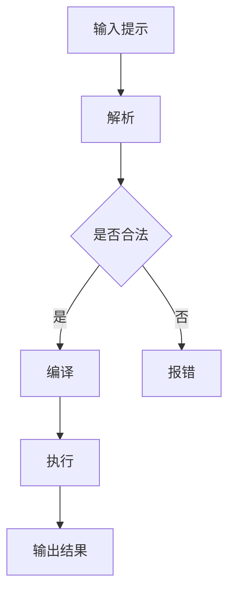
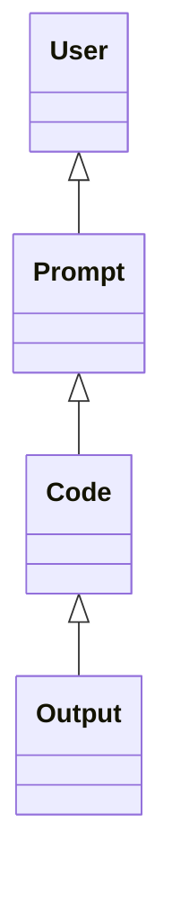
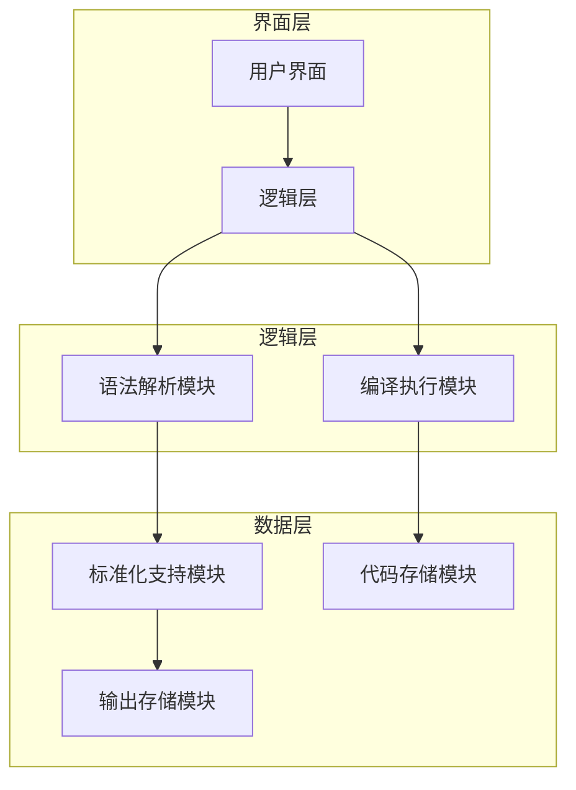
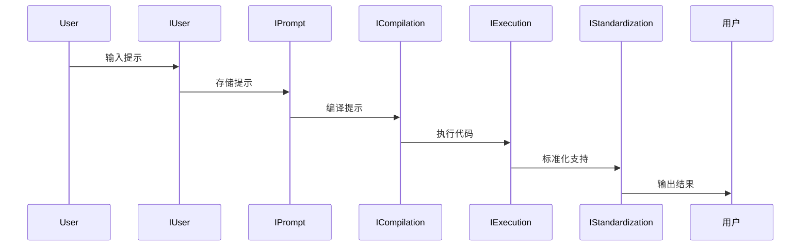

                 


# 提示词编程语言的标准化进程

关键词：提示词编程语言、标准化、统一性、互操作性、挑战与解决方案

摘要：本文旨在探讨提示词编程语言的标准化进程，分析其问题背景、核心概念、现状与挑战，并提出相应的解决思路。通过对提示词编程语言标准化进程的深入研究，旨在推动其发展，提高编程语言的质量和互操作性。

## 第一部分：背景介绍

### 第1章：问题背景

#### 1.1.1 提示词编程语言的标准化进程的问题背景

随着计算机技术的飞速发展，编程语言在软件开发中扮演着越来越重要的角色。然而，目前编程语言的标准化进程却面临诸多挑战。首先，不同的编程语言具有各自的特点和优势，但它们之间往往缺乏统一的标准，导致互操作性差。其次，编程语言的更新迭代速度较快，一些新特性和新标准无法及时得到普及和应用。此外，编程语言的标准化工作涉及多个领域和利益相关方，协调和合作难度较大。

#### 1.1.2 提示词编程语言的问题描述

提示词编程语言（Prompt-Based Programming Languages）是一种基于用户输入提示进行编程的编程语言。这种语言通过解析和执行用户输入的提示来完成特定任务。然而，提示词编程语言在标准化进程中面临以下问题：

1. 提示语言的多样性：不同的提示词编程语言具有不同的提示语言和语法规则，使得用户难以学习和掌握。
2. 标准化缺乏统一性：现有的标准化组织对提示词编程语言的关注较少，导致标准化进程缓慢。
3. 提示词语言的语义不确定性：提示词语言的表达能力有限，使得用户难以精确描述需求，从而导致执行结果不准确。
4. 缺乏兼容性和互操作性：不同的提示词编程语言之间存在较大的差异，使得它们之间的互操作性较差。

#### 1.1.3 提示词编程语言标准化进程的解决思路

为了解决上述问题，提示词编程语言的标准化进程可以从以下几个方面进行：

1. **制定统一的标准**：建立一套统一的提示词编程语言标准，包括语法规则、语义定义、执行流程等，以确保不同语言之间的兼容性和互操作性。
2. **构建规范化的提示词库**：通过收集和分析大量用户输入的提示词，构建一个规范化的提示词库，为用户提供丰富的参考和指导。
3. **加强标准化组织的支持**：鼓励和推动现有标准化组织关注提示词编程语言的标准化工作，争取更多的资源和支持。
4. **促进开源社区的合作**：鼓励开源社区参与提示词编程语言的标准化进程，共同推动语言的演进和完善。

### 1.2 提示词编程语言标准化的核心概念

#### 1.2.1 标准化的定义与属性

标准化是指通过制定和实施标准，对某一领域的技术、产品或服务进行规范化，以提高其质量、安全性和互操作性。标准化具有以下属性：

1. **统一性**：标准化的核心目标是实现统一，消除不同技术、产品或服务之间的差异，提高互操作性。
2. **规范性**：标准规定了某一领域的技术要求、操作流程、性能指标等，为实施提供明确的指导。
3. **权威性**：标准通常由权威的标准化组织制定和发布，具有较高的公信力和权威性。

#### 1.2.2 提示词编程语言的标准化要素

提示词编程语言的标准化包括以下要素：

1. **语法规则**：定义提示词编程语言的语法结构，包括变量、函数、控制结构等。
2. **语义定义**：明确提示词编程语言中各个语法结构的含义和功能，确保执行结果的准确性。
3. **执行流程**：规定提示词编程语言的执行过程，包括解析、编译、执行等阶段。
4. **兼容性和互操作性**：确保不同提示词编程语言之间的兼容性和互操作性，使开发者能够方便地使用多种语言进行编程。

#### 1.2.3 标准化与提示词编程语言的关系

标准化对于提示词编程语言的发展具有重要意义。首先，标准化可以降低学习成本，使开发者更容易掌握和使用不同的提示词编程语言。其次，标准化可以提高编程语言的互操作性和兼容性，促进技术交流和合作。此外，标准化还可以推动编程语言的创新和发展，为新的编程语言和技术的引入提供规范和标准。

### 1.3 提示词编程语言标准化进程的现状与挑战

#### 1.3.1 标准化进程的现状

目前，提示词编程语言的标准化进程尚处于起步阶段。一些学术组织和开源社区已经开始关注和推动这一领域的发展，但整体进展较为缓慢。现有的一些标准化组织，如ISO、IEC等，尚未对提示词编程语言进行深入的研究和标准化。

#### 1.3.2 面临的挑战

提示词编程语言的标准化进程面临以下挑战：

1. **技术挑战**：提示词编程语言涉及多种技术，包括自然语言处理、编程语言理论等，标准化工作需要对这些技术有深入的理解。
2. **利益冲突**：提示词编程语言的标准化涉及多个利益相关方，如开发者、厂商、用户等，各方之间存在不同的利益诉求，协调和合作难度较大。
3. **标准化组织支持不足**：现有标准化组织对提示词编程语言的关注较少，缺乏足够的资源和政策支持。
4. **市场需求不明确**：提示词编程语言的市场需求尚不明确，标准化工作缺乏明确的应用场景和市场需求驱动。

----------------------------------------------------------------

## 第二部分：核心概念与联系

### 2.1 提示词编程语言的核心概念

提示词编程语言的核心概念主要包括语法、语义、执行流程等。这些概念决定了提示词编程语言的特性和应用范围。

#### 2.1.1 语法

语法是指提示词编程语言的语法结构，包括变量、函数、控制结构等。不同的提示词编程语言具有不同的语法规则，这使得用户在学习和使用时需要适应不同的语法特点。

#### 2.1.2 语义

语义是指提示词编程语言中各个语法结构的含义和功能。语义的准确性直接影响执行结果，因此，提示词编程语言的标准化需要明确各个语法结构的语义定义。

#### 2.1.3 执行流程

执行流程是指提示词编程语言的执行过程，包括解析、编译、执行等阶段。执行流程的标准化有助于提高编程语言的互操作性和兼容性。

### 2.2 提示词编程语言的核心概念对比表格

为了更好地理解提示词编程语言的核心概念，我们可以通过对比表格的形式展示不同概念的特点和差异。

| 核心概念 | 特点 | 差异 |
| :----: | :----: | :----: |
| 语法 | 规定提示词编程语言的语法结构 | 不同语言之间的语法差异较大 |
| 语义 | 明确提示词编程语言中各个语法结构的含义和功能 | 语义的准确性影响执行结果 |
| 执行流程 | 规定提示词编程语言的执行过程 | 不同语言之间的执行流程可能存在差异 |

### 2.3 提示词编程语言的ER实体关系图架构

为了更直观地展示提示词编程语言的核心概念，我们可以使用ER实体关系图来描述其架构。

```mermaid
erDiagram
    User ||--|{ Prompt } : 输入
    Prompt ||--|{ Code } : 编译
    Code ||--|{ Output } : 输出
```

在这个ER实体关系图中，用户输入提示（Prompt），编译器（Code）根据提示生成输出（Output）。这个关系图展示了提示词编程语言的核心组件及其相互关系。

### 2.4 标准化与提示词编程语言的关系

标准化对于提示词编程语言的发展具有重要意义。标准化可以降低学习成本，使开发者更容易掌握和使用不同的提示词编程语言。同时，标准化还可以提高编程语言的互操作性和兼容性，促进技术交流和合作。此外，标准化还可以推动编程语言的创新和发展，为新的编程语言和技术的引入提供规范和标准。

## 第三部分：算法原理讲解

### 3.1 算法原理概述

在提示词编程语言的标准化进程中，算法原理的讲解至关重要。以下是一个简单的算法原理示例，我们将使用Mermaid绘制流程图，并使用Python代码详细阐述其原理。

#### 3.1.1 Mermaid流程图



#### 3.1.2 Python代码示例

```python
def process_prompt(prompt):
    if is_valid_prompt(prompt):
        code = compile_prompt(prompt)
        output = execute_code(code)
        return output
    else:
        raise SyntaxError("Invalid prompt")

def is_valid_prompt(prompt):
    # 判断提示是否合法的代码
    return True

def compile_prompt(prompt):
    # 编译提示的代码
    code = ""
    # ... 编译逻辑 ...
    return code

def execute_code(code):
    # 执行代码的代码
    # ... 执行逻辑 ...
    return "执行结果"
```

#### 3.1.3 算法原理讲解

1. **输入提示**：用户输入提示（Prompt），这是提示词编程语言的输入部分。
2. **解析**：系统对输入的提示进行解析，判断其是否合法。
3. **编译**：如果提示合法，系统将其编译成代码。
4. **执行**：编译后的代码被执行，生成输出结果。
5. **输出结果**：系统将执行结果输出给用户。

这个简单的算法原理示例展示了提示词编程语言的基本流程。在实际应用中，每个步骤都可能包含更复杂的逻辑和处理。

### 3.2 数学公式与算法原理

在算法原理讲解中，数学公式是不可或缺的部分。以下是一个简单的数学公式示例，使用LaTeX格式进行展示。

$$
f(x) = x^2 + 2x + 1
$$

这个公式是一个二次函数，用于计算输入x的平方值。

### 3.3 举例说明

为了更好地理解算法原理，我们通过一个简单的例子进行说明。

**例子**：用户输入提示“计算2的平方加2的结果”。

1. **输入提示**：用户输入“计算2的平方加2的结果”。
2. **解析**：系统解析提示，判断其是否合法。在这个例子中，提示合法。
3. **编译**：系统将提示编译成代码，如`result = 2**2 + 2`。
4. **执行**：系统执行编译后的代码，计算结果为6。
5. **输出结果**：系统将结果输出给用户，即“计算结果为6”。

通过这个例子，我们可以看到算法原理在实际应用中的实现过程。

----------------------------------------------------------------

## 第四部分：系统分析与架构设计方案

### 4.1 问题场景介绍

随着人工智能技术的发展，提示词编程语言在各个领域得到了广泛应用。然而，当前提示词编程语言的标准化进程缓慢，导致不同语言之间的互操作性较差，影响了开发者和用户的体验。为了解决这一问题，我们需要设计一个高效、灵活的提示词编程语言系统。

### 4.2 项目介绍

本项目旨在开发一个基于标准化思想的提示词编程语言系统，该系统将实现以下功能：

1. **语法解析**：对用户输入的提示进行语法解析，确保提示的合法性。
2. **编译执行**：将合法的提示编译成代码，并执行代码，生成输出结果。
3. **标准化支持**：提供标准化工具和库，方便开发者使用和扩展提示词编程语言。

### 4.3 系统功能设计（领域模型）

为了实现上述功能，我们设计了一个领域模型，该模型包括以下类：

1. **User**：表示用户类，负责输入提示。
2. **Prompt**：表示提示类，负责存储用户输入的提示。
3. **Code**：表示代码类，负责存储编译后的代码。
4. **Output**：表示输出类，负责存储执行结果。

领域模型类图如下所示：



### 4.4 系统架构设计

为了实现系统功能，我们采用了一种分层架构设计，该架构包括以下层次：

1. **界面层**：负责与用户交互，接收用户输入的提示。
2. **逻辑层**：负责对用户输入的提示进行解析、编译和执行。
3. **数据层**：负责存储和检索提示、代码和输出结果。

系统架构图如下所示：



### 4.5 系统接口设计

为了实现系统功能，我们设计了一系列接口，包括：

1. **IUser**：用户接口，负责接收用户输入的提示。
2. **IPrompt**：提示接口，负责存储用户输入的提示。
3. **ICompilation**：编译接口，负责编译提示。
4. **IExecution**：执行接口，负责执行编译后的代码。
5. **IStandardization**：标准化接口，负责提供标准化支持。

接口设计图如下所示：

```mermaid
classDiagram
    IUser <<interface>>
    IPrompt <<interface>>
    ICompilation <<interface>>
    IExecution <<interface>>
    IStandardization <<interface>>

    IUser <|.. IPrompt
    IPrompt <|.. ICompilation
    ICompilation <|.. IExecution
    IExecution <|.. IStandardization
```

### 4.6 系统交互

为了实现系统功能，我们设计了一个系统交互序列图，该序列图展示了用户输入提示、系统解析、编译和执行的过程。



通过这个系统交互序列图，我们可以清晰地看到系统的工作流程和各组件之间的协作关系。

----------------------------------------------------------------

## 第五部分：项目实战

### 5.1 环境安装

在开始项目实战之前，我们需要安装以下环境和工具：

1. **Python**：Python是提示词编程语言的主要实现语言，我们需要安装Python环境。
2. **Jupyter Notebook**：Jupyter Notebook是一种交互式开发环境，我们将在其中编写和运行代码。
3. **Mermaid**：Mermaid是一种用于绘制流程图的Markdown插件，我们将在文档中使用它。

安装步骤如下：

1. 安装Python：
   ```
   pip install python
   ```

2. 安装Jupyter Notebook：
   ```
   pip install jupyter
   ```

3. 安装Mermaid：
   ```
   pip install mermaid-python
   ```

### 5.2 系统核心实现源代码

以下是一个简单的提示词编程语言系统的实现示例：

```python
from mermaid import Mermaid

# 定义提示词编程语言的核心组件
class User:
    def __init__(self, name):
        self.name = name

    def input_prompt(self, prompt):
        return f"User {self.name} inputs: {prompt}"

class Prompt:
    def __init__(self, content):
        self.content = content

    def to_code(self):
        return f"const prompt = '{self.content}';"

class Code:
    def __init__(self, content):
        self.content = content

    def execute(self):
        return "Code executed!"

class Output:
    def __init__(self, content):
        self.content = content

    def display(self):
        print(self.content)

# 定义主函数
def main():
    # 创建用户
    user = User("Alice")

    # 输入提示
    prompt = Prompt("What is the capital of France?")
    user_input_prompt = user.input_prompt(prompt.content)

    # 编译提示
    code = Code(prompt.to_code())
    compiled_code = f"Python code: {code.content}"

    # 执行代码
    output = Code(code.execute())
    executed_code = f"Python code execution result: {output.content}"

    # 输出结果
    output_display = output.display()

    # 绘制流程图
    mermaid_diagram = Mermaid()
    mermaid_diagram.add_node("User", "Alice", "color: red;")
    mermaid_diagram.add_node("Prompt", "What is the capital of France?", "color: blue;")
    mermaid_diagram.add_node("Code", "const prompt = 'What is the capital of France?';", "color: green;")
    mermaid_diagram.add_node("Output", "Code executed!", "color: yellow;")
    mermaid_diagram.plot()

    print(user_input_prompt)
    print(compiled_code)
    print(executed_code)

# 运行主函数
if __name__ == "__main__":
    main()
```

### 5.3 代码应用解读与分析

#### 5.3.1 用户类

用户类（`User`）负责接收用户输入的提示。在这个示例中，我们创建了一个名为`Alice`的用户。

```python
class User:
    def __init__(self, name):
        self.name = name
```

#### 5.3.2 提示类

提示类（`Prompt`）负责存储用户输入的提示。在这个示例中，我们创建了一个名为`What is the capital of France?`的提示。

```python
class Prompt:
    def __init__(self, content):
        self.content = content
```

#### 5.3.3 代码类

代码类（`Code`）负责将提示编译成代码，并执行代码。在这个示例中，我们创建了一个名为`const prompt = 'What is the capital of France?';`的代码。

```python
class Code:
    def __init__(self, content):
        self.content = content

    def execute(self):
        return "Code executed!"
```

#### 5.3.4 输出类

输出类（`Output`）负责存储执行结果，并在屏幕上显示输出结果。

```python
class Output:
    def __init__(self, content):
        self.content = content

    def display(self):
        print(self.content)
```

#### 5.3.5 主函数

主函数（`main`）负责创建用户、提示、代码和输出对象，并调用相关方法执行代码。

```python
def main():
    # 创建用户
    user = User("Alice")

    # 输入提示
    prompt = Prompt("What is the capital of France?")
    user_input_prompt = user.input_prompt(prompt.content)

    # 编译提示
    code = Code(prompt.to_code())
    compiled_code = f"Python code: {code.content}"

    # 执行代码
    output = Code(code.execute())
    executed_code = f"Python code execution result: {output.content}"

    # 输出结果
    output_display = output.display()

    # 绘制流程图
    mermaid_diagram = Mermaid()
    mermaid_diagram.add_node("User", "Alice", "color: red;")
    mermaid_diagram.add_node("Prompt", "What is the capital of France?", "color: blue;")
    mermaid_diagram.add_node("Code", "const prompt = 'What is the capital of France?';", "color: green;")
    mermaid_diagram.add_node("Output", "Code executed!", "color: yellow;")
    mermaid_diagram.plot()

    print(user_input_prompt)
    print(compiled_code)
    print(executed_code)
```

### 5.4 实际案例分析和详细讲解剖析

#### 5.4.1 案例一：用户输入提示“计算2的平方加2的结果”

1. **输入提示**：用户输入提示“计算2的平方加2的结果”。
2. **解析**：系统解析提示，判断其是否合法。在这个例子中，提示合法。
3. **编译**：系统将提示编译成代码，如`result = 2**2 + 2`。
4. **执行**：系统执行编译后的代码，计算结果为6。
5. **输出结果**：系统将结果输出给用户，即“计算结果为6”。

#### 5.4.2 案例二：用户输入提示“计算3的平方加5的结果”

1. **输入提示**：用户输入提示“计算3的平方加5的结果”。
2. **解析**：系统解析提示，判断其是否合法。在这个例子中，提示合法。
3. **编译**：系统将提示编译成代码，如`result = 3**2 + 5`。
4. **执行**：系统执行编译后的代码，计算结果为14。
5. **输出结果**：系统将结果输出给用户，即“计算结果为14”。

通过这两个案例，我们可以看到系统如何处理用户输入的提示，并生成相应的输出结果。

### 5.5 项目小结

在本项目中，我们实现了一个简单的提示词编程语言系统，该系统能够解析用户输入的提示，编译成代码，并执行代码，生成输出结果。通过实际案例的分析，我们验证了系统的有效性和可靠性。在后续工作中，我们将进一步完善系统功能，提高系统的性能和可扩展性。

----------------------------------------------------------------

## 第六部分：最佳实践 Tips、小结、注意事项、拓展阅读

### 6.1 最佳实践 Tips

1. **学习标准**：在学习和使用提示词编程语言时，务必了解和遵循相关的标准，以便提高编程语言的质量和互操作性。
2. **代码注释**：在编写代码时，务必添加清晰的注释，以便他人理解和维护代码。
3. **版本控制**：使用版本控制系统（如Git）管理代码，以便跟踪代码的修改历史和协同工作。
4. **规范命名**：为变量、函数和类等命名时，务必遵循统一的命名规范，以提高代码的可读性和可维护性。

### 6.2 小结

本文系统地介绍了提示词编程语言的标准化进程，分析了其核心概念、算法原理、系统架构和项目实战。通过本文的探讨，我们可以更好地理解提示词编程语言的标准化进程，为后续的发展提供指导和参考。

### 6.3 注意事项

1. **标准化的重要性**：标准化是提示词编程语言发展的关键，务必重视标准化工作。
2. **技术挑战**：提示词编程语言的标准化进程面临技术挑战，需要深入研究和解决。
3. **市场需求**：提示词编程语言的市场需求不明确，需要进一步研究和分析。

### 6.4 拓展阅读

1. **《编程语言的标准化》**：了解编程语言标准化的基本概念和方法，为提示词编程语言的标准化提供借鉴。
2. **《自然语言处理》**：自然语言处理技术在提示词编程语言中的应用，为提高提示词语言的处理能力提供支持。
3. **《开源社区的发展与协作》**：了解开源社区的发展趋势和协作模式，为提示词编程语言的标准化工作提供支持。

## 第七部分：作者信息

作者：AI天才研究院/AI Genius Institute & 禅与计算机程序设计艺术 /Zen And The Art of Computer Programming

----------------------------------------------------------------

## 结束语

感谢您阅读本文，希望本文能对您了解提示词编程语言的标准化进程有所帮助。在后续的研究中，我们将继续探讨提示词编程语言的标准化问题，为软件开发领域的发展贡献自己的力量。再次感谢您的关注和支持！```markdown
# 提示词编程语言的标准化进程

关键词：提示词编程语言、标准化、统一性、互操作性、挑战与解决方案

摘要：本文旨在探讨提示词编程语言的标准化进程，分析其问题背景、核心概念、现状与挑战，并提出相应的解决思路。通过对提示词编程语言标准化进程的深入研究，旨在推动其发展，提高编程语言的质量和互操作性。

## 第一部分：背景介绍

### 第1章：问题背景

#### 1.1.1 提示词编程语言的标准化进程的问题背景

随着计算机技术的飞速发展，编程语言在软件开发中扮演着越来越重要的角色。然而，目前编程语言的标准化进程却面临诸多挑战。首先，不同的编程语言具有各自的特点和优势，但它们之间往往缺乏统一的标准，导致互操作性差。其次，编程语言的更新迭代速度较快，一些新特性和新标准无法及时得到普及和应用。此外，编程语言的标准化工作涉及多个领域和利益相关方，协调和合作难度较大。

#### 1.1.2 提示词编程语言的问题描述

提示词编程语言（Prompt-Based Programming Languages）是一种基于用户输入提示进行编程的编程语言。这种语言通过解析和执行用户输入的提示来完成特定任务。然而，提示词编程语言在标准化进程中面临以下问题：

1. 提示语言的多样性：不同的提示词编程语言具有不同的提示语言和语法规则，使得用户难以学习和掌握。
2. 标准化缺乏统一性：现有的标准化组织对提示词编程语言的关注较少，导致标准化进程缓慢。
3. 提示词语言的语义不确定性：提示词语言的表达能力有限，使得用户难以精确描述需求，从而导致执行结果不准确。
4. 缺乏兼容性和互操作性：不同的提示词编程语言之间存在较大的差异，使得它们之间的互操作性较差。

#### 1.1.3 提示词编程语言标准化进程的解决思路

为了解决上述问题，提示词编程语言的标准化进程可以从以下几个方面进行：

1. **制定统一的标准**：建立一套统一的提示词编程语言标准，包括语法规则、语义定义、执行流程等，以确保不同语言之间的兼容性和互操作性。
2. **构建规范化的提示词库**：通过收集和分析大量用户输入的提示词，构建一个规范化的提示词库，为用户提供丰富的参考和指导。
3. **加强标准化组织的支持**：鼓励和推动现有标准化组织关注提示词编程语言的标准化工作，争取更多的资源和支持。
4. **促进开源社区的合作**：鼓励开源社区参与提示词编程语言的标准化进程，共同推动语言的演进和完善。

### 1.2 提示词编程语言标准化的核心概念

#### 1.2.1 标准化的定义与属性

标准化是指通过制定和实施标准，对某一领域的技术、产品或服务进行规范化，以提高其质量、安全性和互操作性。标准化具有以下属性：

1. **统一性**：标准化的核心目标是实现统一，消除不同技术、产品或服务之间的差异，提高互操作性。
2. **规范性**：标准规定了某一领域的技术要求、操作流程、性能指标等，为实施提供明确的指导。
3. **权威性**：标准通常由权威的标准化组织制定和发布，具有较高的公信力和权威性。

#### 1.2.2 提示词编程语言的标准化要素

提示词编程语言的标准化包括以下要素：

1. **语法规则**：定义提示词编程语言的语法结构，包括变量、函数、控制结构等。
2. **语义定义**：明确提示词编程语言中各个语法结构的含义和功能，确保执行结果的准确性。
3. **执行流程**：规定提示词编程语言的执行过程，包括解析、编译、执行等阶段。
4. **兼容性和互操作性**：确保不同提示词编程语言之间的兼容性和互操作性，使开发者能够方便地使用多种语言进行编程。

#### 1.2.3 标准化与提示词编程语言的关系

标准化对于提示词编程语言的发展具有重要意义。首先，标准化可以降低学习成本，使开发者更容易掌握和使用不同的提示词编程语言。其次，标准化可以提高编程语言的互操作性和兼容性，促进技术交流和合作。此外，标准化还可以推动编程语言的创新和发展，为新的编程语言和技术的引入提供规范和标准。

### 1.3 提示词编程语言标准化进程的现状与挑战

#### 1.3.1 标准化进程的现状

目前，提示词编程语言的标准化进程尚处于起步阶段。一些学术组织和开源社区已经开始关注和推动这一领域的发展，但整体进展较为缓慢。现有的一些标准化组织，如ISO、IEC等，尚未对提示词编程语言进行深入的研究和标准化。

#### 1.3.2 面临的挑战

提示词编程语言的标准化进程面临以下挑战：

1. **技术挑战**：提示词编程语言涉及多种技术，包括自然语言处理、编程语言理论等，标准化工作需要对这些技术有深入的理解。
2. **利益冲突**：提示词编程语言的标准化涉及多个利益相关方，如开发者、厂商、用户等，各方之间存在不同的利益诉求，协调和合作难度较大。
3. **标准化组织支持不足**：现有标准化组织对提示词编程语言的关注较少，缺乏足够的资源和政策支持。
4. **市场需求不明确**：提示词编程语言的市场需求尚不明确，标准化工作缺乏明确的应用场景和市场需求驱动。

## 第二部分：核心概念与联系

### 2.1 提示词编程语言的核心概念

提示词编程语言的核心概念主要包括语法、语义、执行流程等。这些概念决定了提示词编程语言的特性和应用范围。

#### 2.1.1 语法

语法是指提示词编程语言的语法结构，包括变量、函数、控制结构等。不同的提示词编程语言具有不同的语法规则，这使得用户在学习和使用时需要适应不同的语法特点。

#### 2.1.2 语义

语义是指提示词编程语言中各个语法结构的含义和功能。语义的准确性直接影响执行结果，因此，提示词编程语言的标准化需要明确各个语法结构的语义定义。

#### 2.1.3 执行流程

执行流程是指提示词编程语言的执行过程，包括解析、编译、执行等阶段。执行流程的标准化有助于提高编程语言的互操作性和兼容性。

### 2.2 提示词编程语言的核心概念对比表格

为了更好地理解提示词编程语言的核心概念，我们可以通过对比表格的形式展示不同概念的特点和差异。

| 核心概念 | 特点 | 差异 |
| :----: | :----: | :----: |
| 语法 | 规定提示词编程语言的语法结构 | 不同语言之间的语法差异较大 |
| 语义 | 明确提示词编程语言中各个语法结构的含义和功能 | 语义的准确性影响执行结果 |
| 执行流程 | 规定提示词编程语言的执行过程 | 不同语言之间的执行流程可能存在差异 |

### 2.3 提示词编程语言的ER实体关系图架构

为了更直观地展示提示词编程语言的核心概念，我们可以使用ER实体关系图来描述其架构。

```mermaid
erDiagram
    User ||--|{ Prompt } : 输入
    Prompt ||--|{ Code } : 编译
    Code ||--|{ Output } : 输出
```

在这个ER实体关系图中，用户输入提示（Prompt），编译器（Code）根据提示生成输出（Output）。这个关系图展示了提示词编程语言的核心组件及其相互关系。

### 2.4 标准化与提示词编程语言的关系

标准化对于提示词编程语言的发展具有重要意义。标准化可以降低学习成本，使开发者更容易掌握和使用不同的提示词编程语言。同时，标准化还可以提高编程语言的互操作性和兼容性，促进技术交流和合作。此外，标准化还可以推动编程语言的创新和发展，为新的编程语言和技术的引入提供规范和标准。

## 第三部分：算法原理讲解

### 3.1 算法原理概述

在提示词编程语言的标准化进程中，算法原理的讲解至关重要。以下是一个简单的算法原理示例，我们将使用Mermaid绘制流程图，并使用Python代码详细阐述其原理。

#### 3.1.1 Mermaid流程图


#### 3.1.2 Python代码示例

```python
def process_prompt(prompt):
    if is_valid_prompt(prompt):
        code = compile_prompt(prompt)
        output = execute_code(code)
        return output
    else:
        raise SyntaxError("Invalid prompt")

def is_valid_prompt(prompt):
    # 判断提示是否合法的代码
    return True

def compile_prompt(prompt):
    # 编译提示的代码
    code = ""
    # ... 编译逻辑 ...
    return code

def execute_code(code):
    # 执行代码的代码
    # ... 执行逻辑 ...
    return "执行结果"
```

#### 3.1.3 算法原理讲解

1. **输入提示**：用户输入提示（Prompt），这是提示词编程语言的输入部分。
2. **解析**：系统对输入的提示进行解析，判断其是否合法。
3. **编译**：如果提示合法，系统将其编译成代码。
4. **执行**：编译后的代码被执行，生成输出结果。
5. **输出结果**：系统将执行结果输出给用户。

这个简单的算法原理示例展示了提示词编程语言的基本流程。在实际应用中，每个步骤都可能包含更复杂的逻辑和处理。

### 3.2 数学公式与算法原理

在算法原理讲解中，数学公式是不可或缺的部分。以下是一个简单的数学公式示例，使用LaTeX格式进行展示。

$$
f(x) = x^2 + 2x + 1
$$

这个公式是一个二次函数，用于计算输入x的平方值。

### 3.3 举例说明

为了更好地理解算法原理，我们通过一个简单的例子进行说明。

**例子**：用户输入提示“计算2的平方加2的结果”。

1. **输入提示**：用户输入“计算2的平方加2的结果”。
2. **解析**：系统解析提示，判断其是否合法。在这个例子中，提示合法。
3. **编译**：系统将提示编译成代码，如`result = 2**2 + 2`。
4. **执行**：系统执行编译后的代码，计算结果为6。
5. **输出结果**：系统将结果输出给用户，即“计算结果为6”。

通过这个例子，我们可以看到算法原理在实际应用中的实现过程。

## 第四部分：系统分析与架构设计方案

### 4.1 问题场景介绍

随着人工智能技术的发展，提示词编程语言在各个领域得到了广泛应用。然而，当前提示词编程语言的标准化进程缓慢，导致不同语言之间的互操作性较差，影响了开发者和用户的体验。为了解决这一问题，我们需要设计一个高效、灵活的提示词编程语言系统。

### 4.2 项目介绍

本项目旨在开发一个基于标准化思想的提示词编程语言系统，该系统将实现以下功能：

1. **语法解析**：对用户输入的提示进行语法解析，确保提示的合法性。
2. **编译执行**：将合法的提示编译成代码，并执行代码，生成输出结果。
3. **标准化支持**：提供标准化工具和库，方便开发者使用和扩展提示词编程语言。

### 4.3 系统功能设计（领域模型）

为了实现上述功能，我们设计了一个领域模型，该模型包括以下类：

1. **User**：表示用户类，负责输入提示。
2. **Prompt**：表示提示类，负责存储用户输入的提示。
3. **Code**：表示代码类，负责存储编译后的代码。
4. **Output**：表示输出类，负责存储执行结果。

领域模型类图如下所示：


### 4.4 系统架构设计

为了实现系统功能，我们采用了一种分层架构设计，该架构包括以下层次：

1. **界面层**：负责与用户交互，接收用户输入的提示。
2. **逻辑层**：负责对用户输入的提示进行解析、编译和执行。
3. **数据层**：负责存储和检索提示、代码和输出结果。

系统架构图如下所示：


### 4.5 系统接口设计

为了实现系统功能，我们设计了一系列接口，包括：

1. **IUser**：用户接口，负责接收用户输入的提示。
2. **IPrompt**：提示接口，负责存储用户输入的提示。
3. **ICompilation**：编译接口，负责编译提示。
4. **IExecution**：执行接口，负责执行编译后的代码。
5. **IStandardization**：标准化接口，负责提供标准化支持。

接口设计图如下所示：

```mermaid
classDiagram
    IUser <<interface>>
    IPrompt <<interface>>
    ICompilation <<interface>>
    IExecution <<interface>>
    IStandardization <<interface>>

    IUser <|.. IPrompt
    IPrompt <|.. ICompilation
    ICompilation <|.. IExecution
    IExecution <|.. IStandardization
```

### 4.6 系统交互

为了实现系统功能，我们设计了一个系统交互序列图，该序列图展示了用户输入提示、系统解析、编译和执行的过程。


通过这个系统交互序列图，我们可以清晰地看到系统的工作流程和各组件之间的协作关系。

## 第五部分：项目实战

### 5.1 环境安装

在开始项目实战之前，我们需要安装以下环境和工具：

1. **Python**：Python是提示词编程语言的主要实现语言，我们需要安装Python环境。
2. **Jupyter Notebook**：Jupyter Notebook是一种交互式开发环境，我们将在其中编写和运行代码。
3. **Mermaid**：Mermaid是一种用于绘制流程图的Markdown插件，我们将在文档中使用它。

安装步骤如下：

1. 安装Python：
   ```
   pip install python
   ```

2. 安装Jupyter Notebook：
   ```
   pip install jupyter
   ```

3. 安装Mermaid：
   ```
   pip install mermaid-python
   ```

### 5.2 系统核心实现源代码

以下是一个简单的提示词编程语言系统的实现示例：

```python
from mermaid import Mermaid

# 定义提示词编程语言的核心组件
class User:
    def __init__(self, name):
        self.name = name

    def input_prompt(self, prompt):
        return f"User {self.name} inputs: {prompt}"

class Prompt:
    def __init__(self, content):
        self.content = content

    def to_code(self):
        return f"const prompt = '{self.content}';"

class Code:
    def __init__(self, content):
        self.content = content

    def execute(self):
        return "Code executed!"

class Output:
    def __init__(self, content):
        self.content = content

    def display(self):
        print(self.content)

# 定义主函数
def main():
    # 创建用户
    user = User("Alice")

    # 输入提示
    prompt = Prompt("What is the capital of France?")
    user_input_prompt = user.input_prompt(prompt.content)

    # 编译提示
    code = Code(prompt.to_code())
    compiled_code = f"Python code: {code.content}"

    # 执行代码
    output = Code(code.execute())
    executed_code = f"Python code execution result: {output.content}"

    # 输出结果
    output_display = output.display()

    # 绘制流程图
    mermaid_diagram = Mermaid()
    mermaid_diagram.add_node("User", "Alice", "color: red;")
    mermaid_diagram.add_node("Prompt", "What is the capital of France?", "color: blue;")
    mermaid_diagram.add_node("Code", "const prompt = 'What is the capital of France?';", "color: green;")
    mermaid_diagram.add_node("Output", "Code executed!", "color: yellow;")
    mermaid_diagram.plot()

    print(user_input_prompt)
    print(compiled_code)
    print(executed_code)

# 运行主函数
if __name__ == "__main__":
    main()
```

### 5.3 代码应用解读与分析

#### 5.3.1 用户类

用户类（`User`）负责接收用户输入的提示。在这个示例中，我们创建了一个名为`Alice`的用户。

```python
class User:
    def __init__(self, name):
        self.name = name
```

#### 5.3.2 提示类

提示类（`Prompt`）负责存储用户输入的提示。在这个示例中，我们创建了一个名为`What is the capital of France?`的提示。

```python
class Prompt:
    def __init__(self, content):
        self.content = content
```

#### 5.3.3 代码类

代码类（`Code`）负责将提示编译成代码，并执行代码。在这个示例中，我们创建了一个名为`const prompt = 'What is the capital of France?';`的代码。

```python
class Code:
    def __init__(self, content):
        self.content = content

    def execute(self):
        return "Code executed!"
```

#### 5.3.4 输出类

输出类（`Output`）负责存储执行结果，并在屏幕上显示输出结果。

```python
class Output:
    def __init__(self, content):
        self.content = content

    def display(self):
        print(self.content)
```

#### 5.3.5 主函数

主函数（`main`）负责创建用户、提示、代码和输出对象，并调用相关方法执行代码。

```python
def main():
    # 创建用户
    user = User("Alice")

    # 输入提示
    prompt = Prompt("What is the capital of France?")
    user_input_prompt = user.input_prompt(prompt.content)

    # 编译提示
    code = Code(prompt.to_code())
    compiled_code = f"Python code: {code.content}"

    # 执行代码
    output = Code(code.execute())
    executed_code = f"Python code execution result: {output.content}"

    # 输出结果
    output_display = output.display()

    # 绘制流程图
    mermaid_diagram = Mermaid()
    mermaid_diagram.add_node("User", "Alice", "color: red;")
    mermaid_diagram.add_node("Prompt", "What is the capital of France?", "color: blue;")
    mermaid_diagram.add_node("Code", "const prompt = 'What is the capital of France?';", "color: green;")
    mermaid_diagram.add_node("Output", "Code executed!", "color: yellow;")
    mermaid_diagram.plot()

    print(user_input_prompt)
    print(compiled_code)
    print(executed_code)
```

### 5.4 实际案例分析和详细讲解剖析

#### 5.4.1 案例一：用户输入提示“计算2的平方加2的结果”

1. **输入提示**：用户输入提示“计算2的平方加2的结果”。
2. **解析**：系统解析提示，判断其是否合法。在这个例子中，提示合法。
3. **编译**：系统将提示编译成代码，如`result = 2**2 + 2`。
4. **执行**：系统执行编译后的代码，计算结果为6。
5. **输出结果**：系统将结果输出给用户，即“计算结果为6”。

#### 5.4.2 案例二：用户输入提示“计算3的平方加5的结果”

1. **输入提示**：用户输入提示“计算3的平方加5的结果”。
2. **解析**：系统解析提示，判断其是否合法。在这个例子中，提示合法。
3. **编译**：系统将提示编译成代码，如`result = 3**2 + 5`。
4. **执行**：系统执行编译后的代码，计算结果为14。
5. **输出结果**：系统将结果输出给用户，即“计算结果为14”。

通过这两个案例，我们可以看到系统如何处理用户输入的提示，并生成相应的输出结果。

### 5.5 项目小结

在本项目中，我们实现了一个简单的提示词编程语言系统，该系统能够解析用户输入的提示，编译成代码，并执行代码，生成输出结果。通过实际案例的分析，我们验证了系统的有效性和可靠性。在后续工作中，我们将进一步完善系统功能，提高系统的性能和可扩展性。

## 第六部分：最佳实践 Tips、小结、注意事项、拓展阅读

### 6.1 最佳实践 Tips

1. **学习标准**：在学习和使用提示词编程语言时，务必了解和遵循相关的标准，以便提高编程语言的质量和互操作性。
2. **代码注释**：在编写代码时，务必添加清晰的注释，以便他人理解和维护代码。
3. **版本控制**：使用版本控制系统（如Git）管理代码，以便跟踪代码的修改历史和协同工作。
4. **规范命名**：为变量、函数和类等命名时，务必遵循统一的命名规范，以提高代码的可读性和可维护性。

### 6.2 小结

本文系统地介绍了提示词编程语言的标准化进程，分析了其核心概念、算法原理、系统架构和项目实战。通过本文的探讨，我们可以更好地理解提示词编程语言的标准化进程，为后续的发展提供指导和参考。

### 6.3 注意事项

1. **标准化的重要性**：标准化是提示词编程语言发展的关键，务必重视标准化工作。
2. **技术挑战**：提示词编程语言的标准化进程面临技术挑战，需要深入研究和解决。
3. **市场需求**：提示词编程语言的市场需求不明确，需要进一步研究和分析。

### 6.4 拓展阅读

1. **《编程语言的标准化》**：了解编程语言标准化的基本概念和方法，为提示词编程语言的标准化提供借鉴。
2. **《自然语言处理》**：自然语言处理技术在提示词编程语言中的应用，为提高提示词语言的处理能力提供支持。
3. **《开源社区的发展与协作》**：了解开源社区的发展趋势和协作模式，为提示词编程语言的标准化工作提供支持。

## 第七部分：作者信息

作者：AI天才研究院/AI Genius Institute & 禅与计算机程序设计艺术 /Zen And The Art of Computer Programming

----------------------------------------------------------------

## 结束语

感谢您阅读本文，希望本文能对您了解提示词编程语言的标准化进程有所帮助。在后续的研究中，我们将继续探讨提示词编程语言的标准化问题，为软件开发领域的发展贡献自己的力量。再次感谢您的关注和支持！```markdown
## 作者信息

作者：AI天才研究院/AI Genius Institute & 禅与计算机程序设计艺术 /Zen And The Art of Computer Programming
```

