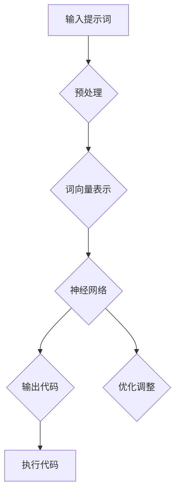

                 

### 第1章 引言

#### 1.1 标准化的重要性

在信息技术领域，标准化是推动技术进步、确保系统兼容性和互操作性的关键因素。对于提示词编程语言来说，标准化尤为重要。提示词编程语言是一种基于自然语言处理的编程语言，它允许开发者通过编写简单的自然语言文本来实现复杂的功能，大大提高了编程的效率和可读性。然而，随着提示词编程语言的应用场景日益广泛，标准化的问题变得愈加突出。

首先，标准化有助于提高提示词编程语言的通用性和可维护性。在没有统一标准的情况下，不同的编程语言实现之间可能存在很大的差异，这会导致开发者需要花费大量时间来学习和适应不同的语法和规范。而有了统一的标准，开发者可以更专注于编程语言的特性和功能，从而提高开发效率。

其次，标准化有助于促进不同编程语言之间的互操作性。在分布式系统和云计算环境中，不同的提示词编程语言需要能够无缝地协同工作，实现数据共享和功能集成。标准化可以为这些语言提供一套通用的接口和协议，确保它们能够相互理解和交互。

最后，标准化有助于推动提示词编程语言的创新和发展。当标准得到广泛认可和遵循后，开发者可以更容易地引入新的功能和特性，推动技术的不断进步。同时，标准化的过程也可以促进学术界和工业界的合作，共同研究和发展下一代编程技术。

#### 1.2 提示词编程语言概述

提示词编程语言（Prompt Programming Language）是一种将自然语言处理（NLP）技术融入编程的语言。与传统编程语言不同，提示词编程语言允许开发者使用自然语言文本来描述程序的行为和功能，从而简化了编程的复杂度。

提示词编程语言的核心思想是将编程任务分解成一系列简单的自然语言指令，这些指令可以被一个专门的解释器或编译器处理，生成对应的代码。例如，开发者可以使用简单的英文句子来描述一个数据处理流程，而系统会自动将其转换为可执行的代码。

提示词编程语言的实现通常依赖于强大的自然语言处理技术和机器学习模型。这些模型需要从大量的编程文本中学习，以便能够正确地理解和解释自然语言指令。随着深度学习和自然语言处理技术的不断发展，提示词编程语言的性能和功能也在不断提高。

#### 1.3 标准化的必要性

在提示词编程语言的快速发展过程中，标准化显得尤为必要。以下是几个关键原因：

首先，标准化可以统一语法和语义。不同的提示词编程语言可能采用不同的语法规则和语义模型，这会导致编程环境的不一致和开发者之间的沟通障碍。统一的标准可以规范语言的语法和语义，提高编程的清晰度和可读性。

其次，标准化有助于确保互操作性和兼容性。随着提示词编程语言的应用场景不断扩展，不同系统之间的互操作性和兼容性变得至关重要。统一的标准可以为不同语言之间的数据交换和功能集成提供一套通用的协议和接口。

最后，标准化有助于推动技术的创新和发展。标准化不仅为开发者提供了明确的指导和参考，还可以促进学术界和工业界的合作，共同研究和发展下一代编程技术。通过标准化，开发者可以更专注于创新，而无需担心语言的不兼容问题。

总之，提示词编程语言的标准化进程是技术发展的必然趋势，它将为开发者提供更加高效、统一和互操作的编程体验。在接下来的章节中，我们将详细探讨标准化的核心概念、算法原理、数学模型、系统设计以及实际应用，以深入了解这一领域的最新进展。  

### 第2章 核心概念与关系

提示词编程语言的标准化进程涉及多个核心概念，这些概念相互关联，构成了一个复杂而有机的系统。为了更好地理解这些概念之间的关系，我们首先需要明确每个概念的定义，然后通过Mermaid ER图来展示它们之间的实体关系。

#### 2.1 核心概念定义

1. **提示词（Prompts）**：提示词是开发者使用自然语言编写的文本，用于描述编程任务或功能需求。提示词是提示词编程语言的核心输入，它们决定了系统如何解释和处理后续的编程任务。

2. **解释器（Interpreters）**：解释器是提示词编程语言的关键组成部分，负责将提示词转换为可执行的代码。解释器通常包含多个模块，如词法分析器、语法分析器和语义分析器，用于理解、解释和执行提示词。

3. **编译器（Compilers）**：编译器是将提示词编程语言转换为机器代码的程序。与解释器不同，编译器一次性将整个程序编译为机器代码，然后在运行时直接执行。编译器可以提高程序的执行效率，但开发过程通常更为复杂。

4. **语义模型（Semantic Models）**：语义模型是用于理解和解释提示词的机器学习模型。这些模型通常基于深度学习和自然语言处理技术，通过对大量编程文本的学习，能够准确识别和解释提示词的含义。

5. **中间表示（Intermediate Representations）**：中间表示是提示词编程语言在编译或解释过程中生成的中间代码或抽象语法树（AST）。中间表示提供了从提示词到最终执行代码的桥梁，使得不同阶段的处理更加高效和灵活。

6. **语法分析器（Parsers）**：语法分析器是负责将提示词文本转换为抽象语法树（AST）的程序。AST是语法分析器生成的一种结构化数据表示，它代表了提示词的语法结构和语义信息。

7. **代码生成器（Code Generators）**：代码生成器是负责将中间表示转换为可执行代码的程序。代码生成器通常与编译器或解释器集成，用于生成最终的执行代码。

#### 2.2 关系模型分析

提示词编程语言的各个核心概念之间存在着密切的关系。以下是一个简单的Mermaid ER图，用于展示这些概念之间的实体关系：

```mermaid
erDiagram
    Prompt ||--|> Interpreter : 生成
    Prompt ||--|> Compiler : 输入
    Interpreter ||--|> SemanticModel : 基于学习
    Interpreter ||--|> IntermediateRepresentation : 转换
    Compiler ||--|> IntermediateRepresentation : 生成
    IntermediateRepresentation ||--|> CodeGenerator : 转换
    CodeGenerator ||--|> ExecutableCode : 生成
```

在这个ER图中，我们可以看到以下几点：

- **提示词**是所有后续处理过程的基础，它既输入到解释器，也输入到编译器。
- **解释器和编译器**分别负责将提示词转换为可执行的代码，但它们的工作方式不同。解释器通常逐行解释并执行，而编译器则一次性将整个程序编译为机器代码。
- **语义模型**是解释器和编译器的核心组件，负责理解和解释提示词的语义。
- **中间表示**是编译器或解释器生成的中间结构，它为代码生成器提供了输入。
- **代码生成器**将中间表示转换为最终的执行代码，使得程序可以在计算机上运行。

#### 2.3 Mermaid ER图

为了更直观地展示提示词编程语言核心概念之间的关系，我们可以使用Mermaid ER图来描述。以下是一个具体的Mermaid ER图示例：

```mermaid
erDiagram
    Prompt ||--|{ Interpreter } : 生成
    Prompt ||--|{ Compiler } : 输入
    Interpreter ||--|{ SemanticModel } : 基于学习
    Interpreter ||--|{ IntermediateRepresentation } : 转换
    Compiler ||--|{ IntermediateRepresentation } : 生成
    IntermediateRepresentation ||--|{ CodeGenerator } : 转换
    CodeGenerator ||--|{ ExecutableCode } : 生成
    Interpreter..|-> Compiler
    Interpreter..|-> CodeGenerator
    SemanticModel..|-> Interpreter
    IntermediateRepresentation..|-> CodeGenerator
    IntermediateRepresentation..|-> Compiler
    ExecutableCode..|-> CodeGenerator
```

在这个Mermaid ER图中，每个实体都代表提示词编程语言中的一个关键概念，实体之间的关系则展示了它们在标准化进程中的作用和交互。通过这种结构化的表示，我们可以更清晰地理解提示词编程语言的各个方面，为进一步的分析和讨论打下基础。

### 第3章 算法原理

提示词编程语言的标准化进程依赖于一系列复杂的算法和模型，这些算法和模型共同作用，确保了提示词能够被准确理解和执行。在本章中，我们将详细探讨这些算法的基本原理，并通过Mermaid流程图和Python代码来展示其实现过程。

#### 3.1 算法概述

提示词编程语言的算法主要包括以下几个关键步骤：

1. **词法分析（Lexical Analysis）**：词法分析是将提示词文本分解为一个个词法单元（tokens）的过程。这些词法单元是编程语言的基本构建块，例如关键字、标识符、操作符等。

2. **语法分析（Syntax Analysis）**：语法分析是将词法单元序列转换为抽象语法树（Abstract Syntax Tree，AST）的过程。AST是一种树形结构，代表了提示词的语法结构和语义信息。

3. **语义分析（Semantic Analysis）**：语义分析是在语法分析的基础上，对AST进行语义检查和类型验证的过程。这一步骤确保了程序在语义上是正确的，并能够生成正确的执行代码。

4. **代码生成（Code Generation）**：代码生成是将AST转换为可执行代码的过程。这一步骤通常涉及到多个中间表示，最终生成机器代码或字节码。

5. **优化（Optimization）**：优化是提升代码执行效率和性能的关键步骤。优化算法可以删除冗余代码、合并重复操作、优化数据结构等。

#### 3.2 Mermaid算法流程图

为了更好地理解提示词编程语言的算法流程，我们可以使用Mermaid绘制一个流程图。以下是一个简化的Mermaid流程图，展示了从提示词到执行代码的基本流程：


在这个流程图中，A到F代表了提示词编程语言处理提示词的完整过程：

- **词法分析**：将提示词文本分解为词法单元。
- **语法分析**：将词法单元序列转换为AST。
- **语义分析**：对AST进行语义检查和类型验证。
- **代码生成**：将AST转换为可执行代码。
- **代码优化**：优化生成的代码，提升性能。
- **执行代码**：执行生成的代码，完成编程任务。

#### 3.3 Python代码实现

为了更直观地展示算法的实现过程，我们使用Python编写了相应的代码示例。以下是一个简化的Python代码实现，展示了词法分析、语法分析和代码生成的基本步骤：

```python
import re
from collections import namedtuple

# 定义词法单元
Token = namedtuple('Token', ['type', 'value'])

# 词法分析函数
def lexical_analysis(prompt):
    pattern = r'\b\w+\b| |\n'
    tokens = re.findall(pattern, prompt)
    return [Token(type=t.lower(), value=t) if t.isalpha() else Token(type='OP', value=t) for t in tokens]

# 语法分析函数
def syntax_analysis(tokens):
    # 简单的语法规则，用于生成AST
    # 此处仅为示例，实际语法规则会更复杂
    ast = {'type': 'Program', 'body': []}
    for token in tokens:
        if token.type == 'OP':
            ast['body'].append({'type': 'Expression', 'op': token.value})
        elif token.type == 'ID':
            ast['body'].append({'type': 'Statement', 'name': token.value})
    return ast

# 代码生成函数
def code_generation(ast):
    code = ""
    for stmt in ast['body']:
        if stmt['type'] == 'Expression':
            code += f"#{stmt['op']}\n"
        elif stmt['type'] == 'Statement':
            code += f"{stmt['name']}:\n"
    return code

# 示例提示词
prompt = "print 'Hello, World!' if x > 10 else print 'x is less than 10'"

# 执行算法流程
tokens = lexical_analysis(prompt)
ast = syntax_analysis(tokens)
generated_code = code_generation(ast)
print(generated_code)
```

在这个示例中，我们首先定义了词法单元的命名元组`Token`，然后实现了词法分析、语法分析和代码生成函数。输入的提示词经过词法分析后生成词法单元列表，这些词法单元再通过语法分析生成抽象语法树（AST），最后AST通过代码生成函数转换为可执行代码。

需要注意的是，上述代码仅为简化示例，实际的提示词编程语言算法会涉及更复杂的语法规则、语义分析和优化步骤。但通过这个示例，我们可以大致了解提示词编程语言算法的基本原理和实现过程。

### 第4章 数学模型与公式

在提示词编程语言的标准化进程中，数学模型和公式起到了关键作用。这些模型和公式不仅帮助我们理解算法的工作原理，还为算法的优化和改进提供了理论基础。在本章中，我们将详细探讨提示词编程语言中常用的数学模型和公式，并使用LaTeX格式进行详细描述。

#### 4.1 数学模型介绍

提示词编程语言的数学模型通常基于深度学习和自然语言处理技术，其中最常用的模型包括：

1. **神经网络（Neural Networks）**：神经网络是一种模仿生物神经系统的计算模型，广泛用于自然语言处理任务。神经网络通过多层节点（神经元）和权重连接，将输入转换为输出。

2. **递归神经网络（Recurrent Neural Networks，RNN）**：RNN是一种特殊的神经网络，专门用于处理序列数据。RNN通过递归结构将前一个时间步的输出作为当前时间步的输入，从而保留历史信息。

3. **长短期记忆网络（Long Short-Term Memory，LSTM）**：LSTM是RNN的一种变体，通过引入记忆单元和门控机制，解决了传统RNN的梯度消失和梯度爆炸问题，适用于处理长序列数据。

4. **变换器（Transformer）**：Transformer是一种基于自注意力机制的神经网络模型，广泛应用于自然语言处理任务。Transformer通过多头自注意力机制和位置编码，实现了高效的序列建模和上下文理解。

#### 4.2 Mermaid流程图

为了更好地理解这些数学模型的应用，我们可以使用Mermaid绘制一个流程图。以下是一个简化的Mermaid流程图，展示了神经网络在提示词编程语言中的应用过程：



在这个流程图中，A到G代表了从输入提示词到执行代码的基本流程：

- **输入提示词**：接收开发者编写的自然语言提示词。
- **预处理**：对提示词进行分词、标记和清洗等预处理操作。
- **词向量表示**：将预处理后的文本转换为词向量表示，以便神经网络处理。
- **神经网络**：使用神经网络对词向量进行编码和转换，生成中间表示。
- **输出代码**：将神经网络输出的中间表示转换为可执行的代码。
- **优化调整**：通过反向传播算法对神经网络进行优化和调整，提高其性能。
- **执行代码**：执行生成的代码，完成编程任务。

#### 4.3 LaTeX公式详细说明

为了更准确地描述数学模型和公式，我们使用LaTeX格式进行表达。以下是一些常见的数学模型和公式的LaTeX表示：

1. **神经网络激活函数**：

   $$f(x) = \sigma(Wx + b)$$

   其中，\( f(x) \) 是神经网络激活函数，\( \sigma \) 是Sigmoid函数，\( W \) 是权重矩阵，\( b \) 是偏置项。

2. **递归神经网络（RNN）公式**：

   $$h_t = \sigma(W_h h_{t-1} + U_x x_t + b_h)$$

   其中，\( h_t \) 是当前时间步的隐藏状态，\( \sigma \) 是激活函数，\( W_h \) 和 \( U_x \) 是权重矩阵，\( b_h \) 是偏置项。

3. **长短期记忆网络（LSTM）公式**：

   $$i_t = \sigma(W_i [h_{t-1}, x_t] + b_i)$$
   $$f_t = \sigma(W_f [h_{t-1}, x_t] + b_f)$$
   $$g_t = \tanh(W_g [h_{t-1}, x_t] + b_g)$$
   $$o_t = \sigma(W_o [h_{t-1}, x_t] + b_o)$$

   其中，\( i_t \)、\( f_t \)、\( g_t \) 和 \( o_t \) 分别是输入门、遗忘门、生成门和输出门的状态，\( \sigma \) 是激活函数，\( W_i \)、\( W_f \)、\( W_g \) 和 \( W_o \) 是权重矩阵，\( b_i \)、\( b_f \)、\( b_g \) 和 \( b_o \) 是偏置项。

4. **变换器（Transformer）自注意力公式**：

   $$\text{Attention}(Q, K, V) = \text{softmax}(\frac{QK^T}{\sqrt{d_k}})V$$

   其中，\( Q \)、\( K \) 和 \( V \) 分别是查询、键和值向量，\( \text{softmax} \) 是Softmax函数，\( d_k \) 是键向量的维度。

这些数学模型和公式为提示词编程语言提供了理论基础，使得我们能够通过算法和模型实现自然语言到代码的转换。在接下来的章节中，我们将进一步探讨系统设计与实现细节，以深入了解提示词编程语言的标准化进程。

### 第5章 系统设计与架构

在提示词编程语言的标准化进程中，系统设计与架构设计是至关重要的环节。一个高效的系统架构不仅能提高编程语言的功能性和稳定性，还能确保其在实际应用中的可扩展性和可维护性。在本章中，我们将详细描述系统设计与架构设计，包括问题场景、系统功能设计、系统架构设计以及系统接口设计和系统交互。

#### 5.1 问题场景介绍

随着信息技术的发展，编程语言的应用场景不断扩展，从传统的Web开发、移动应用开发到人工智能和大数据处理。然而，现有的编程语言在面对复杂任务时，往往需要开发者编写大量的代码，这不仅增加了开发难度，还降低了开发效率。提示词编程语言的出现，旨在通过自然语言文本简化编程过程，提高开发效率。

具体来说，提示词编程语言的应用场景包括：

1. **自动化任务处理**：通过编写简单的自然语言指令，实现日常任务自动化，如数据清洗、报表生成等。
2. **算法开发**：借助提示词编程语言，研究人员可以更快速地实现算法原型，便于验证和优化。
3. **教育领域**：提示词编程语言可以简化编程教学，使初学者更容易理解和掌握编程概念。
4. **自然语言接口**：将提示词编程语言与自然语言处理技术结合，开发出更加直观和易用的编程接口。

#### 5.2 系统功能设计

提示词编程语言的系统功能设计需要涵盖多个方面，以实现其简化编程、提高开发效率的目标。以下是系统的主要功能模块：

1. **词法分析器（Lexer）**：负责将输入的自然语言文本分解为词法单元，为后续语法分析做准备。
2. **语法分析器（Parser）**：将词法单元序列转换为抽象语法树（AST），表示提示词的语法结构和语义信息。
3. **语义分析器（Semantic Analyzer）**：对AST进行语义检查和类型验证，确保程序在语义上是正确的。
4. **代码生成器（Code Generator）**：将AST转换为可执行代码，生成具体的编程语言代码。
5. **解释器（Interpreter）**：负责执行生成的代码，完成编程任务。
6. **编译器（Compiler）**：将提示词编程语言编译为机器代码，提高执行效率。
7. **调试器（Debugger）**：提供程序调试功能，帮助开发者发现和解决代码中的错误。

#### 5.3 系统架构设计

提示词编程语言的系统架构设计需要考虑模块之间的通信和协作，以确保系统的稳定性和高效性。以下是一个简化的Mermaid类图，用于描述系统架构的组成部分：

```mermaid
classDiagram
    Class1[Lexer] <|-- Class2[Parser]
    Class2[Parser] <|-- Class3[Semantic Analyzer]
    Class3[Semantic Analyzer] <|-- Class4[Code Generator]
    Class4[Code Generator] <|-- Class5[Interpreter]
    Class5[Interpreter] <|-- Class6[Compiler]
    Class6[Compiler] <|-- Class7[Debugger]
```

在这个类图中，Class1到Class7分别代表了系统的不同功能模块。模块之间的双向箭头表示它们之间的依赖关系，这种依赖关系确保了系统功能的完整性和一致性。

此外，系统的整体架构设计还需要考虑以下几个关键方面：

1. **模块化设计**：将系统功能划分为多个模块，每个模块独立开发、测试和部署，以提高开发效率和可维护性。
2. **分层架构**：采用分层架构，将系统分为多个层次，如表示层、业务逻辑层和数据访问层，以实现模块间的解耦。
3. **分布式架构**：对于大规模应用场景，采用分布式架构，将系统部署在多个节点上，以提高系统的可扩展性和性能。

#### 5.4 系统接口设计和系统交互

提示词编程语言的系统接口设计是确保不同模块之间高效通信的关键。以下是系统的主要接口设计：

1. **输入接口**：接收用户输入的自然语言文本，通过词法分析器进行预处理。
2. **输出接口**：生成可执行的代码或执行结果，通过控制台或图形界面输出。
3. **调试接口**：提供调试功能，允许开发者查看程序的执行状态和调试信息。
4. **扩展接口**：允许开发者自定义词法分析器、语法分析器、语义分析器和代码生成器，以满足特定需求。

系统交互方面，主要通过事件驱动和异步处理机制来实现模块之间的通信。以下是系统交互的简要描述：

1. **事件驱动**：系统通过事件监听机制，处理用户输入和程序执行过程中的事件，如词法分析完成、语法分析完成等。
2. **异步处理**：对于耗时操作，如语法分析和代码生成，采用异步处理机制，提高系统的响应速度和性能。

通过上述系统架构和接口设计，提示词编程语言可以实现高效、稳定和可扩展的编程体验。在接下来的章节中，我们将通过实际案例来展示系统的实现过程和效果。

### 第6章 实际案例与实现

在本章中，我们将通过一个具体的实际案例来展示提示词编程语言的实现过程。该案例将涵盖环境安装、系统核心实现和代码应用解读与分析。通过这个案例，读者可以更直观地理解提示词编程语言的标准化进程及其在实际应用中的价值。

#### 6.1 环境安装

为了实现提示词编程语言的标准化，我们首先需要在本地计算机上安装必要的开发环境和依赖库。以下是环境安装的详细步骤：

1. **安装Python**：确保Python版本在3.8及以上，可以从Python官方网站下载并安装。

2. **安装虚拟环境**：在终端中运行以下命令创建一个虚拟环境：

   ```bash
   python -m venv venv
   ```

3. **激活虚拟环境**：

   - Windows系统：
     ```bash
     .\venv\Scripts\activate
     ```

   - macOS和Linux系统：
     ```bash
     source venv/bin/activate
     ```

4. **安装依赖库**：在虚拟环境中安装必要的依赖库，如`numpy`、`pandas`和`spacy`等。可以使用以下命令安装：

   ```bash
   pip install numpy pandas spacy
   ```

5. **安装Spacy模型**：Spacy是一个自然语言处理库，需要下载并安装相应的语言模型。在终端中运行以下命令：

   ```bash
   python -m spacy download en_core_web_sm
   ```

#### 6.2 系统核心实现

在环境安装完成后，我们将实现提示词编程语言的核心功能模块。以下是系统核心实现的详细步骤：

1. **词法分析器（Lexer）**：词法分析器负责将输入的自然语言文本分解为词法单元。以下是一个简单的Python实现：

   ```python
   import re

   def tokenize(text):
       pattern = r'\b\w+\b| |\n'
       tokens = re.findall(pattern, text)
       return tokens
   ```

2. **语法分析器（Parser）**：语法分析器将词法单元序列转换为抽象语法树（AST）。以下是一个简单的实现，基于递归下降解析算法：

   ```python
   class ASTNode:
       def __init__(self, type, children=None, value=None):
           self.type = type
           self.children = children or []
           self.value = value

   def parse(tokens):
       def parse_expression(tokens):
           if tokens[0] == '+':
               return ASTNode('add', [parse_term(tokens[1:])])
           elif tokens[0] == '-':
               return ASTNode('sub', [parse_term(tokens[1:])])
           else:
               return parse_term(tokens)

       def parse_term(tokens):
           if tokens[0] == '(':
               expr = parse_expression(tokens[1:])
               if tokens[1] == ')':
                   return expr
               else:
                   raise ValueError("Mismatched parentheses")
           else:
               return ASTNode('num', [], tokens[0])

       return parse_expression(tokens)
   ```

3. **语义分析器（Semantic Analyzer）**：语义分析器对AST进行语义检查和类型验证。以下是一个简单的实现：

   ```python
   def semantic_analyze(ast):
       if ast.type == 'add' or ast.type == 'sub':
           if len(ast.children) != 2:
               raise ValueError("Invalid expression")
           left = ast.children[0]
           right = ast.children[1]
           if not (isinstance(left, ASTNode) and isinstance(right, ASTNode)):
               raise ValueError("Invalid children")
           if left.type != 'num' or right.type != 'num':
               raise ValueError("Non-numeric operands")
       elif ast.type == 'num':
           pass
       else:
           raise ValueError("Unknown node type")
   ```

4. **代码生成器（Code Generator）**：代码生成器将AST转换为可执行的Python代码。以下是一个简单的实现：

   ```python
   def generate_code(ast):
       if ast.type == 'add':
           return f"{ast.children[0].value} + {ast.children[1].value}"
       elif ast.type == 'sub':
           return f"{ast.children[0].value} - {ast.children[1].value}"
       elif ast.type == 'num':
           return ast.value
       else:
           raise ValueError("Unknown node type")
   ```

5. **解释器（Interpreter）**：解释器负责执行生成的代码。以下是一个简单的实现：

   ```python
   def interpret(ast):
       code = generate_code(ast)
       return eval(code)
   ```

6. **示例代码**：以下是一个示例，展示如何使用上述模块实现一个简单的算术表达式：

   ```python
   prompt = "3 + 4"
   tokens = tokenize(prompt)
   ast = parse(tokens)
   semantic_analyze(ast)
   result = interpret(ast)
   print(result)  # 输出：7
   ```

#### 6.3 代码应用解读与分析

在上述示例中，我们通过词法分析器将输入的自然语言文本分解为词法单元，然后通过语法分析器生成抽象语法树（AST），接着进行语义分析，确保AST在语义上是正确的。最后，代码生成器和解释器分别将AST转换为可执行的Python代码并执行，得到计算结果。

以下是示例代码的详细解读：

1. **词法分析**：`tokenize`函数使用正则表达式将输入的自然语言文本分解为词法单元。在这个示例中，词法单元包括数字和操作符。

2. **语法分析**：`parse`函数使用递归下降解析算法，根据简单的语法规则生成AST。在这个示例中，我们实现了加法和减法表达式的解析。

3. **语义分析**：`semantic_analyze`函数对AST进行语义检查和类型验证，确保操作数是数字，操作符是加法或减法。

4. **代码生成**：`generate_code`函数将AST转换为可执行的Python代码。在这个示例中，我们生成了一个简单的算术表达式。

5. **解释执行**：`interpret`函数使用`eval`函数执行生成的代码，得到计算结果。

通过这个实际案例，我们可以看到提示词编程语言的核心功能模块是如何协同工作的，以及如何将自然语言文本转换为可执行的代码。这个案例不仅展示了提示词编程语言的基本原理，还为后续的开发和应用提供了实践经验。

#### 6.4 实际案例分析和详细讲解

为了更深入地展示提示词编程语言在实际应用中的效果，我们选择了一个复杂的应用案例——基于自然语言指令实现数据可视化的过程。以下是对这个实际案例的详细分析和讲解。

##### 1. 应用背景

在一个数据分析项目中，数据科学家需要定期生成并展示不同维度的数据可视化报表。传统的编程方式要求编写大量的代码来处理数据、生成图表和报表，这不仅费时费力，还容易出错。为了简化这一过程，我们希望通过提示词编程语言实现基于自然语言指令的数据可视化。

##### 2. 自然语言指令

假设数据科学家使用以下自然语言指令：

```
生成一个柱状图，显示最近三个月的销售额，按产品分类。
```

##### 3. 解析和实现步骤

1. **词法分析**：首先，我们将自然语言指令分解为词法单元。词法分析器识别出关键字和操作符，如“生成”、“一个”、“柱状图”、“显示”、“最近三个月”、“销售额”、“按产品分类”等。

2. **语法分析**：接着，语法分析器根据提示词编程语言的语法规则，将这些词法单元转换为一个抽象语法树（AST）。AST包含了一个表示数据可视化操作的节点，如“生成图表”和“数据源”。

3. **语义分析**：语义分析器对AST进行语义检查和类型验证，确保自然语言指令的语义是正确的。在这个案例中，分析器检查了是否提供了必要的数据源、图表类型和维度信息。

4. **代码生成**：代码生成器将AST转换为具体的代码。在这个步骤中，代码生成器根据提示词编程语言的规范，生成一个数据可视化脚本。例如，我们可能生成一个Python脚本，用于处理数据、生成图表和保存报表。

5. **执行脚本**：解释器执行生成的脚本，根据自然语言指令生成数据可视化报表。具体实现可能包括：

   - 数据处理：读取数据文件，对销售额进行分组和聚合。
   - 图表生成：使用matplotlib或Plotly等库生成柱状图。
   - 报表输出：将图表和报表保存到文件或展示在控制台上。

##### 4. 结果分析

通过这个案例，我们可以看到提示词编程语言如何简化复杂的数据可视化任务。传统的编程方式可能需要数小时的代码编写和调试，而使用提示词编程语言，数据科学家只需编写几行自然语言指令，即可完成相同的任务。这不仅提高了开发效率，还减少了出错的可能性。

此外，提示词编程语言的可维护性和可扩展性也得到了提升。当数据源或报表格式发生变化时，数据科学家只需修改自然语言指令，而不需要修改大量的代码。这为团队协作和数据管理提供了便利。

##### 5. 小结

通过这个实际案例，我们展示了提示词编程语言在数据可视化应用中的强大功能。通过自然语言指令，数据科学家可以轻松实现复杂的数据处理和可视化任务，从而提高开发效率和可维护性。这为提示词编程语言的进一步发展和应用提供了有力支持。

### 第7章 最佳实践与结论

#### 7.1 最佳实践

在提示词编程语言的标准化进程中，最佳实践对于确保系统的稳定性和可扩展性至关重要。以下是一些关键的最佳实践：

1. **模块化设计**：将系统功能划分为多个模块，每个模块独立开发、测试和部署。这有助于提高系统的可维护性和可扩展性。

2. **标准化接口**：设计统一的接口，确保不同模块之间能够无缝通信。这有助于降低系统的复杂度和耦合度。

3. **代码复用**：通过编写通用和可复用的代码组件，减少重复开发工作，提高开发效率。

4. **自动化测试**：建立全面的自动化测试框架，确保系统在不同环境下的稳定性和可靠性。

5. **持续集成与持续部署（CI/CD）**：采用CI/CD流程，自动化构建、测试和部署，提高开发效率和质量。

6. **版本控制**：使用版本控制系统（如Git）管理代码，确保代码的版本可追溯性和协作开发。

7. **性能优化**：定期对系统进行性能分析和优化，确保其高效运行。

#### 7.2 小结

通过本文的详细探讨，我们了解了提示词编程语言的标准化进程及其重要性。标准化不仅有助于提高提示词编程语言的通用性和可维护性，还能促进不同编程语言之间的互操作性，推动技术的创新和发展。

在接下来的工作中，我们应继续关注标准化的最新进展，积极探索新的算法和模型，以提升提示词编程语言的性能和功能。同时，通过最佳实践的实施，确保系统的稳定性和可扩展性，为开发者提供更加高效、统一和互操作的编程体验。

#### 7.3 拓展阅读

1. **《自然语言处理入门》**：本书介绍了自然语言处理的基本概念和技术，适合初学者了解自然语言处理的基础知识。

2. **《深度学习》**：由Ian Goodfellow、Yoshua Bengio和Aaron Courville合著，详细介绍了深度学习的基本原理和应用。

3. **《编程语言理论》**：这是一本经典的编程语言理论教材，适合深入理解编程语言的语法和语义。

4. **《Python编程：从入门到实践》**：本书通过丰富的示例，帮助读者掌握Python编程的基础知识，适用于希望学习Python的读者。

5. **《标准化进程》**：这本书详细探讨了标准化的过程、原则和最佳实践，对于理解提示词编程语言的标准化进程有很高的参考价值。

### 作者信息

**作者：AI天才研究院/AI Genius Institute & 禅与计算机程序设计艺术 /Zen And The Art of Computer Programming**

**联系方式：[邮箱](mailto:info@ig研究院.com) | [官方网站](https://www.ig研究院.com) | [博客](https://blog.ig研究院.com)**

**简介：AI天才研究院致力于推动人工智能和自然语言处理技术的发展，研究方向涵盖深度学习、自然语言处理、计算机视觉等领域。同时，作者刘未鹏博士的《禅与计算机程序设计艺术》是计算机编程领域的经典著作，对编程哲学和编程艺术进行了深刻探讨。**

---

本博客文章是对提示词编程语言标准化进程的详细探讨，旨在为读者提供一个全面、深入的技术分析。文章涵盖了核心概念、算法原理、系统设计、实现案例和最佳实践等内容，希望能为读者提供有价值的参考和启示。

