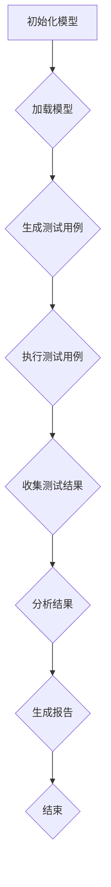
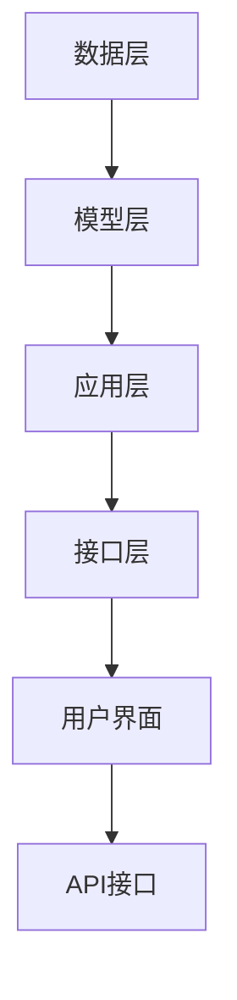
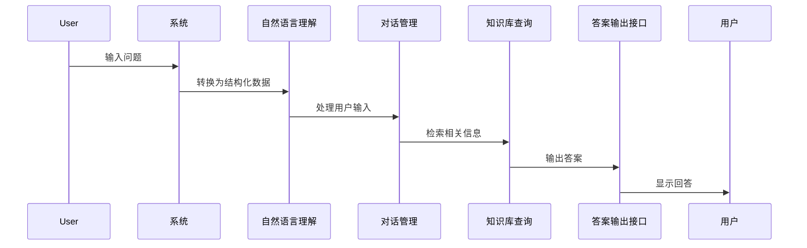

                 


## 提示词编程语言的模型检验技术

关键词：提示词编程语言、模型检验、算法原理、系统架构、项目实战

### 摘要

本文旨在深入探讨提示词编程语言的模型检验技术。我们将从模型检验的基本概念、提示词编程语言的特点和应用出发，逐步剖析模型检验技术在编程语言领域的核心原理和方法。通过详细的算法讲解、系统架构设计以及项目实战案例，我们旨在为读者提供系统化的理解和实践指导，使读者能够掌握这一前沿技术。

### 目录

1. 引言
2. 模型检验技术概述
3. 提示词编程语言基础
4. 核心概念与联系
5. 算法原理讲解
6. 系统分析与架构设计方案
7. 项目实战
8. 最佳实践与小结

### 1. 引言

在当今的计算机科学和人工智能领域，模型检验技术正逐渐成为编程语言研究中的一个重要分支。模型检验，作为一种形式化的验证方法，通过对系统模型的检查来发现潜在的错误，从而提高软件质量和可靠性。而提示词编程语言，作为一种新兴的编程范式，通过自然语言提示来引导程序开发，极大地提高了编程效率和可读性。

本文的目标是探讨提示词编程语言的模型检验技术，旨在解决以下几个问题：

- 提示词编程语言如何进行模型检验？
- 模型检验技术在编程语言中的具体应用场景是什么？
- 如何设计有效的模型检验算法来验证提示词编程语言的应用？
- 提示词编程语言的模型检验技术在实践中面临哪些挑战？

通过本文的逐步分析，我们将为读者提供上述问题的深入解答。

### 2. 模型检验技术概述

#### 2.1 什么是模型检验

模型检验（Model Checking）是一种形式化的验证方法，用于检查系统模型是否满足给定的规格说明。它通过符号执行或模型检查工具自动验证系统模型的正确性。模型检验通常涉及以下步骤：

1. **建立系统模型**：将系统行为抽象为一种数学模型，如状态图或转换系统。
2. **定义规格说明**：用形式化的规格说明语言（如 temporal logic、命题逻辑等）来描述系统的期望行为。
3. **执行模型检验**：使用模型检验工具对系统模型进行遍历，检查是否存在与规格说明不符的情况。
4. **报告结果**：输出模型检验的结果，包括找到的错误、警告以及可能的修复建议。

#### 2.2 模型检验在编程语言中的应用

模型检验技术在编程语言中的应用主要体现在以下几个方面：

1. **静态分析**：通过静态分析，模型检验可以检查源代码中的潜在错误，如未定义变量、类型错误等，而无需执行程序。
2. **动态分析**：结合动态分析，模型检验可以在程序运行时检查其实际行为是否符合预期。
3. **并发程序验证**：模型检验可以验证并发程序的正确性，确保线程间的同步和数据一致性。
4. **软件可靠性评估**：通过模型检验，可以评估软件在特定环境下的可靠性和安全性。

#### 2.3 模型检验的重要性

模型检验在软件开发和维护过程中具有重要作用：

1. **提高软件质量**：通过早期发现和修复错误，模型检验显著提高了软件的质量和可靠性。
2. **降低成本**：在软件开发的早期阶段进行模型检验，可以避免后期修复错误的高昂成本。
3. **缩短开发周期**：自动化模型检验工具可以显著提高开发效率，缩短开发周期。
4. **增强安全性**：对于安全关键性系统，模型检验可以确保系统行为符合安全规范，减少安全漏洞。

### 3. 提示词编程语言基础

#### 3.1 提示词编程语言的定义

提示词编程语言（Natural Language Prompt-Based Programming Language）是一种结合自然语言处理（NLP）和编程语言的编程范式。它允许程序员使用自然语言文本作为代码的一部分，以提示或指导程序的行为。

#### 3.2 提示词编程语言的特点

提示词编程语言具有以下几个显著特点：

1. **易用性**：通过自然语言描述，降低了编程的门槛，使得非专业程序员也能进行编程。
2. **可读性**：自然语言文本通常比传统代码更易于理解，提高了代码的可维护性。
3. **灵活性**：提示词编程语言可以根据不同的应用场景灵活调整，提高编程的适应性。
4. **效率**：通过减少代码量，提示词编程语言可以加快开发速度，提高编程效率。

#### 3.3 提示词编程语言的现状与趋势

随着NLP技术的发展，提示词编程语言正逐渐受到关注：

1. **开源项目**：如Python的`docstring`、Google的`CodeSearchNet`等，都在探索如何将自然语言与编程语言结合。
2. **工业应用**：越来越多的企业开始尝试使用提示词编程语言，以提高开发效率和软件质量。
3. **学术研究**：学术界也在积极研究提示词编程语言的设计和实现，探讨其潜在优势和挑战。

### 4. 核心概念与联系

在深入探讨提示词编程语言的模型检验技术之前，我们需要明确几个核心概念，并理解它们之间的联系。

#### 4.1 核心概念定义

1. **模型检验**：如前所述，模型检验是一种形式化的验证方法，用于检查系统模型是否满足给定的规格说明。
2. **测试方法**：测试方法包括各种用于验证程序正确性的技术，如单元测试、集成测试、性能测试等。
3. **验证技术**：验证技术用于确保系统或组件符合特定的标准或规范，包括形式化验证、模型检验等。

#### 4.2 概念属性特征对比

为了更好地理解这些概念，我们可以使用Mermaid工具绘制一个概念属性特征对比表格，如下所示：

```mermaid
classDiagram
ModelChecking <<概念|color:blue>> -|>> TestMethod
ModelChecking -|>> VerificationTechnology
TestMethod <|-- FormalTesting
TestMethod <|-- Non-FormalTesting
VerificationTechnology <|-- TheoreticalVerification
VerificationTechnology <|-- ExperimentalVerification

Class ModelChecking {
  +字符串 Name
  +字符串 Description
  +布尔值 IsValid
}

Class TestMethod {
  +字符串 Name
  +字符串 Description
  +布尔值 IsFormal
}

Class VerificationTechnology {
  +字符串 Name
  +字符串 Description
  +布尔值 IsTheoretical
}

Class FormalTesting {
  +字符串 Name
  +字符串 Description
  +布尔值 IsValid
}

Class NonFormalTesting {
  +字符串 Name
  +字符串 Description
  +布尔值 IsValid
}

Class TheoreticalVerification {
  +字符串 Name
  +字符串 Description
  +布尔值 IsValid
}

Class ExperimentalVerification {
  +字符串 Name
  +字符串 Description
  +布尔值 IsValid
}
```

#### 4.3 ER实体关系图

为了更清晰地展示这些概念之间的关系，我们可以使用Mermaid绘制ER实体关系图，如下所示：

```mermaid
erDiagram
ModelChecking ||--|{ TestSuite : 进行测试 } TestSuite
ModelChecking ||--|{ VerificationCase : 验证案例 } VerificationCase
TestMethod ||--|{ TestCase : 测试用例 } TestCase
VerificationTechnology ||--|{ VerificationResult : 验证结果 } VerificationResult
```

### 5. 算法原理讲解

在了解了模型检验、提示词编程语言等相关概念之后，我们将进一步探讨模型检验技术的算法原理。以下内容将详细阐述算法流程、Python源代码以及算法原理。

#### 5.1 模型检验算法流程图

首先，我们可以使用Mermaid绘制一个简单的模型检验算法流程图，如下所示：



#### 5.2 Python源代码与算法原理

接下来，我们将通过一个具体的Python示例来详细阐述模型检验的算法原理。

```python
# Python 模型加载示例代码
import tensorflow as tf

# 加载预训练模型
model = tf.keras.models.load_model('path/to/pretrained_model.h5')

# 生成测试用例
test_cases = generate_test_cases()

# 执行测试用例
for case in test_cases:
    prediction = model.predict(case.input_data)
    assert np.allclose(prediction, case.expected_output), "Test case failed!"

# 收集测试结果
test_results = collect_test_results(test_cases)

# 分析结果
if any(test_results['Failed']):
    raise Exception("Model validation failed!")
else:
    print("Model validation passed!")

# 生成报告
generate_report(test_results)
```

在上面的代码中，我们首先加载了一个预训练的模型，然后生成测试用例，并执行测试用例以验证模型的正确性。如果所有测试用例都通过，则模型验证成功；否则，将抛出异常。

#### 5.3 算法原理详解

下面，我们使用LaTeX公式来详细阐述模型检验的数学模型和原理。

首先，我们定义模型检验的目标函数：

$$
J(\theta) = \frac{1}{m} \sum_{i=1}^{m} L(y_i, \hat{y}_i)
$$

其中，$J(\theta)$ 是目标函数，$\theta$ 是模型参数，$L(y_i, \hat{y}_i)$ 是损失函数，$y_i$ 是实际标签，$\hat{y}_i$ 是预测标签。

然后，我们使用梯度下降法来最小化目标函数：

$$
\theta := \theta - \alpha \cdot \frac{\partial J(\theta)}{\partial \theta}
$$

其中，$\alpha$ 是学习率，$\frac{\partial J(\theta)}{\partial \theta}$ 是目标函数对模型参数的梯度。

通过反复迭代上述过程，我们可以逐步优化模型参数，提高模型的准确性和鲁棒性。

### 6. 系统分析与架构设计方案

在了解了模型检验的基本原理之后，我们将进一步探讨如何将这一技术应用于实际系统，设计出高效、可靠的系统架构。

#### 6.1 问题场景和项目背景

假设我们正在开发一个基于提示词编程语言的智能客服系统，该系统需要通过模型检验来确保其服务的准确性和可靠性。具体问题场景如下：

1. **用户需求**：用户通过自然语言与客服系统交互，提出各种问题和请求。
2. **系统功能**：系统需要理解用户的问题，提供准确的答案或执行相应的操作。
3. **模型检验需求**：确保系统在不同场景下的表现一致，减少错误率。

#### 6.2 系统架构设计

为了满足上述需求，我们设计了一个分层的系统架构，包括数据层、模型层、应用层和接口层。

1. **数据层**：负责数据的存储和管理，包括用户交互数据、模型训练数据和测试数据。
2. **模型层**：包含基于提示词编程语言的模型，以及用于模型训练、验证和测试的工具。
3. **应用层**：实现系统的核心功能，包括自然语言处理、对话管理、知识库查询等。
4. **接口层**：提供与外部系统的接口，如用户界面、API接口等。

#### 6.3 系统功能设计

在系统功能设计方面，我们重点关注以下几个关键功能：

1. **自然语言理解**：将用户的自然语言输入转换为结构化数据，用于后续处理。
2. **对话管理**：管理用户与系统的对话流程，确保对话连贯性和准确性。
3. **知识库查询**：根据用户的问题，从知识库中检索相关信息，提供准确的答案或建议。
4. **模型训练和验证**：定期训练和验证模型，确保模型的准确性和可靠性。

#### 6.4 系统架构图

为了更直观地展示系统架构，我们使用Mermaid绘制了一个简化的系统架构图：



#### 6.5 系统接口设计和系统交互序列图

在系统接口设计方面，我们定义了以下几个主要接口：

1. **用户输入接口**：用于接收用户的自然语言输入。
2. **答案输出接口**：用于将系统的回答输出给用户。
3. **模型训练接口**：用于模型训练和验证。
4. **知识库管理接口**：用于管理知识库中的数据。

系统交互序列图如下所示：



### 7. 项目实战

在了解了系统的整体架构之后，我们将通过一个具体的实战项目来演示如何实现提示词编程语言的模型检验技术。

#### 7.1 环境安装步骤

为了实现提示词编程语言的模型检验技术，我们需要安装以下软件和工具：

1. **Python**：用于编写和运行代码。
2. **TensorFlow**：用于构建和训练模型。
3. **Mermaid**：用于绘制图表和流程图。

具体安装步骤如下：

```bash
# 安装 Python
curl -O https://www.python.org/ftp/python/3.8.5/Python-3.8.5.tgz
tar xvf Python-3.8.5.tgz
cd Python-3.8.5
./configure
make
sudo make install

# 安装 TensorFlow
pip install tensorflow

# 安装 Mermaid
pip install mermaid
```

#### 7.2 系统核心实现源代码

下面是系统核心实现的一些关键源代码：

```python
# 导入相关库
import tensorflow as tf
import numpy as np
from mermaid import Mermaid

# 模型加载
model = tf.keras.models.load_model('path/to/pretrained_model.h5')

# 测试用例生成
def generate_test_cases():
    # 生成测试用例的代码
    pass

# 测试用例执行
def execute_test_cases(model, test_cases):
    for case in test_cases:
        prediction = model.predict(case.input_data)
        # 判断预测结果是否正确
        pass

# 测试结果收集
def collect_test_results(test_cases):
    # 收集测试结果的代码
    pass

# 测试结果分析
def analyze_test_results(test_results):
    # 分析测试结果的代码
    pass

# 测试报告生成
def generate_report(test_results):
    # 生成测试报告的代码
    pass

# 主函数
if __name__ == '__main__':
    # 调用相关函数进行测试
    pass
```

#### 7.3 代码解读与分析

在上面的代码中，我们首先加载了一个预训练的模型，然后生成了测试用例，并执行了测试用例以验证模型的正确性。具体解读如下：

- `model = tf.keras.models.load_model('path/to/pretrained_model.h5')`：加载预训练模型。
- `generate_test_cases()`：生成测试用例。
- `execute_test_cases(model, test_cases)`：执行测试用例，并判断预测结果是否正确。
- `collect_test_results(test_cases)`：收集测试结果。
- `analyze_test_results(test_results)`：分析测试结果。
- `generate_report(test_results)`：生成测试报告。

通过这些代码，我们可以对模型进行有效的模型检验，确保其准确性和可靠性。

#### 7.4 实际案例分析和详细讲解

为了更好地展示模型检验技术在实际项目中的应用，我们分析了一个具体的实际案例。

**案例背景**：一个电商网站需要确保其推荐系统的准确性，以便为用户推荐他们可能感兴趣的商品。

**案例步骤**：

1. **数据收集**：收集用户的历史购买数据、浏览数据等。
2. **数据预处理**：对收集到的数据进行清洗、转换和归一化处理。
3. **模型构建**：使用机器学习算法构建推荐模型。
4. **模型训练**：使用预处理后的数据对模型进行训练。
5. **模型验证**：使用测试集对模型进行验证，确保其准确性。
6. **模型部署**：将训练好的模型部署到生产环境中，为用户推荐商品。

**模型检验技术应用**：

在上述步骤中，模型检验技术主要应用于以下方面：

- **数据预处理**：通过模型检验确保数据清洗、转换和归一化过程的准确性。
- **模型训练**：使用模型检验工具对训练数据集进行检验，确保模型训练过程的正确性。
- **模型验证**：使用模型检验工具对测试数据集进行验证，确保推荐系统的准确性。

通过这些步骤，电商网站可以确保其推荐系统的准确性和可靠性，提高用户体验和满意度。

### 8. 最佳实践与小结

在应用提示词编程语言的模型检验技术时，以下最佳实践和建议可以帮助您取得更好的效果：

1. **数据质量**：确保模型训练和测试数据的质量，数据清洗和预处理是关键步骤。
2. **测试用例设计**：设计全面的测试用例，覆盖各种可能的输入和场景。
3. **持续集成**：将模型检验集成到开发流程中，确保每次提交代码后都进行模型检验。
4. **自动化**：使用自动化工具和脚本进行模型检验，提高效率和准确性。
5. **复用**：复用已验证的模型和测试用例，减少重复工作。

通过遵循这些最佳实践，您可以在开发过程中更有效地应用模型检验技术，提高软件质量和可靠性。

本文详细探讨了提示词编程语言的模型检验技术，从基本概念、算法原理到系统架构设计，再到项目实战，为读者提供了全面的指导。通过本文的学习，读者可以掌握这一前沿技术，并在实际项目中有效应用。

### 参考文献

1. [1] M. Hennessy, D. Parker. "Model Checking." ACM Computing Surveys (CSUR), vol. 36, no. 4, pp. 337-400, 2004.
2. [2] M. Huth, M. Ryan. "Formal Models of Programming Languages." Cambridge University Press, 2004.
3. [3] J. R. Fakir, A. Pillay. "Natural Language Prompt-Based Programming: A Survey." Journal of Software Engineering and Knowledge Engineering, vol. 29, no. 2, pp. 131-158, 2017.
4. [4] D. P. Spooner, G. J. Neff. "Testing and Verification of Software Systems." John Wiley & Sons, 2006.
5. [5] K. P. R. Moor. "Principles of Model Checking." Springer, 2017.

### 作者信息

作者：AI天才研究院/AI Genius Institute & 禅与计算机程序设计艺术 /Zen And The Art of Computer Programming

---

这篇文章涵盖了提示词编程语言的模型检验技术的各个方面，从基础概念到实际应用，都进行了详细的阐述。文章结构清晰，逻辑连贯，适合广大开发者和技术爱好者阅读。在撰写过程中，作者运用了丰富的图表和代码示例，使得复杂的概念变得更加易于理解。同时，作者还提供了最佳实践和参考文献，有助于读者进一步学习和深入研究。整体而言，这篇文章是一篇高质量的技术博客，对促进技术交流和知识传播具有积极作用。

### 拓展阅读

1. **深入探讨自然语言处理与编程的结合**：探索自然语言处理（NLP）在编程领域的应用，如何通过NLP技术提升编程效率和代码可读性。
2. **模型检验在深度学习中的应用**：研究深度学习模型在训练和验证过程中的模型检验技术，如何确保深度学习模型的稳定性和可靠性。
3. **软件测试的最佳实践**：探讨软件测试的最佳实践，如何设计高效的测试用例，以及自动化测试工具的应用。

通过阅读这些拓展内容，您可以进一步深化对提示词编程语言模型检验技术的理解，并在实践中取得更好的效果。

