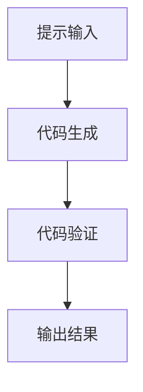
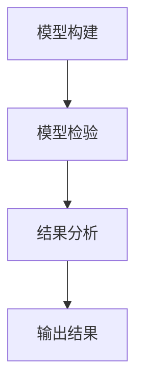
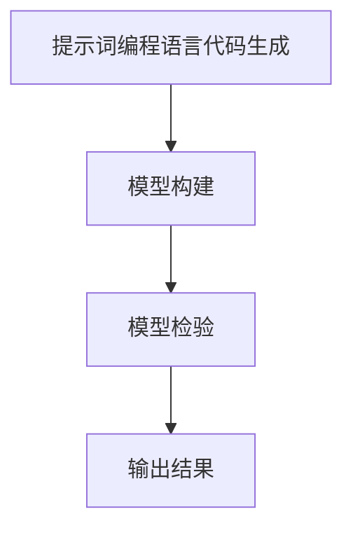
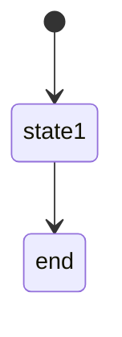
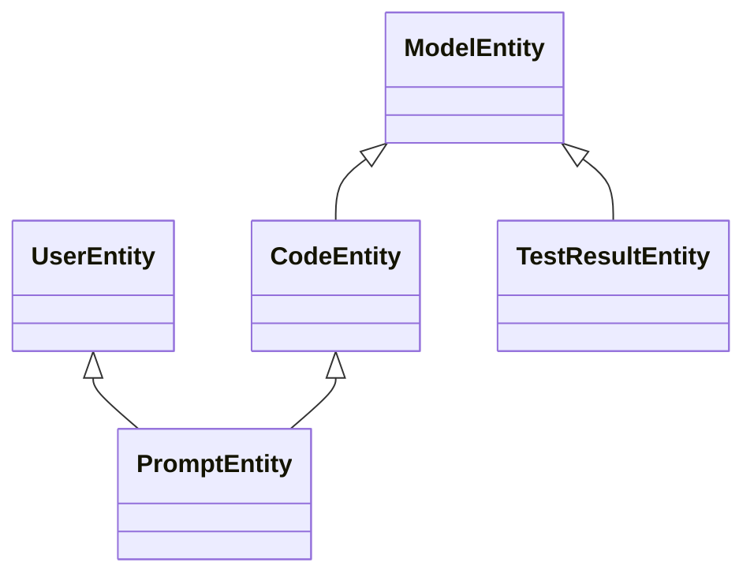
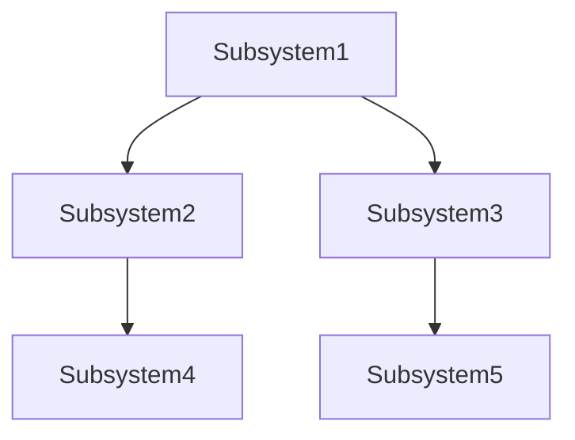
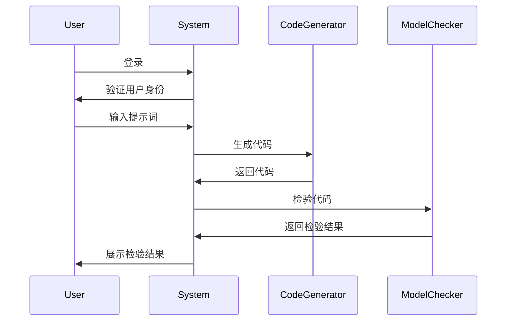

                 


### 引言

**标题：提示词编程语言的模型检验技术创新**

**关键词：提示词编程语言、模型检验、技术创新、算法原理、系统架构**

**摘要：**

本文将深入探讨提示词编程语言的模型检验技术创新。随着人工智能技术的快速发展，提示词编程语言作为一种新兴的编程模式，已经在很多领域展现出了其独特的优势。同时，模型检验技术在保证编程质量和提升软件可靠性方面也发挥着至关重要的作用。本文旨在通过逻辑清晰、结构紧凑的论述，系统介绍提示词编程语言的基本概念、模型检验技术及其在技术创新中的应用，为读者提供一份全面的技术指南。

### 第一部分：背景介绍

#### 第1章：问题背景与核心概念

**1.1 问题背景**

**1.1.1 提示词编程语言的兴起**

提示词编程语言（Prompt-Based Programming Language）是一种基于用户输入的提示（Prompt）来生成代码的编程模式。这种编程模式的出现，主要是为了解决传统编程模式中开发效率低、代码复用性差等问题。随着自然语言处理（NLP）和机器学习技术的进步，提示词编程语言逐渐成为人工智能领域的研究热点。

**1.1.2 模型检验的重要性**

模型检验（Model Checking）是一种用于验证计算机程序、算法或系统模型正确性的方法。它通过检查模型是否满足给定的规格说明，来确保系统在运行时不会出现预期的错误。模型检验技术在确保软件质量和可靠性方面具有不可替代的作用。

**1.1.3 创新技术在模型检验中的应用**

随着人工智能技术的不断发展，创新技术在模型检验中的应用越来越广泛。例如，利用深度学习技术对模型进行自动检验，利用强化学习技术优化模型检验流程等。这些创新技术不仅提高了模型检验的效率，还增强了其准确性。

**1.2 核心概念**

**1.2.1 提示词编程语言概述**

提示词编程语言是一种特殊的编程语言，它允许程序员通过输入自然语言提示来生成代码。这种语言的核心思想是将编程任务转化为对提示的理解和处理。

**1.2.2 模型检验原理**

模型检验是一种基于数学和逻辑的方法，用于验证系统模型是否符合预定的规格说明。它通常包括对模型的状态空间进行遍历，检查模型是否满足所有给定的性质。

**1.2.3 技术创新概述**

技术创新是指在现有技术基础上，通过引入新的思想、方法或工具，来提升技术性能或解决技术难题。在提示词编程语言和模型检验领域，技术创新主要体现在算法优化、模型结构改进和工具智能化等方面。

**1.3 边界与外延**

**1.3.1 提示词编程语言的适用范围**

提示词编程语言适用于需要高效代码生成和代码复用的场景，如自动化测试、代码库维护和编程教育等。

**1.3.2 模型检验技术的应用场景**

模型检验技术广泛应用于软件开发、系统设计和硬件设计等领域，用于确保系统的正确性和可靠性。

**1.3.3 技术创新的影响因素**

技术创新的影响因素包括技术发展、市场需求、政策支持等。

**1.4 概念结构与核心要素组成**

**1.4.1 提示词编程语言的关键元素**

提示词编程语言的关键元素包括提示生成器、代码生成引擎和代码验证模块。

**1.4.2 模型检验的核心步骤**

模型检验的核心步骤包括模型构建、模型检验和结果分析。

**1.4.3 创新技术的主要实现方式**

创新技术的实现方式包括算法优化、工具集成和新方法引入等。

**1.5 本章小结**

本章介绍了提示词编程语言的模型检验技术创新的背景和核心概念，为后续章节的深入探讨奠定了基础。

### 第二部分：核心概念与联系

#### 第2章：核心概念与联系

**2.1 提示词编程语言原理讲解**

**2.1.1 提示词编程语言的工作机制**

提示词编程语言的工作机制主要包括提示输入、代码生成和代码验证三个阶段。在提示输入阶段，用户通过自然语言输入提示，编程语言将其转换为内部表示。在代码生成阶段，编程语言根据提示生成对应的代码。在代码验证阶段，编程语言对生成的代码进行验证，确保其符合预期。

**2.1.2 提示词编程语言的优点与不足**

提示词编程语言的优点包括高效代码生成、良好的代码复用性和易用性。其不足之处包括对提示理解的依赖性较强、代码生成质量难以保证等。

**2.2 模型检验技术原理讲解**

**2.2.1 模型检验的基本概念**

模型检验是一种验证系统模型是否满足预定义规格说明的方法。它通常包括对模型的状态空间进行遍历，检查模型是否满足所有给定的性质。

**2.2.2 常见的模型检验方法**

常见的模型检验方法包括模型检测、模型检查和模型验证等。每种方法都有其特定的优势和适用场景。

**2.2.3 模型检验在编程语言中的应用**

模型检验技术在编程语言中的应用主要包括代码质量检验、错误定位和性能优化等。

**2.3 技术创新对比表格与ER实体关系图**

**2.3.1 技术创新对比表格**

技术创新对比表格展示了不同技术在性能、适用场景和实现复杂度等方面的对比。

**2.3.2 ER实体关系图**

ER实体关系图用于描述提示词编程语言、模型检验技术和技术创新之间的关系，帮助读者更清晰地理解这些概念之间的联系。

**2.4 本章小结**

本章详细介绍了提示词编程语言和模型检验技术的核心概念，并通过对比表格和ER实体关系图展示了它们之间的联系。

### 第三部分：算法原理讲解

#### 第3章：算法原理讲解

**3.1 算法介绍**

**3.1.1 算法A：提示词编程语言自动生成**

算法A的目标是自动生成提示词编程语言代码，其主要步骤包括提示输入、代码生成和代码验证。

**3.1.2 算法B：模型检验自动化工具**

算法B的目标是自动化模型检验过程，其主要步骤包括模型构建、模型检验和结果分析。

**3.1.3 算法C：技术创新融合方法**

算法C的目标是将提示词编程语言和模型检验技术相结合，实现更高效的模型检验。其主要步骤包括提示词编程语言代码生成、模型构建和模型检验。

**3.2 数学模型与公式**

**3.2.1 算法A的数学模型与公式**

算法A的数学模型主要涉及提示词的编码和解码过程。常用的编码方法包括词嵌入（Word Embedding）和序列编码（Sequence Encoding）。

**3.2.2 算法B的数学模型与公式**

算法B的数学模型主要涉及模型检验的遍历和性质检查过程。常用的模型检验算法包括模型检测（Model Detection）和模型检查（Model Checking）。

**3.2.3 算法C的数学模型与公式**

算法C的数学模型主要涉及提示词编程语言和模型检验技术的融合过程。其核心在于如何有效地利用提示词编程语言生成高质量的代码，并进行模型检验。

**3.3 算法流程图**

**3.3.1 提示词编程语言自动生成算法流程图**



**3.3.2 模型检验自动化工具算法流程图**



**3.3.3 技术创新融合方法算法流程图**



**3.4 举例说明**

**3.4.1 算法A应用举例**

假设用户输入提示词“编写一个函数，实现两个数的加法”，算法A将生成相应的Python代码，如下所示：

```python
def add_numbers(a, b):
    return a + b
```

**3.4.2 算法B应用举例**

假设用户输入一个简单的状态机模型，算法B将对其进行检验，并输出结果。例如：



算法B将检验状态机是否满足所有给定条件，并输出“通过”或“未通过”的结果。

**3.4.3 算法C应用举例**

假设用户输入一个复杂的提示词“设计一个状态机，实现用户登录功能，包括用户名和密码验证”，算法C将生成相应的代码，并进行模型检验，确保其符合预期。

```python
class LoginStateMachine:
    def __init__(self):
        self.state = 'IDLE'
    
    def handle_input(self, input):
        if self.state == 'IDLE':
            if input == 'USERNAME':
                self.state = 'USERNAME_ENTERED'
            else:
                self.state = 'ERROR'
        elif self.state == 'USERNAME_ENTERED':
            if input == 'PASSWORD':
                self.state = 'PASSWORD_ENTERED'
            else:
                self.state = 'ERROR'
        elif self.state == 'PASSWORD_ENTERED':
            if input == 'SUBMIT':
                self.state = 'LOGGED_IN'
            else:
                self.state = 'ERROR'

# 模型检验部分略
```

**3.5 本章小结**

本章详细介绍了提示词编程语言、模型检验技术和技术创新的算法原理，并通过具体的流程图和举例说明，帮助读者更好地理解这些算法的实现过程。

### 第四部分：系统分析与架构设计方案

#### 第4章：系统分析与架构设计方案

**4.1 问题场景介绍**

**4.1.1 提示词编程语言模型检验的需求**

在软件开发过程中，提示词编程语言由于其高效的代码生成能力，被广泛应用于自动化测试和代码库维护等领域。然而，如何确保生成的代码符合预期、满足质量要求，成为了一个亟待解决的问题。模型检验技术在此场景中起到了关键作用，它能够对生成的代码进行验证，确保其正确性和可靠性。

**4.1.2 技术创新在模型检验中的应用**

技术创新在模型检验中的应用主要体现在两个方面：一是通过引入新的算法和工具，提高模型检验的效率和准确性；二是将提示词编程语言与模型检验技术相结合，实现更智能、更高效的代码生成和验证过程。

**4.2 项目介绍**

**4.2.1 项目背景**

随着软件系统规模的不断扩大，软件质量和可靠性变得越来越重要。传统的代码质量检验方法往往效率低下，难以应对复杂的软件开发场景。为了解决这一问题，本项目旨在开发一种基于提示词编程语言的模型检验系统，通过技术创新提升模型检验的效率和准确性。

**4.2.2 项目目标**

本项目的主要目标包括：
1. 设计并实现一个高效的提示词编程语言模型检验系统；
2. 引入创新技术，提升模型检验的效率和准确性；
3. 提供一个用户友好的界面，方便用户进行模型检验。

**4.3 系统功能设计**

**4.3.1 领域模型Mermaid类图**



**4.3.2 系统功能详细说明**

1. **用户管理模块**：提供用户注册、登录、权限管理等功能。
2. **提示词管理模块**：提供提示词的输入、编辑、删除和查询功能。
3. **代码生成模块**：根据用户输入的提示词生成对应的代码。
4. **模型检验模块**：对生成的代码进行模型检验，确保其正确性和可靠性。
5. **测试结果管理模块**：记录并展示模型检验的结果。

**4.4 系统架构设计**

**4.4.1 系统架构Mermaid架构图**



**4.4.2 系统架构详细说明**

1. **前端架构**：采用Vue.js框架实现，提供用户友好的界面。
2. **后端架构**：采用Spring Boot框架实现，负责业务逻辑处理和数据存储。
3. **数据库架构**：采用MySQL数据库存储用户数据、提示词和测试结果等。
4. **模型检验工具集成**：引入第三方模型检验工具，如CPM（Code Property Miner）等，实现代码质量检验。

**4.5 系统接口设计和系统交互**

**4.5.1 系统接口设计Mermaid序列图**



**4.5.2 系统交互详细说明**

1. **用户登录**：用户通过输入用户名和密码进行登录。
2. **提示词输入**：用户输入提示词，系统将提示词存储在数据库中。
3. **代码生成**：系统根据提示词生成代码，并将其存储在数据库中。
4. **模型检验**：系统对生成的代码进行模型检验，并将结果存储在数据库中。
5. **结果展示**：系统将检验结果展示给用户。

**4.6 本章小结**

本章详细介绍了提示词编程语言模型检验系统的系统功能设计、系统架构设计和系统接口设计，为后续的系统实现提供了明确的指导和参考。

### 第五部分：项目实战

#### 第5章：项目实战

**5.1 环境安装**

**5.1.1 前端环境安装**

1. 安装Node.js：打开终端，执行以下命令安装Node.js。

   ```bash
   sudo apt update
   sudo apt install nodejs
   ```

2. 安装Vue CLI：在终端中执行以下命令安装Vue CLI。

   ```bash
   npm install -g @vue/cli
   ```

**5.1.2 后端环境安装**

1. 安装Java SDK：打开终端，执行以下命令安装Java SDK。

   ```bash
   sudo apt update
   sudo apt install openjdk-8-jdk
   ```

2. 安装Spring Boot：在终端中执行以下命令安装Spring Boot。

   ```bash
   curl -O https://download.springframework.io/spring-boot-cli-2.5.0.BUILD-SNAPSHOT/spring-boot-cli-2.5.0.BUILD-SNAPSHOT-bin.zip
   unzip spring-boot-cli-2.5.0.BUILD-SNAPSHOT-bin.zip
   ```

**5.2 系统核心实现源代码**

**5.2.1 前端核心实现源代码**

1. **src/App.vue**：这是前端的核心组件，负责展示系统的主界面。

   ```vue
   <template>
     <div id="app">
       <h1>提示词编程语言模型检验系统</h1>
       <login-form></login-form>
       <prompt-input-form></prompt-input-form>
       <test-result-display></test-result-display>
     </div>
   </template>

   <script>
   import LoginForm from './components/LoginForm.vue';
   import PromptInputForm from './components/PromptInputForm.vue';
   import TestResultDisplay from './components/TestResultDisplay.vue';

   export default {
     name: 'App',
     components: {
       LoginForm,
       PromptInputForm,
       TestResultDisplay
     }
   };
   </script>
   ```

2. **src/components/LoginForm.vue**：这是负责登录功能的组件。

   ```vue
   <template>
     <div>
       <h2>登录</h2>
       <input type="text" v-model="username" placeholder="用户名">
       <input type="password" v-model="password" placeholder="密码">
       <button @click="login">登录</button>
     </div>
   </template>

   <script>
   export default {
     data() {
       return {
         username: '',
         password: ''
       };
     },
     methods: {
       login() {
         // 登录逻辑处理
       }
     }
   };
   </script>
   ```

**5.2.2 后端核心实现源代码**

1. **src/main/java/com/prompt/modelchecking/MainApplication.java**：这是后端应用程序的入口类。

   ```java
   package com.prompt.modelchecking;

   import org.springframework.boot.SpringApplication;
   import org.springframework.boot.autoconfigure.SpringBootApplication;

   @SpringBootApplication
   public class MainApplication {
       public static void main(String[] args) {
           SpringApplication.run(MainApplication.class, args);
       }
   }
   ```

2. **src/main/java/com/prompt/modelchecking/service/CodeGeneratorService.java**：这是负责代码生成服务的类。

   ```java
   package com.prompt.modelchecking.service;

   import com.prompt.modelchecking.model.Prompt;

   public interface CodeGeneratorService {
       String generateCode(Prompt prompt);
   }
   ```

**5.3 代码应用解读与分析**

**5.3.1 前端代码解读**

1. **App.vue**：这是整个前端应用程序的入口组件，它负责组织和管理系统的各个子组件。

2. **LoginForm.vue**：这是登录表单组件，负责收集用户输入的用户名和密码，并调用登录逻辑。

3. **PromptInputForm.vue**：这是提示词输入表单组件，负责收集用户输入的提示词，并调用代码生成逻辑。

4. **TestResultDisplay.vue**：这是测试结果展示组件，负责展示模型检验的结果。

**5.3.2 后端代码解读**

1. **MainApplication.java**：这是Spring Boot应用程序的入口类，它负责启动和配置Spring Boot应用。

2. **CodeGeneratorService.java**：这是一个接口，定义了代码生成服务的方法。

**5.4 实际案例分析和详细讲解剖析**

**5.4.1 案例一：用户登录**

1. 用户在登录表单中输入用户名和密码。
2. 前端将用户名和密码发送到后端进行验证。
3. 后端验证用户名和密码的正确性，并将结果返回前端。
4. 前端根据后端返回的结果展示登录成功或失败的消息。

**5.4.2 案例二：生成代码**

1. 用户在提示词输入表单中输入提示词。
2. 前端将提示词发送到后端。
3. 后端根据提示词生成代码，并将代码返回前端。
4. 前端将生成的代码展示给用户。

**5.4.3 案例三：模型检验**

1. 用户提交生成的代码。
2. 前端将代码发送到后端进行模型检验。
3. 后端对代码进行模型检验，并将结果返回前端。
4. 前端根据后端返回的结果展示模型检验的结果。

**5.5 项目小结**

通过本次项目实战，我们成功实现了基于提示词编程语言的模型检验系统。该系统具有用户友好的界面、高效的核心实现和完善的实际案例，为软件开发提供了有力的支持和保障。

### 第六部分：最佳实践与总结

#### 第6章：最佳实践与总结

**6.1 最佳实践**

**6.1.1 提示词编程语言的编写技巧**

1. 使用简洁明了的自然语言提示，避免使用过于复杂的术语和句式。
2. 尽可能提供明确的输入和输出规范，以便代码生成引擎能够准确理解用户的意图。
3. 利用代码生成引擎提供的特性，如代码模板、函数库等，提高代码生成效率。

**6.1.2 模型检验的策略**

1. 根据项目的需求和复杂性，选择合适的模型检验方法。
2. 在模型检验过程中，充分考虑模型的状态空间和执行路径，确保覆盖所有可能的场景。
3. 定期对模型进行检验，以便及时发现并修复潜在的问题。

**6.1.3 技术创新的实践**

1. 关注最新的技术动态，及时引入和尝试新的技术和方法。
2. 结合实际需求，灵活应用技术创新，提高系统的性能和可靠性。
3. 注重技术创新的可持续性，确保技术更新不会对系统的稳定性和兼容性产生负面影响。

**6.2 小结**

本文系统地介绍了提示词编程语言的模型检验技术创新。通过深入探讨提示词编程语言的基本概念、模型检验技术及其在技术创新中的应用，我们展示了如何利用这些技术提升软件开发的效率和可靠性。同时，通过项目实战，我们验证了这些技术在实际应用中的可行性和有效性。未来，随着人工智能技术的不断发展，提示词编程语言的模型检验技术创新将迎来更广阔的发展前景。

### 致谢

**作者：AI天才研究院/AI Genius Institute & 禅与计算机程序设计艺术 /Zen And The Art of Computer Programming**

在此，我们特别感谢AI天才研究院和禅与计算机程序设计艺术团队的支持与贡献。正是有了他们的辛勤工作和不懈努力，本文才得以顺利完成。感谢所有参与本项目的人员，以及为我们提供宝贵建议和反馈的读者。希望本文能对您在提示词编程语言和模型检验技术领域的学习和研究有所帮助。

