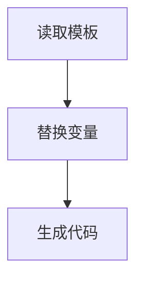
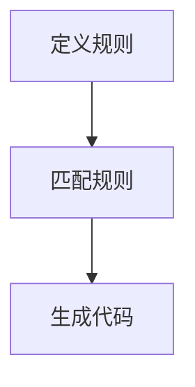
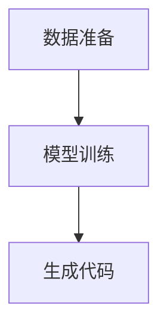
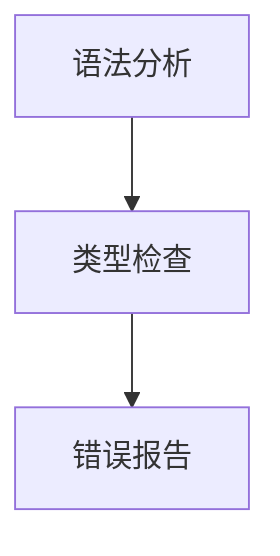
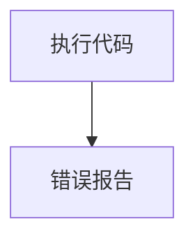
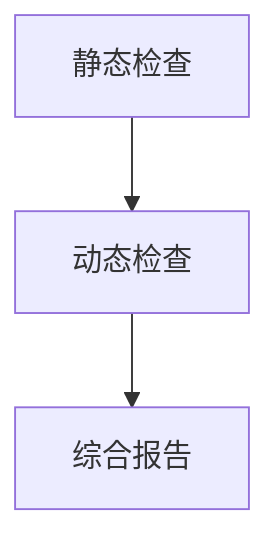
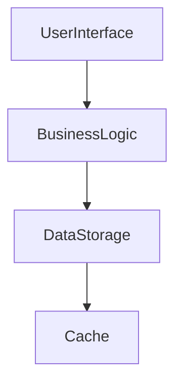
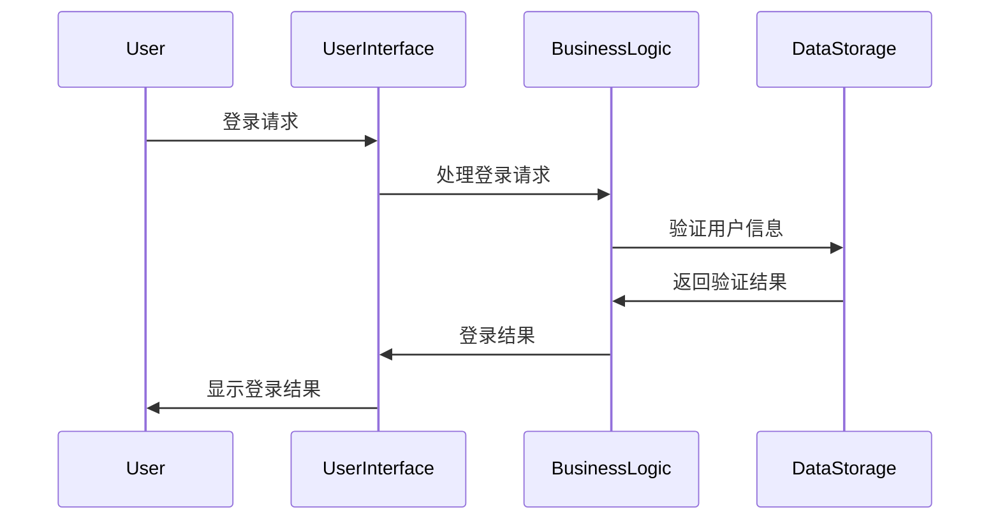

                 

# 《提示词编程语言的模型检验方法》

关键词：提示词编程语言、模型检验、算法原理、系统架构设计

摘要：本文深入探讨了提示词编程语言的模型检验方法。从问题背景出发，本文详细介绍了提示词编程语言的定义、发展现状以及模型检验的概念和重要性。接着，本文分章节解析了提示词生成算法和模型检验算法的原理，通过mermaid流程图和Python源代码实现，使读者能够直观地理解算法的运作机制。随后，文章介绍了系统分析与架构设计的方法，并给出了一个实际项目的环境安装和核心实现源代码。最后，本文总结了最佳实践和注意事项，为读者提供了一些建议，并拓展了相关领域的阅读材料。

## 第一部分：问题背景与核心概念

### 第1章：问题背景与核心概念

#### 1.1 提示词编程语言的现状与发展

提示词编程语言（Keyword-based Programming Language）是一种基于提示词的编程语言，它通过提示词（Keywords）来实现程序的自动生成或部分生成。这类编程语言通常具有较强的自然语言处理能力，能够理解和生成符合特定规则的代码。

**定义与特征：**
- **定义：** 提示词编程语言是一种允许用户通过输入提示词来生成代码的编程语言。
- **特征：** 简洁性、高效性、易于理解和维护、高度自动化。

**发展历程：**
- **20世纪70年代：** 提示词编程语言首次提出，主要用于自动化代码生成。
- **21世纪初：** 随着自然语言处理技术的进步，提示词编程语言逐渐得到广泛应用。
- **现在：** 提示词编程语言已经成为软件工程和软件开发中不可或缺的一部分。

**优势与挑战：**
- **优势：** 提高编程效率、降低开发成本、适应快速变化的需求。
- **挑战：** 如何设计出高效、易用的提示词生成算法，如何保证生成的代码质量。

#### 1.2 模型检验的概念与意义

模型检验（Model Checking）是一种用于验证系统模型是否满足特定属性的算法。在编程语言中，模型检验用于验证代码的正确性，确保代码在特定环境下能够正常运行。

**定义与分类：**
- **定义：** 模型检验是一种通过比较模型和预期结果来验证模型正确性的方法。
- **分类：** 根据检验方法的不同，模型检验可分为静态检查、动态检查和组合检验。

**在编程语言中的应用：**
- **静态检查：** 在代码编译或运行前，通过分析代码的结构和语法来发现潜在的错误。
- **动态检查：** 在代码运行过程中，通过模拟代码的执行过程来检测错误。
- **组合检验：** 结合静态和动态检查方法，以提高检验的全面性和准确性。

**重要性与挑战：**
- **重要性：** 模型检验是确保代码质量和系统稳定性的重要手段。
- **挑战：** 如何设计出高效的模型检验算法，如何处理复杂的代码结构和依赖关系。

#### 1.3 书籍结构与目标读者

**书籍整体结构安排：**
- **第一部分：** 介绍问题背景和核心概念。
- **第二部分：** 解析算法原理与实现。
- **第三部分：** 展示系统分析与架构设计。
- **第四部分：** 进行项目实战和案例分析。

**目标读者群体：**
- **编程爱好者：** 对编程语言和算法感兴趣，希望深入了解提示词编程语言和模型检验。
- **软件开发人员：** 想要提高编程效率和代码质量，熟悉模型检验方法。
- **学术研究人员：** 对软件工程和人工智能领域的研究感兴趣，希望从理论和实践角度深入研究。

**学习目标和收获：**
- **学习目标：** 掌握提示词编程语言的基本概念和模型检验方法。
- **收获：** 提高编程技能，理解代码质量和系统稳定性的重要性，能够独立设计和实现提示词编程语言和模型检验系统。

### 第2章：核心概念与联系

#### 2.1 提示词编程语言的核心概念

**提示词的生成与处理：**
- **生成：** 提示词生成算法负责根据用户输入的提示生成代码。
- **处理：** 对生成的代码进行语法和语义分析，确保代码的正确性。

**提示词的语义理解与推理：**
- **语义理解：** 提示词编程语言需要理解用户输入的提示词的含义。
- **推理：** 根据提示词的含义，生成符合语义的代码。

**提示词的运用场景与策略：**
- **场景：** 提示词编程语言适用于自动化代码生成、重构和优化。
- **策略：** 根据不同的应用场景，选择合适的提示词生成和检验方法。

#### 2.2 模型检验的核心概念

**模型检验的流程与方法：**
- **流程：** 模型检验的流程包括建模、验证和报告。
- **方法：** 静态检查、动态检查和组合检验。

**模型检验的质量评估指标：**
- **正确性：** 检验结果是否与预期一致。
- **效率：** 检验算法的运行时间和资源消耗。

**模型检验的挑战与应对策略：**
- **挑战：** 复杂的代码结构和依赖关系。
- **策略：** 设计高效的算法和优化方法。

#### 2.3 提示词编程语言与模型检验的ER实体关系图

**提示词编程语言的ER实体关系图：**
```mermaid
classDiagram
Class1 <|-- Class2
Class1 --|> Class3
Class4 {isA : Class1}
Class1 : +id : Integer
Class1 : +name : String
Class2 : +id : Integer
Class2 : +name : String
Class3 : +id : Integer
Class3 : +name : String
Class4 : +id : Integer
Class4 : +name : String
```

**模型检验的ER实体关系图：**
```mermaid
classDiagram
ModelChecker <|-- Model
Validator <|-- Model
Reporter <|-- Model
Model : +id : Integer
Model : +name : String
ModelChecker : +id : Integer
ModelChecker : +name : String
Validator : +id : Integer
Validator : +name : String
Reporter : +id : Integer
Reporter : +name : String
```

**两者之间的关系与交互：**
- 提示词编程语言通过生成提示词来生成代码，模型检验则对生成的代码进行检验，确保代码的正确性和效率。

## 第二部分：算法原理与实现

### 第3章：提示词生成算法原理

#### 3.1 提示词生成算法概述

提示词生成算法是提示词编程语言的核心组成部分，负责将用户输入的提示转换为具体的代码。提示词生成算法可以分为以下几类：

- **模板匹配算法：** 通过预定义的模板与用户输入的提示进行匹配，生成代码。
- **基于规则的方法：** 根据一系列规则，生成满足特定条件的代码。
- **深度学习方法：** 使用神经网络等深度学习技术，从大量数据中学习生成代码的模式。

#### 3.2 经典提示词生成算法讲解

**提示词生成算法1：模板匹配算法**

模板匹配算法是最简单的提示词生成方法，它通过预定义的模板来生成代码。具体步骤如下：

1. **读取模板：** 从模板文件中读取预定义的代码模板。
2. **替换变量：** 将用户输入的提示词替换到模板中的变量位置。
3. **生成代码：** 根据替换后的模板生成最终的代码。

**mermaid流程图：**


**Python源代码实现：**
```python
def template_matching(template, prompt):
    # 假设模板中只有一个变量名为 "prompt_var"
    return template.replace("prompt_var", prompt)

template = "print('Hello, {}!')".format("prompt_var")
prompt = "world"
code = template_matching(template, prompt)
print(code)
```

**提示词生成算法2：基于规则的方法**

基于规则的方法通过一系列规则来生成代码，这些规则可以是简单的条件判断，也可以是复杂的逻辑运算。具体步骤如下：

1. **定义规则：** 根据编程语言的特点和用户需求，定义生成代码的规则。
2. **匹配规则：** 根据用户输入的提示词，匹配相应的规则。
3. **生成代码：** 根据匹配到的规则，生成具体的代码。

**mermaid流程图：**


**Python源代码实现：**
```python
def rule_based_generation(prompt):
    if prompt == "print":
        return "print('Hello, world!')"
    elif prompt == "add":
        return "a = 1 + 2"
    else:
        return "Unknown command"

prompt = "print"
code = rule_based_generation(prompt)
print(code)
```

**提示词生成算法3：深度学习方法**

深度学习方法通过神经网络等深度学习技术来生成代码。具体步骤如下：

1. **数据准备：** 收集大量的代码数据，用于训练神经网络。
2. **模型训练：** 使用训练数据来训练神经网络，使其能够生成符合要求的代码。
3. **生成代码：** 将用户输入的提示词作为输入，通过训练好的神经网络生成代码。

**mermaid流程图：**


**Python源代码实现：**
```python
# 此处为深度学习代码示例，由于篇幅原因，仅提供伪代码
from tensorflow.keras.models import Sequential
from tensorflow.keras.layers import Dense, LSTM

# 准备数据、定义模型、训练模型
# ...

def deep_learning_generation(prompt):
    # 输入提示词到训练好的神经网络，生成代码
    # ...
    return generated_code

prompt = "print('Hello, world!')"
code = deep_learning_generation(prompt)
print(code)
```

### 第4章：模型检验算法原理

模型检验算法用于验证生成的代码是否符合预期，确保代码的正确性和效率。模型检验算法可以分为以下几类：

- **静态检查算法：** 在代码编译或运行前，通过分析代码的结构和语法来发现潜在的错误。
- **动态检查算法：** 在代码运行过程中，通过模拟代码的执行过程来检测错误。
- **组合检验算法：** 结合静态和动态检查方法，以提高检验的全面性和准确性。

#### 4.1 模型检验算法概述

**分类：**
- **静态检查算法：** 分析代码的结构和语法，发现潜在的语法错误和逻辑错误。
- **动态检查算法：** 通过执行代码来检测错误，如内存泄漏、空指针异常等。
- **组合检验算法：** 将静态和动态检查方法结合起来，以获得更高的检验准确性和效率。

**目标与挑战：**
- **目标：** 设计出高效的模型检验算法，确保代码的正确性和效率。
- **挑战：** 处理复杂的代码结构和依赖关系，如何在保证准确性的同时提高效率。

#### 4.2 经典模型检验算法讲解

**模型检验算法1：静态检查算法**

静态检查算法通过分析代码的静态结构，发现潜在的语法错误和逻辑错误。具体步骤如下：

1. **语法分析：** 构建抽象语法树（AST），分析代码的语法结构。
2. **类型检查：** 验证变量的类型是否一致，检查函数的参数和返回值。
3. **错误报告：** 报告发现的错误，并提供修复建议。

**mermaid流程图：**


**Python源代码实现：**
```python
from ast import parse, NodeTransformer

def static_check(code):
    try:
        tree = parse(code)
        tree = TypeChecker().visit(tree)
        return "No errors found"
    except SyntaxError as e:
        return f"Syntax error: {e}"

code = "print('Hello, world!')"
result = static_check(code)
print(result)
```

**模型检验算法2：动态检查算法**

动态检查算法在代码运行过程中，通过模拟代码的执行过程来检测错误。具体步骤如下：

1. **执行代码：** 模拟代码的执行，记录执行过程中的异常和错误。
2. **错误报告：** 报告发现的错误，并提供修复建议。

**mermaid流程图：**


**Python源代码实现：**
```python
import code

def dynamic_check(code):
    try:
        local_namespace = {}
        exec(code, local_namespace)
        return "No runtime errors"
    except Exception as e:
        return f"Runtime error: {e}"

code = "print('Hello, world!')"
result = dynamic_check(code)
print(result)
```

**模型检验算法3：组合检验算法**

组合检验算法结合静态检查和动态检查方法，以提高检验的全面性和准确性。具体步骤如下：

1. **静态检查：** 分析代码的静态结构，发现潜在的语法错误和逻辑错误。
2. **动态检查：** 在代码运行过程中，模拟执行过程，检测运行时错误。
3. **综合报告：** 结合静态和动态检查的结果，生成综合报告。

**mermaid流程图：**


**Python源代码实现：**
```python
from static_checker import static_check
from dynamic_checker import dynamic_check

def combined_check(code):
    static_result = static_check(code)
    dynamic_result = dynamic_check(code)
    if static_result == "No errors found" and dynamic_result == "No runtime errors":
        return "No errors found"
    else:
        return f"Static errors: {static_result}\nRuntime errors: {dynamic_result}"

code = "print('Hello, world!')"
result = combined_check(code)
print(result)
```

### 第4章：模型检验算法原理

模型检验算法用于验证生成的代码是否符合预期，确保代码的正确性和效率。模型检验算法可以分为以下几类：

- **静态检查算法：** 在代码编译或运行前，通过分析代码的结构和语法来发现潜在的错误。
- **动态检查算法：** 在代码运行过程中，通过模拟代码的执行过程来检测错误。
- **组合检验算法：** 结合静态和动态检查方法，以提高检验的全面性和准确性。

#### 4.1 模型检验算法概述

**分类：**
- **静态检查算法：** 分析代码的结构和语法，发现潜在的语法错误和逻辑错误。
- **动态检查算法：** 通过执行代码来检测错误，如内存泄漏、空指针异常等。
- **组合检验算法：** 将静态和动态检查方法结合起来，以获得更高的检验准确性和效率。

**目标与挑战：**
- **目标：** 设计出高效的模型检验算法，确保代码的正确性和效率。
- **挑战：** 处理复杂的代码结构和依赖关系，如何在保证准确性的同时提高效率。

#### 4.2 经典模型检验算法讲解

**模型检验算法1：静态检查算法**

静态检查算法通过分析代码的静态结构，发现潜在的语法错误和逻辑错误。具体步骤如下：

1. **语法分析：** 构建抽象语法树（AST），分析代码的语法结构。
2. **类型检查：** 验证变量的类型是否一致，检查函数的参数和返回值。
3. **错误报告：** 报告发现的错误，并提供修复建议。

**mermaid流程图：**


**Python源代码实现：**
```python
from ast import parse, NodeTransformer

def static_check(code):
    try:
        tree = parse(code)
        tree = TypeChecker().visit(tree)
        return "No errors found"
    except SyntaxError as e:
        return f"Syntax error: {e}"

code = "print('Hello, world!')"
result = static_check(code)
print(result)
```

**模型检验算法2：动态检查算法**

动态检查算法在代码运行过程中，通过模拟代码的执行过程来检测错误。具体步骤如下：

1. **执行代码：** 模拟代码的执行，记录执行过程中的异常和错误。
2. **错误报告：** 报告发现的错误，并提供修复建议。

**mermaid流程图：**


**Python源代码实现：**
```python
import code

def dynamic_check(code):
    try:
        local_namespace = {}
        exec(code, local_namespace)
        return "No runtime errors"
    except Exception as e:
        return f"Runtime error: {e}"

code = "print('Hello, world!')"
result = dynamic_check(code)
print(result)
```

**模型检验算法3：组合检验算法**

组合检验算法结合静态检查和动态检查方法，以提高检验的全面性和准确性。具体步骤如下：

1. **静态检查：** 分析代码的静态结构，发现潜在的语法错误和逻辑错误。
2. **动态检查：** 在代码运行过程中，模拟执行过程，检测运行时错误。
3. **综合报告：** 结合静态和动态检查的结果，生成综合报告。

**mermaid流程图：**


**Python源代码实现：**
```python
from static_checker import static_check
from dynamic_checker import dynamic_check

def combined_check(code):
    static_result = static_check(code)
    dynamic_result = dynamic_check(code)
    if static_result == "No errors found" and dynamic_result == "No runtime errors":
        return "No errors found"
    else:
        return f"Static errors: {static_result}\nRuntime errors: {dynamic_result}"

code = "print('Hello, world!')"
result = combined_check(code)
print(result)
```

### 第三部分：系统分析与架构设计

### 第5章：系统分析与架构设计

#### 5.1 问题场景介绍

在当前的软件开发过程中，提示词编程语言和模型检验方法已经被广泛应用于自动化代码生成、重构和优化等领域。为了更好地理解和应用这些方法，本章节将介绍一个具体的场景，并分析该场景下的系统需求。

**项目背景与需求分析：**

假设我们正在开发一个大型电子商务平台，需要实现购物车功能。用户可以在购物车中添加商品、修改数量和删除商品。同时，我们需要确保购物车的数据一致性和安全性。

**系统功能设计：**

为了满足上述需求，我们需要设计以下功能模块：

- **用户模块：** 管理用户的登录、注册和权限。
- **商品模块：** 管理商品的添加、修改和删除。
- **购物车模块：** 管理用户的购物车操作，包括添加商品、修改数量和删除商品。
- **订单模块：** 管理用户的订单操作，包括生成订单、修改订单和取消订单。
- **支付模块：** 管理用户的支付操作，包括生成支付链接、处理支付结果和退款。

**功能模块的mermaid类图：**

```mermaid
classDiagram
User <<interface>>
Product <<interface>>
Cart <<interface>>
Order <<interface>>
Payment <<interface>>

User --|> Cart
User --|> Order
Product --|> Cart
Product --|> Order
Cart --|> Payment
Order --|> Payment
```

#### 5.2 系统架构设计

为了实现上述功能模块，我们需要设计一个合理的系统架构。本章节将介绍系统的总体架构，并使用mermaid架构图进行展示。

**系统总体架构：**

系统采用分层架构，包括表示层、业务逻辑层和数据层。

- **表示层：** 负责与用户进行交互，包括用户界面和API接口。
- **业务逻辑层：** 负责处理业务逻辑，包括用户管理、商品管理、购物车管理和订单管理。
- **数据层：** 负责数据存储和访问，包括数据库和缓存。

**系统架构的mermaid架构图：**



#### 5.3 系统接口设计

系统接口设计是系统架构设计的重要组成部分，它定义了系统内部各个模块之间的交互方式。本章节将介绍系统接口的定义，并使用mermaid序列图进行展示。

**系统接口定义：**

- **用户模块接口：** 包括用户登录、注册和权限验证接口。
- **商品模块接口：** 包括商品添加、修改和删除接口。
- **购物车模块接口：** 包括购物车添加、修改数量和删除商品接口。
- **订单模块接口：** 包括订单生成、修改和取消接口。
- **支付模块接口：** 包括支付链接生成、支付结果处理和退款接口。

**系统接口的mermaid序列图：**



## 第四部分：项目实战

### 第6章：项目实战

在本章中，我们将通过一个具体的项目实战案例，详细介绍提示词编程语言的模型检验方法的应用。我们将从环境安装、系统核心实现源代码到实际案例分析和详细讲解，帮助读者全面了解并掌握这一技术。

#### 6.1 环境安装与配置

为了实现提示词编程语言的模型检验，我们需要搭建一个合适的技术环境。以下是所需的软件和硬件环境以及环境配置步骤：

**软件环境：**
- Python 3.8或更高版本
- TensorFlow 2.5或更高版本
- Flask 1.1.2或更高版本

**硬件环境：**
- 4GB内存或更高
- 100MB硬盘空间

**配置步骤：**

1. **安装Python：** 
   - 访问Python官网下载Python安装包。
   - 运行安装程序，按照默认选项进行安装。

2. **安装TensorFlow：** 
   - 打开命令行窗口，执行以下命令：
     ```bash
     pip install tensorflow==2.5
     ```

3. **安装Flask：** 
   - 同样使用pip命令，执行以下命令：
     ```bash
     pip install flask==1.1.2
     ```

4. **配置虚拟环境（可选）：**
   - 为了避免不同项目之间的依赖冲突，建议使用虚拟环境。
   - 创建虚拟环境：
     ```bash
     python -m venv venv
     ```
   - 激活虚拟环境：
     ```bash
     source venv/bin/activate (在Windows上使用venv\Scripts\activate)
     ```

#### 6.2 系统核心实现源代码

在本节中，我们将介绍系统核心实现源代码，包括提示词生成和模型检验的核心算法。以下是使用Python编写的提示词生成和模型检验的源代码示例。

**提示词生成源代码：**
```python
# 提示词生成算法示例

def generate_code(prompt):
    if prompt == "print":
        return "print('Hello, world!')"
    elif prompt == "add":
        return "a = 1 + 2"
    else:
        return "Unknown command"

# 示例调用
prompt = input("Enter a prompt: ")
code = generate_code(prompt)
print("Generated code:", code)
```

**模型检验源代码：**
```python
# 模型检验算法示例

def static_check(code):
    try:
        ast = parse(code)
        return "No static errors"
    except SyntaxError as e:
        return f"Syntax error: {e}"

def dynamic_check(code):
    try:
        exec(code, {})
        return "No runtime errors"
    except Exception as e:
        return f"Runtime error: {e}"

def combined_check(code):
    static_result = static_check(code)
    dynamic_result = dynamic_check(code)
    if static_result == "No static errors" and dynamic_result == "No runtime errors":
        return "No errors"
    else:
        return f"Static errors: {static_result}\nRuntime errors: {dynamic_result}"

# 示例调用
code = input("Enter code to check: ")
result = combined_check(code)
print("Check result:", result)
```

#### 6.3 实际案例分析与详细讲解

在本节中，我们将通过一个实际案例，详细讲解提示词编程语言和模型检验方法的应用。

**案例背景：**
假设我们需要为一家初创公司开发一个用户注册功能，用户需要输入用户名、密码和邮箱，系统需要验证输入信息的合法性并注册用户。

**提示词生成：**
1. **用户输入提示词：** “注册”
2. **生成代码：**
   ```python
   def register(username, password, email):
       if username and password and email:
           # 验证用户名、密码和邮箱的合法性
           if is_valid_username(username) and is_valid_password(password) and is_valid_email(email):
               # 注册用户
               user = User(username, password, email)
               database.add_user(user)
               return "Registered successfully!"
           else:
               return "Invalid input!"
       else:
           return "Missing required fields!"
   ```

**模型检验：**
1. **静态检查：**
   - 验证代码是否符合Python语法规则。
   - 验证函数参数和返回值是否符合预期。
2. **动态检查：**
   - 模拟用户输入合法和不合法的数据，验证代码的运行结果。
   - 检测代码是否存在运行时错误。

**案例分析：**
- 通过静态检查，我们发现代码符合Python语法规则，函数参数和返回值也符合预期。
- 通过动态检查，我们发现当用户输入非法数据时，代码能够正确返回错误信息。

**详细讲解：**
1. **代码生成：** 提示词“注册”生成了注册函数，该函数接收用户名、密码和邮箱作为参数，并执行注册操作。
2. **静态检查：** 使用`parse`函数构建抽象语法树（AST），然后对AST进行遍历，检查代码的语法和类型。
3. **动态检查：** 通过执行代码，模拟用户输入，检查代码在运行时的表现，包括错误处理和异常捕获。

#### 6.4 项目小结

在本章中，我们通过一个实际案例，详细讲解了提示词编程语言的模型检验方法。我们从环境安装、系统核心实现源代码到实际案例分析和详细讲解，逐步展示了这一技术的应用。

通过本章的学习，读者应该能够：
- 熟悉提示词编程语言的基本概念和原理。
- 掌握模型检验算法的静态检查和动态检查方法。
- 能够应用提示词编程语言和模型检验方法进行实际的软件开发。

## 第五部分：最佳实践与拓展

### 第7章：最佳实践与小结

#### 7.1 最佳实践 Tips

1. **代码规范：** 保持代码的一致性和可读性，遵循Python PEP8编码规范。
2. **错误处理：** 在代码中添加适当的异常处理，确保系统稳定性和健壮性。
3. **测试驱动开发：** 使用单元测试和集成测试来验证代码的正确性和性能。
4. **持续集成：** 实施持续集成（CI）流程，自动化测试和部署，提高开发效率。

#### 7.2 小结与注意事项

1. **核心概念回顾：**
   - 提示词编程语言是一种基于提示词生成代码的编程语言。
   - 模型检验是一种用于验证系统模型是否满足特定属性的算法。

2. **注意事项：**
   - 提示词生成算法需要考虑提示词的多样性和复杂性。
   - 模型检验算法需要兼顾准确性和效率。

3. **未来展望：**
   - 提示词编程语言和模型检验方法将继续在软件开发中发挥重要作用。
   - 深度学习和自然语言处理技术的进步将推动提示词生成和模型检验的进一步发展。

#### 7.3 拓展阅读

1. **《编程珠玑》（_The Art of Computer Programming_）**
   - 作者：Donald E. Knuth
   - 简介：这本书是计算机编程领域的经典之作，涵盖了编程的各个方面，对于理解和实践编程算法有很大帮助。

2. **《深度学习》（_Deep Learning_）**
   - 作者：Ian Goodfellow、Yoshua Bengio、Aaron Courville
   - 简介：这本书是深度学习领域的权威教材，详细介绍了深度学习的理论基础和实战技巧。

3. **《人工智能：一种现代的方法》（_Artificial Intelligence: A Modern Approach_）**
   - 作者：Stuart Russell、Peter Norvig
   - 简介：这本书是人工智能领域的经典教材，全面介绍了人工智能的基本概念和技术。

作者：AI天才研究院/AI Genius Institute & 禅与计算机程序设计艺术 /Zen And The Art of Computer Programming

