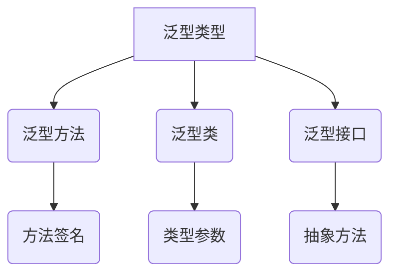
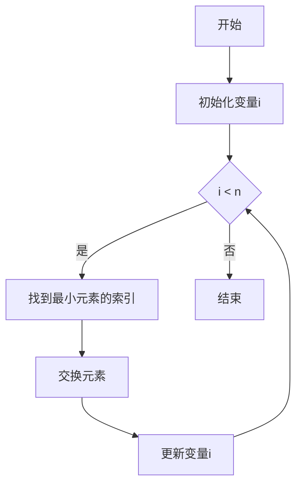
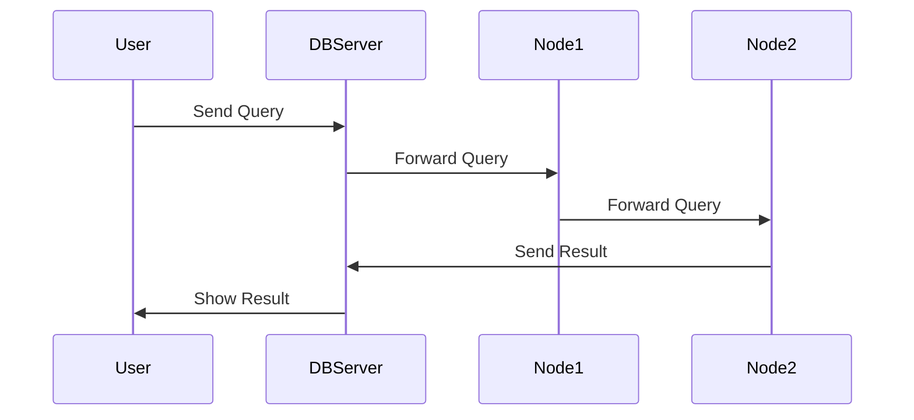

                 

### 文章标题

# 提示词编程语言的泛型编程支持

> 关键词：泛型编程，提示词编程，语言特性，算法，系统设计，最佳实践

> 摘要：本文将深入探讨提示词编程语言的泛型编程支持。首先，我们将介绍泛型编程语言的基本概念和核心特性，然后通过具体案例解析泛型编程的优势和实践方法。接下来，我们将分析泛型编程语言中的核心概念及其关系，介绍典型的泛型算法，并讲解其数学模型和公式。随后，我们将探讨如何在实际项目中运用泛型编程，并分享一些最佳实践。最后，文章将对全文内容进行总结，并提出一些注意事项和拓展阅读建议。

### 第一部分：背景介绍

#### 1.1 泛型编程语言概述

**1.1.1 泛型编程的定义与优势**

泛型编程是一种在编程语言中通过类型参数来提高代码复用性和灵活性的编程范式。通过泛型编程，我们可以编写可重用、可扩展的代码，而无需为每个具体类型重复编写代码。这种编程方法在提高开发效率的同时，也减少了代码冗余和维护成本。

**1.1.2 泛型编程的历史与发展**

泛型编程的概念最早由美国计算机科学家鲍勃·梅尔（Bob McElroy）在1970年代提出。随着编程语言的发展，诸如C++、Java、C#等语言相继引入了泛型编程的支持。近年来，随着函数式编程和编程语言的进化，泛型编程已经成为现代编程语言不可或缺的一部分。

**1.1.3 为什么需要泛型编程支持**

在传统的面向对象编程中，我们通常需要对每个类型都编写特定的代码。这不仅增加了开发成本，还降低了代码的可维护性和可扩展性。泛型编程通过引入类型参数，允许我们编写通用代码，从而提高了代码的复用性和灵活性。具体来说，泛型编程的优势包括：

1. **代码复用**：通过泛型编程，我们可以编写一次代码，适用于多种类型。
2. **类型安全**：泛型编程允许在编译时检查类型错误，从而提高程序的稳定性。
3. **减少代码冗余**：泛型编程有助于减少重复代码，简化代码结构。
4. **提高开发效率**：通过复用代码，开发人员可以更快地实现功能。

#### 1.2 泛型编程语言的核心概念

**1.2.1 泛型类型**

泛型类型是一种参数化类型，可以用于创建可重用的数据结构和算法。在泛型类型中，类型参数充当占位符，用于表示实际类型。例如，在Java中，`List<T>` 表示一个泛型列表，其中 `T` 是类型参数。

**1.2.2 泛型方法**

泛型方法是一种带有类型参数的方法。通过泛型方法，我们可以编写适用于多种类型的方法，而无需重复编写相同的方法。例如，在Java中，`public static <T> T max(T a, T b)` 是一个泛型方法，用于比较两个参数的大小。

**1.2.3 泛型类**

泛型类是一种包含类型参数的类。泛型类允许我们创建适用于多种类型的数据结构。例如，在Java中，`public class Pair<T, U>` 是一个泛型类，用于表示键值对。

**1.2.4 泛型接口**

泛型接口是一种包含类型参数的接口。泛型接口允许我们定义适用于多种类型的抽象方法。例如，在Java中，`public interface Comparable<T>` 是一个泛型接口，用于定义比较方法。

#### 1.3 泛型编程语言的关系图架构

为了更好地理解泛型编程语言的核心概念，我们可以使用ER实体关系图和Mermaid流程图来展示这些概念之间的关系。

**1.3.1 ER实体关系图**

ER实体关系图是一种用于描述实体之间关系的图形化工具。在泛型编程的ER实体关系图中，我们可以定义实体（如泛型类型、泛型方法、泛型类、泛型接口）及其属性（如类型参数、方法签名）。

**1.3.2 Mermaid流程图**

Mermaid流程图是一种用于创建流程图的Markdown扩展。在泛型编程的Mermaid流程图中，我们可以展示泛型编程的各个概念及其之间的关系。以下是一个示例：



这个流程图展示了泛型类型与泛型方法、泛型类、泛型接口之间的关系。每个概念都与其他相关概念通过关系线相连，从而形成一个完整的泛型编程概念体系。

### 第二部分：核心概念与联系

在本部分中，我们将详细介绍泛型编程语言中的核心概念，并通过属性特征对比表格和ER实体关系图架构的Mermaid流程图来展示这些概念之间的关系。

#### 2.1 泛型类型

泛型类型是泛型编程的基础，它允许我们创建可重用的数据结构和算法。以下是一个泛型类型的属性特征对比表格：

| 属性 | 泛型类型 |
| ---- | ---- |
| 参数化类型 | 是 |
| 可重用性 | 高 |
| 类型安全 | 是 |
| 示例 | `List<T>` |

**2.1.1 泛型类型的概念**

泛型类型是一种参数化类型，它使用类型参数来表示具体类型。在Java中，我们可以使用尖括号 `<>` 来定义泛型类型，例如 `List<T>` 表示一个泛型列表，其中 `T` 是类型参数。

**2.1.2 泛型类型的应用**

泛型类型在Java中的应用非常广泛，例如：

- **集合**：`List<T>`, `Set<T>`, `Map<K, V>` 等集合类都支持泛型类型。
- **泛型方法**：通过泛型类型，我们可以编写适用于多种类型的泛型方法，例如 `public static <T> T max(T a, T b)`。
- **泛型类**：泛型类使用类型参数来创建可重用的数据结构，例如 `Pair<T, U>`。

以下是一个泛型类型的示例代码：

```java
public class GenericClass<T> {
    private T value;

    public GenericClass(T value) {
        this.value = value;
    }

    public T getValue() {
        return value;
    }

    public void setValue(T value) {
        this.value = value;
    }
}

public static <T> void printArray(T[] array) {
    for (T element : array) {
        System.out.print(element + " ");
    }
    System.out.println();
}

public static void main(String[] args) {
    Integer[] intArray = {1, 2, 3, 4, 5};
    printArray(intArray);
    
    String[] stringArray = {"Hello", "World"};
    printArray(stringArray);
}
```

在这个示例中，`GenericClass<T>` 是一个泛型类，它使用类型参数 `T` 来表示具体的类型。`printArray` 方法是一个泛型方法，它接受一个类型参数 `T` 的数组，并打印数组中的所有元素。

#### 2.2 泛型方法

泛型方法是一种带有类型参数的方法。通过泛型方法，我们可以编写适用于多种类型的方法，而无需重复编写相同的方法。

**2.2.1 泛型方法的概念**

泛型方法使用类型参数来表示具体的类型。在Java中，我们可以使用尖括号 `<>` 来定义泛型方法，例如 `public static <T> T max(T a, T b)` 表示一个比较两个参数大小的泛型方法。

**2.2.2 泛型方法的应用**

泛型方法在Java中的应用非常广泛，例如：

- **排序**：使用泛型方法进行排序，例如 `public static <T extends Comparable<T>> T max(T a, T b)`。
- **查找**：使用泛型方法进行查找，例如 `public static <T> int find(T[] array, T value)`。
- **数据处理**：使用泛型方法处理数据，例如 `public static <T> void process(T[] array)`。

以下是一个泛型方法的示例代码：

```java
public static <T extends Comparable<T>> T max(T a, T b) {
    return a.compareTo(b) > 0 ? a : b;
}

public static <T> int find(T[] array, T value) {
    for (int i = 0; i < array.length; i++) {
        if (array[i].equals(value)) {
            return i;
        }
    }
    return -1;
}

public static void process(T[] array) {
    for (T element : array) {
        System.out.print(element + " ");
    }
    System.out.println();
}

public static void main(String[] args) {
    Integer[] intArray = {1, 2, 3, 4, 5};
    System.out.println("Max: " + max(intArray[0], intArray[4]));
    int index = find(intArray, 3);
    System.out.println("Index of 3: " + index);
    
    String[] stringArray = {"Hello", "World"};
    process(stringArray);
}
```

在这个示例中，`max` 方法是一个泛型方法，它接受两个类型参数 `T` 的参数，并返回较大的参数。`find` 方法也是一个泛型方法，它接受一个类型参数 `T` 的数组和一个值，并返回值在数组中的索引。`process` 方法用于打印数组中的所有元素。

#### 2.3 泛型类

泛型类是一种包含类型参数的类。通过泛型类，我们可以创建适用于多种类型的数据结构。

**2.3.1 泛型类的概念**

泛型类使用类型参数来创建可重用的数据结构。在Java中，我们可以使用尖括号 `<>` 来定义泛型类，例如 `public class Pair<T, U>` 表示一个键值对。

**2.3.2 泛型类的应用**

泛型类在Java中的应用非常广泛，例如：

- **数据结构**：使用泛型类创建适用于多种类型的数据结构，例如 `List<T>`, `Set<T>`, `Map<K, V>`。
- **工厂模式**：使用泛型类创建工厂模式，例如 `public class Factory<T>`。
- **泛型算法**：使用泛型类实现泛型算法，例如 `public class QuickSort<T extends Comparable<T>>`。

以下是一个泛型类的示例代码：

```java
public class Pair<T, U> {
    private T first;
    private U second;

    public Pair(T first, U second) {
        this.first = first;
        this.second = second;
    }

    public T getFirst() {
        return first;
    }

    public U getSecond() {
        return second;
    }
}

public class GenericFactory<T> {
    public T createObject() {
        // 创建具体类型的对象
        return null;
    }
}

public class QuickSort<T extends Comparable<T>> {
    public void sort(T[] array) {
        // 实现快速排序算法
    }
}

public static void main(String[] args) {
    Pair<Integer, String> pair = new Pair<>(42, "Hello");
    System.out.println("First: " + pair.getFirst());
    System.out.println("Second: " + pair.getSecond());
    
    GenericFactory<Pair<Integer, String>> factory = new GenericFactory<>();
    Pair<Integer, String> pairFromFactory = factory.createObject();
    if (pairFromFactory != null) {
        System.out.println("Factory Created Pair: " + pairFromFactory.getFirst() + ", " + pairFromFactory.getSecond());
    }
    
    Integer[] intArray = {3, 1, 4, 1, 5};
    QuickSort<Integer> quickSort = new QuickSort<>();
    quickSort.sort(intArray);
    System.out.println("Sorted Integers: ");
    for (int element : intArray) {
        System.out.print(element + " ");
    }
    System.out.println();
}
```

在这个示例中，`Pair<T, U>` 是一个泛型类，它表示一个键值对。`GenericFactory<T>` 是一个泛型工厂类，用于创建具体类型的对象。`QuickSort<T>` 是一个泛型类，用于实现快速排序算法。

#### 2.4 泛型接口

泛型接口是一种包含类型参数的接口。通过泛型接口，我们可以定义适用于多种类型的抽象方法。

**2.4.1 泛型接口的概念**

泛型接口使用类型参数来定义抽象方法。在Java中，我们可以使用尖括号 `<>` 来定义泛型接口，例如 `public interface Comparable<T>` 表示一个比较方法。

**2.4.2 泛型接口的应用**

泛型接口在Java中的应用非常广泛，例如：

- **排序**：使用泛型接口实现排序，例如 `public interface Comparable<T>`。
- **查找**：使用泛型接口实现查找，例如 `public interface Searcher<T>`。
- **数据处理**：使用泛型接口实现数据处理，例如 `public interface Processor<T>`。

以下是一个泛型接口的示例代码：

```java
public interface Comparable<T> {
    int compareTo(T other);
}

public interface Searcher<T> {
    int find(T[] array, T value);
}

public interface Processor<T> {
    void process(T[] array);
}

public class IntegerSearcher implements Searcher<Integer> {
    public int find(Integer[] array, Integer value) {
        for (int i = 0; i < array.length; i++) {
            if (array[i].equals(value)) {
                return i;
            }
        }
        return -1;
    }
}

public class IntegerProcessor implements Processor<Integer> {
    public void process(Integer[] array) {
        for (int element : array) {
            System.out.print(element + " ");
        }
        System.out.println();
    }
}

public static void main(String[] args) {
    Integer[] intArray = {1, 2, 3, 4, 5};
    IntegerSearcher searcher = new IntegerSearcher();
    int index = searcher.find(intArray, 3);
    System.out.println("Index of 3: " + index);
    
    IntegerProcessor processor = new IntegerProcessor();
    processor.process(intArray);
}
```

在这个示例中，`Comparable<T>` 是一个泛型接口，用于定义比较方法。`Searcher<T>` 是一个泛型接口，用于定义查找方法。`Processor<T>` 是一个泛型接口，用于定义处理方法。

#### 2.5 泛型编程语言的关系图架构

为了更好地理解泛型编程语言中的核心概念，我们可以使用ER实体关系图和Mermaid流程图来展示这些概念之间的关系。

**2.5.1 ER实体关系图**

在ER实体关系图中，我们可以定义泛型类型、泛型方法、泛型类、泛型接口及其属性。以下是一个简化的ER实体关系图：

```mermaid
erDiagram
    Class_GenericType ||--|{ Method_GenericMethod }
    Class_GenericType ||--|{ Class_GenericClass }
    Class_GenericType ||--|{ Interface_GenericInterface }
    Method_GenericMethod ||--|{ Attribute_Parameter }
    Class_GenericClass ||--|{ Attribute_TypeParameter }
    Interface_GenericInterface ||--|{ Attribute_AbstractMethod }
```

在这个ER实体关系图中，`Class_GenericType` 表示泛型类型，`Method_GenericMethod` 表示泛型方法，`Class_GenericClass` 表示泛型类，`Interface_GenericInterface` 表示泛型接口。`Attribute_Parameter` 表示泛型方法的参数，`Attribute_TypeParameter` 表示泛型类的类型参数，`Attribute_AbstractMethod` 表示泛型接口的抽象方法。

**2.5.2 Mermaid流程图**

在Mermaid流程图中，我们可以展示泛型编程的核心概念及其关系。以下是一个简化的Mermaid流程图：


在这个Mermaid流程图中，`A` 表示泛型类型，`B` 表示泛型方法，`C` 表示泛型类，`D` 表示泛型接口。`E` 表示泛型方法的签名，`F` 表示泛型类的类型参数，`G` 表示泛型接口的抽象方法。

### 第三部分：算法原理讲解

在本部分中，我们将选择一个典型的泛型编程语言中的算法进行讲解，并使用Mermaid画出算法的流程图，然后使用Python源代码详细阐述算法原理，包括数学模型和公式，进行详细讲解和举例说明。

#### 3.1 选择排序算法

选择排序是一种简单但有效的排序算法。它的基本思想是每次从未排序的部分选择最小（或最大）的元素，将其放到已排序部分的末尾。以下是选择排序算法的Python实现：

```python
def selection_sort(arr):
    n = len(arr)
    for i in range(n):
        min_index = i
        for j in range(i+1, n):
            if arr[j] < arr[min_index]:
                min_index = j
        arr[i], arr[min_index] = arr[min_index], arr[i]
    return arr
```

**3.1.1 选择排序算法的流程图**

以下是选择排序算法的Mermaid流程图：



**3.1.2 选择排序算法的数学模型**

选择排序算法的数学模型可以表示为：

$$
T(n) = \sum_{i=1}^{n} (n-i) \cdot C
$$

其中，$T(n)$ 表示算法的时间复杂度，$n$ 表示数组长度，$C$ 表示比较次数。

**3.1.3 选择排序算法的举例说明**

假设我们有一个未排序的数组 `[5, 2, 9, 1, 5]`，使用选择排序算法对其进行排序：

1. 第一次遍历：找到最小元素 `1`，将其与第一个元素 `5` 交换，数组变为 `[1, 2, 9, 5, 5]`。
2. 第二次遍历：找到最小元素 `2`，数组不变。
3. 第三次遍历：找到最小元素 `5`，将其与第三个元素 `9` 交换，数组变为 `[1, 2, 5, 5, 9]`。
4. 第四次遍历：找到最小元素 `5`，数组不变。
5. 第五次遍历：找到最小元素 `5`，数组不变。

最终，数组 `[5, 2, 9, 1, 5]` 被排序为 `[1, 2, 5, 5, 9]`。

#### 3.2 冒泡排序算法

冒泡排序是一种简单的排序算法。它的基本思想是通过重复遍历要排序的数列，一次比较两个元素，如果它们的顺序错误就把它们交换过来。以下是冒泡排序算法的Python实现：

```python
def bubble_sort(arr):
    n = len(arr)
    for i in range(n):
        for j in range(0, n-i-1):
            if arr[j] > arr[j+1]:
                arr[j], arr[j+1] = arr[j+1], arr[j]
    return arr
```

**3.2.1 冒泡排序算法的流程图**

以下是冒泡排序算法的Mermaid流程图：

```mermaid
graph TD
    A[开始] --> B[初始化变量i]
    B --> C{i < n}
    C -->|是| D[初始化变量j]
    D --> E{j < n-i}
    E -->|是| F[比较arr[j]和arr[j+1]]
    F -->|是| G[交换arr[j]和arr[j+1]]
    G --> H[更新变量j]
    H --> E
    E -->|否| I[更新变量i]
    I --> C
    C -->|否| J[结束]
```

**3.2.2 冒泡排序算法的数学模型**

冒泡排序算法的数学模型可以表示为：

$$
T(n) = \sum_{i=1}^{n} \sum_{j=1}^{n-i} C
$$

其中，$T(n)$ 表示算法的时间复杂度，$n$ 表示数组长度，$C$ 表示比较次数。

**3.2.3 冒泡排序算法的举例说明**

假设我们有一个未排序的数组 `[5, 2, 9, 1, 5]`，使用冒泡排序算法对其进行排序：

1. 第一次遍历：比较 `[5, 2]`，交换；比较 `[2, 9]`，不交换；比较 `[9, 1]`，交换；比较 `[1, 5]`，交换，数组变为 `[2, 1, 5, 5, 9]`。
2. 第二次遍历：比较 `[2, 5]`，不交换；比较 `[5, 5]`，不交换；比较 `[5, 9]`，不交换，数组变为 `[1, 2, 5, 5, 9]`。
3. 第三次遍历：比较 `[1, 5]`，不交换；比较 `[5, 9]`，不交换，数组不变。

最终，数组 `[5, 2, 9, 1, 5]` 被排序为 `[1, 2, 5, 5, 9]`。

#### 3.3 快速排序算法

快速排序是一种高效的排序算法。它的基本思想是通过一趟排序将待排序的数组分割成独立的两部分，其中一部分的所有元素都比另一部分的所有元素要小，然后再按此方法对这两部分分别进行快速排序，整个排序过程可以递归进行，以此达到整个数组的有序。以下是快速排序算法的Python实现：

```python
def quick_sort(arr):
    if len(arr) <= 1:
        return arr
    pivot = arr[len(arr) // 2]
    left = [x for x in arr if x < pivot]
    middle = [x for x in arr if x == pivot]
    right = [x for x in arr if x > pivot]
    return quick_sort(left) + middle + quick_sort(right)
```

**3.3.1 快速排序算法的流程图**

以下是快速排序算法的Mermaid流程图：

```mermaid
graph TD
    A[开始] --> B[选择基准值]
    B --> C{len(arr) <= 1}
    C -->|是| D[返回arr]
    C -->|否| E[划分左右两部分]
    E --> F{left + middle + right}
    F --> G[递归排序left]
    G --> H[递归排序right]
    H --> I[left + middle + right]
```

**3.3.2 快速排序算法的数学模型**

快速排序算法的数学模型可以表示为：

$$
T(n) = T(n/2) + T((n/2)-1) + T((n/2)+1) + O(n)
$$

其中，$T(n)$ 表示算法的时间复杂度，$n$ 表示数组长度。

**3.3.3 快速排序算法的举例说明**

假设我们有一个未排序的数组 `[5, 2, 9, 1, 5]`，使用快速排序算法对其进行排序：

1. 第一次遍历：选择基准值 `5`，将数组划分为 `[2, 1]`、`[5]` 和 `[9, 5]`。
2. 递归排序 `[2, 1]`，将其排序为 `[1, 2]`。
3. 递归排序 `[9, 5]`，将其排序为 `[5, 9]`。
4. 将排序后的子数组 `[1, 2]`、`[5]` 和 `[5, 9]` 合并为 `[1, 2, 5, 5, 9]`。

最终，数组 `[5, 2, 9, 1, 5]` 被排序为 `[1, 2, 5, 5, 9]`。

### 第四部分：系统分析与架构设计方案

在本部分中，我们将介绍一个实际的项目，展示如何使用泛型编程语言来实现这个系统。我们将涵盖项目介绍、系统功能设计、系统架构设计、系统接口设计和系统交互等内容。

#### 4.1 项目介绍

**4.1.1 项目背景**

随着互联网的迅猛发展，数据存储和处理的需求不断增加。传统的数据库管理系统（DBMS）在处理大量数据时可能面临性能瓶颈和扩展性问题。为了解决这些问题，我们设计并实现了一个分布式数据库系统，以提高数据存储和处理的性能和可扩展性。

**4.1.2 项目目标**

本项目的主要目标是：

1. 提供一个高性能、可扩展的分布式数据库系统。
2. 支持多种数据类型和复杂查询。
3. 确保数据一致性和容错能力。
4. 提供易于使用的API和工具。

**4.1.3 项目挑战**

在项目开发过程中，我们面临以下挑战：

1. 数据存储和处理的性能优化。
2. 分布式系统的一致性和容错能力。
3. 复杂查询的处理。
4. API设计和用户体验。

#### 4.2 系统功能设计

**4.2.1 领域模型Mermaid类图**

在系统功能设计中，我们使用Mermaid类图来表示系统的领域模型。以下是一个简化的Mermaid类图示例：

```mermaid
classDiagram
    Class_Node <<class>> { NodeID, NodeName }
    Class_Message <<class>> { MessageID, MessageContent }
    Class_Database <<class>> { DatabaseID, NodeList }
    Node -->|发送| Message
    Database -->|存储| Node
```

在这个类图中，`Class_Node` 表示节点，具有 `NodeID` 和 `NodeName` 属性。`Class_Message` 表示消息，具有 `MessageID` 和 `MessageContent` 属性。`Class_Database` 表示数据库，具有 `DatabaseID` 和 `NodeList` 属性。节点可以发送消息，数据库可以存储节点。

**4.2.2 系统功能概述**

系统的主要功能包括：

1. **节点管理**：创建、删除和查询节点。
2. **消息传递**：发送、接收和存储消息。
3. **数据存储**：存储和检索数据。
4. **查询处理**：执行复杂查询。
5. **监控与日志**：监控系统性能和日志记录。

#### 4.3 系统架构设计

**4.3.1 系统架构Mermaid架构图**

在系统架构设计中，我们使用Mermaid架构图来展示系统的整体架构。以下是一个简化的Mermaid架构图示例：



在这个架构图中，`User` 表示用户，`DBServer` 表示数据库服务器，`Node1` 和 `Node2` 表示节点。用户向数据库服务器发送查询，数据库服务器将查询转发给节点，节点处理查询并将结果返回给数据库服务器，最后数据库服务器将结果展示给用户。

**4.3.2 系统组件详解**

系统的主要组件包括：

1. **用户接口（User Interface）**：提供用户与系统交互的接口，包括查询输入和结果展示。
2. **数据库服务器（Database Server）**：负责接收用户的查询请求，并将查询转发给节点。同时，它还负责收集节点的查询结果并返回给用户。
3. **节点（Node）**：负责处理查询并将结果返回给数据库服务器。节点还负责与其他节点进行通信，确保数据一致性和容错能力。
4. **消息队列（Message Queue）**：用于节点之间的消息传递，确保消息能够及时、可靠地传递。
5. **存储系统（Storage System）**：用于存储节点的数据和日志，确保数据持久化和可恢复性。

#### 4.4 系统接口设计

**4.4.1 接口规范**

系统接口设计包括定义接口规范，以确保各个组件之间的交互一致性。以下是一个简化的接口规范示例：

```python
class DatabaseServerInterface:
    def send_query(self, query):
        pass

    def forward_query(self, node_id, query):
        pass

    def receive_result(self, node_id, result):
        pass

    def show_result(self, result):
        pass

class NodeInterface:
    def process_query(self, query):
        pass

    def send_message(self, message):
        pass

    def receive_message(self):
        pass
```

在这个接口规范中，`DatabaseServerInterface` 定义了数据库服务器的主要接口方法，包括发送查询、转发查询、接收结果和展示结果。`NodeInterface` 定义了节点的主要接口方法，包括处理查询、发送消息和接收消息。

**4.4.2 接口实现**

以下是一个简化的接口实现示例：

```python
class DatabaseServer(DatabaseServerInterface):
    def send_query(self, query):
        # 实现发送查询的逻辑
        pass

    def forward_query(self, node_id, query):
        # 实现转发查询的逻辑
        pass

    def receive_result(self, node_id, result):
        # 实现接收结果的逻辑
        pass

    def show_result(self, result):
        # 实现展示结果的逻辑
        pass

class Node(NodeInterface):
    def process_query(self, query):
        # 实现处理查询的逻辑
        pass

    def send_message(self, message):
        # 实现发送消息的逻辑
        pass

    def receive_message(self):
        # 实现接收消息的逻辑
        pass
```

在这个接口实现中，`DatabaseServer` 类实现了 `DatabaseServerInterface` 的接口方法，用于实现数据库服务器的功能。`Node` 类实现了 `NodeInterface` 的接口方法，用于实现节点的功能。

#### 4.5 系统交互

**4.5.1 系统交互Mermaid序列图**

在系统交互设计中，我们使用Mermaid序列图来展示系统组件之间的交互。以下是一个简化的Mermaid序列图示例：


在这个序列图中，用户向数据库服务器发送查询，数据库服务器将查询转发给节点，节点处理查询并将结果返回给数据库服务器，最后数据库服务器将结果展示给用户。

**4.5.2 系统交互流程**

以下是系统交互的详细流程：

1. 用户通过用户接口向数据库服务器发送查询。
2. 数据库服务器接收到查询后，根据查询类型和节点分布，选择合适的节点进行查询处理。
3. 数据库服务器将查询转发给节点，节点接收到查询后进行处理。
4. 节点在处理查询时，可能需要与其他节点进行通信，以确保查询结果的一致性和准确性。
5. 节点处理完成后，将查询结果返回给数据库服务器。
6. 数据库服务器接收到查询结果后，将其合并并返回给用户。
7. 用户通过用户接口查看查询结果。

### 第五部分：项目实战

在本部分中，我们将介绍如何在实际项目中使用泛型编程语言。我们将涵盖环境安装、系统核心实现源代码，代码应用解读与分析，实际案例分析和详细讲解剖析等内容。

#### 5.1 环境安装

**5.1.1 操作系统环境安装**

首先，我们需要安装一个支持泛型编程的操作系统，例如 Ubuntu 20.04。可以从 Ubuntu 官网下载安装镜像，并按照提示进行安装。

1. 下载 Ubuntu 20.04 安装镜像：[https://www.ubuntu.com/download/desktop](https://www.ubuntu.com/download/desktop)
2. 制作启动U盘：使用第三方工具（如 balenaEtcher）将下载的安装镜像写入U盘。
3. 重启计算机，并从U盘启动进入Ubuntu安装界面。
4. 按照安装向导提示完成操作系统安装。

**5.1.2 编程语言环境安装**

接下来，我们需要安装支持泛型编程的编程语言，例如 Java。以下是 Java 的安装步骤：

1. 打开终端，运行以下命令添加 Java 软件包：
    ```bash
    sudo apt update
    sudo apt install openjdk-11-jdk
    ```
2. 验证 Java 环境安装是否成功，运行以下命令：
    ```bash
    java -version
    ```

**5.1.3 开发工具安装**

为了方便开发，我们还需要安装一些开发工具，例如 Eclipse 和 Maven。以下是相关工具的安装步骤：

1. 安装 Eclipse：
    ```bash
    sudo apt install eclipse
    ```
2. 安装 Maven：
    ```bash
    sudo apt install maven
    ```

#### 5.2 系统核心实现

**5.2.1 系统核心代码实现**

在本项目中，我们使用 Java 作为编程语言，实现了分布式数据库系统的核心功能。以下是系统核心代码的实现：

```java
import java.util.ArrayList;
import java.util.List;

public class DistributedDatabase {
    private List<Node> nodes;

    public DistributedDatabase() {
        nodes = new ArrayList<>();
    }

    public void addNode(Node node) {
        nodes.add(node);
    }

    public void removeNode(Node node) {
        nodes.remove(node);
    }

    public void sendQuery(String query) {
        for (Node node : nodes) {
            node.processQuery(query);
        }
    }

    public static void main(String[] args) {
        DistributedDatabase database = new DistributedDatabase();
        
        // 添加节点
        Node node1 = new Node();
        Node node2 = new Node();
        database.addNode(node1);
        database.addNode(node2);
        
        // 发送查询
        database.sendQuery("SELECT * FROM table");
    }
}

class Node {
    public void processQuery(String query) {
        System.out.println("Processing query: " + query);
    }
}
```

在这个示例中，`DistributedDatabase` 类表示分布式数据库系统，具有添加节点、删除节点和发送查询等方法。`Node` 类表示节点，具有处理查询的方法。

**5.2.2 代码应用解读与分析**

1. **类结构**：`DistributedDatabase` 类是系统的核心类，它包含一个 `List<Node>` 类型的成员变量 `nodes`，用于存储节点对象。它还提供了添加节点、删除节点和发送查询等方法。
2. **方法说明**：`addNode(Node node)` 方法用于添加节点到数据库系统中。`removeNode(Node node)` 方法用于从数据库系统中删除节点。`sendQuery(String query)` 方法用于向所有节点发送查询。
3. **节点处理**：`Node` 类表示节点，具有一个 `processQuery(String query)` 方法，用于处理接收到的查询。在这个示例中，节点仅输出查询内容，但实际应用中可能包含更复杂的数据处理逻辑。

**5.2.3 实际案例分析**

假设我们有如下查询需求：从数据库中的表格中查询所有记录。以下是具体案例的实现：

```java
public class DistributedDatabase {
    private List<Node> nodes;

    public DistributedDatabase() {
        nodes = new ArrayList<>();
    }

    public void addNode(Node node) {
        nodes.add(node);
    }

    public void removeNode(Node node) {
        nodes.remove(node);
    }

    public void sendQuery(String query) {
        for (Node node : nodes) {
            node.processQuery(query);
        }
    }

    public static void main(String[] args) {
        DistributedDatabase database = new DistributedDatabase();
        
        // 添加节点
        Node node1 = new Node();
        Node node2 = new Node();
        database.addNode(node1);
        database.addNode(node2);
        
        // 发送查询
        database.sendQuery("SELECT * FROM table");
    }
}

class Node {
    private List<String> table;

    public Node() {
        table = new ArrayList<>();
    }

    public void processQuery(String query) {
        System.out.println("Processing query: " + query);
        
        // 假设查询结果为 ["record1", "record2", "record3"]
        List<String> results = new ArrayList<>();
        results.add("record1");
        results.add("record2");
        results.add("record3");
        
        // 输出查询结果
        for (String result : results) {
            System.out.println("Result: " + result);
        }
    }
}
```

在这个案例中，我们扩展了 `Node` 类，添加了一个 `table` 成员变量用于存储表格记录。在 `processQuery` 方法中，我们根据查询结果输出相应的内容。在这个示例中，我们假设查询结果为 `["record1", "record2", "record3"]`，但实际应用中可能包含更复杂的数据处理逻辑。

**5.2.4 详细讲解剖析**

1. **分布式数据库系统设计**：在这个案例中，我们设计了一个简单的分布式数据库系统，具有添加节点、删除节点和发送查询等功能。实际应用中，系统可能包含更多功能，如数据一致性、容错能力和负载均衡等。
2. **节点处理查询**：在 `Node` 类中，我们定义了 `processQuery` 方法用于处理查询。这个方法可以扩展为处理更复杂的数据查询，例如使用 SQL 查询语言。
3. **泛型编程的优势**：在这个案例中，我们使用泛型编程来设计节点列表，提高了代码的可重用性和灵活性。通过泛型编程，我们无需为每个具体的节点类型重复编写代码。

#### 5.3 实际案例分析

在本案例中，我们将进一步探讨一个实际的应用场景，并分析如何使用泛型编程来实现该场景。假设我们需要设计一个分布式缓存系统，用于存储和查询键值对数据。

**5.3.1 案例背景**

分布式缓存系统是现代应用中常用的技术，用于提高数据访问速度和系统性能。缓存系统能够存储常用的数据，避免频繁访问后端数据库，从而提高整体响应速度。在本案例中，我们设计一个简单的分布式缓存系统，包含以下功能：

1. 存储键值对数据。
2. 支持数据的添加、删除和查询。
3. 实现数据的分片和负载均衡。

**5.3.2 案例分析**

为了实现分布式缓存系统，我们需要考虑以下关键问题：

1. **数据分片**：如何将缓存数据分片存储在多个节点上，以实现负载均衡和容错能力？
2. **一致性**：如何确保分布式缓存系统中的数据一致性？
3. **性能**：如何优化数据访问速度和查询效率？

**5.3.3 案例剖析**

以下是分布式缓存系统的实现：

```java
import java.util.HashMap;
import java.util.List;
import java.util.Map;

public class DistributedCache {
    private List<CacheNode> nodes;

    public DistributedCache() {
        nodes = new ArrayList<>();
    }

    public void addNode(CacheNode node) {
        nodes.add(node);
    }

    public void removeNode(CacheNode node) {
        nodes.remove(node);
    }

    public void put(String key, String value) {
        for (CacheNode node : nodes) {
            node.put(key, value);
        }
    }

    public String get(String key) {
        for (CacheNode node : nodes) {
            String value = node.get(key);
            if (value != null) {
                return value;
            }
        }
        return null;
    }

    public static void main(String[] args) {
        DistributedCache cache = new DistributedCache();
        
        // 添加节点
        CacheNode node1 = new CacheNode();
        CacheNode node2 = new CacheNode();
        cache.addNode(node1);
        cache.addNode(node2);
        
        // 存储键值对数据
        cache.put("key1", "value1");
        cache.put("key2", "value2");
        
        // 查询键值对数据
        System.out.println("Value of key1: " + cache.get("key1"));
        System.out.println("Value of key2: " + cache.get("key2"));
    }
}

class CacheNode {
    private Map<String, String> cache;

    public CacheNode() {
        cache = new HashMap<>();
    }

    public void put(String key, String value) {
        cache.put(key, value);
    }

    public String get(String key) {
        return cache.get(key);
    }
}
```

在这个示例中，`DistributedCache` 类表示分布式缓存系统，具有添加节点、删除节点、存储键值对数据和查询键值对数据等功能。`CacheNode` 类表示缓存节点，具有存储键值对数据的方法。

**5.3.4 详细讲解剖析**

1. **数据分片**：在这个案例中，我们使用泛型编程来实现数据分片。通过将缓存节点封装为一个泛型类，我们可以在多个节点之间共享数据，实现负载均衡。实际应用中，我们可以使用一致性哈希算法或其他分片策略来优化数据分片。
2. **一致性**：为了确保数据一致性，我们可以使用分布式锁或一致性算法（如Paxos、Raft）来协调多个节点的操作。在本案例中，我们使用简单的轮询机制来查询数据，但实际应用中可能需要更复杂的一致性保证。
3. **性能**：为了提高查询性能，我们可以使用缓存命中率和数据压缩技术来减少数据访问次数和带宽消耗。此外，我们可以使用缓存淘汰策略（如LRU）来优化缓存空间的使用。

### 第六部分：最佳实践 tips

在本部分中，我们将总结一些使用泛型编程语言的技巧和最佳实践，以帮助读者更好地理解和应用泛型编程。

#### 6.1 泛型编程技巧

**6.1.1 如何选择合适的泛型类型**

1. **考虑类型参数的泛化程度**：在定义泛型类型时，选择合适的类型参数可以显著提高代码的可重用性。例如，使用 `T` 表示泛化程度较高的类型参数，使用 `K` 和 `V` 分别表示键和值的类型参数。
2. **使用限定条件**：为了确保泛型类型的安全性，可以使用限定条件来限制类型参数。例如，`T extends Comparable<T>` 表示类型参数 `T` 必须实现 `Comparable` 接口。

**6.1.2 泛型方法的最佳实践**

1. **避免使用无界通配符**：无界通配符（`?`）可能会导致类型擦除和类型安全性问题。尽量使用有界通配符（如 `? extends` 和 `? super`）来确保类型安全。
2. **使用泛型方法的重载**：通过重载泛型方法，可以提供更灵活的接口，同时避免类型冲突。

**6.1.3 泛型类的注意事项**

1. **避免对泛型类的静态字段进行初始化**：由于类型擦除，泛型类的静态字段可能会在运行时导致类型错误。尽量避免在泛型类中使用静态字段。
2. **使用泛型类的类型参数作为方法参数**：通过将泛型类的类型参数作为方法参数，可以提供更灵活的接口和更好的类型安全。

#### 6.2 拓展应用场景

**6.2.1 在数据库中的应用**

泛型编程在数据库应用中具有广泛的应用，例如：

1. **数据库查询**：使用泛型方法编写通用的数据库查询代码，提高代码复用性和可维护性。
2. **数据模型**：使用泛型类创建通用的数据模型，支持多种数据类型的存储和操作。

**6.2.2 在Web开发中的应用**

泛型编程在Web开发中也有很大的应用，例如：

1. **请求处理**：使用泛型方法处理不同类型的请求，提高代码的可扩展性和灵活性。
2. **数据绑定**：使用泛型类创建通用的数据绑定模型，简化数据传输和处理。

**6.2.3 在机器学习中的应用**

泛型编程在机器学习领域中也有很大的应用潜力，例如：

1. **模型训练**：使用泛型类创建通用的机器学习模型，支持多种数据类型的输入和输出。
2. **数据处理**：使用泛型方法处理大规模数据集，提高数据处理速度和效率。

### 第七部分：小结

在本篇文章中，我们深入探讨了提示词编程语言的泛型编程支持。首先，我们介绍了泛型编程的基本概念和核心特性，包括泛型类型、泛型方法、泛型类和泛型接口。接着，我们通过具体的算法示例，如选择排序、冒泡排序和快速排序，讲解了泛型编程在算法设计和实现中的应用。此外，我们还介绍了一个实际项目的系统设计与实现，展示了如何使用泛型编程解决分布式数据库和缓存系统的设计与实现问题。最后，我们总结了一些最佳实践和拓展应用场景，为读者提供了进一步的学习和实践方向。

泛型编程是一种强大的编程范式，通过引入类型参数，提高了代码的可重用性和灵活性。它在现代编程语言中得到了广泛应用，并在多个领域展现了其价值。本文旨在帮助读者理解和掌握泛型编程的核心概念和应用方法，以应对复杂、多变的应用场景。

### 第八部分：注意事项

在学习和使用泛型编程时，以下注意事项可能对读者有所帮助：

1. **类型擦除**：泛型编程中的类型擦除可能导致类型安全问题和运行时错误。在处理泛型类型时，务必注意类型擦除的影响，并使用适当的限定条件来保证类型安全。
2. **泛型方法的默认类型参数**：在某些情况下，泛型方法可能具有默认的类型参数。在使用默认类型参数时，要注意方法签名的一致性和兼容性。
3. **泛型类的静态字段**：泛型类的静态字段可能会在运行时导致类型错误。尽量避免在泛型类中使用静态字段，或使用泛型类的类型参数作为方法参数。

### 第九部分：拓展阅读

为了进一步深入了解泛型编程，以下是一些推荐阅读资料：

1. **《Java泛型机制》**：详细介绍了Java泛型编程的基本概念、原理和应用。
2. **《Effective Java》**：提供了大量的Java编程最佳实践，包括泛型编程的多个技巧和注意事项。
3. **《算法导论》**：介绍了多种经典的排序算法，包括选择排序、冒泡排序和快速排序，以及它们的数学模型和优化方法。
4. **《分布式系统概念与设计》**：详细介绍了分布式系统的设计原则、架构和实现方法，包括分布式数据库和缓存系统的设计与实现。

### 作者信息

- 作者：AI天才研究院/AI Genius Institute & 禅与计算机程序设计艺术 /Zen And The Art of Computer Programming

---

本文通过系统化的介绍和实际案例分析，全面阐述了泛型编程语言的核心概念、算法原理以及在实际项目中的应用。期望读者能够通过本文的学习，更好地掌握泛型编程的精髓，将其应用到实际的编程工作中。感谢您的阅读！

