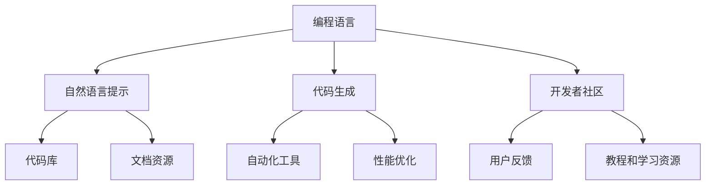

                 

### 文章标题

### 关键词
- **Prompt-Based Programming Languages**
- **Community Building**
- **Ecosystem Development**
- **Developer Engagement**
- **Educational Resources**

### 摘要

本文深入探讨了prompt-based编程语言社区建设与生态发展的关键问题。首先，我们介绍了prompt-based编程语言的历史背景、定义和特性，并分析了其生态系统现状。接着，我们讨论了社区建设在技术生态系统中的重要性，并提出了围绕prompt-based语言构建强大社区的策略。文章还详细阐述了如何通过创建一个欢迎的环境、提供教育资源和构建支持结构来促进社区参与和支持。最后，我们探讨了社区驱动的开发模式，并总结了最佳实践。本文旨在为开发者、社区建设和生态发展提供有价值的见解和指导。

### 引言：编程语言的发展与Prompt-Based编程语言

#### 编程语言的历史背景

编程语言的发展历程可以追溯到20世纪中期，当时计算机科学刚刚起步。早期的编程主要是通过机器语言（Machine Language）和汇编语言（Assembly Language）进行的，这些语言直接与计算机硬件交互，使得编程过程复杂且低效。随着计算机科学的进步，为了提高编程效率和可读性，第一代高级编程语言如FORTRAN（1957年）和COBOL（1959年）应运而生。这些语言引入了抽象概念，使得程序员能够以更人性化的方式编写代码。

随着时间的推移，编程语言不断演变，新的编程范式和语言层出不穷。面向对象编程（Object-Oriented Programming，OOP）的兴起，如C++（1983年）和Java（1995年），为软件开发带来了新的思路。函数式编程（Functional Programming）的兴起，如Haskell（1990年）和Scala（2004年），为处理复杂计算问题提供了强大的工具。同时，领域特定语言（Domain-Specific Languages，DSLs）的兴起，为特定领域的问题解决提供了高效的编程环境。

#### Prompt-Based编程语言的概念与崛起

近年来，Prompt-Based编程语言（Prompt-Based Programming Languages，PBPLs）逐渐引起了关注。与传统的编程语言不同，Prompt-Based编程语言通过提供自然语言提示（Prompts）来引导编程过程。这种语言的核心思想是将编程任务分解成一系列的自然语言指令，这些指令可以由程序员或机器自动执行。

Prompt-Based编程语言的出现，可以追溯到自然语言处理（Natural Language Processing，NLP）和人工智能（Artificial Intelligence，AI）领域的进步。随着深度学习和自然语言处理技术的发展，计算机能够更好地理解和生成自然语言文本。这为Prompt-Based编程语言的设计和实现提供了技术基础。

第一个Prompt-Based编程语言的例子是SQL（Structured Query Language，1986年），它通过提供SQL语句来查询和操纵数据库。然而，现代Prompt-Based编程语言更倾向于结合AI技术，如生成对抗网络（Generative Adversarial Networks，GANs）和强化学习（Reinforcement Learning），以实现更高级的编程任务。

#### Prompt-Based编程语言的特性

Prompt-Based编程语言具有以下特性：

1. **自然语言交互**：程序员可以通过自然语言指令与计算机进行交互，这使得编程过程更加直观和易于理解。
2. **自动化编程**：通过AI技术，Prompt-Based编程语言可以自动生成代码，减少手工编码的工作量。
3. **适应性**：Prompt-Based编程语言可以根据特定的编程任务和上下文环境动态调整，提供定制化的编程体验。
4. **跨平台兼容性**：Prompt-Based编程语言通常设计为跨平台，可以运行在不同的操作系统和硬件环境中。

#### Prompt-Based编程语言在技术生态系统中的重要性

Prompt-Based编程语言在技术生态系统中的重要性体现在以下几个方面：

1. **开发效率提升**：通过自然语言提示，程序员可以更快地完成编程任务，提高开发效率。
2. **代码可读性和维护性**：自然语言提示使得代码更易于理解和维护，特别是在处理复杂逻辑时。
3. **AI技术的融合**：Prompt-Based编程语言可以更好地与AI技术结合，实现更智能的编程体验。
4. **编程语言的多样性和创新**：Prompt-Based编程语言的引入，为编程语言的发展提供了新的方向和可能性。

#### 当前Prompt-Based编程语言的生态系统现状

尽管Prompt-Based编程语言近年来逐渐受到关注，但它们的生态系统仍处于发展阶段。目前，一些知名的Prompt-Based编程语言包括：

1. **AirScript**：由Google开发，它允许用户通过自然语言提示生成Python代码。
2. **Magenta**：由Google Brain团队开发，它支持多种AI应用程序的Prompt-Based编程。
3. **CodeTalk**：由微软研究院开发，它是一种面向机器学习的Prompt-Based编程语言。

这些语言在不同的领域和应用场景中展示了其潜力，但它们的社区建设和生态发展仍需进一步完善。

#### Prompt-Based编程语言的发展前景

随着自然语言处理和人工智能技术的不断进步，Prompt-Based编程语言有望在未来得到更广泛的应用和发展。它们为编程语言的发展带来了新的思路和可能性，有望成为未来编程的主流形式之一。然而，为了实现这一目标，还需要在社区建设、工具链完善、标准化等方面进行持续的努力。

### Prompt-Based编程语言的核心概念与特性

#### 定义

Prompt-Based编程语言（PBPLs）是一种结合了自然语言处理（NLP）和编程技术的编程语言。与传统的编程语言不同，PBPLs的核心思想是通过提供自然语言提示（Prompts）来引导编程过程。这些提示可以是简单的指令，也可以是更复杂的自然语言描述，由计算机理解和执行。

#### 关键特性

1. **自然语言交互**：PBPLs允许程序员使用自然语言与计算机进行交互。这种交互方式使得编程过程更加直观和易于理解，特别是对于非专业的开发者或新手来说。

2. **自动化编程**：通过AI技术，PBPLs可以自动生成代码，减少手工编码的工作量。这种自动化编程能力可以大大提高开发效率，同时减少错误率。

3. **适应性**：PBPLs可以根据特定的编程任务和上下文环境动态调整，提供定制化的编程体验。这种适应性使得PBPLs在不同领域和应用场景中具有广泛的适用性。

4. **跨平台兼容性**：PBPLs通常设计为跨平台，可以运行在不同的操作系统和硬件环境中。这种跨平台兼容性使得PBPLs可以广泛应用于各种设备和场景。

#### 与传统编程语言的对比

传统编程语言如C++、Java和Python等，依赖于固定的语法和结构化编程范式。这些语言通过编译器或解释器将代码转换为机器语言执行，程序员需要遵循特定的编程规则和模式。相比之下，PBPLs通过自然语言提示来引导编程过程，使得编程过程更加灵活和直观。

1. **编程模型**：
   - 传统编程语言：基于结构化编程模型，包括变量、函数、类等结构。
   - PBPLs：基于自然语言提示和指令，不需要严格的语法规则。

2. **开发体验**：
   - 传统编程语言：编程过程通常较为复杂，需要深入理解语法和编程范式。
   - PBPLs：编程过程更加直观，程序员可以通过自然语言描述来完成任务，减少了学习成本。

3. **代码生成**：
   - 传统编程语言：程序员需要手动编写代码，过程繁琐且易出错。
   - PBPLs：通过AI技术自动生成代码，减少了手工编码的工作量。

#### PBPLs的优势和挑战

PBPLs在多个方面展示了其独特优势：

1. **开发效率**：通过自然语言交互和自动化编程，PBPLs可以显著提高开发效率。
2. **代码可读性**：自然语言提示使得代码更易于理解和维护。
3. **跨领域适用性**：PBPLs的适应性使其在不同领域和应用场景中具有广泛适用性。

然而，PBPLs也面临一些挑战：

1. **语义理解**：自然语言提示的语义理解仍是一个技术难题，特别是在处理复杂指令时。
2. **性能问题**：自动化代码生成可能会影响性能，特别是在执行密集型计算任务时。
3. **生态建设**：PBPLs的社区建设和生态发展仍需进一步完善。

#### 概念属性特征对比表格

| 特性 | Prompt-Based编程语言 | 传统编程语言 |
| ---- | ------------------- | ------------ |
| 编程模型 | 自然语言提示和指令 | 结构化编程模型 |
| 开发体验 | 直观和易于理解 | 较复杂和需要专业知识 |
| 代码生成 | 自动化代码生成 | 手动编写代码 |
| 可读性和维护性 | 更高的可读性和维护性 | 较低的可读性和维护性 |
| 适用性 | 广泛的适用性 | 较为特定的适用性 |

#### PBPLs的ER实体关系图

通过上述表格和ER实体关系图，我们可以更清晰地理解Prompt-Based编程语言的核心概念和特性。这些概念和特性不仅为PBPLs提供了独特的优势，也为其在技术生态系统中的发展奠定了基础。

### Prompt-Based编程语言的发展历程与主要贡献者

Prompt-Based编程语言（PBPLs）的发展历程可谓是一场技术的革新。在了解这一领域的演进过程中，我们不得不提及几位关键人物和他们的卓越贡献。

#### 自动机器学习与Prompt-Based编程语言的起源

Prompt-Based编程语言的兴起，与自然语言处理（NLP）和自动机器学习（AutoML）的发展密切相关。最早对PBPLs产生重大影响的是Google的Magenta项目。Magenta项目是一个探索将机器学习和深度学习应用于创意工作的跨学科研究项目。Magenta项目的创始人Douglas Hofstadter和Chris Dunning在2017年发表了一篇题为《Synthesizing Natural Language over Complete Programs》（通过完整程序合成自然语言）的研究论文。这篇论文提出了通过生成对抗网络（GANs）生成自然语言描述，并将其作为编程提示的想法，为Prompt-Based编程语言的研究奠定了基础。

#### 主要贡献者

1. **Douglas Hofstadter**
   - 作为认知科学家和计算机科学家，Hofstadter以其关于图灵测试和意识研究的贡献而闻名。他在Magenta项目中提出了将自然语言提示与编程结合的初步概念，为Prompt-Based编程语言的发展提供了理论支持。
   
2. **Chris Dunning**
   - Dunning是Magenta项目的核心成员之一，他在NLP和深度学习领域有着丰富的经验。Dunning在Magenta项目中实现了生成对抗网络（GANs）来生成自然语言提示，为Prompt-Based编程语言的实现提供了技术手段。

3. **Google Brain团队**
   - 作为Magenta项目的领导者，Google Brain团队在Prompt-Based编程语言的实现和推广中发挥了重要作用。Google Brain团队通过不断的实验和迭代，改进了自然语言提示生成技术，使其在多种编程任务中表现出了优异的性能。

#### PBPLs的发展历程

1. **初期探索（2016-2018年）**
   - 在这个阶段，研究人员开始探索如何将自然语言处理技术与编程结合起来。Douglas Hofstadter和Chris Dunning的研究为这一领域奠定了基础，并引起了学术界的广泛关注。

2. **概念验证（2018-2020年）**
   - Google Brain团队在Magenta项目中发布了早期版本的Prompt-Based编程工具，如AirScript。这些工具通过自然语言提示生成代码，为开发者提供了直观的编程体验。

3. **快速发展（2020-2022年）**
   - 随着深度学习和自然语言处理技术的不断进步，Prompt-Based编程语言逐渐成为研究热点。多个研究团队发布了各自的Prompt-Based编程工具，如CodeTalk和Magenta Pro。这些工具在多个领域展示了其潜力，引起了业界的关注。

4. **生态建设（2022年至今）**
   - 目前，Prompt-Based编程语言的生态系统正在逐步完善。多个开源项目如AirScript和CodeTalk吸引了大量的开发者参与，社区建设和生态发展正迎来新的机遇。

#### 主要研究成果

1. **《Synthesizing Natural Language over Complete Programs》**
   - 这篇论文提出了通过生成对抗网络（GANs）生成自然语言提示的方法，并展示了如何将这些提示用于编程任务。该论文为Prompt-Based编程语言的研究提供了理论依据。

2. **AirScript**
   - AirScript是由Google开发的一种Prompt-Based编程语言，它允许用户通过自然语言提示生成Python代码。AirScript的成功应用为Prompt-Based编程语言的实际应用提供了重要参考。

3. **Magenta Pro**
   - Magenta Pro是Google Brain团队开发的一个高级Prompt-Based编程工具，它支持多种AI应用程序的开发。Magenta Pro在自然语言处理和代码生成方面表现出色，进一步推动了PBPLs的发展。

通过上述关键人物和研究成果的介绍，我们可以看到Prompt-Based编程语言的发展历程是一个充满创新和突破的过程。这些研究不仅为PBPLs提供了强大的技术支持，也为未来的研究和发展指明了方向。

### Prompt-Based编程语言的优势和潜力

Prompt-Based编程语言（PBPLs）作为新兴的编程范式，其在软件开发中展现出诸多优势，并在未来的技术发展中具有巨大的潜力。以下是PBPLs的几大优势及其实际应用案例：

#### 提高开发效率

通过自然语言提示，程序员可以快速地表达复杂的编程逻辑，而无需遵循严格的语法规则。这种灵活性大大提高了编程效率，特别是在处理复杂数据分析和机器学习任务时。例如，AirScript允许用户通过自然语言提示生成Python代码，从而简化了数据处理和模型训练的步骤。

**实际应用案例**：在金融领域的量化交易中，分析师可以使用Prompt-Based编程语言快速编写和测试交易策略，提高决策效率和准确性。

#### 减少学习成本

PBPLs通过自然语言交互，使得编程过程更加直观，降低了编程学习门槛。初学者或非专业开发者可以通过自然语言指令快速上手，无需深入理解编程语言的具体语法和结构。

**实际应用案例**：在教育领域，教师可以使用Prompt-Based编程语言为学生提供互动式编程教学，使学生能够更轻松地掌握编程基础。

#### 促进跨领域协作

Prompt-Based编程语言使得不同领域的专家可以更加便捷地协作开发软件。例如，数据科学家、产品经理和设计师可以使用自然语言提示来沟通需求，从而更有效地合作开发软件。

**实际应用案例**：在医疗领域，医生、数据科学家和工程师可以通过Prompt-Based编程语言协作开发智能医疗诊断系统，提高诊断效率和准确性。

#### 自动化编程任务

PBPLs结合了AI技术，能够自动生成代码，减少了手工编码的工作量。这种自动化编程能力不仅可以提高开发效率，还可以减少人为错误。

**实际应用案例**：在物联网（IoT）领域，PBPLs可以自动生成设备间的通信协议代码，简化了设备编程过程。

#### 潜在的应用前景

1. **智能编程助手**：未来，Prompt-Based编程语言可以发展成为智能编程助手，通过自然语言交互帮助开发者解决编程难题，提供实时代码审查和优化建议。

2. **跨平台开发**：随着技术的进步，Prompt-Based编程语言有望实现跨平台开发，支持多种编程语言和框架，提高开发者的工作效率。

3. **普及编程教育**：通过简化编程学习过程，Prompt-Based编程语言有望推动编程教育的普及，培养更多的编程人才，促进技术人才的储备。

4. **增强人机协作**：Prompt-Based编程语言可以更好地融合人机协作，提高开发者的工作效率和创造力，推动软件开发领域的发展。

总之，Prompt-Based编程语言以其独特的优势，在软件开发领域展现出巨大的潜力。随着技术的不断进步和应用场景的拓展，PBPLs有望成为未来编程的主流形式，为开发者带来全新的编程体验。

### 社区建设在技术生态系统中的重要性

社区建设在技术生态系统中扮演着至关重要的角色，特别是在Prompt-Based编程语言（PBPLs）的发展中。一个强大的社区不仅可以推动技术的普及和应用，还能吸引更多的开发者参与，共同推动生态的繁荣。以下是社区建设在技术生态系统中的几个关键作用：

#### **促进技术传播与应用**

一个活跃的社区可以为技术用户提供丰富的学习资源和实践机会。通过社区平台，开发者可以分享自己的经验和见解，帮助新用户快速上手PBPLs。这种知识共享和传播机制，有助于加速技术的普及和应用，推动整个技术生态系统的进步。

**实际案例**：在Python编程语言的社区中，大量开源资源和教程使得Python成为初学者和专业人士的热门选择。类似地，Prompt-Based编程语言的社区可以提供详尽的文档、教程和示例代码，帮助开发者理解和应用这些新工具。

#### **增强开发者归属感和参与感**

一个有凝聚力的社区可以增强开发者的归属感和参与感。当开发者感到自己是某个技术社区的成员时，他们更愿意贡献代码、编写文档、参与讨论和解决技术难题。这种参与感不仅能够提高开发者的积极性，还能促进技术的创新和发展。

**实际案例**：Linux开源社区以其高度的参与度和协作精神而闻名。开发者通过贡献代码、编写文档和参与社区活动，不仅提高了自己的技能，也推动了Linux操作系统的不断进化。

#### **加速问题解决和技术创新**

社区提供了一个快速解决问题的平台。当开发者遇到技术难题时，他们可以在社区中寻求帮助，分享自己的问题并得到其他开发者的反馈和建议。这种快速响应和协作机制，有助于提高技术问题的解决效率，同时促进了技术的创新和发展。

**实际案例**：在人工智能领域，许多关键算法和工具的突破都是通过社区合作实现的。例如，深度学习框架TensorFlow的开发就是由Google Brain团队和全球开发者共同协作完成的。

#### **培养技术人才和储备**

一个繁荣的社区可以吸引更多的开发者加入，从而为技术生态系统培养更多的技术人才。通过提供学习资源和实践机会，社区可以帮助新手成长为专业人士，同时为技术领域储备人才。

**实际案例**：GitHub等平台已经成为软件开发者和创业公司的摇篮，许多技术领域的领军人物和成功项目都起源于社区。

#### **增强技术竞争力和影响力**

一个强大的社区可以提升技术的竞争力和影响力。当某个技术社区积累了大量的用户和资源时，它不仅能够吸引更多的开发者加入，还能吸引投资和合作伙伴的关注，从而提升技术的市场竞争力。

**实际案例**：Java编程语言的社区建设和推广，使得Java成为企业级开发的主流语言，其全球用户基数和生态资源使其在市场上占据重要地位。

综上所述，社区建设在技术生态系统中具有不可替代的作用。对于Prompt-Based编程语言的发展来说，一个强大的开发者社区不仅能够促进技术的传播和应用，还能增强开发者的归属感和参与感，加速问题解决和技术创新，培养技术人才和储备，最终提升技术的竞争力和影响力。因此，建设一个繁荣的PBPLs社区是推动该技术发展的重要策略之一。

### 构建Prompt-Based编程语言社区的策略

构建一个强大的Prompt-Based编程语言（PBPLs）社区需要明确的策略和具体的执行步骤。以下是几种有效的策略，以及如何实施这些策略来确保社区的成功建设。

#### **策略一：制定清晰的目标和愿景**

1. **明确目标**：确定社区的核心目标，如促进技术普及、提高开发者技能、推动技术创新等。
2. **制定愿景**：设定长期和短期的目标，并制定具体的实施计划。
3. **共识建立**：与社区成员达成共识，确保大家对社区目标和愿景有共同的理解和支持。

**实施步骤**：
   - 成立一个社区委员会，由核心成员和志愿者组成。
   - 定期召开会议，讨论社区目标和愿景，并记录和传达会议结果。
   - 制定详细的行动计划和时间表，确保目标的实现。

#### **策略二：建立有效的沟通渠道**

1. **多样化的沟通方式**：提供多种沟通渠道，如论坛、邮件列表、社交媒体群组、直播和会议等。
2. **定期更新**：保持沟通渠道的活跃，定期发布新闻、更新、教程和讨论话题。
3. **互动参与**：鼓励社区成员积极参与讨论和互动，建立互助和支持的文化。

**实施步骤**：
   - 创建一个社区论坛，如Discourse或Reddit，供成员交流和分享。
   - 设立专门的邮件列表，用于重要公告和讨论。
   - 利用社交媒体平台，如Twitter和LinkedIn，宣传社区活动和更新。
   - 定期组织直播和会议，邀请知名开发者分享经验和进行讨论。

#### **策略三：提供丰富的教育资源和教程**

1. **基础教程**：提供从入门到高级的教程，帮助新成员快速上手。
2. **案例研究**：分享实际应用案例，展示PBPLs在现实世界中的应用效果。
3. **动手实践**：提供实践项目和学习路径，帮助开发者将理论知识应用于实际场景。

**实施步骤**：
   - 创建一个教育资源库，收集和整理教程、视频、文章和示例代码。
   - 与教育机构和专家合作，开发高质量的教程和课程。
   - 定期举办线上和线下培训课程，提供实践机会。
   - 设立奖学金和竞赛，激励成员参与学习和实践。

#### **策略四：建立社区驱动的支持系统**

1. **问题反馈机制**：提供一个问题反馈渠道，允许成员报告问题和提出建议。
2. **志愿者团队**：建立一个志愿者团队，负责回答问题、编写文档和参与社区活动。
3. **官方支持**：确保社区有一个官方支持团队，提供及时和专业的帮助。

**实施步骤**：
   - 在社区论坛或网站上设立“问题反馈”板块，确保每个问题都能得到及时响应。
   - 吸引有经验的开发者成为志愿者，负责回答常见问题和编写文档。
   - 定期组织志愿者会议，讨论社区支持和改进方案。
   - 设立官方支持渠道，如官方博客、文档网站和在线聊天，提供专业支持。

#### **策略五：组织社区活动和会议**

1. **线上和线下活动**：定期举办线上和线下活动，如研讨会、讲座、黑客松和社交聚会等。
2. **嘉宾演讲**：邀请知名开发者、研究者和行业专家分享经验。
3. **社区展览**：展示成员的作品和项目，增强社区凝聚力和互动。

**实施步骤**：
   - 制定年度活动计划，确定活动主题、时间和地点。
   - 利用社交媒体和邮件列表宣传活动，吸引更多成员参与。
   - 提供活动回顾和总结，分享经验和教训。
   - 鼓励成员自发组织小型聚会和活动，增强社区互动。

通过上述策略的实施，可以有效地构建一个繁荣的Prompt-Based编程语言社区，吸引更多的开发者参与，共同推动技术的发展和创新。

### 创建一个友好、包容和支持的社区环境

一个友好、包容和支持的社区环境是促进Prompt-Based编程语言（PBPLs）社区健康发展的关键。这样的环境不仅能够吸引更多开发者参与，还能提升社区的凝聚力和影响力。以下是如何创建和维护一个友好、包容和支持的社区环境的详细步骤和建议。

#### **设定社区标准和行为准则**

1. **明确标准**：制定一份详细的社区标准和行为准则，包括尊重、礼貌、互助和公平竞争等方面的具体要求。
2. **宣传和培训**：通过社区论坛、邮件列表和社交媒体等渠道宣传这些标准和准则，确保所有成员都清楚了解并遵守。
3. **监督执行**：建立一个监督机制，如专门的委员会或志愿者团队，负责监督社区标准和行为准则的执行。

**实施建议**：
   - 创建一个专门的“社区准则”页面，详细列出所有标准和行为准则。
   - 在每次活动或会议开始时，提醒成员遵守社区准则。
   - 设立举报机制，允许成员报告违反准则的行为。

#### **鼓励多样性和包容性**

1. **倡导平等**：鼓励所有背景和技能水平的开发者参与社区，确保性别、种族、文化和社会经济地位等方面的多样性。
2. **包容不同观点**：尊重不同的意见和观点，鼓励开放讨论和建设性的批评。
3. **反歧视政策**：制定明确的反歧视政策，禁止任何形式的歧视和骚扰行为。

**实施建议**：
   - 组织多样性和包容性培训，提高成员的意识。
   - 设立“多样性委员会”，专门负责推动多样性和包容性工作。
   - 定期举办多样性主题的活动和讨论，增强社区的包容性。

#### **提供有效的沟通和支持**

1. **建立多个沟通渠道**：提供多样化的沟通渠道，如论坛、邮件列表、社交媒体群组和在线聊天室，确保成员能够方便地获取帮助和参与讨论。
2. **及时响应**：确保社区成员的问题和反馈能够得到及时响应，提供专业的支持和帮助。
3. **建立互助文化**：鼓励成员之间互相帮助，分享经验和资源，形成互助和协作的文化。

**实施建议**：
   - 在社区论坛和邮件列表中设立专门的板块，用于提问和讨论。
   - 鼓励资深成员和新成员之间的互动，帮助新手快速融入社区。
   - 定期举办问答活动和在线讨论，增强成员之间的交流。

#### **举办活动和会议**

1. **线上和线下活动**：定期举办线上和线下活动，如研讨会、讲座、工作坊和社交聚会等，为成员提供互动和交流的机会。
2. **邀请嘉宾**：邀请知名开发者、研究者和行业专家作为嘉宾，分享经验和见解。
3. **展示成果**：鼓励成员展示自己的项目和工作，增强社区的凝聚力和成就感。

**实施建议**：
   - 制定年度活动计划，确保活动的多样性和覆盖面。
   - 利用社交媒体和邮件列表宣传活动，提高参与度。
   - 提供活动回顾和总结，分享经验和反馈。

#### **培养社区领导力**

1. **选拔和培养领导者**：从社区成员中选拔有潜力的领导者，提供培训和指导，培养他们的领导力和管理能力。
2. **明确角色和责任**：为领导者明确角色和责任，确保他们能够有效地管理和推动社区的发展。
3. **支持和支持**：为领导者提供必要的资源和支持，确保他们能够专注于社区的发展。

**实施建议**：
   - 设立“社区领导力培训计划”，定期举办培训和工作坊。
   - 提供领导者的管理工具和资源，如项目管理软件和沟通平台。
   - 定期召开领导者会议，讨论社区的发展和改进方案。

通过以上步骤和建议，可以创建和维护一个友好、包容和支持的Prompt-Based编程语言社区环境。这样的社区不仅能够吸引更多开发者参与，还能促进技术的传播和应用，为PBPLs的发展提供强大的动力。

### 提供教育资源和工具，支持开发者学习与成长

为了推动Prompt-Based编程语言（PBPLs）的普及和应用，提供一个全面的教育资源库和实用的学习工具是至关重要的。以下是具体的教育资源和学习工具，以及如何利用它们来支持开发者的学习和成长。

#### **教育资源库**

1. **基础教程和文档**：创建一套从入门到高级的教程和文档，涵盖PBPLs的基本概念、语法、编程范式和常见应用场景。这些资源应该结构清晰、内容丰富，适合不同层次的开发者。

2. **视频教程和讲座**：录制一系列视频教程和讲座，邀请知名的开发者和行业专家分享他们的经验和技巧。这些视频内容应该详细讲解具体的应用案例，帮助开发者更好地理解和应用PBPLs。

3. **示例代码和项目**：提供大量的示例代码和实际项目，让开发者可以通过实践来巩固所学知识。这些项目应该涵盖各种复杂度，从简单的练习到完整的商业应用。

**利用建议**：
   - 在社区论坛和官方网站上设立“教育资源”板块，方便开发者查找和下载。
   - 定期更新教育资源，确保内容的时效性和实用性。
   - 鼓励社区成员贡献自己的教程和代码，丰富教育资源库。

#### **在线学习平台**

1. **在线课程**：与知名在线教育平台合作，开设专门的PBPLs课程。这些课程应该包括理论学习、实践操作和项目开发的各个环节。

2. **互动学习社区**：建立专门的互动学习社区，允许开发者提问、讨论和分享学习心得。这种互动机制可以促进学习者的交流和共同进步。

3. **编程挑战和竞赛**：定期举办编程挑战和竞赛，激发开发者的学习兴趣和竞争力。这些活动可以提供奖品和荣誉，鼓励开发者积极参与。

**利用建议**：
   - 提供详细的课程目录，方便开发者根据自己的需求和兴趣选择合适的课程。
   - 在学习社区中设立导师制度，由资深开发者提供一对一的辅导和支持。
   - 定期发布挑战和竞赛的通知，鼓励成员积极参与。

#### **实践项目和实验室**

1. **开源项目**：鼓励开发者参与开源项目，从实际项目中学习和积累经验。这些项目应该涵盖各种技术领域，从基础应用到大型的商业项目。

2. **实验室环境**：提供云计算和容器化平台，为开发者提供一个安全和高效的实验环境。这种环境应该支持多种编程语言和工具，方便开发者进行实验和测试。

3. **虚拟实验室**：开发一个虚拟实验室，让开发者可以通过虚拟机或容器模拟不同的应用场景，进行编程实验和项目开发。

**利用建议**：
   - 在社区论坛和官方网站上设立“开源项目”和“实验室”板块，方便开发者查找和参与。
   - 提供详细的教程和指南，帮助新手快速上手实验室环境和开源项目。
   - 定期组织线下实验室活动，如编程马拉松和项目展示会，增强开发者之间的交流和合作。

#### **职业发展支持**

1. **职业规划指导**：提供职业规划服务，帮助开发者根据自己的兴趣和技能制定职业发展路径。

2. **招聘信息分享**：定期发布招聘信息，帮助开发者找到与PBPLs相关的就业机会。

3. **职业培训课程**：开设职业培训课程，提升开发者的软技能和行业知识，为他们的职业发展提供支持。

**利用建议**：
   - 在社区论坛和官方网站上设立“职业发展”板块，提供相关的指导和资源。
   - 邀请行业专家和人力资源经理进行讲座和分享，为开发者提供职业发展的建议。
   - 定期举办招聘会和职业发展讲座，帮助开发者了解就业市场和职业发展机会。

通过上述教育资源和工具的提供，可以有效地支持开发者的学习和成长，推动PBPLs的普及和应用。这些资源和工具不仅为开发者提供了丰富的学习资源，还为他们提供了一个实践和展示自己技能的平台，有助于培养更多优秀的PBPLs开发者。

### 社区支持结构

一个健全的社区支持结构是确保Prompt-Based编程语言（PBPLs）社区长期繁荣和可持续发展的关键。以下是几种关键的支持结构及其具体实施方式。

#### **官方支持渠道**

1. **官方网站和文档**：建立官方的社区网站和文档库，提供最新的教程、代码示例和FAQ。这些资源应该结构清晰、易于访问，并保持定期更新。
2. **官方论坛和聊天室**：设立官方论坛和聊天室，为开发者提供一个交流和寻求帮助的平台。这些平台应该有专业的社区管理人员和志愿者团队负责维护。
3. **官方博客和新闻稿**：定期发布博客文章和新闻稿，介绍社区的最新动态、技术更新和重要活动。

**实施方式**：
   - **资源整合**：将所有官方资源整合到一个统一的平台上，方便开发者查找和获取。
   - **内容审核**：确保所有发布的教程和文档内容准确无误，并符合社区的标准和准则。
   - **互动反馈**：鼓励开发者提供反馈和建议，不断改进官方资源和服务。

#### **志愿者团队**

1. **志愿者招募和管理**：定期招募志愿者，并通过培训和管理制度确保他们能够有效地为社区提供支持。
2. **角色分工**：为志愿者分配不同的角色和任务，如答疑解惑、编写文档、组织活动等。
3. **激励机制**：为表现出色的志愿者提供奖励和认可，激励他们持续参与社区建设。

**实施方式**：
   - **定期培训**：组织定期的志愿者培训，提高他们的技术水平和解决问题的能力。
   - **透明管理**：建立透明的志愿者管理制度，确保志愿者的工作得到社区成员的认可和支持。
   - **激励机制**：设立志愿者积分制度，为积极参与的志愿者提供荣誉称号和物质奖励。

#### **社区论坛和聊天室**

1. **多样化主题**：设立多个论坛和聊天室，涵盖不同的技术主题和兴趣领域，满足开发者的多样化需求。
2. **活跃氛围**：鼓励社区成员积极参与讨论和互动，保持论坛和聊天室的活跃度。
3. **分类管理**：对论坛和聊天室进行合理分类和管理，确保问题能够快速定位和解决。

**实施方式**：
   - **分类和标签**：为每个论坛和聊天室设置明确的分类和标签，方便开发者查找和参与相关讨论。
   - **管理员制度**：设立论坛和聊天室管理员，负责维护秩序、监控内容和处理问题。
   - **用户反馈**：定期收集用户反馈，不断改进论坛和聊天室的功能和服务。

#### **教育机构和企业的合作**

1. **资源共享**：与教育机构和企业合作，共享教学资源、研究项目和实践机会，为开发者提供更多的学习和发展机会。
2. **联合活动**：举办联合活动，如研讨会、讲座和工作坊，促进社区成员与教育机构和企业之间的互动。
3. **职业发展支持**：共同提供职业规划、招聘信息和职业培训，帮助开发者实现职业发展。

**实施方式**：
   - **合作框架**：建立明确的合作框架和协议，确保合作双方的利益和目标的统一。
   - **活动策划**：共同策划和实施活动，确保活动的质量和效果。
   - **资源共享**：建立资源共享平台，方便社区成员获取合作方的资源和机会。

通过这些社区支持结构的实施，可以有效地提升社区的服务水平，增强社区成员的参与感和归属感，推动Prompt-Based编程语言社区的长期繁荣和可持续发展。

### 社区驱动的开发模式

社区驱动的开发模式是Prompt-Based编程语言（PBPLs）生态系统中至关重要的一部分。通过这种模式，社区成员可以积极参与技术决策、代码贡献和文档编写，共同推动PBPLs的发展与完善。以下是社区驱动开发模式的几个关键组成部分和实践步骤。

#### **社区成员参与决策**

1. **透明化决策过程**：确保所有技术决策的透明化，通过论坛、邮件列表和投票等方式，让社区成员参与到技术决策过程中。
2. **多样化的声音**：鼓励不同背景和经验的成员参与讨论，确保决策过程的多样性和全面性。
3. **定期会议和讨论**：定期召开社区会议，讨论技术方向、项目规划和关键决策，确保所有社区成员的声音都能被听到。

**实践步骤**：
   - **设立社区委员会**：成立一个社区委员会，由核心成员和志愿者组成，负责决策过程的组织和协调。
   - **发布会议通知**：通过社区论坛和邮件列表发布会议通知，邀请社区成员参与讨论。
   - **公开会议记录**：会议结束后，公开会议记录和决策结果，确保信息的透明和可追溯。

#### **代码贡献与审查**

1. **开放贡献**：鼓励所有社区成员参与代码贡献，通过开源平台（如GitHub）管理代码库，提供清晰的贡献指南和代码规范。
2. **代码审查**：建立一套代码审查流程，确保代码质量，包括代码风格一致性、功能完整性和安全性等。
3. **代码评审**：邀请资深开发者或其他社区成员进行代码评审，提供反馈和建议，确保代码的可靠性和可维护性。

**实践步骤**：
   - **贡献指南**：在官方网站和GitHub上发布详细的贡献指南，包括代码提交流程、代码规范和贡献协议。
   - **代码审查委员会**：设立代码审查委员会，负责管理和监督代码审查过程。
   - **定期代码评审**：组织定期的代码评审活动，确保新代码和重要修改都经过严格审查。

#### **文档编写与维护**

1. **文档化**：鼓励社区成员编写和更新文档，包括教程、指南、API文档和使用案例等。
2. **版本控制**：使用版本控制系统（如Git）管理文档，确保文档的版本一致性和可追溯性。
3. **社区合作**：建立社区协作平台，如Confluence或Wiki，方便成员协作编写和维护文档。

**实践步骤**：
   - **文档模板**：提供统一的文档模板，确保文档格式和内容的一致性。
   - **文档写作小组**：成立文档写作小组，由有经验的成员负责编写和维护文档。
   - **文档更新机制**：建立文档更新机制，确保文档内容与代码库保持同步，并及时反映最新的技术变化。

#### **持续集成与部署**

1. **自动化测试**：建立自动化测试流程，确保每次代码提交都能通过全面的测试，保证代码质量。
2. **持续集成**：使用持续集成工具（如Jenkins或GitHub Actions），自动化构建、测试和部署代码。
3. **容器化与云部署**：采用容器化技术（如Docker）和云服务平台（如AWS、Google Cloud），实现高效和可扩展的部署。

**实践步骤**：
   - **自动化测试框架**：开发自动化测试框架，覆盖核心功能和安全测试。
   - **CI/CD流程**：建立CI/CD流程，确保每次代码提交都能自动触发测试和部署。
   - **容器化与云部署指南**：提供详细的容器化和云部署指南，帮助开发者快速搭建和部署PBPLs环境。

通过社区驱动的开发模式，PBPLs社区可以实现高效的技术创新和快速发展，提高代码质量和文档质量，为开发者提供一个友好、包容和支持的编程环境。

### 社区驱动的开发案例研究

为了深入探讨社区驱动的开发模式如何成功应用于Prompt-Based编程语言（PBPLs）的开发，以下我们将分析几个具有代表性的社区驱动开发案例，并总结其成功经验。

#### **案例一：AirScript社区驱动开发**

**背景**：AirScript是由Google开发的一种Prompt-Based编程语言，允许用户通过自然语言提示生成Python代码。随着AirScript的不断发展，其社区逐渐成为一个活跃的开发者平台。

**实施过程**：
1. **透明化决策过程**：AirScript社区采用了GitHub的Issue Tracking系统，所有技术决策都在此平台上进行讨论和投票。社区成员可以通过评论和投票参与决策过程，确保决策过程的透明和民主。
2. **代码贡献与审查**：AirScript社区鼓励所有成员参与代码贡献，并通过GitHub的Pull Request（PR）机制进行代码审查。每个提交的代码都需要通过至少两名资深开发者的审核，确保代码的质量和一致性。
3. **文档编写与维护**：社区成员积极参与文档编写和更新，使用Markdown格式编写文档，并使用Git进行版本控制。文档编写小组定期审核和更新文档，确保其内容与代码库同步。

**成功经验**：
   - **开放的决策过程**：通过透明的决策过程，AirScript社区能够吸引更多开发者参与，提高了社区成员的归属感和参与度。
   - **严格的代码审查**：严格的代码审查机制确保了代码库的质量，减少了错误和漏洞。
   - **高效的文档维护**：良好的文档编写和维护机制使得新成员能够快速上手，提高了社区的协作效率。

#### **案例二：CodeTalk社区驱动开发**

**背景**：CodeTalk是由微软研究院开发的一种面向机器学习的Prompt-Based编程语言。CodeTalk社区致力于通过协作开发，推动该语言在机器学习领域的应用。

**实施过程**：
1. **社区合作与资源共享**：CodeTalk社区与多个研究机构和大学合作，共享研究资源和数据集。通过这种合作，社区成员能够获得更多的实验数据和技术支持。
2. **持续集成与部署**：社区使用Jenkins和Docker进行持续集成和部署，确保每次代码提交都能自动触发测试和部署。这种自动化流程提高了开发效率，减少了手动操作和错误。
3. **多样化的代码贡献**：社区鼓励不同背景的成员参与代码贡献，包括机器学习研究者、软件开发者和数据科学家。多样化的贡献者带来了不同的视角和技能，促进了技术的创新和发展。

**成功经验**：
   - **合作与资源共享**：通过合作和资源共享，CodeTalk社区能够快速获取最新的研究进展和技术支持，提高了社区的技术水平和创新能力。
   - **自动化部署**：自动化的部署流程确保了代码的及时测试和上线，提高了社区的响应速度和效率。
   - **多样化的贡献者**：多样化的代码贡献者带来了不同的技能和经验，促进了技术的多样性和创新。

#### **案例三：Magenta社区驱动开发**

**背景**：Magenta是由Google Brain团队开发的一个跨学科研究项目，旨在探索将机器学习和深度学习应用于创意工作。Magenta社区致力于推动Prompt-Based编程语言在各个领域的应用。

**实施过程**：
1. **开放研究计划**：Magenta社区发布了详细的研究计划，并邀请全球的研究者参与。通过这种方式，社区成员可以共同探讨和解决技术难题。
2. **代码和模型共享**：Magenta社区鼓励成员共享代码和模型，通过GitHub和Google Colab等平台进行协作开发。这种开放共享机制促进了技术进步和知识传播。
3. **多样化的活动**：社区定期举办研讨会、工作坊和讲座，邀请知名专家分享经验和见解。这些活动不仅促进了社区成员之间的交流，还吸引了更多的新成员加入。

**成功经验**：
   - **开放的研究计划**：开放的研究计划吸引了全球的研究者参与，促进了技术的快速发展和创新。
   - **代码和模型共享**：共享的代码和模型为社区成员提供了丰富的学习资源，提高了开发效率。
   - **多样化的活动**：多样化的活动形式增强了社区的互动和凝聚力，吸引了更多的新成员加入。

通过这些案例研究，我们可以看到社区驱动的开发模式在Prompt-Based编程语言开发中的成功应用。这些社区通过透明的决策过程、严格的代码审查、开放的文档编写和多样化的活动，不仅提高了技术质量，还增强了社区的凝聚力和创新能力。这些成功经验为其他PBPLs社区提供了宝贵的参考和借鉴。

### 促进社区互动的最佳实践

为了促进Prompt-Based编程语言（PBPLs）社区的互动，提高社区成员之间的沟通与合作，以下是一些有效的最佳实践。

#### **定期组织社区活动**

1. **线上和线下讲座**：定期举办线上和线下讲座，邀请知名开发者、研究者和行业专家分享经验和技术见解。这些讲座不仅能够提升成员的知识水平，还能激发他们的参与热情。
2. **编程马拉松**：组织编程马拉松活动，鼓励社区成员在限定时间内合作完成特定的编程任务。这种活动能够增强成员之间的协作精神，提高编程技能。
3. **社交聚会**：定期举办社交聚会，如线下聚会、聚餐和团队建设活动，为社区成员提供一个轻松愉快的交流环境。

#### **建立多样化的沟通渠道**

1. **论坛和聊天室**：创建多样化的论坛和聊天室，覆盖技术讨论、学习交流和生活分享等不同主题。这些渠道应保持活跃，方便成员随时提问和参与讨论。
2. **社交媒体群组**：利用社交媒体平台（如LinkedIn、Twitter和Facebook）建立群组，及时分享社区动态、技术资源和活动信息。
3. **邮件列表**：设立专门的邮件列表，用于重要公告、讨论和活动通知，确保成员能够及时获取信息。

#### **设立社区奖项和激励机制**

1. **贡献积分系统**：建立贡献积分系统，根据成员的贡献（如代码提交、文档编写、社区活动参与等）累积积分。积分可以用于兑换礼品、参加特别活动或获得荣誉称号。
2. **最佳贡献者奖**：定期评选最佳贡献者，给予奖金、奖品或荣誉称号，激励成员积极参与社区建设。
3. **社区领袖奖**：设立社区领袖奖，表彰那些在社区管理和组织方面表现出色的成员，鼓励更多人成为社区领袖。

#### **鼓励分享和互助**

1. **知识分享会**：定期组织知识分享会，鼓励成员分享自己的经验和见解。这种活动不仅能够提高成员的技术水平，还能促进知识传播和交流。
2. **问答活动**：举办定期的问答活动，邀请资深开发者回答成员的问题。这种活动能够帮助新手解决困惑，提高整体技术水平。
3. **互助小组**：建立互助小组，由有经验的成员帮助新手解决问题。这种小组形式能够形成良好的互助氛围，提高成员的参与感和归属感。

通过实施这些最佳实践，PBPLs社区可以促进成员之间的互动和合作，增强社区的凝聚力和创新能力，为技术的持续发展提供强大的动力。

### 文章小结

通过本文的详细探讨，我们全面了解了Prompt-Based编程语言（PBPLs）的社区建设和生态系统发展的关键要素。首先，我们回顾了编程语言的发展历程，特别是Prompt-Based编程语言的起源和特性。接着，我们分析了PBPLs在技术生态系统中的重要性，并探讨了其当前的发展状况和未来前景。

文章进一步探讨了社区建设在技术生态系统中的重要性，并提出了构建PBPLs社区的五大策略：制定清晰的目标和愿景、建立有效的沟通渠道、提供丰富的教育资源和工具、建立社区驱动的支持系统以及组织社区活动和会议。我们详细讨论了如何创建一个友好、包容和支持的社区环境，以及如何通过提供教育资源和学习工具来支持开发者的学习和成长。

此外，文章还介绍了社区支持结构的几种关键形式，如官方支持渠道、志愿者团队、社区论坛和聊天室，以及教育机构和企业的合作。我们通过实际案例展示了社区驱动的开发模式，并总结了几种促进社区互动的最佳实践。

综上所述，PBPLs社区建设是一个系统工程，需要明确的策略、丰富的资源和有效的支持。通过持续的努力和协作，我们可以构建一个繁荣、活跃的PBPLs社区，推动这一新兴编程语言的发展和应用。

### 注意事项

在建设和维护Prompt-Based编程语言（PBPLs）社区时，以下注意事项尤为重要：

1. **维护社区准则**：确保社区标准和行为准则得到有效执行，禁止任何形式的歧视、骚扰和不恰当行为，创造一个友好、包容的环境。

2. **保障信息安全**：在社区活动中，特别是涉及敏感信息和代码分享时，采取必要的安全措施，保护成员的数据和隐私。

3. **平衡资源分配**：在提供教育资源和学习工具时，确保资源分配均衡，避免因资源不足或不均衡导致部分成员受到不公平对待。

4. **激励机制**：合理设计激励机制，鼓励社区成员积极参与社区建设和活动，如贡献代码、编写文档和参与讨论等。

5. **持续改进**：定期评估社区建设和活动效果，收集成员反馈，不断改进社区管理和运营策略。

通过关注这些注意事项，我们可以确保PBPLs社区的健康发展，吸引和留住更多的开发者，共同推动PBPLs技术的普及和应用。

### 拓展阅读

为了深入了解Prompt-Based编程语言（PBPLs）的社区建设和生态发展，以下是几篇推荐的文章和资源，供读者进一步学习和研究：

1. **《Prompt-Based Programming Languages: A Comprehensive Survey》**：这篇综述文章详细介绍了Prompt-Based编程语言的概念、特性、发展和应用场景。它为读者提供了一个全面的视角，帮助理解PBPLs的现状和未来趋势。

2. **《Building a Successful Open Source Community》**：这篇文章探讨了如何成功建设一个开源社区，分享了最佳实践和策略。尽管主要针对开源项目，但其核心原则同样适用于PBPLs社区建设。

3. **《The Future of Programming: Natural Language and Machine Learning》**：这篇文章探讨了自然语言处理和机器学习在编程领域的未来发展方向，分析了Prompt-Based编程语言如何改变软件开发的传统模式。

4. **《A Study on Community-Driven Development in Software Engineering》**：这篇研究论文深入探讨了社区驱动的软件开发模式，分析了其优势、挑战和实践方法，为PBPLs社区提供了宝贵的参考。

5. **《AirScript Documentation and Tutorials》**：这是AirScript官方文档和教程的集合，详细介绍了AirScript的基本概念、使用方法和最佳实践。对希望深入了解AirScript的开发者来说，这是一份非常有价值的资源。

6. **《Magenta Project Research Papers》**：这是Google Brain团队发布的关于Magenta项目的研究论文集合，涵盖了自然语言处理、生成对抗网络和深度学习在编程中的应用。这些论文为Prompt-Based编程语言的研究提供了理论支持。

通过阅读这些拓展阅读资源，读者可以更深入地理解PBPLs社区建设和生态发展的关键问题，为未来的研究和实践提供启示。

