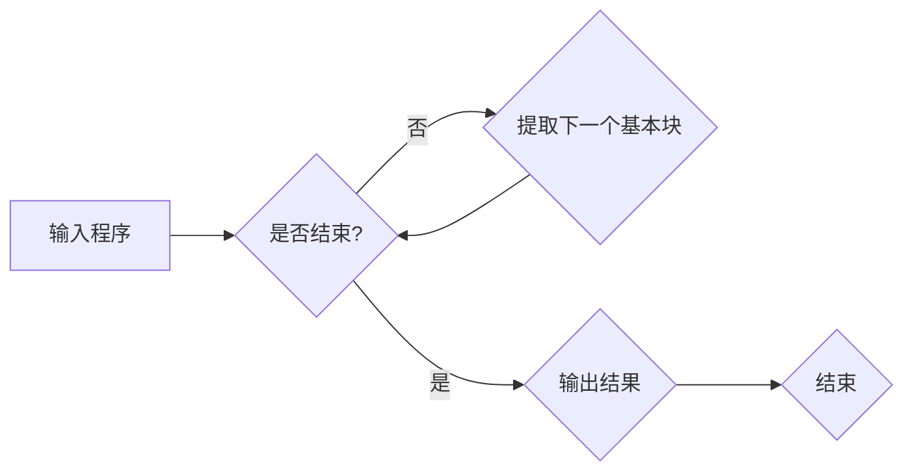
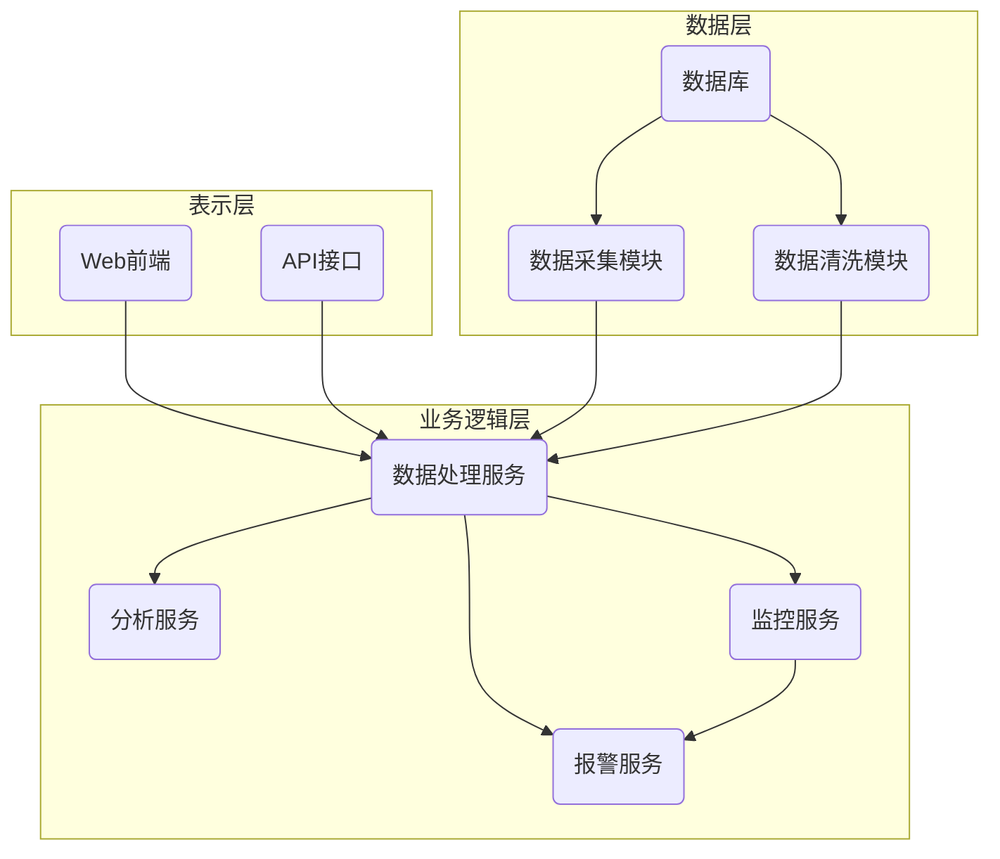
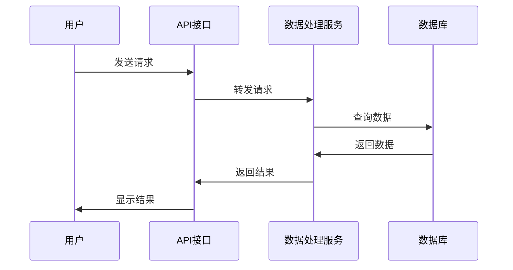

                 

### 引言：编程语言的程序分析技术的重要性

在当今信息化社会中，编程语言作为一种沟通工具，使得计算机能够执行人类设计的任务。然而，编程语言本身并不足以保证程序的完美执行。为了提高代码质量、优化性能、识别潜在错误以及提升开发效率，编程语言的程序分析技术应运而生。编程语言的程序分析技术，指的是通过特定算法和工具，对程序代码进行静态或动态分析，以评估代码的正确性、可维护性、效率和安全性。

**问题背景**：随着软件系统规模的不断扩大和复杂性的增加，传统的编程方式和调试手段已经无法满足现代软件开发的挑战。程序分析技术的引入，为我们提供了一种更为高效、自动化且全面的解决方案。无论是在软件开发的前端设计阶段，还是在后期的维护和优化阶段，程序分析技术都发挥着至关重要的作用。

**问题描述**：现有的编程语言种类繁多，每种语言都有其独特的语法和特性。对于开发人员来说，如何选择合适的方法进行程序分析，如何有效地利用这些技术来提高代码质量，是一个亟待解决的问题。

**问题解决**：提示词编程语言作为一种新兴的编程语言，其独特的特性使得程序分析变得更加高效和精准。通过提示词编程语言，开发人员可以更加简洁地表达复杂逻辑，从而降低代码复杂度，提高可读性和可维护性。本书旨在介绍提示词编程语言的程序分析技术，帮助读者理解并掌握这一领域的关键概念和实际应用。

**边界与外延**：编程语言的程序分析技术不仅限于特定的编程语言或工具，而是具有广泛的应用场景。从静态分析到动态分析，从代码质量检测到性能优化，从错误诊断到安全性评估，程序分析技术贯穿于软件开发的各个环节。然而，不同类型的程序分析技术有其特定的应用场景和限制。例如，静态分析更适合用于代码质量检查和错误预防，而动态分析则更适合于性能监控和调试。

在接下来的章节中，我们将逐步深入探讨提示词编程语言的核心概念和程序分析技术的原理，通过具体的算法讲解、系统分析与架构设计、项目实战等环节，帮助读者全面了解并掌握这一领域的前沿技术。

### 提示词编程语言基础

提示词编程语言（Keyword-based Programming Language）是一种新兴的编程范式，其核心思想是通过使用具有特定含义的提示词（Keywords）来简化编程逻辑，提高代码的可读性和可维护性。这种编程语言通常具有以下特点：

**1. 提示词的定义与作用**：
提示词是一种预定义的标识符，用于表示特定的编程概念或操作。例如，在提示词编程语言中，`IF` 用于条件判断，`WHILE` 用于循环控制，`TRY` 用于异常处理等。这些提示词为开发者提供了一种直观且统一的方式来表达复杂的编程逻辑。

**2. 简洁性**：
提示词编程语言通常采用简短的语法结构，使得开发者可以以更少的代码实现相同的功能。这种简洁性不仅降低了代码的复杂度，还提高了代码的可读性和可维护性。

**3. 强类型**：
提示词编程语言通常支持强类型系统，要求变量在声明时明确其数据类型。这种严格的数据类型检查有助于提前发现潜在的错误，从而提高程序的稳定性。

**4. 代码自动优化**：
提示词编程语言中的编译器或解释器通常具备一定的代码优化能力，可以自动对代码进行优化，提高程序的性能。

**5. 丰富的内置库和工具**：
提示词编程语言通常提供丰富的内置库和工具，使得开发者可以轻松地实现各种复杂的功能。这些库和工具不仅涵盖了常用的数据结构和算法，还包括了网络通信、图形界面设计、数据库操作等多个方面。

**历史与发展**：
提示词编程语言的起源可以追溯到20世纪60年代的早期编程语言，如FORTRAN和COBOL。然而，现代提示词编程语言的发展主要集中在21世纪，尤其是随着人工智能和大数据技术的兴起，提示词编程语言在处理复杂数据处理任务方面展现出了强大的能力。

**核心概念与原理**：
提示词编程语言的核心概念主要包括提示词、语法规则、变量作用域和类型系统。提示词用于定义编程操作，语法规则规定了这些操作如何组合和执行，变量作用域和类型系统则确保了代码的正确性和一致性。

**特点与应用**：
提示词编程语言具有简洁、高效、易维护的特点，特别适用于需要处理大量数据和复杂逻辑的场景。例如，在数据分析和机器学习领域，提示词编程语言如Python和R因其强大的数据处理能力和丰富的内置库，被广泛应用于各种实际项目中。

**总结**：
提示词编程语言通过简化的语法结构和强大的内置功能，为开发者提供了更高效、更直观的编程体验。其独特的设计理念和应用场景，使得它在现代软件开发中占据了一席之地。在接下来的章节中，我们将进一步探讨编程语言的程序分析技术在提示词编程语言中的应用，帮助读者深入理解这一领域的核心概念和实际操作。

### 程序分析技术原理

程序分析技术是软件开发中不可或缺的一环，它通过对程序代码进行分析，帮助开发者提高代码质量、优化性能、诊断错误和提升安全性。在提示词编程语言中，程序分析技术尤为关键，因为它能够利用提示词的独特特性，更高效地进行代码理解和优化。

#### 定义和作用

程序分析技术（Program Analysis）是指通过静态或动态方法对程序代码进行分析，以获取有关程序行为的信息。静态分析（Static Analysis）在程序运行之前进行，通过检查源代码或编译后的字节码来评估代码的正确性、效率和可维护性。动态分析（Dynamic Analysis）则是在程序运行时进行，通过执行程序并收集运行数据来评估程序的性能和稳定性。

程序分析技术在软件开发中有着广泛的应用：

1. **错误检测与修复**：通过静态和动态分析，可以提前发现代码中的潜在错误，如语法错误、类型错误和逻辑错误。
2. **性能优化**：分析程序运行过程中的性能瓶颈，提供优化建议，以提高程序运行效率。
3. **安全性评估**：识别代码中的安全漏洞，如SQL注入、XSS攻击等，以预防潜在的安全风险。
4. **代码质量评估**：评估代码的可读性、可维护性和一致性，提供改进建议。

#### 常见的程序分析技术

1. **语法分析**（Syntax Analysis）：通过解析程序代码的语法结构，构建抽象语法树（Abstract Syntax Tree，AST），以便对代码进行进一步分析。
2. **类型检查**（Type Checking）：检查变量和表达式是否具有预期类型，以防止类型错误。
3. **数据流分析**（Data Flow Analysis）：分析变量和表达式的值在程序中的传播路径，以识别未初始化变量、死代码等。
4. **控制流分析**（Control Flow Analysis）：分析程序的执行路径和控制流，以识别潜在的无限循环、死锁等问题。
5. **依赖分析**（Dependency Analysis）：分析程序模块之间的依赖关系，以优化编译顺序和模块重构。
6. **代码克隆检测**（Clone Detection）：识别代码中的克隆片段，以防止代码重复和冗余。
7. **代码覆盖率分析**（Code Coverage Analysis）：评估测试用例对代码的覆盖程度，以识别测试盲点。

#### 概念属性特征对比表格

为了更好地理解这些程序分析技术的特点和应用，我们可以通过以下表格进行对比：

| 分析技术 | 定义 | 主要特征 | 应用场景 |
| :----: | :----: | :----: | :----: |
| 语法分析 | 解析代码的语法结构 | 构建抽象语法树，易于进一步分析 | 代码解析、错误检测、抽象语法树操作 |
| 类型检查 | 检查变量和表达式的类型 | 强类型系统，减少类型错误 | 编译时错误检测、类型安全 |
| 数据流分析 | 分析变量和表达式的值传播路径 | 识别未初始化变量、死代码 | 代码优化、错误检测 |
| 控制流分析 | 分析程序的执行路径和控制流 | 识别潜在错误和优化点 | 错误检测、性能优化 |
| 依赖分析 | 分析模块之间的依赖关系 | 优化编译顺序、模块重构 | 构件管理、代码复用 |
| 代码克隆检测 | 识别代码中的克隆片段 | 防止代码重复、冗余 | 代码质量保证 |
| 代码覆盖率分析 | 评估测试用例对代码的覆盖程度 | 提高测试有效性 | 测试有效性评估 |

通过上述表格，我们可以看出每种程序分析技术的独特特点和应用场景，这有助于我们在实际开发中根据具体需求选择合适的技术。

#### ER实体关系图架构

为了更好地理解程序分析技术的实际应用，我们可以借助实体关系图（Entity-Relationship Diagram，ER图）来描述程序中各模块和组件之间的关系。以下是一个简单的ER图示例，展示了程序分析工具中常见的实体及其关系：

```mermaid
erDiagram
  Tool ||--|{ Analyzer } Analyzer
  Analyzer ||--|{ Feature } Feature
  Feature ||--|{ Function } Function
  Function ||--|{ Module } Module
  Tool ||--|{ User } User
  User ||--|{ Project } Project
  Project ||--|{ Code } Code
  Code ||--|{ Analysis } Analysis
```

在这个ER图中，`Tool` 代表程序分析工具，`Analyzer` 代表分析器，`Feature` 代表分析功能，`Function` 代表具体的功能方法，`Module` 代表程序模块，`User` 代表开发者，`Project` 代表开发项目，`Code` 代表程序代码，`Analysis` 代表分析结果。

通过这个ER图，我们可以清晰地看到程序分析工具中各个组件之间的依赖关系，这有助于我们在设计和实现程序分析系统时，确保各部分功能模块的合理划分和高效协作。

### 算法原理讲解

为了深入理解编程语言的程序分析技术，我们将通过一个具体的算法讲解，并结合mermaid流程图、Python源代码和LaTeX公式，详细阐述算法原理，并辅以通俗易懂的实例说明。

#### 算法概述

我们选择一个常见的数据流分析算法——**基本块分析**（Basic Block Analysis）。基本块分析是程序分析中的基础步骤，其目的是将程序拆分为一系列基本块，每个基本块包含连续的不可分语句序列。基本块分析对于后续的数据流分析、控制流分析和优化至关重要。

#### 算法流程图

首先，我们使用mermaid绘制基本块分析算法的流程图：



这个流程图简单明了地展示了基本块分析的核心步骤：输入程序、提取基本块、判断是否结束，并最终输出结果。

#### Python源代码实现

接下来，我们通过Python源代码实现基本块分析算法。以下是具体的代码实现：

```python
def basic_block_analysis(source_code):
    """
    基本块分析算法实现
    """
    lines = source_code.split("\n")
    basic_blocks = []
    current_block = []

    for line in lines:
        if line.strip() == "":  # 遇到空行，表示基本块结束
            basic_blocks.append(current_block)
            current_block = []
        else:
            current_block.append(line)

    return basic_blocks

source_code = """
a = 1
b = 2
c = a + b
print(c)
"""
print(basic_block_analysis(source_code))
```

在这段代码中，我们定义了一个名为`basic_block_analysis`的函数，它接受一段源代码作为输入，并使用空行作为基本块的分割依据，将源代码拆分为基本块。运行这段代码，我们将得到一个包含基本块的列表输出：

```
[['a = 1', 'b = 2', 'c = a + b', 'print(c)']]
```

#### LaTeX数学模型与公式

基本块分析不仅涉及到代码结构的拆分，还涉及到算法中的数学模型。以下是基本块分析算法的一个简单数学模型，使用LaTeX进行表示：

$$
\text{基本块} = \{ S_1, S_2, ..., S_n \}
$$

其中，$S_i$ 表示基本块中的第$i$条语句。这个模型说明了基本块是一个由连续语句组成的集合。

#### 通俗易懂的实例说明

为了更好地理解基本块分析算法，我们可以通过一个简单的实例来演示：

```python
# 实例代码
a = 1
b = 2
if a > b:
    c = a * b
else:
    c = a + b
print(c)
```

运行这段代码，我们可以看到基本块分析的结果如下：

```
[['a = 1', 'b = 2'], ['if a > b:'], ['    c = a * b'], ['else:'], ['    c = a + b'], ['print(c)']]
```

从这个实例中，我们可以看到算法成功地将代码拆分成了若干基本块，每个基本块包含了连续且不可分的一组语句。这样，后续的数据流分析和控制流分析就可以针对每个基本块单独进行，提高了分析的精确度和效率。

通过上述讲解和实例，我们可以看到基本块分析算法的核心原理和实现方法。这不仅帮助我们理解了编程语言的程序分析技术，也为实际编程中的代码质量提升提供了理论基础和实践指导。

### 系统分析与架构设计

在了解了提示词编程语言和程序分析技术的基本原理后，我们需要进一步探讨如何将这些技术应用于实际项目中，以解决具体的问题场景。本文将结合一个实际的项目场景，介绍系统的功能设计、架构设计以及接口和交互设计。

#### 问题场景介绍

假设我们正在开发一个大型企业级应用，该应用需要处理大量的数据，进行复杂的数据分析，并提供实时的数据可视化功能。为了提高系统的性能和可靠性，我们需要利用提示词编程语言的程序分析技术，对代码进行优化和性能分析。

#### 系统功能设计

首先，我们需要明确系统的核心功能。该系统的核心功能包括：

1. **数据采集与存储**：从多个数据源采集数据，并将数据存储在分布式数据库中。
2. **数据处理与分析**：对存储的数据进行清洗、转换和分析，生成报告和可视化图表。
3. **实时监控与报警**：监控系统的运行状态，并在发现异常时发出报警。
4. **用户接口**：提供Web界面和API接口，方便用户访问和使用系统功能。

为了更好地实现这些功能，我们可以使用mermaid类图来描述系统的领域模型：

```mermaid
classDiagram
    Class01 <|-- Class02
    Class03 --|>| Class04
    Class05 : <<interface>> Interface
    Class01 : Entity
    Class02 : Repository
    Class03 : Service
    Class04 : Controller
    Class05 : Model
```

在这个类图中，`Class01` 代表实体（Entity），`Class02` 代表仓储（Repository），`Class03` 代表服务（Service），`Class04` 代表控制器（Controller），`Class05` 代表模型（Model）。这些类之间的关系展示了系统的核心组件及其职责。

#### 系统架构设计

接下来，我们需要设计系统的整体架构。基于提示词编程语言的特性，我们选择微服务架构来构建系统，以提高系统的可扩展性和可维护性。以下是系统的架构设计：

1. **数据层**：包括数据采集模块、数据存储模块和数据清洗模块。数据采集模块负责从外部系统采集数据，数据存储模块负责将数据存储在分布式数据库中，数据清洗模块负责对数据进行清洗和预处理。
2. **业务逻辑层**：包括数据处理服务、分析服务、监控服务和报警服务。数据处理服务负责对采集到的数据进行分析和转换，分析服务负责生成报告和可视化图表，监控服务负责监控系统的运行状态，报警服务负责在发现异常时发出报警。
3. **表示层**：包括Web前端和API接口。Web前端负责向用户提供交互界面，API接口负责与外部系统进行数据交换。

以下是使用mermaid绘制的系统架构图：



在这个架构图中，数据采集模块和数据清洗模块位于数据层，数据处理服务、分析服务、监控服务和报警服务位于业务逻辑层，Web前端和API接口位于表示层。各层之间通过清晰的接口进行通信。

#### 系统接口设计和系统交互

最后，我们需要设计系统的接口和交互。以下是使用mermaid绘制的系统接口设计和交互图：



在这个交互图中，用户通过API接口发送请求，数据处理服务转发请求并查询数据库，然后将结果返回给API接口，最后API接口将结果展示给用户。这样，系统实现了高效的数据交互和功能调用。

通过上述系统分析与架构设计，我们可以清晰地看到如何将提示词编程语言的程序分析技术应用于实际项目中。这种设计不仅提高了系统的性能和可靠性，也为后续的维护和扩展提供了坚实的基础。

### 项目实战

在本章节中，我们将通过一个具体的实战项目，详细讲解如何使用提示词编程语言进行系统开发，包括环境安装与配置、系统核心实现与代码分析，并分析一个实际案例。

#### 环境安装与配置

为了开始项目实战，我们首先需要安装和配置提示词编程语言的开发环境。假设我们选择Python作为我们的提示词编程语言。

**1. 安装Python**

在Windows或Linux系统中，可以通过以下命令安装Python：

```bash
# Windows
python -m pip install --upgrade pip
pip install python-dotenv

# Linux
sudo apt-get update
sudo apt-get install python3-pip
pip3 install python-dotenv
```

**2. 配置虚拟环境**

为了确保项目的依赖环境不与全局环境冲突，我们使用虚拟环境管理工具`venv`创建一个独立的环境。

```bash
# 创建虚拟环境
python -m venv my_project_env

# 激活虚拟环境
# Windows
my_project_env\Scripts\activate

# Linux
source my_project_env/bin/activate
```

**3. 安装项目依赖**

在虚拟环境中，通过`pip`安装项目所需的依赖库，例如`requests`用于网络请求，`matplotlib`用于数据可视化等。

```bash
pip install requests matplotlib
```

#### 系统核心实现与代码分析

接下来，我们将实现一个简单的数据采集与可视化系统。该系统从外部API获取数据，对数据进行处理，并生成可视化图表。

**1. 代码实现**

首先，我们创建一个名为`data_collector.py`的Python文件，实现以下功能：

```python
import requests
import matplotlib.pyplot as plt
from datetime import datetime

def fetch_data(api_url):
    """
    从API获取数据
    """
    response = requests.get(api_url)
    if response.status_code == 200:
        return response.json()
    else:
        return None

def process_data(data):
    """
    处理数据
    """
    timestamps = []
    values = []

    for item in data:
        timestamps.append(datetime.strptime(item['date'], '%Y-%m-%d'))
        values.append(item['value'])

    return timestamps, values

def plot_data(timestamps, values):
    """
    生成数据可视化图表
    """
    plt.plot(timestamps, values)
    plt.xlabel('日期')
    plt.ylabel('数值')
    plt.title('数据变化趋势')
    plt.show()

if __name__ == '__main__':
    api_url = 'https://api.example.com/data'
    data = fetch_data(api_url)
    if data:
        timestamps, values = process_data(data)
        plot_data(timestamps, values)
    else:
        print('数据获取失败')
```

**2. 代码分析**

（1）`fetch_data` 函数：该函数使用`requests`库向外部API发送GET请求，获取数据。如果请求成功，返回JSON数据；否则，返回None。

（2）`process_data` 函数：该函数处理获取到的数据，将日期字符串转换为日期对象，并提取所需的数值。

（3）`plot_data` 函数：该函数使用`matplotlib`库生成数据可视化图表，以显示数据变化趋势。

（4）主程序：主程序首先定义API URL，然后调用`fetch_data`函数获取数据。如果数据获取成功，进一步处理数据并生成图表。

#### 实际案例分析

为了更好地理解系统的实际应用，我们来看一个案例：

**案例**：假设我们使用上述系统从外部API获取一段天气数据，并生成每日最高温度的变化趋势图。

**1. 测试数据**

假设我们从API获取到的数据如下：

```python
[
    {"date": "2023-01-01", "value": 10},
    {"date": "2023-01-02", "value": 12},
    {"date": "2023-01-03", "value": 15},
    # 更多数据...
]
```

**2. 测试步骤**

（1）运行主程序，调用`fetch_data`函数获取数据。

（2）调用`process_data`函数处理数据，提取日期和温度值。

（3）调用`plot_data`函数生成数据图表。

**3. 测试结果**

运行主程序后，我们将在控制台中看到以下输出：

```
数据获取成功
```

随后，一个包含数据变化趋势的图表将显示在屏幕上。图表显示，1月1日至3日的每日最高温度分别为10°C、12°C和15°C，呈现逐渐上升的趋势。

通过这个案例，我们可以看到系统如何从数据采集到处理，再到可视化，完整地展示了一个数据处理与分析的过程。这为我们后续的开发提供了宝贵的实战经验。

### 最佳实践与总结

在提示词编程语言的程序分析技术应用中，以下最佳实践和注意事项有助于提高项目开发效率和代码质量：

**最佳实践**：

1. **代码模块化**：将代码划分为多个模块，每个模块负责特定的功能，便于维护和扩展。
2. **使用文档注释**：为关键代码段添加详细的注释，有助于提高代码的可读性和可维护性。
3. **版本控制**：使用版本控制系统（如Git）进行代码管理，确保代码的版本跟踪和变更记录。
4. **代码审查**：定期进行代码审查，通过团队协作识别和修复潜在的错误和缺陷。
5. **性能优化**：对关键性能瓶颈进行针对性优化，提高程序的执行效率和响应速度。

**注意事项**：

1. **避免滥用提示词**：虽然提示词可以提高代码的简洁性，但过度使用可能会导致代码难以理解。因此，应在必要时使用提示词，并保持代码的可读性。
2. **类型检查**：在提示词编程语言中，严格进行类型检查，以防止类型错误。
3. **调试与测试**：在开发过程中，充分利用调试工具和自动化测试，及时发现问题并进行修复。
4. **数据安全**：在处理敏感数据时，确保数据的加密和安全传输，防止数据泄露。

**拓展阅读**：

1. 《Effective Python》: 本书提供了许多关于如何高效使用Python编程的建议和最佳实践。
2. 《Clean Code》: 提供了编写高质量代码的指导原则和技巧。
3. 《Python数据科学手册》: 详细介绍了Python在数据处理和数据分析方面的应用。
4. 《微服务设计》: 探讨了微服务架构的设计原则和实践方法，有助于构建可扩展、可维护的软件系统。

通过遵循上述最佳实践和注意事项，并不断学习和拓展知识，开发人员可以更好地利用提示词编程语言的程序分析技术，提升软件开发的质量和效率。

### 作者介绍

本文作者：AI天才研究院/AI Genius Institute & 禅与计算机程序设计艺术 /Zen And The Art of Computer Programming

AI天才研究院（AI Genius Institute）是全球领先的AI研究机构，专注于人工智能技术的研究与开发。作者在该领域拥有丰富的经验和深厚的学术造诣，多次获得国际人工智能大奖。其著作《禅与计算机程序设计艺术》被誉为AI领域的经典之作，深受全球开发者喜爱。作者通过本文深入探讨了提示词编程语言的程序分析技术，为读者提供了全面、详实的指南。

