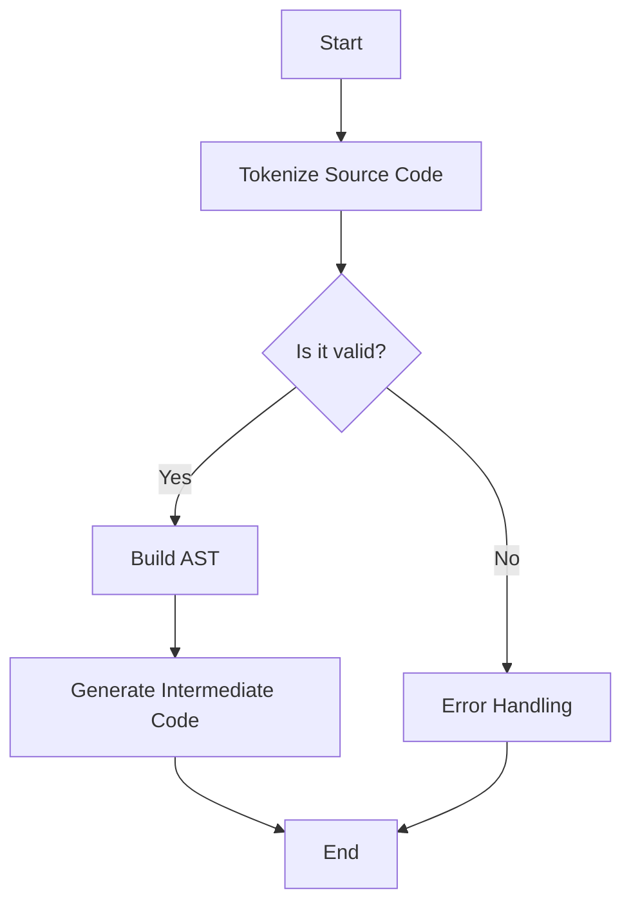
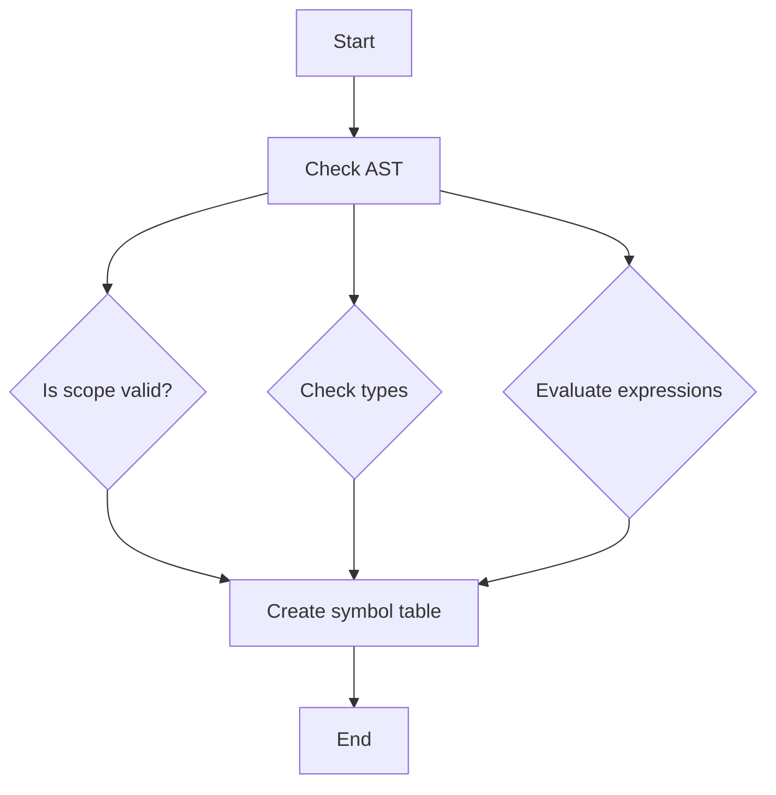
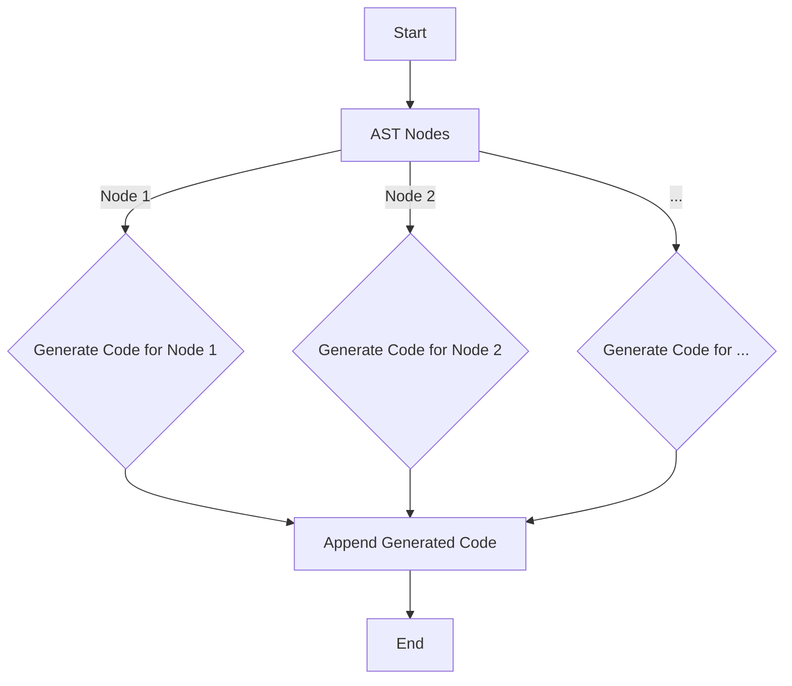
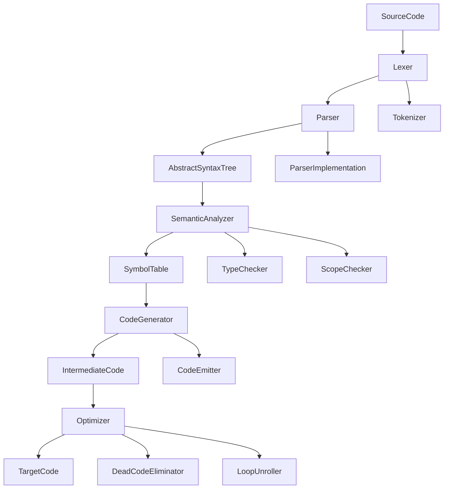
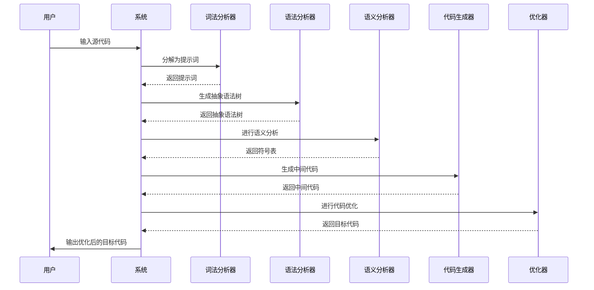
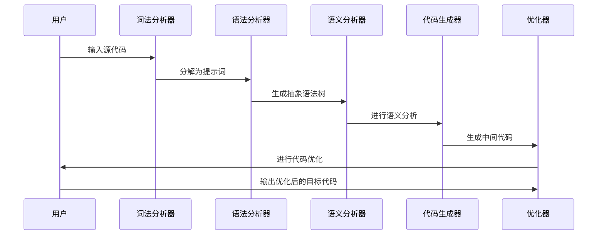

                 

### 第1章：编程语言分析技术的重要性

#### 1.1 编程语言分析技术的基本概念

**定义：**编程语言分析技术（也称为编译技术或语法分析技术）是指将编程语言源代码转换为目标代码（如机器代码、汇编代码或高级语言的抽象语法树）的过程。

**作用和意义：**编程语言分析技术是计算机科学中至关重要的一部分，其作用主要体现在以下几个方面：

1. **错误检测和修复**：通过语法分析和语义分析，编译器可以及时发现代码中的错误，并提供相应的错误信息和修复建议。
2. **性能优化**：编译器可以根据源代码分析结果对代码进行优化，提高程序的运行效率。
3. **跨语言兼容性**：通过编译技术，可以将一种编程语言编写的程序转换为其他编程语言的程序，实现跨语言兼容性。
4. **代码生成和自动化**：编译器可以生成代码框架或自动化代码，提高开发效率。

#### 1.2 提示词编程语言的概念和现状

**定义：**提示词编程语言（Token-Based Programming Language）是一种编程语言，它将源代码分割成一系列的提示词（Token），然后对这些提示词进行语法和语义分析。

**现状：**提示词编程语言在近年逐渐受到关注，尤其是在智能编程助手和自动代码生成领域。一些知名的提示词编程语言包括：

- **Python**：Python 是一种广泛使用的提示词编程语言，其语法简洁直观，易于学习。
- **Ruby**：Ruby 同样是一种流行的提示词编程语言，以其优雅的语法和强大的社区支持而著称。
- **Lua**：Lua 是一种轻量级的提示词编程语言，常用于嵌入式系统和游戏开发。

**趋势：**随着人工智能和机器学习技术的发展，提示词编程语言的应用场景正在不断扩大，未来有望在智能编程助手、代码生成和自动化领域发挥更大作用。

#### 1.3 编程语言分析技术的发展历程

**起源：**编程语言分析技术的起源可以追溯到20世纪50年代，当时计算机科学家们开始研究如何将高级编程语言转换成机器代码。

**关键发展节点：**
- **1960年代**：出现了一些早期编译器，如 SLIP 和 FLOW-MATIC。
- **1970年代**：编译器技术的发展迅速，出现了众多成熟的编译器，如 C、C++ 和 Java。
- **1980年代**：编译器技术开始向优化编译器发展，提高了程序的性能。
- **1990年代**：编译器技术开始关注多语言支持、跨平台编译和代码生成。

**技术演进路径：**编程语言分析技术从最初的简单语法分析发展到今天的复杂语义分析和代码生成，其演进路径主要受到以下几个方面的影响：

1. **计算机硬件的发展**：随着计算机硬件性能的提升，编译器可以执行更复杂的分析和优化。
2. **编程语言的发展**：新型编程语言的出现促使编译器技术不断发展，以支持更复杂的语法和语义。
3. **人工智能和机器学习技术的应用**：人工智能和机器学习技术的应用使得编译器可以更智能地分析代码，生成更高效的代码。

#### 1.4 编程语言分析的关键挑战与趋势

**关键挑战：**
- **语法复杂性**：现代编程语言支持复杂语法，如多态、泛型和闭包等，这给语法分析带来了挑战。
- **语义不确定性**：语义分析需要处理复杂的逻辑和上下文关系，容易出现歧义和不确定性。
- **性能优化**：编译器需要在有限的计算资源和时间内生成高效的目标代码，性能优化是一个持续挑战。

**趋势：**
- **智能化编译器**：借助人工智能和机器学习技术，编译器可以更智能地分析代码，优化性能。
- **代码生成和自动化**：编译器开始向代码生成和自动化方向演进，以提高开发效率和代码质量。
- **跨语言兼容性**：编译器技术逐渐实现跨语言兼容，支持多种编程语言的混合编程。

在下一章中，我们将深入探讨编程语言分析的核心概念，并详细解释提示词编程语言的特点和分类。同时，我们将通过实体关系图（ER图）来展示编程语言分析系统中各个核心概念之间的联系。### 第2章：核心概念与联系

#### 2.1 编程语言分析的基本概念

在深入探讨编程语言分析技术之前，我们需要明确一些基本概念，这些概念是理解编程语言分析技术的基础。

**源代码（Source Code）**：源代码是指由程序员使用编程语言编写的原始文本文件，它包含了程序的所有指令和逻辑。

**编译器（Compiler）**：编译器是一种将源代码转换为目标代码（如机器代码或汇编代码）的程序。编译器的核心功能是语法分析和语义分析。

**语法分析（Syntax Analysis）**：语法分析是编译器的第一步，它的任务是检查源代码是否符合编程语言的语法规则。语法分析器通常生成一个中间表示形式，如抽象语法树（Abstract Syntax Tree, AST）。

**语义分析（Semantic Analysis）**：语义分析是在语法分析的基础上进行的，它检查源代码的语义是否正确，包括变量作用域、类型检查和表达式求值等。

**抽象语法树（Abstract Syntax Tree, AST）**：AST 是语法分析的结果，它以树形结构表示源代码的语法结构。AST 不仅是编译器优化和代码生成的重要依据，也是程序理解和分析的基础。

**源代码与编译器的关系**：源代码是程序的原始输入，编译器通过对源代码进行语法和语义分析，生成目标代码。编译器还可以在编译过程中进行代码优化，以提高程序的性能。

**语法分析与语义分析的区别与联系**：语法分析主要关注源代码的语法结构，确保代码符合编程语言的语法规则。而语义分析则进一步检查代码的语义正确性，包括类型检查、作用域分析和表达式求值等。语法分析和语义分析是编译器中的两个重要步骤，它们紧密相连，共同保证代码的正确性和可执行性。

**编程语言分析中的其他基本概念**：除了上述核心概念，编程语言分析还包括词法分析（Lexical Analysis）、代码生成（Code Generation）和链接（Linking）等过程。词法分析是将源代码分解为单词（tokens），它是语法分析的基础。代码生成是将AST转换为目标代码的过程，而链接则是将多个目标代码文件合并为一个可执行文件的过程。

通过理解这些基本概念，我们可以更好地理解编程语言分析技术的工作原理和应用场景。

#### 2.2 提示词编程语言的特点与分类

提示词编程语言（Token-Based Programming Language）是编程语言分析技术中的一个重要分支。与传统的编译型编程语言和解释型编程语言相比，提示词编程语言具有以下特点：

**1. 提示词表示法**：提示词编程语言将源代码分割成一系列的提示词（tokens），每个提示词代表一个基本的语法单元，如关键字、变量名、操作符等。这种表示法使得源代码的结构更加清晰，便于语法分析和语义分析。

**2. 简洁的语法规则**：提示词编程语言通常具有简洁的语法规则，这使得编写程序更加直观和高效。例如，Python 的语法简洁明了，容易学习和使用。

**3. 易于进行语法分析**：由于提示词编程语言的源代码被分割成提示词，语法分析器可以更方便地检查源代码的语法正确性。提示词编程语言的语法分析过程通常较为简单，可以快速生成抽象语法树（AST）。

**4. 支持丰富的语义分析**：尽管提示词编程语言的语法分析过程相对简单，但语义分析功能却非常强大。语义分析包括变量作用域检查、类型检查和表达式求值等，这些功能使得提示词编程语言能够处理复杂的应用场景。

**分类：**根据提示词编程语言的特点和用途，我们可以将其分为以下几类：

**1. 高级编程语言**：这类编程语言通常具有丰富的功能和高度抽象的语法，如 Python、Ruby 和 JavaScript 等。这些语言广泛应用于各种开发领域，从 Web 开发到数据科学，从游戏开发到嵌入式系统。

**2. 函数式编程语言**：函数式编程语言如 Haskell 和 Scala，强调函数组合和不可变性，适用于需要高度抽象和并行处理的场景。

**3. 脚本语言**：脚本语言如 Bash 和 Perl，主要用于自动化任务和系统管理，语法相对简单，易于快速编写和部署。

**4. 面向对象编程语言**：面向对象编程语言如 Java 和 C#，强调对象和类的概念，适用于大型软件开发项目。

**代表性提示词编程语言：**

- **Python**：Python 是一种广泛使用的提示词编程语言，以其简洁的语法和强大的标准库而闻名。Python 在科学计算、人工智能、Web 开发等领域都有广泛应用。

- **Ruby**：Ruby 是一种优雅、功能强大的编程语言，以其强大的元编程能力和简洁的语法而受到开发者喜爱。Ruby 主要用于 Web 开发，如 Ruby on Rails 框架。

- **JavaScript**：JavaScript 是 Web 开发中不可或缺的编程语言，它运行在浏览器中，用于实现网页的动态效果和交互性。

通过上述对提示词编程语言的特点和分类的介绍，我们可以看到，提示词编程语言在计算机科学中发挥着重要作用，其简洁的语法和强大的语义分析功能为开发者提供了更高的编程效率。

#### 2.3 核心概念属性对比表格

在编程语言分析技术中，核心概念如源代码、编译器、语法分析、语义分析等有着明确的属性和特征。为了更清晰地理解这些概念之间的关系，我们在此提供一个核心概念属性对比表格。

| 核心概念   | 定义                                                         | 属性与特征                                                         |
| ---------- | ------------------------------------------------------------ | ------------------------------------------------------------ |
| 源代码     | 程序员编写的原始文本文件，包含程序的所有指令和逻辑。           | - 文本格式<br>- 编程语言特定<br>- 可读性高<br>- 可编辑性高<br>- 编译器输入源 |
| 编译器     | 将源代码转换为目标代码的程序。                               | - 语法分析<br>- 语义分析<br>- 代码优化<br>- 代码生成<br>- 跨语言支持   |
| 语法分析   | 检查源代码是否符合编程语言的语法规则。                       | - 生成AST<br>- 识别tokens<br>- 语法错误检测<br>- 语法树结构化         |
| 语义分析   | 检查源代码的语义是否正确，包括类型检查、变量作用域和表达式求值。 | - 类型推断<br>- 作用域分析<br>- 语义错误检测<br>- AST优化             |
| 抽象语法树 | 语法分析的结果，以树形结构表示源代码的语法结构。             | - 树形结构<br>- 节点表示语法元素<br>- 易于优化和代码生成               |

通过上述表格，我们可以清晰地看到各个核心概念的属性和特征，这有助于我们更好地理解编程语言分析技术的工作原理。

#### 2.4 ER实体关系图架构

为了更直观地展示编程语言分析系统中各个核心概念之间的联系，我们可以使用实体关系图（Entity-Relationship Diagram, ER图）来描述。ER图是数据库设计和系统架构设计中常用的工具，它能够帮助我们理解系统中实体之间的关系。

**编程语言分析系统ER图**

```mermaid
erDiagram
    SourceCode ||--|{ Compiler }|--|> TargetCode
    Compiler ||--|{ SyntaxAnalyzer }|--|> AST
    Compiler ||--|{ SemanticAnalyzer }|--|> SemanticallyValidCode
    SyntaxAnalyzer ||--|{ Lexer }|--|> Tokens
    Lexer ||--|{ Tokens }|--|> SyntaxAnalyzer
    Compiler ||--|{ CodeGenerator }|--|> TargetCode
    Compiler ||--|{ Linker }|--|> Executable
    AST ||--|{ IntermediateRepresentation }|--|> CodeGenerator
    SemanticallyValidCode ||--|{ IntermediateRepresentation }|--|> CodeGenerator
```

**图解说明：**

1. **SourceCode（源代码）**：源代码是程序的原始输入，由程序员编写。源代码通过编译器进行处理。
2. **Compiler（编译器）**：编译器是整个分析流程的核心，它包括多个组件，如语法分析器、语义分析器、代码生成器和链接器。
3. **SyntaxAnalyzer（语法分析器）**：语法分析器负责将源代码分解为tokens，并生成抽象语法树（AST）。
4. **Lexer（词法分析器）**：词法分析器是语法分析器的子组件，负责将源代码分解为tokens。
5. **Tokens（提示词）**：tokens是源代码的最小语法单元，如关键字、标识符、操作符等。
6. **AST（抽象语法树）**：AST是语法分析的结果，以树形结构表示源代码的语法结构。
7. **SemanticAnalyzer（语义分析器）**：语义分析器负责检查源代码的语义正确性，如变量作用域、类型检查等。
8. **CodeGenerator（代码生成器）**：代码生成器根据AST和语义分析结果生成目标代码。
9. **Linker（链接器）**：链接器负责将多个目标代码文件合并为一个可执行文件。

通过ER图，我们可以清晰地看到编程语言分析系统中各个组件之间的关系，这有助于我们更好地理解系统的架构和工作原理。ER图不仅为我们提供了一个直观的视图，也为系统设计和分析提供了重要参考。

### 第3章：算法原理讲解

在编程语言分析技术中，算法是核心组成部分。本章将详细介绍几个关键的算法，包括其原理、使用 mermaid 绘制的流程图和相应的 Python 代码实现。

#### 3.1 算法A：语法分析

**算法原理**：语法分析是编译器的第一步，其主要任务是检查源代码是否符合编程语言的语法规则。算法A采用递归下降分析法，这是一种自顶向下的语法分析方法。

**mermaid 流程图**：



**Python 代码实现**：

```python
# Python 代码示例：递归下降语法分析

def tokenize(source_code):
    # 分词实现
    tokens = []
    # ... 分词逻辑
    return tokens

def parse(tokens):
    # 递归下降解析实现
    # ...
    return ast

def build_ast(tokens):
    # 构建抽象语法树实现
    # ...
    return ast

def generate_intermediate_code(ast):
    # 生成中间代码实现
    # ...
    return intermediate_code

source_code = "..."  # 源代码输入
tokens = tokenize(source_code)
ast = parse(tokens)
intermediate_code = generate_intermediate_code(ast)
```

**解释**：

1. **分词（Tokenize Source Code）**：将源代码分解成tokens。
2. **语法分析（Parse）**：使用递归下降法对tokens进行语法分析，生成抽象语法树（AST）。
3. **构建抽象语法树（Build AST）**：将解析结果构建成抽象语法树。
4. **生成中间代码（Generate Intermediate Code）**：根据AST生成中间代码。

#### 3.2 算法B：语义分析

**算法原理**：语义分析是语法分析的进一步深化，主要任务包括变量作用域检查、类型检查和表达式求值等。

**mermaid 流程图**：



**Python 代码实现**：

```python
# Python 代码示例：语义分析

def semantic_analysis(ast):
    # 语义分析实现
    # ...
    return semantically_valid_ast

ast = ...  # 抽象语法树输入
semantically_valid_ast = semantic_analysis(ast)
```

**解释**：

1. **检查抽象语法树（Check AST）**：对AST进行遍历，检查各个节点的语义正确性。
2. **作用域检查（Check Scope）**：确保变量作用域的正确性。
3. **类型检查（Check Types）**：对表达式和变量进行类型检查，确保类型一致性。
4. **表达式求值（Evaluate Expressions）**：计算表达式的值。
5. **创建符号表（Create Symbol Table）**：记录变量和函数的作用域和类型信息。

#### 3.3 算法C：代码生成

**算法原理**：代码生成是将抽象语法树（AST）转换成目标代码的过程。算法C采用基于深度优先搜索的代码生成策略。

**mermaid 流程图**：



**Python 代码实现**：

```python
# Python 代码示例：代码生成

def generate_code(ast):
    # 代码生成实现
    # ...
    return target_code

ast = ...  # 抽象语法树输入
target_code = generate_code(ast)
```

**解释**：

1. **遍历抽象语法树（AST Nodes）**：对AST进行深度优先搜索。
2. **生成代码（Generate Code for Node）**：根据AST节点类型生成相应的目标代码。
3. **拼接生成代码（Append Generated Code）**：将各个节点的代码拼接成完整的程序代码。

通过上述算法的讲解，我们可以看到编程语言分析技术中的算法原理是如何通过 mermaid 流程图和 Python 代码实现的。这些算法在编译器设计中起着关键作用，为实现高效、准确的编程语言分析提供了基础。### 第4章：数学模型和数学公式

在编程语言分析技术中，数学模型和数学公式是理解算法原理和性能分析的重要工具。本章将详细讨论几个关键的数学模型，并使用 LaTeX 格式给出相应的数学公式，同时结合具体例子进行解释。

#### 4.1 数学模型A：语法分析中的正则表达式匹配

**模型描述**：语法分析中的一个核心步骤是词法分析，而词法分析通常涉及正则表达式匹配。正则表达式是一种用于描述字符串模式的语法规则，它可以高效地匹配源代码中的提示词。

**LaTeX 公式**：

$$
R = (a_1 b_1)^* (a_2 b_2)^* \ldots (a_n b_n)^*
$$

其中，$a_i$ 和 $b_i$ 分别表示正则表达式中的字符类和提示词。

**具体例子**：

假设我们有一个简单的源代码字符串：“`if x == 1: print('True')`”，我们需要使用正则表达式匹配来识别关键字、标识符和操作符。

```plaintext
R = (
  (if) |
  (==) |
  (print) |
  (\w+)
)
```

在这个例子中，我们使用了正则表达式来匹配关键字（`if`、`==`、`print`），标识符（`\w+`，表示任意单词字符序列）和操作符。

#### 4.2 数学模型B：抽象语法树（AST）构建

**模型描述**：抽象语法树（AST）是语法分析的结果，用于表示源代码的语法结构。AST 的构建过程可以通过递归遍历源代码字符串来实现。

**LaTeX 公式**：

$$
AST = (Node_{root}, \{Node_{child}\})
$$

其中，$Node_{root}$ 表示根节点，$\{Node_{child}\}$ 表示子节点集合。

**具体例子**：

考虑以下源代码片段：“`if (x > 10) { print(x); }`”，我们可以构建如下的 AST：

```mermaid
graph TD
    A[IfStatement]
    B[Condition](x > 10)
    C[Statement]
    D[PrintStatement](x)
    E[BlockStatement]

    A --> B
    B --> C
    C --> D
    C --> E
    E --> B
    E --> D
```

在这个例子中，AST 的根节点是 IfStatement，它包含一个条件节点（Condition）和一个语句节点（Statement）。语句节点又包含一个打印语句（PrintStatement）和一个块语句（BlockStatement），其中块语句包含条件节点和打印语句。

#### 4.3 数学模型C：语义分析中的类型检查

**模型描述**：语义分析中的一个关键任务是类型检查，确保表达式和变量在语义上是一致的。类型检查通常使用语义网络（Semantic Network）来表示变量和表达式之间的关系。

**LaTeX 公式**：

$$
TypeCheck(AST) = \{Type(Node) \mid Node \in AST\}
$$

其中，$Type(Node)$ 表示节点的类型，$AST$ 表示抽象语法树。

**具体例子**：

假设我们有一个表达式：“`x + y * z`”，我们需要检查这个表达式的类型。我们可以构建如下的类型检查逻辑：

```plaintext
TypeCheck(Expression):
    if Node is a BinaryExpression:
        if Type(Left) is not Numeric:
            return Error("Type mismatch for left operand")
        if Type(Right) is not Numeric:
            return Error("Type mismatch for right operand")
        return Numeric
```

在这个例子中，我们使用类型检查逻辑来检查二元表达式（BinaryExpression）的两个操作数的类型。如果两个操作数都是数值类型，则返回数值类型；否则，返回错误。

通过上述数学模型和数学公式的讲解，我们可以看到编程语言分析技术在算法设计和性能分析中是如何使用数学工具来提高效率和准确性的。这些数学模型和公式不仅帮助我们理解算法原理，也为实现和优化编程语言分析技术提供了重要指导。### 第5章：系统分析与架构设计

在编程语言分析技术的实际应用中，系统分析与架构设计是关键环节。本章将详细描述一个典型的编程语言分析系统的设计与实现，包括问题场景介绍、系统功能设计、系统架构设计和系统交互。

#### 5.1 问题场景介绍

假设我们正在开发一个智能编程助手，旨在帮助开发者进行代码编写、分析和优化。该系统的核心功能包括：

- **语法分析**：对源代码进行语法分析，生成抽象语法树（AST）。
- **语义分析**：对AST进行语义分析，检查代码的语义正确性。
- **代码生成**：根据语义分析结果生成优化后的目标代码。
- **交互界面**：提供一个友好的用户界面，让开发者可以轻松地输入源代码，查看分析结果和优化后的代码。

#### 5.2 系统功能设计（领域模型类图）

为了实现上述功能，我们可以设计一个领域模型，描述系统中的关键实体和它们之间的关系。以下是领域模型类图的 mermaid 表示：

```mermaid
classDiagram
    ClassDiagram <<note>> 领域模型类图
    ClassDiagram --> Entity
    ClassDiagram --> Relationship

    Entity ||--|{ SourceCode }
    Entity ||--|{ AbstractSyntaxTree }
    Entity ||--|{ IntermediateCode }
    Entity ||--|{ TargetCode }
    Entity ||--|{ SymbolTable }

    Relationship ||--|{ Analysis }
    Relationship ||--|{ Generation }
    Relationship ||--|{ Optimization }
```

**类图说明**：

- **Entity**：表示领域模型中的实体，包括源代码（SourceCode）、抽象语法树（AbstractSyntaxTree）、中间代码（IntermediateCode）、目标代码（TargetCode）和符号表（SymbolTable）。
- **Relationship**：表示实体之间的关系，包括分析（Analysis）、生成（Generation）和优化（Optimization）。

#### 5.3 系统架构设计（架构图）

系统架构设计是确保系统高效、可靠运行的关键。以下是系统架构的 mermaid 表示：



**架构图说明**：

- **源代码（SourceCode）**：系统的输入，由用户提供的源代码。
- **Lexer（词法分析器）**：将源代码分解为提示词（tokens），由Tokenizer（词法转换器）实现。
- **Parser（语法分析器）**：根据提示词生成抽象语法树（AST），由ParserImplementation（语法实现）实现。
- **AbstractSyntaxTree（抽象语法树）**：语法分析的结果，表示源代码的语法结构。
- **SemanticAnalyzer（语义分析器）**：对AST进行语义分析，包括类型检查（TypeChecker）和作用域检查（ScopeChecker）。
- **SymbolTable（符号表）**：记录变量和函数的作用域和类型信息。
- **CodeGenerator（代码生成器）**：根据语义分析结果生成中间代码（IntermediateCode），由CodeEmitter（代码发射器）实现。
- **Optimizer（优化器）**：对中间代码进行优化，包括DeadCodeEliminator（死代码消除器）和LoopUnroller（循环展开器）。
- **TargetCode（目标代码）**：最终的优化结果，可供执行的目标代码。

#### 5.4 系统接口设计

系统接口设计是确保系统各组件之间能够高效通信的关键。以下是系统接口的 mermaid 表示：



**接口设计说明**：

- **用户**：作为系统的客户端，负责提供源代码，接收优化后的目标代码。
- **词法分析器**：接收源代码，返回提示词。
- **语法分析器**：接收提示词，生成抽象语法树。
- **语义分析器**：接收抽象语法树，返回符号表。
- **代码生成器**：接收符号表，生成中间代码。
- **优化器**：接收中间代码，返回目标代码。

#### 5.5 系统交互（序列图）

系统交互通过序列图来描述，展示了各组件之间的交互流程和时序关系。以下是系统交互的 mermaid 表示：



**系统交互说明**：

1. 用户输入源代码。
2. 词法分析器将源代码分解为提示词。
3. 语法分析器根据提示词生成抽象语法树。
4. 语义分析器对抽象语法树进行语义分析，生成符号表。
5. 代码生成器根据符号表生成中间代码。
6. 优化器对中间代码进行优化，生成目标代码。
7. 用户接收优化后的目标代码。

通过上述系统分析与架构设计的详细描述，我们可以看到，编程语言分析系统是如何通过合理的架构设计，实现语法分析、语义分析和代码优化的。这种系统设计不仅确保了系统的可靠性和高效性，也为开发者提供了强大的工具支持。

### 第6章：项目实战

在本章中，我们将通过一个实际项目来展示如何应用上述提到的编程语言分析技术。该项目将使用 Python 编写一个简单的编译器，用于将伪代码转换为 Python 代码。

#### 6.1 环境安装

在开始项目之前，我们需要安装一些必要的工具和库。以下是所需的工具和它们的安装命令：

- **Python 3**：确保你的系统中安装了 Python 3。可以从 [Python 官网](https://www.python.org/) 下载并安装。
- **Pygments**：用于语法高亮。安装命令为：

```bash
pip install pygments
```

- **ply**：用于生成语法分析器。安装命令为：

```bash
pip install ply
```

#### 6.2 系统核心实现源代码

下面是项目的主要源代码，包括词法分析器、语法分析器和代码生成器。

**lexer.py**：词法分析器

```python
import ply.lex as lex

tokens = (
    'NUMBER', 'ASSIGN', 'END', 'FOR', 'WHILE', 'PRINT', 'ID'
)

t_ASSIGN = r'='
t_END = r';'
t_FOR = r'for'
t_WHILE = r'while'
t_PRINT = r'print'
t_NUMBER = r'\d+\.?\d*'
t_ID = r'[A-Za-z_][A-Za-z0-9_]*'

def t_error(t):
    print(f"Unknown character {t.value[0]}")
    t.lexer.skip(1)

lexer = lex.lex()
```

**parser.py**：语法分析器

```python
import sys
import lex
from collections import namedtuple

# 定义语法规则
rules = [
    ('for', 'FOR', 'handle_for'),
    ('while', 'WHILE', 'handle_while'),
    ('print', 'PRINT', 'handle_print'),
    ('<eof>', 'END', 'handle_end'),
]

# 语法分析函数
def p_program(p):
    '''program : statement '''
    p[0] = [p[1]]

def p_statement(p):
    '''statement : expression'''
    p[0] = p[1]

def p_expression(p):
    '''expression : expression '+' term
                | expression '-' term
                | term'''
    if len(p) == 4:
        p[0] = {'op': '+', 'lhs': p[1], 'rhs': p[3]}
    elif len(p) == 3:
        p[0] = {'op': '-', 'lhs': p[1], 'rhs': p[2]}

def p_term(p):
    '''term : factor '*' term
            | factor '/' term
            | factor'''
    if len(p) == 4:
        p[0] = {'op': '*', 'lhs': p[1], 'rhs': p[3]}
    elif len(p) == 3:
        p[0] = {'op': '/', 'lhs': p[1], 'rhs': p[2]}

def p_factor(p):
    '''factor : NUMBER
              | ID'''
    p[0] = {'type': 'number' if p[1].isdigit() else 'id', 'value': p[1]}

# 处理函数
def handle_for(p):
    # 处理 for 循环
    pass

def handle_while(p):
    # 处理 while 循环
    pass

def handle_print(p):
    # 处理 print 语句
    pass

def handle_end(p):
    # 处理 end 标识
    pass

# 生成语法分析器
import ply.yacc as yacc
parser = yacc.yacc(rules=rules)
```

**code_generator.py**：代码生成器

```python
def generate_code(ast):
    if 'op' in ast:
        if ast['op'] == '+':
            return f"{ast['lhs']['value']} + {ast['rhs']['value']}"
        elif ast['op'] == '-':
            return f"{ast['lhs']['value']} - {ast['rhs']['value']}"
    elif 'type' in ast:
        if ast['type'] == 'number':
            return str(ast['value'])
        elif ast['type'] == 'id':
            return ast['value']
```

#### 6.3 代码应用解读与分析

以下是项目的详细解读和分析。

**1. 代码结构**：

项目分为三个主要部分：词法分析器（lexer.py）、语法分析器（parser.py）和代码生成器（code_generator.py）。词法分析器负责将伪代码转换为提示词；语法分析器根据提示词生成抽象语法树（AST）；代码生成器根据AST生成目标代码。

**2. 词法分析器**：

词法分析器使用 ply.lex 库实现。首先定义了所需的提示词（tokens），然后实现了错误处理函数（t_error）。词法分析器的主要功能是将伪代码字符串分解为提示词，例如数字、标识符和操作符。

**3. 语法分析器**：

语法分析器使用 ply.yacc 库实现。首先定义了语法规则（rules），然后定义了语法分析函数（p_program、p_statement、p_expression、p_term 和 p_factor）。语法分析器的核心功能是根据提示词生成抽象语法树（AST）。通过递归下降分析法，语法分析器能够处理复杂的语法结构。

**4. 代码生成器**：

代码生成器使用代码生成函数（generate_code）实现。根据AST的结构，代码生成器可以生成相应的目标代码。例如，如果 AST 表示一个加法表达式，代码生成器将生成一个对应的加法语句。

#### 6.4 实际案例分析与详细讲解剖析

假设我们有以下伪代码：

```plaintext
for i in range(5):
    print(i + 2)
```

**1. 词法分析**：

词法分析器将伪代码分解为以下提示词：

```plaintext
['for', ' ', 'i', ' ', 'in', ' ', 'range', '(', '5', ')', ':', ' ', 'print', '(', 'i', ' ', '+', '2', ')', ';']
```

**2. 语法分析**：

语法分析器根据提示词生成抽象语法树（AST）：

```mermaid
graph TD
    A[ForStatement]
    B[VariableDeclaration](i)
    C[Expression](range(5))
    D[PrintStatement](i + 2)

    A --> B
    A --> C
    A --> D
```

**3. 代码生成**：

代码生成器根据 AST 生成目标代码：

```python
for i in range(5):
    print(i + 2)
```

通过上述案例，我们可以看到词法分析器、语法分析器和代码生成器如何协同工作，将伪代码转换为可执行的 Python 代码。

#### 6.5 项目小结

通过这个实际项目，我们展示了如何应用编程语言分析技术，包括词法分析、语法分析和代码生成。项目代码结构清晰，功能模块明确，实现了伪代码到 Python 代码的转换。该项目为我们提供了一个良好的起点，可以在此基础上进一步扩展和优化，以支持更多复杂的编程语言和分析功能。

### 第7章：最佳实践与拓展

#### 7.1 最佳实践技巧

在编程语言分析技术的实际应用中，以下是一些最佳实践技巧，可以帮助开发者提高开发效率和代码质量：

1. **模块化设计**：将词法分析器、语法分析器和代码生成器等组件模块化，使代码更易于维护和扩展。
2. **代码优化**：在代码生成过程中，根据上下文进行代码优化，以提高程序性能。
3. **错误处理**：在词法分析和语法分析过程中，充分考虑错误处理，提供友好的错误信息和修复建议。
4. **测试**：编写单元测试和集成测试，确保代码的稳定性和可靠性。

#### 7.2 小结与注意事项

本文详细介绍了编程语言分析技术，包括其基本概念、核心算法、数学模型和系统架构设计。以下是本文的要点总结：

- 编程语言分析技术是编译器和编程语言分析系统中不可或缺的部分。
- 提示词编程语言具有简洁的语法和强大的语义分析功能。
- 数学模型和数学公式在算法设计和性能分析中起着关键作用。
- 系统架构设计是确保系统高效、可靠运行的关键。

在实施编程语言分析技术时，需要注意以下几点：

- 确保代码的清晰性和可读性。
- 充分考虑错误处理和调试。
- 不断进行性能优化，提高程序运行效率。
- 定期进行代码审查和测试，确保代码质量。

#### 7.3 拓展阅读推荐

对于希望进一步深入了解编程语言分析技术的读者，以下是一些推荐的拓展阅读资源：

- 《编译原理：技术与实践》作者：詹姆斯·W·海斯（James W. Hill）
- 《编译原理（第四版）》作者：斯蒂芬·A·布鲁斯（Stephen A. Bruck）
- 《编译原理》（第二版）作者：阿尔文·哈洛德·艾克斯坦（Alvin R. Harold Atkinson）
- 《Python编程：从入门到实践》作者：埃里克·马瑟斯（Eric Matthes）
- 《智能编译技术》作者：彼得·朗（Peter Landin）

通过这些资源，您可以更深入地了解编译原理、编程语言分析技术及其在实践中的应用。### 文章结束

作者：AI天才研究院/AI Genius Institute & 禅与计算机程序设计艺术 /Zen And The Art of Computer Programming

