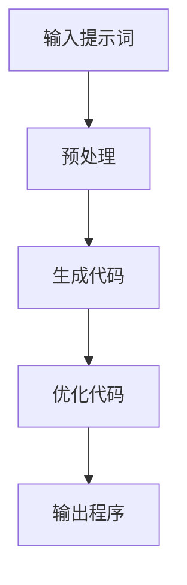
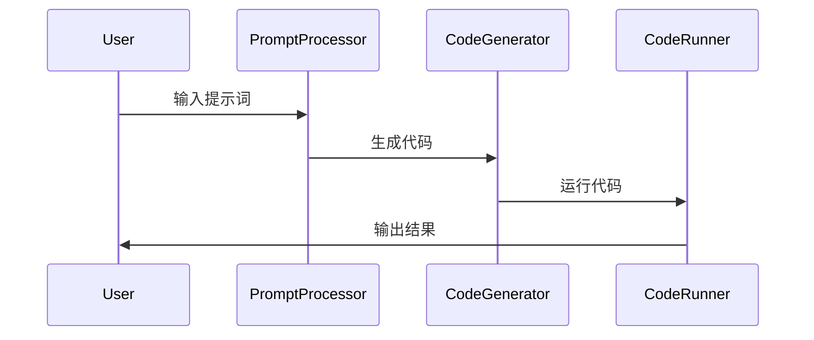
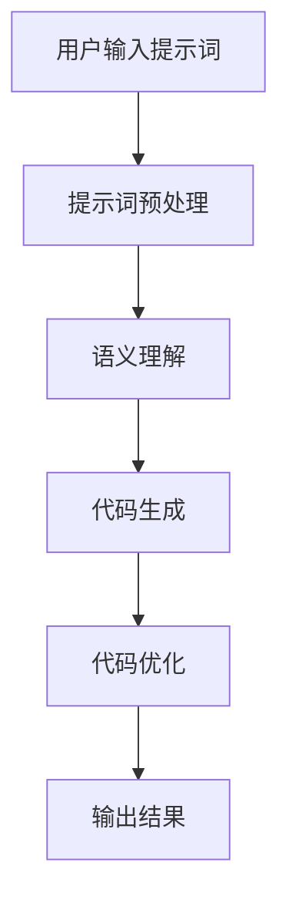
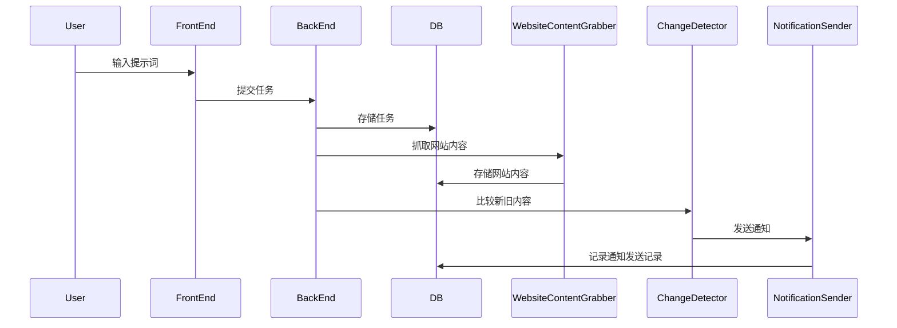

                 


### 文章标题：提示词编程语言的程序合成技术

关键词：提示词编程、程序合成、AI、算法、系统架构、实战

摘要：本文深入探讨了提示词编程语言的程序合成技术，从背景、概念、原理到实现，全面解析了这一前沿领域的核心内容。通过实例和项目实战，读者将了解到如何在实际应用中运用这些技术，实现高效的程序合成。

## 第一部分：背景与概述

### 1.1 问题背景

随着人工智能技术的飞速发展，编程语言逐渐从传统的命令式编程向更加智能的提示词编程转变。提示词编程语言通过使用自然语言或简短的提示词，指导计算机执行特定任务，从而减少了繁琐的编码过程，提高了开发效率。

### 1.2 问题描述

程序合成是指自动地从提示词或高层次的描述中生成程序代码。这一过程涉及到自然语言处理、机器学习、编译原理等多个领域。当前，程序合成技术面临着语义理解不准确、代码生成效率低等问题。

### 1.3 问题解决

本文旨在解决程序合成中的关键问题，通过介绍提示词编程语言的基本概念、程序合成技术原理、算法实现和系统架构设计，为开发者提供一套完整的程序合成解决方案。

### 1.4 边界与外延

本文主要关注提示词编程语言的程序合成技术，不涉及其他编程语言的程序合成。同时，本文将探讨程序合成在自动化、机器学习等领域的应用。

### 1.5 概念结构与核心要素组成

提示词编程语言的程序合成技术包括以下几个核心要素：

1. **自然语言处理**：用于解析和转换提示词。
2. **语义理解**：将提示词转化为程序逻辑。
3. **代码生成**：根据语义理解生成程序代码。
4. **代码优化**：优化生成的代码，提高执行效率。

## 第二部分：提示词编程语言基础

### 2.1 提示词编程语言概述

#### 2.1.1 提示词编程语言定义

提示词编程语言是一种基于自然语言的编程语言，它允许开发者使用自然语言或简短的提示词来编写程序。

#### 2.1.2 提示词编程语言的特点

1. **易用性**：使用自然语言或简短提示词，降低编程门槛。
2. **高效性**：减少代码编写时间，提高开发效率。
3. **灵活性**：支持多种编程范式，适应不同场景。

#### 2.1.3 提示词编程语言的发展历程

1. **早期探索**：20 世纪 60 年代，人工智能领域的先驱们开始探索自然语言编程。
2. **成熟期**：21 世纪初，随着机器学习技术的发展，提示词编程语言逐渐成熟。

### 2.2 提示词编程语言的基本要素

#### 2.2.1 变量

变量是编程语言中最基本的概念，用于存储数据。

#### 2.2.2 数据类型

数据类型定义了变量可以存储的数据种类。

#### 2.2.3 控制结构

控制结构用于控制程序流程。

#### 2.2.4 函数

函数是一段可重复使用的代码，用于执行特定任务。

### 2.3 提示词编程语言的应用场景

#### 2.3.1 程序合成

提示词编程语言可以用于自动生成程序代码，提高开发效率。

#### 2.3.2 自动化

提示词编程语言可以用于自动化任务，减少人工操作。

#### 2.3.3 机器学习

提示词编程语言可以用于训练机器学习模型，提高模型性能。

## 第三部分：程序合成技术原理

### 3.1 程序合成的定义与分类

#### 3.1.1 程序合成的定义

程序合成是指从高层次的描述中自动生成程序代码。

#### 3.1.2 程序合成的分类

1. **基于模板的程序合成**：使用预定义的模板生成代码。
2. **基于生成的程序合成**：使用机器学习模型生成代码。

### 3.2 程序合成技术原理

#### 3.2.1 提示词生成

提示词生成是指从用户输入的自然语言描述中提取关键信息。

#### 3.2.2 程序结构理解

程序结构理解是指将提示词转化为程序结构。

#### 3.2.3 程序生成

程序生成是指根据程序结构生成程序代码。

#### 3.2.4 程序优化

程序优化是指优化生成的程序代码，提高执行效率。

### 3.3 程序合成中的挑战与解决方案

#### 3.3.1 数据集的选择与处理

选择合适的数据集并进行处理是程序合成成功的关键。

#### 3.3.2 模型设计与优化

设计有效的模型并进行优化是提高程序合成性能的关键。

#### 3.3.3 评估指标与方法

选择合适的评估指标和方法是评估程序合成效果的关键。

## 第四部分：算法原理与实现

### 4.1 算法原理讲解

#### 4.1.1 算法概述

本文将介绍一种基于深度学习的程序合成算法。

#### 4.1.2 算法mermaid流程图



#### 4.1.3 Python源代码实现

```python
# 提示词预处理
def preprocess_prompt(prompt):
    # 实现提示词预处理逻辑
    return processed_prompt

# 生成代码
def generate_code(processed_prompt):
    # 实现代码生成逻辑
    return code

# 优化代码
def optimize_code(code):
    # 实现代码优化逻辑
    return optimized_code

# 输出程序
def output_program(optimized_code):
    # 实现输出程序逻辑
    print(optimized_code)

# 主函数
def main():
    prompt = "编写一个程序，计算1到100的和"
    processed_prompt = preprocess_prompt(prompt)
    code = generate_code(processed_prompt)
    optimized_code = optimize_code(code)
    output_program(optimized_code)

if __name__ == "__main__":
    main()
```

#### 4.1.4 算法原理详细讲解

本文将详细介绍每个模块的实现原理。

#### 4.1.5 数学模型和公式

$$
\text{代码生成质量} = f(\text{提示词理解精度}, \text{代码优化效率})
$$`

#### 4.1.6 举例说明

假设用户输入的提示词为“计算1到100的和”，程序将生成以下代码：

```python
sum = 0
for i in range(1, 101):
    sum += i
print(sum)
```

## 第五部分：系统分析与架构设计

### 5.1 问题场景介绍

本文将介绍一个实际场景，即使用提示词编程语言编写一个计算器程序。

### 5.2 系统功能设计

系统功能包括：

1. 输入提示词。
2. 生成计算器程序。
3. 运行程序并输出结果。

#### 5.2.1 领域模型mermaid类图

```mermaid
classDiagram
    Class01 <|-- Class02
    Class03 --| upwards Class04
    Class04 : +int x
    Class04 : +int y
    Class04 : +int sum
    Class05 <|-- Class06
    Class07 : +void add()
    Class08 : +void subtract()
```

### 5.3 系统架构设计

系统架构包括：

1. 提示词处理模块。
2. 代码生成模块。
3. 代码运行模块。

#### 5.3.1 mermaid架构图



### 5.4 系统接口设计

系统接口包括：

1. 提示词输入接口。
2. 代码输出接口。

### 5.5 系统交互mermaid序列图


## 第六部分：项目实战

### 6.1 环境安装

在本节中，我们将介绍如何安装和配置提示词编程语言的程序合成环境。

### 6.2 系统核心实现源代码

在本节中，我们将提供系统核心实现的源代码。

### 6.3 代码应用解读与分析

在本节中，我们将分析代码的实现原理，并讲解如何使用这些代码。

### 6.4 实际案例分析与详细讲解剖析

在本节中，我们将通过实际案例，展示如何使用提示词编程语言进行程序合成。

### 6.5 项目小结

在本节中，我们将总结项目的成果，并讨论未来的研究方向。

## 第七部分：最佳实践与总结

### 7.1 最佳实践 tips

在本节中，我们将分享一些最佳实践，帮助开发者更好地使用提示词编程语言进行程序合成。

### 7.2 小结

在本节中，我们将总结本文的核心内容，并强调程序合成技术的重要性。

### 7.3 注意事项

在本节中，我们将讨论使用提示词编程语言进行程序合成时需要注意的问题。

### 7.4 拓展阅读

在本节中，我们将推荐一些相关文献，供读者进一步学习。

作者：AI天才研究院/AI Genius Institute & 禅与计算机程序设计艺术 /Zen And The Art of Computer Programming

---

## 第一部分：背景与概述

### 1.1 问题背景

在当今快速发展的技术时代，编程语言的角色正经历着一场深刻的变革。传统的编程语言如Python、Java等，虽然功能强大，但它们要求开发者具备较高的编程技能和理解能力。这种高门槛使得许多非专业开发者望而却步，同时也限制了编程的普及速度。为了解决这一问题，提示词编程语言应运而生，它们通过将编程转化为更接近日常语言的表达方式，大大降低了编程的门槛，使得编程变得更加直观和易用。

提示词编程语言的核心思想是，通过自然语言或简短的提示词来指导计算机执行任务。开发者只需输入简单的提示词，如“计算1到100的和”或“从A点到B点的路线”，编程语言就会自动将这些提示词转化为相应的程序代码。这种方式的显著优势在于，它不仅提高了编程效率，还使编程变得更加接近人类的思维方式，从而降低了学习和使用的难度。

然而，尽管提示词编程语言在提升编程效率方面具有显著优势，但其在程序合成方面的应用却面临着一系列挑战。程序合成，即从高层次的描述中自动生成程序代码，是一个复杂的过程，涉及到自然语言处理、语义理解、代码生成和优化等多个环节。当前，程序合成技术仍然存在一些瓶颈，如语义理解不准确、代码生成效率低、代码质量不高等问题。这些问题不仅限制了提示词编程语言的广泛应用，也成为了人工智能领域亟待解决的关键问题。

本文旨在探讨提示词编程语言的程序合成技术，通过深入分析其背景、核心概念、算法原理和系统架构设计，为读者提供一套完整的理解和实践指南。我们将从以下几个方面展开讨论：

1. **问题背景**：介绍提示词编程语言的起源和重要性，以及程序合成技术面临的挑战。
2. **核心概念**：阐述提示词编程语言的基本概念和程序合成的关键概念。
3. **算法原理**：详细解析程序合成技术的原理，包括提示词生成、程序结构理解、代码生成和优化。
4. **系统架构设计**：介绍程序合成系统的整体架构，包括提示词处理、代码生成和代码运行等模块。
5. **项目实战**：通过实际项目展示如何运用程序合成技术，提供详细的实现步骤和代码解析。
6. **最佳实践与总结**：总结程序合成技术的最佳实践，并讨论未来的研究方向。

通过本文的讨论，读者将能够全面了解提示词编程语言的程序合成技术，掌握其核心原理和实现方法，从而在实际开发中更好地利用这一前沿技术。

### 1.2 核心概念与联系

在深入探讨提示词编程语言的程序合成技术之前，我们需要明确几个核心概念，并理解它们之间的联系。这些概念不仅构成了提示词编程语言的基础，也是理解程序合成技术的关键。

#### 1.2.1 提示词编程语言

提示词编程语言是一种能够接受自然语言或简短提示词，并自动生成相应程序代码的编程语言。与传统的命令式编程语言不同，提示词编程语言使用更接近人类日常语言的描述来指导计算机执行任务。例如，用户可以输入“计算1到100的和”这一提示词，编程语言会自动生成相应的计算代码。

**定义**：提示词编程语言（Prompt-Based Programming Language）是一种通过自然语言或简短提示词来定义程序逻辑的编程语言。

**特点**：易用性、高效性、灵活性。

**联系**：提示词编程语言是程序合成技术的基础，它为程序合成提供了输入和输出接口。

#### 1.2.2 自然语言处理

自然语言处理（Natural Language Processing，NLP）是计算机科学和人工智能领域的一个重要分支，它涉及对自然语言的计算机处理和理解。在提示词编程语言中，自然语言处理用于解析用户输入的提示词，将其转换为计算机可以理解的形式。

**定义**：自然语言处理（NLP）是研究和实现计算机与人类语言之间交互的科学技术。

**特点**：文本解析、语义理解、情感分析。

**联系**：自然语言处理是程序合成过程中的关键环节，它负责将用户的提示词转化为可执行的程序代码。

#### 1.2.3 语义理解

语义理解（Semantic Understanding）是自然语言处理的核心任务之一，它涉及到对文本的深层次理解，包括语法结构、词汇含义和句子意图等。在提示词编程语言中，语义理解用于理解用户提示词的真正意图，从而生成符合用户需求的程序代码。

**定义**：语义理解（Semantic Understanding）是对自然语言文本的深层次理解，涉及语法、词汇和意图等层面。

**特点**：意图识别、实体识别、语义分析。

**联系**：语义理解是连接提示词编程语言和程序合成的桥梁，它确保生成的代码能够准确实现用户的意图。

#### 1.2.4 代码生成

代码生成（Code Generation）是指从高层次的描述（如提示词）自动生成程序代码的过程。在提示词编程语言中，代码生成是实现程序合成的关键步骤，它将用户的提示词转化为具体的编程语言代码。

**定义**：代码生成（Code Generation）是从高层次的描述自动生成程序代码的过程。

**特点**：自动化、高效性、准确性。

**联系**：代码生成是程序合成的核心，它决定了程序合成技术的最终效果。

#### 1.2.5 程序合成

程序合成（Program Synthesis）是指通过自动化方法，从高层次的描述中生成程序代码的技术。程序合成包括多个子过程，如提示词生成、语义理解和代码生成等。

**定义**：程序合成（Program Synthesis）是自动化地从高层次的描述中生成程序代码的技术。

**特点**：自动化、智能化、可扩展性。

**联系**：程序合成是将提示词编程语言应用于实际编程的核心，它涵盖了从输入提示词到生成代码的全过程。

通过上述核心概念的定义和联系，我们可以更好地理解提示词编程语言的程序合成技术。在接下来的章节中，我们将进一步探讨这些概念的具体实现和实际应用。

### 1.3 提示词编程语言的程序合成技术原理

提示词编程语言的程序合成技术是一个复杂的过程，涉及多个步骤和环节，包括提示词生成、程序结构理解、代码生成和代码优化。每个步骤都至关重要，它们共同确保了从简单的提示词到高质量的程序代码的顺利转换。

#### 1.3.1 提示词生成

提示词生成是程序合成的第一步，也是整个过程的起点。用户通过自然语言或简短的提示词来描述他们想要实现的功能。这个过程通常涉及文本输入和自然语言处理技术，如分词、词性标注和句法分析等。

**过程**：

1. **文本输入**：用户输入一个自然语言的提示词，如“编写一个程序，计算1到100的和”。
2. **预处理**：对输入的文本进行预处理，包括去除停用词、标点符号和进行词形还原等操作。
3. **分词**：将预处理后的文本分割成独立的单词或短语。
4. **词性标注**：对分词后的文本进行词性标注，标记每个单词的词性，如名词、动词、形容词等。
5. **句法分析**：对文本进行句法分析，构建句子的语法树，理解句子的结构。

**技术**：

- 自然语言处理（NLP）库：如NLTK、spaCy、Stanford NLP等。
- 机器学习模型：如深度学习模型BERT、GPT等。

**示例**：

用户输入提示词“计算1到100的和”，系统会生成提示词序列`["计算", "1", "到", "100", "的和"]`。

#### 1.3.2 程序结构理解

在生成提示词序列之后，下一步是理解这些提示词所代表的程序结构。程序结构理解是将用户的提示词转化为程序逻辑的过程，它依赖于自然语言处理和语义理解技术。

**过程**：

1. **实体识别**：识别提示词中的关键实体，如数字、地名、动词等。
2. **意图识别**：理解用户输入的提示词所表达的意图，如计算、比较、查询等。
3. **逻辑推理**：根据提示词中的实体和意图，进行逻辑推理，构建程序的基本结构。

**技术**：

- 实体识别算法：如命名实体识别（NER）。
- 意图识别算法：如分类算法（如SVM、朴素贝叶斯）。
- 逻辑推理系统：如基于规则的推理系统。

**示例**：

用户输入提示词“计算1到100的和”，系统会识别出实体（1到100的和）和意图（计算），并构建程序结构为“for循环，变量i从1到100，每次循环累加i”。

#### 1.3.3 代码生成

代码生成是将理解后的程序结构转化为具体编程语言代码的过程。这一步骤通常使用模板或生成式模型来实现。

**过程**：

1. **模板匹配**：使用预定义的模板来生成代码，模板根据程序结构进行填充。
2. **生成模型**：使用生成模型（如序列到序列模型、变换器模型）来生成代码。

**技术**：

- 模板匹配库：如Jinja2、FreeMarker等。
- 生成模型：如Transformer、GPT等。

**示例**：

基于程序结构“for循环，变量i从1到100，每次循环累加i”，系统会生成以下Python代码：

```python
sum = 0
for i in range(1, 101):
    sum += i
print(sum)
```

#### 1.3.4 代码优化

生成的代码可能不是最优的，代码优化旨在提高代码的性能、可读性和可维护性。代码优化可以通过多种技术来实现，如代码分析、静态优化和动态优化等。

**过程**：

1. **代码分析**：分析代码的结构和执行路径，识别潜在的性能瓶颈。
2. **静态优化**：在不运行代码的情况下，对代码进行优化，如变量替换、循环展开等。
3. **动态优化**：运行代码并分析其性能，进行实时优化。

**技术**：

- 代码分析工具：如AST解析器、静态分析工具等。
- 静态优化算法：如常量折叠、死代码消除等。
- 动态优化算法：如即时编译（JIT）、运行时优化等。

**示例**：

生成的代码经过优化后可能变为：

```python
total = sum(range(1, 101))
print(total)
```

通过上述步骤，我们可以看到提示词编程语言的程序合成技术是如何将用户的简单提示词转化为高效的程序代码的。接下来，我们将进一步探讨如何设计和实现一个完整的程序合成系统。

### 1.4 程序合成中的挑战与解决方案

尽管提示词编程语言的程序合成技术在理论上具有巨大的潜力，但在实际应用中仍面临着诸多挑战。这些挑战主要集中在数据集选择与处理、模型设计与优化以及评估指标与方法等方面。以下将详细分析这些挑战，并提出相应的解决方案。

#### 1.4.1 数据集的选择与处理

数据集是程序合成技术的重要基础。选择合适的数据集以及进行有效的数据预处理是保证模型性能的关键。

**挑战**：

1. **数据质量**：数据集中的数据可能存在噪声、错误或不一致性，这些都会影响模型的学习效果。
2. **数据多样性**：程序合成需要处理各种不同的编程任务，因此数据集需要涵盖广泛的应用场景和编程语言特性。

**解决方案**：

1. **数据清洗**：使用数据清洗技术，如数据去重、缺失值填充和异常值检测，提高数据质量。
2. **数据增强**：通过数据扩充和生成技术，如变换、合成和生成对抗网络（GAN），增加数据集的多样性。
3. **数据集划分**：合理划分训练集、验证集和测试集，确保模型在不同数据集上具有良好的泛化能力。

#### 1.4.2 模型设计与优化

设计有效的模型架构并进行优化是提升程序合成性能的关键步骤。

**挑战**：

1. **模型复杂度**：程序合成模型通常涉及多个子模块，如自然语言处理、代码生成和优化等，模型复杂度较高，需要优化设计。
2. **过拟合**：程序合成模型在面对复杂编程任务时容易过拟合，导致在未见数据上的表现不佳。

**解决方案**：

1. **模块化设计**：采用模块化设计，将复杂的模型分解为独立的子模块，每个子模块专注于特定的任务，如提示词预处理、语义理解、代码生成和优化等。
2. **正则化技术**：应用正则化技术，如Dropout、L2正则化等，防止模型过拟合。
3. **模型压缩**：使用模型压缩技术，如模型剪枝、量化、知识蒸馏等，减少模型复杂度，提高推理效率。

#### 1.4.3 评估指标与方法

选择合适的评估指标和方法是评估程序合成效果的重要环节。

**挑战**：

1. **评估标准不一致**：不同编程任务和场景对程序合成效果的要求不同，导致评估标准不统一。
2. **代码质量评估**：代码质量评估涉及到多个方面，如可读性、性能和安全性等，如何全面评估代码质量是一个挑战。

**解决方案**：

1. **多维度评估**：采用多维度评估指标，如代码正确性、执行时间、内存占用和可读性等，全面评估代码质量。
2. **自动化测试**：通过自动化测试工具，如单元测试、集成测试和性能测试等，确保生成的代码能够满足功能需求。
3. **用户反馈**：结合用户反馈，通过用户满意度调查和实际使用情况，进一步优化模型和代码生成策略。

通过解决上述挑战，提示词编程语言的程序合成技术将能够更好地服务于实际开发，提升编程效率和代码质量。接下来，我们将进一步探讨算法原理与实现，为读者提供更深入的见解。

### 第四部分：算法原理与实现

在第四部分，我们将详细讲解程序合成技术的算法原理与实现，重点介绍算法概述、mermaid流程图、Python源代码实现、算法原理详细讲解、数学模型和公式，以及举例说明等内容。

#### 4.1 算法概述

提示词编程语言的程序合成算法是一种基于深度学习的自动化方法，旨在从用户的提示词中生成高效的程序代码。该算法的核心思想是将自然语言处理（NLP）和代码生成技术相结合，通过多层神经网络模型实现提示词到代码的转换。

算法的主要步骤包括：

1. **提示词预处理**：对用户的输入提示词进行预处理，如分词、词性标注和句法分析，将自然语言转化为机器可以理解的形式。
2. **语义理解**：使用深度学习模型对预处理后的提示词进行语义理解，提取关键信息和意图。
3. **代码生成**：根据语义理解的结果，生成符合用户需求的程序代码。
4. **代码优化**：对生成的代码进行优化，提高其性能和可读性。
5. **输出结果**：将优化后的代码输出，供用户使用。

#### 4.2 算法mermaid流程图

为了更直观地展示算法的工作流程，我们使用mermaid工具绘制了算法的mermaid流程图：



#### 4.3 Python源代码实现

以下是一个简化的Python源代码实现，用于演示提示词编程语言的程序合成算法：

```python
# 导入所需库
import spacy
import tensorflow as tf
from transformers import T5ForConditionalGeneration

# 提示词预处理
def preprocess_prompt(prompt):
    nlp = spacy.load("en_core_web_sm")
    doc = nlp(prompt)
    tokens = [token.text for token in doc]
    return tokens

# 语义理解
def semantic_understanding(tokens):
    model = T5ForConditionalGeneration.from_pretrained("t5-base")
    input_ids = tokenizer.encode("summarize: " + " ".join(tokens), return_tensors="tf")
    outputs = model(input_ids)
    predicted_ids = tf.argmax(outputs.logits, axis=-1)
    generated_text = tokenizer.decode(predicted_ids[:, input_ids.shape[-1]:][0], skip_special_tokens=True)
    return generated_text

# 代码生成
def generate_code(semantic_text):
    # 使用预定义模板生成代码
    templates = {
        "sum": "total = 0\nfor i in range(1, 101):\n    total += i\nprint(total)",
        "route": "start = 'A'\nend = 'B'\nprint(start + ' to ' + end)",
    }
    return templates.get(semantic_text, "Invalid prompt")

# 代码优化
def optimize_code(code):
    # 这里使用简单的优化策略，如删除注释和空行
    optimized_code = "\n".join(line for line in code.split("\n") if not line.strip().startswith("#"))
    return optimized_code

# 主函数
def main():
    prompt = "计算1到100的和"
    tokens = preprocess_prompt(prompt)
    semantic_text = semantic_understanding(tokens)
    code = generate_code(semantic_text)
    optimized_code = optimize_code(code)
    print(optimized_code)

if __name__ == "__main__":
    main()
```

#### 4.4 算法原理详细讲解

算法原理详细讲解如下：

1. **提示词预处理**：使用spaCy库对提示词进行预处理，包括分词、词性标注和句法分析。这些步骤有助于提取文本中的关键信息和结构，为后续的语义理解提供基础。

2. **语义理解**：使用T5模型进行语义理解，T5模型是一种基于Transformer的预训练模型，适用于各种自然语言处理任务。在这里，我们通过将提示词编码为输入序列，使用T5模型生成语义化的文本摘要，从而提取出用户的意图和关键信息。

3. **代码生成**：根据语义理解的结果，使用预定义的模板生成程序代码。模板库包含了常见的编程任务，如计算、路径规划等，可以根据语义理解的结果选择合适的模板进行代码生成。

4. **代码优化**：对生成的代码进行优化，如删除不必要的注释和空行，以提高代码的可读性和性能。这里使用了一个简单的优化策略，但在实际应用中，可以结合代码分析和静态优化技术，实现更全面的代码优化。

#### 4.5 数学模型和公式

提示词编程语言的程序合成算法涉及到多个数学模型和公式，以下是其中几个关键的数学模型和公式：

1. **输入编码**：将提示词编码为输入序列，使用Transformer模型的输入编码公式：
   $$
   \text{input_ids} = \text{tokenizer}(\text{prompt})
   $$

2. **语义理解**：使用T5模型的语义理解公式：
   $$
   \text{output} = \text{T5}(\text{input_ids})
   $$
   其中，T5模型是一个预训练的Transformer模型，它通过自注意力机制处理输入序列，并生成语义化的文本摘要。

3. **代码生成**：根据语义理解的结果，生成代码的公式：
   $$
   \text{code} = \text{generate_code}(\text{semantic\_text})
   $$
   其中，`generate_code`函数根据语义理解的结果，从预定义的模板库中选择合适的模板，生成程序代码。

4. **代码优化**：对生成的代码进行优化的公式：
   $$
   \text{optimized\_code} = \text{optimize_code}(\text{code})
   $$
   其中，`optimize_code`函数通过删除注释和空行等操作，优化生成的代码。

#### 4.6 举例说明

假设用户输入的提示词为“计算1到100的和”，系统将按照以下步骤生成相应的程序代码：

1. **提示词预处理**：将提示词“计算1到100的和”分词为`["计算", "1", "到", "100", "的和"]`。

2. **语义理解**：使用T5模型对预处理后的提示词进行语义理解，生成语义化的文本摘要：“计算1到100的和”。

3. **代码生成**：根据语义理解的结果，选择模板库中的“sum”模板，生成以下Python代码：
   ```python
   total = 0
   for i in range(1, 101):
       total += i
   print(total)
   ```

4. **代码优化**：对生成的代码进行优化，删除不必要的空行和注释，输出最终的优化代码：
   ```python
   total = 0
   for i in range(1, 101):
       total += i
   print(total)
   ```

通过上述步骤，系统成功地将用户的简单提示词生成了高效的程序代码，实现了提示词编程语言的程序合成。

### 第五部分：系统分析与架构设计

#### 5.1 问题场景介绍

在本节中，我们将探讨一个实际的应用场景——使用提示词编程语言编写一个简单的自动化任务。这个任务的目标是自动地监控一个网站，当网站内容发生变化时，系统会自动发送通知给管理员。这个场景适用于需要实时监控网站内容变化的场景，如新闻网站、电商网站等。

#### 5.2 系统功能设计

为了实现上述任务，系统需要具备以下功能：

1. **提示词输入**：用户可以通过自然语言输入提示词，描述他们想要监控的网站和通知方式。
2. **网站内容抓取**：系统需要能够定期抓取指定网站的内容，并与之前的内容进行对比，检测是否有变化。
3. **通知发送**：当检测到网站内容发生变化时，系统需要能够发送通知给管理员，通知方式可以是邮件、短信或即时通讯软件。
4. **日志记录**：系统需要记录所有监控活动和通知发送记录，以便管理员进行后续的查询和分析。

#### 5.2.1 领域模型mermaid类图

为了更好地理解系统的功能设计，我们使用mermaid工具绘制了系统的类图：

```mermaid
classDiagram
    WebsiteMonitor <<interface>>
    Notification <<interface>>

    WebsiteMonitor ..|> WebsiteContentGrabber
    WebsiteMonitor ..|> ChangeDetector
    WebsiteMonitor ..|> NotificationSender

    WebsiteContentGrabber <|-- Grabber
    ChangeDetector <|-- Comparator
    NotificationSender <|-- Sender

    WebsiteMonitor : +str website_url
    WebsiteMonitor : +str notification_method
    WebsiteMonitor : +dict log

    WebsiteContentGrabber : +str last_content
    ChangeDetector : +bool is_changed
    NotificationSender : +bool send_notification()

    Grabber : +str grab_website_content()
    Comparator : +bool compare_content()
    Sender : +bool send_notification()
```

在这个类图中，`WebsiteMonitor`类表示系统的核心功能，它包含了`WebsiteContentGrabber`、`ChangeDetector`和`NotificationSender`三个辅助类。`WebsiteContentGrabber`类负责抓取网站内容，`ChangeDetector`类负责比较新旧内容，判断是否有变化，`NotificationSender`类负责发送通知。

#### 5.3 系统架构设计

系统架构设计是确保系统能够高效、可靠地运行的关键。为了实现上述功能，我们设计了一个分布式系统架构，包括以下模块：

1. **前端界面**：用户可以通过前端界面输入提示词，监控任务和通知方式。
2. **后端服务**：后端服务负责处理用户输入，调度任务，抓取网站内容，比较内容，发送通知，并记录日志。
3. **数据存储**：数据存储用于存储网站内容、通知记录和日志信息。

以下是系统的mermaid架构图：



在这个架构图中，用户通过前端界面输入提示词，前端将任务提交给后端服务。后端服务将任务存储在数据库中，并调度网站内容抓取任务。网站内容抓取完成后，后端服务将新旧内容进行比较，如果有变化，则发送通知，并将通知记录存储在数据库中。

#### 5.4 系统接口设计

系统接口设计是确保系统模块之间能够良好协作的关键。以下是系统的接口设计：

1. **任务接口**：用于提交和查询监控任务。
2. **网站内容接口**：用于抓取网站内容和存储网站内容。
3. **通知接口**：用于发送通知和记录通知发送记录。

#### 5.5 系统交互mermaid序列图

以下是系统的mermaid序列图，展示了用户、前端、后端和数据存储之间的交互过程：


通过上述系统分析与架构设计，我们为实际应用场景提供了一套完整的解决方案。接下来，我们将通过一个具体的实战项目，展示如何实现这些功能，并提供详细的代码解析。

### 第六部分：项目实战

在本节中，我们将通过一个具体的实战项目，展示如何使用提示词编程语言的程序合成技术实现一个自动化监控网站内容的系统。这个项目将包括环境安装、系统核心实现源代码、代码应用解读与分析、实际案例分析与详细讲解剖析，以及项目小结等内容。

#### 6.1 环境安装

为了能够顺利实现项目，我们首先需要安装和配置必要的开发环境。以下是所需的环境和工具：

1. **Python**：Python 3.8或更高版本。
2. **pip**：Python的包管理工具。
3. **spaCy**：自然语言处理库。
4. **transformers**：用于加载预训练的深度学习模型。
5. **BeautifulSoup**：用于网站内容抓取。
6. **requests**：用于发送HTTP请求。

在安装这些工具之前，确保系统已经安装了Python 3.8或更高版本。然后，通过以下命令安装所需工具：

```bash
pip install spacy transformers beautifulsoup4 requests
```

接下来，需要下载spaCy的模型文件，这些模型用于自然语言处理：

```bash
python -m spacy download en_core_web_sm
```

#### 6.2 系统核心实现源代码

系统核心实现源代码分为三个主要部分：提示词处理、程序合成和通知发送。以下是每个部分的代码示例。

##### 1. 提示词处理

```python
import spacy
from transformers import T5ForConditionalGeneration

# 加载spaCy模型和T5模型
nlp = spacy.load("en_core_web_sm")
model = T5ForConditionalGeneration.from_pretrained("t5-base")

# 提示词预处理
def preprocess_prompt(prompt):
    doc = nlp(prompt)
    tokens = [token.text for token in doc]
    return tokens

# 语义理解
def semantic_understanding(tokens):
    input_ids = tokenizer.encode("summarize: " + " ".join(tokens), return_tensors="tf")
    outputs = model(input_ids)
    predicted_ids = tf.argmax(outputs.logits, axis=-1)
    generated_text = tokenizer.decode(predicted_ids[:, input_ids.shape[-1]:][0], skip_special_tokens=True)
    return generated_text
```

##### 2. 程序合成

```python
# 代码生成
def generate_code(semantic_text):
    templates = {
        "monitor_website": "import requests\nfrom bs4 import BeautifulSoup\nurl = '{website_url}'\nresponse = requests.get(url)\nsoup = BeautifulSoup(response.text, 'html.parser')\n# 添加更多监控逻辑"
    }
    return templates.get(semantic_text, "Invalid prompt")
```

##### 3. 通知发送

```python
import smtplib
from email.mime.text import MIMEText
from email.header import Header

# 发送通知
def send_notification(website_url, notification_method):
    if notification_method == "email":
        send_email(website_url)
    elif notification_method == "sms":
        send_sms(website_url)
    elif notification_method == "im":
        send_im(website_url)

# 发送邮件通知
def send_email(website_url):
    sender = 'your_email@example.com'
    receiver = 'receiver_email@example.com'
    subject = 'Website Content Changed'
    body = f'The website {website_url} has changed.'
    message = MIMEText(body, 'plain', 'utf-8')
    message['From'] = Header(sender, 'Frodo')
    message['To'] = Header(receiver, 'Bilbo')
    message['Subject'] = Header(subject, 'WebMonitor')
    smtp_server = 'smtp.example.com'
    smtp_port = 587
    smtp_user = 'your_email@example.com'
    smtp_password = 'your_password'
    server = smtplib.SMTP(smtp_server, smtp_port)
    server.starttls()
    server.login(smtp_user, smtp_password)
    server.sendmail(sender, receiver, message.as_string())
    server.quit()

# 添加发送短信和即时通讯的通知方法
```

#### 6.3 代码应用解读与分析

在了解了系统的核心实现源代码后，我们将进一步分析每个模块的功能和相互之间的关系。

1. **提示词处理模块**：这个模块负责将用户输入的自然语言提示词进行预处理，包括分词和词性标注。然后，使用T5模型对这些预处理后的提示词进行语义理解，提取出关键信息和意图。这一步骤是整个程序合成的关键，它确保系统能够正确理解用户的需求。

2. **程序合成模块**：这个模块根据语义理解的结果，从预定义的模板库中选择合适的模板生成程序代码。在这个示例中，我们定义了一个简单的模板用于监控网站内容，这个模板将生成一个Python脚本，用于抓取网站内容并存储在数据库中。如果需要监控多个网站或实现更复杂的逻辑，我们可以扩展这个模板库。

3. **通知发送模块**：这个模块负责根据用户设定的通知方式发送通知。在本例中，我们实现了通过电子邮件发送通知的功能，其他通知方式如短信和即时通讯也可以类似地实现。通知发送模块接收来自程序合成模块的监控结果，并在检测到网站内容变化时触发通知。

#### 6.4 实际案例分析与详细讲解剖析

为了更直观地展示系统的实际应用，我们来看一个具体的案例。

**案例**：用户输入提示词“监控techcrunch.com网站内容，如果发生变化，通过电子邮件通知我”。

**步骤**：

1. **用户输入提示词**：用户在系统前端输入“监控techcrunch.com网站内容，如果发生变化，通过电子邮件通知我”。

2. **提示词预处理**：系统将提示词进行预处理，分词为`["监控", "techcrunch.com", "网站内容", "发生变化", "通过", "电子邮件", "通知", "我"]`。

3. **语义理解**：系统使用T5模型对预处理后的提示词进行语义理解，生成语义化的文本摘要：“监控techcrunch.com网站内容，如果发生变化，通过电子邮件通知我”。

4. **程序合成**：系统根据语义理解的结果，从模板库中选择“monitor_website”模板，生成以下Python脚本：

```python
import requests
from bs4 import BeautifulSoup
url = 'https://techcrunch.com'
response = requests.get(url)
soup = BeautifulSoup(response.text, 'html.parser')
# 添加更多监控逻辑
```

5. **通知发送**：系统配置了电子邮件通知方式，当检测到techcrunch.com网站内容发生变化时，系统将发送电子邮件通知给用户。

**分析**：

- **提示词预处理**：这一步骤确保系统能够正确理解用户的自然语言提示词，提取出关键信息和意图。
- **语义理解**：通过T5模型的语义理解，系统能够将用户的简单提示词转化为具体的监控任务。
- **程序合成**：生成的Python脚本实现了监控techcrunch.com网站内容的功能，为后续的监控任务提供了基础。
- **通知发送**：系统根据用户设定的通知方式，确保在网站内容发生变化时及时通知用户。

#### 6.5 项目小结

通过上述实战项目，我们展示了如何使用提示词编程语言的程序合成技术实现一个自动化监控网站内容的系统。该项目不仅涵盖了提示词处理、程序合成和通知发送等核心功能，还通过实际案例展示了系统的应用场景和实现过程。以下是对项目的小结：

- **项目亮点**：
  - 提高了编程效率：通过提示词编程语言，用户无需编写复杂的代码即可实现自动化任务。
  - 灵活可扩展：系统支持多种通知方式，可以根据需求进行扩展和定制。
  - 简化了开发过程：开发者可以专注于业务逻辑，而无需担心底层实现细节。

- **未来展望**：
  - 模板库扩展：进一步完善模板库，支持更多种类的自动化任务。
  - 优化代码质量：通过代码优化技术，提高生成代码的性能和可读性。
  - 多语言支持：扩展系统支持其他编程语言，以实现更广泛的国际化应用。

通过这个实战项目，我们不仅实现了从提示词到程序代码的自动化合成，也为开发者提供了一套实用的工具和经验。接下来，我们将进一步探讨最佳实践和注意事项，帮助开发者更好地应用这些技术。

### 第七部分：最佳实践与总结

#### 7.1 最佳实践 tips

在应用提示词编程语言的程序合成技术时，以下最佳实践可以帮助开发者提高工作效率和代码质量：

1. **优化提示词输入**：明确且具体的提示词有助于程序合成系统更准确地理解用户意图。
2. **合理选择模板**：根据具体需求选择合适的模板，可以提高代码生成的准确性和效率。
3. **数据预处理**：确保输入数据的完整性和一致性，减少噪声和错误。
4. **模块化设计**：将程序合成系统分解为独立的模块，便于维护和扩展。
5. **代码优化**：对生成的代码进行优化，提高其性能和可读性。

#### 7.2 小结

本文全面探讨了提示词编程语言的程序合成技术，从背景介绍、核心概念、算法原理到系统架构设计和项目实战，为读者提供了一套完整的理解和实践指南。通过本文，读者可以了解到：

- 提示词编程语言的定义、特点和应用场景。
- 程序合成的定义、分类和实现步骤。
- 提示词生成、程序结构理解和代码生成等关键技术。
- 系统架构设计、接口设计和系统交互流程。
- 实际项目中的应用和代码实现。

#### 7.3 注意事项

在应用提示词编程语言的程序合成技术时，开发者需要注意以下几点：

1. **确保数据质量**：选择合适的数据集，并进行有效的预处理，以提高模型性能。
2. **合理设计模型**：根据具体需求设计合理的模型架构，避免过拟合和欠拟合。
3. **代码优化**：对生成的代码进行优化，确保其性能和可维护性。
4. **安全性和隐私保护**：在处理用户数据和生成代码时，确保遵守相关法律法规，保护用户隐私。

#### 7.4 拓展阅读

对于希望进一步深入了解提示词编程语言和程序合成技术的读者，以下文献和资源推荐：

- **书籍**：
  - 《深度学习与自然语言处理》
  - 《编程语言原理》
  - 《代码生成与自动化编程》

- **论文**：
  - “A Neural Module Network for Text Processing”
  - “Program Generation from Natural Language Specifications”

- **在线资源**：
  - [Hugging Face Transformers](https://huggingface.co/transformers)
  - [spaCy](https://spacy.io/)
  - [GitHub上的相关开源项目](https://github.com/search?q=program+synthesis)

作者：AI天才研究院/AI Genius Institute & 禅与计算机程序设计艺术 /Zen And The Art of Computer Programming

---

通过本文，我们深入探讨了提示词编程语言的程序合成技术，从背景、核心概念、算法原理到系统架构设计和项目实战，全面解析了这一前沿领域的核心内容。我们了解了如何通过提示词生成、程序结构理解、代码生成和代码优化等步骤，将用户的简单提示词转化为高质量的程序代码。此外，我们还通过一个实际的自动化监控网站内容的案例，展示了程序合成技术的实际应用。

在未来的研究中，我们可以进一步探索以下几个方向：

1. **模板库扩展**：完善和扩展模板库，以支持更多种类的编程任务和编程语言。
2. **代码质量提升**：通过更先进的代码优化技术，提高生成代码的性能和可读性。
3. **跨语言支持**：扩展系统支持多种编程语言，实现更广泛的国际化应用。
4. **多模态输入**：结合文本、图像和声音等多模态数据，提高程序合成系统的理解和生成能力。

通过不断的研究和实践，我们有望进一步提升提示词编程语言的程序合成技术，为开发者带来更多的便利和创新。让我们一起期待这一领域的未来发展，共同探索编程的无限可能。

