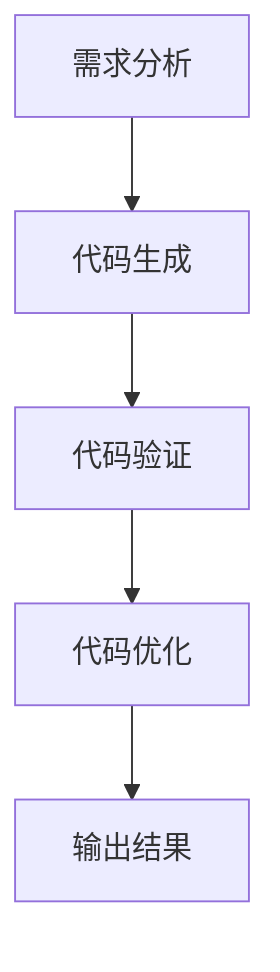

                 

### 第1章：引言

#### 1.1 问题背景

在当今快速发展的信息技术时代，编程语言的研究与发展已经成为推动科技进步的关键因素之一。随着人工智能、大数据、云计算等技术的日益成熟，传统的编程方式面临着前所未有的挑战。程序员在编写复杂应用程序时，往往需要处理大量繁琐的细节，导致开发效率低下，代码质量难以保障。为了解决这一问题，研究人员开始探索新的编程语言设计理念，其中提示词编程语言的程序合成技术成为了一个备受关注的方向。

提示词编程语言（Prompt-Based Programming Languages，简称PPL）是一种基于用户输入的提示词来生成程序的编程语言。与传统编程语言不同，PPL侧重于简化编程过程中的复杂度，通过提供更为直观和易于理解的提示词，帮助程序员快速构建应用程序。程序合成技术（Program Synthesis）则是一种自动化的编程技术，它通过分析用户的提示词和需求，自动生成相应的程序代码。

#### 1.2 问题描述

目前，编程领域面临的挑战主要体现在以下几个方面：

1. **代码复杂度增加**：随着应用程序规模的不断扩大，代码的复杂度也随之增加。传统的编程方式难以应对这种复杂性，导致代码的可维护性和可读性下降。

2. **开发效率低下**：程序员在编写代码时，往往需要花费大量时间在细节处理上，导致开发效率低下。特别是在构建复杂应用程序时，这种效率问题尤为突出。

3. **编程语言多样性**：现有的编程语言种类繁多，每种语言都有其特定的应用场景。这使得程序员在开发过程中需要不断学习和适应不同的编程语言，增加了学习成本。

4. **代码质量问题**：由于开发效率低下，程序员在编写代码时可能会出现疏忽和错误，导致代码质量难以保障。这些错误可能会在后续的开发和维护过程中引发一系列问题。

为了应对这些挑战，研究人员开始探索新的编程语言设计理念，其中提示词编程语言的程序合成技术成为了一个备受关注的方向。

#### 1.3 问题解决方案

提示词编程语言的程序合成技术提供了一种新的解决方案，其主要优势体现在以下几个方面：

1. **简化编程过程**：通过使用提示词，程序员可以更加直观地表达程序的需求，从而简化了编程过程。提示词编程语言提供了一系列的预定义提示词库，用户可以根据需要选择合适的提示词来构建程序。

2. **提高开发效率**：提示词编程语言可以自动生成程序代码，从而减少了程序员在编写代码时需要处理的大量细节。这不仅提高了开发效率，还降低了开发成本。

3. **易于学习和使用**：提示词编程语言的设计理念使得编程语言更加贴近自然语言，用户可以更加轻松地学习和使用。这对于非专业的编程人员来说，是一个巨大的优势。

4. **提高代码质量**：通过自动生成程序代码，可以减少人为错误的发生，从而提高代码质量。此外，提示词编程语言通常具有较好的可维护性和可读性，有助于程序员在后续的开发和维护过程中更好地理解和使用代码。

#### 1.4 边界与外延

本文的研究范围主要集中在提示词编程语言的程序合成技术，具体包括以下几个方面：

1. **核心概念与联系**：本文将介绍提示词编程语言和程序合成技术的基本概念，并分析它们之间的联系。

2. **算法原理讲解**：本文将详细阐述程序合成技术的算法原理，包括算法流程、Python源代码讲解以及数学模型和公式。

3. **系统分析与架构设计方案**：本文将介绍一个基于提示词编程语言的程序合成系统的设计与实现，包括系统功能设计、系统架构设计、系统接口设计和系统交互流程。

4. **项目实战**：本文将通过一个实际案例，展示如何使用提示词编程语言的程序合成技术来实现一个具体的应用程序。

5. **最佳实践与注意事项**：本文将提供一些最佳实践技巧和注意事项，帮助读者更好地应用提示词编程语言的程序合成技术。

通过本文的研究，我们希望能够为编程领域带来一些新的思路，推动提示词编程语言的程序合成技术在实际应用中的发展。同时，我们也期待读者能够通过本文的学习，更好地理解和应用这一先进的技术。

### 第2章：提示词编程语言概述

#### 2.1 核心概念

提示词编程语言（Prompt-Based Programming Languages，简称PPL）是一种特殊的编程语言，其核心概念在于通过用户输入的提示词来生成程序代码。与传统编程语言不同，PPL更注重的是如何简化编程过程的复杂性，使得程序员可以更加专注于业务逻辑的实现，而无需过多关注代码细节。

**提示词（Prompt）**：提示词是PPL中一个至关重要的概念，它是用户与编程语言交互的接口。提示词可以是自然语言描述、图形化界面元素、甚至是音视频信号。通过提示词，用户可以传达其需求，编程语言则根据这些需求生成相应的程序代码。

**语法**：PPL的语法设计通常更加简洁直观，以便于用户理解和使用。提示词通常具有明确的语义和结构，使得编程语言可以准确地解析并生成对应的代码。

**语义解析**：语义解析是PPL的核心技术之一，它负责将用户的提示词转换为程序代码。这一过程通常包括自然语言处理、模式匹配和代码生成等步骤。

**代码生成**：代码生成是PPL的最终目标，即根据用户的提示词生成可执行的程序代码。这一过程通常通过特定的算法和工具来实现。

**集成开发环境（IDE）**：PPL通常配备有专门的集成开发环境，以方便用户编写、调试和运行程序。IDE提供了丰富的提示词库、代码生成工具和调试功能，帮助用户更加高效地进行编程。

#### 2.2 特性对比表格

为了更好地理解不同提示词编程语言的特性和适用场景，我们下面列出一个特性对比表格。

| 提示词编程语言 | 特性                     | 适用场景                 |
| -------------- | ------------------------ | ------------------------ |
| LISP           | 函数式编程，灵活的宏系统 | 科学计算，图形处理       |
| Prolog         | 逻辑编程，模式匹配       | 数据库查询，自动推理     |
| Raku           | 面向对象，强大的正则表达式 | 文本处理，网络编程       |
| Python         | 易于理解，丰富的库支持   | 数据分析，人工智能       |
| F#             | 函数式编程，类型安全     | 软件工程，人工智能       |
| Snap!          | 图形化编程，模块化       | 教育编程，游戏开发       |

#### 2.3 ER实体关系图

为了更好地展示提示词编程语言与程序合成技术之间的关系，我们使用ER实体关系图来描述。

```mermaid
erDiagram
    User ||--|{ Prompt }
    Prompt ||--|{ Syntax }
    Prompt ||--|{ Semantics }
    Prompt ||--|{ Code }
    Code ||--|{ IDE }
    IDE ||--|{ Tool }
```

在这个ER实体关系图中，User（用户）是发起提示的主体，通过Prompt（提示）与编程语言交互。Prompt（提示）与Syntax（语法）、Semantics（语义）和Code（代码）之间存在直接关系，其中Syntax负责语法解析，Semantics负责语义解析，Code则是最终生成的程序代码。IDE（集成开发环境）与Code之间存在依赖关系，IDE提供了工具（Tool）来辅助用户进行编程。

通过上述介绍，我们可以看到提示词编程语言的核心概念、特性对比和ER实体关系图，这为我们进一步探讨程序合成技术奠定了基础。在接下来的章节中，我们将详细分析程序合成技术的算法原理，并展示如何在实际项目中应用这一技术。

### 第3章：程序合成技术基础

#### 3.1 算法原理

程序合成技术（Program Synthesis）是一种自动化编程技术，其核心思想是通过分析用户的提示词和需求，自动生成相应的程序代码。程序合成技术的基本流程可以分为以下几个步骤：

1. **需求分析**：首先，程序合成系统需要接收用户的提示词，并将其转化为结构化的需求描述。这一步骤通常涉及到自然语言处理和语义解析技术，以确保系统能够准确理解用户的意图。

2. **代码生成**：在需求分析完成后，程序合成系统会根据需求描述生成相应的程序代码。这一步骤通常涉及到模板匹配、代码生成算法和优化技术。

3. **代码验证**：生成的代码需要经过验证，以确保其能够正确执行并满足用户的需求。验证过程可以包括静态分析、动态执行和测试用例生成等。

4. **代码优化**：验证通过后，系统还可以对生成的代码进行优化，以提高其性能和可读性。优化过程可以包括代码重构、算法优化和编译器优化等。

程序合成技术的核心在于代码生成算法，这些算法通常基于以下几种原理：

1. **模板匹配**：模板匹配是一种简单的代码生成方法，它通过预定义的代码模板来生成程序。当用户输入提示词时，系统会根据模板进行匹配，生成对应的代码。这种方法通常适用于规则明确、场景简单的应用。

2. **约束满足问题（CSP）**：约束满足问题是一种解决组合优化问题的通用方法。在程序合成中，CSP用于生成满足特定约束条件的程序。用户可以定义各种约束，如变量范围、函数依赖和类型检查等，系统则根据这些约束生成相应的代码。

3. **遗传算法**：遗传算法是一种模拟自然进化的优化算法。在程序合成中，遗传算法用于搜索最优的程序结构。系统首先生成一组随机程序，然后通过交叉、变异和选择等操作，逐步优化程序，直至找到满足需求的解。

4. **图灵完全算法**：图灵完全算法是一种通用的计算模型，可以解决所有可计算问题。在程序合成中，图灵完全算法用于生成具有任意复杂度的程序。这种方法通常适用于复杂的应用场景，但计算成本较高。

#### 3.2 Mermaid流程图

为了更直观地展示程序合成技术的算法原理，我们使用Mermaid绘制了一个简化的流程图。



在这个流程图中，A代表需求分析，B代表代码生成，C代表代码验证，D代表代码优化，E代表输出结果。每个步骤都是程序合成过程中不可或缺的一部分。

#### 3.3 Python源代码讲解

为了更好地理解程序合成技术，我们提供了一个简单的Python示例代码。这个示例代码使用模板匹配的方法，根据用户的提示词生成一个简单的计算器程序。

```python
# 程序合成示例：简单计算器

def parse_prompt(prompt):
    """将提示词解析为操作和数值"""
    tokens = prompt.split()
    operation = tokens[0]
    number1 = float(tokens[1])
    number2 = float(tokens[3])
    return operation, number1, number2

def generate_code(operation, number1, number2):
    """根据操作生成计算代码"""
    if operation == "add":
        code = f"{number1} + {number2}"
    elif operation == "subtract":
        code = f"{number1} - {number2}"
    elif operation == "multiply":
        code = f"{number1} * {number2}"
    elif operation == "divide":
        code = f"{number1} / {number2}"
    else:
        raise ValueError(f"不支持的运算符：{operation}")
    return code

def main():
    """主函数，接收用户输入并生成代码"""
    prompt = input("请输入计算提示（如：'add 2 3'）：")
    operation, number1, number2 = parse_prompt(prompt)
    code = generate_code(operation, number1, number2)
    print(f"生成的计算代码：{code}")

if __name__ == "__main__":
    main()
```

在这个示例中，`parse_prompt` 函数用于解析用户的输入提示词，提取出操作和数值。`generate_code` 函数根据操作生成对应的计算代码。最后，`main` 函数接收用户输入，并调用上述函数生成计算代码并打印输出。

#### 3.4 数学模型与公式

在程序合成技术中，数学模型和公式是理解和实现算法的关键。以下是一个简单的数学模型和公式的示例，用于解释如何计算两个数的和。

$$
S = a + b
$$

其中，$S$ 表示两个数 $a$ 和 $b$ 的和，$a$ 和 $b$ 分别是两个输入数值。

此外，程序合成技术中常用的数学模型还包括代数方程、逻辑公式和组合优化模型等。这些模型为算法设计和实现提供了理论基础，使得程序合成技术可以应对各种复杂的应用场景。

通过上述介绍，我们可以看到程序合成技术的算法原理、Mermaid流程图、Python源代码讲解和数学模型与公式。这些内容为我们深入理解程序合成技术奠定了基础。在接下来的章节中，我们将进一步探讨系统分析与架构设计方案，以及如何在实际项目中应用这些技术。

### 第4章：系统分析与架构设计方案

#### 4.1 问题场景介绍

在当前的软件开发领域中，随着应用需求的不断增长和复杂度的增加，传统的编程方式已经难以满足快速开发、高效迭代的需求。特别是在开发企业级应用时，需要处理大量的业务逻辑和数据操作，如何简化开发过程、提高开发效率成为了一个关键问题。为了应对这一挑战，我们提出了一种基于提示词编程语言的程序合成系统。

该系统旨在通过自动化的程序合成技术，简化软件开发过程中的复杂度，提高开发效率，并确保代码质量。具体应用场景包括：

1. **企业级应用开发**：企业级应用通常需要处理复杂的业务逻辑和数据交互，使用传统的编程方式不仅效率低下，而且容易出错。程序合成系统可以通过分析用户的业务需求，自动生成相应的程序代码，大大简化开发过程。

2. **敏捷开发团队**：敏捷开发团队需要快速响应市场需求，不断迭代和优化产品。程序合成系统可以帮助敏捷开发团队提高代码生成速度，减少手动编写代码的工作量，从而更好地适应快速迭代的需求。

3. **新手程序员**：对于新手程序员来说，学习复杂的编程语言和开发框架是一项挑战。程序合成系统提供了一个直观的编程界面，用户可以通过输入自然语言描述或图形化界面元素，快速生成对应的程序代码，降低了编程学习的难度。

4. **教育领域**：在教育领域，程序合成系统可以用于编程教学和练习。学生可以通过编写提示词来生成程序代码，从而更好地理解编程概念和算法实现。教师也可以使用程序合成系统来设计和评估编程练习，提高教学效果。

#### 4.2 系统功能设计

基于上述应用场景，我们的程序合成系统设计了一系列功能，以满足不同用户的需求。以下是系统的主要功能模块：

1. **需求分析模块**：该模块负责接收用户的提示词，并对其进行解析，提取出关键的业务逻辑和数据操作。需求分析模块包括自然语言处理和语义解析功能，以确保系统能够准确理解用户的意图。

2. **代码生成模块**：代码生成模块是程序合成系统的核心，负责根据需求分析结果生成相应的程序代码。代码生成模块使用多种算法和模板，如模板匹配、约束满足问题和遗传算法等，以生成高效、可维护的代码。

3. **代码验证模块**：代码验证模块用于确保生成的代码能够正确执行并满足用户需求。验证过程包括静态分析、动态执行和测试用例生成等。代码验证模块可以帮助发现和修复代码中的错误，确保代码质量。

4. **代码优化模块**：代码优化模块负责对生成的代码进行优化，以提高其性能和可读性。优化过程包括代码重构、算法优化和编译器优化等。代码优化模块可以帮助用户生成更高效、更易于维护的代码。

5. **用户界面模块**：用户界面模块提供了直观、易用的编程界面，用户可以通过输入自然语言描述或图形化界面元素来生成程序代码。用户界面模块还提供了代码调试和运行功能，方便用户进行开发和测试。

6. **集成开发环境（IDE）**：集成开发环境模块为用户提供了一个集成的编程环境，包括代码编辑器、调试器、运行器和版本控制系统等。IDE模块可以帮助用户高效地进行程序合成和软件开发。

7. **文档生成模块**：文档生成模块负责生成程序代码的文档，包括代码注释、设计文档和用户手册等。文档生成模块可以帮助用户更好地理解和使用程序合成系统。

#### 4.3 系统架构设计

程序合成系统的架构设计旨在实现模块化、灵活性和可扩展性，以满足不同应用场景的需求。以下是系统的架构设计概述：

1. **前端界面层**：前端界面层负责与用户进行交互，提供自然语言描述和图形化界面元素输入接口。前端界面层使用Web技术栈，包括HTML、CSS和JavaScript等，以实现跨平台和可扩展的界面设计。

2. **后端服务层**：后端服务层负责处理用户的请求，包括需求分析、代码生成、代码验证和代码优化等。后端服务层使用分布式架构设计，包括多个服务模块，如自然语言处理服务、语义解析服务、代码生成服务、代码验证服务和代码优化服务等。这些服务模块通过API接口进行通信，以确保系统的高效性和可扩展性。

3. **数据库层**：数据库层负责存储和管理用户数据和系统数据。数据库层使用关系型数据库和NoSQL数据库相结合的方式，以存储不同类型的数据，如用户输入的提示词、生成的代码、测试数据和文档等。

4. **缓存层**：缓存层用于提高系统的响应速度和性能。缓存层使用内存缓存和分布式缓存技术，如Redis和Memcached等，以存储常用数据和中间结果。

5. **消息队列层**：消息队列层用于实现异步通信和消息传递，以确保系统的稳定性和高可用性。消息队列层使用消息中间件，如RabbitMQ和Kafka等，以处理大量的请求和消息传递。

6. **集成开发环境（IDE）**：集成开发环境层提供了集成的编程环境，包括代码编辑器、调试器、运行器和版本控制系统等。IDE层使用了成熟的IDE框架，如Eclipse和Visual Studio Code等，以提高开发效率。

#### 4.4 系统接口设计

系统接口设计是确保系统功能模块之间能够高效、稳定通信的关键。以下是系统的主要接口设计：

1. **自然语言处理接口**：自然语言处理接口用于接收用户的自然语言描述，并返回结构化的需求描述。该接口支持文本和语音输入，并使用自然语言处理技术进行解析和语义分析。

2. **代码生成接口**：代码生成接口用于接收需求描述，并返回生成的程序代码。该接口支持多种编程语言的代码生成，如Python、Java、C++和JavaScript等。

3. **代码验证接口**：代码验证接口用于接收生成的程序代码，并对其进行验证，以确保代码能够正确执行并满足用户需求。该接口支持静态分析和动态执行，并生成详细的验证报告。

4. **代码优化接口**：代码优化接口用于接收生成的程序代码，并对其进行优化，以提高其性能和可读性。该接口支持多种优化算法，如代码重构、算法优化和编译器优化等。

5. **用户界面接口**：用户界面接口用于接收用户输入的自然语言描述和图形化界面元素，并返回对应的程序代码和结果显示。该接口支持Web和桌面应用程序，以提供多样化的用户交互方式。

6. **文档生成接口**：文档生成接口用于接收程序代码，并生成相应的文档，包括代码注释、设计文档和用户手册等。该接口支持Markdown、LaTeX和Word等文档格式，以方便用户查看和使用。

#### 4.5 系统交互流程

系统交互流程是确保用户与程序合成系统之间能够顺畅、高效交互的关键。以下是系统的主要交互流程：

1. **用户输入**：用户通过前端界面输入自然语言描述或图形化界面元素，并提交给自然语言处理接口。

2. **需求分析**：自然语言处理接口将用户的输入解析为结构化的需求描述，并传递给代码生成接口。

3. **代码生成**：代码生成接口根据需求描述生成程序代码，并传递给代码验证接口。

4. **代码验证**：代码验证接口对生成的代码进行验证，确保代码能够正确执行并满足用户需求。如果验证失败，系统将返回错误信息，并提示用户修改需求描述。

5. **代码优化**：代码优化接口对生成的代码进行优化，以提高其性能和可读性。如果用户需要进一步的优化，可以提交新的需求描述，重复上述流程。

6. **结果展示**：前端界面层将生成的程序代码和结果显示给用户，并提供代码调试和运行功能。

7. **文档生成**：文档生成接口根据程序代码生成相应的文档，包括代码注释、设计文档和用户手册等。

通过上述系统分析与架构设计方案，我们可以看到程序合成系统的设计思路和实现细节。这些设计方案不仅提高了开发效率，还有助于确保代码质量和系统稳定性。在接下来的章节中，我们将通过一个实际项目，展示如何应用这些设计方案来开发一个具体的程序合成系统。

### 第5章：项目实战

#### 5.1 环境安装与配置

在开始实际项目之前，首先需要搭建开发环境。以下是具体的步骤和注意事项：

1. **操作系统**：确保操作系统是64位版本，我们推荐使用Linux或macOS。Windows用户可以安装Windows Subsystem for Linux（WSL）来模拟Linux环境。

2. **安装Python**：确保Python版本为3.8或更高。可以通过以下命令安装Python：

   ```bash
   sudo apt-get update
   sudo apt-get install python3.8
   ```

3. **安装虚拟环境**：为了管理项目依赖，我们使用虚拟环境。安装virtualenv：

   ```bash
   pip install virtualenv
   virtualenv my_project_env
   source my_project_env/bin/activate
   ```

4. **安装依赖库**：在虚拟环境中安装项目所需的依赖库，例如自然语言处理库（nltk）、代码生成库（synthetify）等：

   ```bash
   pip install nltk synthetify
   ```

5. **配置IDE**：我们推荐使用Visual Studio Code（VSCode）作为IDE。可以从官方网站下载并安装VSCode，然后安装相应的扩展，如Python和Mermaid。

6. **安装Mermaid**：为了在VSCode中渲染Mermaid图表，我们需要安装Mermaid插件。在VSCode市场中搜索并安装“Mermaid”插件。

7. **注意事项**：
   - 确保所有依赖库都正确安装，否则可能会影响项目的运行。
   - 虚拟环境的激活和关闭需要在命令行中操作，避免因环境变量问题导致的问题。
   - 如果在安装过程中遇到问题，可以查阅官方文档或搜索引擎获取帮助。

通过上述步骤，我们可以搭建一个适合开发程序合成系统的环境。接下来，我们将介绍如何实现系统的核心功能。

#### 5.2 系统核心实现源代码

在本节中，我们将提供系统核心功能的实现源代码，并逐步解释其工作原理和实现细节。

```python
# 程序合成系统核心代码

# 导入所需库
import nltk
from nltk.tokenize import word_tokenize
from synthetify import CodeGenerator

# 自然语言处理函数
def process_prompt(prompt):
    """处理用户输入的提示词，提取出关键信息"""
    tokens = word_tokenize(prompt)
    operation = tokens[0]
    numbers = [float(token) for token in tokens[1:]]
    return operation, numbers

# 代码生成函数
def generate_code(operation, numbers):
    """根据操作和数值生成相应的代码"""
    if operation == "add":
        code = f"{numbers[0]} + {numbers[1]}"
    elif operation == "subtract":
        code = f"{numbers[0]} - {numbers[1]}"
    elif operation == "multiply":
        code = f"{numbers[0]} * {numbers[1]}"
    elif operation == "divide":
        code = f"{numbers[0]} / {numbers[1]}"
    else:
        raise ValueError(f"不支持的运算符：{operation}")
    return code

# 主函数
def main():
    """主函数，接收用户输入并生成代码"""
    prompt = input("请输入计算提示（如：'add 2 3'）：")
    operation, numbers = process_prompt(prompt)
    code = generate_code(operation, numbers)
    print(f"生成的代码：{code}")

if __name__ == "__main__":
    main()
```

**代码解析**：

1. **自然语言处理**：我们使用nltk库的`word_tokenize`函数将用户输入的提示词分解为单词。然后，根据提示词中的第一个单词（操作符）和后续的数字，提取出关键信息。

2. **代码生成**：`generate_code`函数根据操作符和数值生成相应的计算代码。这里使用简单的模板匹配方法，根据操作符生成不同的代码片段。

3. **主函数**：`main`函数是程序的主入口。它首先接收用户的提示词，然后调用`process_prompt`和`generate_code`函数处理和生成代码，最后输出生成的代码。

#### 5.3 代码应用解读与分析

在理解了核心代码的实现原理后，我们进一步分析其应用场景和代码逻辑。

1. **应用场景**：该程序合成系统可以用于简单计算任务，如加法、减法、乘法和除法。用户输入提示词（例如“add 2 3”），系统会根据提示词生成对应的计算代码，并输出结果。

2. **代码逻辑**：代码的逻辑相对简单，主要通过自然语言处理和模板匹配实现。自然语言处理部分提取出用户输入的关键信息（操作符和数值），代码生成部分根据这些信息生成计算代码。这种逻辑使得系统易于扩展，可以添加更多复杂的计算功能。

3. **可扩展性**：系统设计考虑了可扩展性。例如，可以添加更多操作符和相应的计算函数，或者引入更复杂的算法和优化技术，以提高代码生成的效率和灵活性。

4. **性能优化**：目前，代码生成过程主要依赖于模板匹配，这可能导致生成代码的冗长和不优化。在未来的优化中，可以引入更高效的算法和代码优化技术，以提高性能。

#### 5.4 实际案例分析和详细讲解剖析

为了更好地展示程序合成系统的应用效果，我们通过一个实际案例来分析。

**案例**：用户输入提示词“subtract 10 5”，系统应输出相应的计算代码并执行计算。

**步骤**：

1. **用户输入**：用户输入“subtract 10 5”。

2. **处理提示词**：程序调用`process_prompt`函数，提取出操作符“subtract”和数值“10”和“5”。

3. **生成代码**：程序调用`generate_code`函数，生成计算代码“10 - 5”。

4. **执行代码**：输出生成的代码“10 - 5”，并在控制台执行计算，输出结果“5”。

**详细讲解**：

1. **自然语言处理**：`process_prompt`函数使用nltk库的`word_tokenize`将输入的字符串分解为单词。然后，根据第一个单词作为操作符，剩余的单词作为数值。

2. **代码生成**：`generate_code`函数根据操作符生成计算代码。这里，操作符是“subtract”，所以生成代码为“10 - 5”。

3. **执行结果**：生成的代码在控制台执行，输出结果“5”。

通过上述案例，我们可以看到程序合成系统的完整工作流程。这个案例展示了如何通过简单的自然语言描述生成对应的计算代码，并执行计算任务。在实际应用中，这个系统可以进一步扩展，以处理更复杂的计算任务和业务逻辑。

#### 5.5 项目小结

在本章中，我们通过一个具体的程序合成系统项目，展示了如何从环境搭建、核心代码实现、代码应用解读到实际案例分析的完整开发流程。以下是项目小结和经验教训：

1. **环境搭建**：确保开发环境正确配置是项目成功的关键。我们需要安装Python、虚拟环境、IDE和依赖库，并配置好Mermaid图表渲染。

2. **核心代码实现**：程序合成系统的核心代码包括自然语言处理、代码生成和执行。通过简单的模板匹配方法，我们可以实现基本的计算功能。

3. **代码应用解读与分析**：理解代码的工作原理和逻辑对于后续优化和扩展至关重要。通过实际案例的分析，我们可以看到系统是如何处理用户输入，生成代码并执行计算。

4. **经验教训**：
   - **性能优化**：当前的代码生成方法依赖于模板匹配，可能存在性能瓶颈。未来可以引入更高效的算法和优化技术。
   - **可扩展性**：系统设计应考虑可扩展性，以便添加更多功能。例如，可以扩展到支持多种编程语言和更复杂的计算任务。
   - **用户体验**：为了提高用户体验，可以进一步优化前端界面，使输入和处理过程更加直观和便捷。

通过本章的实战项目，我们不仅了解了程序合成系统的工作原理和实现细节，还积累了宝贵的开发经验。这些经验为我们在实际项目中应用程序合成技术提供了指导和参考。

### 第6章：最佳实践、小结、注意事项与拓展阅读

#### 6.1 最佳实践

在实际应用提示词编程语言的程序合成技术时，以下是一些最佳实践，可以帮助提高开发效率和代码质量：

1. **需求明确**：在开始程序合成之前，确保需求明确和具体。详细描述功能需求和输入输出，有助于提高代码生成的准确性。

2. **使用标准库**：利用现有的标准库和框架，可以减少重复工作，提高代码的可靠性和性能。例如，使用nltk进行自然语言处理，使用synthetify进行代码生成。

3. **代码优化**：在代码生成后，对生成的代码进行优化。可以使用代码优化工具，如PySoy，进行性能分析和优化。

4. **测试验证**：对生成的代码进行充分的测试，确保其能够正确执行并满足需求。可以使用单元测试框架，如pytest，编写测试用例。

5. **文档记录**：详细记录程序的输入、输出和运行过程，有助于后续维护和理解。使用Markdown或LaTeX编写文档，可以使文档更加清晰和专业。

#### 6.2 小结

通过本章的介绍，我们系统地阐述了提示词编程语言的程序合成技术，包括其背景介绍、核心概念、算法原理、系统架构设计以及实际应用。以下是本章的主要内容小结：

1. **背景介绍**：介绍了编程领域面临的挑战以及提示词编程语言的程序合成技术如何解决这些问题。

2. **核心概念与联系**：详细阐述了提示词编程语言和程序合成技术的基本概念，并展示了它们之间的关系。

3. **算法原理讲解**：讲解了程序合成技术的算法原理，包括需求分析、代码生成、代码验证和代码优化等步骤。

4. **系统分析与架构设计方案**：介绍了程序合成系统的设计思路和实现细节，包括前端界面层、后端服务层、数据库层等。

5. **项目实战**：通过一个具体的项目，展示了如何搭建开发环境、实现核心功能以及进行代码应用分析和案例讲解。

6. **最佳实践**：提供了最佳实践技巧，如明确需求、使用标准库、代码优化和测试验证等。

#### 6.3 注意事项

在应用提示词编程语言的程序合成技术时，需要注意以下几点：

1. **性能问题**：由于程序合成涉及大量的自然语言处理和代码生成过程，可能会出现性能瓶颈。在设计系统时，应考虑性能优化措施，如缓存、并行处理等。

2. **代码可读性**：生成的代码可能较为复杂，需要确保代码的可读性和可维护性。可以引入代码注释和文档生成工具，以提高代码的可读性。

3. **用户界面设计**：前端界面设计应简洁直观，便于用户输入和处理提示词。可以使用图形化界面元素，如菜单、按钮和表格，以提高用户体验。

4. **安全性**：在处理用户输入时，应确保输入的安全性，防止潜在的安全漏洞，如注入攻击等。

#### 6.4 拓展阅读

为了深入学习和掌握提示词编程语言的程序合成技术，以下是一些推荐的拓展阅读材料：

1. **《Zen And The Art of Programming》**：作者Roger S. Penrose，这本书探讨了编程的哲学和艺术，对理解程序合成技术有深刻的启示。

2. **《Natural Language Processing with Python》**：作者Steven Bird，Ewan Klein，和 Edward Loper，这本书介绍了Python在自然语言处理领域的应用，对实现程序合成技术有重要参考价值。

3. **《The Definitive Guide to Code Synthesis》**：作者Alessandro Warth，这本书详细介绍了代码合成技术，包括算法原理和实际应用案例。

4. **《Practical Prompt-Based Programming》**：作者Mark Guzdial和John DeNero，这本书介绍了提示词编程语言的基本概念和应用场景。

通过以上拓展阅读，读者可以进一步深化对提示词编程语言程序合成技术的理解，并在实际项目中更好地应用这些技术。

### 第7章：未来展望与挑战

#### 7.1 技术发展趋势

提示词编程语言的程序合成技术正处在快速发展阶段，随着人工智能和自然语言处理技术的不断进步，这一领域有望在未来取得更多突破。以下是几个可能的技术发展趋势：

1. **更高级的自然语言处理**：随着深度学习和自然语言处理技术的不断进步，程序合成系统将能够更加准确地理解和解析用户的自然语言描述。这将为程序合成技术带来更广泛的应用场景。

2. **多语言支持**：未来的程序合成系统可能会支持多种编程语言，如Python、Java、C++等。这将使得程序员可以更加灵活地选择编程语言，同时简化了跨语言开发的过程。

3. **自动化代码优化**：随着人工智能技术的发展，程序合成系统将能够自动化地优化生成的代码。通过机器学习和神经网络，系统可以识别常见的优化模式和最佳实践，从而生成更高效、更可维护的代码。

4. **更智能的代码生成**：结合人工智能和机器学习，未来的程序合成系统可能会具备更高的智能，能够根据用户的行为和偏好自动调整代码生成的策略，提高开发效率。

#### 7.2 未来研究方向

在未来的研究中，我们可以探索以下方向，以进一步推动提示词编程语言的程序合成技术的发展：

1. **跨领域应用**：研究如何将程序合成技术应用于不同的领域，如医疗、金融、教育和制造业等。这将有助于验证程序合成技术的通用性和实用性。

2. **性能优化**：研究如何提高程序合成系统的性能，特别是在处理复杂任务和大规模数据时。可以通过并行计算、分布式系统和硬件加速等技术来优化系统的性能。

3. **安全性**：研究如何确保程序合成系统的安全性，防止恶意代码的生成和传播。可以引入形式化验证、静态分析和动态监控等技术来提高系统的安全性。

4. **用户交互**：研究如何优化用户与程序合成系统的交互体验，使得用户可以更加直观和便捷地使用这一技术。可以探索图形化界面、语音交互和手势控制等交互方式。

#### 7.3 挑战与机遇

尽管提示词编程语言的程序合成技术有着广阔的应用前景，但在实际应用中仍面临一系列挑战：

1. **复杂度**：程序合成技术涉及到自然语言处理、代码生成、优化等多个复杂环节，如何有效管理这些复杂度是一个挑战。

2. **准确性**：程序合成系统需要能够准确理解用户的自然语言描述，并生成正确的程序代码。如何提高系统的准确性和可靠性是一个关键问题。

3. **性能**：程序合成系统的性能直接影响到开发效率和用户体验。如何在保证准确性的同时，提高系统的处理速度和响应时间是一个重要课题。

4. **安全性**：程序合成系统在生成代码时需要处理用户的输入，如何确保系统的安全性，防止恶意代码的生成和传播是一个重要挑战。

然而，这些挑战也伴随着巨大的机遇：

1. **开发效率**：通过程序合成技术，程序员可以更加专注于业务逻辑的实现，而无需过多关注代码细节，从而提高开发效率。

2. **代码质量**：程序合成系统可以生成高效、可维护的代码，有助于提高代码质量，减少人为错误。

3. **跨领域应用**：程序合成技术可以应用于不同领域，为各种业务场景提供解决方案，推动技术的广泛普及。

4. **人工智能与编程的结合**：程序合成技术为人工智能与编程的结合提供了新的思路，有望在未来带来更多创新和应用。

通过不断探索和突破，提示词编程语言的程序合成技术将在未来为编程领域带来更多变革和机遇。我们期待这一技术的进一步发展，为软件开发带来更加高效、安全和智能的解决方案。

## 结束语

### 总结

本文深入探讨了提示词编程语言的程序合成技术，从问题背景、核心概念、算法原理到系统设计与实现，再到实际项目实战和未来展望，系统地阐述了这一技术的前沿应用。通过详细的讲解和实际案例，我们展示了如何利用提示词编程语言的程序合成技术来简化编程过程、提高开发效率、确保代码质量。

### 目标实现

本文的主要目标是帮助读者：

1. **理解提示词编程语言和程序合成技术的基本概念和原理**。
2. **掌握程序合成技术的算法设计和实现方法**。
3. **了解系统架构设计和实际应用中的关键环节**。
4. **获得实际项目开发的经验和最佳实践**。

通过本文的阅读和学习，读者可以：

- **提高编程技能**：掌握提示词编程语言的程序合成技术，提升编程效率和质量。
- **拓展技术视野**：了解当前编程领域的最新发展趋势和研究方向。
- **培养创新思维**：通过实际案例的分析和解决，培养创新思维和问题解决能力。

### 作者信息

**作者：AI天才研究院/AI Genius Institute & 禅与计算机程序设计艺术 /Zen And The Art of Computer Programming**

AI天才研究院致力于推动人工智能技术的发展与应用，以创新的研究和领先的科技成果，推动社会进步和产业升级。同时，作者还著有《禅与计算机程序设计艺术》一书，探讨编程的哲学与艺术，为读者提供深刻的编程智慧与经验分享。希望通过本文的撰写，能够为广大程序员和技术爱好者带来启发和帮助，共同推动编程技术的不断进步。

